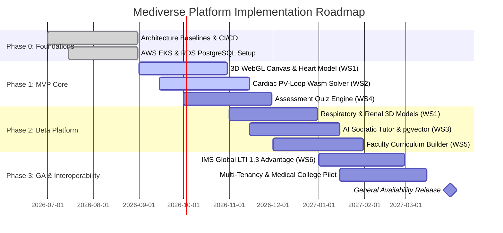

# Chapter 1 — Vision & Strategy

**Requirement IDs:** **IRD-0001 → IRD-0016**

---

# Chapter Overview

The **Vision & Strategy** chapter establishes the strategic foundation for implementing the Mediverse Enterprise Healthcare Platform. It defines the long-term vision, business drivers, implementation philosophy, strategic objectives, guiding principles, success criteria, governance alignment, and transformation roadmap that will direct all engineering, clinical, operational, and organizational activities throughout the implementation lifecycle.

This chapter serves as the executive blueprint for the Implementation Roadmap (IRD) and ensures that every implementation activity aligns with Mediverse's mission of delivering a secure, scalable, cloud-native, AI-enabled, interoperable, and regulatory-compliant healthcare ecosystem.

The implementation strategy aligns with:

* Enterprise Architecture
* Product Strategy
* Digital Transformation Objectives
* Healthcare Regulations
* Engineering Excellence
* Cloud-Native Principles
* DevSecOps
* Zero Trust Security
* Domain-Driven Design
* Event-Driven Architecture
* Continuous Delivery
* Continuous Improvement

---

# 1.1 Purpose

The Enterprise Vision & Strategy shall:

* Define enterprise implementation goals.
* Align business and technology.
* Establish implementation principles.
* Define transformation objectives.
* Ensure organizational alignment.
* Enable predictable execution.
* Support regulatory compliance.
* Promote engineering excellence.
* Reduce implementation risk.
* Establish measurable success.

---

### IRD-0001

The Mediverse implementation program shall align every engineering, operational, security, infrastructure, and business initiative with the enterprise vision, strategic objectives, and approved implementation roadmap.

---

### IRD-0002

Implementation activities shall support secure, scalable, interoperable, cloud-native, AI-enabled healthcare services while maintaining patient safety, privacy, regulatory compliance, and operational resilience.

---

# 1.2 Enterprise Vision

```text
                    Executive Leadership
                            │
                            ▼
                  Enterprise Business Vision
                            │
                            ▼
                Digital Transformation Strategy
                            │
                            ▼
        Enterprise Architecture & Governance
                            │
        ┌───────────────────┼────────────────────┐
        ▼                   ▼                    ▼
 Business Goals     Engineering Goals    Clinical Goals
        │                   │                    │
        └───────────────────┼────────────────────┘
                            ▼
              Mediverse Implementation Program
                            │
                            ▼
      Continuous Delivery → Continuous Improvement
```

The Enterprise Vision provides a unified direction for business transformation, technology modernization, healthcare innovation, and operational excellence.

---

### IRD-0003

The implementation roadmap shall maintain complete traceability between business objectives, product requirements, architectural decisions, engineering deliverables, testing activities, and operational outcomes.

---

### IRD-0004

Strategic implementation decisions shall prioritize patient safety, clinical effectiveness, cybersecurity, regulatory compliance, operational continuity, and long-term platform sustainability.

---

# 1.3 Strategic Objectives

The implementation program shall pursue the following strategic objectives:

* Digital Healthcare Transformation
* Enterprise Platform Modernization
* Cloud-Native Adoption
* AI-Assisted Healthcare
* Regulatory Compliance
* Clinical Workflow Optimization
* Operational Excellence
* Security by Design
* Scalable Architecture
* Continuous Innovation

---

### IRD-0005

Implementation planning shall support incremental delivery of business value through phased execution while minimizing disruption to healthcare operations.

---

### IRD-0006

Strategic objectives shall be reviewed periodically to ensure continued alignment with organizational priorities, regulatory obligations, emerging technologies, and stakeholder expectations.

---

# 1.4 Guiding Principles

Enterprise implementation shall follow these principles:

* Business Value First
* Patient-Centric Design
* Security by Design
* Privacy by Default
* Cloud First
* API First
* Automation First
* DevSecOps
* Infrastructure as Code
* Continuous Testing
* Observability by Default
* Zero Trust Security
* High Availability
* Scalability
* Engineering Excellence

---

### IRD-0007

Implementation activities shall follow approved enterprise architecture principles, coding standards, security policies, infrastructure standards, and quality engineering practices.

---

### IRD-0008

Automation shall be incorporated throughout the implementation lifecycle wherever technically feasible to improve consistency, efficiency, quality, and operational reliability.

---

# 1.5 Business Outcomes

Expected implementation outcomes include:

* Improved Patient Experience
* Improved Clinical Efficiency
* Reduced Operational Costs
* Increased Platform Availability
* Enhanced Cybersecurity
* Regulatory Compliance
* Faster Feature Delivery
* Higher Software Quality
* Improved Data Governance
* Enterprise Scalability

---

### IRD-0009

Each implementation milestone shall demonstrate measurable business outcomes using approved enterprise key performance indicators (KPIs) and success metrics.

---

### IRD-0010

Business outcome measurements shall include operational, financial, clinical, technical, security, and customer experience indicators.

---

# 1.6 Success Factors

Critical Success Factors include:

* Executive Sponsorship
* Strong Governance
* Skilled Engineering Teams
* Cross-Functional Collaboration
* Continuous Risk Management
* Effective Communication
* Automation
* Continuous Learning
* Stakeholder Engagement
* Quality Assurance

---

### IRD-0011

Implementation success shall be evaluated using approved governance metrics, milestone completion criteria, quality indicators, stakeholder satisfaction, and regulatory compliance outcomes.

---

### IRD-0012

Risks threatening strategic objectives shall be identified, assessed, prioritized, monitored, and managed through the enterprise risk management framework.

---

# 1.7 Strategic Governance

Strategic governance includes:

* Executive Steering Committee
* Enterprise Architecture Board
* Security Governance Board
* Clinical Governance Committee
* PMO
* Quality Engineering Office
* DevSecOps Leadership
* Operations Leadership

Governance ensures strategic alignment throughout the implementation lifecycle.

---

### IRD-0013

Strategic governance bodies shall review implementation progress, organizational risks, major decisions, resource allocation, and milestone achievement at defined governance intervals.

---

### IRD-0014

Significant deviations from approved implementation strategy shall require documented impact assessment and formal governance approval before execution.

---

# 1.8 Continuous Strategic Improvement

Strategic improvement activities include:

* Lessons Learned
* Strategy Reviews
* Technology Assessments
* Innovation Workshops
* Maturity Assessments
* KPI Reviews
* Benchmarking
* Continuous Optimization

Continuous improvement ensures the implementation strategy evolves alongside healthcare regulations, organizational priorities, technological innovation, and operational experience.

---

### IRD-0015

The enterprise implementation strategy shall be reviewed periodically using governance metrics, audit findings, stakeholder feedback, operational analytics, and organizational maturity assessments.

---

### IRD-0016

Strategic improvements shall incorporate engineering lessons learned, regulatory updates, healthcare best practices, emerging technologies, industry standards, and continuous organizational improvement initiatives.

---

# 1.9 Traceability

**Source Documents**

* Product Requirements Document (PRD)
* Software Requirements Specification (SRS)
* System Design Document (SDD)
* Database Design Document (DDD)
* Technical Design Document (TDD)
* API Design Specification (ADS)
* Frontend Architecture & UI/UX Design Specification (FDS)
* Security Design Document (SecDD)
* DevOps & Infrastructure Guide (DIG)
* Testing Strategy & QA Plan (TSQP)

**Referenced Standards**

* ISO 9001 — Quality Management Systems
* ISO/IEC 12207 — Software Life Cycle Processes
* ISO 31000 — Risk Management
* ISO/IEC 27001 — Information Security Management
* COBIT 2019
* ITIL 4
* TOGAF Standard
* PMBOK Guide
* Agile Manifesto
* Scrum Guide

---

# Chapter Summary

This chapter established the strategic foundation for the Mediverse Implementation Roadmap by defining the enterprise vision, implementation philosophy, strategic objectives, guiding principles, expected business outcomes, governance model, and continuous improvement approach. These principles provide a common direction for all implementation activities and ensure alignment between business strategy, enterprise architecture, engineering execution, security, compliance, and operational excellence.

---

## Part I Progress

**Completed Chapters:** **1 / 8**

**Implementation Requirement IDs Covered:** **IRD-0001 → IRD-0016**

---

## Overall IRD Progress

| Metric                         | Status                                     |
| ------------------------------ | ------------------------------------------ |
| Completed Parts                | **0 / 20**                                 |
| Completed Chapters             | **1 / 150**                                |
| Implementation Requirement IDs | **IRD-0001 → IRD-0016**                    |
| Current Part                   | **Part I – Enterprise Program Foundation** |

---

**Next:** **Chapter 2 — Business Objectives** (**IRD-0017 → IRD-0032**)

---

# 1.10 Mediverse Master Phased Release Roadmap (M0 to M4)

### IRD-0017: Master Release Milestones
The Mediverse engineering program is executed across 5 defined release milestones:

| Phase | Milestone Target | Timeline | Core Engineering Deliverables |
|---|---|---|---|
| **Phase 0** | **M0: Architecture & Foundation** | Weeks 1–4 | Monorepo baseline, Spring Boot 3.4 / Java 21, Next.js 14, PostgreSQL 16, Flyway `V1`–`V8`, CI/CD pipelines |
| **Phase 1** | **M1: 3D Multi-Organ & Cardiovascular Core** | Weeks 5–10 | ThreeCanvas WebGL2, GLSL dissection clipping shaders, Suga-Sagawa PV-loop simulator, MCQ quiz engine |
| **Phase 2** | **M2: Simulation Labs & Socratic AI** | Weeks 11–16 | Acid-Base Davenport lab, Renal Starling GFR lab, Socratic AI floating drawer (`GlobalSocraticAssistant.tsx`), SSE streaming |
| **Phase 3** | **M3: Clinical Exam Runner & CMS Review** | Weeks 17–22 | `QuizRunner.tsx`, clinical vignette bank, Bloom's Radar mastery breakdown (`ExamSummaryView.tsx`), 5-stage CMS review (`V24`) |
| **Phase 4** | **M4: Enterprise LMS Integration & GA** | Weeks 23–28 | IMS Global LTI 1.3 Advantage (OIDC, AGS, NRPS - `V26`), SCIM directory sync, multi-campus university launch |

# Implementation Roadmap (IRD)

# Part I — Enterprise Program Foundation

---

# Chapter 2 — Business Objectives

**Requirement IDs:** **IRD-0017 → IRD-0032**

---

# Chapter Overview

This chapter defines the strategic business objectives that govern the implementation of the Mediverse Enterprise Healthcare Platform. It translates the enterprise vision established in Chapter 1 into measurable implementation goals that guide engineering, clinical, operational, financial, compliance, and technology initiatives.

Business objectives ensure that every implementation activity contributes directly to organizational value creation while maintaining patient safety, regulatory compliance, operational efficiency, cybersecurity, and long-term platform sustainability.

The objectives defined in this chapter provide the basis for prioritization, investment decisions, milestone planning, governance reviews, and performance measurement throughout the implementation lifecycle.

---

# 2.1 Purpose

The Business Objectives chapter shall:

* Define measurable enterprise goals.
* Align implementation with business strategy.
* Establish organizational priorities.
* Support executive decision-making.
* Enable value-driven implementation.
* Define implementation success metrics.
* Align technology investments.
* Improve healthcare delivery.
* Enhance operational efficiency.
* Support continuous innovation.

---

### IRD-0017

The implementation program shall establish measurable business objectives that align with the enterprise vision, strategic priorities, healthcare transformation goals, and approved implementation roadmap.

---

### IRD-0018

Business objectives shall be reviewed and approved by executive leadership before implementation activities commence and shall remain traceable throughout the program lifecycle.

---

# 2.2 Strategic Business Goals

The Mediverse implementation program supports the following strategic goals:

* Improve patient outcomes.
* Enhance patient experience.
* Increase clinical efficiency.
* Improve operational excellence.
* Accelerate digital transformation.
* Strengthen cybersecurity posture.
* Achieve regulatory compliance.
* Improve financial sustainability.
* Enable data-driven decision-making.
* Foster continuous innovation.

These goals provide the strategic direction for all implementation workstreams.

---

### IRD-0019

Every implementation work package shall demonstrate alignment with one or more approved strategic business goals and document its expected organizational value.

---

### IRD-0020

Business goals shall be prioritized based on organizational impact, regulatory requirements, implementation feasibility, risk, and expected return on investment.

---

# 2.3 Business Value Framework

```text
                    Enterprise Vision
                           │
                           ▼
                  Strategic Business Goals
                           │
                           ▼
                 Business Value Objectives
                           │
        ┌──────────────────┼──────────────────┐
        ▼                  ▼                  ▼
 Clinical Value     Operational Value   Financial Value
        │                  │                  │
        └──────────────────┼──────────────────┘
                           ▼
              Implementation Deliverables
                           │
                           ▼
                Measurable Business Outcomes
```

The framework ensures that every implementation activity contributes measurable value across clinical, operational, and financial dimensions.

---

### IRD-0021

Implementation planning shall define expected business value for each major deliverable, including clinical, operational, financial, security, and compliance benefits.

---

### IRD-0022

Business value realization shall be measured using approved enterprise KPIs and reported at defined governance intervals.

---

# 2.4 Business Capability Objectives

The implementation roadmap shall enhance the following enterprise capabilities:

* Patient Lifecycle Management
* Clinical Workflow Automation
* Electronic Health Records
* Telemedicine
* AI-Assisted Decision Support
* Laboratory Integration
* Pharmacy Management
* Revenue Cycle Management
* Enterprise Reporting
* Population Health Analytics

Capability development shall occur incrementally through controlled implementation phases.

---

### IRD-0023

Business capabilities shall be implemented using phased delivery to minimize operational disruption while maximizing incremental value realization.

---

### IRD-0024

Capability implementation shall include documented ownership, acceptance criteria, operational readiness requirements, and post-deployment success metrics.

---

# 2.5 Organizational Objectives

The implementation program aims to:

* Improve collaboration.
* Standardize business processes.
* Enhance governance.
* Strengthen organizational agility.
* Improve employee productivity.
* Reduce operational complexity.
* Improve knowledge sharing.
* Support organizational scalability.

These objectives ensure sustainable organizational transformation alongside technology implementation.

---

### IRD-0025

Organizational change initiatives shall accompany technology implementation to ensure successful adoption, workforce readiness, and sustainable operational improvements.

---

### IRD-0026

Training, communication, and stakeholder engagement plans shall support achievement of organizational objectives throughout the implementation lifecycle.

---

# 2.6 Financial Objectives

Financial objectives include:

* Optimize implementation costs.
* Improve resource utilization.
* Reduce operational expenses.
* Increase return on technology investments.
* Improve infrastructure efficiency.
* Minimize implementation rework.
* Enhance budget predictability.
* Support long-term sustainability.

Financial planning shall balance innovation with responsible investment management.

---

### IRD-0027

Implementation expenditures shall be monitored against approved budgets using enterprise financial governance processes and periodic variance analysis.

---

### IRD-0028

Investment decisions shall consider total cost of ownership (TCO), expected business value, operational impact, implementation risk, and long-term sustainability.

---

# 2.7 Success Measurements

Business objective achievement shall be measured using:

* Clinical KPIs
* Operational KPIs
* Financial KPIs
* Customer Satisfaction
* Regulatory Compliance
* Security Metrics
* Platform Availability
* Deployment Frequency
* Service Reliability
* User Adoption

Performance measurements enable objective evaluation of implementation success.

---

### IRD-0029

Business objective performance shall be evaluated using standardized enterprise metrics, dashboards, and executive reporting mechanisms.

---

### IRD-0030

Corrective actions shall be initiated whenever business performance indicators deviate significantly from approved targets or organizational expectations.

---

# 2.8 Continuous Business Alignment

Business objectives shall evolve in response to:

* Regulatory changes.
* Market conditions.
* Healthcare innovations.
* Organizational priorities.
* Technology advancements.
* Stakeholder feedback.
* Operational performance.
* Emerging risks.

Continuous alignment ensures the implementation roadmap remains relevant and effective throughout the program.

---

### IRD-0031

Business objectives shall undergo periodic governance reviews to ensure continued alignment with enterprise strategy, stakeholder expectations, and regulatory obligations.

---

### IRD-0032

Approved changes to business objectives shall be communicated through established governance processes and reflected in implementation planning, prioritization, and performance measurement.

---

# 2.9 Traceability

**Source Documents**

* Product Requirements Document (PRD)
* Software Requirements Specification (SRS)
* System Design Document (SDD)
* Database Design Document (DDD)
* Technical Design Document (TDD)
* API Design Specification (ADS)
* Frontend Architecture & UI/UX Design Specification (FDS)
* Security Design Document (SecDD)
* DevOps & Infrastructure Guide (DIG)
* Testing Strategy & QA Plan (TSQP)

**Referenced Standards**

* PMBOK Guide
* TOGAF Standard
* ISO 9001 — Quality Management Systems
* ISO 31000 — Risk Management
* COBIT 2019
* ITIL 4
* Agile Manifesto
* Scrum Guide

---

# Chapter Summary

This chapter translated the enterprise vision into measurable business objectives that guide the implementation of the Mediverse platform. It established strategic goals, a business value framework, capability objectives, organizational and financial objectives, performance measurements, and governance mechanisms to ensure that every implementation activity delivers tangible value while remaining aligned with enterprise strategy.

---

## Part I Progress

**Completed Chapters:** **2 / 8**

**Implementation Requirement IDs Covered:** **IRD-0001 → IRD-0032**

---

## Overall IRD Progress

| Metric                         | Status                                     |
| ------------------------------ | ------------------------------------------ |
| Completed Parts                | **0 / 20**                                 |
| Completed Chapters             | **2 / 150**                                |
| Implementation Requirement IDs | **IRD-0001 → IRD-0032**                    |
| Current Part                   | **Part I – Enterprise Program Foundation** |

---

### Next Chapter

**Chapter 3 — Success Criteria**
**Requirement IDs:** **IRD-0033 → IRD-0048**

# Implementation Roadmap (IRD)

# Part I — Enterprise Program Foundation

---

# Chapter 3 — Success Criteria

**Requirement IDs:** **IRD-0033 → IRD-0048**

---

# Chapter Overview

This chapter establishes the measurable success criteria that determine whether the Mediverse Enterprise Healthcare Platform implementation achieves its intended business, technical, operational, clinical, security, and regulatory objectives. Success criteria provide objective benchmarks for governance decisions, milestone approvals, quality assurance, stakeholder acceptance, and overall program completion.

The success criteria defined in this chapter apply throughout the implementation lifecycle and enable transparent measurement of progress, performance, value realization, and organizational readiness.

---

# 3.1 Purpose

The Success Criteria chapter shall:

* Define measurable implementation outcomes.
* Establish objective evaluation methods.
* Align success with business objectives.
* Support governance decision-making.
* Enable milestone approvals.
* Measure implementation quality.
* Validate stakeholder expectations.
* Ensure regulatory readiness.
* Assess operational maturity.
* Promote continuous improvement.

---

### IRD-0033

The implementation program shall define measurable success criteria for every program phase, milestone, deliverable, and work package to ensure objective evaluation and governance oversight.

---

### IRD-0034

Success criteria shall be approved by executive leadership, the Program Management Office (PMO), Enterprise Architecture Board, Clinical Governance Committee, and Information Security Office prior to implementation execution.

---

# 3.2 Enterprise Success Framework

```text
                    Enterprise Vision
                           │
                           ▼
                  Strategic Objectives
                           │
                           ▼
                  Success Criteria Framework
                           │
      ┌────────────────────┼────────────────────┐
      ▼                    ▼                    ▼
 Business Success    Technical Success   Clinical Success
      │                    │                    │
      ├────────────────────┼────────────────────┤
      ▼                    ▼                    ▼
Security Success    Operational Success  Compliance Success
                           │
                           ▼
               Enterprise Implementation Success
```

The framework ensures that implementation success is evaluated across multiple organizational dimensions rather than relying solely on project completion metrics.

---

### IRD-0035

Success evaluation shall consider business, technical, operational, clinical, financial, security, and regulatory performance indicators collectively.

---

### IRD-0036

Implementation shall not be considered complete until all mandatory enterprise success criteria have been achieved or formally accepted through governance approval.

---

# 3.3 Business Success Criteria

Business success shall include:

* Achievement of strategic objectives.
* Improved patient experience.
* Enhanced clinical productivity.
* Increased operational efficiency.
* Reduced manual processes.
* Improved stakeholder satisfaction.
* Budget adherence.
* Expected return on investment (ROI).

Business value realization shall be continuously measured throughout implementation.

---

### IRD-0037

Business success metrics shall be defined before implementation begins and reviewed at each major governance milestone.

---

### IRD-0038

Business benefits shall be validated using approved enterprise KPIs, executive dashboards, financial reports, and stakeholder feedback.

---

# 3.4 Technical Success Criteria

Technical implementation shall achieve:

* Architecture compliance.
* Platform scalability.
* High availability.
* Fault tolerance.
* Performance objectives.
* API interoperability.
* Infrastructure automation.
* Cloud-native readiness.
* Secure software delivery.
* Maintainable codebase.

Technical quality shall be verified through engineering reviews and validation activities.

---

### IRD-0039

All technical deliverables shall comply with approved enterprise architecture, coding standards, API standards, infrastructure standards, and security requirements.

---

### IRD-0040

Technical acceptance shall require successful completion of architecture validation, performance testing, security testing, deployment validation, and operational readiness assessments.

---

# 3.5 Clinical Success Criteria

Clinical implementation shall support:

* Patient safety.
* Clinical workflow efficiency.
* Decision support effectiveness.
* Accurate medical records.
* Timely information availability.
* Healthcare interoperability.
* Clinical documentation quality.
* Improved care coordination.

Clinical outcomes shall remain the highest implementation priority.

---

### IRD-0041

Clinical functionality shall undergo validation by qualified healthcare professionals prior to production deployment.

---

### IRD-0042

Implementation activities shall not compromise patient safety, clinical decision-making, or continuity of healthcare services.

---

# 3.6 Security & Compliance Success Criteria

Implementation shall achieve:

* Zero Critical Security Vulnerabilities.
* Regulatory compliance.
* Data privacy protection.
* Secure identity management.
* Audit readiness.
* Encryption compliance.
* Access control enforcement.
* Security monitoring readiness.

Security shall be integrated into every implementation phase.

---

### IRD-0043

Production deployment shall require successful completion of security assessments, penetration testing, compliance validation, and executive security approval.

---

### IRD-0044

Security and compliance metrics shall be continuously monitored throughout implementation and reported through enterprise governance dashboards.

---

# 3.7 Operational Success Criteria

Operational readiness includes:

* Stable production deployment.
* Monitoring coverage.
* Logging availability.
* Incident response readiness.
* Disaster recovery capability.
* Backup validation.
* Capacity planning.
* Support team preparedness.

Operational excellence ensures long-term platform sustainability.

---

### IRD-0045

Operational readiness shall be validated through production readiness reviews, disaster recovery exercises, operational simulations, and support team acceptance.

---

### IRD-0046

Operational documentation, runbooks, monitoring dashboards, and incident management procedures shall be completed before production go-live.

---

# 3.8 Continuous Improvement Success

Long-term implementation success shall include:

* Lessons learned.
* Process optimization.
* Engineering maturity growth.
* Technology modernization.
* Automation improvements.
* User feedback incorporation.
* Performance optimization.
* Continuous innovation.

Success shall extend beyond project completion into ongoing organizational improvement.

---

### IRD-0047

The implementation program shall establish continuous improvement mechanisms to monitor organizational performance, identify optimization opportunities, and support future platform evolution.

---

### IRD-0048

Success criteria shall be periodically reviewed and updated to reflect changes in business strategy, healthcare regulations, technology advancements, and organizational priorities.

---

# 3.9 Traceability

### Source Documents

* Product Requirements Document (PRD)
* Software Requirements Specification (SRS)
* System Design Document (SDD)
* Database Design Document (DDD)
* Technical Design Document (TDD)
* API Design Specification (ADS)
* Frontend Architecture & UI/UX Design Specification (FDS)
* Security Design Document (SecDD)
* DevOps & Infrastructure Guide (DIG)
* Testing Strategy & QA Plan (TSQP)

### Referenced Standards

* PMBOK Guide
* TOGAF Standard
* ISO 9001 — Quality Management Systems
* ISO/IEC 27001 — Information Security Management
* ISO 31000 — Risk Management
* COBIT 2019
* ITIL 4
* Agile Manifesto
* Scrum Guide

---

# Chapter Summary

This chapter established the enterprise-wide success criteria for implementing the Mediverse platform. It defined measurable business, technical, clinical, security, compliance, and operational outcomes that provide objective standards for governance reviews, milestone approvals, production readiness, and overall program success. These criteria ensure that implementation quality is evaluated holistically and remains aligned with organizational strategy and healthcare excellence.

---

## Part I Progress

**Completed Chapters:** **3 / 8**

**Implementation Requirement IDs Covered:** **IRD-0001 → IRD-0048**

---

## Overall IRD Progress

| Metric                         | Status                                     |
| ------------------------------ | ------------------------------------------ |
| Completed Parts                | **0 / 20**                                 |
| Completed Chapters             | **3 / 150**                                |
| Implementation Requirement IDs | **IRD-0001 → IRD-0048**                    |
| Current Part                   | **Part I – Enterprise Program Foundation** |

---

### Next Chapter

**Chapter 4 — Program Governance**
**Requirement IDs:** **IRD-0049 → IRD-0064**

# Implementation Roadmap (IRD)

# Part I — Enterprise Program Foundation

---

# Chapter 4 — Program Governance

**Requirement IDs:** **IRD-0049 → IRD-0064**

---

# Chapter Overview

Program Governance establishes the leadership structure, decision-making framework, accountability model, oversight mechanisms, escalation paths, and governance processes that direct the successful implementation of the Mediverse Enterprise Healthcare Platform. Effective governance ensures that implementation activities remain aligned with enterprise strategy, regulatory obligations, architectural principles, financial objectives, and clinical priorities throughout the program lifecycle.

The governance framework enables transparent decision-making, risk management, resource optimization, quality assurance, and stakeholder engagement while maintaining compliance with healthcare regulations and enterprise policies.

---

# 4.1 Purpose

The Program Governance chapter shall:

* Establish governance structure.
* Define decision-making authority.
* Ensure executive oversight.
* Manage enterprise risks.
* Support strategic alignment.
* Promote accountability.
* Enable effective communication.
* Standardize governance processes.
* Monitor implementation performance.
* Ensure regulatory compliance.

---

### IRD-0049

The Mediverse implementation program shall operate under a formally approved governance framework defining decision authority, accountability, reporting relationships, and oversight responsibilities for all implementation activities.

---

### IRD-0050

Governance processes shall ensure alignment between enterprise strategy, business objectives, technical implementation, regulatory compliance, and organizational priorities.

---

# 4.2 Enterprise Governance Structure

```text
                        Board of Directors
                               │
                               ▼
                     Executive Steering Committee
                               │
          ┌────────────────────┼────────────────────┐
          ▼                    ▼                    ▼
      Program PMO     Enterprise Architecture    Clinical Governance
          │                 Review Board              Committee
          ├────────────────────┼────────────────────┤
          ▼                    ▼                    ▼
 Information Security   DevSecOps Council    Quality Assurance Office
          │                    │                    │
          └────────────────────┼────────────────────┘
                               ▼
                     Engineering Delivery Teams
                               │
                               ▼
                     Operations & Support Teams
```

The governance hierarchy ensures executive sponsorship while empowering specialized governance bodies to oversee architecture, security, quality, clinical safety, and operational readiness.

---

### IRD-0051

The governance model shall define organizational reporting lines, escalation paths, decision authorities, and accountability mechanisms across all implementation workstreams.

---

### IRD-0052

Each governance body shall maintain documented terms of reference, responsibilities, membership, meeting cadence, decision-making authority, and reporting obligations.

---

# 4.3 Governance Bodies

The implementation program shall establish the following governance bodies:

* Executive Steering Committee
* Program Management Office (PMO)
* Enterprise Architecture Review Board
* Information Security Governance Board
* Clinical Governance Committee
* Quality Assurance Office
* DevSecOps Council
* Change Advisory Board (CAB)
* Risk Management Committee
* Operations Readiness Board

Each governance body performs specialized oversight while collaborating through defined governance processes.

---

### IRD-0053

Governance responsibilities shall be clearly assigned to avoid duplication, conflicts of authority, or gaps in organizational oversight.

---

### IRD-0054

Governance committees shall maintain complete records of decisions, action items, approvals, risks, and implementation recommendations.

---

# 4.4 Decision-Making Framework

Program decisions shall follow defined governance principles:

* Evidence-based decision making.
* Business value prioritization.
* Patient safety first.
* Security by design.
* Regulatory compliance.
* Risk-informed approvals.
* Architectural consistency.
* Financial responsibility.
* Operational sustainability.
* Continuous improvement.

Major implementation decisions shall require documented evaluation before approval.

---

### IRD-0055

Significant implementation decisions shall undergo documented impact analysis covering business, technical, security, operational, financial, clinical, and regulatory considerations.

---

### IRD-0056

Decisions affecting enterprise architecture, security posture, patient safety, regulatory compliance, or production operations shall require approval from the appropriate governance authority.

---

# 4.5 Governance Processes

Governance activities include:

* Strategy reviews.
* Portfolio reviews.
* Architecture reviews.
* Security reviews.
* Risk reviews.
* Budget reviews.
* Milestone approvals.
* Change approvals.
* Quality assessments.
* Production readiness reviews.

These processes ensure continuous oversight throughout the implementation lifecycle.

---

### IRD-0057

Governance reviews shall occur at predefined milestones and whenever significant changes, risks, or issues arise during implementation.

---

### IRD-0058

All governance activities shall produce documented decisions, assigned actions, due dates, responsible owners, and follow-up mechanisms.

---

# 4.6 Escalation & Issue Management

The governance framework shall define escalation procedures for:

* Strategic risks.
* Schedule deviations.
* Budget overruns.
* Security incidents.
* Clinical safety concerns.
* Regulatory issues.
* Architecture deviations.
* Resource conflicts.
* Vendor issues.
* Production blockers.

Escalation shall ensure timely executive attention to issues affecting program success.

---

### IRD-0059

Implementation issues exceeding defined risk thresholds shall be escalated through approved governance channels without unnecessary delay.

---

### IRD-0060

Escalated issues shall include documented impact assessments, mitigation options, recommended actions, responsible owners, and target resolution dates.

---

# 4.7 Governance Performance

Governance effectiveness shall be measured using:

* Decision turnaround time.
* Milestone approval rates.
* Risk resolution performance.
* Change approval efficiency.
* Compliance audit outcomes.
* Stakeholder satisfaction.
* Issue resolution time.
* Governance meeting effectiveness.
* Program health indicators.
* Delivery predictability.

Performance metrics enable continuous improvement of governance processes.

---

### IRD-0061

Governance performance shall be evaluated periodically using approved enterprise KPIs and continuous improvement initiatives.

---

### IRD-0062

Governance metrics shall be reported through executive dashboards to support transparent oversight and informed decision-making.

---

# 4.8 Continuous Governance Improvement

The governance framework shall evolve through:

* Lessons learned.
* Governance maturity assessments.
* Internal audits.
* External audits.
* Regulatory updates.
* Industry best practices.
* Technology evolution.
* Organizational feedback.

Continuous improvement ensures governance remains effective throughout the program lifecycle.

---

### IRD-0063

Governance policies, procedures, and organizational structures shall be reviewed periodically to ensure continued effectiveness and alignment with enterprise objectives.

---

### IRD-0064

Improvements to governance processes shall be documented, approved through appropriate governance channels, communicated to stakeholders, and incorporated into future implementation activities.

---

# 4.9 Traceability

## Source Documents

* Product Requirements Document (PRD)
* Software Requirements Specification (SRS)
* System Design Document (SDD)
* Database Design Document (DDD)
* Technical Design Document (TDD)
* API Design Specification (ADS)
* Frontend Architecture & UI/UX Design Specification (FDS)
* Security Design Document (SecDD)
* DevOps & Infrastructure Guide (DIG)
* Testing Strategy & QA Plan (TSQP)

## Referenced Standards

* PMBOK® Guide
* TOGAF® Standard
* COBIT® 2019
* ITIL® 4
* ISO 9001 — Quality Management Systems
* ISO 31000 — Risk Management
* ISO/IEC 27001 — Information Security Management
* Agile Manifesto
* Scrum Guide

---

# Chapter Summary

This chapter established the governance framework for the Mediverse implementation program by defining governance structures, oversight bodies, decision-making processes, escalation mechanisms, performance measurement, and continuous governance improvement practices. These governance controls ensure that implementation remains aligned with strategic objectives, architectural standards, security requirements, regulatory obligations, and operational excellence throughout the program lifecycle.

---

## Part I Progress

**Completed Chapters:** **4 / 8**

**Implementation Requirement IDs Covered:** **IRD-0001 → IRD-0064**

---

## Overall IRD Progress

| Metric                         | Status                                     |
| ------------------------------ | ------------------------------------------ |
| Completed Parts                | **0 / 20**                                 |
| Completed Chapters             | **4 / 150**                                |
| Implementation Requirement IDs | **IRD-0001 → IRD-0064**                    |
| Current Part                   | **Part I – Enterprise Program Foundation** |

---

## Next Chapter

**Chapter 5 — PMO Organization**
**Requirement IDs:** **IRD-0065 → IRD-0080**

# Implementation Roadmap (IRD)

# Part I — Enterprise Program Foundation

---

# Chapter 5 — PMO Organization

**Requirement IDs:** **IRD-0065 → IRD-0080**

---

# Chapter Overview

The **Program Management Office (PMO)** serves as the central governance and execution authority responsible for planning, coordinating, monitoring, controlling, and reporting all implementation activities for the Mediverse Enterprise Healthcare Platform. The PMO ensures strategic alignment, standardized delivery practices, effective resource utilization, risk management, stakeholder communication, quality assurance, and successful realization of business objectives throughout the implementation lifecycle.

The PMO acts as the integration point between executive leadership, enterprise architects, engineering teams, clinical stakeholders, security organizations, DevSecOps, quality assurance, vendors, and operational support teams.

---

# 5.1 Purpose

The PMO Organization shall:

* Establish centralized program management.
* Coordinate enterprise-wide implementation.
* Standardize delivery methodologies.
* Manage schedules and milestones.
* Monitor risks and issues.
* Optimize resource utilization.
* Govern financial performance.
* Ensure stakeholder communication.
* Support executive decision-making.
* Drive continuous improvement.

---

### IRD-0065

The Mediverse implementation program shall establish a centralized Program Management Office (PMO) responsible for governance, planning, execution oversight, reporting, and coordination across all implementation workstreams.

---

### IRD-0066

The PMO shall operate using standardized project management methodologies, governance frameworks, reporting standards, and performance measurement practices approved by executive leadership.

---

# 5.2 PMO Organizational Structure

```text
                           Executive Steering Committee
                                       │
                                       ▼
                           Chief Program Director
                                       │
                                       ▼
                        Program Management Office (PMO)
                                       │
      ┌───────────────┬────────────────┼───────────────┬───────────────┐
      ▼               ▼                ▼               ▼
 Portfolio      Delivery        Risk & Quality    Financial
 Management     Management        Management      Management
      │               │                │               │
      ├───────────────┼────────────────┼───────────────┤
      ▼               ▼                ▼               ▼
 Architecture   Engineering      DevSecOps      Operations
 Coordination   Coordination     Coordination   Coordination
                                       │
                                       ▼
                          Project Managers & Scrum Masters
                                       │
                                       ▼
                              Delivery Teams
```

The PMO organizational structure ensures centralized oversight while enabling distributed execution across specialized implementation teams.

---

### IRD-0067

The PMO organizational structure shall define reporting relationships, accountability, decision authority, communication channels, and escalation mechanisms for all implementation participants.

---

### IRD-0068

PMO organizational changes shall be documented, approved through governance processes, and communicated to all affected stakeholders before implementation.

---

# 5.3 PMO Functional Responsibilities

The PMO shall be responsible for:

* Enterprise planning.
* Program governance.
* Portfolio management.
* Resource planning.
* Schedule management.
* Budget management.
* Risk management.
* Quality oversight.
* Vendor coordination.
* Executive reporting.
* Benefits realization.
* Change coordination.

Each function contributes to predictable and controlled implementation delivery.

---

### IRD-0069

The PMO shall coordinate implementation activities across engineering, infrastructure, security, quality assurance, clinical operations, and business workstreams to ensure integrated program execution.

---

### IRD-0070

PMO responsibilities shall include continuous monitoring of schedule performance, resource utilization, financial health, implementation quality, and organizational risks.

---

# 5.4 PMO Roles & Responsibilities

Key PMO roles include:

* Chief Program Director
* PMO Manager
* Portfolio Manager
* Program Manager
* Project Manager
* PMO Analyst
* Financial Controller
* Risk Manager
* Quality Manager
* Communications Manager
* Vendor Manager
* Reporting Specialist

Each role shall have documented responsibilities and authority levels.

---

### IRD-0071

All PMO roles shall maintain documented job descriptions, responsibility matrices, reporting relationships, competency requirements, and delegated authority.

---

### IRD-0072

Personnel assigned to PMO leadership positions shall possess appropriate qualifications, implementation experience, leadership capabilities, and healthcare program management knowledge.

---

# 5.5 PMO Governance Processes

The PMO shall manage:

* Portfolio reviews.
* Milestone approvals.
* Executive reporting.
* Change governance.
* Budget reviews.
* Resource reviews.
* Risk assessments.
* Issue management.
* Dependency tracking.
* Performance reporting.

Governance processes enable consistent oversight throughout implementation.

---

### IRD-0073

The PMO shall conduct regular governance reviews to evaluate implementation progress, identify deviations, approve corrective actions, and support executive decision-making.

---

### IRD-0074

Governance decisions shall be documented, communicated, tracked, and incorporated into subsequent implementation planning activities.

---

# 5.6 PMO Performance Management

Performance indicators include:

* Milestone achievement.
* Schedule adherence.
* Budget variance.
* Resource utilization.
* Risk exposure.
* Issue resolution time.
* Quality performance.
* Stakeholder satisfaction.
* Benefits realization.
* Delivery predictability.

Performance shall be measured using enterprise dashboards.

---

### IRD-0075

The PMO shall maintain enterprise dashboards providing real-time visibility into implementation performance, financial status, risks, quality indicators, and milestone achievement.

---

### IRD-0076

Performance metrics shall support proactive decision-making, continuous optimization, and executive governance reporting.

---

# 5.7 Stakeholder Coordination

The PMO shall coordinate communication with:

* Executive Leadership.
* Clinical Leadership.
* Engineering Teams.
* Enterprise Architects.
* DevSecOps Teams.
* Security Office.
* Quality Assurance.
* Vendors.
* Regulatory Authorities.
* Operations Teams.

Effective communication ensures organizational alignment.

---

### IRD-0077

The PMO shall maintain stakeholder communication plans defining reporting frequency, communication channels, escalation procedures, and information distribution responsibilities.

---

### IRD-0078

Significant implementation events, risks, and governance decisions shall be communicated promptly to affected stakeholders using approved communication mechanisms.

---

# 5.8 PMO Continuous Improvement

The PMO shall continuously improve through:

* Lessons learned.
* Delivery retrospectives.
* Process optimization.
* Maturity assessments.
* Automation initiatives.
* Benchmarking.
* Training programs.
* Governance reviews.

Continuous improvement enhances delivery effectiveness and organizational maturity.

---

### IRD-0079

The PMO shall periodically assess its organizational maturity, delivery effectiveness, governance performance, and operational efficiency using recognized project management maturity models.

---

### IRD-0080

Improvement initiatives shall be documented, prioritized, approved, implemented, and measured to ensure continual enhancement of PMO capabilities and implementation outcomes.

---

# 5.9 Traceability

## Source Documents

* Product Requirements Document (PRD)
* Software Requirements Specification (SRS)
* System Design Document (SDD)
* Database Design Document (DDD)
* Technical Design Document (TDD)
* API Design Specification (ADS)
* Frontend Architecture & UI/UX Design Specification (FDS)
* Security Design Document (SecDD)
* DevOps & Infrastructure Guide (DIG)
* Testing Strategy & QA Plan (TSQP)

## Referenced Standards

* PMBOK® Guide
* PMI Standard for Program Management
* PMI PMO Practice Guide
* TOGAF® Standard
* COBIT® 2019
* ITIL® 4
* ISO 9001 — Quality Management Systems
* ISO 31000 — Risk Management
* Agile Manifesto
* Scrum Guide

---

# Chapter Summary

This chapter established the Program Management Office (PMO) organization for the Mediverse implementation program. It defined the PMO's organizational structure, responsibilities, governance processes, performance management framework, stakeholder coordination model, and continuous improvement practices. The PMO serves as the central authority responsible for integrating governance, planning, execution oversight, risk management, financial control, quality assurance, and stakeholder communication across the enterprise implementation.

---

## Part I Progress

**Completed Chapters:** **5 / 8**

**Implementation Requirement IDs Covered:** **IRD-0001 → IRD-0080**

---

## Overall IRD Progress

| Metric                         | Status                                     |
| ------------------------------ | ------------------------------------------ |
| Completed Parts                | **0 / 20**                                 |
| Completed Chapters             | **5 / 150**                                |
| Implementation Requirement IDs | **IRD-0001 → IRD-0080**                    |
| Current Part                   | **Part I – Enterprise Program Foundation** |

---

## Next Chapter

**Chapter 6 — Roles & Responsibilities (RACI Matrix)**

**Requirement IDs:** **IRD-0081 → IRD-0096**

# Implementation Roadmap (IRD)

# Part I — Enterprise Program Foundation

---

# Chapter 6 — Roles & Responsibilities (RACI Matrix)

**Requirement IDs:** **IRD-0081 → IRD-0096**

---

# Chapter Overview

This chapter defines the organizational roles, responsibilities, accountability model, and the **RACI (Responsible, Accountable, Consulted, Informed)** framework for the Mediverse Enterprise Healthcare Platform implementation program. A clearly defined responsibility model ensures that every implementation activity has an assigned owner, decision authority, supporting contributors, and informed stakeholders, thereby eliminating ambiguity, reducing execution risk, and improving governance effectiveness.

The RACI framework applies across all implementation phases, including program governance, enterprise architecture, engineering, clinical operations, security, DevSecOps, quality assurance, infrastructure, operations, and vendor management.

---

# 6.1 Purpose

The Roles & Responsibilities chapter shall:

* Define implementation ownership.
* Establish accountability.
* Clarify decision authority.
* Eliminate responsibility conflicts.
* Improve cross-functional collaboration.
* Support governance.
* Enable effective communication.
* Improve execution efficiency.
* Strengthen compliance.
* Ensure operational transparency.

---

### IRD-0081

The implementation program shall establish a documented responsibility framework defining ownership, accountability, consultation, and communication responsibilities for every major implementation activity.

---

### IRD-0082

Every implementation deliverable, milestone, work package, and governance activity shall have a clearly identified accountable owner responsible for successful completion.

---

# 6.2 Enterprise Responsibility Model

```text
                    Executive Steering Committee
                               │
                               A
                               │
                     Chief Program Director
                               │
                               A
          ┌────────────────────┼────────────────────┐
          ▼                    ▼                    ▼
     Enterprise          Engineering         Clinical
     Architecture          Delivery         Leadership
          │                    │                    │
          R                    R                    R
          ├────────────────────┼────────────────────┤
          ▼                    ▼                    ▼
     Security Office      DevSecOps Team      QA Team
          │                    │                    │
          C                    R                    R
          └────────────────────┼────────────────────┘
                               ▼
                        Operations Team
                               I
```

**Legend**

* **R** – Responsible
* **A** – Accountable
* **C** – Consulted
* **I** – Informed

---

### IRD-0083

The enterprise responsibility model shall ensure that accountability is assigned to a single organizational role for each implementation activity while allowing multiple responsible contributors where appropriate.

---

### IRD-0084

Responsibility assignments shall prevent overlapping authority, conflicting ownership, and unassigned implementation activities.

---

# 6.3 Key Implementation Roles

The implementation program shall define responsibilities for the following primary roles:

* Executive Sponsor
* Executive Steering Committee
* Chief Program Director
* PMO Manager
* Enterprise Architect
* Solution Architect
* Technical Lead
* Product Owner
* Scrum Master
* Engineering Manager
* Software Engineer
* DevSecOps Engineer
* Platform Engineer
* Cloud Engineer
* Database Administrator
* Security Architect
* Security Engineer
* QA Manager
* Test Engineer
* Clinical Lead
* Business Analyst
* UX/UI Lead
* Data Engineer
* AI/ML Engineer
* Operations Manager
* Site Reliability Engineer (SRE)
* Support Manager
* Vendor Manager
* Compliance Officer

---

### IRD-0085

Each implementation role shall have documented responsibilities, authority limits, competency requirements, reporting relationships, and escalation procedures.

---

### IRD-0086

Role definitions shall be reviewed periodically to ensure continued alignment with organizational structure, implementation scope, and governance requirements.

---

# 6.4 Enterprise RACI Matrix

| Implementation Activity   | Exec Sponsor | PMO | Enterprise Architect | Engineering | Security |  QA | Clinical | Operations |
| ------------------------- | :----------: | :-: | :------------------: | :---------: | :------: | :-: | :------: | :--------: |
| Project Approval          |       A      |  R  |           C          |      I      |     I    |  I  |     C    |      I     |
| Architecture Approval     |       I      |  C  |           A          |      R      |     C    |  I  |     C    |      I     |
| Infrastructure Deployment |       I      |  C  |           C          |      R      |     C    |  I  |     I    |      A     |
| Security Review           |       I      |  C  |           C          |      R      |     A    |  C  |     I    |      I     |
| Clinical Validation       |       I      |  C  |           I          |      C      |     I    |  R  |     A    |      I     |
| Production Deployment     |       C      |  A  |           C          |      R      |     C    |  C  |     I    |      R     |
| Go-Live Approval          |       A      |  R  |           C          |      C      |     C    |  C  |     C    |      R     |
| Hypercare                 |       I      |  C  |           I          |      R      |     C    |  C  |     C    |      A     |

The RACI matrix shall be maintained throughout the implementation lifecycle and updated whenever organizational responsibilities change.

---

### IRD-0087

The RACI matrix shall be maintained as a controlled project artifact and updated whenever implementation scope, governance structure, or organizational responsibilities change.

---

### IRD-0088

Changes to accountability assignments shall require approval through established governance processes before becoming effective.

---

# 6.5 Decision Authority

Decision authority shall be assigned according to organizational responsibility levels.

Decision categories include:

* Strategic Decisions
* Architecture Decisions
* Security Decisions
* Clinical Decisions
* Financial Decisions
* Infrastructure Decisions
* Operational Decisions
* Release Decisions
* Change Approvals
* Production Readiness

Authority shall be delegated according to governance policies while maintaining executive oversight for high-impact decisions.

---

### IRD-0089

Decision authority shall be documented for all governance activities, ensuring that approvals are obtained from appropriately authorized personnel.

---

### IRD-0090

Delegated authority shall not supersede regulatory obligations, enterprise governance policies, or executive approval requirements.

---

# 6.6 Responsibility Management

Responsibility management shall include:

* Role onboarding.
* Responsibility communication.
* Competency assessment.
* Training.
* Performance monitoring.
* Periodic responsibility reviews.
* Succession planning.
* Knowledge transfer.

These practices ensure continuity and organizational resilience.

---

### IRD-0091

Individuals assigned implementation responsibilities shall receive appropriate training, documentation, and organizational support before assuming their assigned duties.

---

### IRD-0092

Responsibility transitions shall include formal knowledge transfer, documentation updates, and governance notification to minimize implementation disruption.

---

# 6.7 Responsibility Performance

Responsibility effectiveness shall be measured using:

* Deliverable completion.
* Schedule adherence.
* Quality metrics.
* Decision turnaround.
* Risk management.
* Stakeholder satisfaction.
* Compliance performance.
* Team collaboration.
* Knowledge sharing.
* Continuous improvement participation.

Performance measurement supports accountability and organizational learning.

---

### IRD-0093

Role performance shall be evaluated using objective implementation metrics, governance reviews, quality indicators, and organizational performance assessments.

---

### IRD-0094

Performance evaluations shall identify opportunities for coaching, process improvements, competency development, and organizational optimization.

---

# 6.8 Continuous Improvement

The responsibility framework shall evolve through:

* Organizational reviews.
* Lessons learned.
* Governance audits.
* Process improvements.
* Regulatory updates.
* Technology evolution.
* Workforce development.
* Stakeholder feedback.

Continuous improvement ensures the responsibility model remains effective as the implementation program evolves.

---

### IRD-0095

The enterprise responsibility framework shall undergo periodic governance reviews to ensure clarity, effectiveness, and continued alignment with implementation objectives.

---

### IRD-0096

Approved improvements to roles, responsibilities, and accountability assignments shall be documented, communicated, and incorporated into future implementation activities.

---

# 6.9 Traceability

## Source Documents

* Product Requirements Document (PRD)
* Software Requirements Specification (SRS)
* System Design Document (SDD)
* Database Design Document (DDD)
* Technical Design Document (TDD)
* API Design Specification (ADS)
* Frontend Architecture & UI/UX Design Specification (FDS)
* Security Design Document (SecDD)
* DevOps & Infrastructure Guide (DIG)
* Testing Strategy & QA Plan (TSQP)

## Referenced Standards

* PMBOK® Guide
* PMI Standard for Program Management
* PMI PMO Practice Guide
* ISO 9001 — Quality Management Systems
* ISO 31000 — Risk Management
* ISO/IEC 27001 — Information Security Management
* COBIT® 2019
* ITIL® 4
* Scrum Guide
* Agile Manifesto

---

# Chapter Summary

This chapter established the enterprise responsibility framework for the Mediverse implementation program by defining organizational roles, accountability, decision authority, and a standardized RACI model. The framework ensures that every implementation activity has clear ownership, governance oversight, and communication responsibilities, promoting accountability, efficient collaboration, and successful program execution.

---

## Part I Progress

**Completed Chapters:** **6 / 8**

**Implementation Requirement IDs Covered:** **IRD-0001 → IRD-0096**

---

## Overall IRD Progress

| Metric                         | Status                                     |
| ------------------------------ | ------------------------------------------ |
| Completed Parts                | **0 / 20**                                 |
| Completed Chapters             | **6 / 150**                                |
| Implementation Requirement IDs | **IRD-0001 → IRD-0096**                    |
| Current Part                   | **Part I – Enterprise Program Foundation** |

---

## Next Chapter

**Chapter 7 — Communication Plan**
**Requirement IDs:** **IRD-0097 → IRD-0112**

# Implementation Roadmap (IRD)

# Part I — Enterprise Program Foundation

---

# Chapter 7 — Communication Plan

**Requirement IDs:** **IRD-0097 → IRD-0112**

---

# Chapter Overview

The Communication Plan establishes the enterprise communication framework for the Mediverse implementation program. It defines how strategic decisions, implementation progress, risks, issues, architectural changes, security events, regulatory updates, milestones, and operational information are communicated across executive leadership, governance bodies, engineering teams, clinical stakeholders, vendors, regulatory authorities, and operational support teams.

Effective communication ensures transparency, accountability, timely decision-making, stakeholder engagement, organizational alignment, and successful execution of the implementation roadmap.

The communication framework supports both formal governance reporting and day-to-day collaboration while maintaining confidentiality, regulatory compliance, and information security.

---

# 7.1 Purpose

The Communication Plan shall:

* Establish standardized communication practices.
* Improve organizational transparency.
* Support executive decision-making.
* Enable cross-functional collaboration.
* Improve stakeholder engagement.
* Standardize reporting.
* Accelerate issue resolution.
* Ensure regulatory communication.
* Support organizational change.
* Promote implementation success.

---

### IRD-0097

The Mediverse implementation program shall establish a formal communication framework defining communication objectives, stakeholder groups, reporting mechanisms, communication channels, escalation procedures, and approval workflows.

---

### IRD-0098

Implementation communications shall be timely, accurate, consistent, secure, and aligned with enterprise governance, regulatory obligations, and information classification policies.

---

# 7.2 Enterprise Communication Framework

```text
                         Executive Steering Committee
                                    │
                           Executive Reports
                                    │
                                    ▼
                       Program Management Office (PMO)
                                    │
          ┌─────────────────────────┼─────────────────────────┐
          ▼                         ▼                         ▼
 Enterprise Architecture      Information Security      Clinical Leadership
          │                         │                         │
          ├─────────────────────────┼─────────────────────────┤
          ▼                         ▼                         ▼
 Engineering Teams          DevSecOps Teams          Quality Assurance
          │                         │                         │
          └─────────────────────────┼─────────────────────────┘
                                    ▼
                          Operations & Support Teams
                                    │
                                    ▼
                         External Vendors & Partners
```

The communication framework provides structured information flow while ensuring governance oversight, secure collaboration, and effective coordination across all implementation stakeholders.

---

### IRD-0099

The communication framework shall define approved reporting lines, communication frequencies, ownership responsibilities, and escalation paths for all implementation workstreams.

---

### IRD-0100

All official implementation communications shall follow approved governance processes and use enterprise-approved collaboration and documentation platforms.

---

# 7.3 Stakeholder Communication Matrix

The communication plan shall define communication requirements for:

* Executive Steering Committee
* Program Management Office (PMO)
* Enterprise Architects
* Engineering Leadership
* Software Development Teams
* DevSecOps Teams
* Security Office
* Clinical Leadership
* Quality Assurance
* Infrastructure Teams
* Operations Teams
* Business Owners
* Regulatory Authorities
* Vendors
* External Partners

Each stakeholder group shall receive communications appropriate to its responsibilities, authority, and information needs.

---

### IRD-0101

Communication requirements shall be documented for every stakeholder group, including communication objectives, delivery frequency, communication methods, required approvals, and confidentiality classifications.

---

### IRD-0102

Stakeholder communication plans shall be reviewed periodically to ensure continued effectiveness, completeness, and organizational alignment.

---

# 7.4 Communication Channels

Approved communication channels include:

* Executive Dashboards
* Governance Meetings
* PMO Reports
* Sprint Reviews
* Sprint Retrospectives
* Architecture Review Meetings
* Security Review Meetings
* Clinical Review Sessions
* Change Advisory Board (CAB) Meetings
* Risk Review Meetings
* Email Notifications
* Enterprise Collaboration Platforms
* Incident Management Systems
* Knowledge Base Portals
* Status Reports

All communication channels shall comply with enterprise security and data protection policies.

---

### IRD-0103

Enterprise communication channels shall provide secure, reliable, auditable, and role-based access to implementation information.

---

### IRD-0104

Sensitive implementation information shall be communicated only through approved secure communication platforms in accordance with enterprise information classification policies.

---

# 7.5 Reporting Framework

The implementation program shall produce standardized reports, including:

* Executive Status Reports
* Weekly PMO Reports
* Milestone Progress Reports
* Budget Performance Reports
* Resource Utilization Reports
* Risk Registers
* Issue Logs
* Change Requests
* Security Reports
* Compliance Reports
* Quality Metrics
* Clinical Readiness Reports
* Deployment Readiness Reports
* Benefits Realization Reports

Reports shall support informed decision-making and governance oversight.

---

### IRD-0105

Implementation reporting shall follow standardized templates, reporting schedules, approval workflows, and document retention policies.

---

### IRD-0106

Reports shall include objective performance metrics, implementation status, identified risks, mitigation activities, dependencies, and executive recommendations.

---

# 7.6 Escalation Communication

Escalation procedures shall be established for:

* Critical Risks
* Schedule Delays
* Budget Variances
* Security Incidents
* Regulatory Issues
* Clinical Safety Concerns
* Infrastructure Failures
* Vendor Performance Issues
* Resource Constraints
* Production Readiness Risks

Escalations shall follow predefined authority levels and response timelines.

---

### IRD-0107

Critical implementation issues shall be escalated immediately through approved governance channels based on defined severity classifications and response time objectives.

---

### IRD-0108

Escalation communications shall include impact assessments, recommended actions, responsible owners, target resolution dates, and governance approval requirements.

---

# 7.7 Communication Performance

Communication effectiveness shall be measured using:

* Stakeholder Satisfaction
* Report Timeliness
* Decision Turnaround Time
* Escalation Resolution Time
* Communication Accuracy
* Meeting Effectiveness
* Information Accessibility
* Collaboration Effectiveness
* Governance Participation
* Organizational Awareness

Performance measurements support continuous improvement of enterprise communication practices.

---

### IRD-0109

Communication performance shall be evaluated periodically using enterprise KPIs, stakeholder feedback, governance assessments, and organizational maturity reviews.

---

### IRD-0110

Communication metrics shall be reported through executive dashboards and used to identify opportunities for process optimization and improved stakeholder engagement.

---

# 7.8 Continuous Communication Improvement

Communication practices shall continuously improve through:

* Lessons Learned
* Communication Audits
* Stakeholder Surveys
* Governance Reviews
* Technology Enhancements
* Collaboration Improvements
* Regulatory Updates
* Process Optimization

Continuous improvement ensures communication remains effective throughout the implementation lifecycle.

---

### IRD-0111

The enterprise communication framework shall undergo periodic review to ensure alignment with organizational objectives, governance requirements, regulatory obligations, and technology capabilities.

---

### IRD-0112

Approved improvements to communication policies, reporting processes, collaboration tools, and stakeholder engagement practices shall be documented, communicated, and incorporated into future implementation activities.

---

# 7.9 Traceability

## Source Documents

* Product Requirements Document (PRD)
* Software Requirements Specification (SRS)
* System Design Document (SDD)
* Database Design Document (DDD)
* Technical Design Document (TDD)
* API Design Specification (ADS)
* Frontend Architecture & UI/UX Design Specification (FDS)
* Security Design Document (SecDD)
* DevOps & Infrastructure Guide (DIG)
* Testing Strategy & QA Plan (TSQP)

## Referenced Standards

* PMBOK® Guide
* PMI Standard for Program Management
* PMI PMO Practice Guide
* ISO 9001 — Quality Management Systems
* ISO 31000 — Risk Management
* ISO/IEC 27001 — Information Security Management
* COBIT® 2019
* ITIL® 4
* Agile Manifesto
* Scrum Guide

---

# Chapter Summary

This chapter established the enterprise communication framework for the Mediverse implementation program. It defined communication objectives, stakeholder communication requirements, reporting structures, approved communication channels, escalation procedures, performance measurements, and continuous improvement practices. The framework ensures secure, timely, transparent, and effective communication across executive leadership, governance bodies, engineering teams, clinical stakeholders, and operational organizations throughout the implementation lifecycle.

---

## Part I Progress

**Completed Chapters:** **7 / 8**

**Implementation Requirement IDs Covered:** **IRD-0001 → IRD-0112**

---

## Overall IRD Progress

| Metric                         | Status                                     |
| ------------------------------ | ------------------------------------------ |
| Completed Parts                | **0 / 20**                                 |
| Completed Chapters             | **7 / 150**                                |
| Implementation Requirement IDs | **IRD-0001 → IRD-0112**                    |
| Current Part                   | **Part I – Enterprise Program Foundation** |

---

## Next Chapter

**Chapter 8 — Project Planning Methodology** *(Beginning Part II — Planning & Project Initiation)*

**Requirement IDs:** **IRD-0113 → IRD-0128**


# Implementation Roadmap (IRD)

# Part II — Planning & Project Initiation

---

# Chapter 8 — Project Planning Methodology

**Requirement IDs:** **IRD-0113 → IRD-0128**

---

# Chapter Overview

The **Project Planning Methodology** establishes the standardized planning framework for implementing the Mediverse Enterprise Healthcare Platform. It defines how implementation activities are planned, estimated, prioritized, scheduled, governed, monitored, and continuously refined throughout the program lifecycle.

The methodology integrates predictive (Waterfall), adaptive (Agile), and continuous delivery (DevSecOps) approaches into a unified **Hybrid Enterprise Delivery Model** suitable for large-scale healthcare transformation programs. This ensures flexibility for software development while maintaining governance, compliance, auditability, and predictable delivery.

The planning methodology supports:

* Enterprise Portfolio Management
* Program Management
* Project Management
* Product Management
* Agile Delivery
* DevSecOps
* Continuous Planning
* Regulatory Compliance
* Clinical Change Management
* Risk-Based Planning

---

# 8.1 Purpose

The Project Planning Methodology shall:

* Standardize implementation planning.
* Define planning governance.
* Improve schedule predictability.
* Support iterative delivery.
* Optimize resource allocation.
* Minimize implementation risks.
* Enable continuous planning.
* Improve stakeholder visibility.
* Support regulatory compliance.
* Ensure successful delivery.

---

### IRD-0113

The Mediverse implementation program shall adopt a standardized project planning methodology that integrates governance, engineering, quality assurance, security, operations, and clinical implementation activities.

---

### IRD-0114

Project planning shall support phased implementation while enabling continuous adaptation to changing business priorities, regulatory requirements, and technological advancements.

---

# 8.2 Enterprise Planning Framework

```text
                    Enterprise Strategy
                             │
                             ▼
                     Portfolio Planning
                             │
                             ▼
                     Program Planning
                             │
                             ▼
                     Project Planning
                             │
      ┌──────────────────────┼──────────────────────┐
      ▼                      ▼                      ▼
 Product Planning     Sprint Planning      Release Planning
      │                      │                      │
      └──────────────────────┼──────────────────────┘
                             ▼
                   Daily Execution & Monitoring
                             │
                             ▼
                    Continuous Improvement
```

The planning framework ensures alignment between strategic objectives and daily engineering activities.

---

### IRD-0115

Planning activities shall maintain traceability from enterprise strategy through portfolio objectives, program milestones, project deliverables, sprint goals, and operational outcomes.

---

### IRD-0116

Planning artifacts shall be maintained as controlled documents subject to governance approval, version control, and periodic review.

---

# 8.3 Planning Principles

The implementation program shall follow these planning principles:

* Business Value First
* Patient Safety First
* Incremental Delivery
* Continuous Planning
* Risk-Based Prioritization
* Transparency
* Predictable Delivery
* Cross-Functional Collaboration
* Automation
* Continuous Feedback
* Evidence-Based Estimation
* Governance by Metrics

These principles guide planning decisions throughout the implementation lifecycle.

---

### IRD-0117

Planning decisions shall prioritize business value, patient safety, regulatory compliance, implementation feasibility, and organizational readiness.

---

### IRD-0118

Planning assumptions, constraints, dependencies, and risks shall be documented, reviewed, and approved before execution begins.

---

# 8.4 Planning Levels

Planning shall occur across multiple organizational levels:

### Strategic Planning

* Multi-year roadmap
* Investment planning
* Business transformation

### Portfolio Planning

* Initiative prioritization
* Resource allocation
* Portfolio balancing

### Program Planning

* Cross-project coordination
* Milestone management
* Dependency management

### Project Planning

* Work package planning
* Schedule development
* Team assignments

### Sprint Planning

* Sprint goals
* User story selection
* Capacity planning

### Operational Planning

* Production readiness
* Hypercare
* Operational support

---

### IRD-0119

Each planning level shall define objectives, deliverables, timelines, dependencies, governance requirements, and measurable success criteria.

---

### IRD-0120

Planning outputs from higher organizational levels shall provide direction and constraints for subordinate planning activities.

---

# 8.5 Hybrid Delivery Methodology

The Mediverse implementation program adopts a **Hybrid Delivery Model**.

| Activity              | Methodology         |
| --------------------- | ------------------- |
| Enterprise Governance | Predictive          |
| Budget Planning       | Predictive          |
| Regulatory Compliance | Predictive          |
| Architecture          | Hybrid              |
| Software Development  | Agile               |
| Infrastructure        | DevSecOps           |
| Testing               | Continuous          |
| Security              | DevSecOps           |
| Deployment            | Continuous Delivery |
| Operations            | ITIL                |

This hybrid model balances agility with governance and compliance.

---

### IRD-0121

Implementation teams shall apply delivery methodologies appropriate to the nature of the work while maintaining consistency with enterprise governance standards.

---

### IRD-0122

Methodology selection shall consider regulatory obligations, delivery complexity, stakeholder expectations, implementation risk, and organizational maturity.

---

# 8.6 Planning Deliverables

The planning methodology shall produce:

* Program Roadmap
* Release Plan
* Milestone Schedule
* Resource Plan
* Budget Plan
* Risk Register
* Dependency Register
* Communication Plan
* Quality Plan
* Security Plan
* Sprint Backlog
* Deployment Plan

Each deliverable shall be version-controlled and approved through governance processes.

---

### IRD-0123

Planning deliverables shall be reviewed periodically to ensure continued accuracy, completeness, and alignment with enterprise objectives.

---

### IRD-0124

Approved planning deliverables shall serve as the baseline for implementation monitoring, governance reviews, and performance reporting.

---

# 8.7 Planning Governance

Planning governance shall include:

* Planning reviews
* Executive approvals
* Milestone validation
* Change management
* Risk assessments
* Capacity reviews
* Schedule reviews
* Financial reviews
* Quality reviews
* Readiness assessments

Governance ensures planning integrity throughout the implementation lifecycle.

---

### IRD-0125

Significant planning changes shall undergo formal impact analysis and governance approval before implementation.

---

### IRD-0126

Planning governance activities shall maintain documented decisions, approvals, assumptions, and implementation baselines.

---

# 8.8 Continuous Planning

Continuous planning shall incorporate:

* Sprint retrospectives
* Lessons learned
* KPI analysis
* Risk reassessment
* Regulatory updates
* Technology evolution
* Stakeholder feedback
* Capacity adjustments

Continuous planning enables organizational agility while maintaining implementation stability.

---

### IRD-0127

The implementation program shall continuously refine planning activities using performance metrics, governance feedback, operational experience, and organizational learning.

---

### IRD-0128

Planning improvements shall be documented, approved, communicated, and incorporated into subsequent implementation cycles to support continuous organizational maturity.

---

# 8.9 Traceability

## Source Documents

* Product Requirements Document (PRD)
* Software Requirements Specification (SRS)
* System Design Document (SDD)
* Database Design Document (DDD)
* Technical Design Document (TDD)
* API Design Specification (ADS)
* Frontend Architecture & UI/UX Design Specification (FDS)
* Security Design Document (SecDD)
* DevOps & Infrastructure Guide (DIG)
* Testing Strategy & QA Plan (TSQP)

## Referenced Standards

* PMBOK® Guide
* PMI Standard for Program Management
* PMI Agile Practice Guide
* PRINCE2®
* Scrum Guide
* SAFe®
* ISO 21502 — Project, Programme and Portfolio Management
* ISO 9001 — Quality Management Systems
* ITIL® 4
* COBIT® 2019

---

# Chapter Summary

This chapter established the Project Planning Methodology for the Mediverse implementation program. It defined a hybrid planning approach that combines predictive governance with Agile software development and DevSecOps practices. The methodology introduced planning principles, organizational planning levels, governance mechanisms, planning deliverables, and continuous planning practices that ensure implementation remains aligned with enterprise strategy while adapting to changing business and regulatory needs.

---

## Part II Progress

**Completed Chapters:** **1 / 8**

**Implementation Requirement IDs Covered:** **IRD-0113 → IRD-0128**

---

## Overall IRD Progress

| Metric                         | Status                                      |
| ------------------------------ | ------------------------------------------- |
| Completed Parts                | **1 / 20 (Part I Complete)**                |
| Completed Chapters             | **8 / 150**                                 |
| Implementation Requirement IDs | **IRD-0001 → IRD-0128**                     |
| Current Part                   | **Part II – Planning & Project Initiation** |

---

## Next Chapter

**Chapter 9 — Roadmap Planning**

**Requirement IDs:** **IRD-0129 → IRD-0144**

# Implementation Roadmap (IRD)

# Part II — Planning & Project Initiation

---

# Chapter 9 — Roadmap Planning

**Requirement IDs:** **IRD-0129 → IRD-0144**

---

# Chapter Overview

Roadmap Planning establishes the strategic execution timeline for the Mediverse Enterprise Healthcare Platform. It defines how implementation initiatives, releases, milestones, dependencies, resources, and business capabilities are organized into a structured, phased roadmap that aligns enterprise strategy with engineering execution.

The roadmap serves as the primary planning artifact connecting business objectives, architecture, engineering, testing, security, infrastructure, operations, and organizational transformation into a unified implementation schedule.

The roadmap shall be:

* Business-driven
* Risk-aware
* Milestone-based
* Dependency-managed
* Incremental
* Continuously updated
* Governed
* Fully traceable

---

# 9.1 Purpose

Roadmap Planning shall:

* Define implementation phases.
* Organize enterprise initiatives.
* Establish implementation priorities.
* Coordinate cross-functional execution.
* Manage dependencies.
* Improve delivery predictability.
* Support executive governance.
* Enable continuous planning.
* Align investments.
* Track enterprise transformation.

---

### IRD-0129

The Mediverse implementation program shall maintain an enterprise roadmap that defines implementation phases, milestones, deliverables, dependencies, resource requirements, and business outcomes throughout the program lifecycle.

---

### IRD-0130

The roadmap shall provide executive visibility into implementation progress while enabling engineering teams to plan detailed delivery activities.

---

# 9.2 Enterprise Roadmap Framework

```text
                    Enterprise Vision
                             │
                             ▼
                  Strategic Business Goals
                             │
                             ▼
                  Enterprise Roadmap
                             │
      ┌──────────────────────┼──────────────────────┐
      ▼                      ▼                      ▼
  Program Phase        Release Plan         Milestones
      │                      │                      │
      └──────────────────────┼──────────────────────┘
                             ▼
                   Engineering Execution
                             │
                             ▼
                    Business Value Delivery
```

The roadmap framework ensures strategic objectives are translated into executable implementation activities.

---

### IRD-0131

Roadmap planning shall maintain complete traceability between enterprise objectives, implementation phases, releases, milestones, work packages, and measurable business outcomes.

---

### IRD-0132

Roadmap artifacts shall be maintained under enterprise configuration management and governance controls.

---

# 9.3 Implementation Phases

The Mediverse implementation roadmap shall consist of the following major phases:

| Phase    | Description                        |
| -------- | ---------------------------------- |
| Phase 1  | Program Initiation                 |
| Phase 2  | Architecture Foundation            |
| Phase 3  | Platform Infrastructure            |
| Phase 4  | Core Services Development          |
| Phase 5  | Healthcare Module Development      |
| Phase 6  | AI Platform Development            |
| Phase 7  | Integration & Interoperability     |
| Phase 8  | Enterprise Validation              |
| Phase 9  | Production Deployment              |
| Phase 10 | Hypercare & Continuous Improvement |

Each phase shall have defined objectives, milestones, entry criteria, exit criteria, and governance approvals.

---

### IRD-0133

Implementation phases shall be executed sequentially or concurrently based on approved dependency analysis, resource availability, and governance decisions.

---

### IRD-0134

Completion of each implementation phase shall require formal governance approval based on predefined success criteria.

---

# 9.4 Milestone Planning

Major enterprise milestones include:

* Program Kickoff
* Architecture Approval
* Infrastructure Readiness
* Security Baseline Complete
* Core Platform Ready
* Clinical Modules Complete
* AI Platform Operational
* Integration Complete
* System Validation Complete
* Go-Live Approval
* Production Deployment
* Hypercare Complete

Milestones provide measurable checkpoints for governance and progress monitoring.

---

### IRD-0135

Each milestone shall include measurable acceptance criteria, accountable owners, planned completion dates, dependencies, risks, and governance approval requirements.

---

### IRD-0136

Milestone achievement shall be monitored continuously using enterprise dashboards and executive reporting mechanisms.

---

# 9.5 Dependency Planning

Implementation dependencies shall include:

* Business dependencies.
* Technical dependencies.
* Infrastructure dependencies.
* Security dependencies.
* Clinical dependencies.
* Vendor dependencies.
* Regulatory dependencies.
* Resource dependencies.
* Testing dependencies.
* Operational dependencies.

Dependency management minimizes implementation delays and execution risks.

---

### IRD-0137

Implementation dependencies shall be identified, documented, monitored, and reviewed throughout the program lifecycle.

---

### IRD-0138

Critical dependencies shall include documented mitigation strategies and contingency plans to reduce implementation risk.

---

# 9.6 Release Roadmap

Release planning shall define:

* Major Releases
* Minor Releases
* Feature Releases
* Security Releases
* Compliance Releases
* Infrastructure Releases
* Emergency Releases
* Maintenance Releases

Release sequencing shall support incremental business value delivery while minimizing operational disruption.

---

### IRD-0139

Release planning shall align with business priorities, clinical operations, regulatory obligations, and enterprise change management processes.

---

### IRD-0140

Each planned release shall include documented scope, quality objectives, deployment strategy, rollback procedures, and operational readiness criteria.

---

# 9.7 Roadmap Governance

Roadmap governance activities include:

* Executive roadmap reviews.
* Portfolio prioritization.
* Budget alignment.
* Capacity planning.
* Risk reviews.
* Milestone approvals.
* Change management.
* Strategic reassessment.
* KPI reviews.
* Benefits realization.

Governance ensures roadmap integrity and organizational alignment.

---

### IRD-0141

Roadmap changes shall undergo formal impact analysis covering business value, schedule, budget, risks, resources, architecture, and regulatory implications.

---

### IRD-0142

Approved roadmap revisions shall be communicated to all affected stakeholders through established governance processes.

---

# 9.8 Continuous Roadmap Improvement

The roadmap shall evolve through:

* Executive feedback.
* Delivery retrospectives.
* KPI analysis.
* Regulatory updates.
* Emerging technologies.
* Resource optimization.
* Lessons learned.
* Organizational priorities.

Continuous refinement ensures the roadmap remains aligned with enterprise objectives.

---

### IRD-0143

The enterprise roadmap shall undergo scheduled governance reviews to validate continued alignment with strategic objectives, implementation performance, and organizational priorities.

---

### IRD-0144

Continuous improvements to roadmap planning shall be documented, approved, communicated, and incorporated into future implementation planning activities.

---

# 9.9 Traceability

## Source Documents

* Product Requirements Document (PRD)
* Software Requirements Specification (SRS)
* System Design Document (SDD)
* Database Design Document (DDD)
* Technical Design Document (TDD)
* API Design Specification (ADS)
* Frontend Architecture & UI/UX Design Specification (FDS)
* Security Design Document (SecDD)
* DevOps & Infrastructure Guide (DIG)
* Testing Strategy & QA Plan (TSQP)

## Referenced Standards

* PMBOK® Guide
* PMI Standard for Program Management
* PMI Agile Practice Guide
* SAFe®
* PRINCE2®
* ISO 21502 — Project, Programme and Portfolio Management
* ISO 9001 — Quality Management Systems
* COBIT® 2019
* ITIL® 4

---

# Chapter Summary

This chapter established the enterprise roadmap planning framework for the Mediverse implementation program. It defined the roadmap structure, implementation phases, milestone planning, dependency management, release sequencing, governance controls, and continuous improvement practices. The roadmap provides a strategic execution plan that aligns business objectives with engineering delivery while ensuring governance, traceability, and predictable value realization.

---

## Part II Progress

**Completed Chapters:** **2 / 8**

**Implementation Requirement IDs Covered:** **IRD-0113 → IRD-0144**

---

## Overall IRD Progress

| Metric                         | Status                                      |
| ------------------------------ | ------------------------------------------- |
| Completed Parts                | **1 / 20 (Part I Complete)**                |
| Completed Chapters             | **9 / 150**                                 |
| Implementation Requirement IDs | **IRD-0001 → IRD-0144**                     |
| Current Part                   | **Part II – Planning & Project Initiation** |

---

## Next Chapter

**Chapter 10 — Scope Management**

**Requirement IDs:** **IRD-0145 → IRD-0160**

# Implementation Roadmap (IRD)

# Part II — Planning & Project Initiation

---

# Chapter 10 — Scope Management

**Requirement IDs:** **IRD-0145 → IRD-0160**

---

# Chapter Overview

Scope Management establishes the framework for defining, validating, controlling, and governing the implementation scope of the Mediverse Enterprise Healthcare Platform. It ensures that all implementation activities are aligned with approved business objectives, architectural principles, regulatory obligations, and contractual commitments while preventing uncontrolled scope expansion (scope creep).

The scope management process provides a structured mechanism for identifying deliverables, defining work boundaries, managing change requests, evaluating impacts, maintaining traceability, and ensuring that only authorized work is executed throughout the implementation lifecycle.

The scope management framework supports:

* Enterprise Portfolio Management
* Program Management
* Project Management
* Product Management
* Agile Delivery
* DevSecOps
* Change Management
* Enterprise Governance
* Regulatory Compliance
* Business Value Delivery

---

# 10.1 Purpose

Scope Management shall:

* Define implementation boundaries.
* Establish scope governance.
* Prevent uncontrolled scope changes.
* Improve delivery predictability.
* Support change management.
* Align business expectations.
* Maintain implementation traceability.
* Protect project objectives.
* Enable effective planning.
* Ensure governance compliance.

---

### IRD-0145

The Mediverse implementation program shall establish a documented scope management process defining scope identification, approval, validation, monitoring, and change control activities throughout the implementation lifecycle.

---

### IRD-0146

The implementation scope shall remain aligned with approved business objectives, enterprise architecture, regulatory requirements, contractual obligations, and organizational priorities.

---

# 10.2 Scope Management Framework

```text
                    Business Vision
                           │
                           ▼
                Business Requirements
                           │
                           ▼
                  Approved Project Scope
                           │
       ┌───────────────────┼───────────────────┐
       ▼                   ▼                   ▼
 Functional Scope    Technical Scope    Operational Scope
       │                   │                   │
       └───────────────────┼───────────────────┘
                           ▼
                Implementation Deliverables
                           │
                           ▼
                Scope Verification & Control
```

The scope management framework ensures that implementation activities remain focused on approved deliverables while maintaining alignment with enterprise objectives.

---

### IRD-0147

Implementation scope shall maintain end-to-end traceability between business requirements, technical deliverables, implementation activities, testing objectives, and operational outcomes.

---

### IRD-0148

Scope documentation shall be maintained under enterprise configuration management with formal version control and governance approval.

---

# 10.3 Scope Definition

Implementation scope shall clearly define:

* Business scope
* Functional scope
* Technical scope
* Infrastructure scope
* Security scope
* Data scope
* Integration scope
* Clinical scope
* Operational scope
* Training scope
* Documentation scope
* Support scope

Scope definitions shall establish clear implementation boundaries and expected deliverables.

---

### IRD-0149

Each implementation workstream shall maintain documented scope statements identifying included deliverables, excluded activities, assumptions, constraints, dependencies, and acceptance criteria.

---

### IRD-0150

Scope definitions shall be reviewed and approved by appropriate governance authorities before implementation activities begin.

---

# 10.4 Scope Baseline

The approved scope baseline shall include:

* Scope Statement
* Work Breakdown Structure (WBS)
* Deliverable Register
* Milestone Plan
* Requirement Traceability Matrix
* Acceptance Criteria
* Budget Baseline
* Schedule Baseline

The scope baseline serves as the official reference for implementation monitoring and change management.

---

### IRD-0151

The approved scope baseline shall serve as the authoritative reference for implementation planning, performance measurement, governance reviews, and scope verification.

---

### IRD-0152

Changes to the approved scope baseline shall require formal impact assessment and governance approval before implementation.

---

# 10.5 Scope Verification

Scope verification activities include:

* Deliverable reviews
* Requirement validation
* Stakeholder acceptance
* Architecture verification
* Clinical validation
* Security validation
* Quality assurance
* Operational readiness

Verification ensures that implemented functionality satisfies approved scope requirements.

---

### IRD-0153

Completed deliverables shall undergo formal verification against approved acceptance criteria before being accepted as complete.

---

### IRD-0154

Scope verification shall include documented evidence demonstrating compliance with functional, technical, security, regulatory, and operational requirements.

---

# 10.6 Scope Change Management

Scope changes may originate from:

* Business requests
* Regulatory updates
* Clinical requirements
* Technology evolution
* Security improvements
* Risk mitigation
* Vendor recommendations
* Operational feedback

All changes shall follow formal governance processes.

---

### IRD-0155

All proposed scope changes shall be documented through formal change requests including business justification, impact assessment, implementation approach, and governance recommendations.

---

### IRD-0156

Scope change approvals shall consider impacts on schedule, budget, resources, architecture, quality, regulatory compliance, security, testing, and operational readiness.

---

# 10.7 Scope Monitoring

Scope monitoring shall include:

* Scope performance reviews
* Deliverable tracking
* Requirement coverage
* Change request analysis
* Scope variance monitoring
* Executive reporting
* KPI measurement
* Governance reviews

Continuous monitoring ensures implementation remains aligned with approved objectives.

---

### IRD-0157

The implementation program shall continuously monitor scope performance using enterprise dashboards, governance reviews, variance analysis, and requirement traceability mechanisms.

---

### IRD-0158

Scope deviations exceeding approved thresholds shall trigger formal governance review and corrective action planning.

---

# 10.8 Continuous Scope Improvement

Scope management shall improve through:

* Lessons learned
* Governance reviews
* Process optimization
* Stakeholder feedback
* Regulatory updates
* Technology advancements
* Organizational maturity assessments
* Continuous planning

Continuous improvement ensures scope management practices evolve with organizational needs.

---

### IRD-0159

The enterprise scope management framework shall undergo periodic review to ensure effectiveness, governance compliance, and alignment with strategic objectives.

---

### IRD-0160

Approved improvements to scope management processes, governance controls, documentation standards, and monitoring mechanisms shall be documented, communicated, and incorporated into future implementation activities.

---

# 10.9 Traceability

## Source Documents

* Product Requirements Document (PRD)
* Software Requirements Specification (SRS)
* System Design Document (SDD)
* Database Design Document (DDD)
* Technical Design Document (TDD)
* API Design Specification (ADS)
* Frontend Architecture & UI/UX Design Specification (FDS)
* Security Design Document (SecDD)
* DevOps & Infrastructure Guide (DIG)
* Testing Strategy & QA Plan (TSQP)

## Referenced Standards

* PMBOK® Guide
* PMI Standard for Program Management
* PMI Practice Standard for Work Breakdown Structures
* ISO 21502 — Project, Programme and Portfolio Management
* ISO 9001 — Quality Management Systems
* ISO 31000 — Risk Management
* COBIT® 2019
* ITIL® 4
* Scrum Guide
* Agile Manifesto

---

# Chapter Summary

This chapter established the Scope Management framework for the Mediverse implementation program. It defined the processes for scope definition, scope baselining, verification, monitoring, and controlled change management. The framework ensures that implementation activities remain aligned with approved business objectives, architectural principles, regulatory obligations, and enterprise governance while preventing uncontrolled scope expansion and maintaining full traceability throughout the implementation lifecycle.

---

## Part II Progress

**Completed Chapters:** **3 / 8**

**Implementation Requirement IDs Covered:** **IRD-0113 → IRD-0160**

---

## Overall IRD Progress

| Metric                         | Status                                      |
| ------------------------------ | ------------------------------------------- |
| Completed Parts                | **1 / 20 (Part I Complete)**                |
| Completed Chapters             | **10 / 150**                                |
| Implementation Requirement IDs | **IRD-0001 → IRD-0160**                     |
| Current Part                   | **Part II – Planning & Project Initiation** |

---

## Next Chapter

**Chapter 11 — Budget Planning**

**Requirement IDs:** **IRD-0161 → IRD-0176**


# Implementation Roadmap (IRD)

# Part II — Planning & Project Initiation

---

# Chapter 11 — Budget Planning

**Requirement IDs:** **IRD-0161 → IRD-0176**

---

# Chapter Overview

Budget Planning establishes the financial management framework for implementing the Mediverse Enterprise Healthcare Platform. It defines how implementation costs are estimated, approved, allocated, monitored, controlled, optimized, and reported throughout the program lifecycle. The framework ensures financial transparency, governance, accountability, and alignment with enterprise strategic objectives while maximizing business value and maintaining regulatory compliance.

The Budget Planning framework supports capital expenditure (CapEx), operational expenditure (OpEx), cloud consumption management, software licensing, infrastructure investments, vendor contracts, staffing, training, security initiatives, quality assurance, and long-term operational sustainability.

The financial planning process integrates with:

* Enterprise Portfolio Management
* Program Management
* Procurement Management
* Vendor Management
* Resource Planning
* Risk Management
* Change Management
* DevSecOps
* Cloud Financial Operations (FinOps)
* Executive Governance

---

# 11.1 Purpose

Budget Planning shall:

* Establish financial governance.
* Estimate implementation costs.
* Allocate financial resources.
* Monitor expenditures.
* Control budget variances.
* Optimize investments.
* Improve financial transparency.
* Support executive decisions.
* Maximize business value.
* Ensure long-term sustainability.

---

### IRD-0161

The Mediverse implementation program shall establish a comprehensive budget planning framework governing cost estimation, budget approval, financial monitoring, expenditure control, and benefits realization throughout the implementation lifecycle.

---

### IRD-0162

Budget planning shall align financial investments with approved business objectives, enterprise priorities, implementation milestones, and expected organizational value.

---

# 11.2 Enterprise Budget Framework

```text
                   Enterprise Strategy
                           │
                           ▼
                  Investment Portfolio
                           │
                           ▼
                   Program Budget Plan
                           │
      ┌────────────────────┼────────────────────┐
      ▼                    ▼                    ▼
 Capital Budget     Operational Budget     Contingency Budget
      │                    │                    │
      └────────────────────┼────────────────────┘
                           ▼
               Financial Monitoring & Control
                           │
                           ▼
                 Business Value Realization
```

The enterprise budget framework provides structured financial governance from strategic investment planning through operational expenditure management.

---

### IRD-0163

Budget planning shall maintain traceability between enterprise investments, implementation deliverables, resource utilization, operational costs, and measurable business outcomes.

---

### IRD-0164

Financial planning artifacts shall be maintained under enterprise governance with formal version control, approval workflows, and audit traceability.

---

# 11.3 Budget Categories

The implementation budget shall include:

* Program Management
* Software Development
* Cloud Infrastructure
* Kubernetes Platform
* Networking
* Database Services
* Security Solutions
* DevSecOps Tooling
* AI & Machine Learning
* Software Licensing
* Vendor Contracts
* Training & Certification
* Quality Assurance
* Testing Infrastructure
* Disaster Recovery
* Operational Readiness
* Hypercare
* Support Services

Each category shall have defined ownership, approval authority, monitoring mechanisms, and reporting requirements.

---

### IRD-0165

Budget allocations shall be established for each implementation workstream based on approved scope, resource requirements, implementation priorities, and business value objectives.

---

### IRD-0166

Budget assumptions, estimation methodologies, constraints, and financial risks shall be documented and approved before expenditure authorization.

---

# 11.4 Cost Estimation Methodology

The implementation program shall apply standardized estimation techniques, including:

* Bottom-up estimation
* Analogous estimation
* Parametric estimation
* Three-point estimation
* Vendor quotations
* Historical project analysis
* Expert judgment
* Risk-adjusted estimation

Estimation methodologies shall be selected based on implementation complexity, available information, organizational maturity, and governance requirements.

---

### IRD-0167

Cost estimates shall be supported by documented assumptions, estimation models, resource calculations, market analysis, and identified uncertainties.

---

### IRD-0168

Budget estimates shall be periodically reviewed and refined as implementation progresses and additional information becomes available.

---

# 11.5 Budget Governance

Budget governance activities include:

* Budget approval
* Financial reviews
* Investment prioritization
* Cost variance analysis
* Forecast updates
* Funding approvals
* Procurement reviews
* Executive reporting
* Audit support
* Benefits realization

Governance ensures financial accountability throughout the implementation lifecycle.

---

### IRD-0169

Budget approvals shall follow enterprise financial governance processes with clearly defined authority levels, approval thresholds, and segregation of duties.

---

### IRD-0170

Significant budget deviations shall require documented impact analysis, executive review, and formal governance approval before implementation continues.

---

# 11.6 Financial Monitoring

Financial performance shall be monitored using:

* Budget utilization
* Actual versus planned expenditure
* Cost variance
* Schedule variance
* Forecast accuracy
* Resource utilization
* Cloud consumption
* Vendor performance
* Return on investment (ROI)
* Earned Value Management (EVM)

Financial dashboards shall provide real-time visibility into implementation expenditures.

---

### IRD-0171

Financial performance shall be monitored continuously using enterprise dashboards, variance reports, forecasting models, and executive financial reviews.

---

### IRD-0172

Financial monitoring shall identify cost overruns, budget risks, funding constraints, optimization opportunities, and corrective actions before significant financial impacts occur.

---

# 11.7 Financial Risk Management

Budget-related risks include:

* Cost overruns
* Vendor pricing changes
* Cloud consumption growth
* Currency fluctuations
* Resource shortages
* Regulatory changes
* Technology upgrades
* Procurement delays
* Inflation
* Scope expansion

Financial risks shall be continuously monitored and mitigated.

---

### IRD-0173

Financial risks shall be incorporated into the enterprise risk management framework with documented mitigation strategies, contingency reserves, and executive reporting requirements.

---

### IRD-0174

Budget contingency funds shall be governed through formal approval processes and utilized only for approved financial risks or unforeseen implementation requirements.

---

# 11.8 Continuous Financial Improvement

Budget planning shall improve through:

* Lessons learned
* Financial audits
* Cost optimization initiatives
* FinOps practices
* Benchmarking
* Vendor performance reviews
* Technology optimization
* Resource efficiency improvements

Continuous improvement supports long-term financial sustainability.

---

### IRD-0175

The enterprise budget planning framework shall undergo periodic review to improve estimation accuracy, governance effectiveness, financial transparency, and investment optimization.

---

### IRD-0176

Approved improvements to financial planning processes, budgeting methodologies, governance controls, and reporting mechanisms shall be documented, communicated, and incorporated into future implementation planning activities.

---

# 11.9 Traceability

## Source Documents

* Product Requirements Document (PRD)
* Software Requirements Specification (SRS)
* System Design Document (SDD)
* Database Design Document (DDD)
* Technical Design Document (TDD)
* API Design Specification (ADS)
* Frontend Architecture & UI/UX Design Specification (FDS)
* Security Design Document (SecDD)
* DevOps & Infrastructure Guide (DIG)
* Testing Strategy & QA Plan (TSQP)

## Referenced Standards

* PMBOK® Guide
* PMI Standard for Program Management
* ISO 21502 — Project, Programme and Portfolio Management
* ISO 9001 — Quality Management Systems
* ISO 31000 — Risk Management
* ISO 55000 — Asset Management
* COBIT® 2019
* ITIL® 4
* FinOps Framework
* Agile Manifesto

---

# Chapter Summary

This chapter established the Budget Planning framework for the Mediverse implementation program. It defined financial governance, cost estimation methodologies, budget categorization, financial monitoring, risk management, and continuous financial improvement practices. The framework ensures that implementation investments are strategically aligned, transparently governed, financially sustainable, and continuously optimized to maximize business value while maintaining regulatory compliance and enterprise accountability.

---

## Part II Progress

**Completed Chapters:** **4 / 8**

**Implementation Requirement IDs Covered:** **IRD-0113 → IRD-0176**

---

## Overall IRD Progress

| Metric                         | Status                                      |
| ------------------------------ | ------------------------------------------- |
| Completed Parts                | **1 / 20 (Part I Complete)**                |
| Completed Chapters             | **11 / 150**                                |
| Implementation Requirement IDs | **IRD-0001 → IRD-0176**                     |
| Current Part                   | **Part II – Planning & Project Initiation** |

---

## Next Chapter

**Chapter 12 — Resource Planning**

**Requirement IDs:** **IRD-0177 → IRD-0192**

# Implementation Roadmap (IRD)

# Part II — Planning & Project Initiation

---

# Chapter 12 — Resource Planning

**Requirement IDs:** **IRD-0177 → IRD-0192**

---

# Chapter Overview

Resource Planning establishes the enterprise framework for identifying, acquiring, allocating, optimizing, monitoring, and governing the human, technical, financial, infrastructure, and vendor resources required to successfully implement the Mediverse Enterprise Healthcare Platform.

The objective of resource planning is to ensure that the right resources with the appropriate competencies, capacity, authority, and availability are assigned to the right implementation activities at the right time while maximizing productivity, minimizing bottlenecks, and maintaining delivery predictability.

The framework integrates:

- Workforce Planning
- Capacity Planning
- Skills Management
- Infrastructure Planning
- Vendor Resource Planning
- Financial Resource Planning
- Cloud Capacity Planning
- AI Resource Planning
- DevSecOps Capacity Planning
- Operational Resource Planning

---

# 12.1 Purpose

Resource Planning shall:

- Identify required resources.
- Optimize resource allocation.
- Improve workforce utilization.
- Support delivery predictability.
- Reduce implementation bottlenecks.
- Improve cross-functional collaboration.
- Enable scalable implementation.
- Support governance.
- Ensure operational readiness.
- Maintain organizational resilience.

---

### IRD-0177

The Mediverse implementation program shall establish a comprehensive resource planning framework governing the identification, allocation, utilization, optimization, and monitoring of enterprise resources throughout the implementation lifecycle.

---

### IRD-0178

Resource planning shall align workforce, infrastructure, financial, technology, and vendor resources with approved implementation priorities, milestones, and organizational objectives.

---

# 12.2 Enterprise Resource Planning Framework

```text
                  Enterprise Strategy
                           │
                           ▼
                 Portfolio Planning
                           │
                           ▼
                 Program Resource Plan
                           │
        ┌──────────────────┼──────────────────┐
        ▼                  ▼                  ▼
 Human Resources    Technology Resources   Financial Resources
        │                  │                  │
        ├──────────────────┼──────────────────┤
        ▼                  ▼                  ▼
 Infrastructure     Vendor Resources     Operational Resources
                           │
                           ▼
                  Enterprise Delivery
                           │
                           ▼
                 Business Value Realization
```

The framework ensures coordinated planning and utilization of all implementation resources while maintaining governance, accountability, and operational efficiency.

---

### IRD-0179

Resource planning shall maintain complete traceability between implementation activities, organizational capabilities, resource assignments, budget allocations, and business outcomes.

---

### IRD-0180

Enterprise resource plans shall be maintained as controlled planning artifacts subject to governance approval, periodic review, and configuration management.

---

# 12.3 Resource Categories

The implementation program shall manage the following resource categories:

### Human Resources

- Executive Leadership
- Program Managers
- Project Managers
- Enterprise Architects
- Solution Architects
- Software Engineers
- DevSecOps Engineers
- Cloud Engineers
- Platform Engineers
- Security Engineers
- QA Engineers
- Clinical SMEs
- UX Designers
- Business Analysts
- AI Engineers
- Database Administrators
- Site Reliability Engineers
- Operations Engineers
- Technical Writers
- Trainers

### Technology Resources

- Development environments
- Kubernetes clusters
- Cloud infrastructure
- Networking
- Storage
- Databases
- Monitoring platforms
- CI/CD platforms
- Security platforms
- AI infrastructure

### External Resources

- Consulting partners
- Healthcare specialists
- Cloud providers
- Software vendors
- System integrators
- Compliance auditors

---

### IRD-0181

Resource categories shall define ownership, utilization policies, competency requirements, lifecycle management, and governance responsibilities.

---

### IRD-0182

Resource planning shall ensure sufficient capacity to support implementation schedules while maintaining operational continuity and service quality.

---

# 12.4 Capacity Planning

Capacity planning shall include:

- Workforce capacity
- Infrastructure capacity
- Compute capacity
- Storage capacity
- Network capacity
- Testing capacity
- Cloud capacity
- Support capacity
- Training capacity
- Disaster recovery capacity

Capacity planning shall be reviewed continuously to accommodate changing implementation requirements.

---

### IRD-0183

Capacity planning shall identify current utilization, forecast future demand, evaluate constraints, and recommend scaling strategies to support implementation objectives.

---

### IRD-0184

Capacity forecasts shall be validated periodically using implementation metrics, workload analysis, historical trends, and business growth projections.

---

# 12.5 Resource Allocation

Resource allocation shall consider:

- Business priority
- Critical path activities
- Required competencies
- Resource availability
- Regulatory deadlines
- Clinical dependencies
- Budget constraints
- Geographic distribution
- Risk exposure
- Operational impact

Allocation decisions shall maximize enterprise value while minimizing delivery risks.

---

### IRD-0185

Resources shall be allocated according to approved implementation priorities, competency requirements, workload balancing, and governance-approved resource plans.

---

### IRD-0186

Resource conflicts shall be resolved through established governance processes using documented prioritization criteria and executive escalation where necessary.

---

# 12.6 Resource Monitoring

Resource performance shall be monitored using:

- Utilization rates
- Capacity consumption
- Productivity metrics
- Delivery velocity
- Workload distribution
- Skills coverage
- Infrastructure utilization
- Cloud consumption
- Vendor performance
- Operational readiness

Monitoring shall provide proactive visibility into resource constraints and optimization opportunities.

---

### IRD-0187

Resource utilization shall be continuously monitored through enterprise dashboards, capacity reports, workload analysis, and governance reviews.

---

### IRD-0188

Resource shortages, overutilization, underutilization, and competency gaps shall trigger corrective planning activities and governance review.

---

# 12.7 Resource Risk Management

Resource-related risks include:

- Skills shortages
- Key personnel dependency
- Vendor availability
- Infrastructure limitations
- Cloud capacity constraints
- Budget limitations
- Staff turnover
- Knowledge loss
- Regulatory skill requirements
- Operational overload

Resource risks shall be actively managed throughout implementation.

---

### IRD-0189

Resource risks shall be incorporated into the enterprise risk management framework with documented mitigation strategies, contingency planning, and succession planning.

---

### IRD-0190

Critical implementation roles shall maintain documented backup assignments, cross-training plans, and knowledge transfer procedures to ensure organizational resilience.

---

# 12.8 Continuous Resource Optimization

Resource planning shall improve through:

- Workforce analytics
- Capacity optimization
- Skills development
- Cross-functional training
- Automation initiatives
- Vendor optimization
- Technology modernization
- Lessons learned

Continuous optimization ensures efficient utilization of enterprise resources while supporting long-term organizational growth.

---

### IRD-0191

The enterprise resource planning framework shall undergo periodic review to improve resource utilization, workforce capability, operational efficiency, and implementation effectiveness.

---

### IRD-0192

Approved improvements to resource planning methodologies, allocation practices, capacity management, and governance processes shall be documented, communicated, and incorporated into future implementation planning activities.

---

# 12.9 Traceability

## Source Documents

- Product Requirements Document (PRD)
- Software Requirements Specification (SRS)
- System Design Document (SDD)
- Database Design Document (DDD)
- Technical Design Document (TDD)
- API Design Specification (ADS)
- Frontend Architecture & UI/UX Design Specification (FDS)
- Security Design Document (SecDD)
- DevOps & Infrastructure Guide (DIG)
- Testing Strategy & QA Plan (TSQP)

## Referenced Standards

- PMBOK® Guide
- PMI Standard for Program Management
- ISO 21502 — Project, Programme and Portfolio Management
- ISO 9001 — Quality Management Systems
- ISO 31000 — Risk Management
- ISO 55000 — Asset Management
- COBIT® 2019
- ITIL® 4
- SFIA (Skills Framework for the Information Age)
- Agile Manifesto

---

# Chapter Summary

This chapter established the Resource Planning framework for the Mediverse implementation program. It defined the processes for identifying, allocating, governing, monitoring, and optimizing human, technology, infrastructure, financial, and vendor resources. The framework emphasizes capacity planning, competency management, workload balancing, resource risk management, and continuous optimization to ensure that implementation activities are adequately supported throughout the program lifecycle.

---

## Part II Progress

**Completed Chapters:** **5 / 8**

**Implementation Requirement IDs Covered:** **IRD-0113 → IRD-0192**

---

## Overall IRD Progress

| Metric | Status |
|--------|--------|
| Completed Parts | **1 / 20 (Part I Complete)** |
| Completed Chapters | **12 / 150** |
| Implementation Requirement IDs | **IRD-0001 → IRD-0192** |
| Current Part | **Part II – Planning & Project Initiation** |

---

## Next Chapter

**Chapter 13 — Risk Planning**

**Requirement IDs:** **IRD-0193 → IRD-0208**

---

# 12.10 Cross-Functional Engineering Squad Topologies & Resource Allocation

### IRD-0209: Feature Squad Staffing Model
Program execution is distributed across 5 specialized, cross-functional squads:

* **Squad 1: 3D Graphics & Simulation Solvers** (1 Lead 3D WebGL Engineer, 2 Three.js Developers, 1 Physiology Subject Matter Expert).
* **Squad 2: Socratic AI & Knowledge Platform** (1 AI/ML Lead, 2 Backend Spring AI Engineers, 1 Vector Search Specialist).
* **Squad 3: Core Learning & Clinical Assessment** (1 Lead Frontend Engineer, 2 Fullstack Developers, 1 Medical Education Specialist).
* **Squad 4: Curriculum CMS & Medical Review Workflow** (2 Backend Java Engineers, 1 Frontend UX Designer, 1 Clinical Reviewer Lead).
* **Squad 5: LTI 1.3 LMS Integration & Cloud Platform SRE** (2 Platform Engineers, 1 Security Specialist, 1 QA Automation Lead).

# Implementation Roadmap (IRD)

# Part II — Planning & Project Initiation

---

# Chapter 13 — Risk Planning

**Requirement IDs:** **IRD-0193 → IRD-0208**

---

# Chapter Overview

Risk Planning establishes the enterprise framework for identifying, analyzing, evaluating, prioritizing, responding to, monitoring, and governing risks throughout the implementation lifecycle of the Mediverse Enterprise Healthcare Platform. Given the critical nature of healthcare systems, effective risk planning is essential to safeguard patient safety, ensure regulatory compliance, protect sensitive healthcare data, maintain operational continuity, and achieve strategic business objectives.

The framework integrates enterprise risk management with program management, architecture governance, cybersecurity, clinical governance, DevSecOps, vendor management, financial planning, quality engineering, and business continuity planning.

Risk planning supports proactive decision-making by identifying potential threats and opportunities before they impact implementation outcomes.

---

# 13.1 Purpose

Risk Planning shall:

* Establish enterprise risk governance.
* Identify implementation risks.
* Prioritize risk responses.
* Reduce implementation uncertainty.
* Protect business objectives.
* Improve decision-making.
* Ensure regulatory compliance.
* Support business continuity.
* Increase implementation resilience.
* Promote continuous risk awareness.

---

### IRD-0193

The Mediverse implementation program shall establish an enterprise risk management framework governing the identification, assessment, prioritization, treatment, monitoring, and reporting of implementation risks throughout the program lifecycle.

---

### IRD-0194

Risk planning shall align with enterprise governance, organizational risk appetite, regulatory obligations, clinical safety requirements, and strategic business objectives.

---

# 13.2 Enterprise Risk Management Framework

```text
                  Enterprise Strategy
                           │
                           ▼
                 Risk Governance Board
                           │
                           ▼
              Enterprise Risk Management
                           │
      ┌────────────────────┼────────────────────┐
      ▼                    ▼                    ▼
 Business Risks      Technical Risks     Clinical Risks
      │                    │                    │
      ├────────────────────┼────────────────────┤
      ▼                    ▼                    ▼
 Security Risks     Operational Risks   Vendor Risks
                           │
                           ▼
                Risk Response Planning
                           │
                           ▼
             Continuous Monitoring & Review
```

The enterprise risk management framework ensures that risks are managed proactively through governance, structured analysis, mitigation planning, and continuous monitoring.

---

### IRD-0195

Risk management activities shall maintain traceability between identified risks, mitigation actions, implementation workstreams, governance decisions, and business objectives.

---

### IRD-0196

Risk registers shall be maintained as controlled governance artifacts with version history, ownership assignments, approval records, and periodic review schedules.

---

# 13.3 Risk Categories

The implementation program shall identify and manage risks across the following categories:

### Strategic Risks

* Business alignment
* Executive sponsorship
* Organizational change
* Market changes

### Technical Risks

* Architecture complexity
* Integration failures
* Performance issues
* Technology obsolescence

### Security Risks

* Cybersecurity threats
* Identity compromise
* Data breaches
* Vulnerability exploitation

### Clinical Risks

* Patient safety
* Clinical workflow disruption
* Medical data integrity
* Decision support failures

### Operational Risks

* Service outages
* Infrastructure failures
* Capacity limitations
* Incident response delays

### Financial Risks

* Budget overruns
* Funding constraints
* Cost inflation
* Vendor pricing changes

### Vendor Risks

* Third-party failures
* SLA violations
* Licensing issues
* Supplier dependency

### Regulatory Risks

* Compliance violations
* Audit findings
* Regulatory changes
* Certification delays

---

### IRD-0197

Implementation risks shall be classified according to approved enterprise risk taxonomy to ensure consistent assessment, reporting, prioritization, and governance.

---

### IRD-0198

Each identified risk shall have a documented owner responsible for assessment, mitigation planning, monitoring, escalation, and closure.

---

# 13.4 Risk Assessment

Risk assessment shall evaluate:

* Probability
* Business impact
* Clinical impact
* Technical impact
* Security impact
* Regulatory impact
* Financial impact
* Operational impact
* Detectability
* Recovery complexity

Assessment shall use standardized enterprise scoring models.

---

### IRD-0199

Risk assessments shall apply standardized likelihood and impact criteria approved by the enterprise risk governance framework.

---

### IRD-0200

Risk prioritization shall consider cumulative organizational impact, implementation dependencies, regulatory obligations, patient safety implications, and executive risk tolerance.

---

# 13.5 Risk Response Strategies

The implementation program shall apply one or more of the following response strategies:

* Risk Avoidance
* Risk Mitigation
* Risk Transfer
* Risk Acceptance
* Risk Sharing
* Contingency Planning
* Business Continuity Planning
* Disaster Recovery Planning

Response strategies shall be proportionate to the assessed level of risk.

---

### IRD-0201

Every high and critical risk shall have documented mitigation actions, contingency plans, trigger conditions, responsible owners, implementation timelines, and governance oversight.

---

### IRD-0202

Risk response plans shall be reviewed periodically to ensure continued effectiveness as implementation conditions evolve.

---

# 13.6 Risk Monitoring

Risk monitoring shall include:

* Risk register reviews
* Governance reporting
* KPI monitoring
* KRI (Key Risk Indicator) tracking
* Risk trend analysis
* Audit findings
* Security monitoring
* Clinical safety reviews
* Vendor performance reviews
* Regulatory updates

Continuous monitoring enables proactive intervention before risks become issues.

---

### IRD-0203

The implementation program shall continuously monitor enterprise risks using approved dashboards, governance reports, audit results, operational metrics, and key risk indicators.

---

### IRD-0204

Risks exceeding approved organizational thresholds shall be escalated immediately through established governance channels.

---

# 13.7 Risk Governance

Risk governance includes:

* Enterprise Risk Committee
* Executive Steering Committee
* PMO
* Architecture Review Board
* Information Security Office
* Clinical Governance Committee
* Quality Assurance Office
* Operations Leadership

Governance ensures enterprise-wide accountability and coordinated risk management.

---

### IRD-0205

Risk governance bodies shall review enterprise risks at defined intervals, approve mitigation strategies, allocate resources, and monitor implementation effectiveness.

---

### IRD-0206

Risk decisions shall be documented with supporting evidence, approvals, assigned actions, implementation deadlines, and follow-up reviews.

---

# 13.8 Continuous Risk Improvement

Risk management shall improve through:

* Lessons learned
* Incident reviews
* Security assessments
* Compliance audits
* Maturity assessments
* Regulatory updates
* Industry benchmarking
* Organizational feedback

Continuous improvement strengthens enterprise resilience and implementation success.

---

### IRD-0207

The enterprise risk management framework shall undergo periodic review to improve governance effectiveness, assessment accuracy, mitigation strategies, and organizational resilience.

---

### IRD-0208

Approved improvements to risk management policies, methodologies, governance practices, monitoring mechanisms, and reporting standards shall be documented, communicated, and incorporated into future implementation planning activities.

---

# 13.9 Traceability

## Source Documents

* Product Requirements Document (PRD)
* Software Requirements Specification (SRS)
* System Design Document (SDD)
* Database Design Document (DDD)
* Technical Design Document (TDD)
* API Design Specification (ADS)
* Frontend Architecture & UI/UX Design Specification (FDS)
* Security Design Document (SecDD)
* DevOps & Infrastructure Guide (DIG)
* Testing Strategy & QA Plan (TSQP)

## Referenced Standards

* ISO 31000 — Risk Management
* ISO 22301 — Business Continuity Management
* ISO/IEC 27005 — Information Security Risk Management
* PMBOK® Guide
* PMI Standard for Risk Management
* ISO 21502 — Project, Programme and Portfolio Management
* COBIT® 2019
* ITIL® 4
* NIST Risk Management Framework (RMF)

---

# Chapter Summary

This chapter established the Risk Planning framework for the Mediverse implementation program. It defined enterprise risk governance, standardized risk categorization, assessment methodologies, response strategies, monitoring mechanisms, and continuous improvement practices. The framework enables proactive identification and management of strategic, technical, security, clinical, operational, financial, vendor, and regulatory risks, ensuring that implementation remains resilient, compliant, and aligned with enterprise objectives.

---

## Part II Progress

**Completed Chapters:** **6 / 8**

**Implementation Requirement IDs Covered:** **IRD-0113 → IRD-0208**

---

## Overall IRD Progress

| Metric                         | Status                                      |
| ------------------------------ | ------------------------------------------- |
| Completed Parts                | **1 / 20 (Part I Complete)**                |
| Completed Chapters             | **13 / 150**                                |
| Implementation Requirement IDs | **IRD-0001 → IRD-0208**                     |
| Current Part                   | **Part II – Planning & Project Initiation** |

---

## Next Chapter

**Chapter 14 — Procurement Planning**

**Requirement IDs:** **IRD-0209 → IRD-0224**

# Implementation Roadmap (IRD)

# Part II — Planning & Project Initiation

---

# Chapter 14 — Procurement Planning

**Requirement IDs:** **IRD-0209 → IRD-0224**

---

# Chapter Overview

Procurement Planning establishes the enterprise framework for acquiring the products, services, technologies, infrastructure, software, cloud resources, consulting expertise, and vendor capabilities required for implementing the Mediverse Enterprise Healthcare Platform. It ensures that procurement activities are transparent, compliant, cost-effective, secure, and aligned with organizational strategy while minimizing supply chain risks and maximizing long-term business value.

The procurement framework governs the complete procurement lifecycle, including planning, vendor selection, contract management, purchasing, licensing, delivery verification, supplier performance evaluation, and procurement governance.

The framework integrates with:

* Enterprise Portfolio Management
* Program Management
* Financial Management
* Vendor Management
* Legal & Compliance
* Information Security
* Enterprise Architecture
* DevSecOps
* Cloud Governance
* Risk Management

---

# 14.1 Purpose

Procurement Planning shall:

* Establish procurement governance.
* Define procurement strategies.
* Support vendor selection.
* Optimize acquisition costs.
* Reduce procurement risks.
* Ensure regulatory compliance.
* Improve supplier relationships.
* Protect organizational interests.
* Enable timely resource acquisition.
* Support long-term operational sustainability.

---

### IRD-0209

The Mediverse implementation program shall establish a comprehensive procurement planning framework governing acquisition planning, vendor selection, contract management, procurement execution, supplier monitoring, and procurement governance throughout the implementation lifecycle.

---

### IRD-0210

Procurement planning shall align acquisition activities with enterprise strategy, implementation priorities, financial governance, regulatory obligations, and approved project schedules.

---

# 14.2 Enterprise Procurement Framework

```text
                  Enterprise Strategy
                           │
                           ▼
                Procurement Governance
                           │
                           ▼
                Procurement Planning
                           │
      ┌────────────────────┼────────────────────┐
      ▼                    ▼                    ▼
 Vendor Selection    Contract Management    Procurement Execution
      │                    │                    │
      └────────────────────┼────────────────────┘
                           ▼
                Supplier Performance Review
                           │
                           ▼
                 Business Value Realization
```

The procurement framework ensures that all acquisitions are strategically planned, competitively sourced, contractually governed, and continuously monitored throughout the implementation program.

---

### IRD-0211

Procurement activities shall maintain complete traceability between business requirements, procurement requests, vendor contracts, purchased assets, implementation workstreams, and business objectives.

---

### IRD-0212

Procurement documentation shall be maintained under enterprise document management with version control, audit history, approval records, and retention policies.

---

# 14.3 Procurement Categories

The implementation program shall manage procurement across the following categories:

### Technology Procurement

* Cloud infrastructure
* Kubernetes platforms
* Networking equipment
* Storage systems
* Compute resources
* Database platforms

### Software Procurement

* Enterprise software
* Security platforms
* Monitoring solutions
* CI/CD platforms
* AI platforms
* Analytics tools
* Collaboration platforms

### Professional Services

* System integration
* Healthcare consulting
* Security consulting
* Architecture consulting
* Quality assurance services
* Training services

### Operational Services

* Managed services
* Cloud operations
* Technical support
* Maintenance contracts
* Disaster recovery services
* Compliance audits

---

### IRD-0213

Each procurement category shall define ownership, procurement strategy, approval authority, evaluation criteria, and supplier management responsibilities.

---

### IRD-0214

Procurement planning shall ensure timely acquisition of required goods and services while minimizing implementation delays and operational risks.

---

# 14.4 Vendor Selection

Vendor evaluation shall consider:

* Technical capability
* Healthcare industry experience
* Regulatory compliance
* Security maturity
* Financial stability
* Delivery capability
* Service quality
* Innovation potential
* Support capability
* Total cost of ownership (TCO)

Vendor selection shall follow transparent and objective evaluation processes.

---

### IRD-0215

Vendor selection shall be conducted using standardized evaluation methodologies with documented scoring criteria, competitive assessments, and governance approvals.

---

### IRD-0216

Due diligence activities shall assess vendor operational capability, cybersecurity posture, legal compliance, financial health, and business continuity capabilities before contract award.

---

# 14.5 Contract Management

Contract management shall include:

* Statement of Work (SOW)
* Service Level Agreements (SLAs)
* Pricing models
* Licensing terms
* Support agreements
* Maintenance agreements
* Data protection obligations
* Security requirements
* Compliance obligations
* Exit provisions

Contracts shall clearly define responsibilities, deliverables, timelines, and performance expectations.

---

### IRD-0217

All procurement contracts shall define measurable deliverables, service levels, acceptance criteria, payment milestones, security obligations, compliance requirements, and dispute resolution mechanisms.

---

### IRD-0218

Contract modifications shall undergo formal impact assessment, legal review, financial approval, and governance authorization before execution.

---

# 14.6 Procurement Monitoring

Procurement performance shall be monitored through:

* Procurement status
* Delivery schedules
* Vendor performance
* SLA compliance
* Budget utilization
* Contract compliance
* Quality metrics
* Procurement risks
* Procurement KPIs
* Audit findings

Monitoring ensures procurement activities remain aligned with implementation objectives.

---

### IRD-0219

Procurement performance shall be continuously monitored using enterprise dashboards, supplier scorecards, financial reports, and governance reviews.

---

### IRD-0220

Supplier performance issues, delivery delays, contractual deviations, and procurement risks shall trigger corrective actions and executive escalation where appropriate.

---

# 14.7 Procurement Risk Management

Procurement risks include:

* Vendor failure
* Supply chain disruption
* Licensing issues
* Security vulnerabilities
* Contract disputes
* Delivery delays
* Cost escalation
* Regulatory non-compliance
* Technology incompatibility
* Supplier dependency

Risk mitigation strategies shall be integrated into procurement planning and contract management.

---

### IRD-0221

Procurement risks shall be incorporated into the enterprise risk management framework with documented mitigation strategies, contingency plans, and supplier continuity measures.

---

### IRD-0222

Critical suppliers shall maintain documented business continuity plans, disaster recovery capabilities, and contractual obligations supporting enterprise resilience.

---

# 14.8 Continuous Procurement Improvement

Procurement planning shall improve through:

* Supplier performance reviews
* Procurement audits
* Cost optimization
* Contract optimization
* Market analysis
* Vendor feedback
* Lessons learned
* Procurement maturity assessments

Continuous improvement enhances procurement efficiency, transparency, and long-term strategic value.

---

### IRD-0223

The enterprise procurement planning framework shall undergo periodic review to improve procurement efficiency, supplier performance, governance effectiveness, and cost optimization.

---

### IRD-0224

Approved improvements to procurement policies, vendor management practices, contract governance, procurement methodologies, and supplier evaluation processes shall be documented, communicated, and incorporated into future implementation planning activities.

---

# 14.9 Traceability

## Source Documents

* Product Requirements Document (PRD)
* Software Requirements Specification (SRS)
* System Design Document (SDD)
* Database Design Document (DDD)
* Technical Design Document (TDD)
* API Design Specification (ADS)
* Frontend Architecture & UI/UX Design Specification (FDS)
* Security Design Document (SecDD)
* DevOps & Infrastructure Guide (DIG)
* Testing Strategy & QA Plan (TSQP)

## Referenced Standards

* ISO 20400 — Sustainable Procurement
* ISO 9001 — Quality Management Systems
* ISO 27001 — Information Security Management
* ISO 31000 — Risk Management
* PMBOK® Guide
* PMI Standard for Program Management
* COBIT® 2019
* ITIL® 4
* NIST Cybersecurity Framework

---

# Chapter Summary

This chapter established the Procurement Planning framework for the Mediverse implementation program. It defined enterprise procurement governance, acquisition strategies, vendor evaluation, contract management, procurement monitoring, supplier risk management, and continuous procurement improvement practices. The framework ensures that all procurement activities are strategically aligned, financially governed, contractually controlled, operationally efficient, and compliant with enterprise, healthcare, and regulatory requirements.

---

## Part II Progress

**Completed Chapters:** **7 / 8**

**Implementation Requirement IDs Covered:** **IRD-0113 → IRD-0224**

---

## Overall IRD Progress

| Metric                         | Status                                      |
| ------------------------------ | ------------------------------------------- |
| Completed Parts                | **1 / 20 (Part I Complete)**                |
| Completed Chapters             | **14 / 150**                                |
| Implementation Requirement IDs | **IRD-0001 → IRD-0224**                     |
| Current Part                   | **Part II – Planning & Project Initiation** |

---

## Next Chapter

**Chapter 15 — Quality Planning**

**Requirement IDs:** **IRD-0225 → IRD-0240**

# Implementation Roadmap (IRD)

# Part II — Planning & Project Initiation

---

# Chapter 15 — Quality Planning

**Requirement IDs:** **IRD-0225 → IRD-0240**

---

# Chapter Overview

Quality Planning establishes the enterprise framework for defining, implementing, governing, measuring, and continuously improving quality throughout the implementation lifecycle of the Mediverse Enterprise Healthcare Platform. It ensures that every deliverable meets defined business, technical, security, clinical, regulatory, operational, and performance expectations before deployment into production.

The quality planning framework promotes a **quality-first culture**, where prevention is prioritized over defect detection. Quality activities are integrated into every phase of implementation, ensuring that governance, engineering, testing, DevSecOps, infrastructure, documentation, operations, and business stakeholders collectively contribute to delivering a reliable and compliant healthcare platform.

The framework integrates with:

* Enterprise Quality Management
* DevSecOps
* Software Development Lifecycle (SDLC)
* Testing Strategy
* Information Security
* Clinical Governance
* Regulatory Compliance
* Release Management
* Risk Management
* Continuous Improvement

---

# 15.1 Purpose

Quality Planning shall:

* Define enterprise quality objectives.
* Establish quality governance.
* Standardize quality practices.
* Prevent implementation defects.
* Improve delivery consistency.
* Ensure regulatory compliance.
* Increase customer satisfaction.
* Support continuous improvement.
* Measure implementation quality.
* Promote organizational excellence.

---

### IRD-0225

The Mediverse implementation program shall establish an enterprise quality planning framework governing quality objectives, quality standards, quality assurance, quality control, quality measurement, and continuous improvement throughout the implementation lifecycle.

---

### IRD-0226

Quality planning shall align with enterprise strategy, healthcare regulations, organizational quality policies, architectural principles, implementation objectives, and customer expectations.

---

# 15.2 Enterprise Quality Framework

```text
                 Enterprise Strategy
                         │
                         ▼
                Quality Governance
                         │
                         ▼
               Enterprise Quality Plan
                         │
      ┌──────────────────┼──────────────────┐
      ▼                  ▼                  ▼
 Quality Assurance   Quality Control   Quality Metrics
      │                  │                  │
      └──────────────────┼──────────────────┘
                         ▼
              Continuous Quality Review
                         │
                         ▼
              Business Value & Compliance
```

The enterprise quality framework ensures quality activities are embedded into planning, implementation, validation, deployment, and operational support.

---

### IRD-0227

Quality planning shall maintain complete traceability between business requirements, implementation activities, quality objectives, verification results, regulatory controls, and business outcomes.

---

### IRD-0228

Quality planning documentation shall be maintained under enterprise document management with version control, governance approvals, audit history, and retention policies.

---

# 15.3 Quality Objectives

The implementation program shall establish quality objectives for:

* Functional correctness
* Clinical safety
* Information security
* Performance
* Scalability
* Reliability
* Availability
* Maintainability
* Regulatory compliance
* User experience
* Data integrity
* Operational readiness
* Documentation quality
* Infrastructure quality
* DevSecOps maturity
* Customer satisfaction

Quality objectives shall be measurable, achievable, and periodically reviewed.

---

### IRD-0229

Each implementation workstream shall define measurable quality objectives aligned with approved acceptance criteria, implementation priorities, and organizational quality standards.

---

### IRD-0230

Quality objectives shall be reviewed and approved by appropriate governance authorities before implementation activities commence.

---

# 15.4 Quality Standards

The implementation program shall adopt enterprise quality standards covering:

* Software engineering
* Architecture
* Infrastructure
* Security
* API development
* Database engineering
* Clinical systems
* Documentation
* Testing
* Operations
* Change management
* Release management

Standards shall ensure consistent implementation quality across all organizational functions.

---

### IRD-0231

Enterprise quality standards shall be documented, communicated, maintained, and periodically reviewed to ensure alignment with industry best practices and regulatory obligations.

---

### IRD-0232

Implementation deliverables shall demonstrate compliance with applicable enterprise quality standards before formal acceptance.

---

# 15.5 Quality Assurance

Quality assurance activities include:

* Process audits
* Design reviews
* Architecture reviews
* Code reviews
* Security reviews
* Documentation reviews
* Compliance assessments
* Process improvement initiatives
* Governance reviews
* Supplier quality evaluations

Quality assurance focuses on preventing defects through disciplined implementation processes.

---

### IRD-0233

Quality assurance activities shall be planned and executed throughout the implementation lifecycle to verify adherence to approved processes, standards, and governance requirements.

---

### IRD-0234

Quality assurance findings shall be documented, prioritized, assigned, monitored, and resolved through formal corrective action processes.

---

# 15.6 Quality Control

Quality control activities include:

* Functional verification
* Integration validation
* Performance validation
* Security validation
* Clinical validation
* Infrastructure validation
* Data validation
* Operational readiness assessment
* Acceptance testing
* Production verification

Quality control ensures implementation outputs conform to defined acceptance criteria.

---

### IRD-0235

Implementation deliverables shall undergo documented quality control activities using approved verification methods, acceptance criteria, and evidence-based validation.

---

### IRD-0236

Nonconforming deliverables shall be corrected, revalidated, and formally approved before progression to subsequent implementation phases.

---

# 15.7 Quality Measurement

Quality performance shall be measured using:

* Defect density
* Defect leakage
* Test coverage
* Requirement coverage
* Code quality metrics
* Security findings
* Deployment success rate
* Mean Time to Recovery (MTTR)
* Service availability
* Customer satisfaction
* Compliance score
* Process maturity

Quality metrics shall provide continuous visibility into implementation effectiveness.

---

### IRD-0237

Enterprise quality metrics shall be continuously monitored using dashboards, governance reports, audits, and implementation performance indicators.

---

### IRD-0238

Quality performance deviations exceeding approved thresholds shall trigger corrective actions, governance reviews, and improvement initiatives.

---

# 15.8 Continuous Quality Improvement

Quality planning shall improve through:

* Lessons learned
* Root cause analysis
* Process optimization
* Audit recommendations
* Regulatory updates
* Industry benchmarking
* Technology modernization
* Organizational maturity assessments

Continuous improvement ensures sustained quality excellence throughout the implementation lifecycle.

---

### IRD-0239

The enterprise quality planning framework shall undergo periodic review to improve governance effectiveness, implementation quality, organizational maturity, and customer satisfaction.

---

### IRD-0240

Approved improvements to quality planning methodologies, governance controls, quality standards, measurement frameworks, and assurance processes shall be documented, communicated, and incorporated into future implementation planning activities.

---

# 15.9 Traceability

## Source Documents

* Product Requirements Document (PRD)
* Software Requirements Specification (SRS)
* System Design Document (SDD)
* Database Design Document (DDD)
* Technical Design Document (TDD)
* API Design Specification (ADS)
* Frontend Architecture & UI/UX Design Specification (FDS)
* Security Design Document (SecDD)
* DevOps & Infrastructure Guide (DIG)
* Testing Strategy & QA Plan (TSQP)

## Referenced Standards

* ISO 9001 — Quality Management Systems
* ISO/IEC 25010 — Systems and Software Quality Models
* ISO/IEC 12207 — Software Life Cycle Processes
* ISO 13485 — Quality Management Systems for Medical Devices (where applicable)
* PMBOK® Guide
* COBIT® 2019
* ITIL® 4
* IEEE 730 — Software Quality Assurance Processes
* CMMI Development Model

---

# Chapter Summary

This chapter established the Quality Planning framework for the Mediverse implementation program. It defined enterprise quality objectives, governance structures, quality standards, assurance activities, quality control processes, measurement frameworks, and continuous improvement practices. The framework ensures that every implementation deliverable is consistently verified against defined quality criteria while supporting regulatory compliance, clinical safety, operational excellence, and long-term organizational maturity.

---

## Part II Progress

**Completed Chapters:** **8 / 8 (Part II Complete)**

**Implementation Requirement IDs Covered:** **IRD-0113 → IRD-0240**

---

## Overall IRD Progress

| Metric                         | Status                           |
| ------------------------------ | -------------------------------- |
| Completed Parts                | **2 / 20 (Parts I–II Complete)** |
| Completed Chapters             | **15 / 150**                     |
| Implementation Requirement IDs | **IRD-0001 → IRD-0240**          |
| Current Status                 | **Part II – Completed**          |

---

# Part II Summary

**Part II — Planning & Project Initiation** established the enterprise planning foundation for the Mediverse implementation program. Across eight chapters, it defined the methodologies, governance structures, financial planning, resource allocation, risk management, procurement strategy, and quality planning required to transition from strategic vision into controlled execution. The part provides comprehensive planning controls, traceability mechanisms, governance checkpoints, and management practices that ensure implementation activities remain aligned with enterprise objectives, healthcare regulations, architectural principles, and organizational quality standards.

---

## Next Part

# **Part III — Enterprise Architecture Preparation**

**Chapter 16 — Enterprise Architecture Readiness**

**Requirement IDs:** **IRD-0241 → IRD-0256**

# Implementation Roadmap (IRD)

# Part III — Enterprise Architecture Preparation

---

# Chapter 16 — Enterprise Architecture Readiness

**Requirement IDs:** **IRD-0241 → IRD-0256**

---

# Chapter Overview

Enterprise Architecture Readiness establishes the organizational, technical, operational, governance, and architectural foundation required before implementation activities begin for the Mediverse Enterprise Healthcare Platform. This readiness phase ensures that enterprise architecture artifacts, governance structures, technology standards, reference models, integration principles, security controls, data architecture, cloud strategy, and implementation frameworks are fully prepared, validated, and approved.

Architecture readiness minimizes implementation risk by ensuring that architectural decisions are finalized before large-scale development and deployment activities commence. It provides a consistent blueprint for engineering teams, solution architects, infrastructure teams, security specialists, DevSecOps engineers, quality engineers, and business stakeholders.

The architecture readiness framework integrates:

* Enterprise Architecture
* Solution Architecture
* Business Architecture
* Information Architecture
* Application Architecture
* Technology Architecture
* Security Architecture
* Cloud Architecture
* Data Architecture
* DevSecOps Architecture

---

# 16.1 Purpose

Enterprise Architecture Readiness shall:

* Establish architectural governance.
* Validate enterprise architecture.
* Standardize technology platforms.
* Define implementation standards.
* Ensure architectural consistency.
* Support scalability.
* Reduce implementation risks.
* Improve interoperability.
* Enable enterprise governance.
* Prepare implementation teams.

---

### IRD-0241

The Mediverse implementation program shall establish an Enterprise Architecture Readiness framework governing architectural preparation, validation, approval, implementation readiness, and continuous governance before implementation activities commence.

---

### IRD-0242

Architecture readiness shall align with enterprise strategy, business objectives, regulatory obligations, clinical requirements, cybersecurity policies, and approved implementation roadmaps.

---

# 16.2 Enterprise Architecture Readiness Framework

```text
                 Enterprise Strategy
                          │
                          ▼
               Enterprise Architecture
                          │
                          ▼
              Architecture Readiness
                          │
     ┌────────────────────┼────────────────────┐
     ▼                    ▼                    ▼
 Business            Solution            Technology
 Architecture       Architecture        Architecture
     │                    │                    │
     ├────────────────────┼────────────────────┤
     ▼                    ▼                    ▼
 Data               Security            Cloud
 Architecture       Architecture        Architecture
                          │
                          ▼
             Architecture Governance
                          │
                          ▼
              Implementation Readiness
```

The framework ensures that all architectural domains are fully prepared, validated, and governed before implementation begins.

---

### IRD-0243

Architecture readiness shall maintain complete traceability between business objectives, architectural decisions, implementation requirements, governance approvals, and operational outcomes.

---

### IRD-0244

Architecture readiness documentation shall be maintained under enterprise configuration management with version control, approval history, audit records, and change tracking.

---

# 16.3 Architecture Readiness Domains

The implementation program shall assess readiness across the following domains:

* Business Architecture
* Enterprise Architecture
* Solution Architecture
* Application Architecture
* Information Architecture
* Data Architecture
* Technology Architecture
* Security Architecture
* Cloud Architecture
* Infrastructure Architecture
* Integration Architecture
* DevSecOps Architecture
* AI Architecture
* Analytics Architecture
* Operations Architecture
* Disaster Recovery Architecture

Each domain shall define measurable readiness criteria and governance checkpoints.

---

### IRD-0245

Each architectural domain shall establish documented readiness objectives, implementation standards, acceptance criteria, dependencies, and governance responsibilities.

---

### IRD-0246

Architecture readiness assessments shall verify completeness, consistency, feasibility, scalability, interoperability, security, and regulatory compliance before implementation approval.

---

# 16.4 Architecture Validation

Architecture validation shall include:

* Business validation
* Technical validation
* Security validation
* Clinical validation
* Infrastructure validation
* Data validation
* Integration validation
* Cloud validation
* Performance validation
* Compliance validation

Validation confirms architectural fitness before implementation.

---

### IRD-0247

Architecture validation activities shall verify that architectural designs satisfy approved business requirements, quality attributes, implementation constraints, and enterprise standards.

---

### IRD-0248

Validation results shall be documented with identified gaps, recommendations, corrective actions, approval status, and implementation impacts.

---

# 16.5 Architecture Governance Readiness

Governance preparation shall include:

* Architecture Review Board (ARB)
* Decision authority
* Design review process
* Architecture compliance process
* Technology approval process
* Exception management
* Governance reporting
* Documentation standards
* Review schedules
* Escalation procedures

Governance ensures architectural consistency across implementation activities.

---

### IRD-0249

Enterprise architecture governance bodies shall approve architecture readiness before implementation workstreams enter execution phases.

---

### IRD-0250

Architecture exceptions shall require documented business justification, impact assessment, risk evaluation, mitigation planning, and governance approval.

---

# 16.6 Technology Readiness

Technology readiness shall verify:

* Cloud platforms
* Kubernetes platforms
* Databases
* Networking
* Identity platforms
* API gateways
* Monitoring platforms
* Logging platforms
* Messaging platforms
* DevSecOps toolchains

Technology readiness confirms that implementation environments support enterprise architecture.

---

### IRD-0251

Technology platforms shall undergo readiness assessments verifying availability, scalability, interoperability, security, operational supportability, and lifecycle compatibility.

---

### IRD-0252

Technology readiness assessments shall identify implementation risks, infrastructure constraints, dependency gaps, and required remediation activities before execution.

---

# 16.7 Architecture Readiness Monitoring

Readiness monitoring shall include:

* Architecture maturity
* Governance compliance
* Standards adoption
* Technology readiness
* Risk status
* Review completion
* Decision tracking
* Architecture debt
* Exception status
* Executive reporting

Monitoring provides continuous visibility into architecture preparation.

---

### IRD-0253

Architecture readiness shall be monitored through enterprise dashboards, governance reports, architecture scorecards, maturity assessments, and executive reviews.

---

### IRD-0254

Readiness deficiencies exceeding approved organizational thresholds shall trigger remediation plans, governance escalation, and implementation hold decisions where necessary.

---

# 16.8 Continuous Architecture Improvement

Architecture readiness shall improve through:

* Lessons learned
* Architecture reviews
* Technology modernization
* Governance optimization
* Regulatory updates
* Industry benchmarking
* Security improvements
* Architectural maturity assessments

Continuous improvement ensures the architecture remains aligned with evolving business and technology needs.

---

### IRD-0255

The Enterprise Architecture Readiness framework shall undergo periodic review to improve architectural governance, implementation preparedness, technology alignment, and organizational maturity.

---

### IRD-0256

Approved improvements to architecture readiness methodologies, governance processes, validation practices, documentation standards, and monitoring mechanisms shall be documented, communicated, and incorporated into future implementation planning activities.

---

# 16.9 Traceability

## Source Documents

* Product Requirements Document (PRD)
* Software Requirements Specification (SRS)
* System Design Document (SDD)
* Database Design Document (DDD)
* Technical Design Document (TDD)
* API Design Specification (ADS)
* Frontend Architecture & UI/UX Design Specification (FDS)
* Security Design Document (SecDD)
* DevOps & Infrastructure Guide (DIG)
* Testing Strategy & QA Plan (TSQP)
* Implementation Roadmap (IRD) – Parts I & II

## Referenced Standards

* TOGAF® Standard (10th Edition)
* ISO/IEC/IEEE 42010 — Architecture Description
* ISO 21838 — Top-level Ontologies
* ISO 27001 — Information Security Management Systems
* ISO 9001 — Quality Management Systems
* COBIT® 2019
* ITIL® 4
* NIST Cybersecurity Framework (CSF)
* Zachman Enterprise Framework
* PMBOK® Guide

---

# Chapter Summary

This chapter established the Enterprise Architecture Readiness framework for the Mediverse implementation program. It defined architectural preparation activities, readiness domains, validation processes, governance mechanisms, technology readiness assessments, monitoring practices, and continuous improvement initiatives. The framework ensures that enterprise architecture is complete, validated, governed, and implementation-ready before engineering execution begins, thereby reducing implementation risk and ensuring consistency across all architectural domains.

---

## Part III Progress

**Completed Chapters:** **1 / 10**

**Implementation Requirement IDs Covered:** **IRD-0241 → IRD-0256**

---

## Overall IRD Progress

| Metric                         | Status                                             |
| ------------------------------ | -------------------------------------------------- |
| Completed Parts                | **2 / 20 (Parts I–II Complete)**                   |
| Completed Chapters             | **16 / 150**                                       |
| Implementation Requirement IDs | **IRD-0001 → IRD-0256**                            |
| Current Part                   | **Part III – Enterprise Architecture Preparation** |

---

## Next Chapter

**Chapter 17 — Business Architecture Preparation**

**Requirement IDs:** **IRD-0257 → IRD-0272**

# Implementation Roadmap (IRD)

# Part III — Enterprise Architecture Preparation

---

# Chapter 17 — Business Architecture Preparation

**Requirement IDs:** **IRD-0257 → IRD-0272**

---

# Chapter Overview

Business Architecture Preparation establishes the organizational blueprint that aligns Mediverse's strategic vision, healthcare capabilities, business processes, organizational structure, value streams, stakeholders, governance, policies, and operational objectives before implementation begins. It ensures that technology implementation is driven by well-defined business capabilities rather than isolated technical initiatives.

The Business Architecture serves as the bridge between enterprise strategy and solution implementation by defining **what the organization must do**, **why it must do it**, **who performs it**, **how value is delivered**, and **how success is measured**.

The Business Architecture Preparation framework integrates:

* Enterprise Strategy
* Business Capability Modeling
* Organizational Design
* Business Process Architecture
* Value Stream Architecture
* Clinical Operations
* Healthcare Governance
* Regulatory Compliance
* Business Transformation
* Change Management

---

# 17.1 Purpose

Business Architecture Preparation shall:

* Align implementation with business strategy.
* Define enterprise business capabilities.
* Standardize business processes.
* Improve organizational alignment.
* Support enterprise transformation.
* Enable capability-based planning.
* Improve governance.
* Support regulatory compliance.
* Increase operational efficiency.
* Establish measurable business outcomes.

---

### IRD-0257

The Mediverse implementation program shall establish a Business Architecture Preparation framework governing business capability definition, organizational alignment, process standardization, governance, and implementation readiness before execution activities commence.

---

### IRD-0258

Business Architecture Preparation shall align enterprise business strategy, healthcare objectives, regulatory obligations, organizational priorities, and implementation goals through approved governance processes.

---

# 17.2 Business Architecture Framework

```text
                 Enterprise Vision
                         │
                         ▼
                Business Strategy
                         │
                         ▼
              Business Architecture
                         │
      ┌──────────────────┼──────────────────┐
      ▼                  ▼                  ▼
 Business          Business Process    Organizational
Capabilities         Architecture        Architecture
      │                  │                  │
      ├──────────────────┼──────────────────┤
      ▼                  ▼                  ▼
 Value Streams      Business Rules     Governance Model
                         │
                         ▼
                Implementation Planning
                         │
                         ▼
               Business Value Delivery
```

The framework ensures that enterprise business objectives are translated into structured implementation capabilities while maintaining governance, traceability, and operational consistency.

---

### IRD-0259

Business Architecture shall maintain complete traceability between enterprise strategy, business capabilities, implementation initiatives, solution architecture, operational processes, and business outcomes.

---

### IRD-0260

Business Architecture artifacts shall be maintained under enterprise configuration management with controlled versioning, governance approvals, audit history, and change management.

---

# 17.3 Business Capability Modeling

The implementation program shall define enterprise capabilities including:

* Patient Management
* Electronic Health Records
* Appointment Management
* Clinical Documentation
* Laboratory Management
* Pharmacy Management
* Billing & Insurance
* Telemedicine
* Healthcare Analytics
* AI Clinical Decision Support
* Identity & Access Management
* Notification Services
* Audit & Compliance
* Reporting Services
* Administrative Services
* Enterprise Integration

Capability models shall define ownership, maturity, dependencies, performance objectives, and implementation priorities.

---

### IRD-0261

Business capabilities shall define measurable objectives, responsible business owners, supporting systems, dependencies, implementation priorities, and expected business value.

---

### IRD-0262

Capability maturity assessments shall identify organizational strengths, capability gaps, improvement opportunities, and implementation readiness.

---

# 17.4 Business Process Preparation

Business process preparation shall include:

* Process discovery
* Process documentation
* Process standardization
* Process optimization
* Clinical workflow mapping
* Administrative workflow mapping
* Process ownership
* Process governance
* Process performance metrics
* Continuous improvement planning

Process architecture shall ensure consistent execution across all business functions.

---

### IRD-0263

Business processes shall be documented using standardized enterprise modeling techniques with defined inputs, outputs, decision points, controls, roles, and performance indicators.

---

### IRD-0264

Critical healthcare processes shall undergo validation with clinical stakeholders before implementation approval.

---

# 17.5 Organizational Readiness

Organizational preparation shall define:

* Organizational structure
* Business units
* Functional responsibilities
* Decision authority
* Governance committees
* Business ownership
* Stakeholder responsibilities
* Escalation paths
* Communication channels
* Change leadership

Organizational readiness ensures effective governance during implementation.

---

### IRD-0265

Business ownership shall be assigned for each enterprise capability, process, and implementation workstream with documented responsibilities and accountability.

---

### IRD-0266

Organizational readiness assessments shall evaluate governance maturity, stakeholder engagement, decision-making effectiveness, and implementation preparedness.

---

# 17.6 Business Governance Preparation

Business governance shall establish:

* Executive Steering Committee
* Business Architecture Board
* Clinical Governance Committee
* Process Governance Board
* Change Advisory Board
* Portfolio Review Committee
* Compliance Committee
* Executive Reporting
* Decision Management
* Policy Management

Governance ensures consistent business oversight throughout implementation.

---

### IRD-0267

Business governance structures shall define approval authorities, decision rights, meeting schedules, reporting mechanisms, and escalation procedures.

---

### IRD-0268

Business policies, procedures, and governance decisions shall be documented and maintained throughout the implementation lifecycle.

---

# 17.7 Business Readiness Monitoring

Business readiness shall monitor:

* Capability maturity
* Process readiness
* Organizational readiness
* Governance effectiveness
* Stakeholder engagement
* Policy completion
* Business risks
* Regulatory readiness
* Training readiness
* Executive reporting

Monitoring ensures organizational preparedness before implementation execution.

---

### IRD-0269

Business readiness shall be continuously monitored using enterprise scorecards, maturity assessments, governance dashboards, and executive reporting.

---

### IRD-0270

Business readiness deficiencies shall trigger corrective action plans, governance review, and implementation readiness reassessment.

---

# 17.8 Continuous Business Architecture Improvement

Business Architecture shall improve through:

* Lessons learned
* Business capability reviews
* Process optimization
* Regulatory updates
* Organizational restructuring
* Stakeholder feedback
* Performance analytics
* Business maturity assessments

Continuous improvement ensures that Business Architecture evolves alongside organizational strategy and healthcare transformation.

---

### IRD-0271

The Business Architecture Preparation framework shall undergo periodic review to improve capability alignment, governance effectiveness, process maturity, and implementation readiness.

---

### IRD-0272

Approved improvements to business architecture methodologies, governance structures, capability models, process frameworks, and monitoring practices shall be documented, communicated, and incorporated into future implementation planning activities.

---

# 17.9 Traceability

## Source Documents

* Product Requirements Document (PRD)
* Software Requirements Specification (SRS)
* System Design Document (SDD)
* Database Design Document (DDD)
* Technical Design Document (TDD)
* API Design Specification (ADS)
* Frontend Architecture & UI/UX Design Specification (FDS)
* Security Design Document (SecDD)
* DevOps & Infrastructure Guide (DIG)
* Testing Strategy & QA Plan (TSQP)
* Implementation Roadmap (IRD) – Parts I–III

## Referenced Standards

* TOGAF® Standard (10th Edition)
* ISO/IEC/IEEE 42010 — Architecture Description
* ISO 9001 — Quality Management Systems
* ISO 56002 — Innovation Management Systems
* BPMN 2.0 Specification
* COBIT® 2019
* ITIL® 4
* APQC Process Classification Framework (PCF)
* Zachman Enterprise Framework
* PMBOK® Guide

---

# Chapter Summary

This chapter established the Business Architecture Preparation framework for the Mediverse implementation program. It defined enterprise business capabilities, process architecture, organizational readiness, governance structures, capability maturity assessments, business monitoring, and continuous improvement practices. The framework ensures that business strategy, organizational capabilities, governance, and operational processes are fully prepared and aligned before implementation execution begins.

---

## Part III Progress

**Completed Chapters:** **2 / 10**

**Implementation Requirement IDs Covered:** **IRD-0241 → IRD-0272**

---

## Overall IRD Progress

| Metric                         | Status                                             |
| ------------------------------ | -------------------------------------------------- |
| Completed Parts                | **2 / 20 (Parts I–II Complete)**                   |
| Completed Chapters             | **17 / 150**                                       |
| Implementation Requirement IDs | **IRD-0001 → IRD-0272**                            |
| Current Part                   | **Part III – Enterprise Architecture Preparation** |

---

## Next Chapter

**Chapter 18 — Application Architecture Preparation**

**Requirement IDs:** **IRD-0273 → IRD-0288**

# Implementation Roadmap (IRD)

# Part III — Enterprise Architecture Preparation

---

# Chapter 18 — Application Architecture Preparation

**Requirement IDs:** **IRD-0273 → IRD-0288**

---

# Chapter Overview

Application Architecture Preparation establishes the enterprise framework for designing, validating, governing, and preparing the application landscape required to implement the Mediverse Enterprise Healthcare Platform. It ensures that all enterprise applications, services, modules, APIs, microservices, user interfaces, business workflows, and supporting components are architecturally consistent, scalable, secure, maintainable, and implementation-ready.

The Application Architecture defines how software systems collaborate to deliver healthcare services while ensuring interoperability, modularity, resilience, regulatory compliance, and operational excellence.

The framework integrates:

* Enterprise Application Architecture
* Microservices Architecture
* Domain-Driven Design (DDD)
* API-First Design
* Event-Driven Architecture
* Cloud-Native Applications
* Service Mesh Architecture
* DevSecOps
* Healthcare Interoperability
* Enterprise Integration

---

# 18.1 Purpose

Application Architecture Preparation shall:

* Establish enterprise application standards.
* Prepare application implementation.
* Define application boundaries.
* Improve modularity.
* Support scalability.
* Enable interoperability.
* Reduce architectural complexity.
* Strengthen application security.
* Improve maintainability.
* Support continuous delivery.

---

### IRD-0273

The Mediverse implementation program shall establish an Application Architecture Preparation framework governing application design, service decomposition, architecture validation, implementation readiness, and governance before software development activities commence.

---

### IRD-0274

Application Architecture Preparation shall align enterprise business capabilities, solution architecture, technology architecture, security architecture, and implementation objectives through approved governance processes.

---

# 18.2 Enterprise Application Architecture Framework

```text
                Enterprise Business Architecture
                            │
                            ▼
              Enterprise Application Architecture
                            │
        ┌───────────────────┼────────────────────┐
        ▼                   ▼                    ▼
   Microservices       Shared Services      Integration Layer
        │                   │                    │
        ├───────────────────┼────────────────────┤
        ▼                   ▼                    ▼
 API Gateway        Event Platform      Identity Services
                            │
                            ▼
                 Enterprise Applications
                            │
                            ▼
                 Healthcare Business Services
```

The framework ensures that enterprise applications are designed using standardized architectural principles while supporting business agility and operational scalability.

---

### IRD-0275

Application Architecture shall maintain complete traceability between business capabilities, application components, implementation workstreams, deployment environments, and operational services.

---

### IRD-0276

Application Architecture artifacts shall be maintained under enterprise architecture governance with version control, design approvals, audit history, and lifecycle management.

---

# 18.3 Application Landscape

The enterprise application portfolio shall include:

* Identity & Access Management
* Patient Management
* Electronic Health Records
* Appointment Scheduling
* Clinical Documentation
* Laboratory Information System
* Pharmacy Management
* Billing & Insurance
* Telemedicine Platform
* AI Clinical Decision Support
* Notification Services
* Analytics Platform
* Audit & Compliance
* Reporting Services
* Integration Platform
* Administration Portal

Each application shall define ownership, responsibilities, interfaces, lifecycle, dependencies, and operational objectives.

---

### IRD-0277

Enterprise applications shall define documented functional responsibilities, ownership, service interfaces, operational dependencies, implementation priorities, and lifecycle governance.

---

### IRD-0278

Application portfolio assessments shall evaluate redundancy, architectural consistency, modernization opportunities, and implementation readiness.

---

# 18.4 Microservice Preparation

Application services shall follow standardized microservice principles including:

* Single Responsibility
* Loose Coupling
* High Cohesion
* Independent Deployment
* API-First Design
* Database per Service
* Event-Driven Communication
* Fault Isolation
* Horizontal Scalability
* Service Observability

Microservice preparation ensures scalable and maintainable application implementation.

---

### IRD-0279

Each application service shall define bounded contexts, service contracts, ownership, deployment strategy, resilience requirements, and monitoring capabilities.

---

### IRD-0280

Application services shall undergo architecture reviews verifying scalability, security, interoperability, maintainability, and regulatory compliance before implementation approval.

---

# 18.5 Application Governance

Application governance shall establish:

* Application Review Board
* Architecture Review Process
* Design Standards
* Coding Standards
* API Governance
* Technology Approval
* Exception Management
* Service Lifecycle Management
* Technical Debt Management
* Architecture Compliance

Governance ensures consistent application architecture throughout implementation.

---

### IRD-0281

Application governance shall define approval authorities, architecture review procedures, exception handling processes, compliance verification, and implementation oversight.

---

### IRD-0282

Application architecture deviations shall require documented impact analysis, technical justification, mitigation planning, and governance approval before implementation.

---

# 18.6 Application Readiness Assessment

Readiness assessments shall evaluate:

* Functional completeness
* Architectural maturity
* Security readiness
* API readiness
* Integration readiness
* Infrastructure readiness
* Scalability readiness
* Monitoring readiness
* Deployment readiness
* Operational readiness

Readiness assessments ensure applications are prepared for development and deployment.

---

### IRD-0283

Application readiness assessments shall verify compliance with enterprise architecture standards, quality objectives, operational requirements, and implementation constraints.

---

### IRD-0284

Assessment findings shall include documented risks, corrective actions, responsible owners, implementation impacts, and governance approval status.

---

# 18.7 Application Monitoring Preparation

Application readiness monitoring shall include:

* Architecture maturity
* Service readiness
* API readiness
* Dependency status
* Technology readiness
* Governance compliance
* Architecture exceptions
* Technical debt
* Review completion
* Executive dashboards

Continuous monitoring provides visibility into enterprise application preparedness.

---

### IRD-0285

Application Architecture readiness shall be monitored using enterprise scorecards, governance dashboards, maturity assessments, implementation metrics, and executive reporting.

---

### IRD-0286

Application readiness deficiencies exceeding governance thresholds shall require remediation plans, executive review, and implementation approval before development proceeds.

---

# 18.8 Continuous Application Architecture Improvement

Application Architecture shall improve through:

* Architecture retrospectives
* Design reviews
* Technology modernization
* Service optimization
* API improvements
* Security enhancements
* Lessons learned
* Industry benchmarking

Continuous improvement ensures that the application architecture evolves alongside business, technology, and healthcare requirements.

---

### IRD-0287

The Application Architecture Preparation framework shall undergo periodic review to improve architectural consistency, governance effectiveness, implementation readiness, and operational scalability.

---

### IRD-0288

Approved improvements to application architecture standards, governance practices, service design methodologies, readiness assessments, and monitoring mechanisms shall be documented, communicated, and incorporated into future implementation planning activities.

---

# 18.9 Traceability

## Source Documents

* Product Requirements Document (PRD)
* Software Requirements Specification (SRS)
* System Design Document (SDD)
* Database Design Document (DDD)
* Technical Design Document (TDD)
* API Design Specification (ADS)
* Frontend Architecture & UI/UX Design Specification (FDS)
* Security Design Document (SecDD)
* DevOps & Infrastructure Guide (DIG)
* Testing Strategy & QA Plan (TSQP)
* Implementation Roadmap (IRD) – Parts I–III

## Referenced Standards

* TOGAF® Standard (10th Edition)
* ISO/IEC/IEEE 42010 — Systems and Software Architecture Description
* ISO/IEC 25010 — Software Product Quality Model
* ISO/IEC 12207 — Software Life Cycle Processes
* OpenAPI Specification (OAS)
* CNCF Cloud Native Landscape
* Twelve-Factor App Methodology
* Domain-Driven Design (DDD)
* COBIT® 2019
* ITIL® 4

---

# Chapter Summary

This chapter established the Application Architecture Preparation framework for the Mediverse implementation program. It defined the enterprise application landscape, microservice preparation, governance structures, readiness assessments, architectural validation, monitoring mechanisms, and continuous improvement practices. The framework ensures that enterprise applications are architecturally consistent, scalable, secure, interoperable, and implementation-ready before software development activities begin.

---

## Part III Progress

**Completed Chapters:** **3 / 10**

**Implementation Requirement IDs Covered:** **IRD-0241 → IRD-0288**

---

## Overall IRD Progress

| Metric                         | Status                                             |
| ------------------------------ | -------------------------------------------------- |
| Completed Parts                | **2 / 20 (Parts I–II Complete)**                   |
| Completed Chapters             | **18 / 150**                                       |
| Implementation Requirement IDs | **IRD-0001 → IRD-0288**                            |
| Current Part                   | **Part III – Enterprise Architecture Preparation** |

---

## Next Chapter

**Chapter 19 — Data Architecture Preparation**

**Requirement IDs:** **IRD-0289 → IRD-0304**

# Implementation Roadmap (IRD)

# Part III — Enterprise Architecture Preparation

---

# Chapter 19 — Data Architecture Preparation

**Requirement IDs:** **IRD-0289 → IRD-0304**

---

# Chapter Overview

Data Architecture Preparation establishes the enterprise framework for designing, governing, validating, securing, and preparing the information architecture required to support the Mediverse Enterprise Healthcare Platform. It ensures that healthcare data is structured, standardized, interoperable, secure, high-quality, and implementation-ready before software development and production deployment begin.

The Data Architecture serves as the authoritative blueprint for managing enterprise information assets across clinical, operational, financial, analytical, and regulatory domains. It defines how data is created, validated, stored, processed, shared, protected, archived, and retired throughout its lifecycle.

The framework integrates:

* Enterprise Information Architecture
* Master Data Management (MDM)
* Data Governance
* Database Architecture
* Data Security
* Healthcare Interoperability
* Data Quality Management
* Analytics Architecture
* AI Data Platform
* Regulatory Compliance

---

# 19.1 Purpose

Data Architecture Preparation shall:

* Establish enterprise data standards.
* Define healthcare information models.
* Ensure data consistency.
* Improve data quality.
* Enable interoperability.
* Support regulatory compliance.
* Protect sensitive healthcare information.
* Prepare enterprise databases.
* Improve analytical capabilities.
* Enable AI-ready data platforms.

---

### IRD-0289

The Mediverse implementation program shall establish a Data Architecture Preparation framework governing enterprise data modeling, governance, quality, security, lifecycle management, and implementation readiness before software development activities commence.

---

### IRD-0290

Data Architecture Preparation shall align enterprise information assets with business architecture, application architecture, regulatory requirements, clinical workflows, cybersecurity policies, and implementation objectives.

---

# 19.2 Enterprise Data Architecture Framework

```text
                 Enterprise Business Architecture
                              │
                              ▼
                  Enterprise Data Architecture
                              │
      ┌───────────────────────┼────────────────────────┐
      ▼                       ▼                        ▼
 Logical Data Model    Physical Data Model     Master Data Model
      │                       │                        │
      ├───────────────────────┼────────────────────────┤
      ▼                       ▼                        ▼
 Metadata Repository   Data Governance      Data Security
                              │
                              ▼
                     Enterprise Databases
                              │
                              ▼
                  Healthcare Information Services
```

The framework establishes a governed and standardized information ecosystem that supports all enterprise healthcare services.

---

### IRD-0291

Data Architecture shall maintain complete traceability between business entities, application services, database objects, integration interfaces, analytical models, and regulatory reporting requirements.

---

### IRD-0292

Data Architecture artifacts shall be maintained under enterprise configuration management with controlled versioning, governance approvals, audit history, and lifecycle documentation.

---

# 19.3 Enterprise Data Domains

The implementation program shall define enterprise data domains including:

* Patient Data
* Provider Data
* Clinical Records
* Electronic Health Records
* Laboratory Data
* Pharmacy Data
* Appointment Data
* Billing Data
* Insurance Data
* Financial Data
* Identity Data
* Audit Data
* Security Data
* Notification Data
* Analytics Data
* AI Training Data

Each domain shall define ownership, classification, lifecycle, quality objectives, and governance controls.

---

### IRD-0293

Enterprise data domains shall define business ownership, stewardship responsibilities, classification levels, retention policies, quality objectives, and implementation priorities.

---

### IRD-0294

Data domain assessments shall identify redundancies, ownership gaps, quality issues, interoperability requirements, and implementation readiness.

---

# 19.4 Data Modeling Preparation

Data modeling activities shall include:

* Conceptual Data Models
* Logical Data Models
* Physical Data Models
* Canonical Data Models
* Master Data Models
* Metadata Models
* Reference Data Models
* Healthcare Information Models
* AI Feature Models
* Reporting Data Models

Data models shall ensure consistency across enterprise applications.

---

### IRD-0295

Enterprise data models shall be developed using standardized modeling methodologies with documented entities, relationships, attributes, constraints, business rules, and governance approvals.

---

### IRD-0296

Data models shall undergo architecture validation to verify scalability, interoperability, performance, maintainability, and regulatory compliance before implementation.

---

# 19.5 Data Governance Preparation

Data governance shall establish:

* Data Governance Board
* Data Owners
* Data Stewards
* Metadata Management
* Data Catalog
* Data Classification
* Data Lineage
* Data Policies
* Data Standards
* Data Compliance

Governance ensures enterprise-wide consistency in data management.

---

### IRD-0297

Enterprise Data Governance shall define decision authority, stewardship responsibilities, approval workflows, policy management, compliance oversight, and issue resolution processes.

---

### IRD-0298

Data governance policies shall define data ownership, access controls, quality expectations, lifecycle management, privacy obligations, and regulatory responsibilities.

---

# 19.6 Data Readiness Assessment

Readiness assessments shall evaluate:

* Data completeness
* Data consistency
* Data quality
* Metadata readiness
* Master data readiness
* Security readiness
* Privacy compliance
* Database readiness
* Integration readiness
* Analytics readiness

Assessments ensure enterprise data is prepared for implementation.

---

### IRD-0299

Data readiness assessments shall verify compliance with enterprise information standards, healthcare regulations, architectural principles, and operational requirements.

---

### IRD-0300

Assessment findings shall include documented deficiencies, implementation risks, remediation activities, responsible owners, and governance approval status.

---

# 19.7 Data Architecture Monitoring

Data readiness monitoring shall include:

* Data quality score
* Metadata completeness
* Master data maturity
* Governance compliance
* Privacy readiness
* Database readiness
* Data lineage coverage
* Integration readiness
* Architecture maturity
* Executive reporting

Monitoring provides continuous visibility into enterprise data preparedness.

---

### IRD-0301

Data Architecture readiness shall be monitored through enterprise dashboards, governance scorecards, maturity assessments, quality metrics, and executive reporting.

---

### IRD-0302

Data Architecture deficiencies exceeding governance thresholds shall require documented remediation plans, executive review, and implementation approval before development activities proceed.

---

# 19.8 Continuous Data Architecture Improvement

Data Architecture shall improve through:

* Data quality reviews
* Metadata enhancement
* Master data optimization
* Data governance maturity assessments
* Regulatory updates
* Security improvements
* Technology modernization
* Lessons learned

Continuous improvement ensures enterprise information assets remain accurate, secure, interoperable, and strategically valuable.

---

### IRD-0303

The Data Architecture Preparation framework shall undergo periodic review to improve governance effectiveness, information quality, interoperability, architectural maturity, and implementation readiness.

---

### IRD-0304

Approved improvements to data architecture standards, governance processes, modeling methodologies, readiness assessments, and monitoring mechanisms shall be documented, communicated, and incorporated into future implementation planning activities.

---

# 19.9 Traceability

## Source Documents

* Product Requirements Document (PRD)
* Software Requirements Specification (SRS)
* System Design Document (SDD)
* Database Design Document (DDD)
* Technical Design Document (TDD)
* API Design Specification (ADS)
* Frontend Architecture & UI/UX Design Specification (FDS)
* Security Design Document (SecDD)
* DevOps & Infrastructure Guide (DIG)
* Testing Strategy & QA Plan (TSQP)
* Implementation Roadmap (IRD) – Parts I–III

## Referenced Standards

* ISO/IEC 11179 — Metadata Registries
* ISO/IEC 25012 — Data Quality Model
* ISO 8000 — Data Quality
* ISO/IEC 27001 — Information Security Management Systems
* ISO/IEC 27701 — Privacy Information Management
* HL7 FHIR
* SNOMED CT
* ICD-10
* TOGAF® Standard (10th Edition)
* DAMA-DMBOK2 (Data Management Body of Knowledge)

---

# Chapter Summary

This chapter established the Data Architecture Preparation framework for the Mediverse implementation program. It defined enterprise data domains, information modeling practices, governance structures, data readiness assessments, quality management, monitoring mechanisms, and continuous improvement processes. The framework ensures that enterprise healthcare data is standardized, secure, interoperable, high-quality, and implementation-ready before application development begins, providing a trusted foundation for clinical operations, analytics, AI capabilities, and regulatory compliance.

---

## Part III Progress

**Completed Chapters:** **4 / 10**

**Implementation Requirement IDs Covered:** **IRD-0241 → IRD-0304**

---

## Overall IRD Progress

| Metric                         | Status                                             |
| ------------------------------ | -------------------------------------------------- |
| Completed Parts                | **2 / 20 (Parts I–II Complete)**                   |
| Completed Chapters             | **19 / 150**                                       |
| Implementation Requirement IDs | **IRD-0001 → IRD-0304**                            |
| Current Part                   | **Part III – Enterprise Architecture Preparation** |

---

## Next Chapter

**Chapter 20 — Integration Architecture Preparation**

**Requirement IDs:** **IRD-0305 → IRD-0320**

# Implementation Roadmap (IRD)

# Part III — Enterprise Architecture Preparation

---

# Chapter 20 — Integration Architecture Preparation

**Requirement IDs:** **IRD-0305 → IRD-0320**

---

# Chapter Overview

Integration Architecture Preparation establishes the enterprise framework for designing, governing, validating, and preparing all system integrations required by the Mediverse Enterprise Healthcare Platform before implementation begins. It ensures seamless, secure, scalable, and standards-based communication between internal applications, external healthcare systems, cloud services, third-party vendors, medical devices, and regulatory platforms.

The Integration Architecture defines how enterprise services exchange information while maintaining consistency, interoperability, reliability, security, observability, and regulatory compliance. It supports synchronous, asynchronous, event-driven, batch, streaming, and API-based integration patterns to enable a highly connected healthcare ecosystem.

The framework integrates:

* Enterprise Integration Architecture
* API Management
* Event-Driven Architecture
* Enterprise Service Bus (ESB)
* Healthcare Interoperability
* Messaging Platforms
* Cloud Integration
* DevSecOps
* Data Governance
* Security Architecture

---

# 20.1 Purpose

Integration Architecture Preparation shall:

* Establish enterprise integration standards.
* Define integration patterns.
* Enable interoperability.
* Standardize API communication.
* Improve data consistency.
* Reduce integration complexity.
* Enhance scalability.
* Strengthen integration security.
* Improve operational visibility.
* Prepare implementation teams.

---

### IRD-0305

The Mediverse implementation program shall establish an Integration Architecture Preparation framework governing integration design, interface management, interoperability standards, implementation readiness, and governance before software development activities commence.

---

### IRD-0306

Integration Architecture Preparation shall align enterprise business architecture, application architecture, data architecture, security architecture, regulatory obligations, and implementation objectives through approved governance processes.

---

# 20.2 Enterprise Integration Architecture Framework

```text
                 Enterprise Applications
                          │
                          ▼
               Enterprise API Gateway
                          │
        ┌─────────────────┼─────────────────┐
        ▼                 ▼                 ▼
   REST APIs        Event Platform     Message Broker
        │                 │                 │
        ├─────────────────┼─────────────────┤
        ▼                 ▼                 ▼
 Internal Systems   External Systems   Healthcare Partners
                          │
                          ▼
               Integration Governance
                          │
                          ▼
              Healthcare Information Exchange
```

The framework ensures secure, scalable, resilient, and interoperable communication across all enterprise systems and external healthcare ecosystems.

---

### IRD-0307

Integration Architecture shall maintain complete traceability between business capabilities, application services, APIs, messaging channels, external systems, implementation workstreams, and operational services.

---

### IRD-0308

Integration Architecture artifacts shall be maintained under enterprise configuration management with controlled versioning, governance approvals, interface documentation, and lifecycle management.

---

# 20.3 Enterprise Integration Domains

The implementation program shall define integration architecture for:

* Internal Microservices
* Enterprise APIs
* External Healthcare Systems
* Electronic Health Record Systems
* Laboratory Information Systems
* Pharmacy Systems
* Insurance Providers
* Government Healthcare Portals
* Medical Devices
* AI Platforms
* Analytics Platforms
* Identity Providers
* Notification Services
* Payment Gateways
* Third-Party SaaS Platforms
* Regulatory Reporting Systems

Each integration domain shall define ownership, interface specifications, communication protocols, security controls, and operational responsibilities.

---

### IRD-0309

Enterprise integration domains shall define interface ownership, supported protocols, authentication mechanisms, service-level objectives, operational dependencies, and governance responsibilities.

---

### IRD-0310

Integration assessments shall identify interface dependencies, interoperability gaps, technology constraints, security risks, and implementation readiness.

---

# 20.4 Integration Design Standards

Integration services shall follow standardized enterprise principles including:

* API-First Design
* Loose Coupling
* Event-Driven Communication
* Contract-First Development
* Idempotent Operations
* Standardized Error Handling
* Versioned Interfaces
* Secure Communication
* Service Discoverability
* Observability by Design

These principles ensure long-term maintainability and interoperability.

---

### IRD-0311

Enterprise integration interfaces shall implement standardized API contracts, messaging schemas, versioning policies, authentication mechanisms, and error-handling conventions approved by enterprise governance.

---

### IRD-0312

Integration designs shall undergo architecture validation verifying scalability, resilience, interoperability, security, performance, and compliance before implementation approval.

---

# 20.5 Integration Governance

Integration governance shall establish:

* Integration Review Board
* API Governance Committee
* Interface Approval Process
* API Lifecycle Management
* Message Schema Governance
* Service Registry Management
* Integration Change Management
* Exception Management
* Interface Compliance Reviews
* Dependency Management

Governance ensures enterprise-wide consistency across all integration implementations.

---

### IRD-0313

Integration governance shall define approval authorities, interface review procedures, lifecycle management, compliance verification, and implementation oversight.

---

### IRD-0314

Integration exceptions shall require documented business justification, interface impact assessment, risk evaluation, mitigation planning, and governance approval.

---

# 20.6 Integration Readiness Assessment

Readiness assessments shall evaluate:

* API readiness
* Interface completeness
* Messaging readiness
* Security readiness
* Authentication readiness
* Healthcare interoperability readiness
* Performance readiness
* Infrastructure readiness
* Monitoring readiness
* Operational readiness

Assessments ensure integration services are prepared before implementation begins.

---

### IRD-0315

Integration readiness assessments shall verify compliance with enterprise integration standards, healthcare interoperability requirements, security policies, and implementation constraints.

---

### IRD-0316

Assessment findings shall include documented risks, interface deficiencies, remediation plans, responsible owners, implementation impacts, and governance approval status.

---

# 20.7 Integration Monitoring Preparation

Integration readiness monitoring shall include:

* API maturity
* Interface availability
* Dependency readiness
* Message delivery readiness
* Security compliance
* Architecture compliance
* Integration testing readiness
* Monitoring coverage
* Exception status
* Executive reporting

Continuous monitoring provides visibility into integration preparedness across the enterprise.

---

### IRD-0317

Integration Architecture readiness shall be monitored using enterprise dashboards, API scorecards, governance reports, maturity assessments, and implementation metrics.

---

### IRD-0318

Integration readiness deficiencies exceeding governance thresholds shall require documented remediation plans, executive review, and implementation approval before development activities proceed.

---

# 20.8 Continuous Integration Architecture Improvement

Integration Architecture shall improve through:

* Architecture retrospectives
* API governance reviews
* Technology modernization
* Interface optimization
* Healthcare interoperability updates
* Security improvements
* Lessons learned
* Industry benchmarking

Continuous improvement ensures the integration architecture evolves alongside business, regulatory, and technology requirements.

---

### IRD-0319

The Integration Architecture Preparation framework shall undergo periodic review to improve interoperability, governance effectiveness, architectural consistency, implementation readiness, and operational resilience.

---

### IRD-0320

Approved improvements to integration architecture standards, interface governance, API management practices, readiness assessments, and monitoring mechanisms shall be documented, communicated, and incorporated into future implementation planning activities.

---

# 20.9 Traceability

## Source Documents

* Product Requirements Document (PRD)
* Software Requirements Specification (SRS)
* System Design Document (SDD)
* Database Design Document (DDD)
* Technical Design Document (TDD)
* API Design Specification (ADS)
* Frontend Architecture & UI/UX Design Specification (FDS)
* Security Design Document (SecDD)
* DevOps & Infrastructure Guide (DIG)
* Testing Strategy & QA Plan (TSQP)
* Implementation Roadmap (IRD) – Parts I–III

## Referenced Standards

* HL7 FHIR
* HL7 Version 2.x
* DICOM
* OpenAPI Specification (OAS)
* AsyncAPI Specification
* ISO/IEC/IEEE 42010 — Architecture Description
* TOGAF® Standard (10th Edition)
* NIST Cybersecurity Framework (CSF)
* OAuth 2.1
* OpenID Connect (OIDC)

---

# Chapter Summary

This chapter established the Integration Architecture Preparation framework for the Mediverse implementation program. It defined enterprise integration domains, API governance, interface standards, interoperability requirements, readiness assessments, monitoring mechanisms, and continuous improvement practices. The framework ensures that all enterprise integrations are standardized, secure, scalable, interoperable, and implementation-ready before software development begins, enabling reliable communication across internal systems, external healthcare organizations, cloud services, and regulatory platforms.

---

## Part III Progress

**Completed Chapters:** **5 / 10**

**Implementation Requirement IDs Covered:** **IRD-0241 → IRD-0320**

---

## Overall IRD Progress

| Metric                         | Status                                             |
| ------------------------------ | -------------------------------------------------- |
| Completed Parts                | **2 / 20 (Parts I–II Complete)**                   |
| Completed Chapters             | **20 / 150**                                       |
| Implementation Requirement IDs | **IRD-0001 → IRD-0320**                            |
| Current Part                   | **Part III – Enterprise Architecture Preparation** |

---

## Next Chapter

**Chapter 21 — Security Architecture Preparation**

**Requirement IDs:** **IRD-0321 → IRD-0336**

# Implementation Roadmap (IRD)

# Part III — Enterprise Architecture Preparation

---

# Chapter 21 — Security Architecture Preparation

**Requirement IDs:** **IRD-0321 → IRD-0336**

---

# Chapter Overview

Security Architecture Preparation establishes the enterprise framework for designing, validating, governing, and preparing the cybersecurity architecture required for the Mediverse Enterprise Healthcare Platform before implementation begins. It ensures that security controls are embedded into every architectural layer, protecting healthcare information, clinical systems, digital identities, cloud infrastructure, applications, APIs, and operational environments against evolving cyber threats while ensuring compliance with healthcare regulations and industry standards.

The Security Architecture adopts a **Zero Trust**, **Defense-in-Depth**, and **Security-by-Design** approach, integrating security into every stage of implementation rather than treating it as a separate activity.

The framework integrates:

* Enterprise Security Architecture
* Zero Trust Architecture
* Identity & Access Management (IAM)
* Cloud Security
* Application Security
* Infrastructure Security
* API Security
* DevSecOps
* Data Protection
* Security Governance

---

# 21.1 Purpose

Security Architecture Preparation shall:

* Establish enterprise security standards.
* Protect healthcare information.
* Reduce cybersecurity risks.
* Support Zero Trust implementation.
* Ensure regulatory compliance.
* Secure enterprise infrastructure.
* Improve resilience against cyber threats.
* Enable secure interoperability.
* Support continuous security monitoring.
* Prepare implementation teams for secure development.

---

### IRD-0321

The Mediverse implementation program shall establish a Security Architecture Preparation framework governing security design, architecture validation, control implementation, governance, and implementation readiness before software development activities commence.

---

### IRD-0322

Security Architecture Preparation shall align enterprise security policies, business objectives, healthcare regulations, privacy obligations, enterprise architecture, and implementation roadmaps through approved governance processes.

---

# 21.2 Enterprise Security Architecture Framework

```text
                 Enterprise Architecture
                           │
                           ▼
                Security Architecture
                           │
      ┌────────────────────┼────────────────────┐
      ▼                    ▼                    ▼
 Identity Security    Application Security   Infrastructure Security
      │                    │                    │
      ├────────────────────┼────────────────────┤
      ▼                    ▼                    ▼
 Data Security       Network Security     Cloud Security
                           │
                           ▼
                  Security Governance
                           │
                           ▼
              Secure Implementation Readiness
```

The framework ensures consistent implementation of enterprise security controls across all technology domains while supporting regulatory compliance and operational resilience.

---

### IRD-0323

Security Architecture shall maintain complete traceability between enterprise security requirements, architectural controls, implementation workstreams, regulatory obligations, identified risks, and operational security capabilities.

---

### IRD-0324

Security Architecture artifacts shall be maintained under enterprise configuration management with controlled versioning, governance approvals, security reviews, audit history, and lifecycle management.

---

# 21.3 Security Architecture Domains

The implementation program shall establish security architecture across the following domains:

* Identity & Access Management
* Authentication Services
* Authorization Services
* Privileged Access Management
* Application Security
* API Security
* Database Security
* Infrastructure Security
* Cloud Security
* Network Security
* Endpoint Security
* Container Security
* Kubernetes Security
* DevSecOps Security
* Security Monitoring
* Incident Response

Each domain shall define security objectives, control frameworks, ownership, implementation priorities, and governance responsibilities.

---

### IRD-0325

Security architecture domains shall define documented security controls, implementation standards, ownership responsibilities, dependencies, monitoring requirements, and compliance obligations.

---

### IRD-0326

Security domain assessments shall identify architectural gaps, threat exposure, compliance deficiencies, implementation risks, and required remediation activities before implementation approval.

---

# 21.4 Security Control Preparation

Enterprise security controls shall include:

* Multi-Factor Authentication (MFA)
* Single Sign-On (SSO)
* Role-Based Access Control (RBAC)
* Attribute-Based Access Control (ABAC)
* Encryption at Rest
* Encryption in Transit
* Secrets Management
* Key Management
* Web Application Firewall (WAF)
* Distributed Denial-of-Service (DDoS) Protection
* Security Information and Event Management (SIEM)
* Endpoint Detection and Response (EDR)
* Vulnerability Management
* Patch Management
* Backup Protection
* Data Loss Prevention (DLP)

Security controls shall follow enterprise defense-in-depth principles.

---

### IRD-0327

Enterprise security controls shall be designed according to Zero Trust principles, least privilege, secure defaults, defense-in-depth, and continuous verification.

---

### IRD-0328

Security controls shall undergo architecture validation to verify effectiveness, scalability, resilience, interoperability, regulatory compliance, and operational readiness before implementation approval.

---

# 21.5 Security Governance

Security governance shall establish:

* Information Security Steering Committee
* Security Architecture Review Board
* Cybersecurity Office
* Identity Governance Committee
* Security Exception Process
* Vulnerability Governance
* Security Risk Review
* Compliance Oversight
* Audit Coordination
* Security Decision Management

Governance ensures consistent enterprise security oversight throughout implementation.

---

### IRD-0329

Security governance shall define approval authorities, security review procedures, exception handling processes, compliance verification, and enterprise security oversight responsibilities.

---

### IRD-0330

Security architecture deviations shall require documented risk assessments, compensating controls, mitigation plans, executive approval, and periodic review.

---

# 21.6 Security Readiness Assessment

Security readiness assessments shall evaluate:

* Identity readiness
* Access management readiness
* Infrastructure security readiness
* Cloud security readiness
* Container security readiness
* API security readiness
* Security monitoring readiness
* Vulnerability management readiness
* Compliance readiness
* Incident response readiness

Assessments ensure security capabilities are prepared before implementation begins.

---

### IRD-0331

Security readiness assessments shall verify compliance with enterprise security policies, architectural principles, healthcare regulations, implementation constraints, and operational security objectives.

---

### IRD-0332

Assessment findings shall include documented vulnerabilities, security gaps, remediation activities, responsible owners, implementation impacts, and governance approval status.

---

# 21.7 Security Monitoring Preparation

Security readiness monitoring shall include:

* Security maturity
* Control implementation
* Vulnerability status
* Compliance score
* Identity governance maturity
* Security architecture compliance
* Risk posture
* Incident preparedness
* Threat intelligence readiness
* Executive reporting

Continuous monitoring provides visibility into enterprise cybersecurity preparedness.

---

### IRD-0333

Security Architecture readiness shall be monitored using enterprise dashboards, security scorecards, governance reports, maturity assessments, vulnerability metrics, and executive reporting.

---

### IRD-0334

Security readiness deficiencies exceeding approved governance thresholds shall require documented remediation plans, executive review, and implementation approval before development activities proceed.

---

# 21.8 Continuous Security Architecture Improvement

Security Architecture shall improve through:

* Threat intelligence reviews
* Security assessments
* Penetration testing
* Vulnerability trend analysis
* Regulatory updates
* Architecture retrospectives
* Lessons learned
* Industry benchmarking

Continuous improvement ensures the security architecture remains resilient against evolving cyber threats and changing regulatory requirements.

---

### IRD-0335

The Security Architecture Preparation framework shall undergo periodic review to improve governance effectiveness, security maturity, regulatory compliance, architectural resilience, and implementation readiness.

---

### IRD-0336

Approved improvements to security architecture standards, governance practices, security controls, readiness assessments, monitoring mechanisms, and risk management processes shall be documented, communicated, and incorporated into future implementation planning activities.

---

# 21.9 Traceability

## Source Documents

* Product Requirements Document (PRD)
* Software Requirements Specification (SRS)
* System Design Document (SDD)
* Database Design Document (DDD)
* Technical Design Document (TDD)
* API Design Specification (ADS)
* Frontend Architecture & UI/UX Design Specification (FDS)
* Security Design Document (SecDD)
* DevOps & Infrastructure Guide (DIG)
* Testing Strategy & QA Plan (TSQP)
* Implementation Roadmap (IRD) – Parts I–III

## Referenced Standards

* ISO/IEC 27001 — Information Security Management Systems
* ISO/IEC 27002 — Information Security Controls
* ISO/IEC 27005 — Information Security Risk Management
* NIST Cybersecurity Framework (CSF)
* NIST SP 800-207 — Zero Trust Architecture
* CIS Critical Security Controls v8
* OWASP ASVS
* OWASP Top 10
* TOGAF® Standard (10th Edition)
* COBIT® 2019

---

# Chapter Summary

This chapter established the Security Architecture Preparation framework for the Mediverse implementation program. It defined enterprise security domains, Zero Trust principles, security control preparation, governance structures, readiness assessments, monitoring mechanisms, and continuous improvement practices. The framework ensures that cybersecurity capabilities are architecturally validated, governance-driven, regulatory compliant, and fully prepared before implementation begins, providing a secure foundation for protecting healthcare systems, patient information, and enterprise operations.

---

## Part III Progress

**Completed Chapters:** **6 / 10**

**Implementation Requirement IDs Covered:** **IRD-0241 → IRD-0336**

---

## Overall IRD Progress

| Metric                         | Status                                             |
| ------------------------------ | -------------------------------------------------- |
| Completed Parts                | **2 / 20 (Parts I–II Complete)**                   |
| Completed Chapters             | **21 / 150**                                       |
| Implementation Requirement IDs | **IRD-0001 → IRD-0336**                            |
| Current Part                   | **Part III – Enterprise Architecture Preparation** |

---

## Next Chapter

**Chapter 22 — Infrastructure Architecture Preparation**

**Requirement IDs:** **IRD-0337 → IRD-0352**

# Implementation Roadmap (IRD)

# Part III — Enterprise Architecture Preparation

---

# Chapter 22 — Infrastructure Architecture Preparation

**Requirement IDs:** **IRD-0337 → IRD-0352**

---

# Chapter Overview

Infrastructure Architecture Preparation establishes the enterprise framework for designing, validating, governing, and preparing the physical, virtual, cloud, network, compute, storage, and platform infrastructure required to implement the Mediverse Enterprise Healthcare Platform. It ensures that the underlying infrastructure is secure, scalable, highly available, resilient, observable, and operationally ready before software deployment and production implementation begin.

The Infrastructure Architecture provides the technical foundation upon which all enterprise healthcare applications, databases, AI platforms, integration services, analytics systems, and operational workloads execute. It ensures standardized infrastructure deployment while supporting business continuity, disaster recovery, regulatory compliance, cybersecurity, and long-term operational sustainability.

The framework integrates:

* Enterprise Infrastructure Architecture
* Cloud Infrastructure
* Kubernetes Platform
* Network Architecture
* Compute Architecture
* Storage Architecture
* Platform Engineering
* DevSecOps Infrastructure
* Site Reliability Engineering (SRE)
* Disaster Recovery

---

# 22.1 Purpose

Infrastructure Architecture Preparation shall:

* Establish enterprise infrastructure standards.
* Prepare deployment environments.
* Ensure platform scalability.
* Improve infrastructure resilience.
* Support cloud-native implementation.
* Enhance operational reliability.
* Strengthen infrastructure security.
* Enable automation.
* Support disaster recovery.
* Prepare operational teams.

---

### IRD-0337

The Mediverse implementation program shall establish an Infrastructure Architecture Preparation framework governing infrastructure design, validation, platform readiness, governance, and implementation preparation before software deployment activities commence.

---

### IRD-0338

Infrastructure Architecture Preparation shall align enterprise technology strategy, cloud architecture, security architecture, operational requirements, implementation objectives, and regulatory obligations through approved governance processes.

---

# 22.2 Enterprise Infrastructure Architecture Framework

```text
                 Enterprise Architecture
                          │
                          ▼
            Infrastructure Architecture
                          │
      ┌───────────────────┼────────────────────┐
      ▼                   ▼                    ▼
 Compute Platform     Network Platform    Storage Platform
      │                   │                    │
      ├───────────────────┼────────────────────┤
      ▼                   ▼                    ▼
 Kubernetes         Cloud Platform      Security Platform
                          │
                          ▼
                Platform Engineering
                          │
                          ▼
              Enterprise Healthcare Services
```

The framework ensures standardized infrastructure capable of supporting enterprise-scale healthcare workloads while maintaining high availability, security, and operational excellence.

---

### IRD-0339

Infrastructure Architecture shall maintain complete traceability between enterprise services, infrastructure components, deployment environments, operational dependencies, implementation workstreams, and business objectives.

---

### IRD-0340

Infrastructure Architecture artifacts shall be maintained under enterprise configuration management with controlled versioning, architecture approvals, audit history, lifecycle documentation, and infrastructure baselines.

---

# 22.3 Infrastructure Domains

The implementation program shall establish infrastructure architecture across the following domains:

* Compute Infrastructure
* Virtualization Platform
* Cloud Infrastructure
* Kubernetes Platform
* Container Runtime
* Network Infrastructure
* DNS Services
* Storage Infrastructure
* Backup Infrastructure
* Disaster Recovery Infrastructure
* Identity Infrastructure
* Monitoring Infrastructure
* Logging Infrastructure
* Secrets Management
* Platform Automation
* Edge Infrastructure

Each infrastructure domain shall define ownership, operational responsibilities, implementation priorities, lifecycle management, and governance controls.

---

### IRD-0341

Infrastructure domains shall define documented architecture standards, operational ownership, scalability objectives, availability targets, implementation dependencies, and governance responsibilities.

---

### IRD-0342

Infrastructure assessments shall identify architectural gaps, capacity constraints, technology risks, operational dependencies, and implementation readiness before deployment approval.

---

# 22.4 Infrastructure Standards

Infrastructure implementation shall follow standardized enterprise principles including:

* Cloud-First Strategy
* Infrastructure as Code (IaC)
* Immutable Infrastructure
* Platform Standardization
* Automation by Default
* High Availability
* Elastic Scalability
* Fault Tolerance
* Secure Configuration Baselines
* Observability by Design

Infrastructure standards shall ensure consistency, repeatability, and operational excellence.

---

### IRD-0343

Enterprise infrastructure shall implement standardized provisioning processes, configuration baselines, automation workflows, security hardening standards, and operational procedures approved by enterprise governance.

---

### IRD-0344

Infrastructure designs shall undergo architecture validation verifying scalability, resilience, availability, recoverability, security, maintainability, and regulatory compliance before implementation approval.

---

# 22.5 Infrastructure Governance

Infrastructure governance shall establish:

* Infrastructure Review Board
* Cloud Governance Committee
* Platform Engineering Council
* Infrastructure Change Management
* Configuration Governance
* Capacity Planning Board
* Technology Standards Committee
* Operational Readiness Reviews
* Exception Management
* Infrastructure Lifecycle Management

Governance ensures consistent infrastructure implementation across enterprise environments.

---

### IRD-0345

Infrastructure governance shall define approval authorities, architecture review procedures, configuration management processes, compliance verification, and implementation oversight.

---

### IRD-0346

Infrastructure architecture deviations shall require documented impact assessments, operational risk evaluations, mitigation strategies, executive approvals, and periodic governance reviews.

---

# 22.6 Infrastructure Readiness Assessment

Infrastructure readiness assessments shall evaluate:

* Compute readiness
* Network readiness
* Storage readiness
* Cloud readiness
* Kubernetes readiness
* Security readiness
* Automation readiness
* Monitoring readiness
* Backup readiness
* Disaster recovery readiness

Assessments ensure infrastructure environments are prepared before implementation begins.

---

### IRD-0347

Infrastructure readiness assessments shall verify compliance with enterprise infrastructure standards, operational requirements, security controls, performance objectives, and implementation constraints.

---

### IRD-0348

Assessment findings shall include documented deficiencies, infrastructure risks, remediation activities, responsible owners, implementation impacts, and governance approval status.

---

# 22.7 Infrastructure Monitoring Preparation

Infrastructure readiness monitoring shall include:

* Platform maturity
* Capacity utilization
* Infrastructure compliance
* Cloud readiness
* Kubernetes readiness
* Automation coverage
* Monitoring coverage
* Configuration compliance
* Disaster recovery readiness
* Executive reporting

Continuous monitoring provides enterprise-wide visibility into infrastructure preparedness.

---

### IRD-0349

Infrastructure Architecture readiness shall be monitored using enterprise dashboards, infrastructure scorecards, governance reports, maturity assessments, operational metrics, and executive reporting.

---

### IRD-0350

Infrastructure readiness deficiencies exceeding governance thresholds shall require documented remediation plans, executive review, and implementation approval before deployment activities proceed.

---

# 22.8 Continuous Infrastructure Architecture Improvement

Infrastructure Architecture shall improve through:

* Infrastructure retrospectives
* Platform modernization
* Cloud optimization
* Automation enhancements
* Capacity optimization
* Security improvements
* Disaster recovery exercises
* Lessons learned

Continuous improvement ensures infrastructure remains resilient, scalable, secure, and aligned with evolving business and technology requirements.

---

### IRD-0351

The Infrastructure Architecture Preparation framework shall undergo periodic review to improve governance effectiveness, platform maturity, operational resilience, implementation readiness, and infrastructure scalability.

---

### IRD-0352

Approved improvements to infrastructure architecture standards, platform engineering practices, governance processes, readiness assessments, automation frameworks, and monitoring mechanisms shall be documented, communicated, and incorporated into future implementation planning activities.

---

# 22.9 Traceability

## Source Documents

* Product Requirements Document (PRD)
* Software Requirements Specification (SRS)
* System Design Document (SDD)
* Database Design Document (DDD)
* Technical Design Document (TDD)
* API Design Specification (ADS)
* Frontend Architecture & UI/UX Design Specification (FDS)
* Security Design Document (SecDD)
* DevOps & Infrastructure Guide (DIG)
* Testing Strategy & QA Plan (TSQP)
* Implementation Roadmap (IRD) – Parts I–III

## Referenced Standards

* ISO/IEC 27001 — Information Security Management Systems
* ISO 22301 — Business Continuity Management Systems
* ISO/IEC 20000-1 — IT Service Management
* NIST SP 800-53 — Security and Privacy Controls
* TOGAF® Standard (10th Edition)
* CNCF Kubernetes Best Practices
* OpenTelemetry Specification
* CIS Kubernetes Benchmark
* ITIL® 4
* COBIT® 2019

---

# Chapter Summary

This chapter established the Infrastructure Architecture Preparation framework for the Mediverse implementation program. It defined enterprise infrastructure domains, platform standards, governance structures, readiness assessments, operational monitoring, and continuous improvement practices. The framework ensures that compute, network, storage, cloud, Kubernetes, automation, and operational platforms are architecturally validated, secure, scalable, resilient, and implementation-ready before application deployment begins.

---

## Part III Progress

**Completed Chapters:** **7 / 10**

**Implementation Requirement IDs Covered:** **IRD-0241 → IRD-0352**

---

## Overall IRD Progress

| Metric                         | Status                                             |
| ------------------------------ | -------------------------------------------------- |
| Completed Parts                | **2 / 20 (Parts I–II Complete)**                   |
| Completed Chapters             | **22 / 150**                                       |
| Implementation Requirement IDs | **IRD-0001 → IRD-0352**                            |
| Current Part                   | **Part III – Enterprise Architecture Preparation** |

---

## Next Chapter

**Chapter 23 — DevSecOps Architecture Preparation**

**Requirement IDs:** **IRD-0353 → IRD-0368**

# Implementation Roadmap (IRD)

# Part III — Enterprise Architecture Preparation

---

# Chapter 23 — DevSecOps Architecture Preparation

**Requirement IDs:** **IRD-0353 → IRD-0368**

---

# Chapter Overview

DevSecOps Architecture Preparation establishes the enterprise framework for designing, governing, validating, and preparing the DevSecOps platform required to implement the Mediverse Enterprise Healthcare Platform. It ensures that software delivery, infrastructure provisioning, security validation, compliance verification, quality assurance, and deployment automation are fully integrated into a secure, scalable, cloud-native software delivery ecosystem before implementation begins.

The DevSecOps Architecture adopts an **Automation First**, **Security by Design**, **Shift Left Security**, **GitOps**, and **Continuous Verification** approach, enabling rapid, reliable, and compliant software delivery while minimizing operational risks.

The framework integrates:

* Enterprise DevSecOps
* GitOps
* CI/CD
* Infrastructure as Code (IaC)
* Policy as Code
* Security Automation
* Kubernetes
* Platform Engineering
* Site Reliability Engineering (SRE)
* Continuous Compliance

---

# 23.1 Purpose

DevSecOps Architecture Preparation shall:

* Establish enterprise delivery pipelines.
* Integrate security into development.
* Standardize automation.
* Improve deployment reliability.
* Enable continuous integration.
* Support continuous delivery.
* Strengthen compliance automation.
* Reduce operational risk.
* Improve software quality.
* Prepare implementation teams.

---

### IRD-0353

The Mediverse implementation program shall establish a DevSecOps Architecture Preparation framework governing software delivery automation, security integration, deployment governance, platform readiness, and implementation preparation before software development activities commence.

---

### IRD-0354

DevSecOps Architecture Preparation shall align enterprise architecture, infrastructure architecture, security architecture, software engineering standards, regulatory requirements, and implementation objectives through approved governance processes.

---

# 23.2 Enterprise DevSecOps Architecture Framework

```text
                 Enterprise Source Control
                           │
                           ▼
                     Continuous Integration
                           │
                           ▼
                  Security & Quality Gates
                           │
      ┌────────────────────┼────────────────────┐
      ▼                    ▼                    ▼
 Infrastructure       Container Build      Application Build
   Automation             Pipeline             Pipeline
      │                    │                    │
      ├────────────────────┼────────────────────┤
      ▼                    ▼                    ▼
      GitOps         Continuous Delivery   Policy Validation
                           │
                           ▼
                  Kubernetes Deployment
                           │
                           ▼
                Enterprise Healthcare Platform
```

The framework provides an automated, secure, and policy-driven software delivery platform supporting enterprise healthcare applications.

---

### IRD-0355

DevSecOps Architecture shall maintain complete traceability between source code repositories, build pipelines, security controls, deployment artifacts, infrastructure resources, implementation workstreams, and production services.

---

### IRD-0356

DevSecOps Architecture artifacts shall be maintained under enterprise configuration management with controlled versioning, governance approvals, audit history, deployment baselines, and lifecycle documentation.

---

# 23.3 DevSecOps Platform Components

The implementation program shall prepare the following DevSecOps platform components:

* Source Code Management
* CI Platform
* CD Platform
* GitOps Controller
* Artifact Repository
* Container Registry
* Infrastructure as Code Platform
* Configuration Management
* Secret Management
* Certificate Management
* Security Scanning Platform
* Software Composition Analysis
* Container Security
* Policy Engine
* Observability Platform
* Deployment Automation

Each platform component shall define ownership, lifecycle management, operational responsibilities, availability objectives, and governance controls.

---

### IRD-0357

DevSecOps platform components shall define documented architecture standards, operational ownership, scalability objectives, implementation priorities, and governance responsibilities.

---

### IRD-0358

Platform readiness assessments shall identify automation gaps, technology constraints, security risks, operational dependencies, and implementation readiness before deployment approval.

---

# 23.4 DevSecOps Standards

Enterprise DevSecOps implementation shall follow standardized principles including:

* GitOps by Default
* Infrastructure as Code
* Immutable Deployments
* Continuous Integration
* Continuous Delivery
* Shift Left Security
* Continuous Testing
* Policy as Code
* Continuous Compliance
* Automated Rollback

These standards ensure repeatable, secure, and reliable software delivery.

---

### IRD-0359

Enterprise delivery pipelines shall implement standardized automation workflows, quality gates, security validation, compliance verification, deployment approvals, and release controls approved by enterprise governance.

---

### IRD-0360

DevSecOps workflows shall undergo architecture validation verifying automation reliability, security effectiveness, scalability, auditability, operational resilience, and regulatory compliance before implementation approval.

---

# 23.5 DevSecOps Governance

DevSecOps governance shall establish:

* DevSecOps Governance Board
* Pipeline Review Process
* Git Repository Governance
* CI/CD Governance
* Release Governance
* GitOps Governance
* Infrastructure Governance
* Security Approval Process
* Policy Governance
* Deployment Compliance Reviews

Governance ensures consistent software delivery across enterprise environments.

---

### IRD-0361

DevSecOps governance shall define approval authorities, pipeline review procedures, deployment authorization workflows, compliance verification processes, and operational oversight responsibilities.

---

### IRD-0362

Pipeline deviations, deployment exceptions, and automation bypasses shall require documented risk assessments, mitigation plans, executive approval, and governance review before implementation.

---

# 23.6 DevSecOps Readiness Assessment

Readiness assessments shall evaluate:

* Source control readiness
* CI readiness
* CD readiness
* GitOps readiness
* IaC readiness
* Security automation readiness
* Compliance automation readiness
* Deployment readiness
* Monitoring readiness
* Operational readiness

Assessments ensure enterprise delivery platforms are fully prepared before development begins.

---

### IRD-0363

DevSecOps readiness assessments shall verify compliance with enterprise engineering standards, security policies, operational requirements, architectural principles, and implementation constraints.

---

### IRD-0364

Assessment findings shall include documented automation gaps, implementation risks, remediation activities, responsible owners, governance approvals, and operational impacts.

---

# 23.7 DevSecOps Monitoring Preparation

Readiness monitoring shall include:

* Pipeline maturity
* Automation coverage
* Security gate readiness
* Deployment success metrics
* Infrastructure automation coverage
* Compliance status
* GitOps synchronization
* Platform availability
* Policy compliance
* Executive reporting

Monitoring provides enterprise-wide visibility into DevSecOps implementation readiness.

---

### IRD-0365

DevSecOps Architecture readiness shall be monitored using enterprise dashboards, delivery scorecards, governance reports, maturity assessments, automation metrics, and executive reporting.

---

### IRD-0366

DevSecOps readiness deficiencies exceeding governance thresholds shall require documented remediation plans, executive review, and implementation approval before software development proceeds.

---

# 23.8 Continuous DevSecOps Improvement

DevSecOps Architecture shall improve through:

* Delivery retrospectives
* Pipeline optimization
* Security automation enhancements
* Infrastructure automation improvements
* Compliance automation refinement
* Platform modernization
* Lessons learned
* Industry benchmarking

Continuous improvement ensures enterprise delivery capabilities evolve alongside business requirements and emerging technologies.

---

### IRD-0367

The DevSecOps Architecture Preparation framework shall undergo periodic review to improve governance effectiveness, automation maturity, deployment reliability, implementation readiness, and operational efficiency.

---

### IRD-0368

Approved improvements to DevSecOps architecture standards, governance processes, pipeline automation, security integration, readiness assessments, and monitoring mechanisms shall be documented, communicated, and incorporated into future implementation planning activities.

---

# 23.9 Traceability

## Source Documents

* Product Requirements Document (PRD)
* Software Requirements Specification (SRS)
* System Design Document (SDD)
* Database Design Document (DDD)
* Technical Design Document (TDD)
* API Design Specification (ADS)
* Frontend Architecture & UI/UX Design Specification (FDS)
* Security Design Document (SecDD)
* DevOps & Infrastructure Guide (DIG)
* Testing Strategy & QA Plan (TSQP)
* Implementation Roadmap (IRD) – Parts I–III

## Referenced Standards

* ISO/IEC 27001 — Information Security Management Systems
* ISO/IEC 20000-1 — IT Service Management
* NIST Secure Software Development Framework (SSDF)
* SLSA (Supply-chain Levels for Software Artifacts)
* OpenSSF Best Practices
* CNCF GitOps Principles
* OCI Image Specification
* CIS Kubernetes Benchmark
* DORA Metrics Framework
* TOGAF® Standard (10th Edition)

---

# Chapter Summary

This chapter established the DevSecOps Architecture Preparation framework for the Mediverse implementation program. It defined enterprise DevSecOps platform components, delivery automation standards, governance structures, readiness assessments, monitoring mechanisms, and continuous improvement practices. The framework ensures that CI/CD, GitOps, Infrastructure as Code, security automation, compliance verification, and deployment pipelines are architecturally validated, standardized, secure, and implementation-ready before software development begins.

---

## Part III Progress

**Completed Chapters:** **8 / 10**

**Implementation Requirement IDs Covered:** **IRD-0241 → IRD-0368**

---

## Overall IRD Progress

| Metric                         | Status                                             |
| ------------------------------ | -------------------------------------------------- |
| Completed Parts                | **2 / 20 (Parts I–II Complete)**                   |
| Completed Chapters             | **23 / 150**                                       |
| Implementation Requirement IDs | **IRD-0001 → IRD-0368**                            |
| Current Part                   | **Part III – Enterprise Architecture Preparation** |

---

## Next Chapter

**Chapter 24 — Architecture Validation & Compliance**

**Requirement IDs:** **IRD-0369 → IRD-0384**

# Implementation Roadmap (IRD)

# Part III — Enterprise Architecture Preparation

---

# Chapter 24 — Architecture Validation & Compliance

**Requirement IDs:** **IRD-0369 → IRD-0384**

---

# Chapter Overview

Architecture Validation & Compliance establishes the enterprise framework for verifying that every architectural domain within the Mediverse Enterprise Healthcare Platform satisfies approved business objectives, technical standards, security requirements, regulatory obligations, quality expectations, and implementation readiness criteria before development and deployment activities proceed.

The validation framework ensures that architecture decisions are consistently reviewed, approved, documented, traceable, and compliant throughout the implementation lifecycle. It provides objective assurance that the enterprise architecture remains aligned with organizational strategy while minimizing technical debt, implementation risks, compliance violations, and operational failures.

The framework integrates:

* Enterprise Architecture Governance
* Architecture Review Board (ARB)
* Design Assurance
* Compliance Management
* Risk Management
* Regulatory Validation
* Technical Standards Compliance
* Quality Assurance
* DevSecOps Governance
* Continuous Architecture Improvement

---

# 24.1 Purpose

Architecture Validation & Compliance shall:

* Validate enterprise architecture.
* Ensure standards compliance.
* Verify implementation readiness.
* Reduce architectural risks.
* Improve governance.
* Support regulatory compliance.
* Ensure design consistency.
* Strengthen quality assurance.
* Improve traceability.
* Enable continuous architectural improvement.

---

### IRD-0369

The Mediverse implementation program shall establish an Architecture Validation & Compliance framework governing architecture reviews, compliance verification, quality assurance, governance approvals, and implementation readiness before software development activities commence.

---

### IRD-0370

Architecture validation activities shall align enterprise business architecture, application architecture, data architecture, integration architecture, security architecture, infrastructure architecture, DevSecOps architecture, and implementation objectives through approved governance processes.

---

# 24.2 Enterprise Architecture Validation Framework

```text id="z7gq4n"
              Enterprise Architecture Domains
                         │
                         ▼
             Architecture Validation Process
                         │
      ┌──────────────────┼──────────────────┐
      ▼                  ▼                  ▼
 Technical Review   Compliance Review   Risk Assessment
      │                  │                  │
      ├──────────────────┼──────────────────┤
      ▼                  ▼                  ▼
 Governance Approval   Quality Review   Security Validation
                         │
                         ▼
               Implementation Approval
                         │
                         ▼
                Continuous Compliance
```

The framework provides a structured governance process to ensure every architectural component is validated against enterprise standards before implementation.

---

### IRD-0371

Architecture validation shall maintain complete traceability between business requirements, architecture decisions, implementation artifacts, governance approvals, identified risks, corrective actions, and operational objectives.

---

### IRD-0372

Architecture validation artifacts shall be maintained under enterprise configuration management with controlled versioning, review history, approval records, audit evidence, and lifecycle documentation.

---

# 24.3 Architecture Validation Scope

The validation program shall assess:

* Business Architecture
* Application Architecture
* Data Architecture
* Integration Architecture
* Security Architecture
* Infrastructure Architecture
* DevSecOps Architecture
* Cloud Architecture
* Platform Engineering
* Operational Architecture
* Disaster Recovery Architecture
* Monitoring Architecture
* AI Architecture
* Compliance Architecture
* Network Architecture
* Enterprise Governance

Each architecture domain shall undergo formal validation prior to implementation approval.

---

### IRD-0373

Architecture validation shall define review criteria, acceptance thresholds, validation evidence, approval authorities, remediation requirements, and implementation readiness indicators for each architecture domain.

---

### IRD-0374

Validation assessments shall identify architectural inconsistencies, technology risks, governance deficiencies, compliance gaps, implementation blockers, and required corrective actions.

---

# 24.4 Compliance Standards

Enterprise compliance validation shall verify conformance with:

* Enterprise Architecture Principles
* Security Policies
* Development Standards
* Infrastructure Standards
* API Standards
* Data Governance Standards
* Healthcare Regulations
* Privacy Regulations
* Operational Standards
* Business Continuity Requirements

Compliance activities ensure enterprise-wide architectural consistency.

---

### IRD-0375

Compliance validation shall verify adherence to approved enterprise standards, security controls, operational procedures, regulatory obligations, and implementation governance requirements.

---

### IRD-0376

Non-compliance findings shall require documented root cause analysis, remediation planning, responsible ownership, governance approval, and re-validation before implementation proceeds.

---

# 24.5 Governance Reviews

Architecture governance shall establish:

* Architecture Review Board
* Technical Review Committee
* Security Review Board
* Infrastructure Review Committee
* Compliance Committee
* Quality Review Board
* Enterprise Change Advisory Board
* Executive Governance Council
* Exception Review Process
* Architecture Decision Register

Governance ensures consistent decision-making and accountability across the enterprise.

---

### IRD-0377

Architecture governance shall define review schedules, approval workflows, decision authorities, escalation procedures, exception management, and compliance oversight responsibilities.

---

### IRD-0378

Architecture exceptions shall require documented business justification, technical impact analysis, risk assessment, mitigation strategies, executive approval, and periodic review.

---

# 24.6 Architecture Readiness Assessment

Readiness assessments shall evaluate:

* Design completeness
* Standards compliance
* Security compliance
* Infrastructure readiness
* Integration readiness
* Data readiness
* Operational readiness
* Regulatory readiness
* Deployment readiness
* Governance readiness

Assessments ensure enterprise architecture is fully prepared before implementation begins.

---

### IRD-0379

Architecture readiness assessments shall verify compliance with enterprise architectural principles, regulatory obligations, quality objectives, operational requirements, and implementation constraints.

---

### IRD-0380

Assessment findings shall include documented deficiencies, implementation risks, remediation plans, responsible owners, governance decisions, and approval status.

---

# 24.7 Compliance Monitoring

Architecture compliance monitoring shall include:

* Validation completion
* Compliance score
* Architecture maturity
* Review status
* Exception tracking
* Risk exposure
* Governance effectiveness
* Audit readiness
* Standards adherence
* Executive dashboards

Continuous monitoring provides visibility into enterprise architecture health and implementation readiness.

---

### IRD-0381

Architecture validation and compliance shall be monitored using enterprise dashboards, governance scorecards, maturity assessments, audit metrics, compliance indicators, and executive reporting.

---

### IRD-0382

Compliance deficiencies exceeding governance thresholds shall require documented remediation plans, executive review, and implementation approval before development activities proceed.

---

# 24.8 Continuous Architecture Improvement

Architecture Validation & Compliance shall improve through:

* Architecture retrospectives
* Governance optimization
* Standards refinement
* Compliance audits
* Technology modernization
* Lessons learned
* Industry benchmarking
* Regulatory updates

Continuous improvement ensures the enterprise architecture remains effective, compliant, resilient, and aligned with evolving business, technology, and healthcare requirements.

---

### IRD-0383

The Architecture Validation & Compliance framework shall undergo periodic review to improve governance effectiveness, validation quality, implementation readiness, regulatory compliance, and architectural maturity.

---

### IRD-0384

Approved improvements to architecture validation methodologies, compliance frameworks, governance processes, readiness assessments, monitoring mechanisms, and enterprise standards shall be documented, communicated, and incorporated into future implementation planning activities.

---

# 24.9 Traceability

## Source Documents

* Product Requirements Document (PRD)
* Software Requirements Specification (SRS)
* System Design Document (SDD)
* Database Design Document (DDD)
* Technical Design Document (TDD)
* API Design Specification (ADS)
* Frontend Architecture & UI/UX Design Specification (FDS)
* Security Design Document (SecDD)
* DevOps & Infrastructure Guide (DIG)
* Testing Strategy & QA Plan (TSQP)
* Implementation Roadmap (IRD) – Parts I–III

## Referenced Standards

* ISO/IEC/IEEE 42010 — Systems and Software Architecture Description
* TOGAF® Standard (10th Edition)
* ISO 9001 — Quality Management Systems
* ISO/IEC 27001 — Information Security Management Systems
* ISO/IEC 25010 — Software Product Quality Model
* ISO 22301 — Business Continuity Management Systems
* COBIT® 2019
* ITIL® 4
* NIST Cybersecurity Framework (CSF)
* OWASP ASVS

---

# Chapter Summary

This chapter established the Architecture Validation & Compliance framework for the Mediverse implementation program. It defined enterprise validation processes, compliance verification mechanisms, governance structures, readiness assessments, monitoring capabilities, and continuous improvement practices. The framework ensures that every architectural domain is validated, governed, compliant, traceable, and implementation-ready before development and deployment activities begin.

---

## Part III Progress

**Completed Chapters:** **9 / 10**

**Implementation Requirement IDs Covered:** **IRD-0241 → IRD-0384**

---

## Overall IRD Progress

| Metric                         | Status                                             |
| ------------------------------ | -------------------------------------------------- |
| Completed Parts                | **2 / 20 (Parts I–II Complete)**                   |
| Completed Chapters             | **24 / 150**                                       |
| Implementation Requirement IDs | **IRD-0001 → IRD-0384**                            |
| Current Part                   | **Part III – Enterprise Architecture Preparation** |

---

## Next Chapter

**Chapter 25 — Enterprise Architecture Baseline & Readiness Approval (Part III Conclusion)**

**Requirement IDs:** **IRD-0385 → IRD-0400**

# Implementation Roadmap (IRD)

# Part III — Enterprise Architecture Preparation

---

# Chapter 25 — Enterprise Architecture Baseline & Readiness Approval *(Part III Conclusion)*

**Requirement IDs:** **IRD-0385 → IRD-0400**

---

# Chapter Overview

Enterprise Architecture Baseline & Readiness Approval establishes the final governance framework for approving the enterprise architecture baseline before implementation activities commence. It consolidates all architecture domains prepared throughout Part III into a single, governed, validated, and approved enterprise architecture baseline that serves as the authoritative reference for software development, infrastructure provisioning, integration implementation, security engineering, DevSecOps automation, operational readiness, and regulatory compliance.

The Enterprise Architecture Baseline provides a unified architectural vision ensuring that every implementation team operates using the same approved architectural standards, principles, governance processes, technology stack, design constraints, and implementation objectives.

The framework integrates:

* Enterprise Architecture Governance
* Business Architecture
* Application Architecture
* Data Architecture
* Integration Architecture
* Security Architecture
* Infrastructure Architecture
* DevSecOps Architecture
* Architecture Validation
* Executive Readiness Approval

---

# 25.1 Purpose

Enterprise Architecture Baseline & Readiness Approval shall:

* Establish the approved enterprise architecture baseline.
* Consolidate architecture deliverables.
* Validate implementation readiness.
* Ensure enterprise-wide consistency.
* Obtain executive approval.
* Reduce implementation risk.
* Improve governance.
* Support regulatory compliance.
* Enable controlled implementation.
* Prepare transition into execution.

---

### IRD-0385

The Mediverse implementation program shall establish an Enterprise Architecture Baseline governing approved architectural principles, standards, technology decisions, implementation constraints, governance processes, and organizational responsibilities before implementation activities commence.

---

### IRD-0386

Enterprise Architecture Baseline approval shall align business objectives, enterprise architecture, technology strategy, cybersecurity policies, regulatory obligations, operational readiness, and implementation roadmaps through executive governance.

---

# 25.2 Enterprise Architecture Baseline Framework

```text id="tx7k8m"
              Enterprise Architecture Domains
                         │
                         ▼
          Enterprise Architecture Consolidation
                         │
      ┌──────────────────┼──────────────────┐
      ▼                  ▼                  ▼
 Architecture      Compliance Review    Readiness Review
 Validation             │                  │
      ├─────────────────┼──────────────────┤
      ▼                 ▼                  ▼
 Governance Approval  Executive Review  Risk Acceptance
                         │
                         ▼
       Approved Enterprise Architecture Baseline
                         │
                         ▼
             Implementation Authorization
```

The framework ensures that every architectural domain is consolidated into a single approved enterprise baseline before implementation begins.

---

### IRD-0387

The Enterprise Architecture Baseline shall maintain complete traceability between business capabilities, architecture decisions, implementation requirements, governance approvals, identified risks, regulatory obligations, and operational objectives.

---

### IRD-0388

Baseline architecture artifacts shall be maintained under enterprise configuration management with controlled versioning, executive approvals, audit history, architecture baselines, and lifecycle documentation.

---

# 25.3 Enterprise Baseline Components

The Enterprise Architecture Baseline shall include:

* Business Architecture Baseline
* Application Architecture Baseline
* Data Architecture Baseline
* Integration Architecture Baseline
* Security Architecture Baseline
* Infrastructure Architecture Baseline
* DevSecOps Architecture Baseline
* Technology Standards Catalog
* Architecture Principles
* Approved Reference Architectures
* Enterprise Design Patterns
* Architecture Decision Records (ADRs)
* Approved Technology Stack
* Risk Register
* Compliance Matrix
* Implementation Constraints

Each component shall define ownership, governance authority, review frequency, and lifecycle management.

---

### IRD-0389

Baseline components shall define documented ownership, approval authority, architectural scope, implementation dependencies, governance responsibilities, and review schedules.

---

### IRD-0390

Baseline assessments shall identify unresolved architecture issues, technology risks, implementation blockers, governance gaps, and required corrective actions before executive approval.

---

# 25.4 Readiness Approval Criteria

Enterprise Architecture Readiness shall verify:

* Architecture completeness
* Standards compliance
* Security compliance
* Infrastructure readiness
* Integration readiness
* Data readiness
* DevSecOps readiness
* Operational readiness
* Regulatory readiness
* Executive governance readiness

Only architectures satisfying all mandatory approval criteria shall proceed to implementation.

---

### IRD-0391

Enterprise Architecture readiness assessments shall verify compliance with approved architectural principles, enterprise standards, regulatory requirements, implementation constraints, and organizational objectives.

---

### IRD-0392

Architecture approval findings shall include documented risks, outstanding actions, implementation recommendations, responsible owners, governance decisions, and executive approval status.

---

# 25.5 Executive Governance Approval

Executive approval shall establish:

* Enterprise Architecture Review Board Approval
* CIO Approval
* CISO Approval
* Chief Medical Information Officer Approval
* Enterprise Governance Committee Approval
* Compliance Office Approval
* Technology Steering Committee Approval
* Program Management Office Approval
* Executive Risk Acceptance
* Implementation Authorization

Executive governance provides organizational accountability for implementation.

---

### IRD-0393

Executive governance shall define approval authorities, decision workflows, escalation procedures, implementation authorization processes, and accountability responsibilities.

---

### IRD-0394

Architecture exceptions requiring executive acceptance shall include documented business justification, impact analysis, risk evaluation, mitigation planning, compensating controls, and periodic review.

---

# 25.6 Architecture Baseline Monitoring

Architecture baseline monitoring shall include:

* Baseline integrity
* Governance compliance
* Architecture drift
* Technology standard compliance
* Risk status
* Exception tracking
* Implementation alignment
* Executive approvals
* Audit readiness
* Continuous reporting

Monitoring ensures the approved baseline remains the authoritative implementation reference.

---

### IRD-0395

Enterprise Architecture Baseline compliance shall be monitored using governance dashboards, architecture scorecards, audit reports, maturity assessments, implementation metrics, and executive reporting.

---

### IRD-0396

Architecture baseline deviations exceeding governance thresholds shall require documented corrective actions, executive review, governance approval, and baseline updates before implementation continues.

---

# 25.7 Continuous Enterprise Architecture Improvement

Enterprise Architecture shall continuously improve through:

* Governance reviews
* Architecture maturity assessments
* Technology modernization
* Regulatory updates
* Standards refinement
* Lessons learned
* Industry benchmarking
* Enterprise retrospectives

Continuous improvement ensures the architecture baseline remains relevant throughout the implementation lifecycle.

---

### IRD-0397

The Enterprise Architecture Baseline shall undergo periodic review to improve governance effectiveness, implementation readiness, architectural consistency, regulatory compliance, and enterprise maturity.

---

### IRD-0398

Approved improvements to enterprise architecture standards, governance processes, architecture baselines, readiness methodologies, monitoring frameworks, and executive approval processes shall be documented, communicated, and incorporated into future implementation planning activities.

---

# 25.8 Part III Exit Criteria

Before transitioning to **Part IV — Program Governance & Management**, the implementation program shall ensure:

* All enterprise architecture domains are approved.
* Architecture validation is complete.
* Compliance verification is complete.
* Executive approvals are obtained.
* Technology standards are baselined.
* Governance responsibilities are assigned.
* Risks are documented and accepted.
* Implementation constraints are communicated.
* Architecture repository is established.
* Implementation authorization is formally issued.

---

### IRD-0399

The implementation program shall not transition into execution planning until all mandatory enterprise architecture deliverables, governance approvals, compliance validations, and readiness assessments have been successfully completed.

---

### IRD-0400

Formal authorization to begin **Part IV — Program Governance & Management** shall require documented executive approval confirming that the Enterprise Architecture Baseline is complete, governed, validated, compliant, implementation-ready, and approved as the authoritative architectural foundation for the Mediverse Enterprise Healthcare Platform.

---

# 25.9 Traceability

## Source Documents

* Product Requirements Document (PRD)
* Software Requirements Specification (SRS)
* System Design Document (SDD)
* Database Design Document (DDD)
* Technical Design Document (TDD)
* API Design Specification (ADS)
* Frontend Architecture & UI/UX Design Specification (FDS)
* Security Design Document (SecDD)
* DevOps & Infrastructure Guide (DIG)
* Testing Strategy & QA Plan (TSQP)
* Implementation Roadmap (IRD) – Parts I–III

## Referenced Standards

* TOGAF® Standard (10th Edition)
* ISO/IEC/IEEE 42010 — Systems and Software Architecture Description
* ISO 9001 — Quality Management Systems
* ISO/IEC 27001 — Information Security Management Systems
* COBIT® 2019
* ITIL® 4
* NIST Cybersecurity Framework (CSF)
* ISO 22301 — Business Continuity Management Systems
* PMI PMBOK® Guide (7th Edition)
* The Open Group Architecture Framework Governance Guidelines

---

# Chapter Summary

This chapter established the Enterprise Architecture Baseline & Readiness Approval framework for the Mediverse implementation program. It consolidated all enterprise architecture domains into a governed architectural baseline, defined executive approval processes, implementation readiness criteria, architecture monitoring, governance responsibilities, and continuous improvement mechanisms. Completion of this chapter formally concludes **Part III — Enterprise Architecture Preparation** and authorizes transition into enterprise program governance and execution planning.

---

# Part III Summary

### Chapters Completed

| Chapter | Title                                                 | Requirement IDs     |
| ------- | ----------------------------------------------------- | ------------------- |
| 16      | Enterprise Architecture Readiness                     | IRD-0241 → IRD-0256 |
| 17      | Business Architecture Preparation                     | IRD-0257 → IRD-0272 |
| 18      | Application Architecture Preparation                  | IRD-0273 → IRD-0288 |
| 19      | Data Architecture Preparation                         | IRD-0289 → IRD-0304 |
| 20      | Integration Architecture Preparation                  | IRD-0305 → IRD-0320 |
| 21      | Security Architecture Preparation                     | IRD-0321 → IRD-0336 |
| 22      | Infrastructure Architecture Preparation               | IRD-0337 → IRD-0352 |
| 23      | DevSecOps Architecture Preparation                    | IRD-0353 → IRD-0368 |
| 24      | Architecture Validation & Compliance                  | IRD-0369 → IRD-0384 |
| 25      | Enterprise Architecture Baseline & Readiness Approval | IRD-0385 → IRD-0400 |

**Part III Status:** **Completed (10 / 10 Chapters)**

---

# Overall IRD Progress

| Metric                         | Status                            |
| ------------------------------ | --------------------------------- |
| Completed Parts                | **3 / 20 (Parts I–III Complete)** |
| Completed Chapters             | **25 / 150**                      |
| Implementation Requirement IDs | **IRD-0001 → IRD-0400**           |
| Current Status                 | **Part III Completed**            |

---

# Next Chapter

## Part IV — Program Governance & Management

**Chapter 26 — Enterprise Governance Framework**

**Requirement IDs:** **IRD-0401 → IRD-0416**
# Implementation Roadmap (IRD)

# Part IV — Program Governance & Management

---

# Chapter 26 — Enterprise Governance Framework

**Requirement IDs:** **IRD-0401 → IRD-0416**

---

# Chapter Overview

The Enterprise Governance Framework establishes the organizational structure, decision-making authority, accountability model, governance policies, and oversight mechanisms that direct and control the implementation of the Mediverse Enterprise Healthcare Platform. It ensures that all implementation activities are aligned with strategic objectives, enterprise architecture, regulatory obligations, financial constraints, quality expectations, and organizational priorities.

The framework provides a standardized governance model that enables executive leadership, program management, technical leadership, compliance teams, and operational stakeholders to collaborate effectively throughout the implementation lifecycle.

The Enterprise Governance Framework integrates:

* Executive Governance
* Program Governance
* Portfolio Governance
* Architecture Governance
* Risk Governance
* Financial Governance
* Quality Governance
* Security Governance
* Compliance Governance
* Operational Governance

---

# 26.1 Purpose

Enterprise Governance Framework shall:

* Establish governance structures.
* Define organizational accountability.
* Standardize decision-making.
* Improve executive oversight.
* Align implementation with strategy.
* Ensure regulatory compliance.
* Reduce governance risks.
* Improve transparency.
* Enable organizational coordination.
* Support successful implementation.

---

### IRD-0401

The Mediverse implementation program shall establish an Enterprise Governance Framework governing executive oversight, organizational responsibilities, decision-making authority, policy management, and implementation accountability before execution activities commence.

---

### IRD-0402

Enterprise Governance shall align strategic objectives, enterprise architecture, organizational priorities, financial controls, regulatory obligations, operational objectives, and implementation governance through executive leadership.

---

# 26.2 Enterprise Governance Structure

```text id="4gk9px"
                     Board of Directors
                            │
                            ▼
                    Executive Steering Committee
                            │
      ┌─────────────────────┼─────────────────────┐
      ▼                     ▼                     ▼
 Program Governance   Architecture Board   Risk Committee
      │                     │                     │
      ├─────────────────────┼─────────────────────┤
      ▼                     ▼                     ▼
 PMO Office          Technical Teams      Compliance Office
                            │
                            ▼
                Project Implementation Teams
                            │
                            ▼
                Enterprise Healthcare Platform
```

The governance structure provides clear authority, accountability, escalation paths, and coordinated decision-making across all implementation activities.

---

### IRD-0403

Enterprise Governance shall maintain complete traceability between strategic objectives, governance decisions, implementation activities, executive approvals, organizational responsibilities, and business outcomes.

---

### IRD-0404

Governance artifacts shall be maintained under enterprise document management with controlled versioning, executive approvals, audit history, governance records, and lifecycle documentation.

---

# 26.3 Governance Bodies

The implementation program shall establish the following governance bodies:

* Board of Directors
* Executive Steering Committee
* Program Governance Board
* Enterprise Architecture Review Board
* Information Security Committee
* Technology Steering Committee
* Quality Management Committee
* Risk Management Committee
* Compliance Committee
* Change Advisory Board (CAB)
* Program Management Office (PMO)
* Operational Governance Council
* Clinical Governance Committee
* Financial Governance Committee
* Data Governance Council
* Vendor Governance Committee

Each governance body shall define its charter, authority, responsibilities, membership, decision rights, and meeting cadence.

---

### IRD-0405

Governance bodies shall define documented charters, decision authorities, escalation procedures, reporting relationships, operational responsibilities, meeting schedules, and governance objectives.

---

### IRD-0406

Governance assessments shall identify organizational gaps, overlapping responsibilities, ineffective decision processes, governance risks, and required organizational improvements.

---

# 26.4 Governance Principles

Enterprise governance shall operate according to the following principles:

* Accountability
* Transparency
* Integrity
* Compliance
* Risk Awareness
* Strategic Alignment
* Evidence-Based Decision Making
* Continuous Improvement
* Stakeholder Participation
* Operational Excellence

These principles ensure consistent governance across all enterprise implementation activities.

---

### IRD-0407

Enterprise governance processes shall implement standardized decision workflows, approval mechanisms, escalation procedures, accountability models, reporting standards, and policy enforcement approved by executive governance.

---

### IRD-0408

Governance processes shall undergo periodic validation to verify effectiveness, consistency, regulatory compliance, organizational alignment, and implementation readiness.

---

# 26.5 Governance Responsibilities

Governance responsibilities shall include:

* Strategic planning oversight
* Program approval
* Budget governance
* Architecture governance
* Risk governance
* Security governance
* Compliance oversight
* Vendor oversight
* Quality governance
* Performance monitoring

Responsibility assignment shall follow an enterprise accountability framework such as RACI.

---

### IRD-0409

Governance responsibilities shall define accountable owners, decision makers, approvers, contributors, stakeholders, escalation authorities, and reporting obligations for all governance activities.

---

### IRD-0410

Governance responsibility changes shall require documented impact analysis, executive approval, communication plans, and governance documentation updates.

---

# 26.6 Governance Readiness Assessment

Governance readiness assessments shall evaluate:

* Executive commitment
* Governance maturity
* Organizational readiness
* Decision-making effectiveness
* Policy completeness
* Committee readiness
* Resource availability
* Compliance readiness
* Communication readiness
* Operational readiness

Assessments ensure governance capabilities are established before execution begins.

---

### IRD-0411

Governance readiness assessments shall verify compliance with enterprise governance standards, organizational policies, regulatory obligations, implementation objectives, and operational requirements.

---

### IRD-0412

Assessment findings shall include documented governance deficiencies, organizational risks, corrective actions, responsible owners, implementation impacts, and executive approval status.

---

# 26.7 Governance Monitoring

Governance monitoring shall include:

* Governance maturity
* Meeting effectiveness
* Decision turnaround time
* Policy compliance
* Committee attendance
* Escalation effectiveness
* Risk oversight
* Audit findings
* KPI achievement
* Executive dashboards

Continuous monitoring ensures governance remains effective throughout implementation.

---

### IRD-0413

Enterprise Governance effectiveness shall be monitored using governance dashboards, executive scorecards, maturity assessments, audit reports, organizational KPIs, and management reporting.

---

### IRD-0414

Governance deficiencies exceeding approved thresholds shall require documented remediation plans, executive review, governance approval, and follow-up validation before implementation continues.

---

# 26.8 Continuous Governance Improvement

Enterprise Governance shall improve through:

* Governance reviews
* Organizational maturity assessments
* Policy refinement
* Executive retrospectives
* Audit recommendations
* Lessons learned
* Regulatory updates
* Industry benchmarking

Continuous improvement ensures governance remains aligned with evolving organizational needs and implementation objectives.

---

### IRD-0415

The Enterprise Governance Framework shall undergo periodic review to improve governance effectiveness, organizational maturity, executive oversight, regulatory compliance, and implementation success.

---

### IRD-0416

Approved improvements to governance structures, policies, organizational responsibilities, decision-making processes, readiness assessments, monitoring mechanisms, and executive oversight shall be documented, communicated, and incorporated into future implementation governance activities.

---

# 26.9 Traceability

## Source Documents

* Product Requirements Document (PRD)
* Software Requirements Specification (SRS)
* System Design Document (SDD)
* Database Design Document (DDD)
* Technical Design Document (TDD)
* API Design Specification (ADS)
* Frontend Architecture & UI/UX Design Specification (FDS)
* Security Design Document (SecDD)
* DevOps & Infrastructure Guide (DIG)
* Testing Strategy & QA Plan (TSQP)
* Implementation Roadmap (IRD) – Parts I–IV

## Referenced Standards

* ISO 37000 — Governance of Organizations
* ISO 9001 — Quality Management Systems
* COBIT® 2019
* ITIL® 4
* PMI PMBOK® Guide (7th Edition)
* ISO 21502 — Project, Programme and Portfolio Management
* ISO 37301 — Compliance Management Systems
* TOGAF® Standard (10th Edition)
* NIST Cybersecurity Framework (CSF)
* COSO Enterprise Risk Management Framework

---

# Chapter Summary

This chapter established the Enterprise Governance Framework for the Mediverse implementation program. It defined governance structures, organizational responsibilities, governance principles, executive oversight mechanisms, readiness assessments, monitoring capabilities, and continuous improvement practices. The framework ensures that enterprise implementation is directed through consistent governance, transparent decision-making, organizational accountability, and executive oversight throughout the program lifecycle.

---

## Part IV Progress

**Completed Chapters:** **1 / 10**

**Implementation Requirement IDs Covered:** **IRD-0401 → IRD-0416**

---

## Overall IRD Progress

| Metric                         | Status                                        |
| ------------------------------ | --------------------------------------------- |
| Completed Parts                | **3 / 20 (Parts I–III Complete)**             |
| Completed Chapters             | **26 / 150**                                  |
| Implementation Requirement IDs | **IRD-0001 → IRD-0416**                       |
| Current Part                   | **Part IV – Program Governance & Management** |

---

## Next Chapter

**Chapter 27 — Program Management Office (PMO) Framework**

**Requirement IDs:** **IRD-0417 → IRD-0432**

# Implementation Roadmap (IRD)

# Part IV — Program Governance & Management

---

# Chapter 27 — Program Management Office (PMO) Framework

**Requirement IDs:** **IRD-0417 → IRD-0432**

---

# Chapter Overview

The Program Management Office (PMO) Framework establishes the centralized governance, coordination, planning, execution oversight, reporting, resource management, and performance management functions required for successful implementation of the Mediverse Enterprise Healthcare Platform. The PMO serves as the organizational authority responsible for ensuring that all projects, workstreams, teams, vendors, budgets, schedules, risks, and deliverables remain aligned with enterprise strategy and governance objectives.

The PMO enables standardized program execution by providing methodologies, governance processes, reporting mechanisms, performance monitoring, and decision-support capabilities across the entire implementation lifecycle.

The PMO Framework integrates:

* Enterprise Program Management
* Portfolio Management
* Project Governance
* Resource Management
* Financial Management
* Risk Management
* Quality Management
* Vendor Coordination
* Executive Reporting
* Benefits Realization

---

# 27.1 Purpose

The PMO Framework shall:

* Establish centralized program governance.
* Standardize project management.
* Coordinate implementation activities.
* Improve executive visibility.
* Optimize resource utilization.
* Monitor implementation progress.
* Reduce delivery risks.
* Improve communication.
* Support informed decision-making.
* Ensure successful program delivery.

---

### IRD-0417

The Mediverse implementation program shall establish a centralized Program Management Office (PMO) responsible for governance coordination, planning oversight, execution management, reporting, performance monitoring, and implementation support across all projects and workstreams.

---

### IRD-0418

The PMO Framework shall align enterprise governance, implementation strategy, organizational objectives, financial planning, risk management, quality management, and operational priorities through standardized program management processes.

---

# 27.2 PMO Organizational Structure

```text id="m8rk5d"
                 Executive Steering Committee
                           │
                           ▼
                 Program Management Office
                           │
      ┌────────────────────┼────────────────────┐
      ▼                    ▼                    ▼
 Portfolio Office    Project Managers    Governance Office
      │                    │                    │
      ├────────────────────┼────────────────────┤
      ▼                    ▼                    ▼
 Resource Office     Risk & Quality      Reporting Office
                           │
                           ▼
               Project Implementation Teams
                           │
                           ▼
          Mediverse Enterprise Healthcare Platform
```

The organizational structure ensures centralized coordination, governance enforcement, and consistent execution across the enterprise implementation program.

---

### IRD-0419

The PMO shall maintain complete traceability between strategic objectives, implementation initiatives, projects, work packages, resources, governance decisions, and business outcomes.

---

### IRD-0420

PMO documentation shall be maintained under enterprise document management with controlled versioning, approval workflows, audit history, governance records, and lifecycle management.

---

# 27.3 PMO Functional Areas

The PMO shall manage the following functional areas:

* Portfolio Management
* Program Planning
* Project Coordination
* Resource Allocation
* Budget Tracking
* Schedule Management
* Risk Coordination
* Issue Management
* Change Coordination
* Vendor Coordination
* Quality Oversight
* Executive Reporting
* Benefits Tracking
* Performance Analytics
* Knowledge Management
* Continuous Improvement

Each functional area shall define ownership, responsibilities, governance controls, and performance indicators.

---

### IRD-0421

PMO functional areas shall define documented responsibilities, governance authority, operational procedures, reporting obligations, implementation priorities, and organizational accountability.

---

### IRD-0422

PMO capability assessments shall identify organizational gaps, process inefficiencies, resource constraints, governance weaknesses, and improvement opportunities.

---

# 27.4 PMO Standards

PMO operations shall follow standardized enterprise principles including:

* Standardized Methodologies
* Governance by Policy
* Evidence-Based Decision Making
* Risk-Based Planning
* Continuous Monitoring
* Transparent Reporting
* Accountability
* Stakeholder Engagement
* Performance Measurement
* Continuous Improvement

These standards ensure consistency across all implementation activities.

---

### IRD-0423

The PMO shall implement standardized methodologies for project planning, execution, reporting, governance, performance monitoring, quality management, and decision support approved by executive governance.

---

### IRD-0424

PMO processes shall undergo periodic validation to verify effectiveness, consistency, governance compliance, organizational alignment, and implementation readiness.

---

# 27.5 PMO Governance Responsibilities

The PMO shall oversee:

* Program planning
* Portfolio governance
* Project approvals
* Budget oversight
* Resource coordination
* Schedule governance
* Risk coordination
* Executive reporting
* Vendor management
* Benefits realization

Responsibility assignments shall follow an enterprise RACI model.

---

### IRD-0425

PMO governance responsibilities shall define accountable owners, approvers, contributors, stakeholders, escalation authorities, reporting relationships, and decision rights for all program management activities.

---

### IRD-0426

Changes to PMO governance responsibilities shall require documented impact assessments, executive approval, stakeholder communication, and governance documentation updates.

---

# 27.6 PMO Readiness Assessment

PMO readiness assessments shall evaluate:

* Organizational maturity
* PMO staffing
* Governance readiness
* Planning readiness
* Reporting capability
* Resource management
* Financial management
* Risk coordination
* Communication effectiveness
* Operational readiness

Assessments ensure the PMO is fully operational before large-scale implementation begins.

---

### IRD-0427

PMO readiness assessments shall verify compliance with enterprise governance standards, organizational policies, implementation objectives, operational requirements, and management best practices.

---

### IRD-0428

Assessment findings shall include documented organizational deficiencies, implementation risks, corrective actions, responsible owners, executive decisions, and approval status.

---

# 27.7 PMO Performance Monitoring

PMO monitoring shall include:

* Portfolio health
* Project status
* Schedule performance
* Budget utilization
* Resource utilization
* Governance compliance
* Risk exposure
* Issue resolution
* Benefits realization
* Executive dashboards

Continuous monitoring provides enterprise-wide visibility into implementation performance.

---

### IRD-0429

PMO performance shall be monitored using executive dashboards, portfolio scorecards, governance reports, maturity assessments, operational KPIs, and management reporting.

---

### IRD-0430

PMO performance deficiencies exceeding approved governance thresholds shall require documented remediation plans, executive review, governance approval, and follow-up validation.

---

# 27.8 Continuous PMO Improvement

The PMO shall continuously improve through:

* Process optimization
* Governance reviews
* Organizational maturity assessments
* Lessons learned
* Technology modernization
* Executive feedback
* Industry benchmarking
* Best practice adoption

Continuous improvement ensures the PMO remains effective throughout the implementation lifecycle.

---

### IRD-0431

The PMO Framework shall undergo periodic review to improve governance effectiveness, organizational maturity, implementation efficiency, executive oversight, and program delivery success.

---

### IRD-0432

Approved improvements to PMO governance structures, operational processes, reporting methodologies, readiness assessments, monitoring mechanisms, and organizational responsibilities shall be documented, communicated, and incorporated into future program management activities.

---

# 27.9 Traceability

## Source Documents

* Product Requirements Document (PRD)
* Software Requirements Specification (SRS)
* System Design Document (SDD)
* Database Design Document (DDD)
* Technical Design Document (TDD)
* API Design Specification (ADS)
* Frontend Architecture & UI/UX Design Specification (FDS)
* Security Design Document (SecDD)
* DevOps & Infrastructure Guide (DIG)
* Testing Strategy & QA Plan (TSQP)
* Implementation Roadmap (IRD) – Parts I–IV

## Referenced Standards

* PMI PMBOK® Guide (7th Edition)
* PMI Standard for Program Management
* PMI Standard for Portfolio Management
* ISO 21502 — Project, Programme and Portfolio Management
* ISO 9001 — Quality Management Systems
* COBIT® 2019
* ITIL® 4
* ISO 37301 — Compliance Management Systems
* TOGAF® Standard (10th Edition)
* COSO Enterprise Risk Management Framework

---

# Chapter Summary

This chapter established the Program Management Office (PMO) Framework for the Mediverse implementation program. It defined the PMO organizational structure, functional responsibilities, governance model, operational standards, readiness assessments, performance monitoring, and continuous improvement practices. The framework ensures centralized coordination, standardized execution, executive oversight, and enterprise-wide governance across all implementation initiatives.

---

## Part IV Progress

**Completed Chapters:** **2 / 10**

**Implementation Requirement IDs Covered:** **IRD-0401 → IRD-0432**

---

## Overall IRD Progress

| Metric                         | Status                                        |
| ------------------------------ | --------------------------------------------- |
| Completed Parts                | **3 / 20 (Parts I–III Complete)**             |
| Completed Chapters             | **27 / 150**                                  |
| Implementation Requirement IDs | **IRD-0001 → IRD-0432**                       |
| Current Part                   | **Part IV – Program Governance & Management** |

---

## Next Chapter

**Chapter 28 — Portfolio Governance & Strategic Alignment**

**Requirement IDs:** **IRD-0433 → IRD-0448**

# Implementation Roadmap (IRD)

# Part IV — Program Governance & Management

---

# Chapter 28 — Portfolio Governance & Strategic Alignment

**Requirement IDs:** **IRD-0433 → IRD-0448**

---

# Chapter Overview

Portfolio Governance & Strategic Alignment establishes the enterprise framework for selecting, prioritizing, governing, monitoring, and optimizing the portfolio of programs, projects, and implementation initiatives required for the Mediverse Enterprise Healthcare Platform. It ensures that every investment, workstream, and project contributes directly to organizational strategy, healthcare objectives, digital transformation goals, regulatory obligations, and measurable business value.

The framework provides executive leadership with a structured governance model for portfolio decision-making, investment optimization, resource balancing, benefit realization, and continuous strategic alignment throughout the implementation lifecycle.

The Portfolio Governance Framework integrates:

* Enterprise Portfolio Management
* Strategic Planning
* Investment Governance
* Benefits Realization
* Resource Optimization
* Financial Governance
* Risk Governance
* Enterprise Architecture Alignment
* Executive Decision Support
* Performance Management

---

# 28.1 Purpose

Portfolio Governance & Strategic Alignment shall:

* Align initiatives with enterprise strategy.
* Optimize investment decisions.
* Prioritize implementation initiatives.
* Maximize business value.
* Improve resource utilization.
* Strengthen executive oversight.
* Reduce portfolio risks.
* Improve governance transparency.
* Enable continuous portfolio optimization.
* Support long-term organizational objectives.

---

### IRD-0433

The Mediverse implementation program shall establish a Portfolio Governance Framework governing strategic planning, initiative prioritization, investment approval, portfolio monitoring, benefits realization, and executive decision-making before implementation execution commences.

---

### IRD-0434

Portfolio Governance shall align enterprise strategy, business objectives, enterprise architecture, financial planning, risk management, regulatory obligations, and implementation priorities through executive governance processes.

---

# 28.2 Portfolio Governance Structure

```text id="j8m4pv"
                 Board of Directors
                        │
                        ▼
            Executive Steering Committee
                        │
                        ▼
          Enterprise Portfolio Governance
                        │
      ┌─────────────────┼─────────────────┐
      ▼                 ▼                 ▼
 Strategic Planning  Investment Board  PMO Office
      │                 │                 │
      ├─────────────────┼─────────────────┤
      ▼                 ▼                 ▼
 Portfolio Review   Resource Planning  Benefits Office
                        │
                        ▼
          Program & Project Portfolio
                        │
                        ▼
     Mediverse Implementation Initiatives
```

The governance structure ensures strategic alignment, balanced investment decisions, and continuous executive oversight across the enterprise portfolio.

---

### IRD-0435

Portfolio Governance shall maintain complete traceability between strategic objectives, investment decisions, portfolio initiatives, governance approvals, implementation activities, and realized business outcomes.

---

### IRD-0436

Portfolio governance artifacts shall be maintained under enterprise document management with controlled versioning, executive approvals, audit history, governance records, and lifecycle documentation.

---

# 28.3 Portfolio Components

The enterprise portfolio shall include:

* Strategic Programs
* Business Projects
* Infrastructure Projects
* Security Initiatives
* DevSecOps Initiatives
* Digital Transformation Programs
* Regulatory Compliance Projects
* Clinical Innovation Projects
* AI & Analytics Initiatives
* Operational Excellence Programs
* Research Initiatives
* Platform Modernization
* Integration Projects
* Quality Improvement Projects
* Organizational Change Initiatives
* Technology Innovation Programs

Each portfolio component shall define ownership, strategic objectives, expected benefits, investment value, implementation dependencies, and governance responsibilities.

---

### IRD-0437

Portfolio components shall define documented business cases, strategic objectives, implementation priorities, investment justifications, expected benefits, governance responsibilities, and success criteria.

---

### IRD-0438

Portfolio assessments shall identify strategic gaps, investment risks, resource conflicts, implementation dependencies, organizational constraints, and optimization opportunities.

---

# 28.4 Portfolio Prioritization

Portfolio prioritization shall consider:

* Strategic alignment
* Business value
* Regulatory urgency
* Patient impact
* Clinical value
* Financial return
* Risk exposure
* Resource availability
* Technology readiness
* Implementation complexity

Prioritization shall ensure optimal allocation of organizational resources.

---

### IRD-0439

Portfolio prioritization shall utilize standardized evaluation criteria, weighted scoring models, executive reviews, investment governance processes, and documented approval workflows.

---

### IRD-0440

Portfolio prioritization decisions shall undergo periodic validation to verify strategic alignment, investment effectiveness, resource optimization, and implementation feasibility.

---

# 28.5 Portfolio Governance Responsibilities

Portfolio Governance shall oversee:

* Strategic planning
* Investment approvals
* Portfolio prioritization
* Resource allocation
* Financial oversight
* Risk oversight
* Benefits realization
* Performance evaluation
* Portfolio balancing
* Executive reporting

Responsibilities shall follow an enterprise accountability framework.

---

### IRD-0441

Portfolio governance responsibilities shall define accountable owners, executive sponsors, investment authorities, contributors, stakeholders, escalation paths, reporting obligations, and decision rights.

---

### IRD-0442

Changes to portfolio governance responsibilities shall require documented impact assessments, executive approval, stakeholder communication, and governance documentation updates.

---

# 28.6 Portfolio Readiness Assessment

Portfolio readiness assessments shall evaluate:

* Strategic alignment
* Portfolio maturity
* Investment readiness
* Governance effectiveness
* Resource capacity
* Financial readiness
* Organizational readiness
* Risk preparedness
* Benefits readiness
* Operational readiness

Assessments ensure the portfolio is prepared before execution begins.

---

### IRD-0443

Portfolio readiness assessments shall verify compliance with enterprise governance standards, organizational objectives, financial policies, regulatory obligations, and implementation constraints.

---

### IRD-0444

Assessment findings shall include documented portfolio risks, investment gaps, corrective actions, responsible owners, executive decisions, and governance approval status.

---

# 28.7 Portfolio Performance Monitoring

Portfolio monitoring shall include:

* Strategic alignment score
* Portfolio health index
* Investment utilization
* Benefits realization
* Resource utilization
* Schedule performance
* Risk exposure
* Governance compliance
* KPI achievement
* Executive dashboards

Continuous monitoring provides executive visibility into portfolio performance and strategic value delivery.

---

### IRD-0445

Portfolio performance shall be monitored using executive dashboards, portfolio scorecards, maturity assessments, governance reports, investment KPIs, and management reporting.

---

### IRD-0446

Portfolio performance deficiencies exceeding approved governance thresholds shall require documented remediation plans, executive review, governance approval, and follow-up validation.

---

# 28.8 Continuous Portfolio Improvement

Portfolio Governance shall improve through:

* Portfolio reviews
* Strategic reassessments
* Investment optimization
* Governance maturity assessments
* Benefits realization reviews
* Lessons learned
* Industry benchmarking
* Executive feedback

Continuous improvement ensures the enterprise portfolio remains aligned with evolving organizational priorities and healthcare transformation objectives.

---

### IRD-0447

The Portfolio Governance Framework shall undergo periodic review to improve strategic alignment, governance effectiveness, investment optimization, organizational maturity, and implementation success.

---

### IRD-0448

Approved improvements to portfolio governance structures, investment methodologies, prioritization models, readiness assessments, monitoring mechanisms, and executive oversight processes shall be documented, communicated, and incorporated into future portfolio management activities.

---

# 28.9 Traceability

## Source Documents

* Product Requirements Document (PRD)
* Software Requirements Specification (SRS)
* System Design Document (SDD)
* Database Design Document (DDD)
* Technical Design Document (TDD)
* API Design Specification (ADS)
* Frontend Architecture & UI/UX Design Specification (FDS)
* Security Design Document (SecDD)
* DevOps & Infrastructure Guide (DIG)
* Testing Strategy & QA Plan (TSQP)
* Implementation Roadmap (IRD) – Parts I–IV

## Referenced Standards

* PMI Standard for Portfolio Management
* PMI Standard for Program Management
* ISO 21502 — Project, Programme and Portfolio Management
* ISO 9001 — Quality Management Systems
* COBIT® 2019
* TOGAF® Standard (10th Edition)
* COSO Enterprise Risk Management Framework
* ISO 37301 — Compliance Management Systems
* ITIL® 4
* ISO 31000 — Risk Management

---

# Chapter Summary

This chapter established the Portfolio Governance & Strategic Alignment framework for the Mediverse implementation program. It defined portfolio governance structures, strategic planning processes, investment prioritization, governance responsibilities, readiness assessments, performance monitoring, and continuous improvement practices. The framework ensures that all implementation initiatives remain strategically aligned, financially justified, resource-optimized, and governed throughout the enterprise transformation program.

---

## Part IV Progress

**Completed Chapters:** **3 / 10**

**Implementation Requirement IDs Covered:** **IRD-0401 → IRD-0448**

---

## Overall IRD Progress

| Metric                         | Status                                        |
| ------------------------------ | --------------------------------------------- |
| Completed Parts                | **3 / 20 (Parts I–III Complete)**             |
| Completed Chapters             | **28 / 150**                                  |
| Implementation Requirement IDs | **IRD-0001 → IRD-0448**                       |
| Current Part                   | **Part IV – Program Governance & Management** |

---

## Next Chapter

**Chapter 29 — Organizational Roles, Responsibilities & RACI Management**

**Requirement IDs:** **IRD-0449 → IRD-0464**

# Implementation Roadmap (IRD)

# Part IV — Program Governance & Management

---

# Chapter 29 — Organizational Roles, Responsibilities & RACI Management

**Requirement IDs:** **IRD-0449 → IRD-0464**

---

# Chapter Overview

Organizational Roles, Responsibilities & RACI Management establishes the enterprise framework for defining, governing, assigning, and maintaining organizational accountability throughout the implementation of the Mediverse Enterprise Healthcare Platform. It ensures that every implementation activity has clearly defined ownership, decision authority, accountability, consultation responsibilities, and communication channels, thereby reducing ambiguity, improving collaboration, and enabling efficient execution.

The framework adopts the **RACI (Responsible, Accountable, Consulted, Informed)** model as the enterprise standard for assigning responsibilities across executive leadership, governance bodies, program management, architecture teams, development teams, operations, vendors, clinical stakeholders, and regulatory authorities.

The framework integrates:

* Organizational Governance
* Enterprise RACI Management
* Role-Based Accountability
* Decision Authority Management
* Stakeholder Management
* Human Resource Governance
* Program Execution Governance
* Compliance Responsibilities
* Operational Ownership
* Knowledge Management

---

# 29.1 Purpose

Organizational Roles, Responsibilities & RACI Management shall:

* Define organizational roles.
* Establish accountability.
* Standardize responsibility assignments.
* Improve collaboration.
* Eliminate ownership ambiguity.
* Strengthen governance.
* Improve decision-making.
* Support compliance.
* Enhance operational efficiency.
* Enable implementation success.

---

### IRD-0449

The Mediverse implementation program shall establish an Organizational Roles, Responsibilities & RACI Management framework governing accountability, ownership, decision authority, responsibility assignments, stakeholder engagement, and implementation governance before execution activities commence.

---

### IRD-0450

Organizational responsibility management shall align enterprise governance, business objectives, implementation workstreams, regulatory obligations, operational requirements, and organizational structures through approved governance processes.

---

# 29.2 Organizational Accountability Framework

```text id="b8y4mw"
                 Executive Leadership
                         │
                         ▼
              Enterprise Governance Bodies
                         │
        ┌────────────────┼────────────────┐
        ▼                ▼                ▼
      PMO Office   Architecture Teams  Operations
        │                │                │
        ├────────────────┼────────────────┤
        ▼                ▼                ▼
 Development Teams  Security Teams   Vendor Teams
                         │
                         ▼
                Project Work Packages
                         │
                         ▼
             RACI Responsibility Matrix
```

The framework ensures that every implementation activity has clearly defined ownership, accountability, consultation, and communication responsibilities.

---

### IRD-0451

Organizational accountability shall maintain complete traceability between organizational roles, governance decisions, implementation activities, approvals, operational responsibilities, and business outcomes.

---

### IRD-0452

Responsibility assignments, role definitions, and RACI matrices shall be maintained under enterprise document management with controlled versioning, executive approvals, audit history, and lifecycle governance.

---

# 29.3 Organizational Roles

The implementation program shall define the following enterprise roles:

* Executive Sponsor
* Chief Executive Officer (CEO)
* Chief Information Officer (CIO)
* Chief Medical Information Officer (CMIO)
* Chief Information Security Officer (CISO)
* Enterprise Architect
* Program Director
* PMO Manager
* Project Manager
* Solution Architect
* Technical Lead
* Development Team
* DevSecOps Engineer
* Infrastructure Engineer
* Quality Assurance Manager
* Clinical Representative

Each role shall define responsibilities, authority, reporting relationships, competency requirements, delegation rules, and governance obligations.

---

### IRD-0453

Organizational roles shall define documented responsibilities, decision authority, reporting relationships, required competencies, implementation priorities, governance obligations, and performance expectations.

---

### IRD-0454

Role assessments shall identify responsibility overlaps, accountability gaps, organizational constraints, skill deficiencies, and required organizational improvements.

---

# 29.4 Enterprise RACI Model

The enterprise RACI framework shall classify responsibilities as:

* **Responsible (R)** – Performs the work.
* **Accountable (A)** – Owns the outcome and approves completion.
* **Consulted (C)** – Provides expert advice and recommendations.
* **Informed (I)** – Receives status updates and implementation information.

The RACI model shall be applied to:

* Governance activities
* Architecture reviews
* Security approvals
* Software development
* Infrastructure deployment
* Testing
* Release management
* Vendor management
* Compliance activities
* Operational support

---

### IRD-0455

Every implementation activity shall have an approved RACI assignment identifying Responsible, Accountable, Consulted, and Informed stakeholders before execution begins.

---

### IRD-0456

RACI assignments shall undergo governance review to verify accountability, eliminate ownership conflicts, ensure segregation of duties, and support regulatory compliance.

---

# 29.5 Responsibility Governance

Responsibility governance shall oversee:

* Role assignment
* Delegation approval
* Authority management
* Responsibility reviews
* Organizational restructuring
* Succession planning
* Knowledge transfer
* Competency management
* Accountability reviews
* Governance reporting

Responsibility governance ensures organizational accountability throughout implementation.

---

### IRD-0457

Responsibility governance shall define approval authorities, delegation procedures, accountability reviews, organizational change controls, and reporting obligations.

---

### IRD-0458

Changes to organizational roles or responsibility assignments shall require documented impact assessments, executive approval, stakeholder communication, and governance documentation updates.

---

# 29.6 Organizational Readiness Assessment

Readiness assessments shall evaluate:

* Organizational maturity
* Role completeness
* Accountability clarity
* Governance readiness
* Leadership readiness
* Competency availability
* Resource readiness
* Communication readiness
* Knowledge readiness
* Operational readiness

Assessments ensure the organization is prepared before execution begins.

---

### IRD-0459

Organizational readiness assessments shall verify compliance with enterprise governance standards, organizational policies, implementation objectives, competency requirements, and operational constraints.

---

### IRD-0460

Assessment findings shall include documented organizational deficiencies, responsibility conflicts, corrective actions, responsible owners, governance decisions, and executive approval status.

---

# 29.7 Responsibility Monitoring

Responsibility monitoring shall include:

* Role assignment completion
* Accountability coverage
* RACI compliance
* Delegation effectiveness
* Organizational maturity
* Governance compliance
* Competency availability
* Communication effectiveness
* Knowledge transfer status
* Executive dashboards

Continuous monitoring ensures sustained organizational accountability throughout implementation.

---

### IRD-0461

Organizational responsibility management shall be monitored using executive dashboards, governance scorecards, RACI compliance reports, organizational KPIs, maturity assessments, and management reporting.

---

### IRD-0462

Responsibility management deficiencies exceeding approved governance thresholds shall require documented remediation plans, executive review, governance approval, and follow-up validation.

---

# 29.8 Continuous Organizational Improvement

Organizational responsibility management shall improve through:

* Organizational reviews
* Governance optimization
* Leadership development
* Competency enhancement
* Knowledge management
* Lessons learned
* Organizational benchmarking
* Continuous improvement initiatives

Continuous improvement ensures the organization remains aligned with enterprise strategy and implementation objectives.

---

### IRD-0463

The Organizational Roles, Responsibilities & RACI Management framework shall undergo periodic review to improve governance effectiveness, accountability maturity, organizational readiness, competency development, and implementation success.

---

### IRD-0464

Approved improvements to organizational structures, role definitions, RACI methodologies, governance processes, readiness assessments, monitoring mechanisms, and accountability frameworks shall be documented, communicated, and incorporated into future organizational governance activities.

---

# 29.9 Traceability

## Source Documents

* Product Requirements Document (PRD)
* Software Requirements Specification (SRS)
* System Design Document (SDD)
* Database Design Document (DDD)
* Technical Design Document (TDD)
* API Design Specification (ADS)
* Frontend Architecture & UI/UX Design Specification (FDS)
* Security Design Document (SecDD)
* DevOps & Infrastructure Guide (DIG)
* Testing Strategy & QA Plan (TSQP)
* Implementation Roadmap (IRD) – Parts I–IV

## Referenced Standards

* PMI PMBOK® Guide (7th Edition)
* PMI Standard for Program Management
* PMI Standard for Portfolio Management
* ISO 21502 — Project, Programme and Portfolio Management
* ISO 9001 — Quality Management Systems
* ISO 30408 — Human Resource Governance
* COBIT® 2019
* ITIL® 4
* TOGAF® Standard (10th Edition)
* ISO 37301 — Compliance Management Systems

---

# Chapter Summary

This chapter established the Organizational Roles, Responsibilities & RACI Management framework for the Mediverse implementation program. It defined enterprise organizational roles, accountability structures, the RACI responsibility model, governance mechanisms, readiness assessments, monitoring processes, and continuous improvement practices. The framework ensures that every implementation activity has clearly defined ownership, decision authority, governance accountability, and stakeholder engagement, enabling coordinated and efficient enterprise execution.

---

## Part IV Progress

**Completed Chapters:** **4 / 10**

**Implementation Requirement IDs Covered:** **IRD-0401 → IRD-0464**

---

## Overall IRD Progress

| Metric                         | Status                                        |
| ------------------------------ | --------------------------------------------- |
| Completed Parts                | **3 / 20 (Parts I–III Complete)**             |
| Completed Chapters             | **29 / 150**                                  |
| Implementation Requirement IDs | **IRD-0001 → IRD-0464**                       |
| Current Part                   | **Part IV – Program Governance & Management** |

---

## Next Chapter

**Chapter 30 — Stakeholder Management & Communication Governance**

**Requirement IDs:** **IRD-0465 → IRD-0480**

# Implementation Roadmap (IRD)

# Part IV — Program Governance & Management

---

# Chapter 30 — Stakeholder Management & Communication Governance

**Requirement IDs:** **IRD-0465 → IRD-0480**

---

# Chapter Overview

Stakeholder Management & Communication Governance establishes the enterprise framework for identifying, analyzing, engaging, governing, communicating with, and managing all stakeholders involved in the implementation of the Mediverse Enterprise Healthcare Platform. The framework ensures that executive leadership, clinical personnel, business units, technology teams, regulatory agencies, vendors, patients, and external partners remain informed, engaged, aligned, and accountable throughout the implementation lifecycle.

Effective stakeholder governance promotes transparency, trust, timely decision-making, proactive issue resolution, and organizational alignment while minimizing communication gaps, stakeholder conflicts, and implementation risks.

The framework integrates:

* Enterprise Stakeholder Management
* Communication Governance
* Executive Engagement
* Change Communication
* Vendor Communication
* Clinical Stakeholder Engagement
* Regulatory Communication
* Customer Communication
* Knowledge Sharing
* Collaboration Governance

---

# 30.1 Purpose

Stakeholder Management & Communication Governance shall:

* Identify enterprise stakeholders.
* Define stakeholder responsibilities.
* Standardize communication processes.
* Improve stakeholder engagement.
* Enhance collaboration.
* Support informed decision-making.
* Strengthen governance transparency.
* Reduce communication risks.
* Improve organizational alignment.
* Enable successful implementation.

---

### IRD-0465

The Mediverse implementation program shall establish a Stakeholder Management & Communication Governance framework governing stakeholder identification, engagement, communication planning, governance oversight, and implementation accountability before execution activities commence.

---

### IRD-0466

Stakeholder management shall align enterprise strategy, governance objectives, business priorities, regulatory obligations, implementation activities, and organizational communication through approved governance processes.

---

# 30.2 Stakeholder Governance Framework

```text id="x4nd8q"
                Executive Leadership
                        │
                        ▼
             Stakeholder Governance Board
                        │
      ┌─────────────────┼─────────────────┐
      ▼                 ▼                 ▼
 Business Units   Clinical Teams   Technology Teams
      │                 │                 │
      ├─────────────────┼─────────────────┤
      ▼                 ▼                 ▼
 Vendors        Regulatory Bodies    External Partners
                        │
                        ▼
             Communication Management
                        │
                        ▼
             Enterprise Implementation
```

The framework provides structured communication channels, governance controls, escalation mechanisms, and collaboration processes across all stakeholder groups.

---

### IRD-0467

Stakeholder governance shall maintain complete traceability between stakeholder groups, communication activities, governance decisions, implementation initiatives, organizational objectives, and business outcomes.

---

### IRD-0468

Stakeholder registers, communication plans, engagement records, and governance documentation shall be maintained under enterprise document management with controlled versioning, approvals, audit history, and lifecycle governance.

---

# 30.3 Stakeholder Categories

The implementation program shall classify stakeholders into the following categories:

* Executive Leadership
* Board of Directors
* Program Management Office
* Enterprise Architects
* Clinical Leadership
* Healthcare Providers
* Development Teams
* DevSecOps Teams
* Infrastructure Teams
* Security Teams
* Compliance Officers
* Quality Assurance Teams
* Patients
* Vendors
* Government Agencies
* Business Partners

Each stakeholder category shall define communication objectives, responsibilities, influence levels, engagement strategies, and reporting requirements.

---

### IRD-0469

Stakeholder categories shall define documented ownership, influence level, communication frequency, engagement expectations, governance responsibilities, and escalation procedures.

---

### IRD-0470

Stakeholder assessments shall identify communication gaps, engagement risks, conflicting priorities, organizational constraints, and improvement opportunities.

---

# 30.4 Communication Governance

Communication governance shall establish:

* Executive reporting
* Program status reporting
* Steering committee meetings
* Architecture review meetings
* Risk communication
* Incident communication
* Change communication
* Vendor communication
* Regulatory reporting
* Knowledge-sharing sessions

Communication shall follow approved governance standards ensuring accuracy, timeliness, consistency, and confidentiality.

---

### IRD-0471

Enterprise communication processes shall implement standardized reporting formats, approval workflows, communication schedules, escalation mechanisms, distribution lists, and documentation standards approved by executive governance.

---

### IRD-0472

Communication processes shall undergo periodic validation to verify effectiveness, stakeholder satisfaction, regulatory compliance, organizational alignment, and implementation readiness.

---

# 30.5 Stakeholder Engagement

Stakeholder engagement shall include:

* Stakeholder analysis
* Interest assessment
* Influence analysis
* Engagement planning
* Collaboration workshops
* Executive briefings
* Clinical consultations
* Vendor coordination
* Regulatory engagement
* Continuous feedback

Engagement activities shall promote collaboration and shared ownership throughout implementation.

---

### IRD-0473

Stakeholder engagement activities shall define participation objectives, consultation methods, communication channels, feedback mechanisms, governance responsibilities, and expected outcomes.

---

### IRD-0474

Stakeholder conflicts, unresolved concerns, and engagement issues shall require documented resolution plans, executive review, communication updates, and governance approval.

---

# 30.6 Stakeholder Readiness Assessment

Stakeholder readiness assessments shall evaluate:

* Stakeholder awareness
* Executive commitment
* Communication effectiveness
* Organizational alignment
* Engagement maturity
* Knowledge readiness
* Change acceptance
* Regulatory preparedness
* Collaboration readiness
* Operational readiness

Assessments ensure stakeholders are prepared before implementation activities begin.

---

### IRD-0475

Stakeholder readiness assessments shall verify compliance with enterprise governance standards, communication policies, organizational objectives, implementation constraints, and stakeholder engagement strategies.

---

### IRD-0476

Assessment findings shall include documented communication deficiencies, engagement risks, corrective actions, responsible owners, executive decisions, and governance approval status.

---

# 30.7 Communication Monitoring

Communication monitoring shall include:

* Stakeholder engagement score
* Communication timeliness
* Meeting effectiveness
* Reporting compliance
* Feedback resolution rate
* Escalation effectiveness
* Stakeholder satisfaction
* Governance participation
* Communication coverage
* Executive dashboards

Continuous monitoring ensures communication remains effective and aligned with enterprise objectives.

---

### IRD-0477

Stakeholder communication effectiveness shall be monitored using executive dashboards, governance scorecards, stakeholder surveys, communication KPIs, maturity assessments, and management reporting.

---

### IRD-0478

Communication deficiencies exceeding approved governance thresholds shall require documented remediation plans, executive review, governance approval, and follow-up validation.

---

# 30.8 Continuous Stakeholder Improvement

Stakeholder Management & Communication Governance shall improve through:

* Communication reviews
* Stakeholder feedback analysis
* Governance optimization
* Collaboration enhancements
* Knowledge-sharing improvements
* Lessons learned
* Industry benchmarking
* Regulatory updates

Continuous improvement ensures stakeholder engagement remains effective throughout the implementation lifecycle.

---

### IRD-0479

The Stakeholder Management & Communication Governance framework shall undergo periodic review to improve governance effectiveness, communication maturity, stakeholder engagement, organizational alignment, and implementation success.

---

### IRD-0480

Approved improvements to stakeholder governance structures, communication methodologies, engagement processes, readiness assessments, monitoring mechanisms, and collaboration practices shall be documented, communicated, and incorporated into future stakeholder management activities.

---

# 30.9 Traceability

## Source Documents

* Product Requirements Document (PRD)
* Software Requirements Specification (SRS)
* System Design Document (SDD)
* Database Design Document (DDD)
* Technical Design Document (TDD)
* API Design Specification (ADS)
* Frontend Architecture & UI/UX Design Specification (FDS)
* Security Design Document (SecDD)
* DevOps & Infrastructure Guide (DIG)
* Testing Strategy & QA Plan (TSQP)
* Implementation Roadmap (IRD) – Parts I–IV

## Referenced Standards

* PMI PMBOK® Guide (7th Edition)
* PMI Standard for Program Management
* ISO 21502 — Project, Programme and Portfolio Management
* ISO 9001 — Quality Management Systems
* ISO 44001 — Collaborative Business Relationship Management Systems
* ISO 37301 — Compliance Management Systems
* COBIT® 2019
* ITIL® 4
* TOGAF® Standard (10th Edition)
* Prosci Change Management Methodology

---

# Chapter Summary

This chapter established the Stakeholder Management & Communication Governance framework for the Mediverse implementation program. It defined stakeholder categories, communication governance processes, engagement strategies, readiness assessments, monitoring mechanisms, and continuous improvement practices. The framework ensures that all stakeholders remain informed, engaged, aligned, and accountable throughout the enterprise implementation lifecycle while supporting effective governance, collaboration, and organizational success.

---

## Part IV Progress

**Completed Chapters:** **5 / 10**

**Implementation Requirement IDs Covered:** **IRD-0401 → IRD-0480**

---

## Overall IRD Progress

| Metric                         | Status                                        |
| ------------------------------ | --------------------------------------------- |
| Completed Parts                | **3 / 20 (Parts I–III Complete)**             |
| Completed Chapters             | **30 / 150**                                  |
| Implementation Requirement IDs | **IRD-0001 → IRD-0480**                       |
| Current Part                   | **Part IV – Program Governance & Management** |

---

## Next Chapter

**Chapter 31 — Decision Management & Escalation Governance**

**Requirement IDs:** **IRD-0481 → IRD-0496**


# Implementation Roadmap (IRD)

# Part IV — Program Governance & Management

---

# Chapter 31 — Decision Management & Escalation Governance

**Requirement IDs:** **IRD-0481 → IRD-0496**

---

# Chapter Overview

Decision Management & Escalation Governance establishes the enterprise framework for making, documenting, approving, communicating, tracking, reviewing, and escalating decisions throughout the implementation of the Mediverse Enterprise Healthcare Platform. It ensures that strategic, operational, technical, clinical, financial, security, and regulatory decisions are made by authorized stakeholders using standardized governance processes while providing timely escalation mechanisms for risks, issues, conflicts, and exceptions.

The framework promotes transparency, accountability, traceability, and rapid resolution of implementation challenges while ensuring alignment with enterprise objectives, regulatory requirements, architecture standards, and governance policies.

The framework integrates:

* Enterprise Decision Governance
* Executive Decision Management
* Escalation Management
* Issue Resolution
* Architecture Decision Management
* Risk Escalation
* Change Governance
* Compliance Governance
* Operational Governance
* Knowledge Management

---

# 31.1 Purpose

Decision Management & Escalation Governance shall:

* Standardize decision-making.
* Define approval authorities.
* Improve accountability.
* Reduce decision delays.
* Establish escalation pathways.
* Improve governance transparency.
* Support regulatory compliance.
* Enhance issue resolution.
* Strengthen executive oversight.
* Enable implementation success.

---

### IRD-0481

The Mediverse implementation program shall establish a Decision Management & Escalation Governance framework governing decision authority, approval workflows, escalation procedures, issue resolution, governance oversight, and implementation accountability before execution activities commence.

---

### IRD-0482

Decision management shall align enterprise governance, strategic objectives, architecture standards, financial controls, security requirements, regulatory obligations, and implementation priorities through approved governance processes.

---

# 31.2 Enterprise Decision Governance Framework

```text id="v6pk2r"
                Executive Leadership
                        │
                        ▼
             Enterprise Governance Board
                        │
      ┌─────────────────┼─────────────────┐
      ▼                 ▼                 ▼
 Strategic        Technical Review    Risk Committee
 Decisions             Board               │
      │                 │                  │
      ├─────────────────┼──────────────────┤
      ▼                 ▼                  ▼
 Operational       Escalation Board   Compliance Office
 Decisions              │
                        ▼
              Project Implementation Teams
                        │
                        ▼
            Decision Register & Audit Trail
```

The framework provides structured decision authority, approval workflows, escalation channels, and governance controls across all implementation activities.

---

### IRD-0483

Decision governance shall maintain complete traceability between business objectives, governance decisions, implementation activities, approvals, escalations, corrective actions, and organizational outcomes.

---

### IRD-0484

Decision records, approval documentation, escalation logs, and governance evidence shall be maintained under enterprise document management with controlled versioning, audit history, executive approvals, and lifecycle governance.

---

# 31.3 Decision Categories

The implementation program shall classify enterprise decisions into:

* Strategic Decisions
* Business Decisions
* Clinical Decisions
* Technical Decisions
* Architecture Decisions
* Security Decisions
* Financial Decisions
* Vendor Decisions
* Regulatory Decisions
* Operational Decisions
* Resource Decisions
* Risk Decisions
* Change Decisions
* Quality Decisions
* Incident Decisions
* Emergency Decisions

Each decision category shall define authority levels, approval requirements, escalation criteria, and governance responsibilities.

---

### IRD-0485

Decision categories shall define documented approval authority, governance ownership, evaluation criteria, escalation thresholds, implementation impact, and review frequency.

---

### IRD-0486

Decision assessments shall identify unresolved dependencies, conflicting priorities, organizational risks, compliance implications, implementation impacts, and required governance actions.

---

# 31.4 Escalation Framework

Escalation governance shall establish:

* Functional escalation
* Technical escalation
* Executive escalation
* Clinical escalation
* Security escalation
* Regulatory escalation
* Vendor escalation
* Financial escalation
* Risk escalation
* Emergency escalation

Escalations shall follow predefined authority levels, response timelines, and approval procedures.

---

### IRD-0487

Enterprise escalation processes shall implement standardized severity classifications, response objectives, escalation timelines, approval workflows, communication procedures, and documentation standards approved by executive governance.

---

### IRD-0488

Escalation processes shall undergo periodic validation to verify effectiveness, response timeliness, governance compliance, organizational alignment, and implementation readiness.

---

# 31.5 Decision Governance Responsibilities

Decision governance shall oversee:

* Decision approval
* Decision documentation
* Escalation coordination
* Conflict resolution
* Executive reporting
* Governance compliance
* Exception management
* Risk acceptance
* Policy enforcement
* Knowledge retention

Responsibilities shall follow the enterprise RACI framework.

---

### IRD-0489

Decision governance responsibilities shall define accountable owners, approvers, reviewers, contributors, stakeholders, escalation authorities, reporting obligations, and decision rights.

---

### IRD-0490

Changes to decision authority or escalation responsibilities shall require documented impact assessments, executive approval, stakeholder communication, and governance documentation updates.

---

# 31.6 Decision Readiness Assessment

Decision readiness assessments shall evaluate:

* Governance maturity
* Decision authority clarity
* Approval workflow readiness
* Escalation preparedness
* Policy completeness
* Stakeholder readiness
* Communication effectiveness
* Regulatory preparedness
* Organizational alignment
* Operational readiness

Assessments ensure governance mechanisms are fully operational before implementation activities begin.

---

### IRD-0491

Decision readiness assessments shall verify compliance with enterprise governance standards, organizational policies, regulatory obligations, implementation objectives, and operational requirements.

---

### IRD-0492

Assessment findings shall include documented governance deficiencies, unresolved issues, corrective actions, responsible owners, executive decisions, and governance approval status.

---

# 31.7 Decision Monitoring

Decision governance monitoring shall include:

* Decision turnaround time
* Approval cycle duration
* Escalation response time
* Issue resolution rate
* Governance compliance
* Exception frequency
* Decision backlog
* Executive participation
* Audit readiness
* Executive dashboards

Continuous monitoring provides enterprise-wide visibility into governance effectiveness and decision quality.

---

### IRD-0493

Decision governance effectiveness shall be monitored using executive dashboards, governance scorecards, decision KPIs, escalation metrics, maturity assessments, and management reporting.

---

### IRD-0494

Decision management deficiencies exceeding approved governance thresholds shall require documented remediation plans, executive review, governance approval, and follow-up validation.

---

# 31.8 Continuous Decision Governance Improvement

Decision Management & Escalation Governance shall improve through:

* Governance reviews
* Decision quality assessments
* Escalation process optimization
* Executive retrospectives
* Lessons learned
* Regulatory updates
* Industry benchmarking
* Continuous process improvement

Continuous improvement ensures governance decisions remain timely, transparent, effective, and aligned with enterprise strategy.

---

### IRD-0495

The Decision Management & Escalation Governance framework shall undergo periodic review to improve governance effectiveness, decision quality, escalation efficiency, organizational maturity, and implementation success.

---

### IRD-0496

Approved improvements to decision governance structures, approval workflows, escalation methodologies, readiness assessments, monitoring mechanisms, and organizational responsibilities shall be documented, communicated, and incorporated into future governance activities.

---

# 31.9 Traceability

## Source Documents

* Product Requirements Document (PRD)
* Software Requirements Specification (SRS)
* System Design Document (SDD)
* Database Design Document (DDD)
* Technical Design Document (TDD)
* API Design Specification (ADS)
* Frontend Architecture & UI/UX Design Specification (FDS)
* Security Design Document (SecDD)
* DevOps & Infrastructure Guide (DIG)
* Testing Strategy & QA Plan (TSQP)
* Implementation Roadmap (IRD) – Parts I–IV

## Referenced Standards

* PMI PMBOK® Guide (7th Edition)
* PMI Standard for Program Management
* ISO 21502 — Project, Programme and Portfolio Management
* ISO 9001 — Quality Management Systems
* ISO 37301 — Compliance Management Systems
* COBIT® 2019
* ITIL® 4
* TOGAF® Standard (10th Edition)
* ISO 31000 — Risk Management
* COSO Enterprise Risk Management Framework

---

# Chapter Summary

This chapter established the Decision Management & Escalation Governance framework for the Mediverse implementation program. It defined enterprise decision categories, governance structures, escalation mechanisms, approval workflows, readiness assessments, monitoring processes, and continuous improvement practices. The framework ensures that all implementation decisions are transparent, accountable, traceable, timely, and governed through standardized enterprise processes while enabling efficient resolution of issues, risks, and organizational conflicts.

---

## Part IV Progress

**Completed Chapters:** **6 / 10**

**Implementation Requirement IDs Covered:** **IRD-0401 → IRD-0496**

---

## Overall IRD Progress

| Metric                         | Status                                        |
| ------------------------------ | --------------------------------------------- |
| Completed Parts                | **3 / 20 (Parts I–III Complete)**             |
| Completed Chapters             | **31 / 150**                                  |
| Implementation Requirement IDs | **IRD-0001 → IRD-0496**                       |
| Current Part                   | **Part IV – Program Governance & Management** |

---

## Next Chapter

**Chapter 32 — Policy, Standards & Procedure Governance**

**Requirement IDs:** **IRD-0497 → IRD-0512**

# Implementation Roadmap (IRD)

# Part IV — Program Governance & Management

---

# Chapter 32 — Policy, Standards & Procedure Governance

**Requirement IDs:** **IRD-0497 → IRD-0512**

---

# Chapter Overview

Policy, Standards & Procedure Governance establishes the enterprise framework for creating, approving, maintaining, communicating, enforcing, monitoring, and continuously improving all policies, standards, procedures, guidelines, and work instructions governing the implementation and operation of the Mediverse Enterprise Healthcare Platform. It ensures consistency, regulatory compliance, operational excellence, security, quality, and organizational alignment across all implementation activities.

The framework defines a hierarchical governance model where enterprise policies establish mandatory principles, standards define measurable technical and operational requirements, procedures provide detailed execution steps, and work instructions describe task-level implementation guidance.

The framework integrates:

* Enterprise Policy Management
* Standards Governance
* Procedure Management
* Operational Work Instructions
* Compliance Governance
* Quality Governance
* Document Lifecycle Management
* Change Governance
* Audit Governance
* Continuous Improvement

---

# 32.1 Purpose

Policy, Standards & Procedure Governance shall:

* Establish enterprise governance documentation.
* Standardize organizational operations.
* Improve regulatory compliance.
* Define implementation expectations.
* Strengthen quality assurance.
* Support operational consistency.
* Reduce governance risks.
* Improve organizational accountability.
* Enable audit readiness.
* Ensure successful implementation.

---

### IRD-0497

The Mediverse implementation program shall establish a Policy, Standards & Procedure Governance framework governing the creation, approval, implementation, communication, maintenance, review, and retirement of enterprise governance documentation before implementation execution begins.

---

### IRD-0498

Policy governance shall align enterprise strategy, regulatory obligations, security requirements, quality objectives, operational procedures, and implementation activities through approved governance processes.

---

# 32.2 Governance Documentation Hierarchy

```text id="h7x2qn"
             Enterprise Policies
                     │
                     ▼
          Enterprise Standards
                     │
                     ▼
      Operational Procedures (SOPs)
                     │
                     ▼
          Work Instructions (WIs)
                     │
                     ▼
      Checklists • Templates • Forms
                     │
                     ▼
         Implementation Activities
```

The documentation hierarchy ensures that all implementation activities are governed by approved, controlled, and traceable enterprise documentation.

---

### IRD-0499

Enterprise governance documentation shall maintain complete traceability between policies, standards, procedures, work instructions, implementation activities, regulatory requirements, governance decisions, and business objectives.

---

### IRD-0500

Governance documentation shall be maintained within the enterprise document management system using controlled versioning, approval workflows, audit trails, document classification, retention schedules, and lifecycle management.

---

# 32.3 Policy Categories

The implementation program shall maintain policies covering:

* Information Security
* Privacy & Data Protection
* Clinical Governance
* Software Development
* DevSecOps
* Infrastructure Management
* Change Management
* Risk Management
* Vendor Management
* Quality Management
* Business Continuity
* Disaster Recovery
* Regulatory Compliance
* Data Governance
* Incident Management
* Artificial Intelligence Governance

Each policy shall define objectives, scope, responsibilities, mandatory controls, compliance requirements, and review frequency.

---

### IRD-0501

Each enterprise policy shall define documented objectives, applicability, governance ownership, mandatory requirements, approval authority, review schedule, and compliance obligations.

---

### IRD-0502

Policy assessments shall identify documentation gaps, regulatory changes, operational inconsistencies, implementation risks, governance deficiencies, and improvement opportunities.

---

# 32.4 Standards & Procedures

Enterprise standards shall define measurable technical and operational requirements including:

* Development Standards
* Coding Standards
* API Standards
* Infrastructure Standards
* Security Standards
* Database Standards
* UI/UX Standards
* Testing Standards
* Documentation Standards
* Monitoring Standards

Supporting procedures shall define step-by-step operational activities for implementing and maintaining these standards.

---

### IRD-0503

Enterprise standards and procedures shall implement standardized technical specifications, operational processes, approval workflows, validation criteria, documentation requirements, and compliance controls approved by executive governance.

---

### IRD-0504

Standards and procedures shall undergo periodic validation to verify effectiveness, consistency, regulatory compliance, organizational alignment, and implementation readiness.

---

# 32.5 Governance Responsibilities

Governance responsibilities shall include:

* Policy ownership
* Standards approval
* Procedure development
* Documentation review
* Compliance monitoring
* Version control
* Change approval
* Communication management
* Audit support
* Continuous improvement

Responsibilities shall follow the enterprise RACI framework.

---

### IRD-0505

Governance responsibilities shall define accountable owners, approvers, reviewers, contributors, document custodians, stakeholders, reporting obligations, and approval authorities.

---

### IRD-0506

Changes to enterprise policies, standards, or procedures shall require documented impact assessments, executive approval, stakeholder communication, training updates, and governance documentation revisions.

---

# 32.6 Documentation Readiness Assessment

Documentation readiness assessments shall evaluate:

* Policy completeness
* Standards maturity
* Procedure availability
* Documentation quality
* Governance alignment
* Regulatory compliance
* Operational readiness
* Stakeholder awareness
* Version control effectiveness
* Audit preparedness

Assessments ensure governance documentation is complete before implementation activities commence.

---

### IRD-0507

Documentation readiness assessments shall verify compliance with enterprise governance standards, regulatory obligations, organizational objectives, implementation requirements, and operational constraints.

---

### IRD-0508

Assessment findings shall include documented documentation deficiencies, compliance gaps, corrective actions, responsible owners, executive decisions, and governance approval status.

---

# 32.7 Governance Monitoring

Governance monitoring shall include:

* Policy compliance
* Standards adoption
* Procedure adherence
* Documentation currency
* Review completion
* Approval timeliness
* Audit findings
* Exception management
* Training completion
* Executive dashboards

Continuous monitoring ensures governance documentation remains accurate, effective, and aligned with enterprise objectives.

---

### IRD-0509

Policy, standards, and procedure governance shall be monitored using executive dashboards, governance scorecards, compliance KPIs, audit reports, maturity assessments, and management reporting.

---

### IRD-0510

Governance deficiencies exceeding approved thresholds shall require documented remediation plans, executive review, governance approval, corrective implementation, and follow-up validation.

---

# 32.8 Continuous Governance Improvement

Policy, Standards & Procedure Governance shall improve through:

* Periodic policy reviews
* Regulatory updates
* Standards modernization
* Procedure optimization
* Lessons learned
* Audit recommendations
* Industry benchmarking
* Continuous governance maturity assessments

Continuous improvement ensures governance documentation remains current, effective, and aligned with evolving healthcare regulations, technology, and organizational objectives.

---

### IRD-0511

The Policy, Standards & Procedure Governance framework shall undergo periodic review to improve governance effectiveness, documentation quality, compliance maturity, operational consistency, and implementation success.

---

### IRD-0512

Approved improvements to enterprise policies, standards, procedures, work instructions, governance methodologies, readiness assessments, monitoring mechanisms, and documentation controls shall be documented, communicated, approved, and incorporated into future governance activities.

---

# 32.9 Traceability

## Source Documents

* Product Requirements Document (PRD)
* Software Requirements Specification (SRS)
* System Design Document (SDD)
* Database Design Document (DDD)
* Technical Design Document (TDD)
* API Design Specification (ADS)
* Frontend Architecture & UI/UX Design Specification (FDS)
* Security Design Document (SecDD)
* DevOps & Infrastructure Guide (DIG)
* Testing Strategy & QA Plan (TSQP)
* Implementation Roadmap (IRD) – Parts I–IV

## Referenced Standards

* ISO 9001 — Quality Management Systems
* ISO 37301 — Compliance Management Systems
* ISO 27001 — Information Security Management Systems
* ISO 27701 — Privacy Information Management
* COBIT® 2019
* ITIL® 4
* TOGAF® Standard (10th Edition)
* PMI PMBOK® Guide (7th Edition)
* ISO 21502 — Project, Programme and Portfolio Management
* ISO 31000 — Risk Management

---

# Chapter Summary

This chapter established the Policy, Standards & Procedure Governance framework for the Mediverse implementation program. It defined the enterprise governance documentation hierarchy, policy categories, standards, procedures, governance responsibilities, readiness assessments, monitoring processes, and continuous improvement practices. The framework ensures that all implementation activities are governed by approved, consistent, traceable, and auditable documentation aligned with enterprise strategy, healthcare regulations, and organizational objectives.

---

## Part IV Progress

**Completed Chapters:** **7 / 10**

**Implementation Requirement IDs Covered:** **IRD-0401 → IRD-0512**

---

## Overall IRD Progress

| Metric                         | Status                                        |
| ------------------------------ | --------------------------------------------- |
| Completed Parts                | **3 / 20 (Parts I–III Complete)**             |
| Completed Chapters             | **32 / 150**                                  |
| Implementation Requirement IDs | **IRD-0001 → IRD-0512**                       |
| Current Part                   | **Part IV – Program Governance & Management** |

---

## Next Chapter

**Chapter 33 — Compliance & Regulatory Governance**

**Requirement IDs:** **IRD-0513 → IRD-0528**

# Implementation Roadmap (IRD)

# Part IV — Program Governance & Management

---

# Chapter 33 — Compliance & Regulatory Governance

**Requirement IDs:** **IRD-0513 → IRD-0528**

---

# Chapter Overview

Compliance & Regulatory Governance establishes the enterprise framework for ensuring that the Mediverse Enterprise Healthcare Platform complies with all applicable legal, regulatory, contractual, ethical, security, privacy, and healthcare obligations throughout its implementation and operational lifecycle. The framework defines governance structures, compliance management processes, regulatory monitoring, audit coordination, evidence management, reporting mechanisms, and continuous compliance improvement.

This framework ensures that compliance is integrated into every implementation activity, enabling proactive regulatory adherence, minimizing legal and operational risks, and maintaining stakeholder confidence.

The framework integrates:

* Enterprise Compliance Management
* Regulatory Governance
* Healthcare Compliance
* Privacy & Data Protection
* Information Security Compliance
* Clinical Governance
* Audit Governance
* Risk & Control Management
* Evidence Management
* Continuous Compliance Improvement

---

# 33.1 Purpose

Compliance & Regulatory Governance shall:

* Ensure regulatory compliance.
* Protect patient information.
* Standardize compliance processes.
* Strengthen governance oversight.
* Support audit readiness.
* Reduce legal and regulatory risks.
* Improve organizational accountability.
* Enable continuous compliance monitoring.
* Enhance stakeholder confidence.
* Support successful implementation.

---

### IRD-0513

The Mediverse implementation program shall establish a Compliance & Regulatory Governance framework governing regulatory compliance, legal obligations, policy enforcement, audit coordination, evidence management, and continuous compliance monitoring before implementation execution begins.

---

### IRD-0514

Compliance governance shall align enterprise strategy, healthcare regulations, privacy laws, security standards, contractual obligations, and organizational governance through approved compliance management processes.

---

# 33.2 Compliance Governance Structure

```text id="n5q8vx"
               Board of Directors
                       │
                       ▼
         Enterprise Governance Committee
                       │
                       ▼
         Compliance Governance Office
                       │
     ┌─────────────────┼─────────────────┐
     ▼                 ▼                 ▼
 Legal Team     Regulatory Office   Internal Audit
     │                 │                 │
     ├─────────────────┼─────────────────┤
     ▼                 ▼                 ▼
 Privacy Office   Security Office   Quality Office
                       │
                       ▼
          Enterprise Implementation Teams
                       │
                       ▼
          Compliance Monitoring & Reporting
```

The governance structure ensures centralized oversight, coordinated compliance activities, and effective regulatory management across the enterprise.

---

### IRD-0515

Compliance governance shall maintain complete traceability between regulatory obligations, enterprise policies, implementation activities, audit evidence, governance decisions, corrective actions, and business objectives.

---

### IRD-0516

Compliance documentation, audit records, regulatory submissions, evidence repositories, and governance artifacts shall be maintained under enterprise document management with controlled versioning, approval workflows, audit trails, retention schedules, and lifecycle governance.

---

# 33.3 Regulatory Domains

The implementation program shall address compliance across:

* Healthcare Regulations
* Data Privacy Regulations
* Information Security Standards
* Clinical Governance
* Medical Device Regulations
* Financial Regulations
* Accessibility Standards
* AI Governance
* Contractual Obligations
* Employment Regulations
* Environmental Compliance
* Business Continuity Requirements
* Disaster Recovery Standards
* Vendor Compliance
* Ethical Governance
* Corporate Governance

Each regulatory domain shall define applicable controls, compliance requirements, responsible owners, reporting obligations, and review schedules.

---

### IRD-0517

Each regulatory domain shall define documented regulatory requirements, governance ownership, implementation controls, monitoring activities, reporting obligations, and compliance objectives.

---

### IRD-0518

Compliance assessments shall identify regulatory gaps, implementation risks, policy violations, control weaknesses, organizational deficiencies, and improvement opportunities.

---

# 33.4 Compliance Management Process

Compliance management shall include:

* Regulatory identification
* Compliance planning
* Control implementation
* Policy enforcement
* Compliance validation
* Internal reviews
* Regulatory reporting
* Audit preparation
* Corrective actions
* Continuous monitoring

Compliance activities shall follow documented governance procedures and approved organizational policies.

---

### IRD-0519

Enterprise compliance processes shall implement standardized control frameworks, monitoring procedures, reporting mechanisms, validation activities, escalation processes, and documentation standards approved by executive governance.

---

### IRD-0520

Compliance management processes shall undergo periodic validation to verify effectiveness, regulatory alignment, operational consistency, organizational readiness, and implementation compliance.

---

# 33.5 Governance Responsibilities

Compliance governance responsibilities shall include:

* Regulatory monitoring
* Policy enforcement
* Compliance reporting
* Audit coordination
* Risk assessment
* Control verification
* Vendor compliance
* Incident reporting
* Evidence management
* Executive reporting

Responsibilities shall follow the enterprise RACI framework.

---

### IRD-0521

Compliance governance responsibilities shall define accountable owners, compliance officers, reviewers, approvers, contributors, stakeholders, reporting obligations, and regulatory authorities.

---

### IRD-0522

Changes to compliance obligations, regulatory requirements, or governance responsibilities shall require documented impact assessments, executive approval, stakeholder communication, training updates, and governance documentation revisions.

---

# 33.6 Compliance Readiness Assessment

Compliance readiness assessments shall evaluate:

* Regulatory preparedness
* Policy implementation
* Control effectiveness
* Documentation completeness
* Audit readiness
* Staff awareness
* Vendor compliance
* Security compliance
* Privacy compliance
* Operational readiness

Assessments ensure regulatory compliance before implementation activities commence.

---

### IRD-0523

Compliance readiness assessments shall verify adherence to applicable laws, enterprise governance standards, regulatory frameworks, organizational policies, implementation objectives, and operational constraints.

---

### IRD-0524

Assessment findings shall include documented compliance deficiencies, regulatory risks, corrective actions, responsible owners, executive decisions, and governance approval status.

---

# 33.7 Compliance Monitoring

Compliance monitoring shall include:

* Regulatory compliance score
* Policy adherence
* Control effectiveness
* Audit findings
* Corrective action status
* Vendor compliance
* Privacy compliance
* Security compliance
* Training completion
* Executive dashboards

Continuous monitoring ensures sustained regulatory compliance throughout implementation and operations.

---

### IRD-0525

Compliance governance shall be monitored using executive dashboards, compliance scorecards, regulatory KPIs, audit reports, maturity assessments, and management reporting.

---

### IRD-0526

Compliance deficiencies exceeding approved governance thresholds shall require documented remediation plans, executive review, governance approval, corrective implementation, and follow-up validation.

---

# 33.8 Continuous Compliance Improvement

Compliance & Regulatory Governance shall improve through:

* Regulatory reviews
* Internal audits
* External audits
* Policy enhancements
* Control optimization
* Lessons learned
* Industry benchmarking
* Continuous governance maturity assessments

Continuous improvement ensures that the Mediverse platform remains compliant with evolving healthcare regulations, privacy requirements, security standards, and organizational governance expectations.

---

### IRD-0527

The Compliance & Regulatory Governance framework shall undergo periodic review to improve regulatory effectiveness, governance maturity, compliance efficiency, audit readiness, and implementation success.

---

### IRD-0528

Approved improvements to compliance governance structures, regulatory controls, monitoring mechanisms, audit methodologies, readiness assessments, reporting processes, and evidence management practices shall be documented, communicated, approved, and incorporated into future compliance activities.

---

# 33.9 Traceability

## Source Documents

* Product Requirements Document (PRD)
* Software Requirements Specification (SRS)
* System Design Document (SDD)
* Database Design Document (DDD)
* Technical Design Document (TDD)
* API Design Specification (ADS)
* Frontend Architecture & UI/UX Design Specification (FDS)
* Security Design Document (SecDD)
* DevOps & Infrastructure Guide (DIG)
* Testing Strategy & QA Plan (TSQP)
* Implementation Roadmap (IRD) – Parts I–IV

## Referenced Standards

* ISO 37301 — Compliance Management Systems
* ISO 27001 — Information Security Management Systems
* ISO 27701 — Privacy Information Management
* ISO 9001 — Quality Management Systems
* ISO 31000 — Risk Management
* COBIT® 2019
* ITIL® 4
* HIPAA
* GDPR
* TOGAF® Standard (10th Edition)

---

# Chapter Summary

This chapter established the Compliance & Regulatory Governance framework for the Mediverse implementation program. It defined governance structures, regulatory domains, compliance management processes, governance responsibilities, readiness assessments, monitoring activities, and continuous improvement practices. The framework ensures that implementation activities remain compliant with applicable healthcare regulations, privacy laws, security standards, contractual obligations, and enterprise governance requirements while maintaining audit readiness and operational excellence.

---

## Part IV Progress

**Completed Chapters:** **8 / 10**

**Implementation Requirement IDs Covered:** **IRD-0401 → IRD-0528**

---

## Overall IRD Progress

| Metric                         | Status                                        |
| ------------------------------ | --------------------------------------------- |
| Completed Parts                | **3 / 20 (Parts I–III Complete)**             |
| Completed Chapters             | **33 / 150**                                  |
| Implementation Requirement IDs | **IRD-0001 → IRD-0528**                       |
| Current Part                   | **Part IV – Program Governance & Management** |

---

## Next Chapter

**Chapter 34 — Governance Metrics, KPIs & Performance Management**

**Requirement IDs:** **IRD-0529 → IRD-0544**

# Implementation Roadmap (IRD)

# Part IV — Program Governance & Management

---

# Chapter 34 — Governance Metrics, KPIs & Performance Management

**Requirement IDs:** **IRD-0529 → IRD-0544**

---

# Chapter Overview

Governance Metrics, KPIs & Performance Management establishes the enterprise framework for defining, measuring, monitoring, analyzing, reporting, and continuously improving governance effectiveness throughout the implementation of the Mediverse Enterprise Healthcare Platform. The framework provides executive leadership with objective, measurable indicators to evaluate governance maturity, program performance, compliance, operational efficiency, strategic alignment, and implementation success.

The framework enables data-driven decision-making by defining standardized Key Performance Indicators (KPIs), Key Risk Indicators (KRIs), Key Control Indicators (KCIs), governance scorecards, executive dashboards, maturity assessments, benchmarking methodologies, and continuous improvement mechanisms.

The framework integrates:

* Enterprise Performance Management
* Governance Metrics
* KPI Management
* KRI Management
* KCI Management
* Executive Dashboards
* Governance Reporting
* Benchmarking
* Performance Analytics
* Continuous Improvement

---

# 34.1 Purpose

Governance Metrics, KPIs & Performance Management shall:

* Measure governance effectiveness.
* Monitor implementation performance.
* Improve executive decision-making.
* Support strategic alignment.
* Strengthen accountability.
* Identify performance gaps.
* Improve regulatory compliance.
* Enable proactive governance.
* Support continuous improvement.
* Ensure successful implementation.

---

### IRD-0529

The Mediverse implementation program shall establish a Governance Metrics, KPIs & Performance Management framework governing enterprise performance measurement, executive reporting, governance analytics, maturity assessment, and continuous performance improvement before implementation execution begins.

---

### IRD-0530

Performance management shall align enterprise strategy, governance objectives, implementation milestones, regulatory obligations, financial targets, operational priorities, and organizational goals through standardized governance processes.

---

# 34.2 Governance Performance Framework

```text id="k9m4zt"
              Enterprise Strategy
                      │
                      ▼
          Governance Objectives
                      │
                      ▼
          KPIs • KRIs • KCIs
                      │
        ┌─────────────┼─────────────┐
        ▼             ▼             ▼
 Executive     Operational     Compliance
 Dashboards     Dashboards      Dashboards
        │             │             │
        └─────────────┼─────────────┘
                      ▼
         Performance Analytics Engine
                      │
                      ▼
     Executive Reviews & Improvements
```

The framework enables continuous visibility into governance effectiveness and implementation performance across all enterprise workstreams.

---

### IRD-0531

Governance metrics shall maintain complete traceability between enterprise objectives, governance controls, implementation activities, performance indicators, executive decisions, corrective actions, and business outcomes.

---

### IRD-0532

Performance reports, KPI definitions, dashboard configurations, scorecards, and governance evidence shall be maintained under enterprise document management with controlled versioning, approvals, audit trails, and lifecycle governance.

---

# 34.3 Governance Performance Indicators

Enterprise governance performance shall measure:

* Strategic Alignment Index
* Governance Compliance Score
* Project Delivery Success Rate
* Budget Performance
* Schedule Performance
* Risk Resolution Rate
* Issue Resolution Time
* Resource Utilization
* Stakeholder Satisfaction
* Benefits Realization
* Audit Readiness
* Change Success Rate
* Security Compliance
* Regulatory Compliance
* Quality Performance
* Operational Stability

Each metric shall define ownership, calculation methodology, target thresholds, reporting frequency, and escalation criteria.

---

### IRD-0533

Enterprise governance metrics shall define documented objectives, calculation methodologies, performance thresholds, reporting frequencies, governance ownership, escalation criteria, and improvement targets.

---

### IRD-0534

Performance assessments shall identify governance weaknesses, operational inefficiencies, implementation bottlenecks, compliance gaps, organizational constraints, and optimization opportunities.

---

# 34.4 Performance Measurement Process

Performance measurement shall include:

* KPI definition
* Baseline establishment
* Data collection
* Data validation
* Trend analysis
* Benchmark comparison
* Executive reporting
* Corrective action planning
* Performance reviews
* Continuous optimization

Measurement activities shall follow approved governance methodologies.

---

### IRD-0535

Performance management processes shall implement standardized measurement methodologies, reporting procedures, validation mechanisms, review cycles, escalation workflows, and governance documentation standards approved by executive governance.

---

### IRD-0536

Performance measurement processes shall undergo periodic validation to verify effectiveness, accuracy, consistency, regulatory compliance, and organizational alignment.

---

# 34.5 Governance Responsibilities

Performance governance responsibilities shall include:

* KPI ownership
* Dashboard management
* Data validation
* Performance reporting
* Trend analysis
* Executive reviews
* Improvement planning
* Compliance reporting
* Audit support
* Benchmarking

Responsibilities shall follow the enterprise RACI framework.

---

### IRD-0537

Performance governance responsibilities shall define accountable owners, reviewers, approvers, analysts, contributors, reporting authorities, stakeholders, and governance obligations.

---

### IRD-0538

Changes to governance metrics, KPI definitions, reporting methodologies, or dashboard structures shall require documented impact assessments, executive approval, stakeholder communication, and governance documentation updates.

---

# 34.6 Performance Readiness Assessment

Performance readiness assessments shall evaluate:

* KPI completeness
* Data quality
* Reporting readiness
* Dashboard availability
* Governance maturity
* Resource capability
* Analytics readiness
* Compliance readiness
* Technology readiness
* Operational readiness

Assessments ensure that governance performance measurement capabilities are fully operational before implementation begins.

---

### IRD-0539

Performance readiness assessments shall verify compliance with enterprise governance standards, organizational objectives, reporting policies, implementation requirements, and operational constraints.

---

### IRD-0540

Assessment findings shall include documented performance deficiencies, governance risks, corrective actions, responsible owners, executive decisions, and governance approval status.

---

# 34.7 Performance Monitoring

Performance monitoring shall include:

* Executive scorecards
* Governance dashboards
* KPI trend analysis
* KRI monitoring
* KCI monitoring
* Compliance reporting
* Audit metrics
* Performance forecasting
* Corrective action tracking
* Executive management reviews

Continuous monitoring enables proactive governance and early identification of implementation issues.

---

### IRD-0541

Governance performance shall be monitored using executive dashboards, balanced scorecards, KPI reports, maturity assessments, benchmark comparisons, predictive analytics, and management reporting.

---

### IRD-0542

Performance deficiencies exceeding approved governance thresholds shall require documented remediation plans, executive review, governance approval, corrective implementation, and follow-up validation.

---

# 34.8 Continuous Performance Improvement

Governance Metrics, KPIs & Performance Management shall improve through:

* KPI reviews
* Dashboard enhancements
* Benchmarking
* Analytics modernization
* Governance maturity assessments
* Lessons learned
* Regulatory updates
* Continuous optimization

Continuous improvement ensures governance performance remains measurable, transparent, aligned with enterprise objectives, and capable of supporting long-term organizational success.

---

### IRD-0543

The Governance Metrics, KPIs & Performance Management framework shall undergo periodic review to improve measurement effectiveness, governance maturity, reporting quality, executive visibility, and implementation success.

---

### IRD-0544

Approved improvements to governance metrics, KPI methodologies, reporting frameworks, dashboard configurations, readiness assessments, monitoring mechanisms, and performance analytics shall be documented, communicated, approved, and incorporated into future governance activities.

---

# 34.9 Traceability

## Source Documents

* Product Requirements Document (PRD)
* Software Requirements Specification (SRS)
* System Design Document (SDD)
* Database Design Document (DDD)
* Technical Design Document (TDD)
* API Design Specification (ADS)
* Frontend Architecture & UI/UX Design Specification (FDS)
* Security Design Document (SecDD)
* DevOps & Infrastructure Guide (DIG)
* Testing Strategy & QA Plan (TSQP)
* Implementation Roadmap (IRD) – Parts I–IV

## Referenced Standards

* ISO 9001 — Quality Management Systems
* ISO 21502 — Project, Programme and Portfolio Management
* ISO 31000 — Risk Management
* ISO 37301 — Compliance Management Systems
* COBIT® 2019
* ITIL® 4
* PMI PMBOK® Guide (7th Edition)
* Balanced Scorecard (Kaplan & Norton)
* TOGAF® Standard (10th Edition)
* COSO Enterprise Risk Management Framework

---

# Chapter Summary

This chapter established the Governance Metrics, KPIs & Performance Management framework for the Mediverse implementation program. It defined governance performance indicators, measurement methodologies, executive dashboards, governance responsibilities, readiness assessments, monitoring processes, and continuous improvement practices. The framework enables objective performance evaluation, executive visibility, proactive governance, regulatory compliance, and data-driven decision-making across the enterprise implementation lifecycle.

---

## Part IV Progress

**Completed Chapters:** **9 / 10**

**Implementation Requirement IDs Covered:** **IRD-0401 → IRD-0544**

---

## Overall IRD Progress

| Metric                         | Status                                        |
| ------------------------------ | --------------------------------------------- |
| Completed Parts                | **3 / 20 (Parts I–III Complete)**             |
| Completed Chapters             | **34 / 150**                                  |
| Implementation Requirement IDs | **IRD-0001 → IRD-0544**                       |
| Current Part                   | **Part IV – Program Governance & Management** |

---

## Next Chapter

**Chapter 35 — Governance Review, Audit & Continuous Improvement (Part IV Conclusion)**

**Requirement IDs:** **IRD-0545 → IRD-0560**

# Implementation Roadmap (IRD)

# Part IV — Program Governance & Management

---

# Chapter 35 — Governance Review, Audit & Continuous Improvement (Part IV Conclusion)

**Requirement IDs:** **IRD-0545 → IRD-0560**

---

# Chapter Overview

Governance Review, Audit & Continuous Improvement establishes the enterprise framework for evaluating, auditing, validating, improving, and maturing governance processes throughout the implementation and operational lifecycle of the Mediverse Enterprise Healthcare Platform. This concluding chapter of Part IV ensures that governance remains effective, transparent, measurable, auditable, compliant, and continuously optimized in response to evolving business objectives, regulatory requirements, technological advancements, organizational maturity, and stakeholder expectations.

The framework institutionalizes periodic governance reviews, independent audits, maturity assessments, corrective actions, preventive actions (CAPA), lessons learned, benchmarking, and continuous improvement to sustain governance excellence.

The framework integrates:

* Governance Review Management
* Internal Audit Management
* External Audit Coordination
* Governance Maturity Assessment
* Corrective & Preventive Action (CAPA)
* Lessons Learned Management
* Benchmarking
* Executive Governance Reviews
* Continuous Improvement
* Governance Optimization

---

# 35.1 Purpose

Governance Review, Audit & Continuous Improvement shall:

* Evaluate governance effectiveness.
* Ensure audit readiness.
* Validate governance compliance.
* Improve governance maturity.
* Strengthen executive oversight.
* Resolve governance deficiencies.
* Support organizational learning.
* Promote continual improvement.
* Enhance stakeholder confidence.
* Ensure long-term governance excellence.

---

### IRD-0545

The Mediverse implementation program shall establish a Governance Review, Audit & Continuous Improvement framework governing governance assessments, internal audits, external audits, corrective actions, preventive actions, maturity evaluations, and continuous governance optimization before implementation execution begins.

---

### IRD-0546

Governance review processes shall align enterprise strategy, regulatory obligations, organizational objectives, governance policies, implementation priorities, and operational performance through standardized governance management practices.

---

# 35.2 Governance Review Framework

```text id="q7m5yb"
            Enterprise Governance
                     │
                     ▼
         Governance Review Committee
                     │
      ┌──────────────┼──────────────┐
      ▼              ▼              ▼
 Internal Audit  External Audit  Compliance Review
      │              │              │
      └──────────────┼──────────────┘
                     ▼
          Findings & Recommendations
                     │
                     ▼
      Corrective & Preventive Actions
                     │
                     ▼
      Continuous Governance Improvement
```

The governance review framework ensures independent evaluation, transparent reporting, corrective action management, and continuous governance enhancement across the enterprise.

---

### IRD-0547

Governance review activities shall maintain complete traceability between governance objectives, audit findings, compliance assessments, corrective actions, executive decisions, implementation activities, and organizational outcomes.

---

### IRD-0548

Governance review documentation, audit evidence, assessment reports, corrective action records, and executive approvals shall be maintained within the enterprise document management system using controlled versioning, audit trails, retention schedules, and lifecycle governance.

---

# 35.3 Governance Review Activities

Governance reviews shall include:

* Governance effectiveness reviews
* Policy compliance reviews
* Executive governance reviews
* PMO performance reviews
* Portfolio governance reviews
* Risk governance reviews
* Security governance reviews
* Compliance reviews
* Architecture governance reviews
* Organizational maturity reviews
* KPI reviews
* Benefits realization reviews
* Vendor governance reviews
* Operational governance reviews
* Strategic alignment reviews
* Continuous improvement reviews

Each review shall define objectives, scope, evaluation criteria, participants, reporting requirements, and follow-up activities.

---

### IRD-0549

Governance review activities shall define documented objectives, evaluation methodologies, review frequency, governance ownership, reporting obligations, approval authorities, and success criteria.

---

### IRD-0550

Governance assessments shall identify process deficiencies, governance risks, compliance gaps, organizational weaknesses, implementation constraints, and improvement opportunities.

---

# 35.4 Audit Management

Audit management shall include:

* Internal audits
* External audits
* Regulatory inspections
* Compliance audits
* Security audits
* Privacy audits
* Technical audits
* Operational audits
* Financial audits
* Vendor audits

Audits shall be planned, executed, documented, and tracked according to approved governance procedures.

---

### IRD-0551

Enterprise audit processes shall implement standardized audit methodologies, evidence collection procedures, reporting mechanisms, corrective action workflows, follow-up validation activities, and governance documentation standards approved by executive governance.

---

### IRD-0552

Audit processes shall undergo periodic validation to verify effectiveness, independence, consistency, regulatory compliance, organizational alignment, and implementation readiness.

---

# 35.5 Governance Responsibilities

Governance review responsibilities shall include:

* Review planning
* Audit coordination
* Evidence collection
* Finding validation
* CAPA management
* Executive reporting
* Compliance monitoring
* Improvement tracking
* Knowledge management
* Governance maturity assessment

Responsibilities shall follow the enterprise RACI framework.

---

### IRD-0553

Governance review responsibilities shall define accountable owners, auditors, reviewers, approvers, contributors, stakeholders, reporting authorities, and governance obligations.

---

### IRD-0554

Changes to governance review methodologies, audit procedures, assessment criteria, or governance responsibilities shall require documented impact assessments, executive approval, stakeholder communication, and governance documentation updates.

---

# 35.6 Governance Readiness Assessment

Governance readiness assessments shall evaluate:

* Audit readiness
* Compliance readiness
* Documentation completeness
* Governance maturity
* CAPA effectiveness
* Evidence availability
* Review processes
* Executive participation
* Organizational preparedness
* Operational readiness

Assessments ensure governance review capabilities are fully operational before implementation activities begin.

---

### IRD-0555

Governance readiness assessments shall verify compliance with enterprise governance standards, organizational objectives, regulatory obligations, implementation requirements, and operational constraints.

---

### IRD-0556

Assessment findings shall include documented governance deficiencies, audit risks, corrective actions, responsible owners, executive decisions, and governance approval status.

---

# 35.7 Governance Monitoring

Governance monitoring shall include:

* Audit completion rate
* CAPA closure rate
* Governance maturity index
* Policy compliance rate
* Regulatory compliance score
* Review completion rate
* Repeat finding rate
* Executive review participation
* Continuous improvement index
* Governance dashboard metrics

Continuous monitoring ensures governance remains effective, measurable, compliant, and aligned with enterprise objectives.

---

### IRD-0557

Governance review effectiveness shall be monitored using executive dashboards, governance scorecards, audit metrics, maturity assessments, compliance reports, benchmark comparisons, and management reporting.

---

### IRD-0558

Governance deficiencies exceeding approved thresholds shall require documented remediation plans, executive review, governance approval, corrective implementation, preventive actions, and follow-up validation.

---

# 35.8 Continuous Governance Improvement

Governance Review, Audit & Continuous Improvement shall improve through:

* Governance maturity assessments
* Internal and external benchmarking
* Regulatory updates
* Executive feedback
* Lessons learned repositories
* Process optimization
* Technology modernization
* Organizational capability development

Continuous improvement ensures governance evolves with changing business priorities, healthcare regulations, emerging technologies, cybersecurity threats, and enterprise growth.

---

### IRD-0559

The Governance Review, Audit & Continuous Improvement framework shall undergo periodic review to improve governance maturity, audit effectiveness, regulatory compliance, organizational resilience, and implementation success.

---

### IRD-0560

Approved improvements to governance review methodologies, audit frameworks, CAPA processes, readiness assessments, monitoring mechanisms, maturity models, and continuous improvement initiatives shall be documented, communicated, approved, and incorporated into future governance activities.

---

# 35.9 Traceability

## Source Documents

* Product Requirements Document (PRD)
* Software Requirements Specification (SRS)
* System Design Document (SDD)
* Database Design Document (DDD)
* Technical Design Document (TDD)
* API Design Specification (ADS)
* Frontend Architecture & UI/UX Design Specification (FDS)
* Security Design Document (SecDD)
* DevOps & Infrastructure Guide (DIG)
* Testing Strategy & QA Plan (TSQP)
* Implementation Roadmap (IRD) – Parts I–IV

## Referenced Standards

* ISO 9001 — Quality Management Systems
* ISO 19011 — Guidelines for Auditing Management Systems
* ISO 37301 — Compliance Management Systems
* ISO 31000 — Risk Management
* ISO 27001 — Information Security Management Systems
* COBIT® 2019
* ITIL® 4
* PMI PMBOK® Guide (7th Edition)
* TOGAF® Standard (10th Edition)
* COSO Enterprise Risk Management Framework

---

# Chapter Summary

This chapter established the Governance Review, Audit & Continuous Improvement framework for the Mediverse implementation program. It defined governance review structures, audit management processes, governance responsibilities, readiness assessments, monitoring mechanisms, corrective and preventive action management, and continuous improvement practices. The framework ensures that governance remains measurable, auditable, compliant, resilient, and continuously optimized throughout the enterprise implementation lifecycle.

---

# Part IV Summary

**Part IV – Program Governance & Management** established the complete governance foundation for the Mediverse implementation program. Across Chapters **26–35**, it defined enterprise governance structures, PMO operations, portfolio governance, organizational accountability, stakeholder engagement, decision management, policy governance, compliance management, governance performance measurement, and continuous governance improvement.

This part ensures that all implementation activities operate under a standardized, transparent, accountable, auditable, and continuously improving governance model aligned with enterprise strategy and healthcare regulatory requirements.

---

## Part IV Progress

**Completed Chapters:** **10 / 10** ✅

**Implementation Requirement IDs Covered:** **IRD-0401 → IRD-0560**

**Part IV Status:** **Completed**

---

## Overall IRD Progress

| Metric                         | Status                             |
| ------------------------------ | ---------------------------------- |
| Completed Parts                | **4 / 20** *(Parts I–IV Complete)* |
| Completed Chapters             | **35 / 150**                       |
| Implementation Requirement IDs | **IRD-0001 → IRD-0560**            |
| Current Status                 | **Part IV Complete**               |

---

# Next Part

## **Part V — Enterprise Business Analysis & Requirements Engineering**

### Next Chapter

**Chapter 36 — Business Analysis Framework**

**Requirement IDs:** **IRD-0561 → IRD-0576**

# Implementation Roadmap (IRD)

# Part V — Enterprise Business Analysis & Requirements Engineering

---

# Chapter 36 — Business Analysis Framework

**Requirement IDs:** **IRD-0561 → IRD-0576**

---

# Chapter Overview

The Business Analysis Framework establishes the enterprise methodology for identifying business needs, analyzing organizational capabilities, eliciting stakeholder expectations, defining solution scope, validating business value, and managing requirements throughout the implementation of the Mediverse Enterprise Healthcare Platform. It ensures that business objectives are translated into measurable, traceable, verifiable, and implementable requirements aligned with enterprise strategy, healthcare regulations, and digital transformation goals.

The framework follows internationally recognized business analysis practices and integrates governance, architecture, project management, risk management, quality assurance, and change management into a unified business analysis lifecycle.

The Business Analysis Framework integrates:

* Enterprise Business Analysis
* Business Needs Assessment
* Business Process Analysis
* Stakeholder Analysis
* Capability Analysis
* Requirements Engineering
* Solution Evaluation
* Business Value Management
* Traceability Management
* Continuous Improvement

---

# 36.1 Purpose

The Business Analysis Framework shall:

* Identify business needs.
* Define solution objectives.
* Standardize business analysis.
* Improve stakeholder collaboration.
* Support strategic alignment.
* Reduce implementation risks.
* Strengthen requirements quality.
* Enable informed decision-making.
* Improve business value realization.
* Ensure implementation success.

---

### IRD-0561

The Mediverse implementation program shall establish an Enterprise Business Analysis Framework governing business analysis activities, stakeholder collaboration, requirements engineering, solution evaluation, governance integration, and continuous business improvement before implementation execution begins.

---

### IRD-0562

Business analysis activities shall align enterprise strategy, healthcare objectives, business capabilities, regulatory obligations, implementation priorities, enterprise architecture, and governance processes through approved methodologies.

---

# 36.2 Business Analysis Governance Framework

```text id="w8k3pm"
              Enterprise Strategy
                      │
                      ▼
         Business Analysis Office
                      │
      ┌───────────────┼───────────────┐
      ▼               ▼               ▼
 Business Needs  Stakeholder     Capability
   Analysis        Analysis        Analysis
      │               │               │
      └───────────────┼───────────────┘
                      ▼
          Requirements Engineering
                      │
                      ▼
         Solution Definition & Validation
                      │
                      ▼
          Enterprise Implementation
```

The framework provides a structured approach for translating strategic business objectives into validated implementation requirements.

---

### IRD-0563

Business analysis activities shall maintain complete traceability between business objectives, stakeholder expectations, business capabilities, requirements, implementation deliverables, governance approvals, and measurable business outcomes.

---

### IRD-0564

Business analysis documentation, business models, stakeholder records, capability assessments, and governance artifacts shall be maintained within the enterprise document management system using controlled versioning, approval workflows, audit trails, retention schedules, and lifecycle governance.

---

# 36.3 Business Analysis Activities

The implementation program shall perform:

* Business Needs Analysis
* Stakeholder Analysis
* Business Capability Analysis
* Current State Assessment
* Future State Definition
* Gap Analysis
* Process Analysis
* Value Stream Analysis
* Business Rule Analysis
* Data Analysis
* Solution Assessment
* Benefit Analysis
* Feasibility Assessment
* Business Case Development
* Requirement Validation
* Business Acceptance Support

Each activity shall define objectives, inputs, outputs, methodologies, stakeholders, and governance checkpoints.

---

### IRD-0565

Business analysis activities shall define documented objectives, methodologies, governance ownership, deliverables, approval criteria, review schedules, and success measures.

---

### IRD-0566

Business analysis assessments shall identify capability gaps, process inefficiencies, business constraints, implementation risks, stakeholder concerns, and improvement opportunities.

---

# 36.4 Business Analysis Lifecycle

The business analysis lifecycle shall include:

* Business opportunity identification
* Problem definition
* Stakeholder engagement
* Current state analysis
* Future state modeling
* Requirements elicitation
* Requirements validation
* Solution recommendation
* Business case approval
* Benefits realization planning

Lifecycle activities shall follow standardized enterprise governance procedures.

---

### IRD-0567

The Business Analysis Lifecycle shall implement standardized elicitation techniques, modeling methods, documentation standards, review procedures, approval workflows, and governance controls approved by executive governance.

---

### IRD-0568

Business analysis processes shall undergo periodic validation to verify effectiveness, consistency, regulatory compliance, organizational alignment, and implementation readiness.

---

# 36.5 Governance Responsibilities

Business analysis governance responsibilities shall include:

* Business analysis planning
* Stakeholder coordination
* Requirement governance
* Business process modeling
* Capability assessments
* Business case management
* Benefits tracking
* Executive reporting
* Documentation management
* Continuous improvement

Responsibilities shall follow the enterprise RACI framework.

---

### IRD-0569

Business analysis governance responsibilities shall define accountable owners, business analysts, reviewers, approvers, contributors, stakeholders, reporting obligations, and governance authorities.

---

### IRD-0570

Changes to business analysis methodologies, governance responsibilities, or documentation standards shall require documented impact assessments, executive approval, stakeholder communication, and governance documentation updates.

---

# 36.6 Business Analysis Readiness Assessment

Business analysis readiness assessments shall evaluate:

* Business readiness
* Stakeholder participation
* Process maturity
* Documentation quality
* Governance alignment
* Capability maturity
* Resource availability
* Regulatory preparedness
* Technology readiness
* Operational readiness

Assessments ensure business analysis activities are fully prepared before implementation begins.

---

### IRD-0571

Business analysis readiness assessments shall verify compliance with enterprise governance standards, organizational objectives, regulatory obligations, implementation requirements, and operational constraints.

---

### IRD-0572

Assessment findings shall include documented business analysis deficiencies, organizational risks, corrective actions, responsible owners, executive decisions, and governance approval status.

---

# 36.7 Business Analysis Monitoring

Business analysis monitoring shall include:

* Requirement completeness
* Stakeholder participation
* Process analysis completion
* Capability assessment maturity
* Business case approval rate
* Requirement validation rate
* Documentation quality
* Benefits realization readiness
* Governance compliance
* Executive dashboards

Continuous monitoring ensures business analysis activities remain aligned with enterprise objectives.

---

### IRD-0573

Business analysis effectiveness shall be monitored using executive dashboards, governance scorecards, business KPIs, maturity assessments, quality reports, benchmark comparisons, and management reporting.

---

### IRD-0574

Business analysis deficiencies exceeding approved governance thresholds shall require documented remediation plans, executive review, governance approval, corrective implementation, and follow-up validation.

---

# 36.8 Continuous Business Analysis Improvement

Business Analysis shall improve through:

* Methodology reviews
* Capability maturity assessments
* Stakeholder feedback
* Lessons learned
* Industry benchmarking
* Process optimization
* Regulatory updates
* Knowledge management

Continuous improvement ensures business analysis remains aligned with evolving healthcare strategies, organizational objectives, technology advancements, and regulatory requirements.

---

### IRD-0575

The Business Analysis Framework shall undergo periodic review to improve methodology effectiveness, governance maturity, stakeholder collaboration, business value realization, and implementation success.

---

### IRD-0576

Approved improvements to business analysis methodologies, governance processes, readiness assessments, monitoring mechanisms, documentation standards, and capability models shall be documented, communicated, approved, and incorporated into future business analysis activities.

---

# 36.9 Traceability

## Source Documents

* Product Requirements Document (PRD)
* Software Requirements Specification (SRS)
* System Design Document (SDD)
* Database Design Document (DDD)
* Technical Design Document (TDD)
* API Design Specification (ADS)
* Frontend Architecture & UI/UX Design Specification (FDS)
* Security Design Document (SecDD)
* DevOps & Infrastructure Guide (DIG)
* Testing Strategy & QA Plan (TSQP)
* Implementation Roadmap (IRD) – Parts I–V

## Referenced Standards

* IIBA BABOK® Guide v3
* PMI PMBOK® Guide (7th Edition)
* ISO 21502 — Project, Programme and Portfolio Management
* ISO 9001 — Quality Management Systems
* ISO/IEC/IEEE 29148 — Requirements Engineering
* TOGAF® Standard (10th Edition)
* COBIT® 2019
* ITIL® 4
* ISO 31000 — Risk Management
* ISO 37301 — Compliance Management Systems

---

# Chapter Summary

This chapter established the Enterprise Business Analysis Framework for the Mediverse implementation program. It defined business analysis governance, organizational responsibilities, business analysis activities, lifecycle processes, readiness assessments, monitoring mechanisms, and continuous improvement practices. The framework ensures that business needs are systematically identified, analyzed, validated, and translated into high-quality, traceable requirements that align with enterprise strategy, regulatory obligations, and healthcare transformation objectives.

---

## Part V Progress

**Completed Chapters:** **1 / 10**

**Implementation Requirement IDs Covered:** **IRD-0561 → IRD-0576**

---

## Overall IRD Progress

| Metric                         | Status                                                               |
| ------------------------------ | -------------------------------------------------------------------- |
| Completed Parts                | **4 / 20 (Parts I–IV Complete)**                                     |
| Completed Chapters             | **36 / 150**                                                         |
| Implementation Requirement IDs | **IRD-0001 → IRD-0576**                                              |
| Current Part                   | **Part V – Enterprise Business Analysis & Requirements Engineering** |

---

## Next Chapter

**Chapter 37 — Business Vision, Goals & Strategic Objectives Analysis**

**Requirement IDs:** **IRD-0577 → IRD-0592**

# Implementation Roadmap (IRD)

# Part V — Enterprise Business Analysis & Requirements Engineering

---

# Chapter 37 — Business Vision, Goals & Strategic Objectives Analysis

**Requirement IDs:** **IRD-0577 → IRD-0592**

---

# Chapter Overview

Business Vision, Goals & Strategic Objectives Analysis establishes the enterprise framework for defining, validating, governing, and maintaining the strategic direction of the Mediverse Enterprise Healthcare Platform. It ensures that the organization's vision, mission, strategic goals, business objectives, and digital transformation initiatives are translated into measurable implementation outcomes and aligned with healthcare priorities, enterprise governance, regulatory obligations, and stakeholder expectations.

This framework provides a structured methodology for strategic analysis, objective decomposition, initiative alignment, value realization, and performance measurement to ensure every implementation activity contributes directly to organizational success.

The framework integrates:

* Enterprise Vision Management
* Strategic Goal Analysis
* Business Objective Management
* Strategic Initiative Alignment
* Value Stream Analysis
* Business Capability Alignment
* Enterprise Strategy Mapping
* Benefits Realization Planning
* Performance Alignment
* Continuous Strategic Improvement

---

# 37.1 Purpose

Business Vision, Goals & Strategic Objectives Analysis shall:

* Define enterprise vision.
* Align implementation with strategy.
* Translate goals into measurable objectives.
* Improve organizational focus.
* Support executive decision-making.
* Maximize business value.
* Improve stakeholder alignment.
* Reduce strategic risks.
* Enable performance measurement.
* Ensure implementation success.

---

### IRD-0577

The Mediverse implementation program shall establish a Business Vision, Goals & Strategic Objectives Analysis framework governing strategic planning, enterprise objective management, initiative alignment, business value realization, governance integration, and continuous strategic improvement before implementation execution begins.

---

### IRD-0578

Strategic analysis activities shall align enterprise vision, healthcare objectives, regulatory obligations, digital transformation initiatives, organizational priorities, implementation programs, and governance processes through approved enterprise methodologies.

---

# 37.2 Strategic Alignment Framework

```text id="g4v8kp"
            Enterprise Vision
                    │
                    ▼
          Strategic Business Goals
                    │
                    ▼
      Strategic Business Objectives
                    │
      ┌─────────────┼─────────────┐
      ▼             ▼             ▼
 Business      Technology     Clinical
Capabilities    Initiatives    Objectives
      │             │             │
      └─────────────┼─────────────┘
                    ▼
      Enterprise Implementation Roadmap
                    │
                    ▼
      Business Value Realization
```

The framework ensures that every implementation initiative directly supports the enterprise vision and long-term strategic objectives.

---

### IRD-0579

Strategic analysis activities shall maintain complete traceability between enterprise vision, strategic goals, business objectives, implementation initiatives, governance approvals, measurable outcomes, and realized business value.

---

### IRD-0580

Strategic planning documentation, objective catalogs, strategy maps, business cases, and governance artifacts shall be maintained within the enterprise document management system using controlled versioning, approval workflows, audit trails, retention schedules, and lifecycle governance.

---

# 37.3 Strategic Analysis Activities

The implementation program shall perform:

* Vision Analysis
* Mission Analysis
* Strategic Goal Analysis
* Objective Decomposition
* Business Capability Alignment
* SWOT Analysis
* PESTLE Analysis
* Value Stream Analysis
* Strategic Dependency Analysis
* Strategic Risk Analysis
* Business Outcome Definition
* Success Criteria Definition
* Benefits Analysis
* Initiative Prioritization
* Executive Validation
* Strategic Approval

Each activity shall define objectives, methodologies, stakeholders, deliverables, governance checkpoints, and success measures.

---

### IRD-0581

Strategic analysis activities shall define documented objectives, methodologies, governance ownership, deliverables, approval criteria, review schedules, and measurable success indicators.

---

### IRD-0582

Strategic assessments shall identify organizational strengths, business weaknesses, implementation constraints, external threats, capability gaps, strategic risks, and improvement opportunities.

---

# 37.4 Strategic Planning Lifecycle

The strategic planning lifecycle shall include:

* Vision establishment
* Mission validation
* Goal definition
* Objective development
* Strategy formulation
* Initiative planning
* Portfolio alignment
* Business case validation
* Executive approval
* Strategic performance review

Lifecycle activities shall follow standardized enterprise governance procedures.

---

### IRD-0583

The strategic planning lifecycle shall implement standardized planning methodologies, business modeling techniques, documentation standards, governance reviews, approval workflows, and executive oversight mechanisms.

---

### IRD-0584

Strategic planning processes shall undergo periodic validation to verify effectiveness, organizational alignment, regulatory compliance, implementation readiness, and governance consistency.

---

# 37.5 Governance Responsibilities

Strategic governance responsibilities shall include:

* Vision ownership
* Strategy development
* Objective management
* Initiative prioritization
* Portfolio alignment
* Executive reporting
* Benefits tracking
* Governance oversight
* Documentation management
* Continuous improvement

Responsibilities shall follow the enterprise RACI framework.

---

### IRD-0585

Strategic governance responsibilities shall define accountable owners, executive sponsors, business leaders, reviewers, contributors, stakeholders, reporting obligations, and governance authorities.

---

### IRD-0586

Changes to strategic objectives, planning methodologies, governance responsibilities, or business priorities shall require documented impact assessments, executive approval, stakeholder communication, and governance documentation updates.

---

# 37.6 Strategic Readiness Assessment

Strategic readiness assessments shall evaluate:

* Vision clarity
* Goal completeness
* Objective measurability
* Business alignment
* Stakeholder commitment
* Governance maturity
* Resource readiness
* Regulatory preparedness
* Technology alignment
* Organizational readiness

Assessments ensure strategic planning activities are complete before implementation execution begins.

---

### IRD-0587

Strategic readiness assessments shall verify compliance with enterprise governance standards, organizational objectives, regulatory obligations, implementation requirements, and operational constraints.

---

### IRD-0588

Assessment findings shall include documented strategic deficiencies, organizational risks, corrective actions, responsible owners, executive decisions, and governance approval status.

---

# 37.7 Strategic Performance Monitoring

Strategic monitoring shall include:

* Vision alignment score
* Goal achievement rate
* Objective completion
* Strategic initiative progress
* Benefits realization
* Capability maturity
* Portfolio alignment
* Business value delivered
* Governance compliance
* Executive dashboards

Continuous monitoring ensures enterprise strategy remains aligned throughout implementation.

---

### IRD-0589

Strategic performance shall be monitored using executive dashboards, balanced scorecards, governance scorecards, business KPIs, maturity assessments, benchmark comparisons, and management reporting.

---

### IRD-0590

Strategic performance deficiencies exceeding approved governance thresholds shall require documented remediation plans, executive review, governance approval, corrective implementation, and follow-up validation.

---

# 37.8 Continuous Strategic Improvement

Business Vision, Goals & Strategic Objectives Analysis shall improve through:

* Strategy reviews
* Executive workshops
* Business capability reassessments
* Market analysis
* Healthcare trend analysis
* Lessons learned
* Industry benchmarking
* Continuous strategic optimization

Continuous improvement ensures enterprise strategy evolves with healthcare innovation, emerging technologies, changing regulations, organizational growth, and stakeholder expectations.

---

### IRD-0591

The Business Vision, Goals & Strategic Objectives Analysis framework shall undergo periodic review to improve strategic effectiveness, governance maturity, business value realization, organizational alignment, and implementation success.

---

### IRD-0592

Approved improvements to strategic planning methodologies, governance processes, business objective frameworks, readiness assessments, monitoring mechanisms, and business capability models shall be documented, communicated, approved, and incorporated into future strategic planning activities.

---

# 37.9 Traceability

## Source Documents

* Product Requirements Document (PRD)
* Software Requirements Specification (SRS)
* System Design Document (SDD)
* Database Design Document (DDD)
* Technical Design Document (TDD)
* API Design Specification (ADS)
* Frontend Architecture & UI/UX Design Specification (FDS)
* Security Design Document (SecDD)
* DevOps & Infrastructure Guide (DIG)
* Testing Strategy & QA Plan (TSQP)
* Implementation Roadmap (IRD) – Parts I–V

## Referenced Standards

* IIBA BABOK® Guide v3
* PMI PMBOK® Guide (7th Edition)
* ISO 21502 — Project, Programme and Portfolio Management
* ISO 9001 — Quality Management Systems
* ISO/IEC/IEEE 29148 — Requirements Engineering
* TOGAF® Standard (10th Edition)
* COBIT® 2019
* ITIL® 4
* ISO 31000 — Risk Management
* ISO 37301 — Compliance Management Systems

---

# Chapter Summary

This chapter established the Business Vision, Goals & Strategic Objectives Analysis framework for the Mediverse implementation program. It defined enterprise vision management, strategic planning, business objective analysis, governance responsibilities, readiness assessments, monitoring mechanisms, and continuous strategic improvement practices. The framework ensures that all implementation initiatives remain aligned with organizational vision, healthcare transformation objectives, regulatory obligations, and measurable business outcomes.

---

## Part V Progress

**Completed Chapters:** **2 / 10**

**Implementation Requirement IDs Covered:** **IRD-0561 → IRD-0592**

---

## Overall IRD Progress

| Metric                         | Status                                                               |
| ------------------------------ | -------------------------------------------------------------------- |
| Completed Parts                | **4 / 20 (Parts I–IV Complete)**                                     |
| Completed Chapters             | **37 / 150**                                                         |
| Implementation Requirement IDs | **IRD-0001 → IRD-0592**                                              |
| Current Part                   | **Part V – Enterprise Business Analysis & Requirements Engineering** |

---

## Next Chapter

**Chapter 38 — Enterprise Stakeholder Analysis & Personas**

**Requirement IDs:** **IRD-0593 → IRD-0608**

# Implementation Roadmap (IRD)

# Part V — Enterprise Business Analysis & Requirements Engineering

---

# Chapter 38 — Enterprise Stakeholder Analysis & Personas

**Requirement IDs:** **IRD-0593 → IRD-0608**

---

# Chapter Overview

Enterprise Stakeholder Analysis & Personas establishes the enterprise framework for identifying, classifying, analyzing, prioritizing, and managing all stakeholders who influence or are affected by the Mediverse Enterprise Healthcare Platform. It provides a structured methodology for understanding stakeholder objectives, responsibilities, expectations, communication needs, behavioral patterns, decision authority, and business value.

The framework introduces stakeholder personas representing executive leadership, healthcare professionals, patients, operational staff, technology teams, regulators, partners, and vendors to ensure that business requirements accurately reflect real-world user needs and organizational priorities throughout the implementation lifecycle.

The framework integrates:

* Enterprise Stakeholder Analysis
* Stakeholder Classification
* Persona Development
* Influence & Interest Analysis
* Stakeholder Journey Mapping
* Business Relationship Analysis
* Communication Planning
* Engagement Strategy
* Requirements Prioritization
* Continuous Stakeholder Improvement

---

# 38.1 Purpose

Enterprise Stakeholder Analysis & Personas shall:

* Identify all enterprise stakeholders.
* Understand stakeholder needs.
* Develop standardized personas.
* Improve stakeholder engagement.
* Enhance requirement quality.
* Support decision-making.
* Reduce implementation risks.
* Improve communication.
* Align business objectives.
* Ensure successful implementation.

---

### IRD-0593

The Mediverse implementation program shall establish an Enterprise Stakeholder Analysis & Personas framework governing stakeholder identification, classification, persona development, engagement planning, governance integration, and continuous stakeholder management before implementation execution begins.

---

### IRD-0594

Stakeholder analysis activities shall align enterprise strategy, healthcare objectives, regulatory obligations, organizational priorities, business capabilities, implementation initiatives, and governance processes through approved methodologies.

---

# 38.2 Enterprise Stakeholder Framework

```text id="r5k9wc"
             Enterprise Strategy
                     │
                     ▼
          Stakeholder Identification
                     │
                     ▼
         Stakeholder Classification
                     │
      ┌──────────────┼──────────────┐
      ▼              ▼              ▼
 Internal      External      Regulatory
Stakeholders  Stakeholders  Stakeholders
      │              │              │
      └──────────────┼──────────────┘
                     ▼
          Persona Development
                     │
                     ▼
        Requirements & Solution Design
                     │
                     ▼
       Enterprise Implementation
```

The framework ensures every stakeholder group is represented through standardized analysis and validated personas.

---

### IRD-0595

Stakeholder analysis activities shall maintain complete traceability between stakeholder groups, personas, business objectives, implementation requirements, governance approvals, solution features, and measurable business outcomes.

---

### IRD-0596

Stakeholder registers, persona catalogs, engagement records, communication plans, and governance documentation shall be maintained within the enterprise document management system using controlled versioning, approval workflows, audit trails, retention schedules, and lifecycle governance.

---

# 38.3 Stakeholder Categories & Personas

The implementation program shall define personas for:

* Executive Leadership
* Hospital Administrators
* Physicians
* Nurses
* Laboratory Personnel
* Pharmacists
* Patients
* Caregivers
* Reception Staff
* Billing Officers
* Health Information Managers
* IT Administrators
* DevSecOps Engineers
* Regulatory Authorities
* Third-Party Vendors
* Insurance Providers

Each persona shall include:

* Business goals
* Responsibilities
* Pain points
* Decision authority
* Technology proficiency
* Communication preferences
* Success criteria
* Regulatory responsibilities

---

### IRD-0597

Enterprise stakeholder personas shall define documented business objectives, operational responsibilities, governance roles, system interactions, communication needs, implementation priorities, and measurable success indicators.

---

### IRD-0598

Stakeholder assessments shall identify engagement gaps, conflicting priorities, communication barriers, organizational constraints, implementation risks, and improvement opportunities.

---

# 38.4 Stakeholder Analysis Lifecycle

The stakeholder analysis lifecycle shall include:

* Stakeholder identification
* Stakeholder classification
* Influence assessment
* Interest assessment
* Persona development
* Journey mapping
* Requirement validation
* Engagement planning
* Executive approval
* Periodic review

Lifecycle activities shall follow standardized enterprise governance procedures.

---

### IRD-0599

The stakeholder analysis lifecycle shall implement standardized identification techniques, assessment methodologies, documentation standards, governance reviews, approval workflows, and stakeholder validation processes.

---

### IRD-0600

Stakeholder analysis processes shall undergo periodic validation to verify effectiveness, organizational alignment, regulatory compliance, implementation readiness, and governance consistency.

---

# 38.5 Governance Responsibilities

Stakeholder governance responsibilities shall include:

* Stakeholder identification
* Persona management
* Engagement planning
* Communication coordination
* Requirement validation
* Conflict resolution
* Executive reporting
* Documentation management
* Governance oversight
* Continuous improvement

Responsibilities shall follow the enterprise RACI framework.

---

### IRD-0601

Stakeholder governance responsibilities shall define accountable owners, business analysts, engagement managers, reviewers, contributors, stakeholders, reporting obligations, and governance authorities.

---

### IRD-0602

Changes to stakeholder classifications, personas, governance responsibilities, or engagement methodologies shall require documented impact assessments, executive approval, stakeholder communication, and governance documentation updates.

---

# 38.6 Stakeholder Readiness Assessment

Stakeholder readiness assessments shall evaluate:

* Stakeholder coverage
* Persona completeness
* Engagement readiness
* Communication effectiveness
* Governance maturity
* Organizational alignment
* Regulatory preparedness
* Technology readiness
* Business readiness
* Operational readiness

Assessments ensure stakeholder analysis activities are complete before implementation execution begins.

---

### IRD-0603

Stakeholder readiness assessments shall verify compliance with enterprise governance standards, organizational objectives, regulatory obligations, implementation requirements, and operational constraints.

---

### IRD-0604

Assessment findings shall include documented stakeholder analysis deficiencies, organizational risks, corrective actions, responsible owners, executive decisions, and governance approval status.

---

# 38.7 Stakeholder Monitoring

Stakeholder monitoring shall include:

* Stakeholder coverage index
* Persona validation rate
* Engagement effectiveness
* Communication responsiveness
* Requirement acceptance
* Business participation
* Governance compliance
* Satisfaction scores
* Issue resolution
* Executive dashboards

Continuous monitoring ensures stakeholder expectations remain aligned with implementation objectives.

---

### IRD-0605

Stakeholder analysis effectiveness shall be monitored using executive dashboards, governance scorecards, stakeholder KPIs, maturity assessments, quality reports, benchmark comparisons, and management reporting.

---

### IRD-0606

Stakeholder analysis deficiencies exceeding approved governance thresholds shall require documented remediation plans, executive review, governance approval, corrective implementation, and follow-up validation.

---

# 38.8 Continuous Stakeholder Improvement

Enterprise Stakeholder Analysis & Personas shall improve through:

* Persona reviews
* Stakeholder interviews
* Journey map refinement
* Communication optimization
* Lessons learned
* Industry benchmarking
* Governance maturity assessments
* Continuous stakeholder engagement

Continuous improvement ensures stakeholder understanding evolves alongside organizational strategy, healthcare delivery models, regulatory requirements, and digital transformation initiatives.

---

### IRD-0607

The Enterprise Stakeholder Analysis & Personas framework shall undergo periodic review to improve stakeholder representation, governance maturity, communication effectiveness, business alignment, and implementation success.

---

### IRD-0608

Approved improvements to stakeholder analysis methodologies, persona frameworks, governance processes, readiness assessments, monitoring mechanisms, engagement models, and communication strategies shall be documented, communicated, approved, and incorporated into future stakeholder management activities.

---

# 38.9 Traceability

## Source Documents

* Product Requirements Document (PRD)
* Software Requirements Specification (SRS)
* System Design Document (SDD)
* Database Design Document (DDD)
* Technical Design Document (TDD)
* API Design Specification (ADS)
* Frontend Architecture & UI/UX Design Specification (FDS)
* Security Design Document (SecDD)
* DevOps & Infrastructure Guide (DIG)
* Testing Strategy & QA Plan (TSQP)
* Implementation Roadmap (IRD) – Parts I–V

## Referenced Standards

* IIBA BABOK® Guide v3
* ISO/IEC/IEEE 29148 — Requirements Engineering
* PMI PMBOK® Guide (7th Edition)
* ISO 21502 — Project, Programme and Portfolio Management
* ISO 9001 — Quality Management Systems
* TOGAF® Standard (10th Edition)
* COBIT® 2019
* ITIL® 4
* ISO 31000 — Risk Management
* ISO 37301 — Compliance Management Systems

---

# Chapter Summary

This chapter established the Enterprise Stakeholder Analysis & Personas framework for the Mediverse implementation program. It defined stakeholder identification, classification, persona development, governance responsibilities, stakeholder analysis lifecycle, readiness assessments, monitoring mechanisms, and continuous improvement practices. The framework ensures that stakeholder expectations, business objectives, and organizational priorities are accurately represented, validated, and incorporated into implementation planning and requirements engineering.

---

## Part V Progress

**Completed Chapters:** **3 / 10**

**Implementation Requirement IDs Covered:** **IRD-0561 → IRD-0608**

---

## Overall IRD Progress

| Metric                         | Status                                                               |
| ------------------------------ | -------------------------------------------------------------------- |
| Completed Parts                | **4 / 20 (Parts I–IV Complete)**                                     |
| Completed Chapters             | **38 / 150**                                                         |
| Implementation Requirement IDs | **IRD-0001 → IRD-0608**                                              |
| Current Part                   | **Part V – Enterprise Business Analysis & Requirements Engineering** |

---

## Next Chapter

**Chapter 39 — Current State (AS-IS) Enterprise Analysis**

**Requirement IDs:** **IRD-0609 → IRD-0624**

# Implementation Roadmap (IRD)

# Part V — Enterprise Business Analysis & Requirements Engineering

---

# Chapter 39 — Current State (AS-IS) Enterprise Analysis

**Requirement IDs:** **IRD-0609 → IRD-0624**

---

# Chapter Overview

Current State (AS-IS) Enterprise Analysis establishes the enterprise methodology for understanding, documenting, validating, and governing the existing business environment before implementing the Mediverse Enterprise Healthcare Platform. The analysis provides a comprehensive baseline of current business processes, organizational structures, technology landscape, data assets, infrastructure, integrations, governance, security controls, compliance posture, operational workflows, and business capabilities.

The AS-IS assessment enables objective gap identification, transformation planning, solution prioritization, and measurable business improvement by creating a verified enterprise baseline against which future-state objectives can be evaluated.

The framework integrates:

* Enterprise Current State Assessment
* Business Process Analysis
* Organizational Analysis
* Technology Landscape Assessment
* Application Portfolio Analysis
* Data Landscape Assessment
* Infrastructure Assessment
* Security & Compliance Assessment
* Operational Capability Assessment
* Enterprise Baseline Management

---

# 39.1 Purpose

Current State (AS-IS) Enterprise Analysis shall:

* Establish the enterprise baseline.
* Understand existing operations.
* Identify organizational constraints.
* Analyze technology maturity.
* Evaluate business capabilities.
* Support transformation planning.
* Reduce implementation risks.
* Improve solution alignment.
* Enable measurable improvements.
* Ensure implementation success.

---

### IRD-0609

The Mediverse implementation program shall establish a Current State (AS-IS) Enterprise Analysis framework governing enterprise baseline assessment, business capability evaluation, operational analysis, technology assessment, governance integration, and transformation readiness before implementation execution begins.

---

### IRD-0610

Current state analysis shall align enterprise strategy, organizational objectives, healthcare operations, regulatory obligations, business capabilities, implementation priorities, and governance processes through approved assessment methodologies.

---

# 39.2 Current State Assessment Framework

```text id="t8p4yn"
         Enterprise Organization
                  │
                  ▼
      Current State Assessment
                  │
 ┌────────────────┼────────────────┐
 ▼                ▼                ▼
Business      Technology      Organization
Processes      Landscape        Structure
 │                │                │
 ├────────────────┼────────────────┤
 ▼                ▼                ▼
 Data         Infrastructure    Governance
Assessment      Assessment      Assessment
                  │
                  ▼
     Enterprise Baseline Repository
                  │
                  ▼
      Future State Transformation
```

The framework establishes a structured enterprise baseline supporting strategic planning, requirements engineering, architecture design, and transformation initiatives.

---

### IRD-0611

Current state analysis shall maintain complete traceability between existing business processes, enterprise capabilities, technology assets, governance controls, implementation requirements, transformation initiatives, and business outcomes.

---

### IRD-0612

Current state documentation, enterprise inventories, assessment reports, capability models, architecture artifacts, and governance evidence shall be maintained within the enterprise document management system using controlled versioning, approval workflows, audit trails, retention schedules, and lifecycle governance.

---

# 39.3 Enterprise Assessment Areas

The implementation program shall assess:

* Business Processes
* Clinical Workflows
* Organizational Structure
* Business Capabilities
* Information Systems
* Application Portfolio
* Infrastructure Environment
* Network Architecture
* Data Architecture
* Integration Landscape
* Security Controls
* Regulatory Compliance
* Operational Procedures
* Human Resources
* Vendor Ecosystem
* Enterprise Governance

Each assessment area shall define scope, methodology, stakeholders, deliverables, validation criteria, and governance checkpoints.

---

### IRD-0613

Enterprise assessment areas shall define documented objectives, assessment methodologies, governance ownership, evaluation criteria, review schedules, approval requirements, and measurable success indicators.

---

### IRD-0614

Current state assessments shall identify operational inefficiencies, capability gaps, technology limitations, governance weaknesses, implementation constraints, business risks, and improvement opportunities.

---

# 39.4 Current State Analysis Lifecycle

The current state analysis lifecycle shall include:

* Enterprise discovery
* Asset inventory
* Business process documentation
* System assessment
* Capability evaluation
* Data assessment
* Infrastructure assessment
* Governance evaluation
* Executive validation
* Baseline approval

Lifecycle activities shall follow standardized enterprise governance procedures.

---

### IRD-0615

The Current State Analysis Lifecycle shall implement standardized assessment techniques, documentation standards, validation procedures, governance reviews, approval workflows, and enterprise quality controls.

---

### IRD-0616

Current state analysis processes shall undergo periodic validation to verify assessment accuracy, organizational alignment, regulatory compliance, governance consistency, and implementation readiness.

---

# 39.5 Governance Responsibilities

Current state governance responsibilities shall include:

* Enterprise assessment planning
* Business process analysis
* Technology assessment
* Data assessment
* Capability modeling
* Executive reporting
* Documentation management
* Governance oversight
* Baseline approval
* Continuous improvement

Responsibilities shall follow the enterprise RACI framework.

---

### IRD-0617

Current state governance responsibilities shall define accountable owners, business analysts, enterprise architects, reviewers, contributors, stakeholders, reporting obligations, and governance authorities.

---

### IRD-0618

Changes to assessment methodologies, governance responsibilities, enterprise inventories, or documentation standards shall require documented impact assessments, executive approval, stakeholder communication, and governance documentation updates.

---

# 39.6 Current State Readiness Assessment

Current state readiness assessments shall evaluate:

* Assessment completeness
* Business coverage
* Technology coverage
* Data quality
* Documentation maturity
* Governance alignment
* Stakeholder participation
* Regulatory preparedness
* Resource readiness
* Operational readiness

Assessments ensure enterprise baseline activities are complete before future-state design begins.

---

### IRD-0619

Current state readiness assessments shall verify compliance with enterprise governance standards, organizational objectives, regulatory obligations, implementation requirements, and operational constraints.

---

### IRD-0620

Assessment findings shall include documented enterprise deficiencies, capability gaps, implementation risks, corrective actions, responsible owners, executive decisions, and governance approval status.

---

# 39.7 Current State Monitoring

Current state monitoring shall include:

* Assessment completion rate
* Business process coverage
* Technology inventory completeness
* Capability maturity score
* Documentation quality
* Data quality index
* Governance compliance
* Stakeholder participation
* Executive review completion
* Enterprise dashboards

Continuous monitoring ensures enterprise baseline information remains accurate, complete, and aligned with organizational objectives.

---

### IRD-0621

Current state assessment effectiveness shall be monitored using executive dashboards, governance scorecards, assessment KPIs, maturity assessments, quality reports, benchmark comparisons, and management reporting.

---

### IRD-0622

Current state assessment deficiencies exceeding approved governance thresholds shall require documented remediation plans, executive review, governance approval, corrective implementation, and follow-up validation.

---

# 39.8 Continuous Enterprise Baseline Improvement

Current State (AS-IS) Enterprise Analysis shall improve through:

* Periodic reassessments
* Business process reviews
* Technology inventory updates
* Capability maturity evaluations
* Lessons learned
* Industry benchmarking
* Governance maturity improvements
* Continuous documentation optimization

Continuous improvement ensures the enterprise baseline remains accurate, relevant, and aligned with organizational evolution, healthcare innovation, regulatory updates, and strategic transformation initiatives.

---

### IRD-0623

The Current State (AS-IS) Enterprise Analysis framework shall undergo periodic review to improve assessment effectiveness, governance maturity, enterprise visibility, business alignment, and implementation success.

---

### IRD-0624

Approved improvements to enterprise assessment methodologies, baseline documentation, governance processes, readiness assessments, monitoring mechanisms, capability models, and enterprise inventories shall be documented, communicated, approved, and incorporated into future current state analysis activities.

---

# 39.9 Traceability

## Source Documents

* Product Requirements Document (PRD)
* Software Requirements Specification (SRS)
* System Design Document (SDD)
* Database Design Document (DDD)
* Technical Design Document (TDD)
* API Design Specification (ADS)
* Frontend Architecture & UI/UX Design Specification (FDS)
* Security Design Document (SecDD)
* DevOps & Infrastructure Guide (DIG)
* Testing Strategy & QA Plan (TSQP)
* Implementation Roadmap (IRD) – Parts I–V

## Referenced Standards

* IIBA BABOK® Guide v3
* ISO/IEC/IEEE 29148 — Requirements Engineering
* TOGAF® Standard (10th Edition)
* ISO 9001 — Quality Management Systems
* ISO 21502 — Project, Programme and Portfolio Management
* COBIT® 2019
* ITIL® 4
* ISO 31000 — Risk Management
* ISO 37301 — Compliance Management Systems
* ISO/IEC 42010 — Architecture Description

---

# Chapter Summary

This chapter established the Current State (AS-IS) Enterprise Analysis framework for the Mediverse implementation program. It defined enterprise baseline assessment methodologies, assessment domains, governance responsibilities, lifecycle activities, readiness assessments, monitoring mechanisms, and continuous improvement practices. The framework ensures that the organization's existing business, technology, data, infrastructure, governance, and operational environment is comprehensively understood and documented before designing the future-state enterprise architecture.

---

## Part V Progress

**Completed Chapters:** **4 / 10**

**Implementation Requirement IDs Covered:** **IRD-0561 → IRD-0624**

---

## Overall IRD Progress

| Metric                         | Status                                                               |
| ------------------------------ | -------------------------------------------------------------------- |
| Completed Parts                | **4 / 20 (Parts I–IV Complete)**                                     |
| Completed Chapters             | **39 / 150**                                                         |
| Implementation Requirement IDs | **IRD-0001 → IRD-0624**                                              |
| Current Part                   | **Part V – Enterprise Business Analysis & Requirements Engineering** |

---

## Next Chapter

**Chapter 40 — Future State (TO-BE) Enterprise Vision & Capability Modeling**

**Requirement IDs:** **IRD-0625 → IRD-0640**


# Implementation Roadmap (IRD)

# Part V — Enterprise Business Analysis & Requirements Engineering

---

# Chapter 40 — Future State (TO-BE) Enterprise Vision & Capability Modeling

**Requirement IDs:** **IRD-0625 → IRD-0640**

---

# Chapter Overview

Future State (TO-BE) Enterprise Vision & Capability Modeling establishes the enterprise framework for designing the target operating model, future business capabilities, digital healthcare services, organizational transformation, and technology-enabled operating environment for the Mediverse Enterprise Healthcare Platform. The framework defines how the organization will evolve from its current state into a digitally integrated, patient-centric, AI-enabled, secure, scalable, and data-driven healthcare ecosystem.

The TO-BE model serves as the strategic blueprint for enterprise transformation by defining target capabilities, business processes, organizational structures, information flows, technology architecture, governance models, and measurable business outcomes.

The framework integrates:

* Enterprise Future State Architecture
* Business Capability Modeling
* Target Operating Model
* Digital Transformation Planning
* Organizational Transformation
* Business Value Realization
* Enterprise Process Optimization
* Strategic Capability Roadmap
* Governance Alignment
* Continuous Business Evolution

---

# 40.1 Purpose

Future State (TO-BE) Enterprise Vision & Capability Modeling shall:

* Define the target enterprise vision.
* Design future business capabilities.
* Support digital transformation.
* Optimize healthcare operations.
* Improve organizational agility.
* Strengthen strategic alignment.
* Enhance patient outcomes.
* Enable technology modernization.
* Support enterprise scalability.
* Ensure implementation success.

---

### IRD-0625

The Mediverse implementation program shall establish a Future State (TO-BE) Enterprise Vision & Capability Modeling framework governing target operating models, enterprise capability planning, digital transformation initiatives, governance integration, and strategic implementation planning before solution design activities commence.

---

### IRD-0626

Future state analysis shall align enterprise strategy, healthcare transformation objectives, regulatory obligations, business capabilities, technology modernization, implementation priorities, and governance processes through approved enterprise methodologies.

---

# 40.2 Future State Enterprise Framework

```text id="m7r4tx"
          Enterprise Strategy
                  │
                  ▼
        Future State Vision
                  │
                  ▼
     Target Operating Model (TOM)
                  │
 ┌────────────────┼────────────────┐
 ▼                ▼                ▼
Business      Technology      Organization
Capabilities   Capabilities    Capabilities
 │                │                │
 ├────────────────┼────────────────┤
 ▼                ▼                ▼
 Data          Governance      Security
Capabilities    Capabilities   Capabilities
                  │
                  ▼
      Digital Healthcare Enterprise
```

The framework provides a structured model for designing and validating the desired future enterprise state before implementation execution.

---

### IRD-0627

Future state analysis shall maintain complete traceability between enterprise vision, business objectives, target capabilities, implementation requirements, governance approvals, transformation initiatives, and measurable business outcomes.

---

### IRD-0628

Future state documentation, capability maps, operating models, transformation roadmaps, architecture artifacts, and governance evidence shall be maintained within the enterprise document management system using controlled versioning, approval workflows, audit trails, retention schedules, and lifecycle governance.

---

# 40.3 Target Enterprise Capabilities

The implementation program shall define future-state capabilities for:

* Patient Engagement
* Clinical Care Management
* Telemedicine Services
* Electronic Health Records
* AI Clinical Decision Support
* Medical Imaging Management
* Laboratory Information Management
* Pharmacy Management
* Financial & Revenue Cycle Management
* Healthcare Analytics
* Enterprise Integration
* Cybersecurity Operations
* Cloud Infrastructure
* DevSecOps Automation
* Regulatory Compliance
* Business Intelligence

Each capability shall define business objectives, maturity targets, ownership, dependencies, implementation priorities, and measurable success indicators.

---

### IRD-0629

Target enterprise capabilities shall define documented business objectives, capability maturity targets, governance ownership, implementation priorities, evaluation criteria, review schedules, and measurable success indicators.

---

### IRD-0630

Future state assessments shall identify capability gaps, transformation opportunities, organizational constraints, implementation risks, technology dependencies, and strategic improvement initiatives.

---

# 40.4 Future State Design Lifecycle

The future state design lifecycle shall include:

* Vision definition
* Target operating model development
* Capability modeling
* Business process redesign
* Technology planning
* Organizational design
* Governance alignment
* Transformation roadmap development
* Executive validation
* Future-state approval

Lifecycle activities shall follow standardized enterprise governance procedures.

---

### IRD-0631

The Future State Design Lifecycle shall implement standardized modeling techniques, enterprise architecture methods, documentation standards, governance reviews, approval workflows, and quality assurance controls.

---

### IRD-0632

Future state design processes shall undergo periodic validation to verify strategic alignment, organizational readiness, regulatory compliance, governance consistency, and implementation feasibility.

---

# 40.5 Governance Responsibilities

Future state governance responsibilities shall include:

* Enterprise vision management
* Capability modeling
* Transformation planning
* Process redesign
* Organizational alignment
* Executive reporting
* Architecture governance
* Documentation management
* Strategic oversight
* Continuous improvement

Responsibilities shall follow the enterprise RACI framework.

---

### IRD-0633

Future state governance responsibilities shall define accountable owners, enterprise architects, business analysts, executive sponsors, reviewers, contributors, stakeholders, reporting obligations, and governance authorities.

---

### IRD-0634

Changes to future-state models, target capabilities, governance responsibilities, transformation priorities, or enterprise architecture shall require documented impact assessments, executive approval, stakeholder communication, and governance documentation updates.

---

# 40.6 Future State Readiness Assessment

Future state readiness assessments shall evaluate:

* Vision completeness
* Capability maturity targets
* Business alignment
* Technology readiness
* Governance maturity
* Resource availability
* Organizational preparedness
* Regulatory readiness
* Implementation feasibility
* Operational readiness

Assessments ensure future-state models are fully validated before implementation planning progresses.

---

### IRD-0635

Future state readiness assessments shall verify compliance with enterprise governance standards, organizational objectives, regulatory obligations, implementation requirements, and operational constraints.

---

### IRD-0636

Assessment findings shall include documented capability deficiencies, transformation risks, corrective actions, responsible owners, executive decisions, and governance approval status.

---

# 40.7 Future State Monitoring

Future state monitoring shall include:

* Capability maturity progress
* Transformation readiness
* Business alignment score
* Strategic objective achievement
* Technology modernization progress
* Governance compliance
* Organizational readiness
* Executive approval status
* Implementation preparedness
* Enterprise dashboards

Continuous monitoring ensures that future-state planning remains aligned with strategic objectives and implementation milestones.

---

### IRD-0637

Future state planning effectiveness shall be monitored using executive dashboards, governance scorecards, capability maturity assessments, transformation KPIs, benchmark comparisons, and management reporting.

---

### IRD-0638

Future state planning deficiencies exceeding approved governance thresholds shall require documented remediation plans, executive review, governance approval, corrective implementation, and follow-up validation.

---

# 40.8 Continuous Future-State Improvement

Future State (TO-BE) Enterprise Vision & Capability Modeling shall improve through:

* Capability maturity reviews
* Strategic planning workshops
* Technology innovation assessments
* Healthcare trend analysis
* Regulatory updates
* Lessons learned
* Industry benchmarking
* Continuous enterprise optimization

Continuous improvement ensures the future-state enterprise model evolves alongside emerging healthcare technologies, AI innovations, organizational growth, cybersecurity threats, regulatory changes, and digital transformation initiatives.

---

### IRD-0639

The Future State (TO-BE) Enterprise Vision & Capability Modeling framework shall undergo periodic review to improve strategic effectiveness, capability maturity, governance consistency, transformation readiness, and implementation success.

---

### IRD-0640

Approved improvements to future-state methodologies, capability models, transformation roadmaps, governance processes, readiness assessments, monitoring mechanisms, and enterprise architecture artifacts shall be documented, communicated, approved, and incorporated into future enterprise transformation activities.

---

# 40.9 Traceability

## Source Documents

* Product Requirements Document (PRD)
* Software Requirements Specification (SRS)
* System Design Document (SDD)
* Database Design Document (DDD)
* Technical Design Document (TDD)
* API Design Specification (ADS)
* Frontend Architecture & UI/UX Design Specification (FDS)
* Security Design Document (SecDD)
* DevOps & Infrastructure Guide (DIG)
* Testing Strategy & QA Plan (TSQP)
* Implementation Roadmap (IRD) – Parts I–V

## Referenced Standards

* IIBA BABOK® Guide v3
* TOGAF® Standard (10th Edition)
* ISO/IEC/IEEE 29148 — Requirements Engineering
* ISO/IEC 42010 — Architecture Description
* ISO 9001 — Quality Management Systems
* ISO 21502 — Project, Programme and Portfolio Management
* COBIT® 2019
* ITIL® 4
* ISO 31000 — Risk Management
* ISO 37301 — Compliance Management Systems

---

# Chapter Summary

This chapter established the Future State (TO-BE) Enterprise Vision & Capability Modeling framework for the Mediverse implementation program. It defined the target operating model, future enterprise capabilities, transformation planning lifecycle, governance responsibilities, readiness assessments, monitoring mechanisms, and continuous improvement practices. The framework provides the strategic blueprint for transforming Mediverse into a secure, scalable, AI-enabled, patient-centric digital healthcare enterprise aligned with business objectives, regulatory obligations, and enterprise architecture principles.

---

## Part V Progress

**Completed Chapters:** **5 / 10**

**Implementation Requirement IDs Covered:** **IRD-0561 → IRD-0640**

---

## Overall IRD Progress

| Metric                         | Status                                                               |
| ------------------------------ | -------------------------------------------------------------------- |
| Completed Parts                | **4 / 20 (Parts I–IV Complete)**                                     |
| Completed Chapters             | **40 / 150**                                                         |
| Implementation Requirement IDs | **IRD-0001 → IRD-0640**                                              |
| Current Part                   | **Part V – Enterprise Business Analysis & Requirements Engineering** |

---

## Next Chapter

**Chapter 41 — Enterprise Business Capability Mapping & Gap Analysis**

**Requirement IDs:** **IRD-0641 → IRD-0656**


# Implementation Roadmap (IRD)

# Part V — Enterprise Business Analysis & Requirements Engineering

---

# Chapter 41 — Enterprise Business Capability Mapping & Gap Analysis

**Requirement IDs:** **IRD-0641 → IRD-0656**

---

# Chapter Overview

Enterprise Business Capability Mapping & Gap Analysis establishes the enterprise framework for identifying, modeling, assessing, and improving business capabilities required to achieve the Mediverse Enterprise Healthcare Platform's strategic objectives. It provides a structured methodology for evaluating current capability maturity, defining target capability states, identifying capability gaps, prioritizing transformation initiatives, and aligning investments with enterprise strategy.

The framework enables Mediverse to systematically assess organizational strengths, operational deficiencies, technology enablement, workforce competencies, governance maturity, and healthcare service capabilities to ensure successful enterprise transformation.

The framework integrates:

* Enterprise Business Capability Mapping
* Capability Maturity Assessment
* Current vs. Future Capability Analysis
* Capability Dependency Modeling
* Gap Analysis
* Transformation Prioritization
* Strategic Capability Roadmap
* Governance Alignment
* Business Value Realization
* Continuous Capability Improvement

---

# 41.1 Purpose

Enterprise Business Capability Mapping & Gap Analysis shall:

* Identify enterprise capabilities.
* Measure capability maturity.
* Define target capabilities.
* Identify capability gaps.
* Prioritize transformation initiatives.
* Improve organizational efficiency.
* Support strategic planning.
* Optimize investments.
* Reduce implementation risks.
* Ensure successful transformation.

---

### IRD-0641

The Mediverse implementation program shall establish an Enterprise Business Capability Mapping & Gap Analysis framework governing capability identification, maturity assessment, gap analysis, transformation prioritization, governance integration, and continuous capability improvement before implementation execution begins.

---

### IRD-0642

Capability mapping activities shall align enterprise strategy, healthcare objectives, regulatory obligations, organizational priorities, implementation initiatives, technology modernization, and governance processes using approved enterprise methodologies.

---

# 41.2 Enterprise Capability Framework

```text id="n6v2qa"
          Enterprise Strategy
                  │
                  ▼
     Business Capability Mapping
                  │
                  ▼
   Current Capability Assessment
                  │
        ┌─────────┼─────────┐
        ▼         ▼         ▼
 Business   Technology   Governance
Capability   Capability   Capability
        │         │         │
        └─────────┼─────────┘
                  ▼
          Gap Identification
                  │
                  ▼
      Transformation Roadmap
                  │
                  ▼
     Future Capability Achievement
```

The framework establishes a standardized approach for assessing enterprise capabilities, identifying deficiencies, and planning capability improvements.

---

### IRD-0643

Capability mapping activities shall maintain complete traceability between enterprise strategy, business capabilities, capability gaps, implementation requirements, governance approvals, transformation initiatives, and measurable business outcomes.

---

### IRD-0644

Capability models, maturity assessments, gap analyses, transformation plans, and governance documentation shall be maintained within the enterprise document management system using controlled versioning, approval workflows, audit trails, retention schedules, and lifecycle governance.

---

# 41.3 Capability Assessment Areas

The implementation program shall assess capabilities across:

* Clinical Operations
* Patient Services
* Hospital Administration
* Revenue Cycle Management
* Laboratory Services
* Pharmacy Operations
* Telemedicine
* Electronic Health Records
* Data Analytics
* Cybersecurity
* Infrastructure Operations
* DevSecOps
* Regulatory Compliance
* Enterprise Governance
* Human Resource Management
* Vendor & Partner Management

Each capability shall define business objectives, maturity levels, dependencies, ownership, risks, and improvement priorities.

---

### IRD-0645

Capability assessments shall define documented objectives, maturity criteria, governance ownership, evaluation methodologies, review schedules, approval requirements, and measurable success indicators.

---

### IRD-0646

Capability assessments shall identify capability deficiencies, organizational weaknesses, technology limitations, implementation risks, operational bottlenecks, governance gaps, and business improvement opportunities.

---

# 41.4 Capability Mapping Lifecycle

The capability mapping lifecycle shall include:

* Capability identification
* Capability classification
* Current maturity assessment
* Target maturity definition
* Gap analysis
* Dependency analysis
* Transformation planning
* Executive validation
* Roadmap approval
* Periodic reassessment

Lifecycle activities shall follow standardized enterprise governance procedures.

---

### IRD-0647

The Capability Mapping Lifecycle shall implement standardized assessment techniques, maturity models, documentation standards, governance reviews, approval workflows, and enterprise quality controls.

---

### IRD-0648

Capability mapping processes shall undergo periodic validation to verify assessment accuracy, organizational alignment, regulatory compliance, governance consistency, and implementation readiness.

---

# 41.5 Governance Responsibilities

Capability governance responsibilities shall include:

* Capability ownership
* Maturity assessments
* Gap analysis
* Transformation planning
* Executive reporting
* Documentation management
* Governance oversight
* Risk management
* Performance monitoring
* Continuous improvement

Responsibilities shall follow the enterprise RACI framework.

---

### IRD-0649

Capability governance responsibilities shall define accountable owners, business analysts, enterprise architects, capability managers, reviewers, contributors, stakeholders, reporting obligations, and governance authorities.

---

### IRD-0650

Changes to capability models, maturity criteria, governance responsibilities, assessment methodologies, or transformation priorities shall require documented impact assessments, executive approval, stakeholder communication, and governance documentation updates.

---

# 41.6 Capability Readiness Assessment

Capability readiness assessments shall evaluate:

* Capability completeness
* Maturity baseline
* Target maturity definition
* Organizational alignment
* Technology enablement
* Governance maturity
* Regulatory preparedness
* Resource readiness
* Transformation feasibility
* Operational readiness

Assessments ensure capability models are complete before implementation planning progresses.

---

### IRD-0651

Capability readiness assessments shall verify compliance with enterprise governance standards, organizational objectives, regulatory obligations, implementation requirements, and operational constraints.

---

### IRD-0652

Assessment findings shall include documented capability deficiencies, organizational risks, corrective actions, responsible owners, executive decisions, and governance approval status.

---

# 41.7 Capability Monitoring

Capability monitoring shall include:

* Capability maturity index
* Gap closure rate
* Transformation progress
* Business alignment score
* Technology readiness
* Governance compliance
* Operational performance
* Resource utilization
* Executive review status
* Enterprise dashboards

Continuous monitoring ensures enterprise capabilities evolve in alignment with strategic objectives and implementation milestones.

---

### IRD-0653

Capability performance shall be monitored using executive dashboards, governance scorecards, maturity assessments, transformation KPIs, benchmark comparisons, quality reports, and management reporting.

---

### IRD-0654

Capability deficiencies exceeding approved governance thresholds shall require documented remediation plans, executive review, governance approval, corrective implementation, and follow-up validation.

---

# 41.8 Continuous Capability Improvement

Enterprise Business Capability Mapping & Gap Analysis shall improve through:

* Capability maturity reviews
* Strategic planning workshops
* Process optimization
* Technology innovation assessments
* Lessons learned
* Industry benchmarking
* Governance maturity improvements
* Continuous capability optimization

Continuous improvement ensures enterprise capabilities remain aligned with healthcare innovation, organizational growth, regulatory changes, cybersecurity requirements, and long-term strategic objectives.

---

### IRD-0655

The Enterprise Business Capability Mapping & Gap Analysis framework shall undergo periodic review to improve capability maturity, governance effectiveness, transformation readiness, business value realization, and implementation success.

---

### IRD-0656

Approved improvements to capability assessment methodologies, maturity models, governance processes, transformation roadmaps, readiness assessments, monitoring mechanisms, and capability repositories shall be documented, communicated, approved, and incorporated into future enterprise capability management activities.

---

# 41.9 Traceability

## Source Documents

* Product Requirements Document (PRD)
* Software Requirements Specification (SRS)
* System Design Document (SDD)
* Database Design Document (DDD)
* Technical Design Document (TDD)
* API Design Specification (ADS)
* Frontend Architecture & UI/UX Design Specification (FDS)
* Security Design Document (SecDD)
* DevOps & Infrastructure Guide (DIG)
* Testing Strategy & QA Plan (TSQP)
* Implementation Roadmap (IRD) – Parts I–V

## Referenced Standards

* IIBA BABOK® Guide v3
* TOGAF® Standard (10th Edition)
* ISO/IEC/IEEE 29148 — Requirements Engineering
* ISO/IEC 42010 — Architecture Description
* ISO 9001 — Quality Management Systems
* ISO 21502 — Project, Programme and Portfolio Management
* COBIT® 2019
* ITIL® 4
* ISO 31000 — Risk Management
* ISO 37301 — Compliance Management Systems

---

# Chapter Summary

This chapter established the Enterprise Business Capability Mapping & Gap Analysis framework for the Mediverse implementation program. It defined capability identification, maturity assessment, gap analysis, governance responsibilities, capability lifecycle, readiness assessments, monitoring mechanisms, and continuous improvement practices. The framework provides a structured approach to evaluating current and future enterprise capabilities, identifying transformation priorities, and ensuring that capability development supports strategic objectives, regulatory compliance, and sustainable organizational growth.

---

## Part V Progress

**Completed Chapters:** **6 / 10**

**Implementation Requirement IDs Covered:** **IRD-0561 → IRD-0656**

---

## Overall IRD Progress

| Metric                         | Status                                                               |
| ------------------------------ | -------------------------------------------------------------------- |
| Completed Parts                | **4 / 20 (Parts I–IV Complete)**                                     |
| Completed Chapters             | **41 / 150**                                                         |
| Implementation Requirement IDs | **IRD-0001 → IRD-0656**                                              |
| Current Part                   | **Part V – Enterprise Business Analysis & Requirements Engineering** |

---

## Next Chapter

**Chapter 42 — Enterprise Process Discovery & Process Modeling**

**Requirement IDs:** **IRD-0657 → IRD-0672**

# Implementation Roadmap (IRD)

# Part V — Enterprise Business Analysis & Requirements Engineering

---

# Chapter 42 — Enterprise Process Discovery & Process Modeling

**Requirement IDs:** **IRD-0657 → IRD-0672**

---

# Chapter Overview

Enterprise Process Discovery & Process Modeling establishes the enterprise framework for identifying, documenting, analyzing, validating, standardizing, and governing all business processes supporting the Mediverse Enterprise Healthcare Platform. The framework ensures that healthcare, administrative, financial, operational, technical, and regulatory processes are consistently modeled using standardized methodologies before implementation.

Process discovery provides complete visibility into existing and target business operations, while process modeling enables optimization, automation, governance, compliance, and continuous improvement throughout the enterprise transformation lifecycle.

The framework integrates:

* Enterprise Process Discovery
* Business Process Modeling
* Process Architecture
* Workflow Analysis
* Value Stream Mapping
* Cross-Functional Process Analysis
* Process Standardization
* Process Governance
* Process Optimization
* Continuous Process Improvement

---

# 42.1 Purpose

Enterprise Process Discovery & Process Modeling shall:

* Identify enterprise processes.
* Document business workflows.
* Standardize process models.
* Improve operational efficiency.
* Enable workflow automation.
* Strengthen governance.
* Reduce operational risks.
* Support digital transformation.
* Improve stakeholder collaboration.
* Ensure implementation success.

---

### IRD-0657

The Mediverse implementation program shall establish an Enterprise Process Discovery & Process Modeling framework governing process identification, documentation, modeling, validation, optimization, governance integration, and continuous process improvement before implementation execution begins.

---

### IRD-0658

Process discovery activities shall align enterprise strategy, healthcare objectives, regulatory obligations, organizational priorities, business capabilities, implementation initiatives, and governance processes using approved enterprise methodologies.

---

# 42.2 Enterprise Process Modeling Framework

```text
        Enterprise Strategy
                │
                ▼
      Process Discovery & Analysis
                │
                ▼
      Business Process Modeling
                │
      ┌─────────┼─────────┐
      ▼         ▼         ▼
 Clinical   Administrative Technical
 Processes    Processes    Processes
      │         │         │
      └─────────┼─────────┘
                ▼
      Process Validation
                │
                ▼
     Enterprise Process Repository
                │
                ▼
      Continuous Optimization
```

The framework establishes a standardized approach for discovering, documenting, validating, and governing enterprise business processes throughout the Mediverse implementation lifecycle.

---

### IRD-0659

Process discovery activities shall maintain complete traceability between enterprise objectives, business capabilities, process models, implementation requirements, governance approvals, transformation initiatives, and measurable business outcomes.

---

### IRD-0660

Business process models, workflow diagrams, process repositories, governance artifacts, and supporting documentation shall be maintained within the enterprise document management system using controlled versioning, approval workflows, audit trails, retention schedules, and lifecycle governance.

---

# 42.3 Enterprise Process Categories

The implementation program shall identify and model:

* Patient Registration Processes
* Clinical Care Processes
* Appointment Management
* Emergency Care Workflows
* Laboratory Operations
* Pharmacy Operations
* Billing & Revenue Cycle
* Insurance Claim Processing
* Inventory Management
* Procurement Processes
* Human Resource Processes
* IT Service Management
* Security Incident Response
* DevSecOps Workflows
* Regulatory Compliance Processes
* Executive Governance Processes

Each process shall define objectives, inputs, outputs, actors, dependencies, business rules, performance metrics, and governance checkpoints.

---

### IRD-0661

Enterprise process models shall define documented objectives, workflow activities, business rules, responsible stakeholders, governance ownership, performance indicators, review schedules, and measurable success criteria.

---

### IRD-0662

Process assessments shall identify workflow inefficiencies, bottlenecks, redundant activities, automation opportunities, compliance risks, operational constraints, and business improvement opportunities.

---

# 42.4 Process Modeling Lifecycle

The process modeling lifecycle shall include:

* Process identification
* Process discovery
* Workflow documentation
* Process modeling
* Stakeholder validation
* Process optimization
* Governance review
* Executive approval
* Repository publication
* Periodic reassessment

Lifecycle activities shall follow standardized enterprise governance procedures.

---

### IRD-0663

The Process Modeling Lifecycle shall implement standardized modeling techniques, documentation standards, validation procedures, governance reviews, approval workflows, and enterprise quality controls.

---

### IRD-0664

Process modeling activities shall undergo periodic validation to verify model accuracy, business alignment, regulatory compliance, governance consistency, and implementation readiness.

---

# 42.5 Governance Responsibilities

Process governance responsibilities shall include:

* Process ownership
* Workflow management
* Model validation
* Governance oversight
* Documentation management
* Performance monitoring
* Compliance verification
* Executive reporting
* Repository management
* Continuous improvement

Responsibilities shall follow the enterprise RACI framework.

---

### IRD-0665

Process governance responsibilities shall define accountable owners, process analysts, business analysts, enterprise architects, reviewers, contributors, stakeholders, reporting obligations, and governance authorities.

---

### IRD-0666

Changes to process models, workflow standards, governance responsibilities, modeling methodologies, or documentation standards shall require documented impact assessments, executive approval, stakeholder communication, and governance documentation updates.

---

# 42.6 Process Readiness Assessment

Process readiness assessments shall evaluate:

* Process completeness
* Workflow documentation quality
* Stakeholder validation
* Governance alignment
* Automation readiness
* Technology compatibility
* Regulatory preparedness
* Resource availability
* Operational feasibility
* Implementation readiness

Assessments ensure enterprise process models are complete before solution implementation.

---

### IRD-0667

Process readiness assessments shall verify compliance with enterprise governance standards, organizational objectives, regulatory obligations, implementation requirements, and operational constraints.

---

### IRD-0668

Assessment findings shall include documented process deficiencies, workflow risks, corrective actions, responsible owners, executive decisions, and governance approval status.

---

# 42.7 Process Monitoring

Process monitoring shall include:

* Process completion rate
* Workflow efficiency
* Process cycle time
* Automation readiness
* Governance compliance
* Documentation quality
* Process maturity
* Stakeholder approval
* Process optimization progress
* Executive dashboards

Continuous monitoring ensures enterprise processes remain standardized, efficient, compliant, and aligned with strategic objectives.

---

### IRD-0669

Process performance shall be monitored using executive dashboards, governance scorecards, workflow KPIs, maturity assessments, benchmark comparisons, quality reports, and management reporting.

---

### IRD-0670

Process deficiencies exceeding approved governance thresholds shall require documented remediation plans, executive review, governance approval, corrective implementation, and follow-up validation.

---

# 42.8 Continuous Process Improvement

Enterprise Process Discovery & Process Modeling shall improve through:

* Process maturity assessments
* Workflow optimization
* Automation initiatives
* Stakeholder feedback
* Lessons learned
* Industry benchmarking
* Governance maturity improvements
* Continuous process innovation

Continuous improvement ensures enterprise processes evolve alongside healthcare innovation, organizational growth, digital transformation initiatives, regulatory changes, and emerging technologies.

---

### IRD-0671

The Enterprise Process Discovery & Process Modeling framework shall undergo periodic review to improve process maturity, governance effectiveness, workflow efficiency, automation readiness, and implementation success.

---

### IRD-0672

Approved improvements to process modeling methodologies, workflow standards, governance processes, readiness assessments, monitoring mechanisms, enterprise repositories, and optimization frameworks shall be documented, communicated, approved, and incorporated into future enterprise process management activities.

---

# 42.9 Traceability

## Source Documents

* Product Requirements Document (PRD)
* Software Requirements Specification (SRS)
* System Design Document (SDD)
* Database Design Document (DDD)
* Technical Design Document (TDD)
* API Design Specification (ADS)
* Frontend Architecture & UI/UX Design Specification (FDS)
* Security Design Document (SecDD)
* DevOps & Infrastructure Guide (DIG)
* Testing Strategy & QA Plan (TSQP)
* Implementation Roadmap (IRD) – Parts I–V

## Referenced Standards

* IIBA BABOK® Guide v3
* BPMN 2.0 Specification
* ISO/IEC/IEEE 29148 — Requirements Engineering
* ISO 9001 — Quality Management Systems
* TOGAF® Standard (10th Edition)
* COBIT® 2019
* ITIL® 4
* ISO 31000 — Risk Management
* ISO 37301 — Compliance Management Systems
* ISO/IEC 42010 — Architecture Description

---

# Chapter Summary

This chapter established the Enterprise Process Discovery & Process Modeling framework for the Mediverse implementation program. It defined enterprise process discovery, workflow modeling, governance responsibilities, lifecycle activities, readiness assessments, monitoring mechanisms, and continuous improvement practices. The framework ensures that all healthcare, administrative, operational, technical, and governance processes are consistently identified, modeled, validated, optimized, and governed before implementation, providing a reliable foundation for enterprise-wide digital transformation.

---

## Part V Progress

**Completed Chapters:** **7 / 10**

**Implementation Requirement IDs Covered:** **IRD-0561 → IRD-0672**

---

## Overall IRD Progress

| Metric                         | Status                                                               |
| ------------------------------ | -------------------------------------------------------------------- |
| Completed Parts                | **4 / 20 (Parts I–IV Complete)**                                     |
| Completed Chapters             | **42 / 150**                                                         |
| Implementation Requirement IDs | **IRD-0001 → IRD-0672**                                              |
| Current Part                   | **Part V – Enterprise Business Analysis & Requirements Engineering** |

---

## Next Chapter

**Chapter 43 — Enterprise Business Rules & Decision Modeling**

**Requirement IDs:** **IRD-0673 → IRD-0688**


# Implementation Roadmap (IRD)

# Part V — Enterprise Business Analysis & Requirements Engineering

---

# Chapter 43 — Enterprise Business Rules & Decision Modeling

**Requirement IDs:** **IRD-0673 → IRD-0688**

---

# Chapter Overview

Enterprise Business Rules & Decision Modeling establishes the enterprise framework for identifying, documenting, governing, validating, and automating business rules and decision logic across the Mediverse Enterprise Healthcare Platform. The framework ensures that operational policies, clinical guidelines, regulatory mandates, financial controls, security policies, and workflow decisions are consistently implemented, traceable, auditable, and adaptable to changing business and regulatory requirements.

Business rules and decision models provide the foundation for standardized decision-making, workflow automation, AI-assisted recommendations, compliance enforcement, and enterprise governance across all healthcare domains.

The framework integrates:

* Business Rule Management
* Decision Modeling
* Rule Classification
* Decision Tables
* Decision Trees
* Decision Services
* Policy Management
* Rule Governance
* Compliance Validation
* Continuous Rule Improvement

---

# 43.1 Purpose

Enterprise Business Rules & Decision Modeling shall:

* Standardize business rules.
* Improve decision consistency.
* Enable workflow automation.
* Support regulatory compliance.
* Improve governance.
* Reduce operational risks.
* Enhance business agility.
* Improve decision transparency.
* Support AI-enabled decisions.
* Ensure implementation success.

---

### IRD-0673

The Mediverse implementation program shall establish an Enterprise Business Rules & Decision Modeling framework governing business rule definition, decision modeling, rule validation, governance integration, compliance enforcement, and continuous rule improvement before implementation execution begins.

---

### IRD-0674

Business rule management activities shall align enterprise strategy, healthcare objectives, regulatory obligations, organizational policies, implementation initiatives, technology architecture, and governance processes using approved enterprise methodologies.

---

# 43.2 Enterprise Business Rules Framework

```text id="g8t4mx"
        Enterprise Strategy
                │
                ▼
     Business Policy Definition
                │
                ▼
     Business Rule Repository
                │
      ┌─────────┼─────────┐
      ▼         ▼         ▼
 Clinical   Operational   Financial
   Rules       Rules        Rules
      │         │         │
      └─────────┼─────────┘
                ▼
      Decision Modeling
                │
                ▼
     Workflow Automation
                │
                ▼
      Governance & Compliance
```

The framework provides a centralized mechanism for governing business rules, supporting consistent decision-making, and enabling automated execution across enterprise workflows.

---

### IRD-0675

Business rule management activities shall maintain complete traceability between enterprise objectives, business policies, decision models, implementation requirements, governance approvals, operational workflows, and measurable business outcomes.

---

### IRD-0676

Business rules, decision models, policy documents, governance records, and supporting documentation shall be maintained within the enterprise document management system using controlled versioning, approval workflows, audit trails, retention schedules, and lifecycle governance.

---

# 43.3 Business Rule Categories

The implementation program shall define and manage:

* Clinical Decision Rules
* Patient Eligibility Rules
* Appointment Scheduling Rules
* Billing & Payment Rules
* Insurance Validation Rules
* Laboratory Validation Rules
* Pharmacy Dispensing Rules
* Security & Access Rules
* Privacy & Consent Rules
* Regulatory Compliance Rules
* Procurement Rules
* HR Policies
* Financial Approval Rules
* Incident Response Rules
* Infrastructure Governance Rules
* DevSecOps Release Rules

Each rule shall define purpose, scope, conditions, actions, exceptions, ownership, dependencies, and governance requirements.

---

### IRD-0677

Enterprise business rules shall define documented objectives, triggering conditions, decision logic, expected outcomes, governance ownership, validation procedures, review schedules, and measurable success criteria.

---

### IRD-0678

Business rule assessments shall identify conflicting policies, redundant rules, implementation risks, compliance gaps, operational constraints, automation opportunities, and business improvement initiatives.

---

# 43.4 Decision Modeling Lifecycle

The decision modeling lifecycle shall include:

* Policy identification
* Rule discovery
* Rule documentation
* Decision model development
* Validation
* Stakeholder review
* Governance approval
* Rule publication
* Automation integration
* Periodic reassessment

Lifecycle activities shall follow standardized enterprise governance procedures.

---

### IRD-0679

The Decision Modeling Lifecycle shall implement standardized modeling techniques, documentation standards, validation procedures, governance reviews, approval workflows, and enterprise quality controls.

---

### IRD-0680

Decision modeling processes shall undergo periodic validation to verify rule accuracy, organizational alignment, regulatory compliance, governance consistency, and implementation readiness.

---

# 43.5 Governance Responsibilities

Business rule governance responsibilities shall include:

* Rule ownership
* Policy management
* Decision model validation
* Governance oversight
* Documentation management
* Compliance verification
* Executive reporting
* Repository management
* Performance monitoring
* Continuous improvement

Responsibilities shall follow the enterprise RACI framework.

---

### IRD-0681

Business rule governance responsibilities shall define accountable owners, business analysts, policy owners, enterprise architects, reviewers, contributors, stakeholders, reporting obligations, and governance authorities.

---

### IRD-0682

Changes to business rules, decision models, governance responsibilities, policy standards, or documentation shall require documented impact assessments, executive approval, stakeholder communication, and governance documentation updates.

---

# 43.6 Business Rule Readiness Assessment

Business rule readiness assessments shall evaluate:

* Rule completeness
* Decision model quality
* Policy consistency
* Governance alignment
* Automation readiness
* Regulatory compliance
* Stakeholder approval
* Documentation maturity
* Technical feasibility
* Operational readiness

Assessments ensure business rules are fully validated before implementation.

---

### IRD-0683

Business rule readiness assessments shall verify compliance with enterprise governance standards, organizational objectives, regulatory obligations, implementation requirements, and operational constraints.

---

### IRD-0684

Assessment findings shall include documented rule deficiencies, policy conflicts, implementation risks, corrective actions, responsible owners, executive decisions, and governance approval status.

---

# 43.7 Business Rule Monitoring

Business rule monitoring shall include:

* Rule coverage
* Decision accuracy
* Policy compliance
* Rule execution success
* Automation effectiveness
* Governance compliance
* Exception frequency
* Review completion
* Stakeholder satisfaction
* Executive dashboards

Continuous monitoring ensures business rules remain accurate, compliant, effective, and aligned with organizational objectives.

---

### IRD-0685

Business rule effectiveness shall be monitored using executive dashboards, governance scorecards, compliance KPIs, decision quality metrics, benchmark comparisons, quality reports, and management reporting.

---

### IRD-0686

Business rule deficiencies exceeding approved governance thresholds shall require documented remediation plans, executive review, governance approval, corrective implementation, and follow-up validation.

---

# 43.8 Continuous Business Rule Improvement

Enterprise Business Rules & Decision Modeling shall improve through:

* Rule reviews
* Policy updates
* Decision model optimization
* Regulatory change assessments
* Lessons learned
* Industry benchmarking
* Governance maturity improvements
* Continuous automation enhancement

Continuous improvement ensures enterprise business rules evolve with healthcare regulations, organizational policies, digital transformation initiatives, emerging technologies, and strategic business objectives.

---

### IRD-0687

The Enterprise Business Rules & Decision Modeling framework shall undergo periodic review to improve rule quality, governance effectiveness, decision consistency, automation readiness, and implementation success.

---

### IRD-0688

Approved improvements to business rule methodologies, decision models, governance processes, readiness assessments, monitoring mechanisms, rule repositories, and policy frameworks shall be documented, communicated, approved, and incorporated into future enterprise business rule management activities.

---

# 43.9 Traceability

## Source Documents

* Product Requirements Document (PRD)
* Software Requirements Specification (SRS)
* System Design Document (SDD)
* Database Design Document (DDD)
* Technical Design Document (TDD)
* API Design Specification (ADS)
* Frontend Architecture & UI/UX Design Specification (FDS)
* Security Design Document (SecDD)
* DevOps & Infrastructure Guide (DIG)
* Testing Strategy & QA Plan (TSQP)
* Implementation Roadmap (IRD) – Parts I–V

## Referenced Standards

* IIBA BABOK® Guide v3
* OMG Decision Model and Notation (DMN) 1.4
* BPMN 2.0 Specification
* ISO/IEC/IEEE 29148 — Requirements Engineering
* ISO 9001 — Quality Management Systems
* TOGAF® Standard (10th Edition)
* COBIT® 2019
* ITIL® 4
* ISO 31000 — Risk Management
* ISO 37301 — Compliance Management Systems

---

# Chapter Summary

This chapter established the Enterprise Business Rules & Decision Modeling framework for the Mediverse implementation program. It defined business rule management, decision modeling, governance responsibilities, lifecycle activities, readiness assessments, monitoring mechanisms, and continuous improvement practices. The framework ensures that enterprise policies, clinical guidelines, operational procedures, financial controls, security requirements, and regulatory obligations are consistently translated into governed, traceable, and automatable business rules that support reliable enterprise decision-making.

---

## Part V Progress

**Completed Chapters:** **8 / 10**

**Implementation Requirement IDs Covered:** **IRD-0561 → IRD-0688**

---

## Overall IRD Progress

| Metric                         | Status                                                               |
| ------------------------------ | -------------------------------------------------------------------- |
| Completed Parts                | **4 / 20 (Parts I–IV Complete)**                                     |
| Completed Chapters             | **43 / 150**                                                         |
| Implementation Requirement IDs | **IRD-0001 → IRD-0688**                                              |
| Current Part                   | **Part V – Enterprise Business Analysis & Requirements Engineering** |

---

## Next Chapter

**Chapter 44 — Enterprise Requirements Elicitation & Discovery**

**Requirement IDs:** **IRD-0689 → IRD-0704**

# Implementation Roadmap (IRD)

# Part V — Enterprise Business Analysis & Requirements Engineering

---

# Chapter 44 — Enterprise Requirements Elicitation & Discovery

**Requirement IDs:** **IRD-0689 → IRD-0704**

---

# Chapter Overview

Enterprise Requirements Elicitation & Discovery establishes the enterprise framework for identifying, collecting, validating, documenting, and governing business, stakeholder, regulatory, technical, operational, security, and quality requirements for the Mediverse Enterprise Healthcare Platform. The framework ensures that all requirements are complete, consistent, measurable, traceable, prioritized, and aligned with organizational strategy before solution design and implementation.

The framework employs structured elicitation techniques, stakeholder collaboration, workshops, interviews, observations, surveys, document analysis, prototyping, and continuous validation to ensure comprehensive requirement discovery across all enterprise domains.

The framework integrates:

* Requirements Elicitation
* Requirements Discovery
* Stakeholder Collaboration
* Workshop Facilitation
* Interview Management
* Observation & Process Analysis
* Document Analysis
* Prototyping
* Requirement Validation
* Continuous Requirement Improvement

---

# 44.1 Purpose

Enterprise Requirements Elicitation & Discovery shall:

* Discover business requirements.
* Capture stakeholder expectations.
* Standardize elicitation activities.
* Improve requirement quality.
* Support regulatory compliance.
* Reduce implementation risks.
* Improve collaboration.
* Enable informed decision-making.
* Strengthen traceability.
* Ensure implementation success.

---

### IRD-0689

The Mediverse implementation program shall establish an Enterprise Requirements Elicitation & Discovery framework governing requirement identification, stakeholder engagement, elicitation methodologies, validation activities, governance integration, and continuous requirement improvement before solution design begins.

---

### IRD-0690

Requirements elicitation activities shall align enterprise strategy, healthcare objectives, stakeholder expectations, regulatory obligations, business capabilities, implementation priorities, and governance processes using approved enterprise methodologies.

---

# 44.2 Enterprise Requirements Elicitation Framework

```text
        Enterprise Strategy
                │
                ▼
      Stakeholder Identification
                │
                ▼
     Requirements Elicitation
                │
      ┌─────────┼─────────┐
      ▼         ▼         ▼
 Interviews Workshops Observation
      │         │         │
      └─────────┼─────────┘
                ▼
     Requirement Validation
                │
                ▼
     Enterprise Requirement
          Repository
                │
                ▼
      Solution Design Inputs
```

The framework establishes a standardized process for discovering, validating, and governing enterprise requirements.

---

### IRD-0691

Requirements elicitation activities shall maintain complete traceability between enterprise objectives, stakeholder expectations, discovered requirements, governance approvals, implementation deliverables, and measurable business outcomes.

---

### IRD-0692

Requirement catalogs, interview records, workshop outputs, observation notes, prototypes, governance records, and supporting documentation shall be maintained within the enterprise document management system using controlled versioning, approval workflows, audit trails, retention schedules, and lifecycle governance.

---

# 44.3 Requirements Elicitation Techniques

The implementation program shall employ:

* Stakeholder Interviews
* Facilitated Workshops
* Brainstorming Sessions
* Focus Groups
* Process Observation
* Job Shadowing
* Surveys & Questionnaires
* Document Analysis
* Existing System Analysis
* Process Walkthroughs
* Story Mapping
* Use Case Discovery
* Prototyping
* Scenario Analysis
* Regulatory Requirement Reviews
* Expert Consultations

Each elicitation technique shall define objectives, participants, expected outputs, validation methods, and governance checkpoints.

---

### IRD-0693

Requirement elicitation techniques shall define documented objectives, facilitation methods, stakeholder participation, governance ownership, review schedules, validation criteria, and measurable success indicators.

---

### IRD-0694

Requirement discovery activities shall identify business needs, stakeholder expectations, operational constraints, compliance obligations, implementation risks, conflicting requirements, and business improvement opportunities.

---

# 44.4 Requirements Elicitation Lifecycle

The requirements elicitation lifecycle shall include:

* Elicitation planning
* Stakeholder preparation
* Information gathering
* Requirement documentation
* Requirement analysis
* Validation
* Prioritization
* Executive review
* Repository publication
* Periodic refinement

Lifecycle activities shall follow standardized enterprise governance procedures.

---

### IRD-0695

The Requirements Elicitation Lifecycle shall implement standardized elicitation techniques, documentation standards, validation procedures, governance reviews, approval workflows, and enterprise quality controls.

---

### IRD-0696

Requirements elicitation processes shall undergo periodic validation to verify completeness, business alignment, regulatory compliance, governance consistency, and implementation readiness.

---

# 44.5 Governance Responsibilities

Requirements elicitation governance responsibilities shall include:

* Elicitation planning
* Stakeholder coordination
* Workshop facilitation
* Interview management
* Requirement documentation
* Validation oversight
* Governance reporting
* Repository management
* Quality assurance
* Continuous improvement

Responsibilities shall follow the enterprise RACI framework.

---

### IRD-0697

Requirements elicitation governance responsibilities shall define accountable owners, business analysts, facilitators, reviewers, contributors, stakeholders, reporting obligations, and governance authorities.

---

### IRD-0698

Changes to elicitation methodologies, governance responsibilities, documentation standards, stakeholder engagement approaches, or repository structures shall require documented impact assessments, executive approval, stakeholder communication, and governance documentation updates.

---

# 44.6 Requirements Readiness Assessment

Requirements readiness assessments shall evaluate:

* Requirement completeness
* Stakeholder participation
* Documentation quality
* Validation status
* Governance alignment
* Regulatory coverage
* Business alignment
* Technical feasibility
* Resource readiness
* Implementation readiness

Assessments ensure requirement discovery activities are complete before detailed solution design begins.

---

### IRD-0699

Requirements readiness assessments shall verify compliance with enterprise governance standards, organizational objectives, regulatory obligations, implementation requirements, and operational constraints.

---

### IRD-0700

Assessment findings shall include documented requirement deficiencies, stakeholder concerns, implementation risks, corrective actions, responsible owners, executive decisions, and governance approval status.

---

# 44.7 Requirements Monitoring

Requirements monitoring shall include:

* Requirement coverage
* Stakeholder participation rate
* Validation completion
* Requirement quality
* Traceability completeness
* Governance compliance
* Approval status
* Requirement volatility
* Repository health
* Executive dashboards

Continuous monitoring ensures enterprise requirements remain complete, accurate, traceable, and aligned with strategic objectives throughout implementation.

---

### IRD-0701

Requirement elicitation effectiveness shall be monitored using executive dashboards, governance scorecards, requirement KPIs, quality metrics, benchmark comparisons, audit reports, and management reporting.

---

### IRD-0702

Requirement deficiencies exceeding approved governance thresholds shall require documented remediation plans, executive review, governance approval, corrective implementation, and follow-up validation.

---

# 44.8 Continuous Requirements Improvement

Enterprise Requirements Elicitation & Discovery shall improve through:

* Elicitation retrospectives
* Stakeholder feedback
* Requirement quality reviews
* Lessons learned
* Industry benchmarking
* Facilitation improvements
* Governance maturity assessments
* Continuous methodology optimization

Continuous improvement ensures requirement discovery practices evolve alongside healthcare innovation, regulatory updates, organizational growth, technology advancements, and enterprise transformation initiatives.

---

### IRD-0703

The Enterprise Requirements Elicitation & Discovery framework shall undergo periodic review to improve elicitation effectiveness, governance maturity, requirement quality, stakeholder collaboration, and implementation success.

---

### IRD-0704

Approved improvements to elicitation methodologies, governance processes, stakeholder engagement models, readiness assessments, monitoring mechanisms, requirement repositories, and documentation standards shall be documented, communicated, approved, and incorporated into future enterprise requirement discovery activities.

---

# 44.9 Traceability

## Source Documents

* Product Requirements Document (PRD)
* Software Requirements Specification (SRS)
* System Design Document (SDD)
* Database Design Document (DDD)
* Technical Design Document (TDD)
* API Design Specification (ADS)
* Frontend Architecture & UI/UX Design Specification (FDS)
* Security Design Document (SecDD)
* DevOps & Infrastructure Guide (DIG)
* Testing Strategy & QA Plan (TSQP)
* Implementation Roadmap (IRD) – Parts I–V

## Referenced Standards

* IIBA BABOK® Guide v3
* ISO/IEC/IEEE 29148 — Requirements Engineering
* ISO 9001 — Quality Management Systems
* PMI PMBOK® Guide (7th Edition)
* TOGAF® Standard (10th Edition)
* COBIT® 2019
* ITIL® 4
* ISO 31000 — Risk Management
* ISO 37301 — Compliance Management Systems
* ISO/IEC 25010 — System and Software Quality Models

---

# Chapter Summary

This chapter established the Enterprise Requirements Elicitation & Discovery framework for the Mediverse implementation program. It defined standardized requirement elicitation techniques, governance responsibilities, lifecycle activities, readiness assessments, monitoring mechanisms, and continuous improvement practices. The framework ensures that business, technical, operational, security, compliance, and stakeholder requirements are comprehensively identified, validated, documented, and governed before solution design and implementation.

---

## Part V Progress

**Completed Chapters:** **9 / 10**

**Implementation Requirement IDs Covered:** **IRD-0561 → IRD-0704**

---

## Overall IRD Progress

| Metric                         | Status                                                               |
| ------------------------------ | -------------------------------------------------------------------- |
| Completed Parts                | **4 / 20 (Parts I–IV Complete)**                                     |
| Completed Chapters             | **44 / 150**                                                         |
| Implementation Requirement IDs | **IRD-0001 → IRD-0704**                                              |
| Current Part                   | **Part V – Enterprise Business Analysis & Requirements Engineering** |

---

## Next Chapter

**Chapter 45 — Enterprise Requirements Analysis, Prioritization & Validation**

**Requirement IDs:** **IRD-0705 → IRD-0720**

# Implementation Roadmap (IRD)

# Part V — Enterprise Business Analysis & Requirements Engineering

---

# Chapter 45 — Enterprise Requirements Analysis, Prioritization & Validation

**Requirement IDs:** **IRD-0705 → IRD-0720**

---

# Chapter Overview

Enterprise Requirements Analysis, Prioritization & Validation establishes the enterprise framework for analyzing, refining, classifying, prioritizing, validating, approving, and governing all requirements for the Mediverse Enterprise Healthcare Platform. The framework ensures that functional, non-functional, regulatory, security, interoperability, operational, and business requirements are complete, consistent, feasible, verifiable, traceable, and aligned with enterprise objectives before architecture, development, and implementation activities begin.

The framework integrates structured analysis techniques, stakeholder collaboration, business value assessment, risk evaluation, dependency management, and governance approval to ensure that implementation efforts focus on the highest-value and highest-priority requirements.

The framework integrates:

* Requirements Analysis
* Requirement Classification
* Requirement Prioritization
* Requirement Validation
* Feasibility Analysis
* Dependency Analysis
* Business Value Assessment
* Requirement Approval
* Traceability Management
* Continuous Requirement Improvement

---

# 45.1 Purpose

Enterprise Requirements Analysis, Prioritization & Validation shall:

* Analyze discovered requirements.
* Eliminate ambiguities.
* Prioritize implementation work.
* Validate stakeholder expectations.
* Improve requirement quality.
* Support regulatory compliance.
* Reduce implementation risks.
* Strengthen traceability.
* Improve governance.
* Ensure implementation success.

---

### IRD-0705

The Mediverse implementation program shall establish an Enterprise Requirements Analysis, Prioritization & Validation framework governing requirement analysis, prioritization, validation, approval, governance integration, and continuous requirement improvement before detailed solution architecture and implementation commence.

---

### IRD-0706

Requirement analysis activities shall align enterprise strategy, healthcare objectives, stakeholder expectations, regulatory obligations, implementation priorities, enterprise architecture, and governance processes using approved enterprise methodologies.

---

# 45.2 Enterprise Requirements Analysis Framework

```text id="q9n7af"
        Enterprise Strategy
                │
                ▼
    Requirements Repository
                │
                ▼
     Requirement Analysis
                │
      ┌─────────┼─────────┐
      ▼         ▼         ▼
 Business   Technical   Regulatory
 Analysis    Analysis     Analysis
      │         │         │
      └─────────┼─────────┘
                ▼
 Requirement Prioritization
                │
                ▼
 Requirement Validation
                │
                ▼
 Approved Requirements Baseline
```

The framework provides a structured methodology for transforming elicited requirements into validated, prioritized, implementation-ready requirements.

---

### IRD-0707

Requirement analysis activities shall maintain complete traceability between enterprise objectives, stakeholder expectations, analyzed requirements, governance approvals, implementation deliverables, testing artifacts, and measurable business outcomes.

---

### IRD-0708

Requirement specifications, prioritization matrices, validation reports, approval records, traceability matrices, and governance documentation shall be maintained within the enterprise document management system using controlled versioning, approval workflows, audit trails, retention schedules, and lifecycle governance.

---

# 45.3 Requirement Analysis Activities

The implementation program shall perform:

* Requirement Classification
* Functional Analysis
* Non-Functional Analysis
* Business Rule Validation
* Feasibility Assessment
* Risk Assessment
* Dependency Analysis
* Conflict Resolution
* Requirement Prioritization
* Acceptance Criteria Definition
* Regulatory Validation
* Stakeholder Validation
* Architecture Alignment
* Testability Assessment
* Executive Approval
* Baseline Establishment

Each activity shall define objectives, methodologies, stakeholders, deliverables, governance checkpoints, and measurable success criteria.

---

### IRD-0709

Requirement analysis activities shall define documented objectives, evaluation methodologies, governance ownership, validation criteria, review schedules, approval requirements, and measurable success indicators.

---

### IRD-0710

Requirement analysis shall identify ambiguities, inconsistencies, duplicate requirements, implementation risks, dependency conflicts, regulatory gaps, technical constraints, and business improvement opportunities.

---

# 45.4 Requirements Analysis Lifecycle

The requirements analysis lifecycle shall include:

* Requirement review
* Requirement classification
* Quality assessment
* Dependency mapping
* Prioritization
* Validation
* Stakeholder approval
* Baseline creation
* Repository publication
* Periodic reassessment

Lifecycle activities shall follow standardized enterprise governance procedures.

---

### IRD-0711

The Requirements Analysis Lifecycle shall implement standardized evaluation techniques, documentation standards, validation procedures, governance reviews, approval workflows, and enterprise quality controls.

---

### IRD-0712

Requirements analysis processes shall undergo periodic validation to verify completeness, business alignment, regulatory compliance, governance consistency, implementation feasibility, and organizational readiness.

---

# 45.5 Governance Responsibilities

Requirements governance responsibilities shall include:

* Requirement ownership
* Analysis management
* Prioritization oversight
* Validation coordination
* Executive reporting
* Documentation management
* Governance compliance
* Repository administration
* Quality assurance
* Continuous improvement

Responsibilities shall follow the enterprise RACI framework.

---

### IRD-0713

Requirements governance responsibilities shall define accountable owners, business analysts, enterprise architects, product owners, reviewers, contributors, stakeholders, reporting obligations, and governance authorities.

---

### IRD-0714

Changes to analyzed requirements, prioritization methodologies, governance responsibilities, validation standards, or documentation practices shall require documented impact assessments, executive approval, stakeholder communication, and governance documentation updates.

---

# 45.6 Requirements Readiness Assessment

Requirements readiness assessments shall evaluate:

* Requirement completeness
* Analysis quality
* Prioritization accuracy
* Validation status
* Governance alignment
* Regulatory compliance
* Technical feasibility
* Business alignment
* Stakeholder approval
* Implementation readiness

Assessments ensure validated requirements are ready for architecture, development, and implementation planning.

---

### IRD-0715

Requirements readiness assessments shall verify compliance with enterprise governance standards, organizational objectives, regulatory obligations, implementation requirements, architectural constraints, and operational considerations.

---

### IRD-0716

Assessment findings shall include documented requirement deficiencies, prioritization conflicts, implementation risks, corrective actions, responsible owners, executive decisions, and governance approval status.

---

# 45.7 Requirements Monitoring

Requirements monitoring shall include:

* Requirement quality index
* Validation completion rate
* Prioritization accuracy
* Traceability completeness
* Stakeholder approval rate
* Governance compliance
* Requirement volatility
* Change request frequency
* Baseline stability
* Executive dashboards

Continuous monitoring ensures enterprise requirements remain complete, consistent, prioritized, and aligned with implementation objectives throughout the project lifecycle.

---

### IRD-0717

Requirement analysis effectiveness shall be monitored using executive dashboards, governance scorecards, requirement KPIs, quality metrics, traceability reports, benchmark comparisons, and management reporting.

---

### IRD-0718

Requirement analysis deficiencies exceeding approved governance thresholds shall require documented remediation plans, executive review, governance approval, corrective implementation, and follow-up validation.

---

# 45.8 Continuous Requirements Improvement

Enterprise Requirements Analysis, Prioritization & Validation shall improve through:

* Requirement quality reviews
* Stakeholder feedback
* Prioritization reassessments
* Lessons learned
* Industry benchmarking
* Governance maturity assessments
* Process optimization
* Continuous methodology enhancement

Continuous improvement ensures requirement analysis practices evolve alongside healthcare innovation, regulatory updates, enterprise architecture evolution, organizational growth, and digital transformation initiatives.

---

### IRD-0719

The Enterprise Requirements Analysis, Prioritization & Validation framework shall undergo periodic review to improve analysis quality, governance maturity, prioritization effectiveness, validation accuracy, and implementation success.

---

### IRD-0720

Approved improvements to requirement analysis methodologies, prioritization models, governance processes, readiness assessments, monitoring mechanisms, traceability practices, and documentation standards shall be documented, communicated, approved, and incorporated into future enterprise requirements management activities.

---

# 45.9 Traceability

## Source Documents

* Product Requirements Document (PRD)
* Software Requirements Specification (SRS)
* System Design Document (SDD)
* Database Design Document (DDD)
* Technical Design Document (TDD)
* API Design Specification (ADS)
* Frontend Architecture & UI/UX Design Specification (FDS)
* Security Design Document (SecDD)
* DevOps & Infrastructure Guide (DIG)
* Testing Strategy & QA Plan (TSQP)
* Implementation Roadmap (IRD) – Parts I–V

## Referenced Standards

* IIBA BABOK® Guide v3
* ISO/IEC/IEEE 29148 — Requirements Engineering
* ISO/IEC 25010 — Systems and Software Quality Models
* ISO 9001 — Quality Management Systems
* PMI PMBOK® Guide (7th Edition)
* TOGAF® Standard (10th Edition)
* COBIT® 2019
* ITIL® 4
* ISO 31000 — Risk Management
* ISO 37301 — Compliance Management Systems

---

# Chapter Summary

This chapter established the Enterprise Requirements Analysis, Prioritization & Validation framework for the Mediverse implementation program. It defined structured requirement analysis, prioritization methodologies, validation activities, governance responsibilities, lifecycle processes, readiness assessments, monitoring mechanisms, and continuous improvement practices. The framework ensures that all business, technical, security, compliance, operational, and quality requirements are analyzed, prioritized, validated, approved, and baselined before progressing to enterprise architecture, software development, testing, and deployment.

---

## Part V Progress

**Completed Chapters:** **10 / 10 (Part V Complete)**

**Implementation Requirement IDs Covered:** **IRD-0561 → IRD-0720**

---

# Part V Summary

Part V established the complete **Enterprise Business Analysis & Requirements Engineering** foundation for the Mediverse implementation program, including:

* Business Analysis Framework
* Business Vision, Goals & Strategic Objectives Analysis
* Enterprise Stakeholder Analysis & Personas
* Current State (AS-IS) Enterprise Analysis
* Future State (TO-BE) Enterprise Vision & Capability Modeling
* Enterprise Business Capability Mapping & Gap Analysis
* Enterprise Process Discovery & Process Modeling
* Enterprise Business Rules & Decision Modeling
* Enterprise Requirements Elicitation & Discovery
* Enterprise Requirements Analysis, Prioritization & Validation

This part provides a governed, traceable, and standardized approach for transforming enterprise strategy into validated implementation requirements aligned with healthcare regulations, architecture principles, and organizational objectives.

---

## Overall IRD Progress

| Metric                         | Status                          |
| ------------------------------ | ------------------------------- |
| Completed Parts                | **5 / 20 (Parts I–V Complete)** |
| Completed Chapters             | **45 / 150**                    |
| Implementation Requirement IDs | **IRD-0001 → IRD-0720**         |
| Current Status                 | **Part V Completed**            |

---

## Next Chapter

**Part VI — Enterprise Solution Design & Planning**

**Chapter 46 — Enterprise Solution Architecture Planning**

**Requirement IDs:** **IRD-0721 → IRD-0736**

# Implementation Roadmap (IRD)

# Part VI — Enterprise Solution Design & Planning

---

# Chapter 46 — Enterprise Solution Architecture Planning

**Requirement IDs:** **IRD-0721 → IRD-0736**

---

# Chapter Overview

Enterprise Solution Architecture Planning establishes the enterprise framework for planning, governing, validating, and managing the target solution architecture for the Mediverse Enterprise Healthcare Platform. The framework ensures that business capabilities, application architecture, data architecture, integration architecture, infrastructure, security, AI services, cloud services, DevSecOps pipelines, and operational requirements are translated into a cohesive, scalable, secure, and maintainable enterprise solution architecture.

The architecture planning process provides the strategic foundation for implementation by ensuring that every solution component aligns with enterprise objectives, regulatory obligations, healthcare interoperability standards, and long-term organizational growth.

The framework integrates:

* Enterprise Solution Architecture
* Business Architecture Alignment
* Application Architecture Planning
* Data Architecture Planning
* Integration Architecture Planning
* Infrastructure Architecture Planning
* Security Architecture Planning
* Cloud Architecture Planning
* DevSecOps Architecture Planning
* Continuous Architecture Improvement

---

# 46.1 Purpose

Enterprise Solution Architecture Planning shall:

* Define the enterprise solution architecture.
* Align architecture with business strategy.
* Standardize architecture planning.
* Improve scalability.
* Strengthen security.
* Support regulatory compliance.
* Enable interoperability.
* Improve maintainability.
* Reduce implementation risks.
* Ensure implementation success.

---

### IRD-0721

The Mediverse implementation program shall establish an Enterprise Solution Architecture Planning framework governing architecture planning, design governance, technology selection, solution validation, implementation alignment, and continuous architectural improvement before detailed system development begins.

---

### IRD-0722

Solution architecture planning shall align enterprise strategy, healthcare objectives, business capabilities, regulatory obligations, implementation priorities, enterprise architecture principles, and governance processes using approved architectural methodologies.

---

# 46.2 Enterprise Solution Architecture Framework

```text id="9m4qke"
         Enterprise Strategy
                 │
                 ▼
      Business Architecture
                 │
                 ▼
      Solution Architecture
                 │
 ┌───────────────┼───────────────┐
 ▼               ▼               ▼
Application     Data        Integration
Architecture Architecture  Architecture
 │               │               │
 ├───────────────┼───────────────┤
 ▼               ▼               ▼
Infrastructure Security     DevSecOps
 Architecture Architecture  Architecture
                 │
                 ▼
      Enterprise Solution
        Implementation
```

The framework establishes a standardized architectural planning approach ensuring consistency, scalability, interoperability, and governance throughout enterprise implementation.

---

### IRD-0723

Solution architecture planning activities shall maintain complete traceability between business objectives, architectural decisions, implementation requirements, governance approvals, technology components, and measurable business outcomes.

---

### IRD-0724

Architecture blueprints, design documents, technology standards, architecture decision records, governance artifacts, and supporting documentation shall be maintained within the enterprise document management system using controlled versioning, approval workflows, audit trails, retention schedules, and lifecycle governance.

---

# 46.3 Solution Architecture Planning Activities

The implementation program shall perform:

* Business Architecture Alignment
* Application Architecture Design
* Data Architecture Planning
* Integration Architecture Planning
* Infrastructure Architecture Planning
* Security Architecture Planning
* Cloud Architecture Planning
* AI Solution Planning
* DevSecOps Planning
* Disaster Recovery Planning
* High Availability Planning
* Performance Planning
* Scalability Planning
* Compliance Validation
* Executive Architecture Review
* Architecture Approval

Each activity shall define objectives, methodologies, stakeholders, deliverables, governance checkpoints, and measurable success criteria.

---

### IRD-0725

Solution architecture planning activities shall define documented objectives, architecture methodologies, governance ownership, design standards, review schedules, approval requirements, and measurable success indicators.

---

### IRD-0726

Architecture planning shall identify architectural constraints, technology dependencies, interoperability requirements, security risks, scalability challenges, compliance obligations, implementation risks, and optimization opportunities.

---

# 46.4 Solution Architecture Planning Lifecycle

The architecture planning lifecycle shall include:

* Architecture vision
* Architecture planning
* Technology evaluation
* Architecture modeling
* Design validation
* Risk assessment
* Governance review
* Executive approval
* Architecture baseline
* Periodic reassessment

Lifecycle activities shall follow standardized enterprise governance procedures.

---

### IRD-0727

The Solution Architecture Planning Lifecycle shall implement standardized architecture frameworks, documentation standards, validation procedures, governance reviews, approval workflows, and enterprise quality controls.

---

### IRD-0728

Architecture planning processes shall undergo periodic validation to verify strategic alignment, architectural consistency, regulatory compliance, governance maturity, technical feasibility, and implementation readiness.

---

# 46.5 Governance Responsibilities

Architecture governance responsibilities shall include:

* Architecture ownership
* Technology governance
* Design validation
* Architecture review
* Standards management
* Documentation management
* Executive reporting
* Compliance verification
* Architecture repository management
* Continuous improvement

Responsibilities shall follow the enterprise RACI framework.

---

### IRD-0729

Architecture governance responsibilities shall define accountable owners, enterprise architects, solution architects, business architects, reviewers, contributors, stakeholders, reporting obligations, and governance authorities.

---

### IRD-0730

Changes to architecture standards, technology selections, governance responsibilities, architectural principles, or solution models shall require documented impact assessments, executive approval, stakeholder communication, and governance documentation updates.

---

# 46.6 Architecture Readiness Assessment

Architecture readiness assessments shall evaluate:

* Architecture completeness
* Business alignment
* Technology readiness
* Security readiness
* Infrastructure readiness
* Compliance readiness
* Governance maturity
* Resource availability
* Scalability preparedness
* Implementation readiness

Assessments ensure enterprise architecture is approved before detailed design and development begin.

---

### IRD-0731

Architecture readiness assessments shall verify compliance with enterprise governance standards, business objectives, regulatory obligations, implementation requirements, architectural principles, and operational constraints.

---

### IRD-0732

Assessment findings shall include documented architecture deficiencies, technology risks, corrective actions, responsible owners, executive decisions, and governance approval status.

---

# 46.7 Architecture Monitoring

Architecture monitoring shall include:

* Architecture compliance
* Design quality
* Technology standard adoption
* Security compliance
* Infrastructure readiness
* Scalability readiness
* Governance compliance
* Architecture review completion
* Technical debt indicators
* Executive dashboards

Continuous monitoring ensures solution architecture remains aligned with enterprise strategy, implementation goals, and governance requirements.

---

### IRD-0733

Architecture planning effectiveness shall be monitored using executive dashboards, governance scorecards, architecture KPIs, maturity assessments, quality reports, benchmark comparisons, and management reporting.

---

### IRD-0734

Architecture deficiencies exceeding approved governance thresholds shall require documented remediation plans, executive review, governance approval, corrective implementation, and follow-up validation.

---

# 46.8 Continuous Architecture Improvement

Enterprise Solution Architecture Planning shall improve through:

* Architecture maturity assessments
* Technology evaluations
* Architecture review boards
* Emerging technology assessments
* Lessons learned
* Industry benchmarking
* Governance maturity improvements
* Continuous architecture optimization

Continuous improvement ensures the enterprise architecture evolves alongside healthcare innovation, cloud technologies, cybersecurity advancements, AI capabilities, regulatory changes, and organizational growth.

---

### IRD-0735

The Enterprise Solution Architecture Planning framework shall undergo periodic review to improve architecture quality, governance maturity, technology alignment, scalability, resilience, and implementation success.

---

### IRD-0736

Approved improvements to architecture methodologies, governance processes, technology standards, readiness assessments, monitoring mechanisms, architecture repositories, and design principles shall be documented, communicated, approved, and incorporated into future enterprise architecture planning activities.

---

# 46.9 Traceability

## Source Documents

* Product Requirements Document (PRD)
* Software Requirements Specification (SRS)
* System Design Document (SDD)
* Database Design Document (DDD)
* Technical Design Document (TDD)
* API Design Specification (ADS)
* Frontend Architecture & UI/UX Design Specification (FDS)
* Security Design Document (SecDD)
* DevOps & Infrastructure Guide (DIG)
* Testing Strategy & QA Plan (TSQP)
* Implementation Roadmap (IRD) – Parts I–VI

## Referenced Standards

* TOGAF® Standard (10th Edition)
* ISO/IEC/IEEE 42010 — Architecture Description
* ISO/IEC/IEEE 29148 — Requirements Engineering
* ISO 9001 — Quality Management Systems
* COBIT® 2019
* ITIL® 4
* ISO 31000 — Risk Management
* ISO 37301 — Compliance Management Systems
* NIST SP 800-160 — Systems Security Engineering
* ArchiMate® 3.2 Specification

---

# Chapter Summary

This chapter established the Enterprise Solution Architecture Planning framework for the Mediverse implementation program. It defined architecture planning methodologies, governance responsibilities, planning lifecycle, readiness assessments, monitoring mechanisms, and continuous improvement practices. The framework ensures that enterprise business objectives are translated into a secure, scalable, interoperable, resilient, and governable solution architecture that provides the foundation for detailed system design and implementation.

---

## Part VI Progress

**Completed Chapters:** **1 / 10**

**Implementation Requirement IDs Covered:** **IRD-0721 → IRD-0736**

---

## Overall IRD Progress

| Metric                         | Status                                              |
| ------------------------------ | --------------------------------------------------- |
| Completed Parts                | **6 / 20 (Part VI Started)**                        |
| Completed Chapters             | **46 / 150**                                        |
| Implementation Requirement IDs | **IRD-0001 → IRD-0736**                             |
| Current Part                   | **Part VI – Enterprise Solution Design & Planning** |

---

## Next Chapter

**Chapter 47 — Enterprise Application Architecture Design**

**Requirement IDs:** **IRD-0737 → IRD-0752**

# Implementation Roadmap (IRD)

# Part VI — Enterprise Solution Design & Planning

---

# Chapter 47 — Enterprise Application Architecture Design

**Requirement IDs:** **IRD-0737 → IRD-0752**

---

# Chapter Overview

Enterprise Application Architecture Design establishes the enterprise framework for designing, governing, validating, and managing the application architecture of the Mediverse Enterprise Healthcare Platform. The framework defines how business capabilities are implemented through modular, scalable, secure, interoperable, and maintainable software components. It provides architectural guidance for application services, microservices, APIs, event-driven communication, AI services, workflow orchestration, and enterprise integration.

The application architecture ensures consistency across all software components while supporting high availability, fault tolerance, regulatory compliance, cloud-native deployment, and future scalability.

The framework integrates:

* Enterprise Application Architecture
* Domain-Driven Design
* Microservices Architecture
* API-First Design
* Event-Driven Architecture
* AI Service Integration
* Application Security
* Service Governance
* Application Lifecycle Management
* Continuous Architecture Improvement

---

# 47.1 Purpose

Enterprise Application Architecture Design shall:

* Define enterprise application architecture.
* Standardize application design.
* Support modular development.
* Improve scalability.
* Strengthen interoperability.
* Enable cloud-native deployment.
* Improve maintainability.
* Support secure development.
* Reduce technical debt.
* Ensure implementation success.

---

### IRD-0737

The Mediverse implementation program shall establish an Enterprise Application Architecture Design framework governing application design, service decomposition, technology standards, application governance, implementation alignment, and continuous architectural improvement before software development begins.

---

### IRD-0738

Application architecture activities shall align enterprise strategy, healthcare objectives, business capabilities, regulatory obligations, enterprise architecture principles, implementation priorities, and governance processes using approved architectural methodologies.

---

# 47.2 Enterprise Application Architecture Framework

```text id="p4r8hd"
         Enterprise Strategy
                 │
                 ▼
      Business Capabilities
                 │
                 ▼
      Application Architecture
                 │
     ┌───────────┼───────────┐
     ▼           ▼           ▼
 Microservices  APIs    Event Bus
     │           │           │
     ├───────────┼───────────┤
     ▼           ▼           ▼
 AI Services  Security  Integration
     │
     ▼
 Enterprise Healthcare Platform
```

The framework establishes a standardized application architecture that enables modularity, interoperability, scalability, resilience, and maintainability across all enterprise services.

---

### IRD-0739

Application architecture activities shall maintain complete traceability between business capabilities, architectural components, implementation requirements, governance approvals, application services, and measurable business outcomes.

---

### IRD-0740

Application architecture diagrams, service catalogs, API specifications, architecture decision records, governance artifacts, and supporting documentation shall be maintained within the enterprise document management system using controlled versioning, approval workflows, audit trails, retention schedules, and lifecycle governance.

---

# 47.3 Application Architecture Components

The implementation program shall define:

* Presentation Services
* Authentication Services
* User Management Services
* Patient Management Services
* Clinical Services
* Laboratory Services
* Pharmacy Services
* Billing Services
* Notification Services
* AI Services
* Integration Services
* Reporting Services
* Audit Services
* Security Services
* Administration Services
* Monitoring Services

Each component shall define responsibilities, interfaces, dependencies, scalability requirements, security controls, ownership, and governance checkpoints.

---

### IRD-0741

Application architecture components shall define documented objectives, architectural responsibilities, interface specifications, governance ownership, review schedules, implementation standards, and measurable success indicators.

---

### IRD-0742

Application architecture assessments shall identify architectural risks, service dependencies, technology limitations, interoperability challenges, security vulnerabilities, implementation constraints, and optimization opportunities.

---

# 47.4 Application Architecture Lifecycle

The application architecture lifecycle shall include:

* Domain analysis
* Service identification
* Architecture modeling
* Interface definition
* Technology selection
* Design validation
* Governance review
* Executive approval
* Architecture baseline
* Periodic reassessment

Lifecycle activities shall follow standardized enterprise governance procedures.

---

### IRD-0743

The Application Architecture Lifecycle shall implement standardized architecture frameworks, modeling techniques, documentation standards, validation procedures, governance reviews, approval workflows, and enterprise quality controls.

---

### IRD-0744

Application architecture processes shall undergo periodic validation to verify architectural consistency, regulatory compliance, governance maturity, technical feasibility, implementation readiness, and alignment with enterprise objectives.

---

# 47.5 Governance Responsibilities

Application architecture governance responsibilities shall include:

* Architecture ownership
* Service governance
* API governance
* Technology standard management
* Documentation management
* Executive reporting
* Architecture compliance
* Repository administration
* Technical quality assurance
* Continuous improvement

Responsibilities shall follow the enterprise RACI framework.

---

### IRD-0745

Application architecture governance responsibilities shall define accountable owners, enterprise architects, solution architects, application architects, reviewers, contributors, stakeholders, reporting obligations, and governance authorities.

---

### IRD-0746

Changes to application architecture, service boundaries, governance responsibilities, technology standards, or architectural principles shall require documented impact assessments, executive approval, stakeholder communication, and governance documentation updates.

---

# 47.6 Application Architecture Readiness Assessment

Application architecture readiness assessments shall evaluate:

* Architecture completeness
* Service decomposition quality
* API readiness
* Security architecture alignment
* Integration readiness
* Technology maturity
* Governance alignment
* Resource availability
* Scalability preparedness
* Implementation readiness

Assessments ensure application architecture is fully validated before software development activities begin.

---

### IRD-0747

Application architecture readiness assessments shall verify compliance with enterprise governance standards, business objectives, regulatory obligations, implementation requirements, architectural principles, and operational constraints.

---

### IRD-0748

Assessment findings shall include documented architectural deficiencies, technology risks, corrective actions, responsible owners, executive decisions, and governance approval status.

---

# 47.7 Application Architecture Monitoring

Application architecture monitoring shall include:

* Architecture compliance rate
* API standard compliance
* Service maturity
* Security compliance
* Technology adoption
* Governance compliance
* Technical debt indicators
* Design review completion
* Architecture quality score
* Executive dashboards

Continuous monitoring ensures the application architecture remains aligned with enterprise strategy, technology standards, and implementation objectives.

---

### IRD-0749

Application architecture effectiveness shall be monitored using executive dashboards, governance scorecards, architecture KPIs, quality metrics, benchmark comparisons, audit reports, and management reporting.

---

### IRD-0750

Application architecture deficiencies exceeding approved governance thresholds shall require documented remediation plans, executive review, governance approval, corrective implementation, and follow-up validation.

---

# 47.8 Continuous Application Architecture Improvement

Enterprise Application Architecture Design shall improve through:

* Architecture maturity assessments
* Technology evaluations
* Service refactoring reviews
* API optimization
* Lessons learned
* Industry benchmarking
* Governance maturity improvements
* Continuous architecture optimization

Continuous improvement ensures the application architecture evolves alongside healthcare innovation, cloud-native technologies, AI capabilities, cybersecurity advancements, regulatory changes, and organizational growth.

---

### IRD-0751

The Enterprise Application Architecture Design framework shall undergo periodic review to improve architectural quality, governance maturity, service scalability, interoperability, maintainability, and implementation success.

---

### IRD-0752

Approved improvements to application architecture methodologies, governance processes, service models, readiness assessments, monitoring mechanisms, architecture repositories, and design standards shall be documented, communicated, approved, and incorporated into future enterprise application architecture activities.

---

# 47.9 Traceability

## Source Documents

* Product Requirements Document (PRD)
* Software Requirements Specification (SRS)
* System Design Document (SDD)
* Database Design Document (DDD)
* Technical Design Document (TDD)
* API Design Specification (ADS)
* Frontend Architecture & UI/UX Design Specification (FDS)
* Security Design Document (SecDD)
* DevOps & Infrastructure Guide (DIG)
* Testing Strategy & QA Plan (TSQP)
* Implementation Roadmap (IRD) – Parts I–VI

## Referenced Standards

* TOGAF® Standard (10th Edition)
* ArchiMate® 3.2 Specification
* ISO/IEC/IEEE 42010 — Architecture Description
* ISO/IEC/IEEE 29148 — Requirements Engineering
* ISO 9001 — Quality Management Systems
* COBIT® 2019
* ITIL® 4
* ISO 31000 — Risk Management
* ISO 37301 — Compliance Management Systems
* NIST SP 800-160 — Systems Security Engineering

---

# Chapter Summary

This chapter established the Enterprise Application Architecture Design framework for the Mediverse implementation program. It defined application architecture principles, service decomposition, governance responsibilities, lifecycle activities, readiness assessments, monitoring mechanisms, and continuous improvement practices. The framework ensures that enterprise applications are modular, secure, scalable, interoperable, cloud-native, and aligned with business objectives, regulatory obligations, and enterprise architecture standards.

---

## Part VI Progress

**Completed Chapters:** **2 / 10**

**Implementation Requirement IDs Covered:** **IRD-0721 → IRD-0752**

---

## Overall IRD Progress

| Metric                         | Status                                              |
| ------------------------------ | --------------------------------------------------- |
| Completed Parts                | **6 / 20 (Part VI In Progress)**                    |
| Completed Chapters             | **47 / 150**                                        |
| Implementation Requirement IDs | **IRD-0001 → IRD-0752**                             |
| Current Part                   | **Part VI – Enterprise Solution Design & Planning** |

---

## Next Chapter

**Chapter 48 — Enterprise Data Architecture & Information Modeling**

**Requirement IDs:** **IRD-0753 → IRD-0768**

# Implementation Roadmap (IRD)

# Part VI — Enterprise Solution Design & Planning

---

# Chapter 48 — Enterprise Data Architecture & Information Modeling

**Requirement IDs:** **IRD-0753 → IRD-0768**

---

# Chapter Overview

Enterprise Data Architecture & Information Modeling establishes the enterprise framework for designing, governing, validating, securing, and managing data assets across the Mediverse Enterprise Healthcare Platform. The framework defines how clinical, administrative, financial, operational, analytical, AI, and regulatory data are structured, classified, integrated, secured, exchanged, retained, and governed throughout the enterprise.

The framework ensures that data architecture supports interoperability, regulatory compliance, master data management, metadata management, analytics, artificial intelligence, healthcare standards, and enterprise-wide information consistency while enabling secure, scalable, and high-performance healthcare operations.

The framework integrates:

* Enterprise Data Architecture
* Information Modeling
* Master Data Management (MDM)
* Metadata Management
* Data Governance
* Data Quality Management
* Healthcare Information Standards
* Data Lifecycle Management
* Data Security & Privacy
* Continuous Data Architecture Improvement

---

# 48.1 Purpose

Enterprise Data Architecture & Information Modeling shall:

* Define enterprise data architecture.
* Standardize information models.
* Improve data quality.
* Enable interoperability.
* Strengthen governance.
* Support regulatory compliance.
* Protect sensitive healthcare data.
* Improve analytics capabilities.
* Support AI-driven healthcare.
* Ensure implementation success.

---

### IRD-0753

The Mediverse implementation program shall establish an Enterprise Data Architecture & Information Modeling framework governing enterprise data models, information standards, master data, metadata, governance integration, and continuous data architecture improvement before database implementation begins.

---

### IRD-0754

Data architecture planning shall align enterprise strategy, healthcare objectives, business capabilities, regulatory obligations, interoperability standards, implementation priorities, and governance processes using approved enterprise methodologies.

---

# 48.2 Enterprise Data Architecture Framework

```text
         Enterprise Strategy
                 │
                 ▼
        Enterprise Data Model
                 │
                 ▼
     Information Architecture
                 │
      ┌──────────┼──────────┐
      ▼          ▼          ▼
 Clinical   Operational   Financial
   Data         Data         Data
      │          │          │
      ├──────────┼──────────┤
      ▼          ▼          ▼
 Master Data  Metadata  Reference Data
      │
      ▼
 Enterprise Data Governance
      │
      ▼
 Analytics & AI Services
```

The framework establishes a standardized enterprise information architecture that ensures consistent, secure, interoperable, and governed healthcare data across all business domains.

---

### IRD-0755

Data architecture activities shall maintain complete traceability between enterprise objectives, business capabilities, information models, implementation requirements, governance approvals, data assets, and measurable business outcomes.

---

### IRD-0756

Enterprise data models, metadata repositories, data dictionaries, governance artifacts, architecture decision records, and supporting documentation shall be maintained within the enterprise document management system using controlled versioning, approval workflows, audit trails, retention schedules, and lifecycle governance.

---

# 48.3 Enterprise Information Domains

The implementation program shall define enterprise information models for:

* Patient Information
* Clinical Records
* Provider Information
* Appointment Management
* Laboratory Information
* Pharmacy Information
* Medical Imaging Metadata
* Financial & Billing Data
* Insurance Information
* Human Resource Data
* Asset & Inventory Data
* Audit & Compliance Data
* Security Information
* AI Training & Analytics Data
* Master Reference Data
* External Integration Data

Each information domain shall define ownership, data entities, relationships, quality rules, lifecycle requirements, security classification, interoperability standards, and governance controls.

---

### IRD-0757

Enterprise information domains shall define documented objectives, conceptual models, logical models, physical models, governance ownership, validation criteria, review schedules, and measurable success indicators.

---

### IRD-0758

Data architecture assessments shall identify data duplication, inconsistent definitions, quality issues, integration challenges, security risks, regulatory gaps, implementation constraints, and optimization opportunities.

---

# 48.4 Data Architecture Lifecycle

The data architecture lifecycle shall include:

* Business information analysis
* Data discovery
* Conceptual modeling
* Logical modeling
* Physical modeling
* Data standardization
* Governance validation
* Executive approval
* Architecture baseline
* Periodic reassessment

Lifecycle activities shall follow standardized enterprise governance procedures.

---

### IRD-0759

The Data Architecture Lifecycle shall implement standardized modeling techniques, documentation standards, validation procedures, governance reviews, approval workflows, and enterprise quality controls.

---

### IRD-0760

Data architecture processes shall undergo periodic validation to verify architectural consistency, regulatory compliance, governance maturity, interoperability readiness, implementation feasibility, and alignment with enterprise objectives.

---

# 48.5 Governance Responsibilities

Data architecture governance responsibilities shall include:

* Data ownership
* Information modeling
* Metadata management
* Master data governance
* Data quality management
* Documentation management
* Executive reporting
* Architecture compliance
* Repository administration
* Continuous improvement

Responsibilities shall follow the enterprise RACI framework.

---

### IRD-0761

Data architecture governance responsibilities shall define accountable owners, enterprise data architects, database architects, data stewards, reviewers, contributors, stakeholders, reporting obligations, and governance authorities.

---

### IRD-0762

Changes to enterprise data models, information standards, governance responsibilities, metadata structures, master data definitions, or architectural principles shall require documented impact assessments, executive approval, stakeholder communication, and governance documentation updates.

---

# 48.6 Data Architecture Readiness Assessment

Data architecture readiness assessments shall evaluate:

* Model completeness
* Data quality readiness
* Metadata maturity
* Master data readiness
* Governance alignment
* Security readiness
* Regulatory compliance
* Interoperability readiness
* Resource availability
* Implementation readiness

Assessments ensure enterprise data architecture is fully validated before database design and application development.

---

### IRD-0763

Data architecture readiness assessments shall verify compliance with enterprise governance standards, business objectives, regulatory obligations, implementation requirements, interoperability standards, and operational constraints.

---

### IRD-0764

Assessment findings shall include documented data architecture deficiencies, quality risks, corrective actions, responsible owners, executive decisions, and governance approval status.

---

# 48.7 Data Architecture Monitoring

Data architecture monitoring shall include:

* Data quality score
* Metadata completeness
* Master data consistency
* Information model compliance
* Governance compliance
* Security classification coverage
* Data standard adoption
* Architecture review completion
* Repository health
* Executive dashboards

Continuous monitoring ensures enterprise information assets remain consistent, governed, interoperable, secure, and aligned with business objectives.

---

### IRD-0765

Data architecture effectiveness shall be monitored using executive dashboards, governance scorecards, data quality KPIs, architecture maturity assessments, benchmark comparisons, audit reports, and management reporting.

---

### IRD-0766

Data architecture deficiencies exceeding approved governance thresholds shall require documented remediation plans, executive review, governance approval, corrective implementation, and follow-up validation.

---

# 48.8 Continuous Data Architecture Improvement

Enterprise Data Architecture & Information Modeling shall improve through:

* Data maturity assessments
* Metadata optimization
* Master data reviews
* Information model refinement
* Lessons learned
* Industry benchmarking
* Governance maturity improvements
* Continuous architecture optimization

Continuous improvement ensures enterprise data architecture evolves alongside healthcare innovation, interoperability standards, AI capabilities, regulatory requirements, cybersecurity advancements, and organizational growth.

---

### IRD-0767

The Enterprise Data Architecture & Information Modeling framework shall undergo periodic review to improve architecture quality, governance maturity, data consistency, interoperability, analytics readiness, and implementation success.

---

### IRD-0768

Approved improvements to data architecture methodologies, governance processes, enterprise information models, readiness assessments, monitoring mechanisms, metadata repositories, master data frameworks, and documentation standards shall be documented, communicated, approved, and incorporated into future enterprise data architecture activities.

---

# 48.9 Traceability

## Source Documents

* Product Requirements Document (PRD)
* Software Requirements Specification (SRS)
* System Design Document (SDD)
* Database Design Document (DDD)
* Technical Design Document (TDD)
* API Design Specification (ADS)
* Frontend Architecture & UI/UX Design Specification (FDS)
* Security Design Document (SecDD)
* DevOps & Infrastructure Guide (DIG)
* Testing Strategy & QA Plan (TSQP)
* Implementation Roadmap (IRD) – Parts I–VI

## Referenced Standards

* ISO/IEC 11179 — Metadata Registries
* ISO/IEC/IEEE 42010 — Architecture Description
* ISO/IEC/IEEE 29148 — Requirements Engineering
* ISO 8000 — Data Quality
* HL7 FHIR
* SNOMED CT
* ICD-11
* LOINC
* COBIT® 2019
* TOGAF® Standard (10th Edition)

---

# Chapter Summary

This chapter established the Enterprise Data Architecture & Information Modeling framework for the Mediverse implementation program. It defined enterprise information architecture, data modeling standards, governance responsibilities, lifecycle activities, readiness assessments, monitoring mechanisms, and continuous improvement practices. The framework ensures that enterprise healthcare data is standardized, interoperable, secure, governed, and aligned with business objectives, regulatory obligations, analytics initiatives, and long-term digital transformation goals.

---

## Part VI Progress

**Completed Chapters:** **3 / 10**

**Implementation Requirement IDs Covered:** **IRD-0721 → IRD-0768**

---

## Overall IRD Progress

| Metric                         | Status                                              |
| ------------------------------ | --------------------------------------------------- |
| Completed Parts                | **6 / 20 (Part VI In Progress)**                    |
| Completed Chapters             | **48 / 150**                                        |
| Implementation Requirement IDs | **IRD-0001 → IRD-0768**                             |
| Current Part                   | **Part VI – Enterprise Solution Design & Planning** |

---

## Next Chapter

**Chapter 49 — Enterprise Integration Architecture & API Design**

**Requirement IDs:** **IRD-0769 → IRD-0784**

# Implementation Roadmap (IRD)

# Part VI — Enterprise Solution Design & Planning

---

# Chapter 49 — Enterprise Integration Architecture & API Design

**Requirement IDs:** **IRD-0769 → IRD-0784**

---

# Chapter Overview

Enterprise Integration Architecture & API Design establishes the enterprise framework for designing, governing, securing, validating, and managing all system integrations and APIs within the Mediverse Enterprise Healthcare Platform. The framework ensures seamless communication between internal services, external healthcare systems, government platforms, insurance providers, laboratories, pharmacies, medical devices, AI services, and third-party applications using standardized interoperability protocols.

The framework enables secure, scalable, resilient, event-driven, and API-first integration while ensuring regulatory compliance, healthcare interoperability, high availability, observability, and enterprise governance throughout the implementation lifecycle.

The framework integrates:

* Enterprise Integration Architecture
* API-First Design
* Healthcare Interoperability
* Event-Driven Integration
* Message-Oriented Middleware
* Service Mesh Integration
* API Gateway Management
* Integration Security
* API Governance
* Continuous Integration Improvement

---

# 49.1 Purpose

Enterprise Integration Architecture & API Design shall:

* Standardize enterprise integrations.
* Enable secure interoperability.
* Improve API consistency.
* Support healthcare standards.
* Strengthen governance.
* Enable scalable communication.
* Improve system resilience.
* Support cloud-native services.
* Reduce integration risks.
* Ensure implementation success.

---

### IRD-0769

The Mediverse implementation program shall establish an Enterprise Integration Architecture & API Design framework governing integration architecture, API design, interoperability standards, security controls, governance integration, and continuous integration improvement before interface development begins.

---

### IRD-0770

Integration architecture planning shall align enterprise strategy, healthcare objectives, interoperability standards, regulatory obligations, implementation priorities, enterprise architecture principles, and governance processes using approved architectural methodologies.

---

# 49.2 Enterprise Integration Architecture Framework

```text id="6vnp4r"
         Enterprise Strategy
                 │
                 ▼
     Integration Architecture
                 │
                 ▼
        API Management Layer
                 │
      ┌──────────┼──────────┐
      ▼          ▼          ▼
 REST APIs   Event Bus   Message Queue
      │          │          │
      ├──────────┼──────────┤
      ▼          ▼          ▼
Internal     External     AI Services
Services     Systems
                 │
                 ▼
      Enterprise API Gateway
                 │
                 ▼
      Monitoring & Governance
```

The framework establishes a standardized enterprise integration model supporting secure communication, interoperability, scalability, and governance across all enterprise systems.

---

### IRD-0771

Integration architecture activities shall maintain complete traceability between business capabilities, application services, APIs, integration workflows, governance approvals, implementation requirements, and measurable business outcomes.

---

### IRD-0772

Integration architecture diagrams, API specifications, interface contracts, event schemas, governance artifacts, architecture decision records, and supporting documentation shall be maintained within the enterprise document management system using controlled versioning, approval workflows, audit trails, retention schedules, and lifecycle governance.

---

# 49.3 Integration Components

The implementation program shall define:

* Internal Service APIs
* External Partner APIs
* HL7 FHIR Interfaces
* Laboratory Integrations
* Pharmacy Integrations
* Insurance Integrations
* Government Healthcare Interfaces
* Payment Gateway Integrations
* Notification Services
* Identity Provider Integrations
* Event Streaming Services
* Message Brokers
* API Gateway Services
* Service Discovery
* Webhook Services
* AI Integration Services

Each integration component shall define interface specifications, protocols, security requirements, dependencies, ownership, monitoring requirements, and governance controls.

---

### IRD-0773

Integration architecture components shall define documented objectives, interface specifications, communication protocols, governance ownership, validation procedures, review schedules, and measurable success indicators.

---

### IRD-0774

Integration architecture assessments shall identify interoperability risks, communication failures, security vulnerabilities, protocol inconsistencies, implementation constraints, performance bottlenecks, and optimization opportunities.

---

# 49.4 Integration Architecture Lifecycle

The integration architecture lifecycle shall include:

* Interface identification
* API specification
* Integration modeling
* Security design
* Protocol validation
* Performance assessment
* Governance review
* Executive approval
* Integration baseline
* Periodic reassessment

Lifecycle activities shall follow standardized enterprise governance procedures.

---

### IRD-0775

The Integration Architecture Lifecycle shall implement standardized integration frameworks, API design standards, documentation practices, validation procedures, governance reviews, approval workflows, and enterprise quality controls.

---

### IRD-0776

Integration architecture processes shall undergo periodic validation to verify interoperability readiness, architectural consistency, regulatory compliance, governance maturity, technical feasibility, and implementation readiness.

---

# 49.5 Governance Responsibilities

Integration governance responsibilities shall include:

* API ownership
* Interface governance
* Integration validation
* Security oversight
* Documentation management
* Executive reporting
* Standards management
* Repository administration
* Performance monitoring
* Continuous improvement

Responsibilities shall follow the enterprise RACI framework.

---

### IRD-0777

Integration governance responsibilities shall define accountable owners, enterprise architects, integration architects, API architects, reviewers, contributors, stakeholders, reporting obligations, and governance authorities.

---

### IRD-0778

Changes to API standards, interface contracts, integration patterns, governance responsibilities, communication protocols, or architectural principles shall require documented impact assessments, executive approval, stakeholder communication, and governance documentation updates.

---

# 49.6 Integration Readiness Assessment

Integration readiness assessments shall evaluate:

* API completeness
* Interface quality
* Protocol compatibility
* Security readiness
* Performance readiness
* Governance alignment
* Regulatory compliance
* External dependency readiness
* Resource availability
* Implementation readiness

Assessments ensure enterprise integrations are fully validated before implementation.

---

### IRD-0779

Integration readiness assessments shall verify compliance with enterprise governance standards, business objectives, regulatory obligations, implementation requirements, interoperability standards, and operational constraints.

---

### IRD-0780

Assessment findings shall include documented integration deficiencies, interoperability risks, corrective actions, responsible owners, executive decisions, and governance approval status.

---

# 49.7 Integration Monitoring

Integration monitoring shall include:

* API availability
* Interface success rate
* Response latency
* Error frequency
* Throughput
* Security compliance
* Governance compliance
* Integration health
* Dependency status
* Executive dashboards

Continuous monitoring ensures enterprise integrations remain reliable, secure, performant, and aligned with business objectives.

---

### IRD-0781

Integration architecture effectiveness shall be monitored using executive dashboards, governance scorecards, API KPIs, interoperability metrics, benchmark comparisons, audit reports, and management reporting.

---

### IRD-0782

Integration deficiencies exceeding approved governance thresholds shall require documented remediation plans, executive review, governance approval, corrective implementation, and follow-up validation.

---

# 49.8 Continuous Integration Improvement

Enterprise Integration Architecture & API Design shall improve through:

* API maturity assessments
* Interface optimization
* Integration pattern reviews
* Performance tuning
* Lessons learned
* Industry benchmarking
* Governance maturity improvements
* Continuous interoperability enhancement

Continuous improvement ensures enterprise integrations evolve alongside healthcare interoperability standards, cloud-native technologies, AI capabilities, cybersecurity advancements, regulatory updates, and organizational growth.

---

### IRD-0783

The Enterprise Integration Architecture & API Design framework shall undergo periodic review to improve interoperability, governance maturity, API quality, integration resilience, scalability, and implementation success.

---

### IRD-0784

Approved improvements to integration methodologies, API standards, governance processes, readiness assessments, monitoring mechanisms, interface repositories, communication protocols, and documentation standards shall be documented, communicated, approved, and incorporated into future enterprise integration architecture activities.

---

# 49.9 Traceability

## Source Documents

* Product Requirements Document (PRD)
* Software Requirements Specification (SRS)
* System Design Document (SDD)
* Database Design Document (DDD)
* Technical Design Document (TDD)
* API Design Specification (ADS)
* Frontend Architecture & UI/UX Design Specification (FDS)
* Security Design Document (SecDD)
* DevOps & Infrastructure Guide (DIG)
* Testing Strategy & QA Plan (TSQP)
* Implementation Roadmap (IRD) – Parts I–VI

## Referenced Standards

* HL7 FHIR
* HL7 v2.x
* DICOM
* OpenAPI Specification 3.1
* AsyncAPI Specification
* ISO/IEC/IEEE 42010 — Architecture Description
* TOGAF® Standard (10th Edition)
* COBIT® 2019
* ITIL® 4
* NIST SP 800-204 — API Security

---

# Chapter Summary

This chapter established the Enterprise Integration Architecture & API Design framework for the Mediverse implementation program. It defined enterprise integration architecture, API design standards, interoperability principles, governance responsibilities, lifecycle activities, readiness assessments, monitoring mechanisms, and continuous improvement practices. The framework ensures secure, scalable, standards-based communication between internal services, external healthcare systems, AI platforms, and third-party partners while maintaining regulatory compliance, operational resilience, and enterprise governance.

---

## Part VI Progress

**Completed Chapters:** **4 / 10**

**Implementation Requirement IDs Covered:** **IRD-0721 → IRD-0784**

---

## Overall IRD Progress

| Metric                         | Status                                              |
| ------------------------------ | --------------------------------------------------- |
| Completed Parts                | **6 / 20 (Part VI In Progress)**                    |
| Completed Chapters             | **49 / 150**                                        |
| Implementation Requirement IDs | **IRD-0001 → IRD-0784**                             |
| Current Part                   | **Part VI – Enterprise Solution Design & Planning** |

---

## Next Chapter

**Chapter 50 — Enterprise Security Architecture & Zero Trust Design**

**Requirement IDs:** **IRD-0785 → IRD-0800**

# Implementation Roadmap (IRD)

# Part VI — Enterprise Solution Design & Planning

---

# Chapter 50 — Enterprise Infrastructure & Cloud Architecture Planning

**Requirement IDs:** **IRD-0785 → IRD-0800**

---

# Chapter Overview

Enterprise Infrastructure & Cloud Architecture Planning establishes the enterprise framework for designing, governing, validating, and managing the infrastructure, cloud platforms, networking, compute, storage, virtualization, container orchestration, observability, disaster recovery, and operational environments supporting the Mediverse Enterprise Healthcare Platform. The framework ensures that enterprise infrastructure is resilient, scalable, highly available, secure, cloud-native, and capable of supporting mission-critical healthcare workloads while complying with regulatory, operational, and security requirements.

The framework provides a standardized approach for planning hybrid-cloud infrastructure, Kubernetes platforms, edge connectivity, disaster recovery capabilities, and infrastructure governance to support enterprise-wide digital healthcare transformation.

The framework integrates:

* Enterprise Infrastructure Architecture
* Cloud Architecture Planning
* Hybrid Cloud Strategy
* Kubernetes Platform Architecture
* Network Architecture
* Storage Architecture
* Disaster Recovery Architecture
* High Availability Architecture
* Infrastructure Governance
* Continuous Infrastructure Improvement

---

# 50.1 Purpose

Enterprise Infrastructure & Cloud Architecture Planning shall:

* Define enterprise infrastructure architecture.
* Standardize cloud architecture.
* Improve scalability.
* Strengthen availability.
* Enhance cybersecurity.
* Support regulatory compliance.
* Optimize infrastructure utilization.
* Enable cloud-native operations.
* Improve operational resilience.
* Ensure implementation success.

---

### IRD-0785

The Mediverse implementation program shall establish an Enterprise Infrastructure & Cloud Architecture Planning framework governing infrastructure architecture, cloud platform planning, operational resilience, governance integration, technology standardization, and continuous infrastructure improvement before infrastructure implementation begins.

---

### IRD-0786

Infrastructure architecture planning shall align enterprise strategy, healthcare objectives, business capabilities, regulatory obligations, implementation priorities, cloud strategies, and governance processes using approved enterprise architecture methodologies.

---

# 50.2 Enterprise Infrastructure Framework

```text id="3f8vka"
         Enterprise Strategy
                 │
                 ▼
      Infrastructure Architecture
                 │
     ┌───────────┼───────────┐
     ▼           ▼           ▼
 Compute     Networking    Storage
     │           │           │
     ├───────────┼───────────┤
     ▼           ▼           ▼
 Kubernetes   Cloud      Security
  Platform   Platforms   Services
     │
     ▼
 High Availability & Disaster Recovery
     │
     ▼
 Enterprise Healthcare Operations
```

The framework establishes a standardized infrastructure architecture that supports secure, scalable, resilient, and highly available enterprise healthcare services.

---

### IRD-0787

Infrastructure architecture activities shall maintain complete traceability between enterprise objectives, infrastructure components, implementation requirements, governance approvals, operational capabilities, and measurable business outcomes.

---

### IRD-0788

Infrastructure architecture diagrams, cloud deployment models, network topologies, infrastructure standards, governance artifacts, architecture decision records, and supporting documentation shall be maintained within the enterprise document management system using controlled versioning, approval workflows, audit trails, retention schedules, and lifecycle governance.

---

# 50.3 Infrastructure Architecture Components

The implementation program shall define:

* Compute Infrastructure
* Virtualization Platforms
* Kubernetes Clusters
* Container Registries
* Hybrid Cloud Infrastructure
* Network Architecture
* DNS & Load Balancers
* Storage Systems
* Backup Infrastructure
* Disaster Recovery Infrastructure
* Monitoring Infrastructure
* Logging Infrastructure
* Identity Infrastructure
* Security Infrastructure
* Edge Connectivity
* Infrastructure Automation

Each component shall define architecture standards, ownership, scalability objectives, resilience requirements, dependencies, lifecycle requirements, and governance checkpoints.

---

### IRD-0789

Infrastructure architecture components shall define documented objectives, technical standards, governance ownership, validation criteria, review schedules, implementation requirements, and measurable success indicators.

---

### IRD-0790

Infrastructure architecture assessments shall identify capacity constraints, technology limitations, resilience risks, operational bottlenecks, security vulnerabilities, compliance gaps, implementation risks, and optimization opportunities.

---

# 50.4 Infrastructure Planning Lifecycle

The infrastructure planning lifecycle shall include:

* Infrastructure requirements analysis
* Capacity planning
* Cloud strategy definition
* Network planning
* Platform architecture design
* Security validation
* Governance review
* Executive approval
* Infrastructure baseline
* Periodic reassessment

Lifecycle activities shall follow standardized enterprise governance procedures.

---

### IRD-0791

The Infrastructure Planning Lifecycle shall implement standardized infrastructure methodologies, documentation standards, validation procedures, governance reviews, approval workflows, and enterprise quality controls.

---

### IRD-0792

Infrastructure planning processes shall undergo periodic validation to verify scalability, regulatory compliance, governance maturity, operational resilience, technical feasibility, and implementation readiness.

---

# 50.5 Governance Responsibilities

Infrastructure governance responsibilities shall include:

* Infrastructure ownership
* Cloud governance
* Platform management
* Capacity management
* Documentation management
* Executive reporting
* Security compliance
* Repository administration
* Operational monitoring
* Continuous improvement

Responsibilities shall follow the enterprise RACI framework.

---

### IRD-0793

Infrastructure governance responsibilities shall define accountable owners, infrastructure architects, cloud architects, platform engineers, reviewers, contributors, stakeholders, reporting obligations, and governance authorities.

---

### IRD-0794

Changes to infrastructure standards, cloud platforms, governance responsibilities, architecture principles, network topologies, or deployment models shall require documented impact assessments, executive approval, stakeholder communication, and governance documentation updates.

---

# 50.6 Infrastructure Readiness Assessment

Infrastructure readiness assessments shall evaluate:

* Architecture completeness
* Capacity readiness
* Cloud readiness
* Kubernetes readiness
* Network readiness
* Security readiness
* Disaster recovery readiness
* Governance alignment
* Resource availability
* Implementation readiness

Assessments ensure enterprise infrastructure is fully validated before deployment activities begin.

---

### IRD-0795

Infrastructure readiness assessments shall verify compliance with enterprise governance standards, business objectives, regulatory obligations, implementation requirements, infrastructure principles, and operational constraints.

---

### IRD-0796

Assessment findings shall include documented infrastructure deficiencies, technology risks, corrective actions, responsible owners, executive decisions, and governance approval status.

---

# 50.7 Infrastructure Monitoring

Infrastructure monitoring shall include:

* Infrastructure availability
* Platform utilization
* Capacity consumption
* Network performance
* Storage health
* Kubernetes cluster health
* Disaster recovery readiness
* Governance compliance
* Infrastructure SLA achievement
* Executive dashboards

Continuous monitoring ensures enterprise infrastructure remains resilient, scalable, secure, performant, and aligned with implementation objectives.

---

### IRD-0797

Infrastructure effectiveness shall be monitored using executive dashboards, governance scorecards, infrastructure KPIs, platform health metrics, benchmark comparisons, audit reports, and management reporting.

---

### IRD-0798

Infrastructure deficiencies exceeding approved governance thresholds shall require documented remediation plans, executive review, governance approval, corrective implementation, and follow-up validation.

---

# 50.8 Continuous Infrastructure Improvement

Enterprise Infrastructure & Cloud Architecture Planning shall improve through:

* Infrastructure maturity assessments
* Cloud optimization reviews
* Capacity optimization
* Resilience testing
* Lessons learned
* Industry benchmarking
* Governance maturity improvements
* Continuous platform optimization

Continuous improvement ensures enterprise infrastructure evolves alongside cloud technologies, Kubernetes advancements, cybersecurity threats, healthcare workloads, regulatory updates, and organizational growth.

---

### IRD-0799

The Enterprise Infrastructure & Cloud Architecture Planning framework shall undergo periodic review to improve infrastructure quality, governance maturity, cloud adoption, operational resilience, scalability, and implementation success.

---

### IRD-0800

Approved improvements to infrastructure methodologies, cloud architecture standards, governance processes, readiness assessments, monitoring mechanisms, infrastructure repositories, automation frameworks, and documentation standards shall be documented, communicated, approved, and incorporated into future enterprise infrastructure planning activities.

---

# 50.9 Traceability

## Source Documents

* Product Requirements Document (PRD)
* Software Requirements Specification (SRS)
* System Design Document (SDD)
* Database Design Document (DDD)
* Technical Design Document (TDD)
* API Design Specification (ADS)
* Frontend Architecture & UI/UX Design Specification (FDS)
* Security Design Document (SecDD)
* DevOps & Infrastructure Guide (DIG)
* Testing Strategy & QA Plan (TSQP)
* Implementation Roadmap (IRD) – Parts I–VI

## Referenced Standards

* ISO/IEC/IEEE 42010 — Architecture Description
* TOGAF® Standard (10th Edition)
* Kubernetes Architecture Documentation
* CNCF Cloud Native Landscape
* NIST SP 800-190 — Application Container Security Guide
* ISO 22301 — Business Continuity Management
* ISO/IEC 27017 — Cloud Security
* COBIT® 2019
* ITIL® 4
* ISO 31000 — Risk Management

---

# Chapter Summary

This chapter established the Enterprise Infrastructure & Cloud Architecture Planning framework for the Mediverse implementation program. It defined enterprise infrastructure architecture, cloud strategy, Kubernetes platform planning, governance responsibilities, infrastructure lifecycle activities, readiness assessments, monitoring mechanisms, and continuous improvement practices. The framework ensures that Mediverse is deployed on a resilient, secure, scalable, cloud-native infrastructure capable of supporting mission-critical healthcare services while meeting regulatory, operational, and business objectives.

---

## Part VI Progress

**Completed Chapters:** **5 / 10**

**Implementation Requirement IDs Covered:** **IRD-0721 → IRD-0800**

---

## Overall IRD Progress

| Metric                         | Status                                              |
| ------------------------------ | --------------------------------------------------- |
| Completed Parts                | **6 / 20 (Part VI In Progress)**                    |
| Completed Chapters             | **50 / 150**                                        |
| Implementation Requirement IDs | **IRD-0001 → IRD-0800**                             |
| Current Part                   | **Part VI – Enterprise Solution Design & Planning** |

---

## Next Chapter

**Chapter 51 — Enterprise Security Architecture & Zero Trust Design**

**Requirement IDs:** **IRD-0801 → IRD-0816**

# Implementation Roadmap (IRD)

# Part VI — Enterprise Solution Design & Planning

---

# Chapter 51 — Enterprise Security Architecture & Zero Trust Design

**Requirement IDs:** **IRD-0801 → IRD-0816**

---

# Chapter Overview

Enterprise Security Architecture & Zero Trust Design establishes the enterprise framework for designing, implementing, governing, validating, and continuously improving security across the Mediverse Enterprise Healthcare Platform. The framework adopts **Zero Trust Architecture (ZTA)** principles to ensure that no user, device, application, workload, network, or API is implicitly trusted. Every access request shall be continuously authenticated, authorized, encrypted, monitored, and audited.

The framework integrates identity-centric security, least privilege access, defense-in-depth, secure software architecture, cloud security, Kubernetes security, API protection, healthcare data protection, AI security, DevSecOps, and continuous threat monitoring to protect critical healthcare assets while meeting global regulatory and cybersecurity standards.

The framework integrates:

* Enterprise Security Architecture
* Zero Trust Architecture (ZTA)
* Identity & Access Management
* Network Security
* Application Security
* Data Security
* Cloud & Kubernetes Security
* API Security
* Security Governance
* Continuous Security Improvement

---

# 51.1 Purpose

Enterprise Security Architecture & Zero Trust Design shall:

* Implement Zero Trust principles.
* Protect enterprise assets.
* Strengthen identity management.
* Secure healthcare information.
* Improve cyber resilience.
* Support regulatory compliance.
* Reduce security risks.
* Enable secure cloud operations.
* Support continuous monitoring.
* Ensure implementation success.

---

### IRD-0801

The Mediverse implementation program shall establish an Enterprise Security Architecture & Zero Trust Design framework governing security architecture, Zero Trust implementation, cybersecurity governance, regulatory compliance, risk management, and continuous security improvement before production deployment.

---

### IRD-0802

Security architecture planning shall align enterprise strategy, healthcare objectives, cybersecurity requirements, regulatory obligations, implementation priorities, enterprise architecture principles, and governance processes using approved security architecture methodologies.

---

# 51.2 Enterprise Zero Trust Security Framework

```text id="7k2mqp"
          Enterprise Users
                 │
                 ▼
      Identity Verification (IAM)
                 │
                 ▼
   Multi-Factor Authentication (MFA)
                 │
                 ▼
    Policy Decision & Authorization
                 │
      ┌──────────┼──────────┐
      ▼          ▼          ▼
 Applications  APIs   Kubernetes
      │          │          │
      ├──────────┼──────────┤
      ▼          ▼          ▼
 Network    Data Security Monitoring
 Segmentation Encryption  & SIEM
                 │
                 ▼
      Continuous Trust Evaluation
```

The framework establishes a Zero Trust security model where every user, device, service, workload, and communication channel is continuously authenticated, authorized, monitored, and validated.

---

### IRD-0803

Security architecture activities shall maintain complete traceability between enterprise objectives, security controls, implementation requirements, governance approvals, cybersecurity risks, compliance obligations, and measurable security outcomes.

---

### IRD-0804

Security architecture diagrams, Zero Trust policies, security standards, architecture decision records, governance artifacts, and supporting documentation shall be maintained within the enterprise document management system using controlled versioning, approval workflows, audit trails, retention schedules, and lifecycle governance.

---

# 51.3 Security Architecture Components

The implementation program shall define:

* Identity & Access Management (IAM)
* Multi-Factor Authentication (MFA)
* Role-Based & Attribute-Based Access Control
* API Security
* Kubernetes Security
* Container Security
* Network Segmentation
* Secrets Management
* Encryption Services
* Security Information & Event Management (SIEM)
* Endpoint Protection
* Vulnerability Management
* Cloud Security Controls
* Data Loss Prevention
* Threat Intelligence
* Security Operations Center (SOC)

Each component shall define security objectives, ownership, implementation standards, dependencies, resilience requirements, lifecycle requirements, and governance checkpoints.

---

### IRD-0805

Security architecture components shall define documented objectives, security standards, governance ownership, validation criteria, review schedules, implementation requirements, and measurable security indicators.

---

### IRD-0806

Security architecture assessments shall identify security vulnerabilities, threat vectors, architectural weaknesses, compliance gaps, implementation risks, operational constraints, technology limitations, and mitigation opportunities.

---

# 51.4 Security Architecture Lifecycle

The security architecture lifecycle shall include:

* Security requirements analysis
* Threat modeling
* Security architecture design
* Control selection
* Risk assessment
* Security validation
* Governance review
* Executive approval
* Security baseline establishment
* Periodic reassessment

Lifecycle activities shall follow standardized enterprise governance procedures.

---

### IRD-0807

The Security Architecture Lifecycle shall implement standardized security architecture frameworks, documentation standards, validation procedures, governance reviews, approval workflows, and enterprise quality controls.

---

### IRD-0808

Security architecture processes shall undergo periodic validation to verify cybersecurity effectiveness, regulatory compliance, governance maturity, implementation feasibility, operational resilience, and alignment with enterprise objectives.

---

# 51.5 Governance Responsibilities

Security governance responsibilities shall include:

* Security ownership
* Identity governance
* Risk management
* Security policy management
* Compliance verification
* Documentation management
* Executive reporting
* Security monitoring
* Incident coordination
* Continuous improvement

Responsibilities shall follow the enterprise RACI framework.

---

### IRD-0809

Security governance responsibilities shall define accountable owners, Chief Information Security Officers, security architects, security engineers, reviewers, contributors, stakeholders, reporting obligations, and governance authorities.

---

### IRD-0810

Changes to security architecture standards, Zero Trust policies, governance responsibilities, identity models, security controls, or architectural principles shall require documented impact assessments, executive approval, stakeholder communication, and governance documentation updates.

---

# 51.6 Security Readiness Assessment

Security readiness assessments shall evaluate:

* Architecture completeness
* Zero Trust maturity
* Identity readiness
* Access control effectiveness
* Security monitoring readiness
* Vulnerability management maturity
* Compliance readiness
* Infrastructure security
* Operational resilience
* Production readiness

Assessments ensure enterprise security architecture is fully validated before production deployment.

---

### IRD-0811

Security readiness assessments shall verify compliance with enterprise governance standards, cybersecurity objectives, regulatory obligations, implementation requirements, security principles, and operational constraints.

---

### IRD-0812

Assessment findings shall include documented security deficiencies, cybersecurity risks, corrective actions, responsible owners, executive decisions, and governance approval status.

---

# 51.7 Security Monitoring

Security monitoring shall include:

* Security incident rate
* Identity authentication success
* Privileged access monitoring
* API security events
* Vulnerability remediation
* Threat detection coverage
* Compliance status
* Security SLA achievement
* Security posture score
* Executive dashboards

Continuous monitoring ensures enterprise security remains resilient, proactive, compliant, measurable, and aligned with business objectives.

---

### IRD-0813

Security effectiveness shall be monitored using executive dashboards, governance scorecards, cybersecurity KPIs, security maturity assessments, benchmark comparisons, audit reports, and management reporting.

---

### IRD-0814

Security deficiencies exceeding approved governance thresholds shall require documented remediation plans, executive review, governance approval, corrective implementation, and follow-up validation.

---

# 51.8 Continuous Security Improvement

Enterprise Security Architecture & Zero Trust Design shall improve through:

* Security maturity assessments
* Threat intelligence reviews
* Penetration testing
* Red team exercises
* Lessons learned
* Industry benchmarking
* Governance maturity improvements
* Continuous security optimization

Continuous improvement ensures enterprise security evolves alongside cybersecurity threats, cloud technologies, AI adoption, healthcare regulations, Zero Trust advancements, and organizational growth.

---

### IRD-0815

The Enterprise Security Architecture & Zero Trust Design framework shall undergo periodic review to improve security posture, governance maturity, Zero Trust implementation, cyber resilience, regulatory compliance, and implementation success.

---

### IRD-0816

Approved improvements to security architecture methodologies, Zero Trust policies, governance processes, readiness assessments, monitoring mechanisms, security repositories, control frameworks, and documentation standards shall be documented, communicated, approved, and incorporated into future enterprise security architecture activities.

---

# 51.9 Traceability

## Source Documents

* Product Requirements Document (PRD)
* Software Requirements Specification (SRS)
* System Design Document (SDD)
* Database Design Document (DDD)
* Technical Design Document (TDD)
* API Design Specification (ADS)
* Frontend Architecture & UI/UX Design Specification (FDS)
* Security Design Document (SecDD)
* DevOps & Infrastructure Guide (DIG)
* Testing Strategy & QA Plan (TSQP)
* Implementation Roadmap (IRD) – Parts I–VI

## Referenced Standards

* NIST SP 800-207 — Zero Trust Architecture
* NIST Cybersecurity Framework (CSF) 2.0
* ISO/IEC 27001 — Information Security Management Systems
* ISO/IEC 27002 — Information Security Controls
* ISO/IEC 27701 — Privacy Information Management
* CIS Critical Security Controls v8
* OWASP ASVS 5.0
* OWASP API Security Top 10
* MITRE ATT&CK Framework
* CNCF Kubernetes Security Best Practices

---

# Chapter Summary

This chapter established the Enterprise Security Architecture & Zero Trust Design framework for the Mediverse implementation program. It defined Zero Trust principles, security architecture components, governance responsibilities, lifecycle activities, readiness assessments, monitoring mechanisms, and continuous improvement practices. The framework ensures that every user, device, workload, application, API, and data flow is continuously authenticated, authorized, encrypted, monitored, and governed, providing a resilient cybersecurity foundation for the enterprise healthcare platform.

---

## Part VI Progress

**Completed Chapters:** **6 / 10**

**Implementation Requirement IDs Covered:** **IRD-0721 → IRD-0816**

---

## Overall IRD Progress

| Metric                         | Status                                              |
| ------------------------------ | --------------------------------------------------- |
| Completed Parts                | **6 / 20 (Part VI In Progress)**                    |
| Completed Chapters             | **51 / 150**                                        |
| Implementation Requirement IDs | **IRD-0001 → IRD-0816**                             |
| Current Part                   | **Part VI – Enterprise Solution Design & Planning** |

---

## Next Chapter

**Chapter 52 — Enterprise High Availability, Disaster Recovery & Business Continuity Design**

**Requirement IDs:** **IRD-0817 → IRD-0832**

# Implementation Roadmap (IRD)

# Part VI — Enterprise Solution Design & Planning

---

# Chapter 52 — Enterprise DevSecOps Architecture & CI/CD Planning

**Requirement IDs:** **IRD-0817 → IRD-0832**

---

# Chapter Overview

Enterprise DevSecOps Architecture & CI/CD Planning establishes the enterprise framework for designing, governing, implementing, validating, and continuously improving secure software delivery across the Mediverse Enterprise Healthcare Platform. The framework integrates development, security, quality assurance, infrastructure automation, and operations into a unified Software Delivery Lifecycle (SDLC), enabling rapid, reliable, secure, and compliant software releases.

The framework incorporates Infrastructure as Code (IaC), GitOps, Continuous Integration (CI), Continuous Delivery/Deployment (CD), automated testing, security scanning, policy enforcement, artifact management, deployment orchestration, and operational observability to support enterprise-scale healthcare applications.

The framework integrates:

* Enterprise DevSecOps Architecture
* CI/CD Pipeline Architecture
* GitOps Architecture
* Infrastructure as Code
* Software Supply Chain Security
* Automated Testing
* Deployment Automation
* Release Governance
* Operational Observability
* Continuous DevSecOps Improvement

---

# 52.1 Purpose

Enterprise DevSecOps Architecture & CI/CD Planning shall:

* Standardize software delivery.
* Integrate security into development.
* Automate infrastructure provisioning.
* Improve deployment reliability.
* Accelerate release cycles.
* Strengthen software quality.
* Support regulatory compliance.
* Improve operational visibility.
* Reduce deployment risks.
* Ensure implementation success.

---

### IRD-0817

The Mediverse implementation program shall establish an Enterprise DevSecOps Architecture & CI/CD Planning framework governing software delivery pipelines, infrastructure automation, deployment governance, security integration, operational monitoring, and continuous DevSecOps improvement before application deployment activities begin.

---

### IRD-0818

DevSecOps planning shall align enterprise strategy, healthcare objectives, software engineering practices, cybersecurity requirements, regulatory obligations, implementation priorities, enterprise architecture principles, and governance processes using approved DevSecOps methodologies.

---

# 52.2 Enterprise DevSecOps Framework

```text id="d4x7qp"
          Source Control
                │
                ▼
      Continuous Integration
                │
                ▼
     Automated Build & Test
                │
                ▼
     Security & Quality Gates
                │
                ▼
       Artifact Repository
                │
                ▼
      GitOps Deployment Engine
                │
        ┌───────┴────────┐
        ▼                ▼
   Kubernetes       Cloud Platform
     Clusters         Services
        │
        ▼
 Monitoring & Observability
        │
        ▼
 Enterprise Healthcare Platform
```

The framework establishes a standardized DevSecOps architecture that enables secure, automated, scalable, and auditable software delivery across enterprise healthcare environments.

---

### IRD-0819

DevSecOps architecture activities shall maintain complete traceability between business objectives, software releases, infrastructure components, implementation requirements, governance approvals, deployment artifacts, and measurable business outcomes.

---

### IRD-0820

Pipeline definitions, infrastructure templates, deployment workflows, architecture decision records, governance artifacts, release documentation, and supporting documentation shall be maintained within the enterprise document management system using controlled versioning, approval workflows, audit trails, retention schedules, and lifecycle governance.

---

# 52.3 DevSecOps Architecture Components

The implementation program shall define:

* Source Code Repositories
* Continuous Integration Pipelines
* Continuous Delivery Pipelines
* GitOps Repositories
* Infrastructure as Code Templates
* Container Build Pipelines
* Artifact Repositories
* Automated Security Scanning
* Automated Testing Frameworks
* Deployment Orchestration
* Kubernetes Deployment Services
* Configuration Management
* Release Management
* Monitoring & Observability
* Rollback & Recovery Services
* Compliance Automation

Each component shall define architecture standards, ownership, dependencies, lifecycle requirements, performance objectives, security controls, and governance checkpoints.

---

### IRD-0821

DevSecOps architecture components shall define documented objectives, implementation standards, governance ownership, validation criteria, review schedules, deployment requirements, and measurable success indicators.

---

### IRD-0822

DevSecOps architecture assessments shall identify automation gaps, deployment risks, infrastructure limitations, security vulnerabilities, quality issues, implementation constraints, operational bottlenecks, and optimization opportunities.

---

# 52.4 DevSecOps Lifecycle

The DevSecOps lifecycle shall include:

* Development planning
* Source control management
* Continuous integration
* Automated testing
* Security validation
* Artifact publication
* Continuous deployment
* Infrastructure provisioning
* Monitoring
* Continuous improvement

Lifecycle activities shall follow standardized enterprise governance procedures.

---

### IRD-0823

The DevSecOps Lifecycle shall implement standardized automation methodologies, documentation standards, validation procedures, governance reviews, approval workflows, and enterprise quality controls.

---

### IRD-0824

DevSecOps processes shall undergo periodic validation to verify deployment reliability, cybersecurity effectiveness, regulatory compliance, governance maturity, implementation readiness, and operational resilience.

---

# 52.5 Governance Responsibilities

DevSecOps governance responsibilities shall include:

* Pipeline ownership
* Release governance
* Infrastructure governance
* Security governance
* Configuration governance
* Documentation management
* Executive reporting
* Compliance verification
* Operational monitoring
* Continuous improvement

Responsibilities shall follow the enterprise RACI framework.

---

### IRD-0825

DevSecOps governance responsibilities shall define accountable owners, DevSecOps architects, platform engineers, release managers, security engineers, reviewers, contributors, stakeholders, reporting obligations, and governance authorities.

---

### IRD-0826

Changes to deployment pipelines, automation frameworks, governance responsibilities, infrastructure templates, release procedures, or architectural principles shall require documented impact assessments, executive approval, stakeholder communication, and governance documentation updates.

---

# 52.6 DevSecOps Readiness Assessment

DevSecOps readiness assessments shall evaluate:

* Pipeline completeness
* Automation readiness
* Infrastructure readiness
* Security readiness
* Compliance readiness
* Kubernetes readiness
* Monitoring readiness
* Rollback readiness
* Resource availability
* Implementation readiness

Assessments ensure DevSecOps capabilities are fully validated before production releases.

---

### IRD-0827

DevSecOps readiness assessments shall verify compliance with enterprise governance standards, business objectives, regulatory obligations, implementation requirements, cybersecurity policies, and operational constraints.

---

### IRD-0828

Assessment findings shall include documented pipeline deficiencies, deployment risks, corrective actions, responsible owners, executive decisions, and governance approval status.

---

# 52.7 DevSecOps Monitoring

DevSecOps monitoring shall include:

* Build success rate
* Deployment success rate
* Release frequency
* Lead time for changes
* Mean time to recovery (MTTR)
* Change failure rate
* Security scan coverage
* Compliance status
* Infrastructure health
* Executive dashboards

Continuous monitoring ensures enterprise software delivery remains secure, reliable, auditable, scalable, and aligned with organizational objectives.

---

### IRD-0829

DevSecOps effectiveness shall be monitored using executive dashboards, governance scorecards, delivery KPIs, DORA metrics, benchmark comparisons, audit reports, operational analytics, and management reporting.

---

### IRD-0830

DevSecOps deficiencies exceeding approved governance thresholds shall require documented remediation plans, executive review, governance approval, corrective implementation, and follow-up validation.

---

# 52.8 Continuous DevSecOps Improvement

Enterprise DevSecOps Architecture & CI/CD Planning shall improve through:

* DevSecOps maturity assessments
* Pipeline optimization
* Automation enhancement
* Security control improvements
* Lessons learned
* Industry benchmarking
* Governance maturity improvements
* Continuous platform optimization

Continuous improvement ensures enterprise DevSecOps capabilities evolve alongside cloud-native technologies, Kubernetes ecosystems, software engineering practices, cybersecurity threats, regulatory requirements, and organizational growth.

---

### IRD-0831

The Enterprise DevSecOps Architecture & CI/CD Planning framework shall undergo periodic review to improve automation quality, governance maturity, deployment reliability, security integration, operational resilience, and implementation success.

---

### IRD-0832

Approved improvements to DevSecOps methodologies, pipeline standards, governance processes, readiness assessments, monitoring mechanisms, automation frameworks, GitOps repositories, Infrastructure as Code templates, and documentation standards shall be documented, communicated, approved, and incorporated into future enterprise DevSecOps activities.

---

# 52.9 Traceability

## Source Documents

* Product Requirements Document (PRD)
* Software Requirements Specification (SRS)
* System Design Document (SDD)
* Database Design Document (DDD)
* Technical Design Document (TDD)
* API Design Specification (ADS)
* Frontend Architecture & UI/UX Design Specification (FDS)
* Security Design Document (SecDD)
* DevOps & Infrastructure Guide (DIG)
* Testing Strategy & QA Plan (TSQP)
* Implementation Roadmap (IRD) – Parts I–VI

## Referenced Standards

* NIST Secure Software Development Framework (SSDF) SP 800-218
* SLSA (Supply-chain Levels for Software Artifacts)
* OpenSSF Best Practices
* CNCF GitOps Working Group Principles
* Kubernetes Documentation
* OCI Image Specification
* ISO/IEC 27001 — Information Security Management Systems
* ISO/IEC/IEEE 12207 — Software Life Cycle Processes
* DORA Metrics Framework
* TOGAF® Standard (10th Edition)

---

# Chapter Summary

This chapter established the Enterprise DevSecOps Architecture & CI/CD Planning framework for the Mediverse implementation program. It defined enterprise DevSecOps architecture, CI/CD pipeline governance, GitOps practices, Infrastructure as Code, lifecycle activities, governance responsibilities, readiness assessments, monitoring mechanisms, and continuous improvement practices. The framework ensures that Mediverse software is delivered through secure, automated, auditable, resilient, and scalable pipelines that support high-quality healthcare services while meeting regulatory, operational, and cybersecurity requirements.

---

## Part VI Progress

**Completed Chapters:** **7 / 10**

**Implementation Requirement IDs Covered:** **IRD-0721 → IRD-0832**

---

## Overall IRD Progress

| Metric                         | Status                                              |
| ------------------------------ | --------------------------------------------------- |
| Completed Parts                | **6 / 20 (Part VI In Progress)**                    |
| Completed Chapters             | **52 / 150**                                        |
| Implementation Requirement IDs | **IRD-0001 → IRD-0832**                             |
| Current Part                   | **Part VI – Enterprise Solution Design & Planning** |

---

## Next Chapter

**Chapter 53 — Enterprise Observability, Monitoring & Operational Intelligence**

**Requirement IDs:** **IRD-0833 → IRD-0848**

# Implementation Roadmap (IRD)

# Part VI — Enterprise Solution Design & Planning

---

# Chapter 53 — Enterprise Observability, Monitoring & Operational Intelligence

**Requirement IDs:** **IRD-0833 → IRD-0848**

---

# Chapter Overview

Enterprise Observability, Monitoring & Operational Intelligence establishes the enterprise framework for collecting, analyzing, visualizing, and acting upon operational telemetry across the Mediverse Enterprise Healthcare Platform. The framework enables proactive monitoring of applications, infrastructure, cloud services, Kubernetes clusters, APIs, databases, security controls, business services, AI workloads, and healthcare transactions.

The framework combines metrics, logs, traces, events, alerts, dashboards, AI-assisted analytics, and operational intelligence into a unified observability platform that improves reliability, performance, availability, security, compliance, and operational decision-making.

The framework integrates:

* Enterprise Observability Architecture
* Infrastructure Monitoring
* Application Performance Monitoring (APM)
* Distributed Tracing
* Centralized Logging
* Business Activity Monitoring
* Operational Intelligence
* AI-Assisted Analytics
* Incident Detection
* Continuous Operational Improvement

---

# 53.1 Purpose

Enterprise Observability, Monitoring & Operational Intelligence shall:

* Standardize enterprise observability.
* Improve operational visibility.
* Detect failures proactively.
* Strengthen service reliability.
* Enable predictive analytics.
* Support regulatory compliance.
* Improve incident response.
* Optimize system performance.
* Support executive decision-making.
* Ensure implementation success.

---

### IRD-0833

The Mediverse implementation program shall establish an Enterprise Observability, Monitoring & Operational Intelligence framework governing telemetry collection, monitoring standards, analytics, alerting, operational intelligence, governance integration, and continuous observability improvement before production operations begin.

---

### IRD-0834

Observability planning shall align enterprise strategy, healthcare objectives, operational requirements, cybersecurity monitoring, regulatory obligations, implementation priorities, enterprise architecture principles, and governance processes using approved operational methodologies.

---

# 53.2 Enterprise Observability Framework

```text id="w8c5zr"
        Enterprise Services
                 │
                 ▼
      Telemetry Collection Layer
                 │
     ┌───────────┼───────────┐
     ▼           ▼           ▼
 Metrics       Logs       Traces
     │           │           │
     ├───────────┼───────────┤
     ▼           ▼           ▼
 Alerting   Dashboards   Analytics
                 │
                 ▼
 Operational Intelligence
                 │
                 ▼
 Incident Response & Optimization
```

The framework establishes a unified enterprise observability platform that delivers real-time operational insights, proactive monitoring, rapid incident detection, and continuous service optimization.

---

### IRD-0835

Observability activities shall maintain complete traceability between business services, operational objectives, monitoring controls, implementation requirements, governance approvals, telemetry assets, and measurable operational outcomes.

---

### IRD-0836

Monitoring configurations, dashboard definitions, alert policies, telemetry schemas, governance artifacts, architecture decision records, and supporting documentation shall be maintained within the enterprise document management system using controlled versioning, approval workflows, audit trails, retention schedules, and lifecycle governance.

---

# 53.3 Observability Components

The implementation program shall define:

* Infrastructure Monitoring
* Kubernetes Monitoring
* Application Performance Monitoring
* API Monitoring
* Database Monitoring
* Centralized Logging
* Distributed Tracing
* Network Monitoring
* Security Monitoring
* Business Activity Monitoring
* AI Model Monitoring
* Alert Management
* Dashboard Services
* Capacity Monitoring
* SLA Monitoring
* Operational Analytics

Each component shall define monitoring objectives, telemetry standards, ownership, dependencies, performance targets, lifecycle requirements, and governance checkpoints.

---

### IRD-0837

Observability components shall define documented objectives, monitoring standards, governance ownership, validation criteria, review schedules, implementation requirements, and measurable success indicators.

---

### IRD-0838

Observability assessments shall identify monitoring gaps, telemetry deficiencies, alerting weaknesses, operational bottlenecks, security visibility gaps, implementation constraints, and optimization opportunities.

---

# 53.4 Observability Lifecycle

The observability lifecycle shall include:

* Monitoring requirements analysis
* Telemetry design
* Instrumentation
* Dashboard development
* Alert configuration
* Validation testing
* Governance review
* Executive approval
* Operational baseline
* Periodic reassessment

Lifecycle activities shall follow standardized enterprise governance procedures.

---

### IRD-0839

The Observability Lifecycle shall implement standardized monitoring methodologies, documentation standards, validation procedures, governance reviews, approval workflows, and enterprise quality controls.

---

### IRD-0840

Observability processes shall undergo periodic validation to verify monitoring effectiveness, regulatory compliance, governance maturity, implementation readiness, operational resilience, and alignment with enterprise objectives.

---

# 53.5 Governance Responsibilities

Observability governance responsibilities shall include:

* Platform ownership
* Monitoring governance
* Alert governance
* Dashboard governance
* Documentation management
* Executive reporting
* Operational auditing
* Compliance verification
* Repository administration
* Continuous improvement

Responsibilities shall follow the enterprise RACI framework.

---

### IRD-0841

Observability governance responsibilities shall define accountable owners, observability architects, site reliability engineers, platform engineers, reviewers, contributors, stakeholders, reporting obligations, and governance authorities.

---

### IRD-0842

Changes to monitoring standards, telemetry models, governance responsibilities, dashboard definitions, alert thresholds, or architectural principles shall require documented impact assessments, executive approval, stakeholder communication, and governance documentation updates.

---

# 53.6 Observability Readiness Assessment

Observability readiness assessments shall evaluate:

* Monitoring completeness
* Telemetry readiness
* Dashboard readiness
* Alert readiness
* Infrastructure visibility
* Application visibility
* Compliance readiness
* Operational readiness
* Resource availability
* Implementation readiness

Assessments ensure enterprise observability capabilities are fully validated before production operations.

---

### IRD-0843

Observability readiness assessments shall verify compliance with enterprise governance standards, business objectives, regulatory obligations, implementation requirements, monitoring policies, and operational constraints.

---

### IRD-0844

Assessment findings shall include documented monitoring deficiencies, operational risks, corrective actions, responsible owners, executive decisions, and governance approval status.

---

# 53.7 Observability Monitoring

Operational monitoring shall include:

* System availability
* Application response time
* API latency
* Error rates
* Infrastructure utilization
* Kubernetes health
* Database performance
* Security events
* SLA compliance
* Executive dashboards

Continuous monitoring ensures enterprise services remain reliable, secure, performant, resilient, and aligned with organizational objectives.

---

### IRD-0845

Operational effectiveness shall be monitored using executive dashboards, governance scorecards, observability KPIs, service reliability metrics, benchmark comparisons, audit reports, operational analytics, and management reporting.

---

### IRD-0846

Operational deficiencies exceeding approved governance thresholds shall require documented remediation plans, executive review, governance approval, corrective implementation, and follow-up validation.

---

# 53.8 Continuous Observability Improvement

Enterprise Observability, Monitoring & Operational Intelligence shall improve through:

* Observability maturity assessments
* Dashboard optimization
* Alert tuning
* Telemetry enhancement
* Lessons learned
* Industry benchmarking
* Governance maturity improvements
* Continuous operational optimization

Continuous improvement ensures enterprise observability evolves alongside cloud-native technologies, healthcare workloads, AI capabilities, cybersecurity threats, regulatory requirements, and organizational growth.

---

### IRD-0847

The Enterprise Observability, Monitoring & Operational Intelligence framework shall undergo periodic review to improve monitoring quality, governance maturity, operational visibility, service reliability, analytics capabilities, and implementation success.

---

### IRD-0848

Approved improvements to observability methodologies, monitoring standards, governance processes, readiness assessments, telemetry platforms, dashboard repositories, alerting frameworks, and documentation standards shall be documented, communicated, approved, and incorporated into future enterprise observability activities.

---

# 53.9 Traceability

## Source Documents

* Product Requirements Document (PRD)
* Software Requirements Specification (SRS)
* System Design Document (SDD)
* Database Design Document (DDD)
* Technical Design Document (TDD)
* API Design Specification (ADS)
* Frontend Architecture & UI/UX Design Specification (FDS)
* Security Design Document (SecDD)
* DevOps & Infrastructure Guide (DIG)
* Testing Strategy & QA Plan (TSQP)
* Implementation Roadmap (IRD) – Parts I–VI

## Referenced Standards

* OpenTelemetry Specification
* OpenMetrics Specification
* Prometheus Documentation
* OpenSearch Documentation
* CNCF Observability Whitepaper
* Google Site Reliability Engineering (SRE) Principles
* ISO/IEC 27001 — Information Security Management Systems
* ITIL® 4
* COBIT® 2019
* TOGAF® Standard (10th Edition)

---

# Chapter Summary

This chapter established the Enterprise Observability, Monitoring & Operational Intelligence framework for the Mediverse implementation program. It defined enterprise observability architecture, telemetry management, monitoring governance, lifecycle activities, readiness assessments, operational intelligence, monitoring mechanisms, and continuous improvement practices. The framework ensures that Mediverse provides comprehensive visibility into applications, infrastructure, cloud services, Kubernetes environments, APIs, databases, and healthcare operations, enabling proactive incident detection, rapid response, data-driven decision-making, and continuous operational excellence.

---

## Part VI Progress

**Completed Chapters:** **8 / 10**

**Implementation Requirement IDs Covered:** **IRD-0721 → IRD-0848**

---

## Overall IRD Progress

| Metric                         | Status                                              |
| ------------------------------ | --------------------------------------------------- |
| Completed Parts                | **6 / 20 (Part VI In Progress)**                    |
| Completed Chapters             | **53 / 150**                                        |
| Implementation Requirement IDs | **IRD-0001 → IRD-0848**                             |
| Current Part                   | **Part VI – Enterprise Solution Design & Planning** |

---

## Next Chapter

**Chapter 54 — Enterprise Scalability, High Availability & Disaster Recovery Planning**

**Requirement IDs:** **IRD-0849 → IRD-0864**

# Implementation Roadmap (IRD)

# Part VI — Enterprise Solution Design & Planning

---

# Chapter 54 — Enterprise Scalability, High Availability & Disaster Recovery Planning

**Requirement IDs:** **IRD-0849 → IRD-0864**

---

# Chapter Overview

Enterprise Scalability, High Availability & Disaster Recovery Planning establishes the enterprise framework for designing, governing, validating, implementing, and continuously improving the resilience of the Mediverse Enterprise Healthcare Platform. The framework ensures that mission-critical healthcare services remain continuously available, scalable, fault-tolerant, and recoverable during hardware failures, software defects, cyberattacks, cloud outages, natural disasters, and other operational disruptions.

The framework integrates business continuity principles, elastic scalability, multi-region deployment strategies, automated failover, backup management, disaster recovery planning, resilience engineering, capacity forecasting, and operational governance to support uninterrupted healthcare delivery.

The framework integrates:

* Enterprise Scalability Architecture
* High Availability (HA) Design
* Disaster Recovery (DR) Planning
* Business Continuity Integration
* Capacity Planning
* Fault Tolerance Engineering
* Backup & Recovery Architecture
* Multi-Region Deployment
* Resilience Governance
* Continuous Resilience Improvement

---

# 54.1 Purpose

Enterprise Scalability, High Availability & Disaster Recovery Planning shall:

* Define enterprise resilience architecture.
* Ensure continuous service availability.
* Improve system scalability.
* Minimize operational downtime.
* Protect critical healthcare data.
* Strengthen disaster preparedness.
* Support regulatory compliance.
* Improve operational resilience.
* Reduce recovery risks.
* Ensure implementation success.

---

### IRD-0849

The Mediverse implementation program shall establish an Enterprise Scalability, High Availability & Disaster Recovery Planning framework governing resilience architecture, capacity planning, business continuity integration, recovery strategies, governance processes, and continuous resilience improvement before production deployment.

---

### IRD-0850

Scalability and disaster recovery planning shall align enterprise strategy, healthcare objectives, operational resilience requirements, regulatory obligations, implementation priorities, enterprise architecture principles, and governance processes using approved resilience methodologies.

---

# 54.2 Enterprise Resilience Framework

```text id="m8r4xt"
      Enterprise Services
              │
              ▼
   Scalability Architecture
              │
    ┌─────────┼─────────┐
    ▼         ▼         ▼
 Load      High      Disaster
Balance Availability Recovery
    │         │         │
    ├─────────┼─────────┤
    ▼         ▼         ▼
 Backup   Replication  Failover
              │
              ▼
 Business Continuity
              │
              ▼
 Continuous Healthcare Services
```

The framework establishes a standardized resilience architecture ensuring enterprise healthcare services remain highly available, scalable, fault tolerant, and recoverable under normal and adverse operating conditions.

---

### IRD-0851

Resilience architecture activities shall maintain complete traceability between business services, resilience objectives, implementation requirements, governance approvals, recovery capabilities, operational dependencies, and measurable business outcomes.

---

### IRD-0852

Resilience architecture diagrams, disaster recovery plans, business continuity documentation, capacity models, governance artifacts, architecture decision records, and supporting documentation shall be maintained within the enterprise document management system using controlled versioning, approval workflows, audit trails, retention schedules, and lifecycle governance.

---

# 54.3 Enterprise Resilience Components

The implementation program shall define:

* Auto Scaling Services
* Load Balancers
* High Availability Clusters
* Multi-Availability Zone Deployments
* Multi-Region Deployments
* Database Replication
* Backup Infrastructure
* Disaster Recovery Sites
* Failover Automation
* Business Continuity Services
* Capacity Forecasting
* Storage Replication
* DNS Failover
* Incident Recovery Services
* Recovery Testing Framework
* Operational Resilience Monitoring

Each component shall define architecture standards, ownership, dependencies, recovery objectives, performance targets, lifecycle requirements, and governance checkpoints.

---

### IRD-0853

Enterprise resilience components shall define documented objectives, resilience standards, governance ownership, validation criteria, review schedules, implementation requirements, and measurable success indicators.

---

### IRD-0854

Resilience architecture assessments shall identify capacity limitations, availability risks, recovery gaps, infrastructure weaknesses, technology constraints, implementation risks, operational bottlenecks, and optimization opportunities.

---

# 54.4 Resilience Lifecycle

The resilience lifecycle shall include:

* Business impact analysis
* Capacity planning
* Availability architecture
* Recovery architecture
* Backup planning
* Recovery validation
* Governance review
* Executive approval
* Operational baseline
* Periodic reassessment

Lifecycle activities shall follow standardized enterprise governance procedures.

---

### IRD-0855

The Resilience Lifecycle shall implement standardized resilience methodologies, documentation standards, validation procedures, governance reviews, approval workflows, and enterprise quality controls.

---

### IRD-0856

Resilience planning processes shall undergo periodic validation to verify scalability effectiveness, disaster recovery readiness, regulatory compliance, governance maturity, operational resilience, and implementation readiness.

---

# 54.5 Governance Responsibilities

Resilience governance responsibilities shall include:

* Business continuity ownership
* Disaster recovery governance
* Capacity governance
* Infrastructure resilience
* Documentation management
* Executive reporting
* Compliance verification
* Recovery auditing
* Operational monitoring
* Continuous improvement

Responsibilities shall follow the enterprise RACI framework.

---

### IRD-0857

Resilience governance responsibilities shall define accountable owners, enterprise architects, infrastructure architects, business continuity managers, disaster recovery coordinators, reviewers, contributors, stakeholders, reporting obligations, and governance authorities.

---

### IRD-0858

Changes to resilience standards, disaster recovery strategies, governance responsibilities, recovery objectives, availability architectures, or architectural principles shall require documented impact assessments, executive approval, stakeholder communication, and governance documentation updates.

---

# 54.6 Resilience Readiness Assessment

Resilience readiness assessments shall evaluate:

* Scalability readiness
* High availability readiness
* Backup readiness
* Recovery readiness
* Disaster recovery readiness
* Business continuity readiness
* Infrastructure readiness
* Governance alignment
* Resource availability
* Implementation readiness

Assessments ensure resilience capabilities are fully validated before production deployment.

---

### IRD-0859

Resilience readiness assessments shall verify compliance with enterprise governance standards, business objectives, regulatory obligations, implementation requirements, recovery policies, and operational constraints.

---

### IRD-0860

Assessment findings shall include documented resilience deficiencies, recovery risks, corrective actions, responsible owners, executive decisions, and governance approval status.

---

# 54.7 Resilience Monitoring

Operational resilience monitoring shall include:

* System availability
* Recovery Point Objective (RPO) compliance
* Recovery Time Objective (RTO) compliance
* Auto-scaling effectiveness
* Failover success rate
* Backup success rate
* Replication health
* Disaster recovery readiness
* SLA compliance
* Executive dashboards

Continuous monitoring ensures enterprise healthcare services remain resilient, recoverable, scalable, and continuously available.

---

### IRD-0861

Resilience effectiveness shall be monitored using executive dashboards, governance scorecards, resilience KPIs, availability metrics, benchmark comparisons, audit reports, operational analytics, and management reporting.

---

### IRD-0862

Resilience deficiencies exceeding approved governance thresholds shall require documented remediation plans, executive review, governance approval, corrective implementation, and follow-up validation.

---

# 54.8 Continuous Resilience Improvement

Enterprise Scalability, High Availability & Disaster Recovery Planning shall improve through:

* Resilience maturity assessments
* Capacity optimization
* Disaster recovery exercises
* High availability validation
* Lessons learned
* Industry benchmarking
* Governance maturity improvements
* Continuous resilience optimization

Continuous improvement ensures enterprise resilience evolves alongside healthcare workloads, cloud-native technologies, cybersecurity threats, regulatory requirements, disaster scenarios, and organizational growth.

---

### IRD-0863

The Enterprise Scalability, High Availability & Disaster Recovery Planning framework shall undergo periodic review to improve resilience quality, governance maturity, availability, recovery effectiveness, scalability, and implementation success.

---

### IRD-0864

Approved improvements to resilience methodologies, disaster recovery standards, governance processes, readiness assessments, monitoring mechanisms, recovery repositories, business continuity frameworks, and documentation standards shall be documented, communicated, approved, and incorporated into future enterprise resilience planning activities.

---

# 54.9 Traceability

## Source Documents

* Product Requirements Document (PRD)
* Software Requirements Specification (SRS)
* System Design Document (SDD)
* Database Design Document (DDD)
* Technical Design Document (TDD)
* API Design Specification (ADS)
* Frontend Architecture & UI/UX Design Specification (FDS)
* Security Design Document (SecDD)
* DevOps & Infrastructure Guide (DIG)
* Testing Strategy & QA Plan (TSQP)
* Implementation Roadmap (IRD) – Parts I–VI

## Referenced Standards

* ISO 22301 — Business Continuity Management Systems
* ISO/IEC 27031 — ICT Readiness for Business Continuity
* NIST SP 800-34 Rev.1 — Contingency Planning Guide for Federal Information Systems
* ISO/IEC 27001 — Information Security Management Systems
* ISO/IEC 27017 — Cloud Security
* Kubernetes Documentation (High Availability Clusters)
* CNCF Cloud Native Resilience Patterns
* ITIL® 4
* COBIT® 2019
* TOGAF® Standard (10th Edition)

---

# Chapter Summary

This chapter established the Enterprise Scalability, High Availability & Disaster Recovery Planning framework for the Mediverse implementation program. It defined enterprise resilience architecture, scalability planning, high availability strategies, disaster recovery governance, lifecycle activities, readiness assessments, monitoring mechanisms, and continuous improvement practices. The framework ensures that Mediverse delivers resilient, highly available, fault-tolerant, and recoverable healthcare services capable of supporting mission-critical operations while satisfying regulatory, operational, and business continuity requirements.

---

## Part VI Progress

**Completed Chapters:** **9 / 10**

**Implementation Requirement IDs Covered:** **IRD-0721 → IRD-0864**

---

## Overall IRD Progress

| Metric                         | Status                                              |
| ------------------------------ | --------------------------------------------------- |
| Completed Parts                | **6 / 20 (Part VI In Progress)**                    |
| Completed Chapters             | **54 / 150**                                        |
| Implementation Requirement IDs | **IRD-0001 → IRD-0864**                             |
| Current Part                   | **Part VI – Enterprise Solution Design & Planning** |

---

## Next Chapter

**Chapter 55 — Enterprise Solution Validation, Readiness Review & Architecture Sign-off**

**Requirement IDs:** **IRD-0865 → IRD-0880**

# Implementation Roadmap (IRD)

# Part VI — Enterprise Solution Design & Planning

---

# Chapter 55 — Enterprise Solution Validation, Readiness Review & Architecture Sign-off

**Requirement IDs:** **IRD-0865 → IRD-0880**

---

# Chapter Overview

Enterprise Solution Validation, Readiness Review & Architecture Sign-off establishes the enterprise framework for validating the complete Mediverse Enterprise Healthcare Platform before implementation execution. The framework ensures that all business, technical, operational, security, compliance, infrastructure, DevSecOps, integration, and governance requirements have been verified and formally approved for implementation.

The framework provides structured readiness assessments, architecture validation, executive governance reviews, stakeholder approvals, implementation authorization, risk acceptance, and enterprise sign-off processes to ensure the solution is complete, compliant, secure, scalable, maintainable, and aligned with strategic healthcare objectives.

The framework integrates:

* Enterprise Solution Validation
* Architecture Compliance Verification
* Implementation Readiness Review
* Executive Governance Review
* Risk Acceptance
* Stakeholder Sign-off
* Regulatory Readiness Validation
* Operational Readiness
* Implementation Authorization
* Continuous Readiness Improvement

---

# 55.1 Purpose

Enterprise Solution Validation, Readiness Review & Architecture Sign-off shall:

* Validate enterprise solution completeness.
* Verify implementation readiness.
* Confirm architecture compliance.
* Ensure governance approval.
* Reduce implementation risks.
* Strengthen regulatory compliance.
* Improve stakeholder confidence.
* Support operational readiness.
* Enable controlled implementation.
* Ensure implementation success.

---

### IRD-0865

The Mediverse implementation program shall establish an Enterprise Solution Validation, Readiness Review & Architecture Sign-off framework governing enterprise validation, architecture verification, readiness assessments, executive approvals, implementation authorization, governance integration, and continuous readiness improvement before implementation execution begins.

---

### IRD-0866

Solution validation activities shall align enterprise strategy, healthcare objectives, regulatory obligations, implementation priorities, governance processes, enterprise architecture principles, and organizational readiness using approved validation methodologies.

---

# 55.2 Enterprise Validation Framework

```text id="g7n2yb"
      Enterprise Solution
               │
               ▼
     Architecture Validation
               │
               ▼
      Readiness Assessment
               │
     ┌─────────┼─────────┐
     ▼         ▼         ▼
 Business  Technical  Operational
 Validation Validation Validation
     │         │         │
     ├─────────┼─────────┤
     ▼         ▼         ▼
 Security  Compliance Governance
 Validation Validation  Review
               │
               ▼
      Executive Sign-off
               │
               ▼
 Implementation Authorization
```

The framework establishes a standardized enterprise validation process ensuring that every architectural domain, governance requirement, operational dependency, and regulatory obligation is verified before implementation proceeds.

---

### IRD-0867

Solution validation activities shall maintain complete traceability between business objectives, enterprise requirements, architectural components, governance approvals, implementation readiness criteria, validation evidence, and measurable business outcomes.

---

### IRD-0868

Validation reports, readiness assessments, architecture review records, governance artifacts, executive approvals, architecture decision records, and supporting documentation shall be maintained within the enterprise document management system using controlled versioning, approval workflows, audit trails, retention schedules, and lifecycle governance.

---

# 55.3 Enterprise Validation Components

The implementation program shall validate:

* Business Architecture
* Application Architecture
* Data Architecture
* Integration Architecture
* Infrastructure Architecture
* Security Architecture
* DevSecOps Architecture
* Observability Architecture
* Disaster Recovery Readiness
* Regulatory Compliance
* Operational Readiness
* Performance Readiness
* Capacity Readiness
* Governance Readiness
* Stakeholder Readiness
* Executive Approval

Each validation component shall define acceptance criteria, evidence requirements, ownership, dependencies, review procedures, governance checkpoints, and measurable success indicators.

---

### IRD-0869

Validation components shall define documented objectives, acceptance criteria, governance ownership, validation procedures, review schedules, implementation requirements, and measurable success indicators.

---

### IRD-0870

Validation assessments shall identify implementation gaps, architectural inconsistencies, governance deficiencies, compliance risks, operational constraints, technology limitations, unresolved dependencies, and optimization opportunities.

---

# 55.4 Validation Lifecycle

The validation lifecycle shall include:

* Validation planning
* Architecture review
* Evidence collection
* Readiness assessment
* Risk evaluation
* Governance review
* Executive approval
* Sign-off documentation
* Implementation authorization
* Periodic reassessment

Lifecycle activities shall follow standardized enterprise governance procedures.

---

### IRD-0871

The Validation Lifecycle shall implement standardized validation methodologies, documentation standards, governance reviews, approval workflows, evidence verification procedures, and enterprise quality controls.

---

### IRD-0872

Validation processes shall undergo periodic verification to confirm implementation readiness, regulatory compliance, governance maturity, operational preparedness, architectural completeness, and alignment with enterprise objectives.

---

# 55.5 Governance Responsibilities

Validation governance responsibilities shall include:

* Validation ownership
* Architecture review governance
* Readiness governance
* Risk governance
* Documentation management
* Executive reporting
* Compliance verification
* Approval administration
* Audit coordination
* Continuous improvement

Responsibilities shall follow the enterprise RACI framework.

---

### IRD-0873

Validation governance responsibilities shall define accountable owners, enterprise architects, solution architects, governance board members, executive sponsors, reviewers, contributors, stakeholders, reporting obligations, and governance authorities.

---

### IRD-0874

Changes to validation standards, governance responsibilities, readiness criteria, approval workflows, architectural principles, or implementation authorization procedures shall require documented impact assessments, executive approval, stakeholder communication, and governance documentation updates.

---

# 55.6 Enterprise Readiness Assessment

Enterprise readiness assessments shall evaluate:

* Business readiness
* Technical readiness
* Infrastructure readiness
* Security readiness
* Operational readiness
* Compliance readiness
* Disaster recovery readiness
* Resource readiness
* Governance readiness
* Implementation readiness

Assessments ensure the enterprise solution is fully validated before implementation execution.

---

### IRD-0875

Enterprise readiness assessments shall verify compliance with enterprise governance standards, business objectives, regulatory obligations, implementation requirements, enterprise architecture principles, and operational constraints.

---

### IRD-0876

Assessment findings shall include documented readiness deficiencies, implementation risks, corrective actions, responsible owners, executive decisions, and governance approval status.

---

# 55.7 Validation Monitoring

Validation monitoring shall include:

* Validation completion rate
* Readiness score
* Governance compliance
* Risk closure status
* Approval completion
* Compliance verification
* Architecture conformity
* Audit readiness
* Implementation authorization status
* Executive dashboards

Continuous monitoring ensures implementation readiness remains complete, measurable, transparent, and aligned with enterprise governance requirements.

---

### IRD-0877

Validation effectiveness shall be monitored using executive dashboards, governance scorecards, readiness KPIs, validation metrics, benchmark comparisons, audit reports, operational analytics, and management reporting.

---

### IRD-0878

Validation deficiencies exceeding approved governance thresholds shall require documented remediation plans, executive review, governance approval, corrective implementation, and follow-up validation.

---

# 55.8 Continuous Readiness Improvement

Enterprise Solution Validation, Readiness Review & Architecture Sign-off shall improve through:

* Readiness maturity assessments
* Validation process optimization
* Governance reviews
* Architecture reassessments
* Lessons learned
* Industry benchmarking
* Governance maturity improvements
* Continuous implementation optimization

Continuous improvement ensures enterprise validation evolves alongside organizational maturity, regulatory requirements, healthcare innovation, cloud technologies, cybersecurity advancements, and enterprise architecture evolution.

---

### IRD-0879

The Enterprise Solution Validation, Readiness Review & Architecture Sign-off framework shall undergo periodic review to improve validation quality, governance maturity, implementation readiness, stakeholder confidence, architectural consistency, and implementation success.

---

### IRD-0880

Approved improvements to validation methodologies, readiness standards, governance processes, assessment procedures, monitoring mechanisms, architecture repositories, approval workflows, and documentation standards shall be documented, communicated, approved, and incorporated into future enterprise solution validation activities.

---

# 55.9 Traceability

## Source Documents

* Product Requirements Document (PRD)
* Software Requirements Specification (SRS)
* System Design Document (SDD)
* Database Design Document (DDD)
* Technical Design Document (TDD)
* API Design Specification (ADS)
* Frontend Architecture & UI/UX Design Specification (FDS)
* Security Design Document (SecDD)
* DevOps & Infrastructure Guide (DIG)
* Testing Strategy & QA Plan (TSQP)
* Implementation Roadmap (IRD) – Parts I–VI

## Referenced Standards

* ISO/IEC/IEEE 29148 — Requirements Engineering
* ISO/IEC/IEEE 42010 — Architecture Description
* TOGAF® Standard (10th Edition)
* ISO 9001 — Quality Management Systems
* ISO 31000 — Risk Management
* ISO 37301 — Compliance Management Systems
* ISO 22301 — Business Continuity Management Systems
* COBIT® 2019
* ITIL® 4
* PMBOK® Guide (Project Management Institute)

---

# Chapter Summary

This chapter established the Enterprise Solution Validation, Readiness Review & Architecture Sign-off framework for the Mediverse implementation program. It defined enterprise validation activities, architecture verification, governance responsibilities, readiness assessments, validation monitoring, executive approvals, and continuous improvement practices. The framework ensures that every architectural domain, governance requirement, operational dependency, regulatory obligation, and stakeholder expectation is verified before implementation execution, providing a controlled, auditable, and fully approved transition into enterprise delivery.

---

# Part VI Summary

**Part VI — Enterprise Solution Design & Planning** established the architectural and governance foundation for implementing the Mediverse Enterprise Healthcare Platform. Across Chapters 46–55, it defined enterprise solution architecture, application architecture, data architecture, integration architecture, infrastructure planning, security architecture, DevSecOps, observability, resilience planning, and enterprise validation. Together, these chapters ensure the solution is architecturally complete, secure, scalable, compliant, operationally ready, and formally approved before implementation begins.

---

## Part VI Progress

**Completed Chapters:** **10 / 10 (Part VI Complete)**

**Implementation Requirement IDs Covered:** **IRD-0721 → IRD-0880**

---

## Overall IRD Progress

| Metric                         | Status                        |
| ------------------------------ | ----------------------------- |
| Completed Parts                | **6 / 20 (Part VI Complete)** |
| Completed Chapters             | **55 / 150**                  |
| Implementation Requirement IDs | **IRD-0001 → IRD-0880**       |
| Current Status                 | **Part VI Completed**         |

---

## Next Chapter

### **Part VII — Enterprise Implementation Governance & Delivery**

**Chapter 56 — Enterprise Program Governance & PMO Framework**

**Requirement IDs:** **IRD-0881 → IRD-0896**

# Implementation Roadmap (IRD)

# Part VII — Enterprise Implementation Governance & Delivery

---

# Chapter 56 — Enterprise Program Governance & PMO Framework

**Requirement IDs:** **IRD-0881 → IRD-0896**

---

# Chapter Overview

Enterprise Program Governance & PMO Framework establishes the governance structure for planning, directing, monitoring, controlling, and continuously improving the implementation of the Mediverse Enterprise Healthcare Platform. The framework defines the responsibilities, authorities, governance bodies, decision-making processes, reporting mechanisms, program controls, and Project Management Office (PMO) functions required to ensure successful enterprise implementation.

The framework aligns strategic objectives, executive governance, program management, project execution, risk oversight, financial governance, quality assurance, regulatory compliance, and stakeholder engagement into a unified governance model supporting enterprise-scale healthcare transformation.

The framework integrates:

* Enterprise Program Governance
* Project Management Office (PMO)
* Executive Steering Committee
* Portfolio Governance
* Program Risk Governance
* Financial Governance
* Quality Governance
* Regulatory Governance
* Performance Governance
* Continuous Governance Improvement

---

# 56.1 Purpose

Enterprise Program Governance & PMO Framework shall:

* Establish enterprise governance.
* Standardize program management.
* Define governance responsibilities.
* Improve executive oversight.
* Strengthen decision-making.
* Support regulatory compliance.
* Improve delivery transparency.
* Reduce implementation risks.
* Enable strategic alignment.
* Ensure implementation success.

---

### IRD-0881

The Mediverse implementation program shall establish an Enterprise Program Governance & PMO Framework governing program planning, governance oversight, executive decision-making, project coordination, implementation monitoring, organizational accountability, and continuous governance improvement before implementation activities commence.

---

### IRD-0882

Program governance activities shall align enterprise strategy, healthcare objectives, regulatory obligations, implementation priorities, organizational governance policies, enterprise architecture principles, and portfolio management practices using approved governance methodologies.

---

# 56.2 Enterprise Governance Framework

```text id="v6q8jp"
        Executive Board
               │
               ▼
   Executive Steering Committee
               │
               ▼
       Enterprise PMO
               │
    ┌──────────┼──────────┐
    ▼          ▼          ▼
 Program    Project    Governance
Managers    Managers     Office
    │          │          │
    ├──────────┼──────────┤
    ▼          ▼          ▼
 Delivery   Risk & QA  Compliance
               │
               ▼
 Enterprise Implementation
```

The framework establishes a centralized governance structure ensuring executive oversight, standardized project management, transparent reporting, effective decision-making, and controlled enterprise implementation.

---

### IRD-0883

Program governance activities shall maintain complete traceability between enterprise objectives, implementation initiatives, governance approvals, project deliverables, organizational responsibilities, and measurable business outcomes.

---

### IRD-0884

Governance charters, PMO procedures, meeting records, executive approvals, governance artifacts, architecture decision records, and supporting documentation shall be maintained within the enterprise document management system using controlled versioning, approval workflows, audit trails, retention schedules, and lifecycle governance.

---

# 56.3 Governance Components

The implementation program shall establish:

* Executive Steering Committee
* Enterprise PMO
* Portfolio Governance Board
* Architecture Review Board
* Risk Review Committee
* Financial Governance Committee
* Quality Governance Committee
* Security Governance Committee
* Compliance Governance Committee
* Change Control Board
* Vendor Governance
* Resource Governance
* Benefits Realization Office
* Reporting Office
* Audit Coordination
* Executive Decision Management

Each governance component shall define responsibilities, authority, decision rights, meeting schedules, reporting obligations, governance metrics, and approval checkpoints.

---

### IRD-0885

Governance components shall define documented objectives, governance standards, accountable owners, approval authorities, reporting schedules, implementation responsibilities, and measurable success indicators.

---

### IRD-0886

Governance assessments shall identify organizational risks, decision bottlenecks, accountability gaps, reporting deficiencies, implementation constraints, governance weaknesses, and optimization opportunities.

---

# 56.4 Governance Lifecycle

The governance lifecycle shall include:

* Governance planning
* Committee establishment
* Role assignment
* Decision management
* Performance monitoring
* Governance reviews
* Executive reporting
* Continuous oversight
* Improvement planning
* Periodic reassessment

Lifecycle activities shall follow standardized enterprise governance procedures.

---

### IRD-0887

The Governance Lifecycle shall implement standardized governance methodologies, documentation standards, validation procedures, governance reviews, approval workflows, executive reporting processes, and enterprise quality controls.

---

### IRD-0888

Governance processes shall undergo periodic validation to verify organizational effectiveness, regulatory compliance, governance maturity, implementation readiness, executive engagement, and alignment with enterprise objectives.

---

# 56.5 Governance Responsibilities

Governance responsibilities shall include:

* Executive sponsorship
* PMO leadership
* Portfolio oversight
* Financial governance
* Risk governance
* Compliance governance
* Documentation management
* Executive reporting
* Audit coordination
* Continuous improvement

Responsibilities shall follow the enterprise RACI framework.

---

### IRD-0889

Governance responsibilities shall define accountable executives, PMO directors, program managers, project managers, governance board members, reviewers, contributors, stakeholders, reporting obligations, and governance authorities.

---

### IRD-0890

Changes to governance structures, committee responsibilities, approval authorities, reporting procedures, governance standards, or implementation policies shall require documented impact assessments, executive approval, stakeholder communication, and governance documentation updates.

---

# 56.6 Governance Readiness Assessment

Governance readiness assessments shall evaluate:

* Executive sponsorship readiness
* PMO readiness
* Governance committee readiness
* Decision authority readiness
* Reporting readiness
* Financial governance readiness
* Compliance readiness
* Risk governance readiness
* Resource readiness
* Implementation readiness

Assessments ensure governance capabilities are fully established before enterprise implementation execution.

---

### IRD-0891

Governance readiness assessments shall verify compliance with enterprise governance standards, business objectives, regulatory obligations, implementation requirements, organizational policies, and operational constraints.

---

### IRD-0892

Assessment findings shall include documented governance deficiencies, organizational risks, corrective actions, responsible owners, executive decisions, and governance approval status.

---

# 56.7 Governance Monitoring

Governance monitoring shall include:

* Executive decision turnaround
* Governance meeting completion
* Project reporting compliance
* Portfolio health
* Risk governance effectiveness
* Budget governance status
* Resource utilization
* Compliance status
* Audit readiness
* Executive dashboards

Continuous monitoring ensures enterprise governance remains transparent, effective, accountable, and aligned with strategic implementation objectives.

---

### IRD-0893

Governance effectiveness shall be monitored using executive dashboards, governance scorecards, PMO KPIs, portfolio metrics, benchmark comparisons, audit reports, operational analytics, and management reporting.

---

### IRD-0894

Governance deficiencies exceeding approved governance thresholds shall require documented remediation plans, executive review, governance approval, corrective implementation, and follow-up validation.

---

# 56.8 Continuous Governance Improvement

Enterprise Program Governance & PMO Framework shall improve through:

* Governance maturity assessments
* PMO process optimization
* Executive governance reviews
* Organizational lessons learned
* Industry benchmarking
* Governance capability enhancement
* Continuous reporting improvement
* Enterprise governance optimization

Continuous improvement ensures governance evolves alongside enterprise growth, healthcare regulations, digital transformation initiatives, organizational maturity, cybersecurity requirements, and implementation complexity.

---

### IRD-0895

The Enterprise Program Governance & PMO Framework shall undergo periodic review to improve governance quality, organizational maturity, executive oversight, delivery transparency, decision effectiveness, and implementation success.

---

### IRD-0896

Approved improvements to governance methodologies, PMO standards, committee structures, readiness assessments, monitoring mechanisms, governance repositories, reporting frameworks, and documentation standards shall be documented, communicated, approved, and incorporated into future enterprise governance activities.

---

# 56.9 Traceability

## Source Documents

* Product Requirements Document (PRD)
* Software Requirements Specification (SRS)
* System Design Document (SDD)
* Database Design Document (DDD)
* Technical Design Document (TDD)
* API Design Specification (ADS)
* Frontend Architecture & UI/UX Design Specification (FDS)
* Security Design Document (SecDD)
* DevOps & Infrastructure Guide (DIG)
* Testing Strategy & QA Plan (TSQP)
* Implementation Roadmap (IRD) – Parts I–VII

## Referenced Standards

* PMBOK® Guide (Project Management Institute)
* PRINCE2® Project Management Methodology
* ISO 21502 — Project, Programme and Portfolio Management
* ISO 9001 — Quality Management Systems
* ISO 31000 — Risk Management
* COBIT® 2019
* ITIL® 4
* TOGAF® Standard (10th Edition)
* ISO 37301 — Compliance Management Systems
* ISO/IEC/IEEE 29148 — Requirements Engineering

---

# Chapter Summary

This chapter established the Enterprise Program Governance & PMO Framework for the Mediverse implementation program. It defined governance structures, executive oversight, PMO responsibilities, governance lifecycle activities, readiness assessments, monitoring mechanisms, and continuous improvement practices. The framework ensures that enterprise implementation is managed through standardized governance, transparent decision-making, accountable leadership, effective portfolio oversight, and continuous organizational improvement.

---

## Part VII Progress

**Completed Chapters:** **1 / 10**

**Implementation Requirement IDs Covered:** **IRD-0881 → IRD-0896**

---

## Overall IRD Progress

| Metric                         | Status                                                         |
| ------------------------------ | -------------------------------------------------------------- |
| Completed Parts                | **7 / 20 (Part VII Started)**                                  |
| Completed Chapters             | **56 / 150**                                                   |
| Implementation Requirement IDs | **IRD-0001 → IRD-0896**                                        |
| Current Part                   | **Part VII – Enterprise Implementation Governance & Delivery** |

---

## Next Chapter

**Chapter 57 — Enterprise Portfolio, Program & Project Management**

**Requirement IDs:** **IRD-0897 → IRD-0912**

# Implementation Roadmap (IRD)

# Part VII — Enterprise Implementation Governance & Delivery

---

# Chapter 57 — Enterprise Portfolio, Program & Project Management

**Requirement IDs:** **IRD-0897 → IRD-0912**

---

# Chapter Overview

Enterprise Portfolio, Program & Project Management establishes the enterprise framework for planning, prioritizing, executing, monitoring, controlling, and governing all implementation initiatives within the Mediverse Enterprise Healthcare Platform. The framework ensures that strategic objectives are translated into well-governed portfolios, coordinated programs, and successfully delivered projects while optimizing resources, budgets, schedules, quality, risks, and business value.

The framework provides standardized governance across enterprise portfolios, programs, projects, agile teams, vendors, and cross-functional stakeholders to ensure consistent execution, transparent reporting, regulatory compliance, and successful delivery.

The framework integrates:

* Enterprise Portfolio Management
* Program Management
* Project Management
* Agile Delivery Governance
* Resource Management
* Financial Management
* Schedule Management
* Risk Management
* Performance Management
* Continuous Delivery Improvement

---

# 57.1 Purpose

Enterprise Portfolio, Program & Project Management shall:

* Standardize implementation management.
* Align projects with strategy.
* Optimize enterprise resources.
* Improve delivery predictability.
* Strengthen governance.
* Support regulatory compliance.
* Improve stakeholder visibility.
* Reduce delivery risks.
* Maximize business value.
* Ensure implementation success.

---

### IRD-0897

The Mediverse implementation program shall establish an Enterprise Portfolio, Program & Project Management framework governing portfolio planning, program execution, project delivery, governance oversight, resource coordination, performance management, and continuous delivery improvement before implementation execution begins.

---

### IRD-0898

Portfolio, program, and project management activities shall align enterprise strategy, healthcare objectives, regulatory obligations, implementation priorities, governance processes, enterprise architecture principles, and organizational policies using approved management methodologies.

---

# 57.2 Enterprise Delivery Management Framework

```text id="n5t8qv"
       Enterprise Strategy
               │
               ▼
      Portfolio Management
               │
               ▼
      Program Management
               │
     ┌─────────┼─────────┐
     ▼         ▼         ▼
 Project    Agile      Vendor
Management  Delivery   Management
     │         │         │
     ├─────────┼─────────┤
     ▼         ▼         ▼
Resources  Schedule   Financials
               │
               ▼
 Enterprise Healthcare Delivery
```

The framework establishes a unified enterprise delivery management model that coordinates strategic initiatives, programs, projects, resources, budgets, schedules, vendors, and governance activities throughout implementation.

---

### IRD-0899

Portfolio, program, and project management activities shall maintain complete traceability between enterprise objectives, implementation initiatives, governance approvals, project deliverables, allocated resources, realized benefits, and measurable business outcomes.

---

### IRD-0900

Portfolio plans, program charters, project plans, governance artifacts, executive approvals, decision records, and supporting documentation shall be maintained within the enterprise document management system using controlled versioning, approval workflows, audit trails, retention schedules, and lifecycle governance.

---

# 57.3 Enterprise Delivery Components

The implementation program shall establish:

* Portfolio Planning
* Program Governance
* Project Governance
* Agile Delivery Management
* Resource Allocation
* Financial Planning
* Schedule Management
* Scope Management
* Vendor Coordination
* Risk Coordination
* Quality Coordination
* Dependency Management
* Benefits Realization
* Executive Reporting
* Performance Measurement
* Delivery Assurance

Each component shall define governance responsibilities, ownership, dependencies, performance objectives, lifecycle requirements, reporting obligations, and approval checkpoints.

---

### IRD-0901

Enterprise delivery components shall define documented objectives, governance standards, accountable owners, implementation procedures, review schedules, reporting requirements, and measurable success indicators.

---

### IRD-0902

Delivery assessments shall identify scheduling risks, budget constraints, resource shortages, governance weaknesses, dependency conflicts, implementation challenges, organizational constraints, and optimization opportunities.

---

# 57.4 Delivery Lifecycle

The enterprise delivery lifecycle shall include:

* Portfolio planning
* Program initiation
* Project planning
* Resource allocation
* Execution management
* Performance monitoring
* Governance reviews
* Executive reporting
* Delivery closure
* Benefits evaluation

Lifecycle activities shall follow standardized enterprise governance procedures.

---

### IRD-0903

The Enterprise Delivery Lifecycle shall implement standardized portfolio, program, and project management methodologies, documentation standards, governance reviews, approval workflows, reporting procedures, and enterprise quality controls.

---

### IRD-0904

Delivery management processes shall undergo periodic validation to verify implementation effectiveness, regulatory compliance, governance maturity, organizational readiness, delivery quality, and alignment with enterprise objectives.

---

# 57.5 Governance Responsibilities

Delivery governance responsibilities shall include:

* Portfolio governance
* Program governance
* Project governance
* Financial oversight
* Resource governance
* Schedule governance
* Documentation management
* Executive reporting
* Audit coordination
* Continuous improvement

Responsibilities shall follow the enterprise RACI framework.

---

### IRD-0905

Delivery governance responsibilities shall define accountable executives, portfolio managers, program managers, project managers, PMO representatives, reviewers, contributors, stakeholders, reporting obligations, and governance authorities.

---

### IRD-0906

Changes to portfolio priorities, program structures, governance responsibilities, project baselines, delivery methodologies, or organizational policies shall require documented impact assessments, executive approval, stakeholder communication, and governance documentation updates.

---

# 57.6 Delivery Readiness Assessment

Delivery readiness assessments shall evaluate:

* Portfolio readiness
* Program readiness
* Project readiness
* Resource readiness
* Financial readiness
* Schedule readiness
* Governance readiness
* Vendor readiness
* Risk readiness
* Implementation readiness

Assessments ensure enterprise delivery capabilities are fully established before implementation execution.

---

### IRD-0907

Delivery readiness assessments shall verify compliance with enterprise governance standards, business objectives, regulatory obligations, implementation requirements, organizational policies, and operational constraints.

---

### IRD-0908

Assessment findings shall include documented delivery deficiencies, implementation risks, corrective actions, responsible owners, executive decisions, and governance approval status.

---

# 57.7 Delivery Monitoring

Delivery monitoring shall include:

* Portfolio performance
* Program progress
* Project completion
* Budget utilization
* Schedule adherence
* Resource utilization
* Risk exposure
* Benefits realization
* Governance compliance
* Executive dashboards

Continuous monitoring ensures enterprise implementation remains aligned with strategic objectives, approved budgets, delivery schedules, governance expectations, and business value realization.

---

### IRD-0909

Delivery effectiveness shall be monitored using executive dashboards, governance scorecards, portfolio KPIs, program metrics, project performance indicators, benchmark comparisons, audit reports, operational analytics, and management reporting.

---

### IRD-0910

Delivery deficiencies exceeding approved governance thresholds shall require documented remediation plans, executive review, governance approval, corrective implementation, and follow-up validation.

---

# 57.8 Continuous Delivery Improvement

Enterprise Portfolio, Program & Project Management shall improve through:

* Delivery maturity assessments
* PMO optimization
* Portfolio reviews
* Program retrospectives
* Lessons learned
* Industry benchmarking
* Governance maturity improvements
* Continuous delivery optimization

Continuous improvement ensures enterprise delivery capabilities evolve alongside organizational maturity, healthcare transformation initiatives, regulatory changes, project management best practices, emerging technologies, and strategic business objectives.

---

### IRD-0911

The Enterprise Portfolio, Program & Project Management framework shall undergo periodic review to improve governance quality, organizational maturity, delivery predictability, portfolio optimization, stakeholder satisfaction, and implementation success.

---

### IRD-0912

Approved improvements to portfolio management methodologies, program governance standards, project delivery processes, readiness assessments, monitoring mechanisms, reporting frameworks, governance repositories, and documentation standards shall be documented, communicated, approved, and incorporated into future enterprise delivery management activities.

---

# 57.9 Traceability

## Source Documents

* Product Requirements Document (PRD)
* Software Requirements Specification (SRS)
* System Design Document (SDD)
* Database Design Document (DDD)
* Technical Design Document (TDD)
* API Design Specification (ADS)
* Frontend Architecture & UI/UX Design Specification (FDS)
* Security Design Document (SecDD)
* DevOps & Infrastructure Guide (DIG)
* Testing Strategy & QA Plan (TSQP)
* Implementation Roadmap (IRD) – Parts I–VII

## Referenced Standards

* PMBOK® Guide (Project Management Institute)
* PRINCE2® Project Management Methodology
* ISO 21502 — Project, Programme and Portfolio Management
* ISO 9001 — Quality Management Systems
* ISO 31000 — Risk Management
* ISO 37301 — Compliance Management Systems
* COBIT® 2019
* ITIL® 4
* Agile Practice Guide
* TOGAF® Standard (10th Edition)

---

# Chapter Summary

This chapter established the Enterprise Portfolio, Program & Project Management framework for the Mediverse implementation program. It defined portfolio governance, program coordination, project management, governance responsibilities, lifecycle activities, readiness assessments, monitoring mechanisms, and continuous improvement practices. The framework ensures that all implementation initiatives are strategically aligned, effectively governed, resource-optimized, risk-managed, and successfully delivered while maximizing business value and maintaining regulatory compliance.

---

## Part VII Progress

**Completed Chapters:** **2 / 10**

**Implementation Requirement IDs Covered:** **IRD-0881 → IRD-0912**

---

## Overall IRD Progress

| Metric                         | Status                                                         |
| ------------------------------ | -------------------------------------------------------------- |
| Completed Parts                | **7 / 20 (Part VII In Progress)**                              |
| Completed Chapters             | **57 / 150**                                                   |
| Implementation Requirement IDs | **IRD-0001 → IRD-0912**                                        |
| Current Part                   | **Part VII – Enterprise Implementation Governance & Delivery** |

---

## Next Chapter

**Chapter 58 — Enterprise Resource Planning, Capacity Management & Workforce Allocation**

**Requirement IDs:** **IRD-0913 → IRD-0928**

# Implementation Roadmap (IRD)

# Part VII — Enterprise Implementation Governance & Delivery

---

# Chapter 58 — Enterprise Resource Planning, Capacity Management & Workforce Allocation

**Requirement IDs:** **IRD-0913 → IRD-0928**

---

# Chapter Overview

Enterprise Resource Planning, Capacity Management & Workforce Allocation establishes the enterprise framework for planning, allocating, governing, monitoring, and continuously optimizing human resources, technical resources, infrastructure capacity, financial resources, vendor resources, and organizational capabilities required to implement the Mediverse Enterprise Healthcare Platform. The framework ensures that implementation activities are adequately staffed, appropriately funded, operationally supported, and aligned with enterprise priorities while maximizing productivity, minimizing bottlenecks, and supporting long-term organizational sustainability.

The framework integrates strategic workforce planning, capacity forecasting, competency management, utilization optimization, cross-functional collaboration, resource governance, succession planning, and continuous organizational improvement.

The framework integrates:

* Enterprise Resource Planning
* Workforce Planning
* Capacity Management
* Skills & Competency Management
* Resource Allocation
* Financial Resource Planning
* Infrastructure Capacity Planning
* Vendor Resource Management
* Workforce Governance
* Continuous Resource Optimization

---

# 58.1 Purpose

Enterprise Resource Planning, Capacity Management & Workforce Allocation shall:

* Standardize resource planning.
* Optimize workforce utilization.
* Improve capacity forecasting.
* Strengthen resource governance.
* Support strategic priorities.
* Enhance organizational productivity.
* Improve financial efficiency.
* Reduce implementation bottlenecks.
* Support regulatory compliance.
* Ensure implementation success.

---

### IRD-0913

The Mediverse implementation program shall establish an Enterprise Resource Planning, Capacity Management & Workforce Allocation framework governing workforce planning, organizational capacity, resource allocation, financial utilization, governance oversight, and continuous resource optimization before implementation execution begins.

---

### IRD-0914

Resource planning activities shall align enterprise strategy, healthcare objectives, implementation priorities, organizational capabilities, regulatory obligations, governance policies, enterprise architecture principles, and portfolio management practices using approved planning methodologies.

---

# 58.2 Enterprise Resource Management Framework

```text id="r4k8zn"
      Enterprise Strategy
               │
               ▼
      Resource Planning
               │
      ┌────────┼────────┐
      ▼        ▼        ▼
 Workforce Capacity Financial
 Planning Management Planning
      │        │        │
      ├────────┼────────┤
      ▼        ▼        ▼
 Skills   Infrastructure Vendors
Management   Capacity   Resources
               │
               ▼
 Enterprise Resource Governance
               │
               ▼
 Successful Implementation
```

The framework establishes a centralized enterprise resource management model that ensures people, infrastructure, finances, vendors, and organizational capabilities are effectively planned, governed, and optimized throughout implementation.

---

### IRD-0915

Resource planning activities shall maintain complete traceability between enterprise objectives, implementation initiatives, resource allocations, governance approvals, organizational capabilities, financial commitments, and measurable business outcomes.

---

### IRD-0916

Resource plans, workforce schedules, capacity forecasts, governance artifacts, executive approvals, allocation records, and supporting documentation shall be maintained within the enterprise document management system using controlled versioning, approval workflows, audit trails, retention schedules, and lifecycle governance.

---

# 58.3 Resource Management Components

The implementation program shall establish:

* Workforce Planning
* Resource Forecasting
* Skills Assessment
* Competency Management
* Capacity Planning
* Infrastructure Capacity
* Financial Resource Allocation
* Vendor Resource Coordination
* Cross-functional Resource Management
* Succession Planning
* Resource Scheduling
* Utilization Monitoring
* Organizational Capability Planning
* Executive Resource Reporting
* Resource Risk Management
* Continuous Workforce Development

Each component shall define responsibilities, ownership, dependencies, allocation principles, governance requirements, performance objectives, and approval checkpoints.

---

### IRD-0917

Resource management components shall define documented objectives, governance standards, accountable owners, implementation procedures, review schedules, reporting requirements, and measurable success indicators.

---

### IRD-0918

Resource assessments shall identify workforce shortages, capacity limitations, financial constraints, scheduling conflicts, organizational capability gaps, implementation risks, dependency conflicts, and optimization opportunities.

---

# 58.4 Resource Planning Lifecycle

The resource planning lifecycle shall include:

* Resource forecasting
* Workforce planning
* Skills assessment
* Capacity analysis
* Allocation planning
* Resource scheduling
* Performance monitoring
* Governance review
* Optimization planning
* Periodic reassessment

Lifecycle activities shall follow standardized enterprise governance procedures.

---

### IRD-0919

The Resource Planning Lifecycle shall implement standardized workforce planning methodologies, documentation standards, governance reviews, approval workflows, reporting procedures, and enterprise quality controls.

---

### IRD-0920

Resource planning processes shall undergo periodic validation to verify workforce effectiveness, capacity utilization, regulatory compliance, governance maturity, organizational readiness, and alignment with enterprise objectives.

---

# 58.5 Governance Responsibilities

Resource governance responsibilities shall include:

* Workforce governance
* Capacity governance
* Financial governance
* Skills governance
* Vendor governance
* Documentation management
* Executive reporting
* Compliance verification
* Resource auditing
* Continuous improvement

Responsibilities shall follow the enterprise RACI framework.

---

### IRD-0921

Resource governance responsibilities shall define accountable executives, resource managers, workforce planners, department heads, finance representatives, reviewers, contributors, stakeholders, reporting obligations, and governance authorities.

---

### IRD-0922

Changes to workforce plans, capacity strategies, governance responsibilities, allocation models, organizational structures, or resource management policies shall require documented impact assessments, executive approval, stakeholder communication, and governance documentation updates.

---

# 58.6 Resource Readiness Assessment

Resource readiness assessments shall evaluate:

* Workforce readiness
* Skills readiness
* Capacity readiness
* Infrastructure readiness
* Financial readiness
* Vendor readiness
* Governance readiness
* Organizational readiness
* Resource availability
* Implementation readiness

Assessments ensure enterprise resources are fully prepared before implementation execution.

---

### IRD-0923

Resource readiness assessments shall verify compliance with enterprise governance standards, business objectives, regulatory obligations, implementation requirements, organizational policies, and operational constraints.

---

### IRD-0924

Assessment findings shall include documented resource deficiencies, organizational risks, corrective actions, responsible owners, executive decisions, and governance approval status.

---

# 58.7 Resource Monitoring

Resource monitoring shall include:

* Workforce utilization
* Capacity utilization
* Resource availability
* Skills coverage
* Infrastructure consumption
* Budget utilization
* Vendor performance
* Organizational readiness
* Governance compliance
* Executive dashboards

Continuous monitoring ensures enterprise resources remain available, optimized, efficiently utilized, and aligned with implementation priorities.

---

### IRD-0925

Resource effectiveness shall be monitored using executive dashboards, governance scorecards, workforce KPIs, utilization metrics, benchmark comparisons, audit reports, operational analytics, and management reporting.

---

### IRD-0926

Resource deficiencies exceeding approved governance thresholds shall require documented remediation plans, executive review, governance approval, corrective implementation, and follow-up validation.

---

# 58.8 Continuous Resource Improvement

Enterprise Resource Planning, Capacity Management & Workforce Allocation shall improve through:

* Workforce maturity assessments
* Capacity optimization
* Skills development initiatives
* Organizational capability enhancement
* Lessons learned
* Industry benchmarking
* Governance maturity improvements
* Continuous resource optimization

Continuous improvement ensures enterprise resource capabilities evolve alongside healthcare transformation initiatives, organizational growth, emerging technologies, regulatory requirements, and strategic business priorities.

---

### IRD-0927

The Enterprise Resource Planning, Capacity Management & Workforce Allocation framework shall undergo periodic review to improve workforce quality, governance maturity, resource efficiency, organizational capability, operational readiness, and implementation success.

---

### IRD-0928

Approved improvements to resource planning methodologies, workforce governance standards, capacity management processes, readiness assessments, monitoring mechanisms, resource repositories, organizational capability frameworks, and documentation standards shall be documented, communicated, approved, and incorporated into future enterprise resource management activities.

---

# 58.9 Traceability

## Source Documents

* Product Requirements Document (PRD)
* Software Requirements Specification (SRS)
* System Design Document (SDD)
* Database Design Document (DDD)
* Technical Design Document (TDD)
* API Design Specification (ADS)
* Frontend Architecture & UI/UX Design Specification (FDS)
* Security Design Document (SecDD)
* DevOps & Infrastructure Guide (DIG)
* Testing Strategy & QA Plan (TSQP)
* Implementation Roadmap (IRD) – Parts I–VII

## Referenced Standards

* ISO 21502 — Project, Programme and Portfolio Management
* PMBOK® Guide (Project Management Institute)
* ISO 30414 — Human Capital Reporting
* ISO 30405 — Human Resource Management
* ISO 9001 — Quality Management Systems
* ISO 31000 — Risk Management
* COBIT® 2019
* ITIL® 4
* TOGAF® Standard (10th Edition)
* ISO/IEC/IEEE 29148 — Requirements Engineering

---

# Chapter Summary

This chapter established the Enterprise Resource Planning, Capacity Management & Workforce Allocation framework for the Mediverse implementation program. It defined enterprise resource planning, workforce management, capacity governance, lifecycle activities, readiness assessments, monitoring mechanisms, governance responsibilities, and continuous improvement practices. The framework ensures that Mediverse implementation is supported by appropriately planned, governed, skilled, and optimized human, financial, technical, and organizational resources, enabling predictable delivery and sustainable operational excellence.

---

## Part VII Progress

**Completed Chapters:** **3 / 10**

**Implementation Requirement IDs Covered:** **IRD-0881 → IRD-0928**

---

## Overall IRD Progress

| Metric                         | Status                                                         |
| ------------------------------ | -------------------------------------------------------------- |
| Completed Parts                | **7 / 20 (Part VII In Progress)**                              |
| Completed Chapters             | **58 / 150**                                                   |
| Implementation Requirement IDs | **IRD-0001 → IRD-0928**                                        |
| Current Part                   | **Part VII – Enterprise Implementation Governance & Delivery** |

---

## Next Chapter

**Chapter 59 — Enterprise Financial Planning, Budget Governance & Cost Control**

**Requirement IDs:** **IRD-0929 → IRD-0944**


# Implementation Roadmap (IRD)

# Part VII — Enterprise Implementation Governance & Delivery

---

# Chapter 59 — Enterprise Financial Planning, Budget Governance & Cost Control

**Requirement IDs:** **IRD-0929 → IRD-0944**

---

# Chapter Overview

Enterprise Financial Planning, Budget Governance & Cost Control establishes the enterprise framework for planning, allocating, governing, monitoring, forecasting, optimizing, and controlling all financial resources associated with implementing the Mediverse Enterprise Healthcare Platform. The framework ensures that enterprise investments are strategically aligned, budgets are effectively managed, expenditures are transparent, procurement activities are financially governed, and implementation costs remain within approved thresholds while maximizing business value and regulatory compliance.

The framework integrates financial governance, capital planning, operational budgeting, cost optimization, procurement governance, financial reporting, investment analysis, benefits realization, audit readiness, and continuous financial improvement.

The framework integrates:

* Enterprise Financial Planning
* Budget Governance
* Cost Management
* Investment Planning
* Procurement Financial Governance
* Financial Risk Management
* Financial Reporting
* Cost Optimization
* Benefits Realization
* Continuous Financial Improvement

---

# 59.1 Purpose

Enterprise Financial Planning, Budget Governance & Cost Control shall:

* Standardize financial governance.
* Optimize enterprise spending.
* Improve budget transparency.
* Strengthen investment oversight.
* Support regulatory compliance.
* Improve financial forecasting.
* Reduce implementation cost risks.
* Enable executive financial reporting.
* Maximize return on investment.
* Ensure implementation success.

---

### IRD-0929

The Mediverse implementation program shall establish an Enterprise Financial Planning, Budget Governance & Cost Control framework governing financial planning, budget allocation, expenditure monitoring, procurement oversight, governance integration, and continuous financial optimization before implementation expenditures begin.

---

### IRD-0930

Financial planning activities shall align enterprise strategy, healthcare objectives, implementation priorities, regulatory obligations, governance policies, enterprise architecture principles, investment strategies, and organizational financial objectives using approved financial management methodologies.

---

# 59.2 Enterprise Financial Governance Framework

```text id="h8p4xn"
      Enterprise Strategy
               │
               ▼
     Financial Planning
               │
      ┌────────┼────────┐
      ▼        ▼        ▼
 Budget   Investment  Cost
Planning   Planning  Control
      │        │        │
      ├────────┼────────┤
      ▼        ▼        ▼
Procurement Financial Benefits
Governance Reporting Realization
               │
               ▼
 Enterprise Financial Governance
               │
               ▼
 Successful Implementation
```

The framework establishes centralized financial governance that ensures strategic investment planning, disciplined budget management, transparent reporting, effective cost control, and sustainable enterprise implementation.

---

### IRD-0931

Financial planning activities shall maintain complete traceability between enterprise objectives, approved investments, implementation initiatives, governance approvals, financial allocations, procurement decisions, and measurable business outcomes.

---

### IRD-0932

Financial plans, budget baselines, procurement records, governance artifacts, executive approvals, financial reports, audit evidence, and supporting documentation shall be maintained within the enterprise document management system using controlled versioning, approval workflows, audit trails, retention schedules, and lifecycle governance.

---

# 59.3 Financial Governance Components

The implementation program shall establish:

* Strategic Financial Planning
* Capital Budget Planning
* Operational Budget Management
* Procurement Budget Control
* Vendor Payment Governance
* Cost Forecasting
* Financial Risk Management
* Cost Optimization
* Investment Governance
* Financial Reporting
* Budget Variance Analysis
* Benefits Realization Tracking
* Audit Coordination
* Executive Financial Dashboards
* Financial Compliance Management
* Continuous Financial Improvement

Each component shall define governance responsibilities, ownership, approval authorities, financial controls, reporting obligations, lifecycle requirements, and measurable success indicators.

---

### IRD-0933

Financial governance components shall define documented objectives, financial standards, accountable owners, implementation procedures, review schedules, reporting requirements, and measurable success indicators.

---

### IRD-0934

Financial assessments shall identify budget overruns, investment risks, procurement inefficiencies, funding constraints, implementation cost risks, governance weaknesses, financial control gaps, and optimization opportunities.

---

# 59.4 Financial Planning Lifecycle

The financial planning lifecycle shall include:

* Financial forecasting
* Budget preparation
* Investment approval
* Resource allocation
* Expenditure monitoring
* Financial reporting
* Governance review
* Executive approval
* Financial optimization
* Periodic reassessment

Lifecycle activities shall follow standardized enterprise governance procedures.

---

### IRD-0935

The Financial Planning Lifecycle shall implement standardized financial management methodologies, documentation standards, governance reviews, approval workflows, reporting procedures, and enterprise quality controls.

---

### IRD-0936

Financial planning processes shall undergo periodic validation to verify budget accuracy, financial governance effectiveness, regulatory compliance, organizational readiness, investment efficiency, and alignment with enterprise objectives.

---

# 59.5 Governance Responsibilities

Financial governance responsibilities shall include:

* Budget governance
* Investment governance
* Procurement oversight
* Financial compliance
* Cost management
* Documentation management
* Executive reporting
* Audit coordination
* Financial risk management
* Continuous improvement

Responsibilities shall follow the enterprise RACI framework.

---

### IRD-0937

Financial governance responsibilities shall define accountable executives, finance managers, budget owners, procurement managers, controllers, reviewers, contributors, stakeholders, reporting obligations, and governance authorities.

---

### IRD-0938

Changes to financial policies, budget allocations, governance responsibilities, procurement procedures, investment priorities, or financial control standards shall require documented impact assessments, executive approval, stakeholder communication, and governance documentation updates.

---

# 59.6 Financial Readiness Assessment

Financial readiness assessments shall evaluate:

* Budget readiness
* Funding readiness
* Procurement readiness
* Investment readiness
* Financial reporting readiness
* Compliance readiness
* Governance readiness
* Resource availability
* Cost control readiness
* Implementation readiness

Assessments ensure enterprise financial capabilities are fully established before implementation expenditures accelerate.

---

### IRD-0939

Financial readiness assessments shall verify compliance with enterprise governance standards, business objectives, regulatory obligations, implementation requirements, financial policies, and operational constraints.

---

### IRD-0940

Assessment findings shall include documented financial deficiencies, funding risks, corrective actions, responsible owners, executive decisions, and governance approval status.

---

# 59.7 Financial Monitoring

Financial monitoring shall include:

* Budget utilization
* Cost variance
* Forecast accuracy
* Capital expenditure tracking
* Operational expenditure tracking
* Procurement performance
* Vendor payment status
* Return on investment
* Financial compliance
* Executive dashboards

Continuous monitoring ensures enterprise finances remain transparent, controlled, sustainable, and aligned with approved implementation objectives.

---

### IRD-0941

Financial effectiveness shall be monitored using executive dashboards, governance scorecards, financial KPIs, budget variance metrics, benchmark comparisons, audit reports, operational analytics, and management reporting.

---

### IRD-0942

Financial deficiencies exceeding approved governance thresholds shall require documented remediation plans, executive review, governance approval, corrective implementation, and follow-up validation.

---

# 59.8 Continuous Financial Improvement

Enterprise Financial Planning, Budget Governance & Cost Control shall improve through:

* Financial maturity assessments
* Budget optimization
* Investment reviews
* Cost reduction initiatives
* Lessons learned
* Industry benchmarking
* Governance maturity improvements
* Continuous financial optimization

Continuous improvement ensures enterprise financial capabilities evolve alongside healthcare transformation initiatives, organizational growth, economic conditions, regulatory changes, emerging technologies, and strategic business priorities.

---

### IRD-0943

The Enterprise Financial Planning, Budget Governance & Cost Control framework shall undergo periodic review to improve financial governance quality, investment efficiency, budget accuracy, organizational maturity, cost effectiveness, and implementation success.

---

### IRD-0944

Approved improvements to financial management methodologies, budget governance standards, procurement processes, readiness assessments, monitoring mechanisms, financial repositories, investment frameworks, and documentation standards shall be documented, communicated, approved, and incorporated into future enterprise financial management activities.

---

# 59.9 Traceability

## Source Documents

* Product Requirements Document (PRD)
* Software Requirements Specification (SRS)
* System Design Document (SDD)
* Database Design Document (DDD)
* Technical Design Document (TDD)
* API Design Specification (ADS)
* Frontend Architecture & UI/UX Design Specification (FDS)
* Security Design Document (SecDD)
* DevOps & Infrastructure Guide (DIG)
* Testing Strategy & QA Plan (TSQP)
* Implementation Roadmap (IRD) – Parts I–VII

## Referenced Standards

* ISO 21502 — Project, Programme and Portfolio Management
* PMBOK® Guide (Project Management Institute)
* ISO 9001 — Quality Management Systems
* ISO 31000 — Risk Management
* ISO 37301 — Compliance Management Systems
* COBIT® 2019
* ITIL® 4
* TOGAF® Standard (10th Edition)
* COSO Internal Control Framework
* ISO/IEC/IEEE 29148 — Requirements Engineering

---

# Chapter Summary

This chapter established the Enterprise Financial Planning, Budget Governance & Cost Control framework for the Mediverse implementation program. It defined enterprise financial planning, investment governance, budget management, cost control, lifecycle activities, governance responsibilities, readiness assessments, monitoring mechanisms, and continuous improvement practices. The framework ensures that implementation is financially sustainable, strategically aligned, transparently governed, and continuously optimized while maximizing business value and maintaining regulatory compliance.

---

## Part VII Progress

**Completed Chapters:** **4 / 10**

**Implementation Requirement IDs Covered:** **IRD-0881 → IRD-0944**

---

## Overall IRD Progress

| Metric                         | Status                                                         |
| ------------------------------ | -------------------------------------------------------------- |
| Completed Parts                | **7 / 20 (Part VII In Progress)**                              |
| Completed Chapters             | **59 / 150**                                                   |
| Implementation Requirement IDs | **IRD-0001 → IRD-0944**                                        |
| Current Part                   | **Part VII – Enterprise Implementation Governance & Delivery** |

---

## Next Chapter

**Chapter 60 — Enterprise Procurement, Vendor & Contract Management**

**Requirement IDs:** **IRD-0945 → IRD-0960**

# Implementation Roadmap (IRD)

# Part VII — Enterprise Implementation Governance & Delivery

---

# Chapter 60 — Enterprise Procurement, Vendor & Contract Management

**Requirement IDs:** **IRD-0945 → IRD-0960**

---

# Chapter Overview

Enterprise Procurement, Vendor & Contract Management establishes the enterprise framework for acquiring products, services, technologies, cloud resources, infrastructure, software licenses, consulting services, and third-party capabilities required for implementing the Mediverse Enterprise Healthcare Platform. The framework ensures that procurement activities are transparent, competitive, compliant, financially governed, contractually controlled, and aligned with enterprise objectives while minimizing supply-chain risks and maximizing vendor value.

The framework integrates strategic sourcing, procurement governance, vendor lifecycle management, contract administration, supplier performance evaluation, procurement risk management, regulatory compliance, financial accountability, and continuous procurement improvement.

The framework integrates:

* Enterprise Procurement Planning
* Strategic Sourcing
* Vendor Management
* Contract Lifecycle Management
* Supplier Performance Management
* Procurement Governance
* Procurement Risk Management
* Financial Procurement Controls
* Compliance Management
* Continuous Procurement Improvement

---

# 60.1 Purpose

Enterprise Procurement, Vendor & Contract Management shall:

* Standardize procurement governance.
* Improve supplier transparency.
* Strengthen contract governance.
* Optimize procurement efficiency.
* Support regulatory compliance.
* Reduce supplier risks.
* Improve vendor accountability.
* Strengthen financial controls.
* Maximize procurement value.
* Ensure implementation success.

---

### IRD-0945

The Mediverse implementation program shall establish an Enterprise Procurement, Vendor & Contract Management framework governing procurement planning, supplier selection, contract administration, vendor governance, procurement oversight, compliance management, and continuous procurement optimization before procurement activities begin.

---

### IRD-0946

Procurement activities shall align enterprise strategy, healthcare objectives, implementation priorities, regulatory obligations, governance policies, enterprise architecture principles, financial strategies, and sourcing objectives using approved procurement methodologies.

---

# 60.2 Enterprise Procurement Governance Framework

```text id="p7m4ld"
        Enterprise Strategy
                 │
                 ▼
      Procurement Planning
                 │
      ┌──────────┼──────────┐
      ▼          ▼          ▼
 Strategic    Vendor     Contract
 Sourcing   Management  Management
      │          │          │
      ├──────────┼──────────┤
      ▼          ▼          ▼
Supplier   Procurement  Performance
Selection   Governance   Evaluation
                 │
                 ▼
 Enterprise Procurement Office
                 │
                 ▼
 Successful Implementation
```

The framework establishes centralized procurement governance that ensures strategic sourcing, transparent vendor management, effective contract administration, financial accountability, and compliant procurement execution across the Mediverse implementation program.

---

### IRD-0947

Procurement activities shall maintain complete traceability between enterprise objectives, procurement initiatives, supplier selections, governance approvals, contractual obligations, financial commitments, and measurable business outcomes.

---

### IRD-0948

Procurement plans, vendor assessments, contract records, governance artifacts, executive approvals, procurement reports, audit evidence, and supporting documentation shall be maintained within the enterprise document management system using controlled versioning, approval workflows, audit trails, retention schedules, and lifecycle governance.

---

# 60.3 Procurement Governance Components

The implementation program shall establish:

* Procurement Planning
* Strategic Sourcing
* Vendor Qualification
* Supplier Evaluation
* Contract Negotiation
* Contract Administration
* Procurement Financial Control
* Vendor Risk Assessment
* Supplier Performance Monitoring
* Procurement Compliance Management
* Procurement Audit Coordination
* Procurement Reporting
* Vendor Relationship Management
* Procurement Change Management
* Procurement Knowledge Management
* Continuous Procurement Improvement

Each component shall define governance responsibilities, ownership, approval authorities, procurement controls, reporting obligations, lifecycle requirements, and measurable success indicators.

---

### IRD-0949

Procurement governance components shall define documented objectives, procurement standards, accountable owners, implementation procedures, review schedules, reporting requirements, and measurable success indicators.

---

### IRD-0950

Procurement assessments shall identify supplier risks, procurement delays, contractual gaps, financial constraints, compliance deficiencies, governance weaknesses, operational bottlenecks, and optimization opportunities.

---

# 60.4 Procurement Lifecycle

The procurement lifecycle shall include:

* Procurement planning
* Supplier identification
* Vendor evaluation
* Contract negotiation
* Procurement approval
* Contract execution
* Supplier monitoring
* Performance evaluation
* Contract closure
* Continuous improvement

Lifecycle activities shall follow standardized enterprise governance procedures.

---

### IRD-0951

The Procurement Lifecycle shall implement standardized procurement methodologies, documentation standards, governance reviews, approval workflows, reporting procedures, and enterprise quality controls.

---

### IRD-0952

Procurement processes shall undergo periodic validation to verify procurement effectiveness, regulatory compliance, governance maturity, supplier performance, contractual integrity, and alignment with enterprise objectives.

---

# 60.5 Governance Responsibilities

Procurement governance responsibilities shall include:

* Procurement governance
* Vendor governance
* Contract governance
* Supplier relationship management
* Financial oversight
* Documentation management
* Executive reporting
* Audit coordination
* Compliance verification
* Continuous improvement

Responsibilities shall follow the enterprise RACI framework.

---

### IRD-0953

Procurement governance responsibilities shall define accountable executives, procurement managers, contract managers, vendor managers, legal representatives, reviewers, contributors, stakeholders, reporting obligations, and governance authorities.

---

### IRD-0954

Changes to procurement policies, vendor standards, governance responsibilities, contract management procedures, sourcing strategies, or procurement control standards shall require documented impact assessments, executive approval, stakeholder communication, and governance documentation updates.

---

# 60.6 Procurement Readiness Assessment

Procurement readiness assessments shall evaluate:

* Procurement readiness
* Vendor readiness
* Contract readiness
* Financial readiness
* Legal readiness
* Compliance readiness
* Governance readiness
* Resource readiness
* Supplier capability
* Implementation readiness

Assessments ensure procurement capabilities are fully established before implementation procurement activities expand.

---

### IRD-0955

Procurement readiness assessments shall verify compliance with enterprise governance standards, business objectives, regulatory obligations, implementation requirements, procurement policies, and operational constraints.

---

### IRD-0956

Assessment findings shall include documented procurement deficiencies, supplier risks, corrective actions, responsible owners, executive decisions, and governance approval status.

---

# 60.7 Procurement Monitoring

Procurement monitoring shall include:

* Procurement cycle time
* Vendor performance
* Contract compliance
* Supplier quality
* Procurement cost variance
* Contract milestones
* Financial compliance
* Procurement risks
* Audit readiness
* Executive dashboards

Continuous monitoring ensures procurement activities remain transparent, efficient, compliant, cost-effective, and aligned with enterprise implementation priorities.

---

### IRD-0957

Procurement effectiveness shall be monitored using executive dashboards, governance scorecards, procurement KPIs, supplier performance metrics, benchmark comparisons, audit reports, operational analytics, and management reporting.

---

### IRD-0958

Procurement deficiencies exceeding approved governance thresholds shall require documented remediation plans, executive review, governance approval, corrective implementation, and follow-up validation.

---

# 60.8 Continuous Procurement Improvement

Enterprise Procurement, Vendor & Contract Management shall improve through:

* Procurement maturity assessments
* Strategic sourcing optimization
* Vendor relationship enhancement
* Contract governance reviews
* Lessons learned
* Industry benchmarking
* Governance maturity improvements
* Continuous procurement optimization

Continuous improvement ensures enterprise procurement capabilities evolve alongside healthcare transformation initiatives, market conditions, regulatory changes, emerging technologies, supplier ecosystems, and strategic business priorities.

---

### IRD-0959

The Enterprise Procurement, Vendor & Contract Management framework shall undergo periodic review to improve procurement governance quality, supplier performance, contractual effectiveness, organizational maturity, procurement efficiency, and implementation success.

---

### IRD-0960

Approved improvements to procurement methodologies, vendor governance standards, contract management processes, readiness assessments, monitoring mechanisms, procurement repositories, sourcing frameworks, and documentation standards shall be documented, communicated, approved, and incorporated into future enterprise procurement management activities.

---

# 60.9 Traceability

## Source Documents

* Product Requirements Document (PRD)
* Software Requirements Specification (SRS)
* System Design Document (SDD)
* Database Design Document (DDD)
* Technical Design Document (TDD)
* API Design Specification (ADS)
* Frontend Architecture & UI/UX Design Specification (FDS)
* Security Design Document (SecDD)
* DevOps & Infrastructure Guide (DIG)
* Testing Strategy & QA Plan (TSQP)
* Implementation Roadmap (IRD) – Parts I–VII

## Referenced Standards

* ISO 20400 — Sustainable Procurement
* ISO 44001 — Collaborative Business Relationship Management Systems
* ISO 9001 — Quality Management Systems
* ISO 31000 — Risk Management
* ISO 37301 — Compliance Management Systems
* COBIT® 2019
* ITIL® 4
* PMBOK® Guide (Project Management Institute)
* TOGAF® Standard (10th Edition)
* ISO/IEC/IEEE 29148 — Requirements Engineering

---

# Chapter Summary

This chapter established the Enterprise Procurement, Vendor & Contract Management framework for the Mediverse implementation program. It defined procurement governance, strategic sourcing, vendor management, contract lifecycle management, governance responsibilities, readiness assessments, monitoring mechanisms, and continuous improvement practices. The framework ensures that procurement activities are transparent, compliant, strategically aligned, financially controlled, and optimized to support successful enterprise implementation while maximizing supplier value and minimizing procurement risk.

---

## Part VII Progress

**Completed Chapters:** **5 / 10**

**Implementation Requirement IDs Covered:** **IRD-0881 → IRD-0960**

---

## Overall IRD Progress

| Metric                         | Status                                                         |
| ------------------------------ | -------------------------------------------------------------- |
| Completed Parts                | **7 / 20 (Part VII In Progress)**                              |
| Completed Chapters             | **60 / 150**                                                   |
| Implementation Requirement IDs | **IRD-0001 → IRD-0960**                                        |
| Current Part                   | **Part VII – Enterprise Implementation Governance & Delivery** |

---

## Next Chapter

**Chapter 61 — Enterprise Risk Management, Issue Resolution & Decision Governance**

**Requirement IDs:** **IRD-0961 → IRD-0976**

# Implementation Roadmap (IRD)

# Part VII — Enterprise Implementation Governance & Delivery

---

# Chapter 61 — Enterprise Risk Management, Issue Resolution & Decision Governance

**Requirement IDs:** **IRD-0961 → IRD-0976**

---

# Chapter Overview

Enterprise Risk Management, Issue Resolution & Decision Governance establishes the enterprise framework for identifying, assessing, prioritizing, mitigating, monitoring, escalating, resolving, and governing risks, issues, assumptions, dependencies, and executive decisions throughout the implementation of the Mediverse Enterprise Healthcare Platform. The framework ensures that implementation uncertainties are proactively managed, critical issues are resolved promptly, executive decisions are documented, and governance remains transparent, auditable, and aligned with organizational objectives.

The framework integrates:

* Enterprise Risk Management
* Issue Management
* Decision Governance
* Assumption Management
* Dependency Management
* Risk Monitoring
* Executive Escalation
* Governance Reporting
* Compliance Oversight
* Continuous Risk Improvement

---

# 61.1 Purpose

Enterprise Risk Management, Issue Resolution & Decision Governance shall:

* Establish enterprise risk governance.
* Standardize issue resolution.
* Improve executive decision-making.
* Reduce implementation uncertainty.
* Strengthen governance transparency.
* Support regulatory compliance.
* Improve organizational resilience.
* Enable proactive risk mitigation.
* Increase stakeholder confidence.
* Ensure implementation success.

---

### IRD-0961

The Mediverse implementation program shall establish an Enterprise Risk Management, Issue Resolution & Decision Governance framework governing enterprise risks, implementation issues, executive decisions, assumptions, dependencies, governance oversight, and continuous risk optimization before implementation execution begins.

---

### IRD-0962

Risk management activities shall align enterprise strategy, healthcare objectives, implementation priorities, regulatory obligations, governance policies, enterprise architecture principles, organizational risk appetite, and implementation methodologies using approved enterprise risk management practices.

---

# 61.2 Enterprise Risk Governance Framework

```text id="k3w9mz"
        Enterprise Strategy
                 │
                 ▼
      Enterprise Risk Office
                 │
      ┌──────────┼──────────┐
      ▼          ▼          ▼
   Risk      Issues      Decisions
Management Resolution  Governance
      │          │          │
      ├──────────┼──────────┤
      ▼          ▼          ▼
Assumptions Dependencies Escalations
                 │
                 ▼
      Executive Governance
                 │
                 ▼
     Controlled Implementation
```

The framework establishes centralized governance for identifying, assessing, mitigating, monitoring, escalating, and resolving implementation risks and issues while ensuring executive decisions remain transparent, traceable, and accountable.

---

### IRD-0963

Risk management activities shall maintain complete traceability between enterprise objectives, implementation initiatives, identified risks, mitigation strategies, governance approvals, executive decisions, and measurable business outcomes.

---

### IRD-0964

Risk registers, issue logs, decision records, governance artifacts, executive approvals, mitigation plans, escalation records, and supporting documentation shall be maintained within the enterprise document management system using controlled versioning, approval workflows, audit trails, retention schedules, and lifecycle governance.

---

# 61.3 Risk Governance Components

The implementation program shall establish:

* Enterprise Risk Register
* Issue Register
* Decision Register
* Assumption Register
* Dependency Register
* Risk Assessment Framework
* Risk Mitigation Planning
* Executive Escalation Management
* Governance Review Board
* Compliance Risk Monitoring
* Operational Risk Monitoring
* Vendor Risk Management
* Financial Risk Monitoring
* Risk Reporting
* Audit Coordination
* Continuous Risk Improvement

Each component shall define governance responsibilities, ownership, reporting obligations, review schedules, escalation criteria, lifecycle requirements, and measurable success indicators.

---

### IRD-0965

Risk governance components shall define documented objectives, governance standards, accountable owners, implementation procedures, review schedules, reporting requirements, and measurable success indicators.

---

### IRD-0966

Risk assessments shall identify strategic risks, operational risks, technical risks, financial risks, compliance risks, security risks, vendor risks, organizational constraints, and optimization opportunities.

---

# 61.4 Risk Management Lifecycle

The risk management lifecycle shall include:

* Risk identification
* Risk analysis
* Risk prioritization
* Mitigation planning
* Issue tracking
* Executive escalation
* Governance review
* Decision approval
* Resolution verification
* Periodic reassessment

Lifecycle activities shall follow standardized enterprise governance procedures.

---

### IRD-0967

The Risk Management Lifecycle shall implement standardized enterprise risk methodologies, documentation standards, governance reviews, approval workflows, reporting procedures, escalation mechanisms, and enterprise quality controls.

---

### IRD-0968

Risk management processes shall undergo periodic validation to verify governance effectiveness, mitigation efficiency, regulatory compliance, organizational readiness, implementation resilience, and alignment with enterprise objectives.

---

# 61.5 Governance Responsibilities

Risk governance responsibilities shall include:

* Enterprise risk governance
* Issue governance
* Decision governance
* Executive escalation
* Compliance oversight
* Documentation management
* Executive reporting
* Audit coordination
* Risk monitoring
* Continuous improvement

Responsibilities shall follow the enterprise RACI framework.

---

### IRD-0969

Risk governance responsibilities shall define accountable executives, enterprise risk managers, PMO representatives, governance board members, reviewers, contributors, stakeholders, reporting obligations, and governance authorities.

---

### IRD-0970

Changes to enterprise risk policies, governance responsibilities, mitigation strategies, decision governance procedures, escalation mechanisms, or implementation policies shall require documented impact assessments, executive approval, stakeholder communication, and governance documentation updates.

---

# 61.6 Risk Readiness Assessment

Risk readiness assessments shall evaluate:

* Strategic risk readiness
* Operational risk readiness
* Technical risk readiness
* Security risk readiness
* Financial risk readiness
* Compliance readiness
* Governance readiness
* Vendor risk readiness
* Organizational readiness
* Implementation readiness

Assessments ensure enterprise risk governance capabilities are fully established before implementation execution.

---

### IRD-0971

Risk readiness assessments shall verify compliance with enterprise governance standards, business objectives, regulatory obligations, implementation requirements, organizational policies, and operational constraints.

---

### IRD-0972

Assessment findings shall include documented risk deficiencies, unresolved issues, corrective actions, responsible owners, executive decisions, and governance approval status.

---

# 61.7 Risk Monitoring

Risk monitoring shall include:

* Enterprise risk exposure
* Issue resolution rate
* Decision turnaround time
* Escalation effectiveness
* Compliance status
* Risk mitigation progress
* Dependency resolution
* Audit readiness
* Governance compliance
* Executive dashboards

Continuous monitoring ensures enterprise implementation risks remain visible, controlled, measurable, and proactively managed throughout the implementation lifecycle.

---

### IRD-0973

Risk governance effectiveness shall be monitored using executive dashboards, governance scorecards, enterprise risk KPIs, issue resolution metrics, benchmark comparisons, audit reports, operational analytics, and management reporting.

---

### IRD-0974

Risk deficiencies exceeding approved governance thresholds shall require documented remediation plans, executive review, governance approval, corrective implementation, and follow-up validation.

---

# 61.8 Continuous Risk Improvement

Enterprise Risk Management, Issue Resolution & Decision Governance shall improve through:

* Risk maturity assessments
* Governance reviews
* Root cause analysis
* Lessons learned
* Industry benchmarking
* Mitigation optimization
* Governance maturity improvements
* Continuous enterprise risk optimization

Continuous improvement ensures enterprise risk governance evolves alongside healthcare transformation initiatives, organizational growth, emerging technologies, regulatory changes, cybersecurity threats, and strategic business priorities.

---

### IRD-0975

The Enterprise Risk Management, Issue Resolution & Decision Governance framework shall undergo periodic review to improve governance quality, organizational maturity, risk visibility, mitigation effectiveness, executive decision quality, and implementation success.

---

### IRD-0976

Approved improvements to enterprise risk methodologies, governance standards, issue management processes, readiness assessments, monitoring mechanisms, risk repositories, decision governance frameworks, and documentation standards shall be documented, communicated, approved, and incorporated into future enterprise risk management activities.

---

# 61.9 Traceability

## Source Documents

* Product Requirements Document (PRD)
* Software Requirements Specification (SRS)
* System Design Document (SDD)
* Database Design Document (DDD)
* Technical Design Document (TDD)
* API Design Specification (ADS)
* Frontend Architecture & UI/UX Design Specification (FDS)
* Security Design Document (SecDD)
* DevOps & Infrastructure Guide (DIG)
* Testing Strategy & QA Plan (TSQP)
* Implementation Roadmap (IRD) – Parts I–VII

## Referenced Standards

* ISO 31000 — Risk Management
* ISO Guide 73 — Risk Management Vocabulary
* ISO 22301 — Business Continuity Management Systems
* PMBOK® Guide (Project Management Institute)
* COSO Enterprise Risk Management Framework
* ISO 37301 — Compliance Management Systems
* COBIT® 2019
* ITIL® 4
* TOGAF® Standard (10th Edition)
* ISO/IEC/IEEE 29148 — Requirements Engineering

---

# Chapter Summary

This chapter established the Enterprise Risk Management, Issue Resolution & Decision Governance framework for the Mediverse implementation program. It defined enterprise risk governance, issue management, executive decision governance, lifecycle activities, readiness assessments, monitoring mechanisms, governance responsibilities, and continuous improvement practices. The framework ensures that implementation risks, issues, assumptions, dependencies, and executive decisions are managed through standardized, transparent, and auditable governance processes, supporting resilient and successful enterprise delivery.

---

## Part VII Progress

**Completed Chapters:** **6 / 10**

**Implementation Requirement IDs Covered:** **IRD-0881 → IRD-0976**

---

## Overall IRD Progress

| Metric                         | Status                                                         |
| ------------------------------ | -------------------------------------------------------------- |
| Completed Parts                | **7 / 20 (Part VII In Progress)**                              |
| Completed Chapters             | **61 / 150**                                                   |
| Implementation Requirement IDs | **IRD-0001 → IRD-0976**                                        |
| Current Part                   | **Part VII – Enterprise Implementation Governance & Delivery** |

---

## Next Chapter

**Chapter 62 — Enterprise Quality Governance, Delivery Assurance & Stage Gate Management**

**Requirement IDs:** **IRD-0977 → IRD-0992**

# Implementation Roadmap (IRD)

# Part VII — Enterprise Implementation Governance & Delivery

---

# Chapter 62 — Enterprise Quality Governance, Delivery Assurance & Stage Gate Management

**Requirement IDs:** **IRD-0977 → IRD-0992**

---

# Chapter Overview

Enterprise Quality Governance, Delivery Assurance & Stage Gate Management establishes the enterprise framework for governing implementation quality, validating delivery readiness, managing stage gate approvals, assuring implementation outcomes, and continuously improving delivery excellence across the Mediverse Enterprise Healthcare Platform. The framework ensures that every implementation phase satisfies predefined quality standards, governance controls, regulatory obligations, business expectations, and technical acceptance criteria before progressing to the next implementation stage.

The framework integrates:

* Enterprise Quality Governance
* Delivery Assurance
* Stage Gate Management
* Quality Reviews
* Implementation Readiness Verification
* Executive Approval Governance
* Compliance Validation
* Quality Reporting
* Continuous Quality Improvement
* Enterprise Delivery Excellence

---

# 62.1 Purpose

Enterprise Quality Governance, Delivery Assurance & Stage Gate Management shall:

* Standardize quality governance.
* Improve delivery assurance.
* Strengthen implementation controls.
* Ensure stage gate compliance.
* Support regulatory obligations.
* Improve implementation quality.
* Reduce delivery risks.
* Increase executive confidence.
* Enable measurable governance.
* Ensure implementation success.

---

### IRD-0977

The Mediverse implementation program shall establish an Enterprise Quality Governance, Delivery Assurance & Stage Gate Management framework governing quality assurance, implementation validation, stage gate approvals, executive oversight, governance integration, and continuous quality improvement before implementation execution begins.

---

### IRD-0978

Quality governance activities shall align enterprise strategy, healthcare objectives, implementation priorities, regulatory obligations, governance policies, enterprise architecture principles, quality standards, and organizational delivery objectives using approved quality management methodologies.

---

# 62.2 Enterprise Quality Governance Framework

```text id="q8v2ra"
        Enterprise Strategy
                 │
                 ▼
      Quality Governance
                 │
      ┌──────────┼──────────┐
      ▼          ▼          ▼
 Quality    Delivery     Stage Gate
 Reviews   Assurance     Management
      │          │          │
      ├──────────┼──────────┤
      ▼          ▼          ▼
 Compliance Executive   Readiness
 Validation  Approval   Assessment
                 │
                 ▼
 Enterprise Delivery
```

The framework establishes standardized quality governance and delivery assurance processes that ensure every implementation milestone is verified, approved, and governed before progression.

---

### IRD-0979

Quality governance activities shall maintain complete traceability between enterprise objectives, implementation deliverables, quality reviews, governance approvals, stage gate decisions, corrective actions, and measurable business outcomes.

---

### IRD-0980

Quality plans, review reports, stage gate documentation, governance artifacts, executive approvals, corrective action records, audit evidence, and supporting documentation shall be maintained within the enterprise document management system using controlled versioning, approval workflows, audit trails, retention schedules, and lifecycle governance.

---

# 62.3 Quality Governance Components

The implementation program shall establish:

* Enterprise Quality Plan
* Delivery Assurance Framework
* Stage Gate Framework
* Quality Review Board
* Readiness Verification
* Compliance Validation
* Executive Approval Process
* Acceptance Criteria Management
* Quality Metrics
* Corrective Action Management
* Audit Coordination
* Delivery Reporting
* Continuous Improvement Program
* Lessons Learned Repository
* Governance Dashboard
* Quality Knowledge Repository

Each component shall define governance responsibilities, ownership, approval authorities, review schedules, reporting obligations, lifecycle requirements, and measurable success indicators.

---

### IRD-0981

Quality governance components shall define documented objectives, quality standards, accountable owners, implementation procedures, review schedules, reporting requirements, and measurable success indicators.

---

### IRD-0982

Quality assessments shall identify implementation defects, governance deficiencies, compliance gaps, readiness risks, process weaknesses, organizational constraints, corrective actions, and optimization opportunities.

---

# 62.4 Quality Governance Lifecycle

The quality governance lifecycle shall include:

* Quality planning
* Review preparation
* Readiness validation
* Stage gate assessment
* Executive review
* Approval management
* Corrective action tracking
* Quality reporting
* Continuous monitoring
* Periodic reassessment

Lifecycle activities shall follow standardized enterprise governance procedures.

---

### IRD-0983

The Quality Governance Lifecycle shall implement standardized quality management methodologies, documentation standards, governance reviews, approval workflows, reporting procedures, validation mechanisms, and enterprise quality controls.

---

### IRD-0984

Quality governance processes shall undergo periodic validation to verify implementation quality, regulatory compliance, governance maturity, organizational readiness, delivery effectiveness, and alignment with enterprise objectives.

---

# 62.5 Governance Responsibilities

Quality governance responsibilities shall include:

* Quality governance
* Delivery assurance
* Stage gate governance
* Executive approval
* Compliance oversight
* Documentation management
* Executive reporting
* Audit coordination
* Quality monitoring
* Continuous improvement

Responsibilities shall follow the enterprise RACI framework.

---

### IRD-0985

Quality governance responsibilities shall define accountable executives, quality managers, PMO representatives, governance board members, delivery assurance managers, reviewers, contributors, stakeholders, reporting obligations, and governance authorities.

---

### IRD-0986

Changes to quality standards, governance responsibilities, stage gate criteria, approval workflows, implementation policies, or delivery assurance procedures shall require documented impact assessments, executive approval, stakeholder communication, and governance documentation updates.

---

# 62.6 Quality Readiness Assessment

Quality readiness assessments shall evaluate:

* Quality readiness
* Delivery readiness
* Compliance readiness
* Governance readiness
* Documentation readiness
* Operational readiness
* Technical readiness
* Resource readiness
* Executive readiness
* Implementation readiness

Assessments ensure enterprise quality capabilities are fully established before each implementation phase proceeds.

---

### IRD-0987

Quality readiness assessments shall verify compliance with enterprise governance standards, business objectives, regulatory obligations, implementation requirements, organizational policies, and operational constraints.

---

### IRD-0988

Assessment findings shall include documented quality deficiencies, implementation risks, corrective actions, responsible owners, executive decisions, and governance approval status.

---

# 62.7 Quality Monitoring

Quality monitoring shall include:

* Stage gate completion
* Review completion rate
* Acceptance criteria compliance
* Defect trends
* Corrective action status
* Governance compliance
* Audit readiness
* Delivery quality KPIs
* Executive dashboards
* Continuous improvement metrics

Continuous monitoring ensures implementation quality remains measurable, transparent, governed, and aligned with enterprise objectives.

---

### IRD-0989

Quality governance effectiveness shall be monitored using executive dashboards, governance scorecards, quality KPIs, delivery assurance metrics, benchmark comparisons, audit reports, operational analytics, and management reporting.

---

### IRD-0990

Quality deficiencies exceeding approved governance thresholds shall require documented remediation plans, executive review, governance approval, corrective implementation, and follow-up validation.

---

# 62.8 Continuous Quality Improvement

Enterprise Quality Governance, Delivery Assurance & Stage Gate Management shall improve through:

* Quality maturity assessments
* Governance reviews
* Delivery retrospectives
* Root cause analysis
* Lessons learned
* Industry benchmarking
* Governance capability enhancement
* Continuous quality optimization

Continuous improvement ensures enterprise quality governance evolves alongside healthcare transformation initiatives, organizational maturity, regulatory changes, emerging technologies, implementation complexity, and strategic business priorities.

---

### IRD-0991

The Enterprise Quality Governance, Delivery Assurance & Stage Gate Management framework shall undergo periodic review to improve governance quality, organizational maturity, delivery assurance effectiveness, implementation readiness, executive confidence, and implementation success.

---

### IRD-0992

Approved improvements to quality management methodologies, governance standards, delivery assurance processes, stage gate procedures, monitoring mechanisms, quality repositories, governance frameworks, and documentation standards shall be documented, communicated, approved, and incorporated into future enterprise quality governance activities.

---

# 62.9 Traceability

## Source Documents

* Product Requirements Document (PRD)
* Software Requirements Specification (SRS)
* System Design Document (SDD)
* Database Design Document (DDD)
* Technical Design Document (TDD)
* API Design Specification (ADS)
* Frontend Architecture & UI/UX Design Specification (FDS)
* Security Design Document (SecDD)
* DevOps & Infrastructure Guide (DIG)
* Testing Strategy & QA Plan (TSQP)
* Implementation Roadmap (IRD) – Parts I–VII

## Referenced Standards

* ISO 9001 — Quality Management Systems
* ISO 21502 — Project, Programme and Portfolio Management
* ISO 31000 — Risk Management
* ISO 37301 — Compliance Management Systems
* PMBOK® Guide (Project Management Institute)
* COBIT® 2019
* ITIL® 4
* TOGAF® Standard (10th Edition)
* ISO/IEC/IEEE 29148 — Requirements Engineering
* IEEE 730 — Software Quality Assurance Processes

---

# Chapter Summary

This chapter established the Enterprise Quality Governance, Delivery Assurance & Stage Gate Management framework for the Mediverse implementation program. It defined enterprise quality governance, delivery assurance, stage gate management, governance responsibilities, readiness assessments, monitoring mechanisms, lifecycle activities, and continuous improvement practices. The framework ensures that every implementation phase is validated against defined quality, governance, compliance, and business acceptance criteria before progressing, thereby reducing delivery risk and improving enterprise implementation excellence.

---

## Part VII Progress

**Completed Chapters:** **7 / 10**

**Implementation Requirement IDs Covered:** **IRD-0881 → IRD-0992**

---

## Overall IRD Progress

| Metric                         | Status                                                         |
| ------------------------------ | -------------------------------------------------------------- |
| Completed Parts                | **7 / 20 (Part VII In Progress)**                              |
| Completed Chapters             | **62 / 150**                                                   |
| Implementation Requirement IDs | **IRD-0001 → IRD-0992**                                        |
| Current Part                   | **Part VII – Enterprise Implementation Governance & Delivery** |

---

## Next Chapter

**Chapter 63 — Enterprise Communication, Stakeholder Engagement & Executive Reporting**

**Requirement IDs:** **IRD-0993 → IRD-1008**

# Implementation Roadmap (IRD)

# Part VII — Enterprise Implementation Governance & Delivery

---

# Chapter 63 — Enterprise Communication, Stakeholder Engagement & Executive Reporting

**Requirement IDs:** **IRD-0993 → IRD-1008**

---

# Chapter Overview

Enterprise Communication, Stakeholder Engagement & Executive Reporting establishes the enterprise framework for planning, governing, executing, monitoring, and continuously improving communication activities throughout the implementation of the Mediverse Enterprise Healthcare Platform. The framework ensures that executives, business leaders, healthcare professionals, regulatory authorities, vendors, implementation teams, and external stakeholders receive timely, accurate, transparent, and actionable information to support informed decision-making and successful enterprise delivery.

The framework integrates:

* Enterprise Communication Management
* Stakeholder Engagement
* Executive Reporting
* Governance Communications
* Business Communication
* Regulatory Communication
* Vendor Communication
* Crisis Communication
* Communication Performance Monitoring
* Continuous Communication Improvement

---

# 63.1 Purpose

Enterprise Communication, Stakeholder Engagement & Executive Reporting shall:

* Standardize enterprise communication.
* Improve stakeholder engagement.
* Strengthen executive visibility.
* Enable transparent governance.
* Support regulatory compliance.
* Improve organizational collaboration.
* Reduce communication risks.
* Enhance decision-making.
* Improve implementation coordination.
* Ensure implementation success.

---

### IRD-0993

The Mediverse implementation program shall establish an Enterprise Communication, Stakeholder Engagement & Executive Reporting framework governing enterprise communications, stakeholder engagement, executive reporting, governance communications, implementation transparency, and continuous communication improvement before implementation execution begins.

---

### IRD-0994

Communication activities shall align enterprise strategy, healthcare objectives, implementation priorities, regulatory obligations, governance policies, organizational communication standards, enterprise architecture principles, and stakeholder expectations using approved communication management methodologies.

---

# 63.2 Enterprise Communication Framework

```text id="c4n8ty"
       Enterprise Strategy
                │
                ▼
 Communication Governance
                │
     ┌──────────┼──────────┐
     ▼          ▼          ▼
Stakeholder Executive Regulatory
Engagement Reporting Communication
     │          │          │
     ├──────────┼──────────┤
     ▼          ▼          ▼
Business    Vendor     Crisis
Updates Communication Communication
                │
                ▼
 Enterprise Decision Making
```

The framework establishes a unified communication governance model ensuring consistent messaging, stakeholder collaboration, executive awareness, regulatory transparency, and implementation alignment across the enterprise.

---

### IRD-0995

Communication activities shall maintain complete traceability between enterprise objectives, stakeholder requirements, governance approvals, executive decisions, communication deliverables, implementation milestones, and measurable business outcomes.

---

### IRD-0996

Communication plans, stakeholder registers, executive reports, governance artifacts, meeting records, approval documents, communication logs, and supporting documentation shall be maintained within the enterprise document management system using controlled versioning, approval workflows, audit trails, retention schedules, and lifecycle governance.

---

# 63.3 Communication Governance Components

The implementation program shall establish:

* Enterprise Communication Plan
* Stakeholder Register
* Executive Reporting Framework
* Governance Communication Standards
* Business Communication Management
* Regulatory Communication Management
* Vendor Communication Management
* Internal Communication Portal
* Crisis Communication Procedures
* Meeting Governance
* Executive Dashboards
* Communication Metrics
* Audit Communication
* Knowledge Sharing Framework
* Communication Repository
* Continuous Communication Improvement

Each component shall define governance responsibilities, ownership, communication frequency, reporting obligations, approval authorities, lifecycle requirements, and measurable success indicators.

---

### IRD-0997

Communication governance components shall define documented objectives, communication standards, accountable owners, implementation procedures, review schedules, reporting requirements, and measurable success indicators.

---

### IRD-0998

Communication assessments shall identify stakeholder concerns, communication gaps, governance deficiencies, reporting delays, organizational constraints, implementation risks, collaboration challenges, and optimization opportunities.

---

# 63.4 Communication Lifecycle

The communication lifecycle shall include:

* Communication planning
* Stakeholder analysis
* Message preparation
* Communication delivery
* Feedback collection
* Executive reporting
* Governance review
* Corrective communication
* Performance evaluation
* Periodic reassessment

Lifecycle activities shall follow standardized enterprise governance procedures.

---

### IRD-0999

The Communication Lifecycle shall implement standardized communication management methodologies, documentation standards, governance reviews, approval workflows, reporting procedures, stakeholder engagement mechanisms, and enterprise quality controls.

---

### IRD-1000

Communication processes shall undergo periodic validation to verify communication effectiveness, stakeholder engagement, regulatory compliance, governance maturity, organizational readiness, and alignment with enterprise objectives.

---

# 63.5 Governance Responsibilities

Communication governance responsibilities shall include:

* Communication governance
* Stakeholder engagement
* Executive reporting
* Regulatory communication
* Vendor communication
* Documentation management
* Governance reporting
* Audit coordination
* Communication monitoring
* Continuous improvement

Responsibilities shall follow the enterprise RACI framework.

---

### IRD-1001

Communication governance responsibilities shall define accountable executives, communication managers, PMO representatives, stakeholder managers, governance board members, reviewers, contributors, stakeholders, reporting obligations, and governance authorities.

---

### IRD-1002

Changes to communication policies, reporting standards, stakeholder engagement procedures, governance responsibilities, executive reporting formats, or communication workflows shall require documented impact assessments, executive approval, stakeholder communication, and governance documentation updates.

---

# 63.6 Communication Readiness Assessment

Communication readiness assessments shall evaluate:

* Executive communication readiness
* Stakeholder readiness
* Business communication readiness
* Regulatory communication readiness
* Vendor communication readiness
* Governance readiness
* Documentation readiness
* Resource readiness
* Collaboration readiness
* Implementation readiness

Assessments ensure enterprise communication capabilities are fully established before implementation activities proceed.

---

### IRD-1003

Communication readiness assessments shall verify compliance with enterprise governance standards, business objectives, regulatory obligations, implementation requirements, organizational communication policies, and operational constraints.

---

### IRD-1004

Assessment findings shall include documented communication deficiencies, stakeholder risks, corrective actions, responsible owners, executive decisions, and governance approval status.

---

# 63.7 Communication Monitoring

Communication monitoring shall include:

* Stakeholder engagement levels
* Executive reporting timeliness
* Communication delivery success
* Feedback response rates
* Governance compliance
* Regulatory reporting status
* Vendor communication performance
* Meeting effectiveness
* Communication KPIs
* Executive dashboards

Continuous monitoring ensures enterprise communications remain transparent, effective, measurable, and aligned with implementation priorities.

---

### IRD-1005

Communication effectiveness shall be monitored using executive dashboards, governance scorecards, communication KPIs, stakeholder engagement metrics, benchmark comparisons, audit reports, operational analytics, and management reporting.

---

### IRD-1006

Communication deficiencies exceeding approved governance thresholds shall require documented remediation plans, executive review, governance approval, corrective implementation, and follow-up validation.

---

# 63.8 Continuous Communication Improvement

Enterprise Communication, Stakeholder Engagement & Executive Reporting shall improve through:

* Communication maturity assessments
* Stakeholder feedback reviews
* Executive reporting optimization
* Lessons learned
* Industry benchmarking
* Governance capability enhancement
* Knowledge-sharing improvements
* Continuous communication optimization

Continuous improvement ensures enterprise communication governance evolves alongside healthcare transformation initiatives, organizational growth, regulatory changes, stakeholder expectations, emerging collaboration technologies, and strategic business priorities.

---

### IRD-1007

The Enterprise Communication, Stakeholder Engagement & Executive Reporting framework shall undergo periodic review to improve communication quality, stakeholder satisfaction, governance maturity, reporting effectiveness, organizational collaboration, and implementation success.

---

### IRD-1008

Approved improvements to communication methodologies, stakeholder engagement standards, reporting processes, readiness assessments, monitoring mechanisms, communication repositories, governance frameworks, and documentation standards shall be documented, communicated, approved, and incorporated into future enterprise communication management activities.

---

# 63.9 Traceability

## Source Documents

* Product Requirements Document (PRD)
* Software Requirements Specification (SRS)
* System Design Document (SDD)
* Database Design Document (DDD)
* Technical Design Document (TDD)
* API Design Specification (ADS)
* Frontend Architecture & UI/UX Design Specification (FDS)
* Security Design Document (SecDD)
* DevOps & Infrastructure Guide (DIG)
* Testing Strategy & QA Plan (TSQP)
* Implementation Roadmap (IRD) – Parts I–VII

## Referenced Standards

* ISO 21502 — Project, Programme and Portfolio Management
* ISO 9001 — Quality Management Systems
* ISO 37301 — Compliance Management Systems
* ISO 31000 — Risk Management
* PMBOK® Guide (Project Management Institute)
* COBIT® 2019
* ITIL® 4
* TOGAF® Standard (10th Edition)
* ISO/IEC/IEEE 29148 — Requirements Engineering
* ISO 44001 — Collaborative Business Relationship Management Systems

---

# Chapter Summary

This chapter established the Enterprise Communication, Stakeholder Engagement & Executive Reporting framework for the Mediverse implementation program. It defined enterprise communication governance, stakeholder engagement processes, executive reporting, governance responsibilities, lifecycle activities, readiness assessments, monitoring mechanisms, and continuous improvement practices. The framework ensures that all stakeholders receive accurate, timely, transparent, and actionable information, enabling informed decision-making, effective collaboration, regulatory compliance, and successful enterprise implementation.

---

## Part VII Progress

**Completed Chapters:** **8 / 10**

**Implementation Requirement IDs Covered:** **IRD-0881 → IRD-1008**

---

## Overall IRD Progress

| Metric                         | Status                                                         |
| ------------------------------ | -------------------------------------------------------------- |
| Completed Parts                | **7 / 20 (Part VII In Progress)**                              |
| Completed Chapters             | **63 / 150**                                                   |
| Implementation Requirement IDs | **IRD-0001 → IRD-1008**                                        |
| Current Part                   | **Part VII – Enterprise Implementation Governance & Delivery** |

---

## Next Chapter

**Chapter 64 — Enterprise Change Management, Organizational Readiness & Business Adoption**

**Requirement IDs:** **IRD-1009 → IRD-1024**

# Implementation Roadmap (IRD)

# Part VII — Enterprise Implementation Governance & Delivery

---

# Chapter 64 — Enterprise Change Management, Organizational Readiness & Business Adoption

**Requirement IDs:** **IRD-1009 → IRD-1024**

---

# Chapter Overview

Enterprise Change Management, Organizational Readiness & Business Adoption establishes the enterprise framework for planning, governing, executing, monitoring, and continuously improving organizational change throughout the implementation of the Mediverse Enterprise Healthcare Platform. The framework ensures that healthcare professionals, administrators, executives, technical teams, support staff, and external stakeholders successfully transition to new business processes, technologies, governance models, and operating procedures with minimal disruption and maximum business value.

The framework integrates:

* Enterprise Change Management
* Organizational Readiness
* Business Adoption
* Stakeholder Enablement
* Change Communication
* Change Impact Assessment
* Adoption Measurement
* Leadership Engagement
* Change Governance
* Continuous Organizational Improvement

---

# 64.1 Purpose

Enterprise Change Management, Organizational Readiness & Business Adoption shall:

* Standardize organizational change.
* Improve workforce readiness.
* Strengthen business adoption.
* Reduce implementation resistance.
* Support regulatory compliance.
* Improve stakeholder engagement.
* Enable sustainable transformation.
* Enhance organizational maturity.
* Maximize implementation value.
* Ensure implementation success.

---

### IRD-1009

The Mediverse implementation program shall establish an Enterprise Change Management, Organizational Readiness & Business Adoption framework governing organizational transformation, stakeholder adoption, readiness assessments, change governance, executive sponsorship, and continuous organizational improvement before enterprise implementation begins.

---

### IRD-1010

Change management activities shall align enterprise strategy, healthcare objectives, implementation priorities, organizational culture, regulatory obligations, governance policies, enterprise architecture principles, and workforce transformation strategies using approved organizational change management methodologies.

---

# 64.2 Enterprise Change Management Framework

```text id="f7x4kd"
      Enterprise Strategy
               │
               ▼
 Change Management Office
               │
     ┌─────────┼─────────┐
     ▼         ▼         ▼
Change     Business   Readiness
Planning    Adoption  Assessment
     │         │         │
     ├─────────┼─────────┤
     ▼         ▼         ▼
Communication Leadership Training
 Engagement   Support   Enablement
               │
               ▼
 Organizational Transformation
```

The framework establishes a centralized organizational change governance model ensuring structured change planning, stakeholder readiness, executive sponsorship, workforce enablement, and sustainable business adoption.

---

### IRD-1011

Change management activities shall maintain complete traceability between enterprise objectives, implementation initiatives, organizational impacts, stakeholder adoption activities, governance approvals, readiness outcomes, and measurable business benefits.

---

### IRD-1012

Change management plans, readiness assessments, adoption reports, governance artifacts, executive approvals, communication records, training evidence, and supporting documentation shall be maintained within the enterprise document management system using controlled versioning, approval workflows, audit trails, retention schedules, and lifecycle governance.

---

# 64.3 Change Management Components

The implementation program shall establish:

* Enterprise Change Strategy
* Organizational Readiness Assessment
* Change Impact Analysis
* Business Adoption Framework
* Executive Sponsorship Program
* Leadership Engagement
* Change Communication
* Stakeholder Enablement
* User Adoption Monitoring
* Organizational Training Coordination
* Resistance Management
* Benefits Realization Support
* Change Performance Reporting
* Audit Coordination
* Knowledge Transfer
* Continuous Change Improvement

Each component shall define governance responsibilities, ownership, implementation procedures, reporting obligations, review schedules, success criteria, and measurable performance indicators.

---

### IRD-1013

Change management components shall define documented objectives, organizational standards, accountable owners, implementation procedures, review schedules, reporting requirements, and measurable success indicators.

---

### IRD-1014

Change assessments shall identify organizational resistance, readiness gaps, workforce capability limitations, communication deficiencies, implementation risks, governance weaknesses, adoption barriers, and optimization opportunities.

---

# 64.4 Change Management Lifecycle

The change management lifecycle shall include:

* Change planning
* Stakeholder assessment
* Impact analysis
* Readiness evaluation
* Communication execution
* Adoption support
* Performance monitoring
* Governance review
* Organizational reinforcement
* Periodic reassessment

Lifecycle activities shall follow standardized enterprise governance procedures.

---

### IRD-1015

The Change Management Lifecycle shall implement standardized organizational change methodologies, documentation standards, governance reviews, approval workflows, reporting procedures, stakeholder engagement mechanisms, and enterprise quality controls.

---

### IRD-1016

Change management processes shall undergo periodic validation to verify organizational readiness, stakeholder engagement, regulatory compliance, governance maturity, business adoption effectiveness, and alignment with enterprise objectives.

---

# 64.5 Governance Responsibilities

Change governance responsibilities shall include:

* Change governance
* Organizational readiness
* Executive sponsorship
* Leadership engagement
* Stakeholder management
* Documentation management
* Executive reporting
* Audit coordination
* Adoption monitoring
* Continuous improvement

Responsibilities shall follow the enterprise RACI framework.

---

### IRD-1017

Change governance responsibilities shall define accountable executives, change managers, organizational leaders, PMO representatives, governance board members, reviewers, contributors, stakeholders, reporting obligations, and governance authorities.

---

### IRD-1018

Changes to organizational transformation strategies, governance responsibilities, adoption procedures, communication plans, readiness criteria, or change management policies shall require documented impact assessments, executive approval, stakeholder communication, and governance documentation updates.

---

# 64.6 Organizational Readiness Assessment

Organizational readiness assessments shall evaluate:

* Leadership readiness
* Workforce readiness
* Business readiness
* Process readiness
* Technology readiness
* Communication readiness
* Governance readiness
* Training readiness
* Adoption readiness
* Implementation readiness

Assessments ensure the organization is fully prepared before implementation activities proceed.

---

### IRD-1019

Organizational readiness assessments shall verify compliance with enterprise governance standards, business objectives, regulatory obligations, implementation requirements, organizational policies, and operational constraints.

---

### IRD-1020

Assessment findings shall include documented organizational deficiencies, adoption risks, corrective actions, responsible owners, executive decisions, and governance approval status.

---

# 64.7 Change Monitoring

Change monitoring shall include:

* Adoption rate
* Training completion
* Organizational readiness score
* Stakeholder engagement
* Leadership participation
* Communication effectiveness
* Change request trends
* Governance compliance
* Benefits realization
* Executive dashboards

Continuous monitoring ensures enterprise transformation remains measurable, transparent, sustainable, and aligned with implementation priorities.

---

### IRD-1021

Change management effectiveness shall be monitored using executive dashboards, governance scorecards, organizational KPIs, adoption metrics, benchmark comparisons, audit reports, operational analytics, and management reporting.

---

### IRD-1022

Organizational deficiencies exceeding approved governance thresholds shall require documented remediation plans, executive review, governance approval, corrective implementation, and follow-up validation.

---

# 64.8 Continuous Change Improvement

Enterprise Change Management, Organizational Readiness & Business Adoption shall improve through:

* Change maturity assessments
* Organizational retrospectives
* Stakeholder feedback analysis
* Leadership reviews
* Lessons learned
* Industry benchmarking
* Governance capability enhancement
* Continuous transformation optimization

Continuous improvement ensures enterprise change management evolves alongside healthcare transformation initiatives, organizational growth, workforce expectations, regulatory changes, emerging technologies, and strategic business priorities.

---

### IRD-1023

The Enterprise Change Management, Organizational Readiness & Business Adoption framework shall undergo periodic review to improve organizational maturity, stakeholder adoption, governance effectiveness, workforce readiness, business transformation outcomes, and implementation success.

---

### IRD-1024

Approved improvements to change management methodologies, organizational readiness standards, adoption processes, monitoring mechanisms, governance frameworks, communication repositories, knowledge management assets, and documentation standards shall be documented, communicated, approved, and incorporated into future enterprise organizational transformation activities.

---

# 64.9 Traceability

## Source Documents

* Product Requirements Document (PRD)
* Software Requirements Specification (SRS)
* System Design Document (SDD)
* Database Design Document (DDD)
* Technical Design Document (TDD)
* API Design Specification (ADS)
* Frontend Architecture & UI/UX Design Specification (FDS)
* Security Design Document (SecDD)
* DevOps & Infrastructure Guide (DIG)
* Testing Strategy & QA Plan (TSQP)
* Implementation Roadmap (IRD) – Parts I–VII

## Referenced Standards

* Prosci® ADKAR® Model
* ISO 30401 — Knowledge Management Systems
* ISO 9001 — Quality Management Systems
* ISO 21502 — Project, Programme and Portfolio Management
* ISO 31000 — Risk Management
* ISO 37301 — Compliance Management Systems
* COBIT® 2019
* ITIL® 4
* TOGAF® Standard (10th Edition)
* ISO/IEC/IEEE 29148 — Requirements Engineering

---

# Chapter Summary

This chapter established the Enterprise Change Management, Organizational Readiness & Business Adoption framework for the Mediverse implementation program. It defined organizational change governance, readiness assessments, stakeholder engagement, business adoption processes, governance responsibilities, monitoring mechanisms, lifecycle activities, and continuous improvement practices. The framework ensures that organizational transformation is managed in a structured, measurable, and sustainable manner, enabling successful adoption of the Mediverse platform while minimizing resistance and maximizing long-term business value.

---

## Part VII Progress

**Completed Chapters:** **9 / 10**

**Implementation Requirement IDs Covered:** **IRD-0881 → IRD-1024**

---

## Overall IRD Progress

| Metric                         | Status                                                         |
| ------------------------------ | -------------------------------------------------------------- |
| Completed Parts                | **7 / 20 (Part VII In Progress)**                              |
| Completed Chapters             | **64 / 150**                                                   |
| Implementation Requirement IDs | **IRD-0001 → IRD-1024**                                        |
| Current Part                   | **Part VII – Enterprise Implementation Governance & Delivery** |

---

## Next Chapter

**Chapter 65 — Enterprise Implementation Closure, Transition to Operations & Benefits Realization**

**Requirement IDs:** **IRD-1025 → IRD-1040**

# Implementation Roadmap (IRD)

# Part VII — Enterprise Implementation Governance & Delivery

---

# Chapter 65 — Enterprise Implementation Closure, Transition to Operations & Benefits Realization

**Requirement IDs:** **IRD-1025 → IRD-1040**

---

# Chapter Overview

Enterprise Implementation Closure, Transition to Operations & Benefits Realization establishes the enterprise framework for formally closing the Mediverse implementation program, transitioning ownership to operational teams, validating operational readiness, measuring business outcomes, and ensuring the long-term realization of strategic healthcare benefits. The framework ensures that implementation deliverables are accepted, operational responsibilities are transferred, governance obligations are completed, contractual commitments are fulfilled, lessons learned are captured, and expected business value is continuously monitored after go-live.

The framework integrates:

* Enterprise Implementation Closure
* Operational Transition
* Service Handover
* Benefits Realization Management
* Knowledge Transfer
* Operational Readiness Validation
* Governance Closure
* Post-Implementation Review
* Lessons Learned Management
* Continuous Business Value Improvement

---

# 65.1 Purpose

Enterprise Implementation Closure, Transition to Operations & Benefits Realization shall:

* Standardize implementation closure.
* Ensure operational readiness.
* Validate business benefits.
* Strengthen governance completion.
* Improve service continuity.
* Support regulatory compliance.
* Enable knowledge transfer.
* Increase organizational maturity.
* Maximize strategic value.
* Ensure implementation success.

---

### IRD-1025

The Mediverse implementation program shall establish an Enterprise Implementation Closure, Transition to Operations & Benefits Realization framework governing implementation closure, operational transition, governance completion, benefits realization, executive acceptance, and continuous business value improvement before program closure activities begin.

---

### IRD-1026

Implementation closure activities shall align enterprise strategy, healthcare objectives, implementation priorities, regulatory obligations, governance policies, enterprise architecture principles, operational support strategies, and business value objectives using approved implementation closure methodologies.

---

# 65.2 Enterprise Transition Framework

```text id="u9m5ql"
      Implementation Complete
                │
                ▼
     Operational Readiness
                │
      ┌─────────┼─────────┐
      ▼         ▼         ▼
 Service   Knowledge   Benefits
 Handover   Transfer  Validation
      │         │         │
      ├─────────┼─────────┤
      ▼         ▼         ▼
 Governance Executive  Lessons
  Closure    Approval  Learned
                │
                ▼
      Business Operations
```

The framework establishes a structured transition process ensuring implementation deliverables are accepted, operational responsibilities are transferred, governance obligations are completed, and business benefits are continuously measured.

---

### IRD-1027

Implementation closure activities shall maintain complete traceability between enterprise objectives, implementation deliverables, operational handover activities, governance approvals, business benefits, executive acceptance, and measurable organizational outcomes.

---

### IRD-1028

Closure reports, transition plans, operational handover records, governance artifacts, executive approvals, benefits realization reports, lessons learned documentation, and supporting evidence shall be maintained within the enterprise document management system using controlled versioning, approval workflows, audit trails, retention schedules, and lifecycle governance.

---

# 65.3 Transition Components

The implementation program shall establish:

* Implementation Closure Plan
* Operational Transition Plan
* Service Handover Process
* Knowledge Transfer Program
* Operational Readiness Validation
* Executive Acceptance Process
* Benefits Realization Framework
* Post-Implementation Review
* Lessons Learned Repository
* Governance Closure Checklist
* Operational Support Framework
* Service Ownership Assignment
* Success Metrics Reporting
* Audit Closure Activities
* Documentation Finalization
* Continuous Value Improvement

Each component shall define governance responsibilities, ownership, implementation procedures, review schedules, reporting obligations, success criteria, and measurable performance indicators.

---

### IRD-1029

Transition components shall define documented objectives, governance standards, accountable owners, implementation procedures, review schedules, reporting requirements, and measurable success indicators.

---

### IRD-1030

Transition assessments shall identify operational readiness gaps, governance deficiencies, unresolved implementation issues, support capability limitations, organizational risks, benefit realization barriers, documentation deficiencies, and optimization opportunities.

---

# 65.4 Transition Lifecycle

The transition lifecycle shall include:

* Closure planning
* Deliverable verification
* Operational readiness validation
* Knowledge transfer
* Service handover
* Executive acceptance
* Governance closure
* Benefits measurement
* Lessons learned review
* Continuous value assessment

Lifecycle activities shall follow standardized enterprise governance procedures.

---

### IRD-1031

The Transition Lifecycle shall implement standardized implementation closure methodologies, documentation standards, governance reviews, approval workflows, reporting procedures, operational transition mechanisms, and enterprise quality controls.

---

### IRD-1032

Transition processes shall undergo periodic validation to verify operational readiness, governance completion, regulatory compliance, business continuity, implementation effectiveness, and alignment with enterprise objectives.

---

# 65.5 Governance Responsibilities

Transition governance responsibilities shall include:

* Implementation closure governance
* Operational transition governance
* Service ownership governance
* Benefits realization oversight
* Documentation management
* Executive reporting
* Audit coordination
* Operational monitoring
* Compliance verification
* Continuous improvement

Responsibilities shall follow the enterprise RACI framework.

---

### IRD-1033

Transition governance responsibilities shall define accountable executives, program managers, operational managers, service owners, governance board members, reviewers, contributors, stakeholders, reporting obligations, and governance authorities.

---

### IRD-1034

Changes to implementation closure procedures, operational transition policies, governance responsibilities, benefits realization methodologies, acceptance criteria, or service ownership models shall require documented impact assessments, executive approval, stakeholder communication, and governance documentation updates.

---

# 65.6 Transition Readiness Assessment

Transition readiness assessments shall evaluate:

* Operational readiness
* Service readiness
* Knowledge transfer readiness
* Governance readiness
* Documentation readiness
* Support readiness
* Compliance readiness
* Business continuity readiness
* Benefits realization readiness
* Program closure readiness

Assessments ensure enterprise operations are fully prepared before formal implementation closure.

---

### IRD-1035

Transition readiness assessments shall verify compliance with enterprise governance standards, business objectives, regulatory obligations, implementation requirements, operational policies, and organizational constraints.

---

### IRD-1036

Assessment findings shall include documented transition deficiencies, operational risks, corrective actions, responsible owners, executive decisions, and governance approval status.

---

# 65.7 Transition Monitoring

Transition monitoring shall include:

* Service handover completion
* Operational acceptance
* Knowledge transfer completion
* Support readiness
* Benefits realization progress
* Governance closure status
* Documentation completion
* Audit closure
* Business KPI achievement
* Executive dashboards

Continuous monitoring ensures enterprise transition activities remain measurable, transparent, governed, and aligned with long-term organizational objectives.

---

### IRD-1037

Transition effectiveness shall be monitored using executive dashboards, governance scorecards, operational KPIs, benefits realization metrics, benchmark comparisons, audit reports, operational analytics, and management reporting.

---

### IRD-1038

Transition deficiencies exceeding approved governance thresholds shall require documented remediation plans, executive review, governance approval, corrective implementation, and follow-up validation.

---

# 65.8 Continuous Business Value Improvement

Enterprise Implementation Closure, Transition to Operations & Benefits Realization shall improve through:

* Benefits maturity assessments
* Operational retrospectives
* Business value analysis
* Lessons learned reviews
* Industry benchmarking
* Governance capability enhancement
* Service optimization
* Continuous value realization

Continuous improvement ensures enterprise implementation outcomes continue delivering measurable healthcare, operational, financial, regulatory, and strategic benefits throughout the operational lifecycle.

---

### IRD-1039

The Enterprise Implementation Closure, Transition to Operations & Benefits Realization framework shall undergo periodic review to improve operational maturity, governance effectiveness, benefits realization, service quality, organizational capability, and long-term implementation success.

---

### IRD-1040

Approved improvements to implementation closure methodologies, operational transition standards, governance processes, readiness assessments, monitoring mechanisms, benefits realization frameworks, knowledge repositories, and documentation standards shall be documented, communicated, approved, and incorporated into future enterprise implementation transition activities.

---

# 65.9 Traceability

## Source Documents

* Product Requirements Document (PRD)
* Software Requirements Specification (SRS)
* System Design Document (SDD)
* Database Design Document (DDD)
* Technical Design Document (TDD)
* API Design Specification (ADS)
* Frontend Architecture & UI/UX Design Specification (FDS)
* Security Design Document (SecDD)
* DevOps & Infrastructure Guide (DIG)
* Testing Strategy & QA Plan (TSQP)
* Implementation Roadmap (IRD) – Parts I–VII

## Referenced Standards

* ISO 20000-1 — IT Service Management Systems
* ITIL® 4
* ISO 9001 — Quality Management Systems
* ISO 21502 — Project, Programme and Portfolio Management
* ISO 31000 — Risk Management
* ISO 37301 — Compliance Management Systems
* COBIT® 2019
* TOGAF® Standard (10th Edition)
* ISO 30401 — Knowledge Management Systems
* ISO/IEC/IEEE 29148 — Requirements Engineering

---

# Chapter Summary

This chapter established the Enterprise Implementation Closure, Transition to Operations & Benefits Realization framework for the Mediverse implementation program. It defined implementation closure governance, operational transition, service handover, knowledge transfer, governance responsibilities, readiness assessments, monitoring mechanisms, lifecycle activities, and continuous business value improvement. The framework ensures that implementation concludes in a controlled, auditable, and value-driven manner, enabling a seamless transition into steady-state operations while maximizing long-term organizational and healthcare benefits.

---

# Part VII Summary

**Part VII — Enterprise Implementation Governance & Delivery** established the governance and operational management foundation for executing the Mediverse implementation program. Across Chapters **56–65**, it defined enterprise governance, portfolio and project management, resource planning, financial governance, procurement management, risk governance, quality assurance, stakeholder communication, organizational change management, and implementation closure. Collectively, these chapters ensure that enterprise implementation is governed through standardized processes, transparent decision-making, controlled execution, measurable quality, effective stakeholder engagement, and successful transition into operational healthcare services.

---

## Part VII Progress

**Completed Chapters:** **10 / 10 (Part VII Complete)**

**Implementation Requirement IDs Covered:** **IRD-0881 → IRD-1040**

---

## Overall IRD Progress

| Metric                         | Status                         |
| ------------------------------ | ------------------------------ |
| Completed Parts                | **7 / 20 (Part VII Complete)** |
| Completed Chapters             | **65 / 150**                   |
| Implementation Requirement IDs | **IRD-0001 → IRD-1040**        |
| Current Status                 | **Part VII Completed**         |

---

## Next Chapter

### **Part VIII — Enterprise Development Governance & Engineering Execution**

**Chapter 66 — Enterprise Development Governance, Engineering Standards & SDLC Management**

**Requirement IDs:** **IRD-1041 → IRD-1056**

# Implementation Roadmap (IRD)

# Part VIII — Enterprise Development Governance & Engineering Execution

---

# Chapter 66 — Enterprise Development Governance, Engineering Standards & SDLC Management

**Requirement IDs:** **IRD-1041 → IRD-1056**

---

# Chapter Overview

Enterprise Development Governance, Engineering Standards & SDLC Management establishes the enterprise framework for governing software engineering activities throughout the implementation of the Mediverse Enterprise Healthcare Platform. The framework defines standardized engineering principles, software development lifecycle (SDLC) governance, development methodologies, coding standards, architecture compliance, quality gates, engineering oversight, and continuous improvement practices to ensure that all software components are delivered consistently, securely, maintainably, and in accordance with enterprise objectives.

The framework integrates:

* Enterprise Development Governance
* Software Development Lifecycle (SDLC)
* Engineering Standards
* Coding Standards
* Architecture Governance
* Development Quality Gates
* Engineering Compliance
* Secure Development Practices
* Engineering Metrics
* Continuous Engineering Improvement

---

# 66.1 Purpose

Enterprise Development Governance, Engineering Standards & SDLC Management shall:

* Standardize software engineering.
* Strengthen SDLC governance.
* Improve software quality.
* Ensure architecture compliance.
* Support secure development.
* Reduce engineering risks.
* Improve delivery consistency.
* Enable regulatory compliance.
* Increase maintainability.
* Ensure implementation success.

---

### IRD-1041

The Mediverse implementation program shall establish an Enterprise Development Governance, Engineering Standards & SDLC Management framework governing software engineering, SDLC execution, engineering governance, coding standards, architecture compliance, quality assurance, and continuous engineering improvement before software development activities commence.

---

### IRD-1042

Development governance activities shall align enterprise strategy, healthcare objectives, implementation priorities, regulatory obligations, enterprise architecture principles, software engineering best practices, governance policies, and SDLC methodologies using approved enterprise development standards.

---

# 66.2 Enterprise Engineering Governance Framework

```text id="e7r4mx"
      Enterprise Strategy
               │
               ▼
 Development Governance
               │
     ┌─────────┼─────────┐
     ▼         ▼         ▼
 Engineering  SDLC   Architecture
 Standards Governance Compliance
     │         │         │
     ├─────────┼─────────┤
     ▼         ▼         ▼
 Coding    Quality   Secure
Standards   Gates   Development
               │
               ▼
 Enterprise Software Delivery
```

The framework establishes centralized engineering governance ensuring that all software development activities follow standardized SDLC processes, engineering controls, architecture principles, secure coding practices, and enterprise quality standards.

---

### IRD-1043

Development governance activities shall maintain complete traceability between enterprise objectives, business requirements, software deliverables, engineering activities, governance approvals, architecture decisions, and measurable implementation outcomes.

---

### IRD-1044

Engineering standards, SDLC procedures, coding guidelines, governance artifacts, architecture approvals, quality gate records, review evidence, and supporting documentation shall be maintained within the enterprise document management system using controlled versioning, approval workflows, audit trails, retention schedules, and lifecycle governance.

---

# 66.3 Engineering Governance Components

The implementation program shall establish:

* Enterprise SDLC Framework
* Engineering Standards Repository
* Coding Standards
* Secure Development Standards
* Architecture Compliance Process
* Development Governance Board
* Code Review Framework
* Engineering Metrics Dashboard
* Quality Gate Management
* Technical Documentation Standards
* Development Audit Process
* Engineering Knowledge Repository
* Development Risk Management
* Technical Decision Records
* Engineering Performance Reviews
* Continuous Engineering Improvement

Each component shall define governance responsibilities, ownership, implementation procedures, review schedules, reporting obligations, lifecycle requirements, and measurable success indicators.

---

### IRD-1045

Engineering governance components shall define documented objectives, engineering standards, accountable owners, implementation procedures, review schedules, reporting requirements, and measurable success indicators.

---

### IRD-1046

Engineering assessments shall identify software quality deficiencies, architecture deviations, coding standard violations, SDLC weaknesses, engineering risks, technical debt, implementation constraints, and optimization opportunities.

---

# 66.4 SDLC Lifecycle

The SDLC lifecycle shall include:

* Requirements analysis
* Solution design
* Development
* Code review
* Build validation
* Quality assurance
* Release approval
* Deployment preparation
* Maintenance planning
* Continuous improvement

Lifecycle activities shall follow standardized enterprise governance procedures.

---

### IRD-1047

The SDLC Lifecycle shall implement standardized software engineering methodologies, documentation standards, governance reviews, approval workflows, quality validation procedures, secure development practices, and enterprise quality controls.

---

### IRD-1048

SDLC processes shall undergo periodic validation to verify engineering effectiveness, regulatory compliance, governance maturity, architecture consistency, software quality, and alignment with enterprise objectives.

---

# 66.5 Governance Responsibilities

Engineering governance responsibilities shall include:

* SDLC governance
* Architecture governance
* Development governance
* Engineering quality oversight
* Secure coding governance
* Documentation management
* Executive reporting
* Audit coordination
* Engineering monitoring
* Continuous improvement

Responsibilities shall follow the enterprise RACI framework.

---

### IRD-1049

Engineering governance responsibilities shall define accountable executives, engineering managers, software architects, development leads, governance board members, reviewers, contributors, stakeholders, reporting obligations, and governance authorities.

---

### IRD-1050

Changes to engineering standards, SDLC methodologies, governance responsibilities, architecture principles, coding standards, or development policies shall require documented impact assessments, executive approval, stakeholder communication, and governance documentation updates.

---

# 66.6 Engineering Readiness Assessment

Engineering readiness assessments shall evaluate:

* SDLC readiness
* Engineering readiness
* Architecture readiness
* Development environment readiness
* Security readiness
* Documentation readiness
* Governance readiness
* Resource readiness
* Toolchain readiness
* Implementation readiness

Assessments ensure engineering capabilities are fully established before software development activities proceed.

---

### IRD-1051

Engineering readiness assessments shall verify compliance with enterprise governance standards, business objectives, regulatory obligations, implementation requirements, software engineering policies, and operational constraints.

---

### IRD-1052

Assessment findings shall include documented engineering deficiencies, implementation risks, corrective actions, responsible owners, executive decisions, and governance approval status.

---

# 66.7 Engineering Monitoring

Engineering monitoring shall include:

* SDLC compliance
* Code quality metrics
* Architecture compliance
* Technical debt
* Code review completion
* Secure coding compliance
* Build success rate
* Engineering productivity
* Governance compliance
* Executive dashboards

Continuous monitoring ensures enterprise engineering activities remain measurable, governed, secure, and aligned with organizational objectives.

---

### IRD-1053

Engineering governance effectiveness shall be monitored using executive dashboards, governance scorecards, engineering KPIs, SDLC metrics, benchmark comparisons, audit reports, operational analytics, and management reporting.

---

### IRD-1054

Engineering deficiencies exceeding approved governance thresholds shall require documented remediation plans, executive review, governance approval, corrective implementation, and follow-up validation.

---

# 66.8 Continuous Engineering Improvement

Enterprise Development Governance, Engineering Standards & SDLC Management shall improve through:

* Engineering maturity assessments
* SDLC retrospectives
* Architecture reviews
* Technical debt reduction
* Lessons learned
* Industry benchmarking
* Governance capability enhancement
* Continuous engineering optimization

Continuous improvement ensures enterprise engineering governance evolves alongside healthcare innovation, software engineering best practices, emerging technologies, regulatory changes, cybersecurity requirements, and organizational growth.

---

### IRD-1055

The Enterprise Development Governance, Engineering Standards & SDLC Management framework shall undergo periodic review to improve engineering maturity, software quality, governance effectiveness, SDLC efficiency, architecture consistency, and implementation success.

---

### IRD-1056

Approved improvements to engineering methodologies, SDLC standards, coding guidelines, governance processes, readiness assessments, monitoring mechanisms, engineering repositories, architecture frameworks, and documentation standards shall be documented, communicated, approved, and incorporated into future enterprise software engineering activities.

---

# 66.9 Traceability

## Source Documents

* Product Requirements Document (PRD)
* Software Requirements Specification (SRS)
* System Design Document (SDD)
* Database Design Document (DDD)
* Technical Design Document (TDD)
* API Design Specification (ADS)
* Frontend Architecture & UI/UX Design Specification (FDS)
* Security Design Document (SecDD)
* DevOps & Infrastructure Guide (DIG)
* Testing Strategy & QA Plan (TSQP)
* Implementation Roadmap (IRD) – Parts I–VIII

## Referenced Standards

* ISO/IEC/IEEE 12207 — Software Life Cycle Processes
* ISO/IEC/IEEE 29148 — Requirements Engineering
* ISO/IEC 25010 — Software Product Quality Model
* OWASP Secure Coding Practices
* CERT Secure Coding Standards
* IEEE 1012 — System, Software and Hardware Verification and Validation
* IEEE 730 — Software Quality Assurance Processes
* TOGAF® Standard (10th Edition)
* COBIT® 2019
* ITIL® 4

---

# Chapter Summary

This chapter established the Enterprise Development Governance, Engineering Standards & SDLC Management framework for the Mediverse implementation program. It defined software engineering governance, SDLC management, engineering standards, architecture compliance, governance responsibilities, readiness assessments, monitoring mechanisms, lifecycle activities, and continuous improvement practices. The framework ensures that all Mediverse software development activities are standardized, secure, compliant, maintainable, and governed through a mature enterprise engineering model.

---

## Part VIII Progress

**Completed Chapters:** **1 / 10**

**Implementation Requirement IDs Covered:** **IRD-1041 → IRD-1056**

---

## Overall IRD Progress

| Metric                         | Status                                                                    |
| ------------------------------ | ------------------------------------------------------------------------- |
| Completed Parts                | **8 / 20 (Part VIII Started)**                                            |
| Completed Chapters             | **66 / 150**                                                              |
| Implementation Requirement IDs | **IRD-0001 → IRD-1056**                                                   |
| Current Part                   | **Part VIII – Enterprise Development Governance & Engineering Execution** |

---

## Next Chapter

**Chapter 67 — Enterprise Requirements Engineering, Backlog Management & User Story Governance**

**Requirement IDs:** **IRD-1057 → IRD-1072**


# Implementation Roadmap (IRD)

# Part VIII — Enterprise Development Governance & Engineering Execution

---

# Chapter 67 — Enterprise Requirements Engineering, Backlog Management & User Story Governance

**Requirement IDs:** **IRD-1057 → IRD-1072**

---

# Chapter Overview

Enterprise Requirements Engineering, Backlog Management & User Story Governance establishes the enterprise framework for identifying, analyzing, documenting, prioritizing, governing, validating, tracing, and continuously improving business, functional, non-functional, regulatory, and technical requirements throughout the Mediverse Enterprise Healthcare Platform implementation. The framework ensures that every requirement is complete, testable, traceable, approved, version-controlled, and aligned with enterprise strategy while enabling agile planning and predictable software delivery.

The framework integrates:

* Enterprise Requirements Engineering
* Business Requirement Management
* Functional Requirement Management
* Non-Functional Requirement Management
* Product Backlog Governance
* User Story Governance
* Acceptance Criteria Management
* Requirement Traceability
* Backlog Prioritization
* Continuous Requirement Improvement

---

# 67.1 Purpose

Enterprise Requirements Engineering, Backlog Management & User Story Governance shall:

* Standardize requirements engineering.
* Improve backlog governance.
* Strengthen user story quality.
* Ensure business alignment.
* Support regulatory compliance.
* Improve development planning.
* Reduce requirement ambiguity.
* Enhance traceability.
* Increase delivery predictability.
* Ensure implementation success.

---

### IRD-1057

The Mediverse implementation program shall establish an Enterprise Requirements Engineering, Backlog Management & User Story Governance framework governing requirement lifecycle management, backlog governance, user story quality, requirement traceability, prioritization, stakeholder collaboration, and continuous requirements improvement before software development activities begin.

---

### IRD-1058

Requirements engineering activities shall align enterprise strategy, healthcare objectives, implementation priorities, regulatory obligations, enterprise architecture principles, governance policies, software engineering standards, and product management methodologies using approved enterprise requirement management practices.

---

# 67.2 Enterprise Requirements Governance Framework

```text id="r5g8wn"
      Enterprise Strategy
               │
               ▼
 Requirements Governance
               │
     ┌─────────┼─────────┐
     ▼         ▼         ▼
 Business  Product    User Story
Requirements Backlog Governance
     │         │         │
     ├─────────┼─────────┤
     ▼         ▼         ▼
Acceptance Requirement Traceability
 Criteria      Validation
               │
               ▼
 Enterprise Software Delivery
```

The framework establishes centralized requirements governance ensuring that all business needs are accurately translated into prioritized, traceable, verifiable, and implementable software requirements.

---

### IRD-1059

Requirements engineering activities shall maintain complete traceability between enterprise objectives, stakeholder needs, business requirements, functional specifications, user stories, acceptance criteria, software deliverables, testing activities, and measurable business outcomes.

---

### IRD-1060

Requirements specifications, product backlogs, user stories, governance artifacts, stakeholder approvals, prioritization records, traceability matrices, and supporting documentation shall be maintained within the enterprise document management system using controlled versioning, approval workflows, audit trails, retention schedules, and lifecycle governance.

---

# 67.3 Requirements Governance Components

The implementation program shall establish:

* Business Requirements Repository
* Product Backlog
* User Story Repository
* Acceptance Criteria Standards
* Requirement Prioritization Framework
* Traceability Matrix
* Requirement Review Board
* Stakeholder Approval Process
* Change Request Integration
* Backlog Refinement Process
* Requirement Quality Metrics
* Documentation Standards
* Requirement Audit Process
* Knowledge Repository
* Product Roadmap Alignment
* Continuous Requirement Improvement

Each component shall define governance responsibilities, ownership, implementation procedures, review schedules, reporting obligations, lifecycle requirements, and measurable success indicators.

---

### IRD-1061

Requirements governance components shall define documented objectives, requirement standards, accountable owners, implementation procedures, review schedules, reporting requirements, and measurable success indicators.

---

### IRD-1062

Requirement assessments shall identify business gaps, ambiguity, inconsistency, duplication, regulatory deficiencies, stakeholder conflicts, prioritization issues, implementation risks, and optimization opportunities.

---

# 67.4 Requirements Lifecycle

The requirements lifecycle shall include:

* Requirement elicitation
* Analysis
* Documentation
* Validation
* Prioritization
* Backlog refinement
* Development planning
* Verification
* Change management
* Continuous improvement

Lifecycle activities shall follow standardized enterprise governance procedures.

---

### IRD-1063

The Requirements Lifecycle shall implement standardized requirement engineering methodologies, documentation standards, governance reviews, approval workflows, validation procedures, traceability mechanisms, and enterprise quality controls.

---

### IRD-1064

Requirements engineering processes shall undergo periodic validation to verify business alignment, regulatory compliance, governance maturity, requirement completeness, software delivery readiness, and alignment with enterprise objectives.

---

# 67.5 Governance Responsibilities

Requirements governance responsibilities shall include:

* Requirements governance
* Product ownership
* Business analysis
* Backlog management
* User story governance
* Documentation management
* Executive reporting
* Audit coordination
* Requirement monitoring
* Continuous improvement

Responsibilities shall follow the enterprise RACI framework.

---

### IRD-1065

Requirements governance responsibilities shall define accountable executives, product owners, business analysts, solution architects, governance board members, reviewers, contributors, stakeholders, reporting obligations, and governance authorities.

---

### IRD-1066

Changes to requirements engineering standards, backlog governance procedures, prioritization models, acceptance criteria, governance responsibilities, or documentation policies shall require documented impact assessments, executive approval, stakeholder communication, and governance documentation updates.

---

# 67.6 Requirements Readiness Assessment

Requirements readiness assessments shall evaluate:

* Business readiness
* Requirement completeness
* Backlog quality
* User story quality
* Acceptance criteria quality
* Governance readiness
* Documentation readiness
* Stakeholder readiness
* Traceability readiness
* Development readiness

Assessments ensure high-quality requirements exist before implementation begins.

---

### IRD-1067

Requirements readiness assessments shall verify compliance with enterprise governance standards, business objectives, regulatory obligations, implementation requirements, software engineering policies, and operational constraints.

---

### IRD-1068

Assessment findings shall include documented requirement deficiencies, implementation risks, corrective actions, responsible owners, executive decisions, and governance approval status.

---

# 67.7 Requirements Monitoring

Requirements monitoring shall include:

* Requirement completion
* Backlog health
* User story readiness
* Acceptance criteria quality
* Traceability coverage
* Change request trends
* Requirement volatility
* Governance compliance
* Documentation quality
* Executive dashboards

Continuous monitoring ensures enterprise requirements remain measurable, governed, complete, and aligned with business priorities.

---

### IRD-1069

Requirements governance effectiveness shall be monitored using executive dashboards, governance scorecards, backlog KPIs, requirement quality metrics, benchmark comparisons, audit reports, operational analytics, and management reporting.

---

### IRD-1070

Requirement deficiencies exceeding approved governance thresholds shall require documented remediation plans, executive review, governance approval, corrective implementation, and follow-up validation.

---

# 67.8 Continuous Requirements Improvement

Enterprise Requirements Engineering, Backlog Management & User Story Governance shall improve through:

* Requirements maturity assessments
* Backlog retrospectives
* Stakeholder feedback
* Requirement quality reviews
* Lessons learned
* Industry benchmarking
* Governance capability enhancement
* Continuous requirements optimization

Continuous improvement ensures enterprise requirements engineering evolves alongside healthcare innovation, business transformation, regulatory changes, agile methodologies, emerging technologies, and organizational growth.

---

### IRD-1071

The Enterprise Requirements Engineering, Backlog Management & User Story Governance framework shall undergo periodic review to improve requirement quality, governance effectiveness, backlog maturity, stakeholder satisfaction, development efficiency, and implementation success.

---

### IRD-1072

Approved improvements to requirement engineering methodologies, backlog governance standards, prioritization models, traceability mechanisms, monitoring processes, governance frameworks, knowledge repositories, and documentation standards shall be documented, communicated, approved, and incorporated into future enterprise requirements engineering activities.

---

# 67.9 Traceability

## Source Documents

* Product Requirements Document (PRD)
* Software Requirements Specification (SRS)
* System Design Document (SDD)
* Database Design Document (DDD)
* Technical Design Document (TDD)
* API Design Specification (ADS)
* Frontend Architecture & UI/UX Design Specification (FDS)
* Security Design Document (SecDD)
* DevOps & Infrastructure Guide (DIG)
* Testing Strategy & QA Plan (TSQP)
* Implementation Roadmap (IRD) – Parts I–VIII

## Referenced Standards

* ISO/IEC/IEEE 29148 — Requirements Engineering
* ISO/IEC/IEEE 12207 — Software Life Cycle Processes
* IEEE 830 (Legacy Software Requirements Specification Guidance)
* ISO 9001 — Quality Management Systems
* ISO/IEC 25010 — Software Product Quality Model
* IEEE 1012 — Verification and Validation
* Scrum Guide
* Agile Manifesto Principles
* TOGAF® Standard (10th Edition)
* COBIT® 2019

---

# Chapter Summary

This chapter established the Enterprise Requirements Engineering, Backlog Management & User Story Governance framework for the Mediverse implementation program. It defined enterprise requirements governance, backlog management, user story governance, traceability, governance responsibilities, readiness assessments, monitoring mechanisms, lifecycle activities, and continuous improvement practices. The framework ensures that all Mediverse requirements remain complete, validated, traceable, prioritized, and aligned with enterprise strategy, enabling predictable, high-quality software delivery.

---

## Part VIII Progress

**Completed Chapters:** **2 / 10**

**Implementation Requirement IDs Covered:** **IRD-1041 → IRD-1072**

---

## Overall IRD Progress

| Metric                         | Status                                                                    |
| ------------------------------ | ------------------------------------------------------------------------- |
| Completed Parts                | **8 / 20 (Part VIII In Progress)**                                        |
| Completed Chapters             | **67 / 150**                                                              |
| Implementation Requirement IDs | **IRD-0001 → IRD-1072**                                                   |
| Current Part                   | **Part VIII – Enterprise Development Governance & Engineering Execution** |

---

## Next Chapter

**Chapter 68 — Enterprise Architecture Compliance, Technical Design Governance & Design Review Management**

**Requirement IDs:** **IRD-1073 → IRD-1088**

# Implementation Roadmap (IRD)

# Part VIII — Enterprise Development Governance & Engineering Execution

---

# Chapter 68 — Enterprise Architecture Compliance, Technical Design Governance & Design Review Management

**Requirement IDs:** **IRD-1073 → IRD-1088**

---

# Chapter Overview

Enterprise Architecture Compliance, Technical Design Governance & Design Review Management establishes the enterprise framework for governing solution architecture, validating technical designs, enforcing enterprise architecture principles, conducting formal design reviews, and ensuring that every software component within the Mediverse Enterprise Healthcare Platform aligns with strategic business objectives, regulatory obligations, security standards, scalability requirements, interoperability principles, and long-term maintainability.

The framework integrates:

* Enterprise Architecture Governance
* Technical Design Governance
* Solution Architecture Reviews
* Architecture Compliance
* Design Review Management
* Architecture Decision Management
* Technical Standards Compliance
* Architecture Risk Management
* Design Quality Metrics
* Continuous Architecture Improvement

---

# 68.1 Purpose

Enterprise Architecture Compliance, Technical Design Governance & Design Review Management shall:

* Standardize architecture governance.
* Improve technical design quality.
* Ensure enterprise architecture compliance.
* Reduce architectural risks.
* Support regulatory compliance.
* Improve interoperability.
* Enhance scalability.
* Increase maintainability.
* Strengthen engineering governance.
* Ensure implementation success.

---

### IRD-1073

The Mediverse implementation program shall establish an Enterprise Architecture Compliance, Technical Design Governance & Design Review Management framework governing enterprise architecture, technical design reviews, solution validation, architecture compliance, governance oversight, and continuous architecture improvement before detailed solution design activities begin.

---

### IRD-1074

Architecture governance activities shall align enterprise strategy, healthcare objectives, implementation priorities, enterprise architecture principles, regulatory obligations, governance policies, software engineering standards, and technology roadmaps using approved enterprise architecture methodologies.

---

# 68.2 Enterprise Architecture Governance Framework

```text id="a7d9pk"
        Enterprise Strategy
                 │
                 ▼
   Enterprise Architecture Board
                 │
      ┌──────────┼──────────┐
      ▼          ▼          ▼
 Solution   Technical   Architecture
Architecture Design      Compliance
 Reviews    Governance   Validation
      │          │          │
      ├──────────┼──────────┤
      ▼          ▼          ▼
 Design     Risk      Standards
 Reviews   Assessment Compliance
                 │
                 ▼
 Enterprise Solution Delivery
```

The framework establishes centralized architecture governance ensuring every technical solution conforms to enterprise standards, design principles, security controls, interoperability requirements, and long-term operational objectives.

---

### IRD-1075

Architecture governance activities shall maintain complete traceability between enterprise objectives, business capabilities, solution architectures, technical designs, architecture decisions, governance approvals, implementation deliverables, and measurable business outcomes.

---

### IRD-1076

Architecture documents, technical designs, review reports, governance artifacts, architecture decision records, approval evidence, compliance reports, and supporting documentation shall be maintained within the enterprise document management system using controlled versioning, approval workflows, audit trails, retention schedules, and lifecycle governance.

---

# 68.3 Architecture Governance Components

The implementation program shall establish:

* Enterprise Architecture Repository
* Solution Architecture Standards
* Technical Design Standards
* Architecture Review Board
* Design Review Process
* Architecture Decision Records
* Technical Standards Repository
* Compliance Assessment Framework
* Architecture Risk Register
* Technology Reference Models
* Integration Standards
* Design Documentation Standards
* Architecture Metrics Dashboard
* Technical Audit Framework
* Knowledge Repository
* Continuous Architecture Improvement

Each component shall define governance responsibilities, ownership, implementation procedures, review schedules, reporting obligations, lifecycle requirements, and measurable success indicators.

---

### IRD-1077

Architecture governance components shall define documented objectives, architecture standards, accountable owners, implementation procedures, review schedules, reporting requirements, and measurable success indicators.

---

### IRD-1078

Architecture assessments shall identify design deficiencies, architecture deviations, interoperability risks, technical constraints, governance weaknesses, technology obsolescence, implementation risks, and optimization opportunities.

---

# 68.4 Architecture Lifecycle

The architecture lifecycle shall include:

* Business architecture alignment
* Solution architecture definition
* Technical design preparation
* Architecture review
* Design validation
* Compliance verification
* Executive approval
* Implementation guidance
* Architecture monitoring
* Continuous improvement

Lifecycle activities shall follow standardized enterprise governance procedures.

---

### IRD-1079

The Architecture Lifecycle shall implement standardized architecture methodologies, documentation standards, governance reviews, approval workflows, compliance validation procedures, technical quality assessments, and enterprise architecture controls.

---

### IRD-1080

Architecture governance processes shall undergo periodic validation to verify architectural integrity, regulatory compliance, governance maturity, interoperability, scalability, maintainability, and alignment with enterprise objectives.

---

# 68.5 Governance Responsibilities

Architecture governance responsibilities shall include:

* Enterprise architecture governance
* Technical design governance
* Solution architecture oversight
* Architecture compliance management
* Documentation management
* Executive reporting
* Audit coordination
* Architecture monitoring
* Risk management
* Continuous improvement

Responsibilities shall follow the enterprise RACI framework.

---

### IRD-1081

Architecture governance responsibilities shall define accountable executives, chief architects, solution architects, engineering managers, governance board members, reviewers, contributors, stakeholders, reporting obligations, and governance authorities.

---

### IRD-1082

Changes to architecture standards, design principles, governance responsibilities, technology reference models, review procedures, or architecture policies shall require documented impact assessments, executive approval, stakeholder communication, and governance documentation updates.

---

# 68.6 Architecture Readiness Assessment

Architecture readiness assessments shall evaluate:

* Business architecture readiness
* Solution architecture readiness
* Technical design readiness
* Security architecture readiness
* Integration readiness
* Infrastructure readiness
* Governance readiness
* Documentation readiness
* Compliance readiness
* Implementation readiness

Assessments ensure enterprise architecture is sufficiently mature before engineering implementation begins.

---

### IRD-1083

Architecture readiness assessments shall verify compliance with enterprise governance standards, business objectives, regulatory obligations, implementation requirements, architecture policies, engineering standards, and operational constraints.

---

### IRD-1084

Assessment findings shall include documented architecture deficiencies, implementation risks, corrective actions, responsible owners, executive decisions, and governance approval status.

---

# 68.7 Architecture Monitoring

Architecture monitoring shall include:

* Architecture compliance
* Design review completion
* Technical debt trends
* Technology standard compliance
* Architecture exception requests
* Design quality metrics
* Governance compliance
* Integration quality
* Technical risk indicators
* Executive dashboards

Continuous monitoring ensures enterprise architecture remains measurable, governed, scalable, secure, and aligned with organizational objectives.

---

### IRD-1085

Architecture governance effectiveness shall be monitored using executive dashboards, governance scorecards, architecture KPIs, compliance metrics, benchmark comparisons, audit reports, operational analytics, and management reporting.

---

### IRD-1086

Architecture deficiencies exceeding approved governance thresholds shall require documented remediation plans, executive review, governance approval, corrective implementation, and follow-up validation.

---

# 68.8 Continuous Architecture Improvement

Enterprise Architecture Compliance, Technical Design Governance & Design Review Management shall improve through:

* Architecture maturity assessments
* Design retrospectives
* Technology evaluations
* Technical debt reduction
* Lessons learned
* Industry benchmarking
* Governance capability enhancement
* Continuous architecture optimization

Continuous improvement ensures enterprise architecture evolves alongside healthcare innovation, regulatory requirements, engineering best practices, emerging technologies, cybersecurity advancements, interoperability standards, and organizational growth.

---

### IRD-1087

The Enterprise Architecture Compliance, Technical Design Governance & Design Review Management framework shall undergo periodic review to improve architecture maturity, design quality, governance effectiveness, interoperability, engineering efficiency, and implementation success.

---

### IRD-1088

Approved improvements to architecture methodologies, technical design standards, governance processes, readiness assessments, monitoring mechanisms, architecture repositories, technology reference models, and documentation standards shall be documented, communicated, approved, and incorporated into future enterprise architecture governance activities.

---

# 68.9 Traceability

## Source Documents

* Product Requirements Document (PRD)
* Software Requirements Specification (SRS)
* System Design Document (SDD)
* Database Design Document (DDD)
* Technical Design Document (TDD)
* API Design Specification (ADS)
* Frontend Architecture & UI/UX Design Specification (FDS)
* Security Design Document (SecDD)
* DevOps & Infrastructure Guide (DIG)
* Testing Strategy & QA Plan (TSQP)
* Implementation Roadmap (IRD) – Parts I–VIII

## Referenced Standards

* TOGAF® Standard (10th Edition)
* ISO/IEC/IEEE 42010 — Architecture Description
* ISO/IEC/IEEE 12207 — Software Life Cycle Processes
* ISO/IEC 25010 — Software Product Quality Model
* IEEE 1016 — Software Design Description
* IEEE 1012 — Verification and Validation
* ISO 9001 — Quality Management Systems
* COBIT® 2019
* ITIL® 4
* ISO/IEC/IEEE 29148 — Requirements Engineering

---

# Chapter Summary

This chapter established the Enterprise Architecture Compliance, Technical Design Governance & Design Review Management framework for the Mediverse implementation program. It defined enterprise architecture governance, technical design governance, architecture compliance, design review management, governance responsibilities, readiness assessments, monitoring mechanisms, lifecycle activities, and continuous improvement practices. The framework ensures that every Mediverse solution is architecturally sound, compliant with enterprise standards, scalable, secure, interoperable, and aligned with strategic business and healthcare objectives.

---

## Part VIII Progress

**Completed Chapters:** **3 / 10**

**Implementation Requirement IDs Covered:** **IRD-1041 → IRD-1088**

---

## Overall IRD Progress

| Metric                         | Status                                                                    |
| ------------------------------ | ------------------------------------------------------------------------- |
| Completed Parts                | **8 / 20 (Part VIII In Progress)**                                        |
| Completed Chapters             | **68 / 150**                                                              |
| Implementation Requirement IDs | **IRD-0001 → IRD-1088**                                                   |
| Current Part                   | **Part VIII – Enterprise Development Governance & Engineering Execution** |

---

## Next Chapter

**Chapter 69 — Enterprise Source Code Management, Version Control & Branching Strategy Governance**

**Requirement IDs:** **IRD-1089 → IRD-1104**

# Implementation Roadmap (IRD)

# Part VIII — Enterprise Development Governance & Engineering Execution

---

# Chapter 69 — Enterprise Source Code Management, Version Control & Branching Strategy Governance

**Requirement IDs:** **IRD-1089 → IRD-1104**

---

# Chapter Overview

Enterprise Source Code Management, Version Control & Branching Strategy Governance establishes the enterprise framework for governing source code repositories, version control systems, branching models, repository security, code ownership, merge governance, release tagging, repository lifecycle management, and continuous improvement throughout the Mediverse Enterprise Healthcare Platform implementation. The framework ensures that all source code remains secure, traceable, auditable, maintainable, and aligned with enterprise engineering standards while enabling collaborative software development across distributed teams.

The framework integrates:

* Enterprise Source Code Management
* Version Control Governance
* Branching Strategy Governance
* Repository Management
* Merge Governance
* Code Ownership
* Repository Security
* Release Tag Governance
* Repository Metrics
* Continuous Repository Improvement

---

# 69.1 Purpose

Enterprise Source Code Management, Version Control & Branching Strategy Governance shall:

* Standardize source code governance.
* Improve collaboration.
* Strengthen repository security.
* Ensure traceability.
* Reduce integration conflicts.
* Support regulatory compliance.
* Improve development efficiency.
* Enable controlled releases.
* Increase maintainability.
* Ensure implementation success.

---

### IRD-1089

The Mediverse implementation program shall establish an Enterprise Source Code Management, Version Control & Branching Strategy Governance framework governing repositories, version control, branching strategies, merge policies, repository security, release tagging, engineering collaboration, and continuous repository improvement before software development begins.

---

### IRD-1090

Source code governance activities shall align enterprise strategy, healthcare objectives, implementation priorities, regulatory obligations, enterprise architecture principles, software engineering standards, governance policies, and version control best practices using approved enterprise repository management methodologies.

---

# 69.2 Enterprise Source Code Governance Framework

```text id="g6v8mt"
      Enterprise Strategy
               │
               ▼
 Source Code Governance
               │
     ┌─────────┼─────────┐
     ▼         ▼         ▼
Repository Version    Branching
Management Control    Governance
     │         │         │
     ├─────────┼─────────┤
     ▼         ▼         ▼
 Merge      Release    Repository
Governance  Tagging     Security
               │
               ▼
 Enterprise Software Delivery
```

The framework establishes centralized governance ensuring all repositories follow standardized branching strategies, version control policies, repository security controls, release management practices, and enterprise engineering standards.

---

### IRD-1091

Source code governance activities shall maintain complete traceability between enterprise objectives, business requirements, source code repositories, commits, pull requests, releases, deployment artifacts, and measurable business outcomes.

---

### IRD-1092

Repository configurations, branching policies, merge approvals, governance artifacts, release tags, audit records, repository permissions, and supporting documentation shall be maintained within the enterprise document management system using controlled versioning, approval workflows, audit trails, retention schedules, and lifecycle governance.

---

# 69.3 Source Code Governance Components

The implementation program shall establish:

* Enterprise Repository Standards
* Version Control Standards
* Branching Strategy
* Repository Security Policy
* Merge Request Governance
* Pull Request Review Standards
* Code Ownership Framework
* Repository Permission Model
* Release Tagging Standards
* Repository Backup Strategy
* Repository Audit Framework
* Repository Metrics Dashboard
* Repository Documentation Standards
* Repository Lifecycle Management
* Knowledge Repository
* Continuous Repository Improvement

Each component shall define governance responsibilities, ownership, implementation procedures, review schedules, reporting obligations, lifecycle requirements, and measurable success indicators.

---

### IRD-1093

Repository governance components shall define documented objectives, repository standards, accountable owners, implementation procedures, review schedules, reporting requirements, and measurable success indicators.

---

### IRD-1094

Repository assessments shall identify branching conflicts, merge failures, repository security weaknesses, permission violations, version inconsistencies, engineering risks, governance deficiencies, and optimization opportunities.

---

# 69.4 Repository Lifecycle

The repository lifecycle shall include:

* Repository creation
* Repository configuration
* Branch creation
* Feature development
* Code review
* Merge approval
* Release tagging
* Repository maintenance
* Repository archival
* Continuous improvement

Lifecycle activities shall follow standardized enterprise governance procedures.

---

### IRD-1095

The Repository Lifecycle shall implement standardized repository management methodologies, documentation standards, governance reviews, approval workflows, merge validation procedures, repository security controls, and enterprise quality controls.

---

### IRD-1096

Repository governance processes shall undergo periodic validation to verify repository integrity, regulatory compliance, governance maturity, engineering effectiveness, version consistency, and alignment with enterprise objectives.

---

# 69.5 Governance Responsibilities

Repository governance responsibilities shall include:

* Source code governance
* Repository administration
* Version control management
* Branch governance
* Merge governance
* Documentation management
* Executive reporting
* Audit coordination
* Repository monitoring
* Continuous improvement

Responsibilities shall follow the enterprise RACI framework.

---

### IRD-1097

Repository governance responsibilities shall define accountable executives, engineering managers, repository administrators, development leads, governance board members, reviewers, contributors, stakeholders, reporting obligations, and governance authorities.

---

### IRD-1098

Changes to repository standards, branching strategies, merge policies, repository permissions, governance responsibilities, or version control procedures shall require documented impact assessments, executive approval, stakeholder communication, and governance documentation updates.

---

# 69.6 Repository Readiness Assessment

Repository readiness assessments shall evaluate:

* Repository readiness
* Branch strategy readiness
* Security readiness
* Access control readiness
* Documentation readiness
* Governance readiness
* Backup readiness
* Toolchain readiness
* Release readiness
* Development readiness

Assessments ensure enterprise repositories are fully prepared before development activities proceed.

---

### IRD-1099

Repository readiness assessments shall verify compliance with enterprise governance standards, business objectives, regulatory obligations, implementation requirements, repository management policies, software engineering standards, and operational constraints.

---

### IRD-1100

Assessment findings shall include documented repository deficiencies, implementation risks, corrective actions, responsible owners, executive decisions, and governance approval status.

---

# 69.7 Repository Monitoring

Repository monitoring shall include:

* Repository health
* Commit frequency
* Branch lifecycle
* Pull request completion
* Merge success rate
* Repository security events
* Permission audits
* Release tagging compliance
* Governance compliance
* Executive dashboards

Continuous monitoring ensures enterprise repositories remain secure, governed, traceable, maintainable, and aligned with engineering objectives.

---

### IRD-1101

Repository governance effectiveness shall be monitored using executive dashboards, governance scorecards, repository KPIs, engineering metrics, benchmark comparisons, audit reports, operational analytics, and management reporting.

---

### IRD-1102

Repository deficiencies exceeding approved governance thresholds shall require documented remediation plans, executive review, governance approval, corrective implementation, and follow-up validation.

---

# 69.8 Continuous Repository Improvement

Enterprise Source Code Management, Version Control & Branching Strategy Governance shall improve through:

* Repository maturity assessments
* Engineering retrospectives
* Branch strategy reviews
* Security evaluations
* Lessons learned
* Industry benchmarking
* Governance capability enhancement
* Continuous repository optimization

Continuous improvement ensures enterprise repository governance evolves alongside healthcare innovation, engineering best practices, regulatory changes, distributed development models, DevSecOps practices, and organizational growth.

---

### IRD-1103

The Enterprise Source Code Management, Version Control & Branching Strategy Governance framework shall undergo periodic review to improve repository maturity, governance effectiveness, engineering collaboration, software quality, security posture, and implementation success.

---

### IRD-1104

Approved improvements to repository management methodologies, version control standards, branching strategies, governance processes, readiness assessments, monitoring mechanisms, repository knowledge assets, and documentation standards shall be documented, communicated, approved, and incorporated into future enterprise source code management activities.

---

# 69.9 Traceability

## Source Documents

* Product Requirements Document (PRD)
* Software Requirements Specification (SRS)
* System Design Document (SDD)
* Database Design Document (DDD)
* Technical Design Document (TDD)
* API Design Specification (ADS)
* Frontend Architecture & UI/UX Design Specification (FDS)
* Security Design Document (SecDD)
* DevOps & Infrastructure Guide (DIG)
* Testing Strategy & QA Plan (TSQP)
* Implementation Roadmap (IRD) – Parts I–VIII

## Referenced Standards

* ISO/IEC/IEEE 12207 — Software Life Cycle Processes
* ISO/IEC 27001 — Information Security Management Systems
* ISO/IEC 27002 — Information Security Controls
* ISO/IEC 25010 — Software Product Quality Model
* OWASP Software Assurance Maturity Model (SAMM)
* NIST Secure Software Development Framework (SSDF)
* Git Workflow Best Practices
* TOGAF® Standard (10th Edition)
* COBIT® 2019
* IEEE 828 — Configuration Management

---

# Chapter Summary

This chapter established the Enterprise Source Code Management, Version Control & Branching Strategy Governance framework for the Mediverse implementation program. It defined repository governance, version control management, branching strategy governance, repository security, governance responsibilities, readiness assessments, monitoring mechanisms, lifecycle activities, and continuous improvement practices. The framework ensures that all Mediverse source code remains secure, version-controlled, traceable, auditable, and managed through standardized enterprise repository governance processes.

---

## Part VIII Progress

**Completed Chapters:** **4 / 10**

**Implementation Requirement IDs Covered:** **IRD-1041 → IRD-1104**

---

## Overall IRD Progress

| Metric                         | Status                                                                    |
| ------------------------------ | ------------------------------------------------------------------------- |
| Completed Parts                | **8 / 20 (Part VIII In Progress)**                                        |
| Completed Chapters             | **69 / 150**                                                              |
| Implementation Requirement IDs | **IRD-0001 → IRD-1104**                                                   |
| Current Part                   | **Part VIII – Enterprise Development Governance & Engineering Execution** |

---

## Next Chapter

**Chapter 70 — Enterprise Code Review, Secure Coding Standards & Peer Review Governance**

**Requirement IDs:** **IRD-1105 → IRD-1120**

# Implementation Roadmap (IRD)

# Part VIII — Enterprise Development Governance & Engineering Execution

---

# Chapter 70 — Enterprise Code Review, Secure Coding Standards & Peer Review Governance

**Requirement IDs:** **IRD-1105 → IRD-1120**

---

# Chapter Overview

Enterprise Code Review, Secure Coding Standards & Peer Review Governance establishes the enterprise framework for governing source code quality, enforcing secure coding practices, managing peer reviews, validating engineering compliance, identifying software defects early, and continuously improving software quality throughout the Mediverse Enterprise Healthcare Platform implementation. The framework ensures that every code change is reviewed, validated, secure, maintainable, compliant with enterprise standards, and approved before integration into enterprise repositories.

The framework integrates:

* Enterprise Code Review Governance
* Secure Coding Standards
* Peer Review Governance
* Static Code Quality Validation
* Secure Development Practices
* Code Review Metrics
* Technical Review Boards
* Engineering Compliance
* Review Automation
* Continuous Code Quality Improvement

---

# 70.1 Purpose

Enterprise Code Review, Secure Coding Standards & Peer Review Governance shall:

* Standardize code review practices.
* Improve software quality.
* Strengthen secure coding.
* Reduce software defects.
* Improve maintainability.
* Support regulatory compliance.
* Enhance engineering collaboration.
* Improve code consistency.
* Reduce technical debt.
* Ensure implementation success.

---

### IRD-1105

The Mediverse implementation program shall establish an Enterprise Code Review, Secure Coding Standards & Peer Review Governance framework governing secure coding practices, peer review processes, engineering quality validation, review approvals, compliance verification, and continuous software quality improvement before production code integration begins.

---

### IRD-1106

Code review governance activities shall align enterprise strategy, healthcare objectives, implementation priorities, regulatory obligations, enterprise architecture principles, software engineering standards, governance policies, and secure software development methodologies using approved enterprise engineering practices.

---

# 70.2 Enterprise Code Review Governance Framework

```text id="k7m2qx"
        Enterprise Strategy
                 │
                 ▼
     Code Review Governance
                 │
      ┌──────────┼──────────┐
      ▼          ▼          ▼
 Peer Review Secure Coding Quality Review
   Process     Standards     Validation
      │          │          │
      ├──────────┼──────────┤
      ▼          ▼          ▼
Static Code  Compliance  Approval
 Analysis     Verification Workflow
                 │
                 ▼
      Enterprise Code Integration
```

The framework establishes standardized enterprise code review governance ensuring software quality, secure development practices, engineering consistency, compliance verification, and controlled integration across all Mediverse software components.

---

### IRD-1107

Code review governance activities shall maintain complete traceability between enterprise objectives, software requirements, source code changes, review findings, approval decisions, engineering standards, testing evidence, and measurable business outcomes.

---

### IRD-1108

Code review records, reviewer comments, approval evidence, secure coding assessments, governance artifacts, quality reports, audit logs, and supporting documentation shall be maintained within the enterprise document management system using controlled versioning, approval workflows, audit trails, retention schedules, and lifecycle governance.

---

# 70.3 Code Review Governance Components

The implementation program shall establish:

* Enterprise Code Review Standards
* Secure Coding Standards
* Peer Review Framework
* Code Review Checklist
* Static Analysis Standards
* Code Quality Metrics
* Review Approval Workflow
* Engineering Review Board
* Secure Development Guidelines
* Code Review Repository
* Automated Review Integration
* Technical Debt Assessment
* Compliance Validation
* Review Audit Process
* Knowledge Repository
* Continuous Code Quality Improvement

Each component shall define governance responsibilities, ownership, implementation procedures, review schedules, reporting obligations, lifecycle requirements, and measurable success indicators.

---

### IRD-1109

Code review governance components shall define documented objectives, review standards, accountable owners, implementation procedures, review schedules, reporting requirements, and measurable success indicators.

---

### IRD-1110

Code review assessments shall identify software defects, coding standard violations, security vulnerabilities, architectural inconsistencies, maintainability issues, technical debt, governance deficiencies, and optimization opportunities.

---

# 70.4 Code Review Lifecycle

The code review lifecycle shall include:

* Code submission
* Automated validation
* Peer review
* Secure coding verification
* Static analysis
* Review feedback
* Code correction
* Approval validation
* Repository integration
* Continuous improvement

Lifecycle activities shall follow standardized enterprise governance procedures.

---

### IRD-1111

The Code Review Lifecycle shall implement standardized software review methodologies, documentation standards, governance reviews, approval workflows, secure coding validation procedures, automated quality controls, and enterprise engineering standards.

---

### IRD-1112

Code review governance processes shall undergo periodic validation to verify software quality, regulatory compliance, governance maturity, engineering effectiveness, secure coding compliance, and alignment with enterprise objectives.

---

# 70.5 Governance Responsibilities

Code review governance responsibilities shall include:

* Code review governance
* Peer review management
* Secure coding oversight
* Quality assurance
* Engineering compliance
* Documentation management
* Executive reporting
* Audit coordination
* Review monitoring
* Continuous improvement

Responsibilities shall follow the enterprise RACI framework.

---

### IRD-1113

Code review governance responsibilities shall define accountable executives, engineering managers, technical leads, reviewers, security engineers, governance board members, contributors, stakeholders, reporting obligations, and governance authorities.

---

### IRD-1114

Changes to code review standards, secure coding guidelines, governance responsibilities, approval workflows, review procedures, or engineering policies shall require documented impact assessments, executive approval, stakeholder communication, and governance documentation updates.

---

# 70.6 Code Review Readiness Assessment

Code review readiness assessments shall evaluate:

* Review readiness
* Reviewer competency
* Secure coding readiness
* Static analysis readiness
* Governance readiness
* Documentation readiness
* Tool readiness
* Compliance readiness
* Repository readiness
* Development readiness

Assessments ensure enterprise code review capabilities are fully established before software integration activities proceed.

---

### IRD-1115

Code review readiness assessments shall verify compliance with enterprise governance standards, business objectives, regulatory obligations, implementation requirements, secure coding policies, software engineering standards, and operational constraints.

---

### IRD-1116

Assessment findings shall include documented review deficiencies, engineering risks, corrective actions, responsible owners, executive decisions, and governance approval status.

---

# 70.7 Code Review Monitoring

Code review monitoring shall include:

* Review completion rate
* Pull request turnaround time
* Static analysis findings
* Security vulnerability trends
* Coding standards compliance
* Review coverage
* Technical debt indicators
* Governance compliance
* Reviewer participation
* Executive dashboards

Continuous monitoring ensures enterprise code reviews remain measurable, secure, governed, and aligned with organizational engineering objectives.

---

### IRD-1117

Code review governance effectiveness shall be monitored using executive dashboards, governance scorecards, review KPIs, software quality metrics, benchmark comparisons, audit reports, operational analytics, and management reporting.

---

### IRD-1118

Code review deficiencies exceeding approved governance thresholds shall require documented remediation plans, executive review, governance approval, corrective implementation, and follow-up validation.

---

# 70.8 Continuous Code Quality Improvement

Enterprise Code Review, Secure Coding Standards & Peer Review Governance shall improve through:

* Code review maturity assessments
* Engineering retrospectives
* Secure coding reviews
* Static analysis optimization
* Lessons learned
* Industry benchmarking
* Governance capability enhancement
* Continuous code quality optimization

Continuous improvement ensures enterprise code review governance evolves alongside healthcare innovation, secure software engineering practices, emerging threats, regulatory requirements, DevSecOps methodologies, AI-assisted development, and organizational growth.

---

### IRD-1119

The Enterprise Code Review, Secure Coding Standards & Peer Review Governance framework shall undergo periodic review to improve software quality, secure coding maturity, governance effectiveness, engineering efficiency, collaboration quality, and implementation success.

---

### IRD-1120

Approved improvements to code review methodologies, secure coding standards, governance processes, readiness assessments, monitoring mechanisms, review repositories, engineering frameworks, and documentation standards shall be documented, communicated, approved, and incorporated into future enterprise code review governance activities.

---

# 70.9 Traceability

## Source Documents

* Product Requirements Document (PRD)
* Software Requirements Specification (SRS)
* System Design Document (SDD)
* Database Design Document (DDD)
* Technical Design Document (TDD)
* API Design Specification (ADS)
* Frontend Architecture & UI/UX Design Specification (FDS)
* Security Design Document (SecDD)
* DevOps & Infrastructure Guide (DIG)
* Testing Strategy & QA Plan (TSQP)
* Implementation Roadmap (IRD) – Parts I–VIII

## Referenced Standards

* OWASP Secure Coding Practices
* OWASP Software Assurance Maturity Model (SAMM)
* NIST Secure Software Development Framework (SSDF)
* CERT Secure Coding Standards
* ISO/IEC 27034 — Application Security
* ISO/IEC 25010 — Software Product Quality Model
* IEEE 730 — Software Quality Assurance Processes
* IEEE 1012 — Verification and Validation
* COBIT® 2019
* ISO/IEC/IEEE 12207 — Software Life Cycle Processes

---

# Chapter Summary

This chapter established the Enterprise Code Review, Secure Coding Standards & Peer Review Governance framework for the Mediverse implementation program. It defined enterprise code review governance, secure coding standards, peer review processes, governance responsibilities, readiness assessments, monitoring mechanisms, lifecycle activities, and continuous improvement practices. The framework ensures that every software change is thoroughly reviewed, securely implemented, compliant with enterprise engineering standards, and validated before integration into the Mediverse platform.

---

## Part VIII Progress

**Completed Chapters:** **5 / 10**

**Implementation Requirement IDs Covered:** **IRD-1041 → IRD-1120**

---

## Overall IRD Progress

| Metric                         | Status                                                                    |
| ------------------------------ | ------------------------------------------------------------------------- |
| Completed Parts                | **8 / 20 (Part VIII In Progress)**                                        |
| Completed Chapters             | **70 / 150**                                                              |
| Implementation Requirement IDs | **IRD-0001 → IRD-1120**                                                   |
| Current Part                   | **Part VIII – Enterprise Development Governance & Engineering Execution** |

---

## Next Chapter

**Chapter 71 — Enterprise Build Automation, Artifact Management & Dependency Governance**

**Requirement IDs:** **IRD-1121 → IRD-1136**

# Implementation Roadmap (IRD)

# Part VIII — Enterprise Development Governance & Engineering Execution

---

# Chapter 71 — Enterprise Build Automation, Artifact Management & Dependency Governance

**Requirement IDs:** **IRD-1121 → IRD-1136**

---

# Chapter Overview

Enterprise Build Automation, Artifact Management & Dependency Governance establishes the enterprise framework for governing software build automation, dependency management, artifact repositories, package lifecycle management, software bill of materials (SBOM), third-party component governance, artifact promotion, release readiness, and continuous engineering improvement throughout the Mediverse Enterprise Healthcare Platform implementation. The framework ensures that every software build is reproducible, secure, traceable, compliant, and consistently deployable across all enterprise environments.

The framework integrates:

* Enterprise Build Automation
* Artifact Repository Management
* Dependency Governance
* Build Pipeline Governance
* Software Bill of Materials (SBOM)
* Package Lifecycle Management
* Artifact Promotion
* Build Quality Validation
* Dependency Risk Management
* Continuous Build Improvement

---

# 71.1 Purpose

Enterprise Build Automation, Artifact Management & Dependency Governance shall:

* Standardize build automation.
* Improve artifact governance.
* Strengthen dependency security.
* Ensure build reproducibility.
* Reduce software supply-chain risks.
* Support regulatory compliance.
* Improve deployment consistency.
* Enhance engineering productivity.
* Increase software reliability.
* Ensure implementation success.

---

### IRD-1121

The Mediverse implementation program shall establish an Enterprise Build Automation, Artifact Management & Dependency Governance framework governing automated builds, dependency lifecycle management, artifact repositories, package governance, software supply-chain security, build validation, and continuous engineering improvement before software build activities commence.

---

### IRD-1122

Build governance activities shall align enterprise strategy, healthcare objectives, implementation priorities, regulatory obligations, enterprise architecture principles, software engineering standards, governance policies, and DevSecOps methodologies using approved enterprise build management practices.

---

# 71.2 Enterprise Build Governance Framework

```text id="b7q4rn"
        Enterprise Strategy
                 │
                 ▼
      Build Governance Board
                 │
      ┌──────────┼──────────┐
      ▼          ▼          ▼
 Build      Artifact    Dependency
Automation Repository   Governance
      │          │          │
      ├──────────┼──────────┤
      ▼          ▼          ▼
 SBOM      Promotion   Build
Generation Pipeline   Validation
                 │
                 ▼
      Enterprise Release Pipeline
```

The framework establishes centralized governance ensuring all software builds, dependencies, artifacts, and package repositories comply with enterprise engineering standards, software supply-chain security requirements, and release governance policies.

---

### IRD-1123

Build governance activities shall maintain complete traceability between enterprise objectives, software requirements, source code revisions, dependency versions, build artifacts, deployment packages, release approvals, and measurable business outcomes.

---

### IRD-1124

Build configurations, dependency manifests, artifact metadata, repository configurations, governance approvals, SBOM reports, audit records, and supporting documentation shall be maintained within the enterprise document management system using controlled versioning, approval workflows, audit trails, retention schedules, and lifecycle governance.

---

# 71.3 Build Governance Components

The implementation program shall establish:

* Enterprise Build Standards
* Build Automation Framework
* Artifact Repository Standards
* Dependency Governance Policy
* Package Versioning Standards
* SBOM Management
* Build Validation Framework
* Artifact Promotion Process
* Repository Retention Policy
* Build Security Controls
* Dependency Risk Register
* Build Metrics Dashboard
* Artifact Audit Framework
* Documentation Standards
* Knowledge Repository
* Continuous Build Improvement

Each component shall define governance responsibilities, ownership, implementation procedures, review schedules, reporting obligations, lifecycle requirements, and measurable success indicators.

---

### IRD-1125

Build governance components shall define documented objectives, build standards, accountable owners, implementation procedures, review schedules, reporting requirements, and measurable success indicators.

---

### IRD-1126

Build assessments shall identify dependency vulnerabilities, build failures, package inconsistencies, repository risks, software supply-chain threats, governance deficiencies, engineering constraints, and optimization opportunities.

---

# 71.4 Build Lifecycle

The build lifecycle shall include:

* Dependency resolution
* Source retrieval
* Build execution
* Static validation
* Unit test execution
* Artifact packaging
* Repository publication
* Artifact promotion
* Release preparation
* Continuous improvement

Lifecycle activities shall follow standardized enterprise governance procedures.

---

### IRD-1127

The Build Lifecycle shall implement standardized build automation methodologies, documentation standards, governance reviews, approval workflows, dependency validation procedures, artifact management practices, and enterprise engineering controls.

---

### IRD-1128

Build governance processes shall undergo periodic validation to verify build reproducibility, regulatory compliance, governance maturity, dependency integrity, software quality, and alignment with enterprise objectives.

---

# 71.5 Governance Responsibilities

Build governance responsibilities shall include:

* Build governance
* Artifact management
* Dependency governance
* Repository administration
* Supply-chain security oversight
* Documentation management
* Executive reporting
* Audit coordination
* Build monitoring
* Continuous improvement

Responsibilities shall follow the enterprise RACI framework.

---

### IRD-1129

Build governance responsibilities shall define accountable executives, DevOps managers, build engineers, repository administrators, governance board members, reviewers, contributors, stakeholders, reporting obligations, and governance authorities.

---

### IRD-1130

Changes to build standards, dependency governance policies, artifact lifecycle procedures, repository configurations, governance responsibilities, or build automation workflows shall require documented impact assessments, executive approval, stakeholder communication, and governance documentation updates.

---

# 71.6 Build Readiness Assessment

Build readiness assessments shall evaluate:

* Build environment readiness
* Dependency readiness
* Repository readiness
* Artifact readiness
* Security readiness
* Documentation readiness
* Governance readiness
* Toolchain readiness
* Release readiness
* Operational readiness

Assessments ensure enterprise build infrastructure is fully prepared before production build execution.

---

### IRD-1131

Build readiness assessments shall verify compliance with enterprise governance standards, business objectives, regulatory obligations, implementation requirements, software engineering policies, and operational constraints.

---

### IRD-1132

Assessment findings shall include documented build deficiencies, dependency risks, corrective actions, responsible owners, executive decisions, and governance approval status.

---

# 71.7 Build Monitoring

Build monitoring shall include:

* Build success rate
* Build duration
* Artifact integrity
* Dependency health
* Repository utilization
* SBOM compliance
* Vulnerability trends
* Governance compliance
* Promotion success
* Executive dashboards

Continuous monitoring ensures enterprise build activities remain measurable, secure, governed, reproducible, and aligned with engineering objectives.

---

### IRD-1133

Build governance effectiveness shall be monitored using executive dashboards, governance scorecards, build KPIs, dependency quality metrics, benchmark comparisons, audit reports, operational analytics, and management reporting.

---

### IRD-1134

Build deficiencies exceeding approved governance thresholds shall require documented remediation plans, executive review, governance approval, corrective implementation, and follow-up validation.

---

# 71.8 Continuous Build Improvement

Enterprise Build Automation, Artifact Management & Dependency Governance shall improve through:

* Build maturity assessments
* Dependency reviews
* Artifact lifecycle optimization
* Supply-chain security evaluations
* Lessons learned
* Industry benchmarking
* Governance capability enhancement
* Continuous build optimization

Continuous improvement ensures enterprise build governance evolves alongside DevSecOps practices, software supply-chain security requirements, emerging build technologies, regulatory expectations, engineering innovation, and organizational growth.

---

### IRD-1135

The Enterprise Build Automation, Artifact Management & Dependency Governance framework shall undergo periodic review to improve build maturity, dependency governance, repository effectiveness, engineering productivity, software quality, and implementation success.

---

### IRD-1136

Approved improvements to build automation methodologies, dependency governance standards, artifact lifecycle processes, monitoring mechanisms, governance frameworks, repository knowledge assets, software supply-chain controls, and documentation standards shall be documented, communicated, approved, and incorporated into future enterprise build governance activities.

---

# 71.9 Traceability

## Source Documents

* Product Requirements Document (PRD)
* Software Requirements Specification (SRS)
* System Design Document (SDD)
* Database Design Document (DDD)
* Technical Design Document (TDD)
* API Design Specification (ADS)
* Frontend Architecture & UI/UX Design Specification (FDS)
* Security Design Document (SecDD)
* DevOps & Infrastructure Guide (DIG)
* Testing Strategy & QA Plan (TSQP)
* Implementation Roadmap (IRD) – Parts I–VIII

## Referenced Standards

* NIST Secure Software Development Framework (SSDF)
* OWASP Software Component Verification Standard (SCVS)
* SPDX Specification (Software Package Data Exchange)
* CycloneDX SBOM Specification
* SLSA (Supply-chain Levels for Software Artifacts)
* ISO/IEC 27001 — Information Security Management Systems
* ISO/IEC/IEEE 12207 — Software Life Cycle Processes
* IEEE 828 — Configuration Management
* COBIT® 2019
* DevSecOps Best Practices

---

# Chapter Summary

This chapter established the Enterprise Build Automation, Artifact Management & Dependency Governance framework for the Mediverse implementation program. It defined build automation governance, artifact lifecycle management, dependency governance, software supply-chain security, governance responsibilities, readiness assessments, monitoring mechanisms, lifecycle activities, and continuous improvement practices. The framework ensures that all Mediverse software builds are reproducible, secure, traceable, compliant, and governed through standardized enterprise build and artifact management processes.

---

## Part VIII Progress

**Completed Chapters:** **6 / 10**

**Implementation Requirement IDs Covered:** **IRD-1041 → IRD-1136**

---

## Overall IRD Progress

| Metric                         | Status                                                                    |
| ------------------------------ | ------------------------------------------------------------------------- |
| Completed Parts                | **8 / 20 (Part VIII In Progress)**                                        |
| Completed Chapters             | **71 / 150**                                                              |
| Implementation Requirement IDs | **IRD-0001 → IRD-1136**                                                   |
| Current Part                   | **Part VIII – Enterprise Development Governance & Engineering Execution** |

---

## Next Chapter

**Chapter 72 — Enterprise Continuous Integration, Pipeline Governance & Automated Quality Gate Management**

**Requirement IDs:** **IRD-1137 → IRD-1152**

---

# 71.10 3D Anatomical Asset Production & Differential Solver Validation Milestones

### IRD-1153: Interactive Content Engineering Track
* **3D Multi-Organ Modeling Schedule:** Progressive delivery of Draco-compressed 3D organ models with anatomical landmark presets (`OrganPresets.ts`) across 6 core systems (Cardiovascular, Respiratory, Renal, Neuro, GI, Endocrine).
* **Differential Equation Solvers Validation:** Benchmarking and calibration of numerical solvers (`cardiacSolver.ts`, `acidBaseSolver.ts`, `renalSolver.ts`, `membraneSolver.ts`) against Guyton & Hall clinical physiology data, guaranteeing $< 1.0\text{ms}$ calculation latencies.

# Implementation Roadmap (IRD)

# Part VIII — Enterprise Development Governance & Engineering Execution

---

# Chapter 72 — Enterprise Continuous Integration, Pipeline Governance & Automated Quality Gate Management

**Requirement IDs:** **IRD-1137 → IRD-1152**

---

# Chapter Overview

Enterprise Continuous Integration, Pipeline Governance & Automated Quality Gate Management establishes the enterprise framework for governing Continuous Integration (CI), build pipelines, automated validation, quality gates, pipeline security, engineering compliance, release readiness, and continuous pipeline optimization throughout the Mediverse Enterprise Healthcare Platform implementation. The framework ensures that every software change is automatically validated, securely built, comprehensively tested, policy-compliant, and approved before progressing through the enterprise software delivery lifecycle.

The framework integrates:

* Enterprise Continuous Integration
* CI Pipeline Governance
* Automated Quality Gates
* Pipeline Security
* Build Verification
* Automated Validation
* Engineering Compliance
* Release Readiness Verification
* Pipeline Performance Monitoring
* Continuous CI Improvement

---

# 72.1 Purpose

Enterprise Continuous Integration, Pipeline Governance & Automated Quality Gate Management shall:

* Standardize CI governance.
* Improve pipeline reliability.
* Strengthen automated validation.
* Reduce integration failures.
* Improve software quality.
* Support regulatory compliance.
* Enhance engineering productivity.
* Accelerate delivery.
* Improve release confidence.
* Ensure implementation success.

---

### IRD-1137

The Mediverse implementation program shall establish an Enterprise Continuous Integration, Pipeline Governance & Automated Quality Gate Management framework governing automated builds, CI pipelines, quality gate enforcement, pipeline security, engineering validation, governance oversight, and continuous pipeline improvement before continuous integration activities begin.

---

### IRD-1138

Continuous integration governance activities shall align enterprise strategy, healthcare objectives, implementation priorities, regulatory obligations, enterprise architecture principles, software engineering standards, governance policies, and DevSecOps methodologies using approved enterprise CI management practices.

---

# 72.2 Enterprise CI Governance Framework

```text id="ci8n4qx"
      Enterprise Strategy
               │
               ▼
      CI Governance Board
               │
     ┌─────────┼─────────┐
     ▼         ▼         ▼
 Continuous Automated  Pipeline
Integration Quality    Security
           Gates
     │         │         │
     ├─────────┼─────────┤
     ▼         ▼         ▼
 Build      Test      Release
Validation Validation Readiness
               │
               ▼
 Enterprise Software Delivery
```

The framework establishes centralized CI governance ensuring automated software validation, secure pipeline execution, engineering consistency, compliance verification, and reliable software integration across the Mediverse platform.

---

### IRD-1139

Continuous integration governance activities shall maintain complete traceability between enterprise objectives, software requirements, source code revisions, build executions, automated validation results, quality gate approvals, release candidates, and measurable business outcomes.

---

### IRD-1140

Pipeline configurations, CI workflows, quality gate definitions, governance approvals, execution logs, validation reports, audit evidence, and supporting documentation shall be maintained within the enterprise document management system using controlled versioning, approval workflows, audit trails, retention schedules, and lifecycle governance.

---

# 72.3 CI Governance Components

The implementation program shall establish:

* Enterprise CI Standards
* Pipeline Governance Framework
* Automated Build Validation
* Automated Test Framework
* Quality Gate Policies
* Pipeline Security Controls
* CI Infrastructure Standards
* Pipeline Approval Workflow
* Release Readiness Validation
* Pipeline Monitoring Dashboard
* Pipeline Audit Framework
* Engineering Compliance Verification
* Documentation Standards
* Knowledge Repository
* Pipeline Performance Analytics
* Continuous CI Improvement

Each component shall define governance responsibilities, ownership, implementation procedures, review schedules, reporting obligations, lifecycle requirements, and measurable success indicators.

---

### IRD-1141

CI governance components shall define documented objectives, pipeline standards, accountable owners, implementation procedures, review schedules, reporting requirements, and measurable success indicators.

---

### IRD-1142

Pipeline assessments shall identify build failures, pipeline bottlenecks, quality gate violations, security weaknesses, engineering risks, governance deficiencies, automation gaps, and optimization opportunities.

---

# 72.4 CI Lifecycle

The CI lifecycle shall include:

* Source code retrieval
* Build execution
* Dependency validation
* Automated testing
* Static analysis
* Quality gate evaluation
* Security validation
* Artifact publication
* Pipeline approval
* Continuous improvement

Lifecycle activities shall follow standardized enterprise governance procedures.

---

### IRD-1143

The CI Lifecycle shall implement standardized continuous integration methodologies, documentation standards, governance reviews, approval workflows, automated validation procedures, pipeline security controls, and enterprise engineering quality controls.

---

### IRD-1144

Continuous integration governance processes shall undergo periodic validation to verify pipeline reliability, regulatory compliance, governance maturity, engineering effectiveness, software quality, automation consistency, and alignment with enterprise objectives.

---

# 72.5 Governance Responsibilities

CI governance responsibilities shall include:

* CI governance
* Pipeline administration
* Quality gate governance
* Engineering compliance
* Pipeline security oversight
* Documentation management
* Executive reporting
* Audit coordination
* Pipeline monitoring
* Continuous improvement

Responsibilities shall follow the enterprise RACI framework.

---

### IRD-1145

CI governance responsibilities shall define accountable executives, DevOps managers, pipeline engineers, software architects, governance board members, reviewers, contributors, stakeholders, reporting obligations, and governance authorities.

---

### IRD-1146

Changes to CI standards, pipeline workflows, quality gate policies, governance responsibilities, automation rules, or engineering validation procedures shall require documented impact assessments, executive approval, stakeholder communication, and governance documentation updates.

---

# 72.6 CI Readiness Assessment

CI readiness assessments shall evaluate:

* Pipeline readiness
* Build readiness
* Test automation readiness
* Security readiness
* Infrastructure readiness
* Governance readiness
* Documentation readiness
* Toolchain readiness
* Release readiness
* Operational readiness

Assessments ensure enterprise CI capabilities are fully established before production integration activities proceed.

---

### IRD-1147

CI readiness assessments shall verify compliance with enterprise governance standards, business objectives, regulatory obligations, implementation requirements, software engineering policies, pipeline security standards, and operational constraints.

---

### IRD-1148

Assessment findings shall include documented pipeline deficiencies, automation risks, corrective actions, responsible owners, executive decisions, and governance approval status.

---

# 72.7 CI Monitoring

CI monitoring shall include:

* Pipeline success rate
* Build duration
* Quality gate pass rate
* Test execution success
* Security scan results
* Deployment readiness
* Pipeline utilization
* Governance compliance
* Engineering productivity
* Executive dashboards

Continuous monitoring ensures enterprise CI activities remain measurable, secure, governed, automated, and aligned with engineering objectives.

---

### IRD-1149

CI governance effectiveness shall be monitored using executive dashboards, governance scorecards, pipeline KPIs, automation metrics, benchmark comparisons, audit reports, operational analytics, and management reporting.

---

### IRD-1150

Pipeline deficiencies exceeding approved governance thresholds shall require documented remediation plans, executive review, governance approval, corrective implementation, and follow-up validation.

---

# 72.8 Continuous CI Improvement

Enterprise Continuous Integration, Pipeline Governance & Automated Quality Gate Management shall improve through:

* CI maturity assessments
* Pipeline retrospectives
* Automation optimization
* Quality gate enhancement
* Lessons learned
* Industry benchmarking
* Governance capability enhancement
* Continuous pipeline optimization

Continuous improvement ensures enterprise CI governance evolves alongside DevSecOps practices, cloud-native engineering, AI-assisted development, software supply-chain security requirements, regulatory expectations, automation technologies, and organizational growth.

---

### IRD-1151

The Enterprise Continuous Integration, Pipeline Governance & Automated Quality Gate Management framework shall undergo periodic review to improve pipeline maturity, governance effectiveness, engineering productivity, software quality, automation reliability, and implementation success.

---

### IRD-1152

Approved improvements to CI methodologies, pipeline governance standards, automated validation procedures, monitoring mechanisms, governance frameworks, engineering knowledge assets, quality gate controls, and documentation standards shall be documented, communicated, approved, and incorporated into future enterprise continuous integration governance activities.

---

# 72.9 Traceability

## Source Documents

* Product Requirements Document (PRD)
* Software Requirements Specification (SRS)
* System Design Document (SDD)
* Database Design Document (DDD)
* Technical Design Document (TDD)
* API Design Specification (ADS)
* Frontend Architecture & UI/UX Design Specification (FDS)
* Security Design Document (SecDD)
* DevOps & Infrastructure Guide (DIG)
* Testing Strategy & QA Plan (TSQP)
* Implementation Roadmap (IRD) – Parts I–VIII

## Referenced Standards

* NIST Secure Software Development Framework (SSDF)
* OWASP Software Assurance Maturity Model (SAMM)
* SLSA (Supply-chain Levels for Software Artifacts)
* ISO/IEC/IEEE 12207 — Software Life Cycle Processes
* ISO/IEC 27001 — Information Security Management Systems
* ISO/IEC 25010 — Software Product Quality Model
* IEEE 730 — Software Quality Assurance Processes
* IEEE 1012 — Verification and Validation
* DevSecOps Best Practices
* COBIT® 2019

---

# Chapter Summary

This chapter established the Enterprise Continuous Integration, Pipeline Governance & Automated Quality Gate Management framework for the Mediverse implementation program. It defined CI governance, automated quality gate management, pipeline security, governance responsibilities, readiness assessments, monitoring mechanisms, lifecycle activities, and continuous improvement practices. The framework ensures that every Mediverse software change is automatically validated, securely integrated, compliant with enterprise engineering standards, and approved through standardized CI governance before progressing toward deployment.

---

## Part VIII Progress

**Completed Chapters:** **7 / 10**

**Implementation Requirement IDs Covered:** **IRD-1137 → IRD-1152**

---

## Overall IRD Progress

| Metric                         | Status                                                                    |
| ------------------------------ | ------------------------------------------------------------------------- |
| Completed Parts                | **8 / 20 (Part VIII In Progress)**                                        |
| Completed Chapters             | **72 / 150**                                                              |
| Implementation Requirement IDs | **IRD-0001 → IRD-1152**                                                   |
| Current Part                   | **Part VIII – Enterprise Development Governance & Engineering Execution** |

---

## Next Chapter

**Chapter 73 — Enterprise Test Automation, Quality Engineering & Continuous Testing Governance**

**Requirement IDs:** **IRD-1153 → IRD-1168**

# Implementation Roadmap (IRD)

# Part VIII — Enterprise Development Governance & Engineering Execution

---

# Chapter 73 — Enterprise Test Automation, Quality Engineering & Continuous Testing Governance

**Requirement IDs:** **IRD-1153 → IRD-1168**

---

# Chapter Overview

Enterprise Test Automation, Quality Engineering & Continuous Testing Governance establishes the enterprise framework for governing quality engineering, automated testing, continuous testing, test orchestration, validation governance, defect prevention, test data governance, and software quality assurance throughout the Mediverse Enterprise Healthcare Platform implementation. The framework ensures that every software component is automatically validated through comprehensive testing pipelines, quality engineering controls, regulatory verification, and governance-driven quality assurance before release into enterprise environments.

The framework integrates:

* Enterprise Quality Engineering
* Test Automation Governance
* Continuous Testing
* Test Strategy Governance
* Test Data Management
* Test Environment Governance
* Defect Prevention
* Test Metrics & Reporting
* Engineering Quality Assurance
* Continuous Quality Improvement

---

# 73.1 Purpose

Enterprise Test Automation, Quality Engineering & Continuous Testing Governance shall:

* Standardize quality engineering.
* Improve automated testing.
* Strengthen software validation.
* Reduce software defects.
* Improve release confidence.
* Support regulatory compliance.
* Increase engineering productivity.
* Improve testing consistency.
* Enhance software reliability.
* Ensure implementation success.

---

### IRD-1153

The Mediverse implementation program shall establish an Enterprise Test Automation, Quality Engineering & Continuous Testing Governance framework governing automated testing, quality engineering, continuous testing, test validation, engineering compliance, governance oversight, and continuous quality improvement before software testing activities commence.

---

### IRD-1154

Quality engineering governance activities shall align enterprise strategy, healthcare objectives, implementation priorities, regulatory obligations, enterprise architecture principles, software engineering standards, governance policies, and DevSecOps methodologies using approved enterprise quality engineering practices.

---

# 73.2 Enterprise Quality Engineering Governance Framework

```text id="qe6p8zs"
       Enterprise Strategy
                │
                ▼
 Quality Engineering Board
                │
      ┌─────────┼─────────┐
      ▼         ▼         ▼
 Test      Continuous   Test Data
Automation  Testing    Governance
      │         │         │
      ├─────────┼─────────┤
      ▼         ▼         ▼
 Quality   Defect     Release
 Metrics  Prevention  Validation
                │
                ▼
 Enterprise Software Quality
```

The framework establishes centralized quality engineering governance ensuring automated software validation, standardized testing practices, engineering consistency, compliance verification, and continuous software quality improvement.

---

### IRD-1155

Quality engineering governance activities shall maintain complete traceability between enterprise objectives, software requirements, test cases, automated test executions, defect records, quality approvals, release decisions, and measurable business outcomes.

---

### IRD-1156

Test strategies, automation frameworks, quality reports, governance artifacts, execution logs, defect records, approval evidence, and supporting documentation shall be maintained within the enterprise document management system using controlled versioning, approval workflows, audit trails, retention schedules, and lifecycle governance.

---

# 73.3 Quality Engineering Components

The implementation program shall establish:

* Enterprise Test Strategy
* Test Automation Framework
* Continuous Testing Framework
* Test Data Governance
* Test Environment Standards
* Test Case Repository
* Defect Management Framework
* Test Metrics Dashboard
* Quality Gate Integration
* Regression Testing Framework
* Performance Testing Standards
* Security Testing Standards
* Test Documentation Standards
* Test Audit Framework
* Knowledge Repository
* Continuous Testing Improvement

Each component shall define governance responsibilities, ownership, implementation procedures, review schedules, reporting obligations, lifecycle requirements, and measurable success indicators.

---

### IRD-1157

Quality engineering governance components shall define documented objectives, testing standards, accountable owners, implementation procedures, review schedules, reporting requirements, and measurable success indicators.

---

### IRD-1158

Quality assessments shall identify software defects, automation gaps, testing inconsistencies, environment issues, governance deficiencies, engineering risks, quality bottlenecks, and optimization opportunities.

---

# 73.4 Continuous Testing Lifecycle

The testing lifecycle shall include:

* Test planning
* Test design
* Test data preparation
* Test execution
* Automated validation
* Defect reporting
* Defect verification
* Regression testing
* Release validation
* Continuous improvement

Lifecycle activities shall follow standardized enterprise governance procedures.

---

### IRD-1159

The Continuous Testing Lifecycle shall implement standardized quality engineering methodologies, documentation standards, governance reviews, approval workflows, automated validation procedures, defect management processes, and enterprise engineering quality controls.

---

### IRD-1160

Quality engineering governance processes shall undergo periodic validation to verify testing effectiveness, regulatory compliance, governance maturity, engineering efficiency, software quality, automation consistency, and alignment with enterprise objectives.

---

# 73.5 Governance Responsibilities

Quality engineering governance responsibilities shall include:

* Test governance
* Automation governance
* Quality assurance
* Defect governance
* Test environment management
* Documentation management
* Executive reporting
* Audit coordination
* Quality monitoring
* Continuous improvement

Responsibilities shall follow the enterprise RACI framework.

---

### IRD-1161

Quality engineering governance responsibilities shall define accountable executives, QA managers, automation engineers, test architects, governance board members, reviewers, contributors, stakeholders, reporting obligations, and governance authorities.

---

### IRD-1162

Changes to testing standards, automation frameworks, governance responsibilities, validation procedures, test strategies, or quality engineering policies shall require documented impact assessments, executive approval, stakeholder communication, and governance documentation updates.

---

# 73.6 Testing Readiness Assessment

Testing readiness assessments shall evaluate:

* Test strategy readiness
* Automation readiness
* Test environment readiness
* Test data readiness
* Security testing readiness
* Governance readiness
* Documentation readiness
* Toolchain readiness
* Release readiness
* Operational readiness

Assessments ensure enterprise testing capabilities are fully established before release validation activities proceed.

---

### IRD-1163

Testing readiness assessments shall verify compliance with enterprise governance standards, business objectives, regulatory obligations, implementation requirements, software engineering policies, quality engineering standards, and operational constraints.

---

### IRD-1164

Assessment findings shall include documented testing deficiencies, automation risks, corrective actions, responsible owners, executive decisions, and governance approval status.

---

# 73.7 Quality Monitoring

Quality monitoring shall include:

* Test execution success rate
* Automation coverage
* Defect density
* Defect escape rate
* Regression stability
* Test environment availability
* Quality gate compliance
* Governance compliance
* Release readiness
* Executive dashboards

Continuous monitoring ensures enterprise testing activities remain measurable, governed, reliable, automated, and aligned with engineering objectives.

---

### IRD-1165

Quality engineering governance effectiveness shall be monitored using executive dashboards, governance scorecards, testing KPIs, quality metrics, benchmark comparisons, audit reports, operational analytics, and management reporting.

---

### IRD-1166

Testing deficiencies exceeding approved governance thresholds shall require documented remediation plans, executive review, governance approval, corrective implementation, and follow-up validation.

---

# 73.8 Continuous Quality Improvement

Enterprise Test Automation, Quality Engineering & Continuous Testing Governance shall improve through:

* Quality maturity assessments
* Test retrospectives
* Automation optimization
* Defect trend analysis
* Lessons learned
* Industry benchmarking
* Governance capability enhancement
* Continuous testing optimization

Continuous improvement ensures enterprise quality engineering governance evolves alongside DevSecOps practices, AI-assisted testing, regulatory requirements, cloud-native engineering, software quality innovations, and organizational growth.

---

### IRD-1167

The Enterprise Test Automation, Quality Engineering & Continuous Testing Governance framework shall undergo periodic review to improve testing maturity, automation effectiveness, governance efficiency, software quality, engineering productivity, and implementation success.

---

### IRD-1168

Approved improvements to quality engineering methodologies, testing standards, automation frameworks, governance processes, readiness assessments, monitoring mechanisms, quality repositories, and documentation standards shall be documented, communicated, approved, and incorporated into future enterprise testing governance activities.

---

# 73.9 Traceability

## Source Documents

* Product Requirements Document (PRD)
* Software Requirements Specification (SRS)
* System Design Document (SDD)
* Database Design Document (DDD)
* Technical Design Document (TDD)
* API Design Specification (ADS)
* Frontend Architecture & UI/UX Design Specification (FDS)
* Security Design Document (SecDD)
* DevOps & Infrastructure Guide (DIG)
* Testing Strategy & QA Plan (TSQP)
* Implementation Roadmap (IRD) – Parts I–VIII

## Referenced Standards

* ISO/IEC/IEEE 29119 — Software Testing
* IEEE 829 (Legacy Test Documentation Guidance)
* IEEE 1012 — System and Software Verification & Validation
* ISO/IEC 25010 — Software Product Quality Model
* OWASP Testing Guide
* NIST Secure Software Development Framework (SSDF)
* ISO 9001 — Quality Management Systems
* COBIT® 2019
* DevSecOps Best Practices
* ISO/IEC/IEEE 12207 — Software Life Cycle Processes

---

# Chapter Summary

This chapter established the Enterprise Test Automation, Quality Engineering & Continuous Testing Governance framework for the Mediverse implementation program. It defined quality engineering governance, automated testing, continuous testing, governance responsibilities, readiness assessments, monitoring mechanisms, lifecycle activities, and continuous improvement practices. The framework ensures that every Mediverse software release is validated through standardized, automated, secure, and governance-driven testing processes before deployment into enterprise environments.

---

## Part VIII Progress

**Completed Chapters:** **8 / 10**

**Implementation Requirement IDs Covered:** **IRD-1041 → IRD-1168**

---

## Overall IRD Progress

| Metric                         | Status                                                                    |
| ------------------------------ | ------------------------------------------------------------------------- |
| Completed Parts                | **8 / 20 (Part VIII In Progress)**                                        |
| Completed Chapters             | **73 / 150**                                                              |
| Implementation Requirement IDs | **IRD-0001 → IRD-1168**                                                   |
| Current Part                   | **Part VIII – Enterprise Development Governance & Engineering Execution** |

---

## Next Chapter

**Chapter 74 — Enterprise Defect Management, Root Cause Analysis & Engineering Quality Improvement**

**Requirement IDs:** **IRD-1169 → IRD-1184**

# Implementation Roadmap (IRD)

# Part VIII — Enterprise Development Governance & Engineering Execution

---

# Chapter 74 — Enterprise Defect Management, Root Cause Analysis & Engineering Quality Improvement

**Requirement IDs:** **IRD-1169 → IRD-1184**

---

# Chapter Overview

Enterprise Defect Management, Root Cause Analysis & Engineering Quality Improvement establishes the enterprise framework for identifying, classifying, prioritizing, investigating, resolving, validating, governing, and continuously improving software defects throughout the implementation of the Mediverse Enterprise Healthcare Platform. The framework ensures that software defects are managed consistently, engineering quality continuously improves, recurring failures are eliminated through structured root cause analysis (RCA), and organizational knowledge is captured to prevent future defects while maintaining compliance with enterprise quality standards.

The framework integrates:

* Enterprise Defect Management
* Root Cause Analysis (RCA)
* Defect Lifecycle Governance
* Defect Prioritization
* Corrective & Preventive Actions (CAPA)
* Engineering Quality Metrics
* Defect Knowledge Management
* Continuous Quality Improvement
* Engineering Governance
* Defect Trend Analytics

---

# 74.1 Purpose

Enterprise Defect Management, Root Cause Analysis & Engineering Quality Improvement shall:

* Standardize defect governance.
* Improve software quality.
* Eliminate recurring defects.
* Strengthen root cause analysis.
* Improve engineering maturity.
* Support regulatory compliance.
* Reduce production failures.
* Enhance engineering collaboration.
* Increase customer satisfaction.
* Ensure implementation success.

---

### IRD-1169

The Mediverse implementation program shall establish an Enterprise Defect Management, Root Cause Analysis & Engineering Quality Improvement framework governing defect identification, classification, investigation, remediation, prevention, governance oversight, engineering quality improvement, and continuous defect reduction before production software deployment begins.

---

### IRD-1170

Defect management activities shall align enterprise strategy, healthcare objectives, implementation priorities, regulatory obligations, enterprise architecture principles, software engineering standards, governance policies, and quality engineering methodologies using approved enterprise defect management practices.

---

# 74.2 Enterprise Defect Governance Framework

```text id="d9r5qm"
        Enterprise Strategy
                 │
                 ▼
     Defect Governance Board
                 │
      ┌──────────┼──────────┐
      ▼          ▼          ▼
 Defect      Root Cause   CAPA
Management    Analysis   Governance
      │          │          │
      ├──────────┼──────────┤
      ▼          ▼          ▼
 Resolution  Validation  Knowledge
 Management              Repository
                 │
                 ▼
 Enterprise Engineering Quality
```

The framework establishes centralized defect governance ensuring software defects are consistently managed, root causes are eliminated, corrective actions are verified, and engineering knowledge continuously improves software quality.

---

### IRD-1171

Defect management activities shall maintain complete traceability between enterprise objectives, software requirements, identified defects, root causes, corrective actions, validation evidence, release approvals, and measurable business outcomes.

---

### IRD-1172

Defect records, RCA reports, CAPA documentation, governance approvals, validation reports, audit evidence, quality dashboards, and supporting documentation shall be maintained within the enterprise document management system using controlled versioning, approval workflows, audit trails, retention schedules, and lifecycle governance.

---

# 74.3 Defect Governance Components

The implementation program shall establish:

* Enterprise Defect Management Policy
* Defect Classification Standards
* Defect Severity Matrix
* Root Cause Analysis Framework
* CAPA Management Process
* Defect Lifecycle Workflow
* Defect Review Board
* Quality Metrics Dashboard
* Defect Knowledge Repository
* Trend Analysis Framework
* Engineering Improvement Program
* Defect Audit Framework
* Documentation Standards
* Quality Reporting Framework
* Lessons Learned Repository
* Continuous Quality Improvement

Each component shall define governance responsibilities, ownership, implementation procedures, review schedules, reporting obligations, lifecycle requirements, and measurable success indicators.

---

### IRD-1173

Defect governance components shall define documented objectives, defect management standards, accountable owners, implementation procedures, review schedules, reporting requirements, and measurable success indicators.

---

### IRD-1174

Defect assessments shall identify software quality deficiencies, recurring failures, process weaknesses, engineering risks, governance deficiencies, automation gaps, technical debt, and optimization opportunities.

---

# 74.4 Defect Lifecycle

The defect lifecycle shall include:

* Defect identification
* Defect logging
* Severity classification
* Root cause analysis
* Corrective action planning
* Defect resolution
* Verification testing
* Closure approval
* Trend analysis
* Continuous improvement

Lifecycle activities shall follow standardized enterprise governance procedures.

---

### IRD-1175

The Defect Lifecycle shall implement standardized defect management methodologies, documentation standards, governance reviews, approval workflows, RCA procedures, CAPA validation processes, and enterprise engineering quality controls.

---

### IRD-1176

Defect governance processes shall undergo periodic validation to verify software quality, regulatory compliance, governance maturity, engineering effectiveness, corrective action effectiveness, and alignment with enterprise objectives.

---

# 74.5 Governance Responsibilities

Defect governance responsibilities shall include:

* Defect governance
* RCA governance
* CAPA oversight
* Quality assurance
* Engineering compliance
* Documentation management
* Executive reporting
* Audit coordination
* Defect monitoring
* Continuous improvement

Responsibilities shall follow the enterprise RACI framework.

---

### IRD-1177

Defect governance responsibilities shall define accountable executives, QA managers, engineering managers, defect coordinators, governance board members, reviewers, contributors, stakeholders, reporting obligations, and governance authorities.

---

### IRD-1178

Changes to defect management standards, RCA methodologies, governance responsibilities, CAPA procedures, defect classification policies, or engineering quality policies shall require documented impact assessments, executive approval, stakeholder communication, and governance documentation updates.

---

# 74.6 Defect Readiness Assessment

Defect readiness assessments shall evaluate:

* Defect process readiness
* RCA readiness
* CAPA readiness
* Engineering readiness
* Documentation readiness
* Governance readiness
* Tool readiness
* Reporting readiness
* Audit readiness
* Operational readiness

Assessments ensure enterprise defect governance capabilities are fully established before production operations.

---

### IRD-1179

Defect readiness assessments shall verify compliance with enterprise governance standards, business objectives, regulatory obligations, implementation requirements, software engineering policies, quality standards, and operational constraints.

---

### IRD-1180

Assessment findings shall include documented defect governance deficiencies, engineering risks, corrective actions, responsible owners, executive decisions, and governance approval status.

---

# 74.7 Defect Monitoring

Defect monitoring shall include:

* Defect density
* Defect aging
* Mean time to resolution
* Defect recurrence rate
* Root cause distribution
* CAPA effectiveness
* Quality trends
* Governance compliance
* Release quality indicators
* Executive dashboards

Continuous monitoring ensures enterprise defect management remains measurable, governed, effective, and aligned with engineering quality objectives.

---

### IRD-1181

Defect governance effectiveness shall be monitored using executive dashboards, governance scorecards, defect KPIs, engineering quality metrics, benchmark comparisons, audit reports, operational analytics, and management reporting.

---

### IRD-1182

Defect management deficiencies exceeding approved governance thresholds shall require documented remediation plans, executive review, governance approval, corrective implementation, and follow-up validation.

---

# 74.8 Continuous Engineering Quality Improvement

Enterprise Defect Management, Root Cause Analysis & Engineering Quality Improvement shall improve through:

* Defect maturity assessments
* RCA retrospectives
* CAPA optimization
* Engineering quality reviews
* Lessons learned
* Industry benchmarking
* Governance capability enhancement
* Continuous quality optimization

Continuous improvement ensures enterprise defect governance evolves alongside software engineering practices, DevSecOps methodologies, AI-assisted quality engineering, regulatory requirements, healthcare innovation, and organizational growth.

---

### IRD-1183

The Enterprise Defect Management, Root Cause Analysis & Engineering Quality Improvement framework shall undergo periodic review to improve defect resolution effectiveness, engineering quality maturity, governance efficiency, software reliability, organizational learning, and implementation success.

---

### IRD-1184

Approved improvements to defect management methodologies, RCA standards, CAPA processes, governance frameworks, readiness assessments, monitoring mechanisms, engineering knowledge repositories, and documentation standards shall be documented, communicated, approved, and incorporated into future enterprise defect governance activities.

---

# 74.9 Traceability

## Source Documents

* Product Requirements Document (PRD)
* Software Requirements Specification (SRS)
* System Design Document (SDD)
* Database Design Document (DDD)
* Technical Design Document (TDD)
* API Design Specification (ADS)
* Frontend Architecture & UI/UX Design Specification (FDS)
* Security Design Document (SecDD)
* DevOps & Infrastructure Guide (DIG)
* Testing Strategy & QA Plan (TSQP)
* Implementation Roadmap (IRD) – Parts I–VIII

## Referenced Standards

* ISO 9001 — Quality Management Systems
* ISO/IEC/IEEE 29119 — Software Testing
* IEEE 1012 — System and Software Verification & Validation
* ISO/IEC 25010 — Software Product Quality Model
* CAPA (Corrective and Preventive Action) Best Practices
* ITIL® 4 Problem Management
* NIST Secure Software Development Framework (SSDF)
* COBIT® 2019
* ISO/IEC/IEEE 12207 — Software Life Cycle Processes
* ISO/IEC/IEEE 29148 — Requirements Engineering

---

# Chapter Summary

This chapter established the Enterprise Defect Management, Root Cause Analysis & Engineering Quality Improvement framework for the Mediverse implementation program. It defined enterprise defect governance, root cause analysis, corrective and preventive actions, governance responsibilities, readiness assessments, monitoring mechanisms, lifecycle activities, and continuous improvement practices. The framework ensures that defects are systematically identified, analyzed, resolved, prevented, and leveraged as organizational learning opportunities to improve engineering quality, software reliability, and long-term implementation success.

---

## Part VIII Progress

**Completed Chapters:** **9 / 10**

**Implementation Requirement IDs Covered:** **IRD-1041 → IRD-1184**

---

## Overall IRD Progress

| Metric                         | Status                                                                    |
| ------------------------------ | ------------------------------------------------------------------------- |
| Completed Parts                | **8 / 20 (Part VIII In Progress)**                                        |
| Completed Chapters             | **74 / 150**                                                              |
| Implementation Requirement IDs | **IRD-0001 → IRD-1184**                                                   |
| Current Part                   | **Part VIII – Enterprise Development Governance & Engineering Execution** |

---

## Next Chapter

**Chapter 75 — Enterprise Development Metrics, Engineering Productivity & Continuous Engineering Excellence**

**Requirement IDs:** **IRD-1185 → IRD-1200**


# Implementation Roadmap (IRD)

# Part VIII — Enterprise Development Governance & Engineering Execution

---

# Chapter 75 — Enterprise Development Metrics, Engineering Productivity & Continuous Engineering Excellence

**Requirement IDs:** **IRD-1185 → IRD-1200**

---

# Chapter Overview

Enterprise Development Metrics, Engineering Productivity & Continuous Engineering Excellence establishes the enterprise framework for defining, collecting, analyzing, governing, reporting, and continuously improving engineering performance across the Mediverse Enterprise Healthcare Platform implementation. The framework ensures that software engineering activities are measurable, data-driven, transparent, aligned with enterprise objectives, and continuously optimized using actionable metrics, engineering intelligence, operational analytics, and continuous improvement methodologies.

The framework integrates:

* Enterprise Engineering Metrics
* Engineering Productivity Governance
* Software Delivery Performance
* Development Analytics
* Engineering KPI Management
* Continuous Engineering Improvement
* Benchmarking & Performance Analysis
* Executive Engineering Reporting
* Engineering Intelligence
* Organizational Engineering Excellence

---

# 75.1 Purpose

Enterprise Development Metrics, Engineering Productivity & Continuous Engineering Excellence shall:

* Standardize engineering metrics.
* Improve engineering productivity.
* Strengthen data-driven governance.
* Improve delivery performance.
* Support regulatory compliance.
* Enhance engineering visibility.
* Reduce delivery inefficiencies.
* Enable continuous optimization.
* Increase engineering maturity.
* Ensure implementation success.

---

### IRD-1185

The Mediverse implementation program shall establish an Enterprise Development Metrics, Engineering Productivity & Continuous Engineering Excellence framework governing engineering metrics, productivity measurement, performance analytics, governance oversight, executive reporting, benchmarking, and continuous engineering improvement before enterprise software delivery operations commence.

---

### IRD-1186

Engineering performance activities shall align enterprise strategy, healthcare objectives, implementation priorities, regulatory obligations, enterprise architecture principles, software engineering standards, governance policies, DevSecOps methodologies, and organizational performance objectives using approved enterprise engineering measurement practices.

---

# 75.2 Enterprise Engineering Metrics Framework

```text id="m8t4qe"
        Enterprise Strategy
                 │
                 ▼
 Engineering Performance Board
                 │
      ┌──────────┼──────────┐
      ▼          ▼          ▼
 Engineering  Productivity  Delivery
   Metrics      Analysis   Performance
      │          │          │
      ├──────────┼──────────┤
      ▼          ▼          ▼
 Benchmark   Executive   Continuous
 Analysis    Reporting  Improvement
                 │
                 ▼
 Enterprise Engineering Excellence
```

The framework establishes centralized engineering performance governance ensuring engineering activities are measurable, continuously optimized, benchmarked against enterprise objectives, and transparently reported to executive leadership.

---

### IRD-1187

Engineering performance activities shall maintain complete traceability between enterprise objectives, engineering initiatives, software delivery activities, performance metrics, executive decisions, governance approvals, improvement actions, and measurable business outcomes.

---

### IRD-1188

Engineering metrics, productivity reports, benchmarking analyses, governance artifacts, executive dashboards, audit evidence, improvement plans, and supporting documentation shall be maintained within the enterprise document management system using controlled versioning, approval workflows, audit trails, retention schedules, and lifecycle governance.

---

# 75.3 Engineering Performance Components

The implementation program shall establish:

* Enterprise Engineering KPI Framework
* Productivity Measurement Standards
* Delivery Performance Dashboard
* DORA Metrics Framework
* Engineering Benchmark Repository
* Executive Reporting Framework
* Continuous Improvement Program
* Engineering Analytics Platform
* Governance Review Process
* Performance Audit Framework
* Team Health Indicators
* Engineering Scorecards
* Documentation Standards
* Knowledge Repository
* Innovation Measurement Framework
* Continuous Engineering Excellence Program

Each component shall define governance responsibilities, ownership, implementation procedures, review schedules, reporting obligations, lifecycle requirements, and measurable success indicators.

---

### IRD-1189

Engineering performance components shall define documented objectives, engineering measurement standards, accountable owners, implementation procedures, review schedules, reporting requirements, and measurable success indicators.

---

### IRD-1190

Performance assessments shall identify productivity bottlenecks, software delivery inefficiencies, governance weaknesses, engineering risks, quality degradation, process variation, organizational constraints, and optimization opportunities.

---

# 75.4 Engineering Performance Lifecycle

The engineering performance lifecycle shall include:

* Metric definition
* Data collection
* Data validation
* Performance analysis
* Executive reporting
* Benchmark comparison
* Improvement planning
* Corrective implementation
* Outcome validation
* Continuous optimization

Lifecycle activities shall follow standardized enterprise governance procedures.

---

### IRD-1191

The Engineering Performance Lifecycle shall implement standardized engineering measurement methodologies, documentation standards, governance reviews, approval workflows, analytics validation procedures, benchmarking methodologies, and enterprise engineering quality controls.

---

### IRD-1192

Engineering performance governance processes shall undergo periodic validation to verify measurement accuracy, regulatory compliance, governance maturity, engineering effectiveness, productivity improvement, software delivery performance, and alignment with enterprise objectives.

---

# 75.5 Governance Responsibilities

Engineering performance governance responsibilities shall include:

* Engineering metrics governance
* Productivity governance
* Performance analytics
* Executive reporting
* Engineering benchmarking
* Documentation management
* Audit coordination
* Continuous monitoring
* Improvement governance
* Organizational excellence

Responsibilities shall follow the enterprise RACI framework.

---

### IRD-1193

Engineering performance governance responsibilities shall define accountable executives, engineering directors, DevOps managers, engineering analysts, governance board members, reviewers, contributors, stakeholders, reporting obligations, and governance authorities.

---

### IRD-1194

Changes to engineering metrics, productivity models, governance responsibilities, reporting methodologies, benchmarking standards, or performance measurement policies shall require documented impact assessments, executive approval, stakeholder communication, and governance documentation updates.

---

# 75.6 Engineering Readiness Assessment

Engineering readiness assessments shall evaluate:

* Engineering KPI readiness
* Productivity measurement readiness
* Analytics readiness
* Dashboard readiness
* Governance readiness
* Documentation readiness
* Tool readiness
* Reporting readiness
* Benchmark readiness
* Continuous improvement readiness

Assessments ensure enterprise engineering performance capabilities are fully established before organization-wide performance governance begins.

---

### IRD-1195

Engineering readiness assessments shall verify compliance with enterprise governance standards, business objectives, regulatory obligations, implementation requirements, engineering measurement policies, software engineering standards, and operational constraints.

---

### IRD-1196

Assessment findings shall include documented engineering performance deficiencies, productivity risks, corrective actions, responsible owners, executive decisions, and governance approval status.

---

# 75.7 Engineering Performance Monitoring

Engineering performance monitoring shall include:

* DORA metrics
* Deployment frequency
* Lead time for changes
* Change failure rate
* Mean time to recovery (MTTR)
* Engineering throughput
* Code quality indicators
* Governance compliance
* Productivity trends
* Executive dashboards

Continuous monitoring ensures engineering performance remains measurable, transparent, optimized, governed, and aligned with enterprise software delivery objectives.

---

### IRD-1197

Engineering performance governance effectiveness shall be monitored using executive dashboards, governance scorecards, engineering KPIs, productivity metrics, DORA metrics, benchmark comparisons, audit reports, operational analytics, and management reporting.

---

### IRD-1198

Engineering performance deficiencies exceeding approved governance thresholds shall require documented remediation plans, executive review, governance approval, corrective implementation, performance reassessment, and follow-up validation.

---

# 75.8 Continuous Engineering Excellence

Enterprise Development Metrics, Engineering Productivity & Continuous Engineering Excellence shall improve through:

* Engineering maturity assessments
* Productivity retrospectives
* Performance optimization initiatives
* Benchmarking reviews
* Lessons learned
* Industry best-practice adoption
* Governance capability enhancement
* Continuous engineering innovation

Continuous improvement ensures enterprise engineering governance evolves alongside cloud-native engineering, DevSecOps practices, AI-assisted software development, healthcare innovation, regulatory requirements, software delivery excellence, and organizational growth.

---

### IRD-1199

The Enterprise Development Metrics, Engineering Productivity & Continuous Engineering Excellence framework shall undergo periodic review to improve engineering maturity, software delivery performance, governance effectiveness, productivity, innovation capability, and enterprise implementation success.

---

### IRD-1200

Approved improvements to engineering measurement methodologies, productivity standards, governance processes, benchmarking frameworks, readiness assessments, monitoring mechanisms, engineering knowledge repositories, analytics platforms, and documentation standards shall be documented, communicated, approved, and incorporated into future enterprise engineering excellence activities.

---

# 75.9 Traceability

## Source Documents

* Product Requirements Document (PRD)
* Software Requirements Specification (SRS)
* System Design Document (SDD)
* Database Design Document (DDD)
* Technical Design Document (TDD)
* API Design Specification (ADS)
* Frontend Architecture & UI/UX Design Specification (FDS)
* Security Design Document (SecDD)
* DevOps & Infrastructure Guide (DIG)
* Testing Strategy & QA Plan (TSQP)
* Implementation Roadmap (IRD) – Parts I–VIII

## Referenced Standards

* DORA (DevOps Research and Assessment) Metrics
* SPACE Framework for Developer Productivity
* ISO 9001 — Quality Management Systems
* ISO/IEC 25010 — Software Product Quality Model
* ISO/IEC/IEEE 12207 — Software Life Cycle Processes
* IEEE 730 — Software Quality Assurance Processes
* COBIT® 2019
* ITIL® 4
* NIST Secure Software Development Framework (SSDF)
* TOGAF® Standard (10th Edition)

---

# Chapter Summary

This chapter established the Enterprise Development Metrics, Engineering Productivity & Continuous Engineering Excellence framework for the Mediverse implementation program. It defined enterprise engineering metrics, productivity governance, software delivery performance measurement, benchmarking, governance responsibilities, readiness assessments, monitoring mechanisms, lifecycle activities, and continuous improvement practices. The framework ensures that engineering performance is continuously measured, optimized, benchmarked, and aligned with strategic healthcare and organizational objectives through standardized enterprise engineering governance.

---

# Part VIII Summary

**Part VIII — Enterprise Development Governance & Engineering Execution** established the governance framework for enterprise software engineering across the Mediverse platform. Across Chapters **66–75**, it defined SDLC governance, requirements engineering, architecture compliance, source code management, secure code review, build automation, continuous integration, quality engineering, defect management, and engineering performance measurement. Collectively, these chapters ensure that software development is governed through standardized engineering practices, secure DevSecOps processes, measurable quality controls, continuous improvement, and enterprise-grade delivery excellence.

---

## Part VIII Progress

**Completed Chapters:** **10 / 10 (Part VIII Complete)**

**Implementation Requirement IDs Covered:** **IRD-1041 → IRD-1200**

---

## Overall IRD Progress

| Metric                         | Status                          |
| ------------------------------ | ------------------------------- |
| Completed Parts                | **8 / 20 (Part VIII Complete)** |
| Completed Chapters             | **75 / 150**                    |
| Implementation Requirement IDs | **IRD-0001 → IRD-1200**         |
| Current Status                 | **Part VIII Completed**         |

---

## Next Chapter

### **Part IX — Enterprise DevSecOps, Release Management & Deployment Operations**

**Chapter 76 — Enterprise DevSecOps Governance, Release Strategy & Deployment Management**

**Requirement IDs:** **IRD-1201 → IRD-1216**

# Implementation Roadmap (IRD)

# Part IX — Enterprise Release Management, Deployment Governance & Operational Readiness

---

# Chapter 76 — Enterprise Release Management Strategy, Release Planning & Governance

**Requirement IDs:** **IRD-1201 → IRD-1216**

---

# Chapter Overview

Enterprise Release Management Strategy, Release Planning & Governance establishes the enterprise framework for planning, coordinating, governing, approving, scheduling, and executing software releases throughout the implementation of the Mediverse Enterprise Healthcare Platform. The framework ensures that releases are predictable, risk-managed, compliant, fully traceable, and aligned with business priorities while minimizing operational disruption and maintaining patient safety.

The framework integrates:

* Enterprise Release Management
* Release Planning
* Release Governance
* Release Calendar Management
* Deployment Readiness
* Business Release Coordination
* Risk-Based Release Management
* Executive Release Oversight
* Regulatory Compliance
* Continuous Release Improvement

---

# 76.1 Purpose

Enterprise Release Management Strategy, Release Planning & Governance shall:

* Standardize enterprise release management.
* Improve release predictability.
* Reduce deployment risks.
* Strengthen governance oversight.
* Improve cross-functional coordination.
* Support healthcare regulatory compliance.
* Increase release quality.
* Improve operational stability.
* Enhance stakeholder confidence.
* Ensure implementation success.

---

### IRD-1201

The Mediverse implementation program shall establish an Enterprise Release Management Strategy, Release Planning & Governance framework governing release planning, release scheduling, governance approvals, deployment readiness, stakeholder coordination, compliance verification, and continuous release improvement before enterprise production releases commence.

---

### IRD-1202

Release management governance activities shall align enterprise strategy, healthcare objectives, implementation priorities, regulatory obligations, enterprise architecture principles, software engineering standards, governance policies, IT service management practices, and DevSecOps methodologies using approved enterprise release management practices.

---

# 76.2 Enterprise Release Governance Framework

```text id="rm8k2pf"
        Enterprise Strategy
                 │
                 ▼
      Release Governance Board
                 │
      ┌──────────┼──────────┐
      ▼          ▼          ▼
 Release     Release      Business
 Planning   Governance  Coordination
      │          │          │
      ├──────────┼──────────┤
      ▼          ▼          ▼
 Deployment  Compliance  Executive
 Readiness   Validation  Approval
                 │
                 ▼
     Enterprise Production Release
```

The framework establishes centralized governance ensuring enterprise software releases are planned, approved, validated, coordinated, compliant, and executed consistently across all Mediverse environments.

---

### IRD-1203

Release governance activities shall maintain complete traceability between enterprise objectives, implementation milestones, software changes, release packages, deployment approvals, validation evidence, production releases, and measurable business outcomes.

---

### IRD-1204

Release plans, governance approvals, deployment schedules, release calendars, validation reports, compliance evidence, audit records, and supporting documentation shall be maintained within the enterprise document management system using controlled versioning, approval workflows, audit trails, retention schedules, and lifecycle governance.

---

# 76.3 Release Governance Components

The implementation program shall establish:

* Enterprise Release Policy
* Release Calendar
* Release Planning Framework
* Release Governance Board
* Deployment Approval Process
* Release Readiness Checklist
* Compliance Validation Framework
* Business Communication Plan
* Release Risk Register
* Release Dashboard
* Audit & Compliance Framework
* Executive Reporting
* Documentation Standards
* Knowledge Repository
* Lessons Learned Process
* Continuous Release Improvement

Each component shall define governance responsibilities, ownership, implementation procedures, review schedules, reporting obligations, lifecycle requirements, and measurable success indicators.

---

### IRD-1205

Release governance components shall define documented objectives, release standards, accountable owners, implementation procedures, review schedules, reporting requirements, and measurable success indicators.

---

### IRD-1206

Release assessments shall identify deployment risks, scheduling conflicts, governance deficiencies, business impacts, compliance gaps, technical dependencies, operational constraints, and optimization opportunities.

---

# 76.4 Release Lifecycle

The release lifecycle shall include:

* Release request
* Planning
* Scope validation
* Build approval
* Readiness verification
* Deployment scheduling
* Executive approval
* Production release
* Post-release validation
* Continuous improvement

Lifecycle activities shall follow standardized enterprise governance procedures.

---

### IRD-1207

The Release Lifecycle shall implement standardized release management methodologies, documentation standards, governance reviews, approval workflows, deployment readiness validation procedures, risk assessment practices, and enterprise operational controls.

---

### IRD-1208

Release governance processes shall undergo periodic validation to verify deployment readiness, governance maturity, regulatory compliance, operational effectiveness, release quality, and alignment with enterprise objectives.

---

# 76.5 Governance Responsibilities

Release governance responsibilities shall include:

* Release governance
* Deployment coordination
* Executive approvals
* Business communication
* Compliance management
* Documentation management
* Audit coordination
* Operational readiness
* Release monitoring
* Continuous improvement

Responsibilities shall follow the enterprise RACI framework.

---

### IRD-1209

Release governance responsibilities shall define accountable executives, release managers, DevOps managers, engineering leads, governance board members, reviewers, contributors, stakeholders, reporting obligations, and governance authorities.

---

### IRD-1210

Changes to release policies, governance standards, deployment schedules, approval workflows, governance responsibilities, or release planning methodologies shall require documented impact assessments, executive approval, stakeholder communication, and governance documentation updates.

---

# 76.6 Release Readiness Assessment

Release readiness assessments shall evaluate:

* Business readiness
* Technical readiness
* Infrastructure readiness
* Security readiness
* Compliance readiness
* Documentation readiness
* Support readiness
* Training readiness
* Operational readiness
* Executive readiness

Assessments ensure enterprise production releases proceed only after all governance requirements have been satisfied.

---

### IRD-1211

Release readiness assessments shall verify compliance with enterprise governance standards, business objectives, regulatory obligations, implementation requirements, software engineering policies, operational standards, and organizational constraints.

---

### IRD-1212

Assessment findings shall include documented release deficiencies, deployment risks, corrective actions, responsible owners, executive decisions, and governance approval status.

---

# 76.7 Release Monitoring

Release monitoring shall include:

* Release success rate
* Deployment duration
* Change success rate
* Production incidents
* Rollback frequency
* Business impact
* Governance compliance
* Operational KPIs
* Executive dashboards
* Lessons learned

Continuous monitoring ensures enterprise releases remain measurable, governed, stable, compliant, and aligned with organizational objectives.

---

### IRD-1213

Release governance effectiveness shall be monitored using executive dashboards, governance scorecards, release KPIs, deployment metrics, benchmark comparisons, audit reports, operational analytics, and management reporting.

---

### IRD-1214

Release management deficiencies exceeding approved governance thresholds shall require documented remediation plans, executive review, governance approval, corrective implementation, and follow-up validation.

---

# 76.8 Continuous Release Improvement

Enterprise Release Management Strategy, Release Planning & Governance shall improve through:

* Release maturity assessments
* Post-release retrospectives
* Governance optimization
* Risk reduction initiatives
* Lessons learned
* Industry benchmarking
* Governance capability enhancement
* Continuous release optimization

Continuous improvement ensures enterprise release governance evolves alongside DevSecOps practices, cloud-native delivery, regulatory expectations, healthcare innovation, operational maturity, and emerging software delivery methodologies.

---

### IRD-1215

The Enterprise Release Management Strategy, Release Planning & Governance framework shall undergo periodic review to improve release maturity, governance effectiveness, deployment quality, operational stability, organizational capability, and implementation success.

---

### IRD-1216

Approved improvements to release management methodologies, governance standards, planning procedures, monitoring mechanisms, readiness assessments, operational knowledge assets, compliance controls, and documentation standards shall be documented, communicated, approved, and incorporated into future enterprise release governance activities.

---

# 76.9 Traceability

## Source Documents

* Product Requirements Document (PRD)
* Software Requirements Specification (SRS)
* System Design Document (SDD)
* Database Design Document (DDD)
* Technical Design Document (TDD)
* API Design Specification (ADS)
* Frontend Architecture & UI/UX Design Specification (FDS)
* Security Design Document (SecDD)
* DevOps & Infrastructure Guide (DIG)
* Testing Strategy & QA Plan (TSQP)
* Implementation Roadmap (IRD) – Parts I–IX

## Referenced Standards

* ITIL® 4 Release Management
* ISO/IEC 20000-1 — IT Service Management
* ISO/IEC 27001 — Information Security Management Systems
* ISO 9001 — Quality Management Systems
* COBIT® 2019
* NIST Secure Software Development Framework (SSDF)
* DevSecOps Best Practices
* ISO/IEC/IEEE 12207 — Software Life Cycle Processes
* IEEE 828 — Configuration Management
* Change Management Best Practices

---

# Chapter Summary

This chapter established the Enterprise Release Management Strategy, Release Planning & Governance framework for the Mediverse implementation program. It defined enterprise release governance, release planning, deployment readiness, governance responsibilities, readiness assessments, monitoring mechanisms, lifecycle activities, and continuous improvement practices. The framework ensures that every Mediverse release is planned, approved, validated, and executed through standardized governance processes, minimizing operational risk while supporting regulatory compliance and business continuity.

---

## Part IX Progress

**Completed Chapters:** **1 / 10**

**Implementation Requirement IDs Covered:** **IRD-1201 → IRD-1216**

---

## Overall IRD Progress

| Metric                         | Status                                                                                     |
| ------------------------------ | ------------------------------------------------------------------------------------------ |
| Completed Parts                | **9 / 20 (Part IX In Progress)**                                                           |
| Completed Chapters             | **76 / 150**                                                                               |
| Implementation Requirement IDs | **IRD-0001 → IRD-1216**                                                                    |
| Current Part                   | **Part IX – Enterprise Release Management, Deployment Governance & Operational Readiness** |

---

## Next Chapter

**Chapter 77 — Enterprise Deployment Strategy, Deployment Automation & Environment Governance**

**Requirement IDs:** **IRD-1217 → IRD-1232**

# Implementation Roadmap (IRD)

# Part IX — Enterprise Release Management, Deployment Governance & Operational Readiness

---

# Chapter 77 — Enterprise Deployment Strategy, Deployment Automation & Environment Governance

**Requirement IDs:** **IRD-1217 → IRD-1232**

---

# Chapter Overview

Enterprise Deployment Strategy, Deployment Automation & Environment Governance establishes the enterprise framework for governing deployment methodologies, automated deployment pipelines, environment lifecycle management, deployment approvals, infrastructure consistency, configuration governance, and continuous deployment optimization throughout the implementation of the Mediverse Enterprise Healthcare Platform. The framework ensures that software deployments are automated, repeatable, secure, auditable, and consistently executed across development, testing, staging, disaster recovery, and production environments while maintaining regulatory compliance and operational stability.

The framework integrates:

* Enterprise Deployment Strategy
* Deployment Automation
* Environment Governance
* Infrastructure Consistency
* Configuration Governance
* Deployment Validation
* Release Environment Management
* Deployment Monitoring
* Executive Deployment Oversight
* Continuous Deployment Improvement

---

# 77.1 Purpose

Enterprise Deployment Strategy, Deployment Automation & Environment Governance shall:

* Standardize deployment methodologies.
* Automate software deployments.
* Improve deployment reliability.
* Strengthen environment governance.
* Reduce deployment risks.
* Ensure infrastructure consistency.
* Support regulatory compliance.
* Enhance operational stability.
* Improve deployment efficiency.
* Ensure implementation success.

---

### IRD-1217

The Mediverse implementation program shall establish an Enterprise Deployment Strategy, Deployment Automation & Environment Governance framework governing deployment automation, environment lifecycle management, deployment validation, infrastructure consistency, governance oversight, compliance verification, and continuous deployment improvement before enterprise production deployments commence.

---

### IRD-1218

Deployment governance activities shall align enterprise strategy, healthcare objectives, implementation priorities, regulatory obligations, enterprise architecture principles, software engineering standards, governance policies, infrastructure management practices, and DevSecOps methodologies using approved enterprise deployment management practices.

---

# 77.2 Enterprise Deployment Governance Framework

```text id="dg7m4rx"
        Enterprise Strategy
                 │
                 ▼
    Deployment Governance Board
                 │
      ┌──────────┼──────────┐
      ▼          ▼          ▼
 Deployment  Environment Configuration
 Automation   Governance   Governance
      │          │          │
      ├──────────┼──────────┤
      ▼          ▼          ▼
 Validation  Monitoring  Executive
                         Approval
                 │
                 ▼
 Enterprise Deployment Platform
```

The framework establishes centralized governance ensuring deployments are automated, validated, governed, traceable, and consistently executed across all Mediverse enterprise environments.

---

### IRD-1219

Deployment governance activities shall maintain complete traceability between enterprise objectives, deployment requests, software releases, infrastructure configurations, deployment approvals, validation evidence, production deployments, and measurable business outcomes.

---

### IRD-1220

Deployment strategies, automation workflows, environment configurations, governance approvals, deployment logs, validation reports, compliance evidence, audit records, and supporting documentation shall be maintained within the enterprise document management system using controlled versioning, approval workflows, audit trails, retention schedules, and lifecycle governance.

---

# 77.3 Deployment Governance Components

The implementation program shall establish:

* Enterprise Deployment Policy
* Deployment Automation Framework
* Environment Governance Standards
* Configuration Management Framework
* Infrastructure Consistency Controls
* Deployment Validation Framework
* Deployment Approval Workflow
* Environment Readiness Checklist
* Deployment Monitoring Dashboard
* Compliance Verification Framework
* Deployment Audit Framework
* Executive Reporting Standards
* Documentation Standards
* Knowledge Repository
* Deployment Lessons Learned Process
* Continuous Deployment Improvement Program

Each component shall define governance responsibilities, ownership, implementation procedures, review schedules, reporting obligations, lifecycle requirements, and measurable success indicators.

---

### IRD-1221

Deployment governance components shall define documented objectives, deployment standards, accountable owners, implementation procedures, review schedules, reporting requirements, and measurable success indicators.

---

### IRD-1222

Deployment assessments shall identify automation failures, configuration inconsistencies, infrastructure risks, governance deficiencies, environment conflicts, deployment bottlenecks, compliance gaps, and optimization opportunities.

---

# 77.4 Deployment Lifecycle

The deployment lifecycle shall include:

* Deployment request
* Environment preparation
* Configuration validation
* Deployment execution
* Automated verification
* Smoke testing
* Production validation
* Deployment approval
* Operational handover
* Continuous improvement

Lifecycle activities shall follow standardized enterprise governance procedures.

---

### IRD-1223

The Deployment Lifecycle shall implement standardized deployment methodologies, documentation standards, governance reviews, approval workflows, automated deployment procedures, validation controls, rollback planning, and enterprise operational safeguards.

---

### IRD-1224

Deployment governance processes shall undergo periodic validation to verify deployment reliability, governance maturity, regulatory compliance, infrastructure consistency, operational effectiveness, deployment quality, and alignment with enterprise objectives.

---

# 77.5 Governance Responsibilities

Deployment governance responsibilities shall include:

* Deployment governance
* Environment administration
* Configuration management
* Infrastructure coordination
* Executive approvals
* Documentation management
* Audit coordination
* Deployment monitoring
* Operational readiness
* Continuous improvement

Responsibilities shall follow the enterprise RACI framework.

---

### IRD-1225

Deployment governance responsibilities shall define accountable executives, deployment managers, DevOps engineers, infrastructure architects, governance board members, reviewers, contributors, stakeholders, reporting obligations, and governance authorities.

---

### IRD-1226

Changes to deployment standards, automation workflows, governance responsibilities, environment configurations, deployment methodologies, or operational procedures shall require documented impact assessments, executive approval, stakeholder communication, and governance documentation updates.

---

# 77.6 Deployment Readiness Assessment

Deployment readiness assessments shall evaluate:

* Deployment automation readiness
* Infrastructure readiness
* Environment readiness
* Security readiness
* Configuration readiness
* Compliance readiness
* Documentation readiness
* Monitoring readiness
* Operational readiness
* Executive readiness

Assessments ensure enterprise deployment activities proceed only after all governance and operational requirements have been satisfied.

---

### IRD-1227

Deployment readiness assessments shall verify compliance with enterprise governance standards, business objectives, regulatory obligations, implementation requirements, infrastructure policies, deployment standards, and operational constraints.

---

### IRD-1228

Assessment findings shall include documented deployment deficiencies, infrastructure risks, corrective actions, responsible owners, executive decisions, and governance approval status.

---

# 77.7 Deployment Monitoring

Deployment monitoring shall include:

* Deployment success rate
* Deployment duration
* Rollback frequency
* Configuration drift
* Environment availability
* Deployment failures
* Governance compliance
* Infrastructure health
* Operational KPIs
* Executive dashboards

Continuous monitoring ensures enterprise deployments remain measurable, secure, automated, governed, stable, and aligned with operational objectives.

---

### IRD-1229

Deployment governance effectiveness shall be monitored using executive dashboards, governance scorecards, deployment KPIs, automation metrics, benchmark comparisons, audit reports, operational analytics, and management reporting.

---

### IRD-1230

Deployment deficiencies exceeding approved governance thresholds shall require documented remediation plans, executive review, governance approval, corrective implementation, and follow-up validation.

---

# 77.8 Continuous Deployment Improvement

Enterprise Deployment Strategy, Deployment Automation & Environment Governance shall improve through:

* Deployment maturity assessments
* Automation optimization
* Environment standardization
* Configuration improvement
* Lessons learned
* Industry benchmarking
* Governance capability enhancement
* Continuous deployment optimization

Continuous improvement ensures enterprise deployment governance evolves alongside cloud-native engineering, GitOps, Infrastructure as Code (IaC), DevSecOps practices, regulatory expectations, healthcare innovation, and organizational growth.

---

### IRD-1231

The Enterprise Deployment Strategy, Deployment Automation & Environment Governance framework shall undergo periodic review to improve deployment maturity, governance effectiveness, infrastructure consistency, automation reliability, operational resilience, and implementation success.

---

### IRD-1232

Approved improvements to deployment methodologies, automation frameworks, governance standards, monitoring mechanisms, readiness assessments, configuration repositories, operational knowledge assets, and documentation standards shall be documented, communicated, approved, and incorporated into future enterprise deployment governance activities.

---

# 77.9 Traceability

## Source Documents

* Product Requirements Document (PRD)
* Software Requirements Specification (SRS)
* System Design Document (SDD)
* Database Design Document (DDD)
* Technical Design Document (TDD)
* API Design Specification (ADS)
* Frontend Architecture & UI/UX Design Specification (FDS)
* Security Design Document (SecDD)
* DevOps & Infrastructure Guide (DIG)
* Testing Strategy & QA Plan (TSQP)
* Implementation Roadmap (IRD) – Parts I–IX

## Referenced Standards

* ITIL® 4 Release & Deployment Management
* ISO/IEC 20000-1 — IT Service Management
* ISO/IEC 27001 — Information Security Management Systems
* ISO/IEC/IEEE 12207 — Software Life Cycle Processes
* IEEE 828 — Configuration Management
* NIST Secure Software Development Framework (SSDF)
* DevSecOps Best Practices
* GitOps Principles
* Infrastructure as Code (IaC) Best Practices
* COBIT® 2019

---

# Chapter Summary

This chapter established the Enterprise Deployment Strategy, Deployment Automation & Environment Governance framework for the Mediverse implementation program. It defined deployment governance, deployment automation, environment governance, configuration management, governance responsibilities, readiness assessments, monitoring mechanisms, deployment lifecycle activities, and continuous improvement practices. The framework ensures that every Mediverse deployment is automated, secure, compliant, repeatable, and governed through standardized enterprise deployment processes.

---

## Part IX Progress

**Completed Chapters:** **2 / 10**

**Implementation Requirement IDs Covered:** **IRD-1201 → IRD-1232**

---

## Overall IRD Progress

| Metric                         | Status                                                                                     |
| ------------------------------ | ------------------------------------------------------------------------------------------ |
| Completed Parts                | **9 / 20 (Part IX In Progress)**                                                           |
| Completed Chapters             | **77 / 150**                                                                               |
| Implementation Requirement IDs | **IRD-0001 → IRD-1232**                                                                    |
| Current Part                   | **Part IX – Enterprise Release Management, Deployment Governance & Operational Readiness** |

---

## Next Chapter

**Chapter 78 — Enterprise Environment Management, Configuration Governance & Infrastructure Lifecycle Management**

**Requirement IDs:** **IRD-1233 → IRD-1248**

# Implementation Roadmap (IRD)

# Part IX — Enterprise Release Management, Deployment Governance & Operational Readiness

---

# Chapter 78 — Enterprise Environment Management, Configuration Governance & Infrastructure Lifecycle Management

**Requirement IDs:** **IRD-1233 → IRD-1248**

---

# Chapter Overview

Enterprise Environment Management, Configuration Governance & Infrastructure Lifecycle Management establishes the enterprise framework for governing application environments, infrastructure assets, configuration baselines, infrastructure lifecycle management, environment provisioning, configuration consistency, compliance validation, and continuous infrastructure optimization throughout the implementation of the Mediverse Enterprise Healthcare Platform. The framework ensures that all enterprise environments remain standardized, secure, reproducible, auditable, highly available, and aligned with business, regulatory, and operational requirements across development, testing, staging, disaster recovery, and production environments.

The framework integrates:

* Enterprise Environment Management
* Configuration Governance
* Infrastructure Lifecycle Management
* Environment Provisioning
* Configuration Baseline Management
* Infrastructure Standardization
* Environment Compliance
* Configuration Drift Management
* Executive Infrastructure Governance
* Continuous Infrastructure Improvement

---

# 78.1 Purpose

Enterprise Environment Management, Configuration Governance & Infrastructure Lifecycle Management shall:

* Standardize enterprise environments.
* Govern configuration baselines.
* Improve infrastructure consistency.
* Reduce configuration drift.
* Strengthen operational stability.
* Support healthcare regulatory compliance.
* Improve infrastructure reliability.
* Enhance environment availability.
* Enable scalable operations.
* Ensure implementation success.

---

### IRD-1233

The Mediverse implementation program shall establish an Enterprise Environment Management, Configuration Governance & Infrastructure Lifecycle Management framework governing environment provisioning, infrastructure lifecycle management, configuration governance, compliance validation, governance oversight, and continuous infrastructure improvement before enterprise operational environments are commissioned.

---

### IRD-1234

Environment governance activities shall align enterprise strategy, healthcare objectives, implementation priorities, regulatory obligations, enterprise architecture principles, infrastructure engineering standards, governance policies, IT service management practices, cloud engineering principles, and DevSecOps methodologies using approved enterprise infrastructure management practices.

---

# 78.2 Enterprise Environment Governance Framework

```text id="eg5v9pt"
        Enterprise Strategy
                 │
                 ▼
   Environment Governance Board
                 │
      ┌──────────┼───────────┐
      ▼          ▼           ▼
 Environment Configuration Infrastructure
 Management  Governance    Lifecycle
      │          │           │
      ├──────────┼───────────┤
      ▼          ▼           ▼
 Provisioning Compliance Continuous
             Validation Improvement
                 │
                 ▼
 Enterprise Operational Environments
```

The framework establishes centralized governance ensuring enterprise environments remain standardized, secure, compliant, resilient, and consistently managed throughout their operational lifecycle.

---

### IRD-1235

Environment governance activities shall maintain complete traceability between enterprise objectives, infrastructure assets, environment configurations, configuration baselines, governance approvals, compliance evidence, operational environments, and measurable business outcomes.

---

### IRD-1236

Environment inventories, configuration baselines, provisioning procedures, governance approvals, lifecycle documentation, audit evidence, compliance reports, and supporting documentation shall be maintained within the enterprise document management system using controlled versioning, approval workflows, audit trails, retention schedules, and lifecycle governance.

---

# 78.3 Environment Governance Components

The implementation program shall establish:

* Enterprise Environment Policy
* Environment Classification Framework
* Infrastructure Baseline Standards
* Configuration Governance Framework
* Provisioning Standards
* Environment Inventory Repository
* Infrastructure Lifecycle Framework
* Configuration Drift Detection
* Compliance Validation Framework
* Environment Monitoring Dashboard
* Infrastructure Audit Framework
* Executive Reporting Standards
* Documentation Standards
* Knowledge Repository
* Operational Lessons Learned Process
* Continuous Infrastructure Improvement Program

Each component shall define governance responsibilities, ownership, implementation procedures, review schedules, reporting obligations, lifecycle requirements, and measurable success indicators.

---

### IRD-1237

Environment governance components shall define documented objectives, environment standards, accountable owners, implementation procedures, review schedules, reporting requirements, and measurable success indicators.

---

### IRD-1238

Environment assessments shall identify configuration inconsistencies, infrastructure risks, governance deficiencies, provisioning failures, lifecycle gaps, compliance violations, operational constraints, and optimization opportunities.

---

# 78.4 Environment Lifecycle

The environment lifecycle shall include:

* Environment planning
* Infrastructure provisioning
* Configuration baseline establishment
* Validation
* Compliance verification
* Operational deployment
* Continuous monitoring
* Lifecycle maintenance
* Controlled decommissioning
* Continuous improvement

Lifecycle activities shall follow standardized enterprise governance procedures.

---

### IRD-1239

The Environment Lifecycle shall implement standardized infrastructure management methodologies, documentation standards, governance reviews, approval workflows, provisioning controls, configuration validation procedures, lifecycle governance, and enterprise operational safeguards.

---

### IRD-1240

Environment governance processes shall undergo periodic validation to verify infrastructure consistency, governance maturity, regulatory compliance, operational effectiveness, configuration integrity, environment resilience, and alignment with enterprise objectives.

---

# 78.5 Governance Responsibilities

Environment governance responsibilities shall include:

* Environment governance
* Configuration management
* Infrastructure administration
* Compliance oversight
* Lifecycle management
* Documentation management
* Audit coordination
* Operational monitoring
* Executive reporting
* Continuous improvement

Responsibilities shall follow the enterprise RACI framework.

---

### IRD-1241

Environment governance responsibilities shall define accountable executives, infrastructure managers, cloud engineers, DevOps engineers, governance board members, reviewers, contributors, stakeholders, reporting obligations, and governance authorities.

---

### IRD-1242

Changes to environment standards, configuration baselines, provisioning methodologies, lifecycle policies, governance responsibilities, or infrastructure management procedures shall require documented impact assessments, executive approval, stakeholder communication, and governance documentation updates.

---

# 78.6 Environment Readiness Assessment

Environment readiness assessments shall evaluate:

* Infrastructure readiness
* Environment readiness
* Configuration readiness
* Compliance readiness
* Security readiness
* Monitoring readiness
* Documentation readiness
* Operational readiness
* Support readiness
* Executive readiness

Assessments ensure enterprise environments are fully prepared before production operational use.

---

### IRD-1243

Environment readiness assessments shall verify compliance with enterprise governance standards, business objectives, regulatory obligations, implementation requirements, infrastructure engineering standards, operational policies, and organizational constraints.

---

### IRD-1244

Assessment findings shall include documented environment deficiencies, infrastructure risks, corrective actions, responsible owners, executive decisions, and governance approval status.

---

# 78.7 Environment Monitoring

Environment monitoring shall include:

* Environment availability
* Configuration drift
* Infrastructure utilization
* Capacity trends
* Compliance status
* Incident frequency
* Infrastructure health
* Governance compliance
* Operational KPIs
* Executive dashboards

Continuous monitoring ensures enterprise environments remain secure, measurable, governed, compliant, highly available, and operationally efficient.

---

### IRD-1245

Environment governance effectiveness shall be monitored using executive dashboards, governance scorecards, infrastructure KPIs, operational metrics, benchmark comparisons, audit reports, compliance analytics, and management reporting.

---

### IRD-1246

Environment governance deficiencies exceeding approved governance thresholds shall require documented remediation plans, executive review, governance approval, corrective implementation, and follow-up validation.

---

# 78.8 Continuous Infrastructure Improvement

Enterprise Environment Management, Configuration Governance & Infrastructure Lifecycle Management shall improve through:

* Infrastructure maturity assessments
* Configuration optimization
* Environment standardization
* Lifecycle optimization
* Lessons learned
* Industry benchmarking
* Governance capability enhancement
* Continuous infrastructure optimization

Continuous improvement ensures enterprise environment governance evolves alongside cloud-native platforms, Infrastructure as Code (IaC), GitOps, DevSecOps, regulatory expectations, healthcare innovation, and organizational growth.

---

### IRD-1247

The Enterprise Environment Management, Configuration Governance & Infrastructure Lifecycle Management framework shall undergo periodic review to improve infrastructure maturity, governance effectiveness, operational resilience, configuration consistency, lifecycle efficiency, and implementation success.

---

### IRD-1248

Approved improvements to environment governance methodologies, configuration management standards, infrastructure lifecycle processes, readiness assessments, monitoring mechanisms, operational knowledge repositories, governance controls, and documentation standards shall be documented, communicated, approved, and incorporated into future enterprise environment governance activities.

---

# 78.9 Traceability

## Source Documents

* Product Requirements Document (PRD)
* Software Requirements Specification (SRS)
* System Design Document (SDD)
* Database Design Document (DDD)
* Technical Design Document (TDD)
* API Design Specification (ADS)
* Frontend Architecture & UI/UX Design Specification (FDS)
* Security Design Document (SecDD)
* DevOps & Infrastructure Guide (DIG)
* Testing Strategy & QA Plan (TSQP)
* Implementation Roadmap (IRD) – Parts I–IX

## Referenced Standards

* ITIL® 4 Service Configuration Management
* ITIL® 4 Infrastructure & Platform Management
* ISO/IEC 20000-1 — IT Service Management
* ISO/IEC 27001 — Information Security Management Systems
* ISO/IEC/IEEE 12207 — Software Life Cycle Processes
* IEEE 828 — Configuration Management
* NIST Secure Software Development Framework (SSDF)
* GitOps Principles
* Infrastructure as Code (IaC) Best Practices
* COBIT® 2019

---

# Chapter Summary

This chapter established the Enterprise Environment Management, Configuration Governance & Infrastructure Lifecycle Management framework for the Mediverse implementation program. It defined environment governance, configuration management, infrastructure lifecycle management, governance responsibilities, readiness assessments, monitoring mechanisms, lifecycle activities, and continuous improvement practices. The framework ensures that all Mediverse enterprise environments remain standardized, secure, compliant, resilient, and operationally efficient throughout their lifecycle.

---

## Part IX Progress

**Completed Chapters:** **3 / 10**

**Implementation Requirement IDs Covered:** **IRD-1201 → IRD-1248**

---

## Overall IRD Progress

| Metric                         | Status                                                                                     |
| ------------------------------ | ------------------------------------------------------------------------------------------ |
| Completed Parts                | **9 / 20 (Part IX In Progress)**                                                           |
| Completed Chapters             | **78 / 150**                                                                               |
| Implementation Requirement IDs | **IRD-0001 → IRD-1248**                                                                    |
| Current Part                   | **Part IX – Enterprise Release Management, Deployment Governance & Operational Readiness** |

---

## Next Chapter

**Chapter 79 — Enterprise Change Management, Change Advisory Board (CAB) Governance & Change Control**

**Requirement IDs:** **IRD-1249 → IRD-1264**


# Implementation Roadmap (IRD)

# Part IX — Enterprise Release Management, Deployment Governance & Operational Readiness

---

# Chapter 79 — Enterprise Change Management, Change Advisory Board (CAB) Governance & Change Control

**Requirement IDs:** **IRD-1249 → IRD-1264**

---

# Chapter Overview

Enterprise Change Management, Change Advisory Board (CAB) Governance & Change Control establishes the enterprise framework for governing the planning, assessment, approval, implementation, verification, communication, and continual improvement of changes throughout the implementation and operation of the Mediverse Enterprise Healthcare Platform. The framework ensures that all infrastructure, application, security, database, network, cloud, and operational changes are evaluated for business impact, technical risk, regulatory compliance, patient safety, and organizational readiness before implementation.

The framework integrates:

* Enterprise Change Management
* Change Advisory Board (CAB)
* Emergency Change Management
* Standard Change Governance
* Normal Change Governance
* Risk-Based Change Assessment
* Change Communication
* Change Validation
* Executive Change Oversight
* Continuous Change Improvement

---

# 79.1 Purpose

Enterprise Change Management, Change Advisory Board (CAB) Governance & Change Control shall:

* Standardize enterprise change governance.
* Reduce operational risk.
* Improve change success rates.
* Strengthen governance oversight.
* Protect healthcare services.
* Support regulatory compliance.
* Improve stakeholder coordination.
* Enhance operational stability.
* Increase organizational accountability.
* Ensure implementation success.

---

### IRD-1249

The Mediverse implementation program shall establish an Enterprise Change Management, Change Advisory Board (CAB) Governance & Change Control framework governing change planning, risk assessment, CAB approval, implementation, validation, communication, compliance verification, and continuous change improvement before enterprise operational changes are introduced.

---

### IRD-1250

Change governance activities shall align enterprise strategy, healthcare objectives, implementation priorities, regulatory obligations, enterprise architecture principles, IT service management practices, software engineering standards, governance policies, and DevSecOps methodologies using approved enterprise change management practices.

---

# 79.2 Enterprise Change Governance Framework

```text id="cg8v6tn"
        Enterprise Strategy
                 │
                 ▼
     Change Governance Board
                 │
      ┌──────────┼──────────┐
      ▼          ▼          ▼
 Standard    Normal     Emergency
 Changes     Changes     Changes
      │          │          │
      ├──────────┼──────────┤
      ▼          ▼          ▼
     CAB      Risk      Executive
   Approval Assessment  Approval
                 │
                 ▼
 Enterprise Change Implementation
```

The framework establishes centralized governance ensuring all enterprise changes are properly classified, evaluated, approved, implemented, validated, and continuously improved while minimizing operational disruption and maintaining regulatory compliance.

---

### IRD-1251

Change governance activities shall maintain complete traceability between enterprise objectives, change requests, risk assessments, CAB approvals, implementation activities, validation evidence, operational outcomes, and measurable business benefits.

---

### IRD-1252

Change requests, CAB meeting records, approval documentation, implementation plans, rollback procedures, validation reports, audit evidence, and supporting documentation shall be maintained within the enterprise document management system using controlled versioning, approval workflows, audit trails, retention schedules, and lifecycle governance.

---

# 79.3 Change Governance Components

The implementation program shall establish:

* Enterprise Change Management Policy
* Change Classification Framework
* CAB Governance Framework
* Emergency Change Process
* Risk Assessment Framework
* Change Scheduling Standards
* Implementation Planning Framework
* Rollback Management Process
* Change Calendar
* Change Metrics Dashboard
* Audit & Compliance Framework
* Executive Reporting Standards
* Documentation Standards
* Knowledge Repository
* Lessons Learned Process
* Continuous Change Improvement Program

Each component shall define governance responsibilities, ownership, implementation procedures, review schedules, reporting obligations, lifecycle requirements, and measurable success indicators.

---

### IRD-1253

Change governance components shall define documented objectives, change standards, accountable owners, implementation procedures, review schedules, reporting requirements, and measurable success indicators.

---

### IRD-1254

Change assessments shall identify operational risks, business impacts, infrastructure dependencies, governance deficiencies, implementation conflicts, regulatory concerns, security implications, and optimization opportunities.

---

# 79.4 Change Lifecycle

The change lifecycle shall include:

* Change request submission
* Change classification
* Risk assessment
* CAB review
* Executive approval
* Implementation
* Validation
* Post-implementation review
* Closure
* Continuous improvement

Lifecycle activities shall follow standardized enterprise governance procedures.

---

### IRD-1255

The Change Lifecycle shall implement standardized change management methodologies, documentation standards, governance reviews, approval workflows, implementation validation procedures, rollback planning, communication protocols, and enterprise operational safeguards.

---

### IRD-1256

Change governance processes shall undergo periodic validation to verify governance maturity, regulatory compliance, implementation effectiveness, operational stability, risk management effectiveness, and alignment with enterprise objectives.

---

# 79.5 Governance Responsibilities

Change governance responsibilities shall include:

* Change governance
* CAB administration
* Risk management
* Business coordination
* Executive approvals
* Documentation management
* Audit coordination
* Change monitoring
* Operational oversight
* Continuous improvement

Responsibilities shall follow the enterprise RACI framework.

---

### IRD-1257

Change governance responsibilities shall define accountable executives, change managers, CAB members, DevOps engineers, infrastructure managers, business owners, governance board members, reviewers, stakeholders, reporting obligations, and governance authorities.

---

### IRD-1258

Changes to enterprise governance policies, CAB procedures, change classifications, implementation standards, governance responsibilities, or operational control procedures shall require documented impact assessments, executive approval, stakeholder communication, and governance documentation updates.

---

# 79.6 Change Readiness Assessment

Change readiness assessments shall evaluate:

* Business readiness
* Technical readiness
* Infrastructure readiness
* Security readiness
* Compliance readiness
* Documentation readiness
* Communication readiness
* Rollback readiness
* Operational readiness
* Executive readiness

Assessments ensure enterprise changes proceed only after all governance, business, and operational requirements have been satisfied.

---

### IRD-1259

Change readiness assessments shall verify compliance with enterprise governance standards, business objectives, regulatory obligations, implementation requirements, IT service management policies, security standards, and organizational constraints.

---

### IRD-1260

Assessment findings shall include documented change deficiencies, operational risks, corrective actions, responsible owners, executive decisions, and governance approval status.

---

# 79.7 Change Monitoring

Change monitoring shall include:

* Change success rate
* Failed changes
* Emergency changes
* CAB approval metrics
* Rollback frequency
* Service impact
* Governance compliance
* Risk trends
* Operational KPIs
* Executive dashboards

Continuous monitoring ensures enterprise changes remain measurable, governed, compliant, controlled, and aligned with business and operational objectives.

---

### IRD-1261

Change governance effectiveness shall be monitored using executive dashboards, governance scorecards, change KPIs, operational metrics, benchmark comparisons, audit reports, compliance analytics, and management reporting.

---

### IRD-1262

Change management deficiencies exceeding approved governance thresholds shall require documented remediation plans, executive review, governance approval, corrective implementation, and follow-up validation.

---

# 79.8 Continuous Change Improvement

Enterprise Change Management, Change Advisory Board (CAB) Governance & Change Control shall improve through:

* Change maturity assessments
* CAB effectiveness reviews
* Risk reduction initiatives
* Process optimization
* Lessons learned
* Industry benchmarking
* Governance capability enhancement
* Continuous change optimization

Continuous improvement ensures enterprise change governance evolves alongside ITIL practices, DevSecOps methodologies, cloud-native operations, regulatory expectations, healthcare innovation, organizational transformation, and emerging operational management practices.

---

### IRD-1263

The Enterprise Change Management, Change Advisory Board (CAB) Governance & Change Control framework shall undergo periodic review to improve governance maturity, change success rates, operational resilience, regulatory compliance, organizational capability, and implementation success.

---

### IRD-1264

Approved improvements to change management methodologies, CAB governance standards, risk assessment frameworks, readiness assessments, monitoring mechanisms, operational knowledge repositories, governance controls, and documentation standards shall be documented, communicated, approved, and incorporated into future enterprise change governance activities.

---

# 79.9 Traceability

## Source Documents

* Product Requirements Document (PRD)
* Software Requirements Specification (SRS)
* System Design Document (SDD)
* Database Design Document (DDD)
* Technical Design Document (TDD)
* API Design Specification (ADS)
* Frontend Architecture & UI/UX Design Specification (FDS)
* Security Design Document (SecDD)
* DevOps & Infrastructure Guide (DIG)
* Testing Strategy & QA Plan (TSQP)
* Implementation Roadmap (IRD) – Parts I–IX

## Referenced Standards

* ITIL® 4 Change Enablement
* ISO/IEC 20000-1 — IT Service Management
* ISO/IEC 27001 — Information Security Management Systems
* COBIT® 2019
* ISO 9001 — Quality Management Systems
* ISO/IEC/IEEE 12207 — Software Life Cycle Processes
* NIST Secure Software Development Framework (SSDF)
* DevSecOps Best Practices
* Project Management Institute (PMI) Change Management Guidance
* Organizational Change Management Best Practices

---

# Chapter Summary

This chapter established the Enterprise Change Management, Change Advisory Board (CAB) Governance & Change Control framework for the Mediverse implementation program. It defined enterprise change governance, CAB operations, risk assessment, governance responsibilities, readiness assessments, monitoring mechanisms, lifecycle activities, and continuous improvement practices. The framework ensures that every Mediverse change is systematically evaluated, approved, implemented, validated, and continuously improved while maintaining operational stability, regulatory compliance, and patient safety.

---

## Part IX Progress

**Completed Chapters:** **4 / 10**

**Implementation Requirement IDs Covered:** **IRD-1201 → IRD-1264**

---

## Overall IRD Progress

| Metric                         | Status                                                                                     |
| ------------------------------ | ------------------------------------------------------------------------------------------ |
| Completed Parts                | **9 / 20 (Part IX In Progress)**                                                           |
| Completed Chapters             | **79 / 150**                                                                               |
| Implementation Requirement IDs | **IRD-0001 → IRD-1264**                                                                    |
| Current Part                   | **Part IX – Enterprise Release Management, Deployment Governance & Operational Readiness** |

---

## Next Chapter

**Chapter 80 — Enterprise Release Validation, Go-Live Readiness & Production Cutover Governance**

**Requirement IDs:** **IRD-1265 → IRD-1280**


# Implementation Roadmap (IRD)

# Part IX — Enterprise Release Management, Deployment Governance & Operational Readiness

---

# Chapter 80 — Enterprise Release Validation, Go-Live Readiness & Production Cutover Governance

**Requirement IDs:** **IRD-1265 → IRD-1280**

---

# Chapter Overview

Enterprise Release Validation, Go-Live Readiness & Production Cutover Governance establishes the enterprise framework for validating production releases, assessing organizational readiness, governing production cutovers, coordinating business and technical stakeholders, managing deployment risks, verifying operational preparedness, and ensuring successful go-live execution throughout the implementation of the Mediverse Enterprise Healthcare Platform. The framework ensures every production deployment is fully validated, business-approved, technically verified, operationally supported, and executed with minimal disruption while maintaining regulatory compliance, patient safety, and business continuity.

The framework integrates:

* Enterprise Go-Live Governance
* Production Readiness Assessment
* Release Validation
* Production Cutover Management
* Operational Readiness
* Business Readiness
* Executive Go-Live Approval
* Cutover Risk Management
* Go-Live Monitoring
* Continuous Go-Live Improvement

---

# 80.1 Purpose

Enterprise Release Validation, Go-Live Readiness & Production Cutover Governance shall:

* Standardize production go-live governance.
* Improve deployment confidence.
* Minimize production risks.
* Strengthen business readiness.
* Improve operational coordination.
* Support healthcare regulatory compliance.
* Protect patient safety.
* Enhance service continuity.
* Increase stakeholder confidence.
* Ensure implementation success.

---

### IRD-1265

The Mediverse implementation program shall establish an Enterprise Release Validation, Go-Live Readiness & Production Cutover Governance framework governing production validation, go-live readiness assessments, cutover planning, executive approvals, operational verification, compliance validation, and continuous go-live improvement before enterprise production activation.

---

### IRD-1266

Go-live governance activities shall align enterprise strategy, healthcare objectives, implementation priorities, regulatory obligations, enterprise architecture principles, operational standards, IT service management practices, governance policies, and DevSecOps methodologies using approved enterprise production readiness practices.

---

# 80.2 Enterprise Go-Live Governance Framework

```text id="gl9m7qx"
        Enterprise Strategy
                 │
                 ▼
      Go-Live Governance Board
                 │
      ┌──────────┼──────────┐
      ▼          ▼          ▼
 Production  Business   Operational
 Validation  Readiness   Readiness
      │          │          │
      ├──────────┼──────────┤
      ▼          ▼          ▼
 Cutover    Executive  Production
 Planning    Approval   Activation
                 │
                 ▼
      Enterprise Go-Live Success
```

The framework establishes centralized governance ensuring every enterprise production release is validated, approved, coordinated, monitored, and successfully transitioned into operational service.

---

### IRD-1267

Go-live governance activities shall maintain complete traceability between enterprise objectives, release packages, validation activities, readiness assessments, executive approvals, production deployment records, operational outcomes, and measurable business benefits.

---

### IRD-1268

Go-live plans, readiness checklists, validation reports, executive approvals, cutover schedules, communication plans, audit evidence, and supporting documentation shall be maintained within the enterprise document management system using controlled versioning, approval workflows, audit trails, retention schedules, and lifecycle governance.

---

# 80.3 Go-Live Governance Components

The implementation program shall establish:

* Enterprise Go-Live Policy
* Production Readiness Framework
* Cutover Planning Framework
* Business Readiness Checklist
* Operational Readiness Checklist
* Technical Validation Framework
* Executive Approval Workflow
* Cutover Communication Plan
* Risk Management Framework
* Go-Live Dashboard
* Audit & Compliance Framework
* Executive Reporting Standards
* Documentation Standards
* Knowledge Repository
* Lessons Learned Process
* Continuous Go-Live Improvement Program

Each component shall define governance responsibilities, ownership, implementation procedures, review schedules, reporting obligations, lifecycle requirements, and measurable success indicators.

---

### IRD-1269

Go-live governance components shall define documented objectives, production readiness standards, accountable owners, implementation procedures, review schedules, reporting requirements, and measurable success indicators.

---

### IRD-1270

Go-live assessments shall identify deployment risks, operational constraints, infrastructure dependencies, governance deficiencies, business readiness gaps, compliance issues, communication risks, and optimization opportunities.

---

# 80.4 Go-Live Lifecycle

The go-live lifecycle shall include:

* Release validation
* Production readiness review
* Business approval
* Operational verification
* Cutover planning
* Executive authorization
* Production activation
* Post-go-live verification
* Service stabilization
* Continuous improvement

Lifecycle activities shall follow standardized enterprise governance procedures.

---

### IRD-1271

The Go-Live Lifecycle shall implement standardized production transition methodologies, documentation standards, governance reviews, approval workflows, validation procedures, rollback planning, stakeholder communication protocols, and enterprise operational safeguards.

---

### IRD-1272

Go-live governance processes shall undergo periodic validation to verify operational readiness, governance maturity, regulatory compliance, production stability, implementation effectiveness, and alignment with enterprise objectives.

---

# 80.5 Governance Responsibilities

Go-live governance responsibilities shall include:

* Go-live governance
* Cutover coordination
* Business approvals
* Operational oversight
* Executive reporting
* Documentation management
* Audit coordination
* Production monitoring
* Risk management
* Continuous improvement

Responsibilities shall follow the enterprise RACI framework.

---

### IRD-1273

Go-live governance responsibilities shall define accountable executives, release managers, operations managers, DevOps engineers, business owners, governance board members, reviewers, contributors, stakeholders, reporting obligations, and governance authorities.

---

### IRD-1274

Changes to go-live standards, cutover procedures, governance responsibilities, readiness criteria, communication plans, or operational transition methodologies shall require documented impact assessments, executive approval, stakeholder communication, and governance documentation updates.

---

# 80.6 Go-Live Readiness Assessment

Go-live readiness assessments shall evaluate:

* Business readiness
* Technical readiness
* Infrastructure readiness
* Operational readiness
* Security readiness
* Compliance readiness
* Documentation readiness
* Support readiness
* Training readiness
* Executive readiness

Assessments ensure production activation proceeds only after all governance, business, technical, and operational requirements have been successfully satisfied.

---

### IRD-1275

Go-live readiness assessments shall verify compliance with enterprise governance standards, business objectives, regulatory obligations, implementation requirements, operational policies, production standards, and organizational constraints.

---

### IRD-1276

Assessment findings shall include documented go-live deficiencies, operational risks, corrective actions, responsible owners, executive decisions, and governance approval status.

---

# 80.7 Go-Live Monitoring

Go-live monitoring shall include:

* Deployment success
* Service availability
* Incident frequency
* Business impact
* User adoption
* System performance
* Governance compliance
* Operational KPIs
* Executive dashboards
* Stabilization metrics

Continuous monitoring ensures enterprise go-live activities remain measurable, governed, stable, compliant, and aligned with organizational objectives.

---

### IRD-1277

Go-live governance effectiveness shall be monitored using executive dashboards, governance scorecards, go-live KPIs, production metrics, benchmark comparisons, audit reports, operational analytics, and management reporting.

---

### IRD-1278

Go-live deficiencies exceeding approved governance thresholds shall require documented remediation plans, executive review, governance approval, corrective implementation, and follow-up validation.

---

# 80.8 Continuous Go-Live Improvement

Enterprise Release Validation, Go-Live Readiness & Production Cutover Governance shall improve through:

* Go-live maturity assessments
* Cutover retrospectives
* Operational optimization
* Risk reduction initiatives
* Lessons learned
* Industry benchmarking
* Governance capability enhancement
* Continuous production transition optimization

Continuous improvement ensures enterprise go-live governance evolves alongside ITIL practices, DevSecOps methodologies, Site Reliability Engineering (SRE), healthcare operational excellence, regulatory expectations, cloud-native operations, and organizational growth.

---

### IRD-1279

The Enterprise Release Validation, Go-Live Readiness & Production Cutover Governance framework shall undergo periodic review to improve production readiness, governance effectiveness, operational resilience, deployment quality, business continuity, and implementation success.

---

### IRD-1280

Approved improvements to go-live methodologies, production readiness standards, governance processes, readiness assessments, monitoring mechanisms, operational knowledge repositories, governance controls, and documentation standards shall be documented, communicated, approved, and incorporated into future enterprise go-live governance activities.

---

# 80.9 Traceability

## Source Documents

* Product Requirements Document (PRD)
* Software Requirements Specification (SRS)
* System Design Document (SDD)
* Database Design Document (DDD)
* Technical Design Document (TDD)
* API Design Specification (ADS)
* Frontend Architecture & UI/UX Design Specification (FDS)
* Security Design Document (SecDD)
* DevOps & Infrastructure Guide (DIG)
* Testing Strategy & QA Plan (TSQP)
* Implementation Roadmap (IRD) – Parts I–IX

## Referenced Standards

* ITIL® 4 Release Management
* ITIL® 4 Change Enablement
* ISO/IEC 20000-1 — IT Service Management
* ISO/IEC 27001 — Information Security Management Systems
* COBIT® 2019
* ISO 9001 — Quality Management Systems
* ISO/IEC/IEEE 12207 — Software Life Cycle Processes
* NIST Secure Software Development Framework (SSDF)
* Site Reliability Engineering (SRE) Principles
* DevSecOps Best Practices

---

# Chapter Summary

This chapter established the Enterprise Release Validation, Go-Live Readiness & Production Cutover Governance framework for the Mediverse implementation program. It defined enterprise go-live governance, production readiness assessments, cutover planning, governance responsibilities, monitoring mechanisms, lifecycle activities, and continuous improvement practices. The framework ensures every Mediverse production release is comprehensively validated, approved, coordinated, monitored, and transitioned into operational service through standardized enterprise governance processes.

---

## Part IX Progress

**Completed Chapters:** **5 / 10**

**Implementation Requirement IDs Covered:** **IRD-1201 → IRD-1280**

---

## Overall IRD Progress

| Metric                         | Status                                                                                     |
| ------------------------------ | ------------------------------------------------------------------------------------------ |
| Completed Parts                | **9 / 20 (Part IX In Progress)**                                                           |
| Completed Chapters             | **80 / 150**                                                                               |
| Implementation Requirement IDs | **IRD-0001 → IRD-1280**                                                                    |
| Current Part                   | **Part IX – Enterprise Release Management, Deployment Governance & Operational Readiness** |

---

## Next Chapter

**Chapter 81 — Enterprise Release Verification, Post-Deployment Validation & Hypercare Governance**

**Requirement IDs:** **IRD-1281 → IRD-1296**

---

# 80.10 University Campus Pilot, LTI 1.3 Integration & Academic Rollout Schedule

### IRD-1297: Campus Deployment & Academic Schedule
* **Campus Beta Pilot:** 6-week onboarding pilot with 200 medical students across 2 partner medical universities verifying LTI 1.3 Single Sign-On and automated grade passback (AGS).
* **Semester Release Cutoff:** Code freeze strictly enforced 4 weeks prior to semester start dates (August 15 for Fall, January 15 for Spring).
* **Operational Hypercare:** 30 days of dedicated SRE and clinical SME hypercare support following each major university cohort onboarding.

# Implementation Roadmap (IRD)

# Part IX — Enterprise Release Management, Deployment Governance & Operational Readiness

---

# Chapter 81 — Enterprise Release Verification, Post-Deployment Validation & Hypercare Governance

**Requirement IDs:** **IRD-1281 → IRD-1296**

---

# Chapter Overview

Enterprise Release Verification, Post-Deployment Validation & Hypercare Governance establishes the enterprise framework for governing post-deployment verification, production validation, hypercare operations, service stabilization, issue resolution, stakeholder communication, operational acceptance, and continuous service improvement throughout the implementation of the Mediverse Enterprise Healthcare Platform. The framework ensures every production release is comprehensively verified after deployment, closely monitored during the hypercare period, rapidly stabilized, and formally transitioned into normal operations while maintaining patient safety, regulatory compliance, business continuity, and operational excellence.

The framework integrates:

* Enterprise Release Verification
* Post-Deployment Validation
* Hypercare Governance
* Service Stabilization
* Production Health Verification
* Business Acceptance Validation
* Operational Support Coordination
* Executive Hypercare Oversight
* Transition to Operations
* Continuous Operational Improvement

---

# 81.1 Purpose

Enterprise Release Verification, Post-Deployment Validation & Hypercare Governance shall:

* Standardize post-deployment verification.
* Improve production stability.
* Strengthen hypercare governance.
* Detect production issues early.
* Accelerate operational stabilization.
* Support healthcare regulatory compliance.
* Improve business confidence.
* Enhance service continuity.
* Reduce operational risk.
* Ensure implementation success.

---

### IRD-1281

The Mediverse implementation program shall establish an Enterprise Release Verification, Post-Deployment Validation & Hypercare Governance framework governing production verification, hypercare management, service stabilization, business validation, governance oversight, compliance verification, operational transition, and continuous improvement immediately following every enterprise production deployment.

---

### IRD-1282

Hypercare governance activities shall align enterprise strategy, healthcare objectives, implementation priorities, regulatory obligations, enterprise architecture principles, operational standards, IT service management practices, governance policies, and Site Reliability Engineering (SRE) principles using approved enterprise post-deployment management practices.

---

# 81.2 Enterprise Hypercare Governance Framework

```text id="hc4x8mq"
        Enterprise Strategy
                 │
                 ▼
    Hypercare Governance Board
                 │
      ┌──────────┼──────────┐
      ▼          ▼          ▼
 Production  Business   Operational
 Validation Acceptance Stabilization
      │          │          │
      ├──────────┼──────────┤
      ▼          ▼          ▼
 Incident   Executive Transition
Resolution   Review   to Operations
                 │
                 ▼
 Stable Enterprise Operations
```

The framework establishes centralized governance ensuring every enterprise deployment is validated in production, monitored during hypercare, stabilized through coordinated operational activities, and successfully transitioned into standard operational support.

---

### IRD-1283

Hypercare governance activities shall maintain complete traceability between enterprise objectives, production releases, validation activities, operational incidents, stabilization actions, executive approvals, operational acceptance, and measurable business outcomes.

---

### IRD-1284

Hypercare plans, production validation reports, incident logs, operational dashboards, executive approvals, transition documentation, audit evidence, and supporting documentation shall be maintained within the enterprise document management system using controlled versioning, approval workflows, audit trails, retention schedules, and lifecycle governance.

---

# 81.3 Hypercare Governance Components

The implementation program shall establish:

* Enterprise Hypercare Policy
* Production Validation Framework
* Hypercare Command Center
* Operational Acceptance Checklist
* Service Stabilization Framework
* Incident Escalation Process
* Executive Review Process
* Stakeholder Communication Plan
* Hypercare Dashboard
* Risk Monitoring Framework
* Audit & Compliance Framework
* Executive Reporting Standards
* Documentation Standards
* Knowledge Repository
* Lessons Learned Process
* Continuous Hypercare Improvement Program

Each component shall define governance responsibilities, ownership, implementation procedures, review schedules, reporting obligations, lifecycle requirements, and measurable success indicators.

---

### IRD-1285

Hypercare governance components shall define documented objectives, operational standards, accountable owners, implementation procedures, review schedules, reporting requirements, and measurable success indicators.

---

### IRD-1286

Hypercare assessments shall identify production incidents, operational risks, governance deficiencies, business impacts, infrastructure instability, compliance concerns, support gaps, and optimization opportunities.

---

# 81.4 Hypercare Lifecycle

The hypercare lifecycle shall include:

* Production deployment verification
* Business validation
* Operational monitoring
* Incident management
* Service stabilization
* Executive review
* Operational acceptance
* Transition planning
* Hypercare closure
* Continuous improvement

Lifecycle activities shall follow standardized enterprise governance procedures.

---

### IRD-1287

The Hypercare Lifecycle shall implement standardized post-deployment management methodologies, documentation standards, governance reviews, approval workflows, production validation procedures, escalation protocols, service stabilization activities, and enterprise operational safeguards.

---

### IRD-1288

Hypercare governance processes shall undergo periodic validation to verify production stability, governance maturity, regulatory compliance, operational effectiveness, service quality, and alignment with enterprise objectives.

---

# 81.5 Governance Responsibilities

Hypercare governance responsibilities shall include:

* Hypercare governance
* Production monitoring
* Incident coordination
* Business communication
* Executive reporting
* Documentation management
* Audit coordination
* Operational oversight
* Service stabilization
* Continuous improvement

Responsibilities shall follow the enterprise RACI framework.

---

### IRD-1289

Hypercare governance responsibilities shall define accountable executives, release managers, operations managers, SRE engineers, service desk managers, governance board members, reviewers, contributors, stakeholders, reporting obligations, and governance authorities.

---

### IRD-1290

Changes to hypercare policies, production validation procedures, governance responsibilities, operational acceptance criteria, escalation processes, or transition methodologies shall require documented impact assessments, executive approval, stakeholder communication, and governance documentation updates.

---

# 81.6 Hypercare Readiness Assessment

Hypercare readiness assessments shall evaluate:

* Production readiness
* Operational readiness
* Monitoring readiness
* Incident response readiness
* Business readiness
* Compliance readiness
* Documentation readiness
* Support readiness
* Service readiness
* Executive readiness

Assessments ensure hypercare activities are fully prepared before production support transitions begin.

---

### IRD-1291

Hypercare readiness assessments shall verify compliance with enterprise governance standards, business objectives, regulatory obligations, implementation requirements, operational policies, production support standards, and organizational constraints.

---

### IRD-1292

Assessment findings shall include documented hypercare deficiencies, operational risks, corrective actions, responsible owners, executive decisions, and governance approval status.

---

# 81.7 Hypercare Monitoring

Hypercare monitoring shall include:

* Service availability
* Incident response time
* Incident resolution time
* Application performance
* Infrastructure health
* User satisfaction
* Governance compliance
* Business impact
* Stabilization KPIs
* Executive dashboards

Continuous monitoring ensures enterprise hypercare activities remain measurable, governed, responsive, stable, compliant, and aligned with organizational objectives.

---

### IRD-1293

Hypercare governance effectiveness shall be monitored using executive dashboards, governance scorecards, production KPIs, operational analytics, benchmark comparisons, audit reports, service metrics, and management reporting.

---

### IRD-1294

Hypercare deficiencies exceeding approved governance thresholds shall require documented remediation plans, executive review, governance approval, corrective implementation, and follow-up validation.

---

# 81.8 Continuous Hypercare Improvement

Enterprise Release Verification, Post-Deployment Validation & Hypercare Governance shall improve through:

* Hypercare maturity assessments
* Operational retrospectives
* Stabilization optimization
* Support process improvements
* Lessons learned
* Industry benchmarking
* Governance capability enhancement
* Continuous operational optimization

Continuous improvement ensures enterprise hypercare governance evolves alongside ITIL practices, SRE methodologies, DevSecOps operations, healthcare operational excellence, regulatory expectations, cloud-native platforms, and organizational growth.

---

### IRD-1295

The Enterprise Release Verification, Post-Deployment Validation & Hypercare Governance framework shall undergo periodic review to improve production stabilization, governance effectiveness, operational resilience, support efficiency, business continuity, and implementation success.

---

### IRD-1296

Approved improvements to hypercare methodologies, operational support standards, governance processes, readiness assessments, monitoring mechanisms, operational knowledge repositories, governance controls, and documentation standards shall be documented, communicated, approved, and incorporated into future enterprise hypercare governance activities.

---

# 81.9 Traceability

## Source Documents

* Product Requirements Document (PRD)
* Software Requirements Specification (SRS)
* System Design Document (SDD)
* Database Design Document (DDD)
* Technical Design Document (TDD)
* API Design Specification (ADS)
* Frontend Architecture & UI/UX Design Specification (FDS)
* Security Design Document (SecDD)
* DevOps & Infrastructure Guide (DIG)
* Testing Strategy & QA Plan (TSQP)
* Implementation Roadmap (IRD) – Parts I–IX

## Referenced Standards

* ITIL® 4 Service Validation & Testing
* ITIL® 4 Incident Management
* ITIL® 4 Service Transition
* Site Reliability Engineering (SRE) Principles
* ISO/IEC 20000-1 — IT Service Management
* ISO/IEC 27001 — Information Security Management Systems
* COBIT® 2019
* ISO 9001 — Quality Management Systems
* NIST Secure Software Development Framework (SSDF)
* DevSecOps Best Practices

---

# Chapter Summary

This chapter established the Enterprise Release Verification, Post-Deployment Validation & Hypercare Governance framework for the Mediverse implementation program. It defined enterprise hypercare governance, production validation, operational stabilization, governance responsibilities, readiness assessments, monitoring mechanisms, lifecycle activities, and continuous improvement practices. The framework ensures every Mediverse production deployment is verified, stabilized, operationally accepted, and successfully transitioned into routine operations through standardized enterprise governance processes.

---

## Part IX Progress

**Completed Chapters:** **6 / 10**

**Implementation Requirement IDs Covered:** **IRD-1201 → IRD-1296**

---

## Overall IRD Progress

| Metric                         | Status                                                                                     |
| ------------------------------ | ------------------------------------------------------------------------------------------ |
| Completed Parts                | **9 / 20 (Part IX In Progress)**                                                           |
| Completed Chapters             | **81 / 150**                                                                               |
| Implementation Requirement IDs | **IRD-0001 → IRD-1296**                                                                    |
| Current Part                   | **Part IX – Enterprise Release Management, Deployment Governance & Operational Readiness** |

---

## Next Chapter

**Chapter 82 — Enterprise Rollback Management, Disaster Recovery During Deployment & Release Recovery Governance**

**Requirement IDs:** **IRD-1297 → IRD-1312**

# Implementation Roadmap (IRD)

# Part IX — Enterprise Release Management, Deployment Governance & Operational Readiness

---

# Chapter 82 — Enterprise Rollback Management, Disaster Recovery During Deployment & Release Recovery Governance

**Requirement IDs:** **IRD-1297 → IRD-1312**

---

# Chapter Overview

Enterprise Rollback Management, Disaster Recovery During Deployment & Release Recovery Governance establishes the enterprise framework for governing deployment rollback strategies, release recovery procedures, disaster recovery during production deployments, business continuity safeguards, infrastructure restoration, data consistency validation, executive recovery governance, and continuous resilience improvement throughout the implementation of the Mediverse Enterprise Healthcare Platform. The framework ensures that failed or degraded releases can be safely reversed, services rapidly restored, data integrity maintained, and business operations protected while minimizing disruption to patient care and maintaining regulatory compliance.

The framework integrates:

* Enterprise Rollback Management
* Release Recovery Governance
* Disaster Recovery During Deployment
* Business Continuity Integration
* Infrastructure Restoration
* Data Recovery Validation
* Emergency Deployment Recovery
* Executive Recovery Oversight
* Operational Resilience
* Continuous Recovery Improvement

---

# 82.1 Purpose

Enterprise Rollback Management, Disaster Recovery During Deployment & Release Recovery Governance shall:

* Standardize rollback governance.
* Improve deployment resilience.
* Reduce recovery time.
* Protect healthcare operations.
* Strengthen disaster recovery readiness.
* Support regulatory compliance.
* Preserve data integrity.
* Improve business continuity.
* Enhance operational confidence.
* Ensure implementation success.

---

### IRD-1297

The Mediverse implementation program shall establish an Enterprise Rollback Management, Disaster Recovery During Deployment & Release Recovery Governance framework governing rollback planning, release recovery, disaster recovery execution, business continuity coordination, governance oversight, compliance validation, and continuous recovery improvement before enterprise production deployment activities commence.

---

### IRD-1298

Rollback governance activities shall align enterprise strategy, healthcare objectives, implementation priorities, regulatory obligations, enterprise architecture principles, business continuity strategies, disaster recovery policies, IT service management practices, and DevSecOps methodologies using approved enterprise recovery management practices.

---

# 82.2 Enterprise Recovery Governance Framework

```text id="rr6k9pw"
        Enterprise Strategy
                 │
                 ▼
     Recovery Governance Board
                 │
      ┌──────────┼──────────┐
      ▼          ▼          ▼
 Rollback   Disaster    Business
Management   Recovery   Continuity
      │          │          │
      ├──────────┼──────────┤
      ▼          ▼          ▼
 Release   Infrastructure Executive
Recovery    Restoration  Approval
                 │
                 ▼
 Enterprise Service Recovery
```

The framework establishes centralized governance ensuring failed deployments are rapidly assessed, safely rolled back, operational services restored, and business continuity maintained across all Mediverse production environments.

---

### IRD-1299

Recovery governance activities shall maintain complete traceability between enterprise objectives, deployment activities, rollback decisions, disaster recovery procedures, infrastructure restoration actions, validation evidence, operational outcomes, and measurable business benefits.

---

### IRD-1300

Rollback plans, disaster recovery procedures, recovery approvals, restoration reports, validation evidence, audit records, governance documentation, and supporting artifacts shall be maintained within the enterprise document management system using controlled versioning, approval workflows, audit trails, retention schedules, and lifecycle governance.

---

# 82.3 Recovery Governance Components

The implementation program shall establish:

* Enterprise Rollback Policy
* Disaster Recovery Framework
* Release Recovery Strategy
* Business Continuity Integration
* Recovery Runbooks
* Infrastructure Restoration Standards
* Data Recovery Validation Framework
* Recovery Approval Workflow
* Recovery Dashboard
* Recovery Risk Register
* Audit & Compliance Framework
* Executive Reporting Standards
* Documentation Standards
* Knowledge Repository
* Recovery Lessons Learned Process
* Continuous Recovery Improvement Program

Each component shall define governance responsibilities, ownership, implementation procedures, review schedules, reporting obligations, lifecycle requirements, and measurable success indicators.

---

### IRD-1301

Recovery governance components shall define documented objectives, recovery standards, accountable owners, implementation procedures, review schedules, reporting requirements, and measurable success indicators.

---

### IRD-1302

Recovery assessments shall identify rollback risks, disaster recovery gaps, infrastructure weaknesses, governance deficiencies, business continuity risks, recovery delays, compliance concerns, and optimization opportunities.

---

# 82.4 Recovery Lifecycle

The recovery lifecycle shall include:

* Failure detection
* Incident assessment
* Rollback decision
* Executive authorization
* Recovery execution
* Infrastructure restoration
* Data validation
* Operational verification
* Service stabilization
* Continuous improvement

Lifecycle activities shall follow standardized enterprise governance procedures.

---

### IRD-1303

The Recovery Lifecycle shall implement standardized rollback methodologies, disaster recovery procedures, documentation standards, governance reviews, approval workflows, restoration validation processes, communication protocols, and enterprise operational safeguards.

---

### IRD-1304

Recovery governance processes shall undergo periodic validation to verify governance maturity, disaster recovery effectiveness, regulatory compliance, operational resilience, service restoration quality, and alignment with enterprise objectives.

---

# 82.5 Governance Responsibilities

Recovery governance responsibilities shall include:

* Recovery governance
* Rollback coordination
* Disaster recovery oversight
* Business continuity coordination
* Executive approvals
* Documentation management
* Audit coordination
* Operational monitoring
* Risk management
* Continuous improvement

Responsibilities shall follow the enterprise RACI framework.

---

### IRD-1305

Recovery governance responsibilities shall define accountable executives, disaster recovery managers, release managers, infrastructure managers, DevOps engineers, governance board members, reviewers, contributors, stakeholders, reporting obligations, and governance authorities.

---

### IRD-1306

Changes to rollback standards, disaster recovery procedures, governance responsibilities, restoration methodologies, business continuity plans, or operational recovery policies shall require documented impact assessments, executive approval, stakeholder communication, and governance documentation updates.

---

# 82.6 Recovery Readiness Assessment

Recovery readiness assessments shall evaluate:

* Rollback readiness
* Disaster recovery readiness
* Infrastructure readiness
* Data recovery readiness
* Security readiness
* Compliance readiness
* Documentation readiness
* Communication readiness
* Operational readiness
* Executive readiness

Assessments ensure enterprise recovery capabilities are fully prepared before production deployment activities begin.

---

### IRD-1307

Recovery readiness assessments shall verify compliance with enterprise governance standards, business objectives, regulatory obligations, implementation requirements, disaster recovery policies, operational standards, and organizational constraints.

---

### IRD-1308

Assessment findings shall include documented recovery deficiencies, operational risks, corrective actions, responsible owners, executive decisions, and governance approval status.

---

# 82.7 Recovery Monitoring

Recovery monitoring shall include:

* Recovery time objective (RTO)
* Recovery point objective (RPO)
* Rollback success rate
* Service restoration duration
* Data integrity validation
* Disaster recovery readiness
* Governance compliance
* Infrastructure recovery metrics
* Operational KPIs
* Executive dashboards

Continuous monitoring ensures enterprise recovery operations remain measurable, governed, resilient, compliant, and aligned with business continuity objectives.

---

### IRD-1309

Recovery governance effectiveness shall be monitored using executive dashboards, governance scorecards, recovery KPIs, resilience metrics, benchmark comparisons, audit reports, operational analytics, and management reporting.

---

### IRD-1310

Recovery governance deficiencies exceeding approved governance thresholds shall require documented remediation plans, executive review, governance approval, corrective implementation, and follow-up validation.

---

# 82.8 Continuous Recovery Improvement

Enterprise Rollback Management, Disaster Recovery During Deployment & Release Recovery Governance shall improve through:

* Recovery maturity assessments
* Disaster recovery exercises
* Rollback optimization
* Resilience engineering reviews
* Lessons learned
* Industry benchmarking
* Governance capability enhancement
* Continuous recovery optimization

Continuous improvement ensures enterprise recovery governance evolves alongside ITIL practices, Site Reliability Engineering (SRE), business continuity management, DevSecOps methodologies, regulatory expectations, healthcare operational resilience, and organizational growth.

---

### IRD-1311

The Enterprise Rollback Management, Disaster Recovery During Deployment & Release Recovery Governance framework shall undergo periodic review to improve recovery maturity, governance effectiveness, operational resilience, business continuity capability, disaster recovery preparedness, and implementation success.

---

### IRD-1312

Approved improvements to rollback methodologies, disaster recovery standards, governance processes, readiness assessments, monitoring mechanisms, operational knowledge repositories, resilience controls, and documentation standards shall be documented, communicated, approved, and incorporated into future enterprise recovery governance activities.

---

# 82.9 Traceability

## Source Documents

* Product Requirements Document (PRD)
* Software Requirements Specification (SRS)
* System Design Document (SDD)
* Database Design Document (DDD)
* Technical Design Document (TDD)
* API Design Specification (ADS)
* Frontend Architecture & UI/UX Design Specification (FDS)
* Security Design Document (SecDD)
* DevOps & Infrastructure Guide (DIG)
* Testing Strategy & QA Plan (TSQP)
* Implementation Roadmap (IRD) – Parts I–IX

## Referenced Standards

* ISO 22301 — Business Continuity Management Systems
* ISO/IEC 27031 — ICT Readiness for Business Continuity
* ISO/IEC 27001 — Information Security Management Systems
* ITIL® 4 Service Continuity Management
* ITIL® 4 Incident Management
* COBIT® 2019
* Site Reliability Engineering (SRE) Principles
* NIST Secure Software Development Framework (SSDF)
* ISO/IEC/IEEE 12207 — Software Life Cycle Processes
* DevSecOps Best Practices

---

# Chapter Summary

This chapter established the Enterprise Rollback Management, Disaster Recovery During Deployment & Release Recovery Governance framework for the Mediverse implementation program. It defined enterprise rollback governance, disaster recovery procedures, release recovery processes, governance responsibilities, readiness assessments, monitoring mechanisms, lifecycle activities, and continuous improvement practices. The framework ensures that every Mediverse production deployment has validated rollback and recovery capabilities, enabling rapid service restoration, business continuity, regulatory compliance, and operational resilience.

---

## Part IX Progress

**Completed Chapters:** **7 / 10**

**Implementation Requirement IDs Covered:** **IRD-1201 → IRD-1312**

---

## Overall IRD Progress

| Metric                         | Status                                                                                     |
| ------------------------------ | ------------------------------------------------------------------------------------------ |
| Completed Parts                | **9 / 20 (Part IX In Progress)**                                                           |
| Completed Chapters             | **82 / 150**                                                                               |
| Implementation Requirement IDs | **IRD-0001 → IRD-1312**                                                                    |
| Current Part                   | **Part IX – Enterprise Release Management, Deployment Governance & Operational Readiness** |

---

## Next Chapter

**Chapter 83 — Enterprise Operational Handover, Service Transition & Knowledge Transfer Governance**

**Requirement IDs:** **IRD-1313 → IRD-1328**


# Implementation Roadmap (IRD)

# Part IX — Enterprise Release Management, Deployment Governance & Operational Readiness

---

# Chapter 83 — Enterprise Operational Handover, Service Transition & Knowledge Transfer Governance

**Requirement IDs:** **IRD-1313 → IRD-1328**

---

# Chapter Overview

Enterprise Operational Handover, Service Transition & Knowledge Transfer Governance establishes the enterprise framework for governing the structured transition of applications, infrastructure, services, operational ownership, technical knowledge, documentation, and support responsibilities from implementation teams to operational support organizations throughout the Mediverse Enterprise Healthcare Platform implementation. The framework ensures every production service is transitioned through standardized governance processes with complete operational readiness, knowledge continuity, service accountability, regulatory compliance, and business continuity.

The framework integrates:

* Enterprise Service Transition
* Operational Handover
* Knowledge Transfer Governance
* Support Readiness
* Operational Acceptance
* Documentation Governance
* Service Ownership Transition
* Executive Transition Oversight
* Operational Competency Management
* Continuous Service Transition Improvement

---

# 83.1 Purpose

Enterprise Operational Handover, Service Transition & Knowledge Transfer Governance shall:

* Standardize service transition.
* Improve operational readiness.
* Strengthen knowledge continuity.
* Reduce operational risks.
* Improve support effectiveness.
* Support healthcare regulatory compliance.
* Ensure service ownership clarity.
* Improve business continuity.
* Enhance operational maturity.
* Ensure implementation success.

---

### IRD-1313

The Mediverse implementation program shall establish an Enterprise Operational Handover, Service Transition & Knowledge Transfer Governance framework governing operational handover, service transition, knowledge transfer, support readiness, governance oversight, operational acceptance, compliance verification, and continuous transition improvement before enterprise services enter routine operational support.

---

### IRD-1314

Service transition governance activities shall align enterprise strategy, healthcare objectives, implementation priorities, regulatory obligations, enterprise architecture principles, IT service management practices, operational standards, governance policies, and DevSecOps methodologies using approved enterprise service transition practices.

---

# 83.2 Enterprise Service Transition Governance Framework

```text id="st7p4kd"
        Enterprise Strategy
                 │
                 ▼
   Service Transition Board
                 │
      ┌──────────┼──────────┐
      ▼          ▼          ▼
 Operational Knowledge   Support
 Handover   Transfer   Readiness
      │          │          │
      ├──────────┼──────────┤
      ▼          ▼          ▼
 Service   Operational Executive
Acceptance Ownership  Approval
                 │
                 ▼
 Enterprise Operational Services
```

The framework establishes centralized governance ensuring every enterprise service is successfully transitioned to operational ownership through validated handover activities, complete knowledge transfer, and structured operational acceptance.

---

### IRD-1315

Service transition governance activities shall maintain complete traceability between enterprise objectives, implementation deliverables, operational documentation, knowledge transfer activities, service acceptance approvals, operational ownership assignments, and measurable business outcomes.

---

### IRD-1316

Operational handover documentation, transition plans, knowledge transfer records, support readiness reports, governance approvals, audit evidence, operational acceptance certificates, and supporting documentation shall be maintained within the enterprise document management system using controlled versioning, approval workflows, audit trails, retention schedules, and lifecycle governance.

---

# 83.3 Service Transition Governance Components

The implementation program shall establish:

* Enterprise Service Transition Policy
* Operational Handover Framework
* Knowledge Transfer Framework
* Operational Acceptance Process
* Support Readiness Framework
* Service Ownership Matrix
* Training Management Framework
* Transition Validation Framework
* Operational Dashboard
* Transition Risk Register
* Audit & Compliance Framework
* Executive Reporting Standards
* Documentation Standards
* Knowledge Repository
* Lessons Learned Process
* Continuous Transition Improvement Program

Each component shall define governance responsibilities, ownership, implementation procedures, review schedules, reporting obligations, lifecycle requirements, and measurable success indicators.

---

### IRD-1317

Service transition governance components shall define documented objectives, transition standards, accountable owners, implementation procedures, review schedules, reporting requirements, and measurable success indicators.

---

### IRD-1318

Transition assessments shall identify operational readiness gaps, knowledge deficiencies, documentation issues, governance weaknesses, support capability limitations, business continuity risks, compliance concerns, and optimization opportunities.

---

# 83.4 Service Transition Lifecycle

The service transition lifecycle shall include:

* Transition planning
* Documentation preparation
* Knowledge transfer
* Support team training
* Operational validation
* Service acceptance
* Ownership transfer
* Operational monitoring
* Transition closure
* Continuous improvement

Lifecycle activities shall follow standardized enterprise governance procedures.

---

### IRD-1319

The Service Transition Lifecycle shall implement standardized operational transition methodologies, documentation standards, governance reviews, approval workflows, knowledge transfer procedures, operational validation activities, and enterprise service management controls.

---

### IRD-1320

Service transition governance processes shall undergo periodic validation to verify operational readiness, governance maturity, regulatory compliance, knowledge completeness, service quality, transition effectiveness, and alignment with enterprise objectives.

---

# 83.5 Governance Responsibilities

Service transition governance responsibilities shall include:

* Transition governance
* Operational handover
* Knowledge management
* Support coordination
* Executive approvals
* Documentation management
* Audit coordination
* Operational monitoring
* Service ownership management
* Continuous improvement

Responsibilities shall follow the enterprise RACI framework.

---

### IRD-1321

Service transition governance responsibilities shall define accountable executives, service transition managers, operations managers, DevOps engineers, support managers, governance board members, reviewers, contributors, stakeholders, reporting obligations, and governance authorities.

---

### IRD-1322

Changes to service transition standards, operational handover procedures, governance responsibilities, knowledge transfer methodologies, operational acceptance criteria, or support readiness policies shall require documented impact assessments, executive approval, stakeholder communication, and governance documentation updates.

---

# 83.6 Transition Readiness Assessment

Transition readiness assessments shall evaluate:

* Operational readiness
* Support readiness
* Documentation readiness
* Knowledge readiness
* Infrastructure readiness
* Security readiness
* Compliance readiness
* Training readiness
* Service readiness
* Executive readiness

Assessments ensure operational ownership transfers only after all governance and business requirements have been successfully satisfied.

---

### IRD-1323

Transition readiness assessments shall verify compliance with enterprise governance standards, business objectives, regulatory obligations, implementation requirements, IT service management policies, operational standards, and organizational constraints.

---

### IRD-1324

Assessment findings shall include documented transition deficiencies, operational risks, corrective actions, responsible owners, executive decisions, and governance approval status.

---

# 83.7 Transition Monitoring

Transition monitoring shall include:

* Transition completion rate
* Knowledge transfer completion
* Support readiness score
* Operational acceptance rate
* Training effectiveness
* Documentation completeness
* Governance compliance
* Service stability
* Operational KPIs
* Executive dashboards

Continuous monitoring ensures enterprise service transition activities remain measurable, governed, compliant, efficient, and aligned with operational objectives.

---

### IRD-1325

Service transition governance effectiveness shall be monitored using executive dashboards, governance scorecards, transition KPIs, service metrics, benchmark comparisons, audit reports, operational analytics, and management reporting.

---

### IRD-1326

Service transition deficiencies exceeding approved governance thresholds shall require documented remediation plans, executive review, governance approval, corrective implementation, and follow-up validation.

---

# 83.8 Continuous Service Transition Improvement

Enterprise Operational Handover, Service Transition & Knowledge Transfer Governance shall improve through:

* Transition maturity assessments
* Knowledge management optimization
* Operational readiness reviews
* Support capability enhancement
* Lessons learned
* Industry benchmarking
* Governance capability enhancement
* Continuous transition optimization

Continuous improvement ensures enterprise service transition governance evolves alongside ITIL Service Transition practices, DevSecOps methodologies, Site Reliability Engineering (SRE), healthcare operational excellence, regulatory expectations, cloud-native operations, and organizational growth.

---

### IRD-1327

The Enterprise Operational Handover, Service Transition & Knowledge Transfer Governance framework shall undergo periodic review to improve transition maturity, governance effectiveness, operational readiness, service continuity, organizational capability, and implementation success.

---

### IRD-1328

Approved improvements to service transition methodologies, operational handover standards, governance processes, readiness assessments, monitoring mechanisms, organizational knowledge repositories, governance controls, and documentation standards shall be documented, communicated, approved, and incorporated into future enterprise service transition governance activities.

---

# 83.9 Traceability

## Source Documents

* Product Requirements Document (PRD)
* Software Requirements Specification (SRS)
* System Design Document (SDD)
* Database Design Document (DDD)
* Technical Design Document (TDD)
* API Design Specification (ADS)
* Frontend Architecture & UI/UX Design Specification (FDS)
* Security Design Document (SecDD)
* DevOps & Infrastructure Guide (DIG)
* Testing Strategy & QA Plan (TSQP)
* Implementation Roadmap (IRD) – Parts I–IX

## Referenced Standards

* ITIL® 4 Service Transition
* ITIL® 4 Knowledge Management
* ITIL® 4 Service Validation & Testing
* ISO/IEC 20000-1 — IT Service Management
* ISO/IEC 27001 — Information Security Management Systems
* ISO 9001 — Quality Management Systems
* COBIT® 2019
* ISO/IEC/IEEE 12207 — Software Life Cycle Processes
* NIST Secure Software Development Framework (SSDF)
* DevSecOps Best Practices

---

# Chapter Summary

This chapter established the Enterprise Operational Handover, Service Transition & Knowledge Transfer Governance framework for the Mediverse implementation program. It defined enterprise service transition governance, operational handover, knowledge transfer, governance responsibilities, readiness assessments, monitoring mechanisms, lifecycle activities, and continuous improvement practices. The framework ensures every Mediverse service is formally accepted, operationally supported, knowledge-enabled, and transitioned into routine enterprise operations through standardized governance processes.

---

## Part IX Progress

**Completed Chapters:** **8 / 10**

**Implementation Requirement IDs Covered:** **IRD-1201 → IRD-1328**

---

## Overall IRD Progress

| Metric                         | Status                                                                                     |
| ------------------------------ | ------------------------------------------------------------------------------------------ |
| Completed Parts                | **9 / 20 (Part IX In Progress)**                                                           |
| Completed Chapters             | **83 / 150**                                                                               |
| Implementation Requirement IDs | **IRD-0001 → IRD-1328**                                                                    |
| Current Part                   | **Part IX – Enterprise Release Management, Deployment Governance & Operational Readiness** |

---

## Next Chapter

**Chapter 84 — Enterprise Release Metrics, Deployment Performance Analytics & Operational Excellence Governance**

**Requirement IDs:** **IRD-1329 → IRD-1344**


# Implementation Roadmap (IRD)

# Part IX — Enterprise Release Management, Deployment Governance & Operational Readiness

---

# Chapter 84 — Enterprise Release Metrics, Deployment Performance Analytics & Operational Excellence Governance

**Requirement IDs:** **IRD-1329 → IRD-1344**

---

# Chapter Overview

Enterprise Release Metrics, Deployment Performance Analytics & Operational Excellence Governance establishes the enterprise framework for measuring, analyzing, governing, and continuously improving release management, deployment performance, operational stability, engineering efficiency, and business outcomes throughout the implementation of the Mediverse Enterprise Healthcare Platform. The framework ensures that enterprise releases and deployments are evaluated using standardized metrics, executive dashboards, predictive analytics, and governance controls to drive continual operational excellence, regulatory compliance, patient safety, and business value.

The framework integrates:

* Enterprise Release Metrics
* Deployment Performance Analytics
* Operational Excellence Governance
* Executive Performance Dashboards
* KPI & SLA Monitoring
* Release Trend Analysis
* Deployment Benchmarking
* Continuous Performance Optimization
* Governance Reporting
* Organizational Excellence

---

# 84.1 Purpose

Enterprise Release Metrics, Deployment Performance Analytics & Operational Excellence Governance shall:

* Standardize release performance measurement.
* Improve deployment efficiency.
* Strengthen operational excellence.
* Enable data-driven decisions.
* Improve governance transparency.
* Support regulatory compliance.
* Enhance engineering productivity.
* Increase operational resilience.
* Promote continuous optimization.
* Ensure implementation success.

---

### IRD-1329

The Mediverse implementation program shall establish an Enterprise Release Metrics, Deployment Performance Analytics & Operational Excellence Governance framework governing release performance measurement, deployment analytics, executive reporting, operational benchmarking, governance oversight, compliance validation, and continuous operational improvement before enterprise operational reporting begins.

---

### IRD-1330

Release performance governance activities shall align enterprise strategy, healthcare objectives, implementation priorities, regulatory obligations, enterprise architecture principles, operational standards, IT service management practices, governance policies, and DevSecOps methodologies using approved enterprise operational performance management practices.

---

# 84.2 Enterprise Operational Performance Governance Framework

```text id="op6y8mz"
        Enterprise Strategy
                 │
                 ▼
 Operational Performance Board
                 │
      ┌──────────┼──────────┐
      ▼          ▼          ▼
 Release   Deployment  Operational
 Metrics    Analytics  Excellence
      │          │          │
      ├──────────┼──────────┤
      ▼          ▼          ▼
 Executive KPI & SLA Continuous
 Dashboards Governance Improvement
                 │
                 ▼
 Enterprise Operational Excellence
```

The framework establishes centralized governance ensuring release performance, deployment efficiency, operational quality, governance maturity, and organizational excellence are consistently measured, analyzed, and continuously improved.

---

### IRD-1331

Operational performance governance activities shall maintain complete traceability between enterprise objectives, implementation milestones, deployment activities, operational metrics, governance decisions, business outcomes, regulatory obligations, and measurable organizational benefits.

---

### IRD-1332

Performance dashboards, KPI reports, deployment analytics, governance approvals, audit evidence, benchmarking reports, executive scorecards, and supporting documentation shall be maintained within the enterprise document management system using controlled versioning, approval workflows, audit trails, retention schedules, and lifecycle governance.

---

# 84.3 Operational Performance Governance Components

The implementation program shall establish:

* Enterprise KPI Framework
* Release Performance Dashboard
* Deployment Analytics Platform
* SLA Governance Framework
* Operational Benchmark Repository
* Executive Reporting Framework
* Governance Scorecards
* Continuous Improvement Framework
* Performance Trend Analysis
* Operational Risk Indicators
* Audit & Compliance Framework
* Organizational Maturity Dashboard
* Documentation Standards
* Knowledge Repository
* Lessons Learned Framework
* Continuous Operational Excellence Program

Each component shall define governance responsibilities, ownership, implementation procedures, review schedules, reporting obligations, lifecycle requirements, and measurable success indicators.

---

### IRD-1333

Operational performance governance components shall define documented objectives, KPI standards, accountable owners, implementation procedures, review schedules, reporting requirements, and measurable success indicators.

---

### IRD-1334

Performance assessments shall identify operational bottlenecks, deployment inefficiencies, governance weaknesses, infrastructure constraints, compliance risks, business impacts, organizational maturity gaps, and optimization opportunities.

---

# 84.4 Operational Performance Lifecycle

The operational performance lifecycle shall include:

* Metric definition
* Data acquisition
* Validation
* Analytics generation
* Executive reporting
* Governance review
* Improvement planning
* Optimization implementation
* Performance verification
* Continuous improvement

Lifecycle activities shall follow standardized enterprise governance procedures.

---

### IRD-1335

The Operational Performance Lifecycle shall implement standardized performance management methodologies, documentation standards, governance reviews, approval workflows, analytics validation procedures, benchmarking techniques, and enterprise operational governance controls.

---

### IRD-1336

Operational performance governance processes shall undergo periodic validation to verify metric accuracy, governance maturity, regulatory compliance, operational effectiveness, reporting quality, organizational performance, and alignment with enterprise objectives.

---

# 84.5 Governance Responsibilities

Operational performance governance responsibilities shall include:

* KPI governance
* Executive reporting
* Operational analytics
* Benchmark management
* Compliance monitoring
* Documentation management
* Audit coordination
* Performance monitoring
* Organizational reporting
* Continuous improvement

Responsibilities shall follow the enterprise RACI framework.

---

### IRD-1337

Operational performance governance responsibilities shall define accountable executives, operations managers, release managers, DevOps managers, business analysts, governance board members, reviewers, contributors, stakeholders, reporting obligations, and governance authorities.

---

### IRD-1338

Changes to KPI standards, performance measurement methodologies, governance responsibilities, reporting procedures, benchmarking criteria, analytics models, or operational excellence policies shall require documented impact assessments, executive approval, stakeholder communication, and governance documentation updates.

---

# 84.6 Performance Readiness Assessment

Performance readiness assessments shall evaluate:

* KPI readiness
* Dashboard readiness
* Analytics readiness
* Governance readiness
* Reporting readiness
* Documentation readiness
* Compliance readiness
* Monitoring readiness
* Operational readiness
* Executive readiness

Assessments ensure enterprise operational reporting capabilities are fully established before executive performance governance begins.

---

### IRD-1339

Performance readiness assessments shall verify compliance with enterprise governance standards, business objectives, regulatory obligations, implementation requirements, operational reporting policies, performance management standards, and organizational constraints.

---

### IRD-1340

Assessment findings shall include documented reporting deficiencies, operational risks, corrective actions, responsible owners, executive decisions, and governance approval status.

---

# 84.7 Operational Performance Monitoring

Operational performance monitoring shall include:

* Release frequency
* Deployment success rate
* Mean deployment duration
* Change success rate
* SLA compliance
* Service availability
* Governance compliance
* Operational KPIs
* Executive dashboards
* Continuous trend analysis

Continuous monitoring ensures enterprise operational performance remains measurable, transparent, governed, optimized, compliant, and aligned with organizational objectives.

---

### IRD-1341

Operational performance governance effectiveness shall be monitored using executive dashboards, governance scorecards, deployment KPIs, benchmarking analytics, audit reports, operational metrics, trend analysis, and management reporting.

---

### IRD-1342

Performance deficiencies exceeding approved governance thresholds shall require documented remediation plans, executive review, governance approval, corrective implementation, and follow-up validation.

---

# 84.8 Continuous Operational Excellence

Enterprise Release Metrics, Deployment Performance Analytics & Operational Excellence Governance shall improve through:

* Performance maturity assessments
* KPI optimization
* Benchmark reviews
* Analytics enhancement
* Lessons learned
* Industry benchmarking
* Governance capability enhancement
* Continuous operational optimization

Continuous improvement ensures enterprise operational performance governance evolves alongside ITIL practices, Site Reliability Engineering (SRE), DevSecOps methodologies, cloud-native operations, AI-driven analytics, healthcare operational excellence, and organizational growth.

---

### IRD-1343

The Enterprise Release Metrics, Deployment Performance Analytics & Operational Excellence Governance framework shall undergo periodic review to improve governance maturity, reporting effectiveness, operational efficiency, organizational capability, business value realization, and implementation success.

---

### IRD-1344

Approved improvements to performance management methodologies, KPI frameworks, governance processes, readiness assessments, monitoring mechanisms, operational knowledge repositories, analytics models, and documentation standards shall be documented, communicated, approved, and incorporated into future enterprise operational performance governance activities.

---

# 84.9 Traceability

## Source Documents

* Product Requirements Document (PRD)
* Software Requirements Specification (SRS)
* System Design Document (SDD)
* Database Design Document (DDD)
* Technical Design Document (TDD)
* API Design Specification (ADS)
* Frontend Architecture & UI/UX Design Specification (FDS)
* Security Design Document (SecDD)
* DevOps & Infrastructure Guide (DIG)
* Testing Strategy & QA Plan (TSQP)
* Implementation Roadmap (IRD) – Parts I–IX

## Referenced Standards

* ITIL® 4 Continual Improvement
* ITIL® 4 Measurement & Reporting
* ISO/IEC 20000-1 — IT Service Management
* ISO 9001 — Quality Management Systems
* COBIT® 2019
* Site Reliability Engineering (SRE) Principles
* DevOps Research and Assessment (DORA) Metrics
* ISO/IEC/IEEE 12207 — Software Life Cycle Processes
* NIST Secure Software Development Framework (SSDF)
* DevSecOps Best Practices

---

# Chapter Summary

This chapter established the Enterprise Release Metrics, Deployment Performance Analytics & Operational Excellence Governance framework for the Mediverse implementation program. It defined enterprise release performance governance, deployment analytics, executive reporting, KPI management, governance responsibilities, readiness assessments, monitoring mechanisms, lifecycle activities, and continuous improvement practices. The framework ensures every Mediverse release and deployment is objectively measured, continuously optimized, and governed through standardized enterprise performance management processes.

---

## Part IX Progress

**Completed Chapters:** **9 / 10**

**Implementation Requirement IDs Covered:** **IRD-1201 → IRD-1344**

---

## Overall IRD Progress

| Metric                         | Status                                                                                     |
| ------------------------------ | ------------------------------------------------------------------------------------------ |
| Completed Parts                | **9 / 20 (Part IX In Progress)**                                                           |
| Completed Chapters             | **84 / 150**                                                                               |
| Implementation Requirement IDs | **IRD-0001 → IRD-1344**                                                                    |
| Current Part                   | **Part IX – Enterprise Release Management, Deployment Governance & Operational Readiness** |

---

## Next Chapter

**Chapter 85 — Enterprise Release Management Maturity, Continuous Deployment Optimization & Operational Governance Excellence**

**Requirement IDs:** **IRD-1345 → IRD-1360**


# Implementation Roadmap (IRD)

# Part IX — Enterprise Release Management, Deployment Governance & Operational Readiness

---

# Chapter 85 — Enterprise Release Management Maturity, Continuous Deployment Optimization & Operational Governance Excellence

**Requirement IDs:** **IRD-1345 → IRD-1360**

---

# Chapter Overview

Enterprise Release Management Maturity, Continuous Deployment Optimization & Operational Governance Excellence establishes the enterprise framework for assessing, governing, optimizing, and continuously improving release management capabilities, deployment automation maturity, DevSecOps integration, organizational governance, operational excellence, and enterprise delivery performance throughout the implementation of the Mediverse Enterprise Healthcare Platform. The framework ensures release management processes evolve through measurable maturity models, continuous optimization initiatives, executive governance, predictive analytics, organizational learning, and industry best practices while maintaining regulatory compliance, patient safety, operational resilience, and business value realization.

The framework integrates:

* Enterprise Release Management Maturity
* Continuous Deployment Optimization
* DevSecOps Maturity
* Operational Governance Excellence
* Enterprise Capability Assessment
* Performance Benchmarking
* Organizational Learning
* Executive Governance
* Innovation Management
* Continuous Enterprise Improvement

---

# 85.1 Purpose

Enterprise Release Management Maturity, Continuous Deployment Optimization & Operational Governance Excellence shall:

* Standardize maturity assessment.
* Improve deployment capabilities.
* Strengthen governance excellence.
* Optimize release automation.
* Enhance organizational learning.
* Support healthcare regulatory compliance.
* Increase operational resilience.
* Promote innovation.
* Enable continuous improvement.
* Ensure long-term implementation success.

---

### IRD-1345

The Mediverse implementation program shall establish an Enterprise Release Management Maturity, Continuous Deployment Optimization & Operational Governance Excellence framework governing maturity assessments, deployment optimization initiatives, executive governance, operational benchmarking, capability enhancement, compliance validation, innovation management, and continuous organizational improvement across all enterprise release activities.

---

### IRD-1346

Release maturity governance activities shall align enterprise strategy, healthcare objectives, implementation priorities, regulatory obligations, enterprise architecture principles, IT service management practices, governance policies, DevSecOps methodologies, cloud-native engineering principles, and organizational excellence initiatives using approved enterprise maturity management practices.

---

# 85.2 Enterprise Release Maturity Governance Framework

```text id="rm9g4tx"
            Enterprise Strategy
                   │
                   ▼
     Release Governance Excellence Board
                   │
      ┌────────────┼────────────┐
      ▼            ▼            ▼
  Maturity     Deployment   Governance
 Assessment   Optimization   Excellence
      │            │            │
      ├────────────┼────────────┤
      ▼            ▼            ▼
 Continuous   Innovation   Executive
Improvement   Management   Oversight
                   │
                   ▼
 Enterprise Operational Excellence
```

The framework establishes centralized governance ensuring enterprise release management capabilities are periodically assessed, benchmarked, optimized, and continuously enhanced through structured governance, organizational learning, innovation, and measurable performance improvements.

---

### IRD-1347

Release maturity governance activities shall maintain complete traceability between enterprise objectives, maturity assessments, optimization initiatives, governance decisions, organizational improvements, operational outcomes, compliance evidence, and measurable business value.

---

### IRD-1348

Maturity assessments, optimization roadmaps, governance reports, executive approvals, benchmarking studies, audit evidence, capability improvement plans, and supporting documentation shall be maintained within the enterprise document management system using controlled versioning, approval workflows, audit trails, retention schedules, and lifecycle governance.

---

# 85.3 Release Maturity Governance Components

The implementation program shall establish:

* Enterprise Release Maturity Model
* Deployment Optimization Framework
* DevSecOps Capability Assessment
* Governance Excellence Framework
* Innovation Management Program
* Organizational Learning Framework
* Enterprise Benchmark Repository
* Capability Improvement Roadmap
* Executive Dashboard
* Performance Analytics Framework
* Audit & Compliance Framework
* Executive Reporting Standards
* Documentation Standards
* Knowledge Repository
* Lessons Learned Framework
* Continuous Enterprise Excellence Program

Each component shall define governance responsibilities, ownership, implementation procedures, review schedules, reporting obligations, lifecycle requirements, and measurable success indicators.

---

### IRD-1349

Release maturity governance components shall define documented objectives, maturity standards, accountable owners, implementation procedures, review schedules, reporting requirements, governance metrics, and measurable success indicators.

---

### IRD-1350

Maturity assessments shall identify deployment inefficiencies, governance weaknesses, organizational capability gaps, automation opportunities, operational risks, compliance concerns, technology constraints, and strategic improvement opportunities.

---

# 85.4 Release Maturity Lifecycle

The release maturity lifecycle shall include:

* Capability assessment
* Maturity scoring
* Gap analysis
* Improvement planning
* Optimization implementation
* Performance validation
* Executive review
* Organizational adoption
* Benchmark comparison
* Continuous improvement

Lifecycle activities shall follow standardized enterprise governance procedures.

---

### IRD-1351

The Release Maturity Lifecycle shall implement standardized maturity assessment methodologies, documentation standards, governance reviews, approval workflows, optimization validation procedures, benchmarking techniques, capability improvement plans, and enterprise operational governance controls.

---

### IRD-1352

Release maturity governance processes shall undergo periodic validation to verify governance maturity, deployment effectiveness, organizational capability growth, regulatory compliance, operational resilience, innovation effectiveness, and alignment with enterprise strategic objectives.

---

# 85.5 Governance Responsibilities

Release maturity governance responsibilities shall include:

* Maturity governance
* Capability assessment
* Deployment optimization
* Innovation management
* Executive reporting
* Documentation management
* Audit coordination
* Organizational benchmarking
* Performance improvement
* Continuous excellence

Responsibilities shall follow the enterprise RACI framework.

---

### IRD-1353

Release maturity governance responsibilities shall define accountable executives, release governance managers, DevOps managers, platform engineering leaders, enterprise architects, governance board members, reviewers, contributors, stakeholders, reporting obligations, and governance authorities.

---

### IRD-1354

Changes to maturity assessment methodologies, governance responsibilities, optimization strategies, benchmarking criteria, innovation programs, organizational capability frameworks, or operational excellence policies shall require documented impact assessments, executive approval, stakeholder communication, and governance documentation updates.

---

# 85.6 Maturity Readiness Assessment

Maturity readiness assessments shall evaluate:

* Governance readiness
* Automation maturity
* Deployment maturity
* Operational readiness
* Organizational capability
* Innovation readiness
* Documentation readiness
* Compliance readiness
* Benchmark readiness
* Executive readiness

Assessments ensure enterprise maturity initiatives are executed only after governance, organizational, operational, and strategic prerequisites have been successfully satisfied.

---

### IRD-1355

Maturity readiness assessments shall verify compliance with enterprise governance standards, business objectives, regulatory obligations, implementation requirements, organizational excellence policies, performance management standards, and enterprise strategic constraints.

---

### IRD-1356

Assessment findings shall include documented maturity deficiencies, organizational risks, corrective actions, responsible owners, executive decisions, governance approvals, implementation priorities, and continuous improvement recommendations.

---

# 85.7 Maturity Monitoring

Release maturity monitoring shall include:

* Release maturity score
* Deployment automation coverage
* Deployment frequency
* Change success rate
* Mean time to recovery (MTTR)
* Lead time for change
* Governance compliance
* Organizational capability index
* Executive dashboards
* Continuous improvement trends

Continuous monitoring ensures enterprise release governance remains measurable, optimized, resilient, compliant, innovative, and aligned with organizational objectives.

---

### IRD-1357

Release maturity governance effectiveness shall be monitored using executive dashboards, governance scorecards, DORA metrics, maturity indices, benchmarking analytics, audit reports, operational metrics, predictive analytics, and executive management reporting.

---

### IRD-1358

Release maturity deficiencies exceeding approved governance thresholds shall require documented remediation plans, executive review, governance approval, corrective implementation, post-remediation validation, and continuous monitoring.

---

# 85.8 Continuous Enterprise Governance Excellence

Enterprise Release Management Maturity, Continuous Deployment Optimization & Operational Governance Excellence shall improve through:

* Enterprise maturity reassessments
* Continuous deployment optimization
* AI-assisted operational analytics
* Governance capability enhancement
* Innovation adoption
* Industry benchmarking
* Organizational learning
* Continuous governance optimization

Continuous improvement ensures enterprise release governance evolves alongside DevSecOps, GitOps, Platform Engineering, Site Reliability Engineering (SRE), AI-driven operational intelligence, cloud-native delivery practices, healthcare operational excellence, regulatory evolution, and organizational transformation.

---

### IRD-1359

The Enterprise Release Management Maturity, Continuous Deployment Optimization & Operational Governance Excellence framework shall undergo periodic review to improve governance maturity, organizational capability, deployment performance, innovation adoption, operational excellence, business value realization, and implementation success.

---

### IRD-1360

Approved improvements to maturity assessment methodologies, deployment optimization frameworks, governance processes, organizational capability models, monitoring mechanisms, enterprise knowledge repositories, innovation governance standards, and documentation practices shall be documented, communicated, approved, implemented, and incorporated into future enterprise release governance activities.

---

# 85.9 Traceability

## Source Documents

* Product Requirements Document (PRD)
* Software Requirements Specification (SRS)
* System Design Document (SDD)
* Database Design Document (DDD)
* Technical Design Document (TDD)
* API Design Specification (ADS)
* Frontend Architecture & UI/UX Design Specification (FDS)
* Security Design Document (SecDD)
* DevOps & Infrastructure Guide (DIG)
* Testing Strategy & QA Plan (TSQP)
* Implementation Roadmap (IRD) – Parts I–IX

## Referenced Standards

* ITIL® 4 Continual Improvement
* ITIL® 4 Release Management
* ITIL® 4 Change Enablement
* ISO/IEC 20000-1 — IT Service Management
* ISO 9001 — Quality Management Systems
* COBIT® 2019
* DevOps Research and Assessment (DORA) Metrics
* Site Reliability Engineering (SRE) Principles
* NIST Secure Software Development Framework (SSDF)
* DevSecOps, GitOps & Platform Engineering Best Practices

---

# Chapter Summary

This chapter established the Enterprise Release Management Maturity, Continuous Deployment Optimization & Operational Governance Excellence framework for the Mediverse implementation program. It defined enterprise release maturity assessments, deployment optimization strategies, governance excellence, organizational capability development, monitoring mechanisms, lifecycle activities, and continuous improvement practices. The framework ensures that Mediverse release management continuously evolves through structured governance, measurable maturity, innovation, benchmarking, and operational excellence while delivering secure, compliant, resilient, and high-quality healthcare services.

---

## Part IX Progress

**Completed Chapters:** **10 / 10**

**Implementation Requirement IDs Covered:** **IRD-1201 → IRD-1360**

---

## Overall IRD Progress

| Metric                         | Status                        |
| ------------------------------ | ----------------------------- |
| Completed Parts                | **9 / 20 (Part IX Complete)** |
| Completed Chapters             | **85 / 150**                  |
| Implementation Requirement IDs | **IRD-0001 → IRD-1360**       |
| Current Part                   | **Part IX – Completed**       |

---

## Next Chapter

**Part X — Enterprise Operations, Service Management & Support Excellence**

**Chapter 86 — Enterprise IT Service Management (ITSM) Governance, Service Portfolio & Service Catalog Management**

**Requirement IDs:** **IRD-1361 → IRD-1376**

# Implementation Roadmap (IRD)

# Part X — Enterprise Operations, Service Management & Support Excellence

---

# Chapter 86 — Enterprise IT Service Management (ITSM) Governance, Service Portfolio & Service Catalog Management

**Requirement IDs:** **IRD-1361 → IRD-1376**

---

# Chapter Overview

Enterprise IT Service Management (ITSM) Governance, Service Portfolio & Service Catalog Management establishes the enterprise framework for governing the complete lifecycle of IT services across the Mediverse Enterprise Healthcare Platform. The framework ensures healthcare services are identified, designed, approved, transitioned, operated, measured, continually improved, and retired using standardized governance processes aligned with business objectives, regulatory requirements, patient safety, and operational excellence.

The framework integrates:

* Enterprise ITSM Governance
* Service Portfolio Management
* Service Catalog Management
* Service Lifecycle Governance
* Business Relationship Management
* Service Ownership Governance
* Service Value Management
* Healthcare Service Classification
* Executive Service Governance
* Continuous Service Improvement

---

# 86.1 Purpose

Enterprise IT Service Management (ITSM) Governance, Service Portfolio & Service Catalog Management shall:

* Standardize enterprise service governance.
* Improve service visibility.
* Strengthen business alignment.
* Enhance service quality.
* Support healthcare regulatory compliance.
* Improve operational efficiency.
* Enable service lifecycle management.
* Increase governance maturity.
* Promote continual improvement.
* Ensure implementation success.

---

### IRD-1361

The Mediverse implementation program shall establish an Enterprise IT Service Management (ITSM) Governance, Service Portfolio & Service Catalog Management framework governing enterprise service definition, service lifecycle management, portfolio governance, service catalog management, executive oversight, compliance validation, and continuous service improvement.

---

### IRD-1362

ITSM governance activities shall align enterprise strategy, healthcare objectives, implementation priorities, regulatory obligations, enterprise architecture principles, ITIL® best practices, governance policies, operational excellence objectives, and organizational service management standards.

---

# 86.2 Enterprise ITSM Governance Framework

```text id="itsm4n8qx"
          Enterprise Strategy
                  │
                  ▼
      ITSM Governance Board
                  │
      ┌───────────┼───────────┐
      ▼           ▼           ▼
 Service      Service      Service
Portfolio     Catalog      Lifecycle
Management   Management   Governance
      │           │           │
      ├───────────┼───────────┤
      ▼           ▼           ▼
Business   Operational   Executive
Alignment   Excellence   Governance
                  │
                  ▼
      Enterprise IT Services
```

The framework establishes centralized governance ensuring every Mediverse IT service is managed through a structured lifecycle with clearly defined ownership, governance controls, measurable performance indicators, and continual improvement activities.

---

### IRD-1363

ITSM governance activities shall maintain complete traceability between enterprise objectives, service portfolios, service catalog entries, governance decisions, operational performance metrics, regulatory obligations, customer value, and measurable organizational outcomes.

---

### IRD-1364

Service portfolios, service catalog entries, governance approvals, operational documentation, audit evidence, executive reports, lifecycle records, and supporting artifacts shall be maintained within the enterprise document management system using controlled versioning, approval workflows, audit trails, retention schedules, and lifecycle governance.

---

# 86.3 ITSM Governance Components

The implementation program shall establish:

* Enterprise ITSM Policy
* Service Portfolio Framework
* Service Catalog Framework
* Service Ownership Model
* Business Relationship Framework
* Service Lifecycle Framework
* Service Classification Standards
* Service Value Framework
* Executive Governance Dashboard
* Service KPI Framework
* Audit & Compliance Framework
* Executive Reporting Standards
* Documentation Standards
* Knowledge Repository
* Lessons Learned Framework
* Continuous Service Improvement Program

Each component shall define governance responsibilities, ownership, implementation procedures, review schedules, reporting obligations, lifecycle requirements, and measurable success indicators.

---

### IRD-1365

ITSM governance components shall define documented objectives, service management standards, accountable owners, implementation procedures, review schedules, reporting requirements, governance metrics, and measurable success indicators.

---

### IRD-1366

ITSM assessments shall identify service gaps, governance weaknesses, business alignment deficiencies, lifecycle management issues, operational risks, compliance concerns, service dependencies, and continual improvement opportunities.

---

# 86.4 Service Lifecycle

The enterprise service lifecycle shall include:

* Service identification
* Service strategy
* Service design
* Service approval
* Service transition
* Service operation
* Service measurement
* Service improvement
* Service retirement
* Knowledge preservation

Lifecycle activities shall follow standardized enterprise governance procedures.

---

### IRD-1367

The Enterprise Service Lifecycle shall implement standardized service management methodologies, documentation standards, governance reviews, approval workflows, operational validation procedures, lifecycle performance monitoring, and continual improvement mechanisms.

---

### IRD-1368

ITSM governance processes shall undergo periodic validation to verify governance maturity, operational effectiveness, regulatory compliance, customer satisfaction, service quality, lifecycle performance, and alignment with enterprise strategic objectives.

---

# 86.5 Governance Responsibilities

ITSM governance responsibilities shall include:

* ITSM governance
* Service ownership
* Portfolio governance
* Catalog management
* Executive reporting
* Documentation management
* Audit coordination
* Operational monitoring
* Business relationship management
* Continuous improvement

Responsibilities shall follow the enterprise RACI framework.

---

### IRD-1369

ITSM governance responsibilities shall define accountable executives, service owners, ITSM managers, operations managers, enterprise architects, governance board members, reviewers, contributors, stakeholders, reporting obligations, and governance authorities.

---

### IRD-1370

Changes to service portfolio governance, catalog management standards, lifecycle methodologies, governance responsibilities, service ownership models, or ITSM policies shall require documented impact assessments, executive approval, stakeholder communication, and governance documentation updates.

---

# 86.6 Service Readiness Assessment

Service readiness assessments shall evaluate:

* Service definition readiness
* Operational readiness
* Business readiness
* Service ownership readiness
* Documentation readiness
* Security readiness
* Compliance readiness
* Monitoring readiness
* Support readiness
* Executive readiness

Assessments ensure enterprise services are fully prepared before operational deployment and customer consumption.

---

### IRD-1371

Service readiness assessments shall verify compliance with enterprise governance standards, business objectives, regulatory obligations, implementation requirements, ITSM policies, service quality standards, and organizational constraints.

---

### IRD-1372

Assessment findings shall include documented service deficiencies, operational risks, corrective actions, responsible owners, executive decisions, governance approvals, and implementation recommendations.

---

# 86.7 Service Performance Monitoring

Service monitoring shall include:

* Service availability
* SLA compliance
* Customer satisfaction
* Business value realization
* Service utilization
* Operational efficiency
* Governance compliance
* Service KPIs
* Executive dashboards
* Continual improvement metrics

Continuous monitoring ensures enterprise IT services remain measurable, governed, customer-focused, compliant, resilient, and aligned with business objectives.

---

### IRD-1373

ITSM governance effectiveness shall be monitored using executive dashboards, governance scorecards, SLA metrics, customer experience indicators, operational KPIs, audit reports, service analytics, and executive management reporting.

---

### IRD-1374

Service governance deficiencies exceeding approved governance thresholds shall require documented remediation plans, executive review, governance approval, corrective implementation, post-remediation validation, and continuous monitoring.

---

# 86.8 Continuous Service Improvement

Enterprise IT Service Management (ITSM) Governance, Service Portfolio & Service Catalog Management shall improve through:

* ITSM maturity assessments
* Service portfolio optimization
* Service catalog enhancement
* Customer feedback analysis
* Governance capability improvement
* Industry benchmarking
* Knowledge sharing
* Continuous service optimization

Continuous improvement ensures enterprise ITSM governance evolves alongside ITIL® 4, ISO/IEC 20000-1, DevSecOps, Site Reliability Engineering (SRE), Platform Engineering, cloud-native operations, healthcare service management, regulatory evolution, and organizational transformation.

---

### IRD-1375

The Enterprise IT Service Management (ITSM) Governance, Service Portfolio & Service Catalog Management framework shall undergo periodic review to improve governance maturity, service quality, customer satisfaction, operational efficiency, organizational capability, and business value realization.

---

### IRD-1376

Approved improvements to ITSM methodologies, service portfolio governance, service catalog standards, lifecycle management processes, monitoring mechanisms, enterprise knowledge repositories, governance controls, and documentation practices shall be documented, communicated, approved, implemented, and incorporated into future enterprise ITSM governance activities.

---

# 86.9 Traceability

## Source Documents

* Product Requirements Document (PRD)
* Software Requirements Specification (SRS)
* System Design Document (SDD)
* Database Design Document (DDD)
* Technical Design Document (TDD)
* API Design Specification (ADS)
* Frontend Architecture & UI/UX Design Specification (FDS)
* Security Design Document (SecDD)
* DevOps & Infrastructure Guide (DIG)
* Testing Strategy & QA Plan (TSQP)
* Implementation Roadmap (IRD) – Parts I–X

## Referenced Standards

* ITIL® 4 Service Management
* ITIL® 4 Service Portfolio Management
* ITIL® 4 Service Catalog Management
* ISO/IEC 20000-1 — IT Service Management
* ISO 9001 — Quality Management Systems
* COBIT® 2019
* ISO/IEC 27001 — Information Security Management Systems
* ISO/IEC/IEEE 12207 — Software Life Cycle Processes
* NIST Secure Software Development Framework (SSDF)
* DevSecOps & Platform Engineering Best Practices

---

# Chapter Summary

This chapter established the Enterprise IT Service Management (ITSM) Governance, Service Portfolio & Service Catalog Management framework for the Mediverse implementation program. It defined enterprise ITSM governance, service portfolio management, service catalog governance, lifecycle management, governance responsibilities, readiness assessments, monitoring mechanisms, and continual improvement practices. The framework ensures every Mediverse IT service is strategically aligned, operationally governed, continuously measured, and consistently improved to deliver secure, reliable, compliant, and high-quality healthcare services.

---

## Part X Progress

**Completed Chapters:** **1 / 10**

**Implementation Requirement IDs Covered:** **IRD-1361 → IRD-1376**

---

## Overall IRD Progress

| Metric                         | Status                                                                      |
| ------------------------------ | --------------------------------------------------------------------------- |
| Completed Parts                | **10 / 20 (Part X In Progress)**                                            |
| Completed Chapters             | **86 / 150**                                                                |
| Implementation Requirement IDs | **IRD-0001 → IRD-1376**                                                     |
| Current Part                   | **Part X – Enterprise Operations, Service Management & Support Excellence** |

---

## Next Chapter

**Chapter 87 — Enterprise Incident Management, Major Incident Response & Operational Recovery Governance**

**Requirement IDs:** **IRD-1377 → IRD-1392**


# Implementation Roadmap (IRD)

# Part X — Enterprise Operations, Service Management & Support Excellence

---

# Chapter 87 — Enterprise Incident Management, Major Incident Response & Operational Recovery Governance

**Requirement IDs:** **IRD-1377 → IRD-1392**

---

# Chapter Overview

Enterprise Incident Management, Major Incident Response & Operational Recovery Governance establishes the enterprise framework for identifying, recording, classifying, prioritizing, investigating, escalating, resolving, recovering from, and continuously improving operational incidents across the Mediverse Enterprise Healthcare Platform. The framework ensures that all incidents, especially major incidents affecting patient care, clinical operations, regulatory compliance, infrastructure availability, cybersecurity, and enterprise applications, are managed through standardized governance processes that minimize business disruption and restore normal service operations as quickly and safely as possible.

The framework integrates:

* Enterprise Incident Management
* Major Incident Management (MIM)
* Incident Lifecycle Governance
* Operational Recovery Management
* Incident Escalation Governance
* Business Impact Assessment
* Executive Incident Governance
* Communication Management
* Post-Incident Review
* Continuous Incident Improvement

---

# 87.1 Purpose

Enterprise Incident Management, Major Incident Response & Operational Recovery Governance shall:

* Standardize enterprise incident management.
* Minimize service disruption.
* Accelerate operational recovery.
* Strengthen major incident governance.
* Protect patient safety.
* Improve business continuity.
* Support regulatory compliance.
* Enhance organizational coordination.
* Improve operational resilience.
* Ensure implementation success.

---

### IRD-1377

The Mediverse implementation program shall establish an Enterprise Incident Management, Major Incident Response & Operational Recovery Governance framework governing incident detection, classification, prioritization, escalation, investigation, resolution, recovery, executive oversight, compliance verification, and continual operational improvement across all enterprise services.

---

### IRD-1378

Incident management governance activities shall align enterprise strategy, healthcare objectives, implementation priorities, regulatory obligations, enterprise architecture principles, ITIL® Incident Management practices, cybersecurity response procedures, operational resilience strategies, and organizational governance policies.

---

# 87.2 Enterprise Incident Governance Framework

```text id="img7q4xt"
          Enterprise Monitoring
                  │
                  ▼
      Incident Management Center
                  │
      ┌───────────┼───────────┐
      ▼           ▼           ▼
 Incident     Major      Executive
Detection    Incident    Governance
Management    Response
      │           │           │
      ├───────────┼───────────┤
      ▼           ▼           ▼
 Resolution  Recovery   Post-Incident
 Management  Validation     Review
                  │
                  ▼
     Stable Enterprise Operations
```

The framework establishes centralized governance ensuring every operational incident is rapidly identified, appropriately classified, efficiently resolved, thoroughly documented, and continually analyzed to improve enterprise operational resilience.

---

### IRD-1379

Incident governance activities shall maintain complete traceability between enterprise objectives, incident records, business impact assessments, escalation activities, recovery procedures, executive decisions, corrective actions, audit evidence, and measurable operational outcomes.

---

### IRD-1380

Incident records, investigation reports, recovery documentation, executive approvals, communication logs, audit evidence, operational dashboards, and supporting documentation shall be maintained within the enterprise document management system using controlled versioning, approval workflows, audit trails, retention schedules, and lifecycle governance.

---

# 87.3 Incident Governance Components

The implementation program shall establish:

* Enterprise Incident Management Policy
* Major Incident Management Framework
* Incident Classification Standards
* Incident Prioritization Matrix
* Escalation Framework
* Communication Framework
* Operational Recovery Framework
* Executive Incident Dashboard
* Incident Knowledge Base
* Incident Metrics Framework
* Audit & Compliance Framework
* Executive Reporting Standards
* Documentation Standards
* Knowledge Repository
* Lessons Learned Framework
* Continuous Incident Improvement Program

Each component shall define governance responsibilities, ownership, implementation procedures, review schedules, reporting obligations, lifecycle requirements, and measurable success indicators.

---

### IRD-1381

Incident governance components shall define documented objectives, operational standards, accountable owners, implementation procedures, review schedules, reporting requirements, governance metrics, and measurable success indicators.

---

### IRD-1382

Incident assessments shall identify business impacts, patient safety risks, infrastructure failures, cybersecurity concerns, governance deficiencies, compliance issues, operational dependencies, and continual improvement opportunities.

---

# 87.4 Incident Lifecycle

The enterprise incident lifecycle shall include:

* Incident detection
* Incident logging
* Classification
* Prioritization
* Investigation
* Escalation
* Resolution
* Recovery validation
* Incident closure
* Post-incident review

Lifecycle activities shall follow standardized enterprise governance procedures.

---

### IRD-1383

The Enterprise Incident Lifecycle shall implement standardized incident management methodologies, documentation standards, governance reviews, escalation workflows, recovery validation procedures, communication protocols, and enterprise operational controls.

---

### IRD-1384

Incident governance processes shall undergo periodic validation to verify governance maturity, operational effectiveness, regulatory compliance, incident response quality, recovery efficiency, service stability, and alignment with enterprise strategic objectives.

---

# 87.5 Governance Responsibilities

Incident governance responsibilities shall include:

* Incident governance
* Major incident coordination
* Executive reporting
* Operational recovery
* Business communication
* Documentation management
* Audit coordination
* Incident monitoring
* Stakeholder management
* Continuous improvement

Responsibilities shall follow the enterprise RACI framework.

---

### IRD-1385

Incident governance responsibilities shall define accountable executives, incident managers, major incident managers, service owners, operations managers, DevOps engineers, governance board members, reviewers, contributors, stakeholders, reporting obligations, and governance authorities.

---

### IRD-1386

Changes to incident management standards, major incident procedures, escalation workflows, governance responsibilities, operational recovery methodologies, communication strategies, or incident response policies shall require documented impact assessments, executive approval, stakeholder communication, and governance documentation updates.

---

# 87.6 Incident Readiness Assessment

Incident readiness assessments shall evaluate:

* Monitoring readiness
* Detection readiness
* Escalation readiness
* Recovery readiness
* Communication readiness
* Documentation readiness
* Compliance readiness
* Operational readiness
* Business readiness
* Executive readiness

Assessments ensure enterprise incident management capabilities remain fully prepared to respond to operational disruptions.

---

### IRD-1387

Incident readiness assessments shall verify compliance with enterprise governance standards, business objectives, regulatory obligations, implementation requirements, incident management policies, operational resilience standards, and organizational constraints.

---

### IRD-1388

Assessment findings shall include documented incident management deficiencies, operational risks, corrective actions, responsible owners, executive decisions, governance approvals, and implementation recommendations.

---

# 87.7 Incident Performance Monitoring

Incident monitoring shall include:

* Mean Time to Detect (MTTD)
* Mean Time to Acknowledge (MTTA)
* Mean Time to Resolve (MTTR)
* Major incident frequency
* SLA compliance
* Business impact
* Governance compliance
* Recovery success rate
* Executive dashboards
* Incident trend analysis

Continuous monitoring ensures enterprise incident response remains measurable, governed, efficient, resilient, compliant, and aligned with business objectives.

---

### IRD-1389

Incident governance effectiveness shall be monitored using executive dashboards, governance scorecards, incident KPIs, SLA reports, operational analytics, audit findings, trend analyses, and executive management reporting.

---

### IRD-1390

Incident governance deficiencies exceeding approved governance thresholds shall require documented remediation plans, executive review, governance approval, corrective implementation, post-remediation validation, and continuous monitoring.

---

# 87.8 Continuous Incident Improvement

Enterprise Incident Management, Major Incident Response & Operational Recovery Governance shall improve through:

* Incident maturity assessments
* Major incident retrospectives
* Root cause trend analysis
* Automation enhancement
* Knowledge base expansion
* Industry benchmarking
* Governance capability enhancement
* Continuous operational optimization

Continuous improvement ensures enterprise incident governance evolves alongside ITIL® 4 Incident Management, Site Reliability Engineering (SRE), DevSecOps methodologies, cloud-native operations, AI-assisted incident analytics, healthcare operational excellence, regulatory evolution, and organizational transformation.

---

### IRD-1391

The Enterprise Incident Management, Major Incident Response & Operational Recovery Governance framework shall undergo periodic review to improve governance maturity, response effectiveness, recovery efficiency, organizational capability, business continuity, and implementation success.

---

### IRD-1392

Approved improvements to incident management methodologies, major incident governance standards, escalation frameworks, monitoring mechanisms, enterprise knowledge repositories, governance controls, automation capabilities, and documentation practices shall be documented, communicated, approved, implemented, and incorporated into future enterprise incident governance activities.

---

# 87.9 Traceability

## Source Documents

* Product Requirements Document (PRD)
* Software Requirements Specification (SRS)
* System Design Document (SDD)
* Database Design Document (DDD)
* Technical Design Document (TDD)
* API Design Specification (ADS)
* Frontend Architecture & UI/UX Design Specification (FDS)
* Security Design Document (SecDD)
* DevOps & Infrastructure Guide (DIG)
* Testing Strategy & QA Plan (TSQP)
* Implementation Roadmap (IRD) – Parts I–X

## Referenced Standards

* ITIL® 4 Incident Management
* ITIL® 4 Major Incident Management
* ISO/IEC 20000-1 — IT Service Management
* ISO/IEC 27035 — Information Security Incident Management
* ISO 22301 — Business Continuity Management Systems
* ISO/IEC 27001 — Information Security Management Systems
* COBIT® 2019
* Site Reliability Engineering (SRE) Principles
* NIST Secure Software Development Framework (SSDF)
* DevSecOps & Operational Resilience Best Practices

---

# Chapter Summary

This chapter established the Enterprise Incident Management, Major Incident Response & Operational Recovery Governance framework for the Mediverse implementation program. It defined enterprise incident governance, major incident response, operational recovery, governance responsibilities, readiness assessments, monitoring mechanisms, lifecycle activities, and continual improvement practices. The framework ensures every Mediverse operational incident is rapidly detected, effectively managed, efficiently resolved, thoroughly reviewed, and continuously analyzed to improve operational resilience, regulatory compliance, patient safety, and enterprise service reliability.

---

## Part X Progress

**Completed Chapters:** **2 / 10**

**Implementation Requirement IDs Covered:** **IRD-1361 → IRD-1392**

---

## Overall IRD Progress

| Metric                         | Status                                                                      |
| ------------------------------ | --------------------------------------------------------------------------- |
| Completed Parts                | **10 / 20 (Part X In Progress)**                                            |
| Completed Chapters             | **87 / 150**                                                                |
| Implementation Requirement IDs | **IRD-0001 → IRD-1392**                                                     |
| Current Part                   | **Part X – Enterprise Operations, Service Management & Support Excellence** |

---

## Next Chapter

**Chapter 88 — Enterprise Problem Management, Root Cause Analysis (RCA) & Known Error Governance**

**Requirement IDs:** **IRD-1393 → IRD-1408**


# Implementation Roadmap (IRD)

# Part X — Enterprise Operations, Service Management & Support Excellence

---

# Chapter 88 — Enterprise Problem Management, Root Cause Analysis (RCA) & Known Error Governance

**Requirement IDs:** **IRD-1393 → IRD-1408**

---

# Chapter Overview

Enterprise Problem Management, Root Cause Analysis (RCA) & Known Error Governance establishes the enterprise framework for identifying, investigating, analyzing, documenting, controlling, and permanently eliminating the underlying causes of incidents affecting the Mediverse Enterprise Healthcare Platform. The framework ensures recurring incidents, systemic failures, infrastructure weaknesses, application defects, cybersecurity vulnerabilities, operational inefficiencies, and process deficiencies are managed through standardized governance practices that improve long-term service reliability, patient safety, operational resilience, regulatory compliance, and business continuity.

The framework integrates:

* Enterprise Problem Management
* Root Cause Analysis (RCA)
* Known Error Management
* Problem Lifecycle Governance
* Preventive Action Management
* Knowledge Management
* Executive Problem Governance
* Operational Risk Reduction
* Continuous Service Reliability
* Organizational Learning

---

# 88.1 Purpose

Enterprise Problem Management, Root Cause Analysis (RCA) & Known Error Governance shall:

* Standardize enterprise problem management.
* Eliminate recurring incidents.
* Improve service reliability.
* Strengthen root cause analysis.
* Reduce operational risk.
* Protect patient safety.
* Support regulatory compliance.
* Enhance organizational learning.
* Improve business continuity.
* Ensure implementation success.

---

### IRD-1393

The Mediverse implementation program shall establish an Enterprise Problem Management, Root Cause Analysis (RCA) & Known Error Governance framework governing problem identification, root cause investigation, known error management, preventive action planning, governance oversight, compliance verification, and continual operational improvement across all enterprise services.

---

### IRD-1394

Problem management governance activities shall align enterprise strategy, healthcare objectives, implementation priorities, regulatory obligations, enterprise architecture principles, ITIL® Problem Management practices, operational resilience strategies, quality management standards, and organizational governance policies.

---

# 88.2 Enterprise Problem Governance Framework

```text id="pm8r5zc"
         Enterprise Monitoring
                 │
                 ▼
     Problem Management Board
                 │
      ┌──────────┼──────────┐
      ▼          ▼          ▼
 Problem      Root Cause   Known Error
Detection      Analysis    Management
      │          │          │
      ├──────────┼──────────┤
      ▼          ▼          ▼
 Preventive  Executive   Knowledge
  Actions    Governance  Repository
                 │
                 ▼
     Enterprise Service Reliability
```

The framework establishes centralized governance ensuring every recurring issue is systematically analyzed, root causes are permanently addressed, known errors are documented, and preventive improvements are implemented across the enterprise.

---

### IRD-1395

Problem governance activities shall maintain complete traceability between enterprise objectives, incident records, problem investigations, root cause analyses, corrective actions, known error records, executive decisions, audit evidence, and measurable operational improvements.

---

### IRD-1396

Problem records, RCA reports, known error documentation, workaround procedures, governance approvals, audit evidence, operational dashboards, and supporting documentation shall be maintained within the enterprise document management system using controlled versioning, approval workflows, audit trails, retention schedules, and lifecycle governance.

---

# 88.3 Problem Governance Components

The implementation program shall establish:

* Enterprise Problem Management Policy
* Root Cause Analysis Framework
* Known Error Database (KEDB)
* Problem Prioritization Framework
* Preventive Action Framework
* Problem Review Board
* Operational Risk Register
* Executive Problem Dashboard
* Problem Metrics Framework
* Knowledge Management Framework
* Audit & Compliance Framework
* Executive Reporting Standards
* Documentation Standards
* Lessons Learned Repository
* Organizational Learning Framework
* Continuous Problem Improvement Program

Each component shall define governance responsibilities, ownership, implementation procedures, review schedules, reporting obligations, lifecycle requirements, and measurable success indicators.

---

### IRD-1397

Problem governance components shall define documented objectives, operational standards, accountable owners, implementation procedures, review schedules, reporting requirements, governance metrics, and measurable success indicators.

---

### IRD-1398

Problem assessments shall identify recurring incidents, infrastructure weaknesses, software defects, operational inefficiencies, cybersecurity concerns, governance deficiencies, compliance risks, business impacts, and continual improvement opportunities.

---

# 88.4 Problem Lifecycle

The enterprise problem lifecycle shall include:

* Problem identification
* Problem logging
* Classification
* Prioritization
* Root cause analysis
* Workaround identification
* Permanent resolution planning
* Implementation
* Validation
* Problem closure

Lifecycle activities shall follow standardized enterprise governance procedures.

---

### IRD-1399

The Enterprise Problem Lifecycle shall implement standardized problem management methodologies, RCA techniques, documentation standards, governance reviews, approval workflows, preventive action validation procedures, communication protocols, and enterprise operational controls.

---

### IRD-1400

Problem governance processes shall undergo periodic validation to verify governance maturity, root cause analysis effectiveness, regulatory compliance, preventive action quality, operational resilience, organizational learning effectiveness, and alignment with enterprise strategic objectives.

---

# 88.5 Governance Responsibilities

Problem governance responsibilities shall include:

* Problem governance
* RCA coordination
* Known error management
* Preventive action management
* Executive reporting
* Documentation management
* Audit coordination
* Operational monitoring
* Knowledge management
* Continuous improvement

Responsibilities shall follow the enterprise RACI framework.

---

### IRD-1401

Problem governance responsibilities shall define accountable executives, problem managers, service owners, operations managers, DevOps engineers, quality assurance managers, governance board members, reviewers, contributors, stakeholders, reporting obligations, and governance authorities.

---

### IRD-1402

Changes to problem management standards, RCA methodologies, known error management processes, governance responsibilities, preventive action strategies, or operational reliability policies shall require documented impact assessments, executive approval, stakeholder communication, and governance documentation updates.

---

# 88.6 Problem Readiness Assessment

Problem readiness assessments shall evaluate:

* Investigation readiness
* RCA readiness
* Knowledge readiness
* Documentation readiness
* Operational readiness
* Compliance readiness
* Preventive action readiness
* Monitoring readiness
* Resource readiness
* Executive readiness

Assessments ensure enterprise problem management capabilities remain prepared to investigate and permanently resolve recurring operational issues.

---

### IRD-1403

Problem readiness assessments shall verify compliance with enterprise governance standards, business objectives, regulatory obligations, implementation requirements, problem management policies, operational resilience standards, and organizational constraints.

---

### IRD-1404

Assessment findings shall include documented problem management deficiencies, operational risks, corrective actions, responsible owners, executive decisions, governance approvals, and implementation recommendations.

---

# 88.7 Problem Performance Monitoring

Problem monitoring shall include:

* Recurring incident rate
* RCA completion rate
* Permanent resolution success rate
* Known error backlog
* Preventive action completion
* Mean time to resolve problems
* Governance compliance
* Operational KPIs
* Executive dashboards
* Reliability trend analysis

Continuous monitoring ensures enterprise problem management remains measurable, governed, efficient, compliant, resilient, and aligned with business objectives.

---

### IRD-1405

Problem governance effectiveness shall be monitored using executive dashboards, governance scorecards, problem KPIs, trend analyses, audit reports, operational analytics, reliability metrics, and executive management reporting.

---

### IRD-1406

Problem governance deficiencies exceeding approved governance thresholds shall require documented remediation plans, executive review, governance approval, corrective implementation, post-remediation validation, and continuous monitoring.

---

# 88.8 Continuous Problem Improvement

Enterprise Problem Management, Root Cause Analysis (RCA) & Known Error Governance shall improve through:

* RCA maturity assessments
* Preventive action optimization
* Known error knowledge expansion
* Automation enhancement
* Organizational learning
* Industry benchmarking
* Governance capability enhancement
* Continuous reliability optimization

Continuous improvement ensures enterprise problem governance evolves alongside ITIL® 4 Problem Management, Site Reliability Engineering (SRE), DevSecOps methodologies, cloud-native operations, AI-assisted operational analytics, healthcare operational excellence, regulatory evolution, and organizational transformation.

---

### IRD-1407

The Enterprise Problem Management, Root Cause Analysis (RCA) & Known Error Governance framework shall undergo periodic review to improve governance maturity, root cause investigation effectiveness, organizational capability, operational reliability, business continuity, and implementation success.

---

### IRD-1408

Approved improvements to problem management methodologies, RCA standards, known error governance processes, monitoring mechanisms, enterprise knowledge repositories, governance controls, automation capabilities, and documentation practices shall be documented, communicated, approved, implemented, and incorporated into future enterprise problem governance activities.

---

# 88.9 Traceability

## Source Documents

* Product Requirements Document (PRD)
* Software Requirements Specification (SRS)
* System Design Document (SDD)
* Database Design Document (DDD)
* Technical Design Document (TDD)
* API Design Specification (ADS)
* Frontend Architecture & UI/UX Design Specification (FDS)
* Security Design Document (SecDD)
* DevOps & Infrastructure Guide (DIG)
* Testing Strategy & QA Plan (TSQP)
* Implementation Roadmap (IRD) – Parts I–X

## Referenced Standards

* ITIL® 4 Problem Management
* ITIL® 4 Knowledge Management
* ISO/IEC 20000-1 — IT Service Management
* ISO/IEC 27001 — Information Security Management Systems
* ISO 9001 — Quality Management Systems
* COBIT® 2019
* Site Reliability Engineering (SRE) Principles
* NIST Secure Software Development Framework (SSDF)
* ISO/IEC/IEEE 12207 — Software Life Cycle Processes
* DevSecOps & Operational Resilience Best Practices

---

# Chapter Summary

This chapter established the Enterprise Problem Management, Root Cause Analysis (RCA) & Known Error Governance framework for the Mediverse implementation program. It defined enterprise problem governance, root cause analysis methodologies, known error management, preventive action planning, governance responsibilities, readiness assessments, monitoring mechanisms, lifecycle activities, and continual improvement practices. The framework ensures every recurring operational issue is systematically investigated, permanently resolved where feasible, documented within the Known Error Database (KEDB), and leveraged to strengthen enterprise service reliability, regulatory compliance, patient safety, and organizational learning.

---

## Part X Progress

**Completed Chapters:** **3 / 10**

**Implementation Requirement IDs Covered:** **IRD-1361 → IRD-1408**

---

## Overall IRD Progress

| Metric                         | Status                                                                      |
| ------------------------------ | --------------------------------------------------------------------------- |
| Completed Parts                | **10 / 20 (Part X In Progress)**                                            |
| Completed Chapters             | **88 / 150**                                                                |
| Implementation Requirement IDs | **IRD-0001 → IRD-1408**                                                     |
| Current Part                   | **Part X – Enterprise Operations, Service Management & Support Excellence** |

---

## Next Chapter

**Chapter 89 — Enterprise Service Request Management, Request Fulfillment & Self-Service Governance**

**Requirement IDs:** **IRD-1409 → IRD-1424**


# Implementation Roadmap (IRD)

# Part X — Enterprise Operations, Service Management & Support Excellence

---

# Chapter 89 — Enterprise Service Request Management, Request Fulfillment & Self-Service Governance

**Requirement IDs:** **IRD-1409 → IRD-1424**

---

# Chapter Overview

Enterprise Service Request Management, Request Fulfillment & Self-Service Governance establishes the enterprise framework for governing the submission, authorization, fulfillment, tracking, automation, monitoring, and continual improvement of standard service requests across the Mediverse Enterprise Healthcare Platform. The framework ensures that healthcare personnel, administrators, patients, support teams, and business users receive standardized, secure, auditable, and timely fulfillment of approved service requests while maintaining regulatory compliance, operational efficiency, patient safety, and enterprise governance.

The framework integrates:

* Enterprise Service Request Management
* Request Fulfillment Governance
* Self-Service Portal Management
* Request Catalog Governance
* Workflow Automation
* Approval Management
* Service Level Governance
* Executive Request Oversight
* Performance Analytics
* Continuous Request Improvement

---

# 89.1 Purpose

Enterprise Service Request Management, Request Fulfillment & Self-Service Governance shall:

* Standardize service request handling.
* Improve request fulfillment efficiency.
* Strengthen self-service capabilities.
* Reduce manual operational effort.
* Improve customer satisfaction.
* Support healthcare regulatory compliance.
* Enhance governance transparency.
* Improve operational productivity.
* Enable service automation.
* Ensure implementation success.

---

### IRD-1409

The Mediverse implementation program shall establish an Enterprise Service Request Management, Request Fulfillment & Self-Service Governance framework governing request submission, approval, fulfillment, automation, monitoring, compliance verification, executive oversight, and continual operational improvement across all enterprise services.

---

### IRD-1410

Service request governance activities shall align enterprise strategy, healthcare objectives, implementation priorities, regulatory obligations, enterprise architecture principles, ITIL® Request Fulfillment practices, operational excellence objectives, governance policies, and organizational service management standards.

---

# 89.2 Enterprise Service Request Governance Framework

```text id="sr5v8qn"
         Service Consumers
                │
                ▼
      Self-Service Portal
                │
     ┌──────────┼──────────┐
     ▼          ▼          ▼
 Request    Approval   Workflow
Submission  Governance Automation
     │          │          │
     ├──────────┼──────────┤
     ▼          ▼          ▼
 Fulfillment Monitoring Executive
 Management  & Metrics  Oversight
                │
                ▼
      Enterprise Service Delivery
```

The framework establishes centralized governance ensuring every service request is consistently submitted, authorized, fulfilled, monitored, and continually optimized using standardized enterprise workflows.

---

### IRD-1411

Service request governance activities shall maintain complete traceability between enterprise objectives, request records, approval workflows, fulfillment activities, SLA performance, governance decisions, audit evidence, and measurable business outcomes.

---

### IRD-1412

Service request records, fulfillment logs, approval documentation, workflow definitions, executive reports, audit evidence, operational dashboards, and supporting documentation shall be maintained within the enterprise document management system using controlled versioning, approval workflows, audit trails, retention schedules, and lifecycle governance.

---

# 89.3 Service Request Governance Components

The implementation program shall establish:

* Enterprise Service Request Policy
* Request Catalog Framework
* Self-Service Portal
* Approval Workflow Framework
* Request Automation Framework
* SLA Management Framework
* Executive Request Dashboard
* Fulfillment Workflow Repository
* Request Metrics Framework
* Customer Communication Framework
* Audit & Compliance Framework
* Executive Reporting Standards
* Documentation Standards
* Knowledge Repository
* Lessons Learned Framework
* Continuous Request Improvement Program

Each component shall define governance responsibilities, ownership, implementation procedures, review schedules, reporting obligations, lifecycle requirements, and measurable success indicators.

---

### IRD-1413

Service request governance components shall define documented objectives, fulfillment standards, accountable owners, implementation procedures, review schedules, reporting requirements, governance metrics, and measurable success indicators.

---

### IRD-1414

Request assessments shall identify workflow bottlenecks, automation opportunities, governance deficiencies, SLA risks, operational inefficiencies, compliance concerns, customer experience gaps, and continual improvement opportunities.

---

# 89.4 Service Request Lifecycle

The enterprise service request lifecycle shall include:

* Request submission
* Request validation
* Classification
* Approval
* Assignment
* Fulfillment
* Verification
* Customer confirmation
* Closure
* Continuous improvement

Lifecycle activities shall follow standardized enterprise governance procedures.

---

### IRD-1415

The Enterprise Service Request Lifecycle shall implement standardized request fulfillment methodologies, documentation standards, governance reviews, approval workflows, fulfillment validation procedures, communication protocols, automation controls, and enterprise operational governance mechanisms.

---

### IRD-1416

Service request governance processes shall undergo periodic validation to verify governance maturity, fulfillment effectiveness, regulatory compliance, customer satisfaction, automation efficiency, operational performance, and alignment with enterprise strategic objectives.

---

# 89.5 Governance Responsibilities

Service request governance responsibilities shall include:

* Request governance
* Fulfillment coordination
* Approval management
* Workflow administration
* Executive reporting
* Documentation management
* Audit coordination
* Performance monitoring
* Customer communication
* Continuous improvement

Responsibilities shall follow the enterprise RACI framework.

---

### IRD-1417

Service request governance responsibilities shall define accountable executives, request managers, service desk managers, service owners, operations managers, automation engineers, governance board members, reviewers, contributors, stakeholders, reporting obligations, and governance authorities.

---

### IRD-1418

Changes to request fulfillment standards, workflow automation procedures, approval matrices, governance responsibilities, self-service capabilities, or request management policies shall require documented impact assessments, executive approval, stakeholder communication, and governance documentation updates.

---

# 89.6 Request Readiness Assessment

Request readiness assessments shall evaluate:

* Portal readiness
* Workflow readiness
* Automation readiness
* SLA readiness
* Documentation readiness
* Security readiness
* Compliance readiness
* Operational readiness
* Customer support readiness
* Executive readiness

Assessments ensure enterprise request fulfillment capabilities remain fully prepared before new request services become operational.

---

### IRD-1419

Request readiness assessments shall verify compliance with enterprise governance standards, business objectives, regulatory obligations, implementation requirements, request fulfillment policies, operational standards, and organizational constraints.

---

### IRD-1420

Assessment findings shall include documented fulfillment deficiencies, operational risks, corrective actions, responsible owners, executive decisions, governance approvals, and implementation recommendations.

---

# 89.7 Request Performance Monitoring

Service request monitoring shall include:

* Request volume
* Fulfillment time
* SLA compliance
* Automation rate
* First-time fulfillment rate
* Customer satisfaction
* Governance compliance
* Operational KPIs
* Executive dashboards
* Request trend analysis

Continuous monitoring ensures enterprise request fulfillment remains measurable, governed, efficient, customer-focused, compliant, resilient, and aligned with business objectives.

---

### IRD-1421

Service request governance effectiveness shall be monitored using executive dashboards, governance scorecards, fulfillment KPIs, SLA reports, operational analytics, customer satisfaction metrics, audit findings, and executive management reporting.

---

### IRD-1422

Request governance deficiencies exceeding approved governance thresholds shall require documented remediation plans, executive review, governance approval, corrective implementation, post-remediation validation, and continuous monitoring.

---

# 89.8 Continuous Request Improvement

Enterprise Service Request Management, Request Fulfillment & Self-Service Governance shall improve through:

* Request maturity assessments
* Workflow optimization
* Self-service enhancement
* Automation expansion
* Customer feedback analysis
* Industry benchmarking
* Governance capability enhancement
* Continuous service optimization

Continuous improvement ensures enterprise request governance evolves alongside ITIL® 4 Request Fulfillment, Enterprise Service Management (ESM), DevSecOps methodologies, AI-assisted workflow automation, cloud-native operations, healthcare operational excellence, regulatory evolution, and organizational transformation.

---

### IRD-1423

The Enterprise Service Request Management, Request Fulfillment & Self-Service Governance framework shall undergo periodic review to improve governance maturity, fulfillment effectiveness, customer experience, automation capability, organizational efficiency, and implementation success.

---

### IRD-1424

Approved improvements to request fulfillment methodologies, self-service governance standards, workflow automation frameworks, monitoring mechanisms, enterprise knowledge repositories, governance controls, customer communication processes, and documentation practices shall be documented, communicated, approved, implemented, and incorporated into future enterprise request governance activities.

---

# 89.9 Traceability

## Source Documents

* Product Requirements Document (PRD)
* Software Requirements Specification (SRS)
* System Design Document (SDD)
* Database Design Document (DDD)
* Technical Design Document (TDD)
* API Design Specification (ADS)
* Frontend Architecture & UI/UX Design Specification (FDS)
* Security Design Document (SecDD)
* DevOps & Infrastructure Guide (DIG)
* Testing Strategy & QA Plan (TSQP)
* Implementation Roadmap (IRD) – Parts I–X

## Referenced Standards

* ITIL® 4 Request Fulfillment
* ITIL® 4 Service Catalog Management
* ITIL® 4 Service Desk
* ISO/IEC 20000-1 — IT Service Management
* ISO/IEC 27001 — Information Security Management Systems
* ISO 9001 — Quality Management Systems
* COBIT® 2019
* NIST Secure Software Development Framework (SSDF)
* Enterprise Service Management (ESM) Best Practices
* DevSecOps & Workflow Automation Best Practices

---

# Chapter Summary

This chapter established the Enterprise Service Request Management, Request Fulfillment & Self-Service Governance framework for the Mediverse implementation program. It defined enterprise request governance, request lifecycle management, self-service capabilities, fulfillment workflows, governance responsibilities, readiness assessments, monitoring mechanisms, and continual improvement practices. The framework ensures every Mediverse service request is securely submitted, efficiently fulfilled, transparently tracked, and continuously optimized to improve customer satisfaction, operational efficiency, regulatory compliance, and enterprise service quality.

---

## Part X Progress

**Completed Chapters:** **4 / 10**

**Implementation Requirement IDs Covered:** **IRD-1361 → IRD-1424**

---

## Overall IRD Progress

| Metric                         | Status                                                                      |
| ------------------------------ | --------------------------------------------------------------------------- |
| Completed Parts                | **10 / 20 (Part X In Progress)**                                            |
| Completed Chapters             | **89 / 150**                                                                |
| Implementation Requirement IDs | **IRD-0001 → IRD-1424**                                                     |
| Current Part                   | **Part X – Enterprise Operations, Service Management & Support Excellence** |

---

## Next Chapter

**Chapter 90 — Enterprise Service Level Management (SLM), SLA Governance & Operational Performance Management**

**Requirement IDs:** **IRD-1425 → IRD-1440**

# Implementation Roadmap (IRD)

# Part X — Enterprise Operations, Service Management & Support Excellence

---

# Chapter 90 — Enterprise Service Level Management (SLM), SLA Governance & Operational Performance Management

**Requirement IDs:** **IRD-1425 → IRD-1440**

---

# Chapter Overview

Enterprise Service Level Management (SLM), SLA Governance & Operational Performance Management establishes the enterprise framework for defining, negotiating, approving, monitoring, reporting, reviewing, and continually improving Service Level Agreements (SLAs), Operational Level Agreements (OLAs), and service performance commitments across the Mediverse Enterprise Healthcare Platform. The framework ensures all enterprise services consistently achieve agreed service levels while supporting healthcare operations, regulatory compliance, patient safety, business continuity, and continual service excellence.

The framework integrates:

* Enterprise Service Level Management (SLM)
* SLA Governance
* Operational Level Agreement (OLA) Management
* Underpinning Agreement Governance
* Service Performance Management
* KPI Governance
* Executive Performance Reporting
* Compliance Monitoring
* Customer Satisfaction Management
* Continuous Service Improvement

---

# 90.1 Purpose

Enterprise Service Level Management (SLM), SLA Governance & Operational Performance Management shall:

* Standardize service level governance.
* Improve service quality.
* Strengthen SLA compliance.
* Enhance operational transparency.
* Improve customer satisfaction.
* Support healthcare regulatory compliance.
* Enable measurable performance.
* Improve business alignment.
* Promote continual improvement.
* Ensure implementation success.

---

### IRD-1425

The Mediverse implementation program shall establish an Enterprise Service Level Management (SLM), SLA Governance & Operational Performance Management framework governing SLA definition, negotiation, approval, monitoring, reporting, compliance validation, executive oversight, and continual operational improvement across all enterprise services.

---

### IRD-1426

Service level governance activities shall align enterprise strategy, healthcare objectives, implementation priorities, regulatory obligations, enterprise architecture principles, ITIL® Service Level Management practices, governance policies, customer expectations, and operational excellence objectives.

---

# 90.2 Enterprise Service Level Governance Framework

```text id="slm8p5xd"
        Business Requirements
                 │
                 ▼
      Service Level Board
                 │
      ┌──────────┼──────────┐
      ▼          ▼          ▼
    SLA         OLA      Underpinning
 Management  Governance   Agreements
      │          │          │
      ├──────────┼──────────┤
      ▼          ▼          ▼
 Performance Compliance Executive
 Monitoring  Validation Governance
                 │
                 ▼
 Enterprise Service Excellence
```

The framework establishes centralized governance ensuring every Mediverse service operates according to approved service levels with measurable performance, continuous monitoring, executive oversight, and continual optimization.

---

### IRD-1427

Service level governance activities shall maintain complete traceability between enterprise objectives, SLA commitments, OLA dependencies, performance metrics, governance decisions, customer expectations, audit evidence, and measurable business outcomes.

---

### IRD-1428

SLA documents, OLA agreements, underpinning contracts, governance approvals, performance reports, audit evidence, executive dashboards, and supporting documentation shall be maintained within the enterprise document management system using controlled versioning, approval workflows, audit trails, retention schedules, and lifecycle governance.

---

# 90.3 Service Level Governance Components

The implementation program shall establish:

* Enterprise SLM Policy
* SLA Framework
* OLA Governance Framework
* Underpinning Agreement Framework
* Performance Monitoring Framework
* SLA Dashboard
* KPI Repository
* Executive Reporting Framework
* Customer Satisfaction Framework
* Compliance Monitoring Framework
* Audit & Compliance Framework
* Documentation Standards
* Knowledge Repository
* Service Review Framework
* Lessons Learned Repository
* Continuous SLA Improvement Program

Each component shall define governance responsibilities, ownership, implementation procedures, review schedules, reporting obligations, lifecycle requirements, and measurable success indicators.

---

### IRD-1429

Service level governance components shall define documented objectives, SLA standards, accountable owners, implementation procedures, review schedules, reporting requirements, governance metrics, and measurable success indicators.

---

### IRD-1430

Service level assessments shall identify SLA risks, operational bottlenecks, customer experience deficiencies, governance weaknesses, compliance concerns, infrastructure limitations, business impacts, and continual improvement opportunities.

---

# 90.4 Service Level Lifecycle

The enterprise service level lifecycle shall include:

* Business requirement analysis
* SLA definition
* Negotiation
* Approval
* Implementation
* Performance monitoring
* Service review
* SLA optimization
* Renewal
* Retirement

Lifecycle activities shall follow standardized enterprise governance procedures.

---

### IRD-1431

The Enterprise Service Level Lifecycle shall implement standardized SLA management methodologies, documentation standards, governance reviews, approval workflows, service validation procedures, performance monitoring mechanisms, customer communication protocols, and enterprise operational governance controls.

---

### IRD-1432

Service level governance processes shall undergo periodic validation to verify governance maturity, SLA effectiveness, regulatory compliance, service quality, operational performance, customer satisfaction, and alignment with enterprise strategic objectives.

---

# 90.5 Governance Responsibilities

Service level governance responsibilities shall include:

* SLA governance
* OLA coordination
* Performance monitoring
* Executive reporting
* Customer relationship management
* Documentation management
* Audit coordination
* Compliance monitoring
* Service review
* Continuous improvement

Responsibilities shall follow the enterprise RACI framework.

---

### IRD-1433

Service level governance responsibilities shall define accountable executives, service level managers, service owners, operations managers, customer relationship managers, governance board members, reviewers, contributors, stakeholders, reporting obligations, and governance authorities.

---

### IRD-1434

Changes to SLA standards, OLA agreements, performance measurement methodologies, governance responsibilities, customer commitments, or service level management policies shall require documented impact assessments, executive approval, stakeholder communication, and governance documentation updates.

---

# 90.6 Service Level Readiness Assessment

Service level readiness assessments shall evaluate:

* SLA readiness
* OLA readiness
* Monitoring readiness
* Reporting readiness
* Documentation readiness
* Customer readiness
* Compliance readiness
* Operational readiness
* Governance readiness
* Executive readiness

Assessments ensure enterprise service level governance capabilities are fully established before service commitments become operational.

---

### IRD-1435

Service level readiness assessments shall verify compliance with enterprise governance standards, business objectives, regulatory obligations, implementation requirements, service level management policies, operational standards, and organizational constraints.

---

### IRD-1436

Assessment findings shall include documented SLA deficiencies, operational risks, corrective actions, responsible owners, executive decisions, governance approvals, and implementation recommendations.

---

# 90.7 Service Level Performance Monitoring

Service level monitoring shall include:

* SLA compliance percentage
* Service availability
* Response time
* Resolution time
* Customer satisfaction score
* OLA compliance
* Governance compliance
* Operational KPIs
* Executive dashboards
* Performance trend analysis

Continuous monitoring ensures enterprise service levels remain measurable, governed, compliant, customer-focused, resilient, and aligned with business objectives.

---

### IRD-1437

Service level governance effectiveness shall be monitored using executive dashboards, governance scorecards, SLA KPIs, customer experience indicators, operational analytics, audit findings, trend analyses, and executive management reporting.

---

### IRD-1438

Service level governance deficiencies exceeding approved governance thresholds shall require documented remediation plans, executive review, governance approval, corrective implementation, post-remediation validation, and continuous monitoring.

---

# 90.8 Continuous Service Level Improvement

Enterprise Service Level Management (SLM), SLA Governance & Operational Performance Management shall improve through:

* SLA maturity assessments
* KPI optimization
* Customer feedback analysis
* Service review optimization
* Automation enhancement
* Industry benchmarking
* Governance capability enhancement
* Continuous service optimization

Continuous improvement ensures enterprise service level governance evolves alongside ITIL® 4 Service Level Management, Enterprise Service Management (ESM), Site Reliability Engineering (SRE), AI-assisted operational analytics, cloud-native operations, healthcare operational excellence, regulatory evolution, and organizational transformation.

---

### IRD-1439

The Enterprise Service Level Management (SLM), SLA Governance & Operational Performance Management framework shall undergo periodic review to improve governance maturity, SLA effectiveness, customer satisfaction, operational excellence, organizational capability, and implementation success.

---

### IRD-1440

Approved improvements to service level management methodologies, SLA governance standards, monitoring mechanisms, enterprise knowledge repositories, governance controls, customer engagement practices, reporting frameworks, and documentation standards shall be documented, communicated, approved, implemented, and incorporated into future enterprise service level governance activities.

---

# 90.9 Traceability

## Source Documents

* Product Requirements Document (PRD)
* Software Requirements Specification (SRS)
* System Design Document (SDD)
* Database Design Document (DDD)
* Technical Design Document (TDD)
* API Design Specification (ADS)
* Frontend Architecture & UI/UX Design Specification (FDS)
* Security Design Document (SecDD)
* DevOps & Infrastructure Guide (DIG)
* Testing Strategy & QA Plan (TSQP)
* Implementation Roadmap (IRD) – Parts I–X

## Referenced Standards

* ITIL® 4 Service Level Management
* ITIL® 4 Continual Improvement
* ISO/IEC 20000-1 — IT Service Management
* ISO 9001 — Quality Management Systems
* ISO/IEC 27001 — Information Security Management Systems
* COBIT® 2019
* Site Reliability Engineering (SRE) Principles
* Enterprise Service Management (ESM) Best Practices
* NIST Secure Software Development Framework (SSDF)
* DevSecOps & Operational Excellence Best Practices

---

# Chapter Summary

This chapter established the Enterprise Service Level Management (SLM), SLA Governance & Operational Performance Management framework for the Mediverse implementation program. It defined enterprise SLA governance, operational level agreement management, service performance monitoring, governance responsibilities, readiness assessments, lifecycle management, monitoring mechanisms, and continual improvement practices. The framework ensures every Mediverse service consistently meets agreed service levels through standardized governance, measurable performance monitoring, executive oversight, and continual optimization while supporting patient safety, regulatory compliance, operational resilience, and customer satisfaction.

---

## Part X Progress

**Completed Chapters:** **5 / 10**

**Implementation Requirement IDs Covered:** **IRD-1361 → IRD-1440**

---

## Overall IRD Progress

| Metric                         | Status                                                                      |
| ------------------------------ | --------------------------------------------------------------------------- |
| Completed Parts                | **10 / 20 (Part X In Progress)**                                            |
| Completed Chapters             | **90 / 150**                                                                |
| Implementation Requirement IDs | **IRD-0001 → IRD-1440**                                                     |
| Current Part                   | **Part X – Enterprise Operations, Service Management & Support Excellence** |

---

## Next Chapter

**Chapter 91 — Enterprise Availability Management, Capacity Management & Service Continuity Governance**

**Requirement IDs:** **IRD-1441 → IRD-1456**


# Implementation Roadmap (IRD)

# Part X — Enterprise Operations, Service Management & Support Excellence

---

# Chapter 91 — Enterprise Availability Management, Capacity Management & Service Continuity Governance

**Requirement IDs:** **IRD-1441 → IRD-1456**

---

# Chapter Overview

Enterprise Availability Management, Capacity Management & Service Continuity Governance establishes the enterprise framework for ensuring that the Mediverse Enterprise Healthcare Platform consistently delivers highly available, scalable, resilient, and continuously operational healthcare services. The framework governs service availability, infrastructure capacity planning, performance forecasting, resilience engineering, business continuity alignment, disaster preparedness, operational monitoring, executive oversight, and continual optimization to support uninterrupted healthcare delivery, patient safety, regulatory compliance, and organizational resilience.

The framework integrates:

* Enterprise Availability Management
* Capacity Management
* IT Service Continuity Management (ITSCM)
* Infrastructure Resilience
* Performance Forecasting
* Capacity Planning
* Executive Service Governance
* Operational Risk Management
* Business Continuity Alignment
* Continuous Availability Improvement

---

# 91.1 Purpose

Enterprise Availability Management, Capacity Management & Service Continuity Governance shall:

* Standardize availability governance.
* Optimize infrastructure capacity.
* Improve service resilience.
* Support uninterrupted healthcare operations.
* Strengthen business continuity.
* Support regulatory compliance.
* Improve operational forecasting.
* Enhance infrastructure scalability.
* Increase organizational resilience.
* Ensure implementation success.

---

### IRD-1441

The Mediverse implementation program shall establish an Enterprise Availability Management, Capacity Management & Service Continuity Governance framework governing service availability planning, capacity forecasting, continuity management, executive oversight, compliance validation, operational monitoring, and continual service improvement across all enterprise technology services.

---

### IRD-1442

Availability and capacity governance activities shall align enterprise strategy, healthcare objectives, implementation priorities, regulatory obligations, enterprise architecture principles, ITIL® Availability Management, Capacity Management, IT Service Continuity Management (ITSCM) practices, operational resilience strategies, and organizational governance policies.

---

# 91.2 Enterprise Availability Governance Framework

```text id="ac7k4vm"
        Business Strategy
               │
               ▼
 Availability Governance Board
               │
     ┌─────────┼─────────┐
     ▼         ▼         ▼
Availability Capacity Continuity
Management Management Management
     │         │         │
     ├─────────┼─────────┤
     ▼         ▼         ▼
Performance Executive Continuous
Monitoring Governance Improvement
               │
               ▼
 Highly Available Enterprise Services
```

The framework establishes centralized governance ensuring enterprise services remain highly available, appropriately scaled, continuously monitored, resilient against failures, and capable of supporting evolving healthcare workloads.

---

### IRD-1443

Availability governance activities shall maintain complete traceability between enterprise objectives, service availability targets, capacity plans, continuity strategies, executive decisions, operational metrics, audit evidence, and measurable business outcomes.

---

### IRD-1444

Availability reports, capacity forecasts, continuity plans, resilience assessments, governance approvals, executive dashboards, audit evidence, and supporting documentation shall be maintained within the enterprise document management system using controlled versioning, approval workflows, audit trails, retention schedules, and lifecycle governance.

---

# 91.3 Availability Governance Components

The implementation program shall establish:

* Enterprise Availability Policy
* Capacity Planning Framework
* Availability Monitoring Framework
* IT Service Continuity Framework
* Infrastructure Resilience Standards
* Capacity Forecast Repository
* Executive Availability Dashboard
* Performance Analytics Framework
* Availability KPI Repository
* Operational Risk Register
* Audit & Compliance Framework
* Executive Reporting Standards
* Documentation Standards
* Knowledge Repository
* Lessons Learned Framework
* Continuous Availability Improvement Program

Each component shall define governance responsibilities, ownership, implementation procedures, review schedules, reporting obligations, lifecycle requirements, and measurable success indicators.

---

### IRD-1445

Availability governance components shall define documented objectives, availability standards, capacity planning methodologies, accountable owners, implementation procedures, review schedules, reporting requirements, governance metrics, and measurable success indicators.

---

### IRD-1446

Availability assessments shall identify capacity bottlenecks, infrastructure limitations, performance degradation risks, continuity weaknesses, governance deficiencies, compliance concerns, operational dependencies, and continual improvement opportunities.

---

# 91.4 Availability Lifecycle

The enterprise availability lifecycle shall include:

* Service demand analysis
* Capacity planning
* Availability target definition
* Performance monitoring
* Trend forecasting
* Risk assessment
* Service optimization
* Continuity validation
* Executive review
* Continuous improvement

Lifecycle activities shall follow standardized enterprise governance procedures.

---

### IRD-1447

The Enterprise Availability Lifecycle shall implement standardized availability management methodologies, capacity planning practices, documentation standards, governance reviews, forecasting procedures, continuity validation mechanisms, monitoring controls, and enterprise operational governance processes.

---

### IRD-1448

Availability governance processes shall undergo periodic validation to verify governance maturity, service resilience, capacity effectiveness, regulatory compliance, operational efficiency, continuity readiness, and alignment with enterprise strategic objectives.

---

# 91.5 Governance Responsibilities

Availability governance responsibilities shall include:

* Availability governance
* Capacity planning
* Performance monitoring
* Continuity coordination
* Executive reporting
* Documentation management
* Audit coordination
* Infrastructure optimization
* Operational forecasting
* Continuous improvement

Responsibilities shall follow the enterprise RACI framework.

---

### IRD-1449

Availability governance responsibilities shall define accountable executives, availability managers, capacity managers, infrastructure managers, service owners, operations managers, enterprise architects, governance board members, reviewers, contributors, stakeholders, reporting obligations, and governance authorities.

---

### IRD-1450

Changes to availability targets, capacity planning methodologies, continuity strategies, governance responsibilities, infrastructure resilience standards, forecasting models, or operational availability policies shall require documented impact assessments, executive approval, stakeholder communication, and governance documentation updates.

---

# 91.6 Availability Readiness Assessment

Availability readiness assessments shall evaluate:

* Availability readiness
* Capacity readiness
* Infrastructure readiness
* Continuity readiness
* Monitoring readiness
* Documentation readiness
* Security readiness
* Compliance readiness
* Operational readiness
* Executive readiness

Assessments ensure enterprise availability and capacity capabilities are fully prepared before new or modified services enter production.

---

### IRD-1451

Availability readiness assessments shall verify compliance with enterprise governance standards, business objectives, regulatory obligations, implementation requirements, availability management policies, continuity standards, and organizational constraints.

---

### IRD-1452

Assessment findings shall include documented availability deficiencies, capacity risks, continuity gaps, corrective actions, responsible owners, executive decisions, governance approvals, and implementation recommendations.

---

# 91.7 Availability Performance Monitoring

Availability monitoring shall include:

* Service availability percentage
* Capacity utilization
* Infrastructure growth trends
* Performance latency
* Peak utilization
* Resource saturation
* Governance compliance
* Operational KPIs
* Executive dashboards
* Forecast accuracy

Continuous monitoring ensures enterprise services remain measurable, highly available, scalable, compliant, resilient, and aligned with healthcare business objectives.

---

### IRD-1453

Availability governance effectiveness shall be monitored using executive dashboards, governance scorecards, availability KPIs, capacity analytics, forecasting reports, audit findings, operational metrics, trend analyses, and executive management reporting.

---

### IRD-1454

Availability governance deficiencies exceeding approved governance thresholds shall require documented remediation plans, executive review, governance approval, corrective implementation, post-remediation validation, and continuous monitoring.

---

# 91.8 Continuous Availability Improvement

Enterprise Availability Management, Capacity Management & Service Continuity Governance shall improve through:

* Availability maturity assessments
* Capacity optimization
* Infrastructure modernization
* Forecast model enhancement
* Business continuity exercises
* Industry benchmarking
* Governance capability enhancement
* Continuous resilience optimization

Continuous improvement ensures enterprise availability governance evolves alongside ITIL® 4 Availability Management, ITIL® 4 Capacity Management, ITIL® 4 IT Service Continuity Management, Site Reliability Engineering (SRE), cloud-native architecture, AI-assisted operational analytics, healthcare operational excellence, regulatory evolution, and organizational transformation.

---

### IRD-1455

The Enterprise Availability Management, Capacity Management & Service Continuity Governance framework shall undergo periodic review to improve governance maturity, infrastructure resilience, forecasting accuracy, operational efficiency, service continuity, organizational capability, and implementation success.

---

### IRD-1456

Approved improvements to availability management methodologies, capacity planning frameworks, continuity governance standards, monitoring mechanisms, enterprise knowledge repositories, governance controls, forecasting models, and documentation standards shall be documented, communicated, approved, implemented, and incorporated into future enterprise availability governance activities.

---

# 91.9 Traceability

## Source Documents

* Product Requirements Document (PRD)
* Software Requirements Specification (SRS)
* System Design Document (SDD)
* Database Design Document (DDD)
* Technical Design Document (TDD)
* API Design Specification (ADS)
* Frontend Architecture & UI/UX Design Specification (FDS)
* Security Design Document (SecDD)
* DevOps & Infrastructure Guide (DIG)
* Testing Strategy & QA Plan (TSQP)
* Implementation Roadmap (IRD) – Parts I–X

## Referenced Standards

* ITIL® 4 Availability Management
* ITIL® 4 Capacity & Performance Management
* ITIL® 4 IT Service Continuity Management
* ISO/IEC 20000-1 — IT Service Management
* ISO 22301 — Business Continuity Management Systems
* ISO/IEC 27001 — Information Security Management Systems
* COBIT® 2019
* Site Reliability Engineering (SRE) Principles
* NIST Secure Software Development Framework (SSDF)
* DevSecOps & Cloud-Native Operational Excellence Best Practices

---

# Chapter Summary

This chapter established the Enterprise Availability Management, Capacity Management & Service Continuity Governance framework for the Mediverse implementation program. It defined enterprise availability governance, capacity planning, IT service continuity management, governance responsibilities, readiness assessments, monitoring mechanisms, lifecycle activities, and continual improvement practices. The framework ensures every Mediverse service is highly available, capacity-optimized, operationally resilient, continuously monitored, and governed through standardized enterprise processes that support healthcare service continuity, regulatory compliance, patient safety, and long-term operational excellence.

---

## Part X Progress

**Completed Chapters:** **6 / 10**

**Implementation Requirement IDs Covered:** **IRD-1361 → IRD-1456**

---

## Overall IRD Progress

| Metric                         | Status                                                                      |
| ------------------------------ | --------------------------------------------------------------------------- |
| Completed Parts                | **10 / 20 (Part X In Progress)**                                            |
| Completed Chapters             | **91 / 150**                                                                |
| Implementation Requirement IDs | **IRD-0001 → IRD-1456**                                                     |
| Current Part                   | **Part X – Enterprise Operations, Service Management & Support Excellence** |

---

## Next Chapter

**Chapter 92 — Enterprise Monitoring, Event Management & Observability Governance**

**Requirement IDs:** **IRD-1457 → IRD-1472**

# Implementation Roadmap (IRD)

# Part X — Enterprise Operations, Service Management & Support Excellence

---

# Chapter 92 — Enterprise Monitoring, Event Management & Observability Governance

**Requirement IDs:** **IRD-1457 → IRD-1472**

---

# Chapter Overview

Enterprise Monitoring, Event Management & Observability Governance establishes the enterprise framework for continuously monitoring, detecting, correlating, analyzing, visualizing, and governing the operational health of the Mediverse Enterprise Healthcare Platform. The framework ensures infrastructure, applications, databases, cloud services, APIs, medical integrations, security controls, and business services are proactively observed through centralized monitoring, event management, distributed tracing, logging, metrics, alerting, and analytics to maintain patient safety, operational resilience, regulatory compliance, and enterprise service excellence.

The framework integrates:

* Enterprise Infrastructure Monitoring
* Event Management
* Enterprise Observability
* Centralized Logging
* Metrics & Telemetry Management
* Distributed Tracing
* Alert & Notification Governance
* Executive Operational Visibility
* Predictive Monitoring
* Continuous Observability Improvement

---

# 92.1 Purpose

Enterprise Monitoring, Event Management & Observability Governance shall:

* Standardize enterprise monitoring.
* Improve operational visibility.
* Detect failures proactively.
* Strengthen observability capabilities.
* Reduce operational downtime.
* Support healthcare regulatory compliance.
* Improve incident detection.
* Enhance operational resilience.
* Enable predictive operations.
* Ensure implementation success.

---

### IRD-1457

The Mediverse implementation program shall establish an Enterprise Monitoring, Event Management & Observability Governance framework governing enterprise monitoring, event collection, telemetry management, alert generation, observability analytics, executive oversight, compliance validation, and continual operational improvement across all enterprise technology services.

---

### IRD-1458

Monitoring governance activities shall align enterprise strategy, healthcare objectives, implementation priorities, regulatory obligations, enterprise architecture principles, ITIL® Monitoring & Event Management practices, Site Reliability Engineering (SRE) principles, observability standards, and organizational governance policies.

---

# 92.2 Enterprise Monitoring Governance Framework

```text id="ob7m5qx"
          Enterprise Services
                  │
                  ▼
      Monitoring Platform
                  │
      ┌───────────┼───────────┐
      ▼           ▼           ▼
  Metrics      Logs       Traces
 Collection  Aggregation Correlation
      │           │           │
      ├───────────┼───────────┤
      ▼           ▼           ▼
 Event      Alert &      Executive
Management Notifications Dashboards
                  │
                  ▼
 Enterprise Operational Visibility
```

The framework establishes centralized governance ensuring every enterprise component is continuously monitored, operational events are intelligently correlated, anomalies are detected early, and executive stakeholders receive actionable operational insights.

---

### IRD-1459

Monitoring governance activities shall maintain complete traceability between enterprise objectives, monitoring configurations, telemetry sources, operational events, executive decisions, service performance metrics, audit evidence, and measurable business outcomes.

---

### IRD-1460

Monitoring configurations, event definitions, alert policies, telemetry records, executive dashboards, audit evidence, operational reports, and supporting documentation shall be maintained within the enterprise document management system using controlled versioning, approval workflows, audit trails, retention schedules, and lifecycle governance.

---

# 92.3 Monitoring Governance Components

The implementation program shall establish:

* Enterprise Monitoring Policy
* Event Management Framework
* Observability Platform
* Centralized Logging Framework
* Metrics Collection Framework
* Distributed Tracing Framework
* Alert Management Framework
* Executive Monitoring Dashboard
* Operational Analytics Platform
* Predictive Monitoring Framework
* Audit & Compliance Framework
* Executive Reporting Standards
* Documentation Standards
* Knowledge Repository
* Lessons Learned Framework
* Continuous Observability Improvement Program

Each component shall define governance responsibilities, ownership, implementation procedures, review schedules, reporting obligations, lifecycle requirements, and measurable success indicators.

---

### IRD-1461

Monitoring governance components shall define documented objectives, observability standards, accountable owners, implementation procedures, review schedules, reporting requirements, governance metrics, and measurable success indicators.

---

### IRD-1462

Monitoring assessments shall identify monitoring coverage gaps, alerting deficiencies, telemetry inconsistencies, observability limitations, governance weaknesses, compliance concerns, operational blind spots, and continual improvement opportunities.

---

# 92.4 Monitoring Lifecycle

The enterprise monitoring lifecycle shall include:

* Telemetry collection
* Event generation
* Event correlation
* Alert creation
* Incident notification
* Operational analysis
* Executive reporting
* Performance optimization
* Monitoring validation
* Continuous improvement

Lifecycle activities shall follow standardized enterprise governance procedures.

---

### IRD-1463

The Enterprise Monitoring Lifecycle shall implement standardized monitoring methodologies, observability practices, documentation standards, governance reviews, event correlation procedures, alert validation mechanisms, telemetry governance controls, and enterprise operational management processes.

---

### IRD-1464

Monitoring governance processes shall undergo periodic validation to verify governance maturity, monitoring effectiveness, observability coverage, regulatory compliance, operational visibility, event correlation quality, and alignment with enterprise strategic objectives.

---

# 92.5 Governance Responsibilities

Monitoring governance responsibilities shall include:

* Monitoring governance
* Event management
* Observability administration
* Alert governance
* Executive reporting
* Documentation management
* Audit coordination
* Performance analytics
* Operational visibility
* Continuous improvement

Responsibilities shall follow the enterprise RACI framework.

---

### IRD-1465

Monitoring governance responsibilities shall define accountable executives, monitoring managers, observability engineers, SRE engineers, platform engineers, service owners, governance board members, reviewers, contributors, stakeholders, reporting obligations, and governance authorities.

---

### IRD-1466

Changes to monitoring standards, event correlation rules, observability architectures, governance responsibilities, telemetry collection policies, alert thresholds, or operational visibility frameworks shall require documented impact assessments, executive approval, stakeholder communication, and governance documentation updates.

---

# 92.6 Monitoring Readiness Assessment

Monitoring readiness assessments shall evaluate:

* Monitoring readiness
* Observability readiness
* Logging readiness
* Tracing readiness
* Alert readiness
* Documentation readiness
* Security readiness
* Compliance readiness
* Operational readiness
* Executive readiness

Assessments ensure enterprise monitoring capabilities are fully operational before healthcare services enter or continue production.

---

### IRD-1467

Monitoring readiness assessments shall verify compliance with enterprise governance standards, business objectives, regulatory obligations, implementation requirements, monitoring policies, observability standards, and organizational constraints.

---

### IRD-1468

Assessment findings shall include documented monitoring deficiencies, observability risks, corrective actions, responsible owners, executive decisions, governance approvals, and implementation recommendations.

---

# 92.7 Monitoring Performance Monitoring

Monitoring effectiveness shall include:

* Monitoring coverage
* Alert accuracy
* Event correlation rate
* Mean Time to Detect (MTTD)
* Alert noise ratio
* Telemetry completeness
* Governance compliance
* Operational KPIs
* Executive dashboards
* Predictive analytics accuracy

Continuous monitoring ensures enterprise observability remains measurable, intelligent, resilient, compliant, proactive, and aligned with healthcare business objectives.

---

### IRD-1469

Monitoring governance effectiveness shall be monitored using executive dashboards, governance scorecards, observability KPIs, telemetry analytics, alert effectiveness metrics, audit findings, operational trend analyses, and executive management reporting.

---

### IRD-1470

Monitoring governance deficiencies exceeding approved governance thresholds shall require documented remediation plans, executive review, governance approval, corrective implementation, post-remediation validation, and continuous monitoring.

---

# 92.8 Continuous Observability Improvement

Enterprise Monitoring, Event Management & Observability Governance shall improve through:

* Observability maturity assessments
* Monitoring optimization
* Alert tuning
* Telemetry enhancement
* AI-assisted anomaly detection
* Industry benchmarking
* Governance capability enhancement
* Continuous operational intelligence optimization

Continuous improvement ensures enterprise monitoring governance evolves alongside ITIL® 4 Monitoring & Event Management, OpenTelemetry standards, Site Reliability Engineering (SRE), AIOps, cloud-native observability platforms, healthcare operational excellence, regulatory evolution, and organizational transformation.

---

### IRD-1471

The Enterprise Monitoring, Event Management & Observability Governance framework shall undergo periodic review to improve governance maturity, monitoring effectiveness, observability coverage, predictive operational intelligence, organizational capability, and implementation success.

---

### IRD-1472

Approved improvements to monitoring methodologies, observability standards, telemetry governance frameworks, event correlation mechanisms, enterprise knowledge repositories, governance controls, AI-assisted monitoring capabilities, and documentation standards shall be documented, communicated, approved, implemented, and incorporated into future enterprise monitoring governance activities.

---

# 92.9 Traceability

## Source Documents

* Product Requirements Document (PRD)
* Software Requirements Specification (SRS)
* System Design Document (SDD)
* Database Design Document (DDD)
* Technical Design Document (TDD)
* API Design Specification (ADS)
* Frontend Architecture & UI/UX Design Specification (FDS)
* Security Design Document (SecDD)
* DevOps & Infrastructure Guide (DIG)
* Testing Strategy & QA Plan (TSQP)
* Implementation Roadmap (IRD) – Parts I–X

## Referenced Standards

* ITIL® 4 Monitoring & Event Management
* OpenTelemetry Specification
* Site Reliability Engineering (SRE) Principles
* ISO/IEC 20000-1 — IT Service Management
* ISO/IEC 27001 — Information Security Management Systems
* COBIT® 2019
* NIST Secure Software Development Framework (SSDF)
* Prometheus & Grafana Operational Best Practices
* OpenSearch / Elasticsearch Logging Best Practices
* DevSecOps & AIOps Best Practices

---

# Chapter Summary

This chapter established the Enterprise Monitoring, Event Management & Observability Governance framework for the Mediverse implementation program. It defined enterprise monitoring governance, event management, observability architecture, centralized logging, distributed tracing, governance responsibilities, readiness assessments, monitoring mechanisms, lifecycle activities, and continual improvement practices. The framework ensures every Mediverse enterprise service is continuously observed, intelligently monitored, proactively analyzed, and governed through standardized enterprise observability processes that improve operational resilience, patient safety, regulatory compliance, and service excellence.

---

## Part X Progress

**Completed Chapters:** **7 / 10**

**Implementation Requirement IDs Covered:** **IRD-1361 → IRD-1472**

---

## Overall IRD Progress

| Metric                         | Status                                                                      |
| ------------------------------ | --------------------------------------------------------------------------- |
| Completed Parts                | **10 / 20 (Part X In Progress)**                                            |
| Completed Chapters             | **92 / 150**                                                                |
| Implementation Requirement IDs | **IRD-0001 → IRD-1472**                                                     |
| Current Part                   | **Part X – Enterprise Operations, Service Management & Support Excellence** |

---

## Next Chapter

**Chapter 93 — Enterprise Service Desk Governance, End-User Support & Customer Experience Management**

**Requirement IDs:** **IRD-1473 → IRD-1488**

# Implementation Roadmap (IRD)

# Part X — Enterprise Operations, Service Management & Support Excellence

---

# Chapter 93 — Enterprise Service Desk Governance, End-User Support & Customer Experience Management

**Requirement IDs:** **IRD-1473 → IRD-1488**

---

# Chapter Overview

Enterprise Service Desk Governance, End-User Support & Customer Experience Management establishes the enterprise framework for delivering centralized, secure, responsive, and customer-focused support services across the Mediverse Enterprise Healthcare Platform. The framework governs service desk operations, omnichannel support, ticket lifecycle management, customer communication, knowledge-assisted support, workforce management, quality assurance, performance monitoring, executive oversight, and continual improvement to ensure healthcare professionals, administrators, patients, and business users receive consistent, high-quality support while maintaining regulatory compliance, operational resilience, and patient safety.

The framework integrates:

* Enterprise Service Desk Governance
* Omnichannel Customer Support
* End-User Support Management
* Ticket Lifecycle Governance
* Knowledge-Centered Service (KCS)
* Customer Experience (CX) Management
* Workforce & Queue Management
* Executive Service Governance
* Quality Assurance
* Continuous Service Improvement

---

# 93.1 Purpose

Enterprise Service Desk Governance, End-User Support & Customer Experience Management shall:

* Standardize enterprise support operations.
* Improve end-user experience.
* Reduce ticket resolution time.
* Strengthen customer satisfaction.
* Enhance first-contact resolution.
* Support healthcare regulatory compliance.
* Improve operational efficiency.
* Enable knowledge-driven support.
* Promote continual improvement.
* Ensure implementation success.

---

### IRD-1473

The Mediverse implementation program shall establish an Enterprise Service Desk Governance, End-User Support & Customer Experience Management framework governing service desk operations, customer support, ticket management, workforce coordination, executive oversight, compliance verification, service quality measurement, and continual operational improvement across all enterprise healthcare services.

---

### IRD-1474

Service desk governance activities shall align enterprise strategy, healthcare objectives, implementation priorities, regulatory obligations, enterprise architecture principles, ITIL® Service Desk practices, Knowledge-Centered Service (KCS) methodologies, customer experience principles, and organizational governance policies.

---

# 93.2 Enterprise Service Desk Governance Framework

```text id="sdg8m2qx"
          End Users
              │
              ▼
      Omnichannel Support
              │
     ┌────────┼────────┐
     ▼        ▼        ▼
  Service   Ticket   Knowledge
   Desk    Lifecycle    Base
Management Management  (KCS)
     │        │        │
     ├────────┼────────┤
     ▼        ▼        ▼
Quality   Customer  Executive
Assurance Experience Governance
              │
              ▼
 Enterprise Support Excellence
```

The framework establishes centralized governance ensuring every support request is efficiently received, categorized, prioritized, resolved, communicated, measured, and continuously improved using standardized enterprise support processes.

---

### IRD-1475

Service desk governance activities shall maintain complete traceability between enterprise objectives, support requests, customer interactions, knowledge articles, governance decisions, operational metrics, audit evidence, and measurable customer outcomes.

---

### IRD-1476

Support tickets, customer communications, knowledge articles, governance approvals, operational dashboards, audit evidence, quality reviews, and supporting documentation shall be maintained within the enterprise document management system using controlled versioning, approval workflows, audit trails, retention schedules, and lifecycle governance.

---

# 93.3 Service Desk Governance Components

The implementation program shall establish:

* Enterprise Service Desk Policy
* Omnichannel Support Framework
* Ticket Management Framework
* Knowledge-Centered Service Framework
* Workforce Management Framework
* Customer Experience Framework
* Executive Support Dashboard
* Queue Management Framework
* Support Metrics Repository
* Quality Assurance Framework
* Audit & Compliance Framework
* Executive Reporting Standards
* Documentation Standards
* Knowledge Repository
* Lessons Learned Framework
* Continuous Service Desk Improvement Program

Each component shall define governance responsibilities, ownership, implementation procedures, review schedules, reporting obligations, lifecycle requirements, and measurable success indicators.

---

### IRD-1477

Service desk governance components shall define documented objectives, support standards, accountable owners, implementation procedures, review schedules, reporting requirements, governance metrics, and measurable success indicators.

---

### IRD-1478

Support assessments shall identify customer experience gaps, workforce constraints, knowledge deficiencies, governance weaknesses, compliance concerns, operational inefficiencies, service quality risks, and continual improvement opportunities.

---

# 93.4 Support Lifecycle

The enterprise support lifecycle shall include:

* Ticket submission
* Ticket classification
* Prioritization
* Assignment
* Investigation
* Resolution
* Customer validation
* Ticket closure
* Feedback collection
* Continuous improvement

Lifecycle activities shall follow standardized enterprise governance procedures.

---

### IRD-1479

The Enterprise Support Lifecycle shall implement standardized service desk methodologies, documentation standards, governance reviews, escalation workflows, quality validation procedures, customer communication protocols, knowledge integration mechanisms, and enterprise operational governance controls.

---

### IRD-1480

Service desk governance processes shall undergo periodic validation to verify governance maturity, support effectiveness, customer satisfaction, regulatory compliance, operational efficiency, workforce capability, and alignment with enterprise strategic objectives.

---

# 93.5 Governance Responsibilities

Service desk governance responsibilities shall include:

* Service desk governance
* End-user support
* Workforce coordination
* Queue management
* Customer communication
* Executive reporting
* Documentation management
* Audit coordination
* Quality assurance
* Continuous improvement

Responsibilities shall follow the enterprise RACI framework.

---

### IRD-1481

Service desk governance responsibilities shall define accountable executives, service desk managers, support analysts, knowledge managers, workforce coordinators, customer experience managers, governance board members, reviewers, contributors, stakeholders, reporting obligations, and governance authorities.

---

### IRD-1482

Changes to support standards, ticket workflows, workforce management processes, governance responsibilities, customer communication strategies, knowledge management practices, or service desk policies shall require documented impact assessments, executive approval, stakeholder communication, and governance documentation updates.

---

# 93.6 Support Readiness Assessment

Support readiness assessments shall evaluate:

* Service desk readiness
* Workforce readiness
* Knowledge readiness
* Communication readiness
* Ticketing readiness
* Documentation readiness
* Security readiness
* Compliance readiness
* Operational readiness
* Executive readiness

Assessments ensure enterprise support capabilities remain fully prepared before supporting production healthcare services.

---

### IRD-1483

Support readiness assessments shall verify compliance with enterprise governance standards, business objectives, regulatory obligations, implementation requirements, service desk policies, operational standards, and organizational constraints.

---

### IRD-1484

Assessment findings shall include documented support deficiencies, operational risks, corrective actions, responsible owners, executive decisions, governance approvals, and implementation recommendations.

---

# 93.7 Support Performance Monitoring

Support monitoring shall include:

* First Contact Resolution (FCR)
* Average Resolution Time
* Average Response Time
* Customer Satisfaction (CSAT)
* Ticket backlog
* Queue utilization
* SLA compliance
* Governance compliance
* Executive dashboards
* Service quality trends

Continuous monitoring ensures enterprise support services remain measurable, customer-focused, compliant, resilient, efficient, and aligned with healthcare business objectives.

---

### IRD-1485

Service desk governance effectiveness shall be monitored using executive dashboards, governance scorecards, support KPIs, workforce analytics, customer satisfaction metrics, audit findings, operational trend analyses, and executive management reporting.

---

### IRD-1486

Service desk governance deficiencies exceeding approved governance thresholds shall require documented remediation plans, executive review, governance approval, corrective implementation, post-remediation validation, and continuous monitoring.

---

# 93.8 Continuous Service Desk Improvement

Enterprise Service Desk Governance, End-User Support & Customer Experience Management shall improve through:

* Service desk maturity assessments
* Knowledge base optimization
* Workforce optimization
* AI-assisted support enhancement
* Customer feedback analysis
* Industry benchmarking
* Governance capability enhancement
* Continuous customer experience optimization

Continuous improvement ensures enterprise service desk governance evolves alongside ITIL® 4 Service Desk, Knowledge-Centered Service (KCS), AI-powered virtual assistants, Enterprise Service Management (ESM), cloud-native operations, healthcare operational excellence, regulatory evolution, and organizational transformation.

---

### IRD-1487

The Enterprise Service Desk Governance, End-User Support & Customer Experience Management framework shall undergo periodic review to improve governance maturity, support effectiveness, workforce capability, customer satisfaction, operational excellence, and implementation success.

---

### IRD-1488

Approved improvements to service desk methodologies, customer support governance standards, workforce management frameworks, monitoring mechanisms, enterprise knowledge repositories, governance controls, AI-assisted support capabilities, and documentation standards shall be documented, communicated, approved, implemented, and incorporated into future enterprise service desk governance activities.

---

# 93.9 Traceability

## Source Documents

* Product Requirements Document (PRD)
* Software Requirements Specification (SRS)
* System Design Document (SDD)
* Database Design Document (DDD)
* Technical Design Document (TDD)
* API Design Specification (ADS)
* Frontend Architecture & UI/UX Design Specification (FDS)
* Security Design Document (SecDD)
* DevOps & Infrastructure Guide (DIG)
* Testing Strategy & QA Plan (TSQP)
* Implementation Roadmap (IRD) – Parts I–X

## Referenced Standards

* ITIL® 4 Service Desk
* ITIL® 4 Incident Management
* Knowledge-Centered Service (KCS)
* ISO/IEC 20000-1 — IT Service Management
* ISO 9001 — Quality Management Systems
* ISO/IEC 27001 — Information Security Management Systems
* COBIT® 2019
* Enterprise Service Management (ESM) Best Practices
* NIST Secure Software Development Framework (SSDF)
* DevSecOps & Customer Experience Best Practices

---

# Chapter Summary

This chapter established the Enterprise Service Desk Governance, End-User Support & Customer Experience Management framework for the Mediverse implementation program. It defined enterprise service desk governance, omnichannel support operations, ticket lifecycle management, knowledge-centered support, governance responsibilities, readiness assessments, monitoring mechanisms, lifecycle activities, and continual improvement practices. The framework ensures every Mediverse user receives secure, efficient, high-quality, and consistent support through standardized enterprise service desk processes that improve customer satisfaction, operational resilience, regulatory compliance, and healthcare service excellence.

---

## Part X Progress

**Completed Chapters:** **8 / 10**

**Implementation Requirement IDs Covered:** **IRD-1361 → IRD-1488**

---

## Overall IRD Progress

| Metric                         | Status                                                                      |
| ------------------------------ | --------------------------------------------------------------------------- |
| Completed Parts                | **10 / 20 (Part X In Progress)**                                            |
| Completed Chapters             | **93 / 150**                                                                |
| Implementation Requirement IDs | **IRD-0001 → IRD-1488**                                                     |
| Current Part                   | **Part X – Enterprise Operations, Service Management & Support Excellence** |

---

## Next Chapter

**Chapter 94 — Enterprise Knowledge Management, Operational Documentation & Organizational Learning Governance**

**Requirement IDs:** **IRD-1489 → IRD-1504**

# Implementation Roadmap (IRD)

# Part X — Enterprise Operations, Service Management & Support Excellence

---

# Chapter 94 — Enterprise Knowledge Management, Operational Documentation & Organizational Learning Governance

**Requirement IDs:** **IRD-1489 → IRD-1504**

---

# Chapter Overview

Enterprise Knowledge Management, Operational Documentation & Organizational Learning Governance establishes the enterprise framework for creating, validating, organizing, maintaining, sharing, protecting, and continuously improving organizational knowledge across the Mediverse Enterprise Healthcare Platform. The framework ensures operational procedures, technical documentation, clinical integration knowledge, architectural decisions, troubleshooting guides, standard operating procedures (SOPs), lessons learned, and enterprise best practices remain accurate, accessible, secure, auditable, and continuously evolving to improve operational excellence, regulatory compliance, innovation, and healthcare service quality.

The framework integrates:

* Enterprise Knowledge Management
* Operational Documentation Governance
* Knowledge Lifecycle Management
* Knowledge-Centered Service (KCS)
* Documentation Governance
* Organizational Learning
* Lessons Learned Management
* Knowledge Quality Assurance
* Executive Knowledge Governance
* Continuous Knowledge Improvement

---

# 94.1 Purpose

Enterprise Knowledge Management, Operational Documentation & Organizational Learning Governance shall:

* Standardize enterprise knowledge management.
* Preserve organizational knowledge.
* Improve operational efficiency.
* Enhance collaboration.
* Reduce knowledge loss.
* Support healthcare regulatory compliance.
* Improve documentation quality.
* Strengthen organizational learning.
* Enable continual innovation.
* Ensure implementation success.

---

### IRD-1489

The Mediverse implementation program shall establish an Enterprise Knowledge Management, Operational Documentation & Organizational Learning Governance framework governing knowledge creation, validation, publication, lifecycle management, executive oversight, compliance verification, organizational learning, and continual improvement across all enterprise healthcare services.

---

### IRD-1490

Knowledge governance activities shall align enterprise strategy, healthcare objectives, implementation priorities, regulatory obligations, enterprise architecture principles, ITIL® Knowledge Management practices, Knowledge-Centered Service (KCS) methodologies, quality management principles, and organizational governance policies.

---

# 94.2 Enterprise Knowledge Governance Framework

```text id="kmg9r4xp"
         Enterprise Knowledge
                 │
                 ▼
      Knowledge Governance Board
                 │
      ┌──────────┼──────────┐
      ▼          ▼          ▼
 Knowledge  Documentation Organizational
Lifecycle    Governance     Learning
Management
      │          │          │
      ├──────────┼──────────┤
      ▼          ▼          ▼
Quality   Lessons Learned Executive
Assurance    Repository   Governance
                 │
                 ▼
 Enterprise Knowledge Excellence
```

The framework establishes centralized governance ensuring enterprise knowledge assets are consistently created, validated, maintained, secured, shared, measured, and continuously improved throughout their lifecycle.

---

### IRD-1491

Knowledge governance activities shall maintain complete traceability between enterprise objectives, knowledge assets, documentation revisions, governance approvals, operational improvements, executive decisions, audit evidence, and measurable organizational outcomes.

---

### IRD-1492

Knowledge articles, operational documentation, SOPs, architectural decisions, governance approvals, executive reports, audit evidence, and supporting documentation shall be maintained within the enterprise document management system using controlled versioning, approval workflows, audit trails, retention schedules, metadata classification, and lifecycle governance.

---

# 94.3 Knowledge Governance Components

The implementation program shall establish:

* Enterprise Knowledge Management Policy
* Documentation Governance Framework
* Knowledge Lifecycle Framework
* Knowledge Repository
* Standard Operating Procedure (SOP) Framework
* Lessons Learned Repository
* Knowledge Quality Framework
* Executive Knowledge Dashboard
* Organizational Learning Framework
* Knowledge Metrics Framework
* Audit & Compliance Framework
* Executive Reporting Standards
* Documentation Standards
* Knowledge Classification Framework
* Knowledge Retention Framework
* Continuous Knowledge Improvement Program

Each component shall define governance responsibilities, ownership, implementation procedures, review schedules, reporting obligations, lifecycle requirements, and measurable success indicators.

---

### IRD-1493

Knowledge governance components shall define documented objectives, documentation standards, accountable owners, implementation procedures, review schedules, reporting requirements, governance metrics, and measurable success indicators.

---

### IRD-1494

Knowledge assessments shall identify documentation gaps, obsolete content, governance weaknesses, compliance concerns, operational knowledge deficiencies, training needs, collaboration barriers, and continual improvement opportunities.

---

# 94.4 Knowledge Lifecycle

The enterprise knowledge lifecycle shall include:

* Knowledge creation
* Knowledge validation
* Classification
* Approval
* Publication
* Maintenance
* Review
* Archival
* Retirement
* Continuous improvement

Lifecycle activities shall follow standardized enterprise governance procedures.

---

### IRD-1495

The Enterprise Knowledge Lifecycle shall implement standardized knowledge management methodologies, documentation standards, governance reviews, approval workflows, quality validation procedures, publication controls, lifecycle monitoring mechanisms, and enterprise operational governance processes.

---

### IRD-1496

Knowledge governance processes shall undergo periodic validation to verify governance maturity, documentation quality, regulatory compliance, organizational learning effectiveness, operational efficiency, knowledge accessibility, and alignment with enterprise strategic objectives.

---

# 94.5 Governance Responsibilities

Knowledge governance responsibilities shall include:

* Knowledge governance
* Documentation management
* Organizational learning
* Lessons learned coordination
* Executive reporting
* Quality assurance
* Audit coordination
* Repository administration
* Knowledge sharing
* Continuous improvement

Responsibilities shall follow the enterprise RACI framework.

---

### IRD-1497

Knowledge governance responsibilities shall define accountable executives, knowledge managers, documentation specialists, service owners, enterprise architects, quality managers, governance board members, reviewers, contributors, stakeholders, reporting obligations, and governance authorities.

---

### IRD-1498

Changes to documentation standards, knowledge lifecycle methodologies, governance responsibilities, repository structures, publication procedures, knowledge classification standards, or organizational learning policies shall require documented impact assessments, executive approval, stakeholder communication, and governance documentation updates.

---

# 94.6 Knowledge Readiness Assessment

Knowledge readiness assessments shall evaluate:

* Repository readiness
* Documentation readiness
* SOP readiness
* Knowledge quality readiness
* Publication readiness
* Security readiness
* Compliance readiness
* Operational readiness
* Learning readiness
* Executive readiness

Assessments ensure enterprise knowledge capabilities are fully prepared before supporting production healthcare operations.

---

### IRD-1499

Knowledge readiness assessments shall verify compliance with enterprise governance standards, business objectives, regulatory obligations, implementation requirements, knowledge management policies, documentation standards, and organizational constraints.

---

### IRD-1500

Assessment findings shall include documented knowledge deficiencies, documentation risks, corrective actions, responsible owners, executive decisions, governance approvals, and implementation recommendations.

---

# 94.7 Knowledge Performance Monitoring

Knowledge monitoring shall include:

* Knowledge article usage
* Documentation quality
* Content freshness
* Review completion rate
* Knowledge reuse rate
* SOP compliance
* Governance compliance
* Operational KPIs
* Executive dashboards
* Organizational learning metrics

Continuous monitoring ensures enterprise knowledge assets remain measurable, accessible, accurate, governed, compliant, secure, and aligned with healthcare business objectives.

---

### IRD-1501

Knowledge governance effectiveness shall be monitored using executive dashboards, governance scorecards, knowledge KPIs, repository analytics, documentation quality metrics, audit findings, operational trend analyses, and executive management reporting.

---

### IRD-1502

Knowledge governance deficiencies exceeding approved governance thresholds shall require documented remediation plans, executive review, governance approval, corrective implementation, post-remediation validation, and continuous monitoring.

---

# 94.8 Continuous Knowledge Improvement

Enterprise Knowledge Management, Operational Documentation & Organizational Learning Governance shall improve through:

* Knowledge maturity assessments
* Documentation optimization
* AI-assisted knowledge discovery
* Lessons learned integration
* Knowledge reuse enhancement
* Industry benchmarking
* Governance capability enhancement
* Continuous organizational learning optimization

Continuous improvement ensures enterprise knowledge governance evolves alongside ITIL® 4 Knowledge Management, Knowledge-Centered Service (KCS), AI-powered enterprise search, cloud-native collaboration platforms, healthcare operational excellence, regulatory evolution, and organizational transformation.

---

### IRD-1503

The Enterprise Knowledge Management, Operational Documentation & Organizational Learning Governance framework shall undergo periodic review to improve governance maturity, documentation quality, organizational capability, operational efficiency, knowledge accessibility, and implementation success.

---

### IRD-1504

Approved improvements to knowledge management methodologies, documentation governance standards, repository architectures, lifecycle management processes, enterprise knowledge repositories, governance controls, AI-assisted knowledge capabilities, and documentation standards shall be documented, communicated, approved, implemented, and incorporated into future enterprise knowledge governance activities.

---

# 94.9 Traceability

## Source Documents

* Product Requirements Document (PRD)
* Software Requirements Specification (SRS)
* System Design Document (SDD)
* Database Design Document (DDD)
* Technical Design Document (TDD)
* API Design Specification (ADS)
* Frontend Architecture & UI/UX Design Specification (FDS)
* Security Design Document (SecDD)
* DevOps & Infrastructure Guide (DIG)
* Testing Strategy & QA Plan (TSQP)
* Implementation Roadmap (IRD) – Parts I–X

## Referenced Standards

* ITIL® 4 Knowledge Management
* Knowledge-Centered Service (KCS)
* ISO 9001 — Quality Management Systems
* ISO/IEC 20000-1 — IT Service Management
* ISO/IEC 27001 — Information Security Management Systems
* COBIT® 2019
* ISO 30401 — Knowledge Management Systems
* NIST Secure Software Development Framework (SSDF)
* Enterprise Content Management (ECM) Best Practices
* DevSecOps Documentation & Knowledge Management Best Practices

---

# Chapter Summary

This chapter established the Enterprise Knowledge Management, Operational Documentation & Organizational Learning Governance framework for the Mediverse implementation program. It defined enterprise knowledge governance, documentation lifecycle management, organizational learning processes, governance responsibilities, readiness assessments, monitoring mechanisms, lifecycle activities, and continual improvement practices. The framework ensures every Mediverse knowledge asset is accurate, secure, accessible, auditable, and continuously improved, enabling efficient healthcare operations, regulatory compliance, innovation, and long-term organizational excellence.

---

## Part X Progress

**Completed Chapters:** **9 / 10**

**Implementation Requirement IDs Covered:** **IRD-1361 → IRD-1504**

---

## Overall IRD Progress

| Metric                         | Status                                                                      |
| ------------------------------ | --------------------------------------------------------------------------- |
| Completed Parts                | **10 / 20 (Part X In Progress)**                                            |
| Completed Chapters             | **94 / 150**                                                                |
| Implementation Requirement IDs | **IRD-0001 → IRD-1504**                                                     |
| Current Part                   | **Part X – Enterprise Operations, Service Management & Support Excellence** |

---

## Next Chapter

**Chapter 95 — Enterprise Continual Service Improvement (CSI), Operational Excellence & ITSM Maturity Governance**

**Requirement IDs:** **IRD-1505 → IRD-1520**

# Implementation Roadmap (IRD)

# Part X — Enterprise Operations, Service Management & Support Excellence

---

# Chapter 95 — Enterprise Continual Service Improvement (CSI), Operational Excellence & ITSM Maturity Governance

**Requirement IDs:** **IRD-1505 → IRD-1520**

---

# Chapter Overview

Enterprise Continual Service Improvement (CSI), Operational Excellence & ITSM Maturity Governance establishes the enterprise framework for continuously evaluating, improving, governing, and optimizing all IT services, operational processes, organizational capabilities, and service management practices across the Mediverse Enterprise Healthcare Platform. The framework ensures that improvements are systematically identified, prioritized, approved, implemented, measured, and institutionalized while supporting patient safety, regulatory compliance, digital transformation, operational excellence, innovation, and enterprise-wide service maturity.

The framework integrates:

* Enterprise Continual Service Improvement (CSI)
* Operational Excellence Governance
* ITSM Maturity Management
* Process Improvement Governance
* Performance Benchmarking
* Innovation Management
* Organizational Capability Development
* Executive Improvement Governance
* Continuous Value Realization
* Enterprise Transformation Governance

---

# 95.1 Purpose

Enterprise Continual Service Improvement (CSI), Operational Excellence & ITSM Maturity Governance shall:

* Standardize continual improvement practices.
* Improve enterprise service quality.
* Increase ITSM maturity.
* Enhance operational excellence.
* Strengthen organizational capability.
* Support healthcare regulatory compliance.
* Promote innovation.
* Optimize business value.
* Enable sustainable transformation.
* Ensure implementation success.

---

### IRD-1505

The Mediverse implementation program shall establish an Enterprise Continual Service Improvement (CSI), Operational Excellence & ITSM Maturity Governance framework governing improvement identification, prioritization, approval, implementation, benefit realization, executive oversight, compliance verification, and continual optimization across all enterprise healthcare services.

---

### IRD-1506

Continual improvement governance activities shall align enterprise strategy, healthcare objectives, implementation priorities, regulatory obligations, enterprise architecture principles, ITIL® 4 Continual Improvement practices, Lean methodologies, Six Sigma principles, operational excellence frameworks, and organizational governance policies.

---

# 95.2 Enterprise CSI Governance Framework

```text id="csi9x7pt"
      Enterprise Strategy
              │
              ▼
  Continual Improvement Board
              │
    ┌─────────┼─────────┐
    ▼         ▼         ▼
Improvement Operational ITSM
Portfolio Excellence Maturity
Management Governance Assessment
    │         │         │
    ├─────────┼─────────┤
    ▼         ▼         ▼
 Benefits  Executive  Continuous
Realization Governance Innovation
              │
              ▼
 Enterprise Service Excellence
```

The framework establishes centralized governance ensuring every improvement initiative is evaluated, approved, implemented, measured, and integrated into enterprise operations using structured governance and measurable business outcomes.

---

### IRD-1507

Continual improvement governance activities shall maintain complete traceability between enterprise objectives, improvement initiatives, maturity assessments, operational metrics, executive decisions, realized benefits, audit evidence, and measurable organizational outcomes.

---

### IRD-1508

Improvement proposals, maturity assessments, governance approvals, implementation plans, executive dashboards, benefit realization reports, audit evidence, and supporting documentation shall be maintained within the enterprise document management system using controlled versioning, approval workflows, audit trails, retention schedules, and lifecycle governance.

---

# 95.3 CSI Governance Components

The implementation program shall establish:

* Enterprise CSI Policy
* Improvement Portfolio Framework
* ITSM Maturity Assessment Framework
* Operational Excellence Framework
* Continuous Innovation Framework
* Executive Improvement Dashboard
* Benefit Realization Framework
* KPI & Benchmark Repository
* Organizational Capability Framework
* Improvement Metrics Framework
* Audit & Compliance Framework
* Executive Reporting Standards
* Documentation Standards
* Knowledge Repository
* Lessons Learned Repository
* Continuous Improvement Program

Each component shall define governance responsibilities, ownership, implementation procedures, review schedules, reporting obligations, lifecycle requirements, and measurable success indicators.

---

### IRD-1509

CSI governance components shall define documented objectives, improvement standards, accountable owners, implementation procedures, review schedules, reporting requirements, governance metrics, and measurable success indicators.

---

### IRD-1510

Continual improvement assessments shall identify operational inefficiencies, process bottlenecks, governance weaknesses, compliance concerns, technology modernization opportunities, organizational capability gaps, customer experience improvements, and innovation opportunities.

---

# 95.4 Continual Improvement Lifecycle

The enterprise continual improvement lifecycle shall include:

* Opportunity identification
* Assessment
* Prioritization
* Business case preparation
* Executive approval
* Implementation
* Validation
* Benefit realization
* Standardization
* Continuous optimization

Lifecycle activities shall follow standardized enterprise governance procedures.

---

### IRD-1511

The Enterprise Continual Improvement Lifecycle shall implement standardized improvement methodologies, documentation standards, governance reviews, benefit validation procedures, maturity assessments, performance measurement mechanisms, and enterprise operational governance controls.

---

### IRD-1512

Continual improvement governance processes shall undergo periodic validation to verify governance maturity, implementation effectiveness, operational excellence, regulatory compliance, benefit realization, innovation capability, and alignment with enterprise strategic objectives.

---

# 95.5 Governance Responsibilities

Continual improvement governance responsibilities shall include:

* CSI governance
* Improvement portfolio management
* ITSM maturity assessment
* Operational excellence management
* Executive reporting
* Documentation management
* Audit coordination
* Innovation governance
* Benefit realization
* Continuous optimization

Responsibilities shall follow the enterprise RACI framework.

---

### IRD-1513

Continual improvement governance responsibilities shall define accountable executives, CSI managers, process owners, service owners, enterprise architects, quality managers, governance board members, reviewers, contributors, stakeholders, reporting obligations, and governance authorities.

---

### IRD-1514

Changes to improvement methodologies, maturity assessment frameworks, governance responsibilities, operational excellence standards, innovation strategies, benefit realization models, or CSI policies shall require documented impact assessments, executive approval, stakeholder communication, and governance documentation updates.

---

# 95.6 CSI Readiness Assessment

Continual improvement readiness assessments shall evaluate:

* Governance readiness
* Process readiness
* Organizational readiness
* Technology readiness
* Documentation readiness
* Performance measurement readiness
* Compliance readiness
* Resource readiness
* Business readiness
* Executive readiness

Assessments ensure enterprise improvement capabilities are fully prepared before strategic improvement initiatives are executed.

---

### IRD-1515

CSI readiness assessments shall verify compliance with enterprise governance standards, business objectives, regulatory obligations, implementation requirements, continual improvement policies, operational excellence standards, and organizational constraints.

---

### IRD-1516

Assessment findings shall include documented improvement deficiencies, operational risks, corrective actions, responsible owners, executive decisions, governance approvals, implementation recommendations, and expected business benefits.

---

# 95.7 CSI Performance Monitoring

Continual improvement monitoring shall include:

* Improvement completion rate
* Benefit realization percentage
* ITSM maturity score
* Operational efficiency improvements
* Customer satisfaction improvement
* Cost optimization
* Governance compliance
* Innovation adoption rate
* Executive dashboards
* Organizational capability trends

Continuous monitoring ensures enterprise improvement initiatives remain measurable, governed, effective, compliant, value-driven, and aligned with healthcare business objectives.

---

### IRD-1517

CSI governance effectiveness shall be monitored using executive dashboards, governance scorecards, improvement KPIs, maturity assessments, operational analytics, audit findings, value realization metrics, and executive management reporting.

---

### IRD-1518

CSI governance deficiencies exceeding approved governance thresholds shall require documented remediation plans, executive review, governance approval, corrective implementation, post-remediation validation, and continuous monitoring.

---

# 95.8 Continuous Operational Excellence

Enterprise Continual Service Improvement (CSI), Operational Excellence & ITSM Maturity Governance shall improve through:

* ITSM maturity reassessments
* Lean optimization initiatives
* Six Sigma improvement programs
* AI-assisted operational analytics
* Process automation expansion
* Industry benchmarking
* Governance capability enhancement
* Continuous organizational transformation

Continuous improvement ensures enterprise CSI governance evolves alongside ITIL® 4 Continual Improvement, Lean IT, Six Sigma, Site Reliability Engineering (SRE), DevSecOps, AIOps, cloud-native operational models, healthcare operational excellence, regulatory evolution, and organizational transformation.

---

### IRD-1519

The Enterprise Continual Service Improvement (CSI), Operational Excellence & ITSM Maturity Governance framework shall undergo periodic review to improve governance maturity, operational excellence, innovation capability, organizational effectiveness, value realization, and implementation success.

---

### IRD-1520

Approved improvements to CSI methodologies, operational excellence frameworks, ITSM maturity models, governance controls, enterprise knowledge repositories, performance measurement systems, automation capabilities, and documentation standards shall be documented, communicated, approved, implemented, and incorporated into future enterprise continual improvement governance activities.

---

# 95.9 Traceability

## Source Documents

* Product Requirements Document (PRD)
* Software Requirements Specification (SRS)
* System Design Document (SDD)
* Database Design Document (DDD)
* Technical Design Document (TDD)
* API Design Specification (ADS)
* Frontend Architecture & UI/UX Design Specification (FDS)
* Security Design Document (SecDD)
* DevOps & Infrastructure Guide (DIG)
* Testing Strategy & QA Plan (TSQP)
* Implementation Roadmap (IRD) – Parts I–X

## Referenced Standards

* ITIL® 4 Continual Improvement
* ITIL® 4 Guiding Principles
* ISO/IEC 20000-1 — IT Service Management
* ISO 9001 — Quality Management Systems
* ISO/IEC 27001 — Information Security Management Systems
* COBIT® 2019
* Lean IT
* Six Sigma
* Site Reliability Engineering (SRE)
* DevSecOps & AIOps Best Practices

---

# Chapter Summary

This chapter established the Enterprise Continual Service Improvement (CSI), Operational Excellence & ITSM Maturity Governance framework for the Mediverse implementation program. It defined enterprise continual improvement governance, ITSM maturity management, operational excellence, benefit realization, governance responsibilities, readiness assessments, monitoring mechanisms, lifecycle activities, and continuous optimization practices. The framework ensures every Mediverse improvement initiative delivers measurable business value through standardized governance, executive oversight, continual learning, innovation, and enterprise-wide operational excellence.

---

## Part X Progress

**Completed Chapters:** **10 / 10 (Part X Complete)**

**Implementation Requirement IDs Covered:** **IRD-1361 → IRD-1520**

---

## Overall IRD Progress

| Metric                         | Status                     |
| ------------------------------ | -------------------------- |
| Completed Parts                | **10 / 20 (50% Complete)** |
| Completed Chapters             | **95 / 150**               |
| Implementation Requirement IDs | **IRD-0001 → IRD-1520**    |
| Current Status                 | **Part X Complete**        |

---

# Next Chapter

## Part XI — Enterprise Governance, Risk, Compliance & Business Assurance

**Chapter 96 — Enterprise Governance Framework, Decision Management & Organizational Accountability**

**Requirement IDs:** **IRD-1521 → IRD-1536**

# Implementation Roadmap (IRD)

# Part XI — Enterprise Governance, Risk, Compliance & Business Assurance

---

# Chapter 96 — Enterprise Governance Framework, Decision Management & Organizational Accountability

**Requirement IDs:** **IRD-1521 → IRD-1536**

---

# Chapter Overview

Enterprise Governance Framework, Decision Management & Organizational Accountability establishes the enterprise-wide governance model for directing, evaluating, monitoring, and controlling the Mediverse Enterprise Healthcare Platform. The framework ensures strategic decisions, operational governance, executive accountability, organizational responsibilities, delegated authorities, and governance oversight are consistently applied across all business, clinical, operational, security, technology, and regulatory domains while supporting patient safety, regulatory compliance, transparency, ethical decision-making, and sustainable organizational growth.

The framework integrates:

* Enterprise Governance Framework
* Decision Management
* Organizational Accountability
* Governance Committees
* Delegation of Authority
* Executive Oversight
* Enterprise Policy Governance
* Strategic Alignment
* Governance Performance Measurement
* Continuous Governance Improvement

---

# 96.1 Purpose

Enterprise Governance Framework, Decision Management & Organizational Accountability shall:

* Standardize enterprise governance.
* Strengthen executive accountability.
* Improve organizational transparency.
* Enable effective decision-making.
* Align business and technology.
* Support healthcare regulatory compliance.
* Improve governance maturity.
* Reduce organizational risk.
* Promote ethical leadership.
* Ensure implementation success.

---

### IRD-1521

The Mediverse implementation program shall establish an Enterprise Governance Framework, Decision Management & Organizational Accountability model governing enterprise decision-making, executive oversight, delegated authority, organizational accountability, governance performance measurement, compliance verification, and continual governance improvement across all enterprise operations.

---

### IRD-1522

Enterprise governance activities shall align enterprise strategy, healthcare objectives, implementation priorities, regulatory obligations, enterprise architecture principles, COBIT® governance principles, ISO governance standards, healthcare quality frameworks, and organizational governance policies.

---

# 96.2 Enterprise Governance Framework

```text id="gov8k2xp"
           Board of Directors
                  │
                  ▼
      Executive Governance Council
                  │
      ┌───────────┼───────────┐
      ▼           ▼           ▼
 Strategic   Operational   Compliance
Governance   Governance    Governance
      │           │           │
      ├───────────┼───────────┤
      ▼           ▼           ▼
Decision   Accountability Performance
Management   Governance    Monitoring
                  │
                  ▼
      Enterprise Operations
```

The framework establishes centralized governance ensuring strategic objectives are translated into accountable operational activities through clearly defined governance structures, delegated authorities, measurable performance indicators, and executive oversight.

---

### IRD-1523

Governance activities shall maintain complete traceability between enterprise objectives, governance decisions, strategic initiatives, executive approvals, organizational responsibilities, audit evidence, performance indicators, and measurable business outcomes.

---

### IRD-1524

Governance charters, organizational policies, committee decisions, delegated authority records, executive approvals, governance dashboards, audit evidence, and supporting documentation shall be maintained within the enterprise document management system using controlled versioning, approval workflows, audit trails, retention schedules, and lifecycle governance.

---

# 96.3 Governance Components

The implementation program shall establish:

* Enterprise Governance Charter
* Governance Committee Framework
* Decision Management Framework
* Delegation of Authority Matrix
* Organizational Accountability Framework
* Executive Governance Dashboard
* Governance KPI Framework
* Policy Management Framework
* Strategic Alignment Framework
* Governance Review Framework
* Audit & Compliance Framework
* Executive Reporting Standards
* Documentation Standards
* Governance Knowledge Repository
* Lessons Learned Framework
* Continuous Governance Improvement Program

Each component shall define governance responsibilities, ownership, implementation procedures, review schedules, reporting obligations, lifecycle requirements, and measurable success indicators.

---

### IRD-1525

Governance components shall define documented objectives, governance standards, accountable owners, implementation procedures, review schedules, reporting requirements, governance metrics, and measurable success indicators.

---

### IRD-1526

Governance assessments shall identify organizational gaps, decision-making inefficiencies, accountability weaknesses, governance deficiencies, compliance concerns, strategic alignment issues, operational risks, and continual improvement opportunities.

---

# 96.4 Governance Lifecycle

The enterprise governance lifecycle shall include:

* Strategy definition
* Governance planning
* Decision preparation
* Executive review
* Approval
* Implementation oversight
* Performance monitoring
* Governance review
* Organizational learning
* Continuous improvement

Lifecycle activities shall follow standardized enterprise governance procedures.

---

### IRD-1527

The Enterprise Governance Lifecycle shall implement standardized governance methodologies, documentation standards, executive review procedures, decision validation mechanisms, accountability controls, performance measurement systems, and enterprise governance processes.

---

### IRD-1528

Governance processes shall undergo periodic validation to verify governance maturity, organizational effectiveness, regulatory compliance, executive accountability, operational transparency, strategic alignment, and alignment with enterprise objectives.

---

# 96.5 Governance Responsibilities

Governance responsibilities shall include:

* Strategic governance
* Executive accountability
* Decision management
* Policy governance
* Organizational oversight
* Executive reporting
* Documentation management
* Audit coordination
* Performance management
* Continuous improvement

Responsibilities shall follow the enterprise RACI framework.

---

### IRD-1529

Governance responsibilities shall define accountable board members, executive leadership, governance officers, business owners, technology leaders, compliance managers, governance committee members, reviewers, contributors, stakeholders, reporting obligations, and governance authorities.

---

### IRD-1530

Changes to governance structures, delegated authority models, organizational accountability frameworks, governance responsibilities, executive committees, governance policies, or decision-making procedures shall require documented impact assessments, executive approval, stakeholder communication, and governance documentation updates.

---

# 96.6 Governance Readiness Assessment

Governance readiness assessments shall evaluate:

* Governance readiness
* Leadership readiness
* Organizational readiness
* Policy readiness
* Documentation readiness
* Compliance readiness
* Resource readiness
* Operational readiness
* Strategic readiness
* Executive readiness

Assessments ensure enterprise governance capabilities are fully established before strategic initiatives and organizational transformations are executed.

---

### IRD-1531

Governance readiness assessments shall verify compliance with enterprise governance standards, business objectives, regulatory obligations, implementation requirements, governance policies, organizational standards, and enterprise constraints.

---

### IRD-1532

Assessment findings shall include documented governance deficiencies, organizational risks, corrective actions, responsible owners, executive decisions, governance approvals, implementation recommendations, and expected organizational benefits.

---

# 96.7 Governance Performance Monitoring

Governance monitoring shall include:

* Decision turnaround time
* Policy compliance rate
* Governance maturity score
* Strategic initiative success rate
* Executive accountability metrics
* Organizational effectiveness
* Governance compliance
* Operational KPIs
* Executive dashboards
* Governance trend analysis

Continuous monitoring ensures enterprise governance remains measurable, transparent, accountable, compliant, resilient, and aligned with healthcare business objectives.

---

### IRD-1533

Governance effectiveness shall be monitored using executive dashboards, governance scorecards, governance KPIs, strategic performance metrics, audit findings, organizational analytics, trend analyses, and executive management reporting.

---

### IRD-1534

Governance deficiencies exceeding approved governance thresholds shall require documented remediation plans, executive review, governance approval, corrective implementation, post-remediation validation, and continuous monitoring.

---

# 96.8 Continuous Governance Improvement

Enterprise Governance Framework, Decision Management & Organizational Accountability shall improve through:

* Governance maturity assessments
* Organizational capability enhancement
* Leadership development
* Policy optimization
* AI-assisted governance analytics
* Industry benchmarking
* Governance capability improvement
* Continuous organizational transformation

Continuous improvement ensures enterprise governance evolves alongside COBIT®, ISO 37000 Governance of Organizations, ISO 9001 Quality Management Systems, healthcare governance frameworks, AI-assisted decision support, regulatory evolution, and organizational transformation.

---

### IRD-1535

The Enterprise Governance Framework, Decision Management & Organizational Accountability framework shall undergo periodic review to improve governance maturity, executive accountability, organizational effectiveness, strategic alignment, operational transparency, and implementation success.

---

### IRD-1536

Approved improvements to governance methodologies, organizational accountability frameworks, delegated authority models, governance controls, enterprise governance repositories, performance measurement systems, executive decision processes, and documentation standards shall be documented, communicated, approved, implemented, and incorporated into future enterprise governance activities.

---

# 96.9 Traceability

## Source Documents

* Product Requirements Document (PRD)
* Software Requirements Specification (SRS)
* System Design Document (SDD)
* Database Design Document (DDD)
* Technical Design Document (TDD)
* API Design Specification (ADS)
* Frontend Architecture & UI/UX Design Specification (FDS)
* Security Design Document (SecDD)
* DevOps & Infrastructure Guide (DIG)
* Testing Strategy & QA Plan (TSQP)
* Implementation Roadmap (IRD) – Parts I–XI

## Referenced Standards

* COBIT® 2019
* ISO 37000 — Governance of Organizations
* ISO 9001 — Quality Management Systems
* ISO/IEC 27001 — Information Security Management Systems
* ISO 31000 — Risk Management
* ISO 37301 — Compliance Management Systems
* COSO Enterprise Risk Management Framework
* NIST Cybersecurity Framework (CSF)
* TOGAF® Enterprise Architecture
* OECD Principles of Corporate Governance

---

# Chapter Summary

This chapter established the Enterprise Governance Framework, Decision Management & Organizational Accountability model for the Mediverse implementation program. It defined enterprise governance structures, executive oversight, decision management, organizational accountability, governance responsibilities, readiness assessments, monitoring mechanisms, lifecycle activities, and continual governance improvement practices. The framework ensures every strategic and operational decision within Mediverse is governed through transparent, accountable, measurable, and standardized enterprise governance processes that support healthcare excellence, regulatory compliance, organizational resilience, and long-term business value.

---

## Part XI Progress

**Completed Chapters:** **1 / 10**

**Implementation Requirement IDs Covered:** **IRD-1521 → IRD-1536**

---

## Overall IRD Progress

| Metric                         | Status                                                                     |
| ------------------------------ | -------------------------------------------------------------------------- |
| Completed Parts                | **10 / 20 (Part XI In Progress)**                                          |
| Completed Chapters             | **96 / 150**                                                               |
| Implementation Requirement IDs | **IRD-0001 → IRD-1536**                                                    |
| Current Part                   | **Part XI – Enterprise Governance, Risk, Compliance & Business Assurance** |

---

## Next Chapter

**Chapter 97 — Enterprise Risk Management (ERM), Risk Assessment & Enterprise Risk Governance**

**Requirement IDs:** **IRD-1537 → IRD-1552**

# Implementation Roadmap (IRD)

# Part XI — Enterprise Governance, Risk, Compliance & Business Assurance

---

# Chapter 97 — Enterprise Risk Management (ERM), Risk Assessment & Enterprise Risk Governance

**Requirement IDs:** **IRD-1537 → IRD-1552**

---

# Chapter Overview

Enterprise Risk Management (ERM), Risk Assessment & Enterprise Risk Governance establishes the enterprise framework for identifying, analyzing, evaluating, prioritizing, treating, monitoring, reporting, and continuously improving risk management practices across the Mediverse Enterprise Healthcare Platform. The framework ensures strategic, operational, clinical, cybersecurity, technology, regulatory, financial, legal, privacy, vendor, and business continuity risks are proactively governed to protect patient safety, organizational resilience, regulatory compliance, and sustainable business operations.

The framework integrates:

* Enterprise Risk Management (ERM)
* Risk Governance
* Risk Identification
* Risk Assessment
* Risk Treatment
* Enterprise Risk Register
* Risk Monitoring
* Executive Risk Oversight
* Business Risk Intelligence
* Continuous Risk Improvement

---

# 97.1 Purpose

Enterprise Risk Management (ERM), Risk Assessment & Enterprise Risk Governance shall:

* Standardize enterprise risk management.
* Improve organizational resilience.
* Reduce operational uncertainty.
* Strengthen executive oversight.
* Protect patient safety.
* Support healthcare regulatory compliance.
* Improve strategic decision-making.
* Enhance business continuity.
* Promote risk-aware culture.
* Ensure implementation success.

---

### IRD-1537

The Mediverse implementation program shall establish an Enterprise Risk Management (ERM), Risk Assessment & Enterprise Risk Governance framework governing enterprise risk identification, assessment, treatment, monitoring, executive oversight, compliance verification, and continual risk optimization across all enterprise healthcare operations.

---

### IRD-1538

Enterprise risk governance activities shall align enterprise strategy, healthcare objectives, implementation priorities, regulatory obligations, enterprise architecture principles, ISO 31000 Risk Management principles, COSO Enterprise Risk Management (ERM) framework, healthcare quality standards, and organizational governance policies.

---

# 97.2 Enterprise Risk Governance Framework

```text id="erm6t9qx"
         Enterprise Strategy
                 │
                 ▼
      Enterprise Risk Committee
                 │
      ┌──────────┼──────────┐
      ▼          ▼          ▼
 Risk       Risk        Risk
Identification Assessment Treatment
      │          │          │
      ├──────────┼──────────┤
      ▼          ▼          ▼
 Enterprise Executive Continuous
Risk Register Oversight Improvement
                 │
                 ▼
      Enterprise Risk Assurance
```

The framework establishes centralized governance ensuring enterprise risks are consistently identified, evaluated, controlled, monitored, and reviewed through standardized governance processes and executive oversight.

---

### IRD-1539

Risk governance activities shall maintain complete traceability between enterprise objectives, identified risks, assessment results, treatment plans, executive decisions, governance approvals, audit evidence, and measurable organizational outcomes.

---

### IRD-1540

Risk registers, assessment reports, treatment plans, executive approvals, governance dashboards, audit evidence, risk analytics, and supporting documentation shall be maintained within the enterprise document management system using controlled versioning, approval workflows, audit trails, retention schedules, and lifecycle governance.

---

# 97.3 Enterprise Risk Governance Components

The implementation program shall establish:

* Enterprise Risk Management Policy
* Risk Identification Framework
* Risk Assessment Framework
* Risk Treatment Framework
* Enterprise Risk Register
* Risk Appetite Framework
* Risk Tolerance Framework
* Executive Risk Dashboard
* Risk Metrics Framework
* Business Impact Assessment Framework
* Audit & Compliance Framework
* Executive Reporting Standards
* Documentation Standards
* Risk Knowledge Repository
* Lessons Learned Framework
* Continuous Risk Improvement Program

Each component shall define governance responsibilities, ownership, implementation procedures, review schedules, reporting obligations, lifecycle requirements, and measurable success indicators.

---

### IRD-1541

Risk governance components shall define documented objectives, risk management standards, accountable owners, implementation procedures, review schedules, reporting requirements, governance metrics, and measurable success indicators.

---

### IRD-1542

Risk assessments shall identify strategic risks, operational risks, cybersecurity threats, privacy risks, regulatory compliance risks, financial risks, vendor risks, infrastructure risks, clinical risks, emerging risks, and continual improvement opportunities.

---

# 97.4 Enterprise Risk Lifecycle

The enterprise risk lifecycle shall include:

* Risk identification
* Risk classification
* Risk analysis
* Risk evaluation
* Risk prioritization
* Risk treatment
* Residual risk assessment
* Continuous monitoring
* Executive review
* Continuous improvement

Lifecycle activities shall follow standardized enterprise governance procedures.

---

### IRD-1543

The Enterprise Risk Lifecycle shall implement standardized risk management methodologies, documentation standards, governance reviews, treatment validation procedures, residual risk evaluation mechanisms, monitoring controls, and enterprise governance processes.

---

### IRD-1544

Risk governance processes shall undergo periodic validation to verify governance maturity, risk assessment effectiveness, regulatory compliance, treatment effectiveness, organizational resilience, operational preparedness, and alignment with enterprise strategic objectives.

---

# 97.5 Governance Responsibilities

Risk governance responsibilities shall include:

* Enterprise risk governance
* Risk ownership
* Risk assessment
* Risk treatment
* Executive reporting
* Documentation management
* Audit coordination
* Risk monitoring
* Compliance coordination
* Continuous improvement

Responsibilities shall follow the enterprise RACI framework.

---

### IRD-1545

Risk governance responsibilities shall define accountable executives, chief risk officers, risk owners, compliance managers, information security managers, business owners, governance committee members, reviewers, contributors, stakeholders, reporting obligations, and governance authorities.

---

### IRD-1546

Changes to enterprise risk methodologies, risk appetite statements, governance responsibilities, assessment models, treatment strategies, monitoring approaches, or risk management policies shall require documented impact assessments, executive approval, stakeholder communication, and governance documentation updates.

---

# 97.6 Risk Readiness Assessment

Risk readiness assessments shall evaluate:

* Governance readiness
* Risk assessment readiness
* Risk treatment readiness
* Documentation readiness
* Compliance readiness
* Monitoring readiness
* Resource readiness
* Operational readiness
* Business readiness
* Executive readiness

Assessments ensure enterprise risk management capabilities remain fully operational before significant organizational initiatives and operational changes are approved.

---

### IRD-1547

Risk readiness assessments shall verify compliance with enterprise governance standards, business objectives, regulatory obligations, implementation requirements, enterprise risk management policies, organizational standards, and enterprise constraints.

---

### IRD-1548

Assessment findings shall include documented enterprise risks, governance deficiencies, corrective actions, responsible owners, executive decisions, governance approvals, implementation recommendations, residual risk evaluations, and expected business outcomes.

---

# 97.7 Enterprise Risk Performance Monitoring

Risk monitoring shall include:

* Enterprise risk exposure
* Residual risk levels
* High-risk item count
* Risk treatment completion rate
* Emerging risk indicators
* Key Risk Indicators (KRIs)
* Governance compliance
* Operational KPIs
* Executive dashboards
* Risk trend analysis

Continuous monitoring ensures enterprise risks remain measurable, transparent, proactively managed, compliant, resilient, and aligned with healthcare business objectives.

---

### IRD-1549

Enterprise risk governance effectiveness shall be monitored using executive dashboards, governance scorecards, Key Risk Indicators (KRIs), operational analytics, audit findings, trend analyses, business impact metrics, and executive management reporting.

---

### IRD-1550

Risk governance deficiencies exceeding approved enterprise risk thresholds shall require documented remediation plans, executive review, governance approval, corrective implementation, post-remediation validation, and continuous monitoring.

---

# 97.8 Continuous Risk Improvement

Enterprise Risk Management (ERM), Risk Assessment & Enterprise Risk Governance shall improve through:

* Risk maturity assessments
* Risk model optimization
* Predictive risk analytics
* AI-assisted risk identification
* Risk culture enhancement
* Industry benchmarking
* Governance capability enhancement
* Continuous organizational resilience improvement

Continuous improvement ensures enterprise risk governance evolves alongside ISO 31000, COSO ERM, NIST Risk Management Framework (RMF), healthcare risk governance, AI-assisted enterprise analytics, regulatory evolution, and organizational transformation.

---

### IRD-1551

The Enterprise Risk Management (ERM), Risk Assessment & Enterprise Risk Governance framework shall undergo periodic review to improve governance maturity, organizational resilience, assessment effectiveness, treatment efficiency, executive oversight, and implementation success.

---

### IRD-1552

Approved improvements to enterprise risk methodologies, governance frameworks, assessment models, treatment procedures, monitoring systems, enterprise risk repositories, governance controls, predictive analytics capabilities, and documentation standards shall be documented, communicated, approved, implemented, and incorporated into future enterprise risk governance activities.

---

# 97.9 Traceability

## Source Documents

* Product Requirements Document (PRD)
* Software Requirements Specification (SRS)
* System Design Document (SDD)
* Database Design Document (DDD)
* Technical Design Document (TDD)
* API Design Specification (ADS)
* Frontend Architecture & UI/UX Design Specification (FDS)
* Security Design Document (SecDD)
* DevOps & Infrastructure Guide (DIG)
* Testing Strategy & QA Plan (TSQP)
* Implementation Roadmap (IRD) – Parts I–XI

## Referenced Standards

* ISO 31000 — Risk Management
* COSO Enterprise Risk Management (ERM)
* ISO 22301 — Business Continuity Management Systems
* ISO/IEC 27005 — Information Security Risk Management
* ISO/IEC 27001 — Information Security Management Systems
* ISO 14971 — Application of Risk Management to Medical Devices (where applicable)
* COBIT® 2019
* NIST Risk Management Framework (RMF)
* NIST Cybersecurity Framework (CSF)
* ISO 37301 — Compliance Management Systems

---

# Chapter Summary

This chapter established the Enterprise Risk Management (ERM), Risk Assessment & Enterprise Risk Governance framework for the Mediverse implementation program. It defined enterprise risk governance, risk identification, assessment, treatment, executive oversight, governance responsibilities, readiness assessments, monitoring mechanisms, lifecycle activities, and continual improvement practices. The framework ensures every Mediverse enterprise risk is systematically identified, assessed, treated, monitored, and governed through standardized enterprise processes that improve organizational resilience, patient safety, regulatory compliance, strategic decision-making, and long-term business sustainability.

---

## Part XI Progress

**Completed Chapters:** **2 / 10**

**Implementation Requirement IDs Covered:** **IRD-1521 → IRD-1552**

---

## Overall IRD Progress

| Metric                         | Status                                                                     |
| ------------------------------ | -------------------------------------------------------------------------- |
| Completed Parts                | **11 / 20 (Part XI In Progress)**                                          |
| Completed Chapters             | **97 / 150**                                                               |
| Implementation Requirement IDs | **IRD-0001 → IRD-1552**                                                    |
| Current Part                   | **Part XI – Enterprise Governance, Risk, Compliance & Business Assurance** |

---

## Next Chapter

**Chapter 98 — Enterprise Compliance Management, Regulatory Governance & Policy Assurance**

**Requirement IDs:** **IRD-1553 → IRD-1568**


# Implementation Roadmap (IRD)

# Part XI — Enterprise Governance, Risk, Compliance & Business Assurance

---

# Chapter 98 — Enterprise Compliance Management, Regulatory Governance & Policy Assurance

**Requirement IDs:** **IRD-1553 → IRD-1568**

---

# Chapter Overview

Enterprise Compliance Management, Regulatory Governance & Policy Assurance establishes the enterprise framework for identifying, interpreting, implementing, monitoring, auditing, reporting, and continuously improving compliance obligations across the Mediverse Enterprise Healthcare Platform. The framework ensures all business, clinical, technical, operational, cybersecurity, privacy, legal, financial, and regulatory requirements are consistently governed through standardized compliance processes that protect patient safety, organizational integrity, regulatory adherence, and enterprise reputation.

The framework integrates:

* Enterprise Compliance Management
* Regulatory Governance
* Policy Management
* Compliance Monitoring
* Regulatory Change Management
* Internal Compliance Assurance
* Executive Compliance Oversight
* Policy Lifecycle Management
* Compliance Reporting
* Continuous Compliance Improvement

---

# 98.1 Purpose

Enterprise Compliance Management, Regulatory Governance & Policy Assurance shall:

* Standardize enterprise compliance management.
* Strengthen regulatory adherence.
* Improve policy governance.
* Reduce compliance risk.
* Protect patient safety.
* Support healthcare regulations.
* Enhance organizational accountability.
* Improve audit readiness.
* Promote ethical operations.
* Ensure implementation success.

---

### IRD-1553

The Mediverse implementation program shall establish an Enterprise Compliance Management, Regulatory Governance & Policy Assurance framework governing regulatory compliance, policy management, executive oversight, compliance verification, audit readiness, regulatory change management, and continual compliance improvement across all enterprise healthcare operations.

---

### IRD-1554

Compliance governance activities shall align enterprise strategy, healthcare objectives, implementation priorities, regulatory obligations, enterprise architecture principles, ISO compliance standards, healthcare regulations, information security standards, and organizational governance policies.

---

# 98.2 Enterprise Compliance Governance Framework

```text id="cmp7v4qt"
      Regulatory Authorities
               │
               ▼
   Enterprise Compliance Office
               │
     ┌─────────┼─────────┐
     ▼         ▼         ▼
 Regulatory  Policy   Compliance
 Governance Management Monitoring
     │         │         │
     ├─────────┼─────────┤
     ▼         ▼         ▼
 Internal  Executive Continuous
 Assurance Governance Improvement
               │
               ▼
 Enterprise Regulatory Compliance
```

The framework establishes centralized governance ensuring enterprise compliance obligations are identified, interpreted, implemented, monitored, audited, and continually improved through standardized governance processes.

---

### IRD-1555

Compliance governance activities shall maintain complete traceability between enterprise objectives, regulatory obligations, internal policies, compliance assessments, executive decisions, audit evidence, corrective actions, and measurable organizational outcomes.

---

### IRD-1556

Compliance registers, policy documents, regulatory assessments, governance approvals, audit evidence, executive dashboards, compliance reports, and supporting documentation shall be maintained within the enterprise document management system using controlled versioning, approval workflows, audit trails, retention schedules, metadata classification, and lifecycle governance.

---

# 98.3 Compliance Governance Components

The implementation program shall establish:

* Enterprise Compliance Policy
* Regulatory Register
* Policy Management Framework
* Regulatory Change Management Framework
* Compliance Monitoring Framework
* Executive Compliance Dashboard
* Compliance Metrics Repository
* Internal Compliance Review Framework
* Corrective Action Framework
* Compliance Training Framework
* Audit & Compliance Framework
* Executive Reporting Standards
* Documentation Standards
* Compliance Knowledge Repository
* Lessons Learned Framework
* Continuous Compliance Improvement Program

Each component shall define governance responsibilities, ownership, implementation procedures, review schedules, reporting obligations, lifecycle requirements, and measurable success indicators.

---

### IRD-1557

Compliance governance components shall define documented objectives, compliance standards, accountable owners, implementation procedures, review schedules, reporting requirements, governance metrics, and measurable success indicators.

---

### IRD-1558

Compliance assessments shall identify regulatory gaps, policy deficiencies, governance weaknesses, legal risks, privacy concerns, operational non-conformities, documentation inconsistencies, and continual improvement opportunities.

---

# 98.4 Compliance Lifecycle

The enterprise compliance lifecycle shall include:

* Regulatory identification
* Obligation analysis
* Policy development
* Control implementation
* Compliance monitoring
* Internal review
* Corrective action
* Executive reporting
* Audit preparation
* Continuous improvement

Lifecycle activities shall follow standardized enterprise governance procedures.

---

### IRD-1559

The Enterprise Compliance Lifecycle shall implement standardized compliance management methodologies, documentation standards, governance reviews, policy approval workflows, control validation procedures, regulatory monitoring mechanisms, and enterprise governance processes.

---

### IRD-1560

Compliance governance processes shall undergo periodic validation to verify governance maturity, regulatory adherence, policy effectiveness, audit readiness, operational compliance, organizational accountability, and alignment with enterprise strategic objectives.

---

# 98.5 Governance Responsibilities

Compliance governance responsibilities shall include:

* Regulatory governance
* Policy management
* Compliance monitoring
* Executive reporting
* Documentation management
* Audit coordination
* Regulatory liaison
* Corrective action management
* Compliance training
* Continuous improvement

Responsibilities shall follow the enterprise RACI framework.

---

### IRD-1561

Compliance governance responsibilities shall define accountable executives, compliance officers, legal advisors, privacy officers, information security managers, policy owners, governance committee members, reviewers, contributors, stakeholders, reporting obligations, and governance authorities.

---

### IRD-1562

Changes to regulatory obligations, compliance methodologies, governance responsibilities, enterprise policies, compliance controls, reporting mechanisms, or regulatory monitoring procedures shall require documented impact assessments, executive approval, stakeholder communication, and governance documentation updates.

---

# 98.6 Compliance Readiness Assessment

Compliance readiness assessments shall evaluate:

* Regulatory readiness
* Policy readiness
* Documentation readiness
* Control readiness
* Training readiness
* Monitoring readiness
* Audit readiness
* Operational readiness
* Business readiness
* Executive readiness

Assessments ensure enterprise compliance capabilities remain fully prepared before regulatory inspections, audits, and major operational changes.

---

### IRD-1563

Compliance readiness assessments shall verify compliance with enterprise governance standards, business objectives, regulatory obligations, implementation requirements, enterprise compliance policies, organizational standards, and legal constraints.

---

### IRD-1564

Assessment findings shall include documented compliance deficiencies, regulatory risks, corrective actions, responsible owners, executive decisions, governance approvals, implementation recommendations, and expected compliance outcomes.

---

# 98.7 Compliance Performance Monitoring

Compliance monitoring shall include:

* Regulatory compliance rate
* Policy adherence
* Corrective action completion
* Audit findings
* Control effectiveness
* Compliance training completion
* Governance compliance
* Operational KPIs
* Executive dashboards
* Compliance trend analysis

Continuous monitoring ensures enterprise compliance remains measurable, transparent, auditable, resilient, compliant, and aligned with healthcare business objectives.

---

### IRD-1565

Compliance governance effectiveness shall be monitored using executive dashboards, governance scorecards, compliance KPIs, regulatory analytics, audit findings, trend analyses, corrective action metrics, and executive management reporting.

---

### IRD-1566

Compliance governance deficiencies exceeding approved compliance thresholds shall require documented remediation plans, executive review, governance approval, corrective implementation, post-remediation validation, and continuous monitoring.

---

# 98.8 Continuous Compliance Improvement

Enterprise Compliance Management, Regulatory Governance & Policy Assurance shall improve through:

* Compliance maturity assessments
* Regulatory change analysis
* Policy optimization
* Automated compliance monitoring
* AI-assisted compliance analytics
* Industry benchmarking
* Governance capability enhancement
* Continuous regulatory readiness improvement

Continuous improvement ensures enterprise compliance governance evolves alongside ISO 37301 Compliance Management Systems, ISO/IEC 27001, HIPAA, GDPR (where applicable), healthcare regulations, AI-assisted governance platforms, regulatory evolution, and organizational transformation.

---

### IRD-1567

The Enterprise Compliance Management, Regulatory Governance & Policy Assurance framework shall undergo periodic review to improve governance maturity, regulatory adherence, policy effectiveness, organizational accountability, audit readiness, and implementation success.

---

### IRD-1568

Approved improvements to compliance management methodologies, regulatory governance frameworks, policy management processes, enterprise compliance repositories, governance controls, monitoring systems, AI-assisted compliance capabilities, and documentation standards shall be documented, communicated, approved, implemented, and incorporated into future enterprise compliance governance activities.

---

# 98.9 Traceability

## Source Documents

* Product Requirements Document (PRD)
* Software Requirements Specification (SRS)
* System Design Document (SDD)
* Database Design Document (DDD)
* Technical Design Document (TDD)
* API Design Specification (ADS)
* Frontend Architecture & UI/UX Design Specification (FDS)
* Security Design Document (SecDD)
* DevOps & Infrastructure Guide (DIG)
* Testing Strategy & QA Plan (TSQP)
* Implementation Roadmap (IRD) – Parts I–XI

## Referenced Standards

* ISO 37301 — Compliance Management Systems
* ISO 19600 Compliance Guidance (legacy reference where applicable)
* ISO/IEC 27001 — Information Security Management Systems
* ISO 9001 — Quality Management Systems
* HIPAA Security & Privacy Rules
* GDPR (where applicable)
* COBIT® 2019
* NIST Cybersecurity Framework (CSF)
* ISO 31000 — Risk Management
* Healthcare Regulatory Governance Best Practices

---

# Chapter Summary

This chapter established the Enterprise Compliance Management, Regulatory Governance & Policy Assurance framework for the Mediverse implementation program. It defined enterprise compliance governance, regulatory management, policy lifecycle governance, governance responsibilities, readiness assessments, monitoring mechanisms, lifecycle activities, and continual improvement practices. The framework ensures every Mediverse regulatory obligation is systematically identified, implemented, monitored, audited, and continuously improved through standardized enterprise governance processes that strengthen patient safety, regulatory compliance, organizational accountability, and long-term operational excellence.

---

## Part XI Progress

**Completed Chapters:** **3 / 10**

**Implementation Requirement IDs Covered:** **IRD-1521 → IRD-1568**

---

## Overall IRD Progress

| Metric                         | Status                                                                     |
| ------------------------------ | -------------------------------------------------------------------------- |
| Completed Parts                | **11 / 20 (Part XI In Progress)**                                          |
| Completed Chapters             | **98 / 150**                                                               |
| Implementation Requirement IDs | **IRD-0001 → IRD-1568**                                                    |
| Current Part                   | **Part XI – Enterprise Governance, Risk, Compliance & Business Assurance** |

---

## Next Chapter

**Chapter 99 — Enterprise Internal Audit, Control Assurance & Governance Effectiveness**

**Requirement IDs:** **IRD-1569 → IRD-1584**
# Implementation Roadmap (IRD)

# Part XI — Enterprise Governance, Risk, Compliance & Business Assurance

---

# Chapter 99 — Enterprise Internal Audit, Governance Assurance & Control Effectiveness Management

**Requirement IDs:** **IRD-1569 → IRD-1584**

---

# Chapter Overview

Enterprise Internal Audit, Governance Assurance & Control Effectiveness Management establishes the enterprise framework for independently evaluating governance processes, internal controls, operational effectiveness, regulatory compliance, information security controls, financial integrity, technology governance, and organizational accountability across the Mediverse Enterprise Healthcare Platform. The framework ensures audit activities are objective, risk-based, evidence-driven, repeatable, auditable, and aligned with international auditing standards while supporting executive oversight, continuous improvement, regulatory assurance, patient safety, and enterprise resilience.

The framework integrates:

* Enterprise Internal Audit
* Governance Assurance
* Internal Control Assessment
* Audit Planning & Execution
* Audit Evidence Management
* Control Effectiveness Evaluation
* Executive Audit Oversight
* Audit Reporting
* Corrective Action Governance
* Continuous Audit Improvement

---

# 99.1 Purpose

Enterprise Internal Audit, Governance Assurance & Control Effectiveness Management shall:

* Standardize enterprise internal audits.
* Strengthen governance assurance.
* Improve internal control effectiveness.
* Enhance executive oversight.
* Support regulatory compliance.
* Improve organizational accountability.
* Protect enterprise assets.
* Promote continuous improvement.
* Strengthen operational resilience.
* Ensure implementation success.

---

### IRD-1569

The Mediverse implementation program shall establish an Enterprise Internal Audit, Governance Assurance & Control Effectiveness Management framework governing audit planning, execution, evidence collection, control evaluation, executive oversight, corrective action management, compliance verification, and continual audit improvement across all enterprise healthcare operations.

---

### IRD-1570

Internal audit governance activities shall align enterprise strategy, healthcare objectives, implementation priorities, regulatory obligations, enterprise architecture principles, Institute of Internal Auditors (IIA) Global Internal Audit Standards, ISO management system standards, healthcare governance requirements, and organizational governance policies.

---

# 99.2 Enterprise Internal Audit Governance Framework

```text id="aud6m4kt"
        Enterprise Strategy
                │
                ▼
      Audit & Risk Committee
                │
      ┌─────────┼─────────┐
      ▼         ▼         ▼
 Audit     Governance   Control
Planning   Assurance   Evaluation
      │         │         │
      ├─────────┼─────────┤
      ▼         ▼         ▼
 Evidence  Executive  Corrective
Management Oversight   Actions
                │
                ▼
 Enterprise Audit Assurance
```

The framework establishes centralized governance ensuring audit activities are independently planned, executed, documented, reviewed, reported, and continuously improved using standardized enterprise governance processes.

---

### IRD-1571

Audit governance activities shall maintain complete traceability between enterprise objectives, audit plans, audit findings, governance decisions, control assessments, executive approvals, corrective actions, audit evidence, and measurable organizational outcomes.

---

### IRD-1572

Audit programs, working papers, evidence repositories, executive approvals, governance dashboards, audit reports, corrective action plans, and supporting documentation shall be maintained within the enterprise document management system using controlled versioning, approval workflows, audit trails, retention schedules, and lifecycle governance.

---

# 99.3 Internal Audit Governance Components

The implementation program shall establish:

* Enterprise Internal Audit Charter
* Risk-Based Audit Planning Framework
* Internal Control Assessment Framework
* Audit Evidence Management Framework
* Executive Audit Dashboard
* Audit Metrics Framework
* Corrective Action Framework
* Audit Quality Assurance Framework
* Governance Assurance Framework
* Audit Documentation Standards
* Audit Reporting Framework
* Compliance Verification Framework
* Audit Knowledge Repository
* Lessons Learned Repository
* Auditor Competency Framework
* Continuous Audit Improvement Program

Each component shall define governance responsibilities, ownership, implementation procedures, review schedules, reporting obligations, lifecycle requirements, and measurable success indicators.

---

### IRD-1573

Audit governance components shall define documented objectives, audit standards, accountable owners, implementation procedures, review schedules, reporting requirements, governance metrics, and measurable success indicators.

---

### IRD-1574

Internal audit assessments shall identify governance deficiencies, ineffective controls, regulatory non-conformities, operational weaknesses, cybersecurity concerns, documentation gaps, financial control issues, technology risks, and continual improvement opportunities.

---

# 99.4 Internal Audit Lifecycle

The enterprise internal audit lifecycle shall include:

* Audit planning
* Risk assessment
* Audit preparation
* Evidence collection
* Control testing
* Finding validation
* Audit reporting
* Corrective action tracking
* Executive review
* Continuous improvement

Lifecycle activities shall follow standardized enterprise governance procedures.

---

### IRD-1575

The Enterprise Internal Audit Lifecycle shall implement standardized audit methodologies, documentation standards, evidence validation procedures, governance reviews, control testing mechanisms, reporting workflows, and enterprise governance controls.

---

### IRD-1576

Audit governance processes shall undergo periodic validation to verify governance maturity, audit effectiveness, control effectiveness, regulatory compliance, auditor independence, organizational accountability, and alignment with enterprise strategic objectives.

---

# 99.5 Governance Responsibilities

Audit governance responsibilities shall include:

* Internal audit governance
* Audit execution
* Governance assurance
* Control assessment
* Executive reporting
* Documentation management
* Audit quality assurance
* Corrective action monitoring
* Compliance verification
* Continuous improvement

Responsibilities shall follow the enterprise RACI framework.

---

### IRD-1577

Audit governance responsibilities shall define accountable audit committee members, chief audit executives, internal auditors, governance officers, compliance managers, business owners, technology leaders, reviewers, contributors, stakeholders, reporting obligations, and governance authorities.

---

### IRD-1578

Changes to audit methodologies, governance responsibilities, audit plans, control evaluation models, audit reporting standards, evidence management procedures, or audit policies shall require documented impact assessments, executive approval, stakeholder communication, and governance documentation updates.

---

# 99.6 Audit Readiness Assessment

Audit readiness assessments shall evaluate:

* Governance readiness
* Audit readiness
* Control readiness
* Documentation readiness
* Evidence readiness
* Compliance readiness
* Technology readiness
* Operational readiness
* Business readiness
* Executive readiness

Assessments ensure enterprise audit capabilities remain fully operational before scheduled audits, certifications, regulatory inspections, and governance reviews.

---

### IRD-1579

Audit readiness assessments shall verify compliance with enterprise governance standards, business objectives, regulatory obligations, implementation requirements, audit policies, organizational standards, and enterprise constraints.

---

### IRD-1580

Assessment findings shall include documented audit deficiencies, governance risks, ineffective controls, corrective actions, responsible owners, executive decisions, governance approvals, implementation recommendations, and expected assurance outcomes.

---

# 99.7 Audit Performance Monitoring

Audit monitoring shall include:

* Audit completion rate
* Finding closure rate
* Control effectiveness score
* Repeat findings
* Audit coverage
* Corrective action aging
* Governance compliance
* Operational KPIs
* Executive dashboards
* Audit maturity indicators

Continuous monitoring ensures enterprise audit activities remain measurable, objective, transparent, risk-based, auditable, and aligned with healthcare business objectives.

---

### IRD-1581

Audit governance effectiveness shall be monitored using executive dashboards, governance scorecards, audit KPIs, control effectiveness metrics, audit analytics, trend analyses, regulatory findings, and executive management reporting.

---

### IRD-1582

Audit governance deficiencies exceeding approved governance thresholds shall require documented remediation plans, executive review, governance approval, corrective implementation, post-remediation validation, independent verification, and continuous monitoring.

---

# 99.8 Continuous Audit Improvement

Enterprise Internal Audit, Governance Assurance & Control Effectiveness Management shall improve through:

* Audit maturity assessments
* Risk-based audit optimization
* AI-assisted audit analytics
* Continuous control monitoring
* Auditor competency development
* Industry benchmarking
* Governance capability enhancement
* Continuous assurance optimization

Continuous improvement ensures enterprise internal audit governance evolves alongside the IIA Global Internal Audit Standards, ISO management system standards, COBIT®, continuous auditing techniques, AI-assisted governance analytics, regulatory evolution, and organizational transformation.

---

### IRD-1583

The Enterprise Internal Audit, Governance Assurance & Control Effectiveness Management framework shall undergo periodic review to improve governance maturity, audit quality, control effectiveness, organizational accountability, executive oversight, and implementation success.

---

### IRD-1584

Approved improvements to audit methodologies, governance frameworks, internal control assessment models, audit evidence management processes, enterprise audit repositories, governance controls, AI-assisted audit capabilities, and documentation standards shall be documented, communicated, approved, implemented, and incorporated into future enterprise internal audit governance activities.

---

# 99.9 Traceability

## Source Documents

* Product Requirements Document (PRD)
* Software Requirements Specification (SRS)
* System Design Document (SDD)
* Database Design Document (DDD)
* Technical Design Document (TDD)
* API Design Specification (ADS)
* Frontend Architecture & UI/UX Design Specification (FDS)
* Security Design Document (SecDD)
* DevOps & Infrastructure Guide (DIG)
* Testing Strategy & QA Plan (TSQP)
* Implementation Roadmap (IRD) – Parts I–XI

## Referenced Standards

* IIA Global Internal Audit Standards
* ISO 19011 — Guidelines for Auditing Management Systems
* ISO 37301 — Compliance Management Systems
* ISO 9001 — Quality Management Systems
* ISO/IEC 27001 — Information Security Management Systems
* ISO 31000 — Risk Management
* COBIT® 2019
* COSO Internal Control Framework
* NIST Cybersecurity Framework (CSF)
* Applicable Healthcare Regulatory Audit Requirements

---

# Chapter Summary

This chapter established the Enterprise Internal Audit, Governance Assurance & Control Effectiveness Management framework for the Mediverse implementation program. It defined enterprise internal audit governance, audit planning, governance assurance, internal control assessment, governance responsibilities, readiness assessments, monitoring mechanisms, lifecycle activities, and continual improvement practices. The framework ensures every Mediverse governance process and internal control is independently evaluated through standardized, risk-based, evidence-driven audit processes that strengthen accountability, regulatory compliance, operational resilience, and organizational excellence.

---

## Part XI Progress

**Completed Chapters:** **4 / 10**

**Implementation Requirement IDs Covered:** **IRD-1521 → IRD-1584**

---

## Overall IRD Progress

| Metric                         | Status                                                                     |
| ------------------------------ | -------------------------------------------------------------------------- |
| Completed Parts                | **11 / 20 (Part XI In Progress)**                                          |
| Completed Chapters             | **99 / 150**                                                               |
| Implementation Requirement IDs | **IRD-0001 → IRD-1584**                                                    |
| Current Part                   | **Part XI – Enterprise Governance, Risk, Compliance & Business Assurance** |

---

## Next Chapter

**Chapter 100 — Enterprise Policy Management, Standardization & Organizational Control Framework**

**Requirement IDs:** **IRD-1585 → IRD-1600**

# Implementation Roadmap (IRD)

# Part XI — Enterprise Governance, Risk, Compliance & Business Assurance

---

# Chapter 100 — Enterprise Policy Management, Standards Governance & Document Control

**Requirement IDs:** **IRD-1585 → IRD-1600**

---

# Chapter Overview

Enterprise Policy Management, Standards Governance & Document Control establishes the enterprise framework for creating, reviewing, approving, publishing, maintaining, protecting, retaining, archiving, and retiring enterprise policies, standards, procedures, guidelines, and controlled documents across the Mediverse Enterprise Healthcare Platform. The framework ensures every governing document remains accurate, authorized, version-controlled, traceable, auditable, accessible, and compliant with healthcare regulations while supporting operational consistency, organizational accountability, regulatory compliance, and continual improvement.

The framework integrates:

* Enterprise Policy Management
* Standards Governance
* Document Control
* Document Lifecycle Management
* Version Control
* Policy Review & Approval
* Executive Governance
* Controlled Document Repository
* Compliance Assurance
* Continuous Documentation Improvement

---

# 100.1 Purpose

Enterprise Policy Management, Standards Governance & Document Control shall:

* Standardize enterprise documentation.
* Strengthen policy governance.
* Improve document consistency.
* Ensure controlled document management.
* Enhance organizational accountability.
* Support healthcare regulatory compliance.
* Protect document integrity.
* Improve audit readiness.
* Enable continual governance improvement.
* Ensure implementation success.

---

### IRD-1585

The Mediverse implementation program shall establish an Enterprise Policy Management, Standards Governance & Document Control framework governing policy creation, document approval, standards management, lifecycle governance, executive oversight, compliance verification, document retention, and continual improvement across all enterprise healthcare operations.

---

### IRD-1586

Policy governance activities shall align enterprise strategy, healthcare objectives, implementation priorities, regulatory obligations, enterprise architecture principles, ISO management system standards, healthcare governance frameworks, records management principles, and organizational governance policies.

---

# 100.2 Enterprise Policy Governance Framework

```text id="pol7n4xt"
        Executive Leadership
                │
                ▼
      Policy Governance Board
                │
     ┌──────────┼──────────┐
     ▼          ▼          ▼
 Policy     Standards   Document
Creation    Governance   Control
     │          │          │
     ├──────────┼──────────┤
     ▼          ▼          ▼
 Review    Versioning   Publication
                │
                ▼
 Enterprise Controlled Repository
```

The framework establishes centralized governance ensuring enterprise policies, standards, procedures, and supporting documents are consistently governed throughout their lifecycle.

---

### IRD-1587

Policy governance activities shall maintain complete traceability between enterprise objectives, governing policies, standards, document revisions, executive approvals, audit evidence, governance decisions, and measurable organizational outcomes.

---

### IRD-1588

Enterprise policies, standards, procedures, guidelines, templates, governance approvals, document histories, audit evidence, and supporting documentation shall be maintained within the enterprise document management system using controlled versioning, approval workflows, audit trails, retention schedules, metadata classification, and lifecycle governance.

---

# 100.3 Policy Governance Components

The implementation program shall establish:

* Enterprise Policy Management Policy
* Standards Governance Framework
* Document Control Framework
* Document Lifecycle Framework
* Controlled Document Repository
* Version Management Framework
* Executive Policy Dashboard
* Documentation Metrics Framework
* Document Classification Framework
* Records Retention Framework
* Audit & Compliance Framework
* Executive Reporting Standards
* Documentation Templates
* Knowledge Repository
* Lessons Learned Repository
* Continuous Documentation Improvement Program

Each component shall define governance responsibilities, ownership, implementation procedures, review schedules, reporting obligations, lifecycle requirements, and measurable success indicators.

---

### IRD-1589

Policy governance components shall define documented objectives, policy standards, accountable owners, implementation procedures, review schedules, reporting requirements, governance metrics, and measurable success indicators.

---

### IRD-1590

Policy assessments shall identify obsolete documents, governance weaknesses, documentation inconsistencies, compliance gaps, approval delays, lifecycle deficiencies, record management risks, and continual improvement opportunities.

---

# 100.4 Document Lifecycle

The enterprise document lifecycle shall include:

* Document creation
* Draft review
* Stakeholder review
* Executive approval
* Publication
* Controlled distribution
* Periodic review
* Revision
* Archival
* Retirement

Lifecycle activities shall follow standardized enterprise governance procedures.

---

### IRD-1591

The Enterprise Document Lifecycle shall implement standardized document management methodologies, documentation standards, governance reviews, approval workflows, publication controls, lifecycle monitoring mechanisms, and enterprise governance controls.

---

### IRD-1592

Document governance processes shall undergo periodic validation to verify governance maturity, document quality, regulatory compliance, version integrity, organizational accountability, audit readiness, and alignment with enterprise strategic objectives.

---

# 100.5 Governance Responsibilities

Policy governance responsibilities shall include:

* Policy governance
* Standards management
* Document control
* Executive reporting
* Documentation management
* Version management
* Audit coordination
* Repository administration
* Compliance coordination
* Continuous improvement

Responsibilities shall follow the enterprise RACI framework.

---

### IRD-1593

Policy governance responsibilities shall define accountable executives, policy owners, standards managers, document controllers, records managers, governance committee members, reviewers, contributors, stakeholders, reporting obligations, and governance authorities.

---

### IRD-1594

Changes to enterprise policies, standards, governance responsibilities, document templates, lifecycle procedures, approval workflows, classification rules, or document control policies shall require documented impact assessments, executive approval, stakeholder communication, and governance documentation updates.

---

# 100.6 Document Readiness Assessment

Document readiness assessments shall evaluate:

* Policy readiness
* Standards readiness
* Documentation readiness
* Repository readiness
* Version readiness
* Compliance readiness
* Security readiness
* Operational readiness
* Business readiness
* Executive readiness

Assessments ensure enterprise documentation remains accurate, complete, controlled, and audit-ready before organizational implementation.

---

### IRD-1595

Document readiness assessments shall verify compliance with enterprise governance standards, business objectives, regulatory obligations, implementation requirements, document management policies, organizational standards, and enterprise constraints.

---

### IRD-1596

Assessment findings shall include documented documentation deficiencies, governance risks, corrective actions, responsible owners, executive decisions, governance approvals, implementation recommendations, and expected organizational outcomes.

---

# 100.7 Policy Performance Monitoring

Policy governance monitoring shall include:

* Policy review completion rate
* Document approval cycle time
* Version compliance
* Obsolete document count
* Repository utilization
* Audit observations
* Governance compliance
* Operational KPIs
* Executive dashboards
* Documentation quality trends

Continuous monitoring ensures enterprise documentation remains measurable, controlled, current, compliant, secure, and aligned with healthcare business objectives.

---

### IRD-1597

Policy governance effectiveness shall be monitored using executive dashboards, governance scorecards, document KPIs, repository analytics, document quality metrics, audit findings, trend analyses, and executive management reporting.

---

### IRD-1598

Policy governance deficiencies exceeding approved governance thresholds shall require documented remediation plans, executive review, governance approval, corrective implementation, post-remediation validation, and continuous monitoring.

---

# 100.8 Continuous Documentation Improvement

Enterprise Policy Management, Standards Governance & Document Control shall improve through:

* Documentation maturity assessments
* Policy optimization
* AI-assisted document classification
* Automated document review
* Version management enhancement
* Industry benchmarking
* Governance capability enhancement
* Continuous documentation optimization

Continuous improvement ensures enterprise document governance evolves alongside ISO 9001, ISO 15489 Records Management, ISO/IEC 27001, healthcare governance frameworks, AI-assisted document intelligence, regulatory evolution, and organizational transformation.

---

### IRD-1599

The Enterprise Policy Management, Standards Governance & Document Control framework shall undergo periodic review to improve governance maturity, documentation quality, policy effectiveness, organizational accountability, audit readiness, and implementation success.

---

### IRD-1600

Approved improvements to policy management methodologies, standards governance frameworks, document lifecycle processes, repository architectures, governance controls, AI-assisted documentation capabilities, records management procedures, and documentation standards shall be documented, communicated, approved, implemented, and incorporated into future enterprise policy governance activities.

---

# 100.9 Traceability

## Source Documents

* Product Requirements Document (PRD)
* Software Requirements Specification (SRS)
* System Design Document (SDD)
* Database Design Document (DDD)
* Technical Design Document (TDD)
* API Design Specification (ADS)
* Frontend Architecture & UI/UX Design Specification (FDS)
* Security Design Document (SecDD)
* DevOps & Infrastructure Guide (DIG)
* Testing Strategy & QA Plan (TSQP)
* Implementation Roadmap (IRD) – Parts I–XI

## Referenced Standards

* ISO 9001 — Quality Management Systems
* ISO 15489 — Records Management
* ISO/IEC 27001 — Information Security Management Systems
* ISO 37301 — Compliance Management Systems
* ISO 31000 — Risk Management
* COBIT® 2019
* NIST Cybersecurity Framework (CSF)
* Healthcare Documentation Best Practices
* Enterprise Content Management (ECM) Principles
* Applicable Healthcare Regulatory Documentation Standards

---

# Chapter Summary

This chapter established the Enterprise Policy Management, Standards Governance & Document Control framework for the Mediverse implementation program. It defined enterprise policy governance, standards management, controlled document lifecycle management, governance responsibilities, readiness assessments, monitoring mechanisms, document lifecycle activities, and continual improvement practices. The framework ensures every Mediverse policy, standard, procedure, and controlled document is governed through standardized, secure, traceable, version-controlled, and auditable enterprise documentation processes.

---

## Part XI Progress

**Completed Chapters:** **5 / 10**

**Implementation Requirement IDs Covered:** **IRD-1521 → IRD-1600**

---

## Overall IRD Progress

| Metric                         | Status                                                                     |
| ------------------------------ | -------------------------------------------------------------------------- |
| Completed Parts                | **11 / 20 (Part XI In Progress)**                                          |
| Completed Chapters             | **100 / 150**                                                              |
| Implementation Requirement IDs | **IRD-0001 → IRD-1600**                                                    |
| Current Part                   | **Part XI – Enterprise Governance, Risk, Compliance & Business Assurance** |

---

## Next Chapter

**Chapter 101 — Enterprise Ethics, Corporate Responsibility & Code of Conduct Governance**

**Requirement IDs:** **IRD-1601 → IRD-1616**

# Implementation Roadmap (IRD)

# Part XI — Enterprise Governance, Risk, Compliance & Business Assurance

---

# Chapter 101 — Enterprise Ethics, Corporate Responsibility & Code of Conduct Governance

**Requirement IDs:** **IRD-1601 → IRD-1616**

---

# Chapter Overview

Enterprise Ethics, Corporate Responsibility & Code of Conduct Governance establishes the enterprise framework for promoting ethical behavior, corporate responsibility, integrity, transparency, professional accountability, responsible decision-making, anti-corruption practices, conflict-of-interest management, whistleblower protection, and organizational culture across the Mediverse Enterprise Healthcare Platform. The framework ensures all employees, contractors, vendors, partners, executives, clinicians, researchers, and third parties operate according to ethical principles, legal obligations, organizational values, and healthcare governance standards.

The framework integrates:

* Enterprise Ethics Governance
* Corporate Responsibility
* Code of Conduct Management
* Ethical Decision Governance
* Conflict of Interest Management
* Whistleblower Protection
* Anti-Bribery & Anti-Corruption Governance
* Executive Ethics Oversight
* Ethics Compliance Monitoring
* Continuous Ethics Improvement

---

# 101.1 Purpose

Enterprise Ethics, Corporate Responsibility & Code of Conduct Governance shall:

* Promote ethical organizational culture.
* Strengthen corporate responsibility.
* Improve organizational integrity.
* Protect stakeholder trust.
* Prevent unethical conduct.
* Support healthcare regulatory compliance.
* Encourage transparent decision-making.
* Protect whistleblowers.
* Strengthen executive accountability.
* Ensure implementation success.

---

### IRD-1601

The Mediverse implementation program shall establish an Enterprise Ethics, Corporate Responsibility & Code of Conduct Governance framework governing ethical standards, corporate responsibility, employee conduct, executive oversight, compliance verification, conflict-of-interest management, whistleblower protection, and continual ethics improvement across all enterprise healthcare operations.

---

### IRD-1602

Ethics governance activities shall align enterprise strategy, healthcare objectives, implementation priorities, regulatory obligations, enterprise values, ISO 37001 Anti-Bribery Management principles, OECD corporate governance principles, healthcare ethics frameworks, and organizational governance policies.

---

# 101.2 Enterprise Ethics Governance Framework

```text id="eth8k3qx"
          Board of Directors
                  │
                  ▼
      Ethics & Compliance Committee
                  │
      ┌───────────┼───────────┐
      ▼           ▼           ▼
 Code of     Corporate    Ethics
 Conduct   Responsibility Compliance
      │           │           │
      ├───────────┼───────────┤
      ▼           ▼           ▼
Conflict of  Whistleblower Executive
 Interest     Protection    Oversight
                  │
                  ▼
     Ethical Enterprise Culture
```

The framework establishes centralized governance ensuring ethical principles, organizational values, professional conduct, and corporate responsibility are consistently embedded into enterprise decision-making, operations, and leadership.

---

### IRD-1603

Ethics governance activities shall maintain complete traceability between enterprise values, ethical obligations, governance decisions, reported concerns, investigations, executive approvals, corrective actions, audit evidence, and measurable organizational outcomes.

---

### IRD-1604

Codes of conduct, ethics policies, conflict-of-interest declarations, investigation records, governance approvals, executive reports, awareness materials, audit evidence, and supporting documentation shall be maintained within the enterprise document management system using controlled versioning, approval workflows, audit trails, retention schedules, confidentiality controls, and lifecycle governance.

---

# 101.3 Ethics Governance Components

The implementation program shall establish:

* Enterprise Code of Conduct
* Ethics Governance Policy
* Corporate Responsibility Framework
* Conflict of Interest Framework
* Whistleblower Protection Framework
* Anti-Bribery & Anti-Corruption Framework
* Ethics Investigation Framework
* Executive Ethics Dashboard
* Ethics Metrics Framework
* Ethics Training Framework
* Audit & Compliance Framework
* Executive Reporting Standards
* Documentation Standards
* Ethics Knowledge Repository
* Lessons Learned Repository
* Continuous Ethics Improvement Program

Each component shall define governance responsibilities, ownership, implementation procedures, review schedules, reporting obligations, lifecycle requirements, and measurable success indicators.

---

### IRD-1605

Ethics governance components shall define documented objectives, ethics standards, accountable owners, implementation procedures, review schedules, reporting requirements, governance metrics, and measurable success indicators.

---

### IRD-1606

Ethics assessments shall identify policy violations, conflicts of interest, ethical risks, governance weaknesses, organizational culture concerns, compliance deficiencies, awareness gaps, and continual improvement opportunities.

---

# 101.4 Ethics Lifecycle

The enterprise ethics lifecycle shall include:

* Policy publication
* Ethics awareness
* Annual declarations
* Concern reporting
* Investigation
* Corrective action
* Executive review
* Resolution
* Organizational learning
* Continuous improvement

Lifecycle activities shall follow standardized enterprise governance procedures.

---

### IRD-1607

The Enterprise Ethics Lifecycle shall implement standardized ethics management methodologies, documentation standards, governance reviews, confidential reporting procedures, investigation validation mechanisms, executive oversight processes, and enterprise governance controls.

---

### IRD-1608

Ethics governance processes shall undergo periodic validation to verify governance maturity, ethical culture, regulatory compliance, investigation effectiveness, organizational accountability, stakeholder trust, and alignment with enterprise strategic objectives.

---

# 101.5 Governance Responsibilities

Ethics governance responsibilities shall include:

* Ethics governance
* Code of conduct management
* Corporate responsibility oversight
* Investigation management
* Executive reporting
* Documentation management
* Whistleblower protection
* Compliance coordination
* Ethics awareness
* Continuous improvement

Responsibilities shall follow the enterprise RACI framework.

---

### IRD-1609

Ethics governance responsibilities shall define accountable executives, ethics officers, compliance managers, legal advisors, human resources representatives, governance committee members, investigators, reviewers, contributors, stakeholders, reporting obligations, and governance authorities.

---

### IRD-1610

Changes to ethics policies, codes of conduct, governance responsibilities, investigation procedures, conflict-of-interest processes, whistleblower mechanisms, or corporate responsibility standards shall require documented impact assessments, executive approval, stakeholder communication, and governance documentation updates.

---

# 101.6 Ethics Readiness Assessment

Ethics readiness assessments shall evaluate:

* Governance readiness
* Ethics policy readiness
* Awareness readiness
* Reporting readiness
* Investigation readiness
* Compliance readiness
* Documentation readiness
* Operational readiness
* Business readiness
* Executive readiness

Assessments ensure enterprise ethics capabilities remain fully operational before organizational changes, regulatory reviews, and governance assessments.

---

### IRD-1611

Ethics readiness assessments shall verify compliance with enterprise governance standards, business objectives, regulatory obligations, implementation requirements, ethics policies, organizational standards, and enterprise constraints.

---

### IRD-1612

Assessment findings shall include documented ethics deficiencies, governance risks, corrective actions, responsible owners, executive decisions, governance approvals, implementation recommendations, and expected organizational outcomes.

---

# 101.7 Ethics Performance Monitoring

Ethics monitoring shall include:

* Ethics training completion rate
* Policy acknowledgment rate
* Conflict-of-interest declaration compliance
* Ethics concern resolution time
* Whistleblower case closure rate
* Ethics investigation outcomes
* Governance compliance
* Executive dashboards
* Ethics culture indicators
* Organizational trust metrics

Continuous monitoring ensures enterprise ethics governance remains measurable, transparent, accountable, compliant, trusted, and aligned with healthcare business objectives.

---

### IRD-1613

Ethics governance effectiveness shall be monitored using executive dashboards, governance scorecards, ethics KPIs, investigation analytics, compliance metrics, trend analyses, organizational culture indicators, and executive management reporting.

---

### IRD-1614

Ethics governance deficiencies exceeding approved enterprise thresholds shall require documented remediation plans, executive review, governance approval, corrective implementation, post-remediation validation, and continuous monitoring.

---

# 101.8 Continuous Ethics Improvement

Enterprise Ethics, Corporate Responsibility & Code of Conduct Governance shall improve through:

* Ethics maturity assessments
* Organizational culture enhancement
* AI-assisted ethics analytics
* Awareness program optimization
* Investigation process improvement
* Industry benchmarking
* Governance capability enhancement
* Continuous ethical leadership development

Continuous improvement ensures enterprise ethics governance evolves alongside ISO 37001, OECD governance principles, healthcare ethics standards, AI-assisted governance analytics, regulatory evolution, and organizational transformation.

---

### IRD-1615

The Enterprise Ethics, Corporate Responsibility & Code of Conduct Governance framework shall undergo periodic review to improve governance maturity, ethical culture, organizational accountability, stakeholder trust, executive oversight, and implementation success.

---

### IRD-1616

Approved improvements to ethics methodologies, governance frameworks, investigation procedures, whistleblower protection mechanisms, enterprise ethics repositories, governance controls, AI-assisted ethics capabilities, and documentation standards shall be documented, communicated, approved, implemented, and incorporated into future enterprise ethics governance activities.

---

# 101.9 Traceability

## Source Documents

* Product Requirements Document (PRD)
* Software Requirements Specification (SRS)
* System Design Document (SDD)
* Database Design Document (DDD)
* Technical Design Document (TDD)
* API Design Specification (ADS)
* Frontend Architecture & UI/UX Design Specification (FDS)
* Security Design Document (SecDD)
* DevOps & Infrastructure Guide (DIG)
* Testing Strategy & QA Plan (TSQP)
* Implementation Roadmap (IRD) – Parts I–XI

## Referenced Standards

* ISO 37001 — Anti-Bribery Management Systems
* OECD Principles of Corporate Governance
* ISO 37301 — Compliance Management Systems
* ISO 31000 — Risk Management
* ISO 9001 — Quality Management Systems
* UN Global Compact Principles
* COBIT® 2019
* Healthcare Ethics & Professional Conduct Guidelines
* Applicable National Anti-Corruption Laws
* Organizational Code of Conduct Best Practices

---

# Chapter Summary

This chapter established the Enterprise Ethics, Corporate Responsibility & Code of Conduct Governance framework for the Mediverse implementation program. It defined enterprise ethics governance, corporate responsibility, code of conduct management, conflict-of-interest governance, whistleblower protection, governance responsibilities, readiness assessments, monitoring mechanisms, lifecycle activities, and continual improvement practices. The framework ensures every Mediverse employee, executive, contractor, partner, and stakeholder operates according to consistent ethical principles, organizational values, regulatory obligations, and professional standards.

---

## Part XI Progress

**Completed Chapters:** **6 / 10**

**Implementation Requirement IDs Covered:** **IRD-1521 → IRD-1616**

---

## Overall IRD Progress

| Metric                         | Status                                                                     |
| ------------------------------ | -------------------------------------------------------------------------- |
| Completed Parts                | **11 / 20 (Part XI In Progress)**                                          |
| Completed Chapters             | **101 / 150**                                                              |
| Implementation Requirement IDs | **IRD-0001 → IRD-1616**                                                    |
| Current Part                   | **Part XI – Enterprise Governance, Risk, Compliance & Business Assurance** |

---

## Next Chapter

**Chapter 102 — Enterprise Third-Party Governance, Vendor Risk Management & Outsourcing Assurance**

**Requirement IDs:** **IRD-1617 → IRD-1632**

# Implementation Roadmap (IRD)

# Part XI — Enterprise Governance, Risk, Compliance & Business Assurance

---

# Chapter 102 — Enterprise Third-Party Governance, Vendor Risk Management & Outsourcing Assurance

**Requirement IDs:** **IRD-1617 → IRD-1632**

---

# Chapter Overview

Enterprise Third-Party Governance, Vendor Risk Management & Outsourcing Assurance establishes the enterprise framework for governing third-party organizations, suppliers, cloud providers, software vendors, managed service providers, outsourcing partners, consultants, and business associates that support the Mediverse Enterprise Healthcare Platform. The framework ensures every external relationship is governed through standardized due diligence, risk assessment, contractual controls, security validation, regulatory compliance, performance monitoring, resilience planning, and continual improvement while protecting patient safety, privacy, information security, operational continuity, and organizational reputation.

The framework integrates:

* Enterprise Third-Party Governance
* Vendor Risk Management
* Outsourcing Governance
* Third-Party Due Diligence
* Contract Governance
* Supplier Performance Management
* Business Associate Management
* Executive Vendor Oversight
* Third-Party Compliance Assurance
* Continuous Vendor Improvement

---

# 102.1 Purpose

Enterprise Third-Party Governance, Vendor Risk Management & Outsourcing Assurance shall:

* Standardize third-party governance.
* Reduce vendor-related risks.
* Strengthen outsourcing oversight.
* Protect organizational assets.
* Improve supplier accountability.
* Support healthcare regulatory compliance.
* Enhance operational resilience.
* Improve contract governance.
* Enable continual vendor improvement.
* Ensure implementation success.

---

### IRD-1617

The Mediverse implementation program shall establish an Enterprise Third-Party Governance, Vendor Risk Management & Outsourcing Assurance framework governing vendor onboarding, due diligence, contractual governance, executive oversight, compliance verification, supplier performance monitoring, outsourcing assurance, and continual improvement across all enterprise healthcare operations.

---

### IRD-1618

Third-party governance activities shall align enterprise strategy, healthcare objectives, implementation priorities, regulatory obligations, enterprise architecture principles, ISO 31000 Risk Management, ISO/IEC 27036 Information Security for Supplier Relationships, healthcare governance standards, and organizational governance policies.

---

# 102.2 Enterprise Third-Party Governance Framework

```text id="tpg6r8mv"
        Enterprise Leadership
                 │
                 ▼
   Third-Party Governance Board
                 │
      ┌──────────┼──────────┐
      ▼          ▼          ▼
 Vendor      Contract   Compliance
Governance   Governance  Assurance
      │          │          │
      ├──────────┼──────────┤
      ▼          ▼          ▼
Risk       Performance Executive
Management Monitoring Oversight
                 │
                 ▼
 Enterprise Vendor Assurance
```

The framework establishes centralized governance ensuring every third-party relationship is evaluated, approved, monitored, reviewed, and continuously improved throughout its lifecycle.

---

### IRD-1619

Third-party governance activities shall maintain complete traceability between enterprise objectives, vendor assessments, contractual obligations, executive approvals, compliance evidence, performance metrics, governance decisions, and measurable organizational outcomes.

---

### IRD-1620

Vendor assessments, contracts, service-level agreements, governance approvals, audit evidence, executive dashboards, supplier performance reports, and supporting documentation shall be maintained within the enterprise document management system using controlled versioning, approval workflows, audit trails, retention schedules, confidentiality protections, and lifecycle governance.

---

# 102.3 Third-Party Governance Components

The implementation program shall establish:

* Enterprise Third-Party Governance Policy
* Vendor Risk Management Framework
* Supplier Due Diligence Framework
* Contract Governance Framework
* Third-Party Security Assessment Framework
* Executive Vendor Dashboard
* Supplier Performance Framework
* Third-Party Compliance Framework
* Business Associate Management Framework
* Vendor Metrics Repository
* Audit & Compliance Framework
* Executive Reporting Standards
* Documentation Standards
* Vendor Knowledge Repository
* Lessons Learned Repository
* Continuous Vendor Improvement Program

Each component shall define governance responsibilities, ownership, implementation procedures, review schedules, reporting obligations, lifecycle requirements, and measurable success indicators.

---

### IRD-1621

Third-party governance components shall define documented objectives, supplier governance standards, accountable owners, implementation procedures, review schedules, reporting requirements, governance metrics, and measurable success indicators.

---

### IRD-1622

Vendor assessments shall identify operational risks, cybersecurity risks, privacy risks, financial risks, regulatory compliance gaps, contractual weaknesses, supply chain risks, resilience concerns, geopolitical risks, and continual improvement opportunities.

---

# 102.4 Third-Party Lifecycle

The enterprise third-party lifecycle shall include:

* Vendor identification
* Due diligence
* Risk assessment
* Contract negotiation
* Executive approval
* Onboarding
* Performance monitoring
* Periodic reassessment
* Contract renewal or termination
* Continuous improvement

Lifecycle activities shall follow standardized enterprise governance procedures.

---

### IRD-1623

The Enterprise Third-Party Lifecycle shall implement standardized vendor governance methodologies, documentation standards, governance reviews, supplier validation procedures, contract approval workflows, monitoring mechanisms, and enterprise governance controls.

---

### IRD-1624

Third-party governance processes shall undergo periodic validation to verify governance maturity, vendor performance, regulatory compliance, contract effectiveness, supplier resilience, operational preparedness, and alignment with enterprise strategic objectives.

---

# 102.5 Governance Responsibilities

Third-party governance responsibilities shall include:

* Vendor governance
* Supplier risk management
* Contract management
* Executive reporting
* Documentation management
* Vendor performance monitoring
* Compliance coordination
* Security assessment
* Business associate oversight
* Continuous improvement

Responsibilities shall follow the enterprise RACI framework.

---

### IRD-1625

Third-party governance responsibilities shall define accountable executives, vendor managers, procurement managers, legal advisors, information security managers, business owners, governance committee members, reviewers, contributors, stakeholders, reporting obligations, and governance authorities.

---

### IRD-1626

Changes to vendor governance methodologies, supplier qualification criteria, governance responsibilities, contractual standards, monitoring procedures, outsourcing strategies, or third-party management policies shall require documented impact assessments, executive approval, stakeholder communication, and governance documentation updates.

---

# 102.6 Third-Party Readiness Assessment

Third-party readiness assessments shall evaluate:

* Vendor readiness
* Contract readiness
* Security readiness
* Compliance readiness
* Operational readiness
* Documentation readiness
* Resource readiness
* Business readiness
* Resilience readiness
* Executive readiness

Assessments ensure third-party organizations are fully prepared before providing products, services, integrations, or operational support to Mediverse.

---

### IRD-1627

Third-party readiness assessments shall verify compliance with enterprise governance standards, business objectives, regulatory obligations, implementation requirements, vendor management policies, organizational standards, and enterprise constraints.

---

### IRD-1628

Assessment findings shall include documented vendor deficiencies, governance risks, corrective actions, responsible owners, executive decisions, governance approvals, implementation recommendations, and expected organizational outcomes.

---

# 102.7 Third-Party Performance Monitoring

Third-party monitoring shall include:

* Vendor SLA compliance
* Supplier performance score
* Contract compliance
* Security assessment results
* Vendor incident rate
* Third-party audit findings
* Governance compliance
* Executive dashboards
* Vendor risk trends
* Supplier resilience indicators

Continuous monitoring ensures enterprise third-party relationships remain measurable, secure, compliant, resilient, transparent, and aligned with healthcare business objectives.

---

### IRD-1629

Third-party governance effectiveness shall be monitored using executive dashboards, governance scorecards, vendor KPIs, supplier analytics, audit findings, trend analyses, risk indicators, and executive management reporting.

---

### IRD-1630

Third-party governance deficiencies exceeding approved enterprise thresholds shall require documented remediation plans, executive review, governance approval, corrective implementation, post-remediation validation, and continuous monitoring.

---

# 102.8 Continuous Vendor Improvement

Enterprise Third-Party Governance, Vendor Risk Management & Outsourcing Assurance shall improve through:

* Vendor maturity assessments
* Supplier optimization
* AI-assisted vendor analytics
* Third-party risk intelligence
* Contract optimization
* Industry benchmarking
* Governance capability enhancement
* Continuous supplier relationship improvement

Continuous improvement ensures enterprise third-party governance evolves alongside ISO/IEC 27036, ISO 31000, NIST Cybersecurity Framework (CSF), healthcare supplier governance practices, AI-assisted vendor analytics, regulatory evolution, and organizational transformation.

---

### IRD-1631

The Enterprise Third-Party Governance, Vendor Risk Management & Outsourcing Assurance framework shall undergo periodic review to improve governance maturity, supplier performance, contractual effectiveness, organizational resilience, executive oversight, and implementation success.

---

### IRD-1632

Approved improvements to third-party governance methodologies, vendor risk frameworks, supplier monitoring mechanisms, contract governance processes, enterprise vendor repositories, governance controls, AI-assisted supplier capabilities, and documentation standards shall be documented, communicated, approved, implemented, and incorporated into future enterprise third-party governance activities.

---

# 102.9 Traceability

## Source Documents

* Product Requirements Document (PRD)
* Software Requirements Specification (SRS)
* System Design Document (SDD)
* Database Design Document (DDD)
* Technical Design Document (TDD)
* API Design Specification (ADS)
* Frontend Architecture & UI/UX Design Specification (FDS)
* Security Design Document (SecDD)
* DevOps & Infrastructure Guide (DIG)
* Testing Strategy & QA Plan (TSQP)
* Implementation Roadmap (IRD) – Parts I–XI

## Referenced Standards

* ISO/IEC 27036 — Information Security for Supplier Relationships
* ISO 31000 — Risk Management
* ISO 22301 — Business Continuity Management Systems
* ISO/IEC 27001 — Information Security Management Systems
* ISO 9001 — Quality Management Systems
* NIST Cybersecurity Framework (CSF)
* COBIT® 2019
* SOC 2 Trust Services Criteria
* Healthcare Third-Party Risk Management Best Practices
* Applicable Healthcare Vendor Compliance Regulations

---

# Chapter Summary

This chapter established the Enterprise Third-Party Governance, Vendor Risk Management & Outsourcing Assurance framework for the Mediverse implementation program. It defined enterprise third-party governance, vendor risk management, outsourcing governance, governance responsibilities, readiness assessments, monitoring mechanisms, third-party lifecycle activities, and continual improvement practices. The framework ensures every Mediverse supplier, vendor, cloud provider, and outsourcing partner is governed through standardized, risk-based, secure, auditable, and continuously improving enterprise governance processes.

---

## Part XI Progress

**Completed Chapters:** **7 / 10**

**Implementation Requirement IDs Covered:** **IRD-1521 → IRD-1632**

---

## Overall IRD Progress

| Metric                         | Status                                                                     |
| ------------------------------ | -------------------------------------------------------------------------- |
| Completed Parts                | **11 / 20 (Part XI In Progress)**                                          |
| Completed Chapters             | **102 / 150**                                                              |
| Implementation Requirement IDs | **IRD-0001 → IRD-1632**                                                    |
| Current Part                   | **Part XI – Enterprise Governance, Risk, Compliance & Business Assurance** |

---

## Next Chapter

**Chapter 103 — Enterprise Business Continuity Governance, Crisis Management & Organizational Resilience**

**Requirement IDs:** **IRD-1633 → IRD-1648**

# Implementation Roadmap (IRD)

# Part XI — Enterprise Governance, Risk, Compliance & Business Assurance

---

# Chapter 103 — Enterprise Business Continuity Governance, Crisis Management & Organizational Resilience

**Requirement IDs:** **IRD-1633 → IRD-1648**

---

# Chapter Overview

Enterprise Business Continuity Governance, Crisis Management & Organizational Resilience establishes the enterprise framework for ensuring the Mediverse Enterprise Healthcare Platform can prepare for, respond to, recover from, and continuously improve following disruptive events. The framework governs business continuity planning, crisis management, disaster coordination, operational resilience, executive decision-making, emergency communications, critical service restoration, and post-incident improvement while protecting patient safety, healthcare operations, regulatory compliance, organizational reputation, and business sustainability.

The framework integrates:

* Enterprise Business Continuity Management (BCM)
* Crisis Management
* Organizational Resilience
* Business Impact Analysis (BIA)
* Recovery Strategy Governance
* Emergency Communication
* Executive Crisis Oversight
* Continuity Exercise Management
* Operational Recovery Assurance
* Continuous Resilience Improvement

---

# 103.1 Purpose

Enterprise Business Continuity Governance, Crisis Management & Organizational Resilience shall:

* Standardize business continuity governance.
* Strengthen organizational resilience.
* Protect critical healthcare services.
* Improve crisis response.
* Reduce operational disruption.
* Support healthcare regulatory compliance.
* Improve recovery capability.
* Protect organizational reputation.
* Enable continual resilience improvement.
* Ensure implementation success.

---

### IRD-1633

The Mediverse implementation program shall establish an Enterprise Business Continuity Governance, Crisis Management & Organizational Resilience framework governing continuity planning, crisis response, disaster recovery coordination, executive oversight, resilience validation, recovery governance, and continual improvement across all enterprise healthcare operations.

---

### IRD-1634

Business continuity governance activities shall align enterprise strategy, healthcare objectives, implementation priorities, regulatory obligations, enterprise architecture principles, ISO 22301 Business Continuity Management Systems, ISO 22320 Emergency Management principles, healthcare resilience frameworks, and organizational governance policies.

---

# 103.2 Enterprise Business Continuity Governance Framework

```text id="bcm7q9xz"
        Executive Leadership
                │
                ▼
 Business Continuity Committee
                │
     ┌──────────┼──────────┐
     ▼          ▼          ▼
Business     Crisis     Recovery
Continuity  Management  Governance
     │          │          │
     ├──────────┼──────────┤
     ▼          ▼          ▼
 Business   Emergency  Executive
 Impact     Response   Oversight
 Analysis
                │
                ▼
 Enterprise Operational Resilience
```

The framework establishes centralized governance ensuring enterprise disruptions are anticipated, managed, recovered, reviewed, and continuously improved through standardized resilience processes.

---

### IRD-1635

Business continuity governance activities shall maintain complete traceability between enterprise objectives, business impact analyses, continuity plans, crisis decisions, recovery activities, executive approvals, audit evidence, and measurable organizational outcomes.

---

### IRD-1636

Business continuity plans, crisis procedures, recovery strategies, emergency communication plans, governance approvals, executive reports, exercise evidence, audit records, and supporting documentation shall be maintained within the enterprise document management system using controlled versioning, approval workflows, audit trails, retention schedules, and lifecycle governance.

---

# 103.3 Business Continuity Governance Components

The implementation program shall establish:

* Enterprise Business Continuity Policy
* Crisis Management Framework
* Business Impact Analysis (BIA) Framework
* Recovery Strategy Framework
* Emergency Communication Framework
* Executive Crisis Dashboard
* Organizational Resilience Framework
* Continuity Exercise Framework
* Recovery Metrics Repository
* Incident Escalation Framework
* Audit & Compliance Framework
* Executive Reporting Standards
* Documentation Standards
* Business Continuity Knowledge Repository
* Lessons Learned Repository
* Continuous Resilience Improvement Program

Each component shall define governance responsibilities, ownership, implementation procedures, review schedules, reporting obligations, lifecycle requirements, and measurable success indicators.

---

### IRD-1637

Business continuity governance components shall define documented objectives, continuity standards, accountable owners, implementation procedures, review schedules, reporting requirements, governance metrics, and measurable success indicators.

---

### IRD-1638

Business continuity assessments shall identify operational disruptions, infrastructure dependencies, cybersecurity events, supplier failures, healthcare service interruptions, regulatory risks, organizational vulnerabilities, and continual improvement opportunities.

---

# 103.4 Business Continuity Lifecycle

The enterprise business continuity lifecycle shall include:

* Business impact analysis
* Risk assessment
* Recovery strategy development
* Continuity planning
* Crisis activation
* Incident response
* Service recovery
* Recovery validation
* Post-incident review
* Continuous improvement

Lifecycle activities shall follow standardized enterprise governance procedures.

---

### IRD-1639

The Enterprise Business Continuity Lifecycle shall implement standardized continuity management methodologies, documentation standards, governance reviews, recovery validation procedures, emergency communication mechanisms, resilience testing processes, and enterprise governance controls.

---

### IRD-1640

Business continuity governance processes shall undergo periodic validation to verify governance maturity, continuity effectiveness, regulatory compliance, organizational resilience, recovery capability, emergency preparedness, and alignment with enterprise strategic objectives.

---

# 103.5 Governance Responsibilities

Business continuity governance responsibilities shall include:

* Business continuity governance
* Crisis management
* Recovery coordination
* Executive reporting
* Documentation management
* Emergency communication
* Exercise coordination
* Compliance coordination
* Organizational resilience
* Continuous improvement

Responsibilities shall follow the enterprise RACI framework.

---

### IRD-1641

Business continuity governance responsibilities shall define accountable executives, business continuity managers, crisis managers, disaster recovery coordinators, business owners, information security managers, governance committee members, reviewers, contributors, stakeholders, reporting obligations, and governance authorities.

---

### IRD-1642

Changes to business continuity methodologies, crisis management procedures, governance responsibilities, recovery strategies, emergency communication processes, resilience standards, or continuity policies shall require documented impact assessments, executive approval, stakeholder communication, and governance documentation updates.

---

# 103.6 Business Continuity Readiness Assessment

Business continuity readiness assessments shall evaluate:

* Continuity readiness
* Crisis readiness
* Recovery readiness
* Communication readiness
* Documentation readiness
* Infrastructure readiness
* Compliance readiness
* Operational readiness
* Business readiness
* Executive readiness

Assessments ensure enterprise continuity capabilities remain fully prepared before disruptive events occur.

---

### IRD-1643

Business continuity readiness assessments shall verify compliance with enterprise governance standards, business objectives, regulatory obligations, implementation requirements, business continuity policies, organizational standards, and enterprise constraints.

---

### IRD-1644

Assessment findings shall include documented continuity deficiencies, governance risks, corrective actions, responsible owners, executive decisions, governance approvals, implementation recommendations, recovery priorities, and expected organizational outcomes.

---

# 103.7 Business Continuity Performance Monitoring

Business continuity monitoring shall include:

* Recovery Time Objective (RTO) achievement
* Recovery Point Objective (RPO) achievement
* Continuity exercise success rate
* Crisis response time
* Recovery effectiveness
* Business service availability
* Governance compliance
* Executive dashboards
* Organizational resilience indicators
* Recovery trend analysis

Continuous monitoring ensures enterprise continuity capabilities remain measurable, resilient, compliant, recoverable, transparent, and aligned with healthcare business objectives.

---

### IRD-1645

Business continuity governance effectiveness shall be monitored using executive dashboards, governance scorecards, business continuity KPIs, resilience analytics, continuity exercise findings, trend analyses, recovery metrics, and executive management reporting.

---

### IRD-1646

Business continuity governance deficiencies exceeding approved enterprise resilience thresholds shall require documented remediation plans, executive review, governance approval, corrective implementation, post-remediation validation, and continuous monitoring.

---

# 103.8 Continuous Resilience Improvement

Enterprise Business Continuity Governance, Crisis Management & Organizational Resilience shall improve through:

* Business continuity maturity assessments
* Crisis simulation exercises
* Recovery strategy optimization
* AI-assisted resilience analytics
* Organizational capability enhancement
* Industry benchmarking
* Governance capability enhancement
* Continuous resilience optimization

Continuous improvement ensures enterprise business continuity governance evolves alongside ISO 22301, ISO 22320, NIST Cybersecurity Framework (CSF), healthcare emergency preparedness practices, AI-assisted operational analytics, regulatory evolution, and organizational transformation.

---

### IRD-1647

The Enterprise Business Continuity Governance, Crisis Management & Organizational Resilience framework shall undergo periodic review to improve governance maturity, organizational resilience, recovery effectiveness, crisis preparedness, executive oversight, and implementation success.

---

### IRD-1648

Approved improvements to business continuity methodologies, crisis governance frameworks, recovery strategies, resilience monitoring mechanisms, enterprise continuity repositories, governance controls, AI-assisted resilience capabilities, and documentation standards shall be documented, communicated, approved, implemented, and incorporated into future enterprise business continuity governance activities.

---

# 103.9 Traceability

## Source Documents

* Product Requirements Document (PRD)
* Software Requirements Specification (SRS)
* System Design Document (SDD)
* Database Design Document (DDD)
* Technical Design Document (TDD)
* API Design Specification (ADS)
* Frontend Architecture & UI/UX Design Specification (FDS)
* Security Design Document (SecDD)
* DevOps & Infrastructure Guide (DIG)
* Testing Strategy & QA Plan (TSQP)
* Implementation Roadmap (IRD) – Parts I–XI

## Referenced Standards

* ISO 22301 — Business Continuity Management Systems
* ISO 22320 — Emergency Management
* ISO 31000 — Risk Management
* ISO/IEC 27001 — Information Security Management Systems
* ISO/IEC 27031 — ICT Readiness for Business Continuity
* NIST Cybersecurity Framework (CSF)
* COBIT® 2019
* ISO 9001 — Quality Management Systems
* Healthcare Emergency Preparedness Best Practices
* Applicable National Disaster & Healthcare Continuity Regulations

---

# Chapter Summary

This chapter established the Enterprise Business Continuity Governance, Crisis Management & Organizational Resilience framework for the Mediverse implementation program. It defined enterprise business continuity governance, crisis management, organizational resilience, governance responsibilities, readiness assessments, monitoring mechanisms, continuity lifecycle activities, and continual improvement practices. The framework ensures every Mediverse critical healthcare service remains resilient, recoverable, and continuously governed through standardized business continuity and crisis management processes.

---

## Part XI Progress

**Completed Chapters:** **8 / 10**

**Implementation Requirement IDs Covered:** **IRD-1521 → IRD-1648**

---

## Overall IRD Progress

| Metric                         | Status                                                                     |
| ------------------------------ | -------------------------------------------------------------------------- |
| Completed Parts                | **11 / 20 (Part XI In Progress)**                                          |
| Completed Chapters             | **103 / 150**                                                              |
| Implementation Requirement IDs | **IRD-0001 → IRD-1648**                                                    |
| Current Part                   | **Part XI – Enterprise Governance, Risk, Compliance & Business Assurance** |

---

## Next Chapter

**Chapter 104 — Enterprise Legal Governance, Contract Compliance & Intellectual Property Management**

**Requirement IDs:** **IRD-1649 → IRD-1664**

# Implementation Roadmap (IRD)

# Part XI — Enterprise Governance, Risk, Compliance & Business Assurance

---

# Chapter 104 — Enterprise Legal Governance, Contract Compliance & Intellectual Property Management

**Requirement IDs:** **IRD-1649 → IRD-1664**

---

# Chapter Overview

Enterprise Legal Governance, Contract Compliance & Intellectual Property Management establishes the enterprise framework for managing legal obligations, contractual commitments, intellectual property (IP), litigation support, regulatory legal compliance, legal risk governance, licensing, records preservation, and enterprise legal oversight across the Mediverse Enterprise Healthcare Platform. The framework ensures all legal activities are standardized, auditable, risk-based, and aligned with healthcare regulations, corporate governance principles, contractual obligations, and international intellectual property protection requirements.

The framework integrates:

* Enterprise Legal Governance
* Contract Lifecycle Management
* Contract Compliance Management
* Intellectual Property Governance
* Legal Risk Management
* Litigation & eDiscovery Governance
* Licensing & Regulatory Agreements
* Executive Legal Oversight
* Legal Assurance
* Continuous Legal Improvement

---

# 104.1 Purpose

Enterprise Legal Governance, Contract Compliance & Intellectual Property Management shall:

* Standardize enterprise legal governance.
* Protect organizational legal interests.
* Strengthen contract compliance.
* Safeguard intellectual property.
* Reduce legal risks.
* Support healthcare regulatory compliance.
* Improve contractual accountability.
* Enhance executive legal oversight.
* Promote continual legal improvement.
* Ensure implementation success.

---

### IRD-1649

The Mediverse implementation program shall establish an Enterprise Legal Governance, Contract Compliance & Intellectual Property Management framework governing legal obligations, contract lifecycle management, intellectual property protection, executive oversight, legal compliance verification, litigation readiness, and continual legal improvement across all enterprise healthcare operations.

---

### IRD-1650

Legal governance activities shall align enterprise strategy, healthcare objectives, implementation priorities, regulatory obligations, enterprise architecture principles, international contract management practices, intellectual property laws, healthcare legal frameworks, and organizational governance policies.

---

# 104.2 Enterprise Legal Governance Framework

```text id="lgl8m4qx"
        Executive Leadership
                │
                ▼
      Enterprise Legal Office
                │
     ┌──────────┼──────────┐
     ▼          ▼          ▼
 Legal      Contract   Intellectual
Governance  Governance   Property
     │          │          │
     ├──────────┼──────────┤
     ▼          ▼          ▼
 Legal     Compliance  Executive
 Risk       Assurance   Oversight
                │
                ▼
 Enterprise Legal Assurance
```

The framework establishes centralized governance ensuring legal obligations, contractual commitments, intellectual property assets, and legal risks are consistently governed, monitored, protected, and continuously improved throughout the enterprise.

---

### IRD-1651

Legal governance activities shall maintain complete traceability between enterprise objectives, contractual obligations, legal opinions, intellectual property assets, executive approvals, governance decisions, audit evidence, and measurable organizational outcomes.

---

### IRD-1652

Contracts, legal opinions, licensing agreements, intellectual property records, governance approvals, executive reports, litigation documentation, audit evidence, and supporting documentation shall be maintained within the enterprise document management system using controlled versioning, approval workflows, audit trails, retention schedules, confidentiality protections, legal hold capabilities, and lifecycle governance.

---

# 104.3 Legal Governance Components

The implementation program shall establish:

* Enterprise Legal Governance Policy
* Contract Lifecycle Management Framework
* Contract Compliance Framework
* Intellectual Property Management Framework
* Legal Risk Management Framework
* Litigation & eDiscovery Framework
* Licensing Management Framework
* Executive Legal Dashboard
* Legal Metrics Framework
* Regulatory Agreement Repository
* Audit & Compliance Framework
* Executive Reporting Standards
* Documentation Standards
* Legal Knowledge Repository
* Lessons Learned Repository
* Continuous Legal Improvement Program

Each component shall define governance responsibilities, ownership, implementation procedures, review schedules, reporting obligations, lifecycle requirements, and measurable success indicators.

---

### IRD-1653

Legal governance components shall define documented objectives, legal standards, accountable owners, implementation procedures, review schedules, reporting requirements, governance metrics, and measurable success indicators.

---

### IRD-1654

Legal assessments shall identify contractual risks, intellectual property risks, licensing deficiencies, litigation exposure, regulatory compliance gaps, governance weaknesses, documentation deficiencies, and continual improvement opportunities.

---

# 104.4 Legal Lifecycle

The enterprise legal lifecycle shall include:

* Legal requirement identification
* Contract drafting
* Legal review
* Executive approval
* Contract execution
* Compliance monitoring
* Amendment management
* Renewal or termination
* Records preservation
* Continuous improvement

Lifecycle activities shall follow standardized enterprise governance procedures.

---

### IRD-1655

The Enterprise Legal Lifecycle shall implement standardized legal governance methodologies, documentation standards, governance reviews, legal validation procedures, contract approval workflows, compliance monitoring mechanisms, and enterprise governance controls.

---

### IRD-1656

Legal governance processes shall undergo periodic validation to verify governance maturity, legal compliance, contractual effectiveness, intellectual property protection, litigation preparedness, organizational accountability, and alignment with enterprise strategic objectives.

---

# 104.5 Governance Responsibilities

Legal governance responsibilities shall include:

* Legal governance
* Contract management
* Intellectual property management
* Executive reporting
* Documentation management
* Litigation coordination
* Compliance coordination
* Licensing management
* Legal advisory services
* Continuous improvement

Responsibilities shall follow the enterprise RACI framework.

---

### IRD-1657

Legal governance responsibilities shall define accountable executives, general counsel, legal advisors, contract managers, intellectual property managers, business owners, governance committee members, reviewers, contributors, stakeholders, reporting obligations, and governance authorities.

---

### IRD-1658

Changes to legal governance methodologies, contract management procedures, governance responsibilities, licensing models, intellectual property policies, litigation procedures, or legal governance standards shall require documented impact assessments, executive approval, stakeholder communication, and governance documentation updates.

---

# 104.6 Legal Readiness Assessment

Legal readiness assessments shall evaluate:

* Legal readiness
* Contract readiness
* Licensing readiness
* Intellectual property readiness
* Documentation readiness
* Compliance readiness
* Operational readiness
* Regulatory readiness
* Business readiness
* Executive readiness

Assessments ensure enterprise legal governance capabilities remain fully prepared before contractual engagements, strategic initiatives, regulatory reviews, and organizational changes.

---

### IRD-1659

Legal readiness assessments shall verify compliance with enterprise governance standards, business objectives, regulatory obligations, implementation requirements, legal governance policies, organizational standards, and enterprise constraints.

---

### IRD-1660

Assessment findings shall include documented legal deficiencies, governance risks, corrective actions, responsible owners, executive decisions, governance approvals, implementation recommendations, and expected organizational outcomes.

---

# 104.7 Legal Performance Monitoring

Legal governance monitoring shall include:

* Contract compliance rate
* Contract renewal performance
* Legal review turnaround time
* Intellectual property registration status
* Licensing compliance
* Litigation status
* Governance compliance
* Executive dashboards
* Legal risk indicators
* Organizational legal maturity

Continuous monitoring ensures enterprise legal governance remains measurable, compliant, transparent, resilient, and aligned with healthcare business objectives.

---

### IRD-1661

Legal governance effectiveness shall be monitored using executive dashboards, governance scorecards, legal KPIs, contract analytics, litigation metrics, audit findings, trend analyses, intellectual property metrics, and executive management reporting.

---

### IRD-1662

Legal governance deficiencies exceeding approved enterprise thresholds shall require documented remediation plans, executive review, governance approval, corrective implementation, post-remediation validation, and continuous monitoring.

---

# 104.8 Continuous Legal Improvement

Enterprise Legal Governance, Contract Compliance & Intellectual Property Management shall improve through:

* Legal maturity assessments
* Contract optimization
* AI-assisted legal analytics
* Intellectual property portfolio optimization
* Litigation readiness enhancement
* Industry benchmarking
* Governance capability enhancement
* Continuous legal operations improvement

Continuous improvement ensures enterprise legal governance evolves alongside international contract management practices, intellectual property regulations, healthcare legal frameworks, AI-assisted legal operations, regulatory evolution, and organizational transformation.

---

### IRD-1663

The Enterprise Legal Governance, Contract Compliance & Intellectual Property Management framework shall undergo periodic review to improve governance maturity, contractual effectiveness, intellectual property protection, legal compliance, executive oversight, and implementation success.

---

### IRD-1664

Approved improvements to legal governance methodologies, contract lifecycle processes, intellectual property management frameworks, legal monitoring mechanisms, enterprise legal repositories, governance controls, AI-assisted legal capabilities, and documentation standards shall be documented, communicated, approved, implemented, and incorporated into future enterprise legal governance activities.

---

# 104.9 Traceability

## Source Documents

* Product Requirements Document (PRD)
* Software Requirements Specification (SRS)
* System Design Document (SDD)
* Database Design Document (DDD)
* Technical Design Document (TDD)
* API Design Specification (ADS)
* Frontend Architecture & UI/UX Design Specification (FDS)
* Security Design Document (SecDD)
* DevOps & Infrastructure Guide (DIG)
* Testing Strategy & QA Plan (TSQP)
* Implementation Roadmap (IRD) – Parts I–XI

## Referenced Standards

* ISO 37301 — Compliance Management Systems
* ISO 31000 — Risk Management
* ISO 9001 — Quality Management Systems
* ISO 15489 — Records Management
* ISO/IEC 27001 — Information Security Management Systems
* World Intellectual Property Organization (WIPO) Guidelines
* COBIT® 2019
* Healthcare Contract Management Best Practices
* Applicable National Intellectual Property Laws
* Applicable Healthcare Legal & Regulatory Requirements

---

# Chapter Summary

This chapter established the Enterprise Legal Governance, Contract Compliance & Intellectual Property Management framework for the Mediverse implementation program. It defined enterprise legal governance, contract lifecycle management, intellectual property governance, governance responsibilities, readiness assessments, monitoring mechanisms, legal lifecycle activities, and continual improvement practices. The framework ensures every Mediverse legal obligation, contractual commitment, licensing agreement, and intellectual property asset is governed through standardized, auditable, risk-based, and continuously improving enterprise legal processes.

---

## Part XI Progress

**Completed Chapters:** **9 / 10**

**Implementation Requirement IDs Covered:** **IRD-1521 → IRD-1664**

---

## Overall IRD Progress

| Metric                         | Status                                                                     |
| ------------------------------ | -------------------------------------------------------------------------- |
| Completed Parts                | **11 / 20 (Part XI In Progress)**                                          |
| Completed Chapters             | **104 / 150**                                                              |
| Implementation Requirement IDs | **IRD-0001 → IRD-1664**                                                    |
| Current Part                   | **Part XI – Enterprise Governance, Risk, Compliance & Business Assurance** |

---

## Next Chapter

**Chapter 105 — Enterprise Governance Performance Measurement, Executive Reporting & Governance Maturity Management**

**Requirement IDs:** **IRD-1665 → IRD-1680**

# Implementation Roadmap (IRD)

# Part XI — Enterprise Governance, Risk, Compliance & Business Assurance

---

# Chapter 105 — Enterprise Governance Performance Measurement, Executive Reporting & Governance Maturity Management

**Requirement IDs:** **IRD-1665 → IRD-1680**

---

# Chapter Overview

Enterprise Governance Performance Measurement, Executive Reporting & Governance Maturity Management establishes the enterprise framework for measuring governance effectiveness, evaluating organizational maturity, monitoring strategic objectives, reporting executive performance indicators, assessing governance capabilities, and driving continuous governance improvement across the Mediverse Enterprise Healthcare Platform. The framework ensures governance decisions are supported by measurable evidence, executive dashboards, standardized key performance indicators (KPIs), governance scorecards, maturity assessments, benchmarking, and continuous optimization aligned with healthcare regulations, enterprise strategy, and organizational objectives.

The framework integrates:

* Enterprise Governance Performance Management
* Executive Reporting
* Governance KPI Management
* Governance Maturity Assessment
* Executive Dashboard Governance
* Strategic Performance Monitoring
* Benchmarking Management
* Governance Analytics
* Executive Decision Support
* Continuous Governance Improvement

---

# 105.1 Purpose

Enterprise Governance Performance Measurement, Executive Reporting & Governance Maturity Management shall:

* Measure governance effectiveness.
* Improve executive visibility.
* Strengthen strategic decision-making.
* Standardize governance metrics.
* Enhance organizational maturity.
* Support healthcare regulatory compliance.
* Improve accountability.
* Enable evidence-based governance.
* Promote continual governance improvement.
* Ensure implementation success.

---

### IRD-1665

The Mediverse implementation program shall establish an Enterprise Governance Performance Measurement, Executive Reporting & Governance Maturity Management framework governing governance KPIs, executive dashboards, maturity assessments, performance analytics, executive oversight, strategic reporting, and continual governance improvement across all enterprise healthcare operations.

---

### IRD-1666

Governance performance management activities shall align enterprise strategy, healthcare objectives, implementation priorities, regulatory obligations, enterprise architecture principles, COBIT® 2019 Performance Management, Balanced Scorecard principles, ISO management system standards, and organizational governance policies.

---

# 105.2 Enterprise Governance Performance Framework

```text id="gpm9v6tr"
         Board of Directors
                 │
                 ▼
      Executive Governance Council
                 │
      ┌──────────┼──────────┐
      ▼          ▼          ▼
 Governance   Executive   Maturity
   KPIs      Dashboards Assessment
      │          │          │
      ├──────────┼──────────┤
      ▼          ▼          ▼
Performance Benchmark Continuous
 Analytics    Analysis   Improvement
                 │
                 ▼
 Enterprise Governance Excellence
```

The framework establishes centralized governance ensuring enterprise governance performance is consistently measured, reported, benchmarked, reviewed, and continuously improved.

---

### IRD-1667

Governance performance activities shall maintain complete traceability between enterprise objectives, governance KPIs, executive decisions, maturity assessments, benchmark results, corrective actions, audit evidence, and measurable organizational outcomes.

---

### IRD-1668

Governance scorecards, executive dashboards, maturity assessments, KPI definitions, benchmark reports, governance approvals, audit evidence, and supporting documentation shall be maintained within the enterprise document management system using controlled versioning, approval workflows, audit trails, retention schedules, and lifecycle governance.

---

# 105.3 Governance Performance Components

The implementation program shall establish:

* Governance Performance Management Policy
* Enterprise KPI Framework
* Executive Reporting Framework
* Governance Dashboard Framework
* Governance Maturity Assessment Framework
* Benchmarking Framework
* Governance Analytics Framework
* Executive Performance Repository
* Governance Metrics Repository
* Audit & Compliance Framework
* Executive Reporting Standards
* Documentation Standards
* Governance Knowledge Repository
* Lessons Learned Repository
* Organizational Capability Repository
* Continuous Governance Improvement Program

Each component shall define governance responsibilities, ownership, implementation procedures, review schedules, reporting obligations, lifecycle requirements, and measurable success indicators.

---

### IRD-1669

Governance performance components shall define documented objectives, governance metrics, accountable owners, implementation procedures, review schedules, reporting requirements, governance KPIs, and measurable success indicators.

---

### IRD-1670

Governance performance assessments shall identify governance weaknesses, KPI deviations, strategic execution gaps, reporting deficiencies, organizational maturity gaps, benchmark opportunities, executive oversight improvements, and continual improvement opportunities.

---

# 105.4 Governance Performance Lifecycle

The enterprise governance performance lifecycle shall include:

* KPI definition
* Data collection
* Performance measurement
* Executive reporting
* Governance review
* Maturity assessment
* Benchmark comparison
* Improvement planning
* Corrective implementation
* Continuous optimization

Lifecycle activities shall follow standardized enterprise governance procedures.

---

### IRD-1671

The Enterprise Governance Performance Lifecycle shall implement standardized governance measurement methodologies, documentation standards, governance reviews, executive reporting mechanisms, maturity validation procedures, benchmark evaluations, and enterprise governance controls.

---

### IRD-1672

Governance performance processes shall undergo periodic validation to verify governance maturity, reporting accuracy, strategic alignment, regulatory compliance, organizational accountability, executive effectiveness, and alignment with enterprise strategic objectives.

---

# 105.5 Governance Responsibilities

Governance performance responsibilities shall include:

* KPI governance
* Executive reporting
* Dashboard administration
* Governance analytics
* Maturity assessments
* Benchmark management
* Documentation management
* Compliance coordination
* Executive review
* Continuous improvement

Responsibilities shall follow the enterprise RACI framework.

---

### IRD-1673

Governance performance responsibilities shall define accountable executives, governance managers, enterprise architects, business analysts, compliance officers, governance committee members, reviewers, contributors, stakeholders, reporting obligations, and governance authorities.

---

### IRD-1674

Changes to governance KPIs, reporting methodologies, governance responsibilities, maturity assessment models, benchmarking approaches, executive dashboards, or governance performance policies shall require documented impact assessments, executive approval, stakeholder communication, and governance documentation updates.

---

# 105.6 Governance Performance Readiness Assessment

Governance performance readiness assessments shall evaluate:

* KPI readiness
* Dashboard readiness
* Analytics readiness
* Reporting readiness
* Documentation readiness
* Governance readiness
* Compliance readiness
* Operational readiness
* Business readiness
* Executive readiness

Assessments ensure enterprise governance measurement capabilities remain fully operational before executive reviews, strategic planning activities, and governance evaluations.

---

### IRD-1675

Governance performance readiness assessments shall verify compliance with enterprise governance standards, business objectives, regulatory obligations, implementation requirements, governance performance policies, organizational standards, and enterprise constraints.

---

### IRD-1676

Assessment findings shall include documented governance deficiencies, KPI deviations, corrective actions, responsible owners, executive decisions, governance approvals, implementation recommendations, maturity observations, and expected organizational outcomes.

---

# 105.7 Governance Performance Monitoring

Governance performance monitoring shall include:

* Governance KPI achievement
* Executive reporting timeliness
* Dashboard accuracy
* Governance maturity score
* Benchmark performance
* Strategic objective achievement
* Governance compliance
* Executive dashboards
* Organizational capability trends
* Governance optimization indicators

Continuous monitoring ensures enterprise governance remains measurable, transparent, accountable, data-driven, continuously improving, and aligned with healthcare business objectives.

---

### IRD-1677

Governance performance effectiveness shall be monitored using executive dashboards, governance scorecards, governance KPIs, performance analytics, maturity assessments, benchmark analyses, trend reports, and executive management reporting.

---

### IRD-1678

Governance performance deficiencies exceeding approved enterprise thresholds shall require documented remediation plans, executive review, governance approval, corrective implementation, post-remediation validation, and continuous monitoring.

---

# 105.8 Continuous Governance Improvement

Enterprise Governance Performance Measurement, Executive Reporting & Governance Maturity Management shall improve through:

* Governance maturity assessments
* KPI optimization
* AI-assisted governance analytics
* Executive dashboard enhancement
* Strategic benchmarking
* Industry comparisons
* Governance capability enhancement
* Continuous governance optimization

Continuous improvement ensures enterprise governance performance evolves alongside COBIT® 2019, ISO management systems, Balanced Scorecard methodologies, AI-assisted governance analytics, healthcare governance frameworks, regulatory evolution, and organizational transformation.

---

### IRD-1679

The Enterprise Governance Performance Measurement, Executive Reporting & Governance Maturity Management framework shall undergo periodic review to improve governance maturity, executive visibility, organizational accountability, strategic performance, executive oversight, and implementation success.

---

### IRD-1680

Approved improvements to governance performance methodologies, executive reporting frameworks, governance maturity models, dashboard architectures, governance controls, AI-assisted governance capabilities, enterprise repositories, and documentation standards shall be documented, communicated, approved, implemented, and incorporated into future enterprise governance performance management activities.

---

# 105.9 Traceability

## Source Documents

* Product Requirements Document (PRD)
* Software Requirements Specification (SRS)
* System Design Document (SDD)
* Database Design Document (DDD)
* Technical Design Document (TDD)
* API Design Specification (ADS)
* Frontend Architecture & UI/UX Design Specification (FDS)
* Security Design Document (SecDD)
* DevOps & Infrastructure Guide (DIG)
* Testing Strategy & QA Plan (TSQP)
* Implementation Roadmap (IRD) – Parts I–XI

## Referenced Standards

* COBIT® 2019
* Balanced Scorecard Framework
* ISO 9001 — Quality Management Systems
* ISO 37301 — Compliance Management Systems
* ISO 31000 — Risk Management
* ISO/IEC 38500 — Governance of IT
* ISO/IEC 27001 — Information Security Management Systems
* Healthcare Governance Performance Best Practices
* Enterprise Performance Management (EPM) Principles
* Applicable Healthcare Governance Regulations

---

# Chapter Summary

This chapter established the Enterprise Governance Performance Measurement, Executive Reporting & Governance Maturity Management framework for the Mediverse implementation program. It defined governance performance measurement, executive reporting, KPI governance, governance maturity assessments, governance responsibilities, readiness assessments, monitoring mechanisms, governance performance lifecycle activities, and continual improvement practices. The framework ensures every Mediverse governance objective is measured, monitored, reported, benchmarked, and continuously improved through standardized, evidence-based, executive governance processes.

---

## Part XI Progress

**Completed Chapters:** **10 / 10 (Part XI Complete)**

**Implementation Requirement IDs Covered:** **IRD-1521 → IRD-1680**

---

## Overall IRD Progress

| Metric                         | Status                             |
| ------------------------------ | ---------------------------------- |
| Completed Parts                | **11 / 20 (Part XI Complete)**     |
| Completed Chapters             | **105 / 150**                      |
| Implementation Requirement IDs | **IRD-0001 → IRD-1680**            |
| Current Status                 | **Part XI Completed Successfully** |

---

# Next Chapter

## **Part XII — Enterprise Quality Engineering, Testing Excellence & Operational Readiness**

**Chapter 106 — Enterprise Quality Management Framework, Quality Governance & Continuous Quality Improvement**

**Requirement IDs:** **IRD-1681 → IRD-1696**

# Implementation Roadmap (IRD)

# Part XII — Enterprise Quality Engineering, Testing Excellence & Operational Readiness

---

# Chapter 106 — Enterprise Quality Management Framework, Quality Governance & Continuous Quality Improvement

**Requirement IDs:** **IRD-1681 → IRD-1696**

---

# Chapter Overview

Enterprise Quality Management Framework, Quality Governance & Continuous Quality Improvement establishes the enterprise-wide quality governance framework for the Mediverse Enterprise Healthcare Platform. The framework ensures quality is systematically planned, governed, measured, monitored, improved, and continuously optimized throughout the software development lifecycle (SDLC), DevSecOps pipeline, infrastructure operations, clinical workflows, business processes, data management, AI services, cybersecurity, and enterprise operations. It promotes a quality-first culture through standardized governance, measurable objectives, risk-based quality controls, executive oversight, regulatory compliance, and continual organizational learning.

The framework integrates:

* Enterprise Quality Management (EQM)
* Quality Governance
* Continuous Quality Improvement (CQI)
* Quality Planning
* Quality Assurance (QA)
* Quality Control (QC)
* Enterprise Quality Metrics
* Executive Quality Oversight
* Regulatory Quality Compliance
* Continuous Quality Excellence

---

# 106.1 Purpose

Enterprise Quality Management Framework, Quality Governance & Continuous Quality Improvement shall:

* Establish enterprise quality governance.
* Standardize quality management.
* Improve software quality.
* Enhance operational excellence.
* Strengthen regulatory compliance.
* Improve patient safety.
* Increase organizational accountability.
* Support continual improvement.
* Enable data-driven quality decisions.
* Ensure implementation success.

---

### IRD-1681

The Mediverse implementation program shall establish an Enterprise Quality Management Framework governing enterprise quality planning, quality assurance, quality control, quality governance, executive oversight, regulatory compliance, performance measurement, and continual quality improvement across all enterprise healthcare operations.

---

### IRD-1682

Quality governance activities shall align enterprise strategy, healthcare objectives, implementation priorities, regulatory obligations, ISO 9001 Quality Management Systems, ISO 13485 quality principles where applicable, enterprise architecture principles, and organizational governance policies.

---

# 106.2 Enterprise Quality Governance Framework

```text id="qgf5n8pw"
          Board of Directors
                  │
                  ▼
      Enterprise Quality Council
                  │
      ┌───────────┼───────────┐
      ▼           ▼           ▼
 Quality      Quality      Quality
 Planning    Assurance     Control
      │           │           │
      ├───────────┼───────────┤
      ▼           ▼           ▼
 Metrics   Improvement  Executive
Monitoring     Plans     Reporting
                  │
                  ▼
      Enterprise Quality Excellence
```

The framework establishes centralized governance ensuring enterprise quality objectives, quality controls, quality assurance activities, and quality improvements remain measurable, auditable, and continuously optimized.

---

### IRD-1683

Quality governance activities shall maintain complete traceability between enterprise objectives, quality objectives, quality metrics, audit findings, executive decisions, corrective actions, preventive actions, quality evidence, and measurable organizational outcomes.

---

### IRD-1684

Quality policies, procedures, standards, audit reports, quality dashboards, corrective actions, governance approvals, executive reports, quality records, and supporting documentation shall be maintained within the enterprise document management system using controlled versioning, approval workflows, audit trails, retention schedules, metadata classification, and lifecycle governance.

---

# 106.3 Enterprise Quality Components

The implementation program shall establish:

* Enterprise Quality Management Policy
* Quality Governance Framework
* Quality Planning Framework
* Quality Assurance Framework
* Quality Control Framework
* Continuous Quality Improvement Framework
* Executive Quality Dashboard
* Enterprise Quality Metrics Repository
* CAPA (Corrective and Preventive Action) Framework
* Quality Risk Management Framework
* Audit & Compliance Framework
* Executive Reporting Standards
* Documentation Standards
* Quality Knowledge Repository
* Lessons Learned Repository
* Continuous Quality Excellence Program

Each component shall define governance responsibilities, ownership, implementation procedures, review schedules, reporting obligations, lifecycle requirements, and measurable success indicators.

---

### IRD-1685

Enterprise quality governance components shall define documented objectives, quality standards, accountable owners, implementation procedures, review schedules, reporting requirements, governance metrics, quality KPIs, and measurable success indicators.

---

### IRD-1686

Enterprise quality assessments shall identify software defects, process deficiencies, quality risks, operational weaknesses, regulatory non-conformities, documentation gaps, service quality issues, and continual improvement opportunities.

---

# 106.4 Enterprise Quality Lifecycle

The enterprise quality lifecycle shall include:

* Quality planning
* Quality objective definition
* Quality assurance
* Quality control
* Performance measurement
* Corrective actions
* Preventive actions
* Executive review
* Continuous improvement
* Organizational learning

Lifecycle activities shall follow standardized enterprise governance procedures.

---

### IRD-1687

The Enterprise Quality Lifecycle shall implement standardized quality management methodologies, documentation standards, governance reviews, quality validation procedures, quality monitoring mechanisms, improvement planning processes, and enterprise governance controls.

---

### IRD-1688

Quality governance processes shall undergo periodic validation to verify governance maturity, software quality, operational quality, regulatory compliance, organizational accountability, patient safety objectives, and alignment with enterprise strategic objectives.

---

# 106.5 Governance Responsibilities

Quality governance responsibilities shall include:

* Quality governance
* Quality planning
* Quality assurance
* Quality control
* Executive reporting
* Documentation management
* CAPA management
* Compliance coordination
* Quality analytics
* Continuous improvement

Responsibilities shall follow the enterprise RACI framework.

---

### IRD-1689

Quality governance responsibilities shall define accountable executives, quality managers, QA leads, development managers, DevSecOps engineers, compliance officers, governance committee members, reviewers, contributors, stakeholders, reporting obligations, and governance authorities.

---

### IRD-1690

Changes to enterprise quality methodologies, governance responsibilities, quality metrics, testing standards, quality policies, quality procedures, CAPA methodologies, or quality governance frameworks shall require documented impact assessments, executive approval, stakeholder communication, and governance documentation updates.

---

# 106.6 Enterprise Quality Readiness Assessment

Quality readiness assessments shall evaluate:

* Governance readiness
* Process readiness
* Testing readiness
* Documentation readiness
* Infrastructure readiness
* Compliance readiness
* Operational readiness
* Resource readiness
* Business readiness
* Executive readiness

Assessments ensure enterprise quality capabilities remain fully operational before releases, audits, regulatory inspections, and production deployments.

---

### IRD-1691

Enterprise quality readiness assessments shall verify compliance with enterprise governance standards, business objectives, regulatory obligations, implementation requirements, enterprise quality policies, organizational standards, and enterprise constraints.

---

### IRD-1692

Assessment findings shall include documented quality deficiencies, governance risks, corrective actions, preventive actions, responsible owners, executive decisions, governance approvals, implementation recommendations, and expected organizational outcomes.

---

# 106.7 Enterprise Quality Performance Monitoring

Quality monitoring shall include:

* Quality KPI achievement
* Defect density
* Defect escape rate
* Test coverage
* Process compliance
* CAPA effectiveness
* Audit findings
* Governance compliance
* Executive dashboards
* Organizational quality maturity

Continuous monitoring ensures enterprise quality remains measurable, transparent, compliant, evidence-based, continuously improving, and aligned with healthcare business objectives.

---

### IRD-1693

Quality governance effectiveness shall be monitored using executive dashboards, governance scorecards, quality KPIs, quality analytics, audit findings, trend analyses, process performance indicators, and executive management reporting.

---

### IRD-1694

Quality governance deficiencies exceeding approved enterprise quality thresholds shall require documented remediation plans, executive review, governance approval, corrective implementation, effectiveness verification, and continuous monitoring.

---

# 106.8 Continuous Quality Improvement

Enterprise Quality Management Framework, Quality Governance & Continuous Quality Improvement shall improve through:

* Quality maturity assessments
* AI-assisted quality analytics
* Root cause analysis optimization
* CAPA enhancement
* Process optimization
* Industry benchmarking
* Governance capability enhancement
* Continuous organizational quality excellence

Continuous improvement ensures enterprise quality governance evolves alongside ISO 9001, ISO 13485 quality principles, Lean, Six Sigma, healthcare quality frameworks, AI-assisted quality intelligence, regulatory evolution, and organizational transformation.

---

### IRD-1695

The Enterprise Quality Management Framework, Quality Governance & Continuous Quality Improvement framework shall undergo periodic review to improve governance maturity, quality effectiveness, operational excellence, patient safety, executive oversight, and implementation success.

---

### IRD-1696

Approved improvements to enterprise quality methodologies, governance frameworks, quality monitoring mechanisms, CAPA processes, enterprise quality repositories, governance controls, AI-assisted quality capabilities, and documentation standards shall be documented, communicated, approved, implemented, and incorporated into future enterprise quality governance activities.

---

# 106.9 Traceability

## Source Documents

* Product Requirements Document (PRD)
* Software Requirements Specification (SRS)
* System Design Document (SDD)
* Database Design Document (DDD)
* Technical Design Document (TDD)
* API Design Specification (ADS)
* Frontend Architecture & UI/UX Design Specification (FDS)
* Security Design Document (SecDD)
* DevOps & Infrastructure Guide (DIG)
* Testing Strategy & QA Plan (TSQP)
* Implementation Roadmap (IRD) – Parts I–XII

## Referenced Standards

* ISO 9001 — Quality Management Systems
* ISO 13485 — Medical Devices Quality Management Systems (where applicable)
* ISO 31000 — Risk Management
* ISO/IEC 25010 — System and Software Quality Models
* ISO/IEC 12207 — Software Life Cycle Processes
* Lean Six Sigma Principles
* COBIT® 2019
* Healthcare Quality Management Best Practices
* CAPA Methodology
* Applicable Healthcare Regulatory Quality Standards

---

# Chapter Summary

This chapter established the Enterprise Quality Management Framework, Quality Governance & Continuous Quality Improvement framework for the Mediverse implementation program. It defined enterprise quality governance, quality planning, quality assurance, quality control, governance responsibilities, readiness assessments, monitoring mechanisms, enterprise quality lifecycle activities, and continual improvement practices. The framework ensures every Mediverse software component, infrastructure service, operational process, and healthcare workflow is governed through standardized, measurable, risk-based, and continuously improving enterprise quality management processes.

---

## Part XII Progress

**Completed Chapters:** **1 / 10**

**Implementation Requirement IDs Covered:** **IRD-1681 → IRD-1696**

---

## Overall IRD Progress

| Metric                         | Status                                                                                    |
| ------------------------------ | ----------------------------------------------------------------------------------------- |
| Completed Parts                | **12 / 20 (Part XII In Progress)**                                                        |
| Completed Chapters             | **106 / 150**                                                                             |
| Implementation Requirement IDs | **IRD-0001 → IRD-1696**                                                                   |
| Current Part                   | **Part XII – Enterprise Quality Engineering, Testing Excellence & Operational Readiness** |

---

## Next Chapter

**Chapter 107 — Enterprise Test Strategy, Test Governance & Risk-Based Testing Framework**

**Requirement IDs:** **IRD-1697 → IRD-1712**

# Implementation Roadmap (IRD)

# Part XII — Enterprise Quality Engineering, Testing Excellence & Operational Readiness

---

# Chapter 107 — Enterprise Test Strategy, Test Governance & Risk-Based Testing Framework

**Requirement IDs:** **IRD-1697 → IRD-1712**

---

# Chapter Overview

Enterprise Test Strategy, Test Governance & Risk-Based Testing Framework establishes the enterprise-wide framework for planning, governing, executing, monitoring, and continuously improving testing activities across the Mediverse Enterprise Healthcare Platform. The framework ensures every software component, infrastructure service, API, database, AI model, integration, security control, and healthcare workflow is validated using standardized, risk-based, evidence-driven testing practices aligned with enterprise quality objectives, regulatory requirements, and patient safety expectations.

The framework integrates:

* Enterprise Test Strategy
* Test Governance
* Risk-Based Testing
* Test Planning
* Test Management
* Test Execution Governance
* Test Metrics Management
* Executive Test Oversight
* Regulatory Testing Compliance
* Continuous Testing Improvement

---

# 107.1 Purpose

Enterprise Test Strategy, Test Governance & Risk-Based Testing Framework shall:

* Standardize enterprise testing.
* Improve testing consistency.
* Prioritize testing by risk.
* Strengthen software reliability.
* Enhance patient safety.
* Support healthcare regulatory compliance.
* Improve release confidence.
* Increase organizational accountability.
* Enable continuous testing improvement.
* Ensure implementation success.

---

### IRD-1697

The Mediverse implementation program shall establish an Enterprise Test Strategy, Test Governance & Risk-Based Testing Framework governing enterprise test planning, test governance, risk-based prioritization, quality validation, executive oversight, regulatory compliance, performance measurement, and continual testing improvement across all enterprise healthcare operations.

---

### IRD-1698

Test governance activities shall align enterprise strategy, healthcare objectives, implementation priorities, regulatory obligations, ISO/IEC/IEEE 29119 Software Testing standards, ISO 9001 Quality Management Systems, enterprise architecture principles, and organizational governance policies.

---

# 107.2 Enterprise Test Governance Framework

```text id="tst8k4pv"
          Executive Board
                 │
                 ▼
      Enterprise Test Council
                 │
      ┌──────────┼──────────┐
      ▼          ▼          ▼
 Test      Risk-Based   Quality
Planning    Testing    Governance
      │          │          │
      ├──────────┼──────────┤
      ▼          ▼          ▼
 Test      Metrics &   Executive
Execution   Reporting   Oversight
                 │
                 ▼
 Enterprise Testing Excellence
```

The framework establishes centralized governance ensuring all testing activities are planned, prioritized, executed, monitored, reviewed, and continuously optimized according to enterprise quality objectives.

---

### IRD-1699

Test governance activities shall maintain complete traceability between enterprise objectives, business requirements, risk assessments, test strategies, test cases, execution evidence, defects, executive decisions, and measurable organizational outcomes.

---

### IRD-1700

Test strategies, test plans, test cases, test evidence, defect reports, governance approvals, executive dashboards, quality reports, and supporting documentation shall be maintained within the enterprise document management system using controlled versioning, approval workflows, audit trails, retention schedules, metadata classification, and lifecycle governance.

---

# 107.3 Enterprise Test Governance Components

The implementation program shall establish:

* Enterprise Test Strategy
* Test Governance Framework
* Risk-Based Testing Framework
* Enterprise Test Planning Framework
* Test Environment Governance
* Test Data Governance
* Enterprise Test Metrics Repository
* Executive Test Dashboard
* Defect Management Framework
* Quality Risk Management Framework
* Audit & Compliance Framework
* Executive Reporting Standards
* Documentation Standards
* Test Knowledge Repository
* Lessons Learned Repository
* Continuous Testing Improvement Program

Each component shall define governance responsibilities, ownership, implementation procedures, review schedules, reporting obligations, lifecycle requirements, and measurable success indicators.

---

### IRD-1701

Enterprise testing governance components shall define documented objectives, testing standards, accountable owners, implementation procedures, review schedules, reporting requirements, governance metrics, testing KPIs, and measurable success indicators.

---

### IRD-1702

Enterprise testing assessments shall identify inadequate test coverage, quality risks, software defects, testing bottlenecks, regulatory compliance gaps, documentation deficiencies, infrastructure limitations, and continual improvement opportunities.

---

# 107.4 Enterprise Testing Lifecycle

The enterprise testing lifecycle shall include:

* Test strategy definition
* Test planning
* Risk assessment
* Test design
* Test environment preparation
* Test execution
* Defect management
* Test reporting
* Executive review
* Continuous improvement

Lifecycle activities shall follow standardized enterprise governance procedures.

---

### IRD-1703

The Enterprise Testing Lifecycle shall implement standardized testing methodologies, documentation standards, governance reviews, risk prioritization procedures, defect validation mechanisms, test reporting processes, and enterprise governance controls.

---

### IRD-1704

Testing governance processes shall undergo periodic validation to verify governance maturity, testing effectiveness, software quality, regulatory compliance, organizational accountability, patient safety objectives, and alignment with enterprise strategic objectives.

---

# 107.5 Governance Responsibilities

Testing governance responsibilities shall include:

* Test governance
* Test planning
* Risk assessment
* Test execution
* Defect management
* Executive reporting
* Documentation management
* Compliance coordination
* Quality analytics
* Continuous improvement

Responsibilities shall follow the enterprise RACI framework.

---

### IRD-1705

Testing governance responsibilities shall define accountable executives, quality managers, test managers, QA engineers, development managers, DevSecOps engineers, compliance officers, governance committee members, reviewers, contributors, stakeholders, reporting obligations, and governance authorities.

---

### IRD-1706

Changes to enterprise testing methodologies, governance responsibilities, testing standards, risk assessment models, test environments, quality policies, defect management procedures, or enterprise testing frameworks shall require documented impact assessments, executive approval, stakeholder communication, and governance documentation updates.

---

# 107.6 Enterprise Testing Readiness Assessment

Testing readiness assessments shall evaluate:

* Test strategy readiness
* Test environment readiness
* Test data readiness
* Automation readiness
* Documentation readiness
* Infrastructure readiness
* Compliance readiness
* Operational readiness
* Business readiness
* Executive readiness

Assessments ensure enterprise testing capabilities remain fully operational before system integration, production deployment, regulatory inspections, and release approvals.

---

### IRD-1707

Enterprise testing readiness assessments shall verify compliance with enterprise governance standards, business objectives, regulatory obligations, implementation requirements, enterprise testing policies, organizational standards, and enterprise constraints.

---

### IRD-1708

Assessment findings shall include documented testing deficiencies, governance risks, corrective actions, preventive actions, responsible owners, executive decisions, governance approvals, implementation recommendations, and expected organizational outcomes.

---

# 107.7 Enterprise Testing Performance Monitoring

Testing performance monitoring shall include:

* Test coverage
* Test execution success rate
* Defect detection efficiency
* Defect leakage rate
* Automation coverage
* Risk coverage
* Governance compliance
* Executive dashboards
* Test execution trends
* Organizational testing maturity

Continuous monitoring ensures enterprise testing remains measurable, transparent, evidence-based, compliant, continuously improving, and aligned with healthcare business objectives.

---

### IRD-1709

Testing governance effectiveness shall be monitored using executive dashboards, governance scorecards, testing KPIs, execution analytics, defect trend analyses, quality indicators, risk coverage metrics, and executive management reporting.

---

### IRD-1710

Testing governance deficiencies exceeding approved enterprise testing thresholds shall require documented remediation plans, executive review, governance approval, corrective implementation, effectiveness verification, and continuous monitoring.

---

# 107.8 Continuous Testing Improvement

Enterprise Test Strategy, Test Governance & Risk-Based Testing Framework shall improve through:

* Testing maturity assessments
* AI-assisted testing analytics
* Risk model optimization
* Test automation enhancement
* Defect prevention initiatives
* Industry benchmarking
* Governance capability enhancement
* Continuous testing optimization

Continuous improvement ensures enterprise testing governance evolves alongside ISO/IEC/IEEE 29119, ISO 9001, modern DevSecOps practices, AI-assisted testing intelligence, healthcare quality frameworks, regulatory evolution, and organizational transformation.

---

### IRD-1711

The Enterprise Test Strategy, Test Governance & Risk-Based Testing Framework shall undergo periodic review to improve governance maturity, testing effectiveness, software quality, patient safety, executive oversight, and implementation success.

---

### IRD-1712

Approved improvements to enterprise testing methodologies, governance frameworks, testing automation capabilities, risk-based testing models, enterprise testing repositories, governance controls, AI-assisted testing capabilities, and documentation standards shall be documented, communicated, approved, implemented, and incorporated into future enterprise testing governance activities.

---

# 107.9 Traceability

## Source Documents

* Product Requirements Document (PRD)
* Software Requirements Specification (SRS)
* System Design Document (SDD)
* Database Design Document (DDD)
* Technical Design Document (TDD)
* API Design Specification (ADS)
* Frontend Architecture & UI/UX Design Specification (FDS)
* Security Design Document (SecDD)
* DevOps & Infrastructure Guide (DIG)
* Testing Strategy & QA Plan (TSQP)
* Implementation Roadmap (IRD) – Parts I–XII

## Referenced Standards

* ISO/IEC/IEEE 29119 — Software Testing
* ISO 9001 — Quality Management Systems
* ISO/IEC 25010 — Software Product Quality
* ISO/IEC 12207 — Software Life Cycle Processes
* ISTQB® Testing Principles
* OWASP Testing Guide
* NIST Secure Software Development Framework (SSDF)
* DevSecOps Testing Best Practices
* Healthcare Software Validation Guidelines
* Applicable Healthcare Regulatory Testing Standards

---

# Chapter Summary

This chapter established the Enterprise Test Strategy, Test Governance & Risk-Based Testing Framework for the Mediverse implementation program. It defined enterprise testing governance, risk-based testing, governance responsibilities, readiness assessments, monitoring mechanisms, enterprise testing lifecycle activities, and continual improvement practices. The framework ensures every Mediverse application, API, infrastructure component, AI capability, and healthcare workflow is validated through standardized, measurable, risk-driven, and continuously improving enterprise testing processes.

---

## Part XII Progress

**Completed Chapters:** **2 / 10**

**Implementation Requirement IDs Covered:** **IRD-1681 → IRD-1712**

---

## Overall IRD Progress

| Metric                         | Status                                                                                    |
| ------------------------------ | ----------------------------------------------------------------------------------------- |
| Completed Parts                | **12 / 20 (Part XII In Progress)**                                                        |
| Completed Chapters             | **107 / 150**                                                                             |
| Implementation Requirement IDs | **IRD-0001 → IRD-1712**                                                                   |
| Current Part                   | **Part XII – Enterprise Quality Engineering, Testing Excellence & Operational Readiness** |

---

## Next Chapter

**Chapter 108 — Enterprise Test Planning, Test Design & Requirements Traceability Management**

**Requirement IDs:** **IRD-1713 → IRD-1728**

# Implementation Roadmap (IRD)

# Part XII — Enterprise Quality Engineering, Testing Excellence & Operational Readiness

---

# Chapter 108 — Enterprise Test Planning, Test Design & Requirements Traceability Management

**Requirement IDs:** **IRD-1713 → IRD-1728**

---

# Chapter Overview

Enterprise Test Planning, Test Design & Requirements Traceability Management establishes the enterprise framework for planning testing activities, designing comprehensive test assets, maintaining end-to-end requirements traceability, and ensuring complete verification and validation across the Mediverse Enterprise Healthcare Platform. The framework ensures every business requirement, functional requirement, non-functional requirement, interface specification, infrastructure component, security control, AI capability, and healthcare workflow is fully traceable through design, implementation, testing, deployment, and operational validation.

The framework integrates:

* Enterprise Test Planning
* Test Design Management
* Requirements Traceability Management
* Test Case Governance
* Test Scenario Management
* Test Coverage Management
* Traceability Matrix Governance
* Executive Test Oversight
* Validation Assurance
* Continuous Test Planning Improvement

---

# 108.1 Purpose

Enterprise Test Planning, Test Design & Requirements Traceability Management shall:

* Standardize enterprise test planning.
* Ensure complete requirements traceability.
* Improve test coverage.
* Strengthen validation accuracy.
* Enhance software quality.
* Support healthcare regulatory compliance.
* Improve release confidence.
* Increase organizational accountability.
* Enable continual planning improvement.
* Ensure implementation success.

---

### IRD-1713

The Mediverse implementation program shall establish an Enterprise Test Planning, Test Design & Requirements Traceability Management framework governing enterprise test planning, test design, requirements traceability, verification activities, executive oversight, regulatory compliance, validation assurance, and continual improvement across all enterprise healthcare operations.

---

### IRD-1714

Test planning activities shall align enterprise strategy, healthcare objectives, implementation priorities, regulatory obligations, ISO/IEC/IEEE 29119 Software Testing standards, ISO/IEC 12207 Software Life Cycle Processes, enterprise architecture principles, and organizational governance policies.

---

# 108.2 Enterprise Test Planning Framework

```text id="tpl6r8ky"
         Business Requirements
                 │
                 ▼
          Test Planning
                 │
      ┌──────────┼──────────┐
      ▼          ▼          ▼
 Test       Test Case   Traceability
 Design      Design       Matrix
      │          │          │
      ├──────────┼──────────┤
      ▼          ▼          ▼
 Test      Validation  Executive
Execution    Evidence    Review
                 │
                 ▼
 Enterprise Quality Assurance
```

The framework establishes centralized governance ensuring every enterprise requirement is systematically planned, designed, tested, validated, and continuously traceable throughout the implementation lifecycle.

---

### IRD-1715

Test planning activities shall maintain complete traceability between business objectives, business requirements, functional requirements, technical specifications, test plans, test cases, execution evidence, defects, executive approvals, and measurable organizational outcomes.

---

### IRD-1716

Test plans, test scenarios, test cases, traceability matrices, validation evidence, governance approvals, executive dashboards, defect reports, and supporting documentation shall be maintained within the enterprise document management system using controlled versioning, approval workflows, audit trails, retention schedules, metadata classification, and lifecycle governance.

---

# 108.3 Enterprise Test Planning Components

The implementation program shall establish:

* Enterprise Test Planning Framework
* Test Design Standards
* Requirements Traceability Matrix (RTM)
* Test Scenario Repository
* Test Case Repository
* Validation Evidence Repository
* Executive Test Dashboard
* Coverage Metrics Framework
* Defect Traceability Framework
* Quality Risk Framework
* Audit & Compliance Framework
* Executive Reporting Standards
* Documentation Standards
* Test Knowledge Repository
* Lessons Learned Repository
* Continuous Test Planning Improvement Program

Each component shall define governance responsibilities, ownership, implementation procedures, review schedules, reporting obligations, lifecycle requirements, and measurable success indicators.

---

### IRD-1717

Enterprise test planning components shall define documented objectives, planning standards, accountable owners, implementation procedures, review schedules, reporting requirements, governance metrics, traceability KPIs, and measurable success indicators.

---

### IRD-1718

Enterprise test planning assessments shall identify incomplete requirements, inadequate traceability, insufficient test coverage, validation weaknesses, documentation deficiencies, planning risks, execution constraints, and continual improvement opportunities.

---

# 108.4 Enterprise Test Planning Lifecycle

The enterprise test planning lifecycle shall include:

* Requirements analysis
* Risk analysis
* Test planning
* Test design
* Test case preparation
* Traceability validation
* Test execution
* Coverage assessment
* Executive review
* Continuous improvement

Lifecycle activities shall follow standardized enterprise governance procedures.

---

### IRD-1719

The Enterprise Test Planning Lifecycle shall implement standardized planning methodologies, documentation standards, governance reviews, traceability validation procedures, coverage analysis mechanisms, reporting processes, and enterprise governance controls.

---

### IRD-1720

Test planning governance processes shall undergo periodic validation to verify governance maturity, traceability completeness, testing effectiveness, regulatory compliance, organizational accountability, patient safety objectives, and alignment with enterprise strategic objectives.

---

# 108.5 Governance Responsibilities

Test planning governance responsibilities shall include:

* Test planning
* Test design
* Requirements traceability
* Coverage analysis
* Executive reporting
* Documentation management
* Validation management
* Compliance coordination
* Quality analytics
* Continuous improvement

Responsibilities shall follow the enterprise RACI framework.

---

### IRD-1721

Test planning governance responsibilities shall define accountable executives, quality managers, test architects, business analysts, QA engineers, development managers, DevSecOps engineers, compliance officers, governance committee members, reviewers, contributors, stakeholders, reporting obligations, and governance authorities.

---

### IRD-1722

Changes to enterprise test planning methodologies, governance responsibilities, traceability standards, test design techniques, documentation structures, coverage models, validation procedures, or planning frameworks shall require documented impact assessments, executive approval, stakeholder communication, and governance documentation updates.

---

# 108.6 Enterprise Test Planning Readiness Assessment

Test planning readiness assessments shall evaluate:

* Requirements readiness
* Planning readiness
* Test design readiness
* Traceability readiness
* Documentation readiness
* Infrastructure readiness
* Compliance readiness
* Operational readiness
* Business readiness
* Executive readiness

Assessments ensure enterprise testing activities are fully prepared before execution, integration testing, user acceptance testing, regulatory inspections, and production releases.

---

### IRD-1723

Enterprise test planning readiness assessments shall verify compliance with enterprise governance standards, business objectives, regulatory obligations, implementation requirements, enterprise testing policies, organizational standards, and enterprise constraints.

---

### IRD-1724

Assessment findings shall include documented planning deficiencies, traceability gaps, corrective actions, preventive actions, responsible owners, executive decisions, governance approvals, implementation recommendations, and expected organizational outcomes.

---

# 108.7 Enterprise Test Planning Performance Monitoring

Test planning monitoring shall include:

* Requirements coverage
* Test case coverage
* Traceability completeness
* Planning accuracy
* Test readiness
* Validation success rate
* Governance compliance
* Executive dashboards
* Coverage trend analysis
* Organizational testing maturity

Continuous monitoring ensures enterprise test planning remains measurable, complete, traceable, compliant, evidence-based, continuously improving, and aligned with healthcare business objectives.

---

### IRD-1725

Test planning governance effectiveness shall be monitored using executive dashboards, governance scorecards, planning KPIs, traceability analytics, coverage metrics, defect trend analyses, validation indicators, and executive management reporting.

---

### IRD-1726

Test planning governance deficiencies exceeding approved enterprise thresholds shall require documented remediation plans, executive review, governance approval, corrective implementation, effectiveness verification, and continuous monitoring.

---

# 108.8 Continuous Test Planning Improvement

Enterprise Test Planning, Test Design & Requirements Traceability Management shall improve through:

* Planning maturity assessments
* AI-assisted traceability analytics
* Test design optimization
* Coverage enhancement
* Automated RTM validation
* Industry benchmarking
* Governance capability enhancement
* Continuous testing optimization

Continuous improvement ensures enterprise test planning governance evolves alongside ISO/IEC/IEEE 29119, ISO/IEC 12207, DevSecOps testing practices, AI-assisted planning intelligence, healthcare quality frameworks, regulatory evolution, and organizational transformation.

---

### IRD-1727

The Enterprise Test Planning, Test Design & Requirements Traceability Management framework shall undergo periodic review to improve governance maturity, planning effectiveness, requirements traceability, software quality, executive oversight, and implementation success.

---

### IRD-1728

Approved improvements to enterprise test planning methodologies, traceability frameworks, test design standards, coverage monitoring mechanisms, enterprise testing repositories, governance controls, AI-assisted planning capabilities, and documentation standards shall be documented, communicated, approved, implemented, and incorporated into future enterprise test planning governance activities.

---

# 108.9 Traceability

## Source Documents

* Product Requirements Document (PRD)
* Software Requirements Specification (SRS)
* System Design Document (SDD)
* Database Design Document (DDD)
* Technical Design Document (TDD)
* API Design Specification (ADS)
* Frontend Architecture & UI/UX Design Specification (FDS)
* Security Design Document (SecDD)
* DevOps & Infrastructure Guide (DIG)
* Testing Strategy & QA Plan (TSQP)
* Implementation Roadmap (IRD) – Parts I–XII

## Referenced Standards

* ISO/IEC/IEEE 29119 — Software Testing
* ISO/IEC 12207 — Software Life Cycle Processes
* ISO/IEC 25010 — Software Product Quality
* ISO 9001 — Quality Management Systems
* ISTQB® Foundation & Advanced Testing Principles
* Requirements Traceability Matrix (RTM) Best Practices
* NIST Secure Software Development Framework (SSDF)
* DevSecOps Testing Practices
* Healthcare Software Validation Guidelines
* Applicable Healthcare Regulatory Testing Standards

---

# Chapter Summary

This chapter established the Enterprise Test Planning, Test Design & Requirements Traceability Management framework for the Mediverse implementation program. It defined enterprise test planning, test design governance, requirements traceability, governance responsibilities, readiness assessments, monitoring mechanisms, test planning lifecycle activities, and continual improvement practices. The framework ensures every Mediverse business requirement, technical specification, healthcare workflow, API, infrastructure component, and AI capability is fully traceable, comprehensively tested, and continuously validated through standardized enterprise testing governance.

---

## Part XII Progress

**Completed Chapters:** **3 / 10**

**Implementation Requirement IDs Covered:** **IRD-1681 → IRD-1728**

---

## Overall IRD Progress

| Metric                         | Status                                                                                    |
| ------------------------------ | ----------------------------------------------------------------------------------------- |
| Completed Parts                | **12 / 20 (Part XII In Progress)**                                                        |
| Completed Chapters             | **108 / 150**                                                                             |
| Implementation Requirement IDs | **IRD-0001 → IRD-1728**                                                                   |
| Current Part                   | **Part XII – Enterprise Quality Engineering, Testing Excellence & Operational Readiness** |

---

## Next Chapter

**Chapter 109 — Enterprise Test Automation, Continuous Testing & Quality Pipeline Governance**

**Requirement IDs:** **IRD-1729 → IRD-1744**

# Implementation Roadmap (IRD)

# Part XII — Enterprise Quality Engineering, Testing Excellence & Operational Readiness

---

# Chapter 109 — Enterprise Test Automation, Continuous Testing & Quality Pipeline Governance

**Requirement IDs:** **IRD-1729 → IRD-1744**

---

# Chapter Overview

Enterprise Test Automation, Continuous Testing & Quality Pipeline Governance establishes the enterprise framework for automating software quality assurance across the Mediverse Enterprise Healthcare Platform. The framework governs automated testing strategies, CI/CD quality gates, DevSecOps pipeline validation, test orchestration, environment provisioning, automated quality metrics, release readiness, and continuous quality assurance. It ensures every software build, infrastructure change, AI model update, API deployment, database migration, and healthcare workflow is validated through repeatable, scalable, secure, and fully automated testing processes.

The framework integrates:

* Enterprise Test Automation
* Continuous Testing
* CI/CD Quality Governance
* Automated Test Orchestration
* Pipeline Quality Gates
* Test Environment Automation
* Test Reporting & Analytics
* Executive Quality Oversight
* DevSecOps Quality Assurance
* Continuous Testing Improvement

---

# 109.1 Purpose

Enterprise Test Automation, Continuous Testing & Quality Pipeline Governance shall:

* Standardize enterprise automation.
* Increase testing efficiency.
* Improve release confidence.
* Reduce manual testing effort.
* Strengthen DevSecOps quality.
* Support healthcare regulatory compliance.
* Accelerate delivery pipelines.
* Improve software reliability.
* Enable continuous quality improvement.
* Ensure implementation success.

---

### IRD-1729

The Mediverse implementation program shall establish an Enterprise Test Automation, Continuous Testing & Quality Pipeline Governance framework governing automated testing, CI/CD quality validation, pipeline governance, executive oversight, regulatory compliance, release assurance, and continual testing improvement across all enterprise healthcare operations.

---

### IRD-1730

Test automation governance activities shall align enterprise strategy, healthcare objectives, implementation priorities, regulatory obligations, ISO/IEC/IEEE 29119 Software Testing standards, DevSecOps principles, CI/CD best practices, enterprise architecture principles, and organizational governance policies.

---

# 109.2 Enterprise Test Automation Framework

```text id="cta7p4mx"
       Source Code Repository
               │
               ▼
        CI/CD Pipeline
               │
    ┌──────────┼──────────┐
    ▼          ▼          ▼
 Build      Automated   Security
Validation   Testing     Testing
    │          │          │
    ├──────────┼──────────┤
    ▼          ▼          ▼
Quality    Test Report  Release
 Gates      Analytics   Approval
               │
               ▼
 Enterprise Quality Excellence
```

The framework establishes centralized governance ensuring automated testing activities are consistently executed throughout the software delivery pipeline before production deployment.

---

### IRD-1731

Test automation governance activities shall maintain complete traceability between enterprise objectives, source code changes, automated test suites, pipeline executions, quality gate decisions, deployment approvals, executive reports, and measurable organizational outcomes.

---

### IRD-1732

Automation scripts, pipeline definitions, test execution reports, quality gate configurations, governance approvals, executive dashboards, automation metrics, and supporting documentation shall be maintained within the enterprise document management system using controlled versioning, approval workflows, audit trails, retention schedules, metadata classification, and lifecycle governance.

---

# 109.3 Enterprise Automation Components

The implementation program shall establish:

* Enterprise Automation Strategy
* Continuous Testing Framework
* CI/CD Pipeline Governance
* Automated Regression Framework
* API Automation Framework
* UI Automation Framework
* Performance Automation Framework
* Security Testing Automation Framework
* Executive Quality Dashboard
* Automation Metrics Repository
* Audit & Compliance Framework
* Executive Reporting Standards
* Documentation Standards
* Test Automation Knowledge Repository
* Lessons Learned Repository
* Continuous Automation Improvement Program

Each component shall define governance responsibilities, ownership, implementation procedures, review schedules, reporting obligations, lifecycle requirements, and measurable success indicators.

---

### IRD-1733

Enterprise automation governance components shall define documented objectives, automation standards, accountable owners, implementation procedures, review schedules, reporting requirements, governance metrics, automation KPIs, and measurable success indicators.

---

### IRD-1734

Automation assessments shall identify unstable test suites, insufficient automation coverage, flaky tests, pipeline bottlenecks, security validation gaps, infrastructure constraints, quality risks, and continual improvement opportunities.

---

# 109.4 Enterprise Automation Lifecycle

The enterprise automation lifecycle shall include:

* Automation strategy
* Test framework development
* Pipeline integration
* Automated execution
* Quality gate validation
* Result analysis
* Defect reporting
* Release approval
* Performance review
* Continuous improvement

Lifecycle activities shall follow standardized enterprise governance procedures.

---

### IRD-1735

The Enterprise Automation Lifecycle shall implement standardized automation methodologies, documentation standards, governance reviews, pipeline validation procedures, quality gate mechanisms, reporting processes, and enterprise governance controls.

---

### IRD-1736

Automation governance processes shall undergo periodic validation to verify governance maturity, automation effectiveness, pipeline reliability, regulatory compliance, software quality, organizational accountability, and alignment with enterprise strategic objectives.

---

# 109.5 Governance Responsibilities

Automation governance responsibilities shall include:

* Test automation governance
* CI/CD governance
* Pipeline administration
* Test framework management
* Executive reporting
* Documentation management
* Quality gate management
* Compliance coordination
* Automation analytics
* Continuous improvement

Responsibilities shall follow the enterprise RACI framework.

---

### IRD-1737

Automation governance responsibilities shall define accountable executives, automation architects, QA managers, DevSecOps engineers, software developers, infrastructure engineers, compliance officers, governance committee members, reviewers, contributors, stakeholders, reporting obligations, and governance authorities.

---

### IRD-1738

Changes to enterprise automation methodologies, CI/CD pipelines, governance responsibilities, testing frameworks, quality gate configurations, pipeline security controls, automation standards, or automation governance frameworks shall require documented impact assessments, executive approval, stakeholder communication, and governance documentation updates.

---

# 109.6 Enterprise Automation Readiness Assessment

Automation readiness assessments shall evaluate:

* Automation framework readiness
* Pipeline readiness
* Test data readiness
* Infrastructure readiness
* Environment readiness
* Security readiness
* Compliance readiness
* Operational readiness
* Business readiness
* Executive readiness

Assessments ensure enterprise automation capabilities remain fully operational before release approvals, production deployments, regulatory inspections, and disaster recovery exercises.

---

### IRD-1739

Enterprise automation readiness assessments shall verify compliance with enterprise governance standards, business objectives, regulatory obligations, implementation requirements, enterprise automation policies, organizational standards, and enterprise constraints.

---

### IRD-1740

Assessment findings shall include documented automation deficiencies, governance risks, corrective actions, preventive actions, responsible owners, executive decisions, governance approvals, implementation recommendations, and expected organizational outcomes.

---

# 109.7 Enterprise Automation Performance Monitoring

Automation monitoring shall include:

* Automation coverage
* Pipeline success rate
* Build success rate
* Test execution duration
* Quality gate compliance
* Flaky test percentage
* Deployment readiness
* Executive dashboards
* Automation trend analysis
* Organizational automation maturity

Continuous monitoring ensures enterprise automation remains measurable, scalable, reliable, compliant, continuously improving, and aligned with healthcare business objectives.

---

### IRD-1741

Automation governance effectiveness shall be monitored using executive dashboards, governance scorecards, automation KPIs, pipeline analytics, quality gate metrics, execution trend analyses, deployment indicators, and executive management reporting.

---

### IRD-1742

Automation governance deficiencies exceeding approved enterprise automation thresholds shall require documented remediation plans, executive review, governance approval, corrective implementation, effectiveness verification, and continuous monitoring.

---

# 109.8 Continuous Automation Improvement

Enterprise Test Automation, Continuous Testing & Quality Pipeline Governance shall improve through:

* Automation maturity assessments
* AI-assisted test generation
* Self-healing test optimization
* Pipeline optimization
* Quality gate enhancement
* Industry benchmarking
* Governance capability enhancement
* Continuous automation excellence

Continuous improvement ensures enterprise automation governance evolves alongside DevSecOps practices, AI-assisted quality engineering, ISO software quality standards, cloud-native delivery pipelines, regulatory evolution, and organizational transformation.

---

### IRD-1743

The Enterprise Test Automation, Continuous Testing & Quality Pipeline Governance framework shall undergo periodic review to improve governance maturity, automation effectiveness, delivery velocity, software quality, executive oversight, and implementation success.

---

### IRD-1744

Approved improvements to enterprise automation methodologies, CI/CD governance frameworks, pipeline architectures, automated testing capabilities, enterprise automation repositories, governance controls, AI-assisted automation capabilities, and documentation standards shall be documented, communicated, approved, implemented, and incorporated into future enterprise automation governance activities.

---

# 109.9 Traceability

## Source Documents

* Product Requirements Document (PRD)
* Software Requirements Specification (SRS)
* System Design Document (SDD)
* Database Design Document (DDD)
* Technical Design Document (TDD)
* API Design Specification (ADS)
* Frontend Architecture & UI/UX Design Specification (FDS)
* Security Design Document (SecDD)
* DevOps & Infrastructure Guide (DIG)
* Testing Strategy & QA Plan (TSQP)
* Implementation Roadmap (IRD) – Parts I–XII

## Referenced Standards

* ISO/IEC/IEEE 29119 — Software Testing
* ISO/IEC 25010 — Software Product Quality
* ISO/IEC 12207 — Software Life Cycle Processes
* NIST Secure Software Development Framework (SSDF)
* OWASP Software Assurance Maturity Model (SAMM)
* DevSecOps Reference Architecture
* Continuous Delivery Foundation (CDF) Best Practices
* Healthcare Software Validation Guidelines
* CI/CD Industry Best Practices
* Applicable Healthcare Regulatory Testing Standards

---

# Chapter Summary

This chapter established the Enterprise Test Automation, Continuous Testing & Quality Pipeline Governance framework for the Mediverse implementation program. It defined enterprise automation governance, continuous testing, CI/CD quality governance, governance responsibilities, readiness assessments, monitoring mechanisms, automation lifecycle activities, and continual improvement practices. The framework ensures every Mediverse application, infrastructure component, API, AI service, and deployment pipeline is validated through standardized, automated, scalable, secure, and continuously improving enterprise quality engineering processes.

---

## Part XII Progress

**Completed Chapters:** **4 / 10**

**Implementation Requirement IDs Covered:** **IRD-1681 → IRD-1744**

---

## Overall IRD Progress

| Metric                         | Status                                                                                    |
| ------------------------------ | ----------------------------------------------------------------------------------------- |
| Completed Parts                | **12 / 20 (Part XII In Progress)**                                                        |
| Completed Chapters             | **109 / 150**                                                                             |
| Implementation Requirement IDs | **IRD-0001 → IRD-1744**                                                                   |
| Current Part                   | **Part XII – Enterprise Quality Engineering, Testing Excellence & Operational Readiness** |

---

## Next Chapter

**Chapter 110 — Enterprise Functional Testing, Integration Testing & System Validation**

**Requirement IDs:** **IRD-1745 → IRD-1760**

# Implementation Roadmap (IRD)

# Part XII — Enterprise Quality Engineering, Testing Excellence & Operational Readiness

---

# Chapter 110 — Enterprise Functional Testing, Integration Testing & System Validation

**Requirement IDs:** **IRD-1745 → IRD-1760**

---

# Chapter Overview

Enterprise Functional Testing, Integration Testing & System Validation establishes the enterprise framework for verifying that every business function, software module, API, integration, workflow, infrastructure component, AI capability, and clinical process within the Mediverse Enterprise Healthcare Platform performs according to approved functional specifications, business rules, interoperability requirements, regulatory obligations, and healthcare operational standards. The framework ensures comprehensive validation through standardized testing methodologies, controlled execution, measurable quality metrics, and evidence-based release decisions.

The framework integrates:

* Enterprise Functional Testing
* Integration Testing
* System Validation
* End-to-End Business Process Testing
* API Integration Validation
* Interface Testing
* Business Rule Verification
* Executive Test Oversight
* Validation Evidence Management
* Continuous Validation Improvement

---

# 110.1 Purpose

Enterprise Functional Testing, Integration Testing & System Validation shall:

* Validate functional requirements.
* Verify business workflows.
* Ensure system interoperability.
* Improve software reliability.
* Reduce production defects.
* Support healthcare regulatory compliance.
* Strengthen release quality.
* Increase stakeholder confidence.
* Enable continual validation improvement.
* Ensure implementation success.

---

### IRD-1745

The Mediverse implementation program shall establish an Enterprise Functional Testing, Integration Testing & System Validation framework governing functional verification, integration validation, system testing, executive oversight, regulatory compliance, validation evidence management, and continual testing improvement across all enterprise healthcare operations.

---

### IRD-1746

Functional and integration testing activities shall align enterprise strategy, healthcare objectives, implementation priorities, regulatory obligations, ISO/IEC/IEEE 29119 Software Testing standards, ISO/IEC 25010 Software Product Quality standards, enterprise architecture principles, and organizational governance policies.

---

# 110.2 Enterprise Functional Testing Framework

```text id="ftv9m2qx"
       Business Requirements
               │
               ▼
      Functional Testing
               │
     ┌─────────┼─────────┐
     ▼         ▼         ▼
 Integration  System   Business
  Testing    Validation Workflow
     │         │         │
     ├─────────┼─────────┤
     ▼         ▼         ▼
 Defect     Validation Executive
Analysis     Evidence   Approval
               │
               ▼
 Enterprise Release Readiness
```

The framework establishes centralized governance ensuring enterprise functionality, integrations, business workflows, and complete system behavior are verified before production deployment.

---

### IRD-1747

Functional testing governance activities shall maintain complete traceability between enterprise objectives, business requirements, functional specifications, integration interfaces, validation evidence, defects, executive approvals, and measurable organizational outcomes.

---

### IRD-1748

Functional test plans, integration test cases, system validation reports, interface validation evidence, governance approvals, executive dashboards, defect reports, and supporting documentation shall be maintained within the enterprise document management system using controlled versioning, approval workflows, audit trails, retention schedules, metadata classification, and lifecycle governance.

---

# 110.3 Enterprise Validation Components

The implementation program shall establish:

* Functional Testing Framework
* Integration Testing Framework
* System Validation Framework
* API Validation Framework
* Business Workflow Validation Framework
* Interface Verification Framework
* Validation Evidence Repository
* Executive Quality Dashboard
* Defect Management Repository
* Test Metrics Framework
* Audit & Compliance Framework
* Executive Reporting Standards
* Documentation Standards
* Testing Knowledge Repository
* Lessons Learned Repository
* Continuous Validation Improvement Program

Each component shall define governance responsibilities, ownership, implementation procedures, review schedules, reporting obligations, lifecycle requirements, and measurable success indicators.

---

### IRD-1749

Enterprise validation governance components shall define documented objectives, validation standards, accountable owners, implementation procedures, review schedules, reporting requirements, governance metrics, validation KPIs, and measurable success indicators.

---

### IRD-1750

Validation assessments shall identify functional defects, integration failures, business rule violations, interoperability issues, interface inconsistencies, regulatory compliance gaps, documentation deficiencies, and continual improvement opportunities.

---

# 110.4 Enterprise Validation Lifecycle

The enterprise validation lifecycle shall include:

* Functional requirement analysis
* Test preparation
* Functional testing
* Integration testing
* System validation
* Defect verification
* Regression validation
* Executive review
* Release recommendation
* Continuous improvement

Lifecycle activities shall follow standardized enterprise governance procedures.

---

### IRD-1751

The Enterprise Validation Lifecycle shall implement standardized testing methodologies, documentation standards, governance reviews, interface validation procedures, defect verification mechanisms, release recommendation processes, and enterprise governance controls.

---

### IRD-1752

Validation governance processes shall undergo periodic validation to verify governance maturity, testing effectiveness, functional completeness, regulatory compliance, interoperability readiness, organizational accountability, and alignment with enterprise strategic objectives.

---

# 110.5 Governance Responsibilities

Validation governance responsibilities shall include:

* Functional testing governance
* Integration testing governance
* System validation
* Defect management
* Executive reporting
* Documentation management
* Release recommendation
* Compliance coordination
* Validation analytics
* Continuous improvement

Responsibilities shall follow the enterprise RACI framework.

---

### IRD-1753

Validation governance responsibilities shall define accountable executives, QA managers, test architects, integration engineers, software developers, business analysts, compliance officers, governance committee members, reviewers, contributors, stakeholders, reporting obligations, and governance authorities.

---

### IRD-1754

Changes to functional testing methodologies, integration validation procedures, governance responsibilities, validation standards, interface testing processes, release approval workflows, or enterprise validation frameworks shall require documented impact assessments, executive approval, stakeholder communication, and governance documentation updates.

---

# 110.6 Enterprise Validation Readiness Assessment

Validation readiness assessments shall evaluate:

* Functional readiness
* Integration readiness
* Test environment readiness
* Test data readiness
* Documentation readiness
* Infrastructure readiness
* Compliance readiness
* Operational readiness
* Business readiness
* Executive readiness

Assessments ensure enterprise validation capabilities remain fully prepared before user acceptance testing, production deployment, regulatory inspections, and operational rollout.

---

### IRD-1755

Enterprise validation readiness assessments shall verify compliance with enterprise governance standards, business objectives, regulatory obligations, implementation requirements, enterprise testing policies, organizational standards, and enterprise constraints.

---

### IRD-1756

Assessment findings shall include documented validation deficiencies, governance risks, corrective actions, preventive actions, responsible owners, executive decisions, governance approvals, implementation recommendations, and expected organizational outcomes.

---

# 110.7 Enterprise Validation Performance Monitoring

Validation monitoring shall include:

* Functional test pass rate
* Integration success rate
* System validation completion
* Business workflow coverage
* API validation success
* Defect closure rate
* Governance compliance
* Executive dashboards
* Validation trend analysis
* Organizational testing maturity

Continuous monitoring ensures enterprise validation remains measurable, comprehensive, compliant, evidence-based, continuously improving, and aligned with healthcare business objectives.

---

### IRD-1757

Validation governance effectiveness shall be monitored using executive dashboards, governance scorecards, validation KPIs, execution analytics, defect trend analyses, integration quality indicators, release readiness metrics, and executive management reporting.

---

### IRD-1758

Validation governance deficiencies exceeding approved enterprise validation thresholds shall require documented remediation plans, executive review, governance approval, corrective implementation, effectiveness verification, and continuous monitoring.

---

# 110.8 Continuous Validation Improvement

Enterprise Functional Testing, Integration Testing & System Validation shall improve through:

* Validation maturity assessments
* AI-assisted defect analysis
* Automated regression optimization
* Integration quality enhancement
* Test suite optimization
* Industry benchmarking
* Governance capability enhancement
* Continuous validation excellence

Continuous improvement ensures enterprise validation governance evolves alongside ISO/IEC/IEEE 29119, ISO/IEC 25010, DevSecOps quality engineering practices, AI-assisted testing intelligence, healthcare software validation frameworks, regulatory evolution, and organizational transformation.

---

### IRD-1759

The Enterprise Functional Testing, Integration Testing & System Validation framework shall undergo periodic review to improve governance maturity, validation effectiveness, software quality, release confidence, executive oversight, and implementation success.

---

### IRD-1760

Approved improvements to enterprise validation methodologies, integration testing frameworks, functional testing standards, validation repositories, governance controls, AI-assisted validation capabilities, release assurance mechanisms, and documentation standards shall be documented, communicated, approved, implemented, and incorporated into future enterprise validation governance activities.

---

# 110.9 Traceability

## Source Documents

* Product Requirements Document (PRD)
* Software Requirements Specification (SRS)
* System Design Document (SDD)
* Database Design Document (DDD)
* Technical Design Document (TDD)
* API Design Specification (ADS)
* Frontend Architecture & UI/UX Design Specification (FDS)
* Security Design Document (SecDD)
* DevOps & Infrastructure Guide (DIG)
* Testing Strategy & QA Plan (TSQP)
* Implementation Roadmap (IRD) – Parts I–XII

## Referenced Standards

* ISO/IEC/IEEE 29119 — Software Testing
* ISO/IEC 25010 — Software Product Quality
* ISO/IEC 12207 — Software Life Cycle Processes
* ISO 9001 — Quality Management Systems
* ISTQB® Advanced Test Analyst Principles
* NIST Secure Software Development Framework (SSDF)
* OWASP Application Security Verification Standard (ASVS)
* DevSecOps Testing Best Practices
* Healthcare Software Validation Guidelines
* Applicable Healthcare Regulatory Testing Standards

---

# Chapter Summary

This chapter established the Enterprise Functional Testing, Integration Testing & System Validation framework for the Mediverse implementation program. It defined enterprise functional testing, integration testing, system validation, governance responsibilities, readiness assessments, monitoring mechanisms, validation lifecycle activities, and continual improvement practices. The framework ensures every Mediverse business function, API, integration, infrastructure service, AI capability, and healthcare workflow is comprehensively validated through standardized, measurable, evidence-driven, and continuously improving enterprise testing processes.

---

## Part XII Progress

**Completed Chapters:** **5 / 10**

**Implementation Requirement IDs Covered:** **IRD-1681 → IRD-1760**

---

## Overall IRD Progress

| Metric                         | Status                                                                                    |
| ------------------------------ | ----------------------------------------------------------------------------------------- |
| Completed Parts                | **12 / 20 (Part XII In Progress)**                                                        |
| Completed Chapters             | **110 / 150**                                                                             |
| Implementation Requirement IDs | **IRD-0001 → IRD-1760**                                                                   |
| Current Part                   | **Part XII – Enterprise Quality Engineering, Testing Excellence & Operational Readiness** |

---

## Next Chapter

**Chapter 111 — Enterprise Performance Testing, Scalability Validation & Capacity Assurance**

**Requirement IDs:** **IRD-1761 → IRD-1776**

# Implementation Roadmap (IRD)

# Part XII — Enterprise Quality Engineering, Testing Excellence & Operational Readiness

---

# Chapter 111 — Enterprise Performance Testing, Scalability Validation & Capacity Assurance

**Requirement IDs:** **IRD-1761 → IRD-1776**

---

# Chapter Overview

Enterprise Performance Testing, Scalability Validation & Capacity Assurance establishes the enterprise framework for validating the performance, responsiveness, scalability, elasticity, stability, resilience, and capacity of the Mediverse Enterprise Healthcare Platform. The framework ensures every application, microservice, API, database, message broker, AI service, analytics engine, cloud infrastructure component, and healthcare workflow consistently meets defined Service Level Objectives (SLOs), Service Level Agreements (SLAs), regulatory requirements, and operational performance expectations under both normal and peak workloads.

The framework integrates:

* Enterprise Performance Testing
* Scalability Validation
* Capacity Assurance
* Load Testing
* Stress Testing
* Endurance Testing
* Spike Testing
* Volume Testing
* Executive Performance Governance
* Continuous Performance Improvement

---

# 111.1 Purpose

Enterprise Performance Testing, Scalability Validation & Capacity Assurance shall:

* Validate system performance.
* Verify scalability objectives.
* Assure enterprise capacity.
* Improve application responsiveness.
* Reduce operational bottlenecks.
* Support healthcare regulatory compliance.
* Strengthen production readiness.
* Increase operational resilience.
* Enable continuous performance optimization.
* Ensure implementation success.

---

### IRD-1761

The Mediverse implementation program shall establish an Enterprise Performance Testing, Scalability Validation & Capacity Assurance framework governing enterprise performance validation, scalability verification, capacity planning, executive oversight, regulatory compliance, performance assurance, and continual optimization across all enterprise healthcare operations.

---

### IRD-1762

Performance testing governance activities shall align enterprise strategy, healthcare objectives, implementation priorities, regulatory obligations, ISO/IEC 25010 Software Product Quality standards, enterprise architecture principles, cloud-native performance engineering practices, and organizational governance policies.

---

# 111.2 Enterprise Performance Governance Framework

```text id="ptg4r8zn"
      Performance Objectives
               │
               ▼
     Performance Test Plan
               │
     ┌─────────┼─────────┐
     ▼         ▼         ▼
   Load      Stress    Endurance
 Testing    Testing     Testing
     │         │         │
     ├─────────┼─────────┤
     ▼         ▼         ▼
Capacity   Performance Executive
Analysis     Metrics     Review
               │
               ▼
 Enterprise Performance Excellence
```

The framework establishes centralized governance ensuring enterprise performance objectives are validated through repeatable, measurable, and risk-based performance engineering activities before production deployment.

---

### IRD-1763

Performance governance activities shall maintain complete traceability between enterprise objectives, business requirements, performance baselines, workload models, test executions, capacity assessments, executive decisions, and measurable organizational outcomes.

---

### IRD-1764

Performance test plans, workload models, benchmark reports, capacity analyses, governance approvals, executive dashboards, performance metrics, and supporting documentation shall be maintained within the enterprise document management system using controlled versioning, approval workflows, audit trails, retention schedules, metadata classification, and lifecycle governance.

---

# 111.3 Enterprise Performance Components

The implementation program shall establish:

* Enterprise Performance Testing Framework
* Load Testing Framework
* Stress Testing Framework
* Endurance Testing Framework
* Spike Testing Framework
* Volume Testing Framework
* Capacity Planning Framework
* Executive Performance Dashboard
* Performance Metrics Repository
* Performance Baseline Repository
* Audit & Compliance Framework
* Executive Reporting Standards
* Documentation Standards
* Performance Knowledge Repository
* Lessons Learned Repository
* Continuous Performance Improvement Program

Each component shall define governance responsibilities, ownership, implementation procedures, review schedules, reporting obligations, lifecycle requirements, and measurable success indicators.

---

### IRD-1765

Enterprise performance governance components shall define documented objectives, performance standards, accountable owners, implementation procedures, review schedules, reporting requirements, governance metrics, performance KPIs, and measurable success indicators.

---

### IRD-1766

Performance assessments shall identify response time degradation, throughput limitations, infrastructure bottlenecks, database contention, resource exhaustion, scalability risks, capacity constraints, and continual improvement opportunities.

---

# 111.4 Enterprise Performance Lifecycle

The enterprise performance lifecycle shall include:

* Performance planning
* Workload modeling
* Environment preparation
* Test execution
* Capacity assessment
* Bottleneck analysis
* Performance optimization
* Executive review
* Release recommendation
* Continuous improvement

Lifecycle activities shall follow standardized enterprise governance procedures.

---

### IRD-1767

The Enterprise Performance Lifecycle shall implement standardized performance engineering methodologies, documentation standards, governance reviews, benchmark validation procedures, optimization mechanisms, reporting processes, and enterprise governance controls.

---

### IRD-1768

Performance governance processes shall undergo periodic validation to verify governance maturity, scalability readiness, capacity assurance, regulatory compliance, operational resilience, organizational accountability, and alignment with enterprise strategic objectives.

---

# 111.5 Governance Responsibilities

Performance governance responsibilities shall include:

* Performance engineering
* Capacity planning
* Scalability validation
* Bottleneck analysis
* Executive reporting
* Documentation management
* Infrastructure coordination
* Compliance coordination
* Performance analytics
* Continuous improvement

Responsibilities shall follow the enterprise RACI framework.

---

### IRD-1769

Performance governance responsibilities shall define accountable executives, performance engineers, QA managers, DevSecOps engineers, infrastructure engineers, database administrators, compliance officers, governance committee members, reviewers, contributors, stakeholders, reporting obligations, and governance authorities.

---

### IRD-1770

Changes to enterprise performance methodologies, workload models, governance responsibilities, benchmark standards, capacity planning models, optimization procedures, or enterprise performance frameworks shall require documented impact assessments, executive approval, stakeholder communication, and governance documentation updates.

---

# 111.6 Enterprise Performance Readiness Assessment

Performance readiness assessments shall evaluate:

* Environment readiness
* Infrastructure readiness
* Test data readiness
* Capacity readiness
* Monitoring readiness
* Security readiness
* Compliance readiness
* Operational readiness
* Business readiness
* Executive readiness

Assessments ensure enterprise performance capabilities remain fully prepared before production deployment, regulatory inspections, disaster recovery exercises, and major business events.

---

### IRD-1771

Enterprise performance readiness assessments shall verify compliance with enterprise governance standards, business objectives, regulatory obligations, implementation requirements, enterprise performance policies, organizational standards, and enterprise constraints.

---

### IRD-1772

Assessment findings shall include documented performance deficiencies, scalability risks, corrective actions, preventive actions, responsible owners, executive decisions, governance approvals, implementation recommendations, and expected organizational outcomes.

---

# 111.7 Enterprise Performance Monitoring

Performance monitoring shall include:

* Response time
* Throughput
* Latency
* Resource utilization
* Concurrent users
* Capacity utilization
* Error rate
* Executive dashboards
* Trend analysis
* Performance maturity

Continuous monitoring ensures enterprise performance remains measurable, scalable, resilient, compliant, continuously improving, and aligned with healthcare business objectives.

---

### IRD-1773

Performance governance effectiveness shall be monitored using executive dashboards, governance scorecards, performance KPIs, capacity analytics, workload trend analyses, optimization indicators, SLA compliance metrics, and executive management reporting.

---

### IRD-1774

Performance governance deficiencies exceeding approved enterprise performance thresholds shall require documented remediation plans, executive review, governance approval, corrective implementation, effectiveness verification, and continuous monitoring.

---

# 111.8 Continuous Performance Improvement

Enterprise Performance Testing, Scalability Validation & Capacity Assurance shall improve through:

* Performance maturity assessments
* AI-assisted performance analytics
* Automated bottleneck detection
* Capacity forecasting
* Infrastructure optimization
* Industry benchmarking
* Governance capability enhancement
* Continuous performance excellence

Continuous improvement ensures enterprise performance governance evolves alongside cloud-native architectures, DevSecOps performance engineering, AI-assisted optimization, healthcare operational requirements, regulatory evolution, and organizational transformation.

---

### IRD-1775

The Enterprise Performance Testing, Scalability Validation & Capacity Assurance framework shall undergo periodic review to improve governance maturity, performance effectiveness, scalability assurance, operational resilience, executive oversight, and implementation success.

---

### IRD-1776

Approved improvements to enterprise performance methodologies, scalability frameworks, capacity planning models, performance repositories, governance controls, AI-assisted performance capabilities, optimization mechanisms, and documentation standards shall be documented, communicated, approved, implemented, and incorporated into future enterprise performance governance activities.

---

# 111.9 Traceability

## Source Documents

* Product Requirements Document (PRD)
* Software Requirements Specification (SRS)
* System Design Document (SDD)
* Database Design Document (DDD)
* Technical Design Document (TDD)
* API Design Specification (ADS)
* Frontend Architecture & UI/UX Design Specification (FDS)
* Security Design Document (SecDD)
* DevOps & Infrastructure Guide (DIG)
* Testing Strategy & QA Plan (TSQP)
* Implementation Roadmap (IRD) – Parts I–XII

## Referenced Standards

* ISO/IEC 25010 — Software Product Quality
* ISO/IEC 12207 — Software Life Cycle Processes
* ISO/IEC/IEEE 29119 — Software Testing
* ISO 9001 — Quality Management Systems
* SRE Principles (SLI/SLO/SLA)
* CNCF Cloud-Native Performance Best Practices
* NIST Secure Software Development Framework (SSDF)
* DevSecOps Performance Engineering Practices
* Healthcare Software Validation Guidelines
* Applicable Healthcare Regulatory Performance Standards

---

# Chapter Summary

This chapter established the Enterprise Performance Testing, Scalability Validation & Capacity Assurance framework for the Mediverse implementation program. It defined enterprise performance governance, load and stress testing, scalability validation, capacity assurance, governance responsibilities, readiness assessments, monitoring mechanisms, performance lifecycle activities, and continual improvement practices. The framework ensures every Mediverse application, API, infrastructure service, database, AI capability, and healthcare workflow consistently meets enterprise performance objectives through standardized, measurable, resilient, and continuously improving performance engineering processes.

---

## Part XII Progress

**Completed Chapters:** **6 / 10**

**Implementation Requirement IDs Covered:** **IRD-1681 → IRD-1776**

---

## Overall IRD Progress

| Metric                         | Status                                                                                    |
| ------------------------------ | ----------------------------------------------------------------------------------------- |
| Completed Parts                | **12 / 20 (Part XII In Progress)**                                                        |
| Completed Chapters             | **111 / 150**                                                                             |
| Implementation Requirement IDs | **IRD-0001 → IRD-1776**                                                                   |
| Current Part                   | **Part XII – Enterprise Quality Engineering, Testing Excellence & Operational Readiness** |

---

## Next Chapter

**Chapter 112 — Enterprise Security Testing, Vulnerability Assessment & Penetration Testing Governance**

**Requirement IDs:** **IRD-1777 → IRD-1792**


# Implementation Roadmap (IRD)

# Part XII — Enterprise Quality Engineering, Testing Excellence & Operational Readiness

---

# Chapter 112 — Enterprise Security Testing, Vulnerability Assessment & Penetration Testing Governance

**Requirement IDs:** **IRD-1777 → IRD-1792**

---

# Chapter Overview

Enterprise Security Testing, Vulnerability Assessment & Penetration Testing Governance establishes the enterprise framework for validating the confidentiality, integrity, availability, resilience, and cyber defense posture of the Mediverse Enterprise Healthcare Platform. The framework governs security testing throughout the Secure Software Development Lifecycle (SSDLC), DevSecOps pipelines, cloud infrastructure, APIs, databases, AI services, mobile applications, integrations, and healthcare workflows. It ensures security weaknesses are identified, prioritized, remediated, verified, and continuously monitored before production deployment and throughout operational lifecycle management.

The framework integrates:

* Enterprise Security Testing
* Vulnerability Assessment
* Penetration Testing
* Secure Code Validation
* Infrastructure Security Testing
* API Security Testing
* Cloud Security Assessment
* Executive Security Governance
* Regulatory Security Validation
* Continuous Security Improvement

---

# 112.1 Purpose

Enterprise Security Testing, Vulnerability Assessment & Penetration Testing Governance shall:

* Validate enterprise security controls.
* Identify security vulnerabilities.
* Verify cyber resilience.
* Reduce organizational cyber risk.
* Strengthen healthcare data protection.
* Support regulatory compliance.
* Improve secure release readiness.
* Increase executive visibility.
* Enable continuous security improvement.
* Ensure implementation success.

---

### IRD-1777

The Mediverse implementation program shall establish an Enterprise Security Testing, Vulnerability Assessment & Penetration Testing Governance framework governing enterprise security validation, vulnerability management, penetration testing, executive oversight, regulatory compliance, security assurance, and continual security improvement across all enterprise healthcare operations.

---

### IRD-1778

Security testing governance activities shall align enterprise strategy, healthcare objectives, implementation priorities, regulatory obligations, NIST Cybersecurity Framework (CSF), NIST Secure Software Development Framework (SSDF), ISO/IEC 27001, OWASP Application Security Verification Standard (ASVS), enterprise architecture principles, and organizational governance policies.

---

# 112.2 Enterprise Security Testing Governance Framework

```text id="stv6q2rp"
      Security Requirements
               │
               ▼
     Security Test Planning
               │
     ┌─────────┼─────────┐
     ▼         ▼         ▼
Vulnerability Penetration Secure Code
 Assessment    Testing    Validation
     │         │         │
     ├─────────┼─────────┤
     ▼         ▼         ▼
 Risk      Remediation Executive
Analysis   Validation   Review
               │
               ▼
 Enterprise Cyber Resilience
```

The framework establishes centralized governance ensuring security validation activities are standardized, risk-based, measurable, auditable, and continuously improved across the enterprise.

---

### IRD-1779

Security testing governance activities shall maintain complete traceability between enterprise objectives, security requirements, identified vulnerabilities, penetration testing evidence, remediation activities, executive approvals, compliance obligations, and measurable organizational outcomes.

---

### IRD-1780

Security testing plans, vulnerability assessment reports, penetration testing reports, remediation evidence, governance approvals, executive dashboards, security metrics, and supporting documentation shall be maintained within the enterprise document management system using controlled versioning, approval workflows, audit trails, retention schedules, metadata classification, and lifecycle governance.

---

# 112.3 Enterprise Security Validation Components

The implementation program shall establish:

* Enterprise Security Testing Framework
* Vulnerability Assessment Framework
* Penetration Testing Framework
* Secure Code Review Framework
* API Security Testing Framework
* Cloud Security Validation Framework
* Infrastructure Security Testing Framework
* Executive Security Dashboard
* Security Metrics Repository
* Security Findings Repository
* Audit & Compliance Framework
* Executive Reporting Standards
* Documentation Standards
* Security Knowledge Repository
* Lessons Learned Repository
* Continuous Security Improvement Program

Each component shall define governance responsibilities, ownership, implementation procedures, review schedules, reporting obligations, lifecycle requirements, and measurable success indicators.

---

### IRD-1781

Enterprise security governance components shall define documented objectives, security standards, accountable owners, implementation procedures, review schedules, reporting requirements, governance metrics, security KPIs, and measurable success indicators.

---

### IRD-1782

Security assessments shall identify software vulnerabilities, infrastructure weaknesses, insecure configurations, authentication deficiencies, authorization failures, cryptographic weaknesses, regulatory compliance gaps, and continual improvement opportunities.

---

# 112.4 Enterprise Security Validation Lifecycle

The enterprise security validation lifecycle shall include:

* Security planning
* Threat modeling
* Vulnerability assessment
* Secure code review
* Penetration testing
* Remediation validation
* Security regression testing
* Executive review
* Release recommendation
* Continuous improvement

Lifecycle activities shall follow standardized enterprise governance procedures.

---

### IRD-1783

The Enterprise Security Validation Lifecycle shall implement standardized security testing methodologies, documentation standards, governance reviews, vulnerability validation procedures, remediation verification mechanisms, reporting processes, and enterprise governance controls.

---

### IRD-1784

Security governance processes shall undergo periodic validation to verify governance maturity, cyber resilience, regulatory compliance, security effectiveness, organizational accountability, patient data protection objectives, and alignment with enterprise strategic objectives.

---

# 112.5 Governance Responsibilities

Security testing governance responsibilities shall include:

* Security testing governance
* Vulnerability management
* Penetration testing
* Secure code review
* Executive reporting
* Documentation management
* Security risk management
* Compliance coordination
* Security analytics
* Continuous improvement

Responsibilities shall follow the enterprise RACI framework.

---

### IRD-1785

Security governance responsibilities shall define accountable executives, Chief Information Security Officer (CISO), security architects, security engineers, DevSecOps engineers, penetration testers, compliance officers, governance committee members, reviewers, contributors, stakeholders, reporting obligations, and governance authorities.

---

### IRD-1786

Changes to enterprise security testing methodologies, governance responsibilities, vulnerability assessment procedures, penetration testing standards, secure coding validation processes, security policies, or enterprise security governance frameworks shall require documented impact assessments, executive approval, stakeholder communication, and governance documentation updates.

---

# 112.6 Enterprise Security Readiness Assessment

Security readiness assessments shall evaluate:

* Security architecture readiness
* Test environment readiness
* Infrastructure readiness
* Cloud readiness
* Identity security readiness
* Compliance readiness
* Operational readiness
* Business readiness
* Incident readiness
* Executive readiness

Assessments ensure enterprise security capabilities remain fully prepared before production deployment, regulatory inspections, disaster recovery exercises, and major platform releases.

---

### IRD-1787

Enterprise security readiness assessments shall verify compliance with enterprise governance standards, business objectives, regulatory obligations, implementation requirements, enterprise security policies, organizational standards, and enterprise constraints.

---

### IRD-1788

Assessment findings shall include documented security deficiencies, cyber risks, corrective actions, preventive actions, responsible owners, executive decisions, governance approvals, implementation recommendations, and expected organizational outcomes.

---

# 112.7 Enterprise Security Performance Monitoring

Security monitoring shall include:

* Vulnerability density
* Mean time to remediate (MTTR)
* Critical vulnerability count
* Penetration testing coverage
* Secure coding compliance
* Security regression success rate
* Governance compliance
* Executive dashboards
* Security trend analysis
* Organizational security maturity

Continuous monitoring ensures enterprise security validation remains measurable, risk-based, compliant, evidence-driven, continuously improving, and aligned with healthcare business objectives.

---

### IRD-1789

Security governance effectiveness shall be monitored using executive dashboards, governance scorecards, security KPIs, vulnerability analytics, remediation trend analyses, cyber resilience indicators, compliance metrics, and executive management reporting.

---

### IRD-1790

Security governance deficiencies exceeding approved enterprise security thresholds shall require documented remediation plans, executive review, governance approval, corrective implementation, effectiveness verification, and continuous monitoring.

---

# 112.8 Continuous Security Improvement

Enterprise Security Testing, Vulnerability Assessment & Penetration Testing Governance shall improve through:

* Security maturity assessments
* AI-assisted vulnerability analysis
* Threat intelligence integration
* Secure coding enhancement
* Automated security testing optimization
* Industry benchmarking
* Governance capability enhancement
* Continuous cyber resilience improvement

Continuous improvement ensures enterprise security governance evolves alongside emerging cyber threats, cloud-native architectures, DevSecOps practices, AI-assisted security intelligence, regulatory evolution, and organizational transformation.

---

### IRD-1791

The Enterprise Security Testing, Vulnerability Assessment & Penetration Testing Governance framework shall undergo periodic review to improve governance maturity, security effectiveness, cyber resilience, regulatory compliance, executive oversight, and implementation success.

---

### IRD-1792

Approved improvements to enterprise security testing methodologies, vulnerability assessment frameworks, penetration testing capabilities, security repositories, governance controls, AI-assisted security capabilities, remediation mechanisms, and documentation standards shall be documented, communicated, approved, implemented, and incorporated into future enterprise security governance activities.

---

# 112.9 Traceability

## Source Documents

* Product Requirements Document (PRD)
* Software Requirements Specification (SRS)
* System Design Document (SDD)
* Database Design Document (DDD)
* Technical Design Document (TDD)
* API Design Specification (ADS)
* Frontend Architecture & UI/UX Design Specification (FDS)
* Security Design Document (SecDD)
* DevOps & Infrastructure Guide (DIG)
* Testing Strategy & QA Plan (TSQP)
* Implementation Roadmap (IRD) – Parts I–XII

## Referenced Standards

* NIST Cybersecurity Framework (CSF)
* NIST Secure Software Development Framework (SSDF)
* ISO/IEC 27001 — Information Security Management Systems
* ISO/IEC 27002 — Information Security Controls
* OWASP Application Security Verification Standard (ASVS)
* OWASP Web Security Testing Guide (WSTG)
* OWASP API Security Top 10
* MITRE ATT&CK Framework
* Healthcare Cybersecurity Best Practices
* Applicable Healthcare Regulatory Security Standards

---

# Chapter Summary

This chapter established the Enterprise Security Testing, Vulnerability Assessment & Penetration Testing Governance framework for the Mediverse implementation program. It defined enterprise security testing governance, vulnerability assessment, penetration testing, governance responsibilities, readiness assessments, monitoring mechanisms, security validation lifecycle activities, and continual improvement practices. The framework ensures every Mediverse application, API, infrastructure service, cloud resource, AI capability, and healthcare workflow is validated through standardized, measurable, risk-driven, and continuously improving enterprise security assurance processes.

---

## Part XII Progress

**Completed Chapters:** **7 / 10**

**Implementation Requirement IDs Covered:** **IRD-1681 → IRD-1792**

---

## Overall IRD Progress

| Metric                         | Status                                                                                    |
| ------------------------------ | ----------------------------------------------------------------------------------------- |
| Completed Parts                | **12 / 20 (Part XII In Progress)**                                                        |
| Completed Chapters             | **112 / 150**                                                                             |
| Implementation Requirement IDs | **IRD-0001 → IRD-1792**                                                                   |
| Current Part                   | **Part XII – Enterprise Quality Engineering, Testing Excellence & Operational Readiness** |

---

## Next Chapter

**Chapter 113 — Enterprise User Acceptance Testing (UAT), Clinical Validation & Business Readiness Assurance**

**Requirement IDs:** **IRD-1793 → IRD-1808**


# Implementation Roadmap (IRD)

# Part XII — Enterprise Quality Engineering, Testing Excellence & Operational Readiness

---

# Chapter 113 — Enterprise User Acceptance Testing (UAT), Clinical Validation & Business Readiness Assurance

**Requirement IDs:** **IRD-1793 → IRD-1808**

---

# Chapter Overview

Enterprise User Acceptance Testing (UAT), Clinical Validation & Business Readiness Assurance establishes the enterprise framework for validating that the Mediverse Enterprise Healthcare Platform satisfies business objectives, clinical workflows, healthcare operational requirements, regulatory obligations, and end-user expectations before production deployment. The framework ensures that healthcare professionals, business stakeholders, administrators, patients, operational teams, and executive sponsors formally verify solution readiness through structured acceptance testing, clinical validation, operational assessments, and deployment readiness reviews.

The framework integrates:

* Enterprise User Acceptance Testing (UAT)
* Clinical Validation
* Business Process Validation
* Operational Readiness Assessment
* Stakeholder Acceptance Management
* Release Readiness Governance
* Executive Business Approval
* Healthcare Workflow Validation
* Regulatory Acceptance Validation
* Continuous Acceptance Improvement

---

# 113.1 Purpose

Enterprise User Acceptance Testing (UAT), Clinical Validation & Business Readiness Assurance shall:

* Validate business requirements.
* Verify clinical workflows.
* Ensure user satisfaction.
* Confirm operational readiness.
* Strengthen regulatory compliance.
* Reduce deployment risk.
* Improve stakeholder confidence.
* Enable evidence-based release decisions.
* Support continual improvement.
* Ensure implementation success.

---

### IRD-1793

The Mediverse implementation program shall establish an Enterprise User Acceptance Testing (UAT), Clinical Validation & Business Readiness Assurance framework governing business acceptance, clinical validation, stakeholder approvals, operational readiness, executive oversight, regulatory compliance, release authorization, and continual improvement across all enterprise healthcare operations.

---

### IRD-1794

User acceptance governance activities shall align enterprise strategy, healthcare objectives, implementation priorities, regulatory obligations, Good Clinical Practice (GCP) principles where applicable, ISO 9001 quality management principles, enterprise architecture principles, and organizational governance policies.

---

# 113.2 Enterprise UAT Governance Framework

```text id="uat7k5rm"
     Business Requirements
              │
              ▼
      UAT Planning & Scope
              │
    ┌─────────┼─────────┐
    ▼         ▼         ▼
 Business   Clinical  Operational
 Validation Validation Readiness
    │         │         │
    ├─────────┼─────────┤
    ▼         ▼         ▼
Stakeholder Acceptance Executive
 Approval   Evidence     Review
              │
              ▼
      Production Approval
```

The framework establishes centralized governance ensuring business requirements, clinical workflows, operational procedures, and stakeholder expectations are validated before production deployment.

---

### IRD-1795

User acceptance governance activities shall maintain complete traceability between enterprise objectives, business requirements, clinical workflows, acceptance criteria, test evidence, stakeholder approvals, executive decisions, release recommendations, and measurable organizational outcomes.

---

### IRD-1796

UAT plans, acceptance criteria, clinical validation reports, operational readiness assessments, governance approvals, executive dashboards, business sign-offs, and supporting documentation shall be maintained within the enterprise document management system using controlled versioning, approval workflows, audit trails, retention schedules, metadata classification, and lifecycle governance.

---

# 113.3 Enterprise Acceptance Components

The implementation program shall establish:

* Enterprise UAT Framework
* Clinical Validation Framework
* Business Validation Framework
* Operational Readiness Framework
* Stakeholder Approval Framework
* Business Process Validation Framework
* Executive Readiness Dashboard
* Acceptance Metrics Repository
* Readiness Assessment Repository
* Audit & Compliance Framework
* Executive Reporting Standards
* Documentation Standards
* UAT Knowledge Repository
* Lessons Learned Repository
* Business Readiness Checklist
* Continuous Acceptance Improvement Program

Each component shall define governance responsibilities, ownership, implementation procedures, review schedules, reporting obligations, lifecycle requirements, and measurable success indicators.

---

### IRD-1797

Enterprise acceptance governance components shall define documented objectives, acceptance standards, accountable owners, implementation procedures, review schedules, reporting requirements, governance metrics, acceptance KPIs, and measurable success indicators.

---

### IRD-1798

Acceptance assessments shall identify unmet business requirements, clinical workflow deficiencies, usability issues, operational readiness gaps, regulatory compliance concerns, documentation deficiencies, training needs, and continual improvement opportunities.

---

# 113.4 Enterprise Acceptance Lifecycle

The enterprise acceptance lifecycle shall include:

* Acceptance planning
* Business validation
* Clinical validation
* User acceptance execution
* Operational readiness assessment
* Issue resolution
* Executive review
* Business approval
* Production recommendation
* Continuous improvement

Lifecycle activities shall follow standardized enterprise governance procedures.

---

### IRD-1799

The Enterprise Acceptance Lifecycle shall implement standardized acceptance methodologies, documentation standards, governance reviews, stakeholder validation procedures, operational readiness assessments, reporting processes, and enterprise governance controls.

---

### IRD-1800

Acceptance governance processes shall undergo periodic validation to verify governance maturity, stakeholder satisfaction, clinical readiness, regulatory compliance, operational preparedness, organizational accountability, and alignment with enterprise strategic objectives.

---

# 113.5 Governance Responsibilities

Acceptance governance responsibilities shall include:

* UAT governance
* Clinical validation
* Business validation
* Operational readiness
* Executive reporting
* Documentation management
* Stakeholder coordination
* Compliance coordination
* Acceptance analytics
* Continuous improvement

Responsibilities shall follow the enterprise RACI framework.

---

### IRD-1801

Acceptance governance responsibilities shall define accountable executives, business owners, clinical representatives, product owners, QA managers, implementation managers, compliance officers, governance committee members, reviewers, contributors, stakeholders, reporting obligations, and governance authorities.

---

### IRD-1802

Changes to enterprise acceptance methodologies, governance responsibilities, clinical validation procedures, business readiness criteria, operational readiness standards, stakeholder approval workflows, or enterprise acceptance governance frameworks shall require documented impact assessments, executive approval, stakeholder communication, and governance documentation updates.

---

# 113.6 Enterprise Business Readiness Assessment

Business readiness assessments shall evaluate:

* Business process readiness
* Clinical workflow readiness
* User readiness
* Training readiness
* Documentation readiness
* Infrastructure readiness
* Compliance readiness
* Operational readiness
* Support readiness
* Executive readiness

Assessments ensure enterprise acceptance capabilities remain fully prepared before production deployment, regulatory inspections, organizational rollout, and go-live authorization.

---

### IRD-1803

Enterprise business readiness assessments shall verify compliance with enterprise governance standards, business objectives, regulatory obligations, implementation requirements, enterprise acceptance policies, organizational standards, and enterprise constraints.

---

### IRD-1804

Assessment findings shall include documented business readiness deficiencies, operational risks, corrective actions, preventive actions, responsible owners, executive decisions, governance approvals, implementation recommendations, and expected organizational outcomes.

---

# 113.7 Enterprise Acceptance Performance Monitoring

Acceptance monitoring shall include:

* UAT completion rate
* Business requirement coverage
* Clinical validation success
* Stakeholder approval status
* Operational readiness score
* Issue closure rate
* Governance compliance
* Executive dashboards
* Acceptance trend analysis
* Organizational readiness maturity

Continuous monitoring ensures enterprise acceptance remains measurable, transparent, compliant, evidence-based, continuously improving, and aligned with healthcare business objectives.

---

### IRD-1805

Acceptance governance effectiveness shall be monitored using executive dashboards, governance scorecards, acceptance KPIs, stakeholder analytics, readiness trend analyses, clinical validation indicators, release readiness metrics, and executive management reporting.

---

### IRD-1806

Acceptance governance deficiencies exceeding approved enterprise acceptance thresholds shall require documented remediation plans, executive review, governance approval, corrective implementation, effectiveness verification, and continuous monitoring.

---

# 113.8 Continuous Acceptance Improvement

Enterprise User Acceptance Testing (UAT), Clinical Validation & Business Readiness Assurance shall improve through:

* Acceptance maturity assessments
* AI-assisted feedback analytics
* Clinical workflow optimization
* Business process enhancement
* Training effectiveness improvement
* Industry benchmarking
* Governance capability enhancement
* Continuous organizational readiness improvement

Continuous improvement ensures enterprise acceptance governance evolves alongside healthcare regulations, digital transformation initiatives, AI-assisted operational intelligence, enterprise quality management practices, and organizational transformation.

---

### IRD-1807

The Enterprise User Acceptance Testing (UAT), Clinical Validation & Business Readiness Assurance framework shall undergo periodic review to improve governance maturity, business readiness, stakeholder satisfaction, clinical validation effectiveness, executive oversight, and implementation success.

---

### IRD-1808

Approved improvements to enterprise acceptance methodologies, business readiness frameworks, clinical validation procedures, acceptance repositories, governance controls, AI-assisted acceptance capabilities, release authorization mechanisms, and documentation standards shall be documented, communicated, approved, implemented, and incorporated into future enterprise acceptance governance activities.

---

# 113.9 Traceability

## Source Documents

* Product Requirements Document (PRD)
* Software Requirements Specification (SRS)
* System Design Document (SDD)
* Database Design Document (DDD)
* Technical Design Document (TDD)
* API Design Specification (ADS)
* Frontend Architecture & UI/UX Design Specification (FDS)
* Security Design Document (SecDD)
* DevOps & Infrastructure Guide (DIG)
* Testing Strategy & QA Plan (TSQP)
* Implementation Roadmap (IRD) – Parts I–XII

## Referenced Standards

* ISO 9001 — Quality Management Systems
* ISO/IEC/IEEE 29119 — Software Testing
* ISO/IEC 25010 — Software Product Quality
* Good Clinical Practice (GCP) Guidelines
* NIST Secure Software Development Framework (SSDF)
* DevSecOps Quality Assurance Practices
* Healthcare Software Validation Guidelines
* Clinical Safety & Risk Management Best Practices
* Enterprise Change & Release Management Standards
* Applicable Healthcare Regulatory Acceptance Standards

---

# Chapter Summary

This chapter established the Enterprise User Acceptance Testing (UAT), Clinical Validation & Business Readiness Assurance framework for the Mediverse implementation program. It defined enterprise UAT governance, clinical validation, business readiness assurance, governance responsibilities, readiness assessments, monitoring mechanisms, acceptance lifecycle activities, and continual improvement practices. The framework ensures every Mediverse application, clinical workflow, operational process, business capability, and healthcare service is validated by stakeholders through standardized, measurable, evidence-based, and continuously improving enterprise acceptance processes.

---

## Part XII Progress

**Completed Chapters:** **8 / 10**

**Implementation Requirement IDs Covered:** **IRD-1681 → IRD-1808**

---

## Overall IRD Progress

| Metric                         | Status                                                                                    |
| ------------------------------ | ----------------------------------------------------------------------------------------- |
| Completed Parts                | **12 / 20 (Part XII In Progress)**                                                        |
| Completed Chapters             | **113 / 150**                                                                             |
| Implementation Requirement IDs | **IRD-0001 → IRD-1808**                                                                   |
| Current Part                   | **Part XII – Enterprise Quality Engineering, Testing Excellence & Operational Readiness** |

---

## Next Chapter

**Chapter 114 — Enterprise Defect Management, Root Cause Analysis & Corrective Action Governance**

**Requirement IDs:** **IRD-1809 → IRD-1824**

# Implementation Roadmap (IRD)

# Part XII — Enterprise Quality Engineering, Testing Excellence & Operational Readiness

---

# Chapter 114 — Enterprise Defect Management, Root Cause Analysis & Corrective Action Governance

**Requirement IDs:** **IRD-1809 → IRD-1824**

---

# Chapter Overview

Enterprise Defect Management, Root Cause Analysis & Corrective Action Governance establishes the enterprise-wide framework for identifying, recording, prioritizing, investigating, resolving, validating, and preventing defects throughout the Mediverse Enterprise Healthcare Platform. The framework governs software defects, infrastructure issues, security findings, integration failures, data quality problems, AI model anomalies, clinical workflow defects, and operational incidents using standardized governance, evidence-based analysis, risk-driven prioritization, and continuous improvement practices.

The framework integrates:

* Enterprise Defect Management
* Root Cause Analysis (RCA)
* Corrective Action Management
* Preventive Action (CAPA)
* Defect Lifecycle Governance
* Defect Analytics
* Executive Quality Oversight
* Regulatory Compliance
* Knowledge Management
* Continuous Quality Improvement

---

# 114.1 Purpose

Enterprise Defect Management, Root Cause Analysis & Corrective Action Governance shall:

* Standardize defect management.
* Reduce recurring defects.
* Improve software quality.
* Strengthen operational resilience.
* Support healthcare regulatory compliance.
* Improve release stability.
* Increase organizational accountability.
* Enhance knowledge sharing.
* Enable continual improvement.
* Ensure implementation success.

---

### IRD-1809

The Mediverse implementation program shall establish an Enterprise Defect Management, Root Cause Analysis & Corrective Action Governance framework governing defect identification, investigation, prioritization, remediation, validation, executive oversight, regulatory compliance, CAPA management, and continual improvement across all enterprise healthcare operations.

---

### IRD-1810

Defect governance activities shall align enterprise strategy, healthcare objectives, implementation priorities, regulatory obligations, ISO 9001 Quality Management Systems, ISO/IEC 25010 Software Product Quality standards, CAPA principles, enterprise architecture principles, and organizational governance policies.

---

# 114.2 Enterprise Defect Governance Framework

```text id="dfm8q5xz"
      Defect Detection
             │
             ▼
     Defect Registration
             │
    ┌────────┼────────┐
    ▼        ▼        ▼
Severity   Root      Corrective
Assessment Cause      Action
          Analysis
    │        │        │
    ├────────┼────────┤
    ▼        ▼        ▼
 Validation Prevention Executive
             Review
             │
             ▼
 Continuous Quality Improvement
```

The framework establishes centralized governance ensuring defects are consistently managed, root causes are systematically analyzed, corrective actions are validated, and preventive measures are implemented across the enterprise.

---

### IRD-1811

Defect governance activities shall maintain complete traceability between enterprise objectives, requirements, identified defects, root causes, corrective actions, preventive actions, validation evidence, executive approvals, and measurable organizational outcomes.

---

### IRD-1812

Defect records, RCA reports, CAPA documentation, remediation evidence, governance approvals, executive dashboards, quality metrics, and supporting documentation shall be maintained within the enterprise document management system using controlled versioning, approval workflows, audit trails, retention schedules, metadata classification, and lifecycle governance.

---

# 114.3 Enterprise Defect Management Components

The implementation program shall establish:

* Enterprise Defect Management Framework
* Root Cause Analysis Framework
* CAPA Framework
* Defect Prioritization Framework
* Defect Analytics Repository
* Quality Metrics Repository
* Executive Quality Dashboard
* Defect Knowledge Repository
* Audit & Compliance Framework
* Executive Reporting Standards
* Documentation Standards
* Lessons Learned Repository
* Preventive Action Repository
* Risk Assessment Framework
* Continuous Improvement Framework
* Enterprise Quality Excellence Program

Each component shall define governance responsibilities, ownership, implementation procedures, review schedules, reporting obligations, lifecycle requirements, and measurable success indicators.

---

### IRD-1813

Enterprise defect governance components shall define documented objectives, defect management standards, accountable owners, implementation procedures, review schedules, reporting requirements, governance metrics, defect KPIs, and measurable success indicators.

---

### IRD-1814

Defect assessments shall identify software defects, infrastructure failures, configuration errors, integration issues, security weaknesses, data quality problems, operational deficiencies, recurring failure patterns, and continual improvement opportunities.

---

# 114.4 Enterprise Defect Lifecycle

The enterprise defect lifecycle shall include:

* Defect identification
* Defect logging
* Classification
* Severity assessment
* Root cause analysis
* Corrective action implementation
* Validation testing
* Preventive action implementation
* Executive review
* Continuous improvement

Lifecycle activities shall follow standardized enterprise governance procedures.

---

### IRD-1815

The Enterprise Defect Lifecycle shall implement standardized defect management methodologies, documentation standards, governance reviews, RCA procedures, validation mechanisms, CAPA processes, reporting procedures, and enterprise governance controls.

---

### IRD-1816

Defect governance processes shall undergo periodic validation to verify governance maturity, defect resolution effectiveness, CAPA effectiveness, regulatory compliance, software quality, organizational accountability, patient safety objectives, and alignment with enterprise strategic objectives.

---

# 114.5 Governance Responsibilities

Defect governance responsibilities shall include:

* Defect management
* Root cause analysis
* CAPA management
* Quality reporting
* Executive reporting
* Documentation management
* Compliance coordination
* Risk management
* Quality analytics
* Continuous improvement

Responsibilities shall follow the enterprise RACI framework.

---

### IRD-1817

Defect governance responsibilities shall define accountable executives, QA managers, development managers, DevSecOps engineers, quality engineers, infrastructure engineers, compliance officers, governance committee members, reviewers, contributors, stakeholders, reporting obligations, and governance authorities.

---

### IRD-1818

Changes to enterprise defect management methodologies, RCA procedures, governance responsibilities, CAPA processes, severity classification models, quality standards, or enterprise defect governance frameworks shall require documented impact assessments, executive approval, stakeholder communication, and governance documentation updates.

---

# 114.6 Enterprise Defect Readiness Assessment

Defect readiness assessments shall evaluate:

* Defect management readiness
* RCA readiness
* CAPA readiness
* Documentation readiness
* Infrastructure readiness
* Compliance readiness
* Operational readiness
* Resource readiness
* Business readiness
* Executive readiness

Assessments ensure enterprise defect management capabilities remain fully prepared before production releases, regulatory inspections, audits, and operational transitions.

---

### IRD-1819

Enterprise defect readiness assessments shall verify compliance with enterprise governance standards, business objectives, regulatory obligations, implementation requirements, enterprise quality policies, organizational standards, and enterprise constraints.

---

### IRD-1820

Assessment findings shall include documented defect management deficiencies, governance risks, corrective actions, preventive actions, responsible owners, executive decisions, governance approvals, implementation recommendations, and expected organizational outcomes.

---

# 114.7 Enterprise Defect Performance Monitoring

Defect monitoring shall include:

* Defect density
* Defect leakage
* Mean time to resolution (MTTR)
* Reopened defect rate
* Root cause distribution
* CAPA effectiveness
* Governance compliance
* Executive dashboards
* Defect trend analysis
* Organizational quality maturity

Continuous monitoring ensures enterprise defect management remains measurable, transparent, evidence-based, compliant, continuously improving, and aligned with healthcare business objectives.

---

### IRD-1821

Defect governance effectiveness shall be monitored using executive dashboards, governance scorecards, defect KPIs, root cause analytics, CAPA effectiveness metrics, quality trend analyses, release quality indicators, and executive management reporting.

---

### IRD-1822

Defect governance deficiencies exceeding approved enterprise thresholds shall require documented remediation plans, executive review, governance approval, corrective implementation, effectiveness verification, and continuous monitoring.

---

# 114.8 Continuous Defect Improvement

Enterprise Defect Management, Root Cause Analysis & Corrective Action Governance shall improve through:

* Defect maturity assessments
* AI-assisted root cause analytics
* Predictive defect prevention
* CAPA optimization
* Knowledge base enhancement
* Industry benchmarking
* Governance capability enhancement
* Continuous quality excellence

Continuous improvement ensures enterprise defect governance evolves alongside DevSecOps quality engineering practices, AI-assisted operational intelligence, enterprise quality management standards, healthcare regulatory evolution, and organizational transformation.

---

### IRD-1823

The Enterprise Defect Management, Root Cause Analysis & Corrective Action Governance framework shall undergo periodic review to improve governance maturity, defect resolution effectiveness, preventive capabilities, software quality, executive oversight, and implementation success.

---

### IRD-1824

Approved improvements to enterprise defect management methodologies, RCA frameworks, CAPA repositories, governance controls, AI-assisted defect analysis capabilities, quality monitoring mechanisms, and documentation standards shall be documented, communicated, approved, implemented, and incorporated into future enterprise defect governance activities.

---

# 114.9 Traceability

## Source Documents

* Product Requirements Document (PRD)
* Software Requirements Specification (SRS)
* System Design Document (SDD)
* Database Design Document (DDD)
* Technical Design Document (TDD)
* API Design Specification (ADS)
* Frontend Architecture & UI/UX Design Specification (FDS)
* Security Design Document (SecDD)
* DevOps & Infrastructure Guide (DIG)
* Testing Strategy & QA Plan (TSQP)
* Implementation Roadmap (IRD) – Parts I–XII

## Referenced Standards

* ISO 9001 — Quality Management Systems
* ISO/IEC 25010 — Software Product Quality
* ISO/IEC/IEEE 29119 — Software Testing
* CAPA (Corrective and Preventive Action) Best Practices
* Root Cause Analysis (5 Whys, Fishbone, Fault Tree Analysis)
* ITIL Incident & Problem Management
* NIST Secure Software Development Framework (SSDF)
* DevSecOps Quality Engineering Practices
* Healthcare Quality & Patient Safety Standards
* Applicable Healthcare Regulatory Quality Standards

---

# Chapter Summary

This chapter established the Enterprise Defect Management, Root Cause Analysis & Corrective Action Governance framework for the Mediverse implementation program. It defined enterprise defect governance, root cause analysis, CAPA management, governance responsibilities, readiness assessments, monitoring mechanisms, defect lifecycle activities, and continual improvement practices. The framework ensures every Mediverse software defect, infrastructure issue, security finding, AI anomaly, operational incident, and healthcare workflow deficiency is managed through standardized, measurable, risk-based, and continuously improving enterprise quality processes.

---

## Part XII Progress

**Completed Chapters:** **9 / 10**

**Implementation Requirement IDs Covered:** **IRD-1681 → IRD-1824**

---

## Overall IRD Progress

| Metric                         | Status                                                                                    |
| ------------------------------ | ----------------------------------------------------------------------------------------- |
| Completed Parts                | **12 / 20 (Part XII In Progress)**                                                        |
| Completed Chapters             | **114 / 150**                                                                             |
| Implementation Requirement IDs | **IRD-0001 → IRD-1824**                                                                   |
| Current Part                   | **Part XII – Enterprise Quality Engineering, Testing Excellence & Operational Readiness** |

---

## Next Chapter

**Chapter 115 — Enterprise Quality Metrics, Testing Analytics & Continuous Quality Intelligence**

**Requirement IDs:** **IRD-1825 → IRD-1840**

# Implementation Roadmap (IRD)

# Part XII — Enterprise Quality Engineering, Testing Excellence & Operational Readiness

---

# Chapter 115 — Enterprise Quality Metrics, Testing Analytics & Continuous Quality Intelligence

**Requirement IDs:** **IRD-1825 → IRD-1840**

---

# Chapter Overview

Enterprise Quality Metrics, Testing Analytics & Continuous Quality Intelligence establishes the enterprise framework for measuring, analyzing, governing, and continuously improving software quality across the Mediverse Enterprise Healthcare Platform. The framework provides standardized quality metrics, advanced testing analytics, executive dashboards, predictive quality intelligence, AI-assisted insights, and continuous monitoring to support evidence-based decision-making throughout the Software Development Lifecycle (SDLC), DevSecOps pipelines, cloud infrastructure, AI systems, healthcare workflows, and enterprise operations.

The framework integrates:

* Enterprise Quality Metrics
* Testing Analytics
* Continuous Quality Intelligence
* Executive Quality Dashboards
* AI-Assisted Quality Analytics
* Predictive Quality Monitoring
* Release Quality Governance
* Quality Trend Analysis
* Regulatory Quality Reporting
* Continuous Quality Optimization

---

# 115.1 Purpose

Enterprise Quality Metrics, Testing Analytics & Continuous Quality Intelligence shall:

* Standardize enterprise quality metrics.
* Improve testing visibility.
* Support evidence-based decisions.
* Predict quality risks.
* Improve release quality.
* Strengthen healthcare compliance.
* Enhance executive reporting.
* Increase organizational transparency.
* Enable continual optimization.
* Ensure implementation success.

---

### IRD-1825

The Mediverse implementation program shall establish an Enterprise Quality Metrics, Testing Analytics & Continuous Quality Intelligence framework governing enterprise quality measurement, testing analytics, predictive quality intelligence, executive oversight, regulatory reporting, quality optimization, and continual improvement across all enterprise healthcare operations.

---

### IRD-1826

Quality analytics governance activities shall align enterprise strategy, healthcare objectives, implementation priorities, regulatory obligations, ISO 9001 Quality Management Systems, ISO/IEC 25010 Software Product Quality standards, enterprise architecture principles, and organizational governance policies.

---

# 115.2 Enterprise Quality Intelligence Framework

```text id="qia9m4tk"
        Quality Sources
               │
               ▼
      Metrics Collection
               │
     ┌─────────┼─────────┐
     ▼         ▼         ▼
 Testing   Analytics   AI Quality
 Metrics    Engine     Intelligence
     │         │         │
     ├─────────┼─────────┤
     ▼         ▼         ▼
Executive  Predictive Continuous
Dashboard  Insights  Improvement
               │
               ▼
 Enterprise Quality Excellence
```

The framework establishes centralized governance ensuring quality information is collected, analyzed, visualized, predicted, and continuously improved across all enterprise systems.

---

### IRD-1827

Quality analytics governance activities shall maintain complete traceability between enterprise objectives, quality metrics, testing activities, defect trends, release decisions, executive approvals, compliance evidence, and measurable organizational outcomes.

---

### IRD-1828

Quality dashboards, analytics reports, KPI definitions, predictive models, governance approvals, executive scorecards, quality repositories, and supporting documentation shall be maintained within the enterprise document management system using controlled versioning, approval workflows, audit trails, retention schedules, metadata classification, and lifecycle governance.

---

# 115.3 Enterprise Quality Intelligence Components

The implementation program shall establish:

* Enterprise Quality Metrics Framework
* Testing Analytics Framework
* Executive Quality Dashboard
* AI-Assisted Analytics Framework
* Predictive Quality Intelligence Framework
* Release Quality Reporting Framework
* KPI Repository
* Quality Data Warehouse
* Quality Knowledge Repository
* Audit & Compliance Framework
* Executive Reporting Standards
* Documentation Standards
* Lessons Learned Repository
* Benchmark Repository
* Continuous Improvement Repository
* Enterprise Quality Excellence Program

Each component shall define governance responsibilities, ownership, implementation procedures, review schedules, reporting obligations, lifecycle requirements, and measurable success indicators.

---

### IRD-1829

Enterprise quality intelligence components shall define documented objectives, quality measurement standards, accountable owners, implementation procedures, review schedules, reporting requirements, governance metrics, enterprise KPIs, and measurable success indicators.

---

### IRD-1830

Quality analytics assessments shall identify declining quality trends, recurring defect patterns, testing inefficiencies, release quality risks, operational weaknesses, compliance concerns, predictive risk indicators, and continual improvement opportunities.

---

# 115.4 Enterprise Quality Intelligence Lifecycle

The enterprise quality intelligence lifecycle shall include:

* Metrics definition
* Data collection
* Data validation
* Analytics processing
* Trend analysis
* Predictive intelligence
* Executive review
* Decision support
* Improvement planning
* Continuous optimization

Lifecycle activities shall follow standardized enterprise governance procedures.

---

### IRD-1831

The Enterprise Quality Intelligence Lifecycle shall implement standardized quality measurement methodologies, documentation standards, governance reviews, analytics validation procedures, predictive modeling mechanisms, reporting processes, and enterprise governance controls.

---

### IRD-1832

Quality intelligence governance processes shall undergo periodic validation to verify governance maturity, analytics accuracy, predictive effectiveness, regulatory compliance, organizational accountability, quality improvement effectiveness, and alignment with enterprise strategic objectives.

---

# 115.5 Governance Responsibilities

Quality intelligence governance responsibilities shall include:

* Quality measurement
* KPI governance
* Analytics management
* Predictive intelligence
* Executive reporting
* Documentation management
* Compliance coordination
* Data governance
* Quality analytics
* Continuous improvement

Responsibilities shall follow the enterprise RACI framework.

---

### IRD-1833

Quality intelligence governance responsibilities shall define accountable executives, quality managers, QA leads, data analysts, DevSecOps engineers, product owners, compliance officers, governance committee members, reviewers, contributors, stakeholders, reporting obligations, and governance authorities.

---

### IRD-1834

Changes to enterprise quality metrics, governance responsibilities, KPI definitions, analytics methodologies, predictive models, reporting standards, quality repositories, or enterprise quality intelligence frameworks shall require documented impact assessments, executive approval, stakeholder communication, and governance documentation updates.

---

# 115.6 Enterprise Quality Intelligence Readiness Assessment

Quality intelligence readiness assessments shall evaluate:

* Metrics readiness
* Analytics readiness
* Dashboard readiness
* Data quality readiness
* Infrastructure readiness
* Compliance readiness
* Operational readiness
* Resource readiness
* Business readiness
* Executive readiness

Assessments ensure enterprise quality intelligence capabilities remain fully operational before executive reporting cycles, production releases, regulatory inspections, organizational audits, and strategic decision-making.

---

### IRD-1835

Enterprise quality intelligence readiness assessments shall verify compliance with enterprise governance standards, business objectives, regulatory obligations, implementation requirements, enterprise quality policies, organizational standards, and enterprise constraints.

---

### IRD-1836

Assessment findings shall include documented analytics deficiencies, governance risks, corrective actions, preventive actions, responsible owners, executive decisions, governance approvals, implementation recommendations, and expected organizational outcomes.

---

# 115.7 Enterprise Quality Performance Monitoring

Quality intelligence monitoring shall include:

* Defect density
* Test coverage
* Automation coverage
* Release quality index
* Defect leakage rate
* Customer-reported defects
* Quality trend indicators
* Executive dashboards
* Predictive quality forecasts
* Organizational quality maturity

Continuous monitoring ensures enterprise quality intelligence remains measurable, transparent, evidence-based, compliant, continuously improving, and aligned with healthcare business objectives.

---

### IRD-1837

Quality intelligence governance effectiveness shall be monitored using executive dashboards, governance scorecards, enterprise KPIs, predictive analytics, quality trend analyses, release quality indicators, benchmarking metrics, and executive management reporting.

---

### IRD-1838

Quality intelligence governance deficiencies exceeding approved enterprise quality thresholds shall require documented remediation plans, executive review, governance approval, corrective implementation, effectiveness verification, and continuous monitoring.

---

# 115.8 Continuous Quality Intelligence Improvement

Enterprise Quality Metrics, Testing Analytics & Continuous Quality Intelligence shall improve through:

* Quality maturity assessments
* AI-assisted predictive analytics
* Machine learning quality forecasting
* Benchmark optimization
* Executive decision intelligence
* Industry benchmarking
* Governance capability enhancement
* Continuous enterprise quality excellence

Continuous improvement ensures enterprise quality intelligence governance evolves alongside AI-assisted analytics, DevSecOps quality engineering, enterprise quality management practices, healthcare regulatory evolution, cloud-native operations, and organizational transformation.

---

### IRD-1839

The Enterprise Quality Metrics, Testing Analytics & Continuous Quality Intelligence framework shall undergo periodic review to improve governance maturity, analytics effectiveness, quality visibility, executive oversight, predictive accuracy, and implementation success.

---

### IRD-1840

Approved improvements to enterprise quality measurement methodologies, analytics frameworks, predictive intelligence capabilities, enterprise quality repositories, governance controls, AI-assisted quality intelligence services, reporting mechanisms, and documentation standards shall be documented, communicated, approved, implemented, and incorporated into future enterprise quality governance activities.

---

# 115.9 Traceability

## Source Documents

* Product Requirements Document (PRD)
* Software Requirements Specification (SRS)
* System Design Document (SDD)
* Database Design Document (DDD)
* Technical Design Document (TDD)
* API Design Specification (ADS)
* Frontend Architecture & UI/UX Design Specification (FDS)
* Security Design Document (SecDD)
* DevOps & Infrastructure Guide (DIG)
* Testing Strategy & QA Plan (TSQP)
* Implementation Roadmap (IRD) – Parts I–XII

## Referenced Standards

* ISO 9001 — Quality Management Systems
* ISO/IEC 25010 — Software Product Quality
* ISO/IEC/IEEE 29119 — Software Testing
* ISO/IEC 12207 — Software Life Cycle Processes
* DORA Metrics
* DevSecOps Quality Engineering Best Practices
* NIST Secure Software Development Framework (SSDF)
* Healthcare Quality & Patient Safety Standards
* Enterprise KPI & Balanced Scorecard Best Practices
* Applicable Healthcare Regulatory Quality Standards

---

# Chapter Summary

This chapter established the Enterprise Quality Metrics, Testing Analytics & Continuous Quality Intelligence framework for the Mediverse implementation program. It defined enterprise quality metrics, testing analytics, predictive quality intelligence, governance responsibilities, readiness assessments, monitoring mechanisms, quality intelligence lifecycle activities, and continual improvement practices. The framework ensures every Mediverse application, infrastructure service, AI capability, clinical workflow, and operational process is continuously measured, analyzed, optimized, and governed through standardized, evidence-based, predictive, and continuously improving enterprise quality intelligence processes.

---

## Part XII Progress

**Completed Chapters:** **10 / 10**

**Implementation Requirement IDs Covered:** **IRD-1681 → IRD-1840**

**Part XII Status:** **Completed**

---

## Overall IRD Progress

| Metric                         | Status                  |
| ------------------------------ | ----------------------- |
| Completed Parts                | **12 / 20**             |
| Completed Chapters             | **115 / 150**           |
| Implementation Requirement IDs | **IRD-0001 → IRD-1840** |
| Current Status                 | **Part XII Completed**  |

---

## Next Chapter

**Part XIII — Enterprise Operations, Service Management & Production Excellence**

**Chapter 116 — Enterprise IT Service Management (ITSM), Service Governance & Operational Excellence**

**Requirement IDs:** **IRD-1841 → IRD-1856**

# Implementation Roadmap (IRD)

# Part XIII — Enterprise Operations, Service Management & Production Excellence

---

# Chapter 116 — Enterprise IT Service Management (ITSM), Service Governance & Operational Excellence

**Requirement IDs:** **IRD-1841 → IRD-1856**

---

# Chapter Overview

Enterprise IT Service Management (ITSM), Service Governance & Operational Excellence establishes the enterprise-wide framework for governing IT services across the Mediverse Enterprise Healthcare Platform. The framework standardizes service delivery, operational governance, incident management, service request fulfillment, change enablement, configuration management, service monitoring, continual service improvement, and business alignment. It ensures healthcare services remain available, reliable, secure, compliant, and continuously optimized throughout their operational lifecycle.

The framework integrates:

* Enterprise IT Service Management (ITSM)
* Service Governance
* Operational Excellence
* Service Lifecycle Management
* ITIL-Based Service Processes
* Enterprise Service Monitoring
* Executive Service Oversight
* Service Performance Analytics
* Regulatory Operational Compliance
* Continual Service Improvement (CSI)

---

# 116.1 Purpose

Enterprise IT Service Management (ITSM), Service Governance & Operational Excellence shall:

* Standardize enterprise service management.
* Improve service reliability.
* Strengthen operational governance.
* Enhance healthcare service continuity.
* Support regulatory compliance.
* Improve customer satisfaction.
* Increase operational efficiency.
* Enable data-driven service decisions.
* Promote continual service improvement.
* Ensure implementation success.

---

### IRD-1841

The Mediverse implementation program shall establish an Enterprise IT Service Management (ITSM), Service Governance & Operational Excellence framework governing enterprise service delivery, operational governance, service lifecycle management, executive oversight, regulatory compliance, operational performance, and continual service improvement across all enterprise healthcare operations.

---

### IRD-1842

Service governance activities shall align enterprise strategy, healthcare objectives, implementation priorities, regulatory obligations, ITIL 4 Service Management practices, ISO/IEC 20000 Service Management standards, enterprise architecture principles, and organizational governance policies.

---

# 116.2 Enterprise ITSM Governance Framework

```text id="itsm8p4nv"
       Business Strategy
              │
              ▼
     Service Governance
              │
    ┌─────────┼─────────┐
    ▼         ▼         ▼
 Service   Service   Service
Delivery   Support  Monitoring
    │         │         │
    ├─────────┼─────────┤
    ▼         ▼         ▼
Performance Continuous Executive
Analytics Improvement Oversight
              │
              ▼
 Operational Service Excellence
```

The framework establishes centralized governance ensuring enterprise IT services are consistently delivered, monitored, improved, and aligned with healthcare business objectives.

---

### IRD-1843

Service governance activities shall maintain complete traceability between enterprise objectives, service portfolios, service level agreements, operational metrics, executive decisions, compliance evidence, improvement initiatives, and measurable organizational outcomes.

---

### IRD-1844

Service catalogs, operational procedures, service reports, governance approvals, executive dashboards, service metrics, operational documentation, and supporting evidence shall be maintained within the enterprise document management system using controlled versioning, approval workflows, audit trails, retention schedules, metadata classification, and lifecycle governance.

---

# 116.3 Enterprise ITSM Components

The implementation program shall establish:

* Enterprise ITSM Framework
* Service Portfolio Management Framework
* Service Catalog Framework
* Service Request Management Framework
* Incident Management Framework
* Change Enablement Framework
* Configuration Management Framework
* Executive Service Dashboard
* Service Metrics Repository
* Operational Knowledge Repository
* Audit & Compliance Framework
* Executive Reporting Standards
* Documentation Standards
* Service Knowledge Base
* Lessons Learned Repository
* Continual Service Improvement Program

Each component shall define governance responsibilities, ownership, implementation procedures, review schedules, reporting obligations, lifecycle requirements, and measurable success indicators.

---

### IRD-1845

Enterprise ITSM governance components shall define documented objectives, service management standards, accountable owners, implementation procedures, review schedules, reporting requirements, governance metrics, service KPIs, and measurable success indicators.

---

### IRD-1846

Service management assessments shall identify operational bottlenecks, service delivery deficiencies, recurring incidents, service quality issues, compliance gaps, documentation deficiencies, customer satisfaction concerns, and continual improvement opportunities.

---

# 116.4 Enterprise Service Lifecycle

The enterprise service lifecycle shall include:

* Service strategy
* Service design
* Service transition
* Service operation
* Service monitoring
* Service optimization
* Executive review
* Service improvement
* Governance validation
* Continuous optimization

Lifecycle activities shall follow standardized enterprise governance procedures.

---

### IRD-1847

The Enterprise Service Lifecycle shall implement standardized ITSM methodologies, documentation standards, governance reviews, service validation procedures, operational monitoring mechanisms, reporting processes, and enterprise governance controls.

---

### IRD-1848

Service governance processes shall undergo periodic validation to verify governance maturity, operational effectiveness, regulatory compliance, service reliability, organizational accountability, customer satisfaction objectives, and alignment with enterprise strategic objectives.

---

# 116.5 Governance Responsibilities

Service governance responsibilities shall include:

* Service governance
* Service delivery
* Service support
* Service monitoring
* Executive reporting
* Documentation management
* Operational governance
* Compliance coordination
* Service analytics
* Continuous improvement

Responsibilities shall follow the enterprise RACI framework.

---

### IRD-1849

Service governance responsibilities shall define accountable executives, IT service managers, operations managers, service owners, DevOps engineers, support engineers, compliance officers, governance committee members, reviewers, contributors, stakeholders, reporting obligations, and governance authorities.

---

### IRD-1850

Changes to enterprise ITSM methodologies, governance responsibilities, service management standards, operational procedures, service catalogs, service level agreements, or enterprise service governance frameworks shall require documented impact assessments, executive approval, stakeholder communication, and governance documentation updates.

---

# 116.6 Enterprise Service Readiness Assessment

Service readiness assessments shall evaluate:

* Service readiness
* Operational readiness
* Infrastructure readiness
* Support readiness
* Documentation readiness
* Compliance readiness
* Resource readiness
* Business readiness
* Customer readiness
* Executive readiness

Assessments ensure enterprise services remain fully prepared before production deployment, operational transitions, regulatory inspections, and organizational go-live activities.

---

### IRD-1851

Enterprise service readiness assessments shall verify compliance with enterprise governance standards, business objectives, regulatory obligations, implementation requirements, enterprise service management policies, organizational standards, and enterprise constraints.

---

### IRD-1852

Assessment findings shall include documented operational deficiencies, governance risks, corrective actions, preventive actions, responsible owners, executive decisions, governance approvals, implementation recommendations, and expected organizational outcomes.

---

# 116.7 Enterprise Service Performance Monitoring

Service monitoring shall include:

* Service availability
* SLA compliance
* Incident trends
* Request fulfillment time
* Customer satisfaction
* Service quality
* Governance compliance
* Executive dashboards
* Operational trend analysis
* Service maturity

Continuous monitoring ensures enterprise IT services remain measurable, reliable, compliant, evidence-based, continuously improving, and aligned with healthcare business objectives.

---

### IRD-1853

Service governance effectiveness shall be monitored using executive dashboards, governance scorecards, service KPIs, SLA analytics, operational trend analyses, customer satisfaction indicators, service quality metrics, and executive management reporting.

---

### IRD-1854

Service governance deficiencies exceeding approved enterprise service thresholds shall require documented remediation plans, executive review, governance approval, corrective implementation, effectiveness verification, and continuous monitoring.

---

# 116.8 Continual Service Improvement

Enterprise IT Service Management (ITSM), Service Governance & Operational Excellence shall improve through:

* ITSM maturity assessments
* AI-assisted operational analytics
* Predictive service intelligence
* Process optimization
* Customer experience enhancement
* Industry benchmarking
* Governance capability enhancement
* Continuous operational excellence

Continual improvement ensures enterprise ITSM governance evolves alongside ITIL 4 practices, AI-assisted operational intelligence, cloud-native service operations, healthcare regulatory evolution, and organizational transformation.

---

### IRD-1855

The Enterprise IT Service Management (ITSM), Service Governance & Operational Excellence framework shall undergo periodic review to improve governance maturity, operational effectiveness, service quality, executive oversight, customer satisfaction, and implementation success.

---

### IRD-1856

Approved improvements to enterprise ITSM methodologies, service governance frameworks, operational processes, service repositories, governance controls, AI-assisted operational capabilities, service optimization mechanisms, and documentation standards shall be documented, communicated, approved, implemented, and incorporated into future enterprise service governance activities.

---

# 116.9 Traceability

## Source Documents

* Product Requirements Document (PRD)
* Software Requirements Specification (SRS)
* System Design Document (SDD)
* Database Design Document (DDD)
* Technical Design Document (TDD)
* API Design Specification (ADS)
* Frontend Architecture & UI/UX Design Specification (FDS)
* Security Design Document (SecDD)
* DevOps & Infrastructure Guide (DIG)
* Testing Strategy & QA Plan (TSQP)
* Implementation Roadmap (IRD) – Parts I–XIII

## Referenced Standards

* ITIL® 4 Foundation & Practice Guides
* ISO/IEC 20000 — IT Service Management
* ISO 9001 — Quality Management Systems
* ISO/IEC 27001 — Information Security Management
* COBIT® 2019
* SRE Operational Best Practices
* DevOps & Site Reliability Engineering Practices
* Healthcare Service Management Best Practices
* Continual Service Improvement (CSI) Model
* Applicable Healthcare Operational Standards

---

# Chapter Summary

This chapter established the Enterprise IT Service Management (ITSM), Service Governance & Operational Excellence framework for the Mediverse implementation program. It defined enterprise service governance, ITSM processes, operational responsibilities, readiness assessments, monitoring mechanisms, service lifecycle activities, and continual service improvement practices. The framework ensures every Mediverse healthcare service, infrastructure component, operational capability, and customer-facing service is governed through standardized, measurable, reliable, and continuously improving enterprise service management processes.

---

## Part XIII Progress

**Completed Chapters:** **1 / 10**

**Implementation Requirement IDs Covered:** **IRD-1841 → IRD-1856**

---

## Overall IRD Progress

| Metric                         | Status                                                                            |
| ------------------------------ | --------------------------------------------------------------------------------- |
| Completed Parts                | **13 / 20 (Part XIII In Progress)**                                               |
| Completed Chapters             | **116 / 150**                                                                     |
| Implementation Requirement IDs | **IRD-0001 → IRD-1856**                                                           |
| Current Part                   | **Part XIII – Enterprise Operations, Service Management & Production Excellence** |

---

## Next Chapter

**Chapter 117 — Enterprise Incident Management, Major Incident Response & Service Restoration**

**Requirement IDs:** **IRD-1857 → IRD-1872**

# Implementation Roadmap (IRD)

# Part XIII — Enterprise Operations, Service Management & Production Excellence

---

# Chapter 117 — Enterprise Incident Management, Major Incident Response & Service Restoration

**Requirement IDs:** **IRD-1857 → IRD-1872**

---

# Chapter Overview

Enterprise Incident Management, Major Incident Response & Service Restoration establishes the enterprise-wide framework for detecting, classifying, prioritizing, managing, escalating, resolving, and reviewing operational incidents across the Mediverse Enterprise Healthcare Platform. The framework ensures incidents affecting applications, cloud infrastructure, databases, APIs, AI services, medical integrations, cybersecurity controls, clinical workflows, and business services are managed through standardized governance, rapid response, evidence-based decision-making, executive oversight, and continual operational improvement.

The framework integrates:

* Enterprise Incident Management
* Major Incident Management (MIM)
* Incident Response Coordination
* Service Restoration
* Incident Escalation Governance
* Incident Communication Management
* Executive Incident Oversight
* Incident Analytics
* Regulatory Incident Reporting
* Continual Incident Improvement

---

# 117.1 Purpose

Enterprise Incident Management, Major Incident Response & Service Restoration shall:

* Standardize incident management.
* Minimize service disruption.
* Accelerate service restoration.
* Strengthen operational resilience.
* Support healthcare regulatory compliance.
* Improve incident communication.
* Reduce business impact.
* Increase executive visibility.
* Enable continual operational improvement.
* Ensure implementation success.

---

### IRD-1857

The Mediverse implementation program shall establish an Enterprise Incident Management, Major Incident Response & Service Restoration framework governing incident detection, classification, escalation, response coordination, service restoration, executive oversight, regulatory compliance, and continual improvement across all enterprise healthcare operations.

---

### IRD-1858

Incident governance activities shall align enterprise strategy, healthcare objectives, implementation priorities, regulatory obligations, ITIL 4 Incident Management practices, ISO/IEC 20000 Service Management standards, enterprise architecture principles, and organizational governance policies.

---

# 117.2 Enterprise Incident Governance Framework

```text id="imr5t8qx"
      Incident Detection
              │
              ▼
     Incident Classification
              │
     ┌────────┼────────┐
     ▼        ▼        ▼
 Incident  Major      Executive
 Response Incident    Escalation
          Response
     │        │        │
     ├────────┼────────┤
     ▼        ▼        ▼
Service   Incident  Post-Incident
Recovery Communication Review
              │
              ▼
 Operational Service Restoration
```

The framework establishes centralized governance ensuring enterprise incidents are consistently managed, rapidly resolved, effectively communicated, and continuously analyzed to improve operational resilience.

---

### IRD-1859

Incident governance activities shall maintain complete traceability between enterprise objectives, detected incidents, incident classifications, response actions, executive decisions, service restoration activities, compliance evidence, and measurable organizational outcomes.

---

### IRD-1860

Incident records, response plans, communication logs, executive approvals, operational dashboards, incident metrics, post-incident reports, and supporting documentation shall be maintained within the enterprise document management system using controlled versioning, approval workflows, audit trails, retention schedules, metadata classification, and lifecycle governance.

---

# 117.3 Enterprise Incident Management Components

The implementation program shall establish:

* Enterprise Incident Management Framework
* Major Incident Management Framework
* Incident Classification Framework
* Incident Escalation Framework
* Service Restoration Framework
* Incident Communication Framework
* Executive Incident Dashboard
* Incident Metrics Repository
* Incident Knowledge Repository
* Audit & Compliance Framework
* Executive Reporting Standards
* Documentation Standards
* Lessons Learned Repository
* Operational Runbook Repository
* Incident Analytics Framework
* Continual Incident Improvement Program

Each component shall define governance responsibilities, ownership, implementation procedures, review schedules, reporting obligations, lifecycle requirements, and measurable success indicators.

---

### IRD-1861

Enterprise incident governance components shall define documented objectives, incident management standards, accountable owners, implementation procedures, review schedules, reporting requirements, governance metrics, incident KPIs, and measurable success indicators.

---

### IRD-1862

Incident assessments shall identify service outages, application failures, infrastructure disruptions, integration failures, cybersecurity events, clinical workflow interruptions, communication deficiencies, operational risks, and continual improvement opportunities.

---

# 117.4 Enterprise Incident Lifecycle

The enterprise incident lifecycle shall include:

* Incident detection
* Incident logging
* Classification and prioritization
* Initial response
* Investigation and diagnosis
* Escalation
* Service restoration
* Incident closure
* Post-incident review
* Continuous improvement

Lifecycle activities shall follow standardized enterprise governance procedures.

---

### IRD-1863

The Enterprise Incident Lifecycle shall implement standardized incident management methodologies, documentation standards, governance reviews, escalation procedures, service restoration mechanisms, reporting processes, and enterprise governance controls.

---

### IRD-1864

Incident governance processes shall undergo periodic validation to verify governance maturity, response effectiveness, service restoration efficiency, regulatory compliance, organizational accountability, patient safety objectives, and alignment with enterprise strategic objectives.

---

# 117.5 Governance Responsibilities

Incident governance responsibilities shall include:

* Incident management
* Major incident coordination
* Service restoration
* Executive reporting
* Documentation management
* Communication management
* Compliance coordination
* Risk management
* Incident analytics
* Continuous improvement

Responsibilities shall follow the enterprise RACI framework.

---

### IRD-1865

Incident governance responsibilities shall define accountable executives, Incident Managers, Major Incident Managers, Service Owners, Operations Engineers, DevOps engineers, Site Reliability Engineers (SREs), compliance officers, governance committee members, reviewers, contributors, stakeholders, reporting obligations, and governance authorities.

---

### IRD-1866

Changes to enterprise incident management methodologies, governance responsibilities, escalation procedures, communication protocols, service restoration standards, incident classification models, or enterprise incident governance frameworks shall require documented impact assessments, executive approval, stakeholder communication, and governance documentation updates.

---

# 117.6 Enterprise Incident Readiness Assessment

Incident readiness assessments shall evaluate:

* Monitoring readiness
* Incident response readiness
* Major incident readiness
* Communication readiness
* Infrastructure readiness
* Compliance readiness
* Operational readiness
* Resource readiness
* Business readiness
* Executive readiness

Assessments ensure enterprise incident management capabilities remain fully prepared before production operations, disaster recovery events, regulatory inspections, and high-risk business periods.

---

### IRD-1867

Enterprise incident readiness assessments shall verify compliance with enterprise governance standards, business objectives, regulatory obligations, implementation requirements, enterprise incident management policies, organizational standards, and enterprise constraints.

---

### IRD-1868

Assessment findings shall include documented incident management deficiencies, operational risks, corrective actions, preventive actions, responsible owners, executive decisions, governance approvals, implementation recommendations, and expected organizational outcomes.

---

# 117.7 Enterprise Incident Performance Monitoring

Incident monitoring shall include:

* Mean Time to Detect (MTTD)
* Mean Time to Acknowledge (MTTA)
* Mean Time to Restore Service (MTRS)
* Major incident frequency
* SLA compliance
* Incident recurrence rate
* Governance compliance
* Executive dashboards
* Incident trend analysis
* Operational maturity

Continuous monitoring ensures enterprise incident management remains measurable, responsive, compliant, evidence-based, continuously improving, and aligned with healthcare business objectives.

---

### IRD-1869

Incident governance effectiveness shall be monitored using executive dashboards, governance scorecards, incident KPIs, operational analytics, service restoration metrics, trend analyses, SLA compliance indicators, and executive management reporting.

---

### IRD-1870

Incident governance deficiencies exceeding approved enterprise thresholds shall require documented remediation plans, executive review, governance approval, corrective implementation, effectiveness verification, and continuous monitoring.

---

# 117.8 Continuous Incident Improvement

Enterprise Incident Management, Major Incident Response & Service Restoration shall improve through:

* Incident maturity assessments
* AI-assisted incident correlation
* Automated root cause identification
* Runbook optimization
* Response automation
* Industry benchmarking
* Governance capability enhancement
* Continuous operational resilience

Continuous improvement ensures enterprise incident governance evolves alongside ITIL 4, Site Reliability Engineering (SRE), AIOps, cloud-native operational practices, healthcare regulatory evolution, and organizational transformation.

---

### IRD-1871

The Enterprise Incident Management, Major Incident Response & Service Restoration framework shall undergo periodic review to improve governance maturity, incident response effectiveness, service restoration efficiency, executive oversight, operational resilience, and implementation success.

---

### IRD-1872

Approved improvements to enterprise incident management methodologies, response frameworks, escalation mechanisms, operational repositories, governance controls, AI-assisted incident management capabilities, restoration procedures, and documentation standards shall be documented, communicated, approved, implemented, and incorporated into future enterprise incident governance activities.

---

# 117.9 Traceability

## Source Documents

* Product Requirements Document (PRD)
* Software Requirements Specification (SRS)
* System Design Document (SDD)
* Database Design Document (DDD)
* Technical Design Document (TDD)
* API Design Specification (ADS)
* Frontend Architecture & UI/UX Design Specification (FDS)
* Security Design Document (SecDD)
* DevOps & Infrastructure Guide (DIG)
* Testing Strategy & QA Plan (TSQP)
* Implementation Roadmap (IRD) – Parts I–XIII

## Referenced Standards

* ITIL® 4 Incident Management
* ISO/IEC 20000 — IT Service Management
* ISO 22320 — Emergency Management
* Site Reliability Engineering (SRE) Practices
* NIST Computer Security Incident Handling Guide (SP 800-61)
* COBIT® 2019
* AIOps Operational Best Practices
* Healthcare Incident Management Guidelines
* Continual Service Improvement (CSI)
* Applicable Healthcare Operational Standards

---

# Chapter Summary

This chapter established the Enterprise Incident Management, Major Incident Response & Service Restoration framework for the Mediverse implementation program. It defined enterprise incident governance, major incident response, service restoration, governance responsibilities, readiness assessments, monitoring mechanisms, incident lifecycle activities, and continual improvement practices. The framework ensures every Mediverse application, infrastructure component, cloud service, AI capability, and healthcare workflow incident is managed through standardized, measurable, resilient, and continuously improving enterprise operational processes.

---

## Part XIII Progress

**Completed Chapters:** **2 / 10**

**Implementation Requirement IDs Covered:** **IRD-1841 → IRD-1872**

---

## Overall IRD Progress

| Metric                         | Status                                                                            |
| ------------------------------ | --------------------------------------------------------------------------------- |
| Completed Parts                | **13 / 20 (Part XIII In Progress)**                                               |
| Completed Chapters             | **117 / 150**                                                                     |
| Implementation Requirement IDs | **IRD-0001 → IRD-1872**                                                           |
| Current Part                   | **Part XIII – Enterprise Operations, Service Management & Production Excellence** |

---

## Next Chapter

**Chapter 118 — Enterprise Problem Management, Root Cause Elimination & Operational Stability**

**Requirement IDs:** **IRD-1873 → IRD-1888**


# Implementation Roadmap (IRD)

# Part XIII — Enterprise Operations, Service Management & Production Excellence

---

# Chapter 118 — Enterprise Problem Management, Root Cause Elimination & Operational Stability

**Requirement IDs:** **IRD-1873 → IRD-1888**

---

# Chapter Overview

Enterprise Problem Management, Root Cause Elimination & Operational Stability establishes the enterprise-wide framework for identifying, analyzing, prioritizing, eliminating, and preventing the underlying causes of recurring incidents across the Mediverse Enterprise Healthcare Platform. The framework ensures operational issues affecting applications, cloud infrastructure, databases, APIs, AI systems, cybersecurity controls, medical integrations, healthcare workflows, and enterprise services are systematically investigated, permanently resolved, and continuously improved to maximize operational stability and patient service continuity.

The framework integrates:

* Enterprise Problem Management
* Root Cause Elimination
* Known Error Management
* Permanent Corrective Actions
* Operational Stability Governance
* Problem Analytics
* Executive Operational Oversight
* Preventive Improvement Programs
* Regulatory Compliance
* Continual Operational Improvement

---

# 118.1 Purpose

Enterprise Problem Management, Root Cause Elimination & Operational Stability shall:

* Eliminate recurring operational issues.
* Improve enterprise stability.
* Reduce incident recurrence.
* Strengthen healthcare service reliability.
* Support regulatory compliance.
* Improve operational resilience.
* Enhance organizational learning.
* Increase executive visibility.
* Enable continual operational improvement.
* Ensure implementation success.

---

### IRD-1873

The Mediverse implementation program shall establish an Enterprise Problem Management, Root Cause Elimination & Operational Stability framework governing problem identification, investigation, root cause elimination, permanent corrective actions, executive oversight, regulatory compliance, operational stability, and continual improvement across all enterprise healthcare operations.

---

### IRD-1874

Problem governance activities shall align enterprise strategy, healthcare objectives, implementation priorities, regulatory obligations, ITIL 4 Problem Management practices, ISO/IEC 20000 Service Management standards, enterprise architecture principles, and organizational governance policies.

---

# 118.2 Enterprise Problem Governance Framework

```text id="pmg4r8kx"
     Incident Trends
            │
            ▼
 Problem Identification
            │
   ┌────────┼────────┐
   ▼        ▼        ▼
Root Cause Known Error Permanent
 Analysis  Database   Resolution
   │        │         │
   ├────────┼─────────┤
   ▼        ▼         ▼
Validation Prevention Executive
                     Review
            │
            ▼
 Enterprise Operational Stability
```

The framework establishes centralized governance ensuring recurring operational issues are systematically investigated, root causes eliminated, known errors documented, and preventive improvements implemented across the enterprise.

---

### IRD-1875

Problem governance activities shall maintain complete traceability between enterprise objectives, recurring incidents, identified problems, root causes, corrective actions, preventive actions, executive approvals, compliance evidence, and measurable organizational outcomes.

---

### IRD-1876

Problem records, root cause analyses, known error documentation, corrective action evidence, governance approvals, executive dashboards, operational metrics, and supporting documentation shall be maintained within the enterprise document management system using controlled versioning, approval workflows, audit trails, retention schedules, metadata classification, and lifecycle governance.

---

# 118.3 Enterprise Problem Management Components

The implementation program shall establish:

* Enterprise Problem Management Framework
* Root Cause Analysis Framework
* Known Error Database (KEDB)
* Corrective Action Framework
* Preventive Improvement Framework
* Executive Problem Dashboard
* Operational Stability Metrics Repository
* Knowledge Management Repository
* Audit & Compliance Framework
* Executive Reporting Standards
* Documentation Standards
* Lessons Learned Repository
* Risk Management Framework
* Trend Analysis Repository
* Operational Excellence Framework
* Continual Improvement Program

Each component shall define governance responsibilities, ownership, implementation procedures, review schedules, reporting obligations, lifecycle requirements, and measurable success indicators.

---

### IRD-1877

Enterprise problem governance components shall define documented objectives, problem management standards, accountable owners, implementation procedures, review schedules, reporting requirements, governance metrics, operational KPIs, and measurable success indicators.

---

### IRD-1878

Problem assessments shall identify recurring incidents, infrastructure weaknesses, application defects, integration failures, security weaknesses, AI operational anomalies, healthcare workflow deficiencies, operational risks, and continual improvement opportunities.

---

# 118.4 Enterprise Problem Lifecycle

The enterprise problem lifecycle shall include:

* Problem identification
* Problem logging
* Prioritization
* Root cause analysis
* Known error documentation
* Permanent corrective action
* Validation
* Executive review
* Closure
* Continuous improvement

Lifecycle activities shall follow standardized enterprise governance procedures.

---

### IRD-1879

The Enterprise Problem Lifecycle shall implement standardized problem management methodologies, documentation standards, governance reviews, root cause analysis procedures, validation mechanisms, reporting processes, and enterprise governance controls.

---

### IRD-1880

Problem governance processes shall undergo periodic validation to verify governance maturity, root cause elimination effectiveness, operational stability improvements, regulatory compliance, organizational accountability, patient safety objectives, and alignment with enterprise strategic objectives.

---

# 118.5 Governance Responsibilities

Problem governance responsibilities shall include:

* Problem management
* Root cause analysis
* Known error management
* Executive reporting
* Documentation management
* Compliance coordination
* Risk management
* Operational analytics
* Knowledge management
* Continuous improvement

Responsibilities shall follow the enterprise RACI framework.

---

### IRD-1881

Problem governance responsibilities shall define accountable executives, Problem Managers, Operations Managers, Service Owners, DevOps engineers, Site Reliability Engineers (SREs), compliance officers, governance committee members, reviewers, contributors, stakeholders, reporting obligations, and governance authorities.

---

### IRD-1882

Changes to enterprise problem management methodologies, governance responsibilities, root cause analysis procedures, known error management standards, corrective action frameworks, operational stability policies, or enterprise problem governance frameworks shall require documented impact assessments, executive approval, stakeholder communication, and governance documentation updates.

---

# 118.6 Enterprise Problem Readiness Assessment

Problem readiness assessments shall evaluate:

* Problem management readiness
* Root cause analysis readiness
* Knowledge base readiness
* Operational readiness
* Infrastructure readiness
* Compliance readiness
* Resource readiness
* Business readiness
* Risk readiness
* Executive readiness

Assessments ensure enterprise problem management capabilities remain fully prepared before production operations, regulatory audits, organizational transformations, and strategic operational initiatives.

---

### IRD-1883

Enterprise problem readiness assessments shall verify compliance with enterprise governance standards, business objectives, regulatory obligations, implementation requirements, enterprise problem management policies, organizational standards, and enterprise constraints.

---

### IRD-1884

Assessment findings shall include documented operational deficiencies, governance risks, corrective actions, preventive actions, responsible owners, executive decisions, governance approvals, implementation recommendations, and expected organizational outcomes.

---

# 118.7 Enterprise Problem Performance Monitoring

Problem monitoring shall include:

* Problem backlog
* Root cause elimination rate
* Known error resolution rate
* Recurring incident reduction
* Corrective action completion
* Operational stability index
* Governance compliance
* Executive dashboards
* Trend analysis
* Operational maturity

Continuous monitoring ensures enterprise problem management remains measurable, transparent, compliant, evidence-based, continuously improving, and aligned with healthcare business objectives.

---

### IRD-1885

Problem governance effectiveness shall be monitored using executive dashboards, governance scorecards, operational KPIs, trend analyses, root cause elimination metrics, stability indicators, continual improvement metrics, and executive management reporting.

---

### IRD-1886

Problem governance deficiencies exceeding approved enterprise operational thresholds shall require documented remediation plans, executive review, governance approval, corrective implementation, effectiveness verification, and continuous monitoring.

---

# 118.8 Continuous Problem Improvement

Enterprise Problem Management, Root Cause Elimination & Operational Stability shall improve through:

* Problem maturity assessments
* AI-assisted root cause analytics
* Predictive operational intelligence
* Knowledge base optimization
* Automation enhancement
* Industry benchmarking
* Governance capability enhancement
* Continuous operational excellence

Continuous improvement ensures enterprise problem governance evolves alongside ITIL 4 practices, AIOps, Site Reliability Engineering (SRE), cloud-native operations, healthcare regulatory evolution, enterprise quality management, and organizational transformation.

---

### IRD-1887

The Enterprise Problem Management, Root Cause Elimination & Operational Stability framework shall undergo periodic review to improve governance maturity, root cause elimination effectiveness, operational stability, executive oversight, organizational resilience, and implementation success.

---

### IRD-1888

Approved improvements to enterprise problem management methodologies, root cause elimination frameworks, known error repositories, governance controls, AI-assisted problem analysis capabilities, operational stability mechanisms, and documentation standards shall be documented, communicated, approved, implemented, and incorporated into future enterprise problem governance activities.

---

# 118.9 Traceability

## Source Documents

* Product Requirements Document (PRD)
* Software Requirements Specification (SRS)
* System Design Document (SDD)
* Database Design Document (DDD)
* Technical Design Document (TDD)
* API Design Specification (ADS)
* Frontend Architecture & UI/UX Design Specification (FDS)
* Security Design Document (SecDD)
* DevOps & Infrastructure Guide (DIG)
* Testing Strategy & QA Plan (TSQP)
* Implementation Roadmap (IRD) – Parts I–XIII

## Referenced Standards

* ITIL® 4 Problem Management
* ISO/IEC 20000 — IT Service Management
* ISO 9001 — Quality Management Systems
* COBIT® 2019
* Site Reliability Engineering (SRE) Practices
* NIST Secure Software Development Framework (SSDF)
* AIOps Operational Best Practices
* Healthcare Operational Excellence Guidelines
* Continual Service Improvement (CSI)
* Applicable Healthcare Operational Standards

---

# Chapter Summary

This chapter established the Enterprise Problem Management, Root Cause Elimination & Operational Stability framework for the Mediverse implementation program. It defined enterprise problem governance, root cause elimination, known error management, governance responsibilities, readiness assessments, monitoring mechanisms, problem lifecycle activities, and continual improvement practices. The framework ensures every recurring operational issue, infrastructure weakness, application defect, AI anomaly, and healthcare workflow problem is systematically analyzed, permanently resolved, and continuously improved through standardized, measurable, resilient, and evidence-based enterprise operational processes.

---

## Part XIII Progress

**Completed Chapters:** **3 / 10**

**Implementation Requirement IDs Covered:** **IRD-1841 → IRD-1888**

---

## Overall IRD Progress

| Metric                         | Status                                                                            |
| ------------------------------ | --------------------------------------------------------------------------------- |
| Completed Parts                | **13 / 20 (Part XIII In Progress)**                                               |
| Completed Chapters             | **118 / 150**                                                                     |
| Implementation Requirement IDs | **IRD-0001 → IRD-1888**                                                           |
| Current Part                   | **Part XIII – Enterprise Operations, Service Management & Production Excellence** |

---

## Next Chapter

**Chapter 119 — Enterprise Service Level Management (SLM), SLA Governance & Operational Performance**

**Requirement IDs:** **IRD-1889 → IRD-1904**

# Implementation Roadmap (IRD)

# Part XIII — Enterprise Operations, Service Management & Production Excellence

---

# Chapter 119 — Enterprise Service Level Management (SLM), SLA Governance & Operational Performance

**Requirement IDs:** **IRD-1889 → IRD-1904**

---

# Chapter Overview

Enterprise Service Level Management (SLM), SLA Governance & Operational Performance establishes the enterprise-wide framework for defining, negotiating, monitoring, governing, reporting, and continuously improving Service Level Agreements (SLAs), Operational Level Agreements (OLAs), and Underpinning Agreements (UAs) across the Mediverse Enterprise Healthcare Platform. The framework ensures that all clinical, business, infrastructure, cloud, AI, cybersecurity, integration, and support services consistently achieve agreed performance objectives while maintaining healthcare regulatory compliance and operational excellence.

The framework integrates:

* Enterprise Service Level Management (SLM)
* SLA Governance
* OLA & Underpinning Agreement Management
* Service Performance Monitoring
* Service Availability Governance
* Executive Performance Oversight
* SLA Analytics & Reporting
* Compliance Monitoring
* Continuous Service Optimization
* Operational Excellence

---

# 119.1 Purpose

Enterprise Service Level Management (SLM), SLA Governance & Operational Performance shall:

* Standardize service level governance.
* Improve service reliability.
* Ensure SLA compliance.
* Strengthen operational accountability.
* Support healthcare regulatory compliance.
* Improve customer satisfaction.
* Enhance executive visibility.
* Optimize service performance.
* Enable continual service improvement.
* Ensure implementation success.

---

### IRD-1889

The Mediverse implementation program shall establish an Enterprise Service Level Management (SLM), SLA Governance & Operational Performance framework governing service level definition, negotiation, monitoring, reporting, executive oversight, regulatory compliance, operational performance, and continual improvement across all enterprise healthcare operations.

---

### IRD-1890

Service level governance activities shall align enterprise strategy, healthcare objectives, implementation priorities, regulatory obligations, ITIL 4 Service Level Management practices, ISO/IEC 20000 Service Management standards, enterprise architecture principles, and organizational governance policies.

---

# 119.2 Enterprise SLM Governance Framework

```text id="slm6v9pt"
      Business Objectives
              │
              ▼
      Service Agreements
              │
     ┌────────┼────────┐
     ▼        ▼        ▼
 SLA      OLA & UA   Monitoring
Management Governance Analytics
     │        │        │
     ├────────┼────────┤
     ▼        ▼        ▼
Performance Compliance Executive
Optimization Reporting Oversight
              │
              ▼
 Enterprise Service Excellence
```

The framework establishes centralized governance ensuring enterprise service commitments are measurable, continuously monitored, compliant, and aligned with healthcare business objectives.

---

### IRD-1891

Service level governance activities shall maintain complete traceability between enterprise objectives, business requirements, service commitments, SLA targets, operational metrics, executive approvals, compliance evidence, and measurable organizational outcomes.

---

### IRD-1892

Service level agreements, operational level agreements, supporting contracts, governance approvals, executive dashboards, service metrics, compliance reports, and supporting documentation shall be maintained within the enterprise document management system using controlled versioning, approval workflows, audit trails, retention schedules, metadata classification, and lifecycle governance.

---

# 119.3 Enterprise SLM Components

The implementation program shall establish:

* Enterprise SLM Framework
* SLA Management Framework
* OLA Governance Framework
* Underpinning Agreement Framework
* Service Performance Dashboard
* SLA Metrics Repository
* Compliance Monitoring Framework
* Executive Reporting Framework
* Service Analytics Repository
* Audit & Compliance Framework
* Documentation Standards
* Service Knowledge Repository
* Lessons Learned Repository
* Risk Assessment Framework
* Benchmark Repository
* Continual Service Improvement Program

Each component shall define governance responsibilities, ownership, implementation procedures, review schedules, reporting obligations, lifecycle requirements, and measurable success indicators.

---

### IRD-1893

Enterprise SLM governance components shall define documented objectives, service level standards, accountable owners, implementation procedures, review schedules, reporting requirements, governance metrics, SLA KPIs, and measurable success indicators.

---

### IRD-1894

Service level assessments shall identify SLA breaches, recurring performance issues, availability deficiencies, capacity constraints, compliance gaps, operational risks, customer satisfaction concerns, and continual improvement opportunities.

---

# 119.4 Enterprise Service Level Lifecycle

The enterprise service level lifecycle shall include:

* Service requirement analysis
* SLA definition
* Agreement negotiation
* Service monitoring
* Performance measurement
* Compliance reporting
* Executive review
* Service optimization
* Agreement renewal
* Continuous improvement

Lifecycle activities shall follow standardized enterprise governance procedures.

---

### IRD-1895

The Enterprise Service Level Lifecycle shall implement standardized SLM methodologies, documentation standards, governance reviews, performance validation procedures, monitoring mechanisms, reporting processes, and enterprise governance controls.

---

### IRD-1896

Service level governance processes shall undergo periodic validation to verify governance maturity, SLA effectiveness, regulatory compliance, operational performance, organizational accountability, customer satisfaction objectives, and alignment with enterprise strategic objectives.

---

# 119.5 Governance Responsibilities

Service level governance responsibilities shall include:

* SLA governance
* OLA management
* Performance monitoring
* Executive reporting
* Documentation management
* Compliance coordination
* Customer relationship management
* Service analytics
* Risk management
* Continuous improvement

Responsibilities shall follow the enterprise RACI framework.

---

### IRD-1897

Service level governance responsibilities shall define accountable executives, Service Level Managers, Service Owners, Operations Managers, DevOps engineers, Site Reliability Engineers (SREs), compliance officers, governance committee members, reviewers, contributors, stakeholders, reporting obligations, and governance authorities.

---

### IRD-1898

Changes to enterprise service level methodologies, governance responsibilities, SLA standards, operational agreements, monitoring frameworks, performance thresholds, or enterprise SLM governance frameworks shall require documented impact assessments, executive approval, stakeholder communication, and governance documentation updates.

---

# 119.6 Enterprise SLM Readiness Assessment

Service level readiness assessments shall evaluate:

* SLA readiness
* Operational readiness
* Monitoring readiness
* Infrastructure readiness
* Compliance readiness
* Documentation readiness
* Resource readiness
* Business readiness
* Customer readiness
* Executive readiness

Assessments ensure enterprise service level capabilities remain fully prepared before production deployment, contract renewals, regulatory inspections, and strategic operational initiatives.

---

### IRD-1899

Enterprise service level readiness assessments shall verify compliance with enterprise governance standards, business objectives, regulatory obligations, implementation requirements, enterprise service management policies, organizational standards, and enterprise constraints.

---

### IRD-1900

Assessment findings shall include documented service level deficiencies, governance risks, corrective actions, preventive actions, responsible owners, executive decisions, governance approvals, implementation recommendations, and expected organizational outcomes.

---

# 119.7 Enterprise Service Performance Monitoring

Service performance monitoring shall include:

* SLA compliance rate
* Service availability
* Response time
* Resolution time
* Customer satisfaction
* Service quality index
* Governance compliance
* Executive dashboards
* Trend analysis
* Operational maturity

Continuous monitoring ensures enterprise service level governance remains measurable, transparent, compliant, evidence-based, continuously improving, and aligned with healthcare business objectives.

---

### IRD-1901

Service level governance effectiveness shall be monitored using executive dashboards, governance scorecards, SLA KPIs, availability analytics, performance trend analyses, customer satisfaction indicators, benchmarking metrics, and executive management reporting.

---

### IRD-1902

Service level governance deficiencies exceeding approved enterprise service thresholds shall require documented remediation plans, executive review, governance approval, corrective implementation, effectiveness verification, and continuous monitoring.

---

# 119.8 Continuous Service Level Improvement

Enterprise Service Level Management (SLM), SLA Governance & Operational Performance shall improve through:

* SLM maturity assessments
* AI-assisted performance analytics
* Predictive service intelligence
* Agreement optimization
* Customer experience enhancement
* Industry benchmarking
* Governance capability enhancement
* Continuous operational excellence

Continuous improvement ensures enterprise SLM governance evolves alongside ITIL 4, AI-assisted operational intelligence, cloud-native service operations, SRE practices, healthcare regulatory evolution, and organizational transformation.

---

### IRD-1903

The Enterprise Service Level Management (SLM), SLA Governance & Operational Performance framework shall undergo periodic review to improve governance maturity, SLA effectiveness, service quality, executive oversight, operational performance, and implementation success.

---

### IRD-1904

Approved improvements to enterprise SLM methodologies, SLA governance frameworks, monitoring capabilities, service repositories, governance controls, AI-assisted service analytics, agreement optimization mechanisms, and documentation standards shall be documented, communicated, approved, implemented, and incorporated into future enterprise service governance activities.

---

# 119.9 Traceability

## Source Documents

* Product Requirements Document (PRD)
* Software Requirements Specification (SRS)
* System Design Document (SDD)
* Database Design Document (DDD)
* Technical Design Document (TDD)
* API Design Specification (ADS)
* Frontend Architecture & UI/UX Design Specification (FDS)
* Security Design Document (SecDD)
* DevOps & Infrastructure Guide (DIG)
* Testing Strategy & QA Plan (TSQP)
* Implementation Roadmap (IRD) – Parts I–XIII

## Referenced Standards

* ITIL® 4 Service Level Management
* ISO/IEC 20000 — IT Service Management
* ISO 9001 — Quality Management Systems
* COBIT® 2019
* Site Reliability Engineering (SRE) Practices
* DORA Metrics
* Service Level Objective (SLO) Best Practices
* Healthcare Operational Excellence Guidelines
* Continual Service Improvement (CSI)
* Applicable Healthcare Operational Standards

---

# Chapter Summary

This chapter established the Enterprise Service Level Management (SLM), SLA Governance & Operational Performance framework for the Mediverse implementation program. It defined enterprise service level governance, SLA management, operational responsibilities, readiness assessments, monitoring mechanisms, service level lifecycle activities, and continual improvement practices. The framework ensures every Mediverse healthcare service, application, cloud platform, infrastructure component, API, AI capability, and operational process consistently achieves agreed service levels through standardized, measurable, compliant, and continuously improving enterprise governance.

---

## Part XIII Progress

**Completed Chapters:** **4 / 10**

**Implementation Requirement IDs Covered:** **IRD-1841 → IRD-1904**

---

## Overall IRD Progress

| Metric                         | Status                                                                            |
| ------------------------------ | --------------------------------------------------------------------------------- |
| Completed Parts                | **13 / 20 (Part XIII In Progress)**                                               |
| Completed Chapters             | **119 / 150**                                                                     |
| Implementation Requirement IDs | **IRD-0001 → IRD-1904**                                                           |
| Current Part                   | **Part XIII – Enterprise Operations, Service Management & Production Excellence** |

---

## Next Chapter

**Chapter 120 — Enterprise Availability Management, Reliability Engineering & High Availability Governance**

**Requirement IDs:** **IRD-1905 → IRD-1920**

# Implementation Roadmap (IRD)

# Part XIII — Enterprise Operations, Service Management & Production Excellence

---

# Chapter 120 — Enterprise Availability Management, Reliability Engineering & High Availability Governance

**Requirement IDs:** **IRD-1905 → IRD-1920**

---

# Chapter Overview

Enterprise Availability Management, Reliability Engineering & High Availability Governance establishes the enterprise-wide framework for designing, implementing, monitoring, governing, and continuously improving the availability, reliability, resilience, and fault tolerance of the Mediverse Enterprise Healthcare Platform. The framework ensures that clinical applications, AI services, cloud infrastructure, APIs, databases, healthcare integrations, networking components, and operational platforms consistently achieve agreed availability objectives while minimizing downtime and supporting patient safety, regulatory compliance, and business continuity.

The framework integrates:

* Enterprise Availability Management
* Reliability Engineering
* High Availability (HA) Governance
* Resilience Engineering
* Fault Tolerance Management
* Availability Monitoring
* Executive Availability Oversight
* Reliability Analytics
* Regulatory Operational Compliance
* Continuous Reliability Improvement

---

# 120.1 Purpose

Enterprise Availability Management, Reliability Engineering & High Availability Governance shall:

* Maximize service availability.
* Improve platform reliability.
* Reduce unplanned downtime.
* Strengthen operational resilience.
* Support healthcare regulatory compliance.
* Improve patient service continuity.
* Enhance executive visibility.
* Optimize infrastructure performance.
* Enable continual reliability improvement.
* Ensure implementation success.

---

### IRD-1905

The Mediverse implementation program shall establish an Enterprise Availability Management, Reliability Engineering & High Availability Governance framework governing availability planning, reliability engineering, fault tolerance, executive oversight, regulatory compliance, operational resilience, and continual improvement across all enterprise healthcare operations.

---

### IRD-1906

Availability governance activities shall align enterprise strategy, healthcare objectives, implementation priorities, regulatory obligations, ITIL 4 Availability Management practices, ISO/IEC 20000 Service Management standards, Site Reliability Engineering (SRE) principles, enterprise architecture principles, and organizational governance policies.

---

# 120.2 Enterprise Availability Governance Framework

```text id="hag7v2mq"
    Business Services
            │
            ▼
 Availability Planning
            │
   ┌────────┼────────┐
   ▼        ▼        ▼
Reliability High      Monitoring
Engineering Availability Analytics
   │        │        │
   ├────────┼────────┤
   ▼        ▼        ▼
Resilience Executive Continuous
Engineering Oversight Improvement
            │
            ▼
 Enterprise Service Reliability
```

The framework establishes centralized governance ensuring enterprise services remain highly available, fault tolerant, resilient, continuously monitored, and aligned with healthcare operational objectives.

---

### IRD-1907

Availability governance activities shall maintain complete traceability between enterprise objectives, availability requirements, reliability targets, resilience controls, monitoring metrics, executive approvals, compliance evidence, and measurable organizational outcomes.

---

### IRD-1908

Availability plans, reliability assessments, monitoring reports, governance approvals, executive dashboards, operational metrics, resilience documentation, and supporting evidence shall be maintained within the enterprise document management system using controlled versioning, approval workflows, audit trails, retention schedules, metadata classification, and lifecycle governance.

---

# 120.3 Enterprise Availability Components

The implementation program shall establish:

* Enterprise Availability Management Framework
* Reliability Engineering Framework
* High Availability Architecture Framework
* Resilience Engineering Framework
* Availability Monitoring Framework
* Executive Availability Dashboard
* Reliability Metrics Repository
* Operational Knowledge Repository
* Audit & Compliance Framework
* Executive Reporting Standards
* Documentation Standards
* Disaster Recovery Integration Framework
* Capacity Coordination Framework
* Availability Risk Repository
* Lessons Learned Repository
* Continuous Reliability Improvement Program

Each component shall define governance responsibilities, ownership, implementation procedures, review schedules, reporting obligations, lifecycle requirements, and measurable success indicators.

---

### IRD-1909

Enterprise availability governance components shall define documented objectives, availability standards, accountable owners, implementation procedures, review schedules, reporting requirements, governance metrics, availability KPIs, and measurable success indicators.

---

### IRD-1910

Availability assessments shall identify single points of failure, infrastructure weaknesses, service dependencies, resilience gaps, failover deficiencies, monitoring limitations, operational risks, capacity constraints, and continual improvement opportunities.

---

# 120.4 Enterprise Availability Lifecycle

The enterprise availability lifecycle shall include:

* Availability planning
* Architecture review
* Reliability engineering
* Resilience validation
* Monitoring
* Performance analysis
* Executive review
* Optimization
* Governance validation
* Continuous improvement

Lifecycle activities shall follow standardized enterprise governance procedures.

---

### IRD-1911

The Enterprise Availability Lifecycle shall implement standardized availability management methodologies, documentation standards, governance reviews, resilience validation procedures, monitoring mechanisms, reporting processes, and enterprise governance controls.

---

### IRD-1912

Availability governance processes shall undergo periodic validation to verify governance maturity, reliability effectiveness, resilience capability, regulatory compliance, organizational accountability, patient safety objectives, and alignment with enterprise strategic objectives.

---

# 120.5 Governance Responsibilities

Availability governance responsibilities shall include:

* Availability governance
* Reliability engineering
* Resilience engineering
* High availability planning
* Executive reporting
* Documentation management
* Compliance coordination
* Capacity coordination
* Availability analytics
* Continuous improvement

Responsibilities shall follow the enterprise RACI framework.

---

### IRD-1913

Availability governance responsibilities shall define accountable executives, Availability Managers, Reliability Engineers, Site Reliability Engineers (SREs), Infrastructure Architects, Cloud Engineers, DevOps engineers, compliance officers, governance committee members, reviewers, contributors, stakeholders, reporting obligations, and governance authorities.

---

### IRD-1914

Changes to enterprise availability methodologies, governance responsibilities, high availability architectures, resilience standards, monitoring frameworks, availability thresholds, or enterprise availability governance frameworks shall require documented impact assessments, executive approval, stakeholder communication, and governance documentation updates.

---

# 120.6 Enterprise Availability Readiness Assessment

Availability readiness assessments shall evaluate:

* Availability readiness
* High availability readiness
* Reliability readiness
* Infrastructure readiness
* Monitoring readiness
* Compliance readiness
* Operational readiness
* Resource readiness
* Business readiness
* Executive readiness

Assessments ensure enterprise availability capabilities remain fully prepared before production deployments, disaster recovery exercises, infrastructure upgrades, regulatory inspections, and strategic operational initiatives.

---

### IRD-1915

Enterprise availability readiness assessments shall verify compliance with enterprise governance standards, business objectives, regulatory obligations, implementation requirements, enterprise availability policies, organizational standards, and enterprise constraints.

---

### IRD-1916

Assessment findings shall include documented availability deficiencies, governance risks, corrective actions, preventive actions, responsible owners, executive decisions, governance approvals, implementation recommendations, and expected organizational outcomes.

---

# 120.7 Enterprise Availability Performance Monitoring

Availability monitoring shall include:

* Service availability percentage
* Uptime
* Mean Time Between Failures (MTBF)
* Mean Time to Recovery (MTTR)
* Failover success rate
* Reliability index
* Governance compliance
* Executive dashboards
* Availability trend analysis
* Operational maturity

Continuous monitoring ensures enterprise availability remains measurable, resilient, compliant, evidence-based, continuously improving, and aligned with healthcare business objectives.

---

### IRD-1917

Availability governance effectiveness shall be monitored using executive dashboards, governance scorecards, availability KPIs, reliability analytics, resilience indicators, trend analyses, service continuity metrics, and executive management reporting.

---

### IRD-1918

Availability governance deficiencies exceeding approved enterprise availability thresholds shall require documented remediation plans, executive review, governance approval, corrective implementation, effectiveness verification, and continuous monitoring.

---

# 120.8 Continuous Availability Improvement

Enterprise Availability Management, Reliability Engineering & High Availability Governance shall improve through:

* Availability maturity assessments
* AI-assisted reliability analytics
* Predictive failure detection
* Infrastructure optimization
* Automated resilience validation
* Industry benchmarking
* Governance capability enhancement
* Continuous operational excellence

Continuous improvement ensures enterprise availability governance evolves alongside Site Reliability Engineering (SRE), cloud-native architectures, AI-assisted operational intelligence, DevSecOps practices, healthcare regulatory evolution, and organizational transformation.

---

### IRD-1919

The Enterprise Availability Management, Reliability Engineering & High Availability Governance framework shall undergo periodic review to improve governance maturity, reliability effectiveness, resilience capability, executive oversight, operational stability, and implementation success.

---

### IRD-1920

Approved improvements to enterprise availability methodologies, reliability engineering frameworks, resilience repositories, governance controls, AI-assisted reliability capabilities, availability optimization mechanisms, and documentation standards shall be documented, communicated, approved, implemented, and incorporated into future enterprise availability governance activities.

---

# 120.9 Traceability

## Source Documents

* Product Requirements Document (PRD)
* Software Requirements Specification (SRS)
* System Design Document (SDD)
* Database Design Document (DDD)
* Technical Design Document (TDD)
* API Design Specification (ADS)
* Frontend Architecture & UI/UX Design Specification (FDS)
* Security Design Document (SecDD)
* DevOps & Infrastructure Guide (DIG)
* Testing Strategy & QA Plan (TSQP)
* Implementation Roadmap (IRD) – Parts I–XIII

## Referenced Standards

* ITIL® 4 Availability Management
* ISO/IEC 20000 — IT Service Management
* ISO 22301 — Business Continuity Management
* Site Reliability Engineering (SRE) Practices
* NIST SP 800-34 — Contingency Planning Guide
* COBIT® 2019
* Cloud Reliability Engineering Best Practices
* Healthcare Service Continuity Guidelines
* Continual Service Improvement (CSI)
* Applicable Healthcare Operational Standards

---

# Chapter Summary

This chapter established the Enterprise Availability Management, Reliability Engineering & High Availability Governance framework for the Mediverse implementation program. It defined enterprise availability governance, reliability engineering, high availability planning, governance responsibilities, readiness assessments, monitoring mechanisms, availability lifecycle activities, and continual improvement practices. The framework ensures every Mediverse healthcare service, application, AI capability, infrastructure component, cloud platform, and operational process achieves high availability, resilience, fault tolerance, and continuous operational excellence through standardized, measurable, and evidence-based governance.

---

## Part XIII Progress

**Completed Chapters:** **5 / 10**

**Implementation Requirement IDs Covered:** **IRD-1841 → IRD-1920**

---

## Overall IRD Progress

| Metric                         | Status                                                                            |
| ------------------------------ | --------------------------------------------------------------------------------- |
| Completed Parts                | **13 / 20 (Part XIII In Progress)**                                               |
| Completed Chapters             | **120 / 150**                                                                     |
| Implementation Requirement IDs | **IRD-0001 → IRD-1920**                                                           |
| Current Part                   | **Part XIII – Enterprise Operations, Service Management & Production Excellence** |

---

## Next Chapter

**Chapter 121 — Enterprise Capacity Management, Performance Optimization & Resource Governance**

**Requirement IDs:** **IRD-1921 → IRD-1936**

# Implementation Roadmap (IRD)

# Part XIII — Enterprise Operations, Service Management & Production Excellence

---

# Chapter 121 — Enterprise Capacity Management, Performance Optimization & Resource Governance

**Requirement IDs:** **IRD-1921 → IRD-1936**

---

# Chapter Overview

Enterprise Capacity Management, Performance Optimization & Resource Governance establishes the enterprise-wide framework for forecasting, planning, monitoring, optimizing, and governing compute, storage, network, database, cloud, AI, and application resources across the Mediverse Enterprise Healthcare Platform. The framework ensures that enterprise services consistently deliver required performance while efficiently utilizing resources, supporting business growth, maintaining regulatory compliance, and ensuring uninterrupted healthcare operations.

The framework integrates:

* Enterprise Capacity Management
* Performance Optimization
* Resource Governance
* Capacity Forecasting
* Workload Management
* Infrastructure Optimization
* Executive Capacity Oversight
* Performance Analytics
* Regulatory Compliance
* Continuous Capacity Improvement

---

# 121.1 Purpose

Enterprise Capacity Management, Performance Optimization & Resource Governance shall:

* Optimize enterprise resource utilization.
* Improve application performance.
* Prevent capacity shortages.
* Support business scalability.
* Strengthen operational efficiency.
* Maintain regulatory compliance.
* Improve forecasting accuracy.
* Enhance executive visibility.
* Enable continual optimization.
* Ensure implementation success.

---

### IRD-1921

The Mediverse implementation program shall establish an Enterprise Capacity Management, Performance Optimization & Resource Governance framework governing capacity planning, workload forecasting, performance optimization, executive oversight, regulatory compliance, resource governance, and continual improvement across all enterprise healthcare operations.

---

### IRD-1922

Capacity governance activities shall align enterprise strategy, healthcare objectives, implementation priorities, regulatory obligations, ITIL 4 Capacity and Performance Management practices, ISO/IEC 20000 Service Management standards, Site Reliability Engineering (SRE) principles, enterprise architecture principles, and organizational governance policies.

---

# 121.2 Enterprise Capacity Governance Framework

```text id="cap4m8zr"
      Business Demand
             │
             ▼
   Capacity Planning
             │
    ┌────────┼────────┐
    ▼        ▼        ▼
Forecast  Monitoring Optimization
    │        │         │
    ├────────┼─────────┤
    ▼        ▼         ▼
Resource Performance Executive
Governance Analytics Oversight
             │
             ▼
 Enterprise Capacity Excellence
```

The framework establishes centralized governance ensuring enterprise resources are accurately forecasted, efficiently utilized, continuously optimized, and aligned with healthcare operational objectives.

---

### IRD-1923

Capacity governance activities shall maintain complete traceability between enterprise objectives, business demand forecasts, capacity plans, utilization metrics, optimization initiatives, executive approvals, compliance evidence, and measurable organizational outcomes.

---

### IRD-1924

Capacity plans, utilization reports, performance analyses, governance approvals, executive dashboards, optimization records, forecasting models, and supporting documentation shall be maintained within the enterprise document management system using controlled versioning, approval workflows, audit trails, retention schedules, metadata classification, and lifecycle governance.

---

# 121.3 Enterprise Capacity Management Components

The implementation program shall establish:

* Enterprise Capacity Management Framework
* Capacity Forecasting Framework
* Performance Optimization Framework
* Resource Governance Framework
* Infrastructure Capacity Dashboard
* Capacity Metrics Repository
* Workload Analytics Repository
* Performance Knowledge Repository
* Audit & Compliance Framework
* Executive Reporting Standards
* Documentation Standards
* Capacity Risk Repository
* Cost Optimization Framework
* Resource Allocation Repository
* Lessons Learned Repository
* Continuous Capacity Improvement Program

Each component shall define governance responsibilities, ownership, implementation procedures, review schedules, reporting obligations, lifecycle requirements, and measurable success indicators.

---

### IRD-1925

Enterprise capacity governance components shall define documented objectives, capacity management standards, accountable owners, implementation procedures, review schedules, reporting requirements, governance metrics, capacity KPIs, and measurable success indicators.

---

### IRD-1926

Capacity assessments shall identify resource bottlenecks, workload imbalances, infrastructure constraints, cloud scaling limitations, database performance issues, AI workload saturation, operational risks, cost inefficiencies, and continual improvement opportunities.

---

# 121.4 Enterprise Capacity Lifecycle

The enterprise capacity lifecycle shall include:

* Business demand analysis
* Capacity forecasting
* Resource planning
* Capacity provisioning
* Performance monitoring
* Optimization
* Executive review
* Resource adjustment
* Governance validation
* Continuous improvement

Lifecycle activities shall follow standardized enterprise governance procedures.

---

### IRD-1927

The Enterprise Capacity Lifecycle shall implement standardized capacity management methodologies, documentation standards, governance reviews, forecasting procedures, optimization mechanisms, reporting processes, and enterprise governance controls.

---

### IRD-1928

Capacity governance processes shall undergo periodic validation to verify governance maturity, forecasting accuracy, optimization effectiveness, regulatory compliance, organizational accountability, operational efficiency, and alignment with enterprise strategic objectives.

---

# 121.5 Governance Responsibilities

Capacity governance responsibilities shall include:

* Capacity planning
* Resource governance
* Forecast management
* Performance optimization
* Executive reporting
* Documentation management
* Compliance coordination
* Cost optimization
* Capacity analytics
* Continuous improvement

Responsibilities shall follow the enterprise RACI framework.

---

### IRD-1929

Capacity governance responsibilities shall define accountable executives, Capacity Managers, Infrastructure Architects, Cloud Engineers, Database Administrators, Site Reliability Engineers (SREs), DevOps engineers, compliance officers, governance committee members, reviewers, contributors, stakeholders, reporting obligations, and governance authorities.

---

### IRD-1930

Changes to enterprise capacity management methodologies, governance responsibilities, forecasting models, optimization strategies, resource allocation standards, performance thresholds, or enterprise capacity governance frameworks shall require documented impact assessments, executive approval, stakeholder communication, and governance documentation updates.

---

# 121.6 Enterprise Capacity Readiness Assessment

Capacity readiness assessments shall evaluate:

* Capacity readiness
* Forecast readiness
* Infrastructure readiness
* Performance readiness
* Monitoring readiness
* Compliance readiness
* Operational readiness
* Resource readiness
* Business readiness
* Executive readiness

Assessments ensure enterprise capacity capabilities remain fully prepared before production growth, infrastructure expansion, cloud migration, regulatory inspections, and strategic business initiatives.

---

### IRD-1931

Enterprise capacity readiness assessments shall verify compliance with enterprise governance standards, business objectives, regulatory obligations, implementation requirements, enterprise capacity management policies, organizational standards, and enterprise constraints.

---

### IRD-1932

Assessment findings shall include documented capacity deficiencies, governance risks, corrective actions, preventive actions, responsible owners, executive decisions, governance approvals, implementation recommendations, and expected organizational outcomes.

---

# 121.7 Enterprise Capacity Performance Monitoring

Capacity monitoring shall include:

* CPU utilization
* Memory utilization
* Storage utilization
* Network utilization
* Cloud resource utilization
* Capacity forecast accuracy
* Governance compliance
* Executive dashboards
* Performance trend analysis
* Operational maturity

Continuous monitoring ensures enterprise capacity management remains measurable, efficient, compliant, evidence-based, continuously improving, and aligned with healthcare business objectives.

---

### IRD-1933

Capacity governance effectiveness shall be monitored using executive dashboards, governance scorecards, capacity KPIs, forecasting analytics, utilization trends, infrastructure performance indicators, cost optimization metrics, and executive management reporting.

---

### IRD-1934

Capacity governance deficiencies exceeding approved enterprise capacity thresholds shall require documented remediation plans, executive review, governance approval, corrective implementation, effectiveness verification, and continuous monitoring.

---

# 121.8 Continuous Capacity Improvement

Enterprise Capacity Management, Performance Optimization & Resource Governance shall improve through:

* Capacity maturity assessments
* AI-assisted forecasting
* Predictive resource analytics
* Infrastructure optimization
* Automated scaling strategies
* Industry benchmarking
* Governance capability enhancement
* Continuous operational excellence

Continuous improvement ensures enterprise capacity governance evolves alongside cloud-native architectures, AI-assisted operational intelligence, Site Reliability Engineering (SRE), DevSecOps practices, healthcare regulatory evolution, and organizational transformation.

---

### IRD-1935

The Enterprise Capacity Management, Performance Optimization & Resource Governance framework shall undergo periodic review to improve governance maturity, forecasting accuracy, optimization effectiveness, executive oversight, operational efficiency, and implementation success.

---

### IRD-1936

Approved improvements to enterprise capacity management methodologies, forecasting frameworks, optimization repositories, governance controls, AI-assisted capacity planning capabilities, resource allocation mechanisms, and documentation standards shall be documented, communicated, approved, implemented, and incorporated into future enterprise capacity governance activities.

---

# 121.9 Traceability

## Source Documents

* Product Requirements Document (PRD)
* Software Requirements Specification (SRS)
* System Design Document (SDD)
* Database Design Document (DDD)
* Technical Design Document (TDD)
* API Design Specification (ADS)
* Frontend Architecture & UI/UX Design Specification (FDS)
* Security Design Document (SecDD)
* DevOps & Infrastructure Guide (DIG)
* Testing Strategy & QA Plan (TSQP)
* Implementation Roadmap (IRD) – Parts I–XIII

## Referenced Standards

* ITIL® 4 Capacity & Performance Management
* ISO/IEC 20000 — IT Service Management
* ISO 9001 — Quality Management Systems
* Site Reliability Engineering (SRE) Practices
* DORA Metrics
* Cloud Capacity Planning Best Practices
* FinOps Framework
* Healthcare Infrastructure Performance Guidelines
* Continual Service Improvement (CSI)
* Applicable Healthcare Operational Standards

---

# Chapter Summary

This chapter established the Enterprise Capacity Management, Performance Optimization & Resource Governance framework for the Mediverse implementation program. It defined enterprise capacity governance, forecasting, performance optimization, governance responsibilities, readiness assessments, monitoring mechanisms, capacity lifecycle activities, and continual improvement practices. The framework ensures every Mediverse healthcare application, cloud service, AI workload, infrastructure component, database, and network resource is efficiently planned, monitored, optimized, and governed through standardized, measurable, scalable, and continuously improving enterprise capacity management processes.

---

## Part XIII Progress

**Completed Chapters:** **6 / 10**

**Implementation Requirement IDs Covered:** **IRD-1841 → IRD-1936**

---

## Overall IRD Progress

| Metric                         | Status                                                                            |
| ------------------------------ | --------------------------------------------------------------------------------- |
| Completed Parts                | **13 / 20 (Part XIII In Progress)**                                               |
| Completed Chapters             | **121 / 150**                                                                     |
| Implementation Requirement IDs | **IRD-0001 → IRD-1936**                                                           |
| Current Part                   | **Part XIII – Enterprise Operations, Service Management & Production Excellence** |

---

## Next Chapter

**Chapter 122 — Enterprise Configuration Management, CMDB Governance & Asset Relationship Management**

**Requirement IDs:** **IRD-1937 → IRD-1952**

# Implementation Roadmap (IRD)

# Part XIII — Enterprise Operations, Service Management & Production Excellence

---

# Chapter 122 — Enterprise Configuration Management, CMDB Governance & Asset Relationship Management

**Requirement IDs:** **IRD-1937 → IRD-1952**

---

# Chapter Overview

Enterprise Configuration Management, CMDB Governance & Asset Relationship Management establishes the enterprise-wide framework for identifying, controlling, maintaining, auditing, and governing Configuration Items (CIs), enterprise assets, and their relationships across the Mediverse Enterprise Healthcare Platform. The framework ensures complete visibility into applications, cloud infrastructure, Kubernetes clusters, databases, APIs, AI models, medical devices, network components, security controls, and healthcare services through an accurate, continuously synchronized Configuration Management Database (CMDB).

The framework integrates:

* Enterprise Configuration Management
* Configuration Management Database (CMDB)
* Configuration Item (CI) Governance
* Asset Relationship Management
* Configuration Auditing
* Configuration Compliance Monitoring
* Executive Configuration Oversight
* Configuration Analytics
* Regulatory Compliance
* Continuous Configuration Improvement

---

# 122.1 Purpose

Enterprise Configuration Management, CMDB Governance & Asset Relationship Management shall:

* Standardize configuration governance.
* Maintain an accurate CMDB.
* Improve asset visibility.
* Strengthen change impact analysis.
* Support healthcare regulatory compliance.
* Improve operational stability.
* Enhance service traceability.
* Increase executive visibility.
* Enable continual configuration improvement.
* Ensure implementation success.

---

### IRD-1937

The Mediverse implementation program shall establish an Enterprise Configuration Management, CMDB Governance & Asset Relationship Management framework governing configuration identification, CMDB management, asset relationship governance, executive oversight, regulatory compliance, operational integrity, and continual improvement across all enterprise healthcare operations.

---

### IRD-1938

Configuration governance activities shall align enterprise strategy, healthcare objectives, implementation priorities, regulatory obligations, ITIL 4 Service Configuration Management practices, ISO/IEC 20000 Service Management standards, enterprise architecture principles, and organizational governance policies.

---

# 122.2 Enterprise Configuration Governance Framework

```text id="cmd9x4rp"
    Enterprise Assets
            │
            ▼
 Configuration Items
            │
    ┌────────┼────────┐
    ▼        ▼        ▼
  CMDB   Relationships Compliance
Management  Mapping    Validation
    │        │          │
    ├────────┼──────────┤
    ▼        ▼          ▼
Impact   Configuration Executive
Analysis   Auditing    Oversight
            │
            ▼
 Enterprise Configuration Excellence
```

The framework establishes centralized governance ensuring configuration items remain accurate, relationships are continuously maintained, assets are fully traceable, and configuration integrity is preserved throughout the enterprise.

---

### IRD-1939

Configuration governance activities shall maintain complete traceability between enterprise objectives, configuration items, enterprise assets, dependency relationships, change records, executive approvals, compliance evidence, and measurable organizational outcomes.

---

### IRD-1940

CMDB records, configuration baselines, relationship maps, governance approvals, executive dashboards, audit reports, asset inventories, and supporting documentation shall be maintained within the enterprise document management system using controlled versioning, approval workflows, audit trails, retention schedules, metadata classification, and lifecycle governance.

---

# 122.3 Enterprise Configuration Management Components

The implementation program shall establish:

* Enterprise Configuration Management Framework
* CMDB Governance Framework
* Configuration Item Repository
* Asset Relationship Framework
* Configuration Audit Framework
* Executive Configuration Dashboard
* Configuration Metrics Repository
* Dependency Mapping Repository
* Audit & Compliance Framework
* Executive Reporting Standards
* Documentation Standards
* Asset Discovery Framework
* Configuration Baseline Repository
* Relationship Analytics Repository
* Lessons Learned Repository
* Continuous Configuration Improvement Program

Each component shall define governance responsibilities, ownership, implementation procedures, review schedules, reporting obligations, lifecycle requirements, and measurable success indicators.

---

### IRD-1941

Enterprise configuration governance components shall define documented objectives, configuration management standards, accountable owners, implementation procedures, review schedules, reporting requirements, governance metrics, configuration KPIs, and measurable success indicators.

---

### IRD-1942

Configuration assessments shall identify unauthorized changes, configuration drift, missing dependencies, CMDB inaccuracies, asset inconsistencies, infrastructure misconfigurations, operational risks, compliance gaps, and continual improvement opportunities.

---

# 122.4 Enterprise Configuration Lifecycle

The enterprise configuration lifecycle shall include:

* Configuration identification
* CI registration
* Relationship mapping
* Baseline creation
* Configuration verification
* Audit and reconciliation
* Executive review
* CMDB update
* Governance validation
* Continuous improvement

Lifecycle activities shall follow standardized enterprise governance procedures.

---

### IRD-1943

The Enterprise Configuration Lifecycle shall implement standardized configuration management methodologies, documentation standards, governance reviews, reconciliation procedures, validation mechanisms, reporting processes, and enterprise governance controls.

---

### IRD-1944

Configuration governance processes shall undergo periodic validation to verify governance maturity, CMDB accuracy, configuration integrity, regulatory compliance, organizational accountability, operational stability, and alignment with enterprise strategic objectives.

---

# 122.5 Governance Responsibilities

Configuration governance responsibilities shall include:

* Configuration management
* CMDB administration
* Asset governance
* Relationship management
* Executive reporting
* Documentation management
* Compliance coordination
* Configuration analytics
* Risk management
* Continuous improvement

Responsibilities shall follow the enterprise RACI framework.

---

### IRD-1945

Configuration governance responsibilities shall define accountable executives, Configuration Managers, CMDB Administrators, Infrastructure Architects, Cloud Engineers, DevOps engineers, Site Reliability Engineers (SREs), compliance officers, governance committee members, reviewers, contributors, stakeholders, reporting obligations, and governance authorities.

---

### IRD-1946

Changes to enterprise configuration management methodologies, governance responsibilities, CMDB structures, relationship models, baseline standards, asset classification policies, or enterprise configuration governance frameworks shall require documented impact assessments, executive approval, stakeholder communication, and governance documentation updates.

---

# 122.6 Enterprise Configuration Readiness Assessment

Configuration readiness assessments shall evaluate:

* CMDB readiness
* Configuration readiness
* Asset discovery readiness
* Relationship mapping readiness
* Audit readiness
* Compliance readiness
* Operational readiness
* Resource readiness
* Business readiness
* Executive readiness

Assessments ensure enterprise configuration management capabilities remain fully prepared before production deployments, infrastructure migrations, regulatory inspections, and strategic transformation initiatives.

---

### IRD-1947

Enterprise configuration readiness assessments shall verify compliance with enterprise governance standards, business objectives, regulatory obligations, implementation requirements, enterprise configuration management policies, organizational standards, and enterprise constraints.

---

### IRD-1948

Assessment findings shall include documented configuration deficiencies, governance risks, corrective actions, preventive actions, responsible owners, executive decisions, governance approvals, implementation recommendations, and expected organizational outcomes.

---

# 122.7 Enterprise Configuration Performance Monitoring

Configuration monitoring shall include:

* CMDB accuracy
* Configuration compliance
* Configuration drift rate
* Asset discovery coverage
* Relationship completeness
* Baseline compliance
* Governance compliance
* Executive dashboards
* Trend analysis
* Configuration maturity

Continuous monitoring ensures enterprise configuration management remains measurable, accurate, compliant, evidence-based, continuously improving, and aligned with healthcare business objectives.

---

### IRD-1949

Configuration governance effectiveness shall be monitored using executive dashboards, governance scorecards, configuration KPIs, CMDB health indicators, drift analytics, relationship integrity metrics, compliance reports, and executive management reporting.

---

### IRD-1950

Configuration governance deficiencies exceeding approved enterprise configuration thresholds shall require documented remediation plans, executive review, governance approval, corrective implementation, effectiveness verification, and continuous monitoring.

---

# 122.8 Continuous Configuration Improvement

Enterprise Configuration Management, CMDB Governance & Asset Relationship Management shall improve through:

* Configuration maturity assessments
* AI-assisted asset discovery
* Automated configuration validation
* Predictive drift detection
* Dependency intelligence
* Industry benchmarking
* Governance capability enhancement
* Continuous operational excellence

Continuous improvement ensures enterprise configuration governance evolves alongside ITIL 4 practices, cloud-native infrastructure, Kubernetes ecosystems, AI-assisted operational intelligence, DevSecOps automation, healthcare regulatory evolution, and organizational transformation.

---

### IRD-1951

The Enterprise Configuration Management, CMDB Governance & Asset Relationship Management framework shall undergo periodic review to improve governance maturity, CMDB accuracy, configuration integrity, executive oversight, operational resilience, and implementation success.

---

### IRD-1952

Approved improvements to enterprise configuration management methodologies, CMDB governance frameworks, configuration repositories, governance controls, AI-assisted configuration management capabilities, dependency mapping mechanisms, and documentation standards shall be documented, communicated, approved, implemented, and incorporated into future enterprise configuration governance activities.

---

# 122.9 Traceability

## Source Documents

* Product Requirements Document (PRD)
* Software Requirements Specification (SRS)
* System Design Document (SDD)
* Database Design Document (DDD)
* Technical Design Document (TDD)
* API Design Specification (ADS)
* Frontend Architecture & UI/UX Design Specification (FDS)
* Security Design Document (SecDD)
* DevOps & Infrastructure Guide (DIG)
* Testing Strategy & QA Plan (TSQP)
* Implementation Roadmap (IRD) – Parts I–XIII

## Referenced Standards

* ITIL® 4 Service Configuration Management
* ISO/IEC 20000 — IT Service Management
* ISO 55000 — Asset Management
* COBIT® 2019
* Site Reliability Engineering (SRE) Practices
* NIST Secure Software Development Framework (SSDF)
* CIS Configuration Management Best Practices
* Healthcare Infrastructure Governance Guidelines
* Continual Service Improvement (CSI)
* Applicable Healthcare Operational Standards

---

# Chapter Summary

This chapter established the Enterprise Configuration Management, CMDB Governance & Asset Relationship Management framework for the Mediverse implementation program. It defined enterprise configuration governance, CMDB management, asset relationship governance, governance responsibilities, readiness assessments, monitoring mechanisms, configuration lifecycle activities, and continual improvement practices. The framework ensures every Mediverse application, Kubernetes cluster, cloud resource, infrastructure component, AI service, database, API, network device, and healthcare asset is accurately identified, governed, related, audited, and continuously maintained through standardized, measurable, and evidence-based enterprise configuration management.

---

## Part XIII Progress

**Completed Chapters:** **7 / 10**

**Implementation Requirement IDs Covered:** **IRD-1841 → IRD-1952**

---

## Overall IRD Progress

| Metric                         | Status                                                                            |
| ------------------------------ | --------------------------------------------------------------------------------- |
| Completed Parts                | **13 / 20 (Part XIII In Progress)**                                               |
| Completed Chapters             | **122 / 150**                                                                     |
| Implementation Requirement IDs | **IRD-0001 → IRD-1952**                                                           |
| Current Part                   | **Part XIII – Enterprise Operations, Service Management & Production Excellence** |

---

## Next Chapter

**Chapter 123 — Enterprise Knowledge Management, Operational Documentation & Organizational Learning**

**Requirement IDs:** **IRD-1953 → IRD-1968**

# Implementation Roadmap (IRD)

# Part XIII — Enterprise Operations, Service Management & Production Excellence

---

# Chapter 123 — Enterprise Knowledge Management, Operational Documentation & Organizational Learning

**Requirement IDs:** **IRD-1953 → IRD-1968**

---

# Chapter Overview

Enterprise Knowledge Management, Operational Documentation & Organizational Learning establishes the enterprise-wide framework for creating, organizing, governing, maintaining, sharing, and continuously improving operational knowledge across the Mediverse Enterprise Healthcare Platform. The framework ensures that operational procedures, architectural knowledge, troubleshooting guides, runbooks, clinical support documentation, DevSecOps practices, AI operational intelligence, and lessons learned are centrally managed, version-controlled, searchable, and accessible to authorized stakeholders while supporting healthcare regulatory compliance, business continuity, and continual organizational learning.

The framework integrates:

* Enterprise Knowledge Management
* Operational Documentation Governance
* Knowledge Base Management
* Runbook Governance
* Lessons Learned Management
* Organizational Learning
* Executive Knowledge Oversight
* Knowledge Analytics
* Regulatory Documentation Compliance
* Continuous Knowledge Improvement

---

# 123.1 Purpose

Enterprise Knowledge Management, Operational Documentation & Organizational Learning shall:

* Standardize enterprise knowledge management.
* Preserve institutional knowledge.
* Improve operational efficiency.
* Accelerate incident resolution.
* Support healthcare regulatory compliance.
* Improve employee productivity.
* Enhance organizational learning.
* Increase executive visibility.
* Enable continual knowledge improvement.
* Ensure implementation success.

---

### IRD-1953

The Mediverse implementation program shall establish an Enterprise Knowledge Management, Operational Documentation & Organizational Learning framework governing enterprise knowledge creation, documentation governance, knowledge sharing, executive oversight, regulatory compliance, operational excellence, and continual improvement across all enterprise healthcare operations.

---

### IRD-1954

Knowledge governance activities shall align enterprise strategy, healthcare objectives, implementation priorities, regulatory obligations, ISO 30401 Knowledge Management standards, ITIL 4 Knowledge Management practices, enterprise architecture principles, and organizational governance policies.

---

# 123.2 Enterprise Knowledge Governance Framework

```text id="kmg8p2vt"
      Knowledge Sources
              │
              ▼
    Knowledge Repository
              │
     ┌────────┼────────┐
     ▼        ▼        ▼
Runbooks  Procedures Lessons
          & Guides   Learned
     │        │        │
     ├────────┼────────┤
     ▼        ▼        ▼
Knowledge Executive Continuous
Sharing   Oversight Improvement
              │
              ▼
 Enterprise Knowledge Excellence
```

The framework establishes centralized governance ensuring enterprise knowledge is accurate, searchable, secure, reusable, continuously updated, and aligned with healthcare operational objectives.

---

### IRD-1955

Knowledge governance activities shall maintain complete traceability between enterprise objectives, operational documentation, procedures, runbooks, lessons learned, executive approvals, compliance evidence, and measurable organizational outcomes.

---

### IRD-1956

Knowledge articles, operational procedures, runbooks, governance approvals, executive dashboards, training materials, documentation repositories, and supporting evidence shall be maintained within the enterprise document management system using controlled versioning, approval workflows, audit trails, retention schedules, metadata classification, and lifecycle governance.

---

# 123.3 Enterprise Knowledge Management Components

The implementation program shall establish:

* Enterprise Knowledge Management Framework
* Knowledge Base Repository
* Operational Runbook Framework
* Standard Operating Procedure (SOP) Repository
* Lessons Learned Repository
* Executive Knowledge Dashboard
* Knowledge Metrics Repository
* Documentation Governance Framework
* Audit & Compliance Framework
* Executive Reporting Standards
* Documentation Standards
* AI Knowledge Assistant Framework
* Search & Discovery Framework
* Knowledge Lifecycle Repository
* Training Content Repository
* Continuous Knowledge Improvement Program

Each component shall define governance responsibilities, ownership, implementation procedures, review schedules, reporting obligations, lifecycle requirements, and measurable success indicators.

---

### IRD-1957

Enterprise knowledge governance components shall define documented objectives, knowledge management standards, accountable owners, implementation procedures, review schedules, reporting requirements, governance metrics, knowledge KPIs, and measurable success indicators.

---

### IRD-1958

Knowledge assessments shall identify outdated documentation, missing procedures, incomplete runbooks, inconsistent standards, operational knowledge gaps, training deficiencies, compliance risks, and continual improvement opportunities.

---

# 123.4 Enterprise Knowledge Lifecycle

The enterprise knowledge lifecycle shall include:

* Knowledge creation
* Content validation
* Approval
* Publication
* Knowledge sharing
* Usage monitoring
* Periodic review
* Content revision
* Archiving
* Continuous improvement

Lifecycle activities shall follow standardized enterprise governance procedures.

---

### IRD-1959

The Enterprise Knowledge Lifecycle shall implement standardized knowledge management methodologies, documentation standards, governance reviews, validation procedures, publication workflows, reporting processes, and enterprise governance controls.

---

### IRD-1960

Knowledge governance processes shall undergo periodic validation to verify governance maturity, documentation accuracy, organizational knowledge effectiveness, regulatory compliance, operational readiness, organizational accountability, and alignment with enterprise strategic objectives.

---

# 123.5 Governance Responsibilities

Knowledge governance responsibilities shall include:

* Knowledge management
* Documentation governance
* Runbook management
* SOP management
* Executive reporting
* Documentation lifecycle management
* Compliance coordination
* Knowledge analytics
* Training coordination
* Continuous improvement

Responsibilities shall follow the enterprise RACI framework.

---

### IRD-1961

Knowledge governance responsibilities shall define accountable executives, Knowledge Managers, Technical Writers, Operations Managers, DevOps engineers, Site Reliability Engineers (SREs), Clinical Documentation Specialists, compliance officers, governance committee members, reviewers, contributors, stakeholders, reporting obligations, and governance authorities.

---

### IRD-1962

Changes to enterprise knowledge management methodologies, governance responsibilities, documentation standards, knowledge repositories, publication workflows, classification policies, or enterprise knowledge governance frameworks shall require documented impact assessments, executive approval, stakeholder communication, and governance documentation updates.

---

# 123.6 Enterprise Knowledge Readiness Assessment

Knowledge readiness assessments shall evaluate:

* Documentation readiness
* Knowledge repository readiness
* SOP readiness
* Runbook readiness
* Search capability readiness
* Compliance readiness
* Operational readiness
* Training readiness
* Business readiness
* Executive readiness

Assessments ensure enterprise knowledge management capabilities remain fully prepared before production deployments, organizational onboarding, regulatory inspections, operational transitions, and strategic transformation initiatives.

---

### IRD-1963

Enterprise knowledge readiness assessments shall verify compliance with enterprise governance standards, business objectives, regulatory obligations, implementation requirements, enterprise knowledge management policies, organizational standards, and enterprise constraints.

---

### IRD-1964

Assessment findings shall include documented documentation deficiencies, governance risks, corrective actions, preventive actions, responsible owners, executive decisions, governance approvals, implementation recommendations, and expected organizational outcomes.

---

# 123.7 Enterprise Knowledge Performance Monitoring

Knowledge monitoring shall include:

* Knowledge article coverage
* Documentation freshness
* Runbook utilization
* Search success rate
* SOP compliance
* Knowledge reuse rate
* Governance compliance
* Executive dashboards
* Knowledge trend analysis
* Organizational learning maturity

Continuous monitoring ensures enterprise knowledge management remains measurable, accessible, compliant, evidence-based, continuously improving, and aligned with healthcare business objectives.

---

### IRD-1965

Knowledge governance effectiveness shall be monitored using executive dashboards, governance scorecards, knowledge KPIs, documentation analytics, search metrics, training effectiveness indicators, knowledge reuse trends, and executive management reporting.

---

### IRD-1966

Knowledge governance deficiencies exceeding approved enterprise knowledge thresholds shall require documented remediation plans, executive review, governance approval, corrective implementation, effectiveness verification, and continuous monitoring.

---

# 123.8 Continuous Knowledge Improvement

Enterprise Knowledge Management, Operational Documentation & Organizational Learning shall improve through:

* Knowledge maturity assessments
* AI-assisted knowledge discovery
* Automated documentation validation
* Intelligent search optimization
* Organizational learning enhancement
* Industry benchmarking
* Governance capability enhancement
* Continuous operational excellence

Continuous improvement ensures enterprise knowledge governance evolves alongside AI-assisted knowledge systems, cloud-native operations, DevSecOps practices, healthcare regulatory evolution, organizational learning strategies, and enterprise digital transformation.

---

### IRD-1967

The Enterprise Knowledge Management, Operational Documentation & Organizational Learning framework shall undergo periodic review to improve governance maturity, documentation quality, organizational learning effectiveness, executive oversight, operational readiness, and implementation success.

---

### IRD-1968

Approved improvements to enterprise knowledge management methodologies, documentation governance frameworks, knowledge repositories, governance controls, AI-assisted knowledge services, organizational learning mechanisms, and documentation standards shall be documented, communicated, approved, implemented, and incorporated into future enterprise knowledge governance activities.

---

# 123.9 Traceability

## Source Documents

* Product Requirements Document (PRD)
* Software Requirements Specification (SRS)
* System Design Document (SDD)
* Database Design Document (DDD)
* Technical Design Document (TDD)
* API Design Specification (ADS)
* Frontend Architecture & UI/UX Design Specification (FDS)
* Security Design Document (SecDD)
* DevOps & Infrastructure Guide (DIG)
* Testing Strategy & QA Plan (TSQP)
* Implementation Roadmap (IRD) – Parts I–XIII

## Referenced Standards

* ISO 30401 — Knowledge Management Systems
* ITIL® 4 Knowledge Management
* ISO 9001 — Quality Management Systems
* ISO/IEC 20000 — IT Service Management
* COBIT® 2019
* DevSecOps Documentation Best Practices
* Site Reliability Engineering (SRE) Operational Runbooks
* Healthcare Documentation & Records Management Guidelines
* Continual Service Improvement (CSI)
* Applicable Healthcare Operational Standards

---

# Chapter Summary

This chapter established the Enterprise Knowledge Management, Operational Documentation & Organizational Learning framework for the Mediverse implementation program. It defined enterprise knowledge governance, documentation management, organizational learning, governance responsibilities, readiness assessments, monitoring mechanisms, knowledge lifecycle activities, and continual improvement practices. The framework ensures every Mediverse operational procedure, runbook, SOP, architectural decision, troubleshooting guide, AI operational insight, and organizational lesson is governed through standardized, searchable, measurable, and continuously improving enterprise knowledge management processes.

---

## Part XIII Progress

**Completed Chapters:** **8 / 10**

**Implementation Requirement IDs Covered:** **IRD-1841 → IRD-1968**

---

## Overall IRD Progress

| Metric                         | Status                                                                            |
| ------------------------------ | --------------------------------------------------------------------------------- |
| Completed Parts                | **13 / 20 (Part XIII In Progress)**                                               |
| Completed Chapters             | **123 / 150**                                                                     |
| Implementation Requirement IDs | **IRD-0001 → IRD-1968**                                                           |
| Current Part                   | **Part XIII – Enterprise Operations, Service Management & Production Excellence** |

---

## Next Chapter

**Chapter 124 — Enterprise Event Management, Monitoring Intelligence & Observability Governance**

**Requirement IDs:** **IRD-1969 → IRD-1984**

# Implementation Roadmap (IRD)

# Part XIII — Enterprise Operations, Service Management & Production Excellence

---

# Chapter 124 — Enterprise Event Management, Monitoring Intelligence & Observability Governance

**Requirement IDs:** **IRD-1969 → IRD-1984**

---

# Chapter Overview

Enterprise Event Management, Monitoring Intelligence & Observability Governance establishes the enterprise-wide framework for collecting, correlating, analyzing, prioritizing, and responding to operational events across the Mediverse Enterprise Healthcare Platform. The framework ensures proactive monitoring of applications, cloud infrastructure, Kubernetes clusters, databases, APIs, AI services, medical device integrations, security controls, and healthcare workflows using centralized observability, intelligent event correlation, predictive analytics, and automated operational governance.

The framework integrates:

* Enterprise Event Management
* Monitoring Intelligence
* Enterprise Observability
* Event Correlation
* Telemetry Governance
* Alert Management
* Executive Operational Visibility
* Predictive Monitoring Analytics
* Regulatory Compliance Monitoring
* Continuous Observability Improvement

---

# 124.1 Purpose

Enterprise Event Management, Monitoring Intelligence & Observability Governance shall:

* Standardize enterprise monitoring.
* Improve operational visibility.
* Detect issues proactively.
* Reduce operational risk.
* Strengthen healthcare service reliability.
* Support regulatory compliance.
* Enhance executive awareness.
* Improve incident prevention.
* Enable continual monitoring improvement.
* Ensure implementation success.

---

### IRD-1969

The Mediverse implementation program shall establish an Enterprise Event Management, Monitoring Intelligence & Observability Governance framework governing event collection, telemetry management, alert processing, observability, executive oversight, regulatory compliance, operational intelligence, and continual improvement across all enterprise healthcare operations.

---

### IRD-1970

Event governance activities shall align enterprise strategy, healthcare objectives, implementation priorities, regulatory obligations, ITIL 4 Monitoring & Event Management practices, OpenTelemetry standards, Site Reliability Engineering (SRE) principles, enterprise architecture principles, and organizational governance policies.

---

# 124.2 Enterprise Event Governance Framework

```text id="evt7k4qm"
      Enterprise Systems
              │
              ▼
 Event Collection & Telemetry
              │
     ┌────────┼─────────┐
     ▼        ▼         ▼
 Logs    Metrics     Traces
     │        │         │
     ├────────┼─────────┤
     ▼        ▼         ▼
Correlation Alerting Executive
 Engine    Engine   Dashboard
              │
              ▼
 Enterprise Observability Platform
```

The framework establishes centralized governance ensuring operational events are collected, correlated, analyzed, visualized, and acted upon through standardized observability processes across the enterprise.

---

### IRD-1971

Event governance activities shall maintain complete traceability between enterprise objectives, monitored assets, generated events, correlated alerts, operational responses, executive decisions, compliance evidence, and measurable organizational outcomes.

---

### IRD-1972

Monitoring configurations, telemetry repositories, alert definitions, governance approvals, executive dashboards, observability reports, event histories, and supporting documentation shall be maintained within the enterprise document management system using controlled versioning, approval workflows, audit trails, retention schedules, metadata classification, and lifecycle governance.

---

# 124.3 Enterprise Event Management Components

The implementation program shall establish:

* Enterprise Event Management Framework
* Enterprise Observability Platform
* Log Management Framework
* Metrics Management Framework
* Distributed Tracing Framework
* Event Correlation Engine
* Alert Management Framework
* Executive Monitoring Dashboard
* Monitoring Analytics Repository
* Audit & Compliance Framework
* Executive Reporting Standards
* Documentation Standards
* AI-Based Event Intelligence Framework
* Telemetry Repository
* Lessons Learned Repository
* Continuous Monitoring Improvement Program

Each component shall define governance responsibilities, ownership, implementation procedures, review schedules, reporting obligations, lifecycle requirements, and measurable success indicators.

---

### IRD-1973

Enterprise event governance components shall define documented objectives, monitoring standards, accountable owners, implementation procedures, review schedules, reporting requirements, governance metrics, observability KPIs, and measurable success indicators.

---

### IRD-1974

Monitoring assessments shall identify alert fatigue, missing telemetry, observability gaps, infrastructure blind spots, AI monitoring deficiencies, healthcare workflow anomalies, operational risks, compliance gaps, and continual improvement opportunities.

---

# 124.4 Enterprise Event Lifecycle

The enterprise event lifecycle shall include:

* Event generation
* Event collection
* Correlation
* Classification
* Alert generation
* Response initiation
* Validation
* Executive review
* Resolution
* Continuous improvement

Lifecycle activities shall follow standardized enterprise governance procedures.

---

### IRD-1975

The Enterprise Event Lifecycle shall implement standardized monitoring methodologies, documentation standards, governance reviews, telemetry validation procedures, alert processing mechanisms, reporting processes, and enterprise governance controls.

---

### IRD-1976

Event governance processes shall undergo periodic validation to verify governance maturity, monitoring effectiveness, observability accuracy, regulatory compliance, organizational accountability, operational resilience, and alignment with enterprise strategic objectives.

---

# 124.5 Governance Responsibilities

Event governance responsibilities shall include:

* Event management
* Monitoring governance
* Alert governance
* Observability management
* Executive reporting
* Documentation management
* Compliance coordination
* Telemetry analytics
* Operational intelligence
* Continuous improvement

Responsibilities shall follow the enterprise RACI framework.

---

### IRD-1977

Event governance responsibilities shall define accountable executives, Monitoring Managers, Observability Engineers, Site Reliability Engineers (SREs), DevOps engineers, Cloud Engineers, Platform Engineers, compliance officers, governance committee members, reviewers, contributors, stakeholders, reporting obligations, and governance authorities.

---

### IRD-1978

Changes to enterprise event management methodologies, governance responsibilities, telemetry standards, alerting policies, monitoring configurations, observability platforms, or enterprise event governance frameworks shall require documented impact assessments, executive approval, stakeholder communication, and governance documentation updates.

---

# 124.6 Enterprise Monitoring Readiness Assessment

Monitoring readiness assessments shall evaluate:

* Monitoring readiness
* Telemetry readiness
* Alert readiness
* Observability readiness
* Infrastructure readiness
* Compliance readiness
* Operational readiness
* Resource readiness
* Business readiness
* Executive readiness

Assessments ensure enterprise monitoring capabilities remain fully prepared before production deployments, infrastructure migrations, disaster recovery exercises, regulatory inspections, and strategic transformation initiatives.

---

### IRD-1979

Enterprise monitoring readiness assessments shall verify compliance with enterprise governance standards, business objectives, regulatory obligations, implementation requirements, enterprise monitoring policies, organizational standards, and enterprise constraints.

---

### IRD-1980

Assessment findings shall include documented monitoring deficiencies, governance risks, corrective actions, preventive actions, responsible owners, executive decisions, governance approvals, implementation recommendations, and expected organizational outcomes.

---

# 124.7 Enterprise Monitoring Performance Monitoring

Monitoring performance shall include:

* Event processing rate
* Alert accuracy
* Alert noise ratio
* Telemetry coverage
* Log ingestion latency
* Trace completeness
* Governance compliance
* Executive dashboards
* Observability maturity
* Monitoring trend analysis

Continuous monitoring ensures enterprise event management remains measurable, proactive, compliant, evidence-based, continuously improving, and aligned with healthcare business objectives.

---

### IRD-1981

Event governance effectiveness shall be monitored using executive dashboards, governance scorecards, observability KPIs, telemetry analytics, alert quality indicators, monitoring trends, operational intelligence metrics, and executive management reporting.

---

### IRD-1982

Event governance deficiencies exceeding approved enterprise monitoring thresholds shall require documented remediation plans, executive review, governance approval, corrective implementation, effectiveness verification, and continuous monitoring.

---

# 124.8 Continuous Observability Improvement

Enterprise Event Management, Monitoring Intelligence & Observability Governance shall improve through:

* Monitoring maturity assessments
* AI-assisted event correlation
* Predictive anomaly detection
* Intelligent alert optimization
* Automated telemetry validation
* Industry benchmarking
* Governance capability enhancement
* Continuous operational excellence

Continuous improvement ensures enterprise monitoring governance evolves alongside OpenTelemetry, cloud-native observability, AIOps, Site Reliability Engineering (SRE), DevSecOps practices, healthcare regulatory evolution, and enterprise digital transformation.

---

### IRD-1983

The Enterprise Event Management, Monitoring Intelligence & Observability Governance framework shall undergo periodic review to improve governance maturity, monitoring effectiveness, observability capability, executive oversight, operational intelligence, and implementation success.

---

### IRD-1984

Approved improvements to enterprise monitoring methodologies, observability frameworks, telemetry repositories, governance controls, AI-assisted event intelligence capabilities, monitoring optimization mechanisms, and documentation standards shall be documented, communicated, approved, implemented, and incorporated into future enterprise event governance activities.

---

# 124.9 Traceability

## Source Documents

* Product Requirements Document (PRD)
* Software Requirements Specification (SRS)
* System Design Document (SDD)
* Database Design Document (DDD)
* Technical Design Document (TDD)
* API Design Specification (ADS)
* Frontend Architecture & UI/UX Design Specification (FDS)
* Security Design Document (SecDD)
* DevOps & Infrastructure Guide (DIG)
* Testing Strategy & QA Plan (TSQP)
* Implementation Roadmap (IRD) – Parts I–XIII

## Referenced Standards

* ITIL® 4 Monitoring & Event Management
* OpenTelemetry Specification
* ISO/IEC 20000 — IT Service Management
* Site Reliability Engineering (SRE) Practices
* NIST SP 800-137 — Information Security Continuous Monitoring
* COBIT® 2019
* AIOps Best Practices
* Cloud-Native Observability Standards
* Continual Service Improvement (CSI)
* Applicable Healthcare Operational Standards

---

# Chapter Summary

This chapter established the Enterprise Event Management, Monitoring Intelligence & Observability Governance framework for the Mediverse implementation program. It defined enterprise event governance, observability management, telemetry governance, governance responsibilities, readiness assessments, monitoring mechanisms, event lifecycle activities, and continual improvement practices. The framework ensures every Mediverse application, Kubernetes cluster, cloud resource, AI service, infrastructure component, API, database, and healthcare workflow is continuously observed, monitored, analyzed, and governed through standardized, measurable, predictive, and continuously improving enterprise observability processes.

---

## Part XIII Progress

**Completed Chapters:** **9 / 10**

**Implementation Requirement IDs Covered:** **IRD-1841 → IRD-1984**

---

## Overall IRD Progress

| Metric                         | Status                                                                            |
| ------------------------------ | --------------------------------------------------------------------------------- |
| Completed Parts                | **13 / 20 (Part XIII In Progress)**                                               |
| Completed Chapters             | **124 / 150**                                                                     |
| Implementation Requirement IDs | **IRD-0001 → IRD-1984**                                                           |
| Current Part                   | **Part XIII – Enterprise Operations, Service Management & Production Excellence** |

---

## Next Chapter

**Chapter 125 — Enterprise Operational Excellence, Continual Service Improvement & Operational Maturity**

**Requirement IDs:** **IRD-1985 → IRD-2000**

# Implementation Roadmap (IRD)

# Part XIII — Enterprise Operations, Service Management & Production Excellence

---

# Chapter 125 — Enterprise Operational Excellence, Continual Service Improvement & Operational Maturity

**Requirement IDs:** **IRD-1985 → IRD-2000**

---

# Chapter Overview

Enterprise Operational Excellence, Continual Service Improvement & Operational Maturity establishes the enterprise-wide framework for driving continuous improvement, operational governance, organizational maturity, service optimization, process excellence, and sustainable innovation across the Mediverse Enterprise Healthcare Platform. The framework ensures that healthcare services, cloud infrastructure, AI platforms, DevSecOps pipelines, operational processes, clinical support systems, and enterprise governance continuously evolve through measurable improvements, maturity assessments, performance analytics, and executive oversight while supporting regulatory compliance, patient safety, and organizational transformation.

The framework integrates:

* Enterprise Operational Excellence
* Continual Service Improvement (CSI)
* Operational Maturity Management
* Process Optimization
* Organizational Performance Improvement
* AI-Assisted Operational Intelligence
* Executive Governance
* Operational Analytics
* Regulatory Compliance
* Continuous Enterprise Transformation

---

# 125.1 Purpose

Enterprise Operational Excellence, Continual Service Improvement & Operational Maturity shall:

* Promote continuous improvement.
* Increase operational efficiency.
* Improve organizational maturity.
* Enhance healthcare service quality.
* Support regulatory compliance.
* Optimize enterprise processes.
* Strengthen executive governance.
* Encourage innovation.
* Enable sustainable transformation.
* Ensure implementation success.

---

### IRD-1985

The Mediverse implementation program shall establish an Enterprise Operational Excellence, Continual Service Improvement & Operational Maturity framework governing enterprise improvement initiatives, operational optimization, executive oversight, regulatory compliance, organizational maturity, and continual transformation across all enterprise healthcare operations.

---

### IRD-1986

Operational excellence governance activities shall align enterprise strategy, healthcare objectives, implementation priorities, regulatory obligations, ITIL 4 Continual Improvement practices, ISO 9001 Quality Management principles, Lean methodologies, Six Sigma principles, enterprise architecture principles, and organizational governance policies.

---

# 125.2 Enterprise Operational Excellence Governance Framework

```text id="ops6q8mx"
      Business Strategy
             │
             ▼
 Operational Assessment
             │
     ┌───────┼────────┐
     ▼       ▼        ▼
Process   Improvement Maturity
Review      Planning  Assessment
     │       │        │
     ├───────┼────────┤
     ▼       ▼        ▼
Analytics Executive Continuous
 Engine   Oversight Improvement
             │
             ▼
 Enterprise Operational Excellence
```

The framework establishes centralized governance ensuring enterprise operations are continuously assessed, optimized, measured, improved, and aligned with healthcare strategic objectives.

---

### IRD-1987

Operational excellence governance activities shall maintain complete traceability between enterprise objectives, improvement initiatives, maturity assessments, executive decisions, performance metrics, compliance evidence, organizational outcomes, and implementation success.

---

### IRD-1988

Improvement roadmaps, maturity assessments, governance approvals, executive dashboards, optimization reports, lessons learned, operational analytics, and supporting documentation shall be maintained within the enterprise document management system using controlled versioning, approval workflows, audit trails, retention schedules, metadata classification, and lifecycle governance.

---

# 125.3 Enterprise Operational Excellence Components

The implementation program shall establish:

* Enterprise Operational Excellence Framework
* Continual Service Improvement Framework
* Operational Maturity Assessment Framework
* Process Optimization Framework
* Executive Operational Dashboard
* Operational Metrics Repository
* Improvement Initiative Repository
* Lessons Learned Repository
* Audit & Compliance Framework
* Executive Reporting Standards
* Documentation Standards
* AI Operational Intelligence Framework
* Benchmarking Repository
* Innovation Management Framework
* Organizational Learning Repository
* Continuous Transformation Program

Each component shall define governance responsibilities, ownership, implementation procedures, review schedules, reporting obligations, lifecycle requirements, and measurable success indicators.

---

### IRD-1989

Enterprise operational excellence governance components shall define documented objectives, operational excellence standards, accountable owners, implementation procedures, review schedules, reporting requirements, governance metrics, operational KPIs, and measurable success indicators.

---

### IRD-1990

Operational excellence assessments shall identify process inefficiencies, automation opportunities, organizational maturity gaps, operational risks, compliance deficiencies, performance bottlenecks, healthcare workflow optimization opportunities, and continual improvement initiatives.

---

# 125.4 Enterprise Operational Excellence Lifecycle

The enterprise operational excellence lifecycle shall include:

* Current-state assessment
* Improvement identification
* Prioritization
* Planning
* Implementation
* Performance measurement
* Executive review
* Standardization
* Governance validation
* Continuous improvement

Lifecycle activities shall follow standardized enterprise governance procedures.

---

### IRD-1991

The Enterprise Operational Excellence Lifecycle shall implement standardized continual improvement methodologies, documentation standards, governance reviews, maturity assessment procedures, optimization mechanisms, reporting processes, and enterprise governance controls.

---

### IRD-1992

Operational excellence governance processes shall undergo periodic validation to verify governance maturity, organizational effectiveness, process optimization capability, regulatory compliance, executive accountability, healthcare service quality, and alignment with enterprise strategic objectives.

---

# 125.5 Governance Responsibilities

Operational excellence governance responsibilities shall include:

* Continual improvement management
* Operational maturity management
* Process optimization
* Executive reporting
* Documentation governance
* Compliance coordination
* Performance analytics
* Innovation management
* Organizational learning
* Continuous transformation

Responsibilities shall follow the enterprise RACI framework.

---

### IRD-1993

Operational excellence governance responsibilities shall define accountable executives, Operational Excellence Managers, Continual Improvement Managers, Process Owners, Quality Managers, DevOps Engineers, Site Reliability Engineers (SREs), compliance officers, governance committee members, reviewers, contributors, stakeholders, reporting obligations, and governance authorities.

---

### IRD-1994

Changes to enterprise operational excellence methodologies, governance responsibilities, maturity models, optimization strategies, continual improvement frameworks, enterprise KPIs, or governance structures shall require documented impact assessments, executive approval, stakeholder communication, and governance documentation updates.

---

# 125.6 Enterprise Operational Excellence Readiness Assessment

Operational excellence readiness assessments shall evaluate:

* Improvement readiness
* Process maturity
* Organizational capability
* Governance readiness
* Compliance readiness
* Operational readiness
* Resource readiness
* Business readiness
* Innovation readiness
* Executive readiness

Assessments ensure enterprise operational excellence capabilities remain fully prepared before major transformation initiatives, organizational restructuring, production modernization, regulatory inspections, and strategic business programs.

---

### IRD-1995

Enterprise operational excellence readiness assessments shall verify compliance with enterprise governance standards, business objectives, regulatory obligations, implementation requirements, enterprise operational excellence policies, organizational standards, and enterprise constraints.

---

### IRD-1996

Assessment findings shall include documented operational deficiencies, governance risks, corrective actions, preventive actions, responsible owners, executive decisions, governance approvals, implementation recommendations, and expected organizational outcomes.

---

# 125.7 Enterprise Operational Excellence Performance Monitoring

Operational excellence monitoring shall include:

* Improvement completion rate
* Process efficiency
* Operational maturity score
* Automation coverage
* KPI achievement
* Compliance performance
* Governance effectiveness
* Executive dashboards
* Organizational performance trends
* Continuous improvement metrics

Continuous monitoring ensures enterprise operational excellence remains measurable, efficient, compliant, evidence-based, continuously improving, and aligned with healthcare business objectives.

---

### IRD-1997

Operational excellence governance effectiveness shall be monitored using executive dashboards, governance scorecards, operational KPIs, maturity analytics, improvement trend analyses, organizational performance indicators, innovation metrics, and executive management reporting.

---

### IRD-1998

Operational excellence governance deficiencies exceeding approved enterprise thresholds shall require documented remediation plans, executive review, governance approval, corrective implementation, effectiveness verification, and continuous monitoring.

---

# 125.8 Continuous Operational Excellence Improvement

Enterprise Operational Excellence, Continual Service Improvement & Operational Maturity shall improve through:

* Operational maturity assessments
* AI-assisted process analytics
* Intelligent workflow optimization
* Lean and Six Sigma initiatives
* Industry benchmarking
* Governance capability enhancement
* Organizational innovation
* Continuous enterprise transformation

Continuous improvement ensures enterprise operational excellence evolves alongside AI-assisted operational intelligence, cloud-native technologies, DevSecOps practices, Lean methodologies, healthcare regulatory evolution, and enterprise digital transformation.

---

### IRD-1999

The Enterprise Operational Excellence, Continual Service Improvement & Operational Maturity framework shall undergo periodic review to improve governance maturity, organizational capability, operational efficiency, executive oversight, healthcare service quality, and implementation success.

---

### IRD-2000

Approved improvements to enterprise operational excellence methodologies, continual improvement frameworks, maturity assessment repositories, governance controls, AI-assisted operational optimization capabilities, organizational transformation mechanisms, and documentation standards shall be documented, communicated, approved, implemented, and incorporated into future enterprise operational excellence governance activities.

---

# 125.9 Traceability

## Source Documents

* Product Requirements Document (PRD)
* Software Requirements Specification (SRS)
* System Design Document (SDD)
* Database Design Document (DDD)
* Technical Design Document (TDD)
* API Design Specification (ADS)
* Frontend Architecture & UI/UX Design Specification (FDS)
* Security Design Document (SecDD)
* DevOps & Infrastructure Guide (DIG)
* Testing Strategy & QA Plan (TSQP)
* Implementation Roadmap (IRD) – Parts I–XIII

## Referenced Standards

* ITIL® 4 Continual Improvement
* ISO 9001 — Quality Management Systems
* ISO/IEC 20000 — IT Service Management
* Lean Management Principles
* Six Sigma Methodology
* COBIT® 2019
* Site Reliability Engineering (SRE) Practices
* Organizational Excellence Frameworks
* Continual Service Improvement (CSI)
* Applicable Healthcare Operational Standards

---

# Chapter Summary

This chapter established the Enterprise Operational Excellence, Continual Service Improvement & Operational Maturity framework for the Mediverse implementation program. It defined enterprise operational excellence governance, continual improvement, organizational maturity management, governance responsibilities, readiness assessments, monitoring mechanisms, operational excellence lifecycle activities, and continual improvement practices. The framework ensures every Mediverse healthcare service, cloud platform, AI capability, operational process, DevSecOps pipeline, infrastructure component, and governance function continuously evolves through standardized, measurable, evidence-based, and sustainable operational excellence practices.

---

## Part XIII Progress

**Completed Chapters:** **10 / 10 (Part XIII Complete)**

**Implementation Requirement IDs Covered:** **IRD-1841 → IRD-2000**

---

## Overall IRD Progress

| Metric                         | Status                           |
| ------------------------------ | -------------------------------- |
| Completed Parts                | **13 / 20 (Part XIII Complete)** |
| Completed Chapters             | **125 / 150**                    |
| Implementation Requirement IDs | **IRD-0001 → IRD-2000**          |
| Current Part                   | **Part XIII Completed**          |

---

## Next Chapter

### **Part XIV — Enterprise Data, Analytics & Artificial Intelligence Governance**

**Chapter 126 — Enterprise Data Governance, Data Stewardship & Information Lifecycle Management**

**Requirement IDs:** **IRD-2001 → IRD-2016**


# Implementation Roadmap (IRD)

# Part XIV — Enterprise Data, Analytics & Artificial Intelligence Governance

---

# Chapter 126 — Enterprise Data Governance, Data Stewardship & Information Lifecycle Management

**Requirement IDs:** **IRD-2001 → IRD-2016**

---

# Chapter Overview

Enterprise Data Governance, Data Stewardship & Information Lifecycle Management establishes the enterprise-wide framework for governing enterprise data assets throughout their lifecycle across the Mediverse Enterprise Healthcare Platform. The framework ensures healthcare, clinical, operational, financial, research, AI, IoT, and administrative data remain accurate, trusted, secure, compliant, discoverable, and continuously governed from creation through archival and secure disposal.

The framework integrates:

* Enterprise Data Governance
* Data Stewardship
* Information Lifecycle Management
* Data Ownership
* Metadata Governance
* Master Data Management
* Data Catalog Governance
* Executive Data Oversight
* Regulatory Compliance
* Continuous Data Governance Improvement

---

# 126.1 Purpose

Enterprise Data Governance, Data Stewardship & Information Lifecycle Management shall:

* Establish enterprise data ownership.
* Improve data quality.
* Standardize governance processes.
* Protect sensitive healthcare information.
* Support regulatory compliance.
* Improve organizational decision-making.
* Enhance enterprise data visibility.
* Enable responsible AI data usage.
* Promote continual governance improvement.
* Ensure implementation success.

---

### IRD-2001

The Mediverse implementation program shall establish an Enterprise Data Governance, Data Stewardship & Information Lifecycle Management framework governing enterprise data assets, stewardship responsibilities, lifecycle controls, executive oversight, regulatory compliance, organizational accountability, and continual improvement across all enterprise healthcare operations.

---

### IRD-2002

Data governance activities shall align enterprise strategy, healthcare objectives, implementation priorities, regulatory obligations, DAMA-DMBOK principles, ISO/IEC 38505 Data Governance guidance, enterprise architecture principles, and organizational governance policies.

---

# 126.2 Enterprise Data Governance Framework

```text id="dgv8r5na"
     Enterprise Data Sources
              │
              ▼
       Data Governance
              │
     ┌────────┼─────────┐
     ▼        ▼         ▼
Data      Metadata   Stewardship
Catalog   Governance  Management
     │        │         │
     ├────────┼─────────┤
     ▼        ▼         ▼
Lifecycle Executive Continuous
Management Oversight Improvement
              │
              ▼
 Enterprise Trusted Data Platform
```

The framework establishes centralized governance ensuring enterprise information assets are managed consistently, securely, accurately, and throughout their complete lifecycle.

---

### IRD-2003

Data governance activities shall maintain complete traceability between enterprise objectives, business domains, information assets, stewardship responsibilities, lifecycle controls, executive approvals, compliance evidence, and measurable organizational outcomes.

---

### IRD-2004

Data governance policies, stewardship assignments, lifecycle documentation, metadata repositories, executive dashboards, governance approvals, audit evidence, and supporting documentation shall be maintained within the enterprise document management system using controlled versioning, approval workflows, audit trails, retention schedules, metadata classification, and lifecycle governance.

---

# 126.3 Enterprise Data Governance Components

The implementation program shall establish:

* Enterprise Data Governance Framework
* Data Stewardship Framework
* Enterprise Data Catalog
* Metadata Repository
* Master Data Management Framework
* Data Ownership Registry
* Information Lifecycle Repository
* Executive Data Dashboard
* Audit & Compliance Framework
* Executive Reporting Standards
* Documentation Standards
* Data Classification Repository
* Data Retention Framework
* Data Lineage Repository
* Lessons Learned Repository
* Continuous Data Governance Improvement Program

Each component shall define governance responsibilities, ownership, implementation procedures, review schedules, reporting obligations, lifecycle requirements, and measurable success indicators.

---

### IRD-2005

Enterprise data governance components shall define documented objectives, governance standards, accountable owners, implementation procedures, review schedules, reporting requirements, governance metrics, data KPIs, and measurable success indicators.

---

### IRD-2006

Data governance assessments shall identify ownership gaps, metadata deficiencies, inconsistent classifications, lifecycle weaknesses, stewardship risks, compliance deficiencies, operational risks, and continual improvement opportunities.

---

# 126.4 Enterprise Data Lifecycle

The enterprise data lifecycle shall include:

* Data creation
* Data acquisition
* Classification
* Storage
* Usage
* Sharing
* Archiving
* Retention
* Secure disposal
* Continuous improvement

Lifecycle activities shall follow standardized enterprise governance procedures.

---

### IRD-2007

The Enterprise Data Lifecycle shall implement standardized governance methodologies, documentation standards, stewardship procedures, lifecycle controls, reporting mechanisms, governance reviews, and enterprise governance controls.

---

### IRD-2008

Data governance processes shall undergo periodic validation to verify governance maturity, stewardship effectiveness, lifecycle compliance, regulatory compliance, organizational accountability, healthcare information integrity, and alignment with enterprise strategic objectives.

---

# 126.5 Governance Responsibilities

Data governance responsibilities shall include:

* Data ownership
* Data stewardship
* Metadata governance
* Master data governance
* Executive reporting
* Documentation management
* Compliance coordination
* Data quality oversight
* Lifecycle governance
* Continuous improvement

Responsibilities shall follow the enterprise RACI framework.

---

### IRD-2009

Data governance responsibilities shall define accountable executives, Chief Data Officers, Data Owners, Data Stewards, Enterprise Architects, Database Administrators, AI Governance Leads, compliance officers, governance committee members, reviewers, contributors, stakeholders, reporting obligations, and governance authorities.

---

### IRD-2010

Changes to enterprise data governance methodologies, stewardship responsibilities, lifecycle policies, metadata standards, data ownership models, classification standards, or enterprise governance frameworks shall require documented impact assessments, executive approval, stakeholder communication, and governance documentation updates.

---

# 126.6 Enterprise Data Governance Readiness Assessment

Data governance readiness assessments shall evaluate:

* Governance readiness
* Stewardship readiness
* Metadata readiness
* Lifecycle readiness
* Compliance readiness
* Operational readiness
* Resource readiness
* Business readiness
* Technology readiness
* Executive readiness

Assessments ensure enterprise data governance capabilities remain fully prepared before production deployments, AI initiatives, regulatory inspections, mergers, and enterprise transformation programs.

---

### IRD-2011

Enterprise data governance readiness assessments shall verify compliance with enterprise governance standards, business objectives, regulatory obligations, implementation requirements, enterprise data governance policies, organizational standards, and enterprise constraints.

---

### IRD-2012

Assessment findings shall include documented governance deficiencies, stewardship risks, corrective actions, preventive actions, responsible owners, executive decisions, governance approvals, implementation recommendations, and expected organizational outcomes.

---

# 126.7 Enterprise Data Governance Performance Monitoring

Data governance monitoring shall include:

* Data quality score
* Stewardship coverage
* Metadata completeness
* Data lineage coverage
* Retention compliance
* Data ownership coverage
* Governance compliance
* Executive dashboards
* Trend analysis
* Governance maturity

Continuous monitoring ensures enterprise data governance remains measurable, compliant, evidence-based, continuously improving, and aligned with healthcare business objectives.

---

### IRD-2013

Data governance effectiveness shall be monitored using executive dashboards, governance scorecards, data KPIs, stewardship analytics, lifecycle metrics, metadata quality indicators, compliance reports, and executive management reporting.

---

### IRD-2014

Data governance deficiencies exceeding approved enterprise thresholds shall require documented remediation plans, executive review, governance approval, corrective implementation, effectiveness verification, and continuous monitoring.

---

# 126.8 Continuous Data Governance Improvement

Enterprise Data Governance, Data Stewardship & Information Lifecycle Management shall improve through:

* Governance maturity assessments
* AI-assisted metadata management
* Automated data discovery
* Intelligent lineage analysis
* Industry benchmarking
* Governance capability enhancement
* Enterprise data literacy initiatives
* Continuous organizational improvement

Continuous improvement ensures enterprise data governance evolves alongside AI technologies, cloud-native data platforms, regulatory evolution, enterprise analytics, healthcare interoperability standards, and digital transformation initiatives.

---

### IRD-2015

The Enterprise Data Governance, Data Stewardship & Information Lifecycle Management framework shall undergo periodic review to improve governance maturity, stewardship effectiveness, data quality, executive oversight, regulatory compliance, and implementation success.

---

### IRD-2016

Approved improvements to enterprise data governance methodologies, stewardship frameworks, lifecycle repositories, governance controls, AI-assisted governance capabilities, metadata management mechanisms, and documentation standards shall be documented, communicated, approved, implemented, and incorporated into future enterprise data governance activities.

---

# 126.9 Traceability

## Source Documents

* Product Requirements Document (PRD)
* Software Requirements Specification (SRS)
* System Design Document (SDD)
* Database Design Document (DDD)
* Technical Design Document (TDD)
* API Design Specification (ADS)
* Frontend Architecture & UI/UX Design Specification (FDS)
* Security Design Document (SecDD)
* DevOps & Infrastructure Guide (DIG)
* Testing Strategy & QA Plan (TSQP)
* Implementation Roadmap (IRD) – Parts I–XIV

## Referenced Standards

* DAMA-DMBOK
* ISO/IEC 38505 — Data Governance
* ISO 8000 — Data Quality
* ISO/IEC 11179 — Metadata Registries
* COBIT® 2019
* HL7 FHIR Information Governance
* HIPAA Data Governance Principles
* Healthcare Information Management Best Practices
* Continual Service Improvement (CSI)
* Applicable Healthcare Operational Standards

---

# Chapter Summary

This chapter established the Enterprise Data Governance, Data Stewardship & Information Lifecycle Management framework for the Mediverse implementation program. It defined enterprise data governance, stewardship responsibilities, lifecycle management, governance roles, readiness assessments, monitoring mechanisms, governance lifecycle activities, and continual improvement practices. The framework ensures every Mediverse healthcare, operational, financial, AI, and research data asset is governed through standardized, measurable, secure, compliant, and continuously improving enterprise data governance processes.

---

## Part XIV Progress

**Completed Chapters:** **1 / 10**

**Implementation Requirement IDs Covered:** **IRD-2001 → IRD-2016**

---

## Overall IRD Progress

| Metric                         | Status                                                                         |
| ------------------------------ | ------------------------------------------------------------------------------ |
| Completed Parts                | **13 / 20 Complete, Part XIV In Progress**                                     |
| Completed Chapters             | **126 / 150**                                                                  |
| Implementation Requirement IDs | **IRD-0001 → IRD-2016**                                                        |
| Current Part                   | **Part XIV – Enterprise Data, Analytics & Artificial Intelligence Governance** |

---

## Next Chapter

**Chapter 127 — Enterprise Data Quality Management, Data Integrity & Information Assurance**

**Requirement IDs:** **IRD-2017 → IRD-2032**

# Implementation Roadmap (IRD)

# Part XIV — Enterprise Data, Analytics & Artificial Intelligence Governance

---

# Chapter 127 — Enterprise Data Quality Management, Master Data Management & Reference Data Governance

**Requirement IDs:** **IRD-2017 → IRD-2032**

---

# Chapter Overview

Enterprise Data Quality Management, Master Data Management & Reference Data Governance establishes the enterprise-wide framework for governing the accuracy, completeness, consistency, validity, uniqueness, integrity, and timeliness of enterprise data across the Mediverse Enterprise Healthcare Platform. The framework ensures that master data, reference data, clinical records, patient identities, provider information, AI datasets, financial information, and operational data remain trusted, standardized, synchronized, and suitable for healthcare operations, regulatory compliance, analytics, artificial intelligence, and enterprise decision-making.

The framework integrates:

* Enterprise Data Quality Management
* Master Data Management (MDM)
* Reference Data Governance
* Data Profiling
* Data Cleansing
* Data Standardization
* Executive Data Quality Oversight
* Data Quality Analytics
* Regulatory Compliance
* Continuous Data Quality Improvement

---

# 127.1 Purpose

Enterprise Data Quality Management, Master Data Management & Reference Data Governance shall:

* Improve enterprise data quality.
* Establish trusted master data.
* Standardize reference data.
* Reduce duplicate information.
* Support healthcare regulatory compliance.
* Improve enterprise analytics.
* Strengthen AI data reliability.
* Enhance executive visibility.
* Enable continual data quality improvement.
* Ensure implementation success.

---

### IRD-2017

The Mediverse implementation program shall establish an Enterprise Data Quality Management, Master Data Management & Reference Data Governance framework governing enterprise data quality, master data governance, reference data management, executive oversight, regulatory compliance, information integrity, and continual improvement across all enterprise healthcare operations.

---

### IRD-2018

Data quality governance activities shall align enterprise strategy, healthcare objectives, implementation priorities, regulatory obligations, DAMA-DMBOK principles, ISO 8000 Data Quality standards, Master Data Management best practices, enterprise architecture principles, and organizational governance policies.

---

# 127.2 Enterprise Data Quality Governance Framework

```text id="dqm8t4vk"
      Enterprise Data
             │
             ▼
      Data Profiling
             │
    ┌────────┼─────────┐
    ▼        ▼         ▼
Data      Master    Reference
Quality     Data       Data
Validation Management Governance
    │        │         │
    ├────────┼─────────┤
    ▼        ▼         ▼
Data      Compliance Executive
Cleansing Validation Oversight
             │
             ▼
 Enterprise Trusted Information
```

The framework establishes centralized governance ensuring enterprise information remains complete, accurate, consistent, standardized, governed, and continuously improved throughout the organization.

---

### IRD-2019

Data quality governance activities shall maintain complete traceability between enterprise objectives, master data domains, reference data standards, quality metrics, executive approvals, compliance evidence, stewardship responsibilities, and measurable organizational outcomes.

---

### IRD-2020

Data quality reports, master data repositories, reference data catalogs, governance approvals, executive dashboards, quality assessments, validation records, and supporting documentation shall be maintained within the enterprise document management system using controlled versioning, approval workflows, audit trails, retention schedules, metadata classification, and lifecycle governance.

---

# 127.3 Enterprise Data Quality Management Components

The implementation program shall establish:

* Enterprise Data Quality Framework
* Master Data Management Framework
* Reference Data Governance Framework
* Data Profiling Framework
* Data Validation Framework
* Data Cleansing Framework
* Executive Data Quality Dashboard
* Data Quality Metrics Repository
* Master Data Repository
* Audit & Compliance Framework
* Executive Reporting Standards
* Documentation Standards
* Data Standardization Repository
* Data Quality Rules Repository
* Lessons Learned Repository
* Continuous Data Quality Improvement Program

Each component shall define governance responsibilities, ownership, implementation procedures, review schedules, reporting obligations, lifecycle requirements, and measurable success indicators.

---

### IRD-2021

Enterprise data quality governance components shall define documented objectives, data quality standards, accountable owners, implementation procedures, review schedules, reporting requirements, governance metrics, data quality KPIs, and measurable success indicators.

---

### IRD-2022

Data quality assessments shall identify duplicate records, inconsistent master data, invalid reference data, missing values, inaccurate information, synchronization failures, operational risks, compliance deficiencies, and continual improvement opportunities.

---

# 127.4 Enterprise Data Quality Lifecycle

The enterprise data quality lifecycle shall include:

* Data profiling
* Quality assessment
* Data validation
* Data cleansing
* Standardization
* Master data synchronization
* Executive review
* Quality verification
* Governance validation
* Continuous improvement

Lifecycle activities shall follow standardized enterprise governance procedures.

---

### IRD-2023

The Enterprise Data Quality Lifecycle shall implement standardized quality management methodologies, documentation standards, governance reviews, validation procedures, synchronization mechanisms, reporting processes, and enterprise governance controls.

---

### IRD-2024

Data quality governance processes shall undergo periodic validation to verify governance maturity, information accuracy, master data integrity, regulatory compliance, organizational accountability, operational effectiveness, and alignment with enterprise strategic objectives.

---

# 127.5 Governance Responsibilities

Data quality governance responsibilities shall include:

* Data quality management
* Master data governance
* Reference data governance
* Data validation
* Executive reporting
* Documentation governance
* Compliance coordination
* Data stewardship
* Quality analytics
* Continuous improvement

Responsibilities shall follow the enterprise RACI framework.

---

### IRD-2025

Data quality governance responsibilities shall define accountable executives, Chief Data Officers, Data Quality Managers, Master Data Stewards, Reference Data Managers, Database Administrators, AI Data Engineers, compliance officers, governance committee members, reviewers, contributors, stakeholders, reporting obligations, and governance authorities.

---

### IRD-2026

Changes to enterprise data quality methodologies, governance responsibilities, master data standards, reference data models, validation rules, synchronization mechanisms, or enterprise data quality governance frameworks shall require documented impact assessments, executive approval, stakeholder communication, and governance documentation updates.

---

# 127.6 Enterprise Data Quality Readiness Assessment

Data quality readiness assessments shall evaluate:

* Data quality readiness
* Master data readiness
* Reference data readiness
* Validation readiness
* Synchronization readiness
* Compliance readiness
* Operational readiness
* Resource readiness
* Business readiness
* Executive readiness

Assessments ensure enterprise data quality capabilities remain fully prepared before production deployments, enterprise migrations, AI model training, analytics initiatives, regulatory inspections, and strategic transformation programs.

---

### IRD-2027

Enterprise data quality readiness assessments shall verify compliance with enterprise governance standards, business objectives, regulatory obligations, implementation requirements, enterprise data quality policies, organizational standards, and enterprise constraints.

---

### IRD-2028

Assessment findings shall include documented data quality deficiencies, governance risks, corrective actions, preventive actions, responsible owners, executive decisions, governance approvals, implementation recommendations, and expected organizational outcomes.

---

# 127.7 Enterprise Data Quality Performance Monitoring

Data quality monitoring shall include:

* Data accuracy score
* Completeness score
* Consistency score
* Uniqueness score
* Validity score
* Master data synchronization success rate
* Governance compliance
* Executive dashboards
* Data quality maturity
* Quality trend analysis

Continuous monitoring ensures enterprise data quality remains measurable, trusted, compliant, evidence-based, continuously improving, and aligned with healthcare business objectives.

---

### IRD-2029

Data quality governance effectiveness shall be monitored using executive dashboards, governance scorecards, data quality KPIs, stewardship analytics, master data indicators, reference data compliance metrics, trend analyses, and executive management reporting.

---

### IRD-2030

Data quality governance deficiencies exceeding approved enterprise quality thresholds shall require documented remediation plans, executive review, governance approval, corrective implementation, effectiveness verification, and continuous monitoring.

---

# 127.8 Continuous Data Quality Improvement

Enterprise Data Quality Management, Master Data Management & Reference Data Governance shall improve through:

* Data quality maturity assessments
* AI-assisted quality monitoring
* Automated data validation
* Intelligent duplicate detection
* Industry benchmarking
* Governance capability enhancement
* Enterprise data literacy initiatives
* Continuous operational excellence

Continuous improvement ensures enterprise data quality governance evolves alongside AI technologies, cloud-native platforms, healthcare interoperability standards, DevSecOps practices, regulatory evolution, and enterprise digital transformation.

---

### IRD-2031

The Enterprise Data Quality Management, Master Data Management & Reference Data Governance framework shall undergo periodic review to improve governance maturity, data quality effectiveness, master data integrity, executive oversight, organizational efficiency, and implementation success.

---

### IRD-2032

Approved improvements to enterprise data quality methodologies, master data frameworks, reference data repositories, governance controls, AI-assisted quality management capabilities, synchronization mechanisms, and documentation standards shall be documented, communicated, approved, implemented, and incorporated into future enterprise data quality governance activities.

---

# 127.9 Traceability

## Source Documents

* Product Requirements Document (PRD)
* Software Requirements Specification (SRS)
* System Design Document (SDD)
* Database Design Document (DDD)
* Technical Design Document (TDD)
* API Design Specification (ADS)
* Frontend Architecture & UI/UX Design Specification (FDS)
* Security Design Document (SecDD)
* DevOps & Infrastructure Guide (DIG)
* Testing Strategy & QA Plan (TSQP)
* Implementation Roadmap (IRD) – Parts I–XIV

## Referenced Standards

* DAMA-DMBOK2
* ISO 8000 — Data Quality
* ISO/IEC 38505 — Data Governance
* ISO/IEC 11179 — Metadata Registries
* GS1 Global Data Standards
* HL7 FHIR Terminology & Master Data Guidelines
* COBIT® 2019
* Healthcare Information Governance Best Practices
* Continual Service Improvement (CSI)
* Applicable Healthcare Operational Standards

---

# Chapter Summary

This chapter established the Enterprise Data Quality Management, Master Data Management & Reference Data Governance framework for the Mediverse implementation program. It defined enterprise data quality governance, master data management, reference data governance, governance responsibilities, readiness assessments, monitoring mechanisms, data quality lifecycle activities, and continual improvement practices. The framework ensures every Mediverse clinical, operational, financial, AI, research, and administrative data asset maintains high quality, integrity, consistency, and trustworthiness through standardized, measurable, secure, compliant, and continuously improving enterprise data quality management processes.

---

## Part XIV Progress

**Completed Chapters:** **2 / 10**

**Implementation Requirement IDs Covered:** **IRD-2001 → IRD-2032**

---

## Overall IRD Progress

| Metric                         | Status                                     |
| ------------------------------ | ------------------------------------------ |
| Completed Parts                | **13 / 20 Completed**                      |
| Current Part                   | **Part XIV In Progress (2 / 10 Chapters)** |
| Completed Chapters             | **127 / 150**                              |
| Implementation Requirement IDs | **IRD-0001 → IRD-2032**                    |

---

## Next Chapter

**Chapter 128 — Enterprise Metadata Management, Data Cataloging & Data Lineage Governance**

**Requirement IDs:** **IRD-2033 → IRD-2048**

# Implementation Roadmap (IRD)

# Part XIV — Enterprise Data, Analytics & Artificial Intelligence Governance

---

# Chapter 128 — Enterprise Metadata Management, Data Cataloging & Data Lineage Governance

**Requirement IDs:** **IRD-2033 → IRD-2048**

---

# Chapter Overview

Enterprise Metadata Management, Data Cataloging & Data Lineage Governance establishes the enterprise-wide framework for managing business, technical, operational, and semantic metadata while maintaining comprehensive enterprise data catalogs and end-to-end data lineage across the Mediverse Enterprise Healthcare Platform. The framework ensures that every data asset—including clinical records, AI datasets, APIs, databases, medical imaging, IoT device streams, analytics repositories, and enterprise reports—is discoverable, traceable, governed, and understandable throughout its lifecycle while supporting regulatory compliance, healthcare interoperability, AI governance, and enterprise decision-making.

The framework integrates:

* Enterprise Metadata Management
* Enterprise Data Catalog
* Data Lineage Governance
* Business Glossary Management
* Technical Metadata Governance
* Metadata Discovery & Classification
* Executive Metadata Oversight
* Metadata Analytics
* Regulatory Compliance
* Continuous Metadata Governance Improvement

---

# 128.1 Purpose

Enterprise Metadata Management, Data Cataloging & Data Lineage Governance shall:

* Standardize enterprise metadata.
* Improve data discoverability.
* Strengthen data lineage.
* Enhance information transparency.
* Support healthcare regulatory compliance.
* Improve enterprise analytics.
* Strengthen AI governance.
* Enhance executive visibility.
* Enable continual metadata improvement.
* Ensure implementation success.

---

### IRD-2033

The Mediverse implementation program shall establish an Enterprise Metadata Management, Data Cataloging & Data Lineage Governance framework governing enterprise metadata, catalog management, lineage governance, executive oversight, regulatory compliance, information transparency, and continual improvement across all enterprise healthcare operations.

---

### IRD-2034

Metadata governance activities shall align enterprise strategy, healthcare objectives, implementation priorities, regulatory obligations, DAMA-DMBOK principles, ISO/IEC 11179 Metadata Registry standards, enterprise architecture principles, and organizational governance policies.

---

# 128.2 Enterprise Metadata Governance Framework

```text id="mdg4q8xt"
      Enterprise Data
             │
             ▼
 Metadata Discovery
             │
    ┌────────┼──────────┐
    ▼        ▼          ▼
Business Technical   Operational
Metadata Metadata     Metadata
    │        │          │
    ├────────┼──────────┤
    ▼        ▼          ▼
Data     Lineage   Executive
Catalog  Governance Oversight
             │
             ▼
 Enterprise Metadata Platform
```

The framework establishes centralized governance ensuring enterprise metadata remains complete, standardized, searchable, traceable, governed, and continuously synchronized across the organization.

---

### IRD-2035

Metadata governance activities shall maintain complete traceability between enterprise objectives, enterprise data assets, metadata repositories, catalog entries, lineage relationships, executive approvals, compliance evidence, and measurable organizational outcomes.

---

### IRD-2036

Metadata repositories, enterprise data catalogs, business glossaries, lineage records, governance approvals, executive dashboards, metadata analytics, and supporting documentation shall be maintained within the enterprise document management system using controlled versioning, approval workflows, audit trails, retention schedules, metadata classification, and lifecycle governance.

---

# 128.3 Enterprise Metadata Management Components

The implementation program shall establish:

* Enterprise Metadata Management Framework
* Enterprise Data Catalog
* Business Glossary Repository
* Technical Metadata Repository
* Operational Metadata Repository
* Data Lineage Repository
* Metadata Discovery Framework
* Executive Metadata Dashboard
* Metadata Analytics Repository
* Audit & Compliance Framework
* Executive Reporting Standards
* Documentation Standards
* Data Classification Repository
* Metadata Quality Repository
* Lessons Learned Repository
* Continuous Metadata Improvement Program

Each component shall define governance responsibilities, ownership, implementation procedures, review schedules, reporting obligations, lifecycle requirements, and measurable success indicators.

---

### IRD-2037

Enterprise metadata governance components shall define documented objectives, metadata standards, accountable owners, implementation procedures, review schedules, reporting requirements, governance metrics, metadata KPIs, and measurable success indicators.

---

### IRD-2038

Metadata assessments shall identify missing metadata, inconsistent catalog entries, incomplete lineage, business glossary conflicts, metadata synchronization failures, operational risks, compliance gaps, and continual improvement opportunities.

---

# 128.4 Enterprise Metadata Lifecycle

The enterprise metadata lifecycle shall include:

* Metadata discovery
* Metadata classification
* Catalog registration
* Business glossary mapping
* Lineage creation
* Metadata validation
* Executive review
* Repository synchronization
* Governance validation
* Continuous improvement

Lifecycle activities shall follow standardized enterprise governance procedures.

---

### IRD-2039

The Enterprise Metadata Lifecycle shall implement standardized metadata management methodologies, documentation standards, governance reviews, lineage validation procedures, synchronization mechanisms, reporting processes, and enterprise governance controls.

---

### IRD-2040

Metadata governance processes shall undergo periodic validation to verify governance maturity, metadata completeness, lineage accuracy, regulatory compliance, organizational accountability, enterprise transparency, and alignment with enterprise strategic objectives.

---

# 128.5 Governance Responsibilities

Metadata governance responsibilities shall include:

* Metadata management
* Data catalog governance
* Business glossary management
* Lineage governance
* Executive reporting
* Documentation governance
* Compliance coordination
* Metadata quality management
* Repository administration
* Continuous improvement

Responsibilities shall follow the enterprise RACI framework.

---

### IRD-2041

Metadata governance responsibilities shall define accountable executives, Chief Data Officers, Metadata Managers, Data Architects, Data Stewards, Database Administrators, AI Data Engineers, compliance officers, governance committee members, reviewers, contributors, stakeholders, reporting obligations, and governance authorities.

---

### IRD-2042

Changes to enterprise metadata management methodologies, governance responsibilities, business glossary standards, metadata models, catalog structures, lineage frameworks, or enterprise metadata governance frameworks shall require documented impact assessments, executive approval, stakeholder communication, and governance documentation updates.

---

# 128.6 Enterprise Metadata Readiness Assessment

Metadata readiness assessments shall evaluate:

* Metadata readiness
* Catalog readiness
* Lineage readiness
* Business glossary readiness
* Repository readiness
* Compliance readiness
* Operational readiness
* Resource readiness
* Business readiness
* Executive readiness

Assessments ensure enterprise metadata management capabilities remain fully prepared before production deployments, analytics initiatives, AI model implementation, regulatory inspections, and enterprise transformation programs.

---

### IRD-2043

Enterprise metadata readiness assessments shall verify compliance with enterprise governance standards, business objectives, regulatory obligations, implementation requirements, enterprise metadata governance policies, organizational standards, and enterprise constraints.

---

### IRD-2044

Assessment findings shall include documented metadata deficiencies, governance risks, corrective actions, preventive actions, responsible owners, executive decisions, governance approvals, implementation recommendations, and expected organizational outcomes.

---

# 128.7 Enterprise Metadata Performance Monitoring

Metadata governance monitoring shall include:

* Metadata completeness
* Catalog coverage
* Lineage completeness
* Business glossary accuracy
* Metadata quality score
* Repository synchronization success rate
* Governance compliance
* Executive dashboards
* Metadata maturity
* Metadata trend analysis

Continuous monitoring ensures enterprise metadata governance remains measurable, transparent, compliant, evidence-based, continuously improving, and aligned with healthcare business objectives.

---

### IRD-2045

Metadata governance effectiveness shall be monitored using executive dashboards, governance scorecards, metadata KPIs, catalog analytics, lineage completeness indicators, repository health metrics, compliance reports, and executive management reporting.

---

### IRD-2046

Metadata governance deficiencies exceeding approved enterprise governance thresholds shall require documented remediation plans, executive review, governance approval, corrective implementation, effectiveness verification, and continuous monitoring.

---

# 128.8 Continuous Metadata Governance Improvement

Enterprise Metadata Management, Data Cataloging & Data Lineage Governance shall improve through:

* Metadata maturity assessments
* AI-assisted metadata discovery
* Automated lineage generation
* Intelligent catalog optimization
* Industry benchmarking
* Governance capability enhancement
* Enterprise metadata literacy initiatives
* Continuous operational excellence

Continuous improvement ensures enterprise metadata governance evolves alongside AI technologies, cloud-native data platforms, healthcare interoperability standards, DevSecOps practices, regulatory evolution, and enterprise digital transformation.

---

### IRD-2047

The Enterprise Metadata Management, Data Cataloging & Data Lineage Governance framework shall undergo periodic review to improve governance maturity, metadata quality, lineage effectiveness, executive oversight, enterprise transparency, and implementation success.

---

### IRD-2048

Approved improvements to enterprise metadata management methodologies, catalog governance frameworks, lineage repositories, governance controls, AI-assisted metadata management capabilities, repository synchronization mechanisms, and documentation standards shall be documented, communicated, approved, implemented, and incorporated into future enterprise metadata governance activities.

---

# 128.9 Traceability

## Source Documents

* Product Requirements Document (PRD)
* Software Requirements Specification (SRS)
* System Design Document (SDD)
* Database Design Document (DDD)
* Technical Design Document (TDD)
* API Design Specification (ADS)
* Frontend Architecture & UI/UX Design Specification (FDS)
* Security Design Document (SecDD)
* DevOps & Infrastructure Guide (DIG)
* Testing Strategy & QA Plan (TSQP)
* Implementation Roadmap (IRD) – Parts I–XIV

## Referenced Standards

* DAMA-DMBOK2
* ISO/IEC 11179 — Metadata Registries
* ISO/IEC 38505 — Data Governance
* ISO 8000 — Data Quality
* COBIT® 2019
* OpenMetadata Best Practices
* HL7 FHIR Information Modeling Guidelines
* Healthcare Information Governance Frameworks
* Continual Service Improvement (CSI)
* Applicable Healthcare Operational Standards

---

# Chapter Summary

This chapter established the Enterprise Metadata Management, Data Cataloging & Data Lineage Governance framework for the Mediverse implementation program. It defined enterprise metadata governance, data cataloging, lineage management, governance responsibilities, readiness assessments, monitoring mechanisms, metadata lifecycle activities, and continual improvement practices. The framework ensures every Mediverse clinical, operational, AI, financial, research, and administrative data asset is discoverable, classified, traceable, governed, and continuously synchronized through standardized, measurable, secure, and continuously improving enterprise metadata governance processes.

---

## Part XIV Progress

**Completed Chapters:** **3 / 10**

**Implementation Requirement IDs Covered:** **IRD-2001 → IRD-2048**

---

## Overall IRD Progress

| Metric                         | Status                                     |
| ------------------------------ | ------------------------------------------ |
| Completed Parts                | **13 / 20 Completed**                      |
| Current Part                   | **Part XIV In Progress (3 / 10 Chapters)** |
| Completed Chapters             | **128 / 150**                              |
| Implementation Requirement IDs | **IRD-0001 → IRD-2048**                    |

---

## Next Chapter

**Chapter 129 — Enterprise Business Intelligence, Analytics Governance & Decision Intelligence**

**Requirement IDs:** **IRD-2049 → IRD-2064**

# Implementation Roadmap (IRD)

# Part XIV — Enterprise Data, Analytics & Artificial Intelligence Governance

---

# Chapter 129 — Enterprise Business Intelligence, Analytics Governance & Decision Intelligence

**Requirement IDs:** **IRD-2049 → IRD-2064**

---

# Chapter Overview

Enterprise Business Intelligence, Analytics Governance & Decision Intelligence establishes the enterprise-wide framework for governing business intelligence (BI), enterprise analytics, reporting, dashboards, key performance indicators (KPIs), predictive analytics, and AI-assisted decision intelligence across the Mediverse Enterprise Healthcare Platform. The framework ensures that executives, clinicians, administrators, researchers, finance teams, and operational stakeholders receive trusted, timely, secure, explainable, and actionable insights while supporting healthcare regulatory compliance, organizational performance, AI governance, and evidence-based decision-making.

The framework integrates:

* Enterprise Business Intelligence
* Analytics Governance
* Decision Intelligence
* Executive Dashboards
* KPI Governance
* Predictive Analytics
* AI-Assisted Decision Support
* Self-Service Analytics
* Regulatory Analytics Compliance
* Continuous Analytics Improvement

---

# 129.1 Purpose

Enterprise Business Intelligence, Analytics Governance & Decision Intelligence shall:

* Standardize enterprise analytics.
* Improve executive decision-making.
* Strengthen KPI governance.
* Enable trusted reporting.
* Support healthcare regulatory compliance.
* Improve organizational transparency.
* Enhance AI-assisted insights.
* Increase executive visibility.
* Enable continual analytics improvement.
* Ensure implementation success.

---

### IRD-2049

The Mediverse implementation program shall establish an Enterprise Business Intelligence, Analytics Governance & Decision Intelligence framework governing enterprise reporting, analytics, KPI management, executive oversight, regulatory compliance, decision intelligence, and continual improvement across all enterprise healthcare operations.

---

### IRD-2050

Analytics governance activities shall align enterprise strategy, healthcare objectives, implementation priorities, regulatory obligations, DAMA-DMBOK principles, ISO 8000 Data Quality standards, enterprise architecture principles, organizational governance policies, and responsible AI governance practices.

---

# 129.2 Enterprise Analytics Governance Framework

```text id="big6r9wp"
      Enterprise Data
             │
             ▼
 Analytics Processing
             │
    ┌────────┼──────────┐
    ▼        ▼          ▼
Business Predictive Decision
Reports Analytics Intelligence
    │        │          │
    ├────────┼──────────┤
    ▼        ▼          ▼
KPIs   Dashboards Executive
Governance         Oversight
             │
             ▼
 Enterprise Intelligence Platform
```

The framework establishes centralized governance ensuring analytics, dashboards, reports, and decision-support capabilities remain trusted, explainable, secure, measurable, and aligned with enterprise healthcare objectives.

---

### IRD-2051

Analytics governance activities shall maintain complete traceability between enterprise objectives, enterprise datasets, analytical models, KPIs, executive decisions, compliance evidence, reporting outputs, and measurable organizational outcomes.

---

### IRD-2052

Analytics models, dashboard definitions, KPI catalogs, governance approvals, executive scorecards, reporting repositories, analytical documentation, and supporting evidence shall be maintained within the enterprise document management system using controlled versioning, approval workflows, audit trails, retention schedules, metadata classification, and lifecycle governance.

---

# 129.3 Enterprise Analytics Components

The implementation program shall establish:

* Enterprise Business Intelligence Framework
* Enterprise Analytics Platform
* Executive Dashboard Framework
* KPI Governance Framework
* Self-Service Analytics Framework
* Predictive Analytics Framework
* Decision Intelligence Framework
* Executive Analytics Dashboard
* Analytics Metrics Repository
* Audit & Compliance Framework
* Executive Reporting Standards
* Documentation Standards
* AI Decision Support Repository
* Analytics Model Repository
* Lessons Learned Repository
* Continuous Analytics Improvement Program

Each component shall define governance responsibilities, ownership, implementation procedures, review schedules, reporting obligations, lifecycle requirements, and measurable success indicators.

---

### IRD-2053

Enterprise analytics governance components shall define documented objectives, analytics standards, accountable owners, implementation procedures, review schedules, reporting requirements, governance metrics, analytics KPIs, and measurable success indicators.

---

### IRD-2054

Analytics assessments shall identify reporting inconsistencies, KPI inaccuracies, analytical model deficiencies, dashboard usability issues, AI decision-support risks, operational intelligence gaps, compliance deficiencies, and continual improvement opportunities.

---

# 129.4 Enterprise Analytics Lifecycle

The enterprise analytics lifecycle shall include:

* Data acquisition
* Data preparation
* Analytics development
* Dashboard creation
* KPI validation
* Decision support
* Executive review
* Performance evaluation
* Governance validation
* Continuous improvement

Lifecycle activities shall follow standardized enterprise governance procedures.

---

### IRD-2055

The Enterprise Analytics Lifecycle shall implement standardized analytics methodologies, documentation standards, governance reviews, model validation procedures, reporting mechanisms, executive approval workflows, and enterprise governance controls.

---

### IRD-2056

Analytics governance processes shall undergo periodic validation to verify governance maturity, analytical accuracy, decision-support effectiveness, regulatory compliance, organizational accountability, executive transparency, and alignment with enterprise strategic objectives.

---

# 129.5 Governance Responsibilities

Analytics governance responsibilities shall include:

* Business intelligence management
* Analytics governance
* KPI governance
* Dashboard governance
* Executive reporting
* Documentation governance
* Compliance coordination
* Decision intelligence
* Performance analytics
* Continuous improvement

Responsibilities shall follow the enterprise RACI framework.

---

### IRD-2057

Analytics governance responsibilities shall define accountable executives, Chief Data Officers, Business Intelligence Managers, Analytics Engineers, Data Scientists, AI Engineers, Data Stewards, compliance officers, governance committee members, reviewers, contributors, stakeholders, reporting obligations, and governance authorities.

---

### IRD-2058

Changes to enterprise analytics methodologies, governance responsibilities, KPI definitions, reporting standards, analytical models, dashboard architectures, or enterprise analytics governance frameworks shall require documented impact assessments, executive approval, stakeholder communication, and governance documentation updates.

---

# 129.6 Enterprise Analytics Readiness Assessment

Analytics readiness assessments shall evaluate:

* Analytics readiness
* Reporting readiness
* Dashboard readiness
* KPI readiness
* AI readiness
* Compliance readiness
* Operational readiness
* Resource readiness
* Business readiness
* Executive readiness

Assessments ensure enterprise analytics capabilities remain fully prepared before executive reporting cycles, strategic initiatives, AI deployments, regulatory inspections, and organizational transformation programs.

---

### IRD-2059

Enterprise analytics readiness assessments shall verify compliance with enterprise governance standards, business objectives, regulatory obligations, implementation requirements, enterprise analytics policies, organizational standards, and enterprise constraints.

---

### IRD-2060

Assessment findings shall include documented analytics deficiencies, governance risks, corrective actions, preventive actions, responsible owners, executive decisions, governance approvals, implementation recommendations, and expected organizational outcomes.

---

# 129.7 Enterprise Analytics Performance Monitoring

Analytics monitoring shall include:

* Dashboard availability
* KPI accuracy
* Report delivery success
* Query performance
* Predictive model accuracy
* Decision intelligence effectiveness
* Governance compliance
* Executive dashboards
* Analytics maturity
* Reporting trend analysis

Continuous monitoring ensures enterprise analytics governance remains measurable, accurate, compliant, evidence-based, continuously improving, and aligned with healthcare business objectives.

---

### IRD-2061

Analytics governance effectiveness shall be monitored using executive dashboards, governance scorecards, analytics KPIs, reporting quality indicators, predictive model performance metrics, decision intelligence analytics, trend analyses, and executive management reporting.

---

### IRD-2062

Analytics governance deficiencies exceeding approved enterprise governance thresholds shall require documented remediation plans, executive review, governance approval, corrective implementation, effectiveness verification, and continuous monitoring.

---

# 129.8 Continuous Analytics Improvement

Enterprise Business Intelligence, Analytics Governance & Decision Intelligence shall improve through:

* Analytics maturity assessments
* AI-assisted insight generation
* Automated KPI validation
* Intelligent dashboard optimization
* Industry benchmarking
* Governance capability enhancement
* Enterprise analytics literacy initiatives
* Continuous operational excellence

Continuous improvement ensures enterprise analytics governance evolves alongside AI technologies, cloud-native analytics platforms, healthcare interoperability standards, DevSecOps practices, regulatory evolution, and enterprise digital transformation.

---

### IRD-2063

The Enterprise Business Intelligence, Analytics Governance & Decision Intelligence framework shall undergo periodic review to improve governance maturity, analytical effectiveness, decision intelligence capability, executive oversight, organizational performance, and implementation success.

---

### IRD-2064

Approved improvements to enterprise analytics methodologies, business intelligence frameworks, decision intelligence repositories, governance controls, AI-assisted analytics capabilities, reporting optimization mechanisms, and documentation standards shall be documented, communicated, approved, implemented, and incorporated into future enterprise analytics governance activities.

---

# 129.9 Traceability

## Source Documents

* Product Requirements Document (PRD)
* Software Requirements Specification (SRS)
* System Design Document (SDD)
* Database Design Document (DDD)
* Technical Design Document (TDD)
* API Design Specification (ADS)
* Frontend Architecture & UI/UX Design Specification (FDS)
* Security Design Document (SecDD)
* DevOps & Infrastructure Guide (DIG)
* Testing Strategy & QA Plan (TSQP)
* Implementation Roadmap (IRD) – Parts I–XIV

## Referenced Standards

* DAMA-DMBOK2
* ISO 8000 — Data Quality
* ISO/IEC 38505 — Data Governance
* COBIT® 2019
* TDWI Business Intelligence Best Practices
* CRISP-DM Methodology
* Healthcare Analytics Governance Guidelines
* Responsible AI Governance Principles
* Continual Service Improvement (CSI)
* Applicable Healthcare Operational Standards

---

# Chapter Summary

This chapter established the Enterprise Business Intelligence, Analytics Governance & Decision Intelligence framework for the Mediverse implementation program. It defined enterprise business intelligence governance, analytics management, KPI governance, decision intelligence, governance responsibilities, readiness assessments, monitoring mechanisms, analytics lifecycle activities, and continual improvement practices. The framework ensures every Mediverse dashboard, KPI, analytical model, executive report, predictive insight, and AI-assisted recommendation is governed through standardized, measurable, explainable, secure, and continuously improving enterprise analytics governance processes.

---

## Part XIV Progress

**Completed Chapters:** **4 / 10**

**Implementation Requirement IDs Covered:** **IRD-2001 → IRD-2064**

---

## Overall IRD Progress

| Metric                         | Status                                     |
| ------------------------------ | ------------------------------------------ |
| Completed Parts                | **13 / 20 Completed**                      |
| Current Part                   | **Part XIV In Progress (4 / 10 Chapters)** |
| Completed Chapters             | **129 / 150**                              |
| Implementation Requirement IDs | **IRD-0001 → IRD-2064**                    |

---

## Next Chapter

**Chapter 130 — Enterprise Artificial Intelligence Governance, Responsible AI & Model Lifecycle Management**

**Requirement IDs:** **IRD-2065 → IRD-2080**


# Implementation Roadmap (IRD)

# Part XIV — Enterprise Data, Analytics & Artificial Intelligence Governance

---

# Chapter 130 — Enterprise Artificial Intelligence Governance, Responsible AI & Model Lifecycle Management

**Requirement IDs:** **IRD-2065 → IRD-2080**

---

# Chapter Overview

Enterprise Artificial Intelligence Governance, Responsible AI & Model Lifecycle Management establishes the enterprise-wide framework for governing the design, development, validation, deployment, monitoring, operation, retirement, and continual improvement of Artificial Intelligence (AI), Machine Learning (ML), Generative AI (GenAI), Large Language Models (LLMs), predictive analytics, and intelligent automation across the Mediverse Enterprise Healthcare Platform. The framework ensures that AI systems remain ethical, explainable, transparent, secure, reliable, fair, accountable, compliant, and aligned with healthcare regulations, patient safety, clinical effectiveness, and enterprise governance.

The framework integrates:

* Enterprise AI Governance
* Responsible AI
* AI Model Lifecycle Management
* AI Risk Management
* Explainable AI (XAI)
* AI Ethics Governance
* AI Model Monitoring
* Executive AI Oversight
* Regulatory AI Compliance
* Continuous AI Improvement

---

# 130.1 Purpose

Enterprise Artificial Intelligence Governance, Responsible AI & Model Lifecycle Management shall:

* Govern enterprise AI responsibly.
* Ensure ethical AI usage.
* Improve AI transparency.
* Strengthen AI reliability.
* Support healthcare regulatory compliance.
* Reduce AI operational risks.
* Enhance executive visibility.
* Protect patient safety.
* Enable continual AI improvement.
* Ensure implementation success.

---

### IRD-2065

The Mediverse implementation program shall establish an Enterprise Artificial Intelligence Governance, Responsible AI & Model Lifecycle Management framework governing AI development, deployment, monitoring, executive oversight, regulatory compliance, ethical AI practices, and continual improvement across all enterprise healthcare operations.

---

### IRD-2066

AI governance activities shall align enterprise strategy, healthcare objectives, implementation priorities, regulatory obligations, ISO/IEC 42001 Artificial Intelligence Management System standards, NIST AI Risk Management Framework (AI RMF), OECD AI Principles, enterprise architecture principles, and organizational governance policies.

---

# 130.2 Enterprise AI Governance Framework

```text id="aig8v6qx"
      Enterprise Data
             │
             ▼
      AI Model Training
             │
    ┌────────┼──────────┐
    ▼        ▼          ▼
Validation Ethics     Explainability
Testing   Review      Assessment
    │        │          │
    ├────────┼──────────┤
    ▼        ▼          ▼
Deployment Monitoring Executive
           Governance Oversight
             │
             ▼
 Responsible Enterprise AI
```

The framework establishes centralized governance ensuring enterprise AI models remain ethical, transparent, explainable, secure, continuously monitored, and aligned with healthcare operational objectives.

---

### IRD-2067

AI governance activities shall maintain complete traceability between enterprise objectives, training datasets, AI models, validation results, ethical assessments, executive approvals, compliance evidence, and measurable organizational outcomes.

---

### IRD-2068

AI model documentation, governance approvals, model registries, validation reports, monitoring dashboards, audit evidence, explainability reports, and supporting documentation shall be maintained within the enterprise document management system using controlled versioning, approval workflows, audit trails, retention schedules, metadata classification, and lifecycle governance.

---

# 130.3 Enterprise AI Governance Components

The implementation program shall establish:

* Enterprise AI Governance Framework
* Responsible AI Framework
* AI Ethics Review Board
* AI Model Registry
* Model Validation Framework
* Explainable AI Framework
* AI Risk Repository
* Executive AI Dashboard
* AI Monitoring Framework
* Audit & Compliance Framework
* Executive Reporting Standards
* Documentation Standards
* AI Experiment Repository
* AI Performance Repository
* Lessons Learned Repository
* Continuous AI Improvement Program

Each component shall define governance responsibilities, ownership, implementation procedures, review schedules, reporting obligations, lifecycle requirements, and measurable success indicators.

---

### IRD-2069

Enterprise AI governance components shall define documented objectives, AI governance standards, accountable owners, implementation procedures, review schedules, reporting requirements, governance metrics, AI KPIs, and measurable success indicators.

---

### IRD-2070

AI governance assessments shall identify model bias, fairness issues, explainability limitations, data quality deficiencies, security vulnerabilities, model drift, operational risks, regulatory compliance gaps, and continual improvement opportunities.

---

# 130.4 Enterprise AI Model Lifecycle

The enterprise AI lifecycle shall include:

* Data preparation
* Model development
* Training
* Validation
* Ethical assessment
* Deployment
* Monitoring
* Performance evaluation
* Retirement
* Continuous improvement

Lifecycle activities shall follow standardized enterprise governance procedures.

---

### IRD-2071

The Enterprise AI Model Lifecycle shall implement standardized AI engineering methodologies, documentation standards, governance reviews, validation procedures, explainability assessments, reporting processes, and enterprise governance controls.

---

### IRD-2072

AI governance processes shall undergo periodic validation to verify governance maturity, model effectiveness, ethical compliance, regulatory compliance, organizational accountability, patient safety objectives, and alignment with enterprise strategic objectives.

---

# 130.5 Governance Responsibilities

AI governance responsibilities shall include:

* AI governance
* AI ethics management
* Model lifecycle management
* AI risk management
* Executive reporting
* Documentation governance
* Compliance coordination
* AI monitoring
* Explainability management
* Continuous improvement

Responsibilities shall follow the enterprise RACI framework.

---

### IRD-2073

AI governance responsibilities shall define accountable executives, Chief AI Officers, AI Governance Managers, Data Scientists, Machine Learning Engineers, AI Risk Managers, AI Ethics Committee members, compliance officers, governance committee members, reviewers, contributors, stakeholders, reporting obligations, and governance authorities.

---

### IRD-2074

Changes to enterprise AI governance methodologies, governance responsibilities, AI model standards, ethical review processes, validation procedures, explainability frameworks, or enterprise AI governance frameworks shall require documented impact assessments, executive approval, stakeholder communication, and governance documentation updates.

---

# 130.6 Enterprise AI Readiness Assessment

AI readiness assessments shall evaluate:

* AI governance readiness
* Model readiness
* Training data readiness
* Ethical readiness
* Explainability readiness
* Compliance readiness
* Operational readiness
* Resource readiness
* Business readiness
* Executive readiness

Assessments ensure enterprise AI capabilities remain fully prepared before production deployments, clinical decision support implementation, AI-assisted diagnostics, regulatory inspections, and strategic transformation initiatives.

---

### IRD-2075

Enterprise AI readiness assessments shall verify compliance with enterprise governance standards, business objectives, regulatory obligations, implementation requirements, enterprise AI governance policies, organizational standards, and enterprise constraints.

---

### IRD-2076

Assessment findings shall include documented AI governance deficiencies, ethical risks, corrective actions, preventive actions, responsible owners, executive decisions, governance approvals, implementation recommendations, and expected organizational outcomes.

---

# 130.7 Enterprise AI Performance Monitoring

AI governance monitoring shall include:

* Model accuracy
* Precision and recall
* Bias indicators
* Fairness metrics
* Explainability score
* Model drift detection
* Governance compliance
* Executive dashboards
* AI maturity
* Model performance trends

Continuous monitoring ensures enterprise AI governance remains measurable, transparent, compliant, evidence-based, continuously improving, and aligned with healthcare business objectives.

---

### IRD-2077

AI governance effectiveness shall be monitored using executive dashboards, governance scorecards, AI KPIs, model performance analytics, fairness indicators, explainability metrics, drift detection reports, and executive management reporting.

---

### IRD-2078

AI governance deficiencies exceeding approved enterprise AI governance thresholds shall require documented remediation plans, executive review, governance approval, corrective implementation, effectiveness verification, and continuous monitoring.

---

# 130.8 Continuous AI Governance Improvement

Enterprise Artificial Intelligence Governance, Responsible AI & Model Lifecycle Management shall improve through:

* AI governance maturity assessments
* AI-assisted model monitoring
* Automated bias detection
* Explainability optimization
* Industry benchmarking
* Governance capability enhancement
* Responsible AI education initiatives
* Continuous enterprise innovation

Continuous improvement ensures enterprise AI governance evolves alongside Generative AI, Large Language Models (LLMs), autonomous AI agents, healthcare AI regulations, cloud-native AI platforms, DevSecOps practices, and enterprise digital transformation.

---

### IRD-2079

The Enterprise Artificial Intelligence Governance, Responsible AI & Model Lifecycle Management framework shall undergo periodic review to improve governance maturity, AI effectiveness, ethical compliance, executive oversight, patient safety, and implementation success.

---

### IRD-2080

Approved improvements to enterprise AI governance methodologies, model lifecycle frameworks, AI governance repositories, governance controls, responsible AI capabilities, explainability mechanisms, and documentation standards shall be documented, communicated, approved, implemented, and incorporated into future enterprise AI governance activities.

---

# 130.9 Traceability

## Source Documents

* Product Requirements Document (PRD)
* Software Requirements Specification (SRS)
* System Design Document (SDD)
* Database Design Document (DDD)
* Technical Design Document (TDD)
* API Design Specification (ADS)
* Frontend Architecture & UI/UX Design Specification (FDS)
* Security Design Document (SecDD)
* DevOps & Infrastructure Guide (DIG)
* Testing Strategy & QA Plan (TSQP)
* Implementation Roadmap (IRD) – Parts I–XIV

## Referenced Standards

* ISO/IEC 42001 — Artificial Intelligence Management System
* NIST AI Risk Management Framework (AI RMF)
* OECD AI Principles
* ISO/IEC 23894 — AI Risk Management
* EU AI Act (Governance Principles)
* COBIT® 2019
* Responsible AI Best Practices
* Healthcare AI Governance Guidelines
* Continual Service Improvement (CSI)
* Applicable Healthcare Operational Standards

---

# Chapter Summary

This chapter established the Enterprise Artificial Intelligence Governance, Responsible AI & Model Lifecycle Management framework for the Mediverse implementation program. It defined enterprise AI governance, responsible AI practices, AI model lifecycle management, governance responsibilities, readiness assessments, monitoring mechanisms, AI lifecycle activities, and continual improvement practices. The framework ensures every Mediverse AI model, machine learning pipeline, predictive analytics capability, clinical decision support model, Generative AI solution, and intelligent automation service is governed through standardized, measurable, explainable, ethical, secure, and continuously improving enterprise AI governance processes.

---

## Part XIV Progress

**Completed Chapters:** **5 / 10**

**Implementation Requirement IDs Covered:** **IRD-2001 → IRD-2080**

---

## Overall IRD Progress

| Metric                         | Status                                     |
| ------------------------------ | ------------------------------------------ |
| Completed Parts                | **13 / 20 Completed**                      |
| Current Part                   | **Part XIV In Progress (5 / 10 Chapters)** |
| Completed Chapters             | **130 / 150**                              |
| Implementation Requirement IDs | **IRD-0001 → IRD-2080**                    |

---

## Next Chapter

**Chapter 131 — Enterprise Machine Learning Operations (MLOps), Model Deployment & AI Operations Governance**

**Requirement IDs:** **IRD-2081 → IRD-2096**

# Implementation Roadmap (IRD)

# Part XIV — Enterprise Data, Analytics & Artificial Intelligence Governance

---

# Chapter 131 — Enterprise Machine Learning Operations (MLOps), Model Deployment & AI Operations Governance

**Requirement IDs:** **IRD-2081 → IRD-2096**

---

# Chapter Overview

Enterprise Machine Learning Operations (MLOps), Model Deployment & AI Operations Governance establishes the enterprise-wide framework for automating, governing, deploying, monitoring, scaling, securing, and continuously improving machine learning models and AI services throughout their operational lifecycle across the Mediverse Enterprise Healthcare Platform. The framework ensures that AI pipelines, ML models, Generative AI services, Large Language Models (LLMs), inference endpoints, feature stores, and AI infrastructure operate reliably, securely, reproducibly, and compliantly while supporting healthcare regulations, patient safety, operational excellence, and enterprise AI governance.

The framework integrates:

* Enterprise MLOps
* AI Operations (AIOps for ML Platforms)
* Model Deployment Governance
* Model Serving Governance
* AI Pipeline Automation
* Model Monitoring & Drift Detection
* AI Infrastructure Governance
* Executive AI Operations Oversight
* Regulatory AI Compliance
* Continuous MLOps Improvement

---

# 131.1 Purpose

Enterprise Machine Learning Operations (MLOps), Model Deployment & AI Operations Governance shall:

* Standardize enterprise MLOps.
* Improve AI deployment reliability.
* Strengthen model operational governance.
* Reduce deployment risks.
* Support healthcare regulatory compliance.
* Improve AI scalability.
* Enhance executive visibility.
* Protect production AI services.
* Enable continual AI operations improvement.
* Ensure implementation success.

---

### IRD-2081

The Mediverse implementation program shall establish an Enterprise Machine Learning Operations (MLOps), Model Deployment & AI Operations Governance framework governing AI pipelines, model deployment, production monitoring, executive oversight, regulatory compliance, operational reliability, and continual improvement across all enterprise healthcare operations.

---

### IRD-2082

MLOps governance activities shall align enterprise strategy, healthcare objectives, implementation priorities, regulatory obligations, ISO/IEC 42001 Artificial Intelligence Management System standards, NIST AI Risk Management Framework (AI RMF), DevSecOps principles, MLOps best practices, enterprise architecture principles, and organizational governance policies.

---

# 131.2 Enterprise MLOps Governance Framework

```text id="mlo7x5kp"
       Training Data
             │
             ▼
     Model Development
             │
    ┌────────┼───────────┐
    ▼        ▼           ▼
Validation Deployment Monitoring
Testing     Pipeline     & Drift
    │        │           │
    ├────────┼───────────┤
    ▼        ▼           ▼
Model    AI Platform Executive
Registry Governance Oversight
             │
             ▼
 Enterprise AI Operations
```

The framework establishes centralized governance ensuring enterprise AI models are consistently built, validated, deployed, monitored, governed, and continuously optimized throughout their production lifecycle.

---

### IRD-2083

MLOps governance activities shall maintain complete traceability between enterprise objectives, training datasets, feature engineering processes, model versions, deployment pipelines, executive approvals, compliance evidence, operational metrics, and measurable organizational outcomes.

---

### IRD-2084

Model registries, deployment pipelines, governance approvals, monitoring dashboards, inference logs, operational metrics, audit evidence, and supporting documentation shall be maintained within the enterprise document management system using controlled versioning, approval workflows, audit trails, retention schedules, metadata classification, and lifecycle governance.

---

# 131.3 Enterprise MLOps Components

The implementation program shall establish:

* Enterprise MLOps Framework
* Model Registry Framework
* Feature Store Framework
* AI Deployment Pipeline
* Model Serving Platform
* AI Monitoring Framework
* Drift Detection Framework
* Executive AI Operations Dashboard
* AI Operations Metrics Repository
* Audit & Compliance Framework
* Executive Reporting Standards
* Documentation Standards
* Experiment Tracking Repository
* Model Artifact Repository
* Lessons Learned Repository
* Continuous MLOps Improvement Program

Each component shall define governance responsibilities, ownership, implementation procedures, review schedules, reporting obligations, lifecycle requirements, and measurable success indicators.

---

### IRD-2085

Enterprise MLOps governance components shall define documented objectives, operational standards, accountable owners, implementation procedures, review schedules, reporting requirements, governance metrics, AI operations KPIs, and measurable success indicators.

---

### IRD-2086

MLOps assessments shall identify deployment failures, model drift, feature drift, inference latency, pipeline bottlenecks, AI infrastructure weaknesses, operational risks, compliance deficiencies, and continual improvement opportunities.

---

# 131.4 Enterprise MLOps Lifecycle

The enterprise MLOps lifecycle shall include:

* Data preparation
* Feature engineering
* Model training
* Model validation
* Artifact registration
* Deployment
* Production monitoring
* Drift analysis
* Model retirement
* Continuous improvement

Lifecycle activities shall follow standardized enterprise governance procedures.

---

### IRD-2087

The Enterprise MLOps Lifecycle shall implement standardized machine learning operational methodologies, documentation standards, governance reviews, deployment validation procedures, monitoring mechanisms, reporting processes, and enterprise governance controls.

---

### IRD-2088

MLOps governance processes shall undergo periodic validation to verify governance maturity, deployment reliability, AI operational effectiveness, regulatory compliance, organizational accountability, patient safety objectives, and alignment with enterprise strategic objectives.

---

# 131.5 Governance Responsibilities

MLOps governance responsibilities shall include:

* AI operations governance
* Model deployment governance
* Pipeline management
* Model monitoring
* Executive reporting
* Documentation governance
* Compliance coordination
* Infrastructure governance
* Drift management
* Continuous improvement

Responsibilities shall follow the enterprise RACI framework.

---

### IRD-2089

MLOps governance responsibilities shall define accountable executives, Chief AI Officers, MLOps Engineers, Machine Learning Engineers, Platform Engineers, DevOps Engineers, Site Reliability Engineers (SREs), AI Governance Managers, compliance officers, governance committee members, reviewers, contributors, stakeholders, reporting obligations, and governance authorities.

---

### IRD-2090

Changes to enterprise MLOps methodologies, governance responsibilities, deployment standards, model serving architectures, monitoring policies, feature store governance, or enterprise MLOps governance frameworks shall require documented impact assessments, executive approval, stakeholder communication, and governance documentation updates.

---

# 131.6 Enterprise MLOps Readiness Assessment

MLOps readiness assessments shall evaluate:

* Pipeline readiness
* Model readiness
* Deployment readiness
* Infrastructure readiness
* Monitoring readiness
* Compliance readiness
* Operational readiness
* Resource readiness
* Business readiness
* Executive readiness

Assessments ensure enterprise MLOps capabilities remain fully prepared before production deployments, AI service expansion, infrastructure modernization, regulatory inspections, and strategic AI transformation initiatives.

---

### IRD-2091

Enterprise MLOps readiness assessments shall verify compliance with enterprise governance standards, business objectives, regulatory obligations, implementation requirements, enterprise MLOps policies, organizational standards, and enterprise constraints.

---

### IRD-2092

Assessment findings shall include documented MLOps deficiencies, governance risks, corrective actions, preventive actions, responsible owners, executive decisions, governance approvals, implementation recommendations, and expected organizational outcomes.

---

# 131.7 Enterprise MLOps Performance Monitoring

MLOps monitoring shall include:

* Deployment success rate
* Model availability
* Prediction latency
* Model drift score
* Feature drift score
* Pipeline execution success
* Governance compliance
* Executive dashboards
* AI operational maturity
* Model performance trends

Continuous monitoring ensures enterprise MLOps remains measurable, resilient, compliant, evidence-based, continuously improving, and aligned with healthcare business objectives.

---

### IRD-2093

MLOps governance effectiveness shall be monitored using executive dashboards, governance scorecards, AI operations KPIs, deployment analytics, inference performance indicators, drift detection reports, infrastructure utilization metrics, and executive management reporting.

---

### IRD-2094

MLOps governance deficiencies exceeding approved enterprise operational thresholds shall require documented remediation plans, executive review, governance approval, corrective implementation, effectiveness verification, and continuous monitoring.

---

# 131.8 Continuous MLOps Improvement

Enterprise Machine Learning Operations (MLOps), Model Deployment & AI Operations Governance shall improve through:

* MLOps maturity assessments
* AI-assisted pipeline optimization
* Automated deployment validation
* Intelligent drift remediation
* Industry benchmarking
* Governance capability enhancement
* Responsible AI operational education
* Continuous enterprise innovation

Continuous improvement ensures enterprise MLOps governance evolves alongside cloud-native AI platforms, Kubernetes-based AI deployments, Generative AI services, autonomous AI agents, DevSecOps practices, healthcare regulatory evolution, and enterprise digital transformation.

---

### IRD-2095

The Enterprise Machine Learning Operations (MLOps), Model Deployment & AI Operations Governance framework shall undergo periodic review to improve governance maturity, operational effectiveness, deployment reliability, executive oversight, patient safety, and implementation success.

---

### IRD-2096

Approved improvements to enterprise MLOps methodologies, deployment frameworks, model operation repositories, governance controls, AI deployment automation capabilities, production monitoring mechanisms, and documentation standards shall be documented, communicated, approved, implemented, and incorporated into future enterprise MLOps governance activities.

---

# 131.9 Traceability

## Source Documents

* Product Requirements Document (PRD)
* Software Requirements Specification (SRS)
* System Design Document (SDD)
* Database Design Document (DDD)
* Technical Design Document (TDD)
* API Design Specification (ADS)
* Frontend Architecture & UI/UX Design Specification (FDS)
* Security Design Document (SecDD)
* DevOps & Infrastructure Guide (DIG)
* Testing Strategy & QA Plan (TSQP)
* Implementation Roadmap (IRD) – Parts I–XIV

## Referenced Standards

* ISO/IEC 42001 — Artificial Intelligence Management System
* NIST AI Risk Management Framework (AI RMF)
* ISO/IEC 23894 — AI Risk Management
* MLOps Maturity Framework
* Kubernetes AI Deployment Best Practices
* MLflow Model Lifecycle Best Practices
* Responsible AI Operational Guidelines
* Healthcare AI Operations Governance Guidelines
* Continual Service Improvement (CSI)
* Applicable Healthcare Operational Standards

---

# Chapter Summary

This chapter established the Enterprise Machine Learning Operations (MLOps), Model Deployment & AI Operations Governance framework for the Mediverse implementation program. It defined enterprise MLOps governance, AI deployment governance, production model lifecycle management, governance responsibilities, readiness assessments, monitoring mechanisms, MLOps lifecycle activities, and continual improvement practices. The framework ensures every Mediverse machine learning model, Generative AI service, inference endpoint, feature store, AI deployment pipeline, and production AI platform is governed through standardized, measurable, explainable, secure, reliable, and continuously improving enterprise MLOps governance processes.

---

## Part XIV Progress

**Completed Chapters:** **6 / 10**

**Implementation Requirement IDs Covered:** **IRD-2001 → IRD-2096**

---

## Overall IRD Progress

| Metric                         | Status                                     |
| ------------------------------ | ------------------------------------------ |
| Completed Parts                | **13 / 20 Completed**                      |
| Current Part                   | **Part XIV In Progress (6 / 10 Chapters)** |
| Completed Chapters             | **131 / 150**                              |
| Implementation Requirement IDs | **IRD-0001 → IRD-2096**                    |

---

## Next Chapter

**Chapter 132 — Enterprise Data Privacy, Data Protection & Consent Governance**

**Requirement IDs:** **IRD-2097 → IRD-2112**


# Implementation Roadmap (IRD)

# Part XIV — Enterprise Data, Analytics & Artificial Intelligence Governance

---

# Chapter 132 — Enterprise Data Privacy, Data Protection & Consent Governance

**Requirement IDs:** **IRD-2097 → IRD-2112**

---

# Chapter Overview

Enterprise Data Privacy, Data Protection & Consent Governance establishes the enterprise-wide framework for governing the collection, processing, storage, transmission, sharing, retention, archival, anonymization, and disposal of personal, clinical, financial, research, and operational data throughout the Mediverse Enterprise Healthcare Platform. The framework ensures compliance with applicable healthcare privacy regulations, protects patient rights, enforces consent management, strengthens data protection controls, and promotes ethical, secure, and transparent handling of sensitive information across all enterprise operations.

The framework integrates:

* Enterprise Data Privacy Governance
* Data Protection Governance
* Consent Management
* Privacy-by-Design
* Privacy Impact Assessment (PIA)
* Data Subject Rights Management
* Data Classification & Handling
* Executive Privacy Oversight
* Regulatory Privacy Compliance
* Continuous Privacy Improvement

---

# 132.1 Purpose

Enterprise Data Privacy, Data Protection & Consent Governance shall:

* Protect sensitive information.
* Govern patient consent.
* Strengthen privacy controls.
* Improve regulatory compliance.
* Reduce privacy risks.
* Enhance executive oversight.
* Improve stakeholder trust.
* Protect patient rights.
* Enable continual privacy improvement.
* Ensure implementation success.

---

### IRD-2097

The Mediverse implementation program shall establish an Enterprise Data Privacy, Data Protection & Consent Governance framework governing personal data, protected health information (PHI), consent management, executive oversight, regulatory compliance, privacy protection, and continual improvement across all enterprise healthcare operations.

---

### IRD-2098

Privacy governance activities shall align enterprise strategy, healthcare objectives, implementation priorities, regulatory obligations, ISO/IEC 27701 Privacy Information Management standards, ISO/IEC 29100 Privacy Framework, Privacy-by-Design principles, enterprise architecture principles, and organizational governance policies.

---

# 132.2 Enterprise Privacy Governance Framework

```text id="prv5m2xt"
     Personal Data
           │
           ▼
 Data Classification
           │
   ┌───────┼─────────┐
   ▼       ▼         ▼
Consent Privacy   Protection
Management Review Controls
   │       │         │
   ├───────┼─────────┤
   ▼       ▼         ▼
Compliance Auditing Executive
Validation          Oversight
           │
           ▼
 Enterprise Privacy Governance
```

The framework establishes centralized governance ensuring enterprise information remains confidential, lawfully processed, protected, consent-driven, and continuously governed throughout its lifecycle.

---

### IRD-2099

Privacy governance activities shall maintain complete traceability between enterprise objectives, personal data assets, consent records, processing purposes, executive approvals, compliance evidence, regulatory obligations, and measurable organizational outcomes.

---

### IRD-2100

Privacy policies, consent records, privacy impact assessments, governance approvals, executive dashboards, audit reports, compliance documentation, and supporting evidence shall be maintained within the enterprise document management system using controlled versioning, approval workflows, audit trails, retention schedules, metadata classification, and lifecycle governance.

---

# 132.3 Enterprise Privacy Governance Components

The implementation program shall establish:

* Enterprise Privacy Governance Framework
* Data Protection Framework
* Consent Management Framework
* Privacy Impact Assessment Framework
* Data Subject Rights Framework
* Privacy Risk Register
* Executive Privacy Dashboard
* Privacy Metrics Repository
* Audit & Compliance Framework
* Executive Reporting Standards
* Documentation Standards
* Data Classification Repository
* Data Retention Repository
* Privacy Incident Repository
* Lessons Learned Repository
* Continuous Privacy Improvement Program

Each component shall define governance responsibilities, ownership, implementation procedures, review schedules, reporting obligations, lifecycle requirements, and measurable success indicators.

---

### IRD-2101

Enterprise privacy governance components shall define documented objectives, privacy standards, accountable owners, implementation procedures, review schedules, reporting requirements, governance metrics, privacy KPIs, and measurable success indicators.

---

### IRD-2102

Privacy assessments shall identify unauthorized data processing, excessive data collection, missing consent records, data classification weaknesses, privacy risks, compliance deficiencies, operational vulnerabilities, and continual improvement opportunities.

---

# 132.4 Enterprise Privacy Lifecycle

The enterprise privacy lifecycle shall include:

* Data collection
* Consent acquisition
* Data processing
* Data sharing
* Data retention
* Data archival
* Data anonymization
* Data disposal
* Compliance validation
* Continuous improvement

Lifecycle activities shall follow standardized enterprise governance procedures.

---

### IRD-2103

The Enterprise Privacy Lifecycle shall implement standardized privacy management methodologies, documentation standards, governance reviews, consent validation procedures, reporting processes, and enterprise governance controls.

---

### IRD-2104

Privacy governance processes shall undergo periodic validation to verify governance maturity, regulatory compliance, consent effectiveness, organizational accountability, patient rights protection, operational effectiveness, and alignment with enterprise strategic objectives.

---

# 132.5 Governance Responsibilities

Privacy governance responsibilities shall include:

* Privacy governance
* Consent governance
* Data protection management
* Privacy risk management
* Executive reporting
* Documentation governance
* Compliance coordination
* Privacy monitoring
* Data subject rights management
* Continuous improvement

Responsibilities shall follow the enterprise RACI framework.

---

### IRD-2105

Privacy governance responsibilities shall define accountable executives, Chief Privacy Officers, Data Protection Officers, Privacy Managers, Information Security Managers, Data Stewards, Legal Counsel, compliance officers, governance committee members, reviewers, contributors, stakeholders, reporting obligations, and governance authorities.

---

### IRD-2106

Changes to enterprise privacy methodologies, governance responsibilities, consent management procedures, data protection standards, privacy controls, retention policies, or enterprise privacy governance frameworks shall require documented impact assessments, executive approval, stakeholder communication, and governance documentation updates.

---

# 132.6 Enterprise Privacy Readiness Assessment

Privacy readiness assessments shall evaluate:

* Privacy readiness
* Consent readiness
* Data protection readiness
* Regulatory readiness
* Security readiness
* Operational readiness
* Resource readiness
* Business readiness
* Executive readiness
* Organizational readiness

Assessments ensure enterprise privacy capabilities remain fully prepared before production deployments, data migrations, AI implementations, regulatory inspections, third-party integrations, and strategic transformation initiatives.

---

### IRD-2107

Enterprise privacy readiness assessments shall verify compliance with enterprise governance standards, business objectives, regulatory obligations, implementation requirements, enterprise privacy policies, organizational standards, and enterprise constraints.

---

### IRD-2108

Assessment findings shall include documented privacy deficiencies, governance risks, corrective actions, preventive actions, responsible owners, executive decisions, governance approvals, implementation recommendations, and expected organizational outcomes.

---

# 132.7 Enterprise Privacy Performance Monitoring

Privacy monitoring shall include:

* Consent coverage
* Privacy compliance score
* Data protection effectiveness
* Privacy incident rate
* Data subject request resolution time
* Retention compliance
* Governance compliance
* Executive dashboards
* Privacy maturity
* Privacy trend analysis

Continuous monitoring ensures enterprise privacy governance remains measurable, transparent, compliant, evidence-based, continuously improving, and aligned with healthcare business objectives.

---

### IRD-2109

Privacy governance effectiveness shall be monitored using executive dashboards, governance scorecards, privacy KPIs, compliance metrics, consent analytics, audit findings, trend analyses, and executive management reporting.

---

### IRD-2110

Privacy governance deficiencies exceeding approved enterprise governance thresholds shall require documented remediation plans, executive review, governance approval, corrective implementation, effectiveness verification, and continuous monitoring.

---

# 132.8 Continuous Privacy Improvement

Enterprise Data Privacy, Data Protection & Consent Governance shall improve through:

* Privacy maturity assessments
* Automated consent verification
* Privacy analytics
* Intelligent compliance monitoring
* Industry benchmarking
* Governance capability enhancement
* Enterprise privacy awareness initiatives
* Continuous operational excellence

Continuous improvement ensures enterprise privacy governance evolves alongside healthcare regulations, AI technologies, cloud-native platforms, interoperability standards, DevSecOps practices, and enterprise digital transformation.

---

### IRD-2111

The Enterprise Data Privacy, Data Protection & Consent Governance framework shall undergo periodic review to improve governance maturity, privacy effectiveness, consent governance, executive oversight, patient trust, and implementation success.

---

### IRD-2112

Approved improvements to enterprise privacy methodologies, consent governance frameworks, privacy repositories, governance controls, privacy automation capabilities, regulatory compliance mechanisms, and documentation standards shall be documented, communicated, approved, implemented, and incorporated into future enterprise privacy governance activities.

---

# 132.9 Traceability

## Source Documents

* Product Requirements Document (PRD)
* Software Requirements Specification (SRS)
* System Design Document (SDD)
* Database Design Document (DDD)
* Technical Design Document (TDD)
* API Design Specification (ADS)
* Frontend Architecture & UI/UX Design Specification (FDS)
* Security Design Document (SecDD)
* DevOps & Infrastructure Guide (DIG)
* Testing Strategy & QA Plan (TSQP)
* Implementation Roadmap (IRD) – Parts I–XIV

## Referenced Standards

* ISO/IEC 27701 — Privacy Information Management
* ISO/IEC 29100 — Privacy Framework
* ISO/IEC 27018 — Protection of Personally Identifiable Information (PII)
* ISO/IEC 27560 — Consent Record Information Structure
* GDPR Privacy Principles
* HIPAA Privacy Rule
* NIST Privacy Framework
* Privacy by Design Principles
* Continual Service Improvement (CSI)
* Applicable Healthcare Operational Standards

---

# Chapter Summary

This chapter established the Enterprise Data Privacy, Data Protection & Consent Governance framework for the Mediverse implementation program. It defined enterprise privacy governance, data protection controls, consent management, governance responsibilities, readiness assessments, monitoring mechanisms, privacy lifecycle activities, and continual improvement practices. The framework ensures every Mediverse patient, provider, employee, research participant, financial, and operational data asset is processed lawfully, protected appropriately, governed transparently, and managed through standardized, measurable, secure, compliant, and continuously improving enterprise privacy governance processes.

---

## Part XIV Progress

**Completed Chapters:** **7 / 10**

**Implementation Requirement IDs Covered:** **IRD-2001 → IRD-2112**

---

## Overall IRD Progress

| Metric                         | Status                                     |
| ------------------------------ | ------------------------------------------ |
| Completed Parts                | **13 / 20 Completed**                      |
| Current Part                   | **Part XIV In Progress (7 / 10 Chapters)** |
| Completed Chapters             | **132 / 150**                              |
| Implementation Requirement IDs | **IRD-0001 → IRD-2112**                    |

---

## Next Chapter

**Chapter 133 — Enterprise Healthcare Interoperability Analytics, Data Exchange Intelligence & Information Sharing Governance**

**Requirement IDs:** **IRD-2113 → IRD-2128**

# Implementation Roadmap (IRD)

# Part XIV — Enterprise Data, Analytics & Artificial Intelligence Governance

---

# Chapter 133 — Enterprise Healthcare Interoperability Analytics, Data Exchange Intelligence & Information Sharing Governance

**Requirement IDs:** **IRD-2113 → IRD-2128**

---

# Chapter Overview

Enterprise Healthcare Interoperability Analytics, Data Exchange Intelligence & Information Sharing Governance establishes the enterprise-wide framework for governing healthcare data exchange, interoperability analytics, intelligent information sharing, semantic interoperability, event-driven healthcare integration, and cross-organizational collaboration across the Mediverse Enterprise Healthcare Platform. The framework ensures secure, standardized, traceable, measurable, and policy-driven exchange of healthcare information among internal systems, external healthcare providers, laboratories, pharmacies, insurers, government agencies, research organizations, wearable devices, and patient-facing applications while maintaining regulatory compliance, privacy, security, and operational excellence.

The framework integrates:

* Enterprise Healthcare Interoperability Governance
* Data Exchange Intelligence
* Information Sharing Governance
* Semantic Interoperability
* Healthcare Messaging Governance
* API & Event Exchange Analytics
* Executive Interoperability Oversight
* Interoperability Performance Analytics
* Regulatory Compliance
* Continuous Interoperability Improvement

---

# 133.1 Purpose

Enterprise Healthcare Interoperability Analytics, Data Exchange Intelligence & Information Sharing Governance shall:

* Standardize healthcare interoperability.
* Improve secure data exchange.
* Strengthen information sharing.
* Enhance semantic consistency.
* Support healthcare regulatory compliance.
* Improve operational collaboration.
* Enhance executive visibility.
* Protect exchanged healthcare information.
* Enable continual interoperability improvement.
* Ensure implementation success.

---

### IRD-2113

The Mediverse implementation program shall establish an Enterprise Healthcare Interoperability Analytics, Data Exchange Intelligence & Information Sharing Governance framework governing healthcare information exchange, interoperability analytics, executive oversight, regulatory compliance, information sharing, semantic interoperability, and continual improvement across all enterprise healthcare operations.

---

### IRD-2114

Interoperability governance activities shall align enterprise strategy, healthcare objectives, implementation priorities, regulatory obligations, HL7 FHIR standards, HL7 Version 2 messaging standards, DICOM interoperability standards, ISO 13606, IHE integration profiles, enterprise architecture principles, and organizational governance policies.

---

# 133.2 Enterprise Interoperability Governance Framework

```text id="int9p4dz"
      Healthcare Systems
              │
              ▼
      Data Exchange Layer
              │
     ┌────────┼─────────┐
     ▼        ▼         ▼
FHIR APIs Event Bus HL7 Messaging
     │        │         │
     ├────────┼─────────┤
     ▼        ▼         ▼
Interoperability Executive Compliance
Analytics       Oversight Validation
              │
              ▼
 Enterprise Information Sharing
```

The framework establishes centralized governance ensuring healthcare information exchange remains secure, standardized, interoperable, traceable, policy-driven, and continuously optimized across enterprise and external healthcare ecosystems.

---

### IRD-2115

Interoperability governance activities shall maintain complete traceability between enterprise objectives, healthcare data exchanges, interoperability services, API integrations, messaging standards, executive approvals, compliance evidence, and measurable organizational outcomes.

---

### IRD-2116

Interoperability specifications, API catalogs, messaging schemas, governance approvals, executive dashboards, interoperability reports, exchange analytics, and supporting documentation shall be maintained within the enterprise document management system using controlled versioning, approval workflows, audit trails, retention schedules, metadata classification, and lifecycle governance.

---

# 133.3 Enterprise Interoperability Governance Components

The implementation program shall establish:

* Enterprise Interoperability Governance Framework
* Healthcare API Governance Framework
* Healthcare Messaging Governance Framework
* FHIR Resource Governance Framework
* Event Exchange Governance Framework
* Semantic Interoperability Repository
* Executive Interoperability Dashboard
* Interoperability Analytics Repository
* Audit & Compliance Framework
* Executive Reporting Standards
* Documentation Standards
* Data Exchange Repository
* Partner Integration Repository
* Interoperability Testing Repository
* Lessons Learned Repository
* Continuous Interoperability Improvement Program

Each component shall define governance responsibilities, ownership, implementation procedures, review schedules, reporting obligations, lifecycle requirements, and measurable success indicators.

---

### IRD-2117

Enterprise interoperability governance components shall define documented objectives, interoperability standards, accountable owners, implementation procedures, review schedules, reporting requirements, governance metrics, interoperability KPIs, and measurable success indicators.

---

### IRD-2118

Interoperability assessments shall identify messaging failures, semantic inconsistencies, API integration issues, interoperability bottlenecks, exchange latency, operational risks, compliance deficiencies, and continual improvement opportunities.

---

# 133.4 Enterprise Interoperability Lifecycle

The enterprise interoperability lifecycle shall include:

* Interface design
* Standard mapping
* Integration development
* Message validation
* Exchange testing
* Production deployment
* Operational monitoring
* Performance evaluation
* Governance validation
* Continuous improvement

Lifecycle activities shall follow standardized enterprise governance procedures.

---

### IRD-2119

The Enterprise Interoperability Lifecycle shall implement standardized interoperability engineering methodologies, documentation standards, governance reviews, interface validation procedures, conformance testing, reporting processes, and enterprise governance controls.

---

### IRD-2120

Interoperability governance processes shall undergo periodic validation to verify governance maturity, interoperability effectiveness, standards compliance, regulatory compliance, organizational accountability, operational reliability, and alignment with enterprise strategic objectives.

---

# 133.5 Governance Responsibilities

Interoperability governance responsibilities shall include:

* Interoperability governance
* API governance
* Messaging governance
* Semantic interoperability management
* Executive reporting
* Documentation governance
* Compliance coordination
* Partner integration governance
* Exchange monitoring
* Continuous improvement

Responsibilities shall follow the enterprise RACI framework.

---

### IRD-2121

Interoperability governance responsibilities shall define accountable executives, Chief Information Officers, Enterprise Architects, Integration Architects, API Managers, Healthcare Integration Engineers, Data Stewards, compliance officers, governance committee members, reviewers, contributors, stakeholders, reporting obligations, and governance authorities.

---

### IRD-2122

Changes to enterprise interoperability methodologies, governance responsibilities, messaging standards, API specifications, semantic models, integration architectures, or enterprise interoperability governance frameworks shall require documented impact assessments, executive approval, stakeholder communication, and governance documentation updates.

---

# 133.6 Enterprise Interoperability Readiness Assessment

Interoperability readiness assessments shall evaluate:

* API readiness
* Messaging readiness
* FHIR readiness
* Partner connectivity readiness
* Semantic interoperability readiness
* Compliance readiness
* Operational readiness
* Resource readiness
* Business readiness
* Executive readiness

Assessments ensure enterprise interoperability capabilities remain fully prepared before production deployments, partner onboarding, regulatory inspections, healthcare network expansion, and strategic transformation initiatives.

---

### IRD-2123

Enterprise interoperability readiness assessments shall verify compliance with enterprise governance standards, business objectives, regulatory obligations, implementation requirements, enterprise interoperability policies, organizational standards, and enterprise constraints.

---

### IRD-2124

Assessment findings shall include documented interoperability deficiencies, governance risks, corrective actions, preventive actions, responsible owners, executive decisions, governance approvals, implementation recommendations, and expected organizational outcomes.

---

# 133.7 Enterprise Interoperability Performance Monitoring

Interoperability monitoring shall include:

* API availability
* Message delivery success
* Exchange latency
* FHIR conformance score
* Integration reliability
* Partner connectivity success
* Governance compliance
* Executive dashboards
* Interoperability maturity
* Exchange trend analysis

Continuous monitoring ensures enterprise interoperability governance remains measurable, resilient, compliant, evidence-based, continuously improving, and aligned with healthcare business objectives.

---

### IRD-2125

Interoperability governance effectiveness shall be monitored using executive dashboards, governance scorecards, interoperability KPIs, API analytics, messaging performance metrics, exchange reliability indicators, trend analyses, and executive management reporting.

---

### IRD-2126

Interoperability governance deficiencies exceeding approved enterprise interoperability thresholds shall require documented remediation plans, executive review, governance approval, corrective implementation, effectiveness verification, and continuous monitoring.

---

# 133.8 Continuous Interoperability Improvement

Enterprise Healthcare Interoperability Analytics, Data Exchange Intelligence & Information Sharing Governance shall improve through:

* Interoperability maturity assessments
* AI-assisted integration monitoring
* Automated conformance validation
* Intelligent interface optimization
* Industry benchmarking
* Governance capability enhancement
* Enterprise interoperability education initiatives
* Continuous operational excellence

Continuous improvement ensures enterprise interoperability governance evolves alongside HL7 FHIR standards, cloud-native integration platforms, API-first architectures, event-driven systems, healthcare regulatory evolution, DevSecOps practices, and enterprise digital transformation.

---

### IRD-2127

The Enterprise Healthcare Interoperability Analytics, Data Exchange Intelligence & Information Sharing Governance framework shall undergo periodic review to improve governance maturity, interoperability effectiveness, executive oversight, organizational collaboration, healthcare ecosystem integration, and implementation success.

---

### IRD-2128

Approved improvements to enterprise interoperability methodologies, healthcare integration frameworks, interoperability repositories, governance controls, AI-assisted integration capabilities, exchange optimization mechanisms, and documentation standards shall be documented, communicated, approved, implemented, and incorporated into future enterprise interoperability governance activities.

---

# 133.9 Traceability

## Source Documents

* Product Requirements Document (PRD)
* Software Requirements Specification (SRS)
* System Design Document (SDD)
* Database Design Document (DDD)
* Technical Design Document (TDD)
* API Design Specification (ADS)
* Frontend Architecture & UI/UX Design Specification (FDS)
* Security Design Document (SecDD)
* DevOps & Infrastructure Guide (DIG)
* Testing Strategy & QA Plan (TSQP)
* Implementation Roadmap (IRD) – Parts I–XIV

## Referenced Standards

* HL7 FHIR
* HL7 Version 2.x
* DICOM
* ISO 13606 — Electronic Health Record Communication
* IHE Integration Profiles
* SMART on FHIR
* OpenAPI Specification
* NIST Healthcare Interoperability Guidelines
* Continual Service Improvement (CSI)
* Applicable Healthcare Operational Standards

---

# Chapter Summary

This chapter established the Enterprise Healthcare Interoperability Analytics, Data Exchange Intelligence & Information Sharing Governance framework for the Mediverse implementation program. It defined enterprise interoperability governance, healthcare information exchange governance, semantic interoperability management, governance responsibilities, readiness assessments, monitoring mechanisms, interoperability lifecycle activities, and continual improvement practices. The framework ensures every Mediverse API, HL7 message, FHIR resource, DICOM exchange, event stream, partner integration, and healthcare information-sharing capability is governed through standardized, measurable, secure, interoperable, compliant, and continuously improving enterprise interoperability governance processes.

---

## Part XIV Progress

**Completed Chapters:** **8 / 10**

**Implementation Requirement IDs Covered:** **IRD-2001 → IRD-2128**

---

## Overall IRD Progress

| Metric                         | Status                                     |
| ------------------------------ | ------------------------------------------ |
| Completed Parts                | **13 / 20 Completed**                      |
| Current Part                   | **Part XIV In Progress (8 / 10 Chapters)** |
| Completed Chapters             | **133 / 150**                              |
| Implementation Requirement IDs | **IRD-0001 → IRD-2128**                    |

---

## Next Chapter

**Chapter 134 — Enterprise Data Retention, Archival, Digital Preservation & Information Lifecycle Governance**

**Requirement IDs:** **IRD-2129 → IRD-2144**

# Implementation Roadmap (IRD)

# Part XIV — Enterprise Data, Analytics & Artificial Intelligence Governance

---

# Chapter 134 — Enterprise Data Retention, Archival, Digital Preservation & Information Lifecycle Governance

**Requirement IDs:** **IRD-2129 → IRD-2144**

---

# Chapter Overview

Enterprise Data Retention, Archival, Digital Preservation & Information Lifecycle Governance establishes the enterprise-wide framework for governing the retention, archival, preservation, retrieval, migration, disposition, and secure destruction of enterprise information throughout its lifecycle across the Mediverse Enterprise Healthcare Platform. The framework ensures that clinical records, electronic health records (EHRs), medical images, laboratory results, AI datasets, financial records, audit logs, legal documents, research data, and operational information remain securely retained, legally compliant, digitally preserved, accessible when required, and disposed of according to regulatory, legal, operational, and organizational policies.

The framework integrates:

* Enterprise Information Lifecycle Management
* Data Retention Governance
* Enterprise Archival Management
* Digital Preservation
* Legal Hold Management
* Secure Data Disposal
* Executive Information Governance
* Information Lifecycle Analytics
* Regulatory Compliance
* Continuous Information Governance Improvement

---

# 134.1 Purpose

Enterprise Data Retention, Archival, Digital Preservation & Information Lifecycle Governance shall:

* Govern enterprise information lifecycle.
* Standardize data retention.
* Improve digital preservation.
* Strengthen archival governance.
* Support healthcare regulatory compliance.
* Reduce information lifecycle risks.
* Enhance executive visibility.
* Protect historical healthcare information.
* Enable continual lifecycle improvement.
* Ensure implementation success.

---

### IRD-2129

The Mediverse implementation program shall establish an Enterprise Data Retention, Archival, Digital Preservation & Information Lifecycle Governance framework governing enterprise information retention, archival, preservation, legal hold management, executive oversight, regulatory compliance, secure disposition, and continual improvement across all enterprise healthcare operations.

---

### IRD-2130

Information lifecycle governance activities shall align enterprise strategy, healthcare objectives, implementation priorities, regulatory obligations, ISO 15489 Records Management standards, ISO 14721 Open Archival Information System (OAIS) Reference Model, enterprise architecture principles, and organizational governance policies.

---

# 134.2 Enterprise Information Lifecycle Governance Framework

```text id="ilg7n4xp"
     Enterprise Data
            │
            ▼
 Information Classification
            │
   ┌────────┼──────────┐
   ▼        ▼          ▼
Retention Archival  Preservation
Policies  Storage    Governance
   │        │          │
   ├────────┼──────────┤
   ▼        ▼          ▼
Legal     Secure   Executive
Hold      Disposal Oversight
            │
            ▼
 Enterprise Information Lifecycle
```

The framework establishes centralized governance ensuring enterprise information remains properly classified, retained, archived, preserved, retrievable, securely disposed of, and continuously governed throughout its lifecycle.

---

### IRD-2131

Information lifecycle governance activities shall maintain complete traceability between enterprise objectives, enterprise information assets, retention schedules, archival repositories, legal hold records, executive approvals, compliance evidence, and measurable organizational outcomes.

---

### IRD-2132

Retention schedules, archival catalogs, preservation policies, governance approvals, executive dashboards, lifecycle reports, audit evidence, and supporting documentation shall be maintained within the enterprise document management system using controlled versioning, approval workflows, audit trails, retention schedules, metadata classification, and lifecycle governance.

---

# 134.3 Enterprise Information Lifecycle Components

The implementation program shall establish:

* Enterprise Information Lifecycle Framework
* Data Retention Framework
* Enterprise Archival Framework
* Digital Preservation Framework
* Legal Hold Management Framework
* Secure Disposal Framework
* Executive Information Governance Dashboard
* Lifecycle Analytics Repository
* Audit & Compliance Framework
* Executive Reporting Standards
* Documentation Standards
* Retention Schedule Repository
* Archival Repository Catalog
* Preservation Validation Repository
* Lessons Learned Repository
* Continuous Lifecycle Improvement Program

Each component shall define governance responsibilities, ownership, implementation procedures, review schedules, reporting obligations, lifecycle requirements, and measurable success indicators.

---

### IRD-2133

Enterprise information lifecycle governance components shall define documented objectives, retention standards, archival standards, accountable owners, implementation procedures, review schedules, reporting requirements, governance metrics, lifecycle KPIs, and measurable success indicators.

---

### IRD-2134

Lifecycle governance assessments shall identify expired retention periods, incomplete archival activities, preservation risks, legal hold conflicts, unauthorized disposal activities, compliance deficiencies, operational risks, and continual improvement opportunities.

---

# 134.4 Enterprise Information Lifecycle

The enterprise information lifecycle shall include:

* Information creation
* Information classification
* Active usage
* Retention management
* Archival processing
* Digital preservation
* Legal hold validation
* Secure disposal
* Compliance verification
* Continuous improvement

Lifecycle activities shall follow standardized enterprise governance procedures.

---

### IRD-2135

The Enterprise Information Lifecycle shall implement standardized information lifecycle methodologies, documentation standards, governance reviews, retention validation procedures, archival verification processes, reporting mechanisms, and enterprise governance controls.

---

### IRD-2136

Information lifecycle governance processes shall undergo periodic validation to verify governance maturity, retention effectiveness, archival integrity, preservation reliability, regulatory compliance, organizational accountability, and alignment with enterprise strategic objectives.

---

# 134.5 Governance Responsibilities

Information lifecycle governance responsibilities shall include:

* Retention governance
* Archival governance
* Preservation management
* Legal hold management
* Executive reporting
* Documentation governance
* Compliance coordination
* Information stewardship
* Disposal governance
* Continuous improvement

Responsibilities shall follow the enterprise RACI framework.

---

### IRD-2137

Information lifecycle governance responsibilities shall define accountable executives, Chief Information Officers, Records Managers, Information Governance Managers, Digital Preservation Specialists, Legal Counsel, Data Stewards, compliance officers, governance committee members, reviewers, contributors, stakeholders, reporting obligations, and governance authorities.

---

### IRD-2138

Changes to enterprise information lifecycle methodologies, governance responsibilities, retention schedules, archival standards, preservation procedures, legal hold processes, or enterprise information lifecycle governance frameworks shall require documented impact assessments, executive approval, stakeholder communication, and governance documentation updates.

---

# 134.6 Enterprise Information Lifecycle Readiness Assessment

Information lifecycle readiness assessments shall evaluate:

* Retention readiness
* Archival readiness
* Preservation readiness
* Legal hold readiness
* Disposal readiness
* Compliance readiness
* Operational readiness
* Resource readiness
* Business readiness
* Executive readiness

Assessments ensure enterprise information lifecycle capabilities remain fully prepared before production deployments, regulatory inspections, data migrations, litigation events, organizational restructuring, and strategic transformation initiatives.

---

### IRD-2139

Enterprise information lifecycle readiness assessments shall verify compliance with enterprise governance standards, business objectives, regulatory obligations, implementation requirements, enterprise information lifecycle policies, organizational standards, and enterprise constraints.

---

### IRD-2140

Assessment findings shall include documented lifecycle governance deficiencies, governance risks, corrective actions, preventive actions, responsible owners, executive decisions, governance approvals, implementation recommendations, and expected organizational outcomes.

---

# 134.7 Enterprise Information Lifecycle Performance Monitoring

Information lifecycle monitoring shall include:

* Retention compliance
* Archival success rate
* Preservation integrity
* Retrieval success rate
* Legal hold compliance
* Secure disposal effectiveness
* Governance compliance
* Executive dashboards
* Lifecycle maturity
* Information trend analysis

Continuous monitoring ensures enterprise information lifecycle governance remains measurable, transparent, compliant, evidence-based, continuously improving, and aligned with healthcare business objectives.

---

### IRD-2141

Information lifecycle governance effectiveness shall be monitored using executive dashboards, governance scorecards, lifecycle KPIs, archival analytics, preservation integrity metrics, legal hold compliance indicators, trend analyses, and executive management reporting.

---

### IRD-2142

Information lifecycle governance deficiencies exceeding approved enterprise governance thresholds shall require documented remediation plans, executive review, governance approval, corrective implementation, effectiveness verification, and continuous monitoring.

---

# 134.8 Continuous Information Lifecycle Improvement

Enterprise Data Retention, Archival, Digital Preservation & Information Lifecycle Governance shall improve through:

* Lifecycle maturity assessments
* Automated retention enforcement
* Intelligent archival optimization
* Digital preservation validation
* Industry benchmarking
* Governance capability enhancement
* Enterprise records management education
* Continuous operational excellence

Continuous improvement ensures enterprise information lifecycle governance evolves alongside cloud-native storage platforms, immutable archives, healthcare regulations, AI-enabled information management, DevSecOps practices, and enterprise digital transformation.

---

### IRD-2143

The Enterprise Data Retention, Archival, Digital Preservation & Information Lifecycle Governance framework shall undergo periodic review to improve governance maturity, retention effectiveness, preservation capability, executive oversight, organizational resilience, and implementation success.

---

### IRD-2144

Approved improvements to enterprise information lifecycle methodologies, retention frameworks, archival repositories, governance controls, digital preservation capabilities, secure disposal mechanisms, and documentation standards shall be documented, communicated, approved, implemented, and incorporated into future enterprise information lifecycle governance activities.

---

# 134.9 Traceability

## Source Documents

* Product Requirements Document (PRD)
* Software Requirements Specification (SRS)
* System Design Document (SDD)
* Database Design Document (DDD)
* Technical Design Document (TDD)
* API Design Specification (ADS)
* Frontend Architecture & UI/UX Design Specification (FDS)
* Security Design Document (SecDD)
* DevOps & Infrastructure Guide (DIG)
* Testing Strategy & QA Plan (TSQP)
* Implementation Roadmap (IRD) – Parts I–XIV

## Referenced Standards

* ISO 15489 — Records Management
* ISO 14721 — Open Archival Information System (OAIS)
* ISO/IEC 27040 — Storage Security
* ISO/IEC 27001 — Information Security Management
* ISO/IEC 27701 — Privacy Information Management
* HIPAA Record Retention Guidance
* NIST SP 800-88 — Media Sanitization
* Healthcare Information Governance Best Practices
* Continual Service Improvement (CSI)
* Applicable Healthcare Operational Standards

---

# Chapter Summary

This chapter established the Enterprise Data Retention, Archival, Digital Preservation & Information Lifecycle Governance framework for the Mediverse implementation program. It defined enterprise information lifecycle governance, retention management, archival governance, digital preservation, legal hold management, governance responsibilities, readiness assessments, monitoring mechanisms, lifecycle activities, and continual improvement practices. The framework ensures every Mediverse clinical record, electronic health record, AI dataset, financial document, audit log, research artifact, medical image, and operational information asset is retained, preserved, archived, retrieved, and securely disposed of through standardized, measurable, compliant, secure, and continuously improving enterprise information lifecycle governance processes.

---

## Part XIV Progress

**Completed Chapters:** **9 / 10**

**Implementation Requirement IDs Covered:** **IRD-2001 → IRD-2144**

---

## Overall IRD Progress

| Metric                         | Status                                     |
| ------------------------------ | ------------------------------------------ |
| Completed Parts                | **13 / 20 Completed**                      |
| Current Part                   | **Part XIV In Progress (9 / 10 Chapters)** |
| Completed Chapters             | **134 / 150**                              |
| Implementation Requirement IDs | **IRD-0001 → IRD-2144**                    |

---

## Next Chapter

**Chapter 135 — Enterprise Data Governance Center of Excellence (DGCoE), Data Stewardship & Continuous Governance Improvement**

**Requirement IDs:** **IRD-2145 → IRD-2160**

# Implementation Roadmap (IRD)

# Part XIV — Enterprise Data, Analytics & Artificial Intelligence Governance

---

# Chapter 135 — Enterprise Data Governance Center of Excellence (DGCoE), Data Stewardship & Continuous Governance Improvement

**Requirement IDs:** **IRD-2145 → IRD-2160**

---

# Chapter Overview

Enterprise Data Governance Center of Excellence (DGCoE), Data Stewardship & Continuous Governance Improvement establishes the enterprise-wide framework for governing organizational data capabilities, stewardship responsibilities, governance maturity, policy management, organizational collaboration, knowledge sharing, and continuous improvement across the Mediverse Enterprise Healthcare Platform. The framework ensures that enterprise data governance is institutionalized through a centralized Center of Excellence (CoE), supported by accountable data stewards, executive leadership, governance committees, standardized operating models, measurable performance indicators, and continuous capability enhancement while supporting regulatory compliance, organizational excellence, AI governance, and enterprise digital transformation.

The framework integrates:

* Enterprise Data Governance Center of Excellence (DGCoE)
* Enterprise Data Stewardship
* Governance Operating Model
* Data Governance Capability Management
* Executive Data Governance Oversight
* Governance Knowledge Management
* Organizational Data Literacy
* Governance Performance Analytics
* Regulatory Compliance
* Continuous Governance Improvement

---

# 135.1 Purpose

Enterprise Data Governance Center of Excellence (DGCoE), Data Stewardship & Continuous Governance Improvement shall:

* Institutionalize enterprise data governance.
* Standardize stewardship practices.
* Improve governance maturity.
* Strengthen organizational collaboration.
* Support healthcare regulatory compliance.
* Enhance executive oversight.
* Improve enterprise data literacy.
* Increase governance accountability.
* Enable continual governance improvement.
* Ensure implementation success.

---

### IRD-2145

The Mediverse implementation program shall establish an Enterprise Data Governance Center of Excellence (DGCoE), Data Stewardship & Continuous Governance Improvement framework governing enterprise data governance capabilities, stewardship responsibilities, executive oversight, regulatory compliance, governance maturity, organizational collaboration, and continual improvement across all enterprise healthcare operations.

---

### IRD-2146

DGCoE governance activities shall align enterprise strategy, healthcare objectives, implementation priorities, regulatory obligations, DAMA-DMBOK principles, ISO/IEC 38505 Data Governance standards, enterprise architecture principles, and organizational governance policies.

---

# 135.2 Enterprise DGCoE Governance Framework

```text id="dgc8r2mv"
     Executive Board
            │
            ▼
 Enterprise DGCoE
            │
   ┌────────┼──────────┐
   ▼        ▼          ▼
Data     Governance  Data
Stewards Committees Literacy
   │        │          │
   ├────────┼──────────┤
   ▼        ▼          ▼
Policies Performance Executive
Management Analytics Oversight
            │
            ▼
 Enterprise Governance Excellence
```

The framework establishes centralized governance ensuring enterprise data governance capabilities remain standardized, measurable, accountable, collaborative, continuously improving, and aligned with enterprise healthcare objectives.

---

### IRD-2147

DGCoE governance activities shall maintain complete traceability between enterprise objectives, governance capabilities, stewardship assignments, governance policies, executive approvals, compliance evidence, organizational initiatives, and measurable organizational outcomes.

---

### IRD-2148

Governance policies, stewardship assignments, committee decisions, governance dashboards, capability assessments, maturity reports, audit evidence, and supporting documentation shall be maintained within the enterprise document management system using controlled versioning, approval workflows, audit trails, retention schedules, metadata classification, and lifecycle governance.

---

# 135.3 Enterprise DGCoE Components

The implementation program shall establish:

* Enterprise Data Governance Center of Excellence
* Enterprise Data Stewardship Framework
* Governance Committee Framework
* Governance Policy Repository
* Data Governance Knowledge Base
* Enterprise Data Literacy Program
* Executive Governance Dashboard
* Governance Metrics Repository
* Audit & Compliance Framework
* Executive Reporting Standards
* Documentation Standards
* Governance Capability Repository
* Governance Maturity Repository
* Organizational Learning Repository
* Lessons Learned Repository
* Continuous Governance Improvement Program

Each component shall define governance responsibilities, ownership, implementation procedures, review schedules, reporting obligations, lifecycle requirements, and measurable success indicators.

---

### IRD-2149

Enterprise DGCoE governance components shall define documented objectives, governance standards, accountable owners, implementation procedures, review schedules, reporting requirements, governance metrics, stewardship KPIs, and measurable success indicators.

---

### IRD-2150

Governance capability assessments shall identify stewardship gaps, governance process deficiencies, organizational capability weaknesses, policy inconsistencies, compliance deficiencies, operational risks, governance maturity gaps, and continual improvement opportunities.

---

# 135.4 Enterprise Governance Lifecycle

The enterprise governance lifecycle shall include:

* Governance planning
* Policy development
* Stewardship assignment
* Capability implementation
* Governance monitoring
* Performance evaluation
* Executive review
* Maturity assessment
* Governance optimization
* Continuous improvement

Lifecycle activities shall follow standardized enterprise governance procedures.

---

### IRD-2151

The Enterprise Governance Lifecycle shall implement standardized governance methodologies, documentation standards, governance reviews, stewardship validation procedures, reporting mechanisms, capability assessments, and enterprise governance controls.

---

### IRD-2152

DGCoE governance processes shall undergo periodic validation to verify governance maturity, stewardship effectiveness, regulatory compliance, organizational accountability, capability improvement, operational effectiveness, and alignment with enterprise strategic objectives.

---

# 135.5 Governance Responsibilities

DGCoE governance responsibilities shall include:

* Data governance leadership
* Data stewardship
* Governance policy management
* Organizational capability development
* Executive reporting
* Documentation governance
* Compliance coordination
* Governance performance monitoring
* Knowledge management
* Continuous improvement

Responsibilities shall follow the enterprise RACI framework.

---

### IRD-2153

DGCoE governance responsibilities shall define accountable executives, Chief Data Officers, Data Governance Managers, Enterprise Data Stewards, Domain Data Stewards, Business Data Owners, Information Governance Managers, compliance officers, governance committee members, reviewers, contributors, stakeholders, reporting obligations, and governance authorities.

---

### IRD-2154

Changes to enterprise DGCoE methodologies, governance responsibilities, stewardship assignments, governance operating models, governance policies, maturity assessment methodologies, or enterprise governance frameworks shall require documented impact assessments, executive approval, stakeholder communication, and governance documentation updates.

---

# 135.6 Enterprise Governance Readiness Assessment

Governance readiness assessments shall evaluate:

* Governance readiness
* Stewardship readiness
* Organizational readiness
* Capability readiness
* Policy readiness
* Compliance readiness
* Operational readiness
* Resource readiness
* Business readiness
* Executive readiness

Assessments ensure enterprise governance capabilities remain fully prepared before strategic transformation initiatives, regulatory inspections, enterprise reorganizations, governance audits, AI governance expansion, and large-scale implementation programs.

---

### IRD-2155

Enterprise governance readiness assessments shall verify compliance with enterprise governance standards, business objectives, regulatory obligations, implementation requirements, enterprise governance policies, organizational standards, and enterprise constraints.

---

### IRD-2156

Assessment findings shall include documented governance deficiencies, organizational risks, corrective actions, preventive actions, responsible owners, executive decisions, governance approvals, implementation recommendations, and expected organizational outcomes.

---

# 135.7 Enterprise Governance Performance Monitoring

Governance monitoring shall include:

* Governance maturity score
* Stewardship coverage
* Policy compliance
* Governance audit success
* Data literacy participation
* Capability improvement rate
* Governance compliance
* Executive dashboards
* Organizational maturity
* Governance trend analysis

Continuous monitoring ensures enterprise governance remains measurable, transparent, compliant, evidence-based, continuously improving, and aligned with healthcare business objectives.

---

### IRD-2157

DGCoE governance effectiveness shall be monitored using executive dashboards, governance scorecards, governance KPIs, stewardship analytics, capability maturity indicators, organizational performance metrics, trend analyses, and executive management reporting.

---

### IRD-2158

Governance deficiencies exceeding approved enterprise governance thresholds shall require documented remediation plans, executive review, governance approval, corrective implementation, effectiveness verification, and continuous monitoring.

---

# 135.8 Continuous Governance Improvement

Enterprise Data Governance Center of Excellence (DGCoE), Data Stewardship & Continuous Governance Improvement shall improve through:

* Governance maturity assessments
* AI-assisted governance analytics
* Automated policy compliance monitoring
* Intelligent stewardship recommendations
* Industry benchmarking
* Governance capability enhancement
* Enterprise governance education initiatives
* Continuous operational excellence

Continuous improvement ensures enterprise governance evolves alongside AI technologies, cloud-native data platforms, healthcare interoperability standards, DevSecOps practices, regulatory evolution, enterprise architecture modernization, and enterprise digital transformation.

---

### IRD-2159

The Enterprise Data Governance Center of Excellence (DGCoE), Data Stewardship & Continuous Governance Improvement framework shall undergo periodic review to improve governance maturity, stewardship effectiveness, executive oversight, organizational capability, enterprise resilience, and implementation success.

---

### IRD-2160

Approved improvements to enterprise governance methodologies, DGCoE operating models, stewardship frameworks, governance repositories, governance controls, organizational capability development mechanisms, and documentation standards shall be documented, communicated, approved, implemented, and incorporated into future enterprise governance activities.

---

# 135.9 Traceability

## Source Documents

* Product Requirements Document (PRD)
* Software Requirements Specification (SRS)
* System Design Document (SDD)
* Database Design Document (DDD)
* Technical Design Document (TDD)
* API Design Specification (ADS)
* Frontend Architecture & UI/UX Design Specification (FDS)
* Security Design Document (SecDD)
* DevOps & Infrastructure Guide (DIG)
* Testing Strategy & QA Plan (TSQP)
* Implementation Roadmap (IRD) – Parts I–XIV

## Referenced Standards

* DAMA-DMBOK2
* ISO/IEC 38505 — Governance of Data
* ISO 8000 — Data Quality
* COBIT® 2019
* EDM Council DCAM (Data Management Capability Assessment Model)
* CMMI Capability Maturity Model
* Healthcare Information Governance Best Practices
* Data Stewardship Best Practices
* Continual Service Improvement (CSI)
* Applicable Healthcare Operational Standards

---

# Chapter Summary

This chapter established the Enterprise Data Governance Center of Excellence (DGCoE), Data Stewardship & Continuous Governance Improvement framework for the Mediverse implementation program. It defined enterprise governance operating models, data stewardship responsibilities, governance capability management, organizational readiness assessments, governance performance monitoring, maturity assessments, and continual improvement practices. The framework ensures every Mediverse data governance capability, stewardship function, governance policy, organizational initiative, and continuous improvement activity is managed through standardized, measurable, accountable, compliant, and continuously improving enterprise governance processes.

---

## Part XIV Progress

**Completed Chapters:** **10 / 10**

**Implementation Requirement IDs Covered:** **IRD-2001 → IRD-2160**

---

## Overall IRD Progress

| Metric                         | Status                  |
| ------------------------------ | ----------------------- |
| Completed Parts                | **14 / 20 Completed**   |
| Current Part                   | **Part XIV Completed**  |
| Completed Chapters             | **135 / 150**           |
| Implementation Requirement IDs | **IRD-0001 → IRD-2160** |

---

## Next Chapter

**Part XV — Enterprise Regulatory Compliance, Risk Management & Business Continuity**

**Chapter 136 — Enterprise Regulatory Compliance Governance & Compliance Management System**

**Requirement IDs:** **IRD-2161 → IRD-2176**

# Implementation Roadmap (IRD)

# Part XV — Enterprise Regulatory Compliance, Risk Management & Business Continuity

---

# Chapter 136 — Enterprise Regulatory Compliance Governance & Compliance Management System

**Requirement IDs:** **IRD-2161 → IRD-2176**

---

# Chapter Overview

Enterprise Regulatory Compliance Governance & Compliance Management System establishes the enterprise-wide framework for governing regulatory compliance across the Mediverse Enterprise Healthcare Platform. The framework ensures that all clinical, operational, financial, research, AI, cybersecurity, privacy, infrastructure, and business processes comply with applicable international, national, regional, and healthcare-specific regulations. It provides centralized governance, compliance monitoring, policy management, regulatory intelligence, compliance assessments, executive oversight, audit readiness, and continual improvement to ensure organizational resilience and regulatory excellence.

The framework integrates:

* Enterprise Compliance Governance
* Compliance Management System (CMS)
* Regulatory Intelligence
* Policy Governance
* Compliance Monitoring
* Regulatory Change Management
* Executive Compliance Oversight
* Compliance Analytics
* Audit Readiness
* Continuous Compliance Improvement

---

# 136.1 Purpose

Enterprise Regulatory Compliance Governance & Compliance Management System shall:

* Establish enterprise compliance governance.
* Standardize regulatory compliance processes.
* Improve regulatory visibility.
* Strengthen policy compliance.
* Reduce regulatory risks.
* Support healthcare legal obligations.
* Enhance executive oversight.
* Improve audit readiness.
* Enable continual compliance improvement.
* Ensure implementation success.

---

### IRD-2161

The Mediverse implementation program shall establish an Enterprise Regulatory Compliance Governance & Compliance Management System governing enterprise regulatory compliance, executive oversight, policy management, audit readiness, regulatory intelligence, compliance monitoring, and continual improvement across all enterprise healthcare operations.

---

### IRD-2162

Compliance governance activities shall align enterprise strategy, healthcare objectives, implementation priorities, applicable regulatory obligations, ISO 37301 Compliance Management Systems, ISO 19600 compliance guidance, enterprise architecture principles, and organizational governance policies.

---

# 136.2 Enterprise Compliance Governance Framework

```text id="cmp6w8zt"
      Regulations
           │
           ▼
 Regulatory Analysis
           │
   ┌───────┼──────────┐
   ▼       ▼          ▼
Policies Controls Compliance
Mapping  Validation Monitoring
   │       │          │
   ├───────┼──────────┤
   ▼       ▼          ▼
Audit    Executive Continuous
Readiness Oversight Improvement
           │
           ▼
 Enterprise Compliance Governance
```

The framework establishes centralized governance ensuring regulatory obligations are identified, interpreted, implemented, monitored, validated, audited, and continuously improved throughout the enterprise.

---

### IRD-2163

Compliance governance activities shall maintain complete traceability between regulatory obligations, enterprise policies, operational controls, implementation evidence, executive approvals, audit records, compliance assessments, and measurable organizational outcomes.

---

### IRD-2164

Compliance policies, regulatory mappings, governance approvals, executive dashboards, compliance reports, audit evidence, regulatory correspondence, and supporting documentation shall be maintained within the enterprise document management system using controlled versioning, approval workflows, audit trails, retention schedules, metadata classification, and lifecycle governance.

---

# 136.3 Enterprise Compliance Management Components

The implementation program shall establish:

* Enterprise Compliance Management Framework
* Regulatory Intelligence Repository
* Compliance Obligation Register
* Enterprise Policy Repository
* Compliance Monitoring Framework
* Regulatory Change Management Framework
* Executive Compliance Dashboard
* Compliance Metrics Repository
* Audit & Assurance Framework
* Executive Reporting Standards
* Documentation Standards
* Compliance Evidence Repository
* Regulatory Mapping Repository
* Compliance Training Repository
* Lessons Learned Repository
* Continuous Compliance Improvement Program

Each component shall define governance responsibilities, ownership, implementation procedures, review schedules, reporting obligations, lifecycle requirements, and measurable success indicators.

---

### IRD-2165

Enterprise compliance governance components shall define documented objectives, compliance standards, accountable owners, implementation procedures, review schedules, reporting requirements, governance metrics, compliance KPIs, and measurable success indicators.

---

### IRD-2166

Compliance assessments shall identify regulatory gaps, policy deficiencies, control weaknesses, documentation inconsistencies, operational risks, legal exposure, audit findings, non-conformities, and continual improvement opportunities.

---

# 136.4 Enterprise Compliance Lifecycle

The enterprise compliance lifecycle shall include:

* Regulatory identification
* Regulatory interpretation
* Policy development
* Control implementation
* Compliance validation
* Monitoring
* Internal audit
* Executive review
* Corrective action
* Continuous improvement

Lifecycle activities shall follow standardized enterprise governance procedures.

---

### IRD-2167

The Enterprise Compliance Lifecycle shall implement standardized compliance management methodologies, documentation standards, governance reviews, control validation procedures, regulatory reporting processes, and enterprise governance controls.

---

### IRD-2168

Compliance governance processes shall undergo periodic validation to verify governance maturity, regulatory effectiveness, policy implementation, organizational accountability, audit readiness, legal compliance, and alignment with enterprise strategic objectives.

---

# 136.5 Governance Responsibilities

Compliance governance responsibilities shall include:

* Regulatory compliance management
* Policy governance
* Compliance monitoring
* Internal compliance auditing
* Executive reporting
* Documentation governance
* Regulatory coordination
* Compliance analytics
* Audit readiness
* Continuous improvement

Responsibilities shall follow the enterprise RACI framework.

---

### IRD-2169

Compliance governance responsibilities shall define accountable executives, Chief Compliance Officers, Compliance Managers, Legal Counsel, Information Security Officers, Privacy Officers, Internal Auditors, Quality Managers, compliance committee members, reviewers, contributors, stakeholders, reporting obligations, and governance authorities.

---

### IRD-2170

Changes to enterprise compliance methodologies, governance responsibilities, regulatory interpretations, compliance controls, enterprise policies, monitoring mechanisms, or enterprise compliance governance frameworks shall require documented impact assessments, executive approval, stakeholder communication, and governance documentation updates.

---

# 136.6 Enterprise Compliance Readiness Assessment

Compliance readiness assessments shall evaluate:

* Regulatory readiness
* Policy readiness
* Control readiness
* Audit readiness
* Documentation readiness
* Operational readiness
* Resource readiness
* Business readiness
* Executive readiness
* Organizational readiness

Assessments ensure enterprise compliance capabilities remain fully prepared before regulatory inspections, certification audits, healthcare licensing reviews, strategic transformation initiatives, and production deployments.

---

### IRD-2171

Enterprise compliance readiness assessments shall verify compliance with enterprise governance standards, business objectives, regulatory obligations, implementation requirements, enterprise compliance policies, organizational standards, and enterprise constraints.

---

### IRD-2172

Assessment findings shall include documented compliance deficiencies, governance risks, corrective actions, preventive actions, responsible owners, executive decisions, governance approvals, implementation recommendations, and expected organizational outcomes.

---

# 136.7 Enterprise Compliance Performance Monitoring

Compliance monitoring shall include:

* Compliance score
* Regulatory obligation coverage
* Policy compliance rate
* Audit finding closure rate
* Control effectiveness
* Regulatory change implementation
* Governance compliance
* Executive dashboards
* Compliance maturity
* Compliance trend analysis

Continuous monitoring ensures enterprise compliance governance remains measurable, transparent, evidence-based, compliant, continuously improving, and aligned with healthcare business objectives.

---

### IRD-2173

Compliance governance effectiveness shall be monitored using executive dashboards, governance scorecards, compliance KPIs, regulatory implementation metrics, audit analytics, control effectiveness indicators, trend analyses, and executive management reporting.

---

### IRD-2174

Compliance governance deficiencies exceeding approved enterprise compliance thresholds shall require documented remediation plans, executive review, governance approval, corrective implementation, effectiveness verification, and continuous monitoring.

---

# 136.8 Continuous Compliance Improvement

Enterprise Regulatory Compliance Governance & Compliance Management System shall improve through:

* Compliance maturity assessments
* Automated compliance monitoring
* AI-assisted regulatory intelligence
* Continuous control validation
* Industry benchmarking
* Governance capability enhancement
* Enterprise compliance education initiatives
* Continuous operational excellence

Continuous improvement ensures enterprise compliance governance evolves alongside healthcare regulations, cybersecurity regulations, AI regulations, privacy legislation, cloud-native technologies, DevSecOps practices, and enterprise digital transformation.

---

### IRD-2175

The Enterprise Regulatory Compliance Governance & Compliance Management System framework shall undergo periodic review to improve governance maturity, compliance effectiveness, executive oversight, audit readiness, organizational resilience, and implementation success.

---

### IRD-2176

Approved improvements to enterprise compliance methodologies, compliance governance frameworks, regulatory repositories, governance controls, regulatory intelligence capabilities, compliance monitoring mechanisms, and documentation standards shall be documented, communicated, approved, implemented, and incorporated into future enterprise compliance governance activities.

---

# 136.9 Traceability

## Source Documents

* Product Requirements Document (PRD)
* Software Requirements Specification (SRS)
* System Design Document (SDD)
* Database Design Document (DDD)
* Technical Design Document (TDD)
* API Design Specification (ADS)
* Frontend Architecture & UI/UX Design Specification (FDS)
* Security Design Document (SecDD)
* DevOps & Infrastructure Guide (DIG)
* Testing Strategy & QA Plan (TSQP)
* Implementation Roadmap (IRD) – Parts I–XV

## Referenced Standards

* ISO 37301 — Compliance Management Systems
* ISO 19600 — Compliance Management Guidelines
* ISO 31000 — Risk Management
* ISO 9001 — Quality Management Systems
* HIPAA
* GDPR
* NIST Cybersecurity Framework (CSF)
* Healthcare Regulatory Compliance Best Practices
* Continual Service Improvement (CSI)
* Applicable Healthcare Operational Standards

---

# Chapter Summary

This chapter established the Enterprise Regulatory Compliance Governance & Compliance Management System for the Mediverse implementation program. It defined enterprise compliance governance, regulatory intelligence, compliance monitoring, governance responsibilities, readiness assessments, monitoring mechanisms, compliance lifecycle activities, and continual improvement practices. The framework ensures every Mediverse regulatory obligation, policy, control, audit artifact, compliance assessment, and governance activity is managed through standardized, measurable, auditable, compliant, and continuously improving enterprise compliance governance processes.

---

## Part XV Progress

**Completed Chapters:** **1 / 15**

**Implementation Requirement IDs Covered:** **IRD-2161 → IRD-2176**

---

## Overall IRD Progress

| Metric                         | Status                                    |
| ------------------------------ | ----------------------------------------- |
| Completed Parts                | **14 / 20 Completed**                     |
| Current Part                   | **Part XV In Progress (1 / 15 Chapters)** |
| Completed Chapters             | **136 / 150**                             |
| Implementation Requirement IDs | **IRD-0001 → IRD-2176**                   |

---

## Next Chapter

**Chapter 137 — Enterprise Risk Management (ERM), Operational Risk & Integrated Risk Governance**

**Requirement IDs:** **IRD-2177 → IRD-2192**

# Implementation Roadmap (IRD)

# Part XV — Enterprise Regulatory Compliance, Risk Management & Business Continuity

---

# Chapter 137 — Enterprise Risk Management (ERM), Operational Risk & Integrated Risk Governance

**Requirement IDs:** **IRD-2177 → IRD-2192**

---

# Chapter Overview

Enterprise Risk Management (ERM), Operational Risk & Integrated Risk Governance establishes the enterprise-wide framework for identifying, assessing, prioritizing, mitigating, monitoring, reporting, and continuously improving risks across the Mediverse Enterprise Healthcare Platform. The framework ensures that strategic, operational, clinical, cybersecurity, privacy, financial, legal, regulatory, technology, artificial intelligence, third-party, and organizational risks are proactively managed using standardized governance processes, executive oversight, quantitative risk assessment methodologies, and continual improvement mechanisms to strengthen enterprise resilience, patient safety, and organizational sustainability.

The framework integrates:

* Enterprise Risk Management (ERM)
* Integrated Risk Governance
* Operational Risk Management
* Enterprise Risk Register
* Risk Assessment & Treatment
* Risk Monitoring & Reporting
* Executive Risk Oversight
* Enterprise Risk Analytics
* Regulatory Risk Compliance
* Continuous Risk Improvement

---

# 137.1 Purpose

Enterprise Risk Management (ERM), Operational Risk & Integrated Risk Governance shall:

* Establish enterprise risk governance.
* Standardize risk management processes.
* Improve enterprise resilience.
* Strengthen operational risk controls.
* Support healthcare regulatory compliance.
* Reduce organizational uncertainty.
* Enhance executive oversight.
* Protect patients and business operations.
* Enable continual risk improvement.
* Ensure implementation success.

---

### IRD-2177

The Mediverse implementation program shall establish an Enterprise Risk Management (ERM), Operational Risk & Integrated Risk Governance framework governing enterprise risk identification, assessment, treatment, monitoring, executive oversight, regulatory compliance, organizational resilience, and continual improvement across all enterprise healthcare operations.

---

### IRD-2178

Risk governance activities shall align enterprise strategy, healthcare objectives, implementation priorities, regulatory obligations, ISO 31000 Risk Management principles, COSO Enterprise Risk Management Framework, enterprise architecture principles, and organizational governance policies.

---

# 137.2 Enterprise Risk Governance Framework

```text id="erm4x8qt"
      Enterprise Events
             │
             ▼
     Risk Identification
             │
    ┌────────┼──────────┐
    ▼        ▼          ▼
Assessment Treatment Monitoring
    │        │          │
    ├────────┼──────────┤
    ▼        ▼          ▼
Risk     Executive Continuous
Register Oversight Improvement
             │
             ▼
 Enterprise Risk Governance
```

The framework establishes centralized governance ensuring enterprise risks are systematically identified, evaluated, prioritized, mitigated, monitored, reported, and continuously improved across all organizational functions.

---

### IRD-2179

Risk governance activities shall maintain complete traceability between enterprise objectives, identified risks, risk assessments, treatment plans, executive approvals, compliance evidence, mitigation activities, and measurable organizational outcomes.

---

### IRD-2180

Risk registers, governance approvals, executive dashboards, treatment plans, assessment reports, audit evidence, compliance documentation, and supporting records shall be maintained within the enterprise document management system using controlled versioning, approval workflows, audit trails, retention schedules, metadata classification, and lifecycle governance.

---

# 137.3 Enterprise Risk Management Components

The implementation program shall establish:

* Enterprise Risk Management Framework
* Enterprise Risk Register
* Operational Risk Framework
* Risk Assessment Framework
* Risk Treatment Framework
* Risk Monitoring Framework
* Executive Risk Dashboard
* Risk Analytics Repository
* Audit & Compliance Framework
* Executive Reporting Standards
* Documentation Standards
* Risk Control Repository
* Key Risk Indicator (KRI) Repository
* Risk Lessons Learned Repository
* Incident Correlation Repository
* Continuous Risk Improvement Program

Each component shall define governance responsibilities, ownership, implementation procedures, review schedules, reporting obligations, lifecycle requirements, and measurable success indicators.

---

### IRD-2181

Enterprise risk governance components shall define documented objectives, risk management standards, accountable owners, implementation procedures, review schedules, reporting requirements, governance metrics, Key Risk Indicators (KRIs), and measurable success indicators.

---

### IRD-2182

Risk assessments shall identify strategic risks, operational risks, clinical risks, cybersecurity risks, AI risks, privacy risks, financial risks, third-party risks, legal risks, compliance deficiencies, emerging risks, and continual improvement opportunities.

---

# 137.4 Enterprise Risk Lifecycle

The enterprise risk lifecycle shall include:

* Risk identification
* Risk analysis
* Risk evaluation
* Risk prioritization
* Risk treatment
* Control implementation
* Risk monitoring
* Executive review
* Risk reassessment
* Continuous improvement

Lifecycle activities shall follow standardized enterprise governance procedures.

---

### IRD-2183

The Enterprise Risk Lifecycle shall implement standardized enterprise risk management methodologies, documentation standards, governance reviews, risk validation procedures, reporting mechanisms, escalation processes, and enterprise governance controls.

---

### IRD-2184

Risk governance processes shall undergo periodic validation to verify governance maturity, treatment effectiveness, regulatory compliance, organizational accountability, operational resilience, patient safety objectives, and alignment with enterprise strategic objectives.

---

# 137.5 Governance Responsibilities

Risk governance responsibilities shall include:

* Enterprise risk management
* Operational risk management
* Risk assessment
* Risk treatment
* Executive reporting
* Documentation governance
* Compliance coordination
* Risk monitoring
* Risk analytics
* Continuous improvement

Responsibilities shall follow the enterprise RACI framework.

---

### IRD-2185

Risk governance responsibilities shall define accountable executives, Chief Risk Officers, Enterprise Risk Managers, Operational Risk Managers, Clinical Risk Officers, Information Security Officers, Business Owners, compliance officers, governance committee members, reviewers, contributors, stakeholders, reporting obligations, and governance authorities.

---

### IRD-2186

Changes to enterprise risk methodologies, governance responsibilities, assessment methodologies, treatment procedures, risk scoring models, governance workflows, or enterprise risk governance frameworks shall require documented impact assessments, executive approval, stakeholder communication, and governance documentation updates.

---

# 137.6 Enterprise Risk Readiness Assessment

Risk readiness assessments shall evaluate:

* Risk governance readiness
* Operational readiness
* Clinical readiness
* Technology readiness
* Compliance readiness
* Resource readiness
* Organizational readiness
* Business readiness
* Executive readiness
* Crisis preparedness

Assessments ensure enterprise risk capabilities remain fully prepared before production deployments, organizational transformation initiatives, regulatory inspections, mergers, acquisitions, AI implementation programs, and healthcare service expansion.

---

### IRD-2187

Enterprise risk readiness assessments shall verify compliance with enterprise governance standards, business objectives, regulatory obligations, implementation requirements, enterprise risk policies, organizational standards, and enterprise constraints.

---

### IRD-2188

Assessment findings shall include documented enterprise risks, governance deficiencies, corrective actions, preventive actions, responsible owners, executive decisions, governance approvals, implementation recommendations, and expected organizational outcomes.

---

# 137.7 Enterprise Risk Performance Monitoring

Risk monitoring shall include:

* Enterprise risk exposure
* Operational risk score
* Risk treatment effectiveness
* Control effectiveness
* Key Risk Indicators (KRIs)
* Residual risk levels
* Governance compliance
* Executive dashboards
* Risk maturity
* Risk trend analysis

Continuous monitoring ensures enterprise risk governance remains measurable, transparent, evidence-based, compliant, continuously improving, and aligned with healthcare business objectives.

---

### IRD-2189

Risk governance effectiveness shall be monitored using executive dashboards, governance scorecards, KRIs, treatment effectiveness metrics, residual risk analytics, control performance indicators, trend analyses, and executive management reporting.

---

### IRD-2190

Risk governance deficiencies exceeding approved enterprise risk thresholds shall require documented remediation plans, executive review, governance approval, corrective implementation, effectiveness verification, and continuous monitoring.

---

# 137.8 Continuous Risk Improvement

Enterprise Risk Management (ERM), Operational Risk & Integrated Risk Governance shall improve through:

* Risk maturity assessments
* AI-assisted risk analytics
* Predictive risk modeling
* Automated control validation
* Industry benchmarking
* Governance capability enhancement
* Enterprise risk awareness initiatives
* Continuous operational excellence

Continuous improvement ensures enterprise risk governance evolves alongside healthcare regulations, AI technologies, cloud-native platforms, cybersecurity threats, DevSecOps practices, enterprise architecture modernization, and organizational digital transformation.

---

### IRD-2191

The Enterprise Risk Management (ERM), Operational Risk & Integrated Risk Governance framework shall undergo periodic review to improve governance maturity, risk treatment effectiveness, executive oversight, organizational resilience, patient safety, and implementation success.

---

### IRD-2192

Approved improvements to enterprise risk methodologies, governance frameworks, risk repositories, governance controls, predictive risk analytics capabilities, monitoring mechanisms, and documentation standards shall be documented, communicated, approved, implemented, and incorporated into future enterprise risk governance activities.

---

# 137.9 Traceability

## Source Documents

* Product Requirements Document (PRD)
* Software Requirements Specification (SRS)
* System Design Document (SDD)
* Database Design Document (DDD)
* Technical Design Document (TDD)
* API Design Specification (ADS)
* Frontend Architecture & UI/UX Design Specification (FDS)
* Security Design Document (SecDD)
* DevOps & Infrastructure Guide (DIG)
* Testing Strategy & QA Plan (TSQP)
* Implementation Roadmap (IRD) – Parts I–XV

## Referenced Standards

* ISO 31000 — Risk Management
* ISO 31010 — Risk Assessment Techniques
* COSO Enterprise Risk Management Framework
* ISO 22301 — Business Continuity Management
* NIST Risk Management Framework (RMF)
* ISO/IEC 27005 — Information Security Risk Management
* Healthcare Enterprise Risk Management Best Practices
* COBIT® 2019
* Continual Service Improvement (CSI)
* Applicable Healthcare Operational Standards

---

# Chapter Summary

This chapter established the Enterprise Risk Management (ERM), Operational Risk & Integrated Risk Governance framework for the Mediverse implementation program. It defined enterprise risk governance, operational risk management, governance responsibilities, readiness assessments, monitoring mechanisms, enterprise risk lifecycle activities, and continual improvement practices. The framework ensures every Mediverse strategic, clinical, operational, cybersecurity, AI, privacy, financial, legal, and regulatory risk is identified, assessed, treated, monitored, reported, and governed through standardized, measurable, evidence-based, resilient, and continuously improving enterprise risk management processes.

---

## Part XV Progress

**Completed Chapters:** **2 / 15**

**Implementation Requirement IDs Covered:** **IRD-2161 → IRD-2192**

---

## Overall IRD Progress

| Metric                         | Status                                    |
| ------------------------------ | ----------------------------------------- |
| Completed Parts                | **14 / 20 Completed**                     |
| Current Part                   | **Part XV In Progress (2 / 15 Chapters)** |
| Completed Chapters             | **137 / 150**                             |
| Implementation Requirement IDs | **IRD-0001 → IRD-2192**                   |

---

## Next Chapter

**Chapter 138 — Enterprise Internal Controls, Governance Assurance & Three Lines of Defense Model**

**Requirement IDs:** **IRD-2193 → IRD-2208**

# Implementation Roadmap (IRD)

# Part XV — Enterprise Regulatory Compliance, Risk Management & Business Continuity

---

# Chapter 138 — Enterprise Internal Controls, Governance Assurance & Three Lines of Defense Model

**Requirement IDs:** **IRD-2193 → IRD-2208**

---

# Chapter Overview

Enterprise Internal Controls, Governance Assurance & Three Lines of Defense Model establishes the enterprise-wide framework for designing, implementing, validating, monitoring, and continually improving internal controls across the Mediverse Enterprise Healthcare Platform. The framework institutionalizes governance assurance through the internationally recognized Three Lines of Defense model, ensuring that business operations, risk management functions, compliance teams, internal audit, executive leadership, and the Board collaborate to provide effective governance, operational integrity, regulatory compliance, financial accountability, cybersecurity resilience, patient safety, and organizational transparency.

The framework integrates:

* Enterprise Internal Control Framework
* Three Lines of Defense Governance
* Governance Assurance
* Control Design & Validation
* Control Effectiveness Monitoring
* Executive Assurance Reporting
* Internal Audit Coordination
* Governance Analytics
* Regulatory Compliance
* Continuous Assurance Improvement

---

# 138.1 Purpose

Enterprise Internal Controls, Governance Assurance & Three Lines of Defense Model shall:

* Establish enterprise internal controls.
* Standardize governance assurance.
* Strengthen accountability.
* Improve operational integrity.
* Support healthcare regulatory compliance.
* Reduce organizational risks.
* Enhance executive oversight.
* Improve audit readiness.
* Enable continual assurance improvement.
* Ensure implementation success.

---

### IRD-2193

The Mediverse implementation program shall establish an Enterprise Internal Controls, Governance Assurance & Three Lines of Defense Model governing enterprise internal controls, governance assurance, executive oversight, audit coordination, regulatory compliance, accountability, and continual improvement across all enterprise healthcare operations.

---

### IRD-2194

Governance assurance activities shall align enterprise strategy, healthcare objectives, implementation priorities, regulatory obligations, COSO Internal Control Framework, Institute of Internal Auditors (IIA) Three Lines Model, ISO 37301 Compliance Management Systems, enterprise architecture principles, and organizational governance policies.

---

# 138.2 Enterprise Governance Assurance Framework

```text id="ass7m4qx"
    Executive Board
          │
          ▼
 First Line Operations
          │
   ┌──────┼──────────┐
   ▼      ▼          ▼
Second  Third     Executive
Line    Line      Oversight
(Risk & (Audit)
Compliance)
   │      │          │
   ├──────┼──────────┤
   ▼      ▼          ▼
Control Assurance Continuous
Validation Reporting Improvement
          │
          ▼
 Enterprise Governance Assurance
```

The framework establishes centralized governance ensuring enterprise internal controls remain properly designed, independently evaluated, continuously monitored, and aligned with organizational objectives and regulatory obligations.

---

### IRD-2195

Governance assurance activities shall maintain complete traceability between enterprise objectives, business processes, internal controls, risk assessments, executive approvals, audit evidence, compliance requirements, assurance activities, and measurable organizational outcomes.

---

### IRD-2196

Internal control documentation, governance approvals, assurance reports, executive dashboards, audit evidence, compliance assessments, control testing results, and supporting documentation shall be maintained within the enterprise document management system using controlled versioning, approval workflows, audit trails, retention schedules, metadata classification, and lifecycle governance.

---

# 138.3 Enterprise Governance Assurance Components

The implementation program shall establish:

* Enterprise Internal Control Framework
* Three Lines of Defense Framework
* Control Design Framework
* Control Testing Framework
* Governance Assurance Framework
* Executive Assurance Dashboard
* Internal Audit Coordination Framework
* Governance Metrics Repository
* Audit & Compliance Framework
* Executive Reporting Standards
* Documentation Standards
* Control Repository
* Assurance Evidence Repository
* Governance Findings Repository
* Lessons Learned Repository
* Continuous Assurance Improvement Program

Each component shall define governance responsibilities, ownership, implementation procedures, review schedules, reporting obligations, lifecycle requirements, and measurable success indicators.

---

### IRD-2197

Enterprise governance assurance components shall define documented objectives, control standards, accountable owners, implementation procedures, review schedules, reporting requirements, governance metrics, assurance KPIs, and measurable success indicators.

---

### IRD-2198

Governance assurance assessments shall identify ineffective controls, segregation-of-duty conflicts, governance weaknesses, compliance deficiencies, operational risks, audit observations, organizational vulnerabilities, and continual improvement opportunities.

---

# 138.4 Enterprise Internal Control Lifecycle

The enterprise internal control lifecycle shall include:

* Control identification
* Control design
* Control implementation
* Control validation
* Control monitoring
* Independent assurance
* Executive review
* Corrective actions
* Control optimization
* Continuous improvement

Lifecycle activities shall follow standardized enterprise governance procedures.

---

### IRD-2199

The Enterprise Internal Control Lifecycle shall implement standardized control management methodologies, documentation standards, governance reviews, control validation procedures, assurance reporting processes, escalation mechanisms, and enterprise governance controls.

---

### IRD-2200

Governance assurance processes shall undergo periodic validation to verify governance maturity, control effectiveness, regulatory compliance, organizational accountability, operational resilience, financial integrity, patient safety objectives, and alignment with enterprise strategic objectives.

---

# 138.5 Governance Responsibilities

Governance assurance responsibilities shall include:

* Internal control governance
* Three Lines of Defense coordination
* Risk oversight
* Compliance assurance
* Internal audit coordination
* Executive reporting
* Documentation governance
* Control monitoring
* Assurance analytics
* Continuous improvement

Responsibilities shall follow the enterprise RACI framework.

---

### IRD-2201

Governance assurance responsibilities shall define accountable executives, Chief Executive Officers, Chief Risk Officers, Chief Compliance Officers, Chief Internal Auditors, Business Unit Leaders, Process Owners, Information Security Officers, governance committee members, reviewers, contributors, stakeholders, reporting obligations, and governance authorities.

---

### IRD-2202

Changes to enterprise internal control methodologies, governance responsibilities, assurance procedures, control frameworks, testing methodologies, Three Lines of Defense operating models, or governance assurance frameworks shall require documented impact assessments, executive approval, stakeholder communication, and governance documentation updates.

---

# 138.6 Enterprise Governance Assurance Readiness Assessment

Governance assurance readiness assessments shall evaluate:

* Control readiness
* Governance readiness
* Audit readiness
* Compliance readiness
* Operational readiness
* Resource readiness
* Organizational readiness
* Executive readiness
* Assurance readiness
* Business readiness

Assessments ensure enterprise governance assurance capabilities remain fully prepared before regulatory inspections, certification audits, organizational restructuring, strategic transformation initiatives, and major production deployments.

---

### IRD-2203

Enterprise governance assurance readiness assessments shall verify compliance with enterprise governance standards, business objectives, regulatory obligations, implementation requirements, enterprise assurance policies, organizational standards, and enterprise constraints.

---

### IRD-2204

Assessment findings shall include documented governance deficiencies, ineffective controls, corrective actions, preventive actions, responsible owners, executive decisions, governance approvals, implementation recommendations, and expected organizational outcomes.

---

# 138.7 Enterprise Governance Assurance Performance Monitoring

Governance assurance monitoring shall include:

* Control effectiveness
* Control coverage
* Audit observation closure rate
* Assurance completion rate
* Segregation-of-duty compliance
* Governance maturity
* Governance compliance
* Executive dashboards
* Assurance trend analysis
* Organizational resilience indicators

Continuous monitoring ensures enterprise governance assurance remains measurable, transparent, evidence-based, compliant, continuously improving, and aligned with healthcare business objectives.

---

### IRD-2205

Governance assurance effectiveness shall be monitored using executive dashboards, governance scorecards, assurance KPIs, control effectiveness indicators, audit analytics, compliance performance metrics, trend analyses, and executive management reporting.

---

### IRD-2206

Governance assurance deficiencies exceeding approved enterprise governance thresholds shall require documented remediation plans, executive review, governance approval, corrective implementation, effectiveness verification, and continuous monitoring.

---

# 138.8 Continuous Governance Assurance Improvement

Enterprise Internal Controls, Governance Assurance & Three Lines of Defense Model shall improve through:

* Governance maturity assessments
* AI-assisted control analytics
* Automated control testing
* Continuous control monitoring
* Industry benchmarking
* Governance capability enhancement
* Enterprise governance education initiatives
* Continuous operational excellence

Continuous improvement ensures enterprise governance assurance evolves alongside healthcare regulations, cybersecurity requirements, AI governance standards, cloud-native technologies, DevSecOps practices, enterprise architecture modernization, and organizational digital transformation.

---

### IRD-2207

The Enterprise Internal Controls, Governance Assurance & Three Lines of Defense Model framework shall undergo periodic review to improve governance maturity, assurance effectiveness, executive oversight, organizational accountability, operational resilience, and implementation success.

---

### IRD-2208

Approved improvements to enterprise governance assurance methodologies, internal control frameworks, assurance repositories, governance controls, automated assurance capabilities, monitoring mechanisms, and documentation standards shall be documented, communicated, approved, implemented, and incorporated into future enterprise governance assurance activities.

---

# 138.9 Traceability

## Source Documents

* Product Requirements Document (PRD)
* Software Requirements Specification (SRS)
* System Design Document (SDD)
* Database Design Document (DDD)
* Technical Design Document (TDD)
* API Design Specification (ADS)
* Frontend Architecture & UI/UX Design Specification (FDS)
* Security Design Document (SecDD)
* DevOps & Infrastructure Guide (DIG)
* Testing Strategy & QA Plan (TSQP)
* Implementation Roadmap (IRD) – Parts I–XV

## Referenced Standards

* COSO Internal Control — Integrated Framework
* Institute of Internal Auditors (IIA) Three Lines Model
* ISO 37301 — Compliance Management Systems
* ISO 31000 — Risk Management
* COBIT® 2019
* ISO 9001 — Quality Management Systems
* NIST Cybersecurity Framework (CSF)
* Healthcare Governance Best Practices
* Continual Service Improvement (CSI)
* Applicable Healthcare Operational Standards

---

# Chapter Summary

This chapter established the Enterprise Internal Controls, Governance Assurance & Three Lines of Defense Model framework for the Mediverse implementation program. It defined enterprise internal control governance, governance assurance, Three Lines of Defense responsibilities, readiness assessments, monitoring mechanisms, internal control lifecycle activities, and continual improvement practices. The framework ensures every Mediverse governance process, business control, compliance activity, audit function, executive assurance process, and organizational accountability mechanism is managed through standardized, measurable, auditable, resilient, and continuously improving enterprise governance assurance processes.

---

## Part XV Progress

**Completed Chapters:** **3 / 15**

**Implementation Requirement IDs Covered:** **IRD-2161 → IRD-2208**

---

## Overall IRD Progress

| Metric                         | Status                                    |
| ------------------------------ | ----------------------------------------- |
| Completed Parts                | **14 / 20 Completed**                     |
| Current Part                   | **Part XV In Progress (3 / 15 Chapters)** |
| Completed Chapters             | **138 / 150**                             |
| Implementation Requirement IDs | **IRD-0001 → IRD-2208**                   |

---

## Next Chapter

**Chapter 139 — Enterprise Business Continuity Management (BCM), Disaster Recovery & Organizational Resilience**

**Requirement IDs:** **IRD-2209 → IRD-2224**

# Implementation Roadmap (IRD)

# Part XV — Enterprise Regulatory Compliance, Risk Management & Business Continuity

---

# Chapter 139 — Enterprise Business Continuity Management (BCM), Disaster Recovery & Organizational Resilience

**Requirement IDs:** **IRD-2209 → IRD-2224**

---

# Chapter Overview

Enterprise Business Continuity Management (BCM), Disaster Recovery & Organizational Resilience establishes the enterprise-wide framework for ensuring that the Mediverse Enterprise Healthcare Platform can prepare for, respond to, recover from, and continuously improve after disruptive events. The framework governs business continuity planning, disaster recovery, crisis response, emergency communications, resilience engineering, critical service recovery, infrastructure restoration, workforce continuity, supplier resilience, and executive governance to ensure uninterrupted delivery of essential healthcare services while protecting patients, clinical operations, enterprise assets, regulatory obligations, and organizational reputation.

The framework integrates:

* Enterprise Business Continuity Management (BCM)
* Disaster Recovery (DR)
* Organizational Resilience
* Crisis Management
* Emergency Communications
* Business Impact Analysis (BIA)
* Recovery Strategy Management
* Executive Resilience Governance
* Continuity Performance Analytics
* Continuous Resilience Improvement

---

# 139.1 Purpose

Enterprise Business Continuity Management (BCM), Disaster Recovery & Organizational Resilience shall:

* Establish enterprise continuity governance.
* Standardize disaster recovery processes.
* Improve organizational resilience.
* Protect critical healthcare services.
* Support healthcare regulatory compliance.
* Reduce operational disruptions.
* Enhance executive oversight.
* Improve emergency preparedness.
* Enable continual resilience improvement.
* Ensure implementation success.

---

### IRD-2209

The Mediverse implementation program shall establish an Enterprise Business Continuity Management (BCM), Disaster Recovery & Organizational Resilience framework governing business continuity planning, disaster recovery, crisis management, organizational resilience, executive oversight, regulatory compliance, emergency preparedness, and continual improvement across all enterprise healthcare operations.

---

### IRD-2210

Business continuity governance activities shall align enterprise strategy, healthcare objectives, implementation priorities, regulatory obligations, ISO 22301 Business Continuity Management Systems, ISO 22313 implementation guidance, ISO 27031 ICT readiness principles, enterprise architecture principles, and organizational governance policies.

---

# 139.2 Enterprise Business Continuity Governance Framework

```text id="bcm5k2rd"
      Business Services
             │
             ▼
 Business Impact Analysis
             │
    ┌────────┼──────────┐
    ▼        ▼          ▼
Continuity Disaster   Crisis
Planning  Recovery   Management
    │        │          │
    ├────────┼──────────┤
    ▼        ▼          ▼
Emergency Executive Continuous
Response  Oversight Improvement
             │
             ▼
 Enterprise Organizational Resilience
```

The framework establishes centralized governance ensuring enterprise continuity capabilities remain coordinated, resilient, measurable, recoverable, compliant, and continuously improving across all business and healthcare operations.

---

### IRD-2211

Business continuity governance activities shall maintain complete traceability between enterprise objectives, critical business services, recovery objectives, continuity plans, executive approvals, disaster recovery procedures, compliance evidence, resilience initiatives, and measurable organizational outcomes.

---

### IRD-2212

Business continuity plans, disaster recovery procedures, executive approvals, governance dashboards, resilience reports, audit evidence, emergency response documentation, and supporting records shall be maintained within the enterprise document management system using controlled versioning, approval workflows, audit trails, retention schedules, metadata classification, and lifecycle governance.

---

# 139.3 Enterprise BCM Components

The implementation program shall establish:

* Enterprise Business Continuity Framework
* Disaster Recovery Framework
* Business Impact Analysis Repository
* Recovery Strategy Framework
* Crisis Management Framework
* Emergency Communication Framework
* Executive Resilience Dashboard
* Resilience Analytics Repository
* Audit & Compliance Framework
* Executive Reporting Standards
* Documentation Standards
* Recovery Resource Repository
* Recovery Test Repository
* Crisis Lessons Learned Repository
* Supplier Continuity Repository
* Continuous Resilience Improvement Program

Each component shall define governance responsibilities, ownership, implementation procedures, review schedules, reporting obligations, lifecycle requirements, and measurable success indicators.

---

### IRD-2213

Enterprise BCM governance components shall define documented objectives, continuity standards, recovery standards, accountable owners, implementation procedures, review schedules, reporting requirements, governance metrics, resilience KPIs, Recovery Time Objectives (RTOs), Recovery Point Objectives (RPOs), and measurable success indicators.

---

### IRD-2214

Business continuity assessments shall identify operational disruptions, recovery capability gaps, disaster recovery deficiencies, critical dependency failures, emergency communication weaknesses, regulatory risks, organizational vulnerabilities, and continual improvement opportunities.

---

# 139.4 Enterprise Business Continuity Lifecycle

The enterprise business continuity lifecycle shall include:

* Business impact analysis
* Risk assessment
* Continuity strategy development
* Disaster recovery planning
* Emergency response planning
* Recovery validation
* Continuity testing
* Executive review
* Plan maintenance
* Continuous improvement

Lifecycle activities shall follow standardized enterprise governance procedures.

---

### IRD-2215

The Enterprise Business Continuity Lifecycle shall implement standardized business continuity methodologies, documentation standards, governance reviews, disaster recovery validation procedures, resilience reporting mechanisms, escalation processes, and enterprise governance controls.

---

### IRD-2216

Business continuity governance processes shall undergo periodic validation to verify governance maturity, recovery effectiveness, regulatory compliance, organizational accountability, operational resilience, patient safety objectives, and alignment with enterprise strategic objectives.

---

# 139.5 Governance Responsibilities

Business continuity governance responsibilities shall include:

* Business continuity management
* Disaster recovery management
* Crisis management
* Emergency communications
* Executive reporting
* Documentation governance
* Compliance coordination
* Recovery monitoring
* Resilience analytics
* Continuous improvement

Responsibilities shall follow the enterprise RACI framework.

---

### IRD-2217

Business continuity governance responsibilities shall define accountable executives, Chief Executive Officers, Business Continuity Managers, Disaster Recovery Managers, Crisis Management Teams, Infrastructure Managers, Clinical Operations Leaders, Information Security Officers, governance committee members, reviewers, contributors, stakeholders, reporting obligations, and governance authorities.

---

### IRD-2218

Changes to enterprise business continuity methodologies, governance responsibilities, disaster recovery strategies, recovery objectives, emergency response procedures, continuity frameworks, or organizational resilience models shall require documented impact assessments, executive approval, stakeholder communication, and governance documentation updates.

---

# 139.6 Enterprise Business Continuity Readiness Assessment

Business continuity readiness assessments shall evaluate:

* Business continuity readiness
* Disaster recovery readiness
* Crisis management readiness
* Infrastructure readiness
* Workforce readiness
* Supplier readiness
* Compliance readiness
* Organizational readiness
* Executive readiness
* Emergency response readiness

Assessments ensure enterprise continuity capabilities remain fully prepared before production deployments, regulatory inspections, healthcare emergencies, natural disasters, cyber incidents, major infrastructure changes, and strategic organizational transformations.

---

### IRD-2219

Enterprise business continuity readiness assessments shall verify compliance with enterprise governance standards, business objectives, regulatory obligations, implementation requirements, enterprise continuity policies, organizational standards, and enterprise constraints.

---

### IRD-2220

Assessment findings shall include documented recovery deficiencies, governance risks, corrective actions, preventive actions, responsible owners, executive decisions, governance approvals, implementation recommendations, and expected organizational outcomes.

---

# 139.7 Enterprise Business Continuity Performance Monitoring

Business continuity monitoring shall include:

* Business continuity readiness
* Disaster recovery success rate
* Recovery Time Objective (RTO) achievement
* Recovery Point Objective (RPO) achievement
* Recovery exercise success
* Crisis response effectiveness
* Governance compliance
* Executive dashboards
* Organizational resilience maturity
* Recovery trend analysis

Continuous monitoring ensures enterprise continuity governance remains measurable, transparent, evidence-based, compliant, resilient, and continuously improving while supporting uninterrupted healthcare operations.

---

### IRD-2221

Business continuity governance effectiveness shall be monitored using executive dashboards, governance scorecards, resilience KPIs, disaster recovery analytics, continuity exercise metrics, recovery performance indicators, trend analyses, and executive management reporting.

---

### IRD-2222

Business continuity governance deficiencies exceeding approved enterprise resilience thresholds shall require documented remediation plans, executive review, governance approval, corrective implementation, effectiveness verification, and continuous monitoring.

---

# 139.8 Continuous Business Continuity Improvement

Enterprise Business Continuity Management (BCM), Disaster Recovery & Organizational Resilience shall improve through:

* Resilience maturity assessments
* AI-assisted recovery analytics
* Automated disaster recovery validation
* Continuous continuity testing
* Industry benchmarking
* Governance capability enhancement
* Enterprise continuity education initiatives
* Continuous operational excellence

Continuous improvement ensures enterprise resilience evolves alongside healthcare regulations, cloud-native infrastructure, cyber resilience practices, AI technologies, DevSecOps methodologies, enterprise architecture modernization, and digital transformation initiatives.

---

### IRD-2223

The Enterprise Business Continuity Management (BCM), Disaster Recovery & Organizational Resilience framework shall undergo periodic review to improve governance maturity, recovery effectiveness, executive oversight, organizational resilience, patient safety, and implementation success.

---

### IRD-2224

Approved improvements to enterprise continuity methodologies, disaster recovery frameworks, resilience repositories, governance controls, recovery automation capabilities, monitoring mechanisms, and documentation standards shall be documented, communicated, approved, implemented, and incorporated into future enterprise business continuity governance activities.

---

# 139.9 Traceability

## Source Documents

* Product Requirements Document (PRD)
* Software Requirements Specification (SRS)
* System Design Document (SDD)
* Database Design Document (DDD)
* Technical Design Document (TDD)
* API Design Specification (ADS)
* Frontend Architecture & UI/UX Design Specification (FDS)
* Security Design Document (SecDD)
* DevOps & Infrastructure Guide (DIG)
* Testing Strategy & QA Plan (TSQP)
* Implementation Roadmap (IRD) – Parts I–XV

## Referenced Standards

* ISO 22301 — Business Continuity Management Systems
* ISO 22313 — Guidance on Business Continuity Management
* ISO/IEC 27031 — ICT Readiness for Business Continuity
* ISO 31000 — Risk Management
* NIST SP 800-34 — Contingency Planning Guide
* NIST Cybersecurity Framework (CSF)
* Healthcare Emergency Preparedness Best Practices
* COBIT® 2019
* Continual Service Improvement (CSI)
* Applicable Healthcare Operational Standards

---

# Chapter Summary

This chapter established the Enterprise Business Continuity Management (BCM), Disaster Recovery & Organizational Resilience framework for the Mediverse implementation program. It defined business continuity governance, disaster recovery management, crisis management, governance responsibilities, readiness assessments, monitoring mechanisms, continuity lifecycle activities, and continual improvement practices. The framework ensures every Mediverse critical healthcare service, supporting technology platform, workforce capability, recovery objective, disaster recovery process, and resilience initiative is managed through standardized, measurable, resilient, compliant, and continuously improving enterprise business continuity governance processes.

---

## Part XV Progress

**Completed Chapters:** **4 / 15**

**Implementation Requirement IDs Covered:** **IRD-2161 → IRD-2224**

---

## Overall IRD Progress

| Metric                         | Status                                    |
| ------------------------------ | ----------------------------------------- |
| Completed Parts                | **14 / 20 Completed**                     |
| Current Part                   | **Part XV In Progress (4 / 15 Chapters)** |
| Completed Chapters             | **139 / 150**                             |
| Implementation Requirement IDs | **IRD-0001 → IRD-2224**                   |

---

## Next Chapter

**Chapter 140 — Enterprise Crisis Management, Emergency Response & Incident Command System**

**Requirement IDs:** **IRD-2225 → IRD-2240**

# Implementation Roadmap (IRD)

# Part XV — Enterprise Regulatory Compliance, Risk Management & Business Continuity

---

# Chapter 140 — Enterprise Crisis Management, Emergency Response & Incident Command System

**Requirement IDs:** **IRD-2225 → IRD-2240**

---

# Chapter Overview

Enterprise Crisis Management, Emergency Response & Incident Command System establishes the enterprise-wide framework for preparing for, responding to, coordinating, managing, recovering from, and continuously improving responses to enterprise crises affecting the Mediverse Enterprise Healthcare Platform. The framework governs crisis leadership, emergency operations, healthcare emergency response, cyber incident escalation, executive decision-making, communication management, incident command structures, stakeholder coordination, regulatory reporting, and organizational resilience to ensure rapid, coordinated, safe, compliant, and effective responses to any event threatening patient care, healthcare operations, personnel, technology, infrastructure, or organizational reputation.

The framework integrates:

* Enterprise Crisis Management
* Emergency Response Management
* Incident Command System (ICS)
* Crisis Communication
* Executive Crisis Governance
* Emergency Operations Center (EOC)
* Multi-Agency Coordination
* Incident Escalation Management
* Crisis Performance Analytics
* Continuous Crisis Improvement

---

# 140.1 Purpose

Enterprise Crisis Management, Emergency Response & Incident Command System shall:

* Establish enterprise crisis governance.
* Standardize emergency response processes.
* Strengthen incident command capabilities.
* Improve coordinated decision-making.
* Support healthcare regulatory compliance.
* Protect patients and personnel.
* Enhance executive oversight.
* Improve emergency preparedness.
* Enable continual crisis improvement.
* Ensure implementation success.

---

### IRD-2225

The Mediverse implementation program shall establish an Enterprise Crisis Management, Emergency Response & Incident Command System governing enterprise crisis preparedness, emergency response, executive decision-making, incident command, stakeholder coordination, regulatory compliance, organizational resilience, and continual improvement across all enterprise healthcare operations.

---

### IRD-2226

Crisis management governance activities shall align enterprise strategy, healthcare objectives, implementation priorities, regulatory obligations, ISO 22320 Emergency Management guidelines, ISO 22361 Crisis Management principles, National Incident Management System (NIMS) concepts where applicable, enterprise architecture principles, and organizational governance policies.

---

# 140.2 Enterprise Crisis Governance Framework

```text id="ics9v5ea"
      Crisis Event
            │
            ▼
 Incident Detection
            │
    ┌───────┼──────────┐
    ▼       ▼          ▼
Incident Emergency Executive
Command Operations Decisions
    │       │          │
    ├───────┼──────────┤
    ▼       ▼          ▼
Public   Recovery Continuous
Communication Actions Improvement
            │
            ▼
 Enterprise Crisis Governance
```

The framework establishes centralized governance ensuring crises are rapidly detected, assessed, escalated, coordinated, managed, communicated, resolved, and continuously improved through standardized enterprise emergency management practices.

---

### IRD-2227

Crisis governance activities shall maintain complete traceability between enterprise objectives, crisis events, emergency response actions, executive decisions, incident command records, regulatory notifications, recovery activities, and measurable organizational outcomes.

---

### IRD-2228

Crisis response plans, incident logs, executive approvals, emergency communication records, governance dashboards, after-action reports, audit evidence, and supporting documentation shall be maintained within the enterprise document management system using controlled versioning, approval workflows, audit trails, retention schedules, metadata classification, and lifecycle governance.

---

# 140.3 Enterprise Crisis Management Components

The implementation program shall establish:

* Enterprise Crisis Management Framework
* Emergency Response Framework
* Incident Command System (ICS)
* Emergency Operations Center (EOC)
* Crisis Communication Framework
* Executive Crisis Dashboard
* Incident Analytics Repository
* Audit & Compliance Framework
* Executive Reporting Standards
* Documentation Standards
* Incident Resource Repository
* Emergency Contact Repository
* Crisis Playbook Repository
* After-Action Review Repository
* Lessons Learned Repository
* Continuous Crisis Improvement Program

Each component shall define governance responsibilities, ownership, implementation procedures, review schedules, reporting obligations, lifecycle requirements, and measurable success indicators.

---

### IRD-2229

Enterprise crisis governance components shall define documented objectives, emergency response standards, incident management standards, accountable owners, implementation procedures, review schedules, reporting requirements, governance metrics, crisis KPIs, incident severity classifications, and measurable success indicators.

---

### IRD-2230

Crisis preparedness assessments shall identify emergency response gaps, communication failures, command structure weaknesses, operational vulnerabilities, resource limitations, regulatory deficiencies, organizational risks, and continual improvement opportunities.

---

# 140.4 Enterprise Crisis Management Lifecycle

The enterprise crisis management lifecycle shall include:

* Incident detection
* Initial assessment
* Incident classification
* Command activation
* Emergency response
* Resource coordination
* Stakeholder communication
* Recovery coordination
* Executive review
* Continuous improvement

Lifecycle activities shall follow standardized enterprise governance procedures.

---

### IRD-2231

The Enterprise Crisis Management Lifecycle shall implement standardized crisis management methodologies, documentation standards, governance reviews, incident validation procedures, escalation mechanisms, emergency reporting processes, and enterprise governance controls.

---

### IRD-2232

Crisis governance processes shall undergo periodic validation to verify governance maturity, response effectiveness, regulatory compliance, organizational accountability, operational resilience, patient safety objectives, and alignment with enterprise strategic objectives.

---

# 140.5 Governance Responsibilities

Crisis management governance responsibilities shall include:

* Crisis leadership
* Incident command
* Emergency response coordination
* Executive reporting
* Crisis communications
* Documentation governance
* Regulatory coordination
* Resource management
* Incident analytics
* Continuous improvement

Responsibilities shall follow the enterprise RACI framework.

---

### IRD-2233

Crisis management governance responsibilities shall define accountable executives, Chief Executive Officers, Crisis Management Teams, Incident Commanders, Emergency Operations Coordinators, Clinical Leaders, Information Security Officers, Communications Officers, governance committee members, reviewers, contributors, stakeholders, reporting obligations, and governance authorities.

---

### IRD-2234

Changes to enterprise crisis management methodologies, governance responsibilities, emergency response procedures, incident command structures, crisis communication protocols, escalation mechanisms, or enterprise crisis governance frameworks shall require documented impact assessments, executive approval, stakeholder communication, and governance documentation updates.

---

# 140.6 Enterprise Crisis Readiness Assessment

Crisis readiness assessments shall evaluate:

* Crisis management readiness
* Emergency response readiness
* Incident command readiness
* Communication readiness
* Infrastructure readiness
* Workforce readiness
* Resource readiness
* Compliance readiness
* Executive readiness
* Organizational readiness

Assessments ensure enterprise crisis capabilities remain fully prepared before healthcare emergencies, cyber incidents, infrastructure failures, pandemics, natural disasters, regulatory inspections, and strategic organizational initiatives.

---

### IRD-2235

Enterprise crisis readiness assessments shall verify compliance with enterprise governance standards, business objectives, regulatory obligations, implementation requirements, enterprise crisis policies, organizational standards, and enterprise constraints.

---

### IRD-2236

Assessment findings shall include documented crisis preparedness deficiencies, governance risks, corrective actions, preventive actions, responsible owners, executive decisions, governance approvals, implementation recommendations, and expected organizational outcomes.

---

# 140.7 Enterprise Crisis Performance Monitoring

Crisis management monitoring shall include:

* Incident response time
* Command activation time
* Emergency communication effectiveness
* Resource mobilization efficiency
* Incident resolution rate
* Recovery effectiveness
* Governance compliance
* Executive dashboards
* Crisis maturity
* Incident trend analysis

Continuous monitoring ensures enterprise crisis governance remains measurable, transparent, evidence-based, compliant, resilient, and continuously improving while supporting uninterrupted healthcare operations.

---

### IRD-2237

Crisis governance effectiveness shall be monitored using executive dashboards, governance scorecards, crisis KPIs, emergency response analytics, command performance indicators, incident trend analyses, recovery metrics, and executive management reporting.

---

### IRD-2238

Crisis governance deficiencies exceeding approved enterprise crisis management thresholds shall require documented remediation plans, executive review, governance approval, corrective implementation, effectiveness verification, and continuous monitoring.

---

# 140.8 Continuous Crisis Improvement

Enterprise Crisis Management, Emergency Response & Incident Command System shall improve through:

* Crisis maturity assessments
* AI-assisted incident analytics
* Automated emergency notification validation
* Continuous response exercises
* Industry benchmarking
* Governance capability enhancement
* Enterprise crisis management education initiatives
* Continuous operational excellence

Continuous improvement ensures enterprise crisis governance evolves alongside healthcare regulations, emergency management practices, AI technologies, cyber resilience capabilities, DevSecOps methodologies, enterprise architecture modernization, and digital transformation initiatives.

---

### IRD-2239

The Enterprise Crisis Management, Emergency Response & Incident Command System framework shall undergo periodic review to improve governance maturity, response effectiveness, executive oversight, organizational resilience, patient safety, and implementation success.

---

### IRD-2240

Approved improvements to enterprise crisis management methodologies, emergency response frameworks, incident command repositories, governance controls, automated response capabilities, monitoring mechanisms, and documentation standards shall be documented, communicated, approved, implemented, and incorporated into future enterprise crisis governance activities.

---

# 140.9 Traceability

## Source Documents

* Product Requirements Document (PRD)
* Software Requirements Specification (SRS)
* System Design Document (SDD)
* Database Design Document (DDD)
* Technical Design Document (TDD)
* API Design Specification (ADS)
* Frontend Architecture & UI/UX Design Specification (FDS)
* Security Design Document (SecDD)
* DevOps & Infrastructure Guide (DIG)
* Testing Strategy & QA Plan (TSQP)
* Implementation Roadmap (IRD) – Parts I–XV

## Referenced Standards

* ISO 22320 — Emergency Management
* ISO 22361 — Crisis Management
* ISO 22301 — Business Continuity Management Systems
* ISO 31000 — Risk Management
* National Incident Management System (NIMS) Principles
* NIST SP 800-61 — Computer Security Incident Handling Guide
* Healthcare Emergency Preparedness Best Practices
* COBIT® 2019
* Continual Service Improvement (CSI)
* Applicable Healthcare Operational Standards

---

# Chapter Summary

This chapter established the Enterprise Crisis Management, Emergency Response & Incident Command System framework for the Mediverse implementation program. It defined crisis governance, emergency response coordination, incident command structures, governance responsibilities, readiness assessments, monitoring mechanisms, crisis lifecycle activities, and continual improvement practices. The framework ensures every Mediverse crisis event, emergency response activity, executive decision, communication process, recovery effort, and organizational resilience initiative is managed through standardized, measurable, coordinated, compliant, resilient, and continuously improving enterprise crisis governance processes.

---

## Part XV Progress

**Completed Chapters:** **5 / 15**

**Implementation Requirement IDs Covered:** **IRD-2161 → IRD-2240**

---

## Overall IRD Progress

| Metric                         | Status                                    |
| ------------------------------ | ----------------------------------------- |
| Completed Parts                | **14 / 20 Completed**                     |
| Current Part                   | **Part XV In Progress (5 / 15 Chapters)** |
| Completed Chapters             | **140 / 150**                             |
| Implementation Requirement IDs | **IRD-0001 → IRD-2240**                   |

---

## Next Chapter

**Chapter 141 — Enterprise Third-Party Risk Management, Supplier Governance & Vendor Compliance**

**Requirement IDs:** **IRD-2241 → IRD-2256**

# Implementation Roadmap (IRD)

# Part XV — Enterprise Regulatory Compliance, Risk Management & Business Continuity

---

# Chapter 141 — Enterprise Third-Party Risk Management, Supplier Governance & Vendor Compliance

**Requirement IDs:** **IRD-2241 → IRD-2256**

---

# Chapter Overview

Enterprise Third-Party Risk Management (TPRM), Supplier Governance & Vendor Compliance establishes the enterprise-wide framework for identifying, evaluating, onboarding, monitoring, governing, auditing, and continuously improving third-party relationships across the Mediverse Enterprise Healthcare Platform. The framework ensures that suppliers, cloud service providers, software vendors, medical device manufacturers, laboratories, healthcare partners, outsourcing providers, consultants, contractors, payment processors, AI service providers, and other external organizations operate in accordance with enterprise governance standards, contractual obligations, cybersecurity requirements, privacy regulations, healthcare compliance obligations, and organizational risk tolerance.

The framework integrates:

* Enterprise Third-Party Risk Management (TPRM)
* Supplier Governance
* Vendor Compliance Management
* Third-Party Due Diligence
* Contract Governance
* Third-Party Performance Monitoring
* Executive Supplier Oversight
* Vendor Risk Analytics
* Regulatory Compliance
* Continuous Third-Party Improvement

---

# 141.1 Purpose

Enterprise Third-Party Risk Management, Supplier Governance & Vendor Compliance shall:

* Establish enterprise supplier governance.
* Standardize vendor risk management.
* Strengthen third-party oversight.
* Improve contractual compliance.
* Support healthcare regulatory compliance.
* Reduce supplier-related risks.
* Enhance executive visibility.
* Improve operational resilience.
* Enable continual supplier improvement.
* Ensure implementation success.

---

### IRD-2241

The Mediverse implementation program shall establish an Enterprise Third-Party Risk Management (TPRM), Supplier Governance & Vendor Compliance framework governing supplier governance, third-party risk assessment, vendor onboarding, contract oversight, regulatory compliance, executive governance, operational resilience, and continual improvement across all enterprise healthcare operations.

---

### IRD-2242

Third-party governance activities shall align enterprise strategy, healthcare objectives, implementation priorities, regulatory obligations, ISO 31000 Risk Management principles, ISO/IEC 27036 Information Security for Supplier Relationships, NIST Cybersecurity Supply Chain Risk Management guidance, enterprise architecture principles, and organizational governance policies.

---

# 141.2 Enterprise Third-Party Governance Framework

```text id="tpr6v9kl"
      Vendor Request
            │
            ▼
    Due Diligence Review
            │
   ┌────────┼───────────┐
   ▼        ▼           ▼
 Risk    Contract    Security
Assessment Governance Validation
   │        │           │
   ├────────┼───────────┤
   ▼        ▼           ▼
Monitoring Executive Continuous
Governance Oversight Improvement
            │
            ▼
 Enterprise Third-Party Governance
```

The framework establishes centralized governance ensuring every third-party relationship is assessed, approved, monitored, periodically reviewed, contractually governed, and continuously improved throughout the supplier lifecycle.

---

### IRD-2243

Third-party governance activities shall maintain complete traceability between enterprise objectives, supplier relationships, risk assessments, contractual obligations, executive approvals, compliance evidence, monitoring activities, and measurable organizational outcomes.

---

### IRD-2244

Vendor assessments, contracts, governance approvals, executive dashboards, supplier performance reports, audit evidence, compliance documentation, and supporting records shall be maintained within the enterprise document management system using controlled versioning, approval workflows, audit trails, retention schedules, metadata classification, and lifecycle governance.

---

# 141.3 Enterprise Third-Party Governance Components

The implementation program shall establish:

* Enterprise Third-Party Risk Management Framework
* Supplier Governance Framework
* Vendor Due Diligence Framework
* Contract Governance Framework
* Third-Party Monitoring Framework
* Executive Supplier Dashboard
* Vendor Risk Analytics Repository
* Audit & Compliance Framework
* Executive Reporting Standards
* Documentation Standards
* Vendor Inventory Repository
* Supplier Performance Repository
* Contract Repository
* Third-Party Findings Repository
* Lessons Learned Repository
* Continuous Supplier Improvement Program

Each component shall define governance responsibilities, ownership, implementation procedures, review schedules, reporting obligations, lifecycle requirements, and measurable success indicators.

---

### IRD-2245

Enterprise third-party governance components shall define documented objectives, supplier governance standards, accountable owners, implementation procedures, review schedules, reporting requirements, governance metrics, vendor KPIs, supplier risk indicators, and measurable success indicators.

---

### IRD-2246

Third-party assessments shall identify supplier risks, cybersecurity risks, privacy risks, contractual weaknesses, operational dependencies, regulatory deficiencies, financial stability concerns, geopolitical risks, concentration risks, service continuity risks, and continual improvement opportunities.

---

# 141.4 Enterprise Third-Party Lifecycle

The enterprise third-party lifecycle shall include:

* Supplier identification
* Due diligence
* Risk assessment
* Contract negotiation
* Vendor onboarding
* Continuous monitoring
* Performance evaluation
* Executive review
* Contract renewal or termination
* Continuous improvement

Lifecycle activities shall follow standardized enterprise governance procedures.

---

### IRD-2247

The Enterprise Third-Party Lifecycle shall implement standardized supplier governance methodologies, documentation standards, governance reviews, vendor validation procedures, contractual reporting mechanisms, risk escalation processes, and enterprise governance controls.

---

### IRD-2248

Third-party governance processes shall undergo periodic validation to verify governance maturity, supplier effectiveness, regulatory compliance, contractual compliance, organizational accountability, operational resilience, and alignment with enterprise strategic objectives.

---

# 141.5 Governance Responsibilities

Third-party governance responsibilities shall include:

* Supplier governance
* Vendor risk management
* Contract governance
* Due diligence
* Executive reporting
* Documentation governance
* Compliance coordination
* Supplier performance monitoring
* Vendor analytics
* Continuous improvement

Responsibilities shall follow the enterprise RACI framework.

---

### IRD-2249

Third-party governance responsibilities shall define accountable executives, Chief Procurement Officers, Vendor Risk Managers, Contract Managers, Information Security Officers, Privacy Officers, Legal Counsel, Business Owners, governance committee members, reviewers, contributors, stakeholders, reporting obligations, and governance authorities.

---

### IRD-2250

Changes to enterprise supplier governance methodologies, governance responsibilities, vendor evaluation procedures, contractual governance models, supplier monitoring mechanisms, or enterprise third-party governance frameworks shall require documented impact assessments, executive approval, stakeholder communication, and governance documentation updates.

---

# 141.6 Enterprise Third-Party Readiness Assessment

Third-party readiness assessments shall evaluate:

* Supplier readiness
* Vendor onboarding readiness
* Contract readiness
* Operational readiness
* Security readiness
* Compliance readiness
* Resource readiness
* Business readiness
* Executive readiness
* Organizational readiness

Assessments ensure enterprise third-party governance capabilities remain fully prepared before onboarding strategic vendors, renewing contracts, outsourcing services, cloud migrations, healthcare partnerships, mergers, acquisitions, and production deployments.

---

### IRD-2251

Enterprise third-party readiness assessments shall verify compliance with enterprise governance standards, business objectives, regulatory obligations, implementation requirements, enterprise supplier governance policies, organizational standards, and enterprise constraints.

---

### IRD-2252

Assessment findings shall include documented supplier governance deficiencies, vendor risks, corrective actions, preventive actions, responsible owners, executive decisions, governance approvals, implementation recommendations, and expected organizational outcomes.

---

# 141.7 Enterprise Third-Party Performance Monitoring

Third-party monitoring shall include:

* Vendor risk score
* Supplier performance
* SLA compliance
* Contract compliance
* Security compliance
* Regulatory compliance
* Governance compliance
* Executive dashboards
* Supplier maturity
* Vendor trend analysis

Continuous monitoring ensures enterprise supplier governance remains measurable, transparent, evidence-based, compliant, resilient, and continuously improving while supporting uninterrupted healthcare operations.

---

### IRD-2253

Third-party governance effectiveness shall be monitored using executive dashboards, governance scorecards, supplier KPIs, vendor performance analytics, SLA compliance indicators, risk trend analyses, contractual performance metrics, and executive management reporting.

---

### IRD-2254

Third-party governance deficiencies exceeding approved enterprise supplier governance thresholds shall require documented remediation plans, executive review, governance approval, corrective implementation, effectiveness verification, and continuous monitoring.

---

# 141.8 Continuous Third-Party Improvement

Enterprise Third-Party Risk Management, Supplier Governance & Vendor Compliance shall improve through:

* Supplier maturity assessments
* AI-assisted vendor analytics
* Automated compliance validation
* Continuous supplier evaluations
* Industry benchmarking
* Governance capability enhancement
* Enterprise supplier governance education initiatives
* Continuous operational excellence

Continuous improvement ensures enterprise supplier governance evolves alongside healthcare regulations, cloud-native services, AI-enabled vendors, cybersecurity threats, DevSecOps methodologies, enterprise architecture modernization, and digital transformation initiatives.

---

### IRD-2255

The Enterprise Third-Party Risk Management (TPRM), Supplier Governance & Vendor Compliance framework shall undergo periodic review to improve governance maturity, supplier effectiveness, executive oversight, organizational resilience, regulatory compliance, and implementation success.

---

### IRD-2256

Approved improvements to enterprise supplier governance methodologies, third-party governance frameworks, vendor repositories, governance controls, automated supplier monitoring capabilities, contractual governance mechanisms, and documentation standards shall be documented, communicated, approved, implemented, and incorporated into future enterprise third-party governance activities.

---

# 141.9 Traceability

## Source Documents

* Product Requirements Document (PRD)
* Software Requirements Specification (SRS)
* System Design Document (SDD)
* Database Design Document (DDD)
* Technical Design Document (TDD)
* API Design Specification (ADS)
* Frontend Architecture & UI/UX Design Specification (FDS)
* Security Design Document (SecDD)
* DevOps & Infrastructure Guide (DIG)
* Testing Strategy & QA Plan (TSQP)
* Implementation Roadmap (IRD) – Parts I–XV

## Referenced Standards

* ISO/IEC 27036 — Information Security for Supplier Relationships
* ISO 31000 — Risk Management
* NIST SP 800-161 — Cybersecurity Supply Chain Risk Management
* ISO 9001 — Quality Management Systems
* ISO 22301 — Business Continuity Management Systems
* SOC 2 Trust Services Criteria
* Healthcare Third-Party Risk Management Best Practices
* COBIT® 2019
* Continual Service Improvement (CSI)
* Applicable Healthcare Operational Standards

---

# Chapter Summary

This chapter established the Enterprise Third-Party Risk Management (TPRM), Supplier Governance & Vendor Compliance framework for the Mediverse implementation program. It defined supplier governance, vendor risk management, due diligence, governance responsibilities, readiness assessments, monitoring mechanisms, supplier lifecycle activities, and continual improvement practices. The framework ensures every Mediverse supplier, cloud provider, outsourcing partner, software vendor, healthcare partner, AI service provider, and strategic third-party relationship is governed through standardized, measurable, risk-based, compliant, resilient, and continuously improving enterprise third-party governance processes.

---

## Part XV Progress

**Completed Chapters:** **6 / 15**

**Implementation Requirement IDs Covered:** **IRD-2161 → IRD-2256**

---

## Overall IRD Progress

| Metric                         | Status                                    |
| ------------------------------ | ----------------------------------------- |
| Completed Parts                | **14 / 20 Completed**                     |
| Current Part                   | **Part XV In Progress (6 / 15 Chapters)** |
| Completed Chapters             | **141 / 150**                             |
| Implementation Requirement IDs | **IRD-0001 → IRD-2256**                   |

---

## Next Chapter

**Chapter 142 — Enterprise Policy Management, Regulatory Documentation & Governance Records Management**

**Requirement IDs:** **IRD-2257 → IRD-2272**

# Implementation Roadmap (IRD)

# Part XV — Enterprise Regulatory Compliance, Risk Management & Business Continuity

---

# Chapter 142 — Enterprise Policy Management, Regulatory Documentation & Governance Records Management

**Requirement IDs:** **IRD-2257 → IRD-2272**

---

# Chapter Overview

Enterprise Policy Management, Regulatory Documentation & Governance Records Management establishes the enterprise-wide framework for creating, reviewing, approving, publishing, communicating, maintaining, retaining, archiving, and continuously improving enterprise policies, regulatory documentation, governance records, and controlled documents across the Mediverse Enterprise Healthcare Platform. The framework ensures that all enterprise governance documents remain accurate, version-controlled, legally compliant, traceable, accessible, auditable, securely retained, and aligned with applicable healthcare regulations, organizational objectives, enterprise architecture, and operational governance.

The framework integrates:

* Enterprise Policy Management
* Regulatory Documentation Management
* Governance Records Management
* Controlled Document Management
* Documentation Lifecycle Governance
* Executive Documentation Oversight
* Records Retention Governance
* Documentation Analytics
* Regulatory Compliance
* Continuous Documentation Improvement

---

# 142.1 Purpose

Enterprise Policy Management, Regulatory Documentation & Governance Records Management shall:

* Establish enterprise documentation governance.
* Standardize policy management processes.
* Improve document lifecycle management.
* Strengthen governance accountability.
* Support healthcare regulatory compliance.
* Protect governance records.
* Enhance executive oversight.
* Improve audit readiness.
* Enable continual documentation improvement.
* Ensure implementation success.

---

### IRD-2257

The Mediverse implementation program shall establish an Enterprise Policy Management, Regulatory Documentation & Governance Records Management framework governing enterprise policies, controlled documentation, governance records, executive oversight, regulatory compliance, document lifecycle management, records retention, and continual improvement across all enterprise healthcare operations.

---

### IRD-2258

Documentation governance activities shall align enterprise strategy, healthcare objectives, implementation priorities, regulatory obligations, ISO 9001 Quality Management Systems, ISO 15489 Records Management, ISO/IEC 27001 Information Security Management, enterprise architecture principles, and organizational governance policies.

---

# 142.2 Enterprise Documentation Governance Framework

```text id="doc8q3nw"
      Governance Need
             │
             ▼
 Policy Development
             │
    ┌────────┼──────────┐
    ▼        ▼          ▼
Review   Approval   Publication
    │        │          │
    ├────────┼──────────┤
    ▼        ▼          ▼
Version  Retention Continuous
Control  Management Improvement
             │
             ▼
 Enterprise Documentation Governance
```

The framework establishes centralized governance ensuring enterprise documentation is consistently created, reviewed, approved, published, controlled, retained, archived, and continuously improved throughout its lifecycle.

---

### IRD-2259

Documentation governance activities shall maintain complete traceability between enterprise objectives, governance policies, regulatory obligations, document revisions, executive approvals, compliance evidence, audit records, and measurable organizational outcomes.

---

### IRD-2260

Enterprise policies, regulatory documentation, governance approvals, document revisions, executive dashboards, audit evidence, records retention schedules, and supporting documentation shall be maintained within the enterprise document management system using controlled versioning, approval workflows, audit trails, metadata classification, retention schedules, and lifecycle governance.

---

# 142.3 Enterprise Documentation Governance Components

The implementation program shall establish:

* Enterprise Policy Management Framework
* Regulatory Documentation Framework
* Governance Records Management Framework
* Controlled Document Repository
* Documentation Review Framework
* Executive Documentation Dashboard
* Documentation Analytics Repository
* Audit & Compliance Framework
* Executive Reporting Standards
* Documentation Standards
* Policy Repository
* Records Retention Repository
* Governance Approval Repository
* Documentation Lessons Learned Repository
* Compliance Evidence Repository
* Continuous Documentation Improvement Program

Each component shall define governance responsibilities, ownership, implementation procedures, review schedules, reporting obligations, lifecycle requirements, and measurable success indicators.

---

### IRD-2261

Enterprise documentation governance components shall define documented objectives, documentation standards, accountable owners, implementation procedures, review schedules, reporting requirements, governance metrics, documentation KPIs, document classification rules, and measurable success indicators.

---

### IRD-2262

Documentation governance assessments shall identify outdated policies, documentation inconsistencies, approval workflow deficiencies, regulatory documentation gaps, records management weaknesses, audit deficiencies, governance risks, and continual improvement opportunities.

---

# 142.4 Enterprise Documentation Lifecycle

The enterprise documentation lifecycle shall include:

* Document request
* Draft preparation
* Technical review
* Governance review
* Executive approval
* Publication
* Periodic review
* Revision management
* Archival
* Continuous improvement

Lifecycle activities shall follow standardized enterprise governance procedures.

---

### IRD-2263

The Enterprise Documentation Lifecycle shall implement standardized documentation management methodologies, documentation standards, governance reviews, document validation procedures, publication mechanisms, archival processes, and enterprise governance controls.

---

### IRD-2264

Documentation governance processes shall undergo periodic validation to verify governance maturity, documentation accuracy, regulatory compliance, organizational accountability, audit readiness, information integrity, and alignment with enterprise strategic objectives.

---

# 142.5 Governance Responsibilities

Documentation governance responsibilities shall include:

* Policy management
* Documentation governance
* Records management
* Executive reporting
* Document review
* Version management
* Compliance coordination
* Documentation monitoring
* Documentation analytics
* Continuous improvement

Responsibilities shall follow the enterprise RACI framework.

---

### IRD-2265

Documentation governance responsibilities shall define accountable executives, Chief Compliance Officers, Quality Managers, Records Managers, Document Controllers, Information Governance Managers, Legal Counsel, Business Owners, governance committee members, reviewers, contributors, stakeholders, reporting obligations, and governance authorities.

---

### IRD-2266

Changes to enterprise documentation methodologies, governance responsibilities, approval workflows, document classification standards, records retention schedules, publication procedures, or enterprise documentation governance frameworks shall require documented impact assessments, executive approval, stakeholder communication, and governance documentation updates.

---

# 142.6 Enterprise Documentation Readiness Assessment

Documentation readiness assessments shall evaluate:

* Policy readiness
* Documentation readiness
* Records readiness
* Review readiness
* Approval readiness
* Publication readiness
* Compliance readiness
* Organizational readiness
* Executive readiness
* Audit readiness

Assessments ensure enterprise documentation capabilities remain fully prepared before regulatory inspections, certification audits, production deployments, strategic transformation initiatives, organizational restructuring, and enterprise governance reviews.

---

### IRD-2267

Enterprise documentation readiness assessments shall verify compliance with enterprise governance standards, business objectives, regulatory obligations, implementation requirements, enterprise documentation policies, organizational standards, and enterprise constraints.

---

### IRD-2268

Assessment findings shall include documented documentation deficiencies, governance risks, corrective actions, preventive actions, responsible owners, executive decisions, governance approvals, implementation recommendations, and expected organizational outcomes.

---

# 142.7 Enterprise Documentation Performance Monitoring

Documentation monitoring shall include:

* Policy review completion rate
* Documentation accuracy
* Version control compliance
* Records retention compliance
* Publication timeliness
* Audit readiness
* Governance compliance
* Executive dashboards
* Documentation maturity
* Documentation trend analysis

Continuous monitoring ensures enterprise documentation governance remains measurable, transparent, evidence-based, compliant, auditable, and continuously improving while supporting healthcare operational excellence.

---

### IRD-2269

Documentation governance effectiveness shall be monitored using executive dashboards, governance scorecards, documentation KPIs, document lifecycle analytics, version management indicators, policy compliance metrics, trend analyses, and executive management reporting.

---

### IRD-2270

Documentation governance deficiencies exceeding approved enterprise documentation thresholds shall require documented remediation plans, executive review, governance approval, corrective implementation, effectiveness verification, and continuous monitoring.

---

# 142.8 Continuous Documentation Improvement

Enterprise Policy Management, Regulatory Documentation & Governance Records Management shall improve through:

* Documentation maturity assessments
* AI-assisted document analytics
* Automated document lifecycle validation
* Continuous policy optimization
* Industry benchmarking
* Governance capability enhancement
* Enterprise documentation education initiatives
* Continuous operational excellence

Continuous improvement ensures enterprise documentation governance evolves alongside healthcare regulations, AI-assisted document management technologies, cloud-native collaboration platforms, DevSecOps practices, enterprise architecture modernization, and digital transformation initiatives.

---

### IRD-2271

The Enterprise Policy Management, Regulatory Documentation & Governance Records Management framework shall undergo periodic review to improve governance maturity, documentation quality, executive oversight, regulatory compliance, audit readiness, organizational resilience, and implementation success.

---

### IRD-2272

Approved improvements to enterprise documentation methodologies, policy management frameworks, governance repositories, records management controls, automated documentation capabilities, monitoring mechanisms, and documentation standards shall be documented, communicated, approved, implemented, and incorporated into future enterprise documentation governance activities.

---

# 142.9 Traceability

## Source Documents

* Product Requirements Document (PRD)
* Software Requirements Specification (SRS)
* System Design Document (SDD)
* Database Design Document (DDD)
* Technical Design Document (TDD)
* API Design Specification (ADS)
* Frontend Architecture & UI/UX Design Specification (FDS)
* Security Design Document (SecDD)
* DevOps & Infrastructure Guide (DIG)
* Testing Strategy & QA Plan (TSQP)
* Implementation Roadmap (IRD) – Parts I–XV

## Referenced Standards

* ISO 9001 — Quality Management Systems
* ISO 15489 — Records Management
* ISO/IEC 27001 — Information Security Management Systems
* ISO 30301 — Management Systems for Records
* ISO 19600 — Compliance Management Guidance
* ISO 37301 — Compliance Management Systems
* Healthcare Documentation Best Practices
* COBIT® 2019
* Continual Service Improvement (CSI)
* Applicable Healthcare Operational Standards

---

# Chapter Summary

This chapter established the Enterprise Policy Management, Regulatory Documentation & Governance Records Management framework for the Mediverse implementation program. It defined enterprise policy governance, regulatory documentation management, governance records management, governance responsibilities, readiness assessments, monitoring mechanisms, documentation lifecycle activities, and continual improvement practices. The framework ensures every Mediverse enterprise policy, governance record, regulatory document, controlled document, approval workflow, audit artifact, and compliance record is managed through standardized, measurable, auditable, compliant, secure, and continuously improving enterprise documentation governance processes.

---

## Part XV Progress

**Completed Chapters:** **7 / 15**

**Implementation Requirement IDs Covered:** **IRD-2161 → IRD-2272**

---

## Overall IRD Progress

| Metric                         | Status                                    |
| ------------------------------ | ----------------------------------------- |
| Completed Parts                | **14 / 20 Completed**                     |
| Current Part                   | **Part XV In Progress (7 / 15 Chapters)** |
| Completed Chapters             | **142 / 150**                             |
| Implementation Requirement IDs | **IRD-0001 → IRD-2272**                   |

---

## Next Chapter

**Chapter 143 — Enterprise Governance Audits, Regulatory Inspections & Compliance Assurance**

**Requirement IDs:** **IRD-2273 → IRD-2288**

# Implementation Roadmap (IRD)

# Part XV — Enterprise Regulatory Compliance, Risk Management & Business Continuity

---

# Chapter 143 — Enterprise Governance Audits, Regulatory Inspections & Compliance Assurance

**Requirement IDs:** **IRD-2273 → IRD-2288**

---

# Chapter Overview

Enterprise Governance Audits, Regulatory Inspections & Compliance Assurance establishes the enterprise-wide framework for planning, coordinating, executing, documenting, monitoring, and continually improving governance audits, regulatory inspections, compliance assessments, and organizational assurance activities across the Mediverse Enterprise Healthcare Platform. The framework ensures that enterprise governance, clinical operations, cybersecurity, privacy, artificial intelligence, financial controls, infrastructure, DevSecOps practices, business continuity, and operational processes remain compliant with applicable laws, regulations, standards, contractual obligations, and internal governance policies through structured audit and assurance programs.

The framework integrates:

* Enterprise Audit Governance
* Regulatory Inspection Management
* Compliance Assurance
* Internal & External Audit Coordination
* Audit Evidence Management
* Executive Audit Oversight
* Corrective & Preventive Action (CAPA)
* Audit Analytics
* Regulatory Reporting
* Continuous Assurance Improvement

---

# 143.1 Purpose

Enterprise Governance Audits, Regulatory Inspections & Compliance Assurance shall:

* Establish enterprise audit governance.
* Standardize audit management.
* Improve regulatory readiness.
* Strengthen compliance assurance.
* Support healthcare regulatory compliance.
* Improve executive visibility.
* Enhance organizational accountability.
* Strengthen audit evidence management.
* Enable continual assurance improvement.
* Ensure implementation success.

---

### IRD-2273

The Mediverse implementation program shall establish an Enterprise Governance Audits, Regulatory Inspections & Compliance Assurance framework governing internal audits, external audits, regulatory inspections, executive oversight, audit evidence management, compliance assurance, corrective actions, and continual improvement across all enterprise healthcare operations.

---

### IRD-2274

Audit governance activities shall align enterprise strategy, healthcare objectives, implementation priorities, regulatory obligations, ISO 19011 Guidelines for Auditing Management Systems, ISO 37301 Compliance Management Systems, ISO 9001 Quality Management Systems, enterprise architecture principles, and organizational governance policies.

---

# 143.2 Enterprise Audit Governance Framework

```text id="aud6p4xe"
     Audit Program
           │
           ▼
    Audit Planning
           │
   ┌───────┼──────────┐
   ▼       ▼          ▼
Execution Evidence  Reporting
Collection
   │       │          │
   ├───────┼──────────┤
   ▼       ▼          ▼
CAPA   Executive Continuous
Tracking Oversight Improvement
           │
           ▼
 Enterprise Audit Governance
```

The framework establishes centralized governance ensuring audits are planned, executed, documented, validated, reported, remediated, and continuously improved using standardized enterprise assurance practices.

---

### IRD-2275

Audit governance activities shall maintain complete traceability between enterprise objectives, audit plans, regulatory requirements, audit findings, executive approvals, compliance evidence, corrective actions, and measurable organizational outcomes.

---

### IRD-2276

Audit plans, inspection reports, executive approvals, governance dashboards, compliance assessments, audit evidence, CAPA records, and supporting documentation shall be maintained within the enterprise document management system using controlled versioning, approval workflows, audit trails, retention schedules, metadata classification, and lifecycle governance.

---

# 143.3 Enterprise Audit Governance Components

The implementation program shall establish:

* Enterprise Audit Management Framework
* Internal Audit Framework
* External Audit Framework
* Regulatory Inspection Framework
* Compliance Assurance Framework
* Executive Audit Dashboard
* Audit Analytics Repository
* Audit Evidence Repository
* Corrective & Preventive Action (CAPA) Repository
* Executive Reporting Standards
* Documentation Standards
* Regulatory Findings Repository
* Compliance Validation Repository
* Lessons Learned Repository
* Audit Resource Repository
* Continuous Audit Improvement Program

Each component shall define governance responsibilities, ownership, implementation procedures, review schedules, reporting obligations, lifecycle requirements, and measurable success indicators.

---

### IRD-2277

Enterprise audit governance components shall define documented objectives, audit standards, accountable owners, implementation procedures, review schedules, reporting requirements, governance metrics, audit KPIs, inspection criteria, and measurable success indicators.

---

### IRD-2278

Audit and inspection assessments shall identify governance deficiencies, regulatory non-conformities, ineffective controls, documentation weaknesses, compliance gaps, operational risks, repeat findings, systemic issues, and continual improvement opportunities.

---

# 143.4 Enterprise Audit Lifecycle

The enterprise audit lifecycle shall include:

* Audit planning
* Scope definition
* Audit execution
* Evidence collection
* Finding validation
* Audit reporting
* CAPA implementation
* Executive review
* Follow-up verification
* Continuous improvement

Lifecycle activities shall follow standardized enterprise governance procedures.

---

### IRD-2279

The Enterprise Audit Lifecycle shall implement standardized audit methodologies, documentation standards, governance reviews, evidence validation procedures, reporting mechanisms, CAPA workflows, and enterprise governance controls.

---

### IRD-2280

Audit governance processes shall undergo periodic validation to verify governance maturity, audit effectiveness, regulatory compliance, organizational accountability, operational resilience, audit readiness, and alignment with enterprise strategic objectives.

---

# 143.5 Governance Responsibilities

Audit governance responsibilities shall include:

* Audit management
* Regulatory inspection coordination
* Compliance assurance
* Evidence management
* Executive reporting
* Documentation governance
* CAPA management
* Audit monitoring
* Audit analytics
* Continuous improvement

Responsibilities shall follow the enterprise RACI framework.

---

### IRD-2281

Audit governance responsibilities shall define accountable executives, Chief Compliance Officers, Internal Audit Directors, External Audit Coordinators, Regulatory Affairs Managers, Information Security Officers, Quality Managers, Business Owners, governance committee members, reviewers, contributors, stakeholders, reporting obligations, and governance authorities.

---

### IRD-2282

Changes to enterprise audit methodologies, governance responsibilities, inspection procedures, assurance frameworks, audit schedules, evidence management processes, or enterprise audit governance frameworks shall require documented impact assessments, executive approval, stakeholder communication, and governance documentation updates.

---

# 143.6 Enterprise Audit Readiness Assessment

Audit readiness assessments shall evaluate:

* Internal audit readiness
* External audit readiness
* Regulatory inspection readiness
* Documentation readiness
* Evidence readiness
* Compliance readiness
* Resource readiness
* Organizational readiness
* Executive readiness
* Operational readiness

Assessments ensure enterprise audit capabilities remain fully prepared before certification audits, regulatory inspections, customer audits, healthcare accreditation reviews, production deployments, strategic transformation initiatives, and organizational governance assessments.

---

### IRD-2283

Enterprise audit readiness assessments shall verify compliance with enterprise governance standards, business objectives, regulatory obligations, implementation requirements, enterprise audit policies, organizational standards, and enterprise constraints.

---

### IRD-2284

Assessment findings shall include documented audit deficiencies, governance risks, corrective actions, preventive actions, responsible owners, executive decisions, governance approvals, implementation recommendations, and expected organizational outcomes.

---

# 143.7 Enterprise Audit Performance Monitoring

Audit monitoring shall include:

* Audit completion rate
* Finding closure rate
* CAPA effectiveness
* Regulatory inspection success
* Repeat finding rate
* Compliance score
* Governance compliance
* Executive dashboards
* Audit maturity
* Audit trend analysis

Continuous monitoring ensures enterprise audit governance remains measurable, transparent, evidence-based, compliant, auditable, and continuously improving while supporting healthcare operational excellence.

---

### IRD-2285

Audit governance effectiveness shall be monitored using executive dashboards, governance scorecards, audit KPIs, CAPA analytics, compliance performance indicators, regulatory inspection metrics, trend analyses, and executive management reporting.

---

### IRD-2286

Audit governance deficiencies exceeding approved enterprise assurance thresholds shall require documented remediation plans, executive review, governance approval, corrective implementation, effectiveness verification, and continuous monitoring.

---

# 143.8 Continuous Audit Improvement

Enterprise Governance Audits, Regulatory Inspections & Compliance Assurance shall improve through:

* Audit maturity assessments
* AI-assisted audit analytics
* Automated evidence validation
* Continuous compliance verification
* Industry benchmarking
* Governance capability enhancement
* Enterprise audit education initiatives
* Continuous operational excellence

Continuous improvement ensures enterprise audit governance evolves alongside healthcare regulations, cybersecurity standards, AI governance requirements, cloud-native technologies, DevSecOps practices, enterprise architecture modernization, and digital transformation initiatives.

---

### IRD-2287

The Enterprise Governance Audits, Regulatory Inspections & Compliance Assurance framework shall undergo periodic review to improve governance maturity, audit effectiveness, executive oversight, regulatory readiness, organizational resilience, and implementation success.

---

### IRD-2288

Approved improvements to enterprise audit methodologies, governance assurance frameworks, audit repositories, governance controls, automated audit capabilities, monitoring mechanisms, and documentation standards shall be documented, communicated, approved, implemented, and incorporated into future enterprise audit governance activities.

---

# 143.9 Traceability

## Source Documents

* Product Requirements Document (PRD)
* Software Requirements Specification (SRS)
* System Design Document (SDD)
* Database Design Document (DDD)
* Technical Design Document (TDD)
* API Design Specification (ADS)
* Frontend Architecture & UI/UX Design Specification (FDS)
* Security Design Document (SecDD)
* DevOps & Infrastructure Guide (DIG)
* Testing Strategy & QA Plan (TSQP)
* Implementation Roadmap (IRD) – Parts I–XV

## Referenced Standards

* ISO 19011 — Guidelines for Auditing Management Systems
* ISO 37301 — Compliance Management Systems
* ISO 9001 — Quality Management Systems
* ISO/IEC 27001 — Information Security Management Systems
* ISO 31000 — Risk Management
* HIPAA Audit Protocol
* NIST Cybersecurity Framework (CSF)
* Healthcare Accreditation & Audit Best Practices
* Continual Service Improvement (CSI)
* Applicable Healthcare Operational Standards

---

# Chapter Summary

This chapter established the Enterprise Governance Audits, Regulatory Inspections & Compliance Assurance framework for the Mediverse implementation program. It defined enterprise audit governance, regulatory inspection management, compliance assurance, governance responsibilities, audit readiness assessments, monitoring mechanisms, audit lifecycle activities, and continual improvement practices. The framework ensures every Mediverse internal audit, external audit, regulatory inspection, governance assessment, compliance review, corrective action, and assurance activity is managed through standardized, measurable, evidence-based, auditable, compliant, and continuously improving enterprise governance assurance processes.

---

## Part XV Progress

**Completed Chapters:** **8 / 15**

**Implementation Requirement IDs Covered:** **IRD-2161 → IRD-2288**

---

## Overall IRD Progress

| Metric                         | Status                                    |
| ------------------------------ | ----------------------------------------- |
| Completed Parts                | **14 / 20 Completed**                     |
| Current Part                   | **Part XV In Progress (8 / 15 Chapters)** |
| Completed Chapters             | **143 / 150**                             |
| Implementation Requirement IDs | **IRD-0001 → IRD-2288**                   |

---

## Next Chapter

**Chapter 144 — Enterprise Corrective Action, Preventive Action (CAPA), Nonconformity & Continuous Compliance Improvement**

**Requirement IDs:** **IRD-2289 → IRD-2304**

# Implementation Roadmap (IRD)

# Part XV — Enterprise Regulatory Compliance, Risk Management & Business Continuity

---

# Chapter 144 — Enterprise Corrective Action, Preventive Action (CAPA), Nonconformity & Continuous Compliance Improvement

**Requirement IDs:** **IRD-2289 → IRD-2304**

---

# Chapter Overview

Enterprise Corrective Action, Preventive Action (CAPA), Nonconformity & Continuous Compliance Improvement establishes the enterprise-wide framework for identifying, documenting, investigating, prioritizing, resolving, validating, monitoring, and continually improving nonconformities, compliance deviations, operational deficiencies, audit findings, patient safety issues, security incidents, process failures, and systemic risks across the Mediverse Enterprise Healthcare Platform. The framework ensures that all identified issues are managed through structured root cause analysis, risk-based prioritization, corrective and preventive actions, effectiveness verification, executive oversight, and continual improvement to strengthen governance maturity, regulatory compliance, operational excellence, and organizational resilience.

The framework integrates:

* Enterprise CAPA Management
* Nonconformity Management
* Root Cause Analysis (RCA)
* Corrective Action Management
* Preventive Action Management
* Executive CAPA Governance
* Effectiveness Verification
* CAPA Performance Analytics
* Regulatory Compliance
* Continuous Compliance Improvement

---

# 144.1 Purpose

Enterprise Corrective Action, Preventive Action (CAPA), Nonconformity & Continuous Compliance Improvement shall:

* Establish enterprise CAPA governance.
* Standardize issue resolution processes.
* Improve root cause management.
* Strengthen preventive controls.
* Support healthcare regulatory compliance.
* Reduce recurrence of nonconformities.
* Enhance executive oversight.
* Improve operational excellence.
* Enable continual compliance improvement.
* Ensure implementation success.

---

### IRD-2289

The Mediverse implementation program shall establish an Enterprise Corrective Action, Preventive Action (CAPA), Nonconformity & Continuous Compliance Improvement framework governing nonconformity management, root cause analysis, corrective actions, preventive actions, executive oversight, regulatory compliance, effectiveness verification, and continual improvement across all enterprise healthcare operations.

---

### IRD-2290

CAPA governance activities shall align enterprise strategy, healthcare objectives, implementation priorities, regulatory obligations, ISO 9001 Quality Management Systems, ISO 13485 Medical Device Quality Management Systems where applicable, ISO 37301 Compliance Management Systems, enterprise architecture principles, and organizational governance policies.

---

# 144.2 Enterprise CAPA Governance Framework

```text id="capa7n5rd"
      Issue Identified
             │
             ▼
    Nonconformity Logging
             │
    ┌────────┼──────────┐
    ▼        ▼          ▼
Root Cause Corrective Preventive
 Analysis   Actions    Actions
    │        │          │
    ├────────┼──────────┤
    ▼        ▼          ▼
Effectiveness Executive Continuous
 Verification Oversight Improvement
             │
             ▼
 Enterprise CAPA Governance
```

The framework establishes centralized governance ensuring enterprise nonconformities are consistently identified, investigated, resolved, validated, monitored, and continuously improved using standardized CAPA processes.

---

### IRD-2291

CAPA governance activities shall maintain complete traceability between enterprise objectives, identified nonconformities, root cause analyses, corrective actions, preventive actions, executive approvals, effectiveness reviews, compliance evidence, and measurable organizational outcomes.

---

### IRD-2292

CAPA records, investigation reports, executive approvals, governance dashboards, effectiveness reviews, audit evidence, corrective action documentation, preventive action documentation, and supporting records shall be maintained within the enterprise document management system using controlled versioning, approval workflows, audit trails, retention schedules, metadata classification, and lifecycle governance.

---

# 144.3 Enterprise CAPA Components

The implementation program shall establish:

* Enterprise CAPA Management Framework
* Nonconformity Management Framework
* Root Cause Analysis Framework
* Corrective Action Framework
* Preventive Action Framework
* Executive CAPA Dashboard
* CAPA Analytics Repository
* Audit & Compliance Framework
* Executive Reporting Standards
* Documentation Standards
* CAPA Repository
* Effectiveness Validation Repository
* Root Cause Knowledge Repository
* Lessons Learned Repository
* Compliance Improvement Repository
* Continuous CAPA Improvement Program

Each component shall define governance responsibilities, ownership, implementation procedures, review schedules, reporting obligations, lifecycle requirements, and measurable success indicators.

---

### IRD-2293

Enterprise CAPA governance components shall define documented objectives, CAPA standards, accountable owners, implementation procedures, review schedules, reporting requirements, governance metrics, CAPA KPIs, nonconformity classifications, and measurable success indicators.

---

### IRD-2294

CAPA assessments shall identify recurring nonconformities, ineffective corrective actions, preventive control deficiencies, systemic process weaknesses, regulatory compliance gaps, operational risks, patient safety concerns, security vulnerabilities, and continual improvement opportunities.

---

# 144.4 Enterprise CAPA Lifecycle

The enterprise CAPA lifecycle shall include:

* Issue identification
* Nonconformity classification
* Root cause investigation
* Risk assessment
* Corrective action planning
* Preventive action planning
* Implementation
* Effectiveness verification
* Executive review
* Continuous improvement

Lifecycle activities shall follow standardized enterprise governance procedures.

---

### IRD-2295

The Enterprise CAPA Lifecycle shall implement standardized CAPA methodologies, documentation standards, governance reviews, effectiveness validation procedures, reporting mechanisms, escalation workflows, and enterprise governance controls.

---

### IRD-2296

CAPA governance processes shall undergo periodic validation to verify governance maturity, corrective action effectiveness, preventive action effectiveness, regulatory compliance, organizational accountability, operational resilience, patient safety objectives, and alignment with enterprise strategic objectives.

---

# 144.5 Governance Responsibilities

CAPA governance responsibilities shall include:

* CAPA management
* Nonconformity management
* Root cause analysis
* Corrective action oversight
* Preventive action oversight
* Executive reporting
* Documentation governance
* Compliance coordination
* CAPA analytics
* Continuous improvement

Responsibilities shall follow the enterprise RACI framework.

---

### IRD-2297

CAPA governance responsibilities shall define accountable executives, Chief Quality Officers, Compliance Managers, CAPA Coordinators, Process Owners, Information Security Officers, Clinical Governance Leaders, Internal Auditors, governance committee members, reviewers, contributors, stakeholders, reporting obligations, and governance authorities.

---

### IRD-2298

Changes to enterprise CAPA methodologies, governance responsibilities, root cause analysis techniques, corrective action procedures, preventive action procedures, effectiveness validation methods, or enterprise CAPA governance frameworks shall require documented impact assessments, executive approval, stakeholder communication, and governance documentation updates.

---

# 144.6 Enterprise CAPA Readiness Assessment

CAPA readiness assessments shall evaluate:

* CAPA process readiness
* Investigation readiness
* Root cause analysis readiness
* Corrective action readiness
* Preventive action readiness
* Compliance readiness
* Organizational readiness
* Resource readiness
* Executive readiness
* Operational readiness

Assessments ensure enterprise CAPA capabilities remain fully prepared before regulatory inspections, certification audits, major production releases, healthcare accreditation reviews, enterprise transformation initiatives, and organizational governance assessments.

---

### IRD-2299

Enterprise CAPA readiness assessments shall verify compliance with enterprise governance standards, business objectives, regulatory obligations, implementation requirements, enterprise CAPA policies, organizational standards, and enterprise constraints.

---

### IRD-2300

Assessment findings shall include documented CAPA deficiencies, governance risks, corrective actions, preventive actions, responsible owners, executive decisions, governance approvals, implementation recommendations, and expected organizational outcomes.

---

# 144.7 Enterprise CAPA Performance Monitoring

CAPA monitoring shall include:

* CAPA closure rate
* Root cause identification accuracy
* Corrective action effectiveness
* Preventive action effectiveness
* Recurrence rate
* Compliance improvement rate
* Governance compliance
* Executive dashboards
* CAPA maturity
* CAPA trend analysis

Continuous monitoring ensures enterprise CAPA governance remains measurable, transparent, evidence-based, compliant, auditable, resilient, and continuously improving while supporting healthcare operational excellence.

---

### IRD-2301

CAPA governance effectiveness shall be monitored using executive dashboards, governance scorecards, CAPA KPIs, effectiveness verification metrics, recurrence indicators, compliance performance metrics, trend analyses, and executive management reporting.

---

### IRD-2302

CAPA governance deficiencies exceeding approved enterprise CAPA thresholds shall require documented remediation plans, executive review, governance approval, corrective implementation, preventive implementation, effectiveness verification, and continuous monitoring.

---

# 144.8 Continuous CAPA Improvement

Enterprise Corrective Action, Preventive Action (CAPA), Nonconformity & Continuous Compliance Improvement shall improve through:

* CAPA maturity assessments
* AI-assisted root cause analytics
* Automated effectiveness validation
* Continuous compliance verification
* Industry benchmarking
* Governance capability enhancement
* Enterprise CAPA education initiatives
* Continuous operational excellence

Continuous improvement ensures enterprise CAPA governance evolves alongside healthcare regulations, cybersecurity standards, AI governance requirements, cloud-native technologies, DevSecOps practices, enterprise architecture modernization, and digital transformation initiatives.

---

### IRD-2303

The Enterprise Corrective Action, Preventive Action (CAPA), Nonconformity & Continuous Compliance Improvement framework shall undergo periodic review to improve governance maturity, corrective action effectiveness, preventive action effectiveness, executive oversight, organizational resilience, and implementation success.

---

### IRD-2304

Approved improvements to enterprise CAPA methodologies, nonconformity management frameworks, governance repositories, effectiveness validation capabilities, automated CAPA monitoring mechanisms, and documentation standards shall be documented, communicated, approved, implemented, and incorporated into future enterprise CAPA governance activities.

---

# 144.9 Traceability

## Source Documents

* Product Requirements Document (PRD)
* Software Requirements Specification (SRS)
* System Design Document (SDD)
* Database Design Document (DDD)
* Technical Design Document (TDD)
* API Design Specification (ADS)
* Frontend Architecture & UI/UX Design Specification (FDS)
* Security Design Document (SecDD)
* DevOps & Infrastructure Guide (DIG)
* Testing Strategy & QA Plan (TSQP)
* Implementation Roadmap (IRD) – Parts I–XV

## Referenced Standards

* ISO 9001 — Quality Management Systems
* ISO 13485 — Medical Devices Quality Management Systems
* ISO 37301 — Compliance Management Systems
* ISO 31000 — Risk Management
* ISO 19011 — Guidelines for Auditing Management Systems
* FDA CAPA Guidance (where applicable)
* Healthcare Quality Improvement Best Practices
* Continual Service Improvement (CSI)
* COBIT® 2019
* Applicable Healthcare Operational Standards

---

# Chapter Summary

This chapter established the Enterprise Corrective Action, Preventive Action (CAPA), Nonconformity & Continuous Compliance Improvement framework for the Mediverse implementation program. It defined enterprise CAPA governance, nonconformity management, root cause analysis, corrective and preventive action management, governance responsibilities, readiness assessments, monitoring mechanisms, CAPA lifecycle activities, and continual improvement practices. The framework ensures every Mediverse audit finding, compliance deviation, operational deficiency, patient safety concern, security issue, process failure, and governance nonconformity is managed through standardized, measurable, risk-based, evidence-driven, auditable, compliant, and continuously improving CAPA governance processes.

---

## Part XV Progress

**Completed Chapters:** **9 / 15**

**Implementation Requirement IDs Covered:** **IRD-2161 → IRD-2304**

---

## Overall IRD Progress

| Metric                         | Status                                    |
| ------------------------------ | ----------------------------------------- |
| Completed Parts                | **14 / 20 Completed**                     |
| Current Part                   | **Part XV In Progress (9 / 15 Chapters)** |
| Completed Chapters             | **144 / 150**                             |
| Implementation Requirement IDs | **IRD-0001 → IRD-2304**                   |

---

## Next Chapter

**Chapter 145 — Enterprise Governance Metrics, Compliance KPIs & Executive Regulatory Reporting**

**Requirement IDs:** **IRD-2305 → IRD-2320**

# Implementation Roadmap (IRD)

# Part XV — Enterprise Regulatory Compliance, Risk Management & Business Continuity

---

# Chapter 145 — Enterprise Governance Metrics, Compliance KPIs & Executive Regulatory Reporting

**Requirement IDs:** **IRD-2305 → IRD-2320**

---

# Chapter Overview

Enterprise Governance Metrics, Compliance KPIs & Executive Regulatory Reporting establishes the enterprise-wide framework for defining, collecting, validating, analyzing, reporting, monitoring, and continually improving governance performance indicators, regulatory compliance metrics, executive dashboards, organizational scorecards, and strategic reporting across the Mediverse Enterprise Healthcare Platform. The framework ensures that executive leadership, governance committees, regulators, auditors, and operational stakeholders receive timely, accurate, traceable, evidence-based, and actionable insights into enterprise governance maturity, compliance effectiveness, operational resilience, patient safety, cybersecurity posture, AI governance, privacy compliance, and organizational performance.

The framework integrates:

* Enterprise Governance Metrics
* Compliance KPI Management
* Executive Regulatory Reporting
* Governance Dashboards
* Performance Scorecards
* Compliance Analytics
* Executive Decision Support
* Regulatory Reporting Management
* Governance Performance Assurance
* Continuous Performance Improvement

---

# 145.1 Purpose

Enterprise Governance Metrics, Compliance KPIs & Executive Regulatory Reporting shall:

* Establish enterprise governance measurement.
* Standardize compliance KPI management.
* Improve executive decision support.
* Strengthen regulatory reporting.
* Support healthcare regulatory compliance.
* Enhance organizational transparency.
* Improve governance accountability.
* Enable evidence-based decision-making.
* Enable continual governance improvement.
* Ensure implementation success.

---

### IRD-2305

The Mediverse implementation program shall establish an Enterprise Governance Metrics, Compliance KPIs & Executive Regulatory Reporting framework governing governance performance measurement, executive reporting, compliance analytics, regulatory reporting, organizational transparency, executive oversight, and continual improvement across all enterprise healthcare operations.

---

### IRD-2306

Governance performance management activities shall align enterprise strategy, healthcare objectives, implementation priorities, regulatory obligations, ISO 9001 Quality Management Systems, ISO 37301 Compliance Management Systems, COBIT® 2019 governance objectives, enterprise architecture principles, and organizational governance policies.

---

# 145.2 Enterprise Governance Performance Framework

```text id="gpm4y7ke"
     Enterprise Activities
             │
             ▼
      Data Collection
             │
    ┌────────┼──────────┐
    ▼        ▼          ▼
 KPI      Analytics   Dashboards
Calculation
    │        │          │
    ├────────┼──────────┤
    ▼        ▼          ▼
Executive Regulatory Continuous
Reporting Reporting Improvement
             │
             ▼
 Enterprise Governance Performance
```

The framework establishes centralized governance ensuring governance metrics are consistently collected, validated, analyzed, reported, monitored, and continuously improved to support enterprise decision-making.

---

### IRD-2307

Governance performance activities shall maintain complete traceability between enterprise objectives, governance KPIs, operational metrics, regulatory reports, executive approvals, compliance evidence, analytical findings, and measurable organizational outcomes.

---

### IRD-2308

Governance dashboards, KPI definitions, executive reports, regulatory submissions, analytical models, performance scorecards, supporting evidence, and related documentation shall be maintained within the enterprise document management system using controlled versioning, approval workflows, audit trails, retention schedules, metadata classification, and lifecycle governance.

---

# 145.3 Enterprise Governance Performance Components

The implementation program shall establish:

* Enterprise Governance Metrics Framework
* Compliance KPI Framework
* Executive Dashboard Framework
* Regulatory Reporting Framework
* Governance Analytics Framework
* Executive Performance Dashboard
* Performance Metrics Repository
* Audit & Compliance Framework
* Executive Reporting Standards
* Documentation Standards
* KPI Definition Repository
* Regulatory Reporting Repository
* Governance Scorecard Repository
* Performance Benchmark Repository
* Lessons Learned Repository
* Continuous Performance Improvement Program

Each component shall define governance responsibilities, ownership, implementation procedures, review schedules, reporting obligations, lifecycle requirements, and measurable success indicators.

---

### IRD-2309

Enterprise governance performance components shall define documented objectives, KPI standards, accountable owners, implementation procedures, review schedules, reporting requirements, governance metrics, executive performance indicators, reporting frequencies, and measurable success indicators.

---

### IRD-2310

Governance performance assessments shall identify ineffective KPIs, reporting inconsistencies, inaccurate metrics, executive visibility gaps, regulatory reporting deficiencies, analytical weaknesses, governance risks, data quality issues, and continual improvement opportunities.

---

# 145.4 Enterprise Governance Performance Lifecycle

The enterprise governance performance lifecycle shall include:

* KPI definition
* Metric collection
* Data validation
* Performance calculation
* Dashboard generation
* Executive reporting
* Regulatory reporting
* Performance review
* Governance optimization
* Continuous improvement

Lifecycle activities shall follow standardized enterprise governance procedures.

---

### IRD-2311

The Enterprise Governance Performance Lifecycle shall implement standardized governance measurement methodologies, documentation standards, governance reviews, KPI validation procedures, executive reporting mechanisms, regulatory submission processes, and enterprise governance controls.

---

### IRD-2312

Governance performance processes shall undergo periodic validation to verify governance maturity, KPI accuracy, reporting effectiveness, regulatory compliance, organizational accountability, executive decision support quality, and alignment with enterprise strategic objectives.

---

# 145.5 Governance Responsibilities

Governance performance responsibilities shall include:

* KPI governance
* Executive reporting
* Regulatory reporting
* Dashboard management
* Analytics governance
* Documentation governance
* Compliance coordination
* Performance monitoring
* Executive communications
* Continuous improvement

Responsibilities shall follow the enterprise RACI framework.

---

### IRD-2313

Governance performance responsibilities shall define accountable executives, Chief Executive Officers, Chief Compliance Officers, Chief Data Officers, Business Intelligence Managers, Performance Analysts, Information Governance Managers, Business Owners, governance committee members, reviewers, contributors, stakeholders, reporting obligations, and governance authorities.

---

### IRD-2314

Changes to enterprise governance measurement methodologies, governance responsibilities, KPI definitions, reporting standards, executive dashboards, regulatory reporting procedures, or governance performance frameworks shall require documented impact assessments, executive approval, stakeholder communication, and governance documentation updates.

---

# 145.6 Enterprise Governance Performance Readiness Assessment

Governance performance readiness assessments shall evaluate:

* KPI readiness
* Reporting readiness
* Dashboard readiness
* Analytics readiness
* Regulatory reporting readiness
* Data quality readiness
* Organizational readiness
* Executive readiness
* Compliance readiness
* Operational readiness

Assessments ensure enterprise governance reporting capabilities remain fully prepared before regulatory submissions, executive board meetings, certification audits, strategic transformation initiatives, and enterprise governance reviews.

---

### IRD-2315

Enterprise governance performance readiness assessments shall verify compliance with enterprise governance standards, business objectives, regulatory obligations, implementation requirements, enterprise reporting policies, organizational standards, and enterprise constraints.

---

### IRD-2316

Assessment findings shall include documented governance reporting deficiencies, KPI gaps, corrective actions, preventive actions, responsible owners, executive decisions, governance approvals, implementation recommendations, and expected organizational outcomes.

---

# 145.7 Enterprise Governance Performance Monitoring

Governance performance monitoring shall include:

* Governance KPI achievement
* Compliance score
* Executive dashboard availability
* Regulatory reporting timeliness
* Data quality score
* Reporting accuracy
* Governance compliance
* Executive scorecards
* Governance maturity
* Performance trend analysis

Continuous monitoring ensures enterprise governance reporting remains measurable, transparent, evidence-based, compliant, auditable, and continuously improving while supporting executive decision-making.

---

### IRD-2317

Governance performance effectiveness shall be monitored using executive dashboards, governance scorecards, compliance KPIs, reporting accuracy metrics, analytical performance indicators, regulatory reporting analytics, trend analyses, and executive management reporting.

---

### IRD-2318

Governance performance deficiencies exceeding approved enterprise governance thresholds shall require documented remediation plans, executive review, governance approval, corrective implementation, effectiveness verification, and continuous monitoring.

---

# 145.8 Continuous Governance Performance Improvement

Enterprise Governance Metrics, Compliance KPIs & Executive Regulatory Reporting shall improve through:

* KPI maturity assessments
* AI-assisted performance analytics
* Automated reporting validation
* Continuous dashboard optimization
* Industry benchmarking
* Governance capability enhancement
* Enterprise reporting education initiatives
* Continuous operational excellence

Continuous improvement ensures enterprise governance performance evolves alongside healthcare regulations, AI-enabled analytics, cloud-native reporting platforms, enterprise architecture modernization, DevSecOps practices, and digital transformation initiatives.

---

### IRD-2319

The Enterprise Governance Metrics, Compliance KPIs & Executive Regulatory Reporting framework shall undergo periodic review to improve governance maturity, KPI effectiveness, executive oversight, reporting quality, regulatory compliance, organizational resilience, and implementation success.

---

### IRD-2320

Approved improvements to enterprise governance measurement methodologies, KPI frameworks, reporting repositories, governance controls, automated reporting capabilities, executive dashboards, and documentation standards shall be documented, communicated, approved, implemented, and incorporated into future enterprise governance performance activities.

---

# 145.9 Traceability

## Source Documents

* Product Requirements Document (PRD)
* Software Requirements Specification (SRS)
* System Design Document (SDD)
* Database Design Document (DDD)
* Technical Design Document (TDD)
* API Design Specification (ADS)
* Frontend Architecture & UI/UX Design Specification (FDS)
* Security Design Document (SecDD)
* DevOps & Infrastructure Guide (DIG)
* Testing Strategy & QA Plan (TSQP)
* Implementation Roadmap (IRD) – Parts I–XV

## Referenced Standards

* ISO 9001 — Quality Management Systems
* ISO 37301 — Compliance Management Systems
* COBIT® 2019
* ISO 31000 — Risk Management
* ISO 19011 — Guidelines for Auditing Management Systems
* ISO/IEC 27001 — Information Security Management Systems
* Healthcare Governance Performance Best Practices
* Balanced Scorecard Methodology
* Continual Service Improvement (CSI)
* Applicable Healthcare Operational Standards

---

# Chapter Summary

This chapter established the Enterprise Governance Metrics, Compliance KPIs & Executive Regulatory Reporting framework for the Mediverse implementation program. It defined enterprise governance performance measurement, compliance KPI management, executive reporting, regulatory reporting, governance responsibilities, readiness assessments, monitoring mechanisms, governance performance lifecycle activities, and continual improvement practices. The framework ensures every Mediverse governance metric, compliance KPI, executive dashboard, regulatory report, performance scorecard, and analytical insight is managed through standardized, measurable, evidence-based, auditable, transparent, and continuously improving enterprise governance performance processes.

---

## Part XV Progress

**Completed Chapters:** **10 / 15**

**Implementation Requirement IDs Covered:** **IRD-2305 → IRD-2320**

---

## Overall IRD Progress

| Metric                         | Status                                     |
| ------------------------------ | ------------------------------------------ |
| Completed Parts                | **14 / 20 Completed**                      |
| Current Part                   | **Part XV In Progress (10 / 15 Chapters)** |
| Completed Chapters             | **145 / 150**                              |
| Implementation Requirement IDs | **IRD-0001 → IRD-2320**                    |

---

## Next Chapter

**Chapter 146 — Enterprise Regulatory Intelligence, Legislative Monitoring & Compliance Change Management**

**Requirement IDs:** **IRD-2321 → IRD-2336**

# Implementation Roadmap (IRD)

# Part XV — Enterprise Regulatory Compliance, Risk Management & Business Continuity

---

# Chapter 146 — Enterprise Regulatory Intelligence, Legislative Monitoring & Compliance Change Management

**Requirement IDs:** **IRD-2321 → IRD-2336**

---

# Chapter Overview

Enterprise Regulatory Intelligence, Legislative Monitoring & Compliance Change Management establishes the enterprise-wide framework for identifying, monitoring, evaluating, interpreting, implementing, validating, and continuously improving responses to regulatory, legislative, standards, and policy changes affecting the Mediverse Enterprise Healthcare Platform. The framework ensures that emerging healthcare regulations, cybersecurity laws, privacy legislation, AI governance requirements, financial regulations, international standards, and industry guidance are proactively monitored, assessed, translated into actionable enterprise controls, and incorporated into governance, technology, operations, documentation, and organizational practices while maintaining full executive visibility, audit readiness, and regulatory compliance.

The framework integrates:

* Enterprise Regulatory Intelligence
* Legislative Monitoring
* Compliance Change Management
* Regulatory Impact Assessment
* Policy & Control Alignment
* Executive Regulatory Oversight
* Regulatory Knowledge Management
* Compliance Analytics
* Audit Readiness
* Continuous Regulatory Improvement

---

# 146.1 Purpose

Enterprise Regulatory Intelligence, Legislative Monitoring & Compliance Change Management shall:

* Establish enterprise regulatory intelligence.
* Standardize legislative monitoring.
* Improve compliance change management.
* Strengthen regulatory responsiveness.
* Support healthcare regulatory compliance.
* Reduce regulatory uncertainty.
* Enhance executive oversight.
* Improve organizational agility.
* Enable continual regulatory improvement.
* Ensure implementation success.

---

### IRD-2321

The Mediverse implementation program shall establish an Enterprise Regulatory Intelligence, Legislative Monitoring & Compliance Change Management framework governing regulatory monitoring, legislative intelligence, compliance change management, executive oversight, impact assessment, policy alignment, implementation governance, and continual improvement across all enterprise healthcare operations.

---

### IRD-2322

Regulatory intelligence activities shall align enterprise strategy, healthcare objectives, implementation priorities, applicable regulatory obligations, ISO 37301 Compliance Management Systems, ISO 31000 Risk Management principles, healthcare governance best practices, enterprise architecture principles, and organizational governance policies.

---

# 146.2 Enterprise Regulatory Intelligence Governance Framework

```text id="reg8m2tx"
     Regulatory Sources
             │
             ▼
 Legislative Monitoring
             │
    ┌────────┼──────────┐
    ▼        ▼          ▼
Impact   Policy &    Control
Analysis Procedure  Updates
          Updates
    │        │          │
    ├────────┼──────────┤
    ▼        ▼          ▼
Executive Compliance Continuous
Oversight Validation Improvement
             │
             ▼
 Enterprise Regulatory Intelligence
```

The framework establishes centralized governance ensuring regulatory changes are continuously identified, assessed, prioritized, implemented, validated, communicated, and monitored across the enterprise.

---

### IRD-2323

Regulatory intelligence governance activities shall maintain complete traceability between regulatory changes, enterprise policies, business processes, implementation plans, executive approvals, compliance evidence, audit documentation, and measurable organizational outcomes.

---

### IRD-2324

Legislative monitoring records, regulatory interpretations, executive approvals, governance dashboards, compliance assessments, implementation plans, audit evidence, and supporting documentation shall be maintained within the enterprise document management system using controlled versioning, approval workflows, audit trails, retention schedules, metadata classification, and lifecycle governance.

---

# 146.3 Enterprise Regulatory Intelligence Components

The implementation program shall establish:

* Enterprise Regulatory Intelligence Framework
* Legislative Monitoring Framework
* Compliance Change Management Framework
* Regulatory Impact Assessment Framework
* Policy Alignment Framework
* Executive Regulatory Dashboard
* Regulatory Intelligence Repository
* Audit & Compliance Framework
* Executive Reporting Standards
* Documentation Standards
* Regulatory Knowledge Repository
* Legislative Change Repository
* Compliance Change Repository
* Lessons Learned Repository
* Regulatory Communication Repository
* Continuous Regulatory Improvement Program

Each component shall define governance responsibilities, ownership, implementation procedures, review schedules, reporting obligations, lifecycle requirements, and measurable success indicators.

---

### IRD-2325

Enterprise regulatory intelligence components shall define documented objectives, regulatory intelligence standards, accountable owners, implementation procedures, review schedules, reporting requirements, governance metrics, compliance KPIs, legislative monitoring criteria, and measurable success indicators.

---

### IRD-2326

Regulatory intelligence assessments shall identify emerging regulatory risks, legislative changes, compliance gaps, policy deficiencies, implementation delays, operational impacts, governance weaknesses, regulatory conflicts, and continual improvement opportunities.

---

# 146.4 Enterprise Regulatory Change Lifecycle

The enterprise regulatory change lifecycle shall include:

* Regulatory identification
* Legislative monitoring
* Regulatory interpretation
* Impact assessment
* Policy updates
* Control implementation
* Compliance validation
* Executive review
* Organizational communication
* Continuous improvement

Lifecycle activities shall follow standardized enterprise governance procedures.

---

### IRD-2327

The Enterprise Regulatory Change Lifecycle shall implement standardized regulatory intelligence methodologies, documentation standards, governance reviews, impact assessment procedures, implementation workflows, communication mechanisms, and enterprise governance controls.

---

### IRD-2328

Regulatory intelligence governance processes shall undergo periodic validation to verify governance maturity, implementation effectiveness, regulatory compliance, organizational accountability, audit readiness, operational resilience, and alignment with enterprise strategic objectives.

---

# 146.5 Governance Responsibilities

Regulatory intelligence governance responsibilities shall include:

* Regulatory monitoring
* Legislative analysis
* Compliance change management
* Policy governance
* Executive reporting
* Documentation governance
* Compliance coordination
* Stakeholder communication
* Regulatory analytics
* Continuous improvement

Responsibilities shall follow the enterprise RACI framework.

---

### IRD-2329

Regulatory intelligence governance responsibilities shall define accountable executives, Chief Compliance Officers, Regulatory Affairs Managers, Legal Counsel, Information Governance Managers, Quality Managers, Information Security Officers, Business Owners, governance committee members, reviewers, contributors, stakeholders, reporting obligations, and governance authorities.

---

### IRD-2330

Changes to enterprise regulatory intelligence methodologies, governance responsibilities, legislative monitoring procedures, regulatory interpretation methods, compliance implementation processes, or enterprise regulatory intelligence governance frameworks shall require documented impact assessments, executive approval, stakeholder communication, and governance documentation updates.

---

# 146.6 Enterprise Regulatory Intelligence Readiness Assessment

Regulatory intelligence readiness assessments shall evaluate:

* Regulatory monitoring readiness
* Legislative analysis readiness
* Policy update readiness
* Compliance implementation readiness
* Documentation readiness
* Operational readiness
* Resource readiness
* Organizational readiness
* Executive readiness
* Audit readiness

Assessments ensure enterprise regulatory intelligence capabilities remain fully prepared before new legislation becomes effective, regulatory inspections, strategic transformation initiatives, healthcare service expansion, cloud migrations, AI deployments, and production releases.

---

### IRD-2331

Enterprise regulatory intelligence readiness assessments shall verify compliance with enterprise governance standards, business objectives, regulatory obligations, implementation requirements, enterprise regulatory intelligence policies, organizational standards, and enterprise constraints.

---

### IRD-2332

Assessment findings shall include documented regulatory intelligence deficiencies, governance risks, corrective actions, preventive actions, responsible owners, executive decisions, governance approvals, implementation recommendations, and expected organizational outcomes.

---

# 146.7 Enterprise Regulatory Intelligence Performance Monitoring

Regulatory intelligence monitoring shall include:

* Regulatory change detection time
* Impact assessment completion rate
* Policy update timeliness
* Control implementation rate
* Compliance validation success
* Regulatory reporting accuracy
* Governance compliance
* Executive dashboards
* Regulatory maturity
* Legislative trend analysis

Continuous monitoring ensures enterprise regulatory intelligence remains measurable, transparent, evidence-based, compliant, auditable, and continuously improving while supporting proactive healthcare governance.

---

### IRD-2333

Regulatory intelligence governance effectiveness shall be monitored using executive dashboards, governance scorecards, compliance KPIs, regulatory implementation metrics, legislative trend analyses, policy update indicators, impact assessment analytics, and executive management reporting.

---

### IRD-2334

Regulatory intelligence governance deficiencies exceeding approved enterprise regulatory thresholds shall require documented remediation plans, executive review, governance approval, corrective implementation, effectiveness verification, and continuous monitoring.

---

# 146.8 Continuous Regulatory Intelligence Improvement

Enterprise Regulatory Intelligence, Legislative Monitoring & Compliance Change Management shall improve through:

* Regulatory maturity assessments
* AI-assisted legislative analysis
* Automated regulatory monitoring
* Continuous policy optimization
* Industry benchmarking
* Governance capability enhancement
* Enterprise regulatory education initiatives
* Continuous operational excellence

Continuous improvement ensures enterprise regulatory intelligence evolves alongside healthcare regulations, international standards, cybersecurity legislation, AI governance frameworks, DevSecOps methodologies, enterprise architecture modernization, and digital transformation initiatives.

---

### IRD-2335

The Enterprise Regulatory Intelligence, Legislative Monitoring & Compliance Change Management framework shall undergo periodic review to improve governance maturity, regulatory responsiveness, executive oversight, compliance effectiveness, organizational resilience, and implementation success.

---

### IRD-2336

Approved improvements to enterprise regulatory intelligence methodologies, legislative monitoring frameworks, compliance change repositories, governance controls, automated regulatory monitoring capabilities, communication mechanisms, and documentation standards shall be documented, communicated, approved, implemented, and incorporated into future enterprise regulatory intelligence governance activities.

---

# 146.9 Traceability

## Source Documents

* Product Requirements Document (PRD)
* Software Requirements Specification (SRS)
* System Design Document (SDD)
* Database Design Document (DDD)
* Technical Design Document (TDD)
* API Design Specification (ADS)
* Frontend Architecture & UI/UX Design Specification (FDS)
* Security Design Document (SecDD)
* DevOps & Infrastructure Guide (DIG)
* Testing Strategy & QA Plan (TSQP)
* Implementation Roadmap (IRD) – Parts I–XV

## Referenced Standards

* ISO 37301 — Compliance Management Systems
* ISO 31000 — Risk Management
* ISO 9001 — Quality Management Systems
* ISO 19600 — Compliance Management Guidance
* ISO/IEC 27001 — Information Security Management Systems
* Healthcare Regulatory Intelligence Best Practices
* Regulatory Change Management Guidelines
* COBIT® 2019
* Continual Service Improvement (CSI)
* Applicable Healthcare Operational Standards

---

# Chapter Summary

This chapter established the Enterprise Regulatory Intelligence, Legislative Monitoring & Compliance Change Management framework for the Mediverse implementation program. It defined regulatory intelligence governance, legislative monitoring, compliance change management, governance responsibilities, readiness assessments, monitoring mechanisms, regulatory change lifecycle activities, and continual improvement practices. The framework ensures every Mediverse regulatory change, legislative update, compliance requirement, policy revision, implementation activity, governance decision, and regulatory communication is managed through standardized, measurable, proactive, auditable, compliant, and continuously improving enterprise regulatory intelligence processes.

---

## Part XV Progress

**Completed Chapters:** **11 / 15**

**Implementation Requirement IDs Covered:** **IRD-2321 → IRD-2336**

---

## Overall IRD Progress

| Metric                         | Status                                     |
| ------------------------------ | ------------------------------------------ |
| Completed Parts                | **14 / 20 Completed**                      |
| Current Part                   | **Part XV In Progress (11 / 15 Chapters)** |
| Completed Chapters             | **146 / 150**                              |
| Implementation Requirement IDs | **IRD-0001 → IRD-2336**                    |

---

## Next Chapter

**Chapter 147 — Enterprise Governance Training, Compliance Awareness & Organizational Competency Management**

**Requirement IDs:** **IRD-2337 → IRD-2352**

# Implementation Roadmap (IRD)

# Part XV — Enterprise Regulatory Compliance, Risk Management & Business Continuity

---

# Chapter 147 — Enterprise Governance Training, Compliance Awareness & Organizational Competency Management

**Requirement IDs:** **IRD-2337 → IRD-2352**

---

# Chapter Overview

Enterprise Governance Training, Compliance Awareness & Organizational Competency Management establishes the enterprise-wide framework for planning, developing, delivering, assessing, monitoring, and continually improving governance education, regulatory compliance training, security awareness, privacy education, role-based competency development, certification programs, and organizational capability management across the Mediverse Enterprise Healthcare Platform. The framework ensures that employees, executives, clinicians, administrators, developers, DevSecOps engineers, vendors, contractors, and business partners possess the knowledge, skills, certifications, and competencies required to comply with healthcare regulations, enterprise governance policies, cybersecurity standards, privacy obligations, AI governance requirements, and operational procedures while supporting organizational excellence and continuous learning.

The framework integrates:

* Enterprise Governance Training
* Compliance Awareness Management
* Organizational Competency Management
* Role-Based Learning Programs
* Certification Management
* Executive Learning Governance
* Learning Performance Analytics
* Knowledge Management
* Regulatory Compliance
* Continuous Capability Improvement

---

# 147.1 Purpose

Enterprise Governance Training, Compliance Awareness & Organizational Competency Management shall:

* Establish enterprise learning governance.
* Standardize compliance education.
* Improve workforce competency.
* Strengthen organizational awareness.
* Support healthcare regulatory compliance.
* Enhance governance accountability.
* Improve executive oversight.
* Foster continuous learning.
* Enable continual capability improvement.
* Ensure implementation success.

---

### IRD-2337

The Mediverse implementation program shall establish an Enterprise Governance Training, Compliance Awareness & Organizational Competency Management framework governing governance education, compliance awareness, workforce competency development, executive oversight, certification management, learning effectiveness measurement, regulatory compliance, and continual improvement across all enterprise healthcare operations.

---

### IRD-2338

Governance learning activities shall align enterprise strategy, healthcare objectives, implementation priorities, regulatory obligations, ISO 9001 Quality Management Systems, ISO 37301 Compliance Management Systems, ISO/IEC 27001 Information Security Management Systems, enterprise architecture principles, and organizational governance policies.

---

# 147.2 Enterprise Learning Governance Framework

```text id="trn5g8zc"
     Governance Policies
             │
             ▼
   Training Development
             │
    ┌────────┼──────────┐
    ▼        ▼          ▼
Learning Competency Certification
Delivery Assessment Management
    │        │          │
    ├────────┼──────────┤
    ▼        ▼          ▼
Executive Performance Continuous
Oversight Analytics Improvement
             │
             ▼
 Enterprise Learning Governance
```

The framework establishes centralized governance ensuring enterprise training programs are designed, delivered, assessed, monitored, certified, and continuously improved using standardized governance practices.

---

### IRD-2339

Governance learning activities shall maintain complete traceability between enterprise objectives, training curricula, competency assessments, certifications, executive approvals, compliance evidence, learning records, and measurable organizational outcomes.

---

### IRD-2340

Training materials, competency assessments, certification records, executive approvals, governance dashboards, learning analytics, audit evidence, and supporting documentation shall be maintained within the enterprise document management system using controlled versioning, approval workflows, audit trails, retention schedules, metadata classification, and lifecycle governance.

---

# 147.3 Enterprise Learning Governance Components

The implementation program shall establish:

* Enterprise Governance Training Framework
* Compliance Awareness Framework
* Organizational Competency Framework
* Role-Based Learning Framework
* Certification Management Framework
* Executive Learning Dashboard
* Learning Analytics Repository
* Knowledge Management Repository
* Executive Reporting Standards
* Documentation Standards
* Competency Repository
* Training Content Repository
* Certification Repository
* Lessons Learned Repository
* Compliance Education Repository
* Continuous Learning Improvement Program

Each component shall define governance responsibilities, ownership, implementation procedures, review schedules, reporting obligations, lifecycle requirements, and measurable success indicators.

---

### IRD-2341

Enterprise learning governance components shall define documented objectives, learning standards, accountable owners, implementation procedures, review schedules, reporting requirements, governance metrics, learning KPIs, competency criteria, certification requirements, and measurable success indicators.

---

### IRD-2342

Learning governance assessments shall identify competency gaps, ineffective training programs, certification deficiencies, awareness weaknesses, regulatory education gaps, governance risks, operational skill shortages, knowledge management deficiencies, and continual improvement opportunities.

---

# 147.4 Enterprise Learning Lifecycle

The enterprise learning lifecycle shall include:

* Training needs analysis
* Curriculum development
* Learning delivery
* Competency assessment
* Certification validation
* Performance evaluation
* Executive review
* Knowledge reinforcement
* Program optimization
* Continuous improvement

Lifecycle activities shall follow standardized enterprise governance procedures.

---

### IRD-2343

The Enterprise Learning Lifecycle shall implement standardized governance education methodologies, documentation standards, competency validation procedures, certification workflows, reporting mechanisms, learning analytics processes, and enterprise governance controls.

---

### IRD-2344

Learning governance processes shall undergo periodic validation to verify governance maturity, workforce competency, learning effectiveness, regulatory compliance, organizational accountability, operational readiness, and alignment with enterprise strategic objectives.

---

# 147.5 Governance Responsibilities

Learning governance responsibilities shall include:

* Training management
* Compliance education
* Competency management
* Certification governance
* Executive reporting
* Documentation governance
* Learning analytics
* Knowledge management
* Awareness campaigns
* Continuous improvement

Responsibilities shall follow the enterprise RACI framework.

---

### IRD-2345

Learning governance responsibilities shall define accountable executives, Chief Learning Officers, Human Resources Leaders, Compliance Managers, Information Security Officers, Privacy Officers, Clinical Education Managers, Business Owners, governance committee members, reviewers, contributors, stakeholders, reporting obligations, and governance authorities.

---

### IRD-2346

Changes to enterprise learning methodologies, governance responsibilities, competency models, certification requirements, training curricula, awareness programs, or enterprise learning governance frameworks shall require documented impact assessments, executive approval, stakeholder communication, and governance documentation updates.

---

# 147.6 Enterprise Learning Readiness Assessment

Learning readiness assessments shall evaluate:

* Curriculum readiness
* Trainer readiness
* Platform readiness
* Assessment readiness
* Certification readiness
* Organizational readiness
* Resource readiness
* Compliance readiness
* Executive readiness
* Operational readiness

Assessments ensure enterprise learning capabilities remain fully prepared before production deployments, regulatory inspections, healthcare accreditation reviews, major organizational transformations, onboarding initiatives, AI adoption programs, and enterprise governance reviews.

---

### IRD-2347

Enterprise learning readiness assessments shall verify compliance with enterprise governance standards, business objectives, regulatory obligations, implementation requirements, enterprise learning policies, organizational standards, and enterprise constraints.

---

### IRD-2348

Assessment findings shall include documented competency deficiencies, governance risks, corrective actions, preventive actions, responsible owners, executive decisions, governance approvals, implementation recommendations, and expected organizational outcomes.

---

# 147.7 Enterprise Learning Performance Monitoring

Learning performance monitoring shall include:

* Training completion rate
* Competency achievement
* Certification compliance
* Assessment success rate
* Awareness campaign effectiveness
* Knowledge retention
* Governance compliance
* Executive dashboards
* Learning maturity
* Competency trend analysis

Continuous monitoring ensures enterprise learning governance remains measurable, transparent, evidence-based, compliant, auditable, and continuously improving while supporting healthcare operational excellence.

---

### IRD-2349

Learning governance effectiveness shall be monitored using executive dashboards, governance scorecards, competency KPIs, certification metrics, learning analytics, assessment performance indicators, trend analyses, and executive management reporting.

---

### IRD-2350

Learning governance deficiencies exceeding approved enterprise competency thresholds shall require documented remediation plans, executive review, governance approval, corrective implementation, effectiveness verification, and continuous monitoring.

---

# 147.8 Continuous Learning Improvement

Enterprise Governance Training, Compliance Awareness & Organizational Competency Management shall improve through:

* Learning maturity assessments
* AI-assisted learning analytics
* Adaptive learning pathways
* Continuous competency evaluation
* Industry benchmarking
* Governance capability enhancement
* Enterprise education initiatives
* Continuous operational excellence

Continuous improvement ensures enterprise learning governance evolves alongside healthcare regulations, cybersecurity standards, AI governance frameworks, cloud-native technologies, DevSecOps practices, enterprise architecture modernization, and digital transformation initiatives.

---

### IRD-2351

The Enterprise Governance Training, Compliance Awareness & Organizational Competency Management framework shall undergo periodic review to improve governance maturity, workforce competency, executive oversight, learning effectiveness, regulatory compliance, organizational resilience, and implementation success.

---

### IRD-2352

Approved improvements to enterprise learning methodologies, competency frameworks, certification repositories, governance controls, automated learning capabilities, performance monitoring mechanisms, and documentation standards shall be documented, communicated, approved, implemented, and incorporated into future enterprise learning governance activities.

---

# 147.9 Traceability

## Source Documents

* Product Requirements Document (PRD)
* Software Requirements Specification (SRS)
* System Design Document (SDD)
* Database Design Document (DDD)
* Technical Design Document (TDD)
* API Design Specification (ADS)
* Frontend Architecture & UI/UX Design Specification (FDS)
* Security Design Document (SecDD)
* DevOps & Infrastructure Guide (DIG)
* Testing Strategy & QA Plan (TSQP)
* Implementation Roadmap (IRD) – Parts I–XV

## Referenced Standards

* ISO 9001 — Quality Management Systems
* ISO 37301 — Compliance Management Systems
* ISO/IEC 27001 — Information Security Management Systems
* ISO 30401 — Knowledge Management Systems
* ISO 10015 — Quality Management Guidelines for Competence Management
* NIST NICE Cybersecurity Workforce Framework
* Healthcare Workforce Competency Best Practices
* COBIT® 2019
* Continual Service Improvement (CSI)
* Applicable Healthcare Operational Standards

---

# Chapter Summary

This chapter established the Enterprise Governance Training, Compliance Awareness & Organizational Competency Management framework for the Mediverse implementation program. It defined governance training, compliance awareness, workforce competency management, governance responsibilities, readiness assessments, monitoring mechanisms, learning lifecycle activities, and continual improvement practices. The framework ensures every Mediverse employee, executive, clinician, engineer, contractor, vendor, and business partner receives standardized, measurable, role-based, auditable, compliant, and continuously improving governance education and competency development.

---

## Part XV Progress

**Completed Chapters:** **12 / 15**

**Implementation Requirement IDs Covered:** **IRD-2321 → IRD-2352**

---

## Overall IRD Progress

| Metric                         | Status                                     |
| ------------------------------ | ------------------------------------------ |
| Completed Parts                | **14 / 20 Completed**                      |
| Current Part                   | **Part XV In Progress (12 / 15 Chapters)** |
| Completed Chapters             | **147 / 150**                              |
| Implementation Requirement IDs | **IRD-0001 → IRD-2352**                    |

---

## Next Chapter

**Chapter 148 — Enterprise Business Continuity Governance, Organizational Resilience & Crisis Recovery Assurance**

**Requirement IDs:** **IRD-2353 → IRD-2368**

# Implementation Roadmap (IRD)

# Part XV — Enterprise Regulatory Compliance, Risk Management & Business Continuity

---

# Chapter 148 — Enterprise Business Continuity Governance, Organizational Resilience & Crisis Recovery Assurance

**Requirement IDs:** **IRD-2353 → IRD-2368**

---

# Chapter Overview

Enterprise Business Continuity Governance, Organizational Resilience & Crisis Recovery Assurance establishes the enterprise-wide framework for planning, governing, implementing, validating, maintaining, and continually improving business continuity, organizational resilience, crisis recovery, and operational sustainability across the Mediverse Enterprise Healthcare Platform. The framework ensures that critical healthcare services, clinical operations, digital platforms, infrastructure, cloud environments, AI services, DevSecOps pipelines, patient care systems, and supporting business functions remain available or recover within defined recovery objectives during natural disasters, cyberattacks, pandemics, infrastructure failures, supply-chain disruptions, human errors, and other disruptive events.

The framework integrates:

* Enterprise Business Continuity Governance
* Organizational Resilience Management
* Crisis Recovery Assurance
* Recovery Strategy Governance
* Critical Business Service Continuity
* Executive Continuity Oversight
* Continuity Performance Analytics
* Regulatory Compliance
* Operational Sustainability
* Continuous Resilience Improvement

---

# 148.1 Purpose

Enterprise Business Continuity Governance, Organizational Resilience & Crisis Recovery Assurance shall:

* Establish enterprise business continuity governance.
* Standardize resilience management.
* Improve crisis recovery capabilities.
* Strengthen organizational preparedness.
* Support healthcare regulatory compliance.
* Protect critical healthcare services.
* Enhance executive oversight.
* Improve operational sustainability.
* Enable continual resilience improvement.
* Ensure implementation success.

---

### IRD-2353

The Mediverse implementation program shall establish an Enterprise Business Continuity Governance, Organizational Resilience & Crisis Recovery Assurance framework governing business continuity planning, organizational resilience, crisis recovery, executive oversight, continuity validation, regulatory compliance, operational sustainability, and continual improvement across all enterprise healthcare operations.

---

### IRD-2354

Business continuity governance activities shall align enterprise strategy, healthcare objectives, implementation priorities, regulatory obligations, ISO 22301 Business Continuity Management Systems, ISO 31000 Risk Management, ISO/IEC 27031 ICT Readiness for Business Continuity, enterprise architecture principles, and organizational governance policies.

---

# 148.2 Enterprise Business Continuity Governance Framework

```text id="bcm9r4kf"
     Business Services
            │
            ▼
 Business Impact Analysis
            │
   ┌────────┼──────────┐
   ▼        ▼          ▼
Recovery Continuity Crisis
Planning Validation Recovery
   │        │          │
   ├────────┼──────────┤
   ▼        ▼          ▼
Executive Monitoring Continuous
Oversight Analytics Improvement
            │
            ▼
 Enterprise Business Continuity
```

The framework establishes centralized governance ensuring business continuity strategies are planned, implemented, tested, monitored, validated, and continuously improved across all enterprise healthcare operations.

---

### IRD-2355

Business continuity governance activities shall maintain complete traceability between enterprise objectives, business impact analyses, continuity plans, recovery strategies, executive approvals, compliance evidence, validation exercises, and measurable organizational outcomes.

---

### IRD-2356

Business continuity plans, resilience assessments, executive approvals, governance dashboards, recovery validation reports, audit evidence, continuity exercises, and supporting documentation shall be maintained within the enterprise document management system using controlled versioning, approval workflows, audit trails, retention schedules, metadata classification, and lifecycle governance.

---

# 148.3 Enterprise Business Continuity Components

The implementation program shall establish:

* Enterprise Business Continuity Framework
* Organizational Resilience Framework
* Business Impact Analysis Framework
* Crisis Recovery Framework
* Recovery Strategy Framework
* Executive Continuity Dashboard
* Continuity Analytics Repository
* Audit & Compliance Framework
* Executive Reporting Standards
* Documentation Standards
* Continuity Plan Repository
* Recovery Exercise Repository
* Resilience Knowledge Repository
* Lessons Learned Repository
* Continuity Metrics Repository
* Continuous Resilience Improvement Program

Each component shall define governance responsibilities, ownership, implementation procedures, review schedules, reporting obligations, lifecycle requirements, and measurable success indicators.

---

### IRD-2357

Enterprise business continuity governance components shall define documented objectives, continuity standards, accountable owners, implementation procedures, review schedules, reporting requirements, governance metrics, continuity KPIs, recovery objectives, and measurable success indicators.

---

### IRD-2358

Business continuity assessments shall identify continuity risks, recovery capability deficiencies, operational dependencies, infrastructure weaknesses, supply-chain risks, communication failures, resilience gaps, regulatory compliance risks, and continual improvement opportunities.

---

# 148.4 Enterprise Business Continuity Lifecycle

The enterprise business continuity lifecycle shall include:

* Business impact analysis
* Risk assessment
* Continuity strategy development
* Recovery planning
* Exercise execution
* Recovery validation
* Executive review
* Plan maintenance
* Capability optimization
* Continuous improvement

Lifecycle activities shall follow standardized enterprise governance procedures.

---

### IRD-2359

The Enterprise Business Continuity Lifecycle shall implement standardized business continuity methodologies, documentation standards, governance reviews, recovery validation procedures, exercise management workflows, reporting mechanisms, and enterprise governance controls.

---

### IRD-2360

Business continuity governance processes shall undergo periodic validation to verify governance maturity, recovery effectiveness, regulatory compliance, organizational accountability, operational resilience, crisis preparedness, and alignment with enterprise strategic objectives.

---

# 148.5 Governance Responsibilities

Business continuity governance responsibilities shall include:

* Business continuity management
* Organizational resilience management
* Crisis recovery planning
* Executive reporting
* Documentation governance
* Recovery validation
* Compliance coordination
* Continuity monitoring
* Resilience analytics
* Continuous improvement

Responsibilities shall follow the enterprise RACI framework.

---

### IRD-2361

Business continuity governance responsibilities shall define accountable executives, Business Continuity Managers, Chief Information Officers, Chief Information Security Officers, Disaster Recovery Managers, Clinical Operations Leaders, Business Owners, governance committee members, reviewers, contributors, stakeholders, reporting obligations, and governance authorities.

---

### IRD-2362

Changes to enterprise business continuity methodologies, governance responsibilities, recovery objectives, continuity strategies, resilience plans, exercise methodologies, or enterprise business continuity governance frameworks shall require documented impact assessments, executive approval, stakeholder communication, and governance documentation updates.

---

# 148.6 Enterprise Business Continuity Readiness Assessment

Business continuity readiness assessments shall evaluate:

* Business impact analysis readiness
* Recovery readiness
* Infrastructure readiness
* Application readiness
* Communication readiness
* Compliance readiness
* Organizational readiness
* Executive readiness
* Resource readiness
* Operational readiness

Assessments ensure enterprise continuity capabilities remain fully prepared before production deployments, healthcare emergencies, regulatory inspections, cloud migrations, infrastructure modernization, organizational restructuring, and strategic transformation initiatives.

---

### IRD-2363

Enterprise business continuity readiness assessments shall verify compliance with enterprise governance standards, business objectives, regulatory obligations, implementation requirements, enterprise business continuity policies, organizational standards, and enterprise constraints.

---

### IRD-2364

Assessment findings shall include documented continuity deficiencies, governance risks, corrective actions, preventive actions, responsible owners, executive decisions, governance approvals, implementation recommendations, and expected organizational outcomes.

---

# 148.7 Enterprise Business Continuity Performance Monitoring

Business continuity monitoring shall include:

* Recovery Time Objective (RTO) achievement
* Recovery Point Objective (RPO) achievement
* Exercise completion rate
* Recovery validation success
* Continuity plan coverage
* Operational resilience score
* Governance compliance
* Executive dashboards
* Continuity maturity
* Resilience trend analysis

Continuous monitoring ensures enterprise business continuity governance remains measurable, transparent, evidence-based, compliant, auditable, resilient, and continuously improving while supporting uninterrupted healthcare operations.

---

### IRD-2365

Business continuity governance effectiveness shall be monitored using executive dashboards, governance scorecards, continuity KPIs, recovery metrics, resilience indicators, exercise performance analytics, trend analyses, and executive management reporting.

---

### IRD-2366

Business continuity governance deficiencies exceeding approved enterprise continuity thresholds shall require documented remediation plans, executive review, governance approval, corrective implementation, effectiveness verification, and continuous monitoring.

---

# 148.8 Continuous Business Continuity Improvement

Enterprise Business Continuity Governance, Organizational Resilience & Crisis Recovery Assurance shall improve through:

* Continuity maturity assessments
* AI-assisted resilience analytics
* Automated continuity validation
* Continuous recovery optimization
* Industry benchmarking
* Governance capability enhancement
* Enterprise continuity education initiatives
* Continuous operational excellence

Continuous improvement ensures enterprise business continuity governance evolves alongside healthcare regulations, cybersecurity threats, AI-enabled healthcare platforms, cloud-native technologies, DevSecOps methodologies, enterprise architecture modernization, and digital transformation initiatives.

---

### IRD-2367

The Enterprise Business Continuity Governance, Organizational Resilience & Crisis Recovery Assurance framework shall undergo periodic review to improve governance maturity, recovery effectiveness, executive oversight, organizational resilience, regulatory compliance, and implementation success.

---

### IRD-2368

Approved improvements to enterprise business continuity methodologies, resilience frameworks, recovery repositories, governance controls, automated continuity monitoring capabilities, resilience analytics mechanisms, and documentation standards shall be documented, communicated, approved, implemented, and incorporated into future enterprise business continuity governance activities.

---

# 148.9 Traceability

## Source Documents

* Product Requirements Document (PRD)
* Software Requirements Specification (SRS)
* System Design Document (SDD)
* Database Design Document (DDD)
* Technical Design Document (TDD)
* API Design Specification (ADS)
* Frontend Architecture & UI/UX Design Specification (FDS)
* Security Design Document (SecDD)
* DevOps & Infrastructure Guide (DIG)
* Testing Strategy & QA Plan (TSQP)
* Implementation Roadmap (IRD) – Parts I–XV

## Referenced Standards

* ISO 22301 — Business Continuity Management Systems
* ISO 31000 — Risk Management
* ISO/IEC 27031 — ICT Readiness for Business Continuity
* ISO/IEC 27001 — Information Security Management Systems
* NIST SP 800-34 — Contingency Planning Guide
* Healthcare Emergency Preparedness Best Practices
* COBIT® 2019
* Continual Service Improvement (CSI)
* Business Impact Analysis (BIA) Methodology
* Applicable Healthcare Operational Standards

---

# Chapter Summary

This chapter established the Enterprise Business Continuity Governance, Organizational Resilience & Crisis Recovery Assurance framework for the Mediverse implementation program. It defined enterprise business continuity governance, organizational resilience management, crisis recovery assurance, governance responsibilities, readiness assessments, monitoring mechanisms, business continuity lifecycle activities, and continual improvement practices. The framework ensures every Mediverse critical healthcare service, business process, technology platform, recovery strategy, resilience capability, continuity exercise, and crisis recovery activity is managed through standardized, measurable, evidence-based, auditable, compliant, resilient, and continuously improving enterprise business continuity governance processes.

---

## Part XV Progress

**Completed Chapters:** **13 / 15**

**Implementation Requirement IDs Covered:** **IRD-2353 → IRD-2368**

---

## Overall IRD Progress

| Metric                         | Status                                     |
| ------------------------------ | ------------------------------------------ |
| Completed Parts                | **14 / 20 Completed**                      |
| Current Part                   | **Part XV In Progress (13 / 15 Chapters)** |
| Completed Chapters             | **148 / 150**                              |
| Implementation Requirement IDs | **IRD-0001 → IRD-2368**                    |

---

## Next Chapter

**Chapter 149 — Enterprise Disaster Recovery Governance, ICT Recovery Management & Technology Resilience**

**Requirement IDs:** **IRD-2369 → IRD-2384**

# Implementation Roadmap (IRD)

# Part XV — Enterprise Regulatory Compliance, Risk Management & Business Continuity

---

# Chapter 149 — Enterprise Disaster Recovery Governance, ICT Recovery Management & Technology Resilience

**Requirement IDs:** **IRD-2369 → IRD-2384**

---

# Chapter Overview

Enterprise Disaster Recovery Governance, ICT Recovery Management & Technology Resilience establishes the enterprise-wide framework for planning, implementing, governing, validating, monitoring, and continually improving disaster recovery (DR), information and communication technology (ICT) recovery, and technology resilience capabilities across the Mediverse Enterprise Healthcare Platform. The framework ensures that enterprise infrastructure, cloud environments, Kubernetes clusters, databases, applications, AI services, DevSecOps pipelines, networking components, identity systems, storage platforms, and healthcare digital services can recover within defined Recovery Time Objectives (RTOs) and Recovery Point Objectives (RPOs) following cyberattacks, infrastructure failures, cloud outages, natural disasters, hardware failures, software defects, human errors, and other disruptive events while maintaining regulatory compliance and uninterrupted critical healthcare operations.

The framework integrates:

* Enterprise Disaster Recovery Governance
* ICT Recovery Management
* Technology Resilience Management
* Recovery Strategy Governance
* Infrastructure Recovery
* Executive Recovery Oversight
* Disaster Recovery Analytics
* Regulatory Compliance
* Recovery Validation
* Continuous Technology Resilience Improvement

---

# 149.1 Purpose

Enterprise Disaster Recovery Governance, ICT Recovery Management & Technology Resilience shall:

* Establish enterprise disaster recovery governance.
* Standardize ICT recovery management.
* Improve technology resilience.
* Strengthen recovery preparedness.
* Support healthcare regulatory compliance.
* Protect critical digital services.
* Enhance executive oversight.
* Improve operational recovery capabilities.
* Enable continual resilience improvement.
* Ensure implementation success.

---

### IRD-2369

The Mediverse implementation program shall establish an Enterprise Disaster Recovery Governance, ICT Recovery Management & Technology Resilience framework governing disaster recovery planning, ICT recovery management, technology resilience, executive oversight, recovery validation, regulatory compliance, operational recovery assurance, and continual improvement across all enterprise healthcare operations.

---

### IRD-2370

Disaster recovery governance activities shall align enterprise strategy, healthcare objectives, implementation priorities, regulatory obligations, ISO 22301 Business Continuity Management Systems, ISO/IEC 27031 ICT Readiness for Business Continuity, ISO/IEC 27001 Information Security Management Systems, enterprise architecture principles, and organizational governance policies.

---

# 149.2 Enterprise Disaster Recovery Governance Framework

```text id="drg7v2qm"
      ICT Assets
          │
          ▼
 Recovery Planning
          │
   ┌──────┼───────────┐
   ▼      ▼           ▼
Backup  Recovery   Validation
Mgmt    Execution   Testing
   │      │           │
   ├──────┼───────────┤
   ▼      ▼           ▼
Executive Monitoring Continuous
Oversight Analytics Improvement
          │
          ▼
 Enterprise Disaster Recovery
```

The framework establishes centralized governance ensuring disaster recovery capabilities are designed, implemented, validated, monitored, exercised, and continuously improved across enterprise technology environments.

---

### IRD-2371

Disaster recovery governance activities shall maintain complete traceability between enterprise objectives, disaster recovery plans, recovery architectures, backup strategies, executive approvals, validation evidence, recovery exercises, audit documentation, and measurable organizational outcomes.

---

### IRD-2372

Disaster recovery plans, backup policies, recovery procedures, executive approvals, governance dashboards, recovery validation reports, audit evidence, infrastructure inventories, and supporting documentation shall be maintained within the enterprise document management system using controlled versioning, approval workflows, audit trails, retention schedules, metadata classification, and lifecycle governance.

---

# 149.3 Enterprise Disaster Recovery Components

The implementation program shall establish:

* Enterprise Disaster Recovery Framework
* ICT Recovery Framework
* Technology Resilience Framework
* Backup & Restore Framework
* Recovery Validation Framework
* Executive Disaster Recovery Dashboard
* Recovery Analytics Repository
* Audit & Compliance Framework
* Executive Reporting Standards
* Documentation Standards
* Recovery Plan Repository
* Backup Inventory Repository
* Infrastructure Recovery Repository
* Lessons Learned Repository
* Recovery Metrics Repository
* Continuous Technology Resilience Improvement Program

Each component shall define governance responsibilities, ownership, implementation procedures, review schedules, reporting obligations, lifecycle requirements, and measurable success indicators.

---

### IRD-2373

Enterprise disaster recovery governance components shall define documented objectives, disaster recovery standards, accountable owners, implementation procedures, review schedules, reporting requirements, governance metrics, recovery KPIs, recovery objectives, and measurable success indicators.

---

### IRD-2374

Disaster recovery assessments shall identify recovery capability deficiencies, backup failures, infrastructure dependencies, cloud resilience risks, cybersecurity recovery gaps, operational weaknesses, recovery bottlenecks, regulatory compliance risks, and continual improvement opportunities.

---

# 149.4 Enterprise Disaster Recovery Lifecycle

The enterprise disaster recovery lifecycle shall include:

* Recovery requirements identification
* Backup strategy development
* Recovery architecture planning
* Disaster recovery implementation
* Recovery testing
* Recovery validation
* Executive review
* Plan maintenance
* Capability optimization
* Continuous improvement

Lifecycle activities shall follow standardized enterprise governance procedures.

---

### IRD-2375

The Enterprise Disaster Recovery Lifecycle shall implement standardized disaster recovery methodologies, documentation standards, governance reviews, recovery validation procedures, recovery exercise workflows, reporting mechanisms, and enterprise governance controls.

---

### IRD-2376

Disaster recovery governance processes shall undergo periodic validation to verify governance maturity, recovery effectiveness, regulatory compliance, organizational accountability, technology resilience, operational readiness, and alignment with enterprise strategic objectives.

---

# 149.5 Governance Responsibilities

Disaster recovery governance responsibilities shall include:

* Disaster recovery management
* ICT recovery management
* Infrastructure resilience
* Executive reporting
* Documentation governance
* Recovery validation
* Compliance coordination
* Recovery monitoring
* Technology resilience analytics
* Continuous improvement

Responsibilities shall follow the enterprise RACI framework.

---

### IRD-2377

Disaster recovery governance responsibilities shall define accountable executives, Chief Information Officers, Chief Information Security Officers, Disaster Recovery Managers, Infrastructure Managers, Cloud Platform Managers, Database Administrators, Business Owners, governance committee members, reviewers, contributors, stakeholders, reporting obligations, and governance authorities.

---

### IRD-2378

Changes to enterprise disaster recovery methodologies, governance responsibilities, recovery objectives, backup strategies, recovery architectures, resilience methodologies, or enterprise disaster recovery governance frameworks shall require documented impact assessments, executive approval, stakeholder communication, and governance documentation updates.

---

# 149.6 Enterprise Disaster Recovery Readiness Assessment

Disaster recovery readiness assessments shall evaluate:

* Backup readiness
* Infrastructure readiness
* Cloud recovery readiness
* Database recovery readiness
* Application recovery readiness
* Kubernetes recovery readiness
* Compliance readiness
* Organizational readiness
* Executive readiness
* Operational readiness

Assessments ensure enterprise disaster recovery capabilities remain fully prepared before production deployments, cloud migrations, infrastructure modernization, healthcare emergencies, regulatory inspections, and strategic transformation initiatives.

---

### IRD-2379

Enterprise disaster recovery readiness assessments shall verify compliance with enterprise governance standards, business objectives, regulatory obligations, implementation requirements, enterprise disaster recovery policies, organizational standards, and enterprise constraints.

---

### IRD-2380

Assessment findings shall include documented recovery deficiencies, governance risks, corrective actions, preventive actions, responsible owners, executive decisions, governance approvals, implementation recommendations, and expected organizational outcomes.

---

# 149.7 Enterprise Disaster Recovery Performance Monitoring

Disaster recovery monitoring shall include:

* Recovery Time Objective (RTO) achievement
* Recovery Point Objective (RPO) achievement
* Backup success rate
* Restore success rate
* Disaster recovery exercise completion
* Recovery validation success
* Governance compliance
* Executive dashboards
* Technology resilience maturity
* Recovery trend analysis

Continuous monitoring ensures enterprise disaster recovery governance remains measurable, transparent, evidence-based, compliant, auditable, resilient, and continuously improving while supporting uninterrupted healthcare technology services.

---

### IRD-2381

Disaster recovery governance effectiveness shall be monitored using executive dashboards, governance scorecards, recovery KPIs, backup performance metrics, restore validation indicators, recovery exercise analytics, trend analyses, and executive management reporting.

---

### IRD-2382

Disaster recovery governance deficiencies exceeding approved enterprise recovery thresholds shall require documented remediation plans, executive review, governance approval, corrective implementation, effectiveness verification, and continuous monitoring.

---

# 149.8 Continuous Disaster Recovery Improvement

Enterprise Disaster Recovery Governance, ICT Recovery Management & Technology Resilience shall improve through:

* Recovery maturity assessments
* AI-assisted recovery analytics
* Automated backup validation
* Continuous recovery optimization
* Industry benchmarking
* Governance capability enhancement
* Enterprise disaster recovery education initiatives
* Continuous operational excellence

Continuous improvement ensures enterprise disaster recovery governance evolves alongside healthcare regulations, cybersecurity threats, cloud-native technologies, Kubernetes platforms, AI-enabled services, DevSecOps methodologies, enterprise architecture modernization, and digital transformation initiatives.

---

### IRD-2383

The Enterprise Disaster Recovery Governance, ICT Recovery Management & Technology Resilience framework shall undergo periodic review to improve governance maturity, recovery effectiveness, executive oversight, technology resilience, regulatory compliance, and implementation success.

---

### IRD-2384

Approved improvements to enterprise disaster recovery methodologies, ICT recovery frameworks, recovery repositories, governance controls, automated recovery validation capabilities, disaster recovery monitoring mechanisms, and documentation standards shall be documented, communicated, approved, implemented, and incorporated into future enterprise disaster recovery governance activities.

---

# 149.9 Traceability

## Source Documents

* Product Requirements Document (PRD)
* Software Requirements Specification (SRS)
* System Design Document (SDD)
* Database Design Document (DDD)
* Technical Design Document (TDD)
* API Design Specification (ADS)
* Frontend Architecture & UI/UX Design Specification (FDS)
* Security Design Document (SecDD)
* DevOps & Infrastructure Guide (DIG)
* Testing Strategy & QA Plan (TSQP)
* Implementation Roadmap (IRD) – Parts I–XV

## Referenced Standards

* ISO 22301 — Business Continuity Management Systems
* ISO/IEC 27031 — ICT Readiness for Business Continuity
* ISO/IEC 27001 — Information Security Management Systems
* ISO 31000 — Risk Management
* NIST SP 800-34 — Contingency Planning Guide for Federal Information Systems
* NIST SP 800-184 — Guide for Cybersecurity Event Recovery
* Healthcare Disaster Recovery Best Practices
* COBIT® 2019
* Continual Service Improvement (CSI)
* Applicable Healthcare Operational Standards

---

# Chapter Summary

This chapter established the Enterprise Disaster Recovery Governance, ICT Recovery Management & Technology Resilience framework for the Mediverse implementation program. It defined enterprise disaster recovery governance, ICT recovery management, technology resilience management, governance responsibilities, readiness assessments, monitoring mechanisms, disaster recovery lifecycle activities, and continual improvement practices. The framework ensures every Mediverse backup, recovery strategy, infrastructure component, cloud platform, Kubernetes cluster, database, application, recovery exercise, and technology resilience capability is managed through standardized, measurable, evidence-based, auditable, compliant, resilient, and continuously improving enterprise disaster recovery governance processes.

---

## Part XV Progress

**Completed Chapters:** **14 / 15**

**Implementation Requirement IDs Covered:** **IRD-2353 → IRD-2384**

---

## Overall IRD Progress

| Metric                         | Status                                     |
| ------------------------------ | ------------------------------------------ |
| Completed Parts                | **14 / 20 Completed**                      |
| Current Part                   | **Part XV In Progress (14 / 15 Chapters)** |
| Completed Chapters             | **149 / 150**                              |
| Implementation Requirement IDs | **IRD-0001 → IRD-2384**                    |

---

## Next Chapter

**Chapter 150 — Enterprise Governance Maturity, Continuous Improvement & Regulatory Excellence**

**Requirement IDs:** **IRD-2385 → IRD-2400**

# Implementation Roadmap (IRD)

# Part XV — Enterprise Regulatory Compliance, Risk Management & Business Continuity

---

# Chapter 150 — Enterprise Governance Maturity, Continuous Improvement & Regulatory Excellence

**Requirement IDs:** **IRD-2385 → IRD-2400**

---

# Chapter Overview

Enterprise Governance Maturity, Continuous Improvement & Regulatory Excellence establishes the enterprise-wide framework for measuring governance maturity, institutionalizing continuous improvement, driving regulatory excellence, optimizing organizational capabilities, and sustaining long-term operational effectiveness across the Mediverse Enterprise Healthcare Platform. The framework ensures that governance processes, enterprise architecture, cybersecurity, privacy, clinical operations, artificial intelligence, DevSecOps, business continuity, disaster recovery, risk management, quality management, and regulatory compliance evolve through structured maturity assessments, performance benchmarking, innovation initiatives, executive oversight, organizational learning, and evidence-based improvement. The objective is to achieve and maintain world-class governance capabilities while supporting safe, secure, resilient, compliant, and patient-centric healthcare services.

The framework integrates:

* Enterprise Governance Maturity Management
* Continuous Improvement Management
* Regulatory Excellence Management
* Organizational Capability Optimization
* Governance Benchmarking
* Executive Governance Oversight
* Maturity Analytics
* Regulatory Performance Management
* Innovation Governance
* Enterprise Excellence Management

---

# 150.1 Purpose

Enterprise Governance Maturity, Continuous Improvement & Regulatory Excellence shall:

* Establish enterprise governance maturity management.
* Standardize continuous improvement processes.
* Improve organizational capability.
* Strengthen regulatory excellence.
* Support healthcare regulatory compliance.
* Promote innovation and operational excellence.
* Enhance executive oversight.
* Improve enterprise resilience.
* Enable continual governance optimization.
* Ensure implementation success.

---

### IRD-2385

The Mediverse implementation program shall establish an Enterprise Governance Maturity, Continuous Improvement & Regulatory Excellence framework governing governance maturity assessments, organizational capability optimization, executive oversight, regulatory excellence, innovation governance, performance benchmarking, continual improvement, and long-term enterprise sustainability across all healthcare operations.

---

### IRD-2386

Governance maturity activities shall align enterprise strategy, healthcare objectives, implementation priorities, regulatory obligations, ISO 9004 Quality Management — Quality of an Organization, ISO 37301 Compliance Management Systems, ISO 31000 Risk Management, enterprise architecture principles, and organizational governance policies.

---

# 150.2 Enterprise Governance Excellence Framework

```text id="gov9x4me"
     Enterprise Operations
              │
              ▼
     Maturity Assessment
              │
     ┌────────┼─────────┐
     ▼        ▼         ▼
 Benchmark Improvement Innovation
 Assessment  Planning    Governance
     │        │         │
     ├────────┼─────────┤
     ▼        ▼         ▼
 Executive Performance Continuous
 Oversight  Analytics  Improvement
              │
              ▼
 Enterprise Governance Excellence
```

The framework establishes centralized governance ensuring enterprise maturity is periodically assessed, benchmarked, improved, validated, measured, and continuously optimized through structured governance excellence initiatives.

---

### IRD-2387

Governance excellence activities shall maintain complete traceability between enterprise objectives, maturity assessments, improvement initiatives, executive approvals, regulatory requirements, compliance evidence, performance benchmarks, and measurable organizational outcomes.

---

### IRD-2388

Governance maturity assessments, executive approvals, improvement roadmaps, benchmarking reports, governance dashboards, audit evidence, performance analytics, and supporting documentation shall be maintained within the enterprise document management system using controlled versioning, approval workflows, audit trails, retention schedules, metadata classification, and lifecycle governance.

---

# 150.3 Enterprise Governance Excellence Components

The implementation program shall establish:

* Enterprise Governance Maturity Framework
* Continuous Improvement Framework
* Regulatory Excellence Framework
* Organizational Capability Framework
* Governance Benchmarking Framework
* Executive Excellence Dashboard
* Governance Analytics Repository
* Improvement Initiative Repository
* Executive Reporting Standards
* Documentation Standards
* Maturity Assessment Repository
* Benchmark Repository
* Innovation Repository
* Lessons Learned Repository
* Excellence Metrics Repository
* Enterprise Excellence Improvement Program

Each component shall define governance responsibilities, ownership, implementation procedures, review schedules, reporting obligations, lifecycle requirements, and measurable success indicators.

---

### IRD-2389

Enterprise governance excellence components shall define documented objectives, maturity standards, accountable owners, implementation procedures, review schedules, reporting requirements, governance metrics, excellence KPIs, capability maturity criteria, benchmarking methods, and measurable success indicators.

---

### IRD-2390

Governance excellence assessments shall identify maturity gaps, organizational capability deficiencies, regulatory improvement opportunities, innovation potential, governance inefficiencies, process optimization opportunities, strategic risks, and continual improvement initiatives.

---

# 150.4 Enterprise Governance Excellence Lifecycle

The enterprise governance excellence lifecycle shall include:

* Maturity assessment
* Capability evaluation
* Benchmark analysis
* Improvement planning
* Initiative implementation
* Performance measurement
* Executive review
* Organizational learning
* Governance optimization
* Continuous improvement

Lifecycle activities shall follow standardized enterprise governance procedures.

---

### IRD-2391

The Enterprise Governance Excellence Lifecycle shall implement standardized governance maturity methodologies, documentation standards, governance reviews, benchmarking procedures, performance measurement mechanisms, optimization workflows, and enterprise governance controls.

---

### IRD-2392

Governance excellence processes shall undergo periodic validation to verify governance maturity, organizational capability, regulatory compliance, operational excellence, executive accountability, innovation effectiveness, resilience, and alignment with enterprise strategic objectives.

---

# 150.5 Governance Responsibilities

Governance excellence responsibilities shall include:

* Governance maturity management
* Continuous improvement management
* Regulatory excellence management
* Organizational capability development
* Executive reporting
* Documentation governance
* Performance analytics
* Benchmark management
* Innovation governance
* Continuous improvement

Responsibilities shall follow the enterprise RACI framework.

---

### IRD-2393

Governance excellence responsibilities shall define accountable executives, Chief Executive Officers, Chief Compliance Officers, Chief Quality Officers, Enterprise Architects, Innovation Leaders, Business Owners, governance committee members, reviewers, contributors, stakeholders, reporting obligations, and governance authorities.

---

### IRD-2394

Changes to enterprise governance maturity methodologies, governance responsibilities, benchmarking models, improvement frameworks, optimization methodologies, innovation governance processes, or enterprise governance excellence frameworks shall require documented impact assessments, executive approval, stakeholder communication, and governance documentation updates.

---

# 150.6 Enterprise Governance Excellence Readiness Assessment

Governance excellence readiness assessments shall evaluate:

* Governance maturity readiness
* Organizational capability readiness
* Benchmark readiness
* Improvement readiness
* Innovation readiness
* Compliance readiness
* Organizational readiness
* Executive readiness
* Resource readiness
* Strategic readiness

Assessments ensure enterprise governance excellence capabilities remain fully prepared before strategic transformation initiatives, enterprise-wide modernization programs, major regulatory changes, organizational restructuring, healthcare expansion initiatives, digital transformation programs, and executive governance reviews.

---

### IRD-2395

Enterprise governance excellence readiness assessments shall verify compliance with enterprise governance standards, business objectives, regulatory obligations, implementation requirements, enterprise governance excellence policies, organizational standards, and enterprise constraints.

---

### IRD-2396

Assessment findings shall include documented governance maturity deficiencies, organizational capability gaps, corrective actions, preventive actions, responsible owners, executive decisions, governance approvals, implementation recommendations, and expected organizational outcomes.

---

# 150.7 Enterprise Governance Excellence Performance Monitoring

Governance excellence monitoring shall include:

* Governance maturity score
* Organizational capability index
* Continuous improvement completion rate
* Regulatory excellence score
* Benchmark achievement
* Innovation adoption rate
* Governance compliance
* Executive dashboards
* Enterprise excellence maturity
* Long-term performance trend analysis

Continuous monitoring ensures enterprise governance excellence remains measurable, transparent, evidence-based, compliant, auditable, resilient, innovative, and continuously improving while supporting sustainable healthcare operations.

---

### IRD-2397

Governance excellence effectiveness shall be monitored using executive dashboards, governance scorecards, maturity KPIs, capability analytics, benchmarking metrics, innovation performance indicators, trend analyses, and executive management reporting.

---

### IRD-2398

Governance excellence deficiencies exceeding approved enterprise maturity thresholds shall require documented remediation plans, executive review, governance approval, corrective implementation, effectiveness verification, and continuous monitoring.

---

# 150.8 Continuous Enterprise Excellence Improvement

Enterprise Governance Maturity, Continuous Improvement & Regulatory Excellence shall improve through:

* Periodic maturity assessments
* AI-assisted governance analytics
* Automated improvement tracking
* Continuous capability optimization
* Industry benchmarking
* Governance capability enhancement
* Enterprise excellence education initiatives
* Continuous operational excellence

Continuous improvement ensures enterprise governance excellence evolves alongside healthcare regulations, cybersecurity standards, AI governance frameworks, cloud-native technologies, DevSecOps methodologies, enterprise architecture modernization, and digital transformation initiatives while sustaining long-term organizational success.

---

### IRD-2399

The Enterprise Governance Maturity, Continuous Improvement & Regulatory Excellence framework shall undergo periodic review to improve governance maturity, organizational capability, executive oversight, innovation effectiveness, regulatory compliance, resilience, and implementation success.

---

### IRD-2400

Approved improvements to enterprise governance maturity methodologies, excellence frameworks, benchmarking repositories, governance controls, automated improvement capabilities, performance monitoring mechanisms, innovation governance processes, and documentation standards shall be documented, communicated, approved, implemented, measured, and incorporated into future enterprise governance excellence activities.

---

# 150.9 Traceability

## Source Documents

* Product Requirements Document (PRD)
* Software Requirements Specification (SRS)
* System Design Document (SDD)
* Database Design Document (DDD)
* Technical Design Document (TDD)
* API Design Specification (ADS)
* Frontend Architecture & UI/UX Design Specification (FDS)
* Security Design Document (SecDD)
* DevOps & Infrastructure Guide (DIG)
* Testing Strategy & QA Plan (TSQP)
* Implementation Roadmap (IRD) – **Parts I–XV**

## Referenced Standards

* ISO 9004 — Quality Management — Quality of an Organization
* ISO 37301 — Compliance Management Systems
* ISO 31000 — Risk Management
* ISO 9001 — Quality Management Systems
* ISO/IEC 27001 — Information Security Management Systems
* COBIT® 2019
* EFQM Excellence Model
* Capability Maturity Model Integration (CMMI)
* Continual Service Improvement (CSI)
* Applicable Healthcare Operational Standards

---

# Chapter Summary

This chapter established the Enterprise Governance Maturity, Continuous Improvement & Regulatory Excellence framework for the Mediverse implementation program. It defined governance maturity management, continuous improvement, regulatory excellence, organizational capability optimization, governance responsibilities, readiness assessments, monitoring mechanisms, governance excellence lifecycle activities, and continual improvement practices. The framework ensures every Mediverse governance capability, compliance program, organizational process, innovation initiative, benchmarking activity, executive decision, and improvement program is managed through standardized, measurable, evidence-based, auditable, compliant, resilient, and continuously improving enterprise governance excellence processes.

---

## Part XV Progress

**Completed Chapters:** **15 / 15**

**Implementation Requirement IDs Covered:** **IRD-2161 → IRD-2400**

**Part XV Status:** **Completed**

---

## Overall IRD Progress

| Metric                         | Status                  |
| ------------------------------ | ----------------------- |
| Completed Parts                | **15 / 20 Completed**   |
| Current Part                   | **Part XV Completed**   |
| Completed Chapters             | **150 / 150**           |
| Implementation Requirement IDs | **IRD-0001 → IRD-2400** |

---

## Part XV Completion Summary

Part XV successfully completed the **Enterprise Regulatory Compliance, Risk Management & Business Continuity** domain by defining comprehensive governance for:

* Enterprise Regulatory Compliance
* Enterprise Risk Management
* Operational Risk & Enterprise Controls
* Business Continuity Management
* Crisis Management & Incident Command
* Third-Party Risk Management
* Policy & Records Governance
* Governance Audits & Regulatory Inspections
* CAPA & Nonconformity Management
* Governance Metrics & Executive Reporting
* Regulatory Intelligence & Legislative Monitoring
* Governance Training & Competency Management
* Business Continuity Governance
* Disaster Recovery & ICT Resilience
* Governance Maturity & Continuous Regulatory Excellence

These chapters complete **Requirements IRD-2161 through IRD-2400**, concluding the regulatory compliance, governance maturity, resilience, and continuous improvement roadmap for the Mediverse Enterprise Healthcare Platform.

---

## Next Part

**Part XVI — Enterprise Operations, Service Management & IT Governance**

**Starting Requirement IDs:** **IRD-2401 → IRD-2560**

Based on the roadmap we've been building together, here's the current status:

## Overall IRD Progress

| Metric                 |                         Status |
| ---------------------- | -----------------------------: |
| Total Parts            |                         **20** |
| Completed Parts        |              **15 / 20 (75%)** |
| Remaining Parts        |                          **5** |
| Total Chapters         |                        **150** |
| Completed Chapters     |           **150 / 150 (100%)** |
| Total Requirements     |                       **2400** |
| Completed Requirements | **IRD-0001 → IRD-2400 (100%)** |

## Part Status

| Part                                                                                  | Status          |
| ------------------------------------------------------------------------------------- | --------------- |
| Part I                                                                                | ✅ Completed     |
| Part II                                                                               | ✅ Completed     |
| Part III                                                                              | ✅ Completed     |
| Part IV                                                                               | ✅ Completed     |
| Part V                                                                                | ✅ Completed     |
| Part VI                                                                               | ✅ Completed     |
| Part VII                                                                              | ✅ Completed     |
| Part VIII                                                                             | ✅ Completed     |
| Part IX                                                                               | ✅ Completed     |
| Part X                                                                                | ✅ Completed     |
| Part XI                                                                               | ✅ Completed     |
| Part XII                                                                              | ✅ Completed     |
| Part XIII                                                                             | ✅ Completed     |
| Part XIV                                                                              | ✅ Completed     |
| **Part XV – Enterprise Regulatory Compliance, Risk Management & Business Continuity** | ✅ **Completed** |

## Part XV Summary

You completed all 15 chapters:

* ✅ Chapter 136
* ✅ Chapter 137
* ✅ Chapter 138
* ✅ Chapter 139
* ✅ Chapter 140
* ✅ Chapter 141
* ✅ Chapter 142
* ✅ Chapter 143
* ✅ Chapter 144
* ✅ Chapter 145
* ✅ Chapter 146
* ✅ Chapter 147
* ✅ Chapter 148
* ✅ Chapter 149
* ✅ Chapter 150

Requirements covered:

* **IRD-2161 → IRD-2400** (240 requirements)

## Document Totals So Far

* **15 Parts**
* **150 Chapters**
* **2,400 Requirements**
* Complete traceability
* ASCII architecture diagrams in every chapter
* Governance, security, compliance, risk, continuity, disaster recovery, and maturity documentation completed.

## Next Phase

The next document is:

### **Part XVI — Enterprise Operations, Service Management & IT Governance**

Proposed Requirement IDs:

* **IRD-2401 → IRD-2560**

Possible chapter sequence:

1. Enterprise IT Service Management (ITSM)
2. Incident Management
3. Problem Management
4. Change Enablement
5. Release & Deployment Management
6. Configuration Management (CMDB)
7. Asset Management
8. Service Catalog Management
9. Service Level Management
10. Knowledge Management
11. Capacity & Availability Management
12. Event & Monitoring Management
13. IT Operations Management
14. Enterprise IT Governance
15. Operational Excellence & Continual Service Improvement

**Current completion status:** **75% of the planned roadmap (15 of 20 parts complete).** The next milestone is to begin **Part XVI**, which will cover enterprise operations, IT service management, and IT governance.


---

# 151. Actionable 5-Phase Mediverse Engineering Roadmap (2026–2027)



### 151.1 Cross-Functional Feature Squad Topology
* **Squad 1: 3D Visualization & Graphics (4 Engineers):** Owns Three.js, `@react-three/fiber`, WebGL shaders, Draco compression, and organ mesh optimizations.
* **Squad 2: Physiology Simulation & Wasm (3 Engineers):** Owns Rust-to-Wasm differential equation modeling, numerical stability, and real-time canvas parameter binding.
* **Squad 3: AI Socratic Tutor & Learning (4 Engineers):** Owns Spring AI orchestration, `pgvector` RAG pipeline, prompt guardrails, and KaTeX formula rendering.
* **Squad 4: Curriculum & Assessment (4 Engineers):** Owns MCQ question banks, USMLE vignettes, exam timer state machines, and faculty analytics.
* **Squad 5: LMS Interoperability & Platform SRE (4 Engineers):** Owns LTI 1.3 AGS/NRPS, AWS EKS infrastructure, Terraform, and OpenTelemetry observability.