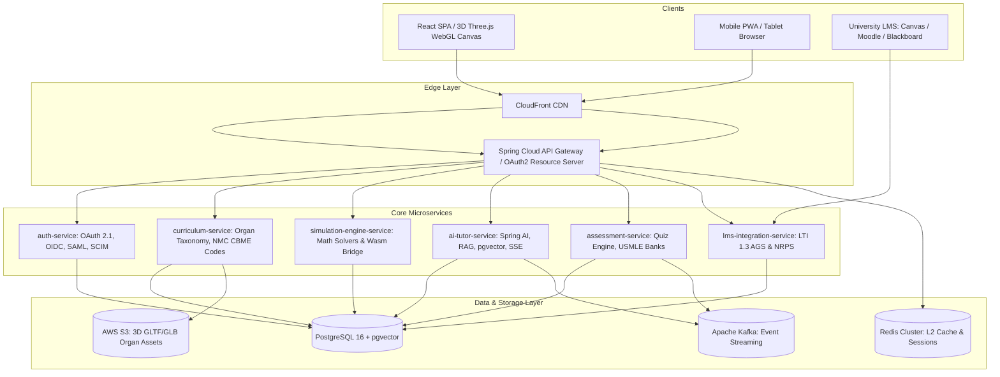

# Chapter 1 — Introduction

---

# Document Information

| Item              | Value                                                                                                                                                                       |
| ----------------- | --------------------------------------------------------------------------------------------------------------------------------------------------------------------------- |
| Document          | Software Architecture Document (SAD)                                                                                                                                        |
| Project           | Mediverse – AI-Powered Medical Education Platform                                                                                                                           |
| Version           | 1.0                                                                                                                                                                         |
| Status            | Architecture Baseline                                                                                                                                                       |
| Prepared By       | Solution Architecture Team                                                                                                                                                  |
| Audience          | Product Owners, Architects, Developers, DevSecOps Engineers, QA Engineers, Security Teams, AI Engineers, Infrastructure Teams, Operations Teams, Institutional Stakeholders |
| Related Documents | Vision Document, PRD, SRS, UI/UX Specification, API Specification, Database Design Document                                                                                 |

---

# 1.1 Purpose

The purpose of this Software Architecture Document (SAD) is to define the complete technical architecture of the Mediverse platform and establish the architectural baseline for implementation, deployment, operation, maintenance, and future evolution.

This document translates the business objectives defined in the Product Requirements Document (PRD) and the functional and non-functional requirements specified in the Software Requirements Specification (SRS) into an implementable technical solution.

The SAD provides a comprehensive blueprint describing how Mediverse will be structured, how its components collaborate, how data flows across the platform, how security is enforced, how artificial intelligence capabilities are integrated, and how the solution will operate within a modern cloud-native environment.

This document serves as the authoritative reference for all architecture-related decisions throughout the software development lifecycle.

---

# 1.2 Objectives

The Software Architecture Document aims to:

* Define the overall architecture of Mediverse.
* Establish architectural principles and standards.
* Describe the decomposition of the platform into bounded domains and services.
* Define interactions between services and external systems.
* Provide guidance for backend, frontend, AI, DevSecOps, infrastructure, and security teams.
* Ensure consistency across implementation teams.
* Support scalability, maintainability, and extensibility.
* Minimize architectural risks.
* Enable regulatory compliance.
* Establish long-term technical governance.

---

# 1.3 Scope

This document covers the complete architecture of the Mediverse platform, including but not limited to:

* Enterprise solution architecture
* Domain architecture
* Microservice architecture
* Cloud-native deployment architecture
* Kubernetes architecture
* Infrastructure architecture
* Data architecture
* Integration architecture
* API architecture
* AI architecture
* Retrieval-Augmented Generation (RAG) architecture
* Security architecture
* DevSecOps architecture
* Monitoring and observability
* Performance architecture
* Reliability engineering
* Disaster recovery
* Release architecture
* Architecture governance

Implementation-specific source code, detailed API contracts, UI wireframes, and database migration scripts are outside the scope of this document and are maintained in their respective design documents.

---

# 1.4 Intended Audience

This document is intended for:

| Role                     | Purpose                              |
| ------------------------ | ------------------------------------ |
| Enterprise Architects    | Overall solution design              |
| Solution Architects      | System decomposition                 |
| Technical Leads          | Technical implementation guidance    |
| Backend Engineers        | Service implementation               |
| Frontend Engineers       | Client architecture alignment        |
| AI Engineers             | AI subsystem implementation          |
| DevSecOps Engineers      | Delivery pipeline and infrastructure |
| Security Engineers       | Security architecture validation     |
| QA Engineers             | Architecture-aware testing           |
| Infrastructure Engineers | Cloud platform deployment            |
| Database Engineers       | Data architecture implementation     |
| Operations Teams         | Production support                   |
| Product Owners           | Technical governance                 |
| Executive Stakeholders   | Architectural oversight              |

---

# 1.5 Business Context

Mediverse is an enterprise-scale, AI-powered medical education platform designed to deliver personalized, interactive, and competency-driven learning experiences for medical students, educators, and institutions.

The platform integrates traditional digital learning with advanced technologies such as:

* Artificial Intelligence
* Retrieval-Augmented Generation (RAG)
* Interactive 3D anatomy
* Multimedia learning
* Intelligent assessments
* Learning analytics
* Competency tracking
* Institutional administration
* Cloud-native infrastructure
* Enterprise security
* Multi-tenant architecture

The architecture is intended to support institutions ranging from individual medical colleges to large university systems while maintaining high levels of security, scalability, reliability, and operational efficiency.

---

# 1.6 Architectural Vision

The architectural vision for Mediverse is to create a highly modular, cloud-native, secure, scalable, and AI-enabled platform capable of supporting millions of learners across multiple institutions.

The architecture emphasizes:

* Independent service evolution
* Domain ownership
* Resilient distributed systems
* API-first integration
* Event-driven communication
* Zero-trust security
* Continuous delivery
* Automated operations
* AI-assisted educational workflows
* Observability by design

This vision guides all architectural decisions documented in subsequent chapters.

---

# 1.7 Architectural Drivers

The architecture is driven by the following business and technical objectives:

## Business Drivers

* Personalized medical education
* Improved learner engagement
* Institutional scalability
* Faster curriculum delivery
* AI-assisted learning
* Data-driven decision making
* Regulatory compliance
* Operational efficiency

## Technical Drivers

* Cloud-native deployment
* High availability
* Elastic scalability
* Service isolation
* Secure-by-design implementation
* Multi-tenancy
* Performance optimization
* Extensibility
* Operational resilience
* Continuous delivery

---

# 1.8 Architectural Constraints

The solution architecture shall operate within the following constraints:

### Business Constraints

* Institutional governance requirements
* Academic accreditation standards
* Budgetary considerations
* Multi-institution support
* Long-term maintainability

### Technical Constraints

* Cloud-native deployment
* Containerized workloads
* Kubernetes orchestration
* API-first communication
* Secure identity management
* Infrastructure as Code
* Automated CI/CD pipelines

### Operational Constraints

* High service availability
* Disaster recovery readiness
* Secure operational processes
* Centralized observability
* Controlled release management

---

# 1.9 Architecture Principles Overview

The Mediverse architecture is based on the following foundational principles:

* Cloud Native
* Domain-Driven Design (DDD)
* Clean Architecture
* Hexagonal Architecture
* Event-Driven Architecture
* API First
* Security by Design
* Privacy by Design
* Infrastructure as Code
* GitOps
* DevSecOps
* Observability by Design
* Automation First
* Fail Fast
* Loose Coupling
* High Cohesion

Each principle is elaborated in Chapter 3.

---

# 1.10 Relationship with Other Documents

The Software Architecture Document complements other project documentation.

| Document                                  | Purpose                                            |
| ----------------------------------------- | -------------------------------------------------- |
| Vision Document                           | Defines product vision and strategic objectives    |
| Product Requirements Document (PRD)       | Defines business requirements and product features |
| Software Requirements Specification (SRS) | Defines functional and non-functional requirements |
| UI/UX Design Specification                | Defines user interface and interaction design      |
| OpenAPI Specification                     | Defines REST API contracts                         |
| Database Design Document                  | Defines logical and physical database schemas      |
| Infrastructure Design Document            | Defines infrastructure implementation              |
| DevSecOps Design Guide                    | Defines CI/CD and operational processes            |

The architecture described in this document shall remain consistent with these related artifacts.

---

# 1.11 Assumptions

The architecture assumes that:

* Institutions provide authenticated users.
* Cloud infrastructure is available.
* AI inference services are accessible.
* Kubernetes is the primary orchestration platform.
* Secure network connectivity exists between services.
* Object storage supports large educational assets.
* External integrations expose stable interfaces.
* Monitoring and logging infrastructure is continuously available.

---

# 1.12 Success Criteria

The architecture shall be considered successful when it:

* Supports enterprise-scale deployment.
* Enables independent service evolution.
* Achieves required scalability and resilience.
* Protects sensitive educational and institutional data.
* Integrates AI capabilities safely and effectively.
* Supports continuous software delivery.
* Maintains operational observability.
* Meets defined performance objectives.
* Complies with organizational security and governance standards.
* Provides a maintainable foundation for long-term platform evolution.

---

# 1.13 Traceability

This chapter traces to:

**Related PRD Sections**

* Product Vision
* Business Goals
* Product Scope

**Related SRS Chapters**

* Chapter 1 – Introduction
* Chapter 2 – Overall Description
* Chapter 22 – Non-Functional Requirements
* Chapter 24 – System Architecture & Deployment Requirements

**Architecture Areas Introduced**

* Enterprise Architecture
* Cloud Architecture
* Security Architecture
* AI Architecture
* Data Architecture
* Infrastructure Architecture
* DevSecOps Architecture
* Observability Architecture

---

# Chapter Summary

This chapter establishes the foundation of the Mediverse Software Architecture Document by defining its purpose, objectives, scope, architectural vision, business context, constraints, guiding principles, intended audience, assumptions, and relationships to other project artifacts. It serves as the entry point for the detailed architectural design presented in the subsequent chapters and establishes the architectural baseline that governs all technical decisions throughout the platform's lifecycle.

---

**End of Chapter 1**

# Chapter 2 — Architectural Goals & Quality Attributes

---

# 2.1 Introduction

This chapter defines the architectural goals, quality attributes, architectural drivers, measurable quality scenarios, and design tactics that guide the Mediverse platform architecture.

Unlike functional requirements, which describe **what** the system does, architectural quality attributes define **how well** the system performs under varying operational conditions. These quality attributes significantly influence architectural decisions, technology selection, deployment strategies, service decomposition, infrastructure design, security mechanisms, and operational processes.

All subsequent architectural decisions documented within this Software Architecture Document (SAD) shall align with the quality objectives defined in this chapter.

---

# 2.2 Architectural Goals

The Mediverse architecture shall achieve the following strategic goals:

* Deliver a scalable cloud-native medical education platform.
* Enable modular and independently deployable services.
* Support millions of concurrent learners across multiple institutions.
* Provide enterprise-grade security and privacy protections.
* Deliver highly available educational services with minimal downtime.
* Support AI-powered personalized learning experiences.
* Enable rapid feature delivery through DevSecOps automation.
* Maintain high operational visibility through observability.
* Ensure regulatory compliance and auditability.
* Facilitate long-term maintainability and extensibility.

---

# 2.3 Business Drivers

The architecture is designed to satisfy the following business drivers.

| Business Driver            | Architectural Impact                   |
| -------------------------- | -------------------------------------- |
| Personalized learning      | AI architecture, recommendation engine |
| Global accessibility       | Cloud-native deployment, CDN           |
| Institutional scalability  | Multi-tenant architecture              |
| Medical education quality  | AI validation, content governance      |
| Faster curriculum updates  | Modular services                       |
| Continuous innovation      | Independent deployments                |
| Operational efficiency     | Automation and DevSecOps               |
| Regulatory compliance      | Security and audit architecture        |
| Analytics-driven education | Data platform architecture             |
| Long-term sustainability   | Maintainable architecture              |

---

# 2.4 Technical Drivers

The technical architecture shall support:

* Microservices
* Cloud-native deployment
* Kubernetes orchestration
* Containerization
* API-first communication
* Event-driven messaging
* Distributed data management
* AI integration
* Infrastructure as Code
* Continuous Delivery
* GitOps
* Observability

---

# 2.5 Primary Quality Attributes

The Mediverse architecture is designed around the following primary quality attributes.

| Attribute        | Priority |
| ---------------- | -------- |
| Scalability      | Critical |
| Availability     | Critical |
| Reliability      | Critical |
| Security         | Critical |
| Privacy          | Critical |
| Performance      | Critical |
| Maintainability  | High     |
| Extensibility    | High     |
| Interoperability | High     |
| Usability        | High     |
| Accessibility    | High     |
| Observability    | High     |
| Testability      | High     |
| Deployability    | High     |
| Portability      | Medium   |
| Cost Efficiency  | Medium   |

---

# 2.6 Performance

## Objective

The platform shall provide responsive user interactions under expected and peak workloads while maintaining acceptable resource utilization.

Performance considerations include:

* API latency
* Page rendering
* Database response
* AI response time
* Search performance
* Media delivery
* Assessment processing

---

### GOAL-001

Interactive user operations should complete within established performance targets.

---

### GOAL-002

Performance objectives shall be measurable and continuously monitored.

---

### GOAL-003

Performance bottlenecks shall be identifiable through observability tooling.

---

### GOAL-004

Performance optimization shall not compromise correctness or security.

---

# 2.7 Scalability

## Objective

The architecture shall support horizontal and vertical scaling while minimizing service disruption.

Scalable resources include:

* API services
* AI services
* Databases
* Search infrastructure
* Messaging infrastructure
* Storage
* Background workers

---

### GOAL-005

Application services shall support independent scaling.

---

### GOAL-006

Scaling decisions shall minimize operational impact.

---

### GOAL-007

Platform capacity shall support projected institutional growth.

---

### GOAL-008

Scalability strategies shall accommodate future expansion.

---

# 2.8 Availability

## Objective

The platform shall remain operational despite infrastructure failures, service failures, or localized disruptions.

Availability considerations include:

* Redundancy
* Load balancing
* Health monitoring
* Self-healing
* Automated recovery
* Multi-zone deployment

---

### GOAL-009

Critical platform services shall support high availability.

---

### GOAL-010

Infrastructure failures shall minimize disruption to end users.

---

### GOAL-011

Service health shall be continuously monitored.

---

### GOAL-012

Recovery mechanisms shall support automated restoration where appropriate.

---

# 2.9 Reliability

## Objective

The system shall consistently deliver correct results under normal and abnormal operating conditions.

Reliability includes:

* Fault tolerance
* Error recovery
* Data integrity
* Transaction consistency
* Service resilience

---

### GOAL-013

Critical business operations shall preserve transactional integrity.

---

### GOAL-014

Transient failures shall support controlled retry mechanisms.

---

### GOAL-015

Permanent failures shall generate actionable operational alerts.

---

### GOAL-016

Reliability improvements shall prioritize critical business workflows.

---

# 2.10 Security

## Objective

Security shall be integrated into every architectural layer using a defense-in-depth approach.

Security principles include:

* Zero Trust
* Least Privilege
* Secure Defaults
* Identity-first Security
* Continuous Verification
* Encryption
* Secure Communication

---

### GOAL-017

Security shall be incorporated throughout the system architecture.

---

### GOAL-018

Sensitive information shall remain protected throughout its lifecycle.

---

### GOAL-019

Security controls shall support continuous monitoring.

---

### GOAL-020

Security architecture shall support evolving threat landscapes.

---

# 2.11 Privacy

The architecture shall protect institutional and learner information by design.

Privacy principles include:

* Data minimization
* Purpose limitation
* Controlled retention
* Secure processing
* Auditability

---

### GOAL-021

Privacy controls shall align with applicable organizational policies.

---

### GOAL-022

Personal information shall be processed only by authorized components.

---

### GOAL-023

Privacy events shall remain auditable.

---

# 2.12 Maintainability

The architecture shall facilitate long-term evolution.

Maintainability objectives include:

* Modular code
* Loose coupling
* High cohesion
* Clear interfaces
* Automated testing
* Documentation

---

### GOAL-024

System components shall remain independently maintainable.

---

### GOAL-025

Architectural complexity shall be managed through modular design.

---

### GOAL-026

Changes shall minimize unintended impact across services.

---

# 2.13 Extensibility

The platform shall support future capabilities without extensive architectural redesign.

Extension areas include:

* AI models
* Medical specialties
* Learning formats
* Institutions
* Languages
* Integrations

---

### GOAL-027

New capabilities shall integrate through defined extension points.

---

### GOAL-028

Platform evolution shall preserve backward compatibility where required.

---

### GOAL-029

Architectural decisions shall avoid unnecessary technology lock-in.

---

# 2.14 Interoperability

The platform shall integrate efficiently with internal and external systems.

Supported interaction styles include:

* REST APIs
* Event messaging
* File exchange
* Identity federation

---

### GOAL-030

Interfaces shall support standardized communication mechanisms.

---

### GOAL-031

External integrations shall remain loosely coupled.

---

### GOAL-032

Interoperability shall support future ecosystem expansion.

---

# 2.15 Observability

The platform shall provide comprehensive operational visibility.

Observability includes:

* Metrics
* Logs
* Distributed tracing
* Health monitoring
* Alerting
* Dashboards

---

### GOAL-033

Critical services shall expose operational telemetry.

---

### GOAL-034

Observability shall support rapid incident diagnosis.

---

### GOAL-035

Operational metrics shall support continuous improvement.

---

# 2.16 Deployability

The architecture shall enable safe, repeatable, and automated software deployment.

Deployment objectives include:

* Zero-downtime deployment where feasible
* Automated rollback
* Environment consistency
* Release traceability

---

### GOAL-036

Software deployment shall support automation.

---

### GOAL-037

Deployment failures shall support controlled recovery.

---

### GOAL-038

Deployment processes shall remain fully auditable.

---

# 2.17 Architectural Trade-Offs

The Mediverse architecture acknowledges that quality attributes may compete.

Examples include:

| Trade-Off                   | Architectural Approach                           |
| --------------------------- | ------------------------------------------------ |
| Performance vs Security     | Prioritize security while optimizing performance |
| Availability vs Consistency | Balance according to business criticality        |
| Flexibility vs Simplicity   | Favor extensibility with controlled complexity   |
| Scalability vs Cost         | Scale efficiently using demand-driven resources  |
| Innovation vs Stability     | Govern change through architecture reviews       |

Trade-offs shall be documented through Architecture Decision Records (ADRs).

---

# 2.18 Quality Attribute Scenarios

Representative scenarios include:

| Quality Attribute | Example Scenario                                                                 |
| ----------------- | -------------------------------------------------------------------------------- |
| Performance       | Student loads a lesson during peak usage without noticeable delay                |
| Scalability       | Enrollment doubles across institutions without architectural redesign            |
| Availability      | Service continues despite failure of an application instance                     |
| Security          | Unauthorized API access is denied and audited                                    |
| Reliability       | Assessment submission completes successfully despite transient network issues    |
| Observability     | Engineers identify the root cause of an incident using logs, metrics, and traces |
| Maintainability   | A new assessment type is introduced with minimal impact on existing modules      |
| Extensibility     | A new AI model is integrated without changing core learning services             |

These scenarios provide measurable guidance for architecture validation.

---

# 2.19 Traceability

This chapter traces to:

**Related PRD Sections**

* Business Goals
* Product Vision
* Product Success Metrics

**Related SRS Chapters**

* Chapter 22 – Non-Functional Requirements
* Chapter 24 – System Architecture & Deployment Requirements
* Chapter 26 – DevSecOps
* Chapter 27 – Testing, Verification & Validation

**Architecture Areas**

* Quality Attributes
* Architectural Drivers
* Design Constraints
* Operational Objectives

---

# Chapter Summary

This chapter establishes the architectural goals and quality attributes that govern every design decision within Mediverse. It defines the business and technical drivers, identifies the critical quality characteristics of the platform—including scalability, performance, availability, reliability, security, privacy, maintainability, extensibility, interoperability, observability, and deployability—and documents the architectural trade-offs and quality scenarios that guide solution evaluation. These goals form the measurable foundation against which the architecture will be validated throughout the platform lifecycle.

---

**End of Chapter 2**

# Chapter 3 — Architecture Principles

---

# 3.1 Introduction

This chapter establishes the architectural principles that govern the design, implementation, deployment, and evolution of the Mediverse platform.

Architectural principles are mandatory decision-making guidelines that ensure consistency across all engineering teams. They provide a common framework for evaluating architectural alternatives, selecting technologies, designing services, managing infrastructure, and maintaining long-term platform sustainability.

Every architectural decision documented in this Software Architecture Document (SAD) shall align with the principles defined in this chapter unless an approved Architecture Decision Record (ADR) explicitly documents an exception.

---

# 3.2 Purpose

The objectives of these architecture principles are to:

* Establish a common engineering philosophy.
* Improve architectural consistency.
* Reduce technical debt.
* Promote reusable solutions.
* Increase maintainability.
* Support enterprise scalability.
* Enable rapid software delivery.
* Strengthen security.
* Improve operational excellence.
* Support long-term platform evolution.

---

# 3.3 Architectural Governance Principles

The following governance principles apply across the Mediverse platform.

| Principle              | Description                                                                             |
| ---------------------- | --------------------------------------------------------------------------------------- |
| Architecture First     | Significant technical decisions require architectural evaluation before implementation. |
| Business Alignment     | Technical decisions shall support business objectives.                                  |
| Standards Compliance   | Engineering shall follow approved standards and guidelines.                             |
| Reuse Before Build     | Existing capabilities shall be evaluated before creating new ones.                      |
| Simplicity             | Prefer the simplest solution that satisfies requirements.                               |
| Automation             | Manual operational activities should be minimized through automation.                   |
| Continuous Improvement | Architecture evolves through measurable feedback.                                       |
| Traceability           | Significant decisions shall remain documented and auditable.                            |

---

# 3.4 Cloud-Native Principle

Mediverse shall be designed as a cloud-native platform.

Cloud-native characteristics include:

* Containerized workloads
* Elastic scaling
* Immutable infrastructure
* Declarative deployments
* Service isolation
* Self-healing
* Infrastructure automation
* Managed cloud services where appropriate

### ARCH-PR-001

Application components shall be deployable as independently managed cloud-native services.

### ARCH-PR-002

Infrastructure shall support horizontal scalability.

### ARCH-PR-003

Cloud resources shall support automated provisioning.

### ARCH-PR-004

Infrastructure configuration shall remain declarative.

---

# 3.5 Domain-Driven Design (DDD)

Business domains shall drive system decomposition.

Primary principles include:

* Bounded Contexts
* Ubiquitous Language
* Aggregates
* Domain Events
* Domain Services
* Repositories
* Context Mapping

### ARCH-PR-005

Service boundaries shall align with business domains.

### ARCH-PR-006

Each bounded context shall maintain independent ownership.

### ARCH-PR-007

Domain terminology shall remain consistent throughout the platform.

### ARCH-PR-008

Business logic shall reside primarily within domain models.

---

# 3.6 Clean Architecture

The platform shall follow Clean Architecture principles.

Core layers include:

* Domain Layer
* Application Layer
* Interface Layer
* Infrastructure Layer

Dependencies shall always point toward the domain.

### ARCH-PR-009

Business rules shall remain independent of frameworks.

### ARCH-PR-010

Infrastructure components shall depend on application abstractions.

### ARCH-PR-011

External technologies shall remain replaceable.

### ARCH-PR-012

Core business logic shall remain isolated from implementation details.

---

# 3.7 Hexagonal Architecture (Ports & Adapters)

External systems shall communicate through well-defined ports and adapters.

Primary adapters include:

* REST APIs
* Messaging
* Databases
* AI Services
* Search Engines
* Object Storage
* Authentication Providers

### ARCH-PR-013

Business services shall communicate with external systems through defined interfaces.

### ARCH-PR-014

Infrastructure implementations shall be replaceable with minimal business impact.

### ARCH-PR-015

Application services shall not directly depend on infrastructure technologies.

---

# 3.8 SOLID Principles

Software components shall adhere to the SOLID design principles.

* Single Responsibility Principle
* Open/Closed Principle
* Liskov Substitution Principle
* Interface Segregation Principle
* Dependency Inversion Principle

### ARCH-PR-016

Classes and modules shall have clearly defined responsibilities.

### ARCH-PR-017

Dependencies shall be injected rather than hard-coded where appropriate.

### ARCH-PR-018

Interfaces shall remain focused and cohesive.

---

# 3.9 API-First Principle

All platform capabilities intended for integration shall expose well-defined APIs.

API characteristics include:

* Versioning
* Documentation
* Discoverability
* Consistency
* Backward compatibility
* Standardized error handling

### ARCH-PR-019

Public interfaces shall be defined before implementation.

### ARCH-PR-020

APIs shall follow enterprise design standards.

### ARCH-PR-021

API contracts shall remain version controlled.

### ARCH-PR-022

Breaking API changes shall follow an approved governance process.

---

# 3.10 Event-Driven Architecture

Services shall exchange business events where asynchronous communication provides operational or architectural benefits.

Event characteristics include:

* Loose coupling
* Asynchronous processing
* Event versioning
* Reliable delivery
* Idempotent processing

### ARCH-PR-023

Domain events shall represent meaningful business activities.

### ARCH-PR-024

Event consumers shall tolerate duplicate delivery where applicable.

### ARCH-PR-025

Event schemas shall be versioned.

---

# 3.11 Stateless Service Design

Application services should remain stateless whenever practical.

Benefits include:

* Easier scaling
* Simpler deployment
* Improved resilience
* Load balancing
* Faster recovery

### ARCH-PR-026

User session state should be externally managed where required.

### ARCH-PR-027

Stateless services shall support horizontal scaling.

---

# 3.12 Security by Design

Security shall be integrated into every architectural layer rather than added after implementation.

Security principles include:

* Zero Trust
* Least Privilege
* Defense in Depth
* Secure Defaults
* Continuous Verification
* Encryption
* Identity-Centric Security

### ARCH-PR-028

Security requirements shall influence architectural decisions from project inception.

### ARCH-PR-029

Sensitive information shall remain protected throughout its lifecycle.

### ARCH-PR-030

Authentication and authorization shall be centralized.

### ARCH-PR-031

Security events shall remain auditable.

---

# 3.13 Privacy by Design

Personal information shall be protected throughout collection, processing, storage, and deletion.

Privacy principles include:

* Data minimization
* Purpose limitation
* Controlled retention
* User transparency
* Secure processing

### ARCH-PR-032

Personal data shall be collected only for legitimate business purposes.

### ARCH-PR-033

Privacy controls shall be enforced consistently across services.

---

# 3.14 Observability by Design

Every architectural component shall expose operational telemetry.

Observability includes:

* Metrics
* Logs
* Traces
* Health checks
* Diagnostics

### ARCH-PR-034

Critical services shall provide standardized telemetry.

### ARCH-PR-035

Operational visibility shall support rapid incident diagnosis.

### ARCH-PR-036

Observability shall be integrated into every deployment.

---

# 3.15 Automation First

Automation shall replace repetitive operational activities whenever practical.

Automation areas include:

* Builds
* Testing
* Security scanning
* Infrastructure provisioning
* Deployments
* Monitoring
* Recovery

### ARCH-PR-037

Operational automation shall reduce manual intervention.

### ARCH-PR-038

Deployment activities shall support repeatable execution.

---

# 3.16 Infrastructure as Code (IaC)

Infrastructure shall be managed using version-controlled declarative definitions.

### ARCH-PR-039

Infrastructure changes shall follow the same governance process as application code.

### ARCH-PR-040

Infrastructure provisioning shall be reproducible.

---

# 3.17 Resilience First

The architecture shall assume failures will occur and be designed to tolerate them.

Resilience mechanisms include:

* Retry
* Timeout
* Circuit breaker
* Bulkhead isolation
* Graceful degradation
* Health probes
* Self-healing

### ARCH-PR-041

Services shall detect and recover from transient failures where feasible.

### ARCH-PR-042

Failure isolation shall prevent cascading system outages.

### ARCH-PR-043

Critical workflows shall support graceful degradation.

---

# 3.18 Evolutionary Architecture

The architecture shall evolve incrementally while maintaining stability.

Evolution principles include:

* Incremental enhancement
* Backward compatibility
* Controlled refactoring
* Technology evaluation
* Architectural governance

### ARCH-PR-044

Architectural evolution shall preserve system integrity.

### ARCH-PR-045

Major architectural changes shall be documented through Architecture Decision Records.

---

# 3.19 Principle Conflict Resolution

Where architectural principles appear to conflict, decisions shall prioritize:

1. Patient safety and educational integrity.
2. Security and privacy.
3. Regulatory compliance.
4. System reliability and availability.
5. Maintainability.
6. Performance.
7. Cost optimization.

Conflicts shall be resolved through the architecture governance process and recorded in the Architecture Decision Record repository.

---

# 3.20 Traceability

This chapter traces to:

**Related PRD Sections**

* Product Vision
* Technical Strategy
* Platform Goals

**Related SRS Chapters**

* Chapter 21 – Security, Privacy, Compliance & Audit
* Chapter 22 – Non-Functional Requirements
* Chapter 24 – System Architecture & Deployment Requirements
* Chapter 26 – DevSecOps

**Architecture Principles**

* Cloud Native
* Domain-Driven Design
* Clean Architecture
* Hexagonal Architecture
* API-First
* Event-Driven Architecture
* Security by Design
* Privacy by Design
* Observability by Design
* Automation First

---

# Chapter Summary

This chapter establishes the foundational architectural principles that govern every aspect of the Mediverse platform. It defines the guiding philosophies for cloud-native development, Domain-Driven Design, Clean and Hexagonal Architecture, API-first integration, event-driven communication, security and privacy by design, observability, automation, Infrastructure as Code, resilience, and evolutionary architecture. Together, these principles provide a consistent decision-making framework that ensures the platform remains scalable, secure, maintainable, and adaptable throughout its lifecycle.

---

**End of Chapter 3**

# Chapter 4 — System Context Architecture

---

# 4.1 Introduction

The System Context Architecture defines the highest-level view of the Mediverse platform by illustrating its relationship with external users, institutional systems, third-party services, cloud infrastructure, and supporting operational platforms.

This chapter corresponds to the **C4 Model – Level 1 (System Context Diagram)** and establishes the system boundary, identifies external actors, and describes how information flows between Mediverse and its surrounding ecosystem.

The purpose of this chapter is to provide stakeholders with a common understanding of the platform's responsibilities, external dependencies, integration points, and operational environment before examining the internal architecture in subsequent chapters.

---

# 4.2 Objectives

The System Context Architecture shall:

* Define the overall system boundary.
* Identify all external actors.
* Identify external systems.
* Define high-level interactions.
* Establish integration responsibilities.
* Clarify ownership boundaries.
* Support enterprise architecture governance.
* Provide the foundation for lower-level C4 diagrams.

---

# 4.3 Architectural Scope

The Mediverse platform acts as the central digital ecosystem for medical education by integrating learners, educators, administrators, AI capabilities, institutional systems, and cloud infrastructure into a unified platform.

The architecture encompasses:

* Learning Management
* Curriculum Management
* Assessments
* AI Learning Assistant
* Interactive 3D Learning
* Multimedia Delivery
* Analytics
* Reporting
* Administration
* Security
* Notifications
* Search
* Integration Services
* Platform Operations

Systems outside these responsibilities remain external and interact through defined interfaces.

---

# 4.4 System Boundary

The Mediverse system boundary separates responsibilities managed by the platform from responsibilities managed by external organizations or services.

## Inside the Boundary

The platform includes:

* Web Application
* Mobile Application
* API Platform
* Authentication Platform
* Learning Services
* Assessment Services
* AI Services
* Search Platform
* Analytics Platform
* Reporting Platform
* Notification Platform
* Administration Platform
* Content Management
* Media Management
* Observability Platform
* Security Services

## Outside the Boundary

External systems include:

* Institutional Identity Providers
* Payment Systems (if applicable)
* Email Providers
* SMS Providers
* Push Notification Providers
* AI Model Providers
* Cloud Infrastructure
* CDN Providers
* External Academic Systems
* Third-Party Learning Resources

Only documented interfaces shall cross the system boundary.

---

# 4.5 Primary External Actors

The following human actors interact with Mediverse.

| Actor                     | Description                                  |
| ------------------------- | -------------------------------------------- |
| Student                   | Consumes educational content and assessments |
| Faculty Member            | Creates and manages learning content         |
| Content Author            | Develops educational materials               |
| Academic Reviewer         | Reviews and approves content                 |
| Department Administrator  | Manages departmental activities              |
| Institution Administrator | Configures institutional settings            |
| System Administrator      | Operates the platform                        |
| AI Administrator          | Governs AI behavior and policies             |
| Compliance Officer        | Reviews audit and compliance activities      |
| Executive Stakeholder     | Consumes analytics and reports               |

---

### CONTEXT-001

All user interactions shall occur through authenticated interfaces.

---

### CONTEXT-002

User roles shall determine available capabilities.

---

### CONTEXT-003

Actor permissions shall be centrally governed.

---

### CONTEXT-004

Every user interaction shall remain auditable.

---

# 4.6 External Systems

The Mediverse platform shall interact with multiple enterprise systems.

| External System            | Purpose                       |
| -------------------------- | ----------------------------- |
| Identity Provider          | Authentication and federation |
| Email Gateway              | Email delivery                |
| SMS Gateway                | Messaging                     |
| Push Notification Service  | Mobile notifications          |
| AI Platform                | Large Language Models         |
| Object Storage             | Educational media             |
| CDN                        | Content distribution          |
| Payment Gateway (Optional) | Subscription management       |
| External LMS               | Academic interoperability     |
| Institutional ERP          | Student information exchange  |
| Analytics Platforms        | Institutional reporting       |

---

### CONTEXT-005

External integrations shall occur through approved interfaces.

---

### CONTEXT-006

Integration failures shall not compromise core learning workflows.

---

### CONTEXT-007

External dependencies shall support monitoring.

---

### CONTEXT-008

Integration activities shall remain traceable.

---

# 4.7 High-Level Interaction Model

At the highest level, interactions follow the pattern below:

1. Users authenticate.
2. Users access educational services.
3. Services retrieve educational content.
4. AI services provide personalized assistance.
5. Assessments evaluate learner progress.
6. Analytics aggregate learning activity.
7. Reports are generated.
8. Notifications inform stakeholders.
9. Administrators manage institutional configuration.
10. Operational services monitor the platform.

This interaction model forms the basis for subsequent service-level architecture.

---

# 4.8 Context-Level Functional Responsibilities

The Mediverse platform is responsible for:

* Identity management
* Course delivery
* Learning progress
* Assessments
* Competency tracking
* AI-assisted tutoring
* Multimedia learning
* Interactive 3D visualization
* Search
* Notifications
* Institutional administration
* Analytics
* Reporting
* Platform governance

The platform is not responsible for managing external identity providers, cloud infrastructure ownership, or third-party educational content beyond approved integrations.

---

# 4.9 System Context Diagram (Conceptual)

```
                        +----------------------------+
                        |      Students              |
                        +-------------+--------------+
                                      |
                        +-------------v--------------+
                        |        Mediverse           |
                        |----------------------------|
                        |  Web & Mobile Applications |
                        |  API Platform              |
                        |  Learning Services         |
                        |  AI Platform               |
                        |  Assessments               |
                        |  Analytics                |
                        |  Administration            |
                        |  Reporting                 |
                        +-------------+--------------+
                                      |
      ---------------------------------------------------------------
      |            |             |            |            |         |
+-----v----+ +------v-----+ +-----v-----+ +----v-----+ +---v----+ +--v------+
| Identity | | AI Models  | | Object    | | Email    | | SMS    | | External |
| Provider | | Providers  | | Storage   | | Gateway  | |Gateway | | Systems  |
+----------+ +------------+ +-----------+ +----------+ +--------+ +----------+
```

*The detailed C4 Level 1 visual diagram will be maintained alongside architecture assets and synchronized with this document.*

---

# 4.10 Trust Boundaries

Major trust boundaries include:

* Internet to Platform
* Institution to Platform
* User Device to API Gateway
* API Gateway to Internal Services
* Internal Services to AI Providers
* Internal Services to External APIs
* Administrative Interfaces
* Monitoring Infrastructure

Each trust boundary shall enforce authentication, authorization, encryption, logging, and policy validation.

---

### CONTEXT-009

Every trust boundary shall enforce secure communication.

---

### CONTEXT-010

Identity shall be verified before privileged operations.

---

### CONTEXT-011

Sensitive communications shall remain encrypted in transit.

---

# 4.11 Communication Channels

The platform shall support secure communication using:

* HTTPS
* REST APIs
* WebSockets (where applicable)
* Event Messaging
* Object Storage Interfaces
* Administrative APIs

Future communication mechanisms may be introduced through approved architectural governance.

---

### CONTEXT-012

Communication protocols shall follow enterprise standards.

---

### CONTEXT-013

Interfaces shall support versioning.

---

### CONTEXT-014

Communication failures shall generate operational telemetry.

---

# 4.12 Context-Level Security

Security controls at the context level include:

* Identity federation
* Multi-factor authentication
* Role-based authorization
* API security
* Transport encryption
* Audit logging
* Threat monitoring
* Rate limiting

Security architecture details are defined in Part VIII of this document.

---

# 4.13 Availability Zones

The platform shall support deployment across multiple availability zones to improve resilience.

Context-level deployment considerations include:

* Redundant application instances
* Redundant databases
* Distributed object storage
* Load balancing
* Health monitoring
* Automated failover

Infrastructure implementation details are defined in later chapters.

---

# 4.14 Assumptions

The system context assumes:

* Institutions maintain identity providers.
* Users possess supported client devices.
* Internet connectivity is available.
* External AI providers maintain agreed service levels.
* Cloud infrastructure supports required scalability.
* External integrations comply with published interfaces.

---

# 4.15 Traceability

This chapter traces to:

**Related PRD Sections**

* Product Scope
* Stakeholders
* External Integrations

**Related SRS Chapters**

* Chapter 3 – System Context
* Chapter 19 – Integration, APIs & External Systems
* Chapter 21 – Security, Privacy, Compliance & Audit
* Chapter 24 – System Architecture & Deployment Requirements

**Architecture Views**

* C4 Level 1
* Enterprise Context
* Integration Boundary
* Trust Boundary

---

# Chapter Summary

This chapter defines the highest-level architectural view of Mediverse by identifying the system boundary, primary users, external systems, trust boundaries, communication channels, and overall interaction model. As the C4 Level 1 representation of the platform, it establishes the relationships between Mediverse and its surrounding ecosystem, providing the contextual foundation for the detailed logical, physical, deployment, and component architectures described in the following chapters.

---

**End of Chapter 4**

# Chapter 5 — Enterprise Solution Architecture

---

# 5.1 Introduction

The Enterprise Solution Architecture defines the overall structural organization of the Mediverse platform and explains how business capabilities, applications, data, infrastructure, artificial intelligence, and operational services collaborate to deliver a unified medical education ecosystem.

This chapter establishes the highest-level internal architecture of the platform after the System Context Architecture (Chapter 4). It identifies the major architectural domains, their responsibilities, interactions, ownership boundaries, and guiding design principles.

The Enterprise Solution Architecture serves as the master blueprint from which all logical, physical, deployment, security, AI, and infrastructure architectures are derived.

---

# 5.2 Objectives

The Enterprise Solution Architecture shall:

* Establish a modular enterprise platform.
* Define major architectural domains.
* Promote loose coupling between services.
* Support independent scalability.
* Enable cloud-native deployment.
* Support AI-driven educational workflows.
* Facilitate enterprise integrations.
* Simplify operational management.
* Improve maintainability.
* Enable long-term platform evolution.

---

# 5.3 Architectural Vision

The Mediverse platform shall be designed as a **cloud-native, event-driven, AI-enabled, multi-tenant microservices ecosystem**.

The architecture shall:

* Separate business domains.
* Minimize inter-service dependencies.
* Promote API-first communication.
* Use asynchronous messaging where beneficial.
* Centralize cross-cutting concerns.
* Support autonomous development teams.
* Enable continuous deployment.
* Provide enterprise observability.
* Support elastic scalability.
* Ensure resilience under failure conditions.

---

# 5.4 Enterprise Architecture Layers

The platform shall be organized into multiple architectural layers.

| Layer                   | Primary Responsibility                     |
| ----------------------- | ------------------------------------------ |
| Experience Layer        | User interfaces and client applications    |
| Access Layer            | Authentication, authorization, API gateway |
| Business Services Layer | Core business capabilities                 |
| AI Intelligence Layer   | AI tutoring and knowledge services         |
| Integration Layer       | External communication and messaging       |
| Data Layer              | Persistent storage and analytics           |
| Platform Services Layer | Cross-cutting technical capabilities       |
| Infrastructure Layer    | Cloud, Kubernetes, networking, storage     |
| Operations Layer        | Monitoring, logging, security, DevSecOps   |

Each layer shall expose clearly defined responsibilities and interfaces.

---

### ESA-001

Each architectural layer shall have clearly defined ownership.

---

### ESA-002

Dependencies between layers shall follow approved architectural principles.

---

### ESA-003

Cross-layer communication shall remain controlled.

---

### ESA-004

Layer responsibilities shall remain independent.

---

# 5.5 High-Level Enterprise Architecture

The enterprise architecture consists of the following major domains:

```
Users
   │
Experience Layer
(Web • Mobile • Admin Portal)
   │
API Gateway
   │
Identity & Security Platform
   │
────────────────────────────────────────────
Business Services Domain
────────────────────────────────────────────
Learning
Curriculum
Assessment
Content
Institution
Reporting
Analytics
Notification
Administration
Search
Media
Audit
────────────────────────────────────────────
        │
AI Intelligence Platform
        │
Integration Platform
        │
Data Platform
        │
Infrastructure Platform
        │
Operations Platform
```

This layered organization provides strong separation of concerns while enabling collaboration across domains.

---

# 5.6 Business Capability Domains

The Mediverse platform shall be organized around business capabilities rather than technical functions.

Primary capability domains include:

* Identity Management
* Student Learning
* Faculty Workspace
* Curriculum Management
* Course Management
* Lesson Management
* Learning Content
* Multimedia Delivery
* Interactive 3D Learning
* Assessment & Evaluation
* AI Learning Assistant
* Competency Management
* Analytics
* Reporting
* Search
* Notifications
* Institution Administration
* Audit & Compliance

Each capability shall be implemented as one or more independently evolvable services.

---

### ESA-005

Business capabilities shall remain loosely coupled.

---

### ESA-006

Business capabilities shall support independent deployment.

---

### ESA-007

Capability ownership shall be clearly assigned.

---

# 5.7 Cross-Cutting Platform Services

Certain capabilities are shared across all business domains.

Shared platform services include:

* Authentication
* Authorization
* Configuration
* Logging
* Monitoring
* Audit
* Notifications
* Search
* File Storage
* Caching
* Secret Management
* API Gateway
* Service Discovery
* Feature Flags
* Distributed Tracing

These services shall be centrally governed and reusable across the platform.

---

### ESA-008

Cross-cutting services shall avoid duplication across business domains.

---

### ESA-009

Shared services shall expose standardized interfaces.

---

### ESA-010

Shared capabilities shall support high availability.

---

# 5.8 Architectural Domains

The enterprise architecture consists of the following primary domains.

## Experience Domain

Responsible for:

* Student Portal
* Faculty Portal
* Administrator Portal
* Mobile Applications
* Responsive Web Experience

---

## Business Domain

Responsible for:

* Medical education workflows
* Academic operations
* Learning progression
* Assessments
* Competency management

---

## AI Domain

Responsible for:

* AI Tutor
* RAG
* Medical reasoning
* Recommendations
* Learning personalization
* AI governance

---

## Data Domain

Responsible for:

* Operational databases
* Analytics
* Reporting
* Search indexes
* Object storage

---

## Platform Domain

Responsible for:

* Identity
* API Gateway
* Configuration
* Notifications
* Messaging
* Security
* Observability

---

## Infrastructure Domain

Responsible for:

* Kubernetes
* Networking
* Storage
* Compute
* Cloud resources

---

### ESA-011

Architectural domains shall maintain clear ownership boundaries.

---

### ESA-012

Domains shall expose only approved interfaces.

---

### ESA-013

Internal implementation details shall remain encapsulated.

---

# 5.9 Architectural Interaction Model

The primary interaction sequence is:

1. User accesses application.
2. Identity platform authenticates user.
3. API Gateway routes request.
4. Business services process request.
5. AI platform augments educational workflows where applicable.
6. Data platform stores operational information.
7. Analytics platform processes events.
8. Notification platform delivers messages.
9. Monitoring platform records telemetry.

Interactions shall follow approved communication patterns defined in later chapters.

---

# 5.10 Enterprise Communication Patterns

The architecture supports multiple communication models.

| Pattern             | Usage                      |
| ------------------- | -------------------------- |
| Synchronous REST    | User-driven requests       |
| Asynchronous Events | Business event propagation |
| Message Queues      | Background processing      |
| WebSockets          | Real-time collaboration    |
| Batch Processing    | Analytics and reporting    |
| Object Storage      | Large educational assets   |

The communication mechanism shall be selected based on latency, consistency, scalability, and business requirements.

---

### ESA-014

Communication mechanisms shall align with workload characteristics.

---

### ESA-015

Long-running operations should use asynchronous processing where appropriate.

---

### ESA-016

Critical business transactions shall ensure consistency through approved patterns.

---

# 5.11 Multi-Tenant Enterprise Architecture

The platform shall support multiple institutions using a shared architecture while preserving logical isolation.

Tenant isolation applies to:

* Users
* Academic structures
* Courses
* Assessments
* Learning progress
* Reports
* AI conversations
* Analytics
* Administrative settings

Shared platform services shall enforce tenant-aware processing.

---

### ESA-017

Tenant boundaries shall be enforced across all architectural layers.

---

### ESA-018

Shared infrastructure shall not compromise tenant isolation.

---

### ESA-019

Cross-tenant access shall require explicit authorization.

---

# 5.12 Enterprise Scalability Model

Scalability shall be achieved through:

* Stateless services
* Independent service scaling
* Horizontal pod autoscaling
* Distributed caching
* Read replicas
* Asynchronous processing
* CDN acceleration
* Elastic object storage

Capacity planning shall consider institutional growth, seasonal academic peaks, and AI workload expansion.

---

### ESA-020

Scalability mechanisms shall support incremental platform growth.

---

### ESA-021

Business services shall scale independently where feasible.

---

# 5.13 Enterprise Resilience Model

The architecture shall tolerate failures through:

* Redundancy
* Retry policies
* Circuit breakers
* Bulkhead isolation
* Health probes
* Self-healing infrastructure
* Graceful degradation
* Automated failover

Failure of one service shall minimize impact on unrelated business capabilities.

---

### ESA-022

Critical services shall implement resilience patterns appropriate to their responsibilities.

---

### ESA-023

Service failures shall generate operational telemetry.

---

### ESA-024

Recovery procedures shall support rapid restoration of service.

---

# 5.14 Technology Independence

Business capabilities shall remain independent of specific infrastructure technologies wherever practical.

Technology abstraction applies to:

* Databases
* AI providers
* Messaging platforms
* Storage services
* Cloud providers
* Monitoring tools

This approach supports future technology evolution with minimal business disruption.

---

### ESA-025

Business logic shall minimize direct dependency on vendor-specific implementations.

---

### ESA-026

Technology replacement shall be achievable through defined abstraction layers.

---

# 5.15 Traceability

This chapter traces to:

**Related PRD Sections**

* Product Vision
* Business Capabilities
* Platform Strategy

**Related SRS Chapters**

* Chapter 2 – Overall Description
* Chapter 17 – Search, Knowledge Discovery & Recommendation
* Chapter 19 – Integration, APIs & External Systems
* Chapter 24 – System Architecture & Deployment Requirements

**Architecture Views**

* Enterprise Architecture
* Capability Map
* Layered Architecture
* Domain Architecture

---

# Chapter Summary

This chapter establishes the Enterprise Solution Architecture for Mediverse by defining its layered structure, business capability domains, shared platform services, architectural domains, communication patterns, multi-tenant model, scalability strategy, resilience model, and technology abstraction principles. It provides the overarching architectural blueprint that organizes the platform into cohesive, independently evolvable domains while ensuring secure, scalable, and maintainable enterprise operations. Subsequent chapters build upon this foundation by detailing the logical architecture, physical deployment, domain decomposition, and individual service designs.

---

**End of Chapter 5**


---

# 5.10 Canonical Mediverse Microservices Decomposition & Bounded Contexts

To deliver an enterprise-grade medical physiology learning ecosystem, Mediverse is decomposed into 6 cohesive, domain-aligned microservices:



### 5.10.1 Service Responsibility Matrix

| Microservice | Bounded Context | Core Responsibilities | Primary Data Store |
|---|---|---|---|
| **`auth-service`** | Identity & Access | OAuth 2.1 / OIDC issuance, institutional SAML 2.0 SSO, SCIM 2.0 user provisioning, RBAC/ABAC enforcement. | PostgreSQL (`auth` schema) + Redis |
| **`curriculum-service`** | Academic Taxonomy | Organ system catalog, NMC CBME competency mapping (`PY1.1`–`PY11.14`), lesson module sequencing, 3D asset metadata. | PostgreSQL (`curriculum` schema) + S3 |
| **`simulation-engine-service`** | Physiology Modeling | Wasm mathematical solver distribution, parameter state validation, cardiac $PV$-loop, GHK membrane potential, and $V/Q$ calculations. | PostgreSQL (`simulation` schema) |
| **`ai-tutor-service`** | Socratic Tutoring | Multi-turn Socratic LLM orchestration, RAG textbook vector search, prompt security guardrails, SSE streaming. | PostgreSQL + `pgvector` (`ai_tutor` schema) |
| **`assessment-service`** | Evaluation & Grading | Timed exam state machine, question distractor shuffling, automated grading, student performance analytics. | PostgreSQL (`assessment` schema) + Kafka |
| **`lms-integration-service`** | External Interoperability | IMS Global LTI 1.3 Advantage tool endpoints, OIDC launch handling, AGS grade passback, NRPS roster sync. | PostgreSQL (`lms` schema) |

---

# 6.8 3D WebGL Canvas & Frontend Architecture

The frontend architecture is optimized for high-performance 3D visualization and responsive medical simulations:

* **Rendering Engine:** **Three.js** integrated with React via **`@react-three/fiber`** and **`@react-three/drei`**.
* **Styling System:** **Vanilla CSS / CSS Modules & Design Tokens** (strictly avoiding Tailwind CSS in compliance with User Global Rules).
* **State Management Strategy:**
  * **Zustand:** Ultra-lightweight reactive client UI state (sidebar open/close, active tool, 3D camera presets).
  * **TanStack Query (React Query):** Robust asynchronous server state caching, pagination, and background refetching.
  * **React Context:** Dedicated 3D Canvas Viewport context for camera coordinates and shader clipping plane uniforms.
* **3D Asset Optimization Pipeline:** All anatomical organ models packaged as binary `.glb` files compressed via **Google Draco** geometry compression and **KTX2 / Basis Universal** texture compression, keeping individual organ downloads $< 15	ext{ MB}$.


# Chapter 6 — Logical Architecture

---

# 6.1 Introduction

The Logical Architecture defines the internal organization of the Mediverse platform by decomposing the enterprise solution into logical domains, services, subsystems, and interactions. Unlike the physical architecture, which focuses on deployment infrastructure, the logical architecture concentrates on **business capabilities**, **service responsibilities**, **communication patterns**, and **dependency relationships**.

This chapter corresponds to the logical view of the system and provides the foundation for the subsequent Microservice Architecture, Component Architecture, API Architecture, Data Architecture, and Deployment Architecture chapters.

The logical architecture is technology-agnostic and emphasizes **what responsibilities exist**, **how they collaborate**, and **where business capabilities are located**.

---

# 6.2 Objectives

The Logical Architecture shall:

* Decompose the platform into logical business domains.
* Separate responsibilities using Domain-Driven Design (DDD).
* Minimize coupling between services.
* Maximize cohesion within services.
* Support independent evolution.
* Enable distributed development teams.
* Facilitate scalability.
* Improve maintainability.
* Simplify testing.
* Support long-term architectural evolution.

---

# 6.3 Architectural Overview

The Mediverse logical architecture follows a layered, domain-oriented microservices approach.

```text
+------------------------------------------------------------+
|                 Experience Layer                           |
|------------------------------------------------------------|
| Student Portal | Faculty Portal | Admin Portal | Mobile App|
+------------------------------------------------------------+

+------------------------------------------------------------+
|            Access & Security Layer                         |
|------------------------------------------------------------|
| API Gateway | Authentication | Authorization | Rate Limits |
+------------------------------------------------------------+

+------------------------------------------------------------+
|               Business Services Layer                      |
|------------------------------------------------------------|
| Learning | Curriculum | Assessment | Content | Institution |
| Analytics | Reporting | Search | Notification | Admin      |
+------------------------------------------------------------+

+------------------------------------------------------------+
|               AI Intelligence Layer                        |
|------------------------------------------------------------|
| AI Tutor | RAG | Recommendation | Medical Validation       |
+------------------------------------------------------------+

+------------------------------------------------------------+
|             Integration & Messaging Layer                  |
|------------------------------------------------------------|
| REST | Events | Message Broker | External Connectors       |
+------------------------------------------------------------+

+------------------------------------------------------------+
|                    Data Layer                              |
|------------------------------------------------------------|
| PostgreSQL | Redis | Search Index | Object Storage         |
+------------------------------------------------------------+
```

Each layer provides services to the layer above while depending only on approved interfaces exposed by the layer below.

---

# 6.4 Logical Layers

The architecture is divided into six primary logical layers.

| Layer              | Responsibility         |
| ------------------ | ---------------------- |
| Experience Layer   | User interaction       |
| Access Layer       | Security and routing   |
| Business Layer     | Domain logic           |
| Intelligence Layer | AI capabilities        |
| Integration Layer  | External communication |
| Data Layer         | Persistent storage     |

---

### LOGIC-001

Each logical layer shall have clearly defined responsibilities.

---

### LOGIC-002

Layer dependencies shall follow approved architectural principles.

---

### LOGIC-003

Cross-layer communication shall occur only through published interfaces.

---

### LOGIC-004

Business rules shall remain independent of presentation logic.

---

# 6.5 Experience Layer

The Experience Layer provides interfaces tailored to different user groups.

Primary applications include:

* Student Web Portal
* Faculty Portal
* Institution Administration Portal
* Mobile Application
* Public Information Portal

Responsibilities include:

* User interaction
* Session management
* Client-side validation
* Accessibility
* Responsive user experience

---

### LOGIC-005

User interfaces shall remain independent of backend implementation details.

---

### LOGIC-006

Client applications shall consume backend capabilities exclusively through published APIs.

---

### LOGIC-007

Presentation logic shall not contain core business rules.

---

# 6.6 Access & Security Layer

This layer protects and routes access to backend services.

Core capabilities include:

* API Gateway
* Authentication
* Authorization
* Rate Limiting
* Request Validation
* API Versioning
* Traffic Routing
* Request Logging

---

### LOGIC-008

Every external request shall pass through the Access Layer.

---

### LOGIC-009

Authentication shall precede access to protected resources.

---

### LOGIC-010

Authorization decisions shall be centrally enforced.

---

### LOGIC-011

API Gateway policies shall be configurable.

---

# 6.7 Business Services Layer

The Business Services Layer contains the primary business capabilities.

Major logical domains include:

* Identity
* Student Learning
* Curriculum
* Course Management
* Lesson Management
* Learning Content
* Assessments
* Competency Tracking
* Institution Management
* Reporting
* Analytics
* Search
* Notifications
* Administration
* Audit

Each domain encapsulates its own business rules and data ownership.

---

### LOGIC-012

Business domains shall encapsulate their own logic and state.

---

### LOGIC-013

Business domains shall expose well-defined service interfaces.

---

### LOGIC-014

Business rules shall remain isolated within their owning domains.

---

### LOGIC-015

Cross-domain dependencies shall be minimized.

---

# 6.8 AI Intelligence Layer

The AI layer augments educational workflows without replacing core business logic.

Logical AI capabilities include:

* AI Tutor
* Retrieval-Augmented Generation (RAG)
* Question Answering
* Learning Recommendations
* Summarization
* Content Assistance
* Adaptive Learning
* Medical Knowledge Retrieval
* AI Safety Controls

The AI layer consumes educational data through approved interfaces and returns recommendations or generated content to business services.

---

### LOGIC-016

AI services shall remain logically independent from business services.

---

### LOGIC-017

AI interactions shall occur through approved service interfaces.

---

### LOGIC-018

AI-generated outputs shall remain traceable.

---

### LOGIC-019

AI services shall not directly modify authoritative business data without explicit business validation.

---

# 6.9 Integration Layer

The Integration Layer facilitates communication with internal and external systems.

Supported communication mechanisms include:

* REST APIs
* Event Publishing
* Event Consumption
* Message Queues
* Scheduled Jobs
* External Connectors
* Webhooks

---

### LOGIC-020

Integration responsibilities shall remain isolated from business logic.

---

### LOGIC-021

External systems shall communicate only through defined integration interfaces.

---

### LOGIC-022

Integration failures shall not unnecessarily propagate across unrelated domains.

---

# 6.10 Data Layer

The Data Layer provides persistent storage and retrieval services.

Logical storage domains include:

* Transactional Data
* Search Indexes
* Cache
* Object Storage
* Analytics Repository
* Audit Repository

Business services own their respective data and expose access through service interfaces rather than direct database sharing.

---

### LOGIC-023

Each logical domain shall own its authoritative data.

---

### LOGIC-024

Direct cross-domain database access shall be avoided.

---

### LOGIC-025

Data access shall occur through service contracts.

---

# 6.11 Logical Dependency Rules

Dependencies shall follow these rules:

* Experience Layer → Access Layer
* Access Layer → Business Services
* Business Services → AI Services (when required)
* Business Services → Integration Layer
* Business Services → Data Layer
* AI Services → Data Layer (read through approved interfaces)
* Integration Layer → External Systems

Reverse dependencies shall not be introduced without architectural approval.

---

### LOGIC-026

Dependency direction shall remain consistent with the layered architecture.

---

### LOGIC-027

Circular dependencies between domains shall not be permitted.

---

### LOGIC-028

Shared functionality shall be implemented through reusable platform services.

---

# 6.12 Cross-Cutting Concerns

Cross-cutting capabilities apply across all logical domains.

These include:

* Authentication
* Authorization
* Logging
* Auditing
* Monitoring
* Configuration
* Feature Flags
* Metrics
* Distributed Tracing
* Exception Handling
* Localization

These concerns shall be implemented through shared platform capabilities rather than duplicated within individual services.

---

### LOGIC-029

Cross-cutting concerns shall remain reusable across domains.

---

### LOGIC-030

Observability capabilities shall be consistently implemented.

---

### LOGIC-031

Security policies shall apply uniformly across services.

---

# 6.13 Logical Communication Patterns

Business services communicate using the following patterns:

| Pattern              | Usage                               |
| -------------------- | ----------------------------------- |
| Request–Response     | Immediate user interactions         |
| Event Notification   | Business event propagation          |
| Command Processing   | Controlled state changes            |
| Publish–Subscribe    | Distributed event handling          |
| Scheduled Processing | Background tasks                    |
| Streaming            | Real-time notifications and updates |

Each interaction pattern shall be selected based on latency, consistency, and scalability requirements.

---

### LOGIC-032

Communication patterns shall align with business requirements.

---

### LOGIC-033

Long-running workflows should use asynchronous messaging where practical.

---

### LOGIC-034

Critical business operations shall preserve transactional integrity.

---

# 6.14 Logical Architecture Principles

The logical architecture adheres to the following principles:

* High Cohesion
* Loose Coupling
* Single Responsibility
* Explicit Ownership
* API-First Communication
* Event-Driven Collaboration
* Independent Evolution
* Technology Independence
* Secure by Design
* Observable by Design

These principles guide future architectural evolution.

---

# 6.15 Traceability

This chapter traces to:

**Related PRD Sections**

* Product Architecture
* Business Capabilities
* Technical Strategy

**Related SRS Chapters**

* Chapter 2 – Overall Description
* Chapter 17 – Search, Knowledge Discovery & Recommendation
* Chapter 19 – Integration, APIs & External Systems
* Chapter 24 – System Architecture & Deployment Requirements

**Architecture Views**

* Logical View
* Layered Architecture
* Domain Decomposition
* Service Interaction Model

---

# Chapter Summary

This chapter defines the Logical Architecture of the Mediverse platform by organizing the solution into layered domains, identifying business service boundaries, establishing dependency rules, defining communication patterns, and describing cross-cutting concerns. The architecture emphasizes Domain-Driven Design, API-first communication, independent data ownership, and technology independence, providing a logical blueprint that will be refined into the detailed physical, deployment, microservice, and component architectures in the following chapters.

---

**End of Chapter 6**
# Chapter 7 — Physical Architecture

---

# 7.1 Introduction

The Physical Architecture defines how the logical components of the Mediverse platform are deployed onto physical and virtual infrastructure. While the Logical Architecture (Chapter 6) describes business capabilities and service interactions, the Physical Architecture specifies **where** those services execute, **how** they are distributed, **how** they communicate across infrastructure, and **how** the platform achieves scalability, resilience, security, and operational efficiency.

The architecture is designed as a **cloud-native, Kubernetes-based, distributed microservices platform** capable of supporting enterprise-scale medical education across multiple institutions.

This chapter provides the bridge between logical service decomposition and the deployment architecture presented in subsequent chapters.

---

# 7.2 Objectives

The Physical Architecture shall:

* Define deployment topology.
* Describe infrastructure components.
* Support horizontal scalability.
* Ensure high availability.
* Enable fault isolation.
* Optimize network communication.
* Support secure service execution.
* Improve operational resilience.
* Facilitate infrastructure automation.
* Provide a foundation for cloud deployment.

---

# 7.3 Physical Architecture Overview

The Mediverse platform is deployed across multiple infrastructure tiers.

```text id="7gnh2x"
+-----------------------------------------------------------+
|                  Client Devices                           |
|-----------------------------------------------------------|
| Web Browser | Mobile App | Tablet | Desktop               |
+----------------------------+------------------------------+
                             |
                       Internet / CDN
                             |
+-----------------------------------------------------------+
|                Edge Infrastructure                        |
|-----------------------------------------------------------|
| DNS | CDN | WAF | Load Balancer | API Gateway             |
+----------------------------+------------------------------+
                             |
+-----------------------------------------------------------+
|             Kubernetes Application Cluster               |
|-----------------------------------------------------------|
| Authentication Services                                   |
| Learning Services                                         |
| Assessment Services                                       |
| AI Services                                                |
| Search Services                                            |
| Analytics Services                                         |
| Reporting Services                                         |
| Notification Services                                      |
| Administration Services                                    |
+----------------------------+------------------------------+
                             |
+-----------------------------------------------------------+
|                  Data Platform                            |
|-----------------------------------------------------------|
| PostgreSQL | Redis | Elasticsearch | Object Storage       |
+----------------------------+------------------------------+
                             |
+-----------------------------------------------------------+
|               Platform Operations                         |
|-----------------------------------------------------------|
| Monitoring | Logging | Tracing | CI/CD | Backup           |
+-----------------------------------------------------------+
```

This topology separates user access, application processing, persistent storage, and operational infrastructure into independently manageable layers.

---

# 7.4 Infrastructure Tiers

The physical architecture consists of the following infrastructure tiers.

| Tier             | Responsibility                 |
| ---------------- | ------------------------------ |
| Client Tier      | User interaction               |
| Edge Tier        | Traffic routing and protection |
| Application Tier | Business services              |
| Data Tier        | Persistent storage             |
| Platform Tier    | Shared technical services      |
| Operations Tier  | Monitoring and automation      |

---

### PHYS-001

Infrastructure tiers shall have clearly defined responsibilities.

---

### PHYS-002

Each tier shall support independent scaling where practical.

---

### PHYS-003

Tier boundaries shall enforce security controls.

---

### PHYS-004

Infrastructure responsibilities shall remain clearly documented.

---

# 7.5 Client Tier

The Client Tier includes all end-user devices.

Supported clients include:

* Desktop browsers
* Mobile browsers
* Android applications
* iOS applications
* Tablets

Responsibilities:

* User interface rendering
* Session management
* Local caching
* Secure communication
* Accessibility support

---

### PHYS-005

Client devices shall communicate only through approved endpoints.

---

### PHYS-006

Client applications shall use encrypted communication channels.

---

# 7.6 Edge Infrastructure

The Edge Infrastructure provides secure access into the platform.

Core components include:

* DNS
* Content Delivery Network (CDN)
* Web Application Firewall (WAF)
* Global Load Balancer
* API Gateway
* TLS Termination
* Rate Limiting
* DDoS Protection

Responsibilities include:

* Traffic distribution
* Request filtering
* SSL/TLS management
* Security enforcement
* Edge caching

---

### PHYS-007

All inbound traffic shall traverse the edge infrastructure.

---

### PHYS-008

Edge services shall support traffic inspection.

---

### PHYS-009

Public interfaces shall enforce transport encryption.

---

### PHYS-010

Edge components shall support high availability.

---

# 7.7 Kubernetes Application Tier

Application workloads execute inside Kubernetes.

Major workload categories include:

* Identity Services
* Learning Services
* Curriculum Services
* Assessment Services
* AI Services
* Search Services
* Notification Services
* Analytics Services
* Reporting Services
* Administration Services

Each workload is independently deployable and scalable.

---

### PHYS-011

Application services shall execute within managed Kubernetes workloads.

---

### PHYS-012

Business services shall remain independently deployable.

---

### PHYS-013

Service failures shall minimize impact on unrelated workloads.

---

### PHYS-014

Application instances shall support horizontal scaling.

---

# 7.8 Data Tier

The Data Tier stores operational and analytical information.

Primary data platforms include:

| Platform             | Purpose                     |
| -------------------- | --------------------------- |
| PostgreSQL           | Transactional data          |
| Redis                | Caching and session storage |
| Elasticsearch        | Search and indexing         |
| Object Storage       | Educational media           |
| Analytics Repository | Reporting datasets          |
| Audit Repository     | Audit records               |

Each storage technology is selected according to workload characteristics.

---

### PHYS-015

Persistent data shall reside within approved storage platforms.

---

### PHYS-016

Database platforms shall support high availability.

---

### PHYS-017

Storage systems shall support backup and recovery.

---

### PHYS-018

Data platforms shall support secure access controls.

---

# 7.9 Platform Services Tier

Platform Services provide reusable technical capabilities.

Shared services include:

* Configuration Management
* Secret Management
* Service Discovery
* API Gateway
* Identity Platform
* Certificate Management
* Messaging Infrastructure
* Feature Flags

These services support all business domains while remaining logically independent.

---

### PHYS-019

Shared platform services shall avoid duplication.

---

### PHYS-020

Platform services shall support centralized governance.

---

# 7.10 Operations Tier

Operational infrastructure supports platform management.

Capabilities include:

* Monitoring
* Centralized Logging
* Distributed Tracing
* Alerting
* CI/CD
* Backup
* Disaster Recovery
* Security Monitoring
* Capacity Monitoring

Operational systems remain isolated from production workloads while maintaining secure connectivity.

---

### PHYS-021

Operational tooling shall support centralized management.

---

### PHYS-022

Monitoring systems shall collect telemetry from all critical workloads.

---

### PHYS-023

Operational infrastructure shall support automated alerting.

---

# 7.11 Physical Network Zones

The architecture is segmented into multiple network zones.

| Zone               | Purpose                       |
| ------------------ | ----------------------------- |
| Public Zone        | Internet-facing services      |
| DMZ                | Edge security components      |
| Application Zone   | Internal business services    |
| Data Zone          | Databases and storage         |
| Management Zone    | Administrative infrastructure |
| Observability Zone | Monitoring systems            |

Traffic between zones shall follow explicitly defined network policies.

---

### PHYS-024

Network segmentation shall reduce attack surface.

---

### PHYS-025

Communication between zones shall be explicitly authorized.

---

### PHYS-026

Sensitive services shall remain inaccessible from public networks unless explicitly required.

---

# 7.12 Availability Strategy

The physical deployment shall support continuous operation through:

* Multiple availability zones
* Load balancing
* Redundant application instances
* Database replication
* Automated health monitoring
* Self-healing workloads

Infrastructure failures should not result in platform-wide outages.

---

### PHYS-027

Critical infrastructure components shall support redundancy.

---

### PHYS-028

Application availability shall be continuously monitored.

---

### PHYS-029

Infrastructure failures shall trigger automated recovery procedures where feasible.

---

# 7.13 Scalability Strategy

Scalability mechanisms include:

* Horizontal Pod Autoscaling
* Cluster Autoscaling
* Stateless application design
* Distributed caching
* Read replicas
* CDN acceleration
* Elastic object storage

Capacity expansion shall occur with minimal service interruption.

---

### PHYS-030

Infrastructure shall support incremental scaling.

---

### PHYS-031

Application workloads shall scale independently based on demand.

---

### PHYS-032

Infrastructure resources shall support efficient utilization.

---

# 7.14 Physical Security

Physical infrastructure security includes:

* Network isolation
* Encryption in transit
* Encryption at rest
* Secret management
* Certificate management
* Access logging
* Administrative authentication
* Infrastructure auditing

Detailed security mechanisms are described in Part VIII of this document.

---

### PHYS-033

Infrastructure resources shall implement approved security controls.

---

### PHYS-034

Administrative access shall require strong authentication.

---

### PHYS-035

Infrastructure activities shall remain auditable.

---

# 7.15 Technology Independence

The physical architecture abstracts infrastructure technologies to minimize vendor lock-in.

Areas of abstraction include:

* Cloud providers
* Kubernetes distributions
* Storage platforms
* Messaging systems
* Monitoring tools
* AI providers

Technology substitutions shall preserve business functionality through standardized interfaces.

---

### PHYS-036

Infrastructure components shall support controlled technology evolution.

---

### PHYS-037

Vendor-specific implementations shall remain encapsulated where practical.

---

# 7.16 Traceability

This chapter traces to:

**Related PRD Sections**

* Platform Strategy
* Infrastructure Vision
* Scalability Objectives

**Related SRS Chapters**

* Chapter 20 – System Administration, Configuration & Platform Operations
* Chapter 22 – Non-Functional Requirements
* Chapter 24 – System Architecture & Deployment Requirements
* Chapter 25 – Data Architecture, Database Design & Information Model

**Architecture Views**

* Physical View
* Infrastructure Topology
* Network Segmentation
* Deployment Foundation

---

# Chapter Summary

This chapter defines the Physical Architecture of the Mediverse platform by describing the deployment topology, infrastructure tiers, client and edge environments, Kubernetes application layer, data platforms, shared platform services, operational tooling, network segmentation, availability strategy, scalability model, and infrastructure security controls. It establishes the physical foundation required to host and operate the platform in a secure, resilient, and cloud-native environment, preparing the groundwork for the detailed Deployment Architecture and Technology Stack chapters that follow.

---

**End of Chapter 7**

# Chapter 8 — Deployment Architecture

---

# 8.1 Introduction

The Deployment Architecture defines how the Mediverse platform is deployed, orchestrated, managed, and operated across cloud infrastructure. It specifies the deployment topology, runtime environments, Kubernetes clusters, networking model, workload distribution, deployment strategies, and operational considerations that collectively enable a highly available, secure, scalable, and resilient enterprise platform.

While the Physical Architecture (Chapter 7) describes the infrastructure foundation, the Deployment Architecture explains **how software components are packaged, scheduled, deployed, upgraded, monitored, and recovered** within that infrastructure.

This architecture adopts a **Cloud-Native**, **Kubernetes-first**, **GitOps-driven**, and **Infrastructure-as-Code (IaC)** deployment model.

---

# 8.2 Objectives

The Deployment Architecture shall:

* Support highly available deployments.
* Enable zero-downtime releases.
* Provide automated deployments.
* Support independent service deployment.
* Enable multi-environment promotion.
* Improve operational resilience.
* Simplify rollback procedures.
* Support disaster recovery.
* Provide deployment consistency.
* Enable secure software delivery.

---

# 8.3 Deployment Principles

The Mediverse deployment architecture follows these principles:

* Container-first deployment
* Immutable infrastructure
* Declarative configuration
* GitOps workflow
* Infrastructure as Code
* Zero-trust networking
* Automated validation
* Progressive delivery
* Self-healing workloads
* Continuous observability

---

### DEPLOY-001

Every deployable component shall be containerized.

---

### DEPLOY-002

Deployments shall be fully automated.

---

### DEPLOY-003

Manual production deployments shall be avoided except during approved emergency procedures.

---

### DEPLOY-004

Infrastructure and application deployments shall be version controlled.

---

# 8.4 Deployment Topology

The Mediverse platform is deployed using a multi-tier cloud architecture.

```text id="f8t6vk"
                Internet
                    │
          Global DNS / CDN
                    │
        Web Application Firewall
                    │
            Global Load Balancer
                    │
             Kubernetes Ingress
                    │
───────────────────────────────────────────────
           Kubernetes Cluster
───────────────────────────────────────────────
Namespace: Platform
Namespace: Identity
Namespace: Learning
Namespace: Assessment
Namespace: AI
Namespace: Analytics
Namespace: Administration
Namespace: Monitoring
───────────────────────────────────────────────
                    │
        Managed Data Services
(PostgreSQL • Redis • Elasticsearch • Storage)
                    │
          Backup & Disaster Recovery
```

This deployment model enables isolation between business domains while allowing centralized operational management.

---

# 8.5 Deployment Units

Each deployable unit represents an independently versioned workload.

Primary deployment units include:

* API Gateway
* Identity Service
* User Service
* Learning Service
* Curriculum Service
* Assessment Service
* AI Tutor Service
* Search Service
* Analytics Service
* Reporting Service
* Notification Service
* Administration Service
* Audit Service

Each deployment unit owns its runtime configuration, scaling policy, health checks, and release lifecycle.

---

### DEPLOY-005

Each deployment unit shall have an independent release lifecycle.

---

### DEPLOY-006

Deployable services shall expose health endpoints.

---

### DEPLOY-007

Service deployments shall support rolling upgrades.

---

# 8.6 Runtime Environments

The platform supports multiple isolated environments.

| Environment                   | Purpose                           |
| ----------------------------- | --------------------------------- |
| Local Development             | Individual developer workstations |
| Development                   | Shared development environment    |
| Integration                   | Service integration testing       |
| Quality Assurance (QA)        | Functional testing                |
| User Acceptance Testing (UAT) | Business validation               |
| Staging                       | Production-like validation        |
| Production                    | Live operational environment      |
| Disaster Recovery (DR)        | Business continuity               |

Environment promotion shall follow approved release governance.

---

### DEPLOY-008

Each environment shall remain logically isolated.

---

### DEPLOY-009

Environment configuration shall be externally managed.

---

### DEPLOY-010

Production deployments shall originate from validated release artifacts.

---

# 8.7 Kubernetes Deployment Model

Kubernetes serves as the primary orchestration platform.

Major Kubernetes resources include:

* Namespaces
* Deployments
* StatefulSets
* Services
* Ingress
* ConfigMaps
* Secrets
* Jobs
* CronJobs
* Horizontal Pod Autoscalers
* Network Policies
* Persistent Volume Claims

Namespaces shall align with organizational and operational boundaries.

---

### DEPLOY-011

Application workloads shall execute within dedicated Kubernetes namespaces.

---

### DEPLOY-012

Persistent workloads shall use StatefulSets where appropriate.

---

### DEPLOY-013

Stateless workloads shall use Deployments.

---

### DEPLOY-014

Ingress shall manage external application routing.

---

# 8.8 Container Deployment

All services shall be packaged as OCI-compliant container images.

Container standards include:

* Minimal base images
* Non-root execution
* Read-only filesystem where practical
* Health probes
* Resource limits
* Image signing
* Vulnerability scanning

---

### DEPLOY-015

Container images shall remain immutable after publication.

---

### DEPLOY-016

Images shall be scanned before deployment.

---

### DEPLOY-017

Runtime containers shall operate with least privilege.

---

# 8.9 Configuration Management

Runtime configuration shall remain external to application binaries.

Configuration sources include:

* ConfigMaps
* Secrets
* Environment Variables
* Feature Flags
* Central Configuration Services

Application behavior shall not require recompilation for environment-specific settings.

---

### DEPLOY-018

Application configuration shall remain environment-specific.

---

### DEPLOY-019

Sensitive configuration shall be stored securely.

---

### DEPLOY-020

Configuration changes shall remain auditable.

---

# 8.10 Deployment Strategies

Supported deployment strategies include:

| Strategy          | Usage                         |
| ----------------- | ----------------------------- |
| Rolling Update    | Default production deployment |
| Blue-Green        | High-risk releases            |
| Canary            | Progressive feature rollout   |
| Recreate          | Development environments      |
| Shadow Deployment | Production validation         |
| Feature Flags     | Controlled feature exposure   |

Deployment strategy selection depends on business criticality and operational risk.

---

### DEPLOY-021

Production deployments shall minimize user disruption.

---

### DEPLOY-022

High-risk releases should use progressive deployment strategies.

---

### DEPLOY-023

Rollback procedures shall be validated regularly.

---

# 8.11 High Availability Deployment

High availability is achieved through:

* Multi-zone Kubernetes clusters
* Multiple application replicas
* Load balancing
* Database replication
* Distributed caching
* Redundant ingress controllers
* Automated failover
* Health monitoring

No single infrastructure component should constitute a single point of failure.

---

### DEPLOY-024

Critical services shall deploy multiple replicas.

---

### DEPLOY-025

Infrastructure redundancy shall support service continuity.

---

### DEPLOY-026

Failover mechanisms shall be periodically tested.

---

# 8.12 Deployment Security

Deployment security includes:

* Signed container images
* Secret encryption
* RBAC
* Admission controllers
* Network policies
* Image verification
* Infrastructure auditing
* Runtime security monitoring

Security validation occurs before, during, and after deployment.

---

### DEPLOY-027

Only trusted deployment artifacts shall reach production.

---

### DEPLOY-028

Deployment pipelines shall enforce security gates.

---

### DEPLOY-029

Runtime security policies shall remain continuously enforced.

---

# 8.13 Disaster Recovery Deployment

Disaster recovery architecture supports:

* Cross-region backups
* Automated infrastructure recreation
* Database restoration
* Object storage replication
* GitOps reconstruction
* Infrastructure as Code recovery

Recovery objectives shall align with defined RPO and RTO requirements.

---

### DEPLOY-030

Recovery procedures shall be documented and validated.

---

### DEPLOY-031

Critical infrastructure shall support disaster recovery automation.

---

### DEPLOY-032

Backup integrity shall be regularly verified.

---

# 8.14 Deployment Lifecycle

The deployment lifecycle follows these stages:

1. Source Code Commit
2. Continuous Integration
3. Automated Testing
4. Security Validation
5. Container Build
6. Artifact Publication
7. GitOps Manifest Update
8. Environment Promotion
9. Kubernetes Deployment
10. Health Verification
11. Observability Validation
12. Production Monitoring

Each stage shall generate auditable deployment records.

---

### DEPLOY-033

Deployment pipelines shall remain fully traceable.

---

### DEPLOY-034

Every deployment shall generate deployment metadata.

---

### DEPLOY-035

Failed deployments shall support automated rollback where feasible.

---

# 8.15 Deployment Governance

Deployment governance includes:

* Release approvals
* Change management
* Version control
* Compliance verification
* Operational readiness reviews
* Production validation
* Post-deployment monitoring

Governance ensures consistency across all deployment environments.

---

### DEPLOY-036

Deployment activities shall comply with organizational governance policies.

---

### DEPLOY-037

Production releases shall require approved release processes.

---

### DEPLOY-038

Deployment metrics shall support continuous improvement.

---

# 8.16 Traceability

This chapter traces to:

**Related PRD Sections**

* Platform Operations
* Deployment Strategy
* Scalability Goals

**Related SRS Chapters**

* Chapter 20 – System Administration, Configuration & Platform Operations
* Chapter 22 – Non-Functional Requirements
* Chapter 24 – System Architecture & Deployment Requirements
* Chapter 26 – DevSecOps

**Architecture Views**

* Deployment View
* Runtime Topology
* Kubernetes Deployment Model
* Release Architecture

---

# Chapter Summary

This chapter defines the Deployment Architecture for the Mediverse platform by describing its cloud-native deployment topology, Kubernetes orchestration model, runtime environments, deployment units, container standards, configuration management, deployment strategies, high availability mechanisms, security controls, disaster recovery approach, deployment lifecycle, and governance processes. These deployment practices ensure that Mediverse can be delivered consistently, securely, and reliably across all environments while supporting continuous delivery, operational resilience, and enterprise-scale growth.

---

**End of Chapter 8**

**Next:** Chapter 9 – Technology Stack & Platform Selection.

# Chapter 9 — Technology Stack & Platform Selection

---

# 9.1 Introduction

The Technology Stack & Platform Selection defines the technologies, frameworks, platforms, programming languages, databases, cloud services, development tools, and operational technologies selected for the Mediverse platform.

Technology selection is based on the following criteria:

* Enterprise maturity
* Long-term support (LTS)
* Community adoption
* Security
* Performance
* Scalability
* Cloud-native compatibility
* Kubernetes support
* Extensibility
* Vendor neutrality where practical

The selected technologies collectively support the architectural goals defined in previous chapters and provide a stable foundation for future platform evolution.

---

# 9.2 Technology Selection Principles

Every technology shall be evaluated against the following principles.

| Principle         | Description                               |
| ----------------- | ----------------------------------------- |
| Enterprise Ready  | Proven in production environments         |
| Cloud Native      | Kubernetes compatible                     |
| Secure by Default | Strong security posture                   |
| Open Standards    | Standards-based implementation            |
| Maintainability   | Long-term support and documentation       |
| Scalability       | Supports horizontal growth                |
| Observability     | Native monitoring capabilities            |
| Automation        | Supports Infrastructure as Code and CI/CD |
| Extensibility     | Allows future enhancements                |
| Interoperability  | Integrates with enterprise ecosystems     |

---

### TECH-001

Technology adoption shall align with enterprise architectural principles.

---

### TECH-002

Experimental technologies shall not be introduced into production without formal architectural approval.

---

### TECH-003

Technology upgrades shall follow controlled release governance.

---

# 9.3 Enterprise Technology Stack Overview

The Mediverse platform is organized into technology domains.

| Domain                   | Selected Technology           |
| ------------------------ | ----------------------------- |
| Frontend                 | React                         |
| Mobile                   | React Native (Future)         |
| Backend                  | Java & Spring Boot            |
| API                      | REST & OpenAPI                |
| Authentication           | OAuth2, OpenID Connect, JWT   |
| Database                 | PostgreSQL                    |
| Cache                    | Redis                         |
| Search                   | Elasticsearch                 |
| Object Storage           | S3 Compatible Storage         |
| Messaging                | Apache Kafka                  |
| Containerization         | Docker                        |
| Orchestration            | Kubernetes                    |
| Package Management       | Helm                          |
| GitOps                   | Argo CD                       |
| CI/CD                    | Jenkins & GitHub Actions      |
| Infrastructure as Code   | Terraform                     |
| Configuration Management | Ansible                       |
| Monitoring               | Prometheus                    |
| Visualization            | Grafana                       |
| Logging                  | Loki                          |
| Tracing                  | OpenTelemetry + Jaeger        |
| Secrets                  | HashiCorp Vault               |
| Service Mesh (Future)    | Istio                         |
| AI Platform              | Python, LangChain, LlamaIndex |

---

# 9.4 Programming Languages

## Backend

Primary Language:

* Java 21 (LTS)

Reasons:

* Enterprise maturity
* Excellent JVM ecosystem
* Spring Boot compatibility
* Strong concurrency support
* Long-term support
* High performance

---

## AI Platform

Primary Language:

* Python 3.13+

Reasons:

* AI ecosystem
* Machine Learning libraries
* LangChain support
* LlamaIndex compatibility
* Vector database ecosystem

---

## Frontend

Primary Language:

* TypeScript

Reasons:

* Type safety
* Improved maintainability
* Better tooling
* Enterprise-scale development

---

## Infrastructure

Primary Languages:

* YAML
* HCL (Terraform)
* Bash
* PowerShell

---

### TECH-004

Only approved programming languages shall be used for production services.

---

### TECH-005

Language versions shall follow enterprise support policies.

---

# 9.5 Backend Technology Stack

| Component                        | Technology         |
| -------------------------------- | ------------------ |
| Framework                        | Spring Boot 3.x    |
| Security                         | Spring Security    |
| ORM                              | Spring Data JPA    |
| Validation                       | Jakarta Validation |
| Documentation                    | OpenAPI 3          |
| API Testing                      | JUnit 5 + MockMvc  |
| Build Tool                       | Maven              |
| Dependency Injection             | Spring IoC         |
| Scheduling                       | Spring Scheduler   |
| Reactive Programming (Selective) | Spring WebFlux     |

---

Reasons for selection:

* Mature ecosystem
* Excellent enterprise support
* Extensive community
* Cloud-native compatibility
* Kubernetes readiness
* Modular architecture

---

### TECH-006

Backend services shall follow Spring Boot best practices.

---

### TECH-007

Framework upgrades shall maintain backward compatibility where feasible.

---

# 9.6 Frontend Technology Stack

| Component        | Technology      |
| ---------------- | --------------- |
| Framework        | React 19+       |
| Language         | TypeScript      |
| Build Tool       | Vite            |
| State Management | Redux Toolkit   |
| Routing          | React Router    |
| UI Framework     | Material UI     |
| Styling          | Tailwind CSS    |
| HTTP Client      | Axios           |
| Forms            | React Hook Form |
| Validation       | Zod             |

Frontend goals:

* Responsive UI
* Accessibility
* Progressive enhancement
* Component reusability
* High performance

---

### TECH-008

Frontend components shall be reusable and modular.

---

### TECH-009

Accessibility requirements shall be integrated into component design.

---

# 9.7 AI Technology Stack

The AI subsystem consists of multiple technologies.

| Component           | Technology                  |
| ------------------- | --------------------------- |
| AI Runtime          | Python                      |
| LLM Framework       | LangChain                   |
| Knowledge Retrieval | LlamaIndex                  |
| Embeddings          | OpenAI / Open Source Models |
| Vector Database     | pgvector (initial)          |
| Prompt Management   | LangSmith compatible design |
| AI Evaluation       | RAGAS (future)              |
| Model Serving       | vLLM / External APIs        |

The architecture abstracts AI providers to support future model replacement without significant business impact.

---

### TECH-010

AI components shall remain provider-agnostic where practical.

---

### TECH-011

AI models shall be replaceable through abstraction layers.

---

# 9.8 Data Platform

| Purpose             | Technology                           |
| ------------------- | ------------------------------------ |
| Relational Database | PostgreSQL                           |
| Cache               | Redis                                |
| Search              | Elasticsearch                        |
| Object Storage      | Amazon S3 Compatible                 |
| Vector Storage      | pgvector                             |
| Audit Storage       | PostgreSQL                           |
| Analytics           | PostgreSQL + Data Warehouse (Future) |

Technology selection is based on workload characteristics, consistency requirements, and operational maturity.

---

### TECH-012

Each storage technology shall be selected according to workload requirements.

---

### TECH-013

Authoritative business data shall reside in PostgreSQL.

---

# 9.9 API Technologies

Supported API standards include:

* REST
* OpenAPI 3.1
* JSON
* OAuth2
* OpenID Connect
* JWT
* Server-Sent Events (where applicable)
* WebSockets (selective)

Future consideration:

* GraphQL for specialized read-heavy use cases.

---

### TECH-014

APIs shall conform to OpenAPI specifications.

---

### TECH-015

API contracts shall be version controlled.

---

# 9.10 DevOps Platform

| Capability          | Technology              |
| ------------------- | ----------------------- |
| Source Control      | Git                     |
| Repository          | GitHub                  |
| CI                  | Jenkins                 |
| Alternative CI      | GitHub Actions          |
| Artifact Repository | Nexus Repository        |
| Container Registry  | OCI-compatible Registry |
| Code Quality        | SonarQube               |
| Security Scanning   | Trivy                   |
| Dependency Analysis | OWASP Dependency-Check  |

---

### TECH-016

Every production artifact shall pass through automated CI pipelines.

---

### TECH-017

Security scanning shall be integrated into software delivery.

---

# 9.11 Cloud Native Platform

| Component         | Technology                 |
| ----------------- | -------------------------- |
| Containers        | Docker                     |
| Orchestration     | Kubernetes                 |
| Package Manager   | Helm                       |
| GitOps            | Argo CD                    |
| Service Discovery | Kubernetes Services        |
| Autoscaling       | HPA & Cluster Autoscaler   |
| Ingress           | NGINX Ingress Controller   |
| Secrets           | Vault + Kubernetes Secrets |

---

### TECH-018

Application deployment shall be Kubernetes-native.

---

### TECH-019

Infrastructure shall support declarative deployments.

---

# 9.12 Observability Platform

| Capability | Technology    |
| ---------- | ------------- |
| Metrics    | Prometheus    |
| Dashboards | Grafana       |
| Logs       | Loki          |
| Traces     | Jaeger        |
| Telemetry  | OpenTelemetry |
| Alerting   | Alertmanager  |

These technologies provide comprehensive visibility into platform health and performance.

---

### TECH-020

All production services shall expose standardized observability telemetry.

---

### TECH-021

Operational dashboards shall support proactive monitoring.

---

# 9.13 Security Platform

| Capability             | Technology                 |
| ---------------------- | -------------------------- |
| Authentication         | Keycloak (recommended)     |
| Authorization          | Spring Security            |
| Secret Management      | HashiCorp Vault            |
| Certificate Management | cert-manager               |
| TLS                    | TLS 1.3                    |
| Image Scanning         | Trivy                      |
| Runtime Policies       | Kyverno (recommended)      |
| Policy Enforcement     | Open Policy Agent (future) |

---

### TECH-022

Security technologies shall be centrally governed.

---

### TECH-023

Cryptographic standards shall comply with organizational security policies.

---

# 9.14 Technology Lifecycle Management

Each technology shall be classified into one of the following lifecycle states:

| Status | Description                     |
| ------ | ------------------------------- |
| Adopt  | Approved for production use     |
| Trial  | Approved for limited evaluation |
| Assess | Under architectural review      |
| Hold   | Discouraged for new development |
| Retire | Planned for removal             |

An Architecture Review Board (ARB) shall periodically review technology selections and lifecycle status.

---

### TECH-024

Technology lifecycle status shall be documented and reviewed regularly.

---

### TECH-025

Deprecated technologies shall have defined migration plans.

---

# 9.15 Risks and Mitigation

| Risk                       | Mitigation                                         |
| -------------------------- | -------------------------------------------------- |
| Vendor lock-in             | Use abstraction layers and open standards          |
| Rapid AI ecosystem changes | Modular AI architecture with provider abstraction  |
| Framework deprecation      | Follow LTS releases and lifecycle reviews          |
| Operational complexity     | Standardize tooling and automate deployments       |
| Technology sprawl          | Central governance and approved technology catalog |

---

# 9.16 Traceability

This chapter traces to:

**Related PRD Sections**

* Technical Strategy
* Platform Vision
* AI Strategy
* Operational Requirements

**Related SRS Chapters**

* Chapter 19 – Integration, APIs & External Systems
* Chapter 22 – Non-Functional Requirements
* Chapter 24 – System Architecture & Deployment Requirements
* Chapter 26 – DevSecOps

**Architecture Views**

* Technology Reference Model
* Platform Architecture
* Infrastructure Technology Stack
* Enterprise Technology Catalog

---

# Chapter Summary

This chapter defines the approved Technology Stack and Platform Selection for Mediverse, covering programming languages, frontend and backend frameworks, AI technologies, databases, messaging systems, cloud-native infrastructure, DevOps tooling, observability platforms, and security technologies. It establishes a standardized, enterprise-grade technology catalog governed by lifecycle management and architectural review, ensuring that every technology adopted aligns with the platform's goals of scalability, maintainability, interoperability, security, and long-term sustainability.

---

**End of Chapter 9**

**Next:** Chapter 10 – Domain-Driven Design (DDD).

# Chapter 10 — Domain-Driven Design (DDD)

---

# 10.1 Introduction

Domain-Driven Design (DDD) provides the strategic and tactical architectural approach for modeling the Mediverse platform around its core business domains rather than technical components. Given the complexity of medical education, AI-assisted learning, institutional administration, competency tracking, and regulatory requirements, DDD enables the platform to remain modular, scalable, maintainable, and aligned with real-world healthcare education processes.

The Mediverse platform adopts DDD as its primary architectural methodology for defining business boundaries, organizing microservices, modeling domain behavior, and establishing a ubiquitous language shared by domain experts, architects, developers, QA engineers, and operations teams.

This chapter establishes the strategic domain model that serves as the foundation for the Microservice Architecture (Chapter 11), Service Catalog (Chapter 12), Component Architecture (Chapter 14), and Database Architecture (Chapter 17).

---

# 10.2 Objectives

The Domain-Driven Design architecture shall:

* Align software architecture with business capabilities.
* Reduce coupling between business domains.
* Promote independent service evolution.
* Establish explicit ownership boundaries.
* Support scalable organizational structures.
* Improve business terminology consistency.
* Enable independent deployment.
* Simplify long-term maintenance.
* Facilitate AI integration within domain boundaries.
* Support multi-tenant institutional architecture.

---

# 10.3 DDD Principles

The Mediverse platform follows the following strategic DDD principles:

* Business-first modeling
* Ubiquitous language
* Explicit bounded contexts
* Domain ownership
* Aggregate consistency
* Domain events
* Context mapping
* Rich domain models
* Separation of domain and infrastructure
* Independent evolution

---

### DDD-001

Business capabilities shall define service boundaries.

---

### DDD-002

Technical concerns shall not determine domain decomposition.

---

### DDD-003

Every domain shall own its business logic.

---

### DDD-004

Each bounded context shall maintain a consistent business model.

---

# 10.4 Ubiquitous Language

A shared business vocabulary shall be used across all architectural artifacts, source code, APIs, documentation, and operational procedures.

Examples include:

| Business Term    | Description                                      |
| ---------------- | ------------------------------------------------ |
| Student          | Learner enrolled in one or more courses          |
| Faculty          | Medical educator responsible for instruction     |
| Institution      | Educational organization using Mediverse         |
| Course           | Structured educational program                   |
| Module           | Logical subdivision of a course                  |
| Lesson           | Individual instructional unit                    |
| Assessment       | Evaluation of learner knowledge                  |
| Competency       | Measurable educational outcome                   |
| Learning Session | Student interaction with educational content     |
| AI Tutor         | Intelligent educational assistant                |
| Knowledge Base   | Curated medical reference corpus                 |
| Learning Path    | Ordered progression through educational material |
| Question Bank    | Repository of assessment questions               |
| Certificate      | Evidence of course completion                    |

Every business stakeholder shall use consistent terminology.

---

### DDD-005

Business terminology shall remain consistent across all bounded contexts.

---

### DDD-006

Domain language changes shall be governed through architectural review.

---

# 10.5 Domain Classification

The Mediverse platform consists of three major domain categories.

## Core Domain

The Core Domain delivers the primary competitive advantage.

Core domains include:

* Learning
* Medical Education
* AI Tutor
* Assessments
* Competency Management
* Adaptive Learning

---

## Supporting Domains

Supporting domains enhance the core business.

Examples:

* Notifications
* Search
* Analytics
* Reporting
* Media Management

---

## Generic Domains

Generic domains provide reusable enterprise capabilities.

Examples:

* Authentication
* Authorization
* Audit
* Logging
* Configuration
* Monitoring
* File Storage

---

### DDD-007

Core domains shall receive the highest architectural investment.

---

### DDD-008

Generic domains should leverage reusable enterprise solutions where practical.

---

# 10.6 Bounded Contexts

The Mediverse platform is partitioned into the following bounded contexts.

| Context           | Primary Responsibility           |
| ----------------- | -------------------------------- |
| Identity          | Authentication and authorization |
| Institution       | Multi-tenant administration      |
| User Management   | User lifecycle                   |
| Learning          | Learning progression             |
| Curriculum        | Curriculum structure             |
| Course Management | Course lifecycle                 |
| Content           | Educational materials            |
| Assessment        | Exams and quizzes                |
| Competency        | Skill tracking                   |
| AI Tutor          | Intelligent tutoring             |
| Knowledge         | Medical knowledge repository     |
| Search            | Content discovery                |
| Notification      | User communication               |
| Analytics         | Educational insights             |
| Reporting         | Academic reporting               |
| Administration    | Platform management              |
| Audit             | Compliance records               |

Each bounded context owns its data, business rules, APIs, and domain events.

---

### DDD-009

A bounded context shall own its authoritative data model.

---

### DDD-010

Business rules shall not span multiple bounded contexts without explicit orchestration.

---

### DDD-011

Bounded contexts shall expose capabilities through published contracts.

---

# 10.7 Context Map

The relationships between bounded contexts are illustrated conceptually below.

```text id="1zh8mq"
                    Identity
                        │
          ┌─────────────┴─────────────┐
          │                           │
 Institution                  User Management
          │                           │
          └─────────────┬─────────────┘
                        │
                  Learning Domain
                        │
      ┌─────────────────┼──────────────────┐
      │                 │                  │
 Curriculum         Content         Assessment
      │                 │                  │
      └──────────────┬──┴──────────────┐
                     │                 │
             Competency          AI Tutor
                     │                 │
              Knowledge Base     Search
                     │                 │
      ┌──────────────┴───────────────┐
      │                              │
 Analytics                    Notification
                     │
               Reporting
                     │
                  Administration
                     │
                     Audit
```

Dependencies shall follow approved context relationships and avoid cyclic interactions.

---

### DDD-012

Context relationships shall remain explicitly documented.

---

### DDD-013

Circular dependencies between bounded contexts shall not be permitted.

---

# 10.8 Aggregate Design

Aggregates enforce transactional consistency within a bounded context.

Illustrative aggregates include:

| Aggregate        | Root Entity        |
| ---------------- | ------------------ |
| User             | User               |
| Course           | Course             |
| Curriculum       | Curriculum         |
| Lesson           | Lesson             |
| Assessment       | Assessment         |
| Question Bank    | QuestionCollection |
| Competency       | CompetencyProfile  |
| Learning Session | LearningSession    |
| AI Conversation  | Conversation       |
| Institution      | Institution        |

Each aggregate root controls modifications to its internal entities.

---

### DDD-014

Aggregate roots shall enforce business invariants.

---

### DDD-015

External services shall interact with aggregates through their roots.

---

### DDD-016

Aggregates shall define transactional consistency boundaries.

---

# 10.9 Domain Entities

Entities possess stable identities throughout their lifecycle.

Representative entities include:

* Student
* Faculty
* Course
* Module
* Lesson
* Assessment
* Question
* Competency
* Certificate
* Learning Session
* Institution
* Department
* Enrollment

Entities encapsulate identity and business behavior.

---

# 10.10 Value Objects

Value Objects represent immutable descriptive concepts.

Examples include:

* Email Address
* Medical Specialty
* Address
* Score
* Grade
* Duration
* Time Slot
* Learning Objective
* Competency Level
* Difficulty Rating
* Language
* Semester

Value Objects shall not possess independent identity.

---

### DDD-017

Value Objects shall be immutable.

---

### DDD-018

Equivalent Value Objects shall be interchangeable.

---

# 10.11 Domain Services

Certain business operations cannot naturally belong to a single entity.

Examples include:

* Enrollment Validation
* Competency Evaluation
* Learning Recommendation
* AI Response Generation
* Certificate Issuance
* Assessment Grading
* Academic Progress Evaluation

Domain services encapsulate domain behavior while remaining independent of infrastructure concerns.

---

### DDD-019

Domain services shall contain business logic not naturally owned by entities.

---

### DDD-020

Infrastructure services shall remain separate from domain services.

---

# 10.12 Domain Events

Business-significant occurrences are represented as domain events.

Representative events include:

* StudentRegistered
* CoursePublished
* LessonCompleted
* AssessmentSubmitted
* AssessmentGraded
* CompetencyAchieved
* CertificateIssued
* AIConversationStarted
* AIRecommendationGenerated
* InstitutionCreated
* UserRoleChanged

Domain events enable loose coupling between bounded contexts.

---

### DDD-021

Domain events shall describe completed business facts.

---

### DDD-022

Event schemas shall be versioned.

---

### DDD-023

Consumers shall tolerate duplicate event delivery where applicable.

---

# 10.13 Repositories

Repositories abstract persistence from the domain model.

Repository examples:

* UserRepository
* CourseRepository
* CurriculumRepository
* AssessmentRepository
* CompetencyRepository
* InstitutionRepository
* LearningSessionRepository

Repositories provide aggregate persistence while preserving domain independence.

---

### DDD-024

Repositories shall expose aggregate-oriented operations.

---

### DDD-025

Domain logic shall remain independent of persistence technologies.

---

# 10.14 Anti-Corruption Layer (ACL)

External systems frequently use incompatible models.

An Anti-Corruption Layer shall isolate Mediverse from:

* External LMS platforms
* Hospital systems
* Academic ERP systems
* Identity providers
* AI providers
* Payment systems
* Third-party educational repositories

The ACL translates external models into Mediverse domain concepts.

---

### DDD-026

External models shall not directly influence internal domain models.

---

### DDD-027

Integration adapters shall isolate external dependencies.

---

# 10.15 Domain Ownership

Each bounded context shall have a clearly assigned ownership team.

Ownership responsibilities include:

* Business logic
* APIs
* Domain events
* Data model
* Documentation
* Testing
* Operational support

Shared ownership shall be avoided wherever possible.

---

### DDD-028

Every bounded context shall have a single accountable owner.

---

### DDD-029

Domain ownership boundaries shall be documented.

---

# 10.16 Evolution Strategy

The domain model shall evolve incrementally through:

* Architecture Decision Records (ADRs)
* Event versioning
* API versioning
* Context refactoring
* Aggregate refinement
* Ubiquitous language governance

Domain evolution shall preserve backward compatibility whenever practical.

---

### DDD-030

Domain model evolution shall remain traceable.

---

### DDD-031

Breaking domain changes shall require architectural review.

---

# 10.17 Traceability

This chapter traces to:

**Related PRD Sections**

* Business Capabilities
* Product Vision
* AI Strategy
* Academic Workflows

**Related SRS Chapters**

* Chapter 2 – Overall Description
* Chapter 19 – Integration, APIs & External Systems
* Chapter 24 – System Architecture & Deployment Requirements
* Chapter 25 – Data Architecture, Database Design & Information Model

**Architecture Views**

* Domain Model
* Context Map
* Strategic Design
* Tactical Design
* Business Capability Model

---

# Chapter Summary

This chapter establishes the Domain-Driven Design foundation for the Mediverse platform by defining its strategic domains, bounded contexts, ubiquitous language, aggregates, entities, value objects, domain services, repositories, domain events, and anti-corruption layers. It aligns software architecture with real-world medical education workflows, ensuring that business capabilities remain modular, independently evolvable, and clearly owned. These DDD principles form the architectural basis for the detailed Microservice Architecture and Service Catalog described in the following chapters.

---

**End of Chapter 10**

**Next:** Chapter 11 – Microservice Architecture.

# Chapter 11 — Microservice Architecture

---

# 11.1 Introduction

The Mediverse platform adopts a **cloud-native, domain-driven microservice architecture** to achieve scalability, resilience, maintainability, and independent service evolution. Each microservice represents a well-defined business capability aligned with a bounded context identified in the Domain-Driven Design strategy (Chapter 10).

Unlike a traditional monolithic architecture, each microservice owns its business logic, data model, APIs, runtime lifecycle, deployment pipeline, and operational telemetry. Services communicate using standardized synchronous and asynchronous communication mechanisms while preserving autonomy and minimizing coupling.

The architecture follows the principles of:

* Domain-Driven Design (DDD)
* API-First Design
* Event-Driven Architecture (EDA)
* Clean Architecture
* Hexagonal Architecture
* Database-per-Service
* Zero Trust Security
* Cloud-Native Deployment
* Observability by Design

---

# 11.2 Objectives

The Microservice Architecture shall:

* Align services with business domains.
* Enable independent deployment.
* Support horizontal scalability.
* Reduce coupling.
* Increase cohesion.
* Improve fault isolation.
* Enable technology evolution.
* Support distributed development teams.
* Facilitate continuous delivery.
* Improve system resilience.

---

# 11.3 Architectural Principles

Every microservice shall adhere to the following principles.

| Principle              | Description                                 |
| ---------------------- | ------------------------------------------- |
| Single Responsibility  | One business capability per service         |
| Independent Deployment | Services deploy independently               |
| Database per Service   | No shared operational databases             |
| API First              | Capabilities exposed through contracts      |
| Event Driven           | Publish business events                     |
| Loose Coupling         | Minimize service dependencies               |
| High Cohesion          | Related functionality remains together      |
| Stateless Processing   | Stateless where practical                   |
| Secure by Default      | Authentication and authorization enforced   |
| Observable             | Metrics, logs, traces, and health endpoints |

---

### MS-001

Each microservice shall represent a single bounded context or a clearly defined business capability.

---

### MS-002

Microservices shall remain independently deployable.

---

### MS-003

Services shall own their business logic and persistent data.

---

### MS-004

Cross-service database access shall not be permitted.

---

# 11.4 Enterprise Microservice Landscape

The Mediverse platform consists of the following logical service groups.

## Platform Services

* API Gateway
* Identity Service
* User Service
* Configuration Service
* Audit Service

---

## Academic Services

* Institution Service
* Curriculum Service
* Course Service
* Lesson Service
* Enrollment Service
* Learning Service
* Competency Service
* Assessment Service
* Certificate Service

---

## AI Services

* AI Tutor Service
* Knowledge Service
* Recommendation Service
* RAG Service
* Prompt Management Service
* AI Safety Service

---

## Content Services

* Content Service
* Media Service
* Document Service
* Search Service

---

## Operational Services

* Notification Service
* Analytics Service
* Reporting Service
* Monitoring Service

---

### MS-005

Business services shall be grouped according to business capabilities rather than technical layers.

---

### MS-006

Each service shall expose a clearly documented API contract.

---

# 11.5 High-Level Service Topology

```text id="8klq9n"
                    Client Applications
                            │
                    API Gateway Service
                            │
        ┌───────────────────┼────────────────────┐
        │                   │                    │
 Identity Services   Academic Services     AI Services
        │                   │                    │
        ├──────────────┬────┼──────┬─────────────┤
        │              │           │             │
 Content Services   Search    Notification   Analytics
        │
        └───────────────┬────────────────────────────┐
                        │                            │
                PostgreSQL                    Redis Cache
                        │                            │
                Elasticsearch            Object Storage
```

The topology separates platform capabilities while allowing controlled interactions through APIs and domain events.

---

# 11.6 Service Responsibilities

Each service has explicit ownership and responsibilities.

| Service                | Responsibility                    |
| ---------------------- | --------------------------------- |
| Identity Service       | Authentication and authorization  |
| User Service           | User lifecycle management         |
| Institution Service    | Tenant and institution management |
| Course Service         | Course lifecycle                  |
| Curriculum Service     | Curriculum management             |
| Lesson Service         | Lesson management                 |
| Learning Service       | Student learning progress         |
| Assessment Service     | Exams, quizzes, grading           |
| Competency Service     | Competency tracking               |
| AI Tutor Service       | Intelligent tutoring              |
| Knowledge Service      | Medical knowledge retrieval       |
| Recommendation Service | Personalized learning             |
| Search Service         | Full-text search                  |
| Content Service        | Educational content               |
| Media Service          | Media asset management            |
| Notification Service   | Email, SMS, Push notifications    |
| Analytics Service      | Learning analytics                |
| Reporting Service      | Academic reporting                |
| Audit Service          | Compliance and audit logging      |

---

### MS-007

Each service shall have clearly documented responsibilities.

---

### MS-008

Business capabilities shall not overlap across services.

---

### MS-009

Service ownership shall remain explicit.

---

# 11.7 Database-per-Service Pattern

Every service owns its persistent storage.

Illustrative mapping:

| Service      | Primary Storage                        |
| ------------ | -------------------------------------- |
| Identity     | PostgreSQL                             |
| Course       | PostgreSQL                             |
| Learning     | PostgreSQL                             |
| Assessment   | PostgreSQL                             |
| AI Tutor     | PostgreSQL + pgvector                  |
| Search       | Elasticsearch                          |
| Notification | PostgreSQL                             |
| Analytics    | PostgreSQL (OLTP) + Warehouse (future) |
| Media        | Object Storage                         |

No service may bypass another service's API to directly access its database.

---

### MS-010

Every service shall own its database schema.

---

### MS-011

Database sharing between independent business services shall not occur.

---

### MS-012

Cross-service data shall be exchanged through APIs or events.

---

# 11.8 Communication Patterns

The architecture supports both synchronous and asynchronous communication.

## Synchronous

Used for:

* Authentication
* User queries
* CRUD operations
* Administrative requests

Protocol:

* REST over HTTPS

---

## Asynchronous

Used for:

* Notifications
* Learning events
* Assessment completion
* Analytics processing
* AI recommendations
* Audit processing

Transport:

* Apache Kafka

---

### MS-013

Synchronous communication shall be reserved for request-response interactions requiring immediate results.

---

### MS-014

Business events shall be propagated asynchronously whenever practical.

---

### MS-015

Long-running workflows shall avoid blocking synchronous requests.

---

# 11.9 API Gateway

The API Gateway serves as the unified entry point.

Responsibilities:

* Authentication
* Authorization
* Request routing
* Rate limiting
* TLS termination
* API versioning
* Request logging
* Traffic management

No external client shall directly invoke internal services.

---

### MS-016

External traffic shall enter exclusively through the API Gateway.

---

### MS-017

Gateway policies shall be centrally managed.

---

### MS-018

Gateway routing shall remain transparent to clients.

---

# 11.10 Service Discovery

Service discovery is provided by Kubernetes.

Capabilities include:

* Dynamic endpoint resolution
* Internal DNS
* Load balancing
* Health-aware routing

This eliminates hardcoded service endpoints and supports dynamic scaling.

---

### MS-019

Service endpoints shall be dynamically discoverable.

---

### MS-020

Internal communication shall avoid static endpoint configuration.

---

# 11.11 Service Resilience

Every microservice shall implement resilience mechanisms.

Supported patterns include:

* Retry
* Timeout
* Circuit Breaker
* Bulkhead
* Fallback
* Health Probes
* Graceful Shutdown

Failures shall remain isolated to minimize system-wide impact.

---

### MS-021

Transient failures shall be handled through retry policies where appropriate.

---

### MS-022

Service dependencies shall implement timeout protection.

---

### MS-023

Critical services shall degrade gracefully under failure conditions.

---

# 11.12 Service Scalability

Scalability is achieved through:

* Stateless services
* Horizontal Pod Autoscaling
* Cluster Autoscaling
* Distributed caching
* Event-driven processing
* Independent scaling policies

Each service shall define CPU, memory, and concurrency limits based on workload characteristics.

---

### MS-024

Services shall scale independently based on demand.

---

### MS-025

Scaling policies shall be workload-specific.

---

### MS-026

Stateless services shall support horizontal replication.

---

# 11.13 Security Architecture

Each microservice shall implement enterprise security controls.

Security responsibilities include:

* JWT validation
* OAuth2 authorization
* RBAC enforcement
* Input validation
* Output sanitization
* Secret management
* Encryption in transit
* Audit logging

Zero Trust principles apply to both external and internal communications.

---

### MS-027

Every service shall authenticate incoming requests.

---

### MS-028

Authorization shall be enforced at the service boundary.

---

### MS-029

Sensitive data shall remain encrypted during transmission.

---

# 11.14 Observability

Every service shall expose standardized telemetry.

Required observability capabilities:

* Structured logs
* Metrics
* Distributed traces
* Readiness probe
* Liveness probe
* Startup probe
* Audit events

Telemetry enables proactive monitoring and rapid incident response.

---

### MS-030

Every production service shall expose health endpoints.

---

### MS-031

Logs shall follow standardized structured formats.

---

### MS-032

Distributed tracing shall support end-to-end request visibility.

---

# 11.15 Versioning and Evolution

Microservices evolve independently.

Versioning applies to:

* APIs
* Events
* Database schema
* Container images

Backward compatibility shall be preserved whenever practical to minimize disruption during upgrades.

---

### MS-033

Breaking API changes shall require version increments.

---

### MS-034

Event schema evolution shall preserve consumer compatibility.

---

### MS-035

Independent service evolution shall remain governed through Architecture Decision Records (ADRs).

---

# 11.16 Traceability

This chapter traces to:

**Related PRD Sections**

* Business Capabilities
* AI Platform
* Product Architecture
* Operational Requirements

**Related SRS Chapters**

* Chapter 19 – Integration, APIs & External Systems
* Chapter 20 – System Administration, Configuration & Platform Operations
* Chapter 22 – Non-Functional Requirements
* Chapter 24 – System Architecture & Deployment Requirements

**Architecture Views**

* Microservice Landscape
* Service Interaction Model
* Runtime Architecture
* Service Dependency View

---

# Chapter Summary

This chapter defines the Microservice Architecture of the Mediverse platform by organizing business capabilities into independently deployable services aligned with Domain-Driven Design bounded contexts. It establishes service responsibilities, communication patterns, database ownership, API Gateway integration, service discovery, resilience mechanisms, scalability strategies, security controls, observability requirements, and service evolution practices. Together, these architectural decisions create a modular, cloud-native platform capable of supporting enterprise-scale medical education while enabling independent development, deployment, and continuous evolution.

---

**End of Chapter 11**

**Next:** Chapter 12 – Service Catalog.

# Chapter 12 — Service Catalog

---

# 12.1 Introduction

The Service Catalog provides a comprehensive inventory of all microservices within the Mediverse platform. It serves as the authoritative reference for service ownership, responsibilities, interfaces, dependencies, data ownership, deployment characteristics, and operational requirements.

The catalog establishes clear accountability for every service and enables architects, developers, DevOps engineers, QA teams, security teams, and operations personnel to understand the role of each service within the overall platform architecture.

Every production service shall be registered within this catalog before deployment.

---

# 12.2 Objectives

The Service Catalog shall:

* Document all production services.
* Define service ownership.
* Describe business responsibilities.
* Identify APIs and events.
* Specify data ownership.
* Define deployment characteristics.
* Establish operational requirements.
* Improve discoverability.
* Support governance.
* Enable future service evolution.

---

# 12.3 Service Classification

The Mediverse platform organizes services into the following logical categories.

| Category                | Description                          |
| ----------------------- | ------------------------------------ |
| Platform Services       | Core platform capabilities           |
| Identity Services       | Authentication and user security     |
| Academic Services       | Medical education workflows          |
| AI Services             | Artificial Intelligence platform     |
| Content Services        | Educational resources                |
| Communication Services  | User communication                   |
| Analytics Services      | Reporting and insights               |
| Administrative Services | Platform governance                  |
| Infrastructure Services | Cross-cutting technical capabilities |

---

### SC-001

Every production service shall belong to exactly one primary service category.

---

### SC-002

Service ownership shall be clearly documented.

---

# 12.4 Standard Service Metadata

Each service shall maintain the following metadata.

| Field            | Description                  |
| ---------------- | ---------------------------- |
| Service Name     | Unique identifier            |
| Business Domain  | Associated bounded context   |
| Owner            | Responsible engineering team |
| Description      | Business responsibility      |
| APIs             | Exposed REST endpoints       |
| Events Published | Business events emitted      |
| Events Consumed  | Business events received     |
| Database         | Owned persistent storage     |
| Dependencies     | Upstream services            |
| Deployment       | Kubernetes namespace         |
| SLA              | Availability objective       |
| Version          | Current production version   |

---

### SC-003

Every service shall maintain complete metadata.

---

### SC-004

Metadata changes shall remain version controlled.

---

# 12.5 Platform Services

## 12.5.1 API Gateway Service

| Property            | Value                    |
| ------------------- | ------------------------ |
| Domain              | Platform                 |
| Responsibility      | External API entry point |
| APIs                | Public REST APIs         |
| Database            | None                     |
| Events              | None                     |
| Dependencies        | Identity Service         |
| Deployment          | platform namespace       |
| Scaling             | Horizontal               |
| Availability Target | 99.9%                    |

Responsibilities:

* Request routing
* Authentication delegation
* Rate limiting
* API versioning
* Traffic management
* Request logging

---

## 12.5.2 Configuration Service

| Property       | Value                 |
| -------------- | --------------------- |
| Domain         | Platform              |
| Responsibility | Runtime configuration |
| Database       | PostgreSQL            |
| Deployment     | platform namespace    |

Responsibilities:

* Central configuration
* Feature flags
* Environment configuration
* Dynamic refresh

---

## 12.5.3 Audit Service

| Property       | Value              |
| -------------- | ------------------ |
| Domain         | Platform           |
| Responsibility | Compliance logging |
| Database       | PostgreSQL         |
| Events         | Audit events       |

Responsibilities:

* Security auditing
* Regulatory logging
* Administrative tracking
* Compliance reporting

---

### SC-005

Platform services shall remain reusable across all business domains.

---

# 12.6 Identity Services

## Identity Service

Responsibilities:

* Authentication
* OAuth2
* OpenID Connect
* JWT issuance
* Session management
* MFA
* Identity federation

Owned Data:

* Accounts
* Credentials
* Sessions
* Tokens

Published Events:

* UserAuthenticated
* UserLoggedOut
* PasswordChanged

Consumed Events:

* UserRegistered

---

## User Service

Responsibilities:

* User profiles
* User lifecycle
* Roles
* Permissions
* Preferences

Owned Data:

* User
* Role
* Permission
* Profile

Published Events:

* UserCreated
* UserUpdated
* UserDeleted

Consumed Events:

* InstitutionCreated

---

### SC-006

Identity services shall be the authoritative source for user identity.

---

# 12.7 Academic Services

## Institution Service

Responsibilities:

* Institution management
* Department hierarchy
* Academic structure
* Multi-tenancy

Owned Data:

* Institution
* Department
* Campus

---

## Curriculum Service

Responsibilities:

* Curriculum definition
* Academic planning
* Course sequencing
* Learning pathways

Owned Data:

* Curriculum
* Module
* Academic Year

---

## Course Service

Responsibilities:

* Course lifecycle
* Enrollment rules
* Publishing
* Scheduling

Owned Data:

* Course
* Course Metadata
* Instructor Assignment

---

## Lesson Service

Responsibilities:

* Lesson creation
* Learning units
* Educational activities
* Lesson sequencing

Owned Data:

* Lesson
* Objectives
* Activities

---

## Learning Service

Responsibilities:

* Learning progression
* Student activity
* Session tracking
* Learning history

Owned Data:

* Learning Session
* Progress
* Completion

Published Events:

* LessonStarted
* LessonCompleted

---

## Assessment Service

Responsibilities:

* Examination management
* Quiz engine
* Automated grading
* Submission workflow

Owned Data:

* Assessment
* Submission
* Score
* Grade

Published Events:

* AssessmentSubmitted
* AssessmentGraded

---

## Competency Service

Responsibilities:

* Competency tracking
* Skills evaluation
* Achievement verification

Owned Data:

* Competency
* Skill
* Progress Matrix

Published Events:

* CompetencyAchieved

---

## Certificate Service

Responsibilities:

* Certificate generation
* Verification
* Credential management

Owned Data:

* Certificate
* Verification Code

Published Events:

* CertificateIssued

---

### SC-007

Academic services shall own educational business logic.

---

# 12.8 AI Services

## AI Tutor Service

Responsibilities:

* Conversational tutoring
* Medical explanations
* Question answering
* Learning assistance

Dependencies:

* Knowledge Service
* RAG Service

Published Events:

* AIConversationStarted
* AIConversationCompleted

---

## Knowledge Service

Responsibilities:

* Medical knowledge retrieval
* Reference indexing
* Context preparation

Owned Data:

* Knowledge Index
* Embeddings

---

## Recommendation Service

Responsibilities:

* Personalized learning
* Content recommendations
* Adaptive pathways

Published Events:

* RecommendationGenerated

---

## RAG Service

Responsibilities:

* Context retrieval
* Vector search
* Prompt augmentation
* Citation generation

Owned Data:

* Vector metadata

---

## Prompt Management Service

Responsibilities:

* Prompt templates
* Prompt versioning
* Prompt evaluation

---

## AI Safety Service

Responsibilities:

* Prompt filtering
* Response moderation
* Hallucination detection
* Safety validation

---

### SC-008

AI services shall remain logically independent from academic services.

---

# 12.9 Content Services

## Content Service

Responsibilities:

* Educational content
* Version management
* Publishing workflow

Owned Data:

* Articles
* Documents
* Learning Resources

---

## Media Service

Responsibilities:

* Image management
* Video management
* Audio management
* 3D asset management

Owned Data:

* Media metadata
* Storage references

---

## Search Service

Responsibilities:

* Full-text search
* Medical indexing
* Search suggestions
* Faceted filtering

Owned Data:

* Search Index

---

### SC-009

Content services shall be the authoritative source for educational resources.

---

# 12.10 Communication Services

## Notification Service

Responsibilities:

* Email
* SMS
* Push Notifications
* In-app notifications

Published Events:

* NotificationSent

Consumed Events:

* AssessmentGraded
* CertificateIssued
* LessonCompleted

---

### SC-010

Notification delivery shall be asynchronous where practical.

---

# 12.11 Analytics Services

## Analytics Service

Responsibilities:

* Learning analytics
* Student engagement
* Usage statistics
* KPI generation

Consumed Events:

* Learning events
* Assessment events
* AI interaction events

---

## Reporting Service

Responsibilities:

* Institutional reporting
* Academic reports
* Operational reports
* Compliance reports

Owned Data:

* Report Definitions
* Generated Reports

---

### SC-011

Analytics services shall consume events rather than transactional databases where feasible.

---

# 12.12 Administrative Services

## Administration Service

Responsibilities:

* Platform configuration
* Administrative operations
* Tenant management
* System settings

---

## Monitoring Service

Responsibilities:

* Platform health
* Metrics aggregation
* Alert generation
* Operational dashboards

---

### SC-012

Administrative services shall support centralized platform governance.

---

# 12.13 Service Dependency Matrix

| Service        | Depends On           |
| -------------- | -------------------- |
| API Gateway    | Identity             |
| User           | Identity             |
| Course         | Institution          |
| Lesson         | Course               |
| Learning       | Lesson               |
| Assessment     | Learning             |
| Competency     | Assessment           |
| Certificate    | Competency           |
| AI Tutor       | Knowledge, RAG       |
| Recommendation | Learning, Competency |
| Search         | Content              |
| Reporting      | Analytics            |
| Notification   | Event Bus            |

Service dependencies shall remain acyclic and governed through architecture reviews.

---

### SC-013

Dependency changes shall require architectural validation.

---

### SC-014

Critical service dependencies shall be documented.

---

# 12.14 Service Operational Standards

Every production service shall provide:

* OpenAPI specification
* Health endpoints
* Readiness probe
* Liveness probe
* Startup probe
* Metrics endpoint
* Structured logging
* Distributed tracing
* Audit logging
* Version metadata

---

### SC-015

All production services shall expose standardized operational interfaces.

---

### SC-016

Operational standards shall remain consistent across the platform.

---

# 12.15 Service Lifecycle

Every service progresses through the following lifecycle.

1. Proposed
2. Designed
3. Implemented
4. Tested
5. Certified
6. Production
7. Deprecated
8. Retired

Architecture governance shall approve transitions between lifecycle stages.

---

### SC-017

Service lifecycle status shall be maintained in the architecture repository.

---

### SC-018

Deprecated services shall include migration strategies.

---

# 12.16 Traceability

This chapter traces to:

**Related PRD Sections**

* Business Capabilities
* Product Features
* AI Platform
* Platform Operations

**Related SRS Chapters**

* Chapter 19 – Integration, APIs & External Systems
* Chapter 20 – System Administration, Configuration & Platform Operations
* Chapter 22 – Non-Functional Requirements
* Chapter 24 – System Architecture & Deployment Requirements

**Architecture Views**

* Service Catalog
* Service Inventory
* Service Dependency Matrix
* Runtime Service Landscape

---

# Chapter Summary

This chapter establishes the authoritative Service Catalog for the Mediverse platform, defining every major microservice, its ownership, responsibilities, interfaces, events, dependencies, data ownership, operational standards, and lifecycle. The catalog provides a centralized architectural reference that supports governance, service discoverability, operational consistency, and long-term platform evolution while reinforcing the principles of Domain-Driven Design, independent deployment, and cloud-native microservice architecture.

---

**End of Chapter 12**

**Next:** Chapter 13 – C4 Container Architecture.

# Chapter 13 — C4 Container Architecture

---

# 13.1 Introduction

The **C4 Container Architecture** provides the second level of the C4 Model by decomposing the Mediverse system into deployable runtime containers (applications, microservices, databases, messaging platforms, AI services, and infrastructure components) and illustrating how they collaborate to deliver business capabilities.

Unlike the **System Context Diagram (C4 Level 1)**, which identifies external actors and systems, the Container Architecture focuses on the major executable building blocks that comprise the Mediverse platform.

In the context of C4, a **container** refers to an independently deployable runtime unit (such as a Spring Boot application, React frontend, PostgreSQL database, Kafka cluster, or AI service) rather than a Docker container.

This architecture serves as the blueprint for deployment, operations, infrastructure planning, scalability, security, and runtime governance.

---

# 13.2 Objectives

The Container Architecture shall:

* Identify all runtime containers.
* Define container responsibilities.
* Describe communication paths.
* Establish deployment boundaries.
* Support independent scalability.
* Improve fault isolation.
* Enable operational ownership.
* Support cloud-native deployment.
* Facilitate observability.
* Simplify future evolution.

---

# 13.3 Container Architecture Principles

The Mediverse platform adopts the following principles for container design.

| Principle              | Description                                  |
| ---------------------- | -------------------------------------------- |
| Single Responsibility  | One primary responsibility per container     |
| Independent Deployment | Containers evolve independently              |
| API-First              | Communication through well-defined contracts |
| Stateless Processing   | Stateless containers where practical         |
| Data Ownership         | Each service owns its persistent data        |
| Observability          | Native metrics, logs, and traces             |
| Security               | Zero Trust communication                     |
| Scalability            | Horizontal scaling support                   |
| Fault Isolation        | Failures remain localized                    |
| Cloud Native           | Kubernetes-compatible deployment             |

---

### C4-CTR-001

Every runtime container shall have a clearly defined responsibility.

---

### C4-CTR-002

Container interactions shall occur through approved communication interfaces.

---

### C4-CTR-003

Container ownership shall be explicitly assigned.

---

# 13.4 Container Landscape

The Mediverse platform consists of the following major runtime containers.

## Client Containers

* Student Web Application
* Faculty Portal
* Administrator Portal
* Mobile Application

---

## Platform Containers

* API Gateway
* Identity Service
* Configuration Service
* Audit Service

---

## Academic Containers

* Institution Service
* Curriculum Service
* Course Service
* Lesson Service
* Learning Service
* Assessment Service
* Competency Service
* Certificate Service

---

## AI Containers

* AI Tutor
* Knowledge Service
* RAG Service
* Recommendation Service
* Prompt Service
* AI Safety Service

---

## Content Containers

* Content Service
* Media Service
* Search Service

---

## Operational Containers

* Notification Service
* Analytics Service
* Reporting Service

---

## Infrastructure Containers

* PostgreSQL
* Redis
* Elasticsearch
* Kafka
* Object Storage

---

### C4-CTR-004

Every production container shall be registered within the enterprise architecture repository.

---

# 13.5 High-Level Container Diagram

```text id="y0d7cl"
                    Web Browser
                         │
                React Web Application
                         │
                 Mobile Application
                         │
                   API Gateway
                         │
──────────────────────────────────────────────────────────────
 Identity     Academic      AI       Content     Analytics
 Services      Services    Services  Services    Services
──────────────────────────────────────────────────────────────
        │          │          │          │          │
        ├──────────┼──────────┼──────────┼──────────┤
        │          │          │          │
 PostgreSQL     Redis     Elasticsearch     Kafka
        │
  Object Storage
```

This logical container view provides a simplified representation of runtime interactions.

---

# 13.6 Experience Containers

## Student Web Application

Technology:

* React
* TypeScript
* Vite

Responsibilities:

* Learning interface
* Assessments
* AI Tutor access
* Progress tracking
* Notifications

---

## Faculty Portal

Responsibilities:

* Course management
* Content authoring
* Assessment creation
* Student analytics

---

## Administration Portal

Responsibilities:

* Institution management
* Platform administration
* User management
* Reporting

---

## Mobile Application

Responsibilities:

* Mobile learning
* Offline synchronization
* Push notifications
* AI Tutor access

---

### C4-CTR-005

Client containers shall communicate exclusively through the API Gateway.

---

# 13.7 API Gateway Container

Responsibilities:

* Request routing
* Authentication delegation
* Authorization enforcement
* Rate limiting
* TLS termination
* API aggregation
* Request logging

Technology:

* Spring Cloud Gateway (recommended)

---

### C4-CTR-006

The API Gateway shall remain the single public entry point.

---

### C4-CTR-007

Gateway policies shall be centrally governed.

---

# 13.8 Business Service Containers

Each business capability is implemented as an independent runtime container.

| Container           | Responsibility        |
| ------------------- | --------------------- |
| Institution Service | Tenant management     |
| Course Service      | Course lifecycle      |
| Curriculum Service  | Curriculum management |
| Lesson Service      | Lesson delivery       |
| Learning Service    | Student progress      |
| Assessment Service  | Examination engine    |
| Competency Service  | Competency evaluation |
| Certificate Service | Certification         |

Business services communicate through REST APIs and domain events.

---

### C4-CTR-008

Business containers shall remain independently deployable.

---

### C4-CTR-009

Each container shall own its operational data.

---

# 13.9 AI Containers

The AI platform is implemented through specialized containers.

## AI Tutor Container

Responsibilities:

* Conversational tutoring
* Medical explanations
* Learning assistance

---

## Knowledge Container

Responsibilities:

* Medical knowledge retrieval
* Citation generation
* Reference indexing

---

## RAG Container

Responsibilities:

* Context retrieval
* Embedding search
* Prompt augmentation

---

## Recommendation Container

Responsibilities:

* Adaptive learning
* Personalized content
* Course recommendations

---

## AI Safety Container

Responsibilities:

* Prompt validation
* Response moderation
* Medical safety verification

---

### C4-CTR-010

AI containers shall remain isolated from core transactional services.

---

### C4-CTR-011

AI interactions shall remain auditable.

---

# 13.10 Infrastructure Containers

Infrastructure components support runtime execution.

| Container      | Responsibility       |
| -------------- | -------------------- |
| PostgreSQL     | Operational database |
| Redis          | Distributed cache    |
| Elasticsearch  | Full-text search     |
| Kafka          | Event streaming      |
| Object Storage | Educational media    |

These containers are managed infrastructure services supporting all business domains.

---

### C4-CTR-012

Infrastructure containers shall remain highly available.

---

### C4-CTR-013

Infrastructure services shall expose operational health information.

---

# 13.11 Communication Matrix

| Source           | Target            | Protocol       |
| ---------------- | ----------------- | -------------- |
| Web App          | API Gateway       | HTTPS          |
| Mobile App       | API Gateway       | HTTPS          |
| API Gateway      | Business Services | HTTPS          |
| Business Service | Business Service  | REST           |
| Business Service | Kafka             | Event          |
| AI Services      | Knowledge Service | REST           |
| AI Services      | RAG               | REST           |
| Search Service   | Elasticsearch     | Native API     |
| Services         | PostgreSQL        | JDBC           |
| Services         | Redis             | Redis Protocol |

---

### C4-CTR-014

Communication protocols shall be standardized across containers.

---

### C4-CTR-015

Container interfaces shall remain version controlled.

---

# 13.12 Container Security Boundaries

Each runtime container operates within a defined security boundary.

Security controls include:

* Mutual TLS (service-to-service)
* OAuth2
* JWT validation
* Kubernetes Network Policies
* Secret management
* RBAC
* Encryption in transit
* Audit logging

Every inter-container request shall be authenticated and authorized.

---

### C4-CTR-016

Container communication shall follow Zero Trust principles.

---

### C4-CTR-017

Sensitive credentials shall never be embedded in container images.

---

# 13.13 Container Scalability

Containers shall scale independently according to workload.

Examples:

| Container            | Scaling Pattern    |
| -------------------- | ------------------ |
| API Gateway          | Horizontal         |
| Learning Service     | Horizontal         |
| AI Tutor             | Horizontal GPU/CPU |
| Search Service       | Horizontal         |
| Notification Service | Queue-driven       |
| Analytics Service    | Event-driven       |

Scaling policies shall be managed through Kubernetes Horizontal Pod Autoscalers (HPA) and Cluster Autoscaler.

---

### C4-CTR-018

Container scaling policies shall align with workload characteristics.

---

### C4-CTR-019

Stateless containers shall support horizontal replication.

---

# 13.14 Container Observability

Every runtime container shall expose:

* Structured logs
* Metrics
* Distributed traces
* Health endpoints
* Readiness probes
* Liveness probes
* Startup probes

Operational telemetry shall be collected through the centralized observability platform.

---

### C4-CTR-020

Containers shall expose standardized observability interfaces.

---

### C4-CTR-021

Telemetry shall support end-to-end request tracing.

---

# 13.15 Deployment Mapping

Each container maps directly to Kubernetes deployment resources.

| Container Type     | Kubernetes Resource           |
| ------------------ | ----------------------------- |
| Stateless Services | Deployment                    |
| Stateful Services  | StatefulSet                   |
| Databases          | Managed Service / StatefulSet |
| Kafka              | StatefulSet                   |
| Object Storage     | Managed Service               |
| Batch Jobs         | Job / CronJob                 |

Deployment characteristics are detailed in Chapter 32 (Kubernetes Architecture).

---

### C4-CTR-022

Container deployment shall follow cloud-native orchestration principles.

---

### C4-CTR-023

Runtime configuration shall remain externalized.

---

# 13.16 Traceability

This chapter traces to:

**Related PRD Sections**

* Platform Architecture
* Technical Strategy
* AI Platform
* Scalability Requirements

**Related SRS Chapters**

* Chapter 19 – Integration, APIs & External Systems
* Chapter 22 – Non-Functional Requirements
* Chapter 24 – System Architecture & Deployment Requirements
* Chapter 26 – DevSecOps

**Architecture Views**

* C4 Level 2 – Container Diagram
* Runtime Container View
* Service Interaction View
* Deployment Mapping

---

# Chapter Summary

This chapter defines the **C4 Container Architecture (Level 2)** for the Mediverse platform by identifying all major runtime containers, their responsibilities, communication patterns, security boundaries, deployment mappings, scalability characteristics, and operational interfaces. It demonstrates how client applications, business services, AI components, infrastructure platforms, and shared services collaborate to deliver a secure, scalable, cloud-native medical education ecosystem while maintaining clear ownership boundaries and independent deployability.

---

**End of Chapter 13**

**Next:** Chapter 14 – Component Architecture.

# Chapter 14 — Component Architecture

---

# 14.1 Introduction

The Component Architecture defines the internal structure of each microservice by decomposing it into cohesive software components with clearly defined responsibilities, interfaces, dependencies, and interaction patterns. While the Microservice Architecture (Chapter 11) identifies service boundaries, the Component Architecture specifies how functionality is organized within an individual service.

Each component follows the principles established in previous chapters:

* Domain-Driven Design (DDD)
* Clean Architecture
* Hexagonal Architecture
* SOLID Principles
* Dependency Inversion
* High Cohesion
* Loose Coupling
* Separation of Concerns

This architecture ensures that business logic remains independent of frameworks, infrastructure, databases, and external systems.

---

# 14.2 Objectives

The Component Architecture shall:

* Organize software into reusable components.
* Separate business and infrastructure concerns.
* Improve maintainability.
* Support independent testing.
* Reduce implementation complexity.
* Enable extensibility.
* Improve code readability.
* Facilitate team collaboration.
* Minimize coupling.
* Support long-term evolution.

---

# 14.3 Component Design Principles

Each component shall follow the following design principles.

| Principle             | Description                         |
| --------------------- | ----------------------------------- |
| Single Responsibility | One well-defined purpose            |
| High Cohesion         | Related behavior grouped together   |
| Loose Coupling        | Minimize dependencies               |
| Dependency Inversion  | Depend on abstractions              |
| Reusability           | Shared where appropriate            |
| Encapsulation         | Hide implementation details         |
| Testability           | Support isolated testing            |
| Replaceability        | Components can evolve independently |
| Statelessness         | Stateless where practical           |
| Explicit Interfaces   | Public contracts only               |

---

### COMP-001

Every component shall have a clearly documented responsibility.

---

### COMP-002

Components shall communicate through defined interfaces.

---

### COMP-003

Implementation details shall remain encapsulated.

---

# 14.4 Standard Internal Service Structure

Every Spring Boot microservice shall follow a standardized internal structure.

```text id="o2kq8v"
API Layer
      │
Controller
      │
Application Service
      │
Domain Service
      │
Repository Interface
      │
Infrastructure Adapter
      │
Database / External Systems
```

Cross-cutting concerns operate independently.

```text id="z9mr1b"
Logging
Security
Validation
Monitoring
Caching
Configuration
Exception Handling
Auditing
```

---

### COMP-004

Internal architecture shall follow Clean Architecture dependency rules.

---

### COMP-005

Controllers shall never contain business logic.

---

# 14.5 Component Layers

Each microservice is divided into the following logical layers.

| Layer                | Responsibility            |
| -------------------- | ------------------------- |
| API Layer            | REST endpoints            |
| Application Layer    | Use case orchestration    |
| Domain Layer         | Business rules            |
| Persistence Layer    | Data access               |
| Infrastructure Layer | External integrations     |
| Cross-Cutting Layer  | Shared technical concerns |

Dependencies always point inward toward the domain layer.

---

### COMP-006

Business rules shall reside exclusively within the Domain Layer.

---

### COMP-007

Infrastructure components shall not depend on presentation components.

---

# 14.6 API Layer Components

The API Layer exposes service capabilities.

Primary components include:

* REST Controllers
* Request Validators
* Response Mappers
* Exception Handlers
* OpenAPI Documentation

Responsibilities:

* Request validation
* DTO conversion
* Authentication context
* Response generation
* HTTP status management

The API Layer shall not contain business decision-making.

---

### COMP-008

REST controllers shall delegate processing to application services.

---

### COMP-009

API contracts shall remain backward compatible where feasible.

---

# 14.7 Application Layer Components

Application services coordinate business use cases.

Responsibilities include:

* Transaction management
* Workflow orchestration
* Domain service coordination
* Event publication
* Security checks
* Validation coordination

Application services do not implement core business rules.

Typical examples:

* EnrollmentApplicationService
* AssessmentApplicationService
* CertificateApplicationService
* AIConversationApplicationService

---

### COMP-010

Application services shall coordinate use cases rather than implement domain rules.

---

### COMP-011

Use cases shall remain independently testable.

---

# 14.8 Domain Layer Components

The Domain Layer contains enterprise business logic.

Core domain components include:

* Entities
* Aggregates
* Value Objects
* Domain Services
* Domain Policies
* Domain Events
* Specifications

Example components:

* Course Aggregate
* Assessment Aggregate
* LearningSession Aggregate
* Competency Aggregate

The Domain Layer shall remain independent of frameworks and infrastructure.

---

### COMP-012

The Domain Layer shall have no direct dependency on infrastructure technologies.

---

### COMP-013

Business invariants shall be enforced by aggregates.

---

### COMP-014

Domain services shall encapsulate business logic spanning multiple entities.

---

# 14.9 Persistence Layer Components

Persistence components abstract data storage.

Components include:

* Repository Interfaces
* Repository Implementations
* ORM Mappers
* Query Specifications
* Transaction Adapters

Repositories expose aggregate-oriented operations rather than database-specific details.

---

### COMP-015

Repositories shall abstract persistence technologies.

---

### COMP-016

Persistence logic shall remain isolated from domain logic.

---

# 14.10 Infrastructure Layer Components

Infrastructure components connect the service to external technologies.

Examples include:

* Database Adapters
* Kafka Producers
* Kafka Consumers
* Email Adapter
* SMS Adapter
* AI Provider Adapter
* Object Storage Adapter
* Search Adapter
* Identity Provider Adapter

These adapters implement interfaces defined within the application or domain layers.

---

### COMP-017

Infrastructure adapters shall remain replaceable.

---

### COMP-018

External integrations shall be isolated through adapter components.

---

# 14.11 Cross-Cutting Components

Cross-cutting components provide reusable technical functionality.

Standard components include:

| Component             | Responsibility        |
| --------------------- | --------------------- |
| Authentication Filter | Security              |
| Authorization Manager | Access control        |
| Exception Handler     | Error management      |
| Validation Engine     | Request validation    |
| Audit Interceptor     | Audit logging         |
| Metrics Collector     | Observability         |
| Trace Interceptor     | Distributed tracing   |
| Logging Framework     | Structured logging    |
| Cache Manager         | Caching               |
| Configuration Manager | Runtime configuration |

These components shall be reusable across all services.

---

### COMP-019

Cross-cutting components shall avoid duplication.

---

### COMP-020

Shared technical capabilities shall remain centrally governed.

---

# 14.12 Component Interaction

The standard request flow is:

```text id="v5pt4r"
Client
   │
REST Controller
   │
Application Service
   │
Domain Service
   │
Repository
   │
Database
```

Business events generated by the Domain Layer are published after successful transaction completion.

External integrations are executed through Infrastructure Adapters.

---

### COMP-021

Component interactions shall follow defined dependency rules.

---

### COMP-022

Business workflows shall remain deterministic and traceable.

---

# 14.13 Component Dependency Rules

Allowed dependencies:

* Controller → Application Service
* Application Service → Domain Service
* Domain Service → Repository Interface
* Repository Implementation → Database
* Infrastructure Adapter → External System

Prohibited dependencies:

* Controller → Repository
* Controller → Database
* Domain → REST Controller
* Domain → ORM Framework
* Domain → Messaging Framework
* Domain → External APIs

---

### COMP-023

Forbidden dependency relationships shall be prevented through architectural governance.

---

### COMP-024

Dependency direction shall always point toward business abstractions.

---

# 14.14 Component Packaging

Each service shall adopt a feature-oriented package organization.

```text id="8jw6df"
course-service
 ├── api
 ├── application
 ├── domain
 │     ├── aggregate
 │     ├── entity
 │     ├── event
 │     ├── repository
 │     ├── service
 │     └── valueobject
 ├── infrastructure
 │     ├── persistence
 │     ├── messaging
 │     ├── security
 │     └── integration
 ├── configuration
 └── shared
```

Feature-based organization improves maintainability and aligns with bounded contexts.

---

### COMP-025

Package structures shall align with business capabilities rather than technical utilities.

---

### COMP-026

Shared modules shall contain only reusable technical components.

---

# 14.15 Component Quality Requirements

Each production component shall satisfy the following quality requirements:

* Unit tested
* Integration tested
* Security reviewed
* Documented
* Observable
* Version controlled
* Dependency analyzed
* Performance evaluated
* Static code analyzed
* Peer reviewed

Quality gates shall be enforced through the CI/CD pipeline.

---

### COMP-027

Production components shall satisfy defined quality standards before release.

---

### COMP-028

Architectural compliance shall be continuously validated through automated tooling where practical.

---

# 14.16 Component Lifecycle

Each component progresses through the following lifecycle:

1. Proposed
2. Designed
3. Implemented
4. Reviewed
5. Tested
6. Approved
7. Released
8. Maintained
9. Deprecated
10. Retired

Component evolution shall preserve service contracts whenever practical.

---

### COMP-029

Component lifecycle transitions shall be governed through architecture and code review processes.

---

### COMP-030

Deprecated components shall include documented migration strategies.

---

# 14.17 Traceability

This chapter traces to:

**Related PRD Sections**

* Product Architecture
* Engineering Standards
* Technical Design

**Related SRS Chapters**

* Chapter 22 – Non-Functional Requirements
* Chapter 24 – System Architecture & Deployment Requirements
* Chapter 25 – Data Architecture, Database Design & Information Model
* Chapter 26 – DevSecOps

**Architecture Views**

* Component View
* Clean Architecture View
* Hexagonal Architecture View
* Internal Service Structure
* Dependency Model

---

# Chapter Summary

This chapter defines the internal Component Architecture for Mediverse by organizing each microservice into well-defined API, application, domain, persistence, infrastructure, and cross-cutting layers. It establishes standardized component responsibilities, dependency rules, interaction patterns, packaging conventions, quality requirements, and lifecycle governance. By combining Clean Architecture, Hexagonal Architecture, and Domain-Driven Design, the platform achieves highly cohesive, loosely coupled, independently testable, and maintainable services that can evolve safely while preserving business integrity.

---

**End of Chapter 14**

**Next:** Chapter 15 – Package Architecture.


# Chapter 15 — Package Architecture

---

# 15.1 Introduction

The Package Architecture defines the logical organization of source code within each microservice. A well-designed package structure improves maintainability, discoverability, modularity, testability, and long-term evolution while reinforcing the architectural principles established in previous chapters.

The Mediverse platform adopts a **feature-oriented, Domain-Driven Design (DDD) package structure** combined with **Clean Architecture** and **Hexagonal Architecture**. This approach organizes code around business capabilities instead of technical layers alone, enabling development teams to work independently on bounded contexts while maintaining consistency across the platform.

The package architecture serves as the reference standard for all backend services developed using Spring Boot.

---

# 15.2 Objectives

The Package Architecture shall:

* Organize code according to business domains.
* Improve code readability.
* Reduce coupling.
* Increase cohesion.
* Simplify navigation.
* Support independent feature development.
* Facilitate testing.
* Promote code reuse.
* Standardize project organization.
* Enable scalable engineering practices.

---

# 15.3 Architectural Principles

Package organization shall adhere to the following principles.

| Principle              | Description                         |
| ---------------------- | ----------------------------------- |
| Feature-Oriented       | Organize by business capability     |
| Domain-Centric         | Domain model is the core            |
| High Cohesion          | Related classes remain together     |
| Loose Coupling         | Minimize cross-package dependencies |
| Encapsulation          | Hide implementation details         |
| Separation of Concerns | Distinct responsibilities           |
| Explicit Dependencies  | Clear dependency direction          |
| Testability            | Dedicated test organization         |
| Scalability            | Easy feature expansion              |
| Consistency            | Uniform structure across services   |

---

### PKG-001

Every microservice shall follow the standardized package structure.

---

### PKG-002

Packages shall be organized around business capabilities rather than technical utilities.

---

### PKG-003

Package naming shall remain consistent across all repositories.

---

# 15.4 Package Organization Strategy

Each bounded context shall exist as an independent microservice.

Within each microservice, packages shall represent business features supported by architectural layers.

Example:

```text id="b3n5wd"
course-service
│
├── api
├── application
├── domain
├── infrastructure
├── configuration
├── shared
└── bootstrap
```

This separation ensures that business logic remains insulated from infrastructure concerns.

---

### PKG-004

Package boundaries shall align with bounded context boundaries.

---

### PKG-005

Internal package dependencies shall follow Clean Architecture rules.

---

# 15.5 Standard Root Package

Each microservice shall begin with the organization's root namespace.

Example:

```text id="x2u7fr"
com.mediverse.course
```

The root package establishes a unique namespace and prevents naming conflicts.

Typical root package pattern:

```text id="k9l1zm"
com.mediverse.<service-name>
```

Examples:

```text id="m4q8ye"
com.mediverse.identity
com.mediverse.learning
com.mediverse.assessment
com.mediverse.aitutor
com.mediverse.notification
```

---

### PKG-006

Root package names shall uniquely identify each service.

---

### PKG-007

Package naming shall use lowercase dot-separated notation.

---

# 15.6 API Package

Purpose:

Expose REST APIs.

Contents:

* Controllers
* Request DTOs
* Response DTOs
* API Models
* Validation Objects
* OpenAPI Definitions

Example:

```text id="q8r6nv"
api
├── controller
├── request
├── response
├── mapper
└── documentation
```

Responsibilities:

* Receive HTTP requests
* Validate input
* Invoke application services
* Return HTTP responses

No business logic shall reside within this package.

---

### PKG-008

API packages shall contain presentation concerns only.

---

### PKG-009

Controllers shall delegate processing to the Application Layer.

---

# 15.7 Application Package

Purpose:

Implement application use cases.

Contents:

* Application Services
* Commands
* Queries
* Command Handlers
* Query Handlers
* DTO Assemblers
* Transaction Coordinators

Example:

```text id="w5d2ka"
application
├── command
├── query
├── service
├── handler
├── mapper
└── dto
```

Responsibilities:

* Coordinate workflows
* Manage transactions
* Publish events
* Invoke domain services
* Execute business use cases

---

### PKG-010

Application packages shall coordinate business workflows without containing core business rules.

---

### PKG-011

Commands and queries shall remain independently testable.

---

# 15.8 Domain Package

The Domain package represents the heart of the system.

Example structure:

```text id="c7h9pj"
domain
├── aggregate
├── entity
├── valueobject
├── service
├── repository
├── specification
├── event
├── policy
├── exception
└── factory
```

Responsibilities:

* Business logic
* Aggregates
* Entities
* Value Objects
* Domain Events
* Domain Policies
* Repository Interfaces

The Domain package shall remain framework-independent.

---

### PKG-012

The Domain package shall not depend on infrastructure frameworks.

---

### PKG-013

Business rules shall remain isolated within the Domain package.

---

### PKG-014

Repository interfaces shall be defined inside the Domain package.

---

# 15.9 Infrastructure Package

Purpose:

Provide implementations for external technologies.

Example:

```text id="f1z8ql"
infrastructure
├── persistence
├── messaging
├── cache
├── search
├── security
├── integration
├── storage
└── ai
```

Responsibilities:

* JPA implementations
* Kafka producers
* Kafka consumers
* Redis cache
* Elasticsearch
* External APIs
* AI provider integration
* Object storage

Infrastructure components implement interfaces defined by higher architectural layers.

---

### PKG-015

Infrastructure packages shall depend on abstractions rather than business implementations.

---

### PKG-016

External technology changes shall remain isolated within the Infrastructure package.

---

# 15.10 Configuration Package

Purpose:

Centralize runtime configuration.

Contents:

* Spring Configuration
* Bean Definitions
* Security Configuration
* Kafka Configuration
* Database Configuration
* Cache Configuration
* OpenAPI Configuration

Example:

```text id="n6v4bs"
configuration
├── security
├── database
├── messaging
├── cache
├── web
└── ai
```

Configuration classes shall avoid business logic.

---

### PKG-017

Configuration packages shall contain infrastructure configuration only.

---

# 15.11 Shared Package

Purpose:

Provide reusable internal utilities.

Typical contents:

* Constants
* Enumerations
* Utility classes
* Error codes
* Common exceptions
* Validation utilities
* Shared DTOs (when justified)

Shared packages shall be carefully governed to prevent unintended coupling.

---

### PKG-018

Shared packages shall contain only reusable, domain-independent components.

---

### PKG-019

Business logic shall not migrate into shared utilities.

---

# 15.12 Bootstrap Package

Purpose:

Initialize the application.

Typical contents:

* Main Application Class
* Startup Configuration
* Initializers
* Bootstrap Utilities

Example:

```text id="h2k5mu"
bootstrap
└── MediverseApplication.java
```

The bootstrap package remains minimal and focused solely on application startup.

---

### PKG-020

Bootstrap packages shall avoid business processing.

---

# 15.13 Test Package Organization

Production packages shall be mirrored within the test source tree.

Example:

```text id="r9x3lp"
src
├── main
│   └── java
└── test
    └── java
```

Testing hierarchy:

```text id="e5w7nc"
test
├── unit
├── integration
├── contract
├── performance
└── security
```

This organization supports comprehensive testing aligned with production code.

---

### PKG-021

Test packages shall mirror production package structures where practical.

---

### PKG-022

Tests shall be categorized by testing level.

---

# 15.14 Dependency Rules

Allowed dependencies:

```text id="t8p6qy"
API
 ↓
Application
 ↓
Domain
 ↑
Infrastructure
```

Forbidden dependencies:

* Domain → API
* Domain → Infrastructure
* Infrastructure → API
* API → Database
* Controller → Repository
* DTO → Entity

Dependency inversion shall be enforced through interfaces and architectural validation tools.

---

### PKG-023

Dependency direction shall always point toward business abstractions.

---

### PKG-024

Circular package dependencies shall not be permitted.

---

# 15.15 Package Naming Conventions

The following conventions shall be adopted.

| Element       | Convention                  |
| ------------- | --------------------------- |
| Package Names | Lowercase                   |
| Class Names   | PascalCase                  |
| Methods       | camelCase                   |
| Constants     | UPPER_SNAKE_CASE            |
| Interfaces    | Noun-based                  |
| Controllers   | *Controller suffix          |
| Services      | *Service suffix             |
| Repositories  | *Repository suffix          |
| Entities      | Business nouns              |
| DTOs          | *Request / *Response suffix |

Consistent naming improves readability and maintainability across all services.

---

### PKG-025

Naming conventions shall remain consistent across the enterprise.

---

# 15.16 Package Governance

Architectural governance shall ensure package integrity through:

* Static architecture analysis
* Dependency validation
* Code reviews
* SonarQube quality gates
* Architecture fitness functions
* CI/CD enforcement
* ADR compliance
* Coding standards

Violations shall be detected and corrected before production deployment.

---

### PKG-026

Package architecture compliance shall be automatically validated where feasible.

---

### PKG-027

Package refactoring shall preserve public interfaces unless explicitly versioned.

---

# 15.17 Traceability

This chapter traces to:

**Related PRD Sections**

* Engineering Standards
* Platform Architecture
* Development Guidelines

**Related SRS Chapters**

* Chapter 22 – Non-Functional Requirements
* Chapter 24 – System Architecture & Deployment Requirements
* Chapter 26 – DevSecOps

**Architecture Views**

* Package View
* Layered Architecture View
* Dependency View
* Code Organization View

---

# Chapter Summary

This chapter defines the standardized Package Architecture for all Mediverse microservices. It establishes a feature-oriented, domain-centric package organization aligned with Clean Architecture, Hexagonal Architecture, and Domain-Driven Design principles. By defining consistent package structures, dependency rules, naming conventions, testing organization, and governance practices, the architecture promotes maintainability, scalability, code quality, and long-term evolution while preserving clear separation of concerns across the platform.

---

**End of Chapter 15**

**Next:** Chapter 16 – Class-Level Design Guidelines.

# Chapter 16 — Class-Level Design Guidelines

---

# 16.1 Introduction

The Class-Level Design Guidelines define the standards, patterns, conventions, and best practices for implementing software classes across the Mediverse platform. These guidelines ensure consistency, maintainability, extensibility, readability, and architectural compliance throughout the codebase.

While the Package Architecture (Chapter 15) organizes classes into logical packages, this chapter specifies how individual classes shall be designed, how they interact, and how object-oriented principles are applied within the Mediverse platform.

All production code shall conform to these guidelines regardless of the development team or microservice.

---

# 16.2 Objectives

The Class-Level Design Guidelines shall:

* Promote clean, maintainable code.
* Standardize class implementation.
* Improve readability.
* Encourage object-oriented best practices.
* Enforce architectural consistency.
* Reduce technical debt.
* Improve testability.
* Support scalability.
* Enable long-term maintainability.
* Facilitate code reviews.

---

# 16.3 Design Principles

All classes shall be designed according to the following principles.

| Principle                             | Description                          |
| ------------------------------------- | ------------------------------------ |
| Single Responsibility Principle (SRP) | One reason to change                 |
| Open/Closed Principle (OCP)           | Extend without modification          |
| Liskov Substitution Principle (LSP)   | Derived classes remain substitutable |
| Interface Segregation Principle (ISP) | Small focused interfaces             |
| Dependency Inversion Principle (DIP)  | Depend upon abstractions             |
| Encapsulation                         | Hide implementation details          |
| Composition over Inheritance          | Prefer object composition            |
| Immutability                          | Immutable objects where practical    |
| High Cohesion                         | Related behavior grouped together    |
| Loose Coupling                        | Minimize dependencies                |

---

### CLS-001

Every class shall have a single clearly defined responsibility.

---

### CLS-002

Classes shall depend upon abstractions rather than concrete implementations.

---

### CLS-003

Inheritance shall only be used where a true "is-a" relationship exists.

---

# 16.4 Standard Class Categories

The Mediverse platform defines standardized class categories.

| Category                  | Purpose                    |
| ------------------------- | -------------------------- |
| Controller                | HTTP request handling      |
| Application Service       | Use case orchestration     |
| Domain Service            | Business logic             |
| Entity                    | Persistent business object |
| Aggregate Root            | Consistency boundary       |
| Value Object              | Immutable domain concept   |
| Repository                | Persistence abstraction    |
| Repository Implementation | Persistence implementation |
| Mapper                    | Object conversion          |
| Validator                 | Input validation           |
| Factory                   | Object creation            |
| Strategy                  | Algorithm selection        |
| Adapter                   | External integration       |
| Event                     | Domain event               |
| Configuration             | Framework configuration    |
| Utility                   | Generic reusable functions |

Each class shall belong to one primary category.

---

### CLS-004

Class responsibilities shall align with their designated category.

---

### CLS-005

Classes shall avoid combining multiple architectural concerns.

---

# 16.5 Naming Conventions

Consistent naming improves readability and maintainability.

| Class Type   | Naming Convention               |
| ------------ | ------------------------------- |
| Controller   | `CourseController`              |
| Service      | `CourseService`                 |
| Repository   | `CourseRepository`              |
| Entity       | `Course`                        |
| Aggregate    | `CourseAggregate` (if separate) |
| Value Object | `MedicalSpecialty`              |
| DTO          | `CreateCourseRequest`           |
| Response DTO | `CourseResponse`                |
| Mapper       | `CourseMapper`                  |
| Factory      | `CourseFactory`                 |
| Validator    | `CourseValidator`               |
| Exception    | `CourseNotFoundException`       |
| Event        | `CoursePublishedEvent`          |

Class names shall be descriptive, domain-oriented, and avoid unnecessary abbreviations.

---

### CLS-006

Class names shall represent business concepts whenever applicable.

---

### CLS-007

Framework-specific terminology shall not dominate business models.

---

# 16.6 Controller Design Guidelines

Controllers provide the REST interface.

Responsibilities:

* Accept requests
* Validate input
* Invoke application services
* Return responses
* Map exceptions
* Produce HTTP status codes

Controllers shall not:

* Contain business logic
* Access repositories directly
* Execute database operations
* Implement workflow decisions

Example flow:

```text
HTTP Request
      │
Controller
      │
Application Service
      │
HTTP Response
```

---

### CLS-008

Controllers shall remain thin orchestration components.

---

### CLS-009

Controllers shall delegate business processing to application services.

---

# 16.7 Application Service Guidelines

Application services implement use cases.

Responsibilities:

* Coordinate workflows
* Manage transactions
* Invoke domain services
* Publish events
* Handle authorization decisions
* Coordinate repositories

Application services shall avoid implementing core business rules that belong within the domain model.

---

### CLS-010

Application services shall orchestrate use cases rather than own business policies.

---

### CLS-011

Each application service method shall implement a well-defined business use case.

---

# 16.8 Domain Model Guidelines

The domain model contains enterprise business knowledge.

Components include:

* Entities
* Aggregates
* Value Objects
* Domain Services
* Specifications
* Policies

Characteristics:

* Rich behavior
* Minimal setters
* Explicit invariants
* Business terminology
* Framework independence

Business rules shall be expressed directly within the domain model rather than distributed across infrastructure layers.

---

### CLS-012

Business invariants shall be enforced within domain objects.

---

### CLS-013

The domain model shall remain independent of persistence and web frameworks.

---

# 16.9 Entity Design Guidelines

Entities represent business concepts with identity.

Characteristics:

* Unique identifier
* Encapsulated state
* Business behavior
* Lifecycle management
* Persistence support

Entity methods shall modify state only when business rules permit.

Entities should avoid exposing mutable internal collections directly.

---

### CLS-014

Entities shall protect their internal state through encapsulation.

---

### CLS-015

Entity behavior shall enforce business consistency.

---

# 16.10 Value Object Guidelines

Value Objects represent immutable descriptive concepts.

Examples:

* EmailAddress
* Score
* Duration
* Grade
* MedicalSpecialty
* LanguagePreference

Characteristics:

* Immutable
* Equality based on values
* Side-effect free
* Self-validating

---

### CLS-016

Value Objects shall be immutable after creation.

---

### CLS-017

Value Objects shall validate their own construction.

---

# 16.11 Repository Guidelines

Repositories provide aggregate persistence.

Responsibilities:

* Load aggregates
* Save aggregates
* Query aggregates
* Delete aggregates where appropriate

Repositories shall not contain business rules.

Complex business queries should be expressed through specifications or dedicated query services rather than embedded persistence logic.

---

### CLS-018

Repositories shall expose domain-oriented operations.

---

### CLS-019

Repository implementations shall remain infrastructure concerns.

---

# 16.12 Exception Handling Guidelines

Exceptions communicate exceptional conditions.

Exception hierarchy should include:

* Domain Exceptions
* Validation Exceptions
* Authentication Exceptions
* Authorization Exceptions
* Integration Exceptions
* Infrastructure Exceptions

Exception messages shall be meaningful while avoiding exposure of sensitive implementation details.

---

### CLS-020

Business exceptions shall use domain-specific terminology.

---

### CLS-021

Sensitive technical details shall not be exposed to clients.

---

# 16.13 Object Creation Guidelines

Object creation shall follow explicit patterns.

Recommended mechanisms:

* Constructors
* Static Factory Methods
* Factory Classes
* Builder Pattern
* Dependency Injection

Avoid:

* Large constructors
* Excessive optional parameters
* Hidden initialization

Factories shall encapsulate complex creation logic when object construction requires validation or multiple dependencies.

---

### CLS-022

Complex object construction shall be delegated to factories or builders where appropriate.

---

### CLS-023

Dependency Injection shall manage infrastructure dependencies.

---

# 16.14 Class Dependency Rules

Permitted dependency flow:

```text
Controller
      │
Application Service
      │
Domain Service
      │
Repository Interface
      │
Repository Implementation
```

Forbidden dependencies include:

* Controller → Repository
* Entity → Controller
* Domain → Database Framework
* Entity → Messaging Framework
* Domain → REST APIs

Dependency inversion shall be enforced through interfaces and architectural validation.

---

### CLS-024

Classes shall follow approved dependency directions.

---

### CLS-025

Circular class dependencies shall not be permitted.

---

# 16.15 Documentation Standards

Each production class shall include appropriate documentation.

Required documentation includes:

* Class purpose
* Public API descriptions
* Method contracts
* Parameter descriptions
* Return values
* Exception conditions
* Usage constraints

Documentation shall remain synchronized with implementation.

---

### CLS-026

Public classes and APIs shall include maintainable documentation.

---

### CLS-027

Documentation shall accurately reflect runtime behavior.

---

# 16.16 Testing Guidelines

Every production class shall support automated testing.

Recommended test categories:

| Test Type        | Scope                    |
| ---------------- | ------------------------ |
| Unit Test        | Individual class         |
| Integration Test | Class interactions       |
| Contract Test    | External interfaces      |
| Security Test    | Access control           |
| Performance Test | Critical execution paths |

Classes shall be designed to facilitate mocking, dependency injection, and deterministic testing.

---

### CLS-028

Classes shall be designed for automated testing.

---

### CLS-029

Business logic shall be verifiable through isolated unit tests.

---

# 16.17 Code Quality Requirements

All production classes shall comply with enterprise quality standards.

Requirements include:

* Static code analysis
* Peer review
* Formatting standards
* Dependency analysis
* Security scanning
* Complexity monitoring
* Duplication analysis
* Performance review
* Architecture compliance

Quality gates shall be enforced through the continuous integration pipeline.

---

### CLS-030

Production classes shall satisfy defined quality gates before release.

---

### CLS-031

Architecture violations shall be identified and corrected before deployment.

---

# 16.18 Traceability

This chapter traces to:

**Related PRD Sections**

* Engineering Standards
* Software Development Practices
* Platform Quality

**Related SRS Chapters**

* Chapter 22 – Non-Functional Requirements
* Chapter 24 – System Architecture & Deployment Requirements
* Chapter 26 – DevSecOps

**Architecture Views**

* Class Design View
* Object Model
* Dependency View
* Code Quality Model

---

# Chapter Summary

This chapter establishes the Class-Level Design Guidelines for the Mediverse platform by defining standardized class categories, naming conventions, object-oriented design principles, dependency rules, testing expectations, documentation standards, and quality requirements. These guidelines ensure that every class remains cohesive, maintainable, testable, and architecturally compliant while supporting the platform's Domain-Driven Design, Clean Architecture, and cloud-native engineering practices.

---

**End of Chapter 16**

**Next:** Chapter 17 – Database Architecture.

# Chapter 17 — Database Architecture

---

# 17.1 Introduction

The Database Architecture defines how data is modeled, stored, accessed, protected, replicated, and governed across the Mediverse platform. It establishes the enterprise data architecture required to support a cloud-native, Domain-Driven Design (DDD), event-driven microservices ecosystem while ensuring high availability, scalability, security, regulatory compliance, and data integrity.

Consistent with the principles established in Chapters 10 through 16, every microservice owns its persistent data and exposes it only through well-defined APIs or domain events. Direct database sharing between services is prohibited.

The architecture supports transactional workloads, AI-driven capabilities, full-text search, caching, object storage, and future analytical workloads without compromising service autonomy.

---

# 17.2 Objectives

The Database Architecture shall:

* Support independent microservices.
* Ensure data consistency.
* Enable horizontal scalability.
* Maintain high availability.
* Support disaster recovery.
* Protect sensitive medical data.
* Optimize query performance.
* Enable AI knowledge retrieval.
* Support regulatory compliance.
* Facilitate future data platform expansion.

---

# 17.3 Database Architecture Principles

The Mediverse platform adopts the following principles.

| Principle                   | Description                           |
| --------------------------- | ------------------------------------- |
| Database per Service        | Every service owns its database       |
| Single Source of Truth      | One authoritative owner per dataset   |
| Polyglot Persistence        | Select storage based on workload      |
| Event-Based Synchronization | Share data through events             |
| Strong Consistency          | Within service boundaries             |
| Eventual Consistency        | Across service boundaries             |
| Encryption by Default       | Data protected at rest and in transit |
| Immutable Audit             | Critical changes fully traceable      |
| Backup First                | Continuous protection                 |
| Least Privilege             | Restricted database access            |

---

### DB-001

Every microservice shall own its persistent storage.

---

### DB-002

Direct cross-service database access shall not be permitted.

---

### DB-003

All database communication shall occur over encrypted channels.

---

# 17.4 Enterprise Data Platform

The Mediverse platform uses multiple specialized storage technologies.

| Storage Platform           | Primary Purpose                   |
| -------------------------- | --------------------------------- |
| PostgreSQL                 | Transactional data                |
| Redis                      | Distributed cache                 |
| Elasticsearch              | Full-text search                  |
| Object Storage             | Media, PDFs, videos, 3D assets    |
| Kafka                      | Event persistence and streaming   |
| Vector Database (pgvector) | AI embeddings and semantic search |

Each technology is selected according to workload characteristics rather than adopting a single database for all requirements.

---

### DB-004

Storage technologies shall be selected according to workload requirements.

---

### DB-005

Transactional and analytical concerns shall remain logically separated.

---

# 17.5 Database per Service Pattern

Every bounded context owns its schema and data lifecycle.

| Service      | Primary Database         |
| ------------ | ------------------------ |
| Identity     | PostgreSQL               |
| User         | PostgreSQL               |
| Institution  | PostgreSQL               |
| Course       | PostgreSQL               |
| Curriculum   | PostgreSQL               |
| Lesson       | PostgreSQL               |
| Learning     | PostgreSQL               |
| Assessment   | PostgreSQL               |
| Competency   | PostgreSQL               |
| Certificate  | PostgreSQL               |
| Content      | PostgreSQL               |
| Notification | PostgreSQL               |
| Analytics    | PostgreSQL (Operational) |
| Audit        | PostgreSQL               |
| AI Tutor     | PostgreSQL + pgvector    |
| Search       | Elasticsearch            |

Each service controls schema evolution independently.

---

### DB-006

Database schema ownership shall remain exclusive to the owning service.

---

### DB-007

Database schema evolution shall be independently versioned.

---

# 17.6 High-Level Data Architecture

```text
                    Client Applications
                            │
                    Business Services
                            │
 ┌──────────────┬───────────────┬───────────────┐
 │              │               │               │
PostgreSQL    Redis     Elasticsearch     Kafka
 │              │               │               │
 └──────────────┴───────────────┴───────────────┘
                 Object Storage
                        │
                 Vector Database
```

Transactional services remain isolated while supporting asynchronous data synchronization through events.

---

### DB-008

Persistent data ownership shall follow service boundaries.

---

# 17.7 Logical Data Domains

The enterprise data model is organized into logical domains.

| Domain         | Representative Data             |
| -------------- | ------------------------------- |
| Identity       | Users, Roles, Credentials       |
| Academic       | Courses, Curriculum, Lessons    |
| Learning       | Sessions, Progress, Enrollments |
| Assessment     | Exams, Questions, Scores        |
| Competency     | Skills, Outcomes                |
| AI             | Conversations, Embeddings       |
| Content        | Articles, Documents             |
| Communication  | Notifications                   |
| Analytics      | Metrics, KPIs                   |
| Administration | Configuration                   |
| Audit          | Security and compliance logs    |

Each logical domain maps directly to one or more bounded contexts.

---

### DB-009

Logical domains shall align with Domain-Driven Design bounded contexts.

---

# 17.8 Data Ownership

Every business entity has a single authoritative owner.

Examples:

| Business Entity | Owning Service      |
| --------------- | ------------------- |
| User            | User Service        |
| Institution     | Institution Service |
| Course          | Course Service      |
| Lesson          | Lesson Service      |
| Assessment      | Assessment Service  |
| Competency      | Competency Service  |
| Certificate     | Certificate Service |
| AI Conversation | AI Tutor Service    |

Other services access this information through APIs, events, or read models.

---

### DB-010

Authoritative ownership shall exist for every business entity.

---

### DB-011

Duplicate ownership of operational data shall not occur.

---

# 17.9 Data Consistency Strategy

Consistency depends upon business requirements.

## Strong Consistency

Used for:

* Authentication
* Assessment grading
* Certificate issuance
* User registration
* Payment (future)

---

## Eventual Consistency

Used for:

* Notifications
* Analytics
* Recommendations
* Search indexing
* AI knowledge synchronization

Business events synchronize distributed data.

---

### DB-012

Cross-service consistency shall primarily use event-driven synchronization.

---

### DB-013

Distributed transactions shall be avoided where practical.

---

# 17.10 Database Schema Management

Each service manages its schema independently.

Schema evolution is governed through:

* Version-controlled migration scripts
* Automated deployment pipelines
* Backward-compatible schema changes
* Rollback procedures
* Architecture reviews

Recommended migration tooling:

* Flyway
* Liquibase

---

### DB-014

Schema changes shall be version controlled.

---

### DB-015

Database migrations shall be automated.

---

# 17.11 Data Security

All persistent data shall be protected using enterprise security controls.

Required controls include:

* Encryption at rest
* TLS encryption in transit
* Role-based access control
* Least privilege
* Secret management
* Audit logging
* Database activity monitoring
* Backup encryption

Sensitive information shall never be stored in plaintext.

---

### DB-016

Sensitive data shall remain encrypted at rest.

---

### DB-017

Database credentials shall be externally managed through secure secret stores.

---

# 17.12 AI Data Storage

AI capabilities require specialized storage.

Stored artifacts include:

* Embeddings
* Prompt history
* Conversation metadata
* Citation references
* Semantic indexes
* Knowledge vectors

Embeddings are maintained using the PostgreSQL **pgvector** extension to enable semantic similarity search.

AI training data shall remain logically separated from transactional business data.

---

### DB-018

Vector embeddings shall be stored independently from transactional entities.

---

### DB-019

AI metadata shall remain fully auditable.

---

# 17.13 Backup and Recovery

The platform implements comprehensive backup policies.

Backup strategy:

| Data Type      | Backup Frequency            |
| -------------- | --------------------------- |
| PostgreSQL     | Continuous WAL + Daily Full |
| Redis          | Snapshot + AOF              |
| Elasticsearch  | Scheduled Snapshots         |
| Object Storage | Versioning enabled          |
| Kafka          | Replicated logs             |

Recovery objectives:

| Objective                      | Target       |
| ------------------------------ | ------------ |
| Recovery Point Objective (RPO) | ≤ 15 minutes |
| Recovery Time Objective (RTO)  | ≤ 1 hour     |

---

### DB-020

Critical databases shall support automated backup and recovery.

---

### DB-021

Recovery procedures shall be periodically validated.

---

# 17.14 Performance Optimization

Performance shall be achieved through:

* Proper indexing
* Query optimization
* Connection pooling
* Read caching
* Partitioning where required
* Bulk processing
* Materialized views (where appropriate)
* Pagination
* Optimistic locking

Performance tuning shall be driven by observed workload characteristics rather than assumptions.

---

### DB-022

Indexes shall support critical business queries.

---

### DB-023

Database performance shall be continuously monitored.

---

# 17.15 Database Governance

Enterprise governance includes:

* Data ownership
* Naming standards
* Migration reviews
* Retention policies
* Access auditing
* Schema documentation
* Capacity planning
* Lifecycle management

All production databases shall remain under configuration and change management.

---

### DB-024

Database changes shall require controlled approval through the engineering governance process.

---

### DB-025

Database documentation shall remain synchronized with production schemas.

---

# 17.16 Traceability

This chapter traces to:

**Related PRD Sections**

* Data Management
* AI Platform
* Security
* Scalability

**Related SRS Chapters**

* Chapter 22 – Non-Functional Requirements
* Chapter 24 – System Architecture & Deployment Requirements
* Chapter 25 – Data Architecture, Database Design & Information Model
* Chapter 29 – Backup, Recovery & Business Continuity

**Architecture Views**

* Enterprise Data Architecture
* Database Landscape
* Data Ownership Model
* Persistence Architecture
* Storage Technology View

---

# Chapter Summary

This chapter defines the Database Architecture for the Mediverse platform by establishing database ownership, storage technologies, consistency models, schema governance, security controls, AI data storage, backup strategies, performance optimization techniques, and enterprise governance practices. The architecture embraces the Database-per-Service pattern, polyglot persistence, event-driven synchronization, and strong data ownership principles to create a secure, scalable, resilient, and cloud-native foundation for transactional, analytical, and AI-enabled workloads.

---

**End of Chapter 17**

**Next:** Chapter 18 – Data Model.

# Chapter 18 — Data Model

---

# 18.1 Introduction

The Data Model defines the logical representation of business information managed by the Mediverse platform. It establishes the enterprise-wide structure of entities, relationships, aggregates, value objects, and business constraints while remaining independent of specific database implementations.

The Mediverse platform follows a **Domain-Driven Design (DDD)** approach in which each bounded context owns its domain model. Consequently, the enterprise data model is composed of multiple autonomous domain models rather than a single centralized schema. Integration between domains occurs through APIs, domain events, and published contracts instead of shared databases.

This chapter provides the conceptual and logical data models that underpin transactional operations, AI workflows, analytics, and regulatory compliance.

---

# 18.2 Objectives

The Data Model shall:

* Represent business concepts consistently.
* Define enterprise entities and relationships.
* Support bounded context autonomy.
* Enable data integrity.
* Facilitate future scalability.
* Minimize duplication.
* Support AI-driven capabilities.
* Enable analytics.
* Support regulatory compliance.
* Provide a foundation for physical database design.

---

# 18.3 Data Modeling Principles

The Mediverse platform adopts the following principles.

| Principle                  | Description                                |
| -------------------------- | ------------------------------------------ |
| Domain-Driven Design       | Data follows business domains              |
| Single Source of Truth     | One owner per entity                       |
| Normalization              | Reduce unnecessary redundancy              |
| Controlled Denormalization | Optimize read performance where justified  |
| Aggregate Consistency      | Transactions remain within aggregates      |
| Immutability               | Preserve historical records where required |
| Event-Based Integration    | Synchronize data through events            |
| Explicit Relationships     | Clearly define associations                |
| Data Security              | Sensitive data protected by design         |
| Extensibility              | Model supports future growth               |

---

### DM-001

Every business entity shall belong to exactly one bounded context.

---

### DM-002

Operational data ownership shall remain unique.

---

### DM-003

Relationships between bounded contexts shall be implemented through APIs or domain events.

---

# 18.4 Enterprise Conceptual Data Model

The Mediverse platform organizes business information into major conceptual domains.

```text
Institution
     │
     ├────────── User
     │              │
     │              ├────── Enrollment
     │              │
     │              └────── Learning Session
     │
Course
     │
     ├──── Module
     │        │
     │        └──── Lesson
     │
Assessment
     │
     ├──── Question
     │
     └──── Submission
     │
Competency
     │
Certificate
     │
AI Conversation
     │
Knowledge Repository
```

This conceptual model illustrates the primary business entities and their high-level relationships without prescribing physical implementation details.

---

### DM-004

The conceptual model shall remain technology independent.

---

# 18.5 Core Business Entities

The principal enterprise entities are summarized below.

| Entity            | Description                        |
| ----------------- | ---------------------------------- |
| Institution       | Educational organization           |
| Department        | Academic department                |
| User              | Student, faculty, or administrator |
| Role              | Authorization role                 |
| Course            | Educational course                 |
| Module            | Course subdivision                 |
| Lesson            | Learning unit                      |
| Enrollment        | Student-course relationship        |
| Learning Session  | Student interaction with content   |
| Assessment        | Examination or quiz                |
| Question          | Assessment question                |
| Submission        | Student assessment submission      |
| Competency        | Measurable learning outcome        |
| Certificate       | Course completion evidence         |
| AI Conversation   | AI-assisted learning interaction   |
| Knowledge Article | Medical reference content          |
| Notification      | User communication                 |
| Audit Record      | Compliance log                     |

Each entity has a clearly defined lifecycle and ownership boundary.

---

### DM-005

Each business entity shall have a unique identifier.

---

### DM-006

Entity definitions shall use ubiquitous business language.

---

# 18.6 Entity Relationships

The principal logical relationships include:

| Source          | Relationship | Target            |
| --------------- | ------------ | ----------------- |
| Institution     | has many     | Departments       |
| Institution     | has many     | Users             |
| Department      | offers       | Courses           |
| Course          | contains     | Modules           |
| Module          | contains     | Lessons           |
| User            | enrolls in   | Course            |
| User            | completes    | Assessment        |
| Assessment      | contains     | Questions         |
| Submission      | belongs to   | Assessment        |
| Submission      | belongs to   | User              |
| User            | earns        | Certificate       |
| User            | achieves     | Competency        |
| User            | initiates    | AI Conversation   |
| AI Conversation | references   | Knowledge Article |

Relationships are governed by business rules within their respective bounded contexts.

---

### DM-007

Relationship ownership shall remain explicit.

---

### DM-008

Referential integrity shall be enforced within service boundaries.

---

# 18.7 Aggregate Model

Following Domain-Driven Design, aggregates define transactional consistency boundaries.

| Aggregate        | Aggregate Root    |
| ---------------- | ----------------- |
| Institution      | Institution       |
| User             | User              |
| Course           | Course            |
| Module           | Module            |
| Lesson           | Lesson            |
| Assessment       | Assessment        |
| Learning Session | LearningSession   |
| Competency       | CompetencyProfile |
| Certificate      | Certificate       |
| AI Conversation  | Conversation      |

Each aggregate root governs all modifications to entities within its boundary.

---

### DM-009

Aggregates shall define transactional boundaries.

---

### DM-010

External references shall target aggregate roots only.

---

# 18.8 Value Objects

Value Objects capture immutable descriptive information.

Examples include:

| Value Object       | Purpose                 |
| ------------------ | ----------------------- |
| EmailAddress       | Contact information     |
| PhoneNumber        | Communication           |
| Address            | Location                |
| Score              | Assessment result       |
| Grade              | Academic evaluation     |
| Duration           | Time interval           |
| Semester           | Academic period         |
| CompetencyLevel    | Skill proficiency       |
| MedicalSpecialty   | Academic specialization |
| LanguagePreference | Localization            |

Value Objects have no independent identity and are compared by value.

---

### DM-011

Value Objects shall remain immutable.

---

### DM-012

Equivalent Value Objects shall be interchangeable.

---

# 18.9 Domain Constraints

Business constraints ensure model integrity.

Representative constraints include:

* User email addresses shall be unique within an institution.
* Course codes shall be unique within an institution.
* Assessments shall belong to exactly one course.
* Lessons shall belong to one module.
* Certificates shall reference one completed course.
* Competencies shall reference one competency framework.
* AI conversations shall reference an authenticated user.

These constraints are enforced within the owning bounded context.

---

### DM-013

Business constraints shall be enforced at the domain level.

---

### DM-014

Validation rules shall remain independent of presentation technologies.

---

# 18.10 Data Lifecycle

Major entity lifecycle stages include:

| Entity          | Lifecycle                                     |
| --------------- | --------------------------------------------- |
| User            | Registered → Active → Suspended → Archived    |
| Course          | Draft → Review → Published → Archived         |
| Lesson          | Draft → Published → Retired                   |
| Assessment      | Draft → Scheduled → Active → Closed           |
| Submission      | Started → Submitted → Graded                  |
| Certificate     | Generated → Verified → Revoked (if necessary) |
| AI Conversation | Active → Archived                             |

Lifecycle transitions are governed by domain policies.

---

### DM-015

Lifecycle transitions shall satisfy domain validation rules.

---

# 18.11 Reference Data

Reference data provides standardized values shared across multiple domains.

Examples include:

* Medical specialties
* Academic terms
* Countries
* Languages
* Assessment types
* Notification channels
* Competency categories
* User roles
* Time zones

Reference data shall be centrally governed but consumed independently by services.

---

### DM-016

Reference data shall remain version controlled.

---

### DM-017

Reference values shall not be duplicated unnecessarily.

---

# 18.12 AI Data Model

The AI platform introduces additional logical entities.

| Entity               | Description             |
| -------------------- | ----------------------- |
| Prompt               | User request            |
| Response             | AI-generated answer     |
| Embedding            | Vector representation   |
| Citation             | Evidence source         |
| Knowledge Chunk      | Indexed medical content |
| Conversation Context | Session memory          |
| Safety Evaluation    | Moderation outcome      |

These entities remain logically isolated from transactional academic records.

---

### DM-018

AI entities shall maintain traceability to their originating conversations.

---

### DM-019

Generated AI content shall remain auditable.

---

# 18.13 Data Classification

Enterprise data shall be classified according to sensitivity.

| Classification    | Examples                        |
| ----------------- | ------------------------------- |
| Public            | Course catalog                  |
| Internal          | Operational metrics             |
| Confidential      | Student profiles                |
| Restricted        | Credentials, tokens, audit logs |
| Highly Restricted | Encryption keys, secrets        |

Classification determines storage, encryption, retention, and access policies.

---

### DM-020

Every persistent entity shall have an assigned data classification.

---

### DM-021

Access controls shall align with classification levels.

---

# 18.14 Data Retention

Representative retention policies include:

| Data Type        | Retention                             |
| ---------------- | ------------------------------------- |
| User Profiles    | Until account closure + policy period |
| Audit Records    | Regulatory retention period           |
| Learning History | Institution policy                    |
| AI Conversations | Configurable retention                |
| Notifications    | Operational retention                 |
| Logs             | Operational policy                    |
| Backups          | Disaster recovery policy              |

Retention schedules shall comply with institutional and regulatory requirements.

---

### DM-022

Retention policies shall be centrally governed.

---

### DM-023

Expired data shall be securely archived or deleted according to policy.

---

# 18.15 Data Quality

The platform shall maintain high-quality data through:

* Validation rules
* Mandatory attributes
* Referential integrity
* Duplicate detection
* Controlled vocabularies
* Data quality monitoring
* Periodic reconciliation
* Audit reporting

Quality metrics shall be continuously monitored.

---

### DM-024

Critical business data shall undergo validation before persistence.

---

### DM-025

Data quality metrics shall be measurable and reportable.

---

# 18.16 Traceability

This chapter traces to:

**Related PRD Sections**

* Business Data
* Academic Management
* AI Platform
* Compliance Requirements

**Related SRS Chapters**

* Chapter 22 – Non-Functional Requirements
* Chapter 24 – System Architecture & Deployment Requirements
* Chapter 25 – Data Architecture, Database Design & Information Model
* Chapter 29 – Backup, Recovery & Business Continuity

**Architecture Views**

* Conceptual Data Model
* Logical Data Model
* Aggregate Model
* Entity Relationship View
* Domain Data Model

---

# Chapter Summary

This chapter defines the logical Data Model for the Mediverse platform by identifying enterprise entities, relationships, aggregates, value objects, business constraints, lifecycle states, AI-specific entities, reference data, classification policies, retention requirements, and data quality standards. The model is aligned with Domain-Driven Design principles, ensuring that each bounded context owns its data while enabling secure, scalable, and consistent information management across the platform.

---

**End of Chapter 18**

**Next:** Chapter 19 – Data Flow Architecture.

# Chapter 19 — Data Flow Architecture

---

# 19.1 Introduction

The Data Flow Architecture defines how information moves throughout the Mediverse platform, from user interactions and external systems to business services, AI components, storage platforms, analytics, and reporting systems. It specifies the movement, transformation, validation, persistence, synchronization, and lifecycle of data while ensuring security, consistency, traceability, and compliance.

In a cloud-native, microservice-based architecture, data flows are intentionally decentralized. Each bounded context owns its operational data and communicates with other services through well-defined APIs or asynchronous domain events. This approach minimizes coupling while maximizing scalability, resilience, and independent evolution.

This chapter complements the Database Architecture (Chapter 17) and Data Model (Chapter 18) by describing the runtime movement of data rather than its structure.

---

# 19.2 Objectives

The Data Flow Architecture shall:

* Define end-to-end data movement.
* Ensure secure data transmission.
* Support synchronous and asynchronous communication.
* Preserve data integrity.
* Enable event-driven integration.
* Support AI-assisted workflows.
* Facilitate auditing and traceability.
* Optimize performance.
* Minimize data duplication.
* Support future scalability.

---

# 19.3 Data Flow Principles

The Mediverse platform adopts the following principles.

| Principle               | Description                              |
| ----------------------- | ---------------------------------------- |
| API-First               | Services exchange data through contracts |
| Event-Driven            | Business events synchronize services     |
| Data Ownership          | One authoritative owner per dataset      |
| Zero Trust              | Every data exchange authenticated        |
| Immutable Events        | Published events are never modified      |
| Encryption Everywhere   | Secure transmission and storage          |
| Asynchronous by Default | Events for non-blocking workflows        |
| Idempotency             | Duplicate messages handled safely        |
| Observability           | Every critical flow is traceable         |
| Least Privilege         | Minimal access to required data          |

---

### DF-001

Every data exchange shall occur through approved interfaces.

---

### DF-002

Operational databases shall never be directly shared between services.

---

### DF-003

Sensitive information shall remain encrypted during transmission.

---

# 19.4 Enterprise Data Flow Overview

The Mediverse platform consists of multiple interacting data pipelines.

```text
                    External Users
                          │
                  Web / Mobile Clients
                          │
                    API Gateway
                          │
                  Business Services
        ┌─────────────────┼──────────────────┐
        │                 │                  │
 Transaction Data    Domain Events      AI Requests
        │                 │                  │
 PostgreSQL          Apache Kafka      AI Platform
        │                 │                  │
        ├──────────────┬──┴──────────────┐
        │              │                 │
     Redis      Elasticsearch      Analytics
        │              │                 │
        └──────────────┴─────────────────┘
                 Reporting Platform
```

Business services remain the authoritative processing layer while infrastructure components support specialized workloads.

---

### DF-004

Data flow shall preserve service ownership boundaries.

---

# 19.5 Request Processing Flow

A typical synchronous business request follows the sequence below.

```text
Client
   │
HTTPS Request
   │
API Gateway
   │
Authentication
   │
Target Microservice
   │
Application Service
   │
Domain Layer
   │
Repository
   │
Database
   │
HTTP Response
```

Each request undergoes:

* Authentication
* Authorization
* Validation
* Business processing
* Persistence
* Audit logging
* Response generation

---

### DF-005

Every external request shall pass through the API Gateway.

---

### DF-006

Authentication shall occur before business processing.

---

# 19.6 Event-Driven Data Flow

Business events propagate information between bounded contexts.

Representative event flow:

```text
Assessment Service
        │
AssessmentGraded Event
        │
Kafka Topic
        │
 ┌──────┼──────────┬────────────┐
 │      │          │            │
Certificate   Notification   Analytics
 Service         Service       Service
```

Consumers process events independently while preserving loose coupling.

---

### DF-007

Business events shall represent completed business facts.

---

### DF-008

Event consumers shall tolerate duplicate delivery.

---

### DF-009

Event publication shall occur only after successful transaction completion.

---

# 19.7 Academic Learning Flow

The learning workflow spans several services.

```text
Student
   │
Course Enrollment
   │
Learning Session
   │
Lesson Completion
   │
Assessment
   │
Grading
   │
Competency Evaluation
   │
Certificate Generation
```

Associated events include:

* EnrollmentCreated
* LessonStarted
* LessonCompleted
* AssessmentSubmitted
* AssessmentGraded
* CompetencyAchieved
* CertificateIssued

This workflow combines synchronous commands with asynchronous notifications and analytics.

---

### DF-010

Academic workflows shall remain traceable from enrollment through certification.

---

# 19.8 AI Data Flow

AI-assisted learning follows a specialized processing pipeline.

```text
Student Prompt
      │
API Gateway
      │
AI Tutor Service
      │
Prompt Validation
      │
RAG Service
      │
Vector Search
      │
Knowledge Retrieval
      │
LLM
      │
Safety Validation
      │
Response Generation
      │
Audit Logging
      │
Student Response
```

The workflow includes:

* Prompt validation
* Context retrieval
* Citation generation
* AI inference
* Safety moderation
* Audit recording

---

### DF-011

AI responses shall include supporting context where appropriate.

---

### DF-012

AI requests shall undergo safety validation before response delivery.

---

### DF-013

AI interactions shall remain fully auditable.

---

# 19.9 Search Data Flow

Search indexing operates asynchronously.

```text
Content Service
      │
ContentPublished Event
      │
Kafka
      │
Search Service
      │
Elasticsearch Index
      │
User Search
```

This approach isolates search indexing from transactional workflows.

---

### DF-014

Search indexes shall be synchronized through events.

---

# 19.10 Analytics Data Flow

Analytics processing is event-driven.

```text
Business Services
       │
Business Events
       │
Kafka
       │
Analytics Service
       │
Aggregations
       │
Reports
       │
Dashboards
```

Analytics shall consume events instead of directly querying transactional databases where practical.

---

### DF-015

Operational reporting shall avoid impacting transactional workloads.

---

### DF-016

Analytics shall process immutable business events.

---

# 19.11 Notification Flow

Notification processing remains asynchronous.

```text
Business Service
      │
Notification Event
      │
Kafka
      │
Notification Service
      │
Email / SMS / Push
      │
End User
```

Notification failures shall not interrupt business transactions.

---

### DF-017

Notification delivery shall remain decoupled from transactional processing.

---

# 19.12 Data Validation Flow

Validation occurs at multiple architectural layers.

| Layer       | Validation Responsibility |
| ----------- | ------------------------- |
| API         | Request format and syntax |
| Application | Use case validation       |
| Domain      | Business rules            |
| Persistence | Database constraints      |
| Integration | Contract validation       |

Each layer validates only concerns within its responsibility.

---

### DF-018

Business validation shall occur within the Domain Layer.

---

### DF-019

Input validation shall precede business processing.

---

# 19.13 Security Flow

Sensitive information follows secure processing paths.

Security controls include:

* TLS encryption
* JWT validation
* OAuth2 authorization
* RBAC enforcement
* Secret management
* Input sanitization
* Audit logging
* Data masking

Sensitive data shall remain protected throughout its lifecycle.

---

### DF-020

Security controls shall apply to every data flow.

---

### DF-021

Unauthorized requests shall terminate before reaching business logic.

---

# 19.14 Error Handling Flow

Errors are propagated through standardized mechanisms.

```text
Request
   │
Validation
   │
Business Logic
   │
Exception
   │
Global Exception Handler
   │
Standard Error Response
```

Errors shall include:

* Correlation ID
* Timestamp
* Error code
* Human-readable message

Sensitive implementation details shall never be exposed.

---

### DF-022

Error responses shall follow standardized formats.

---

### DF-023

Internal implementation details shall remain confidential.

---

# 19.15 Data Flow Governance

Enterprise governance includes:

* API governance
* Event schema governance
* Data lineage
* Flow documentation
* Security reviews
* Architecture reviews
* Performance monitoring
* Compliance validation

All critical data flows shall be documented and version controlled.

---

### DF-024

Critical enterprise data flows shall remain documented.

---

### DF-025

Changes to data flows shall undergo architectural review.

---

# 19.16 Traceability

This chapter traces to:

**Related PRD Sections**

* User Workflows
* AI Platform
* System Integration
* Security Requirements

**Related SRS Chapters**

* Chapter 19 – Integration, APIs & External Systems
* Chapter 22 – Non-Functional Requirements
* Chapter 24 – System Architecture & Deployment Requirements
* Chapter 25 – Data Architecture, Database Design & Information Model

**Architecture Views**

* Data Flow Diagram (DFD)
* Event Flow View
* Request Processing View
* AI Processing Flow
* Analytics Flow

---

# Chapter Summary

This chapter defines the Data Flow Architecture for the Mediverse platform by describing how information traverses user interfaces, APIs, microservices, messaging infrastructure, AI services, search, analytics, and notification systems. It establishes secure, event-driven, and traceable data movement patterns that preserve bounded context autonomy, maintain data integrity, support cloud-native scalability, and enable AI-powered educational workflows while ensuring governance, compliance, and operational resilience.

---

**End of Chapter 19**

**Next:** Chapter 20 – Data Governance.

# Chapter 20 — Data Governance

---

# 20.1 Introduction

Data Governance establishes the enterprise policies, standards, processes, roles, and controls that ensure Mediverse data remains accurate, secure, consistent, compliant, and trustworthy throughout its lifecycle.

As Mediverse processes sensitive educational, institutional, and AI-generated information, governance extends beyond database administration to include metadata management, data ownership, quality management, lifecycle governance, regulatory compliance, AI governance, auditability, and enterprise-wide stewardship.

The governance framework applies uniformly across all bounded contexts, microservices, cloud infrastructure, AI services, analytics platforms, and external integrations.

---

# 20.2 Objectives

The Data Governance framework shall:

* Define enterprise data ownership.
* Ensure data quality.
* Protect sensitive information.
* Support regulatory compliance.
* Enable enterprise auditing.
* Standardize data management.
* Govern AI-generated data.
* Support secure data sharing.
* Improve operational trust.
* Enable long-term data lifecycle management.

---

# 20.3 Governance Principles

The Mediverse platform adopts the following governance principles.

| Principle            | Description                               |
| -------------------- | ----------------------------------------- |
| Accountability       | Every dataset has an owner                |
| Transparency         | Data lineage is traceable                 |
| Integrity            | Data remains accurate and complete        |
| Confidentiality      | Sensitive information is protected        |
| Availability         | Authorized users can access required data |
| Compliance           | Regulations are consistently enforced     |
| Standardization      | Enterprise-wide governance standards      |
| Least Privilege      | Minimum necessary access                  |
| Auditability         | Every critical operation is traceable     |
| Lifecycle Management | Data governed from creation to deletion   |

---

### DG-001

Every enterprise dataset shall have an identified business owner.

---

### DG-002

Data governance policies shall apply consistently across all services.

---

### DG-003

Governance controls shall be enforced through automated mechanisms where practical.

---

# 20.4 Governance Organization

Enterprise governance responsibilities are distributed across multiple roles.

| Role               | Responsibility                        |
| ------------------ | ------------------------------------- |
| Executive Sponsor  | Strategic governance oversight        |
| Chief Architect    | Enterprise architecture governance    |
| Product Owner      | Business ownership                    |
| Data Owner         | Business accountability for datasets  |
| Data Steward       | Data quality and lifecycle management |
| Security Team      | Data protection                       |
| Compliance Team    | Regulatory compliance                 |
| Engineering Team   | Technical implementation              |
| Operations Team    | Platform operation                    |
| AI Governance Team | AI data oversight                     |

Each role contributes to governance while maintaining clear accountability.

---

### DG-004

Governance responsibilities shall be explicitly documented.

---

### DG-005

Every production dataset shall have an assigned Data Owner and Data Steward.

---

# 20.5 Data Ownership

Ownership ensures accountability for enterprise information.

| Dataset            | Data Owner           |
| ------------------ | -------------------- |
| User Profiles      | User Service         |
| Institution Data   | Institution Service  |
| Course Data        | Course Service       |
| Learning Progress  | Learning Service     |
| Assessment Results | Assessment Service   |
| Competency Records | Competency Service   |
| Certificates       | Certificate Service  |
| AI Conversations   | AI Tutor Service     |
| Audit Records      | Audit Service        |
| Notifications      | Notification Service |

Ownership includes:

* Data quality
* Schema evolution
* Access control
* Lifecycle management
* Compliance

---

### DG-006

Every business entity shall have exactly one authoritative owner.

---

### DG-007

Data ownership shall align with bounded context ownership.

---

# 20.6 Data Classification

Enterprise data shall be classified according to business sensitivity.

| Classification    | Examples                 |
| ----------------- | ------------------------ |
| Public            | Public course catalog    |
| Internal          | Operational dashboards   |
| Confidential      | Student information      |
| Restricted        | Credentials, tokens      |
| Highly Restricted | Encryption keys, secrets |

Classification determines:

* Encryption requirements
* Access controls
* Retention policies
* Audit requirements
* Backup strategy

---

### DG-008

Every persistent dataset shall have an assigned classification.

---

### DG-009

Security controls shall align with the assigned classification.

---

# 20.7 Data Quality Management

Data quality shall be continuously monitored.

Quality dimensions include:

| Dimension    | Description                   |
| ------------ | ----------------------------- |
| Accuracy     | Correct information           |
| Completeness | Required attributes populated |
| Consistency  | Uniform representation        |
| Validity     | Conforms to business rules    |
| Timeliness   | Up-to-date information        |
| Uniqueness   | Duplicate prevention          |
| Integrity    | Referential correctness       |

Quality monitoring includes:

* Validation rules
* Duplicate detection
* Data profiling
* Automated quality reports
* Periodic audits

---

### DG-010

Critical business data shall undergo quality validation before persistence.

---

### DG-011

Enterprise data quality metrics shall be measurable.

---

# 20.8 Metadata Governance

Metadata provides descriptive information about enterprise data assets.

Metadata categories include:

* Business metadata
* Technical metadata
* Operational metadata
* Security metadata
* AI metadata
* Lineage metadata

Examples:

* Dataset description
* Data owner
* Classification
* Source system
* Schema version
* Retention policy

Metadata shall remain synchronized with production systems.

---

### DG-012

Enterprise metadata shall be centrally governed.

---

### DG-013

Metadata changes shall be version controlled.

---

# 20.9 Master and Reference Data

Master data represents core business entities.

Examples:

* Institutions
* Users
* Departments
* Courses
* Competency Frameworks

Reference data includes:

* Languages
* Medical specialties
* Academic terms
* Notification channels
* Assessment types
* User roles
* Countries
* Time zones

Master and reference data shall follow standardized governance procedures.

---

### DG-014

Reference data shall remain centrally managed.

---

### DG-015

Master data shall have clearly defined stewardship.

---

# 20.10 Data Lineage

Data lineage documents the movement and transformation of information.

```text
User Input
     │
API Gateway
     │
Business Service
     │
Database
     │
Kafka Event
     │
Analytics
     │
Reports
```

Lineage information shall capture:

* Source
* Transformations
* Destination
* Processing service
* Timestamp
* Responsible system

---

### DG-016

Critical business data shall have documented lineage.

---

### DG-017

Data transformations shall remain traceable.

---

# 20.11 Data Lifecycle Management

Enterprise data follows defined lifecycle stages.

```text
Create
   │
Validate
   │
Store
   │
Use
   │
Update
   │
Archive
   │
Delete
```

Lifecycle governance includes:

* Version control
* Retention management
* Archiving
* Secure deletion
* Backup management

---

### DG-018

Every dataset shall have a documented lifecycle.

---

### DG-019

Deletion shall follow approved retention policies.

---

# 20.12 Access Governance

Access to enterprise data shall follow Zero Trust principles.

Controls include:

* Authentication
* Authorization
* RBAC
* Least privilege
* Attribute-based access (future)
* Multi-factor authentication
* Session management
* Periodic access reviews

All access decisions shall be auditable.

---

### DG-020

Data access shall require authentication and authorization.

---

### DG-021

Privileges shall be periodically reviewed.

---

# 20.13 AI Data Governance

AI introduces additional governance requirements.

Governed AI artifacts include:

* Prompts
* Responses
* Embeddings
* Knowledge chunks
* Citations
* Safety evaluations
* Conversation history

Governance objectives:

* Explainability
* Traceability
* Hallucination monitoring
* Human oversight
* Responsible AI usage

AI-generated information shall be clearly distinguishable from authoritative medical content.

---

### DG-022

AI-generated content shall remain identifiable.

---

### DG-023

AI interactions shall remain fully auditable.

---

### DG-024

Medical knowledge sources shall be traceable to authoritative references.

---

# 20.14 Data Retention and Disposal

Representative retention requirements:

| Data Type          | Governance Policy                 |
| ------------------ | --------------------------------- |
| User Profiles      | Institutional policy              |
| Learning Records   | Academic retention                |
| Assessment Results | Regulatory retention              |
| Audit Logs         | Compliance retention              |
| AI Conversations   | Configurable institutional policy |
| Security Logs      | Security retention                |
| Backups            | Disaster recovery policy          |

Secure disposal methods include:

* Cryptographic erasure
* Secure overwrite
* Object lifecycle expiration
* Backup expiration
* Legal hold management

---

### DG-025

Expired data shall be securely disposed of according to governance policies.

---

### DG-026

Legal hold requirements shall override automated deletion processes.

---

# 20.15 Governance Monitoring

Governance effectiveness shall be continuously monitored.

Key governance metrics include:

* Data quality score
* Duplicate record rate
* Classification coverage
* Policy compliance
* Unauthorized access attempts
* Audit completion rate
* Metadata completeness
* Retention compliance
* AI traceability coverage

Governance dashboards shall provide visibility into enterprise compliance.

---

### DG-027

Governance KPIs shall be continuously monitored.

---

### DG-028

Material governance violations shall trigger alerts and remediation workflows.

---

# 20.16 Governance Review Process

Governance shall be reviewed periodically.

Review activities include:

* Policy review
* Access review
* Schema review
* Metadata audit
* Compliance audit
* AI governance review
* Security assessment
* Risk assessment

Findings shall be documented through Architecture Decision Records (ADRs) and governance reports where applicable.

---

### DG-029

Governance policies shall undergo periodic review.

---

### DG-030

Governance improvements shall be tracked through controlled change management.

---

# 20.17 Traceability

This chapter traces to:

**Related PRD Sections**

* Security
* Compliance
* AI Governance
* Data Management

**Related SRS Chapters**

* Chapter 22 – Non-Functional Requirements
* Chapter 24 – System Architecture & Deployment Requirements
* Chapter 25 – Data Architecture, Database Design & Information Model
* Chapter 29 – Backup, Recovery & Business Continuity

**Architecture Views**

* Data Governance Model
* Data Ownership Matrix
* Data Classification Model
* Data Lineage View
* Governance Responsibility Matrix

---

# Chapter Summary

This chapter establishes the Data Governance framework for the Mediverse platform by defining governance principles, organizational responsibilities, data ownership, classification, quality management, metadata governance, master and reference data management, lineage, lifecycle controls, access governance, AI data governance, retention policies, monitoring, and continuous review processes. Together, these governance mechanisms ensure that enterprise data remains accurate, secure, compliant, auditable, and trustworthy throughout its lifecycle while supporting scalable, cloud-native, AI-enabled medical education services.

---

**End of Chapter 20**

**Next:** Chapter 21 – Caching Strategy.

# Chapter 21 — Caching Strategy

---

# 21.1 Introduction

The Caching Strategy defines the architectural approach for reducing latency, improving throughput, minimizing database load, and enhancing the scalability of the Mediverse platform. As a cloud-native, microservices-based system serving thousands of concurrent users, Mediverse requires multiple layers of caching to achieve predictable performance while maintaining data consistency and reliability.

This chapter establishes standardized caching principles, cache topologies, cache invalidation mechanisms, distributed caching patterns, AI caching strategies, and governance policies applicable across all platform services.

Caching is considered a performance optimization rather than a source of truth. Persistent business data shall always reside within the authoritative data stores defined in Chapter 17 (Database Architecture).

---

# 21.2 Objectives

The Caching Strategy shall:

* Reduce response latency.
* Improve application throughput.
* Minimize database load.
* Support horizontal scalability.
* Enable distributed caching.
* Optimize AI inference performance.
* Improve search responsiveness.
* Support high availability.
* Maintain data consistency.
* Provide standardized cache governance.

---

# 21.3 Caching Principles

The Mediverse platform adopts the following principles.

| Principle                 | Description                                            |
| ------------------------- | ------------------------------------------------------ |
| Cache as Optimization     | Cache never replaces the primary datastore             |
| Single Source of Truth    | Persistent storage remains authoritative               |
| Cache Aside               | Preferred caching pattern                              |
| Distributed Cache         | Shared cache across service replicas                   |
| Expiration by Design      | Every cache entry has a defined lifetime               |
| Event-Driven Invalidation | Domain events invalidate stale data                    |
| Least Surprise            | Cached responses remain predictable                    |
| High Availability         | Cache failures shall not interrupt business operations |
| Security First            | Sensitive data cached only when permitted              |
| Observability             | Cache performance continuously monitored               |

---

### CACHE-001

Caches shall never become the authoritative source of business data.

---

### CACHE-002

Every cache entry shall have a defined expiration policy.

---

### CACHE-003

Cache behavior shall remain transparent to business logic.

---

# 21.4 Cache Architecture

The Mediverse platform implements a multi-layer caching architecture.

```text id="f0o6jt"
                 Client Browser
                      │
              Browser Cache
                      │
                 CDN Cache
                      │
               API Gateway Cache
                      │
            Application Cache
                      │
         Distributed Redis Cache
                      │
          Primary Databases
```

Each cache layer serves a distinct purpose while remaining independently configurable.

---

### CACHE-004

Caching responsibilities shall be clearly separated by architectural layer.

---

# 21.5 Cache Layers

The enterprise caching model includes multiple cache tiers.

| Cache Layer             | Purpose                              |
| ----------------------- | ------------------------------------ |
| Browser Cache           | Static assets                        |
| CDN Cache               | Images, videos, JavaScript, CSS      |
| API Gateway Cache       | Frequently requested API responses   |
| Local Application Cache | Temporary in-memory objects          |
| Redis Distributed Cache | Shared business data                 |
| Query Cache             | Frequently executed database queries |
| Search Cache            | Search results                       |
| AI Cache                | Prompt and embedding reuse           |

Each cache tier shall be independently configurable.

---

### CACHE-005

Distributed caching shall use Redis as the enterprise standard.

---

### CACHE-006

Local caches shall not be relied upon for cross-instance consistency.

---

# 21.6 Cacheable Data

Suitable cache candidates include:

* Course catalog
* Medical reference metadata
* Institution configuration
* User preferences
* Localization resources
* Frequently accessed lessons
* Competency frameworks
* Search suggestions
* Feature flags
* Public course information

The following data shall generally **not** be cached unless specifically justified:

* Authentication credentials
* Password hashes
* Encryption keys
* Active financial transactions
* Highly sensitive security information

---

### CACHE-007

Only data with acceptable staleness characteristics shall be cached.

---

### CACHE-008

Highly sensitive information shall not be cached without explicit architectural approval.

---

# 21.7 Cache Patterns

The platform primarily adopts the **Cache-Aside** pattern.

## Cache-Aside Pattern

```text id="85w1xs"
Application
     │
Check Cache
     │
 ┌──Yes────────────┐
 │                 │
Return Value   Cache Miss
                    │
               Database
                    │
              Update Cache
                    │
              Return Result
```

Additional patterns may be used where appropriate:

| Pattern       | Primary Use                         |
| ------------- | ----------------------------------- |
| Cache-Aside   | Default pattern                     |
| Read-Through  | Specialized integrations            |
| Write-Through | Selected configuration data         |
| Write-Behind  | Non-critical asynchronous workloads |
| Refresh Ahead | Frequently accessed datasets        |

---

### CACHE-009

Cache-Aside shall be the default caching strategy.

---

### CACHE-010

Alternative cache patterns shall require documented architectural justification.

---

# 21.8 Cache Invalidation

Maintaining cache consistency is critical.

Invalidation mechanisms include:

* Time-to-Live (TTL)
* Domain events
* Manual invalidation
* Scheduled refresh
* Version-based invalidation
* Administrative operations

Example event-driven flow:

```text id="i4vdyg"
Course Updated
      │
CourseUpdated Event
      │
Redis Invalidation
      │
Next Request Reloads Cache
```

---

### CACHE-011

Business events shall invalidate affected cache entries.

---

### CACHE-012

Expired cache entries shall be automatically removed.

---

# 21.9 Time-to-Live (TTL) Policies

Representative cache durations are shown below.

| Cached Object              | Recommended TTL |
| -------------------------- | --------------- |
| Course Catalog             | 30 minutes      |
| Institution Settings       | 1 hour          |
| User Preferences           | 15 minutes      |
| Feature Flags              | 5 minutes       |
| Search Suggestions         | 10 minutes      |
| Medical Reference Metadata | 24 hours        |
| Static Lookup Tables       | 24 hours        |

TTL values shall be configurable through centralized configuration.

---

### CACHE-013

TTL values shall be configurable without application recompilation.

---

### CACHE-014

Cache duration shall reflect business freshness requirements.

---

# 21.10 AI Caching Strategy

AI services benefit significantly from intelligent caching.

Cacheable AI artifacts include:

* Embeddings
* Semantic search results
* Prompt templates
* Knowledge retrieval results
* LLM configuration
* Frequently requested educational explanations

AI-generated responses shall only be cached when:

* The response is deterministic.
* The content is non-personalized.
* Regulatory requirements permit reuse.

---

### CACHE-015

Vector embeddings may be cached to reduce repeated computation.

---

### CACHE-016

Personalized AI responses shall not be reused across users.

---

# 21.11 Distributed Cache Management

Redis shall operate as the enterprise distributed cache.

Capabilities include:

* Shared cache
* Key expiration
* Pub/Sub notifications
* Atomic operations
* High availability
* Replication
* Failover support

Redis clusters shall support horizontal scaling.

---

### CACHE-017

Distributed caches shall support replication and failover.

---

### CACHE-018

Cache availability shall not become a single point of failure.

---

# 21.12 Cache Security

Cached information shall be protected.

Security measures include:

* Network isolation
* TLS encryption
* Authentication
* Authorization
* Key namespace isolation
* Sensitive data masking
* Access auditing

Production cache endpoints shall never be publicly accessible.

---

### CACHE-019

Distributed cache access shall require authentication.

---

### CACHE-020

Cache infrastructure shall operate within protected network boundaries.

---

# 21.13 Cache Monitoring

Cache effectiveness shall be continuously monitored.

Key metrics include:

* Cache hit ratio
* Cache miss ratio
* Eviction rate
* Memory utilization
* Response latency
* Key expiration rate
* Replication status
* Connection count

Monitoring data shall integrate with enterprise observability platforms.

---

### CACHE-021

Cache performance metrics shall be continuously collected.

---

### CACHE-022

Abnormal cache behavior shall trigger operational alerts.

---

# 21.14 Failure Handling

The platform shall tolerate cache failures.

Failure scenarios include:

* Redis outage
* Cache corruption
* Network partition
* Memory exhaustion
* Replication delay
* Cache stampede

Mitigation strategies include:

* Automatic database fallback
* Circuit breakers
* Exponential retry
* Request coalescing
* Distributed locking
* Graceful degradation

Business functionality shall continue even when cache infrastructure is unavailable.

---

### CACHE-023

Cache failures shall not prevent access to authoritative business data.

---

### CACHE-024

Applications shall gracefully degrade during cache outages.

---

# 21.15 Cache Governance

Enterprise cache governance includes:

* Standard key naming
* Namespace management
* TTL standards
* Capacity planning
* Security review
* Performance review
* Cache documentation
* Configuration management

All cache implementations shall follow enterprise architectural standards.

---

### CACHE-025

Cache keys shall follow standardized enterprise naming conventions.

---

### CACHE-026

Cache configuration changes shall undergo architectural review.

---

# 21.16 Traceability

This chapter traces to:

**Related PRD Sections**

* Performance
* Scalability
* AI Platform
* User Experience

**Related SRS Chapters**

* Chapter 22 – Non-Functional Requirements
* Chapter 24 – System Architecture & Deployment Requirements
* Chapter 25 – Data Architecture, Database Design & Information Model
* Chapter 27 – Performance, Scalability & Capacity Planning

**Architecture Views**

* Caching Architecture View
* Performance Architecture
* Infrastructure View
* Runtime Processing View
* AI Processing Architecture

---

# Chapter Summary

This chapter defines the enterprise Caching Strategy for the Mediverse platform by establishing a multi-layer caching architecture, standardized cache patterns, invalidation mechanisms, TTL policies, AI caching strategies, distributed Redis usage, security controls, monitoring practices, failure handling approaches, and governance standards. These guidelines ensure that caching enhances system performance and scalability while preserving data consistency, reliability, security, and architectural integrity across the cloud-native microservices ecosystem.

---

**End of Chapter 21**

**Next:** Chapter 22 – Non-Functional Requirements.

# Chapter 22 — Non-Functional Requirements

---

# 22.1 Introduction

Non-Functional Requirements (NFRs) define the quality attributes that determine how the Mediverse platform performs, scales, secures, operates, and evolves. Unlike functional requirements, which specify what the system shall do, non-functional requirements specify how well the system shall perform those functions.

As a cloud-native, AI-powered medical education platform, Mediverse shall meet enterprise-grade expectations for performance, availability, scalability, reliability, security, maintainability, usability, observability, compliance, and operational excellence.

All architecture decisions presented in previous chapters shall collectively satisfy the quality attributes defined in this chapter.

---

# 22.2 Objectives

The Non-Functional Requirements shall:

* Define measurable quality attributes.
* Establish enterprise performance targets.
* Ensure platform scalability.
* Improve operational reliability.
* Support regulatory compliance.
* Enhance user experience.
* Strengthen security.
* Enable continuous availability.
* Facilitate maintainability.
* Support long-term architectural evolution.

---

# 22.3 Quality Attribute Model

The Mediverse platform adopts the following enterprise quality model.

| Quality Attribute | Objective                               |
| ----------------- | --------------------------------------- |
| Performance       | Fast and predictable response times     |
| Scalability       | Support increasing workloads            |
| Availability      | Continuous service operation            |
| Reliability       | Consistent and fault-tolerant behavior  |
| Security          | Protection of data and services         |
| Maintainability   | Ease of modification and support        |
| Observability     | Comprehensive operational visibility    |
| Interoperability  | Standardized system integration         |
| Usability         | Efficient and intuitive user experience |
| Compliance        | Adherence to applicable regulations     |

---

### NFR-001

Every architectural decision shall support one or more defined quality attributes.

---

### NFR-002

Quality attributes shall be measurable wherever practical.

---

# 22.4 Performance Requirements

The platform shall provide predictable response times under normal operating conditions.

| Metric                         | Target      |
| ------------------------------ | ----------- |
| API Response (Average)         | ≤ 300 ms    |
| API Response (95th Percentile) | ≤ 500 ms    |
| Authentication                 | ≤ 300 ms    |
| Search Request                 | ≤ 500 ms    |
| AI Response Initiation         | ≤ 2 seconds |
| Page Load (Initial)            | ≤ 3 seconds |
| Cache Retrieval                | ≤ 20 ms     |
| Database Query (Typical)       | ≤ 100 ms    |

Performance targets shall be validated through automated performance testing.

---

### NFR-003

Critical APIs shall satisfy defined response-time objectives.

---

### NFR-004

Performance regressions shall be detected before production deployment.

---

# 22.5 Scalability Requirements

The platform shall support horizontal scaling across cloud infrastructure.

Scalability objectives include:

* Stateless application services
* Horizontal Pod Autoscaling
* Distributed caching
* Event-driven processing
* Independent service scaling
* Elastic storage
* Auto-scaling infrastructure

Representative scalability targets:

| Metric             | Target                   |
| ------------------ | ------------------------ |
| Concurrent Users   | ≥ 50,000                 |
| API Requests       | ≥ 10,000 requests/second |
| Kafka Throughput   | ≥ 100,000 events/minute  |
| Horizontal Scaling | Automatic                |

---

### NFR-005

Application services shall support horizontal scaling.

---

### NFR-006

No architectural component shall unnecessarily limit platform scalability.

---

# 22.6 Availability Requirements

Mediverse shall remain continuously available during normal operations.

Availability targets:

| Service Category | Availability Target |
| ---------------- | ------------------- |
| Core Platform    | 99.95%              |
| Authentication   | 99.95%              |
| AI Services      | 99.90%              |
| Search           | 99.90%              |
| Analytics        | 99.50%              |

Availability shall be achieved through redundancy, automated recovery, and fault isolation.

---

### NFR-007

Critical production services shall satisfy their availability objectives.

---

### NFR-008

Single points of failure shall be eliminated where practical.

---

# 22.7 Reliability Requirements

Reliability ensures consistent system behavior.

The architecture shall support:

* Fault isolation
* Automatic retries
* Circuit breakers
* Graceful degradation
* Idempotent processing
* Message durability
* Transaction recovery

Representative reliability targets:

| Metric                      | Target                   |
| --------------------------- | ------------------------ |
| Successful Transaction Rate | ≥ 99.9%                  |
| Message Delivery Success    | ≥ 99.99%                 |
| Recovery after Failure      | Automatic where feasible |

---

### NFR-009

Transient failures shall be automatically recoverable where appropriate.

---

### NFR-010

Critical business operations shall remain resilient to infrastructure failures.

---

# 22.8 Security Requirements

Security shall be integrated throughout the platform.

Required capabilities include:

* OAuth2 authentication
* JWT authorization
* RBAC
* TLS encryption
* Encryption at rest
* Secret management
* Audit logging
* Secure coding
* Input validation
* API protection

The platform shall adopt a Zero Trust security model.

---

### NFR-011

All external communications shall use encrypted transport.

---

### NFR-012

Sensitive information shall remain protected throughout its lifecycle.

---

# 22.9 Maintainability Requirements

The platform shall remain maintainable throughout its lifecycle.

Maintainability practices include:

* Modular architecture
* Clean Architecture
* Domain-Driven Design
* Automated testing
* Continuous Integration
* Coding standards
* Architecture reviews
* Documentation

Representative maintainability objectives:

| Metric                | Target                 |
| --------------------- | ---------------------- |
| Unit Test Coverage    | ≥ 80%                  |
| Cyclomatic Complexity | Within approved limits |
| Critical Code Smells  | Zero before release    |

---

### NFR-013

Production code shall satisfy enterprise quality standards.

---

### NFR-014

Architectural consistency shall be preserved throughout development.

---

# 22.10 Observability Requirements

Every production service shall provide operational visibility.

Observability capabilities include:

* Structured logging
* Distributed tracing
* Metrics collection
* Health endpoints
* Alerting
* Correlation IDs
* Business metrics
* Audit events

Supported observability technologies include:

* Prometheus
* Grafana
* OpenTelemetry
* ELK/OpenSearch

---

### NFR-015

Critical services shall expose operational metrics.

---

### NFR-016

Every production request shall be traceable through correlation identifiers.

---

# 22.11 Usability Requirements

The platform shall provide an intuitive user experience.

Objectives include:

* Responsive design
* Mobile-first interfaces
* Accessibility support
* Consistent navigation
* Clear feedback
* Error recovery guidance
* Multilingual support
* Minimal learning curve

The user interface shall remain consistent across all applications.

---

### NFR-017

User interfaces shall comply with established design standards.

---

### NFR-018

Accessibility requirements shall be considered throughout the design process.

---

# 22.12 Interoperability Requirements

Mediverse shall integrate with internal and external systems using standardized interfaces.

Supported mechanisms include:

* REST APIs
* OpenAPI specifications
* Kafka events
* Webhooks
* OAuth2
* OIDC
* JSON
* HTTPS

Integration contracts shall remain version controlled.

---

### NFR-019

External integrations shall use standardized protocols.

---

### NFR-020

API contracts shall be backward compatible whenever feasible.

---

# 22.13 Compliance Requirements

The platform shall support institutional and regulatory compliance.

Representative governance areas include:

* Privacy protection
* Data retention
* Audit logging
* Secure access
* Consent management
* Data governance
* AI traceability
* Operational accountability

Compliance evidence shall be retained according to governance policies.

---

### NFR-021

Compliance controls shall be verifiable through audit evidence.

---

### NFR-022

Security and privacy requirements shall be integrated into system design.

---

# 22.14 Disaster Recovery Requirements

Business continuity shall be supported through disaster recovery capabilities.

Recovery objectives:

| Metric                         | Target       |
| ------------------------------ | ------------ |
| Recovery Point Objective (RPO) | ≤ 15 minutes |
| Recovery Time Objective (RTO)  | ≤ 1 hour     |

Recovery capabilities include:

* Automated backups
* Infrastructure as Code
* Multi-zone deployment
* Data replication
* Periodic recovery testing

---

### NFR-023

Critical production data shall be recoverable within defined objectives.

---

### NFR-024

Disaster recovery procedures shall be periodically validated.

---

# 22.15 Capacity Planning Requirements

Capacity planning shall ensure sustainable growth.

Monitoring shall include:

* CPU utilization
* Memory utilization
* Storage consumption
* Network bandwidth
* Database growth
* Cache utilization
* Kafka throughput
* AI inference capacity

Capacity thresholds shall trigger operational reviews before resource exhaustion occurs.

---

### NFR-025

Infrastructure capacity shall be continuously monitored.

---

### NFR-026

Capacity planning shall be reviewed periodically based on workload trends.

---

# 22.16 Quality Assurance Requirements

Quality assurance shall be integrated into the software delivery lifecycle.

Required practices include:

* Unit testing
* Integration testing
* Contract testing
* Performance testing
* Security testing
* Accessibility testing
* Static analysis
* Dependency scanning
* Code reviews

CI/CD pipelines shall enforce mandatory quality gates.

---

### NFR-027

Production releases shall satisfy all mandatory quality gates.

---

### NFR-028

Critical vulnerabilities shall be resolved before production deployment.

---

# 22.17 Traceability

This chapter traces to:

**Related PRD Sections**

* Performance
* Security
* User Experience
* Compliance
* Operational Excellence

**Related SRS Chapters**

* Chapter 26 – DevSecOps
* Chapter 27 – Performance, Scalability & Capacity Planning
* Chapter 28 – Monitoring, Logging & Observability
* Chapter 29 – Backup, Recovery & Business Continuity

**Architecture Views**

* Quality Attribute View
* Runtime View
* Operational Architecture
* Security Architecture
* Deployment Architecture

---

# Chapter Summary

This chapter defines the Non-Functional Requirements for the Mediverse platform by establishing measurable quality attributes covering performance, scalability, availability, reliability, security, maintainability, observability, usability, interoperability, compliance, disaster recovery, capacity planning, and quality assurance. These requirements provide the architectural quality baseline that governs all design, implementation, deployment, and operational decisions, ensuring that Mediverse delivers a secure, resilient, scalable, and enterprise-grade medical education platform.

---

**End of Chapter 22**

**Next:** Chapter 23 – Security Architecture.

# Chapter 23 — Security Architecture

---

# 23.1 Introduction

The Security Architecture defines the enterprise-wide security strategy, principles, controls, technologies, and governance mechanisms that protect the Mediverse platform from internal and external threats while ensuring confidentiality, integrity, availability, privacy, and regulatory compliance.

As an AI-powered, cloud-native medical education platform, Mediverse processes sensitive educational records, institutional data, AI-generated content, and operational information. Therefore, security shall be integrated into every architectural layer rather than treated as a separate capability.

The architecture adopts a **Zero Trust** security model, **Defense in Depth**, **Secure-by-Design** principles, and **DevSecOps** practices to provide comprehensive protection throughout the software development lifecycle.

---

# 23.2 Objectives

The Security Architecture shall:

* Protect enterprise information assets.
* Ensure confidentiality, integrity, and availability.
* Prevent unauthorized access.
* Secure AI-assisted learning services.
* Support regulatory compliance.
* Enable secure cloud-native deployments.
* Detect and respond to threats.
* Protect APIs and microservices.
* Secure software supply chains.
* Enable continuous security improvement.

---

# 23.3 Security Principles

The Mediverse platform adopts the following security principles.

| Principle               | Description                              |
| ----------------------- | ---------------------------------------- |
| Zero Trust              | Never trust, always verify               |
| Defense in Depth        | Multiple security layers                 |
| Least Privilege         | Minimum required permissions             |
| Secure by Design        | Security integrated into architecture    |
| Default Deny            | Explicit authorization required          |
| Separation of Duties    | Reduce privilege concentration           |
| Fail Secure             | Secure behavior during failures          |
| Continuous Verification | Ongoing authentication and authorization |
| Auditability            | Complete security traceability           |
| Automation              | Automated security controls              |

---

### SEC-001

Every request shall be authenticated before accessing protected resources.

---

### SEC-002

Authorization decisions shall follow the principle of least privilege.

---

### SEC-003

Security controls shall be applied consistently across all architectural layers.

---

# 23.4 Enterprise Security Architecture

Security controls operate across every layer of the platform.

```text id="nyz6g7"
                Users / External Systems
                        │
                 Identity Provider
                        │
                 API Gateway (WAF)
                        │
            Authentication & Authorization
                        │
               Business Microservices
                        │
      Data Security / Messaging / Storage
                        │
      Monitoring • SIEM • Audit • Alerts
```

Each architectural layer contributes independent security controls to provide defense in depth.

---

### SEC-004

No single security mechanism shall be solely responsible for protecting critical assets.

---

# 23.5 Identity and Access Management (IAM)

Identity management governs authentication and authorization.

Supported capabilities include:

* OAuth 2.1
* OpenID Connect (OIDC)
* JWT access tokens
* Refresh tokens
* Multi-Factor Authentication (MFA)
* Single Sign-On (SSO)
* Password policies
* Session management
* Account lockout
* Device awareness (future)

Identity shall be centrally managed while supporting institutional federation where required.

---

### SEC-005

Authentication shall use standardized identity protocols.

---

### SEC-006

Identity providers shall support strong authentication mechanisms.

---

# 23.6 Authentication Architecture

Authentication follows a token-based model.

```text id="pkw61m"
User
 │
Login Request
 │
Identity Service
 │
Credential Validation
 │
JWT Access Token
 │
API Gateway
 │
Protected Services
```

Authentication components include:

* Identity Service
* Token Service
* Session Management
* MFA Service
* Password Policy Engine

---

### SEC-007

Access tokens shall be cryptographically signed.

---

### SEC-008

Expired or invalid tokens shall be rejected immediately.

---

# 23.7 Authorization Architecture

Authorization controls determine access to resources.

Supported models include:

* Role-Based Access Control (RBAC)
* Resource ownership validation
* Scope-based authorization
* Attribute-Based Access Control (ABAC) (future extension)

Representative enterprise roles:

* Student
* Faculty
* Institution Administrator
* System Administrator
* Content Author
* Auditor
* AI Administrator

Authorization decisions shall be evaluated within the application layer and enforced consistently.

---

### SEC-009

Authorization decisions shall be evaluated for every protected request.

---

### SEC-010

Role assignments shall be centrally governed.

---

# 23.8 API Security

All APIs shall implement enterprise security controls.

Required protections include:

* TLS encryption
* OAuth2 bearer tokens
* Rate limiting
* API throttling
* Input validation
* Output encoding
* Request size limits
* Content-Type validation
* CORS policy enforcement

API contracts shall not expose internal implementation details.

---

### SEC-011

All production APIs shall require encrypted communication.

---

### SEC-012

API requests shall undergo validation before processing.

---

# 23.9 Microservice Security

Internal service communication shall be protected.

Controls include:

* Mutual TLS (mTLS)
* Service identity
* Network policies
* Service-to-service authorization
* Secret management
* Token propagation
* Request signing (where required)

Trust shall not be inferred solely from network location.

---

### SEC-013

Internal service communication shall be authenticated.

---

### SEC-014

Microservices shall authenticate peer services before exchanging protected data.

---

# 23.10 Data Security

Enterprise data shall remain protected throughout its lifecycle.

Required protections include:

* Encryption at rest
* TLS in transit
* Database access control
* Field-level encryption (where required)
* Secure backups
* Key rotation
* Data masking
* Secure deletion

Sensitive information shall never be stored in plaintext.

---

### SEC-015

Sensitive business data shall remain encrypted at rest.

---

### SEC-016

Encryption keys shall be managed independently from encrypted data.

---

# 23.11 Secret Management

Sensitive configuration values shall never be embedded in source code.

Managed secrets include:

* Database credentials
* API keys
* OAuth secrets
* Encryption keys
* TLS certificates
* AI provider credentials
* Cloud access credentials

Enterprise secret management solutions shall provide:

* Encryption
* Versioning
* Rotation
* Access auditing

---

### SEC-017

Production secrets shall be managed through centralized secret management systems.

---

### SEC-018

Secret rotation shall be supported without application modification where practical.

---

# 23.12 Infrastructure Security

Cloud infrastructure shall implement layered protections.

Security capabilities include:

* Network segmentation
* Kubernetes RBAC
* Pod Security Standards
* Admission controllers
* Container isolation
* Image signing
* Firewall policies
* Bastion access
* Private networking

Infrastructure components shall be hardened according to approved security baselines.

---

### SEC-019

Production infrastructure shall follow hardened security configurations.

---

### SEC-020

Administrative access shall require strong authentication.

---

# 23.13 AI Security

AI services introduce additional security requirements.

Controls include:

* Prompt validation
* Prompt injection detection
* Response filtering
* Content moderation
* Citation verification
* Model access control
* Conversation isolation
* AI audit logging

Medical recommendations generated by AI shall remain traceable to supporting evidence where applicable.

---

### SEC-021

AI prompts shall undergo security validation before processing.

---

### SEC-022

AI-generated responses shall be subject to moderation and safety policies.

---

### SEC-023

User conversations shall remain logically isolated.

---

# 23.14 Security Monitoring

Continuous monitoring shall detect and respond to security events.

Collected telemetry includes:

* Authentication events
* Authorization failures
* API anomalies
* Infrastructure events
* Audit logs
* Threat indicators
* Container events
* AI safety violations

Monitoring platforms shall integrate with enterprise SIEM solutions.

---

### SEC-024

Security events shall be centrally collected.

---

### SEC-025

Critical security incidents shall trigger automated alerts.

---

# 23.15 Vulnerability Management

Security vulnerabilities shall be managed throughout the software lifecycle.

Activities include:

* Static Application Security Testing (SAST)
* Dynamic Application Security Testing (DAST)
* Software Composition Analysis (SCA)
* Container image scanning
* Dependency scanning
* Penetration testing
* Configuration assessment

Critical vulnerabilities shall be remediated before production release.

---

### SEC-026

Security scanning shall be integrated into CI/CD pipelines.

---

### SEC-027

Known critical vulnerabilities shall not be deployed to production.

---

# 23.16 Incident Response

The platform shall support coordinated security incident handling.

Incident lifecycle:

```text id="d8n2qy"
Detection
    │
Classification
    │
Containment
    │
Investigation
    │
Eradication
    │
Recovery
    │
Post-Incident Review
```

Incident management shall include:

* Evidence preservation
* Root cause analysis
* Communication procedures
* Corrective actions
* Lessons learned

---

### SEC-028

Security incidents shall follow documented response procedures.

---

### SEC-029

Post-incident reviews shall identify preventive improvements.

---

# 23.17 Compliance and Audit

Security compliance shall be continuously supported through:

* Audit logging
* Access reviews
* Security policy reviews
* Compliance reporting
* Configuration auditing
* Key management reviews
* Risk assessments

Audit records shall remain tamper-resistant and retained according to governance policies.

---

### SEC-030

Security-relevant activities shall be auditable.

---

### SEC-031

Audit logs shall be protected from unauthorized modification.

---

# 23.18 Security Governance

Enterprise governance includes:

* Security architecture reviews
* Threat modeling
* Secure coding standards
* Security awareness
* Periodic risk assessments
* Architecture fitness functions
* DevSecOps governance
* Continuous improvement

Security policies shall evolve based on emerging threats and organizational requirements.

---

### SEC-032

Security architecture shall undergo periodic review.

---

### SEC-033

Security governance shall be integrated into enterprise architecture decision-making.

---

# 23.19 Traceability

This chapter traces to:

**Related PRD Sections**

* Security
* Privacy
* Compliance
* AI Safety

**Related SRS Chapters**

* Chapter 22 – Non-Functional Requirements
* Chapter 24 – System Architecture & Deployment Requirements
* Chapter 26 – DevSecOps
* Chapter 28 – Monitoring, Logging & Observability
* Chapter 29 – Backup, Recovery & Business Continuity

**Architecture Views**

* Security Architecture View
* Identity and Access Management View
* Zero Trust Architecture
* Infrastructure Security View
* AI Security Architecture

---

# Chapter Summary

This chapter defines the Security Architecture for the Mediverse platform by establishing enterprise security principles, identity and access management, authentication and authorization mechanisms, API and microservice security, data protection, secret management, infrastructure hardening, AI security controls, vulnerability management, security monitoring, incident response, compliance, and governance practices. Collectively, these measures implement a Zero Trust, Defense-in-Depth security model that safeguards the platform while enabling scalable, cloud-native, AI-powered medical education services.

---

**End of Chapter 23**

**Next:** Chapter 24 – System Architecture & Deployment Requirements.

# Chapter 24 — System Architecture & Deployment Requirements

---

# 24.1 Introduction

This chapter defines the System Architecture and Deployment Requirements for the Mediverse platform. It establishes the architectural constraints, infrastructure requirements, deployment models, runtime environments, cloud-native principles, operational standards, and deployment governance necessary to ensure secure, scalable, resilient, and maintainable production environments.

Mediverse is designed as a cloud-native, Kubernetes-based, microservices platform that leverages containerization, Infrastructure as Code (IaC), GitOps, DevSecOps, and automated CI/CD pipelines. The deployment architecture supports independent service deployment, horizontal scalability, disaster recovery, multi-environment management, and continuous delivery while maintaining enterprise-grade operational reliability.

This chapter complements the logical architecture, physical architecture, deployment architecture, database architecture, security architecture, and non-functional requirements defined in previous chapters.

---

# 24.2 Objectives

The System Architecture and Deployment Requirements shall:

* Define standardized deployment architecture.
* Support cloud-native operations.
* Enable independent microservice deployment.
* Ensure production reliability.
* Support horizontal scalability.
* Enable high availability.
* Automate infrastructure provisioning.
* Standardize runtime environments.
* Support GitOps and DevSecOps.
* Facilitate operational governance.

---

# 24.3 Architectural Principles

The deployment architecture follows the principles below.

| Principle                | Description                                      |
| ------------------------ | ------------------------------------------------ |
| Cloud Native             | Kubernetes-first deployment                      |
| Containerization         | All services packaged as OCI containers          |
| Immutable Infrastructure | Infrastructure recreated rather than modified    |
| Infrastructure as Code   | Infrastructure managed declaratively             |
| GitOps                   | Git as the single source of truth                |
| Automation               | Automated provisioning and deployment            |
| Environment Consistency  | Development, test, and production remain aligned |
| High Availability        | Eliminate single points of failure               |
| Self-Healing             | Automated workload recovery                      |
| Observability            | Runtime visibility built into the platform       |

---

### DEP-001

All production workloads shall execute within Kubernetes clusters.

---

### DEP-002

Infrastructure shall be provisioned using Infrastructure as Code.

---

### DEP-003

Production deployments shall be fully automated.

---

# 24.4 Target Deployment Architecture

The Mediverse platform adopts a layered cloud-native deployment model.

```text id="sbb9tg"
                 Internet
                     │
             Cloud Load Balancer
                     │
              API Gateway / Ingress
                     │
      Kubernetes Production Cluster
                     │
 ┌──────────────┬───────────────┬──────────────┐
 │              │               │              │
Microservices  AI Services   Messaging    Monitoring
 │              │               │              │
 PostgreSQL    Redis      Elasticsearch    Storage
```

All workloads execute within isolated Kubernetes namespaces while sharing common platform services.

---

### DEP-004

Production traffic shall enter through managed ingress components.

---

# 24.5 Runtime Environment

Every deployment environment shall provide a consistent runtime.

Supported runtime components include:

| Component         | Standard                               |
| ----------------- | -------------------------------------- |
| Operating System  | Linux                                  |
| Container Runtime | containerd (or equivalent OCI runtime) |
| Java Runtime      | JDK 21 LTS                             |
| Node.js Runtime   | LTS Release                            |
| Kubernetes        | Supported enterprise release           |
| PostgreSQL        | Enterprise-supported version           |
| Redis             | Enterprise-supported version           |
| Kafka             | Enterprise-supported version           |

Runtime versions shall be centrally governed.

---

### DEP-005

Production runtimes shall use supported Long-Term Support (LTS) versions.

---

### DEP-006

Unsupported runtime versions shall not be deployed.

---

# 24.6 Environment Strategy

The platform shall support multiple isolated environments.

| Environment                   | Purpose                           |
| ----------------------------- | --------------------------------- |
| Local Development             | Individual developer workstations |
| Development                   | Shared engineering environment    |
| Integration                   | Service integration testing       |
| Quality Assurance (QA)        | Functional verification           |
| User Acceptance Testing (UAT) | Business validation               |
| Staging                       | Production-like validation        |
| Production                    | Live workloads                    |
| Disaster Recovery             | Business continuity               |

Each environment shall maintain independent configuration and secrets.

---

### DEP-007

Production environments shall remain isolated from non-production environments.

---

### DEP-008

Environment-specific configuration shall be externally managed.

---

# 24.7 Kubernetes Deployment Model

Each microservice shall be deployed independently.

Representative Kubernetes resources include:

* Namespace
* Deployment
* ReplicaSet
* Pod
* Service
* Ingress
* ConfigMap
* Secret
* HorizontalPodAutoscaler
* NetworkPolicy
* PersistentVolumeClaim

Deployment topology:

```text id="u8zkdm"
Namespace
    │
Deployment
    │
ReplicaSet
    │
Pods
    │
Service
    │
Ingress
```

---

### DEP-009

Each microservice shall own its deployment configuration.

---

### DEP-010

Namespaces shall provide logical workload isolation.

---

# 24.8 Containerization Requirements

Every deployable component shall be packaged as an OCI-compliant container.

Container requirements include:

* Minimal base images
* Non-root execution
* Read-only filesystem where feasible
* Health endpoints
* Resource limits
* Vulnerability scanning
* Image signing
* Version tagging

Container images shall remain immutable after publication.

---

### DEP-011

Production containers shall execute using non-root users.

---

### DEP-012

Container images shall undergo security scanning before deployment.

---

# 24.9 Configuration Management

Application configuration shall remain external to application binaries.

Configuration categories include:

* Database connections
* Kafka configuration
* Redis endpoints
* Feature flags
* AI provider settings
* Logging levels
* Security configuration
* API endpoints

Configuration shall be managed using ConfigMaps, Secrets, and centralized configuration services where appropriate.

---

### DEP-013

Application binaries shall remain environment independent.

---

### DEP-014

Sensitive configuration values shall be stored as managed secrets.

---

# 24.10 High Availability Requirements

Production architecture shall eliminate single points of failure.

Availability mechanisms include:

* Multiple application replicas
* Multi-node Kubernetes clusters
* Database replication
* Redis replication
* Kafka replication
* Load balancing
* Pod disruption budgets
* Automatic failover

Critical services shall remain operational during individual node failures.

---

### DEP-015

Critical workloads shall execute with multiple replicas.

---

### DEP-016

High availability shall be validated through resilience testing.

---

# 24.11 Scalability Requirements

The deployment architecture shall support elastic scaling.

Scaling mechanisms include:

* Horizontal Pod Autoscaler (HPA)
* Cluster Autoscaler
* Node pools
* Stateless services
* Distributed caching
* Event-driven processing

Scaling decisions shall be based on measurable operational metrics.

---

### DEP-017

Application services shall support horizontal scaling without code modification.

---

### DEP-018

Autoscaling policies shall be centrally governed.

---

# 24.12 Resource Management

Each workload shall define resource requirements.

Resource specifications include:

| Resource          | Requirement              |
| ----------------- | ------------------------ |
| CPU Requests      | Mandatory                |
| CPU Limits        | Mandatory                |
| Memory Requests   | Mandatory                |
| Memory Limits     | Mandatory                |
| Ephemeral Storage | Defined where applicable |

Resource requests shall reflect expected workload characteristics.

---

### DEP-019

Every production workload shall define resource requests and limits.

---

### DEP-020

Resource utilization shall be continuously monitored.

---

# 24.13 Networking Requirements

The platform shall implement secure service networking.

Network capabilities include:

* Ingress controllers
* Internal service discovery
* DNS-based routing
* TLS termination
* Network policies
* Service mesh compatibility
* Mutual TLS (mTLS)

Internal traffic shall remain isolated from external networks unless explicitly exposed.

---

### DEP-021

Network communication shall follow Zero Trust principles.

---

### DEP-022

Only approved services shall be externally accessible.

---

# 24.14 Storage Requirements

Persistent workloads require reliable storage.

Persistent storage shall support:

* PostgreSQL databases
* Redis persistence
* Elasticsearch indexes
* Kafka volumes
* Object storage integration
* Backup repositories

Storage classes shall align with workload performance requirements.

---

### DEP-023

Persistent workloads shall use managed persistent storage.

---

### DEP-024

Storage performance shall satisfy defined service-level objectives.

---

# 24.15 Deployment Automation

Production deployments shall be fully automated.

Deployment pipeline includes:

```text id="uwu7ys"
Git Commit
     │
CI Pipeline
     │
Build
     │
Test
     │
Security Scan
     │
Container Registry
     │
GitOps Repository
     │
Argo CD
     │
Kubernetes Cluster
```

Automation shall include:

* Build verification
* Quality gates
* Security validation
* Deployment approval
* Rollback capability

---

### DEP-025

Production deployments shall occur through approved CI/CD pipelines.

---

### DEP-026

Manual production deployments shall be prohibited except during approved emergency procedures.

---

# 24.16 Release Management

Deployment strategies supported include:

* Rolling Update
* Blue-Green Deployment
* Canary Deployment
* Feature Flags
* Progressive Delivery

Rollback shall be supported for every production release.

---

### DEP-027

Production releases shall support automated rollback.

---

### DEP-028

Deployment strategies shall minimize service disruption.

---

# 24.17 Operational Governance

Operational governance includes:

* Infrastructure reviews
* Capacity planning
* Configuration audits
* Deployment audits
* Security assessments
* Cost optimization
* Compliance verification
* Disaster recovery validation

Operational changes shall follow controlled change management procedures.

---

### DEP-029

Infrastructure changes shall undergo architectural review.

---

### DEP-030

Deployment standards shall be periodically reviewed and updated.

---

# 24.18 Traceability

This chapter traces to:

**Related PRD Sections**

* Cloud Infrastructure
* Deployment Strategy
* Scalability
* Operational Excellence

**Related SRS Chapters**

* Chapter 22 – Non-Functional Requirements
* Chapter 23 – Security Architecture
* Chapter 26 – DevSecOps
* Chapter 27 – Performance, Scalability & Capacity Planning
* Chapter 29 – Backup, Recovery & Business Continuity

**Architecture Views**

* Deployment View
* Runtime Architecture
* Infrastructure Architecture
* Kubernetes Architecture
* Operational Architecture

---

# Chapter Summary

This chapter defines the System Architecture and Deployment Requirements for the Mediverse platform by establishing cloud-native deployment principles, Kubernetes-based runtime architecture, containerization standards, environment management, configuration governance, high availability, scalability, networking, storage, deployment automation, release management, and operational governance. These requirements provide the operational foundation for deploying, scaling, securing, and maintaining Mediverse as a resilient, enterprise-grade, AI-powered medical education platform.

---

**End of Chapter 24**

**Next:** Chapter 25 – Data Architecture, Database Design & Information Model.

# Chapter 25 — Data Architecture, Database Design & Information Model

---

# 25.1 Introduction

This chapter defines the enterprise Data Architecture, Database Design, and Information Model for the Mediverse platform. It establishes the standards, principles, models, and governance mechanisms for organizing, storing, managing, protecting, and exchanging information across all bounded contexts.

The architecture supports a cloud-native, Domain-Driven Design (DDD), event-driven microservices ecosystem where every service owns its operational data while participating in enterprise-wide information exchange through APIs and domain events.

This chapter builds upon the conceptual models introduced in Chapters 17 (Database Architecture), 18 (Data Model), 19 (Data Flow Architecture), and 20 (Data Governance), providing implementation-oriented guidance for logical and physical database design.

---

# 25.2 Objectives

The Data Architecture shall:

* Define enterprise information structures.
* Standardize database design.
* Preserve data ownership.
* Support scalable microservices.
* Ensure data integrity.
* Enable AI-powered learning.
* Facilitate analytics.
* Support compliance.
* Improve maintainability.
* Enable future extensibility.

---

# 25.3 Data Architecture Principles

The Mediverse platform adopts the following principles.

| Principle                    | Description                                 |
| ---------------------------- | ------------------------------------------- |
| Database per Service         | Each microservice owns its database         |
| Single Source of Truth       | One authoritative owner per entity          |
| Polyglot Persistence         | Appropriate storage technology per workload |
| Domain Ownership             | Data follows bounded contexts               |
| Schema Evolution             | Independent schema versioning               |
| Event-Driven Synchronization | Data shared through events                  |
| Security by Design           | Built-in protection mechanisms              |
| High Availability            | Resilient storage architecture              |
| Data Governance              | Enterprise stewardship and policies         |
| AI Readiness                 | Support semantic and vector-based workloads |

---

### DATA-001

Each bounded context shall own its operational data independently.

---

### DATA-002

Cross-service data synchronization shall occur through APIs or domain events.

---

### DATA-003

Operational databases shall not be shared between services.

---

# 25.4 Enterprise Information Architecture

Enterprise information is organized into logical business domains.

```text id="fepg1w"
                Enterprise Information
                         │
 ┌───────────────┬───────────────┬───────────────┐
 │               │               │               │
Identity     Academic      Learning        AI Platform
 │               │               │               │
Assessment  Competency   Notification   Analytics
```

Each information domain corresponds to one or more bounded contexts.

---

### DATA-004

Information domains shall align with business capabilities.

---

# 25.5 Information Domains

The enterprise information landscape consists of the following major domains.

| Domain        | Representative Information           |
| ------------- | ------------------------------------ |
| Identity      | Users, roles, authentication         |
| Institution   | Universities, departments            |
| Academic      | Courses, modules, lessons            |
| Learning      | Enrollments, progress, sessions      |
| Assessment    | Exams, questions, submissions        |
| Competency    | Skills, learning outcomes            |
| Certification | Certificates and achievements        |
| AI            | Conversations, embeddings, citations |
| Content       | Articles, videos, 3D assets          |
| Notification  | Email, SMS, push events              |
| Audit         | Security and compliance records      |
| Analytics     | KPIs, reports, metrics               |

Each domain has independent ownership and lifecycle management.

---

### DATA-005

Every information domain shall have a designated business owner.

---

### DATA-006

Information domains shall remain loosely coupled.

---

# 25.6 Logical Database Architecture

The logical persistence architecture follows the Database-per-Service pattern.

```text id="cddzsd"
Identity Service
      │
 PostgreSQL

Course Service
      │
 PostgreSQL

Assessment Service
      │
 PostgreSQL

AI Tutor Service
      ├──────── PostgreSQL
      └──────── pgvector

Search Service
      │
Elasticsearch
```

No database shall be directly accessed by another microservice.

---

### DATA-007

Each service shall maintain independent schema ownership.

---

### DATA-008

Database dependencies shall not violate service boundaries.

---

# 25.7 Physical Database Design

Primary storage technologies include:

| Technology     | Purpose                 |
| -------------- | ----------------------- |
| PostgreSQL     | Relational transactions |
| Redis          | Distributed cache       |
| Elasticsearch  | Search indexes          |
| Kafka          | Event persistence       |
| Object Storage | Files and media         |
| pgvector       | Semantic embeddings     |

Selection shall be based upon workload characteristics.

---

### DATA-009

Database technology selection shall be workload driven.

---

### DATA-010

Relational data shall use normalized schema design unless justified otherwise.

---

# 25.8 Entity Relationship Model

Representative entity relationships include:

```text id="9im2n5"
Institution
      │
      ├──────── User
      │             │
      │             ├──── Enrollment
      │             │
      │             └──── AI Conversation
      │
Course
      │
      ├──── Module
      │
      ├──── Lesson
      │
Assessment
      │
      ├──── Question
      │
      └──── Submission
      │
Certificate
```

Relationships shall reflect business ownership rather than implementation convenience.

---

### DATA-011

Entity relationships shall enforce business integrity.

---

### DATA-012

Foreign key relationships shall remain within service boundaries wherever practical.

---

# 25.9 Schema Design Standards

Database schemas shall follow enterprise conventions.

Naming standards include:

| Element            | Convention           |
| ------------------ | -------------------- |
| Tables             | snake_case           |
| Columns            | snake_case           |
| Primary Keys       | id                   |
| Foreign Keys       | `<entity>_id`        |
| Indexes            | idx_<table>_<column> |
| Unique Constraints | uq_<table>_<column>  |
| Check Constraints  | chk_<table>_<rule>   |

All schemas shall include metadata fields where applicable:

* created_at
* updated_at
* created_by
* updated_by
* version

---

### DATA-013

Schema naming conventions shall remain consistent across all databases.

---

### DATA-014

Optimistic locking shall be supported where concurrent updates are expected.

---

# 25.10 Data Integrity

Integrity shall be maintained through:

* Primary keys
* Foreign keys (within bounded contexts)
* Unique constraints
* Check constraints
* Transactions
* Domain validation
* Optimistic locking

Integrity rules shall be enforced at both the application and database layers where appropriate.

---

### DATA-015

Critical business constraints shall be enforced consistently.

---

### DATA-016

Database constraints shall complement domain validation rather than replace it.

---

# 25.11 Indexing Strategy

Indexes shall support expected workload patterns.

Recommended index categories include:

* Primary indexes
* Foreign key indexes
* Composite indexes
* Unique indexes
* Full-text indexes
* Vector indexes
* Partial indexes

Index usage shall be validated using production workload analysis.

---

### DATA-017

Frequently executed queries shall be appropriately indexed.

---

### DATA-018

Unused or redundant indexes shall be periodically reviewed.

---

# 25.12 Data Partitioning

Large datasets may require partitioning.

Candidate datasets include:

* Audit logs
* AI conversations
* Notifications
* Learning events
* Assessment submissions
* Operational logs

Partitioning strategies include:

* Time-based
* Range-based
* Hash-based
* List partitioning

Partitioning decisions shall be based on measurable workload characteristics.

---

### DATA-019

Partitioning strategies shall preserve application transparency.

---

### DATA-020

Partition maintenance shall be automated where practical.

---

# 25.13 AI Information Model

The AI platform introduces specialized information entities.

| Entity            | Description                 |
| ----------------- | --------------------------- |
| Prompt            | User request                |
| Conversation      | Chat session                |
| Embedding         | Vector representation       |
| Citation          | Knowledge reference         |
| Knowledge Chunk   | Indexed medical content     |
| Moderation Result | Safety evaluation           |
| AI Session        | Runtime interaction context |

The AI information model remains logically isolated from transactional academic records.

---

### DATA-021

AI knowledge artifacts shall support traceability.

---

### DATA-022

Embeddings shall remain synchronized with source knowledge.

---

# 25.14 Information Lifecycle

Enterprise information progresses through controlled lifecycle stages.

```text id="b1xg3h"
Create
   │
Validate
   │
Store
   │
Access
   │
Update
   │
Archive
   │
Delete
```

Lifecycle governance includes:

* Version management
* Audit trails
* Retention policies
* Legal hold support
* Secure disposal

---

### DATA-023

Every enterprise dataset shall have a documented lifecycle.

---

### DATA-024

Lifecycle transitions shall comply with governance policies.

---

# 25.15 Database Performance Requirements

Database performance shall support enterprise-scale workloads.

Representative objectives include:

| Metric                 | Target      |
| ---------------------- | ----------- |
| Typical Query          | ≤ 100 ms    |
| Transaction Commit     | ≤ 200 ms    |
| Connection Acquisition | ≤ 50 ms     |
| Index Lookup           | ≤ 20 ms     |
| Replication Lag        | ≤ 5 seconds |

Performance shall be continuously monitored and optimized.

---

### DATA-025

Critical database operations shall satisfy defined service-level objectives.

---

### DATA-026

Performance tuning shall be evidence-based.

---

# 25.16 Data Governance Integration

Database architecture integrates with enterprise governance.

Governed areas include:

* Ownership
* Classification
* Metadata
* Lineage
* Retention
* Security
* Compliance
* Quality monitoring

Governance controls shall be enforced through automation wherever feasible.

---

### DATA-027

Database governance shall align with enterprise data governance policies.

---

### DATA-028

Production schemas shall remain fully documented.

---

# 25.17 Traceability

This chapter traces to:

**Related PRD Sections**

* Enterprise Data
* AI Platform
* Information Management
* Compliance

**Related SRS Chapters**

* Chapter 20 – Data Governance
* Chapter 22 – Non-Functional Requirements
* Chapter 24 – System Architecture & Deployment Requirements
* Chapter 29 – Backup, Recovery & Business Continuity

**Architecture Views**

* Enterprise Data Architecture
* Logical Data Model
* Physical Database Model
* Entity Relationship View
* Information Lifecycle View

---

# Chapter Summary

This chapter defines the Data Architecture, Database Design, and Information Model for the Mediverse platform by establishing enterprise information domains, logical and physical database architectures, schema standards, entity relationships, indexing strategies, partitioning approaches, AI-specific information models, lifecycle management, performance objectives, and governance integration. Together, these standards provide a secure, scalable, maintainable, and cloud-native data foundation that supports transactional processing, AI-enabled learning, analytics, and long-term enterprise evolution.

---

**End of Chapter 25**

**Next:** Chapter 26 – DevSecOps Architecture.

# Chapter 26 — DevSecOps Architecture

---

# 26.1 Introduction

The DevSecOps Architecture defines the enterprise software delivery framework for the Mediverse platform. It integrates software development, security, quality assurance, infrastructure automation, deployment, monitoring, and governance into a unified continuous delivery pipeline.

Mediverse adopts a **Cloud-Native DevSecOps** approach where security, quality, compliance, testing, and operational governance are embedded throughout the Software Development Life Cycle (SDLC). Every code change is automatically validated, tested, scanned, packaged, deployed, observed, and audited before reaching production.

The architecture leverages GitOps, Infrastructure as Code (IaC), Continuous Integration (CI), Continuous Delivery (CD), policy-as-code, automated security scanning, and Kubernetes-native deployment practices to provide a secure, scalable, and highly automated delivery platform.

---

# 26.2 Objectives

The DevSecOps Architecture shall:

* Automate software delivery.
* Integrate security throughout the SDLC.
* Improve deployment reliability.
* Reduce manual operational effort.
* Enforce enterprise quality standards.
* Support rapid feature delivery.
* Enable Infrastructure as Code.
* Ensure deployment traceability.
* Strengthen compliance.
* Support continuous improvement.

---

# 26.3 DevSecOps Principles

The Mediverse platform adopts the following principles.

| Principle               | Description                                                        |
| ----------------------- | ------------------------------------------------------------------ |
| Shift Left Security     | Security begins during development                                 |
| Everything as Code      | Infrastructure, policies, and configuration are version controlled |
| GitOps                  | Git is the single source of truth                                  |
| Continuous Integration  | Every change is automatically validated                            |
| Continuous Delivery     | Deployments remain continuously releasable                         |
| Continuous Verification | Runtime validation after deployment                                |
| Immutable Deployments   | Replace rather than modify deployments                             |
| Automation First        | Eliminate manual operational activities                            |
| Observability           | Monitor every deployment                                           |
| Continuous Improvement  | Delivery metrics drive optimization                                |

---

### DEVSEC-001

All production deployments shall originate from version-controlled repositories.

---

### DEVSEC-002

Security controls shall be integrated into every delivery stage.

---

### DEVSEC-003

Manual production changes shall be minimized and governed.

---

# 26.4 DevSecOps Reference Architecture

The enterprise delivery architecture follows the pipeline below.

```text id="v2mhjr"
Developer
     │
Git Repository
     │
CI Pipeline
     │
Security & Quality Gates
     │
Container Registry
     │
GitOps Repository
     │
Argo CD
     │
Kubernetes Cluster
     │
Monitoring & Feedback
```

The pipeline supports automated validation, deployment, rollback, monitoring, and auditing.

---

### DEVSEC-004

Deployment automation shall be fully traceable.

---

# 26.5 Source Code Management

Source code shall be centrally managed using Git.

Repository standards include:

* Protected branches
* Pull requests
* Mandatory code reviews
* Signed commits (where applicable)
* Branch protection rules
* Semantic version tags
* Repository templates

Recommended branching strategy:

* Main
* Develop
* Feature branches
* Release branches
* Hotfix branches

---

### DEVSEC-005

Production code shall be merged through approved review processes.

---

### DEVSEC-006

Direct commits to protected branches shall be prohibited.

---

# 26.6 Continuous Integration (CI)

Every source code change shall trigger automated validation.

CI stages include:

1. Source checkout
2. Dependency restoration
3. Compilation
4. Unit testing
5. Static code analysis
6. Security scanning
7. Build packaging
8. Container image creation
9. Artifact publication

Representative CI tools:

* GitHub Actions
* Jenkins
* GitLab CI (future compatibility)

---

### DEVSEC-007

Every commit shall undergo automated build verification.

---

### DEVSEC-008

Failed quality gates shall block artifact publication.

---

# 26.7 Quality Gates

Every build shall satisfy mandatory quality requirements.

Representative quality gates include:

| Gate               | Requirement                 |
| ------------------ | --------------------------- |
| Compilation        | Successful                  |
| Unit Tests         | Pass                        |
| Test Coverage      | ≥ 80%                       |
| Static Analysis    | No critical issues          |
| Dependency Scan    | No critical vulnerabilities |
| Container Scan     | No critical vulnerabilities |
| Code Review        | Approved                    |
| License Compliance | Approved                    |

Quality gates shall be enforced automatically within CI pipelines.

---

### DEVSEC-009

Artifacts shall not progress beyond failed quality gates.

---

### DEVSEC-010

Quality standards shall be centrally governed.

---

# 26.8 Security Integration

Security activities occur throughout the delivery lifecycle.

Integrated controls include:

* Secure coding standards
* Secret detection
* Static Application Security Testing (SAST)
* Software Composition Analysis (SCA)
* Dependency scanning
* Container image scanning
* Infrastructure scanning
* Policy validation

Security findings shall be prioritized based on risk.

---

### DEVSEC-011

Security scanning shall occur before deployment.

---

### DEVSEC-012

Critical security findings shall prevent production release.

---

# 26.9 Artifact Management

Build artifacts shall be centrally managed.

Managed artifacts include:

* JAR files
* OCI container images
* Helm charts
* Configuration bundles
* SBOM (Software Bill of Materials)
* Release metadata

Artifacts shall remain immutable after publication.

---

### DEVSEC-013

Published artifacts shall be versioned and immutable.

---

### DEVSEC-014

Artifact repositories shall enforce integrity verification.

---

# 26.10 Infrastructure as Code (IaC)

Infrastructure shall be provisioned declaratively.

Infrastructure components include:

* Kubernetes clusters
* Networking
* Databases
* Object storage
* IAM policies
* Monitoring stack
* Secrets infrastructure

Representative IaC technologies:

* Terraform
* Helm
* Kubernetes manifests
* Kustomize (where appropriate)

---

### DEVSEC-015

Infrastructure changes shall be managed through version-controlled code.

---

### DEVSEC-016

Manual infrastructure configuration shall be avoided where practical.

---

# 26.11 GitOps Deployment

GitOps provides declarative deployment management.

Deployment workflow:

```text id="sn3vmu"
Application Repository
         │
CI Pipeline
         │
Helm Chart Update
         │
GitOps Repository
         │
Argo CD
         │
Kubernetes Cluster
```

Git remains the authoritative source for desired production state.

---

### DEVSEC-017

Cluster state shall continuously reconcile with Git.

---

### DEVSEC-018

Deployment configuration shall remain version controlled.

---

# 26.12 Continuous Delivery (CD)

Continuous Delivery automates application deployment.

Deployment stages include:

* Development
* Integration
* QA
* UAT
* Staging
* Production

Deployment strategies supported:

* Rolling Updates
* Blue-Green Deployments
* Canary Releases
* Progressive Delivery
* Feature Flag Releases

---

### DEVSEC-019

Production deployment shall support automated rollback.

---

### DEVSEC-020

Deployment strategies shall minimize service disruption.

---

# 26.13 Runtime Verification

Every deployment shall undergo post-deployment validation.

Verification includes:

* Health checks
* Readiness probes
* Smoke tests
* API verification
* Database connectivity
* Security validation
* Performance baseline checks

Deployment success shall require successful runtime validation.

---

### DEVSEC-021

Runtime verification shall occur automatically after deployment.

---

### DEVSEC-022

Failed verification shall initiate rollback where appropriate.

---

# 26.14 Observability Integration

Operational visibility is integrated into the delivery platform.

Collected telemetry includes:

* Application metrics
* Infrastructure metrics
* Deployment events
* Audit logs
* Distributed traces
* Security events
* Business KPIs

Representative technologies:

* Prometheus
* Grafana
* OpenTelemetry
* ELK/OpenSearch
* Alertmanager

---

### DEVSEC-023

Deployment activities shall be observable.

---

### DEVSEC-024

Operational dashboards shall expose deployment health.

---

# 26.15 Compliance and Audit

The delivery platform shall maintain comprehensive audit evidence.

Auditable activities include:

* Code commits
* Pull requests
* Build execution
* Security scans
* Infrastructure changes
* Deployments
* Rollbacks
* Administrative actions

Audit records shall remain tamper-resistant.

---

### DEVSEC-025

Delivery activities shall be fully auditable.

---

### DEVSEC-026

Compliance evidence shall be retained according to governance policies.

---

# 26.16 DevSecOps Governance

Enterprise governance includes:

* Pipeline standards
* Secure coding guidelines
* Release approvals
* Infrastructure reviews
* Architecture reviews
* Security policy enforcement
* Change management
* Continuous process improvement

Governance policies shall evolve based on operational experience and emerging threats.

---

### DEVSEC-027

Delivery pipelines shall comply with enterprise governance standards.

---

### DEVSEC-028

Pipeline changes shall undergo architectural review.

---

# 26.17 DevSecOps Metrics

The platform shall continuously measure delivery effectiveness.

Representative metrics include:

| Metric                                 | Objective                    |
| -------------------------------------- | ---------------------------- |
| Deployment Frequency                   | Continuous improvement       |
| Lead Time for Changes                  | Minimize delivery delay      |
| Build Success Rate                     | Maximize reliability         |
| Change Failure Rate                    | Minimize deployment failures |
| Mean Time to Recovery (MTTR)           | Rapid restoration            |
| Security Vulnerability Resolution Time | Continuous reduction         |
| Test Automation Coverage               | Continuous increase          |
| Pipeline Duration                      | Continuous optimization      |

These metrics align with industry-standard software delivery performance indicators.

---

### DEVSEC-029

Delivery performance shall be continuously measured.

---

### DEVSEC-030

Operational improvements shall be guided by measurable delivery metrics.

---

# 26.18 Traceability

This chapter traces to:

**Related PRD Sections**

* Software Delivery
* Cloud Infrastructure
* Security
* Operational Excellence

**Related SRS Chapters**

* Chapter 22 – Non-Functional Requirements
* Chapter 23 – Security Architecture
* Chapter 24 – System Architecture & Deployment Requirements
* Chapter 27 – Performance, Scalability & Capacity Planning
* Chapter 28 – Monitoring, Logging & Observability

**Architecture Views**

* DevSecOps Architecture
* CI/CD Pipeline View
* GitOps Deployment View
* Infrastructure as Code View
* Software Delivery Lifecycle

---

# Chapter Summary

This chapter defines the DevSecOps Architecture for the Mediverse platform by establishing automated software delivery pipelines, Continuous Integration, Continuous Delivery, GitOps, Infrastructure as Code, security integration, quality gates, artifact management, runtime verification, observability, compliance, governance, and delivery performance metrics. Together, these practices provide a secure, automated, auditable, and scalable software delivery platform that enables rapid innovation while maintaining enterprise-grade quality, security, and operational reliability.

---

**End of Chapter 26**

**Next:** Chapter 27 – Performance, Scalability & Capacity Planning.

# Chapter 26 — DevSecOps Architecture

---

# 26.1 Introduction

The DevSecOps Architecture defines the enterprise software delivery framework for the Mediverse platform. It integrates software development, security, quality assurance, infrastructure automation, deployment, monitoring, and governance into a unified continuous delivery pipeline.

Mediverse adopts a **Cloud-Native DevSecOps** approach where security, quality, compliance, testing, and operational governance are embedded throughout the Software Development Life Cycle (SDLC). Every code change is automatically validated, tested, scanned, packaged, deployed, observed, and audited before reaching production.

The architecture leverages GitOps, Infrastructure as Code (IaC), Continuous Integration (CI), Continuous Delivery (CD), policy-as-code, automated security scanning, and Kubernetes-native deployment practices to provide a secure, scalable, and highly automated delivery platform.

---

# 26.2 Objectives

The DevSecOps Architecture shall:

* Automate software delivery.
* Integrate security throughout the SDLC.
* Improve deployment reliability.
* Reduce manual operational effort.
* Enforce enterprise quality standards.
* Support rapid feature delivery.
* Enable Infrastructure as Code.
* Ensure deployment traceability.
* Strengthen compliance.
* Support continuous improvement.

---

# 26.3 DevSecOps Principles

The Mediverse platform adopts the following principles.

| Principle               | Description                                                        |
| ----------------------- | ------------------------------------------------------------------ |
| Shift Left Security     | Security begins during development                                 |
| Everything as Code      | Infrastructure, policies, and configuration are version controlled |
| GitOps                  | Git is the single source of truth                                  |
| Continuous Integration  | Every change is automatically validated                            |
| Continuous Delivery     | Deployments remain continuously releasable                         |
| Continuous Verification | Runtime validation after deployment                                |
| Immutable Deployments   | Replace rather than modify deployments                             |
| Automation First        | Eliminate manual operational activities                            |
| Observability           | Monitor every deployment                                           |
| Continuous Improvement  | Delivery metrics drive optimization                                |

---

### DEVSEC-001

All production deployments shall originate from version-controlled repositories.

---

### DEVSEC-002

Security controls shall be integrated into every delivery stage.

---

### DEVSEC-003

Manual production changes shall be minimized and governed.

---

# 26.4 DevSecOps Reference Architecture

The enterprise delivery architecture follows the pipeline below.

```text id="v2mhjr"
Developer
     │
Git Repository
     │
CI Pipeline
     │
Security & Quality Gates
     │
Container Registry
     │
GitOps Repository
     │
Argo CD
     │
Kubernetes Cluster
     │
Monitoring & Feedback
```

The pipeline supports automated validation, deployment, rollback, monitoring, and auditing.

---

### DEVSEC-004

Deployment automation shall be fully traceable.

---

# 26.5 Source Code Management

Source code shall be centrally managed using Git.

Repository standards include:

* Protected branches
* Pull requests
* Mandatory code reviews
* Signed commits (where applicable)
* Branch protection rules
* Semantic version tags
* Repository templates

Recommended branching strategy:

* Main
* Develop
* Feature branches
* Release branches
* Hotfix branches

---

### DEVSEC-005

Production code shall be merged through approved review processes.

---

### DEVSEC-006

Direct commits to protected branches shall be prohibited.

---

# 26.6 Continuous Integration (CI)

Every source code change shall trigger automated validation.

CI stages include:

1. Source checkout
2. Dependency restoration
3. Compilation
4. Unit testing
5. Static code analysis
6. Security scanning
7. Build packaging
8. Container image creation
9. Artifact publication

Representative CI tools:

* GitHub Actions
* Jenkins
* GitLab CI (future compatibility)

---

### DEVSEC-007

Every commit shall undergo automated build verification.

---

### DEVSEC-008

Failed quality gates shall block artifact publication.

---

# 26.7 Quality Gates

Every build shall satisfy mandatory quality requirements.

Representative quality gates include:

| Gate               | Requirement                 |
| ------------------ | --------------------------- |
| Compilation        | Successful                  |
| Unit Tests         | Pass                        |
| Test Coverage      | ≥ 80%                       |
| Static Analysis    | No critical issues          |
| Dependency Scan    | No critical vulnerabilities |
| Container Scan     | No critical vulnerabilities |
| Code Review        | Approved                    |
| License Compliance | Approved                    |

Quality gates shall be enforced automatically within CI pipelines.

---

### DEVSEC-009

Artifacts shall not progress beyond failed quality gates.

---

### DEVSEC-010

Quality standards shall be centrally governed.

---

# 26.8 Security Integration

Security activities occur throughout the delivery lifecycle.

Integrated controls include:

* Secure coding standards
* Secret detection
* Static Application Security Testing (SAST)
* Software Composition Analysis (SCA)
* Dependency scanning
* Container image scanning
* Infrastructure scanning
* Policy validation

Security findings shall be prioritized based on risk.

---

### DEVSEC-011

Security scanning shall occur before deployment.

---

### DEVSEC-012

Critical security findings shall prevent production release.

---

# 26.9 Artifact Management

Build artifacts shall be centrally managed.

Managed artifacts include:

* JAR files
* OCI container images
* Helm charts
* Configuration bundles
* SBOM (Software Bill of Materials)
* Release metadata

Artifacts shall remain immutable after publication.

---

### DEVSEC-013

Published artifacts shall be versioned and immutable.

---

### DEVSEC-014

Artifact repositories shall enforce integrity verification.

---

# 26.10 Infrastructure as Code (IaC)

Infrastructure shall be provisioned declaratively.

Infrastructure components include:

* Kubernetes clusters
* Networking
* Databases
* Object storage
* IAM policies
* Monitoring stack
* Secrets infrastructure

Representative IaC technologies:

* Terraform
* Helm
* Kubernetes manifests
* Kustomize (where appropriate)

---

### DEVSEC-015

Infrastructure changes shall be managed through version-controlled code.

---

### DEVSEC-016

Manual infrastructure configuration shall be avoided where practical.

---

# 26.11 GitOps Deployment

GitOps provides declarative deployment management.

Deployment workflow:

```text id="sn3vmu"
Application Repository
         │
CI Pipeline
         │
Helm Chart Update
         │
GitOps Repository
         │
Argo CD
         │
Kubernetes Cluster
```

Git remains the authoritative source for desired production state.

---

### DEVSEC-017

Cluster state shall continuously reconcile with Git.

---

### DEVSEC-018

Deployment configuration shall remain version controlled.

---

# 26.12 Continuous Delivery (CD)

Continuous Delivery automates application deployment.

Deployment stages include:

* Development
* Integration
* QA
* UAT
* Staging
* Production

Deployment strategies supported:

* Rolling Updates
* Blue-Green Deployments
* Canary Releases
* Progressive Delivery
* Feature Flag Releases

---

### DEVSEC-019

Production deployment shall support automated rollback.

---

### DEVSEC-020

Deployment strategies shall minimize service disruption.

---

# 26.13 Runtime Verification

Every deployment shall undergo post-deployment validation.

Verification includes:

* Health checks
* Readiness probes
* Smoke tests
* API verification
* Database connectivity
* Security validation
* Performance baseline checks

Deployment success shall require successful runtime validation.

---

### DEVSEC-021

Runtime verification shall occur automatically after deployment.

---

### DEVSEC-022

Failed verification shall initiate rollback where appropriate.

---

# 26.14 Observability Integration

Operational visibility is integrated into the delivery platform.

Collected telemetry includes:

* Application metrics
* Infrastructure metrics
* Deployment events
* Audit logs
* Distributed traces
* Security events
* Business KPIs

Representative technologies:

* Prometheus
* Grafana
* OpenTelemetry
* ELK/OpenSearch
* Alertmanager

---

### DEVSEC-023

Deployment activities shall be observable.

---

### DEVSEC-024

Operational dashboards shall expose deployment health.

---

# 26.15 Compliance and Audit

The delivery platform shall maintain comprehensive audit evidence.

Auditable activities include:

* Code commits
* Pull requests
* Build execution
* Security scans
* Infrastructure changes
* Deployments
* Rollbacks
* Administrative actions

Audit records shall remain tamper-resistant.

---

### DEVSEC-025

Delivery activities shall be fully auditable.

---

### DEVSEC-026

Compliance evidence shall be retained according to governance policies.

---

# 26.16 DevSecOps Governance

Enterprise governance includes:

* Pipeline standards
* Secure coding guidelines
* Release approvals
* Infrastructure reviews
* Architecture reviews
* Security policy enforcement
* Change management
* Continuous process improvement

Governance policies shall evolve based on operational experience and emerging threats.

---

### DEVSEC-027

Delivery pipelines shall comply with enterprise governance standards.

---

### DEVSEC-028

Pipeline changes shall undergo architectural review.

---

# 26.17 DevSecOps Metrics

The platform shall continuously measure delivery effectiveness.

Representative metrics include:

| Metric                                 | Objective                    |
| -------------------------------------- | ---------------------------- |
| Deployment Frequency                   | Continuous improvement       |
| Lead Time for Changes                  | Minimize delivery delay      |
| Build Success Rate                     | Maximize reliability         |
| Change Failure Rate                    | Minimize deployment failures |
| Mean Time to Recovery (MTTR)           | Rapid restoration            |
| Security Vulnerability Resolution Time | Continuous reduction         |
| Test Automation Coverage               | Continuous increase          |
| Pipeline Duration                      | Continuous optimization      |

These metrics align with industry-standard software delivery performance indicators.

---

### DEVSEC-029

Delivery performance shall be continuously measured.

---

### DEVSEC-030

Operational improvements shall be guided by measurable delivery metrics.

---

# 26.18 Traceability

This chapter traces to:

**Related PRD Sections**

* Software Delivery
* Cloud Infrastructure
* Security
* Operational Excellence

**Related SRS Chapters**

* Chapter 22 – Non-Functional Requirements
* Chapter 23 – Security Architecture
* Chapter 24 – System Architecture & Deployment Requirements
* Chapter 27 – Performance, Scalability & Capacity Planning
* Chapter 28 – Monitoring, Logging & Observability

**Architecture Views**

* DevSecOps Architecture
* CI/CD Pipeline View
* GitOps Deployment View
* Infrastructure as Code View
* Software Delivery Lifecycle

---

# Chapter Summary

This chapter defines the DevSecOps Architecture for the Mediverse platform by establishing automated software delivery pipelines, Continuous Integration, Continuous Delivery, GitOps, Infrastructure as Code, security integration, quality gates, artifact management, runtime verification, observability, compliance, governance, and delivery performance metrics. Together, these practices provide a secure, automated, auditable, and scalable software delivery platform that enables rapid innovation while maintaining enterprise-grade quality, security, and operational reliability.

---

**End of Chapter 26**

**Next:** Chapter 27 – Performance, Scalability & Capacity Planning.

# Chapter 27 — Performance, Scalability & Capacity Planning

---

# 27.1 Introduction

This chapter defines the enterprise Performance, Scalability, and Capacity Planning Architecture for the Mediverse platform. It establishes the architectural principles, engineering practices, performance objectives, scalability strategies, workload management techniques, and capacity planning processes required to support a high-performance, cloud-native, AI-powered medical education platform.

Mediverse is designed to support thousands of concurrent users, AI-assisted tutoring sessions, multimedia streaming, real-time collaboration, assessment workloads, and analytics processing. Therefore, performance optimization and scalability are architectural concerns that influence every layer of the system—from frontend rendering and API processing to distributed databases, AI inference, Kubernetes infrastructure, and cloud services.

This chapter complements the Non-Functional Requirements, Deployment Architecture, DevSecOps Architecture, Security Architecture, and Monitoring Architecture.

---

# 27.2 Objectives

The Performance, Scalability & Capacity Planning Architecture shall:

* Deliver predictable application performance.
* Support elastic horizontal scaling.
* Optimize infrastructure utilization.
* Minimize application latency.
* Prevent resource bottlenecks.
* Support enterprise workload growth.
* Enable proactive capacity planning.
* Optimize operational costs.
* Ensure sustainable performance under peak demand.
* Continuously measure and improve system efficiency.

---

# 27.3 Architectural Principles

The platform follows the principles below.

| Principle                   | Description                                                   |
| --------------------------- | ------------------------------------------------------------- |
| Performance by Design       | Performance considered during architecture and implementation |
| Horizontal First            | Prefer scaling out before scaling up                          |
| Elastic Infrastructure      | Scale resources according to demand                           |
| Stateless Services          | Enable unlimited horizontal expansion                         |
| Efficient Resource Usage    | Optimize CPU, memory, storage, and network utilization        |
| Continuous Measurement      | Monitor performance continuously                              |
| Data Locality               | Process data close to where it resides when practical         |
| Automation                  | Automated scaling and optimization                            |
| Evidence-Based Optimization | Optimize using measurable data                                |
| Cost Awareness              | Balance performance with infrastructure cost                  |

---

### PERF-001

Performance requirements shall influence architectural decisions throughout the system lifecycle.

---

### PERF-002

Performance optimization shall be based on measurable evidence rather than assumptions.

---

### PERF-003

Scalability shall be designed into every production service.

---

# 27.4 Performance Architecture

Performance optimization spans multiple architectural layers.

```text id="k4f91d"
Users
   │
CDN
   │
Load Balancer
   │
API Gateway
   │
Microservices
   │
Cache Layer
   │
Databases
   │
Object Storage / AI Services
```

Each layer contributes to reducing response time, improving throughput, and increasing overall system efficiency.

---

### PERF-004

Performance optimization shall be applied across all architectural layers.

---

# 27.5 Performance Objectives

Representative production performance objectives are shown below.

| Metric                       | Target            |
| ---------------------------- | ----------------- |
| Average API Response         | ≤ 300 ms          |
| P95 API Response             | ≤ 500 ms          |
| Authentication Request       | ≤ 300 ms          |
| Search Request               | ≤ 500 ms          |
| AI Tutor Response Initiation | ≤ 2 seconds       |
| Static Asset Delivery        | ≤ 200 ms (cached) |
| Initial Page Load            | ≤ 3 seconds       |
| Database Query               | ≤ 100 ms          |
| Cache Retrieval              | ≤ 20 ms           |

Performance targets shall be periodically reviewed as platform usage evolves.

---

### PERF-005

Critical user-facing services shall satisfy defined service-level objectives.

---

### PERF-006

Performance regressions shall be detected before production deployment.

---

# 27.6 Scalability Strategy

The platform adopts a horizontal scalability model.

Scalable components include:

* API Gateway
* Authentication Service
* Learning Service
* Assessment Service
* AI Tutor Service
* Notification Service
* Search Service
* Analytics Services

Scalability techniques include:

* Stateless microservices
* Horizontal Pod Autoscaler (HPA)
* Cluster Autoscaler
* Distributed caching
* Event-driven processing
* Load balancing
* Read replicas

---

### PERF-007

Application services shall support independent horizontal scaling.

---

### PERF-008

Stateful components shall implement scaling mechanisms appropriate to their workload.

---

# 27.7 Workload Classification

The platform supports multiple workload categories.

| Workload              | Characteristics          |
| --------------------- | ------------------------ |
| Interactive APIs      | Low latency, synchronous |
| AI Inference          | Compute-intensive        |
| Search                | Read-intensive           |
| Learning Analytics    | Batch and streaming      |
| Notifications         | Asynchronous             |
| File Processing       | Background execution     |
| Assessment Evaluation | Mixed workload           |
| Reporting             | Analytical processing    |

Each workload category shall be optimized independently.

---

### PERF-009

Infrastructure allocation shall reflect workload characteristics.

---

# 27.8 Resource Optimization

Infrastructure resources shall be efficiently utilized.

Optimization areas include:

* CPU utilization
* Memory allocation
* Thread pools
* Database connection pools
* Cache efficiency
* JVM tuning
* Garbage collection
* Network optimization

Resource optimization shall prioritize predictable application behavior over maximum hardware utilization.

---

### PERF-010

Resource utilization shall remain within defined operational thresholds.

---

### PERF-011

Resource allocation shall be periodically reviewed using production metrics.

---

# 27.9 Database Performance

Database optimization techniques include:

* Query optimization
* Index optimization
* Connection pooling
* Read replicas
* Partitioning
* Materialized views (where applicable)
* Query plan analysis
* Batch processing

Representative targets:

| Metric                      | Target      |
| --------------------------- | ----------- |
| Connection Pool Utilization | < 80%       |
| Lock Wait Time              | Minimal     |
| Replication Lag             | ≤ 5 seconds |
| Slow Query Percentage       | < 1%        |

---

### PERF-012

Database queries shall be continuously monitored for performance.

---

### PERF-013

Database optimization shall preserve transactional correctness.

---

# 27.10 Caching Performance

Caching improves responsiveness and reduces backend load.

Caching layers include:

* Browser cache
* CDN cache
* API Gateway cache
* Redis distributed cache
* Application cache
* Database query cache (where applicable)

Cache invalidation strategies include:

* Time-to-Live (TTL)
* Event-driven invalidation
* Version-based invalidation
* Explicit eviction

---

### PERF-014

Frequently accessed data shall be cached where beneficial.

---

### PERF-015

Cache consistency policies shall align with business requirements.

---

# 27.11 AI Performance

AI workloads require specialized optimization.

Optimization techniques include:

* Prompt optimization
* Response streaming
* Embedding caching
* Vector index optimization
* Parallel inference
* Request batching
* Model routing
* Context window management

Performance objectives shall balance response quality and latency.

---

### PERF-016

AI services shall optimize both response quality and response time.

---

### PERF-017

AI inference workloads shall support horizontal scaling.

---

# 27.12 Capacity Planning

Capacity planning ensures infrastructure growth aligns with demand.

Planning inputs include:

* Active users
* Concurrent sessions
* API request volume
* Database growth
* AI request frequency
* Storage growth
* Network utilization
* Learning content expansion

Capacity planning shall be reviewed at regular intervals.

---

### PERF-018

Capacity forecasts shall be based on historical operational data.

---

### PERF-019

Infrastructure expansion shall occur before resource exhaustion.

---

# 27.13 Capacity Thresholds

Representative operational thresholds:

| Resource             | Warning             | Critical            |
| -------------------- | ------------------- | ------------------- |
| CPU Utilization      | 70%                 | 85%                 |
| Memory Utilization   | 75%                 | 90%                 |
| Disk Utilization     | 70%                 | 85%                 |
| Database Connections | 70%                 | 90%                 |
| Kafka Consumer Lag   | Defined by workload | Escalation required |
| Redis Memory         | 75%                 | 90%                 |

Thresholds shall trigger automated alerts and operational reviews.

---

### PERF-020

Critical resource thresholds shall initiate automated notification.

---

# 27.14 Performance Testing

Performance validation shall occur throughout the SDLC.

Required testing includes:

* Load testing
* Stress testing
* Spike testing
* Endurance testing
* Scalability testing
* Volume testing
* Baseline benchmarking

Performance testing shall use production-like environments whenever practical.

---

### PERF-021

Major releases shall undergo performance validation.

---

### PERF-022

Performance test results shall be retained for trend analysis.

---

# 27.15 Scalability Validation

Scalability shall be verified through controlled testing.

Validation activities include:

```text id="8az2cx"
Baseline
    │
Load Increase
    │
Horizontal Scaling
    │
Performance Measurement
    │
Capacity Validation
    │
Optimization
```

Scalability testing shall confirm that increased workload results in proportional infrastructure expansion without unacceptable degradation.

---

### PERF-023

Elastic scaling shall be periodically validated.

---

### PERF-024

Scaling events shall preserve application availability.

---

# 27.16 Cost Optimization

Performance optimization shall consider infrastructure efficiency.

Optimization strategies include:

* Autoscaling
* Resource right-sizing
* Spot or preemptible workloads (where appropriate)
* Storage lifecycle management
* Compute scheduling
* Reserved capacity planning
* Idle resource elimination

Cost optimization shall not compromise agreed service-level objectives.

---

### PERF-025

Infrastructure utilization shall be continuously optimized.

---

### PERF-026

Cost optimization initiatives shall preserve operational reliability.

---

# 27.17 Governance

Enterprise governance includes:

* Performance reviews
* Capacity reviews
* Architecture fitness assessments
* Scalability validation
* Infrastructure optimization
* Performance benchmarking
* Cost governance
* Continuous improvement

Performance governance shall be integrated into architecture review processes.

---

### PERF-027

Performance standards shall be reviewed periodically.

---

### PERF-028

Capacity planning shall be incorporated into enterprise architecture governance.

---

# 27.18 Traceability

This chapter traces to:

**Related PRD Sections**

* Performance
* Scalability
* Cloud Infrastructure
* Operational Excellence

**Related SRS Chapters**

* Chapter 22 – Non-Functional Requirements
* Chapter 24 – System Architecture & Deployment Requirements
* Chapter 26 – DevSecOps Architecture
* Chapter 28 – Monitoring, Logging & Observability
* Chapter 29 – Backup, Recovery & Business Continuity

**Architecture Views**

* Performance Architecture
* Scalability Architecture
* Capacity Planning View
* Resource Optimization View
* Runtime Performance View

---

# Chapter Summary

This chapter defines the Performance, Scalability & Capacity Planning Architecture for the Mediverse platform by establishing enterprise performance objectives, horizontal scalability strategies, workload classification, database and caching optimization, AI workload performance, capacity planning processes, operational thresholds, performance testing methodologies, scalability validation, cost optimization, and governance practices. Together, these architectural standards ensure that Mediverse delivers predictable performance, elastic scalability, efficient resource utilization, and sustainable growth while maintaining enterprise-grade reliability and user experience.

---

**End of Chapter 27**

**Next:** Chapter 28 – Monitoring, Logging & Observability.

# Chapter 28 — Monitoring, Logging & Observability

---

# 28.1 Introduction

This chapter defines the enterprise Monitoring, Logging, and Observability Architecture for the Mediverse platform. It establishes the architectural principles, operational practices, technologies, standards, and governance required to provide complete visibility into the health, performance, reliability, security, and business behavior of the platform.

Observability is a foundational capability of Mediverse. Every application, microservice, infrastructure component, AI service, database, and Kubernetes workload shall emit structured telemetry that enables engineers to understand **what happened, why it happened, where it happened, and how to respond**.

The architecture adopts the **Three Pillars of Observability**:

* Metrics
* Logs
* Distributed Traces

These pillars are complemented by health monitoring, synthetic monitoring, business telemetry, AI observability, alerting, incident management, and automated operational intelligence.

---

# 28.2 Objectives

The Monitoring, Logging & Observability Architecture shall:

* Provide complete operational visibility.
* Detect failures proactively.
* Reduce Mean Time to Detect (MTTD).
* Reduce Mean Time to Recovery (MTTR).
* Support distributed troubleshooting.
* Enable proactive capacity planning.
* Improve application reliability.
* Monitor AI platform behavior.
* Strengthen operational governance.
* Support enterprise auditing.

---

# 28.3 Observability Principles

The Mediverse platform follows the principles below.

| Principle                | Description                                     |
| ------------------------ | ----------------------------------------------- |
| Everything Observable    | Every production component emits telemetry      |
| Structured Logging       | Machine-readable logs                           |
| Metrics First            | Quantitative operational measurement            |
| End-to-End Tracing       | Complete request visibility                     |
| Correlation              | Unified telemetry using correlation identifiers |
| Automation               | Automated monitoring and alerting               |
| Security                 | Observability data protected appropriately      |
| Low Operational Overhead | Minimal application impact                      |
| Standardization          | Common telemetry formats                        |
| Continuous Improvement   | Observability evolves with the platform         |

---

### OBS-001

Every production component shall emit operational telemetry.

---

### OBS-002

Telemetry collection shall be standardized across all services.

---

### OBS-003

Observability shall be designed into the platform rather than added afterward.

---

# 28.4 Enterprise Observability Architecture

The platform adopts a centralized observability architecture.

```text id="z9q2ab"
Applications
      │
Infrastructure
      │
AI Services
      │
Kubernetes
      │
OpenTelemetry
      │
Telemetry Pipeline
      │
 ┌───────────────┬───────────────┬──────────────┐
 │               │               │              │
Metrics        Logs          Traces       Events
 │               │               │              │
Prometheus   ELK/OpenSearch   Jaeger      Alertmanager
 │
Grafana Dashboards
```

This architecture provides a unified operational view across all platform components.

---

### OBS-004

All telemetry shall be collected through approved observability pipelines.

---

# 28.5 Metrics Architecture

Metrics provide quantitative insight into application and infrastructure behavior.

Representative metric categories include:

| Category       | Examples                               |
| -------------- | -------------------------------------- |
| Application    | Request rate, latency, throughput      |
| Infrastructure | CPU, memory, disk, network             |
| Kubernetes     | Pod health, node utilization           |
| Database       | Query latency, connection pools        |
| Cache          | Hit ratio, eviction rate               |
| Kafka          | Consumer lag, throughput               |
| AI             | Inference latency, token usage         |
| Business       | Active users, enrollments, assessments |

Metrics shall be collected at regular intervals and retained according to operational policies.

---

### OBS-005

Critical services shall expose operational metrics.

---

### OBS-006

Metrics shall support historical trend analysis.

---

# 28.6 Logging Architecture

Every production service shall generate structured logs.

Required log categories include:

* Application logs
* Security logs
* Audit logs
* Database logs
* Kubernetes logs
* Infrastructure logs
* AI interaction logs
* Deployment logs

Structured logging format shall include:

* Timestamp
* Log level
* Service name
* Correlation ID
* User context (where appropriate)
* Request identifier
* Host information
* Exception details

Logs shall be emitted in structured formats such as JSON.

---

### OBS-007

Production logs shall be structured and machine-readable.

---

### OBS-008

Sensitive information shall not be written to logs.

---

# 28.7 Distributed Tracing

Distributed tracing enables end-to-end request visibility.

Representative trace flow:

```text id="tr7b6p"
Client
   │
API Gateway
   │
Auth Service
   │
Learning Service
   │
AI Tutor Service
   │
Database
```

Each request shall propagate:

* Trace ID
* Span ID
* Correlation ID
* Parent span relationships

Tracing shall support root cause analysis across distributed services.

---

### OBS-009

Production requests shall propagate trace context across service boundaries.

---

### OBS-010

Distributed traces shall support complete request reconstruction.

---

# 28.8 Health Monitoring

All services shall expose standardized health endpoints.

Health categories include:

| Health Type | Purpose                          |
| ----------- | -------------------------------- |
| Liveness    | Process health                   |
| Readiness   | Traffic acceptance               |
| Startup     | Initialization status            |
| Dependency  | External dependency verification |

Health endpoints shall integrate with Kubernetes probes.

---

### OBS-011

Production workloads shall expose standardized health endpoints.

---

### OBS-012

Health checks shall accurately represent service readiness.

---

# 28.9 Infrastructure Monitoring

Infrastructure monitoring shall continuously evaluate platform resources.

Monitored components include:

* Kubernetes clusters
* Worker nodes
* Load balancers
* Databases
* Redis
* Kafka
* Storage
* Networking
* DNS
* TLS certificates

Infrastructure metrics shall support proactive operational management.

---

### OBS-013

Infrastructure resources shall be continuously monitored.

---

### OBS-014

Infrastructure anomalies shall trigger operational alerts.

---

# 28.10 Application Performance Monitoring (APM)

Application Performance Monitoring provides deep insight into application behavior.

Measured characteristics include:

* Request latency
* Throughput
* Error rate
* JVM performance
* Thread utilization
* Garbage collection
* Database latency
* External API latency

APM data shall support performance optimization.

---

### OBS-015

Critical business services shall participate in Application Performance Monitoring.

---

### OBS-016

Performance baselines shall be continuously maintained.

---

# 28.11 AI Observability

AI services require specialized monitoring.

Monitored characteristics include:

* Prompt volume
* Response latency
* Token consumption
* Model utilization
* Embedding generation
* Context window usage
* Safety filter activations
* Moderation outcomes
* Citation generation

AI telemetry shall remain isolated from confidential user content wherever appropriate.

---

### OBS-017

AI interactions shall produce operational telemetry.

---

### OBS-018

AI safety events shall be observable.

---

# 28.12 Alerting Architecture

Alerts shall identify conditions requiring operational attention.

Alert categories include:

* Availability
* Performance
* Security
* Capacity
* Infrastructure
* Database
* Kubernetes
* AI platform
* Business services

Alert severity levels:

| Level    | Description                    |
| -------- | ------------------------------ |
| Critical | Immediate operational response |
| High     | Significant degradation        |
| Medium   | Requires investigation         |
| Low      | Informational                  |

Alert routing shall support escalation procedures.

---

### OBS-019

Critical operational events shall generate immediate alerts.

---

### OBS-020

Alert rules shall minimize false positives.

---

# 28.13 Dashboard Architecture

Operational dashboards provide real-time visibility.

Representative dashboards include:

* Executive Dashboard
* Platform Health Dashboard
* Kubernetes Dashboard
* Application Dashboard
* AI Operations Dashboard
* Database Dashboard
* Security Dashboard
* DevSecOps Dashboard
* Business KPI Dashboard

Dashboards shall present actionable operational information.

---

### OBS-021

Operational dashboards shall reflect real-time platform status.

---

### OBS-022

Dashboards shall support role-based access control.

---

# 28.14 Incident Observability

Operational telemetry supports incident response.

Incident workflow:

```text id="v1kt7m"
Detection
    │
Alert
    │
Investigation
    │
Trace Analysis
    │
Root Cause Analysis
    │
Resolution
    │
Post-Incident Review
```

Observability data shall preserve sufficient historical information for post-incident investigations.

---

### OBS-023

Operational incidents shall be supported by comprehensive telemetry.

---

### OBS-024

Incident investigations shall leverage correlated logs, metrics, and traces.

---

# 28.15 Telemetry Retention

Telemetry retention shall balance operational value, compliance, and storage cost.

Representative retention policy:

| Telemetry              | Retention                    |
| ---------------------- | ---------------------------- |
| Metrics                | 12 months                    |
| Application Logs       | 90 days                      |
| Audit Logs             | 1–7 years (policy dependent) |
| Distributed Traces     | 30 days                      |
| AI Operational Metrics | 12 months                    |

Retention periods shall comply with enterprise governance requirements.

---

### OBS-025

Telemetry retention shall comply with governance policies.

---

### OBS-026

Archived telemetry shall remain accessible for authorized investigations.

---

# 28.16 Operational Governance

Enterprise observability governance includes:

* Dashboard reviews
* Alert tuning
* Telemetry quality validation
* Capacity trend analysis
* Incident reviews
* Root cause analysis
* Operational reporting
* Continuous improvement

Observability standards shall evolve alongside platform growth.

---

### OBS-027

Observability standards shall undergo periodic review.

---

### OBS-028

Operational improvements shall be driven by telemetry analysis.

---

# 28.17 Traceability

This chapter traces to:

**Related PRD Sections**

* Monitoring
* Operational Excellence
* Platform Reliability
* AI Operations

**Related SRS Chapters**

* Chapter 22 – Non-Functional Requirements
* Chapter 23 – Security Architecture
* Chapter 26 – DevSecOps Architecture
* Chapter 27 – Performance, Scalability & Capacity Planning
* Chapter 29 – Backup, Recovery & Business Continuity

**Architecture Views**

* Observability Architecture
* Monitoring View
* Logging Architecture
* Distributed Tracing View
* Operational Dashboard View

---

# Chapter Summary

This chapter defines the Monitoring, Logging & Observability Architecture for the Mediverse platform by establishing standardized telemetry collection, metrics, structured logging, distributed tracing, health monitoring, Application Performance Monitoring, AI observability, alerting, dashboards, incident support, telemetry retention, and operational governance. Together, these capabilities provide complete operational visibility, accelerate incident detection and resolution, improve platform reliability, and support the continuous operation of Mediverse as an enterprise-grade, cloud-native, AI-powered medical education platform.

---

**End of Chapter 28**

**Next:** Chapter 29 – Backup, Recovery & Business Continuity.

# Chapter 29 — Backup, Recovery & Business Continuity

---

# 29.1 Introduction

This chapter defines the enterprise Backup, Recovery, and Business Continuity Architecture for the Mediverse platform. It establishes the policies, architectural principles, recovery objectives, technologies, operational procedures, and governance mechanisms required to ensure that critical services, applications, infrastructure, and data remain recoverable during system failures, cyber incidents, natural disasters, and operational disruptions.

As a cloud-native, AI-powered medical education platform, Mediverse must maintain continuous availability of educational services while minimizing data loss and recovery time. Business continuity is therefore an architectural requirement rather than merely an operational procedure.

The architecture integrates backup automation, disaster recovery planning, Infrastructure as Code (IaC), Kubernetes resilience, database replication, cloud-native storage, and continuous recovery validation.

---

# 29.2 Objectives

The Backup, Recovery & Business Continuity Architecture shall:

* Protect critical business data.
* Ensure rapid recovery after failures.
* Minimize business disruption.
* Meet Recovery Time Objectives (RTO).
* Meet Recovery Point Objectives (RPO).
* Support automated backup processes.
* Protect against ransomware and accidental deletion.
* Validate disaster recovery readiness.
* Support regulatory compliance.
* Ensure continuous operational resilience.

---

# 29.3 Architectural Principles

The platform adopts the following principles.

| Principle               | Description                                    |
| ----------------------- | ---------------------------------------------- |
| Backup by Design        | Every critical asset is backed up              |
| Recovery First          | Recovery procedures are continuously validated |
| Automation              | Backup and recovery processes are automated    |
| Redundancy              | Eliminate single points of failure             |
| Immutable Backups       | Protect backups from modification              |
| Geographic Separation   | Store backups across independent locations     |
| Least Privilege         | Restrict backup access                         |
| Encryption              | Protect backups during storage and transfer    |
| Continuous Verification | Regular restoration testing                    |
| Compliance              | Meet enterprise retention policies             |

---

### BCP-001

Every critical production asset shall have an approved backup strategy.

---

### BCP-002

Backup processes shall be automated wherever practical.

---

### BCP-003

Recovery procedures shall be documented and periodically validated.

---

# 29.4 Business Continuity Architecture

The business continuity architecture combines redundancy, replication, automated recovery, and disaster response.

```text id="bcp9a1"
                Production Region
                       │
      ┌────────────────┼────────────────┐
      │                │                │
 Kubernetes      PostgreSQL      Object Storage
 Cluster         Primary DB
      │                │
      │         Streaming Replication
      │                │
      └──────────────┬──────────────────┘
                     │
              Disaster Recovery Site
                     │
         Backup Repository & Recovery
```

Business continuity planning covers application services, infrastructure, databases, AI workloads, messaging systems, and storage services.

---

### BCP-004

Critical business services shall support disaster recovery.

---

# 29.5 Business Impact Analysis (BIA)

Business Impact Analysis identifies service criticality.

| Service              | Criticality | Recovery Priority |
| -------------------- | ----------- | ----------------- |
| Authentication       | Critical    | Highest           |
| Learning Platform    | Critical    | Highest           |
| AI Tutor             | High        | High              |
| Assessment Service   | Critical    | Highest           |
| Notification Service | Medium      | Medium            |
| Analytics            | Medium      | Medium            |
| Reporting            | Low         | Low               |

Recovery priorities shall align with organizational business objectives.

---

### BCP-005

Recovery priorities shall be determined through Business Impact Analysis.

---

### BCP-006

Business Impact Analysis shall be reviewed periodically.

---

# 29.6 Recovery Objectives

Recovery objectives establish acceptable recovery targets.

| Objective                      | Target       |
| ------------------------------ | ------------ |
| Recovery Time Objective (RTO)  | ≤ 1 hour     |
| Recovery Point Objective (RPO) | ≤ 15 minutes |
| Backup Verification            | Daily        |
| Disaster Recovery Test         | Quarterly    |
| Full Recovery Exercise         | Annually     |

Recovery objectives shall be continuously monitored.

---

### BCP-007

Recovery objectives shall be measurable.

---

### BCP-008

Recovery performance shall be validated during testing exercises.

---

# 29.7 Backup Strategy

Enterprise backups shall include:

* PostgreSQL databases
* Redis persistence (where applicable)
* Elasticsearch snapshots
* Object storage
* Kubernetes manifests
* Helm charts
* Infrastructure as Code
* Configuration repositories
* Secrets metadata (excluding plaintext secrets)
* Audit logs

Backup scheduling:

| Backup Type    | Frequency |
| -------------- | --------- |
| Incremental    | Hourly    |
| Differential   | Daily     |
| Full Backup    | Weekly    |
| Archive Backup | Monthly   |

---

### BCP-009

Critical production data shall be backed up according to approved schedules.

---

### BCP-010

Backup jobs shall be monitored for successful completion.

---

# 29.8 Backup Storage Architecture

Backups shall be stored using multiple protection layers.

```text id="bkp72d"
Production Data
      │
Automated Backup
      │
Primary Backup Storage
      │
Immutable Storage
      │
Secondary Geographic Region
      │
Archive Storage
```

Backup repositories shall be logically and physically isolated from production systems.

---

### BCP-011

Backups shall be stored independently of production infrastructure.

---

### BCP-012

Backup repositories shall support encryption and integrity verification.

---

# 29.9 Database Recovery

Database recovery capabilities include:

* Point-in-Time Recovery (PITR)
* Transaction log replay
* Streaming replication
* Automated failover
* Snapshot restoration
* Read replica promotion

Database recovery procedures shall preserve transactional consistency.

---

### BCP-013

Database recovery shall support Point-in-Time Recovery where applicable.

---

### BCP-014

Database restoration procedures shall be periodically tested.

---

# 29.10 Kubernetes Recovery

Kubernetes recovery includes:

* Cluster recreation using Infrastructure as Code
* Namespace restoration
* Persistent volume recovery
* Helm release restoration
* GitOps synchronization
* Secret restoration
* Configuration recovery

Infrastructure recovery shall prioritize automation over manual intervention.

---

### BCP-015

Kubernetes clusters shall be recoverable using Infrastructure as Code.

---

### BCP-016

Application deployment state shall be recoverable through GitOps repositories.

---

# 29.11 Application Recovery

Application recovery shall include:

* Service redeployment
* Configuration restoration
* Secret re-association
* Database reconnection
* Health verification
* Dependency validation
* Functional smoke testing

Recovery shall be verified before restoring production traffic.

---

### BCP-017

Recovered services shall undergo post-recovery validation.

---

### BCP-018

Application recovery shall preserve business integrity.

---

# 29.12 AI Platform Recovery

AI services require specialized recovery procedures.

Recoverable assets include:

* Prompt templates
* Knowledge indexes
* Embedding repositories
* Vector databases
* AI configuration
* Moderation policies
* Model routing configuration

AI recovery shall preserve knowledge consistency and traceability.

---

### BCP-019

AI knowledge repositories shall be recoverable.

---

### BCP-020

Recovered AI services shall validate knowledge integrity before becoming operational.

---

# 29.13 Disaster Recovery Procedures

Representative recovery workflow:

```text id="dr6a8m"
Incident
    │
Assessment
    │
Disaster Declaration
    │
Recovery Activation
    │
Infrastructure Restoration
    │
Application Recovery
    │
Data Validation
    │
Business Validation
    │
Return to Service
```

Recovery procedures shall include documented roles, responsibilities, communication plans, and decision authorities.

---

### BCP-021

Disaster recovery activities shall follow documented procedures.

---

### BCP-022

Recovery decisions shall follow approved governance processes.

---

# 29.14 Business Continuity Planning

Business continuity planning includes:

* Crisis management
* Communication procedures
* Operational continuity
* Alternative working arrangements
* Vendor coordination
* Incident escalation
* Executive reporting
* Recovery prioritization

Business continuity plans shall remain current and accessible.

---

### BCP-023

Business continuity documentation shall be periodically reviewed.

---

### BCP-024

Business continuity responsibilities shall be clearly assigned.

---

# 29.15 Recovery Validation

Recovery readiness shall be continuously verified.

Validation activities include:

* Backup verification
* Restore testing
* Disaster recovery simulation
* Tabletop exercises
* Failover testing
* Infrastructure recovery testing
* Database restoration testing

Recovery validation shall be documented and reviewed.

---

### BCP-025

Recovery testing shall occur according to approved schedules.

---

### BCP-026

Recovery exercises shall identify improvement opportunities.

---

# 29.16 Backup Security

Backup systems shall implement enterprise security controls.

Security measures include:

* Encryption at rest
* Encryption in transit
* Immutable storage
* Multi-factor authentication
* Role-based access control
* Audit logging
* Key management
* Malware scanning

Backup access shall be restricted to authorized personnel.

---

### BCP-027

Backup repositories shall be protected against unauthorized access.

---

### BCP-028

Backup integrity shall be verified before restoration.

---

# 29.17 Governance

Enterprise governance includes:

* Backup policy reviews
* Recovery objective reviews
* Disaster recovery audits
* Compliance verification
* Capacity planning
* Recovery metrics
* Incident reviews
* Continuous improvement

Governance activities shall ensure continued alignment with business and regulatory requirements.

---

### BCP-029

Business continuity governance shall be integrated into enterprise architecture governance.

---

### BCP-030

Recovery capabilities shall be continuously improved through operational experience.

---

# 29.18 Traceability

This chapter traces to:

**Related PRD Sections**

* Business Continuity
* Disaster Recovery
* Operational Resilience
* Compliance

**Related SRS Chapters**

* Chapter 22 – Non-Functional Requirements
* Chapter 23 – Security Architecture
* Chapter 24 – System Architecture & Deployment Requirements
* Chapter 27 – Performance, Scalability & Capacity Planning
* Chapter 28 – Monitoring, Logging & Observability

**Architecture Views**

* Business Continuity Architecture
* Backup Architecture
* Disaster Recovery Architecture
* Recovery Workflow View
* Operational Resilience View

---

# Chapter Summary

This chapter defines the Backup, Recovery & Business Continuity Architecture for the Mediverse platform by establishing enterprise backup strategies, disaster recovery procedures, recovery objectives, business continuity planning, Kubernetes and database recovery mechanisms, AI platform recovery, backup security, validation processes, and governance practices. Together, these architectural standards ensure that Mediverse can withstand operational disruptions, recover rapidly from failures, protect critical information assets, and maintain continuous delivery of educational services with minimal business impact.

---

**End of Chapter 29**

**Next:** Chapter 30 – Integration Architecture & External Systems.


# Chapter 30 — Integration Architecture & External Systems

---

# 30.1 Introduction

This chapter defines the Integration Architecture for the Mediverse platform. It establishes the architectural principles, communication patterns, integration mechanisms, standards, protocols, security controls, governance policies, and external system interactions required to enable seamless, secure, scalable, and reliable interoperability between Mediverse and internal or third-party systems.

As an enterprise-scale, AI-powered medical education platform, Mediverse integrates with numerous external services including Identity Providers (IdPs), Learning Management Systems (LMS), AI providers, payment gateways, notification platforms, cloud storage services, analytics platforms, healthcare education repositories, and institutional information systems.

The integration architecture follows an **API-First**, **Event-Driven**, and **Loosely Coupled** approach to maximize flexibility, maintainability, scalability, and resilience.

---

# 30.2 Objectives

The Integration Architecture shall:

* Enable secure interoperability.
* Standardize enterprise integrations.
* Minimize coupling between systems.
* Support synchronous and asynchronous communication.
* Enable event-driven collaboration.
* Ensure reliable message delivery.
* Protect integrated systems.
* Support future extensibility.
* Facilitate partner onboarding.
* Simplify enterprise integration governance.

---

# 30.3 Integration Principles

The Mediverse platform follows the principles below.

| Principle              | Description                                    |
| ---------------------- | ---------------------------------------------- |
| API First              | Capabilities exposed through standardized APIs |
| Loose Coupling         | Systems remain independently deployable        |
| Contract First         | Interfaces defined before implementation       |
| Event-Driven           | Prefer events for asynchronous communication   |
| Standard Protocols     | Use industry-standard communication protocols  |
| Security by Default    | Secure every integration                       |
| Idempotency            | Safe retry operations                          |
| Backward Compatibility | Preserve existing consumers                    |
| Observability          | Integrated telemetry                           |
| Versioning             | Controlled interface evolution                 |

---

### INT-001

All external integrations shall use approved enterprise integration standards.

---

### INT-002

Integration contracts shall be version controlled.

---

### INT-003

Interfaces shall remain backward compatible whenever practical.

---

# 30.4 Enterprise Integration Architecture

The enterprise integration model consists of API-based and event-driven communication.

```text id="4twq8s"
               External Systems
                      │
              API Gateway / WAF
                      │
        Integration & Security Layer
                      │
     ┌──────────────┬───────────────┐
     │              │               │
 REST APIs     Event Bus       Webhooks
     │              │               │
 Microservices    Kafka      Notification Layer
```

The integration layer provides routing, authentication, monitoring, throttling, transformation, and governance.

---

### INT-004

All external requests shall traverse the enterprise integration layer.

---

# 30.5 Integration Styles

The platform supports multiple communication styles.

| Integration Style      | Usage                                   |
| ---------------------- | --------------------------------------- |
| REST APIs              | Request-response operations             |
| Event Streaming        | Domain events                           |
| Webhooks               | Event notifications                     |
| File Exchange          | Bulk data import/export                 |
| GraphQL (Future)       | Client-driven data retrieval            |
| gRPC (Internal Future) | High-performance internal communication |

Selection of an integration style shall depend on business and technical requirements.

---

### INT-005

Integration mechanisms shall be selected according to workload characteristics.

---

### INT-006

Long-running workflows shall prefer asynchronous communication.

---

# 30.6 Internal Service Integration

Microservices communicate using standardized interfaces.

Communication mechanisms include:

* REST APIs
* Kafka events
* Domain events
* Service discovery
* Mutual TLS (mTLS)
* Distributed tracing

Internal services shall not directly access another service's database.

---

### INT-007

Service communication shall preserve bounded context autonomy.

---

### INT-008

Cross-service communication shall remain observable and secure.

---

# 30.7 External System Integration

Representative external integrations include:

| External System             | Purpose                             |
| --------------------------- | ----------------------------------- |
| Identity Providers          | Authentication & Single Sign-On     |
| AI Providers                | Large Language Models and inference |
| Email Platforms             | Email delivery                      |
| SMS Providers               | Mobile notifications                |
| Push Notification Services  | Mobile alerts                       |
| Cloud Object Storage        | Media storage                       |
| Payment Gateway             | Subscription management             |
| Learning Management Systems | Course synchronization              |
| Analytics Platforms         | Usage reporting                     |
| CDN                         | Global content delivery             |

External integrations shall be isolated through dedicated adapter services.

---

### INT-009

Third-party integrations shall be encapsulated behind service abstractions.

---

### INT-010

Business logic shall remain independent of external provider implementations.

---

# 30.8 API Architecture

Enterprise APIs shall follow RESTful architectural principles.

API standards include:

* HTTPS
* JSON payloads
* OpenAPI specifications
* Versioned endpoints
* Pagination
* Filtering
* Sorting
* Standard error responses
* Idempotency where applicable

Representative endpoint structure:

```text
/api/v1/users
/api/v1/courses
/api/v1/assessments
/api/v1/ai
```

---

### INT-011

Public APIs shall be documented using OpenAPI specifications.

---

### INT-012

API versions shall be explicitly identified.

---

# 30.9 Event-Driven Architecture

Asynchronous communication utilizes enterprise messaging.

Representative domain events include:

* UserRegistered
* CourseCreated
* EnrollmentCompleted
* LessonViewed
* AssessmentSubmitted
* CertificateIssued
* NotificationRequested
* AIConversationCompleted

Events shall remain immutable after publication.

---

### INT-013

Domain events shall accurately represent completed business actions.

---

### INT-014

Published events shall be immutable.

---

# 30.10 Messaging Architecture

The messaging platform supports reliable asynchronous processing.

Messaging capabilities include:

* Publish/Subscribe
* Event replay
* Dead Letter Queues (DLQ)
* Consumer groups
* Message ordering
* Retry policies
* Idempotent consumers

Representative technologies:

* Apache Kafka
* Kafka Connect
* Schema Registry

---

### INT-015

Messaging infrastructure shall guarantee reliable event delivery.

---

### INT-016

Failed message processing shall follow controlled retry policies.

---

# 30.11 Webhook Architecture

Webhooks enable outbound event notifications.

Webhook features include:

* Event subscriptions
* HTTPS delivery
* Retry mechanism
* Request signing
* Delivery tracking
* Idempotency keys

Webhook consumers shall validate request authenticity before processing.

---

### INT-017

Webhook payloads shall be cryptographically verifiable.

---

### INT-018

Webhook delivery failures shall support automated retry.

---

# 30.12 Integration Security

Integration security includes:

* OAuth 2.1
* OpenID Connect
* JWT tokens
* Mutual TLS
* API keys (where applicable)
* IP allowlists
* Rate limiting
* Request validation
* Payload encryption (where required)

Every integration shall undergo authentication and authorization.

---

### INT-019

Integration endpoints shall require appropriate authentication.

---

### INT-020

Sensitive integration traffic shall use encrypted communication channels.

---

# 30.13 Data Exchange Standards

Enterprise data exchange shall follow standardized formats.

Supported formats include:

| Format   | Usage                                    |
| -------- | ---------------------------------------- |
| JSON     | Primary API payloads                     |
| CSV      | Bulk imports/exports                     |
| PDF      | Reports and certificates                 |
| XML      | Legacy interoperability (where required) |
| OpenAPI  | API contracts                            |
| AsyncAPI | Event contracts                          |

Schema validation shall occur before processing external data.

---

### INT-021

Incoming data shall undergo schema validation.

---

### INT-022

Data transformation shall preserve semantic consistency.

---

# 30.14 Integration Resilience

Enterprise integrations shall tolerate failures.

Resilience mechanisms include:

* Timeouts
* Retries
* Circuit breakers
* Bulkheads
* Fallback responses
* Rate limiting
* Graceful degradation

Integration failures shall not cascade across services.

---

### INT-023

External integration failures shall be isolated from core business services.

---

### INT-024

Resilience policies shall be consistently implemented across integrations.

---

# 30.15 Integration Governance

Enterprise governance includes:

* API lifecycle management
* Contract reviews
* Version governance
* Integration testing
* Consumer management
* Deprecation policy
* Documentation reviews
* Security assessments

Integration standards shall evolve through enterprise architecture governance.

---

### INT-025

Integration contracts shall undergo architectural review.

---

### INT-026

Deprecated interfaces shall follow controlled retirement procedures.

---

# 30.16 Integration Monitoring

Operational monitoring shall include:

* API availability
* Request latency
* Error rates
* Webhook delivery status
* Kafka consumer lag
* Integration throughput
* Authentication failures
* Third-party service health

Monitoring data shall integrate with the enterprise observability platform.

---

### INT-027

Integration health shall be continuously monitored.

---

### INT-028

Integration failures shall generate operational alerts.

---

# 30.17 Traceability

This chapter traces to:

**Related PRD Sections**

* External Integrations
* API Platform
* Enterprise Interoperability
* Cloud Services

**Related SRS Chapters**

* Chapter 23 – Security Architecture
* Chapter 24 – System Architecture & Deployment Requirements
* Chapter 26 – DevSecOps Architecture
* Chapter 28 – Monitoring, Logging & Observability
* Chapter 29 – Backup, Recovery & Business Continuity

**Architecture Views**

* Integration Architecture
* API Architecture
* Event-Driven Architecture
* Messaging Architecture
* External Systems View

---

# Chapter Summary

This chapter defines the Integration Architecture & External Systems for the Mediverse platform by establishing enterprise integration principles, API-first communication, event-driven messaging, external system interoperability, integration security, data exchange standards, resilience mechanisms, monitoring, and governance. Together, these architectural capabilities enable Mediverse to integrate securely and reliably with internal services, institutional platforms, cloud providers, AI services, and future enterprise ecosystems while maintaining scalability, maintainability, and operational excellence.

---

**End of Chapter 30**

**Next:** Chapter 31 – Artificial Intelligence & Machine Learning Architecture.

# Chapter 31 — Artificial Intelligence & Machine Learning Architecture

---

# 31.1 Introduction

This chapter defines the Artificial Intelligence (AI) and Machine Learning (ML) Architecture for the Mediverse platform. It establishes the enterprise architecture, principles, components, governance, security controls, operational workflows, model lifecycle, and infrastructure required to deliver trustworthy, scalable, explainable, and secure AI-powered educational services.

Artificial Intelligence is a core capability of Mediverse. Rather than functioning as an isolated chatbot, AI is deeply integrated throughout the platform to enhance learning, personalize education, generate assessments, recommend learning paths, assist faculty, summarize medical content, analyze learner performance, and provide evidence-based tutoring.

The architecture follows a **Human-in-the-Loop**, **Retrieval-Augmented Generation (RAG)**, **AI Safety**, **Responsible AI**, and **ModelOps/MLOps** approach to ensure that AI-generated content remains reliable, explainable, auditable, and continuously improvable.

---

# 31.2 Objectives

The AI & ML Architecture shall:

* Deliver intelligent learning experiences.
* Support evidence-based AI tutoring.
* Personalize education using learner behavior.
* Provide scalable AI inference services.
* Enable Retrieval-Augmented Generation (RAG).
* Ensure AI safety and compliance.
* Support multiple foundation models.
* Enable continuous model improvement.
* Protect sensitive educational data.
* Support future AI capabilities.

---

# 31.3 AI Architecture Principles

The Mediverse AI platform follows the principles below.

| Principle                   | Description                               |
| --------------------------- | ----------------------------------------- |
| Human-in-the-Loop           | Human oversight for critical decisions    |
| AI by Design                | AI integrated throughout the platform     |
| Explainability              | Responses supported by traceable evidence |
| Responsible AI              | Fair, transparent, accountable AI         |
| Privacy First               | AI protects user data                     |
| Model Independence          | Multiple AI providers supported           |
| Retrieval Before Generation | Ground responses in trusted knowledge     |
| Continuous Learning         | Improve models using feedback             |
| Security                    | AI protected against misuse               |
| Observability               | AI operations continuously monitored      |

---

### AI-001

AI services shall support explainable and evidence-based responses.

---

### AI-002

AI capabilities shall comply with enterprise security and governance policies.

---

### AI-003

Critical educational decisions shall remain subject to human oversight.

---

# 31.4 Enterprise AI Architecture

The Mediverse AI ecosystem is composed of multiple cooperating components.

```text id="4wnk6e"
                  User
                    │
            AI Gateway Service
                    │
      ┌─────────────┼──────────────┐
      │             │              │
 Prompt Service  RAG Engine   AI Orchestrator
      │             │              │
      │      Vector Database       │
      │             │              │
 Knowledge Base  Embedding Service │
      │             │              │
      └─────────────┼──────────────┘
                    │
          Foundation Models (LLMs)
                    │
            AI Response Generator
```

The AI Gateway abstracts all AI interactions and provides centralized governance, routing, monitoring, authentication, and policy enforcement.

---

### AI-004

All AI requests shall pass through the enterprise AI Gateway.

---

# 31.5 AI Functional Domains

The AI platform supports multiple intelligent capabilities.

| AI Capability                  | Description                                |
| ------------------------------ | ------------------------------------------ |
| AI Tutor                       | Conversational medical education assistant |
| Learning Assistant             | Personalized study guidance                |
| Assessment Generator           | Automatic quiz and examination generation  |
| Clinical Case Generator        | AI-generated patient scenarios             |
| Learning Recommendation Engine | Personalized course recommendations        |
| Medical Content Summarization  | Simplification of complex medical concepts |
| Faculty Assistant              | Teaching material generation               |
| AI Search                      | Semantic search across educational content |
| Learning Analytics             | AI-assisted performance insights           |

Each capability shall operate independently while sharing common AI infrastructure.

---

### AI-005

AI capabilities shall be modular and independently deployable.

---

### AI-006

Shared AI infrastructure shall provide reusable enterprise services.

---

# 31.6 Retrieval-Augmented Generation (RAG)

Mediverse adopts Retrieval-Augmented Generation as the primary knowledge architecture.

Workflow:

```text id="c7mf3p"
User Question
      │
Prompt Processing
      │
Semantic Search
      │
Vector Database
      │
Relevant Knowledge
      │
Prompt Augmentation
      │
Foundation Model
      │
Evidence-Based Response
```

Knowledge retrieval sources include:

* Medical textbooks
* Institutional learning materials
* Clinical guidelines
* Lecture notes
* Research publications
* Internal educational content

The retrieved context shall be incorporated into prompts before inference.

---

### AI-007

Educational responses shall prioritize retrieved institutional knowledge over model memorization.

---

### AI-008

Retrieved sources shall remain traceable.

---

# 31.7 Foundation Model Architecture

The platform shall support multiple AI model providers.

Representative model categories:

| Model Category               | Purpose                              |
| ---------------------------- | ------------------------------------ |
| Large Language Models (LLMs) | Conversational reasoning             |
| Embedding Models             | Semantic search                      |
| Speech-to-Text Models        | Voice learning                       |
| Text-to-Speech Models        | Audio explanations                   |
| Vision Models                | Medical image understanding (future) |
| Multimodal Models            | Combined image and text reasoning    |

The architecture shall remain provider-independent through an abstraction layer.

---

### AI-009

Foundation models shall be replaceable without affecting business logic.

---

### AI-010

Model selection shall be based on quality, security, cost, and performance.

---

# 31.8 Prompt Engineering Architecture

Prompt engineering shall be standardized.

Prompt components include:

* System instructions
* User query
* Retrieved knowledge
* Conversation history
* Safety constraints
* Citation requirements
* Output formatting rules

Prompt templates shall be centrally managed and version controlled.

---

### AI-011

Prompt templates shall be reusable and centrally governed.

---

### AI-012

Prompt construction shall include safety validation.

---

# 31.9 Knowledge Base Architecture

The enterprise knowledge repository stores trusted educational information.

Knowledge sources include:

* Anatomy
* Physiology
* Pathology
* Pharmacology
* Microbiology
* Clinical medicine
* Medical guidelines
* Faculty-authored content
* Multimedia educational assets

Knowledge ingestion shall support metadata enrichment and semantic indexing.

---

### AI-013

Enterprise knowledge sources shall undergo quality validation before ingestion.

---

### AI-014

Knowledge repositories shall support versioning and provenance tracking.

---

# 31.10 Vector Database Architecture

Semantic retrieval is powered by vector search.

Stored entities include:

* Educational documents
* Paragraph embeddings
* Lecture notes
* Clinical cases
* Images (future)
* Multimedia metadata

Vector indexes shall support:

* Approximate nearest neighbor search
* Metadata filtering
* Hybrid search
* Similarity ranking

---

### AI-015

Semantic indexes shall remain synchronized with source knowledge.

---

### AI-016

Embedding regeneration shall occur after significant content changes.

---

# 31.11 Machine Learning Architecture

Beyond generative AI, Mediverse supports predictive ML models.

Representative ML workloads include:

* Learning outcome prediction
* Student engagement forecasting
* Dropout risk analysis
* Recommendation ranking
* Assessment difficulty estimation
* Personalized curriculum optimization

ML models shall operate independently of foundation models.

---

### AI-017

Predictive models shall undergo periodic retraining using approved datasets.

---

### AI-018

Training data shall be governed by enterprise data policies.

---

# 31.12 AI Safety & Responsible AI

Responsible AI controls include:

* Prompt injection detection
* Hallucination mitigation
* Content moderation
* Citation validation
* Toxicity detection
* Bias monitoring
* Privacy protection
* Human escalation

High-risk educational responses shall include supporting references where appropriate.

---

### AI-019

AI-generated content shall undergo safety validation before delivery.

---

### AI-020

Unsafe or policy-violating responses shall be blocked or appropriately modified.

---

# 31.13 Model Lifecycle (ModelOps)

The AI platform supports a controlled model lifecycle.

```text id="5rbpvh"
Model Selection
      │
Evaluation
      │
Approval
      │
Deployment
      │
Monitoring
      │
Feedback
      │
Retraining
      │
Redeployment
```

Each model version shall be traceable and reproducible.

---

### AI-021

Model deployments shall be version controlled.

---

### AI-022

Retired models shall remain auditable.

---

# 31.14 AI Security

AI services shall integrate with enterprise security architecture.

Security controls include:

* Authentication
* Authorization
* Prompt validation
* API protection
* Secret management
* Model access policies
* Data encryption
* Conversation isolation

AI systems shall inherit Zero Trust security principles.

---

### AI-023

AI services shall authenticate every request.

---

### AI-024

AI processing shall protect confidential educational information.

---

# 31.15 AI Observability

Operational AI telemetry shall include:

* Prompt volume
* Response latency
* Token usage
* Retrieval accuracy
* Citation generation
* Model utilization
* Error rates
* Safety violations
* User feedback

AI observability shall integrate with the enterprise monitoring platform.

---

### AI-025

AI operational metrics shall be continuously monitored.

---

### AI-026

AI anomalies shall trigger operational alerts.

---

# 31.16 AI Governance

Enterprise AI governance includes:

* Model approval
* Prompt governance
* Knowledge governance
* Ethical AI reviews
* Security assessments
* Performance benchmarking
* Compliance reviews
* Continuous improvement

Governance shall ensure AI systems remain trustworthy, transparent, and aligned with organizational objectives.

---

### AI-027

AI capabilities shall undergo periodic governance review.

---

### AI-028

Governance decisions shall be documented and auditable.

---

# 31.17 Traceability

This chapter traces to:

**Related PRD Sections**

* AI Tutor
* Personalized Learning
* Intelligent Assessment
* Learning Analytics

**Related SRS Chapters**

* Chapter 22 – Non-Functional Requirements
* Chapter 23 – Security Architecture
* Chapter 25 – Data Architecture, Database Design & Information Model
* Chapter 28 – Monitoring, Logging & Observability
* Chapter 30 – Integration Architecture & External Systems

**Architecture Views**

* Enterprise AI Architecture
* RAG Architecture
* ModelOps Architecture
* Knowledge Architecture
* AI Governance View

---

# Chapter Summary

This chapter defines the Artificial Intelligence & Machine Learning Architecture for the Mediverse platform by establishing enterprise AI principles, Retrieval-Augmented Generation (RAG), foundation model integration, prompt engineering, knowledge management, vector databases, predictive machine learning, responsible AI controls, ModelOps lifecycle, AI security, observability, and governance. Together, these architectural capabilities enable Mediverse to deliver secure, explainable, scalable, and evidence-based AI-powered medical education while maintaining transparency, compliance, and long-term extensibility.

---

**End of Chapter 31**

**Next:** Chapter 32 – Architecture Decision Records (ADR) & Architectural Governance.

# Chapter 32 — Architecture Decision Records (ADR) & Architectural Governance

---

# 32.1 Introduction

This chapter defines the **Architecture Decision Records (ADR)** framework and **Architectural Governance Model** for the Mediverse platform. It establishes the enterprise processes, standards, responsibilities, review mechanisms, compliance controls, and governance practices that ensure architectural consistency throughout the lifecycle of the platform.

As Mediverse evolves through multiple releases, architectural decisions must remain **traceable, auditable, reviewable, and reproducible**. Every significant architectural decision shall be formally documented, reviewed, approved, version controlled, and linked to business requirements, quality attributes, and implementation artifacts.

Architectural Governance ensures that the platform continues to align with enterprise architecture principles, security standards, scalability goals, DevSecOps practices, AI governance policies, and long-term strategic objectives.

---

# 32.2 Objectives

The Architecture Governance framework shall:

* Document major architectural decisions.
* Maintain architectural consistency.
* Prevent architectural drift.
* Support enterprise compliance.
* Enable transparent technical decision-making.
* Facilitate architectural evolution.
* Ensure technology standardization.
* Improve long-term maintainability.
* Support continuous architecture reviews.
* Preserve institutional architectural knowledge.

---

# 32.3 Governance Principles

The Mediverse Architecture Governance Model follows the principles below.

| Principle                | Description                                              |
| ------------------------ | -------------------------------------------------------- |
| Architecture First       | Major technical changes require architectural evaluation |
| Traceability             | Every significant decision is documented                 |
| Transparency             | Decisions remain visible to stakeholders                 |
| Accountability           | Decision ownership is explicitly assigned                |
| Standardization          | Approved architectural standards are enforced            |
| Continuous Governance    | Architecture is reviewed throughout the lifecycle        |
| Automation               | Governance integrated into DevSecOps pipelines           |
| Evidence-Based Decisions | Decisions supported by measurable data                   |
| Reusability              | Prefer reusable architectural patterns                   |
| Continuous Improvement   | Governance evolves with organizational maturity          |

---

### GOV-001

Major architectural decisions shall be documented before implementation.

---

### GOV-002

Architectural governance shall be applied throughout the software lifecycle.

---

### GOV-003

Architecture documentation shall remain version controlled.

---

# 32.4 Enterprise Governance Structure

Architecture governance operates across multiple organizational levels.

```text id="g7ma1f"
Executive Steering Committee
            │
Enterprise Architecture Board
            │
Solution Architecture Review Board
            │
Domain Architects
            │
Development Teams
            │
DevSecOps & Operations
```

Each governance level has clearly defined responsibilities and decision authority.

---

### GOV-004

Architecture governance responsibilities shall be formally assigned.

---

# 32.5 Architecture Decision Records (ADR)

Architecture Decision Records (ADRs) document significant technical decisions.

Every ADR shall include:

* ADR Identifier
* Title
* Status
* Decision Date
* Decision Owner
* Context
* Problem Statement
* Alternatives Considered
* Selected Decision
* Consequences
* Risks
* Related Requirements
* Related Architecture Views
* Review Date

Each ADR represents a permanent architectural record.

---

### GOV-005

Every significant architectural decision shall be captured as an ADR.

---

### GOV-006

Superseded ADRs shall remain archived for historical reference.

---

# 32.6 Standard ADR Template

The enterprise ADR template shall follow a consistent format.

```text id="j9ax2r"
ADR-###
Title
Status
Date
Owner

Context
Problem

Alternatives

Decision

Consequences

Risks

Related Chapters

Review Schedule
```

The template shall be used consistently across all architectural domains.

---

### GOV-007

ADR documentation shall follow the approved enterprise template.

---

# 32.7 Representative Architecture Decision Records

Illustrative ADRs include:

| ADR ID  | Decision                                    |
| ------- | ------------------------------------------- |
| ADR-001 | Adopt Microservices Architecture            |
| ADR-002 | Kubernetes as Deployment Platform           |
| ADR-003 | PostgreSQL as Primary Relational Database   |
| ADR-004 | Redis for Distributed Caching               |
| ADR-005 | Kafka for Event Streaming                   |
| ADR-006 | Retrieval-Augmented Generation (RAG) for AI |
| ADR-007 | GitOps using Argo CD                        |
| ADR-008 | Zero Trust Security Architecture            |
| ADR-009 | Database-per-Service Pattern                |
| ADR-010 | OpenTelemetry for Observability             |

Each ADR shall reference supporting business and technical justification.

---

### GOV-008

Enterprise technology standards shall be supported by documented ADRs.

---

# 32.8 Architecture Review Process

Major architectural changes shall undergo formal review.

Review workflow:

```text id="n4pb6s"
Proposal
    │
Architecture Assessment
    │
Technical Review
    │
Risk Evaluation
    │
Decision
    │
ADR Creation
    │
Implementation
    │
Architecture Validation
```

Architecture reviews shall occur before implementation of significant changes.

---

### GOV-009

Major architecture changes shall require formal review.

---

### GOV-010

Architecture reviews shall evaluate quality attributes and business impact.

---

# 32.9 Architecture Compliance

Compliance ensures implementation aligns with approved architecture.

Compliance activities include:

* Code reviews
* Architecture reviews
* Security reviews
* Infrastructure validation
* API compliance
* Deployment verification
* Database review
* Documentation review

Architecture compliance shall be continuously verified.

---

### GOV-011

Implemented solutions shall conform to approved architecture.

---

### GOV-012

Architecture deviations shall require documented approval.

---

# 32.10 Technology Governance

Technology adoption shall follow controlled evaluation.

Evaluation criteria include:

* Business value
* Technical maturity
* Community support
* Security posture
* Performance
* Maintainability
* Cost
* Vendor risk
* Operational complexity

Approved technologies shall be maintained in an enterprise technology catalog.

---

### GOV-013

Technology adoption shall follow enterprise evaluation standards.

---

### GOV-014

Unapproved technologies shall not be introduced into production without governance approval.

---

# 32.11 Architecture Quality Reviews

Architecture quality shall be periodically assessed.

Review dimensions include:

* Scalability
* Security
* Reliability
* Performance
* Maintainability
* Availability
* Compliance
* Cost optimization
* AI governance
* Operational readiness

Reviews shall identify improvement opportunities before significant architectural degradation occurs.

---

### GOV-015

Architecture quality shall be periodically assessed.

---

### GOV-016

Architecture improvement recommendations shall be documented and tracked.

---

# 32.12 Risk Governance

Architectural risks shall be continuously managed.

Representative risks include:

* Technology obsolescence
* Vendor lock-in
* Scalability limitations
* Security vulnerabilities
* Operational complexity
* Compliance risks
* AI governance risks
* Data growth

Each risk shall include mitigation strategies and ownership.

---

### GOV-017

Architectural risks shall be periodically reviewed.

---

### GOV-018

Risk mitigation plans shall accompany significant architectural decisions.

---

# 32.13 Architecture Metrics

Governance effectiveness shall be measured.

Representative metrics include:

| Metric                         | Objective                            |
| ------------------------------ | ------------------------------------ |
| ADR Coverage                   | All significant decisions documented |
| Architecture Review Completion | 100% for major initiatives           |
| Compliance Rate                | Continuous improvement               |
| Approved Technology Adoption   | Enterprise standardization           |
| Architecture Exceptions        | Continuous reduction                 |
| Technical Debt Trend           | Continuous reduction                 |
| Review Cycle Time              | Continuous optimization              |
| Governance Findings            | Tracked to closure                   |

Metrics shall support continuous governance improvement.

---

### GOV-019

Architecture governance shall be evidence-based.

---

### GOV-020

Governance metrics shall be reviewed periodically.

---

# 32.14 Continuous Architecture

Architecture evolves continuously alongside the platform.

Continuous Architecture practices include:

* Incremental evolution
* Architecture fitness functions
* Automated compliance checks
* DevSecOps integration
* Continuous documentation
* Technical debt management
* Architectural refactoring
* Innovation assessment

Architecture evolution shall preserve long-term strategic alignment.

---

### GOV-021

Architecture shall evolve through controlled incremental improvements.

---

### GOV-022

Continuous Architecture practices shall integrate with DevSecOps workflows.

---

# 32.15 Governance Roles & Responsibilities

Enterprise governance responsibilities include:

| Role                 | Responsibilities                                |
| -------------------- | ----------------------------------------------- |
| Enterprise Architect | Enterprise standards, governance oversight      |
| Solution Architect   | Solution design and architectural decisions     |
| Technical Lead       | Technical implementation alignment              |
| DevSecOps Engineer   | Pipeline, infrastructure, deployment governance |
| Security Architect   | Security reviews and compliance                 |
| Data Architect       | Data governance and information architecture    |
| AI Architect         | AI governance and model oversight               |
| Product Owner        | Business alignment and prioritization           |

Responsibilities shall remain clearly documented and periodically reviewed.

---

### GOV-023

Governance responsibilities shall be explicitly assigned and communicated.

---

### GOV-024

Architectural accountability shall remain traceable throughout the project lifecycle.

---

# 32.16 Documentation Governance

Architecture documentation shall remain synchronized with implementation.

Governed artifacts include:

* Architecture diagrams
* ADRs
* API specifications
* Infrastructure diagrams
* Database models
* Security documentation
* Deployment documentation
* Operational runbooks

Documentation updates shall accompany significant architectural changes.

---

### GOV-025

Architecture documentation shall remain current.

---

### GOV-026

Documentation changes shall undergo review before publication.

---

# 32.17 Traceability

This chapter traces to:

**Related PRD Sections**

* Enterprise Governance
* Technology Strategy
* Software Delivery
* Operational Excellence

**Related SRS Chapters**

* Chapter 23 – Security Architecture
* Chapter 24 – System Architecture & Deployment Requirements
* Chapter 26 – DevSecOps Architecture
* Chapter 30 – Integration Architecture & External Systems
* Chapter 31 – Artificial Intelligence & Machine Learning Architecture

**Architecture Views**

* Enterprise Governance View
* ADR Repository
* Technology Standards Catalog
* Architecture Review Process
* Continuous Architecture View

---

# Chapter Summary

This chapter defines the Architecture Decision Records (ADR) and Architectural Governance framework for the Mediverse platform by establishing enterprise governance principles, architecture review processes, decision documentation standards, compliance validation, technology governance, quality reviews, risk management, governance metrics, Continuous Architecture practices, roles and responsibilities, and documentation governance. Together, these practices ensure that Mediverse evolves in a controlled, transparent, auditable, and strategically aligned manner while preserving architectural integrity, enabling informed decision-making, and supporting long-term enterprise sustainability.

---

**End of Chapter 32**

**Next:** Chapter 33 – Architecture Roadmap & Future Evolution.


# Chapter 33 — Architecture Roadmap & Future Evolution

---

# 33.1 Introduction

This chapter defines the long-term architectural evolution strategy for the Mediverse platform. It establishes the enterprise roadmap for technology modernization, platform scalability, artificial intelligence advancement, cloud adoption, operational maturity, and continuous architectural improvement.

Architecture is a living asset that evolves alongside business requirements, technological innovation, regulatory changes, and organizational growth. Rather than remaining static, the Mediverse architecture is designed to accommodate incremental evolution while preserving stability, interoperability, security, and maintainability.

The roadmap presented in this chapter aligns architectural evolution with strategic business objectives and provides a structured framework for future enhancements.

---

# 33.2 Objectives

The Architecture Roadmap shall:

* Support long-term platform evolution.
* Enable incremental modernization.
* Preserve architectural consistency.
* Encourage innovation.
* Reduce technical debt.
* Improve operational maturity.
* Expand AI capabilities.
* Enhance cloud-native adoption.
* Improve developer productivity.
* Support global platform growth.

---

# 33.3 Evolution Principles

The Mediverse architecture follows the principles below.

| Principle              | Description                                          |
| ---------------------- | ---------------------------------------------------- |
| Incremental Evolution  | Deliver architecture through continuous improvements |
| Business Alignment     | Technology investments support organizational goals  |
| Backward Compatibility | Minimize disruption to existing consumers            |
| Cloud-Native First     | Prioritize cloud-native capabilities                 |
| Automation             | Reduce operational complexity through automation     |
| Sustainability         | Build maintainable and extensible systems            |
| Continuous Innovation  | Evaluate emerging technologies responsibly           |
| Security Evolution     | Continuously strengthen security posture             |
| AI Readiness           | Prepare for future AI advancements                   |
| Measurable Progress    | Evaluate evolution using architectural metrics       |

---

### ROAD-001

Architectural evolution shall align with enterprise business objectives.

---

### ROAD-002

Architecture modernization shall prioritize measurable business value.

---

### ROAD-003

Technical debt shall be continuously managed.

---

# 33.4 Current Architecture Baseline

The current enterprise architecture includes:

* Domain-Driven Design (DDD)
* Cloud-native microservices
* Kubernetes orchestration
* GitOps deployment
* DevSecOps pipelines
* Retrieval-Augmented Generation (RAG)
* PostgreSQL
* Redis
* Kafka
* OpenTelemetry
* AI-powered learning platform
* Zero Trust security

These capabilities provide the baseline for future architectural expansion.

---

### ROAD-004

The approved enterprise architecture shall serve as the baseline for future evolution.

---

# 33.5 Evolution Roadmap

The roadmap is organized into progressive maturity phases.

| Phase   | Focus                          |
| ------- | ------------------------------ |
| Phase 1 | Enterprise Foundation          |
| Phase 2 | Cloud-Native Expansion         |
| Phase 3 | AI Platform Enhancement        |
| Phase 4 | Intelligent Learning Ecosystem |
| Phase 5 | Global Enterprise Platform     |

Each phase builds upon capabilities established in previous phases.

---

### ROAD-005

Architecture evolution shall occur through incremental delivery phases.

---

# 33.6 Phase 1 — Enterprise Foundation

Primary objectives include:

* Complete core microservices
* Mature DevSecOps pipelines
* Standardize APIs
* Improve observability
* Establish governance
* Strengthen security
* Complete enterprise documentation
* Stabilize production workloads

Success criteria:

* Stable production platform
* Fully automated deployment
* Enterprise governance established

---

### ROAD-006

Enterprise operational maturity shall precede major architectural expansion.

---

# 33.7 Phase 2 — Cloud-Native Expansion

Enhancement areas include:

* Multi-region Kubernetes
* Global CDN
* Advanced autoscaling
* Service Mesh adoption
* Multi-cluster management
* Edge computing preparation
* Infrastructure optimization
* Cost governance

Representative architecture:

```text id="t4pm6n"
Region A
    │
Global Load Balancer
    │
Region B
    │
Region C
```

---

### ROAD-007

Cloud infrastructure shall support regional expansion.

---

### ROAD-008

Platform resiliency shall improve with each expansion phase.

---

# 33.8 Phase 3 — AI Platform Enhancement

Future AI initiatives include:

* Multimodal learning
* Medical image understanding
* AI voice tutor
* Intelligent simulations
* Personalized curriculum generation
* Adaptive assessments
* Clinical reasoning assistant
* AI-assisted faculty authoring

The AI platform shall remain modular to support emerging model providers.

---

### ROAD-009

AI capabilities shall evolve through modular platform extensions.

---

### ROAD-010

Future AI enhancements shall preserve explainability and governance.

---

# 33.9 Phase 4 — Intelligent Learning Ecosystem

Long-term educational capabilities include:

* Virtual patient simulations
* Adaptive learning journeys
* Intelligent competency tracking
* Collaborative AI learning assistants
* Predictive learning interventions
* Real-time classroom analytics
* Digital twin learning environments
* Personalized career pathways

The learning ecosystem shall remain learner-centric and evidence-based.

---

### ROAD-011

Educational innovation shall prioritize measurable learning outcomes.

---

# 33.10 Phase 5 — Global Enterprise Platform

Future enterprise expansion includes:

* Multi-tenant SaaS architecture
* International institutions
* Regional content repositories
* Multi-language AI tutoring
* Global identity federation
* Distributed compliance management
* Regional deployment strategies
* Enterprise partner ecosystem

The platform shall support global operational scalability while maintaining local regulatory compliance.

---

### ROAD-012

Global expansion shall preserve security, governance, and compliance.

---

# 33.11 Emerging Technologies

Emerging technologies shall be periodically evaluated.

Representative technologies include:

| Technology                     | Potential Future Usage                |
| ------------------------------ | ------------------------------------- |
| Agentic AI                     | Autonomous learning assistants        |
| AI Agents                      | Faculty and administrative automation |
| Graph Databases                | Knowledge graph exploration           |
| Knowledge Graphs               | Clinical relationship modeling        |
| Federated Learning             | Privacy-preserving model improvement  |
| Edge AI                        | Offline educational capabilities      |
| WebAssembly                    | High-performance browser execution    |
| Quantum-Resistant Cryptography | Long-term security readiness          |
| Digital Twins                  | Advanced educational simulation       |

Technology adoption shall follow enterprise governance procedures.

---

### ROAD-013

Emerging technologies shall undergo architectural evaluation before adoption.

---

### ROAD-014

Innovation shall balance business value, security, and operational maturity.

---

# 33.12 Technical Debt Management

Technical debt shall be continuously identified and reduced.

Debt categories include:

* Legacy components
* Code complexity
* Documentation gaps
* Infrastructure inconsistencies
* Performance bottlenecks
* Security improvements
* Dependency modernization
* Test coverage gaps

Technical debt shall be prioritized using measurable business impact.

---

### ROAD-015

Technical debt shall be tracked as an architectural asset.

---

### ROAD-016

Debt reduction shall be incorporated into release planning.

---

# 33.13 Continuous Architecture Improvement

Architecture improvement activities include:

* Fitness function execution
* Architecture reviews
* Security reviews
* Performance benchmarking
* Technology assessment
* Developer feedback
* Operational metrics analysis
* Architectural refactoring

Continuous improvement shall integrate with DevSecOps pipelines.

---

### ROAD-017

Architecture improvement shall be evidence-based.

---

### ROAD-018

Operational feedback shall inform architectural evolution.

---

# 33.14 Success Metrics

Architectural progress shall be measured.

Representative metrics include:

| Metric                  | Objective                   |
| ----------------------- | --------------------------- |
| Architecture Compliance | Continuous improvement      |
| Technical Debt          | Continuous reduction        |
| Deployment Frequency    | Continuous increase         |
| Change Failure Rate     | Continuous reduction        |
| Platform Availability   | Maintain enterprise targets |
| AI Response Quality     | Continuous improvement      |
| Security Findings       | Continuous reduction        |
| Developer Productivity  | Continuous improvement      |
| Customer Satisfaction   | Continuous improvement      |

Metrics shall guide roadmap prioritization.

---

### ROAD-019

Architectural evolution shall be measured using defined KPIs.

---

### ROAD-020

Roadmap progress shall be periodically reviewed.

---

# 33.15 Governance

Roadmap governance includes:

* Quarterly architecture reviews
* Annual technology strategy reviews
* Risk assessments
* Innovation evaluations
* Budget alignment
* Executive reporting
* ADR updates
* Architecture maturity assessments

Governance ensures that future architectural evolution remains aligned with organizational priorities.

---

### ROAD-021

Roadmap execution shall follow enterprise governance processes.

---

### ROAD-022

Strategic architecture decisions shall remain documented and auditable.

---

# 33.16 Traceability

This chapter traces to:

**Related PRD Sections**

* Product Vision
* Technology Strategy
* Innovation Roadmap
* Long-Term Platform Goals

**Related SRS Chapters**

* Chapter 26 – DevSecOps Architecture
* Chapter 27 – Performance, Scalability & Capacity Planning
* Chapter 30 – Integration Architecture & External Systems
* Chapter 31 – Artificial Intelligence & Machine Learning Architecture
* Chapter 32 – Architecture Decision Records (ADR) & Architectural Governance

**Architecture Views**

* Enterprise Roadmap View
* Technology Evolution View
* AI Evolution Roadmap
* Architecture Maturity Model
* Strategic Planning View

---

# Chapter Summary

This chapter defines the Architecture Roadmap & Future Evolution strategy for the Mediverse platform by establishing phased modernization plans, cloud-native expansion strategies, AI advancement initiatives, intelligent learning ecosystem evolution, global platform readiness, emerging technology evaluation, technical debt management, continuous architecture improvement, governance, and success metrics. Together, these roadmap elements ensure that Mediverse can evolve in a controlled, secure, scalable, and strategically aligned manner while embracing future technologies and maintaining enterprise architectural excellence.

---

**End of Chapter 33**

**Next:** Chapter 34 – Conclusion, Enterprise Architecture Summary & Final Recommendations.

# Chapter 34 — Conclusion, Enterprise Architecture Summary & Final Recommendations

---

# 34.1 Introduction

This concluding chapter summarizes the complete Software Architecture Document (SAD) for the **Mediverse** platform and provides the final architectural recommendations for implementation, governance, operational excellence, and future evolution.

The Mediverse architecture has been designed as an **enterprise-grade, cloud-native, AI-powered medical education platform** capable of supporting large-scale educational institutions, universities, hospitals, healthcare organizations, and global learning ecosystems.

The architecture emphasizes scalability, security, maintainability, resilience, interoperability, observability, governance, and continuous innovation while ensuring alignment with modern enterprise software engineering practices.

This chapter consolidates the architectural vision presented throughout the document and establishes the strategic direction for future implementation and evolution.

---

# 34.2 Enterprise Architecture Overview

The Mediverse architecture consists of multiple complementary architectural domains working together to deliver a cohesive enterprise platform.

```text id="ea8n5r"
                  Users
                     │
             Presentation Layer
                     │
               API Gateway Layer
                     │
          Business Microservices
                     │
 ┌──────────┬────────────┬────────────┐
 │          │            │            │
 Data      AI         Events      Security
 │          │            │            │
 PostgreSQL RAG      Kafka     Zero Trust
 │
 Kubernetes Platform
 │
 Cloud Infrastructure
 │
 DevSecOps & GitOps
```

This layered architecture promotes separation of concerns, modularity, scalability, and operational resilience.

---

### FINAL-001

The approved enterprise architecture shall serve as the authoritative architectural baseline for Mediverse.

---

# 34.3 Architectural Achievements

The completed architecture establishes the following enterprise capabilities:

* Cloud-native deployment architecture
* Domain-Driven Design (DDD)
* Microservices architecture
* Kubernetes orchestration
* GitOps delivery model
* DevSecOps automation
* Enterprise security architecture
* Zero Trust implementation
* AI-powered educational platform
* Retrieval-Augmented Generation (RAG)
* Enterprise observability
* Disaster recovery
* Business continuity
* API-first integration
* Architecture governance
* Continuous evolution roadmap

These capabilities collectively support a modern, secure, and scalable educational ecosystem.

---

### FINAL-002

Future implementations shall remain aligned with the approved enterprise architecture.

---

# 34.4 Architectural Quality Attribute Summary

The architecture has been designed to satisfy key quality attributes.

| Quality Attribute | Architectural Approach                         |
| ----------------- | ---------------------------------------------- |
| Scalability       | Kubernetes, autoscaling, stateless services    |
| Availability      | Redundancy, health checks, failover            |
| Reliability       | Fault tolerance, resilient messaging           |
| Performance       | Caching, asynchronous processing, optimization |
| Security          | Zero Trust, IAM, encryption, RBAC              |
| Maintainability   | DDD, modular services, clean architecture      |
| Observability     | Metrics, logs, traces, dashboards              |
| Extensibility     | API-first and event-driven design              |
| Portability       | Containers, Kubernetes, Infrastructure as Code |
| Testability       | Automated testing and CI/CD integration        |

These quality attributes provide a balanced architectural foundation capable of supporting long-term platform growth.

---

### FINAL-003

Quality attributes shall continue to guide future architectural decisions.

---

# 34.5 Enterprise Technology Summary

The recommended enterprise technology landscape includes:

| Layer          | Primary Technologies                    |
| -------------- | --------------------------------------- |
| Frontend       | React, TypeScript, Material UI          |
| Backend        | Java, Spring Boot                       |
| Authentication | OAuth 2.1, OpenID Connect, JWT          |
| Database       | PostgreSQL                              |
| Cache          | Redis                                   |
| Messaging      | Apache Kafka                            |
| AI Platform    | RAG, Vector Database, Foundation Models |
| Containers     | Docker                                  |
| Orchestration  | Kubernetes                              |
| GitOps         | Argo CD                                 |
| Infrastructure | Terraform, Helm                         |
| CI/CD          | Jenkins / GitHub Actions                |
| Monitoring     | Prometheus, Grafana, OpenTelemetry      |
| Logging        | ELK / OpenSearch                        |
| Tracing        | Jaeger / OpenTelemetry                  |

Technology choices shall remain subject to enterprise governance and periodic review.

---

### FINAL-004

Enterprise technology standards shall evolve through documented governance processes.

---

# 34.6 Enterprise Security Summary

The security architecture provides multiple defense layers.

Core security capabilities include:

* Zero Trust Architecture
* Multi-factor Authentication (MFA)
* Role-Based Access Control (RBAC)
* Attribute-Based Access Control (ABAC)
* Encryption in transit
* Encryption at rest
* API security
* Secret management
* Security monitoring
* Threat detection
* Audit logging
* Compliance governance

Security remains a shared responsibility across development, operations, and governance teams.

---

### FINAL-005

Security shall remain a continuous architectural concern throughout the platform lifecycle.

---

# 34.7 AI Architecture Summary

Artificial Intelligence is deeply embedded throughout the Mediverse platform.

Core AI capabilities include:

* AI Tutor
* Intelligent learning assistant
* Adaptive learning recommendations
* Assessment generation
* Clinical case generation
* Semantic search
* Personalized curriculum
* Predictive learning analytics
* Faculty assistance
* Evidence-based response generation

The AI architecture emphasizes explainability, transparency, governance, and human oversight.

---

### FINAL-006

AI services shall continue to prioritize evidence-based, explainable, and responsible educational outcomes.

---

# 34.8 Operational Excellence Summary

Operational excellence is achieved through:

* DevSecOps automation
* GitOps deployments
* Continuous monitoring
* Distributed tracing
* Centralized logging
* Automated testing
* Infrastructure as Code
* Disaster recovery
* Business continuity
* Performance optimization
* Capacity planning
* Incident management

Operational maturity shall improve through continuous measurement and refinement.

---

### FINAL-007

Operational practices shall evolve using measurable reliability and performance indicators.

---

# 34.9 Enterprise Governance Summary

Governance encompasses:

* Architecture Decision Records (ADR)
* Architecture Review Boards
* Technology governance
* Security governance
* AI governance
* Documentation governance
* Risk management
* Compliance validation
* Continuous architecture reviews
* Architecture roadmap management

Governance ensures sustainable architectural evolution while reducing technical risk.

---

### FINAL-008

Architectural governance shall remain active throughout the software lifecycle.

---

# 34.10 Strategic Recommendations

The following strategic recommendations are made for successful implementation.

| Recommendation                            | Priority |
| ----------------------------------------- | -------- |
| Implement architecture incrementally      | High     |
| Adopt DevSecOps from project inception    | High     |
| Maintain Architecture Decision Records    | High     |
| Automate infrastructure provisioning      | High     |
| Establish enterprise observability early  | High     |
| Implement Zero Trust security             | High     |
| Validate disaster recovery regularly      | High     |
| Measure architecture quality continuously | Medium   |
| Invest in AI governance                   | High     |
| Continuously manage technical debt        | Medium   |

These recommendations should be incorporated into project planning and governance activities.

---

### FINAL-009

Strategic architectural recommendations shall be reviewed during major release planning.

---

# 34.11 Lessons for Long-Term Sustainability

Long-term sustainability depends upon:

* Strong architectural governance
* Continuous modernization
* Secure software supply chains
* Cloud-native operational maturity
* AI lifecycle management
* Knowledge sharing
* Automation
* Developer enablement
* Documentation quality
* Operational resilience

Architecture shall evolve without compromising stability or maintainability.

---

### FINAL-010

Architectural sustainability shall balance innovation with operational stability.

---

# 34.12 Future Vision

The long-term vision for Mediverse includes:

* Global educational platform
* Multi-tenant SaaS deployment
* AI-powered medical universities
* Intelligent simulation laboratories
* Multimodal medical education
* Personalized competency pathways
* International institutional collaboration
* Advanced clinical reasoning assistants
* Digital twin learning environments
* Enterprise healthcare education ecosystem

Future architectural evolution shall continue to align with organizational strategy and emerging technologies.

---

### FINAL-011

Future architectural evolution shall remain guided by enterprise strategy and measurable business value.

---

# 34.13 Final Architecture Compliance Checklist

The completed architecture satisfies the following enterprise objectives.

| Objective                  | Status     |
| -------------------------- | ---------- |
| Cloud-Native Architecture  | ✓ Complete |
| Microservices Architecture | ✓ Complete |
| Domain-Driven Design       | ✓ Complete |
| Enterprise Security        | ✓ Complete |
| Zero Trust                 | ✓ Complete |
| DevSecOps                  | ✓ Complete |
| GitOps                     | ✓ Complete |
| AI Architecture            | ✓ Complete |
| Data Architecture          | ✓ Complete |
| Integration Architecture   | ✓ Complete |
| Monitoring & Observability | ✓ Complete |
| Disaster Recovery          | ✓ Complete |
| Business Continuity        | ✓ Complete |
| Architecture Governance    | ✓ Complete |
| Enterprise Roadmap         | ✓ Complete |

The architecture provides a comprehensive foundation for enterprise-scale implementation.

---

### FINAL-012

The Software Architecture Document shall be treated as the authoritative reference for implementation, validation, and future architectural evolution.

---

# 34.14 Final Traceability

This concluding chapter provides closure for the complete Software Architecture Document and traces to all previously defined architectural domains, including:

* Product Vision
* Business Requirements
* Software Requirements Specification
* Enterprise Architecture
* Security Architecture
* Data Architecture
* DevSecOps Architecture
* AI & Machine Learning Architecture
* Integration Architecture
* Monitoring & Observability
* Backup & Recovery
* Governance
* Architecture Roadmap

It serves as the definitive architectural reference for all stakeholders involved in the Mediverse platform.

---

# 34.15 Final Conclusion

The Mediverse Software Architecture Document defines a comprehensive, enterprise-grade architecture for an AI-powered medical education platform built on modern engineering principles.

By combining **Domain-Driven Design**, **Cloud-Native Microservices**, **Kubernetes**, **DevSecOps**, **Zero Trust Security**, **Event-Driven Architecture**, **Retrieval-Augmented Generation (RAG)**, **Responsible Artificial Intelligence**, and **Continuous Architectural Governance**, Mediverse establishes a robust technological foundation capable of supporting future innovation while maintaining operational excellence.

The architecture is intentionally modular, scalable, secure, observable, and resilient. It supports continuous delivery, rapid technological evolution, and long-term maintainability while remaining aligned with business objectives, educational outcomes, and regulatory expectations.

Successful implementation of this architecture will enable Mediverse to evolve into a globally scalable, intelligent, and trusted medical education ecosystem capable of delivering personalized, evidence-based learning experiences through modern software architecture and responsible artificial intelligence.

---

# Final Chapter Summary

This chapter concludes the Software Architecture Document by consolidating the architectural vision, enterprise capabilities, quality attributes, technology landscape, security model, AI strategy, governance framework, operational excellence practices, implementation recommendations, and long-term roadmap. Collectively, the 34 chapters define a complete enterprise architecture blueprint that can guide the design, implementation, deployment, operation, governance, and continuous evolution of the Mediverse platform.

---

**End of Chapter 34**

**End of Software Architecture Document (SAD)**

**Document Status:** Complete (34 Chapters)

