# Mediverse Architecture — 3D / WebGL & WebXR Asset Pipeline Specification

```text
Document ID:       MED-ARCH-09
Classification:    Enterprise Standard
Status:            APPROVED
Parent Document:   ENTERPRISE_SYSTEM_ARCHITECTURE.md
```

---

## 1. 3D Pipeline & WebXR Spatial Architecture

Mediverse treats 3D anatomical models and physiological simulators as first-class educational assets rather than decorative UI components.

```mermaid
graph LR
    subgraph DCC ["Medical 3D Authoring"]
        Blender["Medical 3D Modeler (Blender / Maya)"]
        CT_Scan["DICOM to 3D Segmentation"]
    end

    subgraph OptimizationPipeline ["Automated CI/CD 3D Asset Pipeline"]
        Draco["Draco Geometry Compression"]
        Meshopt["Meshoptimizer Vertex Cache Optimization"]
        KTX2["KTX2 / Basis Universal GPU Texture Compression"]
        LOD["Multi-LOD Generator (High / Med / Mobile)"]
    end

    subgraph StorageCDN ["Global Delivery Tier"]
        S3Bucket[("S3 Asset Bucket (Immutable SHA-256)")]
        CloudFront["Global CDN (Brotli / HTTP/3 / Immutable Cache)"]
    end

    subgraph ClientEngine ["Browser WebGL / WebXR Engine"]
        R3F["React Three Fiber / Three.js"]
        MemoryMgr["useThreeMemoryCleanup (GPU Buffer Disposal)"]
        WebXR["@react-three/xr (Meta Quest / Vision Pro)"]
    end

    Blender --> Draco
    CT_Scan --> Draco
    Draco --> Meshopt
    Meshopt --> KTX2
    KTX2 --> LOD
    LOD --> S3Bucket
    S3Bucket --> CloudFront
    CloudFront --> R3F
    R3F --> MemoryMgr
    R3F --> WebXR
```



---

## 2. Asset Optimization Standards & Performance Budgets

| Asset Property | Desktop Web Target | Mobile PWA Target | WebXR Headset Target | Enforcement Tool |
|---|---|---|---|---|
| **Max File Size** | $\le 12\text{ MB}$ (Compressed) | $\le 4\text{ MB}$ (Compressed) | $\le 25\text{ MB}$ (High Poly) | Automated CI Asset Gate |
| **Geometry Compression** | Google Draco ($cl=7$) | Google Draco ($cl=10$) | Meshoptimizer | `gltf-pipeline` / `draco3dgltf` |
| **Texture Format** | KTX2 / Basis Universal (BC7) | KTX2 / Basis Universal (ASTC) | KTX2 (BC7/ASTC) | `toktx` CLI |
| **Max Draw Calls** | $\le 120$ per frame | $\le 45$ per frame | $\le 80$ per eye | Spector.js / Three.js stats |
| **Target Frame Rate** | $60\text{ FPS}$ | $60\text{ FPS}$ | $90\text{ FPS}$ (Quest 3) | Performance Budget |

---

## 3. WebGL GPU Memory Governance & Lifecycle

1. **Decoupled Binary Delivery:** 3D GLTF models are hosted exclusively on AWS S3 and streamed via CloudFront CDN. Models are never loaded into backend Spring Boot application memory.
2. **Buffer Disposal Hook (`useThreeMemoryCleanup`):** Prevents browser WebGL context loss by recursively walking Three.js scene graphs on unmount, disposing geometries, textures, render targets, and shader materials.
3. **WebXR Hand Tracking:** Standardized `@react-three/xr` controller profiles support pinch-to-zoom, spatial scalpel incisions, and spatial Socratic AI voice panels.
