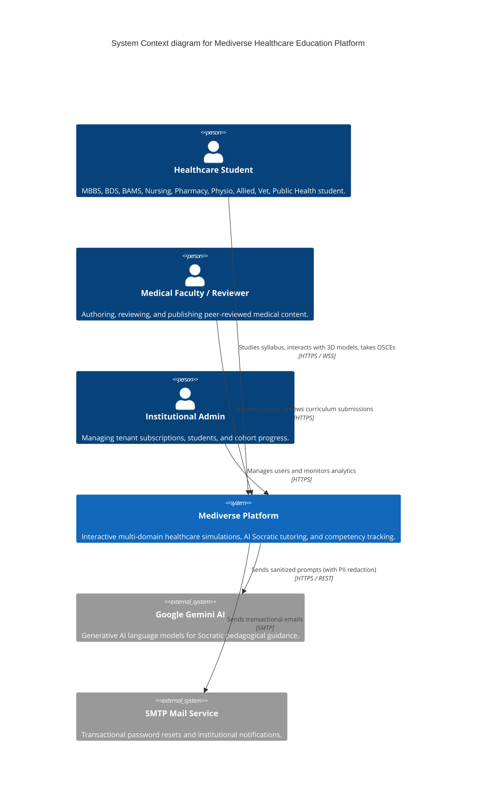
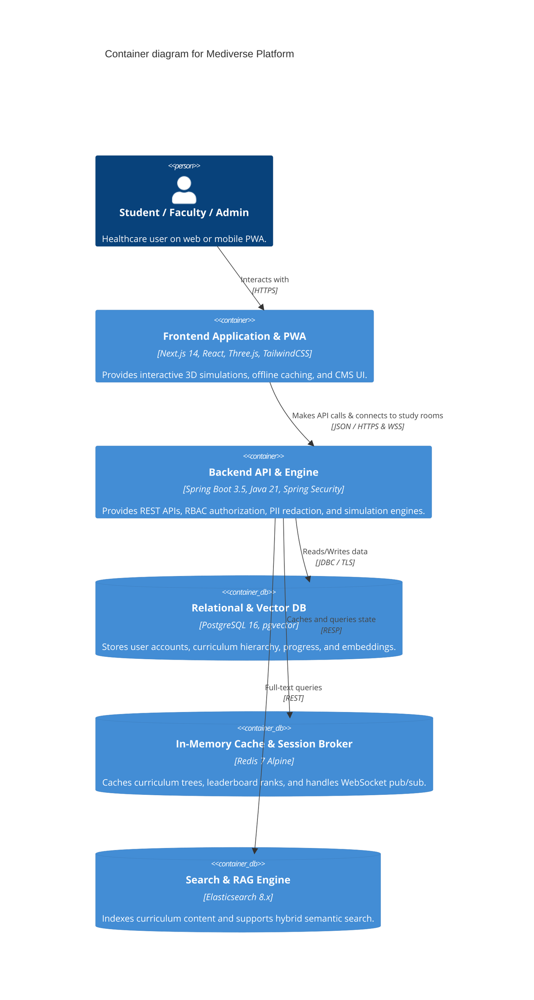
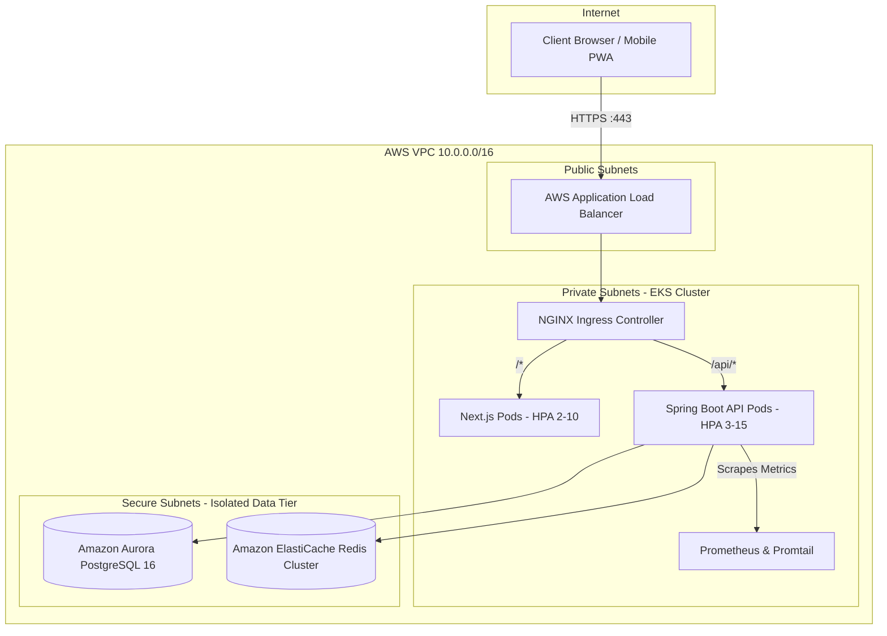

# Mediverse Architecture & C4 Model Blueprint

---

## 1. System Context Diagram (C4 Level 1)

```mermaid
C4Context
    title System Context diagram for Mediverse Healthcare Education Platform

    Person(student, "Healthcare Student", "MBBS, BDS, BAMS, Nursing, Pharmacy, Physio, Allied, Vet, Public Health student.")
    Person(faculty, "Medical Faculty / Reviewer", "Authoring, reviewing, and publishing peer-reviewed medical content.")
    Person(admin, "Institutional Admin", "Managing tenant subscriptions, students, and cohort progress.")

    System(mediverse, "Mediverse Platform", "Interactive multi-domain healthcare simulations, AI Socratic tutoring, and competency tracking.")

    System_Ext(gemini, "Google Gemini AI", "Generative AI language models for Socratic pedagogical guidance.")
    System_Ext(mail, "SMTP Mail Service", "Transactional password resets and institutional notifications.")

    Rel(student, mediverse, "Studies syllabus, interacts with 3D models, takes OSCEs", "HTTPS / WSS")
    Rel(faculty, mediverse, "Authors lessons, reviews curriculum submissions", "HTTPS")
    Rel(admin, mediverse, "Manages users and monitors analytics", "HTTPS")

    Rel(mediverse, gemini, "Sends sanitized prompts (with PII redaction)", "HTTPS / REST")
    Rel(mediverse, mail, "Sends transactional emails", "SMTP")
```

---

## 2. Container Diagram (C4 Level 2)

```mermaid
C4Container
    title Container diagram for Mediverse Platform

    Person(user, "Student / Faculty / Admin", "Healthcare user on web or mobile PWA.")

    Container(frontend, "Frontend Application & PWA", "Next.js 14, React, Three.js, TailwindCSS", "Provides interactive 3D simulations, offline caching, and CMS UI.")
    Container(backend, "Backend API & Engine", "Spring Boot 3.5, Java 21, Spring Security", "Provides REST APIs, RBAC authorization, PII redaction, and simulation engines.")

    ContainerDb(postgres, "Relational & Vector DB", "PostgreSQL 16, pgvector", "Stores user accounts, curriculum hierarchy, progress, and embeddings.")
    ContainerDb(redis, "In-Memory Cache & Session Broker", "Redis 7 Alpine", "Caches curriculum trees, leaderboard ranks, and handles WebSocket pub/sub.")
    ContainerDb(elasticsearch, "Search & RAG Engine", "Elasticsearch 8.x", "Indexes curriculum content and supports hybrid semantic search.")

    Rel(user, frontend, "Interacts with", "HTTPS")
    Rel(frontend, backend, "Makes API calls & connects to study rooms", "JSON / HTTPS & WSS")
    Rel(backend, postgres, "Reads/Writes data", "JDBC / TLS")
    Rel(backend, redis, "Caches and queries state", "RESP")
    Rel(backend, elasticsearch, "Full-text queries", "REST")
```

---

## 3. Production Deployment Architecture (AWS EKS)

```mermaid
flowchart TD
    subgraph Internet
        Client[Client Browser / Mobile PWA]
    end

    subgraph AWS VPC 10.0.0.0/16
        subgraph Public Subnets
            ALB[AWS Application Load Balancer]
        end

        subgraph Private Subnets - EKS Cluster
            Ingress[NGINX Ingress Controller]
            NextJS[Next.js Pods - HPA 2-10]
            SpringBoot[Spring Boot API Pods - HPA 3-15]
            Prometheus[Prometheus & Promtail]
        end

        subgraph Secure Subnets - Isolated Data Tier
            RDS[(Amazon Aurora PostgreSQL 16)]
            ElastiCache[(Amazon ElastiCache Redis Cluster)]
        end
    end

    Client -->|HTTPS :443| ALB
    ALB --> Ingress
    Ingress -->|/api/*| SpringBoot
    Ingress -->|/*| NextJS
    SpringBoot --> RDS
    SpringBoot --> ElastiCache
    SpringBoot -->|Scrapes Metrics| Prometheus
```
