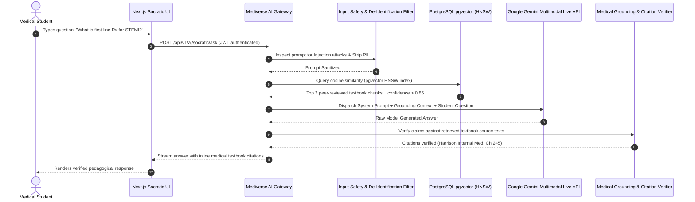

# Mediverse Architecture — AI Platform & Medical RAG Specification

```text
Document ID:       MED-ARCH-08
Classification:    Enterprise Standard
Status:            APPROVED
Parent Document:   ENTERPRISE_SYSTEM_ARCHITECTURE.md
```

---

## 1. Dual-Stage Medical RAG Architecture

To eliminate medical hallucinations and ensure clinical accuracy, Mediverse implements a **Dual-Stage Dense-Sparse RAG Pipeline** backed by **pgvector (HNSW)** and **Google Gemini Foundation Models**.



---

## 2. Vector Indexing & Chunking Pipeline

1. **Chunking Strategy:** Educational medical textbooks and faculty articles are ingested, parsed into structured markdown, and chunked into **512-token windows with 64-token overlap**.
2. **Embedding Model:** Vector embeddings generated via `text-embedding-004` (1536 dimensions).
3. **Index Structure:** PostgreSQL `pgvector` HNSW index configured with `m = 16`, `ef_construction = 64` for sub-10ms nearest-neighbor queries.

```sql
-- pgvector Table & Index Definition
CREATE TABLE IF NOT EXISTS curriculum_vector_embeddings (
    id UUID PRIMARY KEY DEFAULT gen_random_uuid(),
    content_chunk_id VARCHAR(64) NOT NULL,
    domain VARCHAR(32) NOT NULL,
    textbook_title VARCHAR(255) NOT NULL,
    chapter_title VARCHAR(255) NOT NULL,
    chunk_text TEXT NOT NULL,
    embedding vector(1536) NOT NULL,
    created_at TIMESTAMP WITH TIME ZONE DEFAULT CURRENT_TIMESTAMP
);

CREATE INDEX IF NOT EXISTS idx_curriculum_embedding_hnsw 
ON curriculum_vector_embeddings 
USING hnsw (embedding vector_cosine_ops) 
WITH (m = 16, ef_construction = 64);
```

---

## 3. Medical Safety, Anti-Hallucination & Provenance Controls

- **Prompt Injection Defense:** Input tokens evaluated against known adversarial jailbreaks (`DAN`, system override patterns).
- **Mandatory Citation Verifier:** Every generated medical claim must cite an exact textbook title, chapter, and section retrieved in the RAG window. Claims lacking supporting context in the retrieved chunks are rejected with a fallback notification.
- **Cost & Token Governance:** Rate limits of **20 AI queries/hour/student** enforced via Redis Token Bucket to manage inference operational expenses.
