# Mediverse Architecture — Container Specification (C4 Level 2)

```text
Document ID:       MED-ARCH-02
Classification:    Enterprise Standard
Status:            APPROVED
Parent Document:   ENTERPRISE_SYSTEM_ARCHITECTURE.md
```

---

## 1. Container Overview

The container architecture defines the high-level executable units, web applications, microservices, databases, and message brokers that form the Mediverse platform.

---

## 2. Container Diagram

```mermaid
C4Container
    title Container Diagram — Mediverse Cloud-Native Infrastructure

    Person(user, "Healthcare User", "Student, Faculty, or Admin on Web/Mobile.")

    Container(spa, "Single Page App & 3D Client", "Next.js 14, React Three Fiber, Three.js, Tailwind CSS", "Renders UI, WebXR spatial anatomy, and audio streaming.")
    Container(gateway, "API Gateway", "Spring Cloud Gateway", "Route resolution, SSL termination, JWT verification, rate limiting.")
    Container(iam, "Identity Provider", "Keycloak 24", "OAuth 2.0 / OIDC authentication server, user federations.")

    Container(curriculum_svc, "Curriculum & Content Service", "Java 21, Spring Boot 3.5", "Manages 9 medical domain syllabi, lessons, and textbook chunks.")
    Container(learning_svc, "Learning & Progress Service", "Java 21, Spring Boot 3.5", "Tracks student milestones, flashcard mastery, and study streaks.")
    Container(assessment_svc, "Assessment & OSCE Service", "Java 21, Spring Boot 3.5", "Executes timed OSCE stations, MCQ banks, and viva voce exams.")
    Container(ai_svc, "AI Gateway & RAG Engine", "Java 21, Spring Boot 3.5, pgvector", "Retrieves textbook context, executes prompt guardrails, and calls LLM.")
    Container(emr_svc, "Mock EMR & Grading Service", "Java 21, Spring Boot 3.5", "Simulates hospital EMR charting and executes automated SOAP grading.")
    Container(tenant_svc, "Tenant & Cohort Service", "Java 21, Spring Boot 3.5", "Manages university isolation, branding, and roster batch imports.")

    ContainerDb(postgres, "Primary Relational & Vector DB", "Amazon Aurora PostgreSQL 16 + pgvector", "Authoritative system of record for all domain entities and embeddings.")
    ContainerDb(redis, "In-Memory Cache & Session Store", "Redis 7 Cluster", "Hot curriculum cache, rate limiting counters, and WebRTC signaling.")
    ContainerDb(kafka, "Event Streaming Backbone", "Apache Kafka 3.7 (Strimzi)", "Asynchronous domain event streaming and Transactional Outbox ingestion.")
    ContainerDb(s3, "Medical Asset Storage", "Amazon S3 / MinIO", "Immutable store for 3D meshes, radiology images, and lecture media.")

    Rel(user, spa, "Interacts via browser / WebXR headset", "HTTPS")
    Rel(spa, gateway, "API Requests & WebSockets", "HTTPS / WSS")
    Rel(gateway, iam, "OIDC Token Introspection", "REST / TLS")
    Rel(gateway, curriculum_svc, "Routes /api/v1/curriculum/**", "gRPC / HTTP/2")
    Rel(gateway, learning_svc, "Routes /api/v1/learning/**", "gRPC / HTTP/2")
    Rel(gateway, assessment_svc, "Routes /api/v1/assessments/**", "gRPC / HTTP/2")
    Rel(gateway, ai_svc, "Routes /api/v1/ai/**", "gRPC / HTTP/2")
    Rel(gateway, emr_svc, "Routes /api/v1/emr/**", "gRPC / HTTP/2")
    Rel(gateway, tenant_svc, "Routes /api/v1/tenants/**", "gRPC / HTTP/2")

    Rel(curriculum_svc, postgres, "Reads/Writes syllabus", "JDBC / TLS")
    Rel(learning_svc, postgres, "Reads/Writes progress", "JDBC / TLS")
    Rel(assessment_svc, postgres, "Reads/Writes exams", "JDBC / TLS")
    Rel(ai_svc, postgres, "Vector Similarity Search", "JDBC / pgvector")
    Rel(emr_svc, postgres, "Reads/Writes clinical notes", "JDBC / TLS")
    Rel(tenant_svc, postgres, "Reads/Writes tenant configs", "JDBC / TLS")

    Rel(curriculum_svc, redis, "Caches curriculum trees", "RESP")
    Rel(assessment_svc, redis, "Stores live OSCE timers", "RESP")
    Rel(learning_svc, kafka, "Publishes ProgressUpdated", "Kafka Protocol")
    Rel(assessment_svc, kafka, "Publishes ExamCompleted", "Kafka Protocol")
    Rel(curriculum_svc, s3, "Fetches 3D asset metadata", "AWS SDK")
```



---

## 3. Container Communication Protocols & Technology Stack

| Container | Technology | Runtime Port | Ingress Protocol | Egress Dependencies |
|---|---|---|---|---|
| **Frontend Web Client** | Next.js 14 / React 18 / TypeScript | `:3000` | HTTPS | Cloudflare CDN, API Gateway (`:443`), S3 |
| **API Gateway** | Spring Cloud Gateway 4.x / Netty | `:8080` | HTTP/2 / WSS | Keycloak, Core Microservices, Redis |
| **Identity Service** | Keycloak 24 (Quarkus Engine) | `:8443` | HTTPS / OIDC | PostgreSQL (`keycloak_db`) |
| **Curriculum Service** | Java 21 / Spring Boot 3.5 | `:8081` | HTTP/2 (mTLS) | PostgreSQL, Redis, S3 |
| **Learning Progress Service** | Java 21 / Spring Boot 3.5 | `:8082` | HTTP/2 (mTLS) | PostgreSQL, Kafka Broker |
| **Assessment & OSCE Service**| Java 21 / Spring Boot 3.5 | `:8083` | HTTP/2 (mTLS) | PostgreSQL, Redis, Kafka Broker |
| **AI Gateway & RAG Service** | Java 21 / Spring Boot 3.5 / pgvector | `:8084` | HTTP/2 (mTLS) | PostgreSQL (pgvector HNSW), Gemini LLM |
| **Mock EMR Service** | Java 21 / Spring Boot 3.5 | `:8085` | HTTP/2 (mTLS) | PostgreSQL, AI Gateway |
| **Tenant & Cohort Service** | Java 21 / Spring Boot 3.5 | `:8086` | HTTP/2 (mTLS) | PostgreSQL, Keycloak Admin API |
