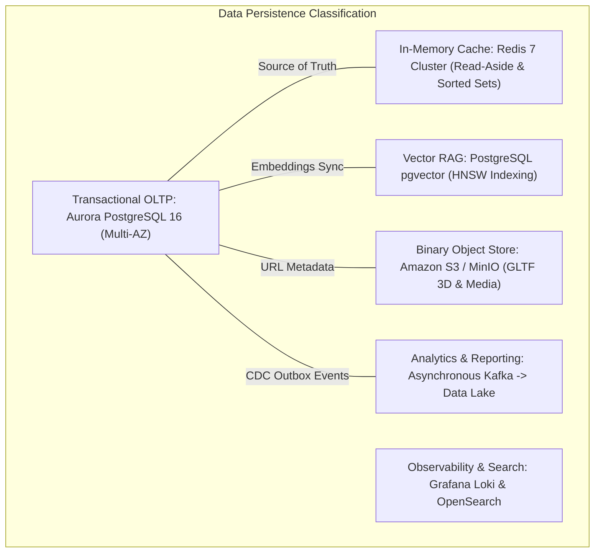

# Mediverse Architecture — Data Architecture & Persistence Specification

```text
Document ID:       MED-ARCH-06
Classification:    Enterprise Standard
Status:            APPROVED
Parent Document:   ENTERPRISE_SYSTEM_ARCHITECTURE.md
```

---

## 1. Persistence Tier Classification & Data Ownership

Mediverse enforces strict single-service schema ownership across **6 segregated persistence tiers**.



---

## 2. Database Schema Ownership Matrix

| Logical Database / Schema | Owning Microservice | Primary Tables | Backup Frequency | RPO Target |
|---|---|---|---|:---:|
| `curriculum_schema` | Curriculum & Content Service | `domains`, `subjects`, `chapters`, `content_blocks`, `textbook_chunks` | Continuous PITR (35 days) | $< 1\text{ min}$ |
| `learning_schema` | Learning Progress Service | `student_progress`, `flashcards`, `clinical_streaks` | Continuous PITR (35 days) | $< 1\text{ min}$ |
| `assessment_schema` | Assessment & OSCE Service | `questions`, `osce_stations`, `exam_sessions`, `rubrics` | Continuous PITR (35 days) | $< 1\text{ min}$ |
| `ai_vector_schema` | AI Gateway & RAG Service | `curriculum_embeddings` (vector column 1536 dim) | Daily Snapshot | $< 24\text{ hours}$ |
| `emr_schema` | Mock EMR & Grading Service | `emr_patients`, `clinical_notes`, `soap_evaluations` | Continuous PITR (35 days) | $< 1\text{ min}$ |
| `tenant_schema` | Tenant & Cohort Service | `university_tenants`, `cohort_rosters`, `tenant_branding` | Continuous PITR (35 days) | $< 1\text{ min}$ |
| `keycloak_db` | Identity Service (Keycloak) | `user_entity`, `realm`, `user_role_mapping` | Continuous PITR (35 days) | $< 1\text{ min}$ |

---

## 3. Schema Migrations & Zero-Downtime Evolution

- **Tool Standard:** **Flyway** is the sole authorized database migration tool.
- **Rules of Schema Evolution:**
  1. All migration scripts follow semantic naming: `V<Major>_<Minor>__<description>.sql`.
  2. Migrations must be strictly additive (expand-contract pattern) to ensure backward compatibility during Kubernetes blue/green and canary rollouts.
  3. Renaming or dropping columns requires a minimum two-release deprecation cycle.
  4. Non-transactional DDL migrations (e.g., `CREATE INDEX CONCURRENTLY`) are run in dedicated standalone maintenance jobs.
