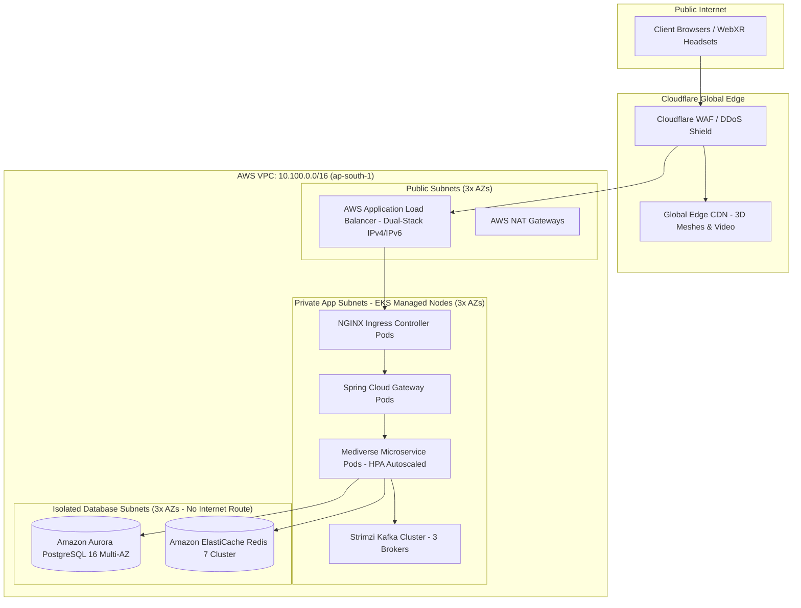

# Mediverse Architecture — Deployment & Kubernetes Specification

```text
Document ID:       MED-ARCH-03
Classification:    Enterprise Standard
Status:            APPROVED
Parent Document:   ENTERPRISE_SYSTEM_ARCHITECTURE.md
```

---

## 1. Cloud Infrastructure & VPC Topology

Mediverse is hosted on **AWS Elastic Kubernetes Service (EKS)** deployed within a dedicated, multi-AZ Virtual Private Cloud (VPC CIDR: `10.100.0.0/16`) spanning 3 Availability Zones in the primary region (`ap-south-1`).



---

## 2. Kubernetes Cluster Layout & Resource Profiles

| Namespace | Pod Role | Min Replicas | Max Replicas | CPU Request / Limit | Memory Request / Limit | Autoscaling Trigger |
|---|---|:---:|:---:|---|---|---|
| `ingress-system` | NGINX Ingress Controller | 3 | 10 | `500m` / `1000m` | `512Mi` / `1Gi` | CPU $> 75\%$ |
| `mediverse-app` | Spring Cloud Gateway | 3 | 12 | `1000m` / `2000m` | `1Gi` / `2Gi` | Request Rate $> 2000\text{ rps}$ |
| `mediverse-app` | Curriculum Service | 2 | 8 | `500m` / `1500m` | `1Gi` / `2Gi` | CPU $> 70\%$ |
| `mediverse-app` | Learning Progress Service | 2 | 6 | `500m` / `1000m` | `1Gi` / `2Gi` | CPU $> 75\%$ |
| `mediverse-app` | Assessment / OSCE Service | 3 | 15 | `1000m` / `2000m` | `2Gi` / `4Gi` | Active Exam Sessions $> 500$ |
| `mediverse-app` | AI Gateway & RAG Service | 3 | 10 | `1000m` / `2000m` | `2Gi` / `4Gi` | P95 Latency $> 2500\text{ms}$ |
| `kafka-system` | Strimzi Kafka Brokers | 3 | 3 (Fixed) | `2000m` / `4000m` | `4Gi` / `8Gi` | Fixed StatefulSet |
| `monitoring-system` | Prometheus Server | 2 | 2 | `2000m` / `4000m` | `8Gi` / `16Gi` | Dedicated Node Pool |

---

## 3. High-Availability & Failure Domain Isolation

1. **Topology Spread Constraints:** Pods are distributed across `topology.kubernetes.io/zone` to guarantee that the failure of any single AWS Availability Zone leaves $\ge 66\%$ capacity active.
2. **Pod Disruption Budgets (PDB):** Enforced with `minAvailable: 1` or `maxUnavailable: 25%` across all stateless services during node draining and rolling upgrades.
3. **Graceful Shutdown:** All Spring Boot microservices define `server.shutdown: graceful` with a `timeout-per-shutdown-phase: 30s`, honoring Kubernetes `preStop` hooks and connection draining.
