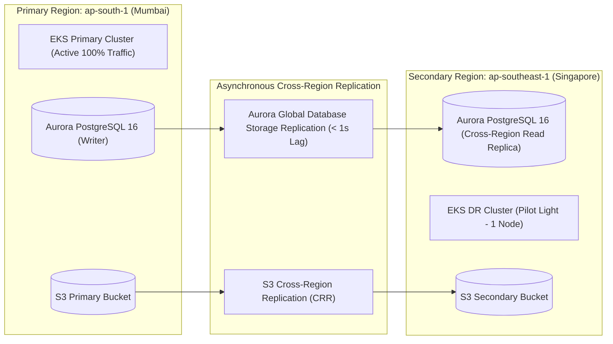

# Mediverse Architecture — Disaster Recovery & High Availability Specification

```text
Document ID:       MED-ARCH-11
Classification:    Enterprise Standard
Status:            APPROVED
Parent Document:   ENTERPRISE_SYSTEM_ARCHITECTURE.md
```

---

## 1. Disaster Recovery Objectives & Regional Strategy

- **Recovery Time Objective (RTO):** $\le 15\text{ minutes}$ (Full traffic redirect to secondary region).
- **Recovery Point Objective (RPO):** $\le 1\text{ minute}$ (Asynchronous Aurora Global Database replication lag).
- **Primary Region:** AWS `ap-south-1` (Mumbai — 3 Availability Zones, Active-100%).
- **Secondary DR Region:** AWS `ap-southeast-1` (Singapore — Pilot Light / Warm Standby).

---

## 2. Multi-Region Replication Architecture



---

## 3. Disaster Recovery Execution Runbook

1. **Incident Trigger:** Loss of primary cloud region or irreversible database corruption in `ap-south-1`.
2. **Step 1 — Global DNS Failover:** Update Route 53 / Cloudflare DNS health check failover to point `api.mediverse.org` to Singapore ALB endpoint (Elapsed: $< 2\text{ mins}$).
3. **Step 2 — Aurora Storage Promotion:** Promote Singapore Aurora Read Replica to standalone Write Master using AWS CLI / Terraform (Elapsed: $< 4\text{ mins}$).
4. **Step 3 — EKS Cluster Scale-Out:** Scale secondary EKS node group from 1 to 6 `m6i.xlarge` instances via Argo CD (Elapsed: $< 5\text{ mins}$).
5. **Step 4 — Verification:** Execute automated synthetic smoke suite (`production-smoke.yml`) validating auth, curriculum retrieval, and OSCE engines (Elapsed: $< 3\text{ mins}$).
