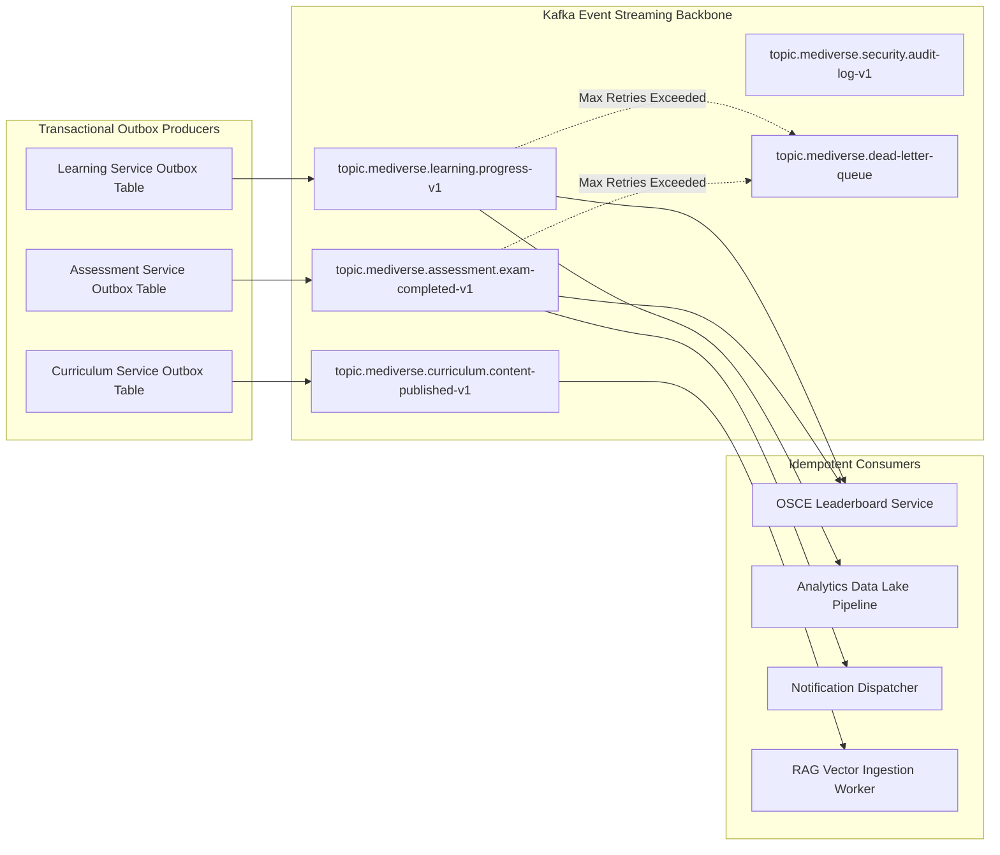

# Mediverse Architecture — Event-Driven Architecture Specification

```text
Document ID:       MED-ARCH-07
Classification:    Enterprise Standard
Status:            APPROVED
Parent Document:   ENTERPRISE_SYSTEM_ARCHITECTURE.md
```

---

## 1. Event Backbone Architecture

Mediverse implements an asynchronous, event-driven backbone powered by **Apache Kafka 3.7+** (managed via the Strimzi operator in KRaft mode) to decouple services, guarantee transactional outbox delivery, and stream real-time analytics.



---

## 2. Standard Event Envelope Schema

Every message published to Kafka must strictly conform to the CloudEvents-aligned Mediverse Event Envelope:

```json
{
  "eventId": "evt-7f8a9123-bc45-4de6-9812-321456987abc",
  "eventType": "com.curiolearn.assessment.ExamCompletedEvent",
  "eventVersion": "1.0.0",
  "correlationId": "req-a78b4c91-23df-4821-9988-123456789abc",
  "causationId": "cmd-submit-osce-001",
  "timestamp": "2026-08-30T08:30:15.120Z",
  "producer": "assessment-service",
  "tenantId": "tenant-aiims-delhi",
  "payload": {
    "examSessionId": "osce-sess-9912",
    "studentId": "usr-8812-stud",
    "stationId": "st-cardio-01",
    "scorePercentage": 92.5,
    "passed": true,
    "completionTimeSeconds": 340
  }
}
```

---

## 3. Reliability & Transactional Guarantees

1. **Transactional Outbox Pattern:** Services never write to PostgreSQL and produce to Kafka in uncoordinated steps. State changes and event records are committed within the same database transaction into an `outbox_events` table. A Debezium CDC connector / Spring poller streams records to Kafka.
2. **At-Least-Once Delivery & Idempotency:** Consumers assume at-least-once delivery semantics and enforce deduplication using an `idempotent_inbox` table keyed on `eventId`.
3. **Dead-Letter Topics (DLQ):** Messages failing processing after 3 exponential backoff retries are shunted to `topic.mediverse.dead-letter-queue` with the failure stack trace appended to message headers.
