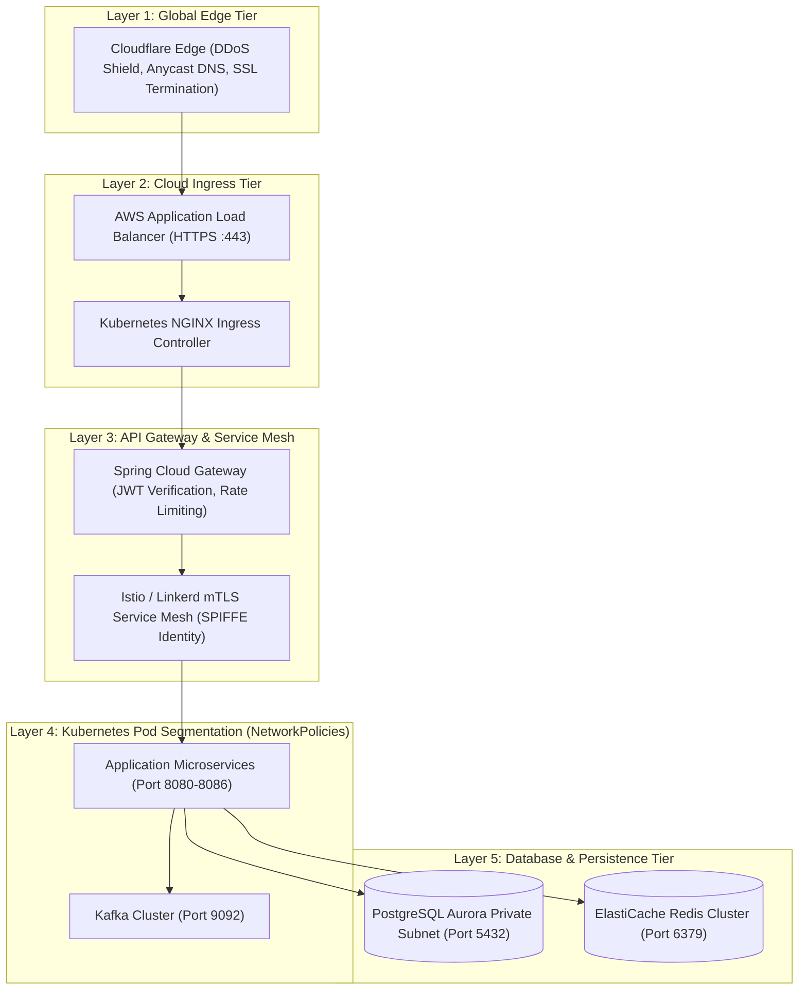

# Mediverse Architecture — Network & Ingress Specification

```text
Document ID:       MED-ARCH-04
Classification:    Enterprise Standard
Status:            APPROVED
Parent Document:   ENTERPRISE_SYSTEM_ARCHITECTURE.md
```

---

## 1. Network Architecture Overview

Mediverse enforces a layered, defence-in-depth network topology transitioning from public edge inspection to zero-trust microservice segmentation.



---

## 2. Kubernetes NetworkPolicy Rules (Default-Deny)

All namespaces in the Mediverse EKS cluster enforce default-deny ingress and egress rules. Only explicitly whitelisted pod-to-pod communications are permitted.

```yaml
apiVersion: networking.k8s.io/v1
kind: NetworkPolicy
metadata:
  name: default-deny-all
  namespace: mediverse-app
spec:
  podSelector: {}
  policyTypes:
    - Ingress
    - Egress
---
apiVersion: networking.k8s.io/v1
kind: NetworkPolicy
metadata:
  name: allow-gateway-to-curriculum
  namespace: mediverse-app
spec:
  podSelector:
    matchLabels:
      app.kubernetes.io/name: curriculum-service
  ingress:
    - from:
        - podSelector:
            matchLabels:
              app.kubernetes.io/name: spring-cloud-gateway
      ports:
        - protocol: TCP
          port: 8081
  policyTypes:
    - Ingress
```

---

## 3. Ingress Security & TLS Ciphers

- **Protocols Supported:** TLS 1.3 (Primary), TLS 1.2 (Fallback with strict forward secrecy). TLS 1.0 and 1.1 are unconditionally rejected at the Cloudflare edge.
- **Strict Transport Security (HSTS):** `max-age=31536000; includeSubDomains; preload` header sent on all HTTPS responses.
- **mTLS Service Mesh:** Intra-cluster communications utilize Envoy sidecar proxies with automated mutual TLS and X.509 certificate rotations via cert-manager and SPIFFE workload identities.
