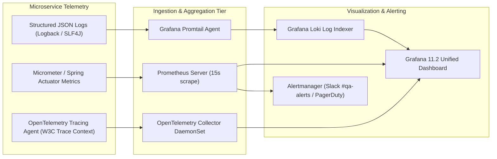

# Mediverse Architecture — Observability & SRE Specification

```text
Document ID:       MED-ARCH-10
Classification:    Enterprise Standard
Status:            APPROVED
Parent Document:   ENTERPRISE_SYSTEM_ARCHITECTURE.md
```

---

## 1. Unified Telemetry Architecture

Mediverse implements an end-to-end open-source observability stack leveraging **OpenTelemetry**, **Prometheus**, **Grafana Loki**, and **Grafana Dashboards**.



---

## 2. Distributed Tracing & W3C Context Propagation

Every HTTP request, gRPC call, and Kafka event carries standard W3C Distributed Tracing headers:
- `traceparent`: `00-4bf92f3577b34da6a3ce929d0e0e4736-00f067aa0ba902b7-01`
- `X-Correlation-ID`: Universal client session request identifier.
- `X-Tenant-ID`: Institutional identifier for multi-tenant log isolation.

---

## 3. Core SRE Service Level Objectives (SLOs)

| Service | Indicator (SLI) | Target SLO | Monthly Error Budget | Alert Condition |
|---|---|---|---|---|
| **Core API Gateway** | Success rate ($2xx/3xx$ over Total) | $\ge 99.95\%$ | $21.9\text{ min}$ | Burn rate $> 14.4\times$ (1hr) |
| **API Latency (Non-AI)**| P95 Response Time $\le 250\text{ms}$ | $\ge 99.0\%$ | $7.2\text{ hours}$ | P95 $> 500\text{ms}$ over 5m |
| **AI Tutor RAG Engine** | Time to First Token $\le 1500\text{ms}$ | $\ge 98.0\%$ | $14.4\text{ hours}$ | TTFT $> 3000\text{ms}$ over 5m |
| **OSCE Exam Engine** | Zero exam answer submission data loss | $\ge 99.99\%$ | $4.38\text{ min}$ | Any $5xx$ on `/api/v1/osce/*/submit` |
