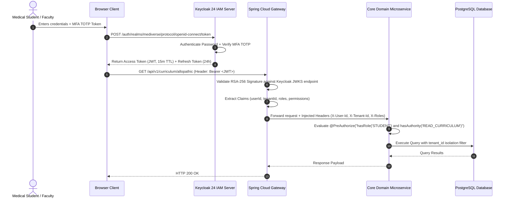

# Mediverse Architecture — Security & Identity Specification

```text
Document ID:       MED-ARCH-05
Classification:    Enterprise Standard
Status:            APPROVED
Parent Document:   ENTERPRISE_SYSTEM_ARCHITECTURE.md
```

---

## 1. Zero-Trust Security Paradigm

Mediverse operates under the fundamental zero-trust premise: **"Never trust, always verify."** No internal subnet, Kubernetes pod, or service account is inherently trusted simply due to its internal network presence.

---

## 2. Authentication & Authorization Flow



---

## 3. Role-Based Access Control (RBAC) Matrix

| Resource / Action | Anonymous User | Medical Student | Medical Faculty / SME | Department Head | Institutional Admin | System Super-Admin |
|---|:---:|:---:|:---:|:---:|:---:|:---:|
| **Public Landing & Catalog** | ✅ READ | ✅ READ | ✅ READ | ✅ READ | ✅ READ | ✅ READ |
| **Study Curriculum / 3D Models** | ❌ DENY | ✅ READ | ✅ READ | ✅ READ | ✅ READ | ✅ READ |
| **Socratic AI Queries** | ❌ DENY | ✅ EXECUTE (Rate Limited) | ✅ EXECUTE | ✅ EXECUTE | ✅ EXECUTE | ✅ UNLIMITED |
| **Take OSCE Examination** | ❌ DENY | ✅ EXECUTE | ✅ READ / TEST | ✅ READ | ✅ READ | ✅ READ |
| **Author / Edit Curriculum** | ❌ DENY | ❌ DENY | ✅ CREATE / EDIT | ✅ APPROVE | ❌ DENY | ✅ FULL |
| **Grade Clinical SOAP Notes** | ❌ DENY | ❌ DENY | ✅ EVALUATE | ✅ EVALUATE | ❌ DENY | ✅ FULL |
| **Cohort Analytics & Rosters**| ❌ DENY | ❌ DENY | ❌ DENY | ✅ READ COHORT | ✅ MANAGE TENANT | ✅ GLOBAL READ |
| **Security & System Config** | ❌ DENY | ❌ DENY | ❌ DENY | ❌ DENY | ❌ DENY | ✅ FULL ADMIN |

---

## 4. Secrets Management & Key Rotation

1. **Storage Policy:** Absolutely zero plain-text credentials, database passwords, or API keys are committed to Git repositories or baked into Docker container layers.
2. **Runtime Injection:** Managed via the **External Secrets Operator (ESO)** synchronizing secrets from **AWS Secrets Manager** / **HashiCorp Vault** into Kubernetes secret primitives mounted as in-memory volumes (`tmpfs`).
3. **Automated Rotation:** Database credentials, JWT signing keys, and external API tokens are rotated automatically on a **90-day schedule** with zero downtime.
