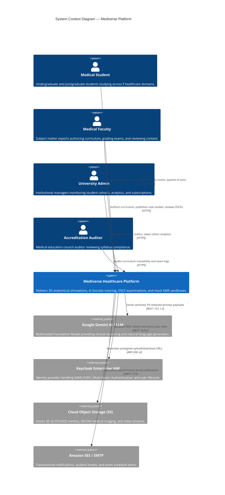

# Mediverse Architecture — System Context Specification (C4 Level 1)

```text
Document ID:       MED-ARCH-01
Classification:    Enterprise Standard
Status:            APPROVED
Parent Document:   ENTERPRISE_SYSTEM_ARCHITECTURE.md
```

---

## 1. Overview & Business Context

Mediverse is an AI-powered medical education platform designed for medical students, clinical educators, and university administrators across **9 distinct medical domains** (Allopathic MBBS, Dental BDS, AYUSH, Pharmacy, Nursing, Physiotherapy, Allied Health, Veterinary, and Public Health).

The system context defines the high-level boundary of Mediverse and its interactions with human actors and external cloud systems.

---

## 2. System Context Diagram



---

## 3. Actor Profiles & Operational Responsibilities

| Actor | Access Channels | Primary Capabilities | Security Constraints |
|---|---|---|---|
| **Medical Student** | Web SPA, Mobile PWA, WebXR Headset | Study curriculum, interact with 3D models, query Socratic AI tutor, take timed OSCE exams, chart mock EMR notes | Tenant-scoped data isolation; rate-limited AI queries; no administrative access |
| **Medical Faculty / SME** | Web Desktop Portal | Author syllabus modules, review peer submissions, grade viva voce exams, configure OSCE stations | Multi-factor authentication (MFA); audit-logged content approvals |
| **University Administrator** | Admin Web Portal | Manage student cohorts, batch-import CSV rosters, view cohort competency heatmaps, configure domain branding | Strict institutional tenant boundary (`TenantId` isolation); RBAC enforcement |
| **Accreditation Auditor** | Read-Only Audit Portal | Verify curriculum compliance against medical regulatory guidelines (NMC, DCI, AYUSH) | Immutable read-only view; cryptographically signed exam logs |

---

## 4. External Cloud Dependencies & SLA Contracts

| External System | Integration Protocol | Data Exchanged | Fallback / Resiliency Strategy | Target Availability |
|---|---|---|---|:---:|
| **Google Gemini API** | REST / WSS (TLS 1.3) | Sanitized clinical prompts, structured JSON evaluation rubrics | Fallback to cached peer-reviewed textbook summaries; retry with exponential backoff | $99.90\%$ |
| **Keycloak IAM** | OIDC / OAuth 2.0 (mTLS) | JWT token issuance, JWKS public keys, user roles | Local Spring Gateway JWT verification using cached JWKS (60s TTL) | $99.99\%$ |
| **Amazon S3 / MinIO** | AWS SDK v2 / REST | 3D GLTF meshes, medical diagrams, radiology images | Multi-region S3 replication; CloudFront CDN origin shield | $99.99\%$ |
| **Amazon SES / SMTP** | SMTP (TLS) | Account invites, exam reminders, incident alerts | Dead-letter queue buffering in Kafka; asynchronous retries | $99.90\%$ |
