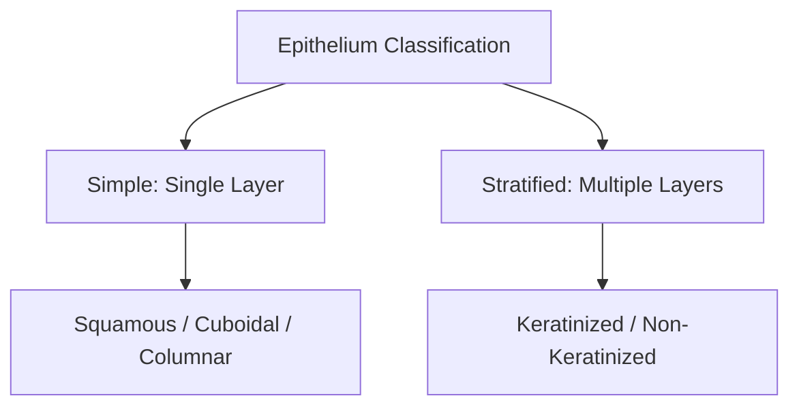

# Epithelial Histology: Classification and Structure

### 1. Introduction
Epithelial tissues form continuous sheets of cells that line internal cavities, cover external surfaces, and form the secretory units of glands. This chapter covers the classification, microscopic structure, and junctions of epithelia.

### 2. Daily Life Analogy
Epithelial tissue is like the tiles and drywall of a house:
- **Simple Squamous**: Thin cling-wrap (lining blood vessels for fast gas exchange).
- **Stratified Squamous**: Sturdy ceramic floor tiles (lining the skin/esophagus to resist constant friction).
- **Tight Junctions**: Waterproof silicone caulk sealing the gaps between tiles to prevent leaks.

### 3. Basic Concept
Epithelia are characterized by close cellular apposition, specialized cell junctions, lateral/apical polarity, and basement membrane anchorage. They are completely **avascular**, receiving oxygen and nutrients via diffusion from underlying connective tissues.

### 4. Anatomy Review
Under light microscopy, epithelia are classified by the number of cell layers (Simple vs. Stratified) and the shape of the surface cells (Squamous, Cuboidal, Columnar, Transitional/Urothelium).

### 5. Physiology
*   **Simple Squamous**: Facilitates diffusion (alveoli, endothelial lining of blood vessels - also known as endothelium).
*   **Simple Cuboidal**: Lines tubules and secretory ducts (kidney tubules, thyroid follicles).
*   **Simple Columnar**: Specializes in absorption and secretion (gastric lining, small and large intestines).
*   **Stratified Squamous**: Provides mechanical protection against wear-and-tear (keratinized in skin, non-keratinized in oral cavity and esophagus).

### 6. Mechanism
*   **Cell Junctions**:
    *   **Tight Junctions (Zonula Occludens)**: Form a barrier preventing paracellular solute diffusion.
    *   **Adherens Junctions (Zonula Adherens)**: Link actin cytoskeletons of adjacent cells.
    *   **Desmosomes (Macula Adherens)**: Intermediate filaments anchor cells together.
    *   **Gap Junctions**: Direct electrical/ionic coupling between cytoplasms.

### 7. Animation
Observe the dynamic changes in this physiological process.
<animation-placeholder />

### 8. Interactive 3D Model
Explore the structural components involved in this process.
<3d-model-placeholder />

### 9. Flowchart

### 10. Clinical Correlation
*   **Celiac Disease**: Immune reaction to gluten damages small intestinal microvilli, causing atrophy of simple columnar enterocytes and severe nutrient malabsorption.
*   **Barrett's Esophagus**: Chronic gastroesophageal acid reflux causes metaplasia, replacing stratified squamous epithelium of the esophagus with simple columnar epithelium.

### 11. Disorders
1.  **Pemphigus Vulgaris**: Autoantibodies target **Desmoglein** (desmosomal proteins), causing loss of cell-to-cell adhesion (acantholysis) and severe skin blistering.
2.  **Immotile Cilia Syndrome (Kartagener's)**: Genetic defect in dynein arms of cilia, impairing mucociliary clearance in pseudostratified columnar airways.

### 12. Summary
*   Epithelia are avascular sheets classifying by layer number and cell shape.
*   Cell junctions regulate permeability and structural integrity.

### 13. Important Formula
$$ \text{Total Epithelial Surface Area} \propto \text{Density of Microvilli / Cilia} $$

### 14. Mnemonics
*   **T**ight Junctions = **T**ight seal (no leaks).
*   **D**esmosomes = **D**urable anchorage (acantholysis target).

### 15. Viva Questions
1.  **Why is epithelial tissue avascular, and how does it survive?**
    *   **Answer**: Being avascular protects the body; if blood vessels ran through the outer skin or gut lining, minor abrasions would cause bleeding. They survive via nutrient diffusion across the basement membrane from capillaries in the dermis/lamina propria.

### 16. MCQs
1.  Which cell junction prevents paracellular transport between adjacent epithelial cells?
    *   A) Desmosome
    *   B) Gap Junction
    *   C) Tight Junction
    *   D) Hemidesmosome
    *   **Answer**: C

### 17. Case-Based Learning
A patient presents with fragile blisters on the skin that rupture easily (positive Nikolsky sign). Skin biopsy shows intraepidermal splitting. **Analysis**: Pemphigus Vulgaris, where autoantibodies target desmoglein, disrupting desmosomes.

### 18. Flashcards
*   **Front**: What protein anchors epithelial cells to the basement membrane?
    **Back**: Integrins in hemidesmosomes.

### 19. Revision Notes
*   **Urothelium**: Specialized transitional epithelium lining the urinary bladder, capable of stretching without tearing.

### 20. Practice Quiz
<quiz-placeholder />
