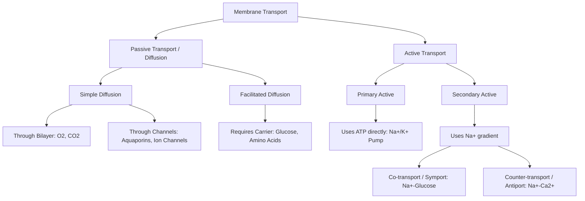

# Section 1: Homeostasis & Cell Physiology

## Chapter 2: Cell Membrane & Transport Mechanisms

---

### 1. Introduction
The cell is the basic structural and functional unit of life. Each cell is wrapped in a thin, flexible envelope called the cell membrane. To stay alive, the cell must constantly import raw materials (oxygen, glucose, amino acids) and export waste products (carbon dioxide, urea) and secretions. The cell membrane acts as a selective gatekeeper, deciding what goes in and out.

### 2. Daily Life Analogy
Imagine a medieval castle surrounded by a stone wall. The wall keeps out enemies but would choke the castle inhabitants if it blocked everything. To survive, the wall has guarded gates. Some gates allow anyone to walk through (simple passage), some require keys or specific guards to identify visitors (facilitated channels), and others use mechanical lifts powered by horses to pull heavy goods up against gravity (active transport pumps).
The cell membrane is the castle wall, and its transport proteins are the guarded gates.

### 3. Basic Concept
- **Lipid Bilayer**: A double layer of phospholipids. Each phospholipid has a hydrophilic (water-loving) polar head facing outwards and two hydrophobic (water-fearing) nonpolar fatty acid tails facing inwards.
- **Selective Permeability**: Lipids and lipid-soluble substances (oxygen, carbon dioxide, alcohol) dissolve directly in the bilayer and cross easily. Water-soluble substances (ions, glucose, urea) cannot pass through the lipid tails and require specialized transport proteins.

```text
       EXTRACELLULAR FLUID
    [ Hydrophilic Heads (Polar) ]
    ~~~~~~~~~~~~~~~~~~~~~~~~~~~~~
    | | | | | | | | | | | | | | |  <-- Hydrophobic Tails (Nonpolar)
    | | | | | | | | | | | | | | |
    ~~~~~~~~~~~~~~~~~~~~~~~~~~~~~
    [ Hydrophilic Heads (Polar) ]
       INTRACELLULAR FLUID
```

### 4. Anatomy Review
The membrane is composed of:
- **Lipids (42%)**: Phospholipids, cholesterol (controls membrane fluidity), and glycolipids.
- **Proteins (55%)**: 
  - *Integral Proteins*: Penetrate through the membrane (receptors, channels, carriers).
  - *Peripheral Proteins*: Attached only to the surface, often acting as enzymes or regulatory sub-units.
- **Carbohydrates (3%)**: Glycoproteins and glycolipids forming a loose outer coat called the **Glycocalyx**, which is involved in cell-to-cell adhesion and immune recognition.

### 5. Physiology
Solutes cross the membrane via two main mechanisms based on energy requirements:
1. **Passive Transport (Diffusion)**: Movement *down* a chemical, electrical, or pressure gradient. Requires no metabolic energy (ATP). Driven by the random thermal motion of molecules.
2. **Active Transport**: Movement *against* an electrochemical gradient. Requires metabolic energy (ATP) and carrier proteins.

---

### 6. Mechanism

#### A. Passive Transport (Diffusion)
- **Simple Diffusion**: Solutes cross without binding to carrier proteins.
  * *Through Lipid Bilayer*: Highly lipid-soluble molecules.
  * *Through Protein Channels*: Aquaporins (water channels) and ion channels (ion-selective pores).
  * *Gating of Protein Channels*:
    1. **Voltage-gated**: Opened by changes in electrical membrane potential (e.g. voltage-gated \(Na^+\) channels).
    2. **Ligand-gated**: Opened by binding of a chemical substance (e.g. Acetylcholine opening nicotinic channels).
- **Facilitated (Carrier-Mediated) Diffusion**: Requires a carrier protein. The solute binds to a specific receptor on the carrier, inducing a conformational change that exposes the binding site to the opposite side of the membrane.
  * *Rate Limitation (Vmax)*: Unlike simple diffusion, which increases linearly with solute concentration, facilitated diffusion reaches a maximum rate (\(V_{\text{max}}\)) when all carrier protein binding sites are saturated.

```text
Simple Diffusion vs Facilitated Diffusion Rate:
Rate of
Transport |        / Simple Diffusion (linear)
          |       /
          |      / ______ Facilitated Diffusion (reaches Vmax)
          |    / /
          |  / /
          |/_/______________________
                   Solute Concentration
```

- **Fick's Law of Diffusion**: The rate of net diffusion (\(J\)) is given by:
  \[J = \frac{D \cdot A \cdot (C_o - C_i)}{L}\]
  *Where \(D\) is the diffusion coefficient, \(A\) is the cross-sectional area, \((C_o - C_i)\) is the concentration gradient, and \(L\) is the thickness of the membrane.*

#### B. Active Transport
- **Primary Active Transport**: Energy is derived directly from the breakdown of ATP.
  * **Sodium-Potassium Pump (\(Na^+\)-\(K^+\) ATPase)**: 
    * Carrier protein complex containing three binding sites for \(Na^+\) on the inside, two binding sites for \(K^+\) on the outside, and ATPase activity on the inside.
    * *Mechanism*: Pumps **3 \(Na^+\) ions out** and **2 \(K^+\) ions in** for every ATP hydrolyzed.
    * *Significance*: Establishes electrical gradients (electrogenic pump), maintains cell volume by preventing osmotic swelling, and provides the concentration gradients that power secondary transport.
- **Secondary Active Transport**: Transport is driven by the energy stored in ionic concentration differences (gradients) created by primary active transport (usually the sodium gradient).
  * **Co-transport (Symport)**: The active transport of a substance in the *same direction* as the driving ion. (e.g., Sodium-Glucose Co-transporter SGLT in renal tubules and enterocytes).
  * **Counter-transport (Antiport)**: The active transport of a substance in the *opposite direction* of the driving ion. (e.g., Sodium-Calcium exchanger NCX, Sodium-Hydrogen exchanger NHE).

---

### 7. Animation Summary
*Visualization focuses on:* The conformational change of the \(Na^+\)-\(K^+\) ATPase pump as it binds intracellular sodium, is phosphorylated by ATP, releases sodium extracellularly, binds potassium, and returns to its resting state.

### 8. 3D Model Guide
*Interactive viewer targets:* Phospholipid bilayer cross section. Hovering over a channel displays its gating properties. Activating the \(Na^+\)-\(K^+\) pump displays ion bindings and phosphorylation steps.

### 9. Flowchart



### 10. Clinical Correlation
- **Cardiac Glycosides (Digoxin/Ouabain)**: Inhibit the \(Na^+\)-\(K^+\) pump, raising intracellular sodium. This slows the Sodium-Calcium exchanger (NCX), leaving more calcium in cardiac myocytes, which increases heart contractility in patients with heart failure.
- **Oral Rehydration Therapy (ORT)**: Explores the Sodium-Glucose Co-transporter (SGLT). Adding glucose and sodium to rehydration fluids allows rapid absorption of water, treating cholera and severe dehydration.

### 11. Disorders
- **Cystic Fibrosis**: Caused by mutations in the CFTR gene (a ligand-gated chloride channel), leading to thick, dehydrated mucus in lungs and pancreas.
- **Nephrogenic Diabetes Insipidus**: Caused by defective Aquaporin-2 (AQP2) water channels in renal collecting ducts, preventing water reabsorption and causing polyuria.

### 12. Summary
- The membrane is a selectively permeable phospholipid bilayer containing cholesterol, integral/peripheral proteins, and carbohydrates.
- Diffusion is passive transport down electrochemical gradients. Facilitated diffusion uses carriers and exhibits saturation kinetics (\(V_{\text{max}}\)).
- Primary active transport uses ATP directly (\(Na^+\)-\(K^+\) pump). Secondary active transport uses electrochemical gradients established by primary pumps (Symport and Antiport).

### 13. Important Formulas
- **Nernst Equation (Equilibrium Potential for a univalent ion at 37°C)**:
  \[E_{\text{ion}} = \pm 61 \cdot \log_{10}\left(\frac{C_{\text{out}}}{C_{\text{in}}}\right)\]

### 14. Mnemonics
- **3-2-1 PUMP**:
  * **3** Sodium (\(Na^+\)) **Out**
  * **2** Potassium (\(K^+\)) **In**
  * **1** ATP **Used**

### 15. Viva Questions
1. **Explain why facilitated diffusion reaches a transport maximum (\(V_{\text{max}}\)) while simple diffusion does not.**
   * *Answer*: Facilitated diffusion relies on specific binding sites on carrier proteins. When all carrier proteins are bound to solutes, the system is saturated, reaching its maximum speed. Simple diffusion does not require binding sites, so its rate increases linearly with solute concentration.
2. **What is the difference between symport and antiport? Give examples.**
   * *Answer*: Symport (co-transport) moves the passenger molecule in the same direction as the driving ion (e.g., Na-glucose co-transport). Antiport (counter-transport) moves the passenger molecule in the opposite direction (e.g., Na-Ca exchange).

### 16. MCQs
1. Digitalis increases cardiac contractility by directly inhibiting which of the following?
   * A) Calcium pump
   * B) Sodium-Hydrogen exchanger
   * C) Sodium-Potassium ATPase
   * D) Aquaporin-2 channels
   * *Answer*: C

2. Which transport mechanism is responsible for glucose absorption in intestinal cells via SGLT1?
   * A) Simple diffusion
   * B) Primary active transport
   * C) Secondary active co-transport
   * D) Facilitated diffusion
   * *Answer*: C

### 17. Case-Based Learning
**Case**: A 2-year-old child presents with severe watery diarrhea due to a Vibrio cholerae infection. Cholera toxin activates adenylyl cyclase, raising intracellular cAMP, which opens chloride channels in intestinal mucosal cells, secreting excess chloride and water into the gut lumen.
- **Question**: Why is giving plain water ineffective, and how does ORT resolve this based on cell membrane transport physiology?
- **Analysis**: Intestinal cells cannot absorb plain water efficiently during cholera. ORT contains sodium and glucose. These solutes bind to SGLT1, transporting sodium and glucose into the enterocytes together. This creates an osmotic gradient, pulling water back into the bloodstream.

### 18. Flashcards
- **Front**: What does the electrogenic nature of the \(Na^+\)-\(K^+\) pump mean?
  **Back**: It pumps more positive charges out (3 \(Na^+\)) than in (2 \(K^+\)), creating a negative electrical charge inside the cell.
- **Front**: Which channel is mutated in Cystic Fibrosis?
  **Back**: CFTR (Cystic Fibrosis Transmembrane Conductance Regulator), a cAMP-regulated chloride channel.

### 19. Revision Notes
Downloadable summary tables comparing simple diffusion, facilitated diffusion, primary active, and secondary active transport features.

### 20. Practice Quiz
Timed 15-question test on transport maximum calculations, membrane fluidity factors, and ion channel gating properties.
