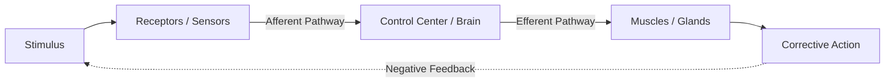
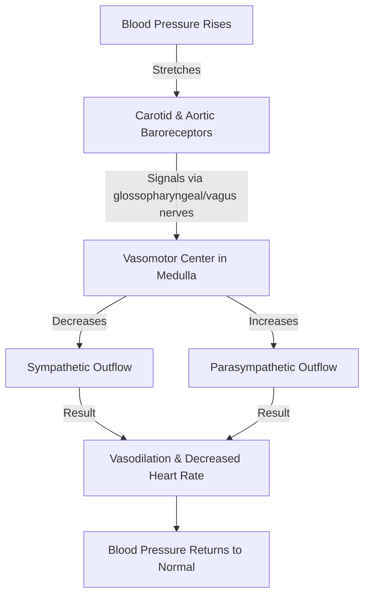

# Section 1: Homeostasis & Cell Physiology

## Chapter 1: Homeostasis (The Foundation of Physiology)

---

### 1. Introduction
Physiology is the study of how living organisms function. In human physiology, we seek to understand the mechanisms that keep the human body alive and functioning. At the heart of this study is a simple truth: our cells can only survive if they are bathed in a stable environment that provides nutrients, oxygen, and optimal physical conditions.

### 2. Daily Life Analogy
Imagine you are inside a smart-home during a freezing winter. Outside, the temperature fluctuates wildly from -10°C to 2°C. Inside, however, the temperature remains at a comfortable 22°C. How? The house uses a thermostat. When the air temperature drops below 22°C, a sensor detects the change and turns on the furnace. Once the temperature reaches 22°C, the sensor detects this and shuts the furnace off. 
Your body functions exactly like this smart-home. While external environments change constantly, your internal environments remain remarkably stable.

### 3. Basic Concept
The internal environment of the body is called the **Milieu Intérieur** (originally coined by Claude Bernard in the 19th century). 
- **Extracellular Fluid (ECF)**: This is the fluid outside the cells, representing about 1/3 of total body water. It contains ions and nutrients needed by cells to survive. Because all cells live in this fluid, the ECF is considered the true *internal environment* of the body.
- **Intracellular Fluid (ICF)**: The fluid inside the cells, representing about 2/3 of total body water. It contains high concentrations of potassium, magnesium, and phosphate.
- **Homeostasis**: Coined by Walter Cannon, this is the maintenance of nearly constant conditions in the internal environment (ECF). It is a dynamic state of equilibrium, not a static state.

### 4. Anatomy Review
To maintain homeostasis, the body utilizes several organ systems working in tandem:
- **Circulatory System**: Transports the ECF throughout the body. Blood passes through the capillaries, where active exchange occurs between blood and interstitial fluid.
- **Respiratory System**: Obtains oxygen and eliminates carbon dioxide.
- **Gastrointestinal System**: Absorbs carbohydrates, fatty acids, amino acids, and minerals into the ECF.
- **Renal System**: Filters plasma and reabsorbs essentials while excreting metabolic waste products (urea, uric acid, excess water/ions).
- **Nervous & Endocrine Systems**: The main regulatory networks. The nervous system manages rapid responses, while the endocrine system controls slower metabolic activities using chemical messengers (hormones).

### 5. Physiology
Normal ranges of crucial extracellular fluid constituents:
* **Oxygen**: Normal: 40 mmHg (venous) to 95 mmHg (arterial).
* **Carbon Dioxide**: Normal: 40 to 45 mmHg.
* **Sodium Ion (\(Na^+\))**: Normal: 135 to 145 mmol/L.
* **Potassium Ion (\(K^+\))**: Normal: 3.5 to 5.0 mmol/L.
* **Calcium Ion (\(Ca^{2+}\))**: Normal: 2.2 to 2.6 mmol/L.
* **Hydrogen Ion (\(H^+\) / pH)**: Normal: 7.35 to 7.45.
* **Glucose**: Normal: 70 to 100 mg/dL (fasting).
* **Body Temperature**: Normal: 37.0°C (98.6°F).

### 6. Mechanism
To control these values, the body relies on **Control Systems** operating through feedback loops:

#### Negative Feedback Control
If some factor becomes excessive or deficient, a control system initiates negative feedback, which consists of a series of changes that return the factor toward a mean value, keeping conditions stable.
- **Example: Baroreceptor Reflex**: A rise in blood pressure stretches receptors in the carotid bifurcation and aortic arch. These transmit signals to the medulla. The medulla sends inhibitory signals through the autonomic nervous system to slow the heart and dilate vessels, lowering blood pressure back to normal.
- **Gain of a Control System**: The effectiveness of a control system is defined by its Gain:
  \[\text{Gain} = \frac{\text{Correction}}{\text{Error}}\]
  *If a test subject gets a transfusion that increases mean arterial pressure from 100 mmHg to 175 mmHg with the baroreceptors turned off, and only to 125 mmHg when they are turned on: the correction is \(-50\text{ mmHg}\), and the remaining error is \(+25\text{ mmHg}\). The gain is \(-50 / +25 = -2.0\).*

#### Positive Feedback Control
Positive feedback does not maintain stability; it amplifies the initial stimulus, often leading to instability and death (vicious cycles).
- **Pathological Example: Hemorrhage**: If a person bleeds 2 liters of blood, cardiac output drops. Blood flow to the heart muscle decreases, weakening the heart. This drops cardiac output even further, leading to a loop ending in death.
- **Physiological Exceptions**: Positive feedback is useful when targeted to achieve a rapid, singular endpoint:
  1. **Blood Clotting**: Activation of clotting factors triggers a cascade to activate more factors until the vessel tear is plugged.
  2. **Childbirth (Uterine Contraction)**: Uterine stretching triggers oxytocin release, causing stronger contractions, which stretches the cervix more until the baby is delivered.
  3. **Generation of Nerve Signals (Action Potential)**: Depolarization opens sodium channels, allowing sodium entry, depolarizing the membrane further, opening even more channels.

### 7. Animation Summary
*Visualization focuses on:* The baroreceptor reflex loop showing heart rate decreasing as carotid artery stretch increases.

### 8. 3D Model Guide
*Interactive viewer targets:* The circulatory loop and kidneys. Clicking the carotid sinus displays baroreceptor stretch thresholds. Clicking the kidney shows blood volume filtration adjustments.

### 9. Flowchart

### 10. Clinical Correlation
When homeostatic feedback systems function incorrectly, disease states arise. In moderate failure, the body's compensatory mechanisms can sustain life temporarily, though at the cost of long-term tissue stress. In severe homeostatic failure, death occurs.
- **Example: Hypertension**: Chronic elevation of arterial pressure changes the setpoint of baroreceptors, leading to cardiovascular remodeling, ventricular hypertrophy, and target organ damage.

### 11. Disorders
- **Dehydration**: Loss of ECF water leads to hypertonicity, drawing water out of the cells and disrupting cell function.
- **Acidosis / Alkalosis**: Deviation from the narrow pH range of 7.35–7.45. Severe acidosis (pH < 6.8) or alkalosis (pH > 8.0) is fatal because it denatures metabolic enzymes.

### 12. Summary
- Physiology studies normal life functions; homeostasis is the maintenance of stable ECF (internal environment) conditions.
- Negative feedback loops stabilize physiological parameters.
- Positive feedback loops amplify changes and are typically pathological, except during clotting, nerve impulses, and childbirth.

### 13. Important Formulas
- **Gain of a system**: \(\text{Gain} = \frac{\text{Correction}}{\text{Error}}\)

### 14. Mnemonics
- **COPE** with Stress (Positive feedback exceptions):
  * **C**lotting cascade
  * **O**lutin/Oxytocin (Childbirth contractions)
  * **P**otentials (Action potential depolarizations)
  * **E**strogen surge (LH surge leading to ovulation)

### 15. Viva Questions
1. **Define Homeostasis and state who coined the term.**
   * *Answer*: Homeostasis is the maintenance of nearly constant conditions in the internal environment. The term was coined by Walter Cannon.
2. **What is the difference between correction and error in feedback gain?**
   * *Answer*: Correction is the change in value brought about by the control system to counter a disturbance. Error is the remaining deviation from the normal setpoint.

### 16. MCQs
1. Which of the following is an example of physiological positive feedback?
   * A) Temperature regulation
   * B) Thyroid hormone regulation
   * C) Depolarization phase of an action potential
   * D) Carbon dioxide control
   * *Answer*: C

2. If a system corrected a temperature deviation from 40°C down to 37.5°C, while the baseline normal was 37°C: what is the gain?
   * A) -5
   * B) -2.5
   * C) -1.2
   * D) -0.2
   * *Answer*: A *(Correction = -2.5°C, Error = +0.5°C, Gain = -2.5/0.5 = -5)*

### 17. Case-Based Learning
**Case**: A 65-year-old patient with congestive heart failure experiences a drop in cardiac output. The body activates the sympathetic nervous system and the Renin-Angiotensin-Aldosterone System (RAAS) to maintain blood pressure.
- **Question**: How does this initial negative feedback response turn into a pathological positive feedback loop if left untreated?
- **Analysis**: Vasoconstriction increases the workload (afterload) on the failing heart. Retained fluid increases venous return (preload), stretching the weak ventricles. This increases myocardial oxygen demand, accelerating cardiac failure.

### 18. Flashcards
- **Front**: Who coined the term *Milieu Intérieur*?
  **Back**: Claude Bernard.
- **Front**: What is the normal pH range of the extracellular fluid?
  **Back**: 7.35 to 7.45.

### 19. Revision Notes
Downloadable PDF summary containing normal arterial pressure ranges, feedback loop components, and gain formulas.

### 20. Practice Quiz
Interactive timed module containing 10 clinical application questions on baroreceptor gains and fluid compartment shifts.
