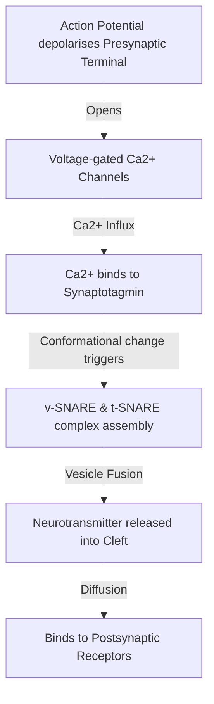
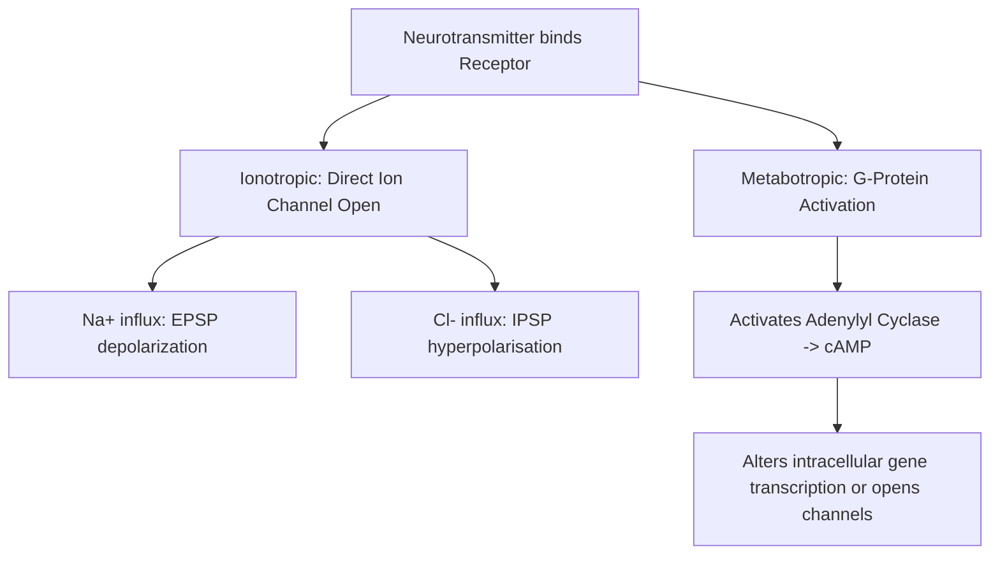

# Section 10: Central Nervous System

## Chapter 11: Synaptic Transmission & Neural Circuitry

---

### 1. Introduction
The Central Nervous System (CNS) processes and coordinates sensory information and motor output. At the cellular level, the brain operates by transmitting signals between neurons. The junction where one neuron communicates with another is called the **Synapse**.

### 2. Daily Life Analogy
Imagine a message-delivery system between two islands separated by a small channel (Synaptic cleft). On the sender island (Presynaptic neuron), signals arrive at the dock. When a signal arrives, dock workers load cargo (neurotransmitters) into small boats (vesicles). The boats dock at the edge and unload the cargo into the water, letting it float across the channel (exocytosis). On the receiver island (Postsynaptic neuron), receptors capture the floating packages. Once captured, they trigger a buzzer that sends a new signal running down the receiver island's highways (depolarization).

### 3. Basic Concept
- **Synapse Types**:
  1. *Chemical Synapse*: Communication via chemical neurotransmitters diffusing across a **synaptic cleft** (~20-40 nm). Allows one-way transmission, amplification, and plastic integration.
  2. *Electrical Synapse*: Direct physical contact via **gap junctions** (connexons). Signals flow bidirectionally without delay. Common in cardiac muscle and smooth muscle.
- **Synaptic Delay**: The time required for transmitter release, diffusion, and receptor binding (typically **0.5 milliseconds**).

```text
    PRESYNAPTIC TERMINAL -> [ Vesicles (Neurotransmitters) ]
    ~~~~~~~~~~~~~~~~~~~~~~~~~~~~~~~~~~~~~~~~~~~~~~~~~~~~~~~~  <-- Apical Membrane
       [ Synaptic Cleft: ~20-40 nm width ]
    ~~~~~~~~~~~~~~~~~~~~~~~~~~~~~~~~~~~~~~~~~~~~~~~~~~~~~~~~  <-- Basolateral Membrane
    POSTSYNAPTIC DENSITY -> [ Receptors ]
```

### 4. Anatomy Review
- **Presynaptic Terminal**: Contains mitochondria (to power neurotransmitter synthesis), synaptic vesicles, and voltage-gated calcium channels.
- **SNARE Proteins**: Protein complexes that mediate vesicle docking and fusion:
  - *v-SNAREs* (on vesicle membrane, e.g., Synaptotagmin, Synaptobrevin).
  - *t-SNAREs* (on target membrane, e.g., Syntaxin, SNAP-25).
- **Postsynaptic Density**: Region of the postsynaptic membrane packed with receptors (Ionotropic or Metabotropic).

### 5. Physiology
- **Excitatory Postsynaptic Potential (EPSP)**: Local depolarization of the postsynaptic membrane caused by the influx of positive ions (usually \(Na^+\) or \(Ca^{2+}\) through channels like AMPA/NMDA).
- **Inhibitory Postsynaptic Potential (IPSP)**: Local hyperpolarization of the postsynaptic membrane caused by the influx of negative ions (\(Cl^-\)) or efflux of positive ions (\(K^+\)) through channels (like GABA-A or Glycine receptors).
- **Summation**:
  - *Temporal Summation*: Summing potentials generated by a *single* presynaptic terminal firing repeatedly in rapid succession.
  - *Spatial Summation*: Summing potentials generated by *multiple* separate presynaptic terminals firing simultaneously.

---

### 6. Mechanism

#### Synaptic Vesicle Release Sequence
When an action potential invades the axon terminal, electrical changes trigger the release of chemical messengers:



---

### 7. Animation Summary
*Visualization focuses on:* The calcium-mediated docking of a vesicle at the active zone. The animation details synaptotagmin bending to pull the vesicle membrane into the presynaptic lipid bilayer for exocytosis.

### 8. 3D Model Guide
*Interactive viewer targets:* The Synapse. Hovering over vesicles highlights synaptobrevin. Hovering over the terminal membrane highlights syntaxin and SNAP-25.

### 9. Flowchart



### 10. Clinical Correlation
- **Myasthenia Gravis**: Autoimmune disease where antibodies block and destroy nicotinic acetylcholine receptors at the neuromuscular junction, causing progressive skeletal muscle weakness.
- **Lambert-Eaton Myasthenic Syndrome (LEMS)**: Autoimmune antibodies target presynaptic voltage-gated **calcium channels**, preventing calcium entry and reducing neurotransmitter release.

### 11. Disorders
- **Tetanus Toxin**: Cleaves synaptobrevin (v-SNARE) in inhibitory interneurons (Renshaw cells) of the spinal cord. This blocks the release of glycine and GABA, leading to uncontrolled motor neuron firing (spastic paralysis, lockjaw).
- **Botulinum Toxin**: Cleaves SNAP-25 or syntaxin (t-SNAREs) in motor neurons. This blocks acetylcholine release at the neuromuscular junction, causing flaccid paralysis.

### 12. Summary
- Chemical synapses use neurotransmitters; electrical synapses use gap junctions.
- Calcium influx triggers vesicle exocytosis via synaptotagmin-SNARE docking.
- Postsynaptic responses are either excitatory (EPSPs, Na+ influx) or inhibitory (IPSPs, Cl- influx).
- Summation (temporal and spatial) determines if the postsynaptic neuron reaches threshold.

### 13. Important Formulas
- **Synaptic Potentials Decay**:
  \[V(x) = V_0 \cdot e^{-x/\lambda}\]
  *Where \(\lambda\) is the length constant. Higher membrane resistance increases \(\lambda\), allowing potentials to travel further and summate.*

### 14. Mnemonics
- **SNAREs Lock the Door**:
  * **S**ynaptotagmin: **S**ensor for calcium.
  * **S**ynaptobrevin: **S**ender-side v-SNARE.
  * **S**yntaxin / **S**NAP-25: **S**tationary t-SNAREs.

### 15. Viva Questions
1. **Explain the mechanism of Action of Botulinum Toxin.**
   * *Answer*: Botulinum toxin enters presynaptic motor terminals and acts as a protease to cleave t-SNARE proteins (like SNAP-25). This prevents synaptic vesicles from docking and fusing with the terminal membrane, blocking acetylcholine release and causing flaccid muscle paralysis.
2. **What is the difference between ionotropic and metabotropic receptors?**
   * *Answer*: Ionotropic receptors are ligand-gated ion channels. Binding of the ligand directly opens the channel, producing rapid, short-duration electrical responses. Metabotropic receptors are G-protein coupled receptors. Binding activates a G-protein cascade, producing slower, longer-lasting metabolic responses via second messengers.

### 16. MCQs
1. Which of the following proteins serves as the calcium sensor that triggers synaptic vesicle fusion?
   * A) Synaptobrevin
   * B) Syntaxin
   * C) Synaptotagmin
   * D) SNAP-25
   * *Answer*: C

2. Tetanus toxin blocks neurotransmitter release by cleaving which of the following?
   * A) Voltage-gated calcium channels
   * B) Acetylcholine receptors
   * C) Synaptobrevin (v-SNARE)
   * D) Acetylcholinesterase
   * *Answer*: C *(Tetanus toxin specifically cleaves synaptobrevin in inhibitory spinal interneurons).*

### 17. Case-Based Learning
**Case**: A 32-year-old female presents with dry mouth, double vision (diplopia), and descending muscle weakness that started in her face. She recently ate home-canned vegetables. Nerve conduction studies show a decremental response to low-frequency stimulation, but muscle biopsy shows no antibody deposits.
- **Question**: What is the diagnosis, and what is the cellular mechanism causing her weakness?
- **Analysis**: The patient has Botulism. The botulinum toxin from the canned food enters peripheral cholinergic nerve terminals and cleaves SNAP-25 or syntaxin. This prevents ACh vesicle exocytosis at the neuromuscular junction, leading to flaccid paralysis.

### 18. Flashcards
- **Front**: What is the average duration of synaptic delay?
  **Back**: Approximately 0.5 milliseconds.
- **Front**: Which ion influx is responsible for generating IPSPs at a GABA-A synapse?
  **Back**: Chloride (\(Cl^-\)).

### 19. Revision Notes
Downloadable diagrams comparing neuromuscular junction anatomy with central neuronal synapses.

### 20. Practice Quiz
Timed 10-question set on synaptic length constants and temporal summation calculations.
