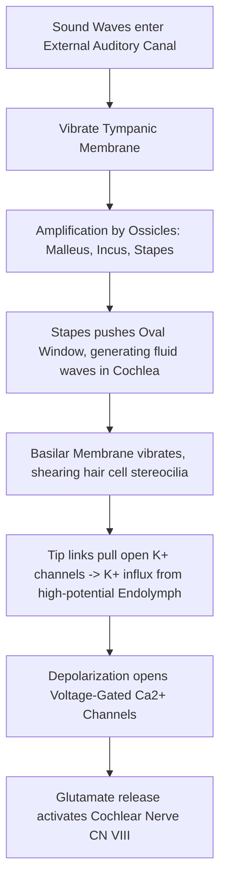

# Other Special Senses: Smell, Taste, Hearing, & Equilibrium

### 1. Introduction
This chapter covers the physiological principles of Smell (Olfaction), Taste (Gustation), Hearing (Audition), and Equilibrium (Vestibular function), detailing receptor transduction mechanisms, neural pathways, and clinical hearing evaluations.

### 2. Daily Life Analogy
- **Olfaction/Gustation**: Think of lock-and-key matching in chemistry; specific food molecules fit into matching receptor locks on your tongue or nose, sending digital electrical alerts to your brain's flavor center.
- **Hearing**: Think of a microphone diaphragm; sound waves strike the tympanic membrane, physical pistons (ossicles) amplify the mechanical vibrations, and hair cells act as piezoelectric transducers converting fluid ripples into action potentials.

### 3. Basic Concept
Special sensory systems convert physical or chemical environmental stimuli into electrical signals (sensory transduction) that are carried via cranial nerves to designated sensory cortices in the brain.

### 4. Anatomy Review
- **Olfaction**: Olfactory epithelium in the upper nasal cavity, olfactory bulb, CN I (Olfactory nerve).
- **Gustation**: Taste buds on lingual papillae (circumvallate, foliate, fungiform), CN VII (facial), CN IX (glossopharyngeal), CN X (vagus).
- **Hearing**: External ear, middle ear (tympanic membrane, malleus, incus, stapes), inner ear (cochlea, organ of Corti, hair cells), CN VIII (Vestibulocochlear).
- **Equilibrium**: Vestibular apparatus (semicircular canals for angular acceleration; utricle and saccule for linear acceleration), CN VIII.

### 5. Physiology
- **Olfactory Transduction**: Odorant binds to GPCR (Golf) $\rightarrow$ Adenylyl Cyclase activation $\rightarrow$ cAMP increases $\rightarrow$ Cyclic nucleotide-gated channels open $\rightarrow$ $Na^+$ and $Ca^{2+}$ influx $\rightarrow$ Depolarization.
- **Taste Transduction**: 
  - Salt ($Na^+$) and Sour ($H^+$) directly depolarize taste cells via ion channels.
  - Sweet, Bitter, and Umami act via GPCRs (gustducin), triggering PLC-$\beta 2$ activation and intracellular $Ca^{2+}$ release.
- **Hearing Mechanism**: Sound waves travel through the external canal $\rightarrow$ vibrate tympanic membrane $\rightarrow$ ossicular chain leverages/amplifies force $\rightarrow$ stapes pushes oval window $\rightarrow$ fluid waves in Scala vestibuli and tympani $\rightarrow$ basilar membrane moves vertically $\rightarrow$ hair cell stereocilia bend against tectorial membrane.
- **Vestibular Function**: Fluid (endolymph) moves $\rightarrow$ deflects cupula (in semicircular canals) or otoliths (in utricle/saccule) $\rightarrow$ alters baseline firing of vestibular nerve.

### 6. Mechanism
- **Hair Cell Transduction**: Bending of stereocilia toward the tallest cilium (kinocilium) pulls open mechanical tip links, allowing $K^+$ influx (since endolymph is rich in $K^+$ with $+80\text{ mV}$ endocochlear potential), causing depolarization and calcium influx, triggering glutamate release.

### 7. Animation
Observe the dynamic changes in this physiological process.
<animation-placeholder />

### 8. Interactive 3D Model
Explore the structural components involved in this process.
<3d-model-placeholder />

### 9. Flowchart

### 10. Clinical Correlation
- **Hearing Loss Classification**:
  - *Conductive Hearing Loss*: Problem with sound transmission in external or middle ear (e.g., wax impaction, otitis media, otosclerosis).
  - *Sensorineural Hearing Loss*: Problem with inner ear transduction or neural pathways (e.g., presbycusis, acoustic neuroma, noise-induced damage).
- **Tuning Fork Evaluations**:
  - **Weber Test** (fork on forehead midline):
    - Normal: Sound heard equally on both sides.
    - Conductive Loss: Lateralizes to the *affected* (impaired) ear (due to occlusion of background noise).
    - Sensorineural Loss: Lateralizes to the *unaffected* (healthy) ear.
  - **Rinne Test** (air vs. bone conduction):
    - Normal: Air Conduction > Bone Conduction (Positive Rinne).
    - Conductive Loss: Bone Conduction $\ge$ Air Conduction (Negative Rinne).
    - Sensorineural Loss: Air Conduction > Bone Conduction (Positive Rinne, but both are diminished).

### 11. Disorders
- **Meniere's Disease**: Excess accumulation of endolymph (endolymphatic hydrops) in the membranous labyrinth, presenting with episodic vertigo, sensorineural hearing loss, and tinnitus.
- **Benign Paroxysmal Positional Vertigo (BPPV)**: Displacement of otoconia (calcium carbonate crystals) from the utricle into the semicircular canals (usually posterior), triggering transient vertigo on head turning.

### 12. Summary
- Smell and taste are chemical senses using GPCR and ion channel pathways.
- Hearing uses mechanical hair cells in the Organ of Corti to convert fluid waves to electrical signals.
- Equilibrium registers motion using semicircular canals (angular) and otoliths (linear).
- Tuning fork tests (Rinne/Weber) differentiate conductive from sensorineural deficits.

### 13. Important Formula
- **Weber & Rinne Interpretations**:
  $$ \text{Conductive Deficit} \rightarrow \text{Rinne Negative (BC } \ge \text{ AC)} + \text{Weber lateralizes to affected ear} $$
  $$ \text{Sensorineural Deficit} \rightarrow \text{Rinne Positive (AC } > \text{ BC)} + \text{Weber lateralizes to healthy ear} $$

### 14. Mnemonics
- **Weber Weber Weber**:
  - *W*eber goes to the *W*orse ear in conductive block.
  - *W*eber goes to the *W*ell ear in sensorineural loss.

### 15. Viva Questions
1. **Describe the endocochlear potential and its physiological importance.**
   *Answer:* The endocochlear potential is a $+80\text{ mV}$ electrical potential difference between the potassium-rich endolymph (secreted by stria vascularis in Scala media) and the perilymph. This potential acts as the electrical driving force for $K^+$ influx when mechanical tip links open.
2. **What registers linear acceleration vs. angular acceleration?**
   *Answer:* Linear acceleration is registered by maculae in the utricle (horizontal) and saccule (vertical) via otolith displacement. Angular acceleration is registered by cristae ampullares in the semicircular canals via endolymph deflection of the cupula.

### 16. MCQs
1. A patient presents with hearing loss in the right ear. On examination, the Weber test lateralizes to the right ear, and the Rinne test is negative (BC > AC) in the right ear. What is the diagnosis?
   - A) Sensorineural hearing loss in the right ear
   - B) Conductive hearing loss in the right ear
   - C) Normal hearing
   - D) Sensorineural hearing loss in the left ear
   - *Answer:* B (A negative Rinne test combined with lateralization to the affected ear confirms conductive hearing loss.)

2. Which secondary messenger mediates depolarization in olfactory receptor neurons?
   - A) $IP_3$
   - B) DAG
   - C) cAMP
   - D) cGMP
   - *Answer:* C (Odorant binding activates G-olf, which stimulates adenylyl cyclase to increase cAMP, opening cyclic nucleotide-gated channels.)

### 17. Case-Based Learning
**Case**: A 45-year-old female presents with recurrent episodes of vertigo, a feeling of fullness in her left ear, low-pitched ringing (tinnitus), and progressive hearing loss in that same ear. An audiogram shows a sensorineural deficit for low-frequency tones in the left ear.
- **Question**: What is the most likely diagnosis, and what is the underlying pathomechanism?
- **Analysis**: The patient has Meniere's Disease. The classic triad of episodic vertigo, unilateral tinnitus, and progressive hearing loss is caused by endolymphatic hydrops (distension and accumulation of endolymph). The increased pressure damages hair cells and occasionally ruptures the membranous labyrinth, mixing endolymph and perilymph and disrupting auditory and vestibular nerve firing.

### 18. Flashcards
- **Front**: Which cranial nerve carries taste signals from the anterior two-thirds of the tongue?
  **Back**: Cranial Nerve VII (Facial Nerve, via chorda tympani).
- **Front**: Which structures contain otoliths?
  **Back**: The utricle and saccule.

### 19. Revision Notes
- Summary tables of Weber/Rinne tuning fork results and cranial nerves mediating taste and smell.

### 20. Practice Quiz
<quiz-placeholder />
