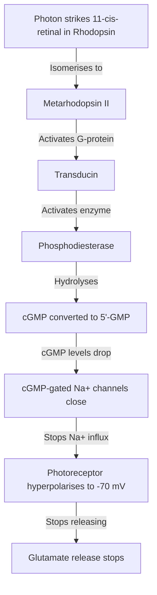
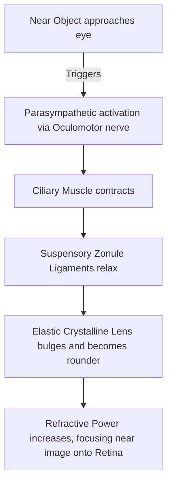

# Section 11: Special Senses

## Chapter 12: Visual Optics & Photoreception Physiology

---

### 1. Introduction
Vision is one of our primary special senses, allowing us to interpret our surroundings through the detection of light. The eye functions as a camera, focusing light onto a light-sensitive neural layer called the **Retina**, which converts electromagnetic waves into electrical signals.

### 2. Daily Life Analogy
Imagine a movie projector in a theater. The projector bulb shoots light through a series of glass lenses (Cornea and Lens) to focus a sharp image onto the screen (Retina). If the screen is placed too far back or the lens is too curved, the projection becomes blurry (Nearsightedness / Myopia). Behind the screen, millions of tiny solar panels (photoreceptors) capture the light and generate electrical currents that run along cables to the theater's central server room (Visual cortex in the brain) to show the film.

### 3. Basic Concept
- **Refraction**: The bending of light rays as they pass through materials of different refractive indices.
- **Refractive Media of the Eye**: Cornea (provides 2/3 of total refractive power, ~43 Diopters), Aqueous humor, Crystalline Lens (provides 1/3 of power, ~15-20 Diopters, can change shape), and Vitreous humor.
- **Diopter**: A unit of refractive power:
  \[\text{Power (Diopters)} = \frac{1}{\text{Focal Length (Meters)}}\]
- **Accommodation**: An increase in the refractive power of the lens to focus on near objects.

```text
    LIGHT RAYS -> [ Cornea ] -> [ Pupil ] -> [ Lens ] -> [ Vitreous ] -> [ Retina (Focal Point) ]
```

### 4. Anatomy Review
- **Retina Layers**:
  - *Photoreceptors*: Outer layer. Rods (night vision, high sensitivity, low acuity) and Cones (color vision, low sensitivity, high acuity, concentrated in the **Fovea Centralis**).
  - *Interneurons*: Horizontal, Bipolar, and Amacrine cells.
  - *Output Cells*: **Ganglion cells**, whose axons form the optic nerve.
- **Ciliary Muscle & Suspensory Ligaments (Zonules)**: Wrap the lens.
  - *At Rest (Far Vision)*: Ciliary muscle relaxes -> suspensory ligaments are pulled tense -> lens is flattened.
  - *During Accommodation (Near Vision)*: Parasympathetic signals contract the ciliary muscle -> suspensory ligaments relax -> the elastic lens becomes rounder, increasing its refractive power.

### 5. Physiology
- **Photoreceptor resting state**: Unlike other excitable cells that depolarize when stimulated, photoreceptors are **depolarized in the dark** (\(-40\text{ mV}\)) and **hyperpolarize when exposed to light** (\(-70\text{ mV}\)).
- **Dark Current**: In the dark, high intracellular **cGMP** keeps cyclic nucleotide-gated sodium channels open. Sodium flows continuously into the outer segment, maintaining depolarization and releasing the neurotransmitter **glutamate** onto bipolar cells.

---

### 6. Mechanism

#### Visual Phototransduction GPCR Cascade
When a photon strikes rhodopsin, it initiates a G-protein cascade that closes sodium channels:



---

### 7. Animation Summary
*Visualization focuses on:* The visual phototransduction cascade. The animation details the 11-cis-retinal molecule straightening into all-trans-retinal upon photon strike, activating transducin.

### 8. 3D Model Guide
*Interactive viewer targets:* The Eye. Slicing the eye exposes the iris, ciliary body, crystalline lens, and retinal layer. Selecting near accommodation animates ciliary muscle contraction and lens rounding.

### 9. Flowchart



### 10. Clinical Correlation
- **Refractive Errors**:
  * **Myopia (Nearsightedness)**: The eyeball is too long or the lens too strong. Light focuses *in front* of the retina. Corrected with a **concave lens** (diverging lens).
  * **Hyperopia (Farsightedness)**: The eyeball is too short or the lens too weak. Light focuses *behind* the retina. Corrected with a **convex lens** (converging lens).
- **Presbyopia**: Age-related loss of lens elasticity. The lens cannot accommodate for near vision, requiring reading glasses (convex lenses).

### 11. Disorders
- **Color Blindness**: Genetic deficiency in one or more cone photopigments (e.g. red-green color blindness, a recessive X-linked trait).
- **Night Blindness (Nyctalopia)**: Caused by severe Vitamin A deficiency, which depletes retinal stores and prevents rhodopsin synthesis in rods.

### 12. Summary
- Light is focused onto the retina by the cornea and lens. Accommodation increases lens power for near vision.
- In the dark, photoreceptors are depolarized (\(-40\text{ mV}\)) due to cGMP-mediated sodium influx (dark current).
- Light triggers a GPCR cascade: photon -> metarhodopsin -> transducin -> PDE -> cGMP depletion -> channel closure -> hyperpolarization (\(-70\text{ mV}\)) -> decreased glutamate release.
- Myopia is corrected with concave lenses; hyperopia is corrected with convex lenses.

### 13. Important Formulas
- **Lens Power**:
  \[P = \frac{1}{f}\] (Power in diopters, focal length in meters).

### 14. Mnemonics
- **My Concave Nearsighted Friend**:
  * **My**opia is corrected with **Concave** lenses, and affects **Near** vision.

### 15. Viva Questions
1. **Explain the mechanism of lens accommodation for near vision.**
   * *Answer*: When focusing on a near object, parasympathetic signals travel via the oculomotor nerve to contract the ciliary muscle. This moves the ciliary body closer to the lens, relaxing the suspensory ligaments (zonules). The lens, possessing natural elasticity, bulges and becomes rounder, increasing its refractive power.
2. **Describe the molecular composition of rhodopsin.**
   * *Answer*: Rhodopsin is the photopigment in rods, composed of a protein called **scotopsin** (a GPCR membrane protein) conjugated to **11-cis-retinal** (a light-absorbing aldehyde of Vitamin A).

### 16. MCQs
1. Which of the following refractive errors causes light to focus in front of the retina and is corrected with a concave lens?
   * A) Hyperopia
   * B) Myopia
   * C) Astigmatism
   * D) Presbyopia
   * *Answer*: B

2. Exposure of a photoreceptor outer segment to light causes which of the following changes?
   * A) Increase in intracellular cGMP
   * B) Opening of sodium channels
   * C) Hyperpolarization of the membrane
   * D) Increased release of glutamate
   * *Answer*: C *(Light closes sodium channels, hyperpolarizing the photoreceptor).*

### 17. Case-Based Learning
**Case**: A 45-year-old male notices he must hold newspapers at arm's length to read them clearly. He has no trouble seeing distant road signs.
- **Question**: What condition is this patient experiencing, and what is the underlying physical mechanism?
- **Analysis**: The patient is experiencing Presbyopia. As age increases, the crystalline lens loses its elasticity. When the ciliary muscle contracts, the lens can no longer undergo the conformational change to become rounder, preventing the required increase in refractive power for near vision.

### 18. Flashcards
- **Front**: What is the primary photopigment in rod cells?
  **Back**: Rhodopsin.
- **Front**: Which cell type's axons form the optic nerve?
  **Back**: Retinal Ganglion cells.

### 19. Revision Notes
Downloadable tables listing target refractive values of the cornea and lens under resting and accommodated states.

### 20. Practice Quiz
Timed 10-question set calculating visual acuity measurements and lens power adjustments under varying distances.
