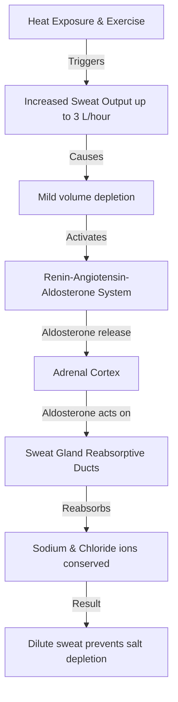
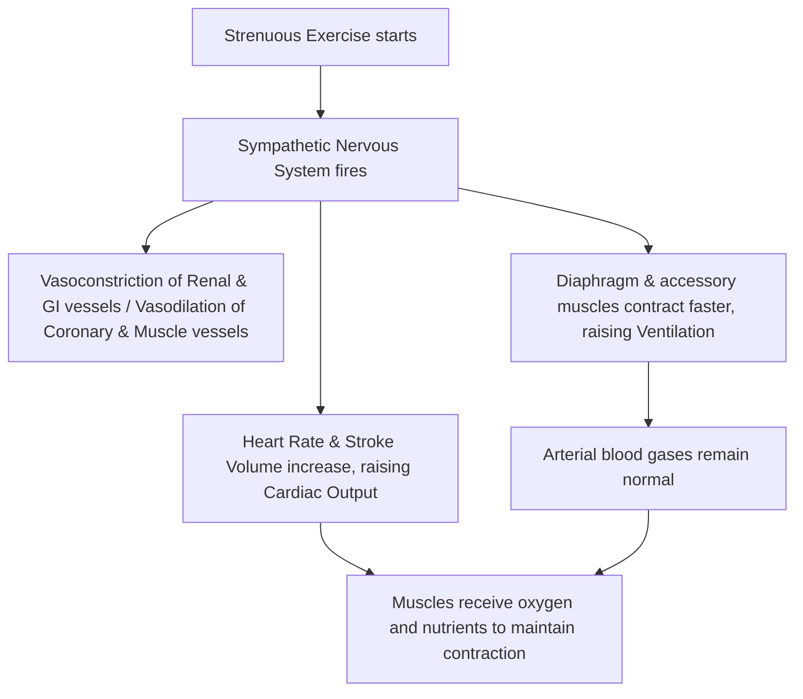

# Section 12: Integrated Physiology

## Chapter 13: Exercise Physiology & Thermoregulation

---

### 1. Introduction
Integrated physiology studies how multiple organ systems coordinate in response to physiological stressors. The most extreme stressor normal human systems experience is strenuous exercise. To support exercising muscles, the cardiovascular, respiratory, nervous, and metabolic systems must work together.

### 2. Daily Life Analogy
Imagine a high-performance sports car driving at high speed. Under heavy load, the engine requires more fuel and oxygen (metabolism and respiration) and generates heat, requiring a radiator to cool it down (sweating and thermoregulation). The dashboard monitors fuel flow and oil pressure to keep parameters stable (autonomic control).
Your body coordinates during exercise exactly like this sports car.

### 3. Basic Concept
- **Muscle Metabolism**: Exercising muscles require ATP to power contraction. The body uses three energy systems:
  1. *Phosphagen System*: ATP and **Phosphocreatine (PCr)**. Provides maximal power for 8–10 seconds (e.g., 100m sprint).
  2. *Glycogen-Lactic Acid System*: Anaerobic glycolysis. Converts glucose to lactate. Provides power for 1.3–1.6 minutes (e.g., 400m run).
  3. *Aerobic System*: Oxidative phosphorylation of carbohydrates, fats, and amino acids in mitochondria. Provides power indefinitely for endurance events.
- **Oxygen Debt**: The extra oxygen that must be inhaled after exercise to restore energy stores (resynthesize ATP and PCr, convert lactate back to glucose in the liver via the Cori Cycle).

```text
    Exercise Energy Continuum:
    [ Phosphagen: 10s ] -> [ Anaerobic Glycolysis: 1.5 min ] -> [ Aerobic Respiration: Hours ]
```

### 4. Anatomy Review
- **Muscle Fiber Types**:
  - *Slow-Twitch (Type I)*: Red fibers, high myoglobin and mitochondria. High capillary density. Designed for aerobic endurance.
  - *Fast-Twitch (Type II)*: White fibers, high glycolytic enzymes and sarcoplasmic reticulum. Designed for rapid, powerful contraction.
- **Thermoregulation Centers**: The **Preoptic Area of the Anterior Hypothalamus** acts as the body's thermostat, containing warm-sensitive and cold-sensitive neurons.

### 5. Physiology
- **Cardiovascular Response**:
  * Heart Rate increases (up to 195 bpm in untrained, 185 bpm in trained).
  * Stroke Volume increases (up to 110 mL in untrained, 162 mL in marathoner).
  * Cardiac Output (CO) rises from 5 L/min at rest to 23 L/min (untrained) or 30 L/min (trained) during maximal exercise.
  * Skeletal muscle blood flow increases up to 25-fold, driven by local vasodilators (adenosine, \(K^+\), lactic acid) and sympathetic vasoconstriction of non-essential beds (GI tract, kidneys).
- **Respiratory Response**:
  * Pulmonary ventilation increases up to 20-fold, driven by neurogenic stimulation (motor commands from brain, sensory signals from joint receptors).
  * Blood gases ($PO_2$ and $PCO_2$) remain remarkably stable during normal exercise, indicating that ventilation matches metabolism.
- **Thermoregulation**:
  * Efficiency of muscle contraction is only 20%–25%; the remaining 75%–80% of energy is released as heat, raising body temperature.
  * **Cooling Mechanisms**: Vasodilation of skin blood vessels (increases radiative heat loss) and activation of eccrine sweat glands (evaporative heat loss).

---

### 6. Mechanism

#### Sweat Gland Acclimatization
When an individual exercises in a hot environment over 1 to 2 weeks, the sweat glands undergo acclimatization to conserve electrolytes:



---

### 7. Animation Summary
*Visualization focuses on:* Oxygen uptake kinetics. The animation plots oxygen consumption rising during exercise, showing the oxygen deficit phase at start and the oxygen debt (EPOC) phase during recovery.

### 8. 3D Model Guide
*Interactive viewer targets:* The human body showing cardiovascular blood flow shifts. Selecting "Exercise Mode" dilates muscle capillary beds while constricting renal and mesenteric arterial systems.

### 9. Flowchart



### 10. Clinical Correlation
- **Heatstroke**: A life-threatening medical emergency defined by a core body temperature $\ge 104^\circ\text{F}$ ($40^\circ\text{C}$) accompanied by central nervous system (CNS) dysfunction (e.g., confusion, delirium, ataxia, seizures, or coma). It results from thermoregulatory failure. While classic heatstroke (often in elderly or vulnerable cohorts during heatwaves) is commonly associated with dry skin due to sweat gland fatigue, exertional heatstroke (seen in athletes or laborers) often presents with active, profuse sweating (moist skin) at the time of collapse. Evaporative cooling fails because high ambient humidity prevents sweat from evaporating. Treatment requires immediate active cooling (e.g., cold-water immersion, evaporative spray) and cardiorespiratory support.
- **Exercise-associated Hyponatremia**: Occurs when endurance athletes consume excess hypotonic fluid (plain water) relative to sweat loss. Dilutes extracellular sodium, causing brain edema, headache, confusion, seizures, and death.

### 11. Disorders
- **Malignant Hyperthermia**: A genetic disorder (mutation in the ryanodine receptor) where inhalation anesthetics trigger massive calcium release from the sarcoplasmic reticulum in skeletal muscles. This causes sustained contractions, metabolic acidosis, and life-threatening hyperthermia.
- **Dehydration**: Loss of ECF volume reduces cardiac filling pressures, lowering Stroke Volume. Heart rate rises to compensate, but cardiac output eventually drops, causing exercise exhaustion.

### 12. Summary
- Muscles derive ATP from phosphagen (8-10s), anaerobic (1.5 min), and aerobic systems.
- Oxygen debt represents the oxygen needed to restore muscle metabolites and clear lactate.
- During exercise, cardiac output and ventilation increase up to 20-fold. Local vasodilators shunt blood to active muscles.
- Thermoregulation in exercise relies on cutaneous vasodilation and sweat evaporation. Heat acclimatization uses aldosterone to conserve sodium.

### 13. Important Formulas
- **Maximal Oxygen Consumption ($\dot{V}O_2\text{max}$)**:
  \[\dot{V}O_2\text{max} = \text{Cardiac Output} \times (C_{\text{arterial }O_2} - C_{\text{venous }O_2})\] (Fick Equation).

### 14. Mnemonics
- **SWEAT**:
  * **S**ympathetic control
  * **W**ater loss (causes dehydration)
  * **E**vaporative cooling (most effective)
  * **A**ldosterone activation (conserves salt)
  * **T**emperature regulation

### 15. Viva Questions
1. **What is oxygen debt (EPOC), and why does it occur?**
   * *Answer*: Oxygen debt (Excess Post-exercise Oxygen Consumption) is the elevated oxygen consumption that occurs after exercise ends. It is required to restore muscle phosphagen stores (ATP, PCr), replenish oxygen bound to myoglobin and hemoglobin, and clear lactic acid by converting it to glucose in the liver.
2. **How does heat acclimatization protect an athlete from electrolyte depletion?**
   * *Answer*: Over 1 to 2 weeks of heat exposure, aldosterone secretion increases. Aldosterone acts on sweat gland duct cells to increase sodium and chloride reabsorption. This dilutes sweat, preventing sodium and chloride depletion during prolonged sweating.

### 16. MCQs
1. Which energy system is the primary source of ATP during a 100-meter sprint lasting 9.8 seconds?
   * A) Aerobic metabolism
   * B) Phosphagen system
   * C) Anaerobic glycolysis
   * D) Fatty acid oxidation
   * *Answer*: B

2. During maximal exercise in a healthy athlete, what happens to arterial blood gases ($PO_2$ and $PCO_2$)?
   * A) $PO_2$ decreases significantly, $PCO_2$ increases
   * B) $PO_2$ increases significantly, $PCO_2$ decreases
   * C) Both remain near normal resting values
   * D) $PO_2$ remains normal, $PCO_2$ drops to zero
   * *Answer*: C *(The respiratory system matches ventilation to metabolic rate, keeping blood gases stable).*

### 17. Case-Based Learning
**Case**: A 32-year-old male marathon runner collapses near the finish line of a race on a hot, humid day (92°F, 85% humidity). He is confused, disoriented, and slurring his words. His skin is hot and sweaty, and his core rectal temperature is 105.8°F (41.0°C).
- **Question**: What life-threatening condition is this runner experiencing? Why did his cooling mechanisms fail, and what is the immediate treatment?
- **Analysis**: The runner is experiencing Exertional Heatstroke. The high humidity prevented sweat evaporation, which is the primary cooling mechanism in hot conditions. This led to rapid heat accumulation. Crucially, the presence of sweating (moist skin) does *not* rule out exertional heatstroke. The diagnosis is confirmed by hyperthermia ($\ge 104^\circ\text{F}$) and CNS dysfunction (confusion, disorientation). Immediate treatment is rapid active cooling (immersion in ice-water bath or cold water spray with fans) to prevent multi-organ failure and death.

### 18. Flashcards
- **Front**: What is the normal Ejection Fraction range?
  **Back**: 55% to 70%.
- **Front**: Which fiber type has high capillary density and mitochondrial enzymes?
  **Back**: Slow-Twitch (Type I) muscle fibers.

### 19. Revision Notes
Downloadable charts coordinating the blood flow shifts (in mL/min) across the brain, heart, kidneys, skin, and muscles during rest vs. maximal exercise.

### 20. Practice Quiz
Timed 15-question quiz calculating VO2max values and oxygen debts under varying work rates.
