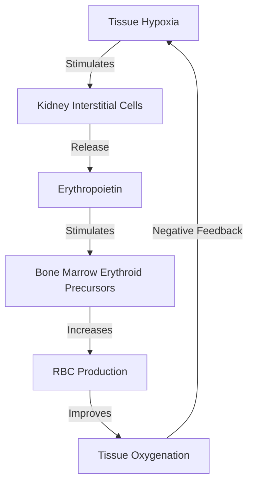
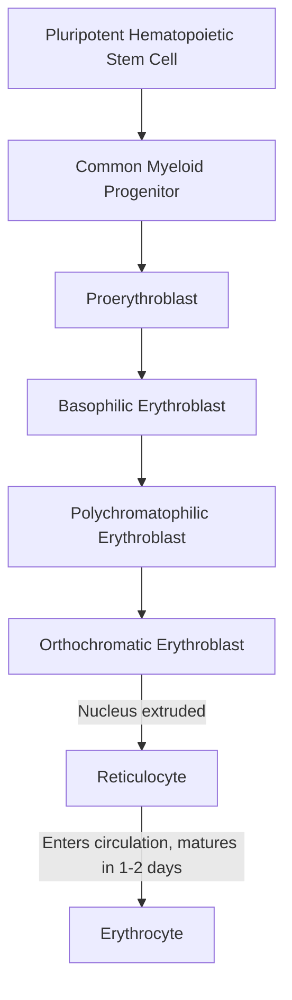

# Section 2: Blood & Immunology

## Chapter 3: Blood Composition & Erythrocytes (RBCs)

---

### 1. Introduction
Blood is a specialized fluid connective tissue that circulates throughout the body. It plays a critical role in transporting oxygen, carbon dioxide, nutrients, and waste products, while also regulating body temperature, pH, and defending against foreign pathogens. 

### 2. Daily Life Analogy
Imagine a busy city with a complex highway system. The cargo trucks driving on the highways are Red Blood Cells (RBCs), transporting oxygen (oxygen packages) to every home and collecting trash (carbon dioxide) to carry to the recycling center (lungs). The police cars driving among the trucks are White Blood Cells (WBCs), patrolling for criminals (pathogens). The road repair vehicles are Platelets, carrying asphalt to patch cracks (vessel leaks) as soon as they occur. The liquid in which they all drive is the Plasma.

### 3. Basic Concept
- **Total Blood Volume**: Approximately 8% of body weight (around 5 liters in a 70 kg adult).
- **Plasma (55%)**: The liquid portion of blood. Contains 91% water, 7% plasma proteins (albumin, globulins, fibrinogen), and 2% other solutes (electrolytes, waste, nutrients).
- **Formed Elements (45%)**: Red Blood Cells (Erythrocytes), White Blood Cells (Leukocytes), and Platelets (Thrombocytes).
- **Hematocrit**: The fraction of blood composed of RBCs (normally ~42% for females and ~47% for males).

```text
Centrifuged Blood Compartments:
[==== Plasma (55%) ====] -> Water, Albumin, Globulins
[ Buffy Coat (<1%)     ] -> WBCs, Platelets
[==== RBCs (45%) ======] -> Red Blood Cells (Hematocrit)
```

### 4. Anatomy Review
- **Erythrocyte Structure**: Biconcave discs with a diameter of ~7.8 micrometers and thickness of 2.5 micrometers. They contain no nucleus, mitochondria, or ribosomes.
- **Biconcave Shape Benefit**: Provides a high surface-area-to-volume ratio for rapid gas exchange and allows the cell to deform and squeeze through tiny capillaries without tearing.
- **Hemoglobin (Hb)**: The primary protein inside RBCs, containing four polypeptide chains (two alpha, two beta) and four iron-containing heme groups that bind reversibly to oxygen.

### 5. Physiology
- **Erythropoiesis**: The process of RBC production.
  * In adults, it occurs exclusively in the red bone marrow (especially membranous bones like vertebrae, sternum, ribs, ilia).
  * **Regulator**: **Erythropoietin (EPO)**, a glycoprotein hormone secreted mainly by renal cortical interstitial cells in response to tissue hypoxia.
- **RBC Life Span**: ~120 days. Old, fragile RBCs are destroyed as they squeeze through the tight splenic trabeculae. Macrophages in the spleen, liver, and bone marrow phagocytize the fragments, recycling the iron.

---

### 6. Mechanism

#### Erythropoietin Feed-Back Loop
When arterial oxygen pressure decreases (hypoxia), renal tissues trigger the synthesis of Erythropoietin. EPO travels to the bone marrow to accelerate hematopoietic stem cell differentiation:



#### Hemoglobin-Oxygen Binding (Cooperative Binding)
- **T-state (Tense)**: Low oxygen affinity conformation.
- **R-state (Relaxed)**: High oxygen affinity. 
- *Cooperativity*: Binding of the first oxygen molecule shifts the hemoglobin structure, facilitating the binding of the remaining three oxygen molecules.

---

### 7. Animation Summary
*Visualization focuses on:* The progression of a hematopoietic stem cell to a reticulocyte, followed by ejection of the nucleus to form a mature biconcave erythrocyte.

### 8. 3D Model Guide
*Interactive viewer targets:* Erythrocyte and Hemoglobin molecule. Clicking the erythrocyte shows the membrane skeletal structure (spectrin, ankyrin). Clicking the hemoglobin shows the coordinate changes of the heme iron binding oxygen.

### 9. Flowchart



### 10. Clinical Correlation
- **Blood Transfusions & Crossmatching**: Checking ABO and Rh antigens on donor RBCs against recipient serum antibodies to prevent hemolytic transfusion reactions.
- **Erythropoietin Abuse**: Athletes inject synthetic EPO to raise hematocrit, boosting oxygen performance but dangerously increasing blood viscosity, leading to strokes or heart attacks.

### 11. Disorders
- **Anemias**: Reduction in total RBC counts or hemoglobin concentration:
  1. *Iron Deficiency Anemia*: Microcytic, hypochromic RBCs due to lack of iron for heme synthesis.
  2. *Megaloblastic Anemia*: Macrocytic RBCs due to Vitamin B12 or Folic Acid deficiencies, disrupting DNA replication.
  3. *Aplastic Anemia*: Bone marrow destruction due to radiation or chemicals.
  4. *Hemolytic Anemias*: Rapid destruction of RBCs (e.g. Sickle Cell Disease, Hereditary Spherocytosis).
- **Polycythemia**: Abnormally high hematocrit (e.g., Polycythemia Vera), raising blood viscosity.

### 12. Summary
- Blood consists of plasma (fluid phase) and formed elements (RBCs, WBCs, platelets).
- RBCs are biconcave, non-nucleated cells designed to carry hemoglobin.
- Erythropoiesis is regulated by renal erythropoietin (EPO) in a negative feedback loop triggered by hypoxia.
- Anemia is a deficiency in oxygen carriage, classified morphologically (microcytic, macrocytic, normocytic).

### 13. Important Formulas
- **Mean Corpuscular Volume (MCV)**:
  \[MCV = \frac{\text{Hematocrit } (\%) \times 10}{\text{RBC Count } (10^{12}/\text{L})}\] (Normal: 80–100 fl)
- **Mean Corpuscular Hemoglobin Concentration (MCHC)**:
  \[MCHC = \frac{\text{Hemoglobin } (\text{g/dL}) \times 100}{\text{Hematocrit } (\%)}\] (Normal: 32–36 g/dL)

### 14. Mnemonics
- **MGD (Membranous Bones)**: Bone marrow sites of adult erythropoiesis:
  * **M**embranous bones (**V**ertebrae, **S**ternum, **R**ibs)
  * **G**irdles (**I**liac bones)
  * **D**istal epiphyses of femur/humerus (minor)

### 15. Viva Questions
1. **Explain why a patient with chronic renal failure develops severe anemia.**
   * *Answer*: The kidney is the primary site of erythropoietin (EPO) production. Chronic renal failure destroys renal tissue, reducing EPO synthesis. The bone marrow receives fewer regulatory signals, dropping RBC production.
2. **What is a reticulocyte, and what does an elevated reticulocyte count signify?**
   * *Answer*: A reticulocyte is the immature precursor to an erythrocyte, containing residual ribosomal RNA. An elevated reticulocyte count (reticulocytosis) indicates that the bone marrow is hyper-active, producing and releasing RBCs rapidly (often in response to acute hemorrhage or hemolysis).

### 16. MCQs
1. Which of the following cells ejects its nucleus during erythropoiesis?
   * A) Proerythroblast
   * B) Reticulocyte
   * C) Orthochromatic erythroblast
   * D) Basophilic erythroblast
   * *Answer*: C

2. A patient presenting with an MCV of 115 fl and normal MCHC likely suffers from which anemia?
   * A) Iron deficiency anemia
   * B) Vitamin B12 deficiency anemia
   * C) Sickle Cell anemia
   * D) Thalassemia minor
   * *Answer*: B *(MCV > 100 fl indicates macrocytosis, typically caused by B12/folate DNA synthesis disruption).*

### 17. Case-Based Learning
**Case**: A 28-year-old female presents with fatigue, cold sensitivity, and dyspnea on exertion. Laboratory analysis: Hemoglobin: 8.5 g/dL (Low), Hematocrit: 28% (Low), MCV: 72 fl (Low), MCHC: 29 g/dL (Low), Serum Ferritin: 8 mcg/L (Low).
- **Question**: Classify the anemia and explain the physiological mechanisms responsible for the low MCV and MCHC values.
- **Analysis**: The patient has Microcytic, Hypochromic Anemia, secondary to Iron Deficiency. Low iron limits heme synthesis. Erythroid precursors divide extra times in the bone marrow, yielding smaller cells (low MCV). The reduced hemoglobin content decreases cell color (low MCHC).

### 18. Flashcards
- **Front**: What is the lifespan of a normal red blood cell?
  **Back**: Approximately 120 days.
- **Front**: Where are old red blood cells sequestered and destroyed?
  **Back**: The spleen (in the red pulp, crossing the splenic cords).

### 19. Revision Notes
Downloadable tables listing normal values for RBC count, Hb concentrations, MCV, MCH, MCHC, and red blood cell precursors.

### 20. Practice Quiz
Timed 10-question practice set containing calculation questions for red cell indices and identification of blood smear abnormalities.
