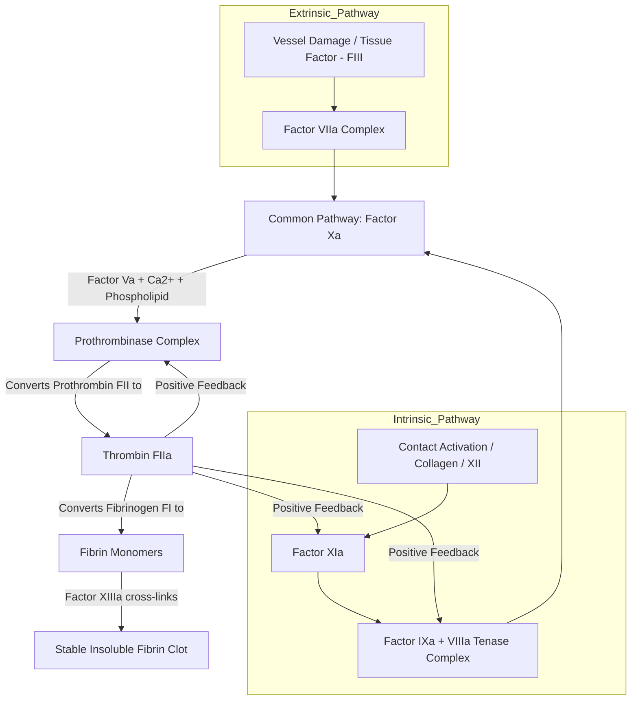

# Hemostasis and Blood Coagulation: Cellular and Cascade Mechanisms

### 1. Introduction
Hemostasis is the physiological system designed to maintain blood in a fluid state within the vascular compartment while rapidly forming a localized solid plug (clot) at sites of vascular injury. It represents a balance between procoagulant, anticoagulant, and fibrinolytic systems.

### 2. Daily Life Analogy
Hemostasis is like repairing a high-pressure water pipe rupture:
1.  **Vascular Spasm**: Instantly constricting the pipe to slow down flow.
2.  **Primary Hemostasis**: Applying quick-setting duct tape (a platelet plug) over the hole.
3.  **Secondary Hemostasis**: Mixing a liquid cement (coagulation cascade) to build a permanent concrete shield (cross-linked fibrin) over the tape.
4.  **Fibrinolysis**: Once the pipe is healed, utilizing a grinder (plasmin) to smooth down the excess cement to prevent pipe blockage.

---

### 3. Basic Concept
Hemostasis occurs in three overlapping phases:
1.  **Vascular Spasm**: Local vasoconstriction mediated by myogenic spasm, autacoid factors (thromboxane A2, endothelin-1), and nociceptive reflexes.
2.  **Primary Hemostasis**: Interaction of platelets with the injured vessel wall to form a temporary **platelet plug**.
3.  **Secondary Hemostasis**: Activation of coagulation factors leading to **fibrin formation** that stabilizes the platelet plug.
4.  **Fibrinolysis**: Clot dissolution to restore normal blood flow during tissue repair.

---

### 4. Anatomy Review
Detailed structural features of platelets (thrombocytes), subendothelial collagen, and the endothelial lining are reviewed.

### 5. Physiology
#### Platelets (Thrombocytes)
*   **Normal Range**: $150,000 - 450,000\text{ /}\mu\text{L}$. Lifespan of $8 - 12\text{ days}$. Formed from bone marrow **megakaryocytes** via thrombopoietin stimulation.
*   **Ultrastructure**: Lacks a nucleus but contains active organelles (mitochondria, microtubules) and two major types of secretory granules:
    *   **Alpha Granules**: Contain **von Willebrand Factor (vWF)**, Fibrinogen, Fibronectin, Factor V, Factor VIII, and Platelet-Derived Growth Factor (PDGF).
    *   **Dense (Delta) Granules**: Contain **ADP**, **ATP**, **Calcium ($Ca^{2+}$)**, and **Serotonin**.
*   **Membrane Receptors**:
    *   **GP Ib/IX/V**: Binds to subendothelial collagen-bound **vWF** (essential for adhesion).
    *   **GP IIb/IIIa (Integrin $\alpha_{IIb}\beta_3$)**: Binds **Fibrinogen**, bridging adjacent platelets together (essential for aggregation).
    *   **GP VI / GP Ia/IIa**: Directly binds subendothelial collagen.

#### Endothelial Antithrombotic Factors
Healthy, intact endothelium actively inhibits platelet adhesion and clotting:
*   **Prostacyclin ($PGI_2$)** & **Nitric Oxide ($NO$)**: Stimulate cAMP and cGMP pathways respectively, preventing platelet activation and causing vasodilation.
*   **Thrombomodulin**: Binds thrombin, converting it from a procoagulant to an activator of the anticoagulant **Protein C**.
*   **Heparan Sulfate**: Activates **Antithrombin III**, which neutralizes thrombin and factor Xa.
*   **Tissue Plasminogen Activator (t-PA)**: Initiates fibrinolysis.

---

### 6. Mechanism
#### Primary Hemostasis (Platelet Plug Formation)
1.  **Adhesion**: Endothelial damage exposes subendothelial collagen. Circulating **vWF** binds to collagen. Platelet membrane receptor **GP Ib/IX/V** binds to vWF, anchoring platelets to the damaged site under high shear stress.
2.  **Activation and Degranulation**: Binding activates the platelet, causing a conformational shape change (extending pseudopods) and degranulation:
    *   Release of **ADP** binds to P2Y12 receptors on other platelets, activating them.
    *   Synthesized **Thromboxane $A_2$ ($TxA_2$)** via the cyclooxygenase-1 (COX-1) pathway is released, causing local vasoconstriction and further platelet activation.
    *   Exocytosis of dense granule $Ca^{2+}$ provides cofactors for cascade assembly.
3.  **Aggregation**: Activation causes a conformational change in the **GP IIb/IIIa** receptors, increasing their affinity for **fibrinogen**. Fibrinogen acts as a symmetrical bridge, binding to GP IIb/IIIa receptors on adjacent platelets, building the primary platelet plug.

#### Secondary Hemostasis (Blood Coagulation Cascade)
Coagulation is a series of amplified enzymatic conversions of inactive zymogens into active serine proteases, culminating in the conversion of soluble fibrinogen to insoluble cross-linked fibrin.



1.  **Extrinsic Pathway (Initiation)**:
    *   Tissue damage exposes **Tissue Factor (TF / Factor III)**.
    *   Circulating active **Factor VIIa** binds to TF in the presence of $Ca^{2+}$ to form the **Extrinsic Tenase Complex** ($TF-VIIa-Ca^{2+}$).
    *   This complex activates Factor X to **Factor Xa**, and Factor IX to **Factor IXa**.
2.  **Intrinsic Pathway (Amplification)**:
    *   *In vitro*: Initiated when **Factor XII** (Hageman factor) contacts negatively charged surfaces (collagen, glass), converting to XIIa. XIIa converts XI to XIa, which in turn converts IX to IXa.
    *   *In vivo*: Amplified by **Thrombin** feedback. Factor IXa combines with cofactor **Factor VIIIa**, $Ca^{2+}$, and platelet membrane phospholipids to form the **Intrinsic Tenase Complex**, which rapidly generates Factor Xa.
3.  **Common Pathway (Thrombin Burst & Fibrin Mesh)**:
    *   **Factor Xa** combines with cofactor **Factor Va**, $Ca^{2+}$, and phospholipids on the platelet membrane to form the **Prothrombinase Complex**.
    *   The prothrombinase complex cleaves **Prothrombin (Factor II)** into **Thrombin (Factor IIa)**.
    *   Thrombin cleaves **Fibrinogen (Factor I)** into soluble **Fibrin monomers** (releasing fibrinopeptides A and B).
    *   Fibrin monomers spontaneously polymerize.
    *   Thrombin activates **Factor XIII (Fibrin Stabilizing Factor)** to **XIIIa**, which covalently cross-links fibrin polymers (lysine-glutamine links) into a stable insoluble fibrin mesh.

#### Vitamin K-Dependent Carboxylation
Factors **II, VII, IX, and X**, as well as regulatory anticoagulants **Protein C and S**, require Vitamin K as a cofactor. Vitamin K mediates the **gamma-carboxylation of glutamic acid residues** on these proteins in the liver. This carboxylation adds negative charges, enabling the factors to bind calcium ($Ca^{2+}$) and anchor to negatively charged platelet membrane phospholipids to assemble the cascade complexes. Warfarin inhibits **vitamin K epoxide reductase (VKOR)**, blocking this carboxylation.

---

#### Physiology of Anticoagulation and Fibrinolysis
#### Physiological Anticoagulant Systems
To prevent runaway thrombosis, the body employs three main brakes:
1.  **Antithrombin III (ATIII)**: A circulating serine protease inhibitor that binds and inactivates Thrombin and Factor Xa. The rate of ATIII action is accelerated $>1000\text{-fold}$ by binding to **heparin** or endothelial heparan sulfate.
2.  **Protein C & S System**: Thrombin binds to endothelial **thrombomodulin**. This complex activates **Protein C** to APC. APC, with its cofactor **Protein S**, cleaves and inactivates cofactors **Va** and **VIIIa**, shutting down the tenase and prothrombinase complexes.
3.  **Tissue Factor Pathway Inhibitor (TFPI)**: Inhibits the Extrinsic Tenase Complex ($TF-VIIa$) once Factor Xa is generated.

#### Fibrinolysis (Clot Dissolution)
1.  Endothelial cells release **Tissue Plasminogen Activator (t-PA)** or **Urokinase (u-PA)**.
2.  t-PA cleaves zymogen **Plasminogen** (trapped within the fibrin clot) into active **Plasmin**.
3.  Plasmin cleaves the insoluble fibrin mesh into soluble **Fibrin Degradation Products (FDPs)**, including **D-dimer** (a marker of cross-linked fibrin cleavage).
4.  Free circulating plasmin is rapidly neutralized by **$\alpha_2$-antiplasmin** to prevent systemic fibrinogen degradation, and t-PA is regulated by **Plasminogen Activator Inhibitor-1 (PAI-1)**.

---

### 7. Animation Summary
Observe the dynamic changes in this physiological process.
<animation-placeholder />

### 8. 3D Model Guide
Explore the structural components involved in this process.
<3d-model-placeholder />

### 9. Flowchart

```

### 10. Clinical Correlation
*   **Bleeding Time (BT)**: Measures primary hemostasis (platelet function and vessel response). Normal range: $2 - 7\text{ minutes}$. Prolonged in thrombocytopenia and von Willebrand disease.
*   **Prothrombin Time (PT) & INR**: Evaluates the **extrinsic and common pathways** (Factors VII, X, V, II, I). Used to monitor **Warfarin** therapy. Normal PT: $11 - 13\text{ seconds}$.
    *   $$ \text{INR} = \left( \frac{\text{Patient PT}}{\text{Mean Normal PT}} \right)^{\text{ISI}} $$ (Normal target: $1.0$; therapeutic range on Warfarin: $2.0 - 3.0$).
*   **Activated Partial Thromboplastin Time (aPTT)**: Evaluates the **intrinsic and common pathways** (Factors XII, XI, IX, VIII, X, V, II, I). Used to monitor unfractionated **Heparin** therapy. Normal: $25 - 35\text{ seconds}$.
*   **Mixing Studies**: If a patient has a prolonged aPTT, their plasma is mixed 1:1 with normal pooled plasma. If the aPTT **corrects** to normal, it indicates a **factor deficiency** (e.g., Hemophilia). If it **does not correct**, it indicates the presence of a **factor inhibitor** (e.g., lupus anticoagulant, anti-factor VIII antibodies).

---

### 11. Disorders
*   **Von Willebrand Disease (vWD)**: The most common inherited bleeding disorder (typically autosomal dominant). Characterized by deficiency or dysfunction of vWF. Results in impaired platelet adhesion (prolonged Bleeding Time) and secondary Factor VIII deficiency (prolonged aPTT, since vWF stabilizes circulating Factor VIII).
*   **Hemophilias**:
    *   **Hemophilia A**: X-linked recessive deficiency of **Factor VIII**. Prolonged aPTT, normal PT and BT. Presents with hemarthrosis (joint bleeding) and easy bruising.
    *   **Hemophilia B (Christmas Disease)**: X-linked recessive deficiency of **Factor IX**. Prolonged aPTT, normal PT and BT.
    *   **Hemophilia C**: Autosomal recessive deficiency of **Factor XI** (primarily seen in Ashkenazi Jews).
*   **Platelet Receptor Defects**:
    *   **Bernard-Soulier Syndrome**: Autosomal recessive deficiency of **GP Ib/IX/V** receptors. Causes defect in platelet **adhesion**. Giant platelets on blood smear, thrombocytopenia, and failure of platelets to aggregate in response to ristocetin.
    *   **Glanzmann Thrombasthenia**: Autosomal recessive deficiency of **GP IIb/IIIa** receptors. Causes defect in platelet **aggregation**. Normal platelet count, but platelets fail to aggregate with ADP, collagen, or epinephrine; they aggregate normally with ristocetin.
*   **Disseminated Intravascular Coagulation (DIC)**: Pathologic, widespread activation of coagulation throughout the microvasculature. Consumes platelets and clotting factors (consumption coagulopathy) leading to systemic hemorrhage, microangiopathic hemolytic anemia (schistocytes on blood smear), prolonged PT and aPTT, low fibrinogen, and elevated **D-dimer**.

---

### 12. Summary
- Hemostasis is divided into primary (platelet plug) and secondary (coagulation cascade) phases.
- Coagulation is balanced by physiological anticoagulants (ATIII, Protein C/S, TFPI) and resolved by the fibrinolytic system (plasmin).
- Disorders of hemostasis present as primary platelet defects (e.g. Bernard-Soulier, Glanzmann, vWD) or coagulation defects (e.g. Hemophilia).

### 13. Important Formulas
$$ \text{Fibrin Degradation Products (FDPs)} \rightarrow \text{Marker of Fibrinolysis} $$
$$ \text{D-Dimer} > 500\text{ ng/mL} \rightarrow \text{Indicates active thrombosis and fibrinolysis (DVT, PE, DIC)} $$

### 14. Mnemonics
*   **1972 (Factors II, VII, IX, X)**: The Vitamin K dependent factors.
*   **Extrinsic Pathway is short (Factor VII)**: Monitored by **PT** (word is short).
*   **Intrinsic Pathway is long (Twelve, Eleven, Nine, Eight)**: Monitored by **aPTT** (word is long).
*   **Bernard-Soulier = Big Platelets & Bad Adhesion** (GP Ib defect).
*   **Glanzmann = Glanzmann/GP IIb/IIIa Aggregation defect**.

---

### 15. Viva Questions
1.  **Why does a deficiency of Factor VIII (Hemophilia A) cause severe bleeding if the extrinsic pathway is normal?**
    *   **Answer**: The extrinsic pathway is rapidly inactivated by TFPI after producing a tiny amount of thrombin. This initial thrombin is insufficient to form a stable clot but is essential to feedback-activate the intrinsic pathway (Factors XI, IX, and VIII cofactor). The intrinsic tenase complex is responsible for the massive "thrombin burst" required for a stable fibrin mesh. Without Factor VIII, this burst fails.
2.  **How does Heparin work to achieve rapid anticoagulation?**
    *   **Answer**: Heparin binds to Antithrombin III (ATIII), inducing a conformational change that increases the affinity of ATIII for Thrombin and Factor Xa by over 1000-fold, rapidly neutralizing active coagulation.
3.  **Why does a patient with liver disease have a prolonged PT?**
    *   **Answer**: The liver synthesizes almost all clotting factors (I, II, V, VII, IX, X, XI, XII, XIII). Factor VII has the shortest half-life (~6 hours) among the clotting factors, making Prothrombin Time (PT) the most sensitive indicator of acute liver synthesis failure.

---

### 16. MCQs
1.  A 5-year-old boy presents with severe bleeding after a minor dental procedure. Laboratory tests show: PT: 12 seconds (normal), aPTT: 68 seconds (prolonged), Bleeding Time: 4 minutes (normal), Platelet Count: 280,000/µL (normal). A 1:1 mixing study with normal pooled plasma corrects the patient's aPTT to 30 seconds. Which of the following is the most likely diagnosis?
    *   A) Von Willebrand Disease
    *   B) Hemophilia A
    *   C) Bernard-Soulier Syndrome
    *   D) Lupus Anticoagulant
    *   **Answer**: B
    *   *Explanation*: The normal BT and platelet count rule out primary platelet defects. The isolated prolonged aPTT that corrects with a mixing study indicates a factor deficiency in the intrinsic pathway (e.g. Factor VIII in Hemophilia A). Von Willebrand disease typically prolongs bleeding time.

2.  Which receptor undergoes a conformational change during platelet activation to bind fibrinogen and bridge platelets together?
    *   A) GP Ib/IX/V
    *   B) GP IIb/IIIa
    *   C) P2Y12 receptor
    *   D) Thrombomodulin
    *   **Answer**: B
    *   *Explanation*: GP IIb/IIIa is the fibrinogen receptor responsible for platelet-to-platelet aggregation. GP Ib/IX/V binds vWF for platelet-to-subendothelial adhesion.

3.  Administration of Warfarin inhibits which specific process in the liver?
    *   A) Synthesis of Antithrombin III
    *   B) Conformational change in DHP receptors
    *   C) Regeneration of active Vitamin K via Vitamin K Epoxide Reductase (VKOR)
    *   D) Cleavage of plasminogen to active plasmin
    *   **Answer**: C
    *   *Explanation*: Warfarin blocks Vitamin K Epoxide Reductase, preventing the reduction of vitamin K back to its active form, thereby inhibiting the gamma-carboxylation of glutamic acid residues on factors II, VII, IX, and X.

4.  A 24-year-old female presents with mucosal bleeding and menorrhagia. Lab studies reveal a platelet count of 220,000/µL (normal), bleeding time of 12 minutes (prolonged), aPTT of 45 seconds (prolonged), and normal PT. Platelet aggregation studies show failure to aggregate with ristocetin, which is corrected upon addition of normal plasma. What is the diagnosis?
    *   A) Glanzmann Thrombasthenia
    *   B) Bernard-Soulier Syndrome
    *   C) Von Willebrand Disease
    *   D) Hemophilia B
    *   **Answer**: C
    *   *Explanation*: The prolonged BT, prolonged aPTT (due to low FVIII stabilization), and ristocetin aggregation failure that corrects with normal plasma (containing vWF) is diagnostic of Von Willebrand Disease. In Bernard-Soulier syndrome, the defect is in the GP Ib receptor on the platelets themselves, so adding normal plasma does not correct the ristocetin aggregation.

5.  What is the function of the enzyme Plasmin?
    *   A) Cleaving prothrombin to thrombin
    *   B) Covalently cross-linking fibrin polymers
    *   C) Degrading fibrin clots into soluble fragments (FDPs)
    *   D) Activating Protein C in the presence of thrombomodulin
    *   **Answer**: C
    *   *Explanation*: Plasmin is the primary fibrinolytic enzyme. It cleaves fibrin and fibrinogen, breaking down the clot into soluble fibrin degradation products (including D-dimer).

---

### 17. Case-Based Learning
**Clinical History**: A 45-year-old male is admitted with severe sepsis due to lobar pneumonia. Twelve hours later, he develops diffuse bleeding from intravenous line sites, hematuria, and petechiae.
*   **Laboratory Profile**:
    *   Platelet Count: $45,000\text{ /}\mu\text{L}$ (severely decreased)
    *   PT: $24\text{ seconds}$ (prolonged)
    *   aPTT: $62\text{ seconds}$ (prolonged)
    *   Fibrinogen: $90\text{ mg/dL}$ (severely decreased; normal: $200-400\text{ mg/dL}$)
    *   D-Dimer: $4,500\text{ ng/mL}$ (significantly elevated)
    *   Blood Smear: Shows fragmented red blood cells (schistocytes).

**Critical Questions**:
1.  **What is the diagnosis?**
    *   *Answer*: Disseminated Intravascular Coagulation (DIC) secondary to sepsis.
2.  **Explain the pathophysiological mechanism leading to both thrombosis (schistocytes) and hemorrhage (IV site bleeding).**
    *   *Answer*: Inflammatory cytokines trigger massive systemic tissue factor expression, causing uncontrolled microvascular thrombi that shear RBCs (forming schistocytes). This widespread clotting consumes platelets and coagulation factors (II, V, VIII, fibrinogen), leaving the body depleted of clotting components, resulting in severe bleeding (consumption coagulopathy).
3.  **Explain why the D-Dimer is elevated in this patient.**
    *   *Answer*: The systemic microvascular fibrin clots trigger a massive secondary activation of the fibrinolytic system. Plasmin cleaves the cross-linked fibrin clots, releasing high amounts of D-dimer fragments into the circulation.

---

### 18. Flashcards
*   **Front**: Which anticoagulant blocks factors Va and VIIIa?
    **Back**: Activated Protein C (APC) with its cofactor Protein S.
*   **Front**: Why is ristocetin used in platelet studies?
    **Back**: Ristocetin induces a conformational change in vWF, forcing it to bind GP Ib; failure to aggregate suggests either vWD or Bernard-Soulier syndrome.
*   **Front**: What is the cofactor for Antithrombin III?
    **Back**: Heparin or endothelial Heparan Sulfate.
*   **Front**: What is the function of Factor XIIIa in secondary hemostasis?
    **Back**: It covalently cross-links fibrin monomers to stabilize the blood clot.

---

### 19. Revision Notes
*   **Primary plug**: Short-term, platelet-dominated. Evaluated by Bleeding Time.
*   **Secondary clot**: Long-term, fibrin-dominated. Evaluated by PT/aPTT.
*   **Thrombocytopenia threshold for spontaneous bleeding**: Typically $<20,000\text{ /}\mu\text{L}$.
*   **Fibrin stabilizing factor**: Factor XIII (transglutaminase activated by thrombin).

---

### 20. Practice Quiz
<quiz-placeholder />
