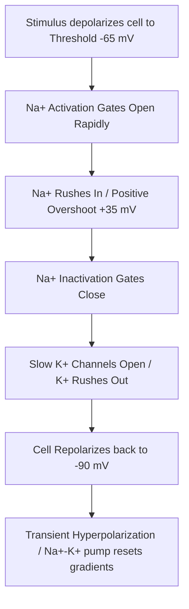

# Section 3: Nerve & Muscle Physiology

## Chapter 4: Membrane Potentials & Action Potentials

---

### 1. Introduction
All cells in the human body exhibit electrical properties across their membranes. Neurons and muscle cells are specialized as "excitable" cells. They can generate rapid, transient changes in their membrane potentials, acting as electrical signals to transmit information or trigger contraction.

### 2. Daily Life Analogy
Imagine a custom sliding door at a store. Inside the store, security guards keep shopping carts lined up against the door (Sodium ions outside the cell). Inside, a few baskets sit near the registers (Potassium ions inside the cell). Normally, the door is closed (Resting potential). 
When a customer steps on the pressure mat, the automatic motor opens the door, and shopping carts rush inside (Depolarization via sodium channels opening). Once open, a clerk pushes the carts back outside to reset the entry (Repolarization via potassium channels opening).

### 3. Basic Concept
- **Membrane Potential (\(V_m\))**: The voltage difference across a cell membrane.
- **Resting Membrane Potential (RMP)**: The charge difference when the cell is at rest. In large nerve fibers, the RMP is about **-90 millivolts (mV)**, meaning the inside of the cell is negative relative to the outside.
- **Electrochemical Gradient**: The net force driving an ion across a membrane, combining the concentration (chemical) gradient and electrical charge gradient.

```text
    EXTRACELLULAR FLUID (High Na+, Low K+)
   ++++++++++++++++++++++++++++++++++++++++  <-- Membrane (+)
   ----------------------------------------  <-- Membrane (-)
    INTRACELLULAR FLUID (High K+, Low Na+)
    [ Resting Membrane Potential = -90 mV ]
```

### 4. Anatomy Review
The key molecular structures maintaining electrical potentials are:
- **Leak Channels**: Non-gated channels (e.g., \(K^+\) leak channels). The resting membrane is 100 times more permeable to potassium than to sodium because of these channels.
- **Voltage-Gated Sodium Channel**: Has an *activation gate* on the outside and an *inactivation gate* on the inside.
- **Voltage-Gated Potassium Channel**: Has a single gate that opens slowly when the cell depolarizes.
- **Sodium-Potassium Pump**: Maintains the concentration gradients of \(Na^+\) and \(K^+\).

### 5. Physiology
Origin of the Resting Membrane Potential in Neurons:
1. **Potassium Diffusion Potential (\(-94\text{ mV}\))**: Driven by high intracellular \(K^+\) concentration diffusing out through leak channels.
2. **Sodium Diffusion Potential (\(+86\text{ mV}\))**: Driven by sodium trying to enter. Because sodium permeability is low, the combined diffusion potential (calculated by the Goldman equation) is **-86 mV**.
3. **Electrogenic \(Na^+\)-\(K^+\) Pump (\(-4\text{ mV}\))**: Pumps 3 \(Na^+\) out for every 2 \(K^+\) in, leaving a net negative charge inside. 
- *Total RMP*: \(-86\text{ mV} + (-4\text{ mV}) = -90\text{ mV}\).

---

### 6. Mechanism

#### Phases of the Action Potential
1. **Resting Stage**: The membrane is polarized (\(-90\text{ mV}\)). Voltage-gated channels are closed.
2. **Depolarization Stage**: A stimulus depolarizes the membrane toward the threshold potential (~ -65 mV). Voltage-gated \(Na^+\) channels open rapidly. Sodium rushes into the cell, reversing the potential to positive values (overshoot, up to +35 mV).
3. **Repolarization Stage**: Within fractions of a millisecond, \(Na^+\) channel inactivation gates close, blocking further sodium entry. Slowly, voltage-gated \(K^+\) channels open. Potassium rushes out of the cell, returning the potential to resting levels.
4. **Hyperpolarization (Undershoot)**: Potassium channels remain open briefly after reaching resting levels, driving the potential closer to the potassium equilibrium potential (\(-94\text{ mV}\)).

```text
Action Potential Curve:
Membrane
Potential (mV)
  +35 |         /\
      |        /  \
    0 |-------/----\-------------
      |      /      \  Repolarization
  -65 |----/          \ <-- Threshold
  -90 |---/____________\______  <-- RMP
      |                 \___/  <-- Hyperpolarization
      +-------------------------> Time (ms)
```

- **Goldman-Hodgkin-Katz (GHK) Equation**: Calculates resting potential based on concentration gradients and relative permeabilities (\(P\)):
  \[V_m = 61 \cdot \log_{10}\left(\frac{P_{\text{Na}}[Na^+]_o + P_{\text{K}}[K^+]_o + P_{\text{Cl}}[Cl^-]_i}{P_{\text{Na}}[Na^+]_i + P_{\text{K}}[K^+]_i + P_{\text{Cl}}[Cl^-]_o}\right)\]

---

### 7. Animation Summary
*Visualization focuses on:* The opening and closing sequence of the activation and inactivation gates on the voltage-gated \(Na^+\) channel during depolarization, compared with the slow opening of the \(K^+\) channel gate.

### 8. 3D Model Guide
*Interactive viewer targets:* Axon membrane cross section. Hovering over Na+ channels displays gate states. Selecting threshold activation simulates the wave of action potential propagation along the axon (saltatory conduction).

### 9. Flowchart



### 10. Clinical Correlation
- **Local Anesthetics (Lidocaine, Procaine)**: Bind to the intracellular side of voltage-gated \(Na^+\) channels, preventing their activation. This blocks action potentials in pain fibers, inducing local anesthesia.
- **Tetrodotoxin (TTX)**: A potent toxin found in pufferfish that binds to and blocks voltage-gated sodium channels, preventing action potentials and causing paralysis and respiratory failure.

### 11. Disorders
- **Hyperkalemia**: Elevated extracellular potassium reduces the potassium concentration gradient. The RMP becomes depolarized (less negative), making cells initially hyperexcitable, but eventually leading to inactivation of sodium channels and cardiac arrest.
- **Hypocalcemia**: Low extracellular calcium reduces the threshold voltage required to open sodium channels, making the cell hyperexcitable (carpopedal spasm, tetany).

### 12. Summary
- Excitable cells communicate via rapid, electrical changes called Action Potentials.
- Resting membrane potential is maintained by K+ diffusion, selective permeability, and the Na+-K+ pump.
- Depolarization is caused by rapid sodium influx. Repolarization is caused by sodium channel inactivation and potassium efflux.

### 13. Important Formulas
- **Nernst Equilibrium Potential**: \(E_i = -61 \log (C_o / C_i)\) for positive univalent ions.

### 14. Mnemonics
- **saltATORY Conduction**:
  * Action potentials **SALT** (jump) from one Node of Ranvier to the next in myelinated axons.

### 15. Viva Questions
1. **Define the Refractory Period and distinguish between Absolute and Relative refractory periods.**
   * *Answer*: The refractory period is the time interval during which a second action potential cannot be elicited. The *Absolute Refractory Period* is when sodium channels are inactivated and no stimulus can trigger an impulse. The *Relative Refractory Period* is when potassium efflux is high; a stronger-than-normal stimulus can trigger an impulse.
2. **Explain the role of myelin in nerve conduction.**
   * *Answer*: Myelin acts as an electrical insulator. Action potentials cannot generate in myelinated regions; they jump between the unmyelinated Nodes of Ranvier (saltatory conduction), which increases conduction speed and conserves energy.

### 16. MCQs
1. The resting membrane potential of large nerve fibers is closest to the equilibrium potential of which ion?
   * A) Sodium (\(Na^+\))
   * B) Calcium (\(Ca^{2+}\))
   * C) Potassium (\(K^+\))
   * D) Chloride (\(Cl^-\))
   * *Answer*: C *(Permeability to potassium is 100 times greater than to other ions).*

2. Lidocaine prevents pain transmission by directly blocking which of the following?
   * A) Voltage-gated potassium channels
   * B) Ligand-gated sodium channels
   * C) Voltage-gated sodium channels
   * D) Sodium-potassium pump
   * *Answer*: C

### 17. Case-Based Learning
**Case**: A 45-year-old patient with chronic kidney disease presents with muscle weakness and an irregular heart rate. Laboratory workup reveals a serum potassium concentration of 7.2 mmol/L (Severe Hyperkalemia). An ECG shows tall, peaked T-waves.
- **Question**: How does elevated extracellular potassium affect the resting membrane potential and the generation of cardiac action potentials?
- **Analysis**: High extracellular potassium reduces the gradient for potassium diffusion out of the cell. According to the Nernst and GHK equations, the resting membrane potential becomes less negative (depolarized). This depolarization brings the cell closer to threshold, making it initially excitable. However, persistent depolarization keeps sodium channel inactivation gates closed, blocking action potentials and leading to cardiac arrest.

### 18. Flashcards
- **Front**: What initiates the repolarization phase of an action potential?
  **Back**: Inactivation of voltage-gated sodium channels and activation of voltage-gated potassium channels.
- **Front**: What calculates the equilibrium potential of a single ion?
  **Back**: The Nernst Equation.

### 19. Revision Notes
Downloadable step-by-step curves showing channel conductance values (GNa and GK) overlaying the action potential graph.

### 20. Practice Quiz
Timed 15-question module calculating membrane potentials using the Goldman equation under varying ion permeabilities.
