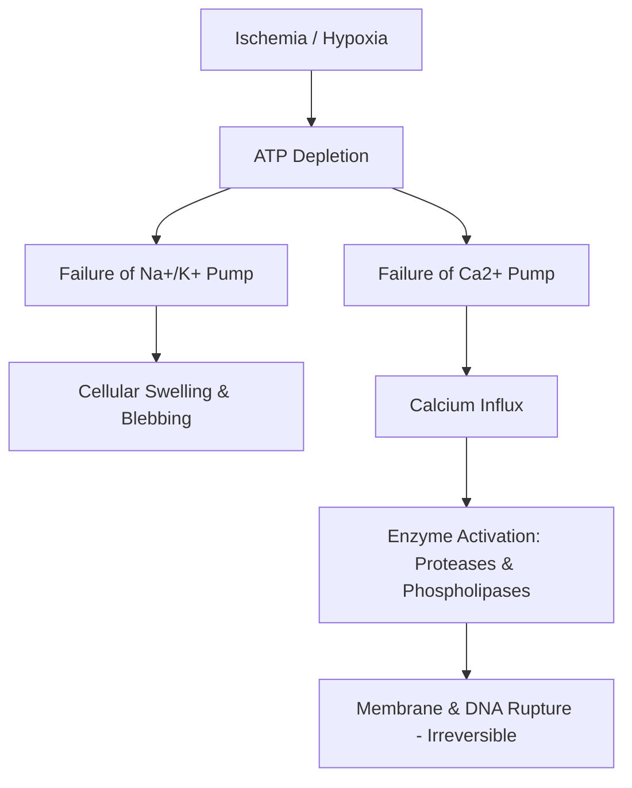

# Cell Injury: Reversible vs. Irreversible Necrosis

### 1. Introduction
Cell injury occurs when environmental stresses exceed the cell's capacity to adapt. This chapter covers the transition from reversible cell injury to irreversible injury, culminating in cell death (Necrosis or Apoptosis).

### 2. Daily Life Analogy
Cell injury is like a city power grid overload:
- **Reversible Injury**: A temporary blackout. The fuses trip (cellular swelling), but once the power load is reduced (restored oxygen), the lights turn back on.
- **Irreversible Injury (Necrosis)**: A massive power station explosion. The generators burst (membrane rupture) and the control panels melt (nuclear fragmentation). The system is permanently destroyed.

### 3. Basic Concept
Cellular adaptation (hypertrophy, hyperplasia, atrophy, metaplasia) maintains homeostasis under mild stress. Severe or persistent stress causes **Reversible Injury** (cellular swelling, fatty change). If the stress is not relieved, the cell crosses the "point of no return" into **Irreversible Injury**, marked by membrane damage and calcium influx, resulting in **Necrosis**.

### 4. Anatomy Review
Under electron microscopy:
- **Reversible**: Membrane blebs, mitochondrial swelling, ribosome detachment.
- **Irreversible**: Amorphous densities in mitochondria, lysosomal rupture, and nuclear changes:
    *   **Pyknosis**: Nuclear shrinkage and condensation.
    *   **Karyorrhexis**: Nuclear fragmentation.
    *   **Karyolysis**: Dissolution of the nucleus.

### 5. Physiology
*   **Necrosis**: Always pathological. Characterized by cell swelling, membrane leakage, enzymatic digestion of cells, and surrounding inflammation.
*   **Apoptosis**: Often physiological (programmed cell death). Characterized by cell shrinkage, intact membranes, no inflammation, and active ATP consumption.

### 6. Mechanism
1.  **Hypoxia** blocks oxidative phosphorylation, depleting ATP.
2.  Without ATP, the **Na+/K+ ATPase pump** fails, accumulating sodium and water inside the cell, causing cellular swelling.
3.  Anaerobic glycolysis increases, accumulating lactic acid and dropping intracellular pH.
4.  **Ca2+-ATPase pump** fails, causing a massive influx of calcium from the SR and extracellular space.
5.  Elevated intracellular calcium activates destructive enzymes: ATPases, Phospholipases (damage membranes), Proteases (damage cytoskeleton), and Endonucleases (fragment DNA).

### 7. Animation
Observe the dynamic changes in this physiological process.
<animation-placeholder />

### 8. Interactive 3D Model
Explore the structural components involved in this process.
<3d-model-placeholder />

### 9. Flowchart

### 10. Clinical Correlation
*   **Myocardial Infarction**: Ischemia of cardiac muscle depletes ATP. After 20-40 minutes of severe ischemia, injury becomes irreversible (necrosis). Troponin I and T leak across damaged sarcolemmas, serving as clinical diagnostic markers.

### 11. Disorders
1.  **Coagulative Necrosis**: Dead tissues preserve outline (typical of ischemia in all solid organs except brain).
2.  **Liquefactive Necrosis**: Digestion of dead cells into a liquid viscous mass (seen in brain infarcts and bacterial abscesses).
3.  **Caseous Necrosis**: Cheese-like white appearance (characteristic of Tuberculosis).

### 12. Summary
*   Reversible injury is marked by cellular swelling and low ATP.
*   Irreversible injury is defined by calcium influx, severe membrane damage, and nuclear fragmentation.

### 13. Important Formula
$$ \text{Severity of Cell Injury} \propto \frac{\text{Duration of Ischemia}}{\text{Intracellular Glycogen / ATP Stores}} $$

### 14. Mnemonics
*   **P**yknosis = **P**inpoint nucleus (shrinkage).
*   **K**aryorrhexis = **K**rumble nucleus (fragmentation).
*   **K**aryolysis = **K**lear nucleus (dissolution).

### 15. Viva Questions
1.  **Why does brain ischemia cause liquefactive necrosis instead of coagulative necrosis?**
    *   **Answer**: The brain contains high amounts of lipids and lysosomal enzymes, and lacks a dense connective tissue stromal framework. Microglial cells release hydrolytic enzymes that rapidly digest the dead tissue into a liquid state.

### 16. MCQs
1.  Which of the following is the definitive hallmark of irreversible cell injury?
    *   A) Ribosome detachment from rough ER
    *   B) Depletion of ATP
    *   C) Severe damage to plasma and mitochondrial membranes
    *   D) Sarcoplasmic swelling
    *   **Answer**: C

### 17. Case-Based Learning
A patient presents with crushing substernal chest pain. ECG shows ST-elevation. Troponin is elevated. **Analysis**: Myocardial infarction causing ischemic cell injury. Lack of ATP fails Na+/K+ pumps. Membrane rupture leaks cardiac troponins into blood.

### 18. Flashcards
*   **Front**: What type of necrosis is typical of tuberculosis?
    **Back**: Caseous necrosis.

### 19. Revision Notes
*   **Free Radicals**: Reactive Oxygen Species (ROS) cause lipid peroxidation of membranes, protein cross-linking, and DNA damage.

### 20. Practice Quiz
<quiz-placeholder />
