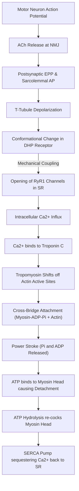

# Skeletal Muscle Physiology: Excitation, Contraction, and Mechanics

### 1. Introduction
Skeletal muscle constitutes approximately 40% of total body mass and is responsible for voluntary movement, posture maintenance, and thermogenesis. This chapter provides a deep cellular and mechanical analysis of how electrical signals from motor neurons are translated into physical force.

### 2. Daily Life Analogy
Imagine a massive rowing team. The coxswain (motor neuron) sends a megaphone signal (acetylcholine) to start rowing. The rowers (myosin heads) are ready, but the oars are locked (tropomyosin blocks actin). Once the keys (calcium ions) unlock the gates, the rowers grip the water (actin) and perform synchronized power strokes. Without new energy (ATP), they cannot release their oars, freezing the boat in place (rigor mortis).

### 3. Basic Concept
Skeletal muscle contraction is governed by **Excitation-Contraction (EC) Coupling** and the **Sliding Filament Theory**. Muscle fibers do not shorten by contracting their individual protein filaments; rather, the thick (myosin) and thin (actin) filaments slide past one another, reducing sarcomere length.

### 4. Anatomy Review
*   **Sarcomere**: The basic contractile unit of skeletal muscle, bounded by two **Z-discs** (Z-lines).
*   **Thick Filaments**: Composed of **Myosin II** molecules. Each myosin molecule consists of a tail of heavy chains and two globular heads containing an **actin-binding site** and an **ATPase catalytic site**.
*   **Thin Filaments**: Composed of double-helical **F-actin**, wrapped by **tropomyosin** (which blocks the active myosin-binding sites at rest), and the **troponin complex**:
    *   **Troponin T**: Binds the troponin complex to tropomyosin.
    *   **Troponin I**: Inhibits the actin-myosin interaction by holding tropomyosin over the binding site.
    *   **Troponin C**: Contains four calcium-binding sites (two high-affinity sites always occupied by $Mg^{2+}$, and two low-affinity sites that bind $Ca^{2+}$ dynamically during excitation).
*   **T-Tubules (Transverse Tubules)**: Invaginates the sarcolemma, carrying the action potential deep into the fiber.
*   **Sarcoplasmic Reticulum (SR)**: A specialized endoplasmic reticulum that stores $Ca^{2+}$ bound to the protein **calsequestrin**. The terminal cisternae of the SR flank a T-tubule on both sides, forming a **Triad**.

### 5. Physiology
#### Sarcomere Bands and Changes During Contraction
*   **A Band**: Contains the entire length of the thick filaments. Its width remains **constant** during contraction.
*   **I Band**: Contains thin filaments only (no thick filaments). Its width **decreases** during contraction.
*   **H Zone**: The central region of the A band containing thick filaments only. Its width **decreases** during contraction.
*   **M Line**: The central anchoring point for thick filaments, containing myomesin.
*   **Z Disc**: Anchors the thin filaments via alpha-actinin. The distance between adjacent Z-discs **decreases** during contraction.

---

### 6. Detailed Molecular Mechanism
#### Step 1: Neuromuscular Transmission
1.  An action potential reaches the presynaptic terminal of a somatic motor neuron, activating **voltage-gated $Ca^{2+}$ channels**.
2.  $Ca^{2+}$ influx triggers exocytosis of **acetylcholine (ACh)** into the synaptic cleft.
3.  ACh binds to postsynaptic **nicotinic ACh receptors (nAChR)** on the motor end-plate, opening ligand-gated $Na^+/K^+$ channels.
4.  Depolarization generates an **End-Plate Potential (EPP)**, which triggers a self-propagating action potential along the sarcolemma.

#### Step 2: Excitation-Contraction (EC) Coupling
1.  The action potential depolarizes the T-tubule membrane.
2.  This induces a conformational change in **Dihydropyridine (DHP) receptors** (L-type voltage-gated calcium channels acting as voltage sensors).
3.  The DHP receptor is physically coupled to the **Ryanodine receptor 1 (RyR1)** on the SR terminal cisternae. The conformational shift in DHP mechanically opens RyR1, releasing stored $Ca^{2+}$ into the sarcoplasm.
4.  Sarcoplasmic $Ca^{2+}$ concentration rises rapidly from $<10^{-7}\text{ M}$ to $>10^{-5}\text{ M}$.

#### Step 3: Cross-Bridge Cycling (Sliding Filament Mechanism)
1.  **Calcium Binding**: Released $Ca^{2+}$ binds to the low-affinity sites of **Troponin C**.
2.  **Conformational Shift**: Troponin C undergoes a conformational change, pulling **Troponin I** and **Tropomyosin** away from the active sites on actin.
3.  **Attachment**: The energized myosin head (containing bound $ADP$ and $P_i$) binds to the exposed active site on actin, forming a cross-bridge.
4.  **Power Stroke**: Release of inorganic phosphate ($P_i$) triggers the power stroke, rotating the myosin head by approximately $45^\circ$ and pulling the actin filament toward the M-line. $ADP$ is then released.
5.  **Detachment**: A new molecule of **ATP** binds to the myosin head. This binding reduces the affinity of myosin for actin, causing the cross-bridge to detach.
6.  **Re-cocking**: The ATPase activity of the myosin head hydrolyzes the bound $ATP$ to $ADP$ and $P_i$. The energy released returns the myosin head to its high-energy, cocked position ($90^\circ$).
7.  **Relaxation**: Active transport of $Ca^{2+}$ back into the SR via the **SERCA pump** (Sarcoplasmic/Endoplasmic Reticulum Calcium ATPase) lowers sarcoplasmic calcium levels, restoring tropomyosin blockade.

---

### 7. Animation
Observe the dynamic changes in this physiological process.
<animation-placeholder />

### 8. Interactive 3D Model
Explore the structural components involved in this process.
<3d-model-placeholder />

### 9. Flowchart

---

### 10. Clinical Correlation
*   **Rigor Mortis**: Following death, mitochondrial ATP synthesis ceases. The lack of ATP prevents the detachment of myosin heads from actin active sites (cross-bridge detachment requires new ATP binding). Consequently, the muscle remains locked in a rigid, contracted state until lysosomal enzymes degrade the myofilaments.
*   **Myasthenia Gravis (MG) vs. Lambert-Eaton Myasthenic Syndrome (LEMS)**:
    *   **MG**: Autoantibodies target postsynaptic **nicotinic ACh receptors**. Characterized by progressive muscle weakness that worsens with repetitive activity and improves with acetylcholinesterase inhibitors (e.g., neostigmine).
    *   **LEMS**: Autoantibodies target presynaptic **voltage-gated calcium channels**, impairing ACh release. Strength improves with repetitive activity because repeated depolarizations accumulate presynaptic calcium, overcoming the block.

---

### 11. Disorders
1.  **Malignant Hyperthermia**: An autosomal dominant disorder caused by mutations in the **RYR1** gene. Exposure to volatile anesthetics (e.g., halothane) or succinylcholine triggers uncontrolled, massive release of $Ca^{2+}$ from the SR. This causes continuous muscle rigidity, hypermetabolism, severe lactic acidosis, and a life-threatening rise in body temperature. Treated with **dantrolene** (an RyR1 antagonist).
2.  **Duchenne Muscular Dystrophy (DMD)**: An X-linked recessive disorder caused by a lack of **dystrophin**, a structural protein that anchors the actin cytoskeleton of the muscle fiber to the extracellular matrix. Without dystrophin, muscle contractions cause mechanical tears in the sarcolemma, leading to calcium influx, fiber necrosis, and progressive muscle wasting.

---

### 12. Summary
*   Skeletal muscle contraction depends on electrical excitation converting to mechanical force (EC coupling).
*   During contraction, the A-band length remains constant, while the I-band and H-zone shorten.
*   ATP is required for both contraction (power stroke energy and SERCA active transport) and relaxation (myosin head detachment).

---

### 13. Important Formula
$$ \text{Total Muscle Tension} = \text{Active Tension} (cross-bridges) + \text{Passive Tension} (elastic elements like titin) $$
$$ \text{Optimal Sarcomere Length } (\text{L}_0) = 2.0 - 2.2 \text{ }\mu\text{m} \text{ (maximum active force generation)} $$

---

### 14. Mnemonics
*   **M**-line is in the **M**iddle.
*   **Z**-disc is at the **Z**ig-zag ends.
*   **I**-band contains only **I**ncomplete (thin) filaments.
*   **H**-zone contains only **H**eavy (thick) filaments.

---

### 15. Viva Questions
1.  **Why does muscle weakness occur if a muscle is stretched too far before contraction?**
    *   **Answer**: Overstretching increases sarcomere length beyond $2.6\text{ }\mu\text{m}$, reducing the physical overlap between thick and thin filaments. As a result, fewer myosin heads can bind to actin active sites, decreasing the active tension generated.
2.  **What is the action of Dantrolene in malignant hyperthermia?**
    *   **Answer**: Dantrolene directly binds to and inhibits ryanodine receptor 1 (RyR1) channels on the sarcoplasmic reticulum, preventing further pathologic calcium release into the sarcoplasm.
3.  **What is the difference between isometric and isotonic contractions?**
    *   **Answer**: In an isometric contraction, muscle length remains constant while tension increases (e.g., holding a heavy object stationary). In an isotonic contraction, muscle tension remains constant while length changes (e.g., lifting a barbell).

---

### 16. MCQs
1.  During contraction of a skeletal muscle fiber, which of the following bands or zones remains unchanged in width?
    *   A) I band
    *   B) H zone
    *   C) A band
    *   D) Sarcomere length
    *   **Answer**: C
    *   *Explanation*: The A band corresponds to the physical length of the thick myosin filaments, which do not change length during contraction. The I band, H zone, and total sarcomere length all shorten.

2.  A 32-year-old female presents with ptosis, diplopia, and generalized muscle fatigue that worsens toward the end of the day. Repetitive nerve stimulation shows a decremental response in muscle action potentials. What is the primary pathophysiology?
    *   A) Autoantibodies against presynaptic voltage-gated calcium channels
    *   B) Autoantibodies against postsynaptic nicotinic acetylcholine receptors
    *   C) Mutation in the RyR1 calcium release channels
    *   D) Loss of dystrophin anchoring proteins
    *   **Answer**: B
    *   *Explanation*: This patient has Myasthenia Gravis, characterized by autoantibodies against postsynaptic nAChRs on the motor end-plate. It causes progressive muscle weakness with repetitive activity.

3.  The detachment of the myosin head from the actin active site during cross-bridge cycling is directly triggered by:
    *   A) Calcium binding to Troponin C
    *   B) Hydrolysis of ATP to ADP and Pi
    *   C) Binding of a new ATP molecule to the myosin head
    *   D) Release of inorganic phosphate from the myosin head
    *   **Answer**: C
    *   *Explanation*: Binding of a new ATP molecule to the ATPase catalytic site on the myosin head decreases its affinity for actin, causing detachment. Hydrolysis of this ATP is required to re-cock the head into the high-energy configuration.

4.  A mutation that renders the SERCA pump non-functional would result in:
    *   A) Inability of the action potential to travel down T-tubules
    *   B) Immediate muscle relaxation
    *   C) Impaired calcium reuptake and prolonged muscle contraction/spasm
    *   D) Failure of RyR1 channels to open
    *   **Answer**: C
    *   *Explanation*: The SERCA pump is responsible for active transport of calcium back into the SR. If blocked, calcium remains elevated in the sarcoplasm, preventing tropomyosin from re-blocking actin and causing prolonged contraction (tetanic spasm).

5.  What is the role of calsequestrin in skeletal muscle?
    *   A) Anchoring thin filaments to the Z-disc
    *   B) Sensing voltage changes in the T-tubules
    *   C) Binding and storing calcium within the sarcoplasmic reticulum
    *   D) Detaching myosin heads from actin
    *   **Answer**: C
    *   *Explanation*: Calsequestrin is a low-affinity, high-capacity calcium-binding protein located in the terminal cisternae of the SR, which helps maintain a low free $Ca^{2+}$ concentration inside the SR.

---

### 17. Case-Based Learning
**Clinical History**: A 28-year-old male undergoes emergency orthopedic surgery. Shortly after administration of halothane and succinylcholine, the anesthesiologist notes a rapid increase in end-tidal $CO_2$, generalized muscle rigidity, and a core body temperature rising at $1.5^\circ\text{C}$ every 5 minutes (currently $40.5^\circ\text{C}$ or $104.9^\circ\text{F}$).

**Critical Questions**:
1.  **What is the diagnosis, and which gene is most likely mutated?**
    *   *Answer*: Malignant Hyperthermia (MH) caused by a mutation in the RYR1 gene encoding the ryanodine receptor.
2.  **Explain the cellular mechanism behind the muscle rigidity and severe hyperthermia.**
    *   *Answer*: Anesthetics trigger RyR1 channels to lock open, dumping calcium into the sarcoplasm. Continuous calcium saturation keeps troponin C bound, preventing relaxation. The continuous cross-bridge cycling and hyperactive SERCA pumping deplete ATP, releasing massive heat and lactic acid (causing metabolic acidosis).
3.  **What is the immediate pharmacological treatment?**
    *   *Answer*: Immediate cessation of triggering agents, hyperventilation with 100% $O_2$, cooling measures, and IV administration of **dantrolene**.

---

### 18. Flashcards
*   **Front**: What is the structural triad in skeletal muscle?
    **Back**: A transverse (T) tubule flanked by two terminal cisternae of the sarcoplasmic reticulum.
*   **Front**: Which subunit of troponin binds calcium?
    **Back**: Troponin C.
*   **Front**: What protein prevents skeletal muscle action potential transmission in Myasthenia Gravis?
    **Back**: Autoantibodies binding to and destroying nicotinic acetylcholine receptors.
*   **Front**: What is the function of titin?
    **Back**: A giant elastic protein that anchors thick filaments to the Z-disc, providing passive tension.

---

### 19. Revision Notes
*   **Resting Membrane Potential**: $-90\text{ mV}$ (maintained by $Na^+/K^+$ ATPase and potassium leak).
*   **Action Potential Duration**: $2 - 4\text{ ms}$.
*   **Conduction Velocity**: $3 - 5\text{ m/s}$ along the sarcolemma.
*   **Latent Period**: The brief delay (~$10\text{ ms}$) between membrane excitation and the onset of mechanical contraction (representing the time required for calcium release and binding).

---

### 20. Practice Quiz
<quiz-placeholder />
