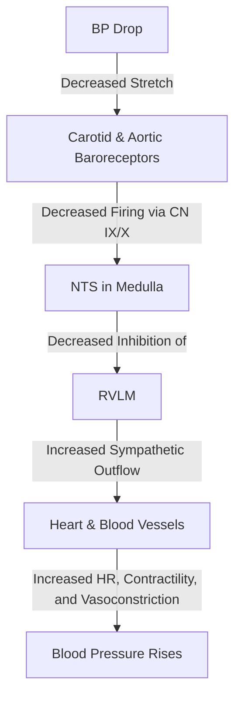

# Blood Pressure Regulation

### 1. Introduction
This chapter covers the physiological principles of blood pressure regulation, including short-term neural reflexes (baroreceptors and chemoreceptors), intermediate-term humoral mechanisms, and long-term volume control via the kidneys, focusing on the ANP, ADH, and renal pressure natriuresis pathways.

### 2. Daily Life Analogy
Blood pressure regulation is like a municipal water distribution network. The baroreceptor reflex is an automated second-by-second electronic valve adjuster that detects sudden pressure spikes or drops and immediately changes pump speed (heart rate) and pipe diameter (vasomotor tone) to compensate. The humoral pathways (RAAS, ADH, and ANP) act like water tower volume controllers, adding or venting liquid (water and salt) over hours to days. Finally, pressure natriuresis acts as a physical safety overflow drain: if water pressure rises too high, the overflow drain (kidneys) naturally dumps more water and salt directly, preventing the system from bursting.

### 3. Basic Concept
Mean Arterial Pressure (MAP) is the average pressure driving blood flow through the systemic vasculature. It is defined by the basic hemodynamic equation:
$$ \text{MAP} = \text{CO} \times \text{TPR} $$
Where $\text{CO}$ is Cardiac Output (Stroke Volume $\times$ Heart Rate) and $\text{TPR}$ is Total Peripheral Resistance (governed primarily by arteriolar radius). 
- **Short-Term Regulation (seconds to minutes):** Neural reflexes mediated by the autonomic nervous system.
- **Intermediate-Term Regulation (minutes to hours):** Humoral systems such as Angiotensin II, Epinephrine, and Atrial Natriuretic Peptide.
- **Long-Term Regulation (days to weeks):** Renal regulation of extracellular fluid volume through salt and water excretion.

### 4. Anatomy Review
Blood pressure regulation relies on specific anatomical sensors and pathways:
- **Baroreceptors**: Located in the carotid sinus (at the bifurcation of common carotid artery) and aortic arch.
- **Afferent nerves**: Carotid sinus nerve (nerve of Hering) joins Glossopharyngeal (CN IX); aortic arch receptors signal via Vagus (CN X).
- **Medullary Centers**: Nucleus Tractus Solitarius (NTS), Caudal Ventrolateral Medulla (CVLM), Rostral Ventrolateral Medulla (RVLM), and Nucleus Ambiguus.
- **Autonomic Outflow**: Sympathetic chain to heart and vasculature; Parasympathetic fibers via Vagus nerve to SA/AV nodes.

### 5. Physiology
Normal blood pressure is defined as $< 120/80\text{ mmHg}$ in healthy adults. 
- **Systolic BP (SBP)**: Primarily determined by stroke volume and aortic compliance.
- **Diastolic BP (DBP)**: Primarily determined by total peripheral resistance and heart rate.
- **Pulse Pressure (PP)**: The difference between SBP and DBP ($PP = SBP - DBP$).
- **Mean Arterial Pressure (MAP)**:
  $$ \text{MAP} = \text{DBP} + \frac{\text{SBP} - \text{DBP}}{3} $$

### 6. Mechanism
#### A. Short-Term Neural Regulation (Baroreceptor Reflex)
- An increase in blood pressure stretches the baroreceptors, increasing their firing rate to the NTS.
- The NTS stimulates the CVLM, which inhibits the RVLM (reducing sympathetic outflow).
- Simultaneously, the NTS stimulates the Nucleus Ambiguus (increasing parasympathetic vagal tone to the heart).
- *Result*: Heart rate, contractility, and TPR decrease, returning BP to normal.

#### B. Intermediate Humoral Pathways
1. **ANP & BNP**: Released in response to high filling pressure (atrial/ventricular stretch). They act via membrane-bound guanylyl cyclase (cGMP) to dilate vasculature, inhibit renin/aldosterone, and block apical ENaC channels, promoting natriuresis.
2. **ADH (Vasopressin)**: 
   - Activates $V_1$ receptors (Gq-coupled) on vascular smooth muscle to cause vasoconstriction.
   - Activates $V_2$ receptors (Gs-coupled) on principal cells of collecting duct to insert Aquaporin-2 water channels, promoting free water reabsorption.

#### C. Long-Term Renal Pressure Natriuresis
- An increase in renal perfusion pressure directly raises medullary vasa recta hydrostatic pressure, which increases renal interstitial hydrostatic pressure (RIHP).
- High RIHP inhibits apical NHE3 in the proximal tubule and ENaC in the collecting duct, causing salt and water wasting (pressure natriuresis) to reduce intravascular volume.

### 7. Animation Summary
An animation shows blood pressure spikes causing a burst of electrical impulses along CN IX and X to the medulla, leading to immediate vagal stimulation and slowing of the heartbeat.

### 8. 3D Model Guide
An interactive 3D model allows the user to rotate the brainstem to view the NTS, RVLM, and CVLM centers, and zoom in on the carotid bifurcation.

### 9. Flowchart

### 10. Clinical Correlation
- **Orthostatic Hypotension**: A drop in systolic pressure $>20\text{ mmHg}$ or diastolic $>10\text{ mmHg}$ within 3 minutes of standing. It represents a failure of the baroreceptor reflex to rapidly vasoconstrict upon standing.
- **BNP Clinical Testing**: Elevated serum BNP ($>100\text{ pg/mL}$) is a diagnostic marker for heart failure.

### 11. Disorders
- **Primary (Essential) Hypertension**: High blood pressure with no identifiable secondary cause ($\>90\%$ of cases). Associated with a rightward shift of the renal pressure-natriuresis curve.
- **Secondary Hypertension**: Due to identifiable causes such as Renal Artery Stenosis (high renin), Conn's Syndrome (aldosterone-secreting tumor), or Pheochromocytoma (catecholamine-secreting tumor).

### 12. Summary
- BP regulation is balanced by neural (baroreceptors), humoral (ANP, ADH, RAAS), and renal mechanisms.
- Neural systems provide rapid control, while kidneys manage long-term blood volume.

### 13. Important Formulas
1. **Hemodynamic Equation**:
   $$ \text{MAP} = \text{CO} \times \text{TPR} $$
2. **Mean Arterial Pressure**:
   $$ \text{MAP} = \text{DBP} + \frac{\text{PP}}{3} $$
3. **Pulse Pressure**:
   $$ \text{PP} = \text{SBP} - \text{DBP} $$

### 14. Mnemonics
- **V1 Vasoconstricts, V2 Volume**:
  - $V_1$ receptors act on vascular smooth muscle to vasoconstrict.
  - $V_2$ receptors act on renal tubules to increase blood volume.

### 15. Viva Questions
1. **How do ANP and ADH act antagonistically on the renal collecting ducts?**
   *Answer:* ADH binds to $V_2$ receptors, activating Gs-mediated adenylyl cyclase to increase cAMP and insert Aquaporin-2 water channels, promoting water reabsorption. In contrast, ANP binds to NPR-A receptors, activating guanylyl cyclase to increase cGMP, which inhibits the apical sodium channel (ENaC) and blocks cAMP-mediated aquaporin insertion, thereby promoting natriuresis and diuresis.
2. **Explain why a patient with renal artery stenosis develops systemic hypertension.**
   *Answer:* Renal artery stenosis narrows the renal artery, reducing perfusion pressure downstream at the juxtaglomerular cells. This simulates hypovolemia, triggering massive renin release and activation of the RAAS pathway. Additionally, the renal pressure-natriuresis curve shifts to the right, requiring a higher systemic arterial pressure to maintain normal salt and water excretion in the stenosed kidney.
3. **What is the cellular signal transduction cascade of ADH when acting as a vasoconstrictor?**
   *Answer:* When ADH binds to $V_1$ receptors on vascular smooth muscle cells, it activates a Gq-protein coupled pathway. This activates Phospholipase C (PLC), which hydrolyzes phosphatidylinositol 4,5-bisphosphate (PIP2) into diacylglycerol (DAG) and inositol 1,4,5-trisphosphate (IP3). IP3 binds to receptors on the sarcoplasmic reticulum, releasing stored Ca2+ into the cytoplasm, leading to cross-bridge cycling and smooth muscle contraction.

### 16. MCQs
1. Which G-protein pathway is activated when ADH binds to V1 receptors on vascular smooth muscle?
   - A) Gs
   - B) Gi
   - C) Gq
   - D) G12
   - *Answer:* C
2. What cellular second messenger is increased in response to Atrial Natriuretic Peptide (ANP) binding to its receptor?
   - A) cAMP
   - B) cGMP
   - C) IP3
   - D) Calcium
   - *Answer:* B
3. Which of the following describes the baroreceptor reflex response to a sudden elevation in blood pressure?
   - A) Increased sympathetic activity, increased heart rate
   - B) Increased parasympathetic activity, decreased heart rate
   - C) Decreased parasympathetic activity, increased heart rate
   - D) Increased sympathetic activity, increased vasoconstriction
   - *Answer:* B

### 17. Case-Based Learning
**Clinical Case:**
A 72-year-old male with a history of chronic ischemic cardiomyopathy and heart failure presents with worsening peripheral edema, dyspnea on exertion, and orthopnea. On physical exam, he has bilateral pitting edema in both legs up to the knees and jugular venous distention. His BNP level is elevated at $850\text{ pg/mL}$ (normal $<100\text{ pg/mL}$), and his serum sodium is low at $131\text{ mEq/L}$ (hyponatremia).

**Physiological Analysis:**
1. **BNP Elevation:** The patient's failing left ventricle is dilated and subject to high diastolic filling pressures, stretching the ventricular walls and triggering the release of BNP. BNP attempts to reduce this volume overload by dilating arterioles (lowering afterload) and promoting renal natriuresis and diuresis.
2. **Paradoxical Hyponatremia:** In heart failure, despite the patient having an excess of total body sodium and water (manifested as edema), there is a decrease in "effective arterial blood volume" due to reduced cardiac output. This is sensed by baroreceptors as a threat to systemic blood pressure, triggering a massive sympathetic and non-osmotic release of ADH (via $V_2$ receptors). The excess ADH causes the retention of free water in the collecting ducts in excess of sodium, diluting extracellular sodium and causing hypervolemic hyponatremia.

### 18. Flashcards
- **Front**: Where are the primary high-pressure baroreceptors located?
  **Back**: The carotid sinus and the aortic arch.
- **Front**: Which cranial nerve carries sensory information from the carotid sinus to the brain?
  **Back**: The glossopharyngeal nerve (CN IX).

### 19. Revision Notes
- Short-term BP is controlled by neural reflexes (baroreceptor CN IX/X -> NTS -> autonomic modulation).
- Long-term BP is controlled by renal pressure-natriuresis, regulating blood volume.

### 20. Practice Quiz
1. In a healthy subject, a rapid infusion of normal saline would be expected to:
   - A) Increase ADH, increase ANP
   - B) Decrease ADH, increase ANP
   - C) Increase ADH, decrease ANP
   - D) Decrease ADH, decrease ANP
   - *Answer:* B
2. Which medullary center is the primary site where afferent baroreceptor nerves terminate?
   - A) RVLM
   - B) CVLM
   - C) NTS
   - D) Nucleus Ambiguus
   - *Answer:* C
