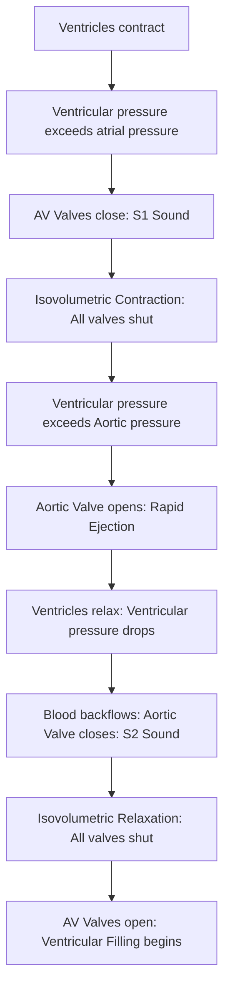

# Section 4: Cardiovascular Physiology

## Chapter 5: The Cardiac Cycle & Wiggers Diagram

---

### 1. Introduction
The heart is a dual-pump system designed to keep blood flowing in a continuous circle: oxygen-poor blood to the lungs, and oxygen-rich blood to the body. To act as an efficient pump, the heart's chambers must contract and relax in a highly coordinated electrical and mechanical sequence called the **Cardiac Cycle**.

### 2. Daily Life Analogy
Imagine a two-story house with two rooms on the top floor (Atria) and two rooms on the bottom floor (Ventricles). The floors are separated by one-way trapdoors (AV valves), and the bottom rooms have doors leading outside to separate pathways (Aortic/Pulmonary valves). 
To move people (blood) through the house efficiently, the top rooms fill with people first. Then, the trapdoors open, and people descend into the bottom rooms. Suddenly, the bottom rooms squeeze their walls, forcing the trapdoors shut to prevent people from climbing back up, while pushing open the doors leading outside to eject the crowd onto the paths. This entire rhythmic cycle repeats 72 times every minute.

### 3. Basic Concept
- **Systole**: The phase of cardiac contraction and blood ejection.
- **Diastole**: The phase of cardiac relaxation and chamber filling.
- **Cycle Duration**: At a standard resting heart rate of **72 beats per minute (bpm)**, one complete cardiac cycle lasts approximately **0.8 seconds**:
  * *Systole*: ~0.3 seconds.
  * *Diastole*: ~0.5 seconds.
- **Heart Valves**: Passive structures that open and close in response to pressure gradients:
  * **Atrioventricular (AV) Valves**: Tricuspid (right) and Mitral (left). Prevent backflow from ventricles to atria.
  * **Semilunar Valves**: Aortic and Pulmonary. Prevent backflow from arteries to ventricles.

---

### 4. Anatomy Review
- **Myocyte Structure**: Cardiac muscle cells are branched, striated, and connected end-to-end by **intercalated discs**. These discs contain gap junctions (forming an electrical syncytium) and desmosomes (providing mechanical strength).
- **Pacemaker Node System**:
  1. **Sinoatrial (SA) Node**: The primary pacemaker, generating intrinsic impulses at 70–80 bpm.
  2. **Atrioventricular (AV) Node**: Delays the impulse for **0.13 seconds**, allowing the atria to finish contracting before ventricles begin.
  3. **Purkinje Fibers**: Highly conductive pathways distributing the action potential to all ventricular myocytes almost simultaneously.

```text
Electrical Innervation Pathway:
SA Node -> Internodal Pathways -> AV Node (0.13s Delay) -> Bundle of His -> Bundle Branches -> Purkinje Fibers
```

### 5. Physiology
Understanding cardiac volume parameters:
* **End-Diastolic Volume (EDV)**: The volume of blood in the ventricle at the end of filling (~120 mL).
* **End-Systolic Volume (ESV)**: The remaining volume in the ventricle after ejection (~50 mL).
* **Stroke Volume (SV)**: The volume of blood pumped out per beat:
  \[SV = EDV - ESV = 120\text{ mL} - 50\text{ mL} = 70\text{ mL}\]
* **Ejection Fraction (EF)**: The percentage of EDV ejected per beat:
  \[EF = \frac{SV}{EDV} \times 100 = \frac{70}{120} \times 100 \approx 58\%\] (Normal range: 55%–70%).

---

### 6. Mechanism

#### The Seven Phases of the Cardiac Cycle
1. **Atrial Systole**: Atria contract (completing the last 20% of ventricular filling, adding the "a-wave" to atrial pressure).
2. **Isovolumetric Contraction**: Ventricles begin contracting. Pressure rises sharply. The Mitral/Tricuspid valves close (producing the **First Heart Sound, S1**). All valves are closed; volume does not change.
3. **Rapid Ejection**: Ventricular pressure exceeds aortic/pulmonary pressure. Semilunar valves open, and blood rushes into the great arteries.
4. **Reduced Ejection**: Ventricular repolarization begins. Ventricular pressure falls, and blood flow slows.
5. **Isovolumetric Relaxation**: Ventricles relax. Pressure drops. Blood starts flowing back toward the ventricles, closing the Aortic/Pulmonary valves (producing the **Second Heart Sound, S2**). All valves are closed; volume is stable.
6. **Rapid Inflow**: Ventricular pressure falls below atrial pressure. AV valves open, and blood stored in the atria rushes into the ventricles.
7. **Diastasis (Reduced Inflow)**: Ventricles continue to fill slowly as blood returns directly from the veins.

```text
Wiggers Pressure/Volume Relationship:
Press (mmHg)
 120 |       _____ (Aortic Press)
     |      /     \
  80 |_____/_______\______
     |    /         \
     |   /  Ventr.   \
     |  |   Press.    |
   0 |__|_____________|___
     +------------------------> Time (0.8s)
```

---

### 7. Animation Summary
*Visualization focuses on:* The Wiggers Diagram. A sliding time cursor coordinates the opening and closing of cardiac valves with the ECG waves (P, QRS, T) and heart sound recordings (S1, S2).

### 8. 3D Model Guide
*Interactive viewer targets:* The 3D Heart. Exploding the model exposes the internal papillary muscles, chordae tendineae, and valvular leaflets. Selecting specific cycle phases animates the valve motions.

### 9. Flowchart



### 10. Clinical Correlation
- **Valvular Heart Disease Murmurs**:
  * **Aortic Stenosis**: Narrowing of the aortic valve. Causes a harsh, crescendo-decrescendo **systolic murmur** heard during the ejection phase.
  * **Mitral Regurgitation**: Incompetent mitral valve. Causes a blowing, holosystolic (pan-systolic) murmur as blood leaks backward into the atrium during ventricular systole.

### 11. Disorders
- **Systolic Heart Failure**: Reduced contractility lowers the Stroke Volume and Ejection Fraction (EF < 40%), raising the End-Systolic Volume (ESV) and causing venous congestion.
- **Diastolic Heart Failure**: Hypertrophy or stiffness limits ventricular filling, reducing the End-Diastolic Volume (EDV). The EF remains normal (preserved EF), but overall cardiac output is reduced.

### 12. Summary
- One cardiac cycle lasts 0.8 seconds at 72 bpm, divided into systole (contraction) and diastole (relaxation).
- S1 represents AV valve closure; S2 represents semilunar valve closure.
- The Wiggers diagram coordinates ECG, pressures, volumes, and heart sounds.
- Stroke Volume is calculated as EDV - ESV, and Ejection Fraction is SV / EDV.

### 13. Important Formulas
- **Cardiac Output (CO)**:
  \[CO = \text{Heart Rate (HR)} \times \text{Stroke Volume (SV)}\]
- **Ejection Fraction (EF)**:
  \[EF = \frac{EDV - ESV}{EDV} \times 100\]

### 14. Mnemonics
- **COAL**:
  * **C**losure of **O**ne (AV valves) = S1 (**A**systole/Systole start)
  * **C**losure of **A**ortic/Pulmonary = S2 (**L**ast/Diastole start)

### 15. Viva Questions
1. **Explain the cause of the AV node delay and its physiological significance.**
   * *Answer*: The AV node delay (~0.13 seconds) is caused by transitional fibers having fewer gap junctions and smaller cell diameters, offering higher electrical resistance. This delay allows the atria to contract fully, emptying their blood contents into the ventricles before ventricular systole begins.
2. **What causes the S3 and S4 heart sounds? Are they always pathological?**
   * *Answer*: S3 is caused by the vibration of ventricular walls during rapid passive filling in early diastole (can be normal in children and pregnant women, but pathological in heart failure). S4 is caused by turbulent flow during atrial systole pushing blood into a stiff, non-compliant ventricle (almost always pathological, indicating ventricular hypertrophy).

### 16. MCQs
1. During which phase of the cardiac cycle are all four heart valves closed?
   * A) Atrial systole
   * B) Isovolumetric contraction
   * C) Rapid ejection
   * D) Diastasis
   * *Answer*: B *(and Isovolumetric relaxation)*

2. An echocardiogram shows a patient has an EDV of 140 mL and an ESV of 84 mL. What is their Ejection Fraction?
   * A) 40%
   * B) 50%
   * C) 60%
   * D) 70%
   * *Answer*: A *(SV = 140 - 84 = 56 mL. EF = 56 / 140 = 0.40 or 40%).*

### 17. Case-Based Learning
**Case**: A 72-year-old male presents with exertional syncope, chest pain, and dyspnea. Physical examination reveals a harsh systolic ejection murmur heard best at the right second intercostal space, radiating to the carotid arteries.
- **Question**: Which cardiac valve is affected, and what changes would you expect to see in left ventricular pressure and stroke volume on a Wiggers diagram?
- **Analysis**: The patient has Aortic Stenosis. On a Wiggers diagram, the left ventricular pressure during systole must rise significantly higher than normal (often exceeding 200 mmHg) to force blood through the narrowed valve. This increases afterload, which decreases Stroke Volume (SV) and increases End-Systolic Volume (ESV), reducing the Ejection Fraction over time.

### 18. Flashcards
- **Front**: What produces the first heart sound (S1)?
  **Back**: The closure of the AV valves (Mitral and Tricuspid) at the beginning of ventricular systole.
- **Front**: What is the duration of a normal cardiac cycle at a heart rate of 75 bpm?
  **Back**: 0.8 seconds (60 seconds / 75 bpm).

### 19. Revision Notes
Downloadable charts coordinating the pressure-volume loop with the phases of the cardiac cycle.

### 20. Practice Quiz
Timed 15-question set matching ECG markers (like the QRS complex) to specific mechanical events on the Wiggers diagram.
