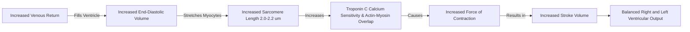
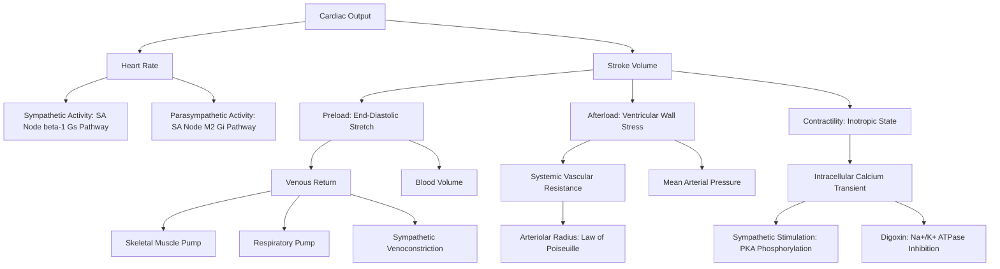

# Cardiac Output

### 1. Introduction
Cardiac Output ($CO$) is a fundamental parameter of cardiovascular physiology that represents the total volume of blood pumped by each ventricle of the heart into the circulation per unit of time. Under resting conditions, cardiac output is tightly regulated to match the metabolic demands of peripheral tissues, ensuring adequate delivery of oxygen and nutrients and removal of metabolic waste. Understanding the regulation of cardiac output, its determinants, and clinical measurement techniques is essential for diagnosing and managing cardiovascular diseases, heart failure, and shock states.

### 2. Daily Life Analogy
Imagine the heart as an automated water-pumping station supplying a vast irrigation network (the body's tissues). The total water pumped per minute (Cardiac Output) is determined by two factors:
1. **Pump Speed (Heart Rate)**: How many times the pump stroke cycles per minute.
2. **Stroke Volume**: The amount of water ejected with each single stroke of the piston.

If the fields require more water (during exercise), the station can speed up the motor (increase heart rate) and draw more water into the chamber before pushing the piston down harder (increase stroke volume via preload and contractility). Conversely, if there is a block in the pipes downstream (increased afterload), the pump must work against higher resistance, which might decrease the water ejected per stroke unless the motor compensates.

### 3. Basic Concept
* **Cardiac Output ($CO$)**: The volume of blood ejected by one ventricle per minute. It is calculated as:
  $$ CO = HR \times SV $$
  *Normal resting value is approximately $5.0 \text{ L/min}$ (typically $4.5 \text{ to } 5.5 \text{ L/min}$ for a healthy $70 \text{ kg}$ adult).*
* **Cardiac Index ($CI$)**: Since body size affects metabolic demand, cardiac output is normalized to Body Surface Area ($BSA$):
  $$ CI = \frac{CO}{BSA} $$
  *Normal range is $2.5 \text{ to } 4.0 \text{ L/min/m}^2$. A value below $2.0 \text{ L/min/m}^2$ defines cardiogenic shock.*
* **Stroke Volume ($SV$)**: The volume of blood ejected by a ventricle during a single contraction:
  $$ SV = EDV - ESV $$
  *Normal range is $60 \text{ to } 100 \text{ mL/beat}$ at rest.*
  * **End-Diastolic Volume ($EDV$)**: The volume of blood in the ventricle at the end of diastole (filling). *Normal resting value: $\approx 120 \text{ mL}$.*
  * **End-Systolic Volume ($ESV$)**: The volume of blood remaining in the ventricle at the end of systole (contraction). *Normal resting value: $\approx 50 \text{ mL}$.*
* **Ejection Fraction ($EF$)**: The fraction of end-diastolic volume ejected with each beat:
  $$ EF = \frac{SV}{EDV} \times 100 = \frac{EDV - ESV}{EDV} \times 100 $$
  *Normal range is $55\% \text{ to } 70\%$.*

### 4. Anatomy Review
* **Ventricular Architecture**: The left ventricle is a high-pressure, thick-walled, conical chamber, whereas the right ventricle is a low-pressure, thin-walled, crescent-shaped chamber that wraps around the left ventricle. The myocardial fibers are arranged in a helical pattern, which allows the heart to wring or twist during contraction, optimizing ejection.
* **Excitation-Contraction Coupling**: Action potentials propagate down the T-tubules of cardiac myocytes, opening L-type calcium channels ($\text{Ca}_v1.2$). The resulting influx of extracellular calcium triggers a massive release of calcium from the sarcoplasmic reticulum ($SR$) via ryanodine receptors ($RyR2$). This process is known as **Calcium-Induced Calcium Release (CICR)**. Calcium binds to Troponin C, shifting tropomyosin and exposing actin-binding sites for myosin cross-bridge cycling.
* **Innervation**: 
  * **Sympathetic**: Norepinephrine binds to $\beta_1$-adrenergic receptors, activating the $G_s$-adenylyl cyclase-cAMP-PKA pathway to increase chronotropy (heart rate), inotropy (contractility), dromotropy (conduction velocity), and lusitropy (relaxation rate).
  * **Parasympathetic**: The vagus nerve releases Acetylcholine ($ACh$), which binds to $M_2$ muscarinic receptors, activating $G_i$ to decrease cAMP, and opening $K_{ACh}$ channels, causing hyperpolarization to decrease chronotropy and dromotropy.

### 5. Physiology
Stroke volume is determined by three interdependent variables: Preload, Afterload, and Contractility.

```
                  ┌───────────────────────────────┐
                  │        CARDIAC OUTPUT         │
                  └───────────────┬───────────────┘
                                  │
                  ┌───────────────┴───────────────┐
                  ▼                               ▼
         ┌─────────────────┐             ┌─────────────────┐
         │   HEART RATE    │             │  STROKE VOLUME  │
         └─────────────────┘             └────────┬────────┘
                                                  │
                            ┌─────────────────────┼─────────────────────┐
                            ▼                     ▼                     ▼
                   ┌─────────────────┐   ┌─────────────────┐   ┌─────────────────┐
                   │     PRELOAD     │   │    AFTERLOAD    │   │  CONTRACTILITY  │
                   │  (End-Diastolic │   │  (Resistance to │   │(Inherent muscle │
                   │    Stretch)     │   │    Ejection)    │   │    strength)    │
                   └─────────────────┘   └─────────────────┘   └─────────────────┘
```

#### A. Preload
Preload is the degree of myocardial stretch at the end of diastole, just prior to contraction. In clinical settings, it is estimated by **End-Diastolic Volume ($EDV$)** or **End-Diastolic Pressure ($EDP$)**.
* **Determinants of Preload**:
  1. **Venous Return ($VR$)**: The primary driver of preload.
  2. **Total Blood Volume**: Decreased in hemorrhage or dehydration (reduces preload); increased in renal failure or fluid overload (increases preload).
  3. **Skeletal Muscle Pump**: Contraction of leg muscles compresses deep veins, forcing blood back toward the heart via one-way valves.
  4. **Respiratory Pump**: During inspiration, intrathoracic pressure becomes negative (drawing blood into the thoracic vena cava) and intra-abdominal pressure rises (squeezing abdominal veins), enhancing venous return.
  5. **Venous Compliance**: Venoconstriction (via sympathetic stimulation) decreases venous compliance, raising central venous pressure ($CVP$) and driving venous return.
  6. **Atrial Kick**: Atrial contraction contributes $\approx 15-20\%$ of ventricular filling at rest, but this becomes critical at high heart rates when diastolic filling time is shortened.

#### B. Afterload
Afterload is the resistance or pressure against which the ventricle must contract to eject blood.
* **Left Ventricle Afterload**: Primarily determined by **Systemic Vascular Resistance ($SVR$)** (or Total Peripheral Resistance, $TPR$) and aortic pressure.
* **Right Ventricle Afterload**: Determined by **Pulmonary Vascular Resistance ($PVR$)** and pulmonary artery pressure.
* **Wall Stress ($\sigma$) and Law of Laplace**: Afterload at the level of the ventricular wall is described by:
  $$ \sigma = \frac{P \times r}{2h} $$
  Where $P$ is intraventricular pressure, $r$ is internal radius, and $h$ is wall thickness. Concentric ventricular hypertrophy ($h$ increases) is a compensatory response to chronic pressure overload (high $P$) to normalize wall stress.

#### C. Contractility (Inotropy)
Contractility is the intrinsic ability of cardiac muscle fibers to develop force at a given preload and afterload. It is independent of fiber length and relates directly to the intracellular calcium transient during systole.
* **Factors Increasing Contractility (Positive Inotropes)**:
  * **Sympathetic Stimulation**: PKA phosphorylates L-type $\text{Ca}^{2+}$ channels (increasing influx) and phospholamban (PLN). Phosphorylated PLN ceases to inhibit SERCA2a, accelerating calcium reuptake into the SR, which increases SR calcium load for subsequent beats and enhances relaxation rate (lusitropy).
  * **Digoxin**: Inhibits the $\text{Na}^+/\text{K}^+$-ATPase pump, raising intracellular $\text{Na}^+$. This reduces the drive for the $\text{Na}^+/\text{Ca}^{2+}$ exchanger ($NCX$), leading to elevated intracellular calcium levels.
* **Factors Decreasing Contractility (Negative Inotropes)**:
  * Parasympathetic stimulation (minor in ventricles), $\beta$-blockers, non-dihydropyridine calcium channel blockers (Verapamil, Diltiazem), acidosis, hypercapnia, hypoxia, and myocardial infarction.

### 6. Mechanism
* **The Frank-Starling Law of the Heart**: 
  * *Concept*: Within physiological limits, the force of ventricular contraction is directly proportional to the initial length of the cardiac muscle fibers.
  * *Molecular Basis*: As ventricular filling ($EDV$) increases, myocytes are stretched. This increases the sensitivity of **Troponin C** to calcium and optimizes the spatial alignment of actin and myosin filaments (optimum sarcomere length of $2.0 \text{ to } 2.2 \ \mu\text{m}$), resulting in a greater number of active cross-bridges during contraction.
  * *Significance*: It ensures that the output of both ventricles is perfectly balanced on a beat-to-beat basis. If the right ventricle pumps more blood into the pulmonary circulation, venous return to the left atrium increases, stretching the left ventricle and causing it to eject a matching volume.



* **The Bowditch Effect (Treppe / Staircase Phenomenon)**:
  * An increase in heart rate leads to a progressive increase in contractile force. As action potentials occur more frequently, the $\text{Na}^+/\text{K}^+$-ATPase cannot keep pace, raising intracellular sodium and reducing NCX-mediated calcium efflux. Consequently, calcium accumulates in the SR, enhancing contractility.
* **The Anrep Effect**:
  * An abrupt increase in afterload induces a transient decrease in stroke volume, followed by a gradual recovery of stroke volume over several minutes due to activation of myocardial $\text{Na}^+/\text{H}^+$ exchangers, which increases intracellular sodium and subsequently calcium.

### 7. Animation Summary
An interactive animation demonstrates the Starling curve under different physiological states:
* **The Y-axis** represents Stroke Volume ($SV$) or Cardiac Work, and the **X-axis** represents End-Diastolic Volume ($EDV$) or Right Atrial Pressure.
* A baseline curve shows $SV$ rising as $EDV$ increases.
* **Sympathetic Stimulation / Inotropic Drugs**: The entire curve shifts **up and to the left**, meaning a larger $SV$ is ejected for any given $EDV$.
* **Heart Failure / Cardiogenic Shock**: The curve shifts **down and to the right**, demonstrating a depressed $SV$ despite high filling pressures.
* **Fluid Resuscitation**: Moves a patient *along* their current curve (from a hypovolemic state to a normovolemic state).

### 8. 3D Model Guide
An interactive 3D anatomical model of the human heart demonstrates:
* **Diastolic Phase**: Relaxation of ventricular walls, opening of the mitral and tricuspid valves, and rapid ventricular filling. Clicking the ventricles reveals myocyte sarcomere stretching.
* **Systolic Phase**: Closure of AV valves (producing the $S_1$ heart sound), isovolumetric contraction, opening of the aortic and pulmonary valves, and ejection of blood.
* **Wall Stress Overlay**: Visualizes how chronic hypertension increases aortic pressure, causing wall stress to rise, which triggers concentric hypertrophy of the left ventricular wall to normalize stress.

### 9. Flowchart



### 10. Clinical Correlation
#### A. Measurement of Cardiac Output
1. **The Fick Principle**: Based on the conservation of mass. The amount of oxygen consumed by the body per minute ($\dot{V}_{O2}$) must equal the difference between the oxygen carried to the tissues in arterial blood and the oxygen returned to the lungs in mixed venous blood:
   $$ \dot{V}_{O2} = CO \times C_aO_2 - CO \times C_vO_2 $$
   Solving for Cardiac Output ($CO$):
   $$ CO = \frac{\dot{V}_{O2}}{C_aO_2 - C_vO_2} $$
   * *Example*: If oxygen consumption is $250 \text{ mL/min}$, arterial oxygen content ($C_aO_2$) is $200 \text{ mL/L}$ ($20 \text{ vol}\%$), and mixed venous oxygen content ($C_vO_2$ measured from the pulmonary artery) is $150 \text{ mL/L}$ ($15 \text{ vol}\%$):
     $$ CO = \frac{250 \text{ mL/min}}{200 \text{ mL/L} - 150 \text{ mL/L}} = \frac{250}{50} = 5.0 \text{ L/min} $$

2. **Thermodilution Method (Swan-Ganz Catheter)**:
   * A known volume of cold saline is injected into the right atrium. A thermistor at the tip of the catheter in the pulmonary artery measures the temperature change over time.
   * **Interpretation**: The change in temperature is inversely proportional to blood flow. A high cardiac output dilutes the cold saline rapidly, producing a small area under the temperature-time curve. A low cardiac output results in slow clearance and a large area under the curve.

3. **Echocardiography (Doppler)**:
   * Non-invasive estimation using the Velocity Time Integral ($VTI$) of blood flow through the Left Ventricular Outflow Tract ($LVOT$):
     $$ SV = CSA_{LVOT} \times VTI_{LVOT} $$
     Where $CSA_{LVOT} = \pi \times \left(\frac{Diameter}{2}\right)^2$. Then, $CO = SV \times HR$.

#### B. Shock States and Hemodynamic Profiles
Cardiac output is a key differentiator in shock states:
* **Hypovolemic Shock**: Severe volume loss $\rightarrow$ low preload ($CVP$) $\rightarrow$ low $CO$ $\rightarrow$ compensatory sympathetic surge (high $HR$, severe vasoconstriction/high $SVR$).
* **Cardiogenic Shock**: Primary pump failure $\rightarrow$ low $CO$ $\rightarrow$ blood backs up (high preload/high $CVP$/high pulmonary capillary wedge pressure) $\rightarrow$ compensatory vasoconstriction (high $SVR$).
* **Distributive Shock (e.g., Sepsis)**: Systemic vasodilation $\rightarrow$ low $SVR$ $\rightarrow$ venous pooling reduces absolute return, but compensatory cardiac stimulation causes hyperdynamic circulation $\rightarrow$ normal to high $CO$ (initially).

| Shock Type | Preload (CVP / PCWP) | Cardiac Output (CO) | Afterload (SVR) | Mixed Venous O2 (SvO2) |
|---|---|---|---|---|
| **Hypovolemic** | Decreased | Decreased | Increased | Decreased |
| **Cardiogenic** | Increased | Decreased | Increased | Decreased |
| **Distributive (Septic)** | Decreased | Increased (Early) | Decreased | Increased |

### 11. Disorders
1. **Heart Failure with Reduced Ejection Fraction (HFrEF / Systolic Heart Failure)**:
   * Caused by dilated cardiomyopathy or myocardial infarction. Ventricular contractility is impaired, dropping the ejection fraction ($EF < 40\%$). The ventricle dilates (high $EDV$) to maintain a borderline stroke volume via the Starling mechanism, but eventually, the system decompensates.
2. **Heart Failure with Preserved Ejection Fraction (HFpEF / Diastolic Heart Failure)**:
   * Caused by chronic hypertension leading to concentric left ventricular hypertrophy. The ventricular wall is stiff and non-compliant, impairing diastolic filling. Consequently, both $EDV$ and $SV$ are reduced, but because they decrease proportionally, the ejection fraction remains normal ($EF \ge 50\%$).
3. **High-Output Cardiac Failure**:
   * The heart is structurally normal but cannot meet the abnormally high systemic tissue metabolic demands or work against severely reduced systemic resistance. Causes include severe chronic anemia, hyperthyroidism (thyrotoxicosis), thiamine deficiency (wet beriberi), and large arteriovenous fistulas.

### 12. Summary
* Cardiac Output is the product of Heart Rate and Stroke Volume ($CO = HR \times SV$). Normal resting output is $\approx 5.0 \text{ L/min}$.
* Stroke volume is regulated by Preload (venous return and muscle/respiratory pumps), Afterload (systemic vascular resistance), and Contractility (intracellular calcium transient).
* The Frank-Starling Law states that stretching cardiac myocytes increases their contraction force, matching output to venous return.
* Clinical measurement of $CO$ is achieved via the Fick Principle, pulmonary artery thermodilution, or Doppler echocardiography.
* Hemodynamic profiles of cardiac output, preload, and afterload distinguish hypovolemic, cardiogenic, and distributive shock.

### 13. Important Formulas
1. **Cardiac Output ($CO$)**:
   $$ CO = HR \times SV $$
2. **Stroke Volume ($SV$)**:
   $$ SV = EDV - ESV $$
3. **Ejection Fraction ($EF$)**:
   $$ EF = \frac{SV}{EDV} \times 100 $$
4. **Cardiac Index ($CI$)**:
   $$ CI = \frac{CO}{BSA} $$
5. **The Fick Principle**:
   $$ CO = \frac{\dot{V}_{O2}}{C_aO_2 - C_vO_2} $$
6. **Mean Arterial Pressure ($MAP$)**:
   $$ MAP = DBP + \frac{SBP - DBP}{3} = CO \times SVR + CVP $$
7. **Law of Laplace (Wall Stress, $\sigma$)**:
   $$ \sigma = \frac{P \times r}{2h} $$

### 14. Mnemonics
* **PAC** the Ventricle: Stroke volume determinants:
  * **P**reload
  * **A**fterload
  * **C**ontractility
* **Fick** is **O**ver **A**rterial-**V**enous:
  * $CO$ = **O**xygen consumption / (**A**rterial - **V**enous oxygen content difference)
* **SAD** in Diastolic dysfunction:
  * **S**tiff wall
  * **A**fterload chronic rise
  * **D**iastolic filling impaired, but EF is normal

### 15. Viva Questions
1. **Explain the molecular basis of the positive inotropic effect of Digitalis (Digoxin).**
   * *Answer*: Digoxin binds to and inhibits the extracellular subunits of the sarcolemmal $\text{Na}^+/\text{K}^+$-ATPase pump. This increases intracellular sodium concentration, which decreases the sodium gradient across the cell membrane. This gradient is the driving force for the $\text{Na}^+/\text{Ca}^{2+}$ exchanger ($NCX$), which normally pumps calcium out of the cell. Inhibiting $NCX$ leads to calcium accumulation in the cytoplasm. This calcium is sequestered into the sarcoplasmic reticulum by SERCA, resulting in a larger calcium pool released during subsequent action potentials, enhancing contractility.
2. **How does an increase in heart rate affect ventricular filling time and the contribution of atrial contraction?**
   * *Answer*: At normal heart rates ($\approx 70 \text{ bpm}$), diastole occupies about $2/3$ of the cardiac cycle, and passive ventricular filling dominates. As heart rate increases, the total duration of the cardiac cycle shortens, and this reduction occurs primarily at the expense of diastole (systole remains relatively constant). At high heart rates ($>150 \text{ bpm}$), ventricular filling time is drastically reduced. Consequently, active atrial contraction ("atrial kick") becomes crucial, contributing up to $40\%$ of ventricular filling. If atrial fibrillation occurs in these patients, cardiac output drops precipitously.
3. **What is the physiological difference between a change in preload and a change in contractility on a ventricular pressure-volume loop?**
   * *Answer*: An increase in preload shifts the right-sided vertical filling boundary of the pressure-volume loop to the right (increased $EDV$), resulting in a wider loop and increased stroke volume along the same end-systolic pressure-volume relationship ($ESPVR$) slope. In contrast, an increase in contractility increases the slope of the $ESPVR$ line, shifting the top-left corner of the loop (end-systole) to the left (decreased $ESV$), which increases stroke volume without requiring an increase in $EDV$.

### 16. MCQs
1. During an experimental study, a physiologist calculates a subject's oxygen consumption at $300 \text{ mL/min}$. The oxygen content of arterial blood is $190 \text{ mL/L}$ and the mixed venous blood oxygen content is $140 \text{ mL/L}$. What is the subject's cardiac output?
   * A) $4.0 \text{ L/min}$
   * B) $5.0 \text{ L/min}$
   * C) $6.0 \text{ L/min}$
   * D) $7.5 \text{ L/min}$
   * *Answer*: C
   * *Explanation*: Using the Fick Principle: $CO = \frac{\dot{V}_{O2}}{C_aO_2 - C_vO_2} = \frac{300 \text{ mL/min}}{190 \text{ mL/L} - 140 \text{ mL/L}} = \frac{300}{50} = 6.0 \text{ L/min}$.
2. A 62-year-old male with a history of hypertension presents with dyspnea. Echocardiogram reveals concentric left ventricular hypertrophy, an ejection fraction of $60\%$, and impaired early diastolic relaxation. Which of the following parameters is most likely increased in this patient compared to a healthy control?
   * A) Left ventricular compliance
   * B) Left ventricular end-diastolic pressure
   * C) Left ventricular end-diastolic volume
   * D) Stroke volume
   * *Answer*: B
   * *Explanation*: The patient has Heart Failure with Preserved Ejection Fraction (HFpEF) secondary to hypertensive concentric hypertrophy. The stiff, non-compliant ventricle requires a higher-than-normal end-diastolic pressure ($LVEDP$) to achieve filling, shifting the diastolic pressure-volume relationship upward. Compliance is decreased, and $EDV$ and $SV$ are normal or reduced.
3. A patient in the ICU has a Swan-Ganz catheter placed. After injecting cold saline, the computer displays a thermodilution curve with a very large area under the temperature-time curve. This indicates:
   * A) High cardiac output
   * B) Severe mitral regurgitation
   * C) Low cardiac output
   * D) Left-to-right shunt
   * *Answer*: C
   * *Explanation*: In pulmonary thermodilution, the area under the temperature clearance curve is inversely proportional to cardiac output. A large area means the cold temperature persisted for a long time at the thermistor, indicating slow blood flow (low cardiac output).
4. Which of the following changes will decrease myocardial wall stress according to the Law of Laplace?
   * A) Increasing ventricular internal radius
   * B) Increasing ventricular wall thickness
   * C) Increasing intraventricular systolic pressure
   * D) Decreasing ventricular wall thickness
   * *Answer*: B
   * *Explanation*: The Law of Laplace is $\sigma = \frac{P \times r}{2h}$. Wall stress ($\sigma$) is inversely proportional to wall thickness ($h$). Therefore, increasing wall thickness reduces wall stress. Increasing pressure ($P$) or radius ($r$) increases wall stress.
5. Phosphorylation of phospholamban (PLN) by protein kinase A (PKA) results in which of the following physiological effects?
   * A) Inhibition of L-type calcium channels
   * B) Slower relaxation of the myocardium (negative lusitropy)
   * C) Uncoupling of actin and myosin filaments
   * D) Disinhibition of SERCA2a, accelerating calcium sequestration into the SR
   * *Answer*: D
   * *Explanation*: Unphosphorylated phospholamban inhibits SERCA2a. When phosphorylated by PKA (via sympathetic $\beta_1$ stimulation), PLN is inactivated, disinhibiting SERCA2a. This accelerates the sequestration of calcium back into the SR, causing faster relaxation (positive lusitropy) and increasing the SR calcium pool for subsequent contractions.

### 17. Case-Based Learning
**Clinical Presentation**: 
A 58-year-old female is brought to the emergency department after complaining of severe substernal chest pressure that radiated to her left arm. Upon arrival, she is obtunded, diaphoretic, and cool to the touch. 
* **Vitals**: Heart Rate: $118 \text{ bpm}$ (weak, thready pulse), Blood Pressure: $78/52 \text{ mmHg}$, Respiratory Rate: $26 \text{ bpm}$, Oxygen Saturation: $88\%$ on room air.
* **Physical Exam**: Bilateral pulmonary rales (crackles) in the lower lung fields and jugular venous distention.
* **Hemodynamic Monitoring**:
  * Cardiac Index ($CI$): $1.6 \text{ L/min/m}^2$ (normal: $2.5-4.0$)
  * Central Venous Pressure ($CVP$): $16 \text{ mmHg}$ (normal: $2-8$)
  * Pulmonary Capillary Wedge Pressure ($PCWP$): $24 \text{ mmHg}$ (normal: $6-12$)
  * Systemic Vascular Resistance ($SVR$): $2100 \text{ dynes}\cdot\text{sec}\cdot\text{cm}^{-5}$ (normal: $800-1200$)

**Physiological Questions & Analysis**:
1. **What type of shock is this patient experiencing?**
   * *Answer*: Cardiogenic shock secondary to acute myocardial infarction.
2. **Explain the physiological mechanisms behind the elevated CVP and PCWP.**
   * *Answer*: The primary insult is severe impairment of left ventricular contractility. The weak left ventricle cannot pump out the blood it receives, leading to an accumulation of blood in the left atrium and a backward transmission of pressure into the pulmonary veins and capillaries (manifested as a high $PCWP$ of $24 \text{ mmHg}$). This hydrostatic pressure exceeds oncotic pressure, driving fluid into the alveoli and causing pulmonary edema (hearing rales). Similarly, right-sided chambers fail to pump forward efficiently, backing up blood into the vena cava and raising systemic venous pressure ($CVP$ of $16 \text{ mmHg}$), which causes jugular venous distention.
3. **What is the cause of the elevated SVR?**
   * *Answer*: The low cardiac output and MAP are sensed by high-pressure arterial baroreceptors, disabling their tonic inhibitory signals to the medulla. This causes a massive sympathetic reflex, activating $\alpha_1$-adrenergic receptors on systemic arterioles to vasoconstrict. While this increases $SVR$ to maintain perfusion pressure to the brain and heart, it increases left ventricular afterload, making it even harder for the failing heart to eject blood.
4. **Contrast this hemodynamic profile with that of a patient in septic shock.**
   * *Answer*: Septic shock is a distributive shock characterized by profound vasodilation, resulting in a severely decreased $SVR$ ($<600 \text{ dynes}\cdot\text{sec}\cdot\text{cm}^{-5}$). Preload parameters ($CVP$, $PCWP$) are low due to venous pooling and capillary leak. The heart rate and cardiac output ($CO$) are typically increased (hyperdynamic) as the body attempts to compensate for low resistance.

### 18. Flashcards
* **Front**: What is the normal range of the Cardiac Index?
  **Back**: $2.5 \text{ to } 4.0 \text{ L/min/m}^2$.
* **Front**: What does a decrease in ventricular compliance do to the diastolic pressure-volume curve?
  **Back**: It shifts the curve upward and to the left, meaning a higher pressure is required for a given volume.
* **Front**: Which receptor type mediates the sympathetic increase in heart rate and contractility?
  **Back**: $\beta_1$-adrenergic receptors.
* **Front**: What is the primary clinical indicator of right ventricular preload?
  **Back**: Central Venous Pressure ($CVP$) or Right Atrial Pressure ($RAP$).
* **Front**: How does an increase in afterload affect the velocity of myocardial fiber shortening?
  **Back**: It decreases the velocity of shortening (force-velocity relationship).

### 19. Revision Notes
* **Stroke Volume ($SV$) Determinants**: 
  * *Preload*: Stretches sarcomeres toward optimal length ($2.0-2.2\ \mu\text{m}$), increasing calcium sensitivity. Follows the Frank-Starling Law.
  * *Afterload*: The load against which the ventricle must pump. Calculated as wall stress using the Law of Laplace ($\sigma = \frac{P \times r}{2h}$).
  * *Contractility*: Intrinsic force of contraction, governed by intracellular calcium levels, independent of fiber length.
* **Heart Rate ($HR$)**: Regulated by autonomic balance at the SA node. Sympathetic stimulation increases the slope of phase 4 pacemaker depolarization via $I_f$ (funny current) channels.
* **Fick Principle Equation**: $CO = \frac{\dot{V}_{O2}}{C_aO_2 - C_vO_2}$. Note that mixed venous blood must be sampled from the pulmonary artery to ensure complete mixing.
* **Thermodilution**: Swan-Ganz catheter measures temperature change in the pulmonary artery. Area under the curve is inversely proportional to $CO$.

### 20. Practice Quiz
1. A 32-year-old athlete undergoes a treadmill test. During peak exercise, his heart rate reaches $180 \text{ bpm}$ and his stroke volume is $150 \text{ mL}$. What is his cardiac output?
   * *Answer*: $CO = 180 \text{ bpm} \times 0.150 \text{ L} = 27.0 \text{ L/min}$.
2. In a ventricular volume-pressure loop, what phase is represented by the horizontal line along the bottom of the loop from left to right?
   * *Answer*: Diastolic filling phase (ventricular volume increases from $ESV$ to $EDV$ at low pressure).
3. If a patient's mean arterial pressure is $90 \text{ mmHg}$, cardiac output is $5.0 \text{ L/min}$, and central venous pressure is $10 \text{ mmHg}$, what is their Systemic Vascular Resistance ($SVR$) in mmHg/L/min?
   * *Answer*: $SVR = \frac{MAP - CVP}{CO} = \frac{90 - 10}{5} = 16 \text{ mmHg/L/min}$. (To convert to dynes·sec·cm⁻⁵, multiply by 80: $16 \times 80 = 1280$).
4. Which drug would shift the Frank-Starling ventricular function curve downward and to the right?
   * *Answer*: A negative inotrope such as a beta-blocker (e.g., Metoprolol) or a calcium channel blocker (e.g., Verapamil).
5. Why does mitral regurgitation lead to an increased ejection fraction despite causing heart failure?
   * *Answer*: Because the left ventricle can eject blood into two outlets: the high-pressure aorta and the low-pressure left atrium. The low-pressure pathway reduces overall ventricular afterload, allowing the ventricle to empty to a very small $ESV$, thereby falsely elevating the calculated Ejection Fraction ($EF = \frac{SV}{EDV}$).
