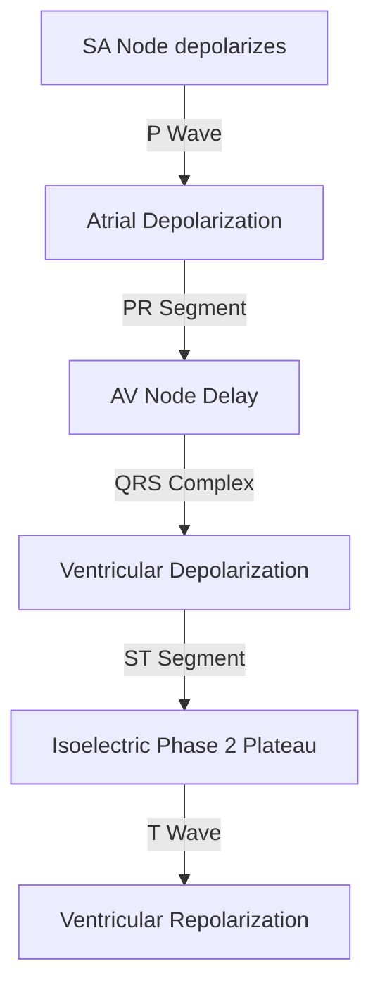

# Electrocardiogram (ECG)

### 1. Introduction
The electrocardiogram (ECG) is a non-invasive diagnostic tool that records the electrical activity of the heart over time using electrodes placed on the skin. It detects the tiny electrical changes on the skin that arise from the heart muscle's depolarization and repolarization during each cardiac cycle. It is a cornerstone of cardiovascular clinical diagnostics.

### 2. Daily Life Analogy
Imagine the heart's electrical system as a synchronized light show moving through a stadium (the myocardium). The spectators holding lights represent the cardiac cells.
If you place video cameras (electrodes) at different angles around the stadium, each camera sees the same wave of light from a unique perspective. A camera facing the wave as it moves *towards* it records a positive wave. A camera looking from behind as the wave moves *away* records a negative wave. By looking at all the camera angles (leads) at once, you can map exactly where the electrical wave started, how fast it traveled, and whether there was a power failure (block) in any section of the stadium.

### 3. Basic Concept
The ECG records the summation of electrical potentials generated by the cardiac cells.
- **Depolarization**: The spread of positive electrical charge through the heart muscle, triggering contraction.
- **Repolarization**: The return of cardiac cells to their resting negative electrical state, leading to relaxation.
- **The Dipole**: An electrical vector having magnitude and direction, pointing from depolarized (negative) to polarized (positive) tissue.

### 4. Anatomy Review
The cardiac conduction system coordinates this electrical propagation:
1. **Sinoatrial (SA) Node**: The dominant pacemaker, located in the superior posterolateral wall of the right atrium.
2. **Internodal Pathways**: Anterior, middle, and posterior pathways (plus Bachmann's bundle to the left atrium).
3. **Atrioventricular (AV) Node**: Located in the posterior septal wall of the right atrium. It delays the impulse to allow ventricular filling.
4. **Bundle of His**: Passes through the fibrous skeleton of the heart.
5. **Right and Left Bundle Branches**: LBB further divides into anterior and posterior fascicles.
6. **Purkinje Fibers**: Fast-conducting fibers that distribute the impulse to the ventricular myocardium.

### 5. Physiology
#### The 12-Lead System
The standard ECG consists of 12 leads divided into:
- **Limb Leads (Frontal Plane)**:
  - *Bipolar Leads*: I (Right Arm to Left Arm), II (Right Arm to Left Leg), III (Left Arm to Left Leg).
  - *Augmented Unipolar Leads*: aVR (Right Arm), aVL (Left Arm), aVF (Left Leg).
  - **Einthoven's Law**: $\text{Lead I} + \text{Lead III} = \text{Lead II}$.
- **Precordial Leads (Horizontal Plane)**:
  - Leads $V_1$ to $V_6$ positioned across the chest wall to view the heart from right to left.

### 6. Mechanism
The ECG waveform consists of specific waves and segments representing phases of the cardiac cycle:
- **P Wave**: Atrial depolarization (normal duration $< 0.12\text{ s}$, amplitude $< 0.25\text{ mV}$).
- **PR Interval**: Time from onset of atrial depolarization to onset of ventricular depolarization (normal: $0.12 - 0.20\text{ s}$). Includes the AV nodal delay.
- **QRS Complex**: Ventricular depolarization (normal: $0.06 - 0.10\text{ s}$).
  - *Q Wave*: First negative deflection (normal septal Q is small; pathological Q is $>0.04\text{ s}$ or $>25\%$ of R-wave).
  - *R Wave*: First positive deflection.
  - *S Wave*: Negative deflection following the R wave.
- **ST Segment**: Isoelectric period when both ventricles are completely depolarized (corresponds to phase 2 plateau of ventricular action potential).
- **T Wave**: Ventricular repolarization (corresponds to phase 3 of action potential).
- **QT Interval**: Total duration of ventricular depolarization and repolarization (systole).

### 7. Animation Summary
An animation correlates the progress of the action potential through the heart with the drawing of the ECG lines. As the SA node depolarizes, the P wave is written. As it delays in the AV node, the flat PR segment is drawn.

### 8. 3D Model Guide
An interactive 3D model shows the heart in a transparent thorax, surrounded by the 12 lead axes (Einthoven's triangle and precordial lead vectors).

### 9. Flowchart

### 10. Clinical Correlation
- **ST-Segment Elevation**: Indicates acute transmural myocardial injury (STEMI). An elevation $\ge 0.1\text{ mV}$ ($1\text{ mm}$) in limb leads is diagnostic.
- **ST-Segment Depression**: Indicates subendocardial ischemia or digitalis effect.
- **Hyperkalemia**: Tall, peaked T waves (mild); flat/lost P waves (moderate); wide QRS merging with T wave to form a "sine wave" (severe).

### 11. Disorders
#### A. Atrioventricular (AV) Blocks
1. **First-Degree AV Block**: Prolonged, fixed PR interval $>0.20\text{ s}$. Every P wave is followed by a QRS ($1:1$ conduction).
2. **Second-Degree AV Block**:
   - *Mobitz I (Wenckebach)*: Progressive PR lengthening before a dropped QRS.
   - *Mobitz II*: Fixed PR intervals with sudden, unpredictable dropped QRS complexes.
3. **Third-Degree (Complete) AV Block**: Complete dissociation between P waves and QRS complexes.

#### B. Bundle Branch Blocks (BBB)
Widened QRS complexes ($\ge 0.12\text{ s}$).
- **Right Bundle Branch Block (RBBB)**: $rSR'$ pattern ("rabbit ears") in right precordial leads ($V1$, $V2$).
- **Left Bundle Branch Block (LBBB)**: Broad, notched R waves in lateral leads (I, aVL, V5, V6) with absence of septal Q waves.

### 12. Summary
- The ECG records cardiac electrical activity via 12 leads.
- The waveform matches the cardiac action potential phases: P (atrial depolarization), QRS (ventricular depolarization), ST (plateau), T (ventricular repolarization).
- AV blocks and bundle branch blocks represent delays in the conduction pathway.

### 13. Important Formulas
1. **Einthoven's Law**:
   $$ \text{Lead I} + \text{Lead III} = \text{Lead II} $$
2. **Bazett's Corrected QT Interval ($QT_c$)**:
   $$ QT_c = \frac{QT}{\sqrt{RR \text{ (in seconds)}}} $$
3. **Heart Rate Estimation**:
   $$ \text{Heart Rate (bpm)} = \frac{300}{\text{Number of large squares between R-R}} $$

### 14. Mnemonics
- **WiLLiaM MaRRoW**:
  - **W** in V1, **M** in V6 for **L**BBB.
  - **M** in V1, **W** in V6 for **R**BBB.

### 15. Viva Questions
1. **Why is there a conduction delay in the AV node?**
   *Answer:* The AV nodal cells are smaller in diameter, have fewer gap junctions, and exhibit slower Ca2+-mediated depolarizations. This delay allows the atria to contract fully and complete ventricular filling before ventricular systole begins.
2. **What does a pathological Q wave represent?**
   *Answer:* It indicates necrosis of the ventricular myocardium, typically from a previous transmural myocardial infarction. The electrode is looking "through" the dead tissue to see forces on the opposite side of the heart.
3. **How does Bazett's formula correct the QT interval?**
   *Answer:* The QT interval varies inversely with heart rate. Bazett's formula divides the measured QT by the square root of the R-R interval to normalize the value to a heart rate of 60 bpm.

### 16. MCQs
1. Which of the following ECG changes is diagnostic of a Left Bundle Branch Block (LBBB)?
   - A) QRS duration $< 0.10\text{ s}$
   - B) $rSR'$ pattern in V1 and V2
   - C) Broad, monomorphic R waves in leads I, aVL, and V6
   - D) Peaked T waves in all leads
   - *Answer:* C
2. A patient's ECG shows a regular rhythm with an R-R interval of 5 large squares. What is the estimated heart rate?
   - A) 60 bpm
   - B) 75 bpm
   - C) 100 bpm
   - D) 50 bpm
   - *Answer:* A
3. In a first-degree AV block, which of the following is true?
   - A) Intermittent dropped beats occur
   - B) The PR interval is prolonged but constant
   - C) There is complete AV dissociation
   - D) The QRS complex is always wide
   - *Answer:* B

### 17. Case-Based Learning
**Clinical Case:**
A 68-year-old male presents to the Emergency Department complaining of sudden-onset, crushing substernal chest pressure.
ST-segment elevation of $3\text{ mm}$ ($0.3\text{ mV}$) is present in leads II, III, and aVF, with reciprocal ST-segment depression in leads I and aVL. The PR interval is variable, P-P intervals are constant (88 bpm), and R-R intervals are constant (54 bpm) with no relationship between P and QRS. The QRS complex is narrow.

**Physiological Analysis:**
1. **Inferior Wall STEMI**: ST elevation in II, III, aVF localizes the infarct to the inferior wall of the left ventricle, supplied by the Right Coronary Artery (RCA).
2. **Third-Degree AV Block**: Complete dissociation between P and QRS confirms a complete AV block. The narrow QRS indicates a junctional escape rhythm. This is a common complication of inferior STEMIs because the RCA supplies the AV node in approximately 90% of individuals.

### 18. Flashcards
- **Front**: What does the ST segment represent on the ECG?
  **Back**: The plateau phase (Phase 2) of the ventricular action potential.
- **Front**: What is Einthoven's Law?
  **Back**: $\text{Lead I} + \text{Lead III} = \text{Lead II}$.

### 19. Revision Notes
- Standard ECG uses 12 leads (6 limb, 6 precordial).
- Heart rate is estimated using $300 / \text{large squares}$ or $1500 / \text{small squares}$.

### 20. Practice Quiz
1. If a patient has a prolonged QT interval, which life-threatening arrhythmia are they at risk of developing?
   - A) First-degree AV block
   - B) Torsades de Pointes
   - C) Left bundle branch block
   - D) Sinus bradycardia
   - *Answer:* B
2. Which lead is defined by a vector pointing from the right arm to the left leg?
   - A) Lead I
   - B) Lead II
   - C) Lead III
   - D) Lead aVF
   - *Answer:* B
