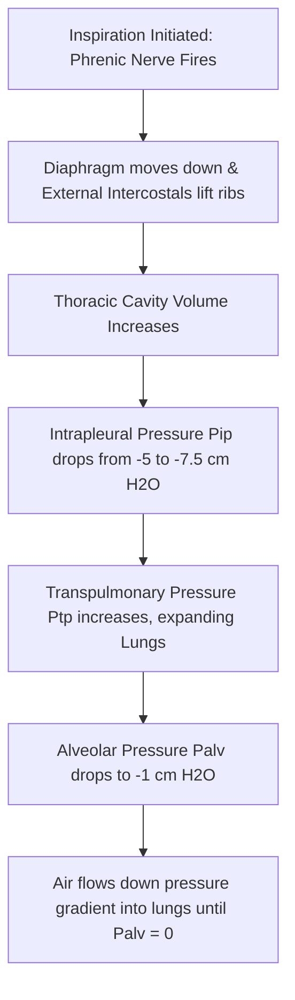

# Section 5: Respiratory Physiology

## Chapter 6: Mechanics of Ventilation & Spirometry

---

### 1. Introduction
The respiratory system's primary task is to obtain oxygen from the atmosphere and discard carbon dioxide generated by metabolism. To achieve this, air must move continuously into and out of the lungs. The process of moving air, called **Ventilation**, relies on pressure differences created by contracting respiratory muscles.

### 2. Daily Life Analogy
Imagine a blacksmith's fireplace bellows. The bellows have flexible walls and a handle. When you pull the handles apart, the internal space expands, dropping the air pressure inside. Air rushes in from the room to fill the low-pressure space. When you squeeze the handles together, the internal space shrinks, raising the pressure and forcing a jet of air out.
Your chest cavity functions exactly like these bellows. The diaphragm and ribs act as the handles, expanding and contracting the lungs to drive airflow.

### 3. Basic Concept
- **Atmospheric Pressure (\(P_{\text{atm}}\))**: The reference pressure (~760 mmHg or 0 cm H2O).
- **Alveolar Pressure (\(P_{\text{alv}}\))**: The air pressure inside the lung alveoli.
- **Intrapleural Pressure (\(P_{\text{ip}}\))**: The pressure in the thin fluid-filled space between the lung visceral pleura and chest wall parietal pleura. It is normally slightly negative (\(-5\text{ cm }H_2O\) at rest) because the lungs try to collapse inward while the chest wall tries to expand outward.
- **Transpulmonary Pressure (\(P_{\text{tp}}\))**: The pressure difference across the lung walls:
  \[P_{\text{tp}} = P_{\text{alv}} - P_{\text{ip}}\]
  This is a measure of the elastic forces in the lungs that tend to collapse them (recoil pressure).

```text
    CHEST WALL (Parietal Pleura)
     [ Intrapleural Space: Pip = -5 cm H2O ]
    ~~~~~~~~~~~~~~~~~~~~~~~~~~~~~~~~~~~~~~~~  <-- Visceral Pleura
     [ Alveoli: Palv = 0 cm H2O (resting) ]
```

### 4. Anatomy Review
- **Respiratory Muscles**:
  - *Inspiration (Active)*: **Diaphragm** (moves downward, responsible for 75% of quiet breathing, innervated by the phrenic nerve C3-C5) and **External Intercostals** (lift the ribs upward and outward, like a bucket handle).
  - *Expiration (Passive at rest)*: Driven by elastic recoil of the lungs. During active/forced expiration, the **Abdominal Rectus** and **Internal Intercostals** contract to compress the thoracic cavity.
- **Alveolus Unit**: Elastic spheres surrounded by capillaries.
  - *Type I Alveolar Cells*: Thin squamous cells where gas exchange occurs.
  - *Type II Alveolar Cells*: Cuboidal cells that synthesize and secrete **Surfactant**.

### 5. Physiology
Solutes and air flow due to pressure gradients. During the ventilation cycle:
1. **Inspiration**: Diaphragm contracts -> thoracic volume increases -> \(P_{\text{ip}}\) drops to \(-7.5\text{ cm }H_2O\) -> \(P_{\text{alv}}\) drops to \(-1\text{ cm }H_2O\) -> Air flows *in* until \(P_{\text{alv}} = 0\).
2. **Expiration**: Diaphragm relaxes -> chest wall recoils -> thoracic volume decreases -> \(P_{\text{alv}}\) rises to \(+1\text{ cm }H_2O\) -> Air flows *out* until \(P_{\text{alv}} = 0\).
- **Compliance (\(C\))**: The expandability of the lungs, defined as the change in volume per unit change in transpulmonary pressure:
  \[C = \frac{\Delta V}{\Delta P_{\text{tp}}}\] (Normal compliance is ~200 mL/cm H2O).

---

### 6. Mechanism

#### Surfactant & The Law of Laplace
- **Surfactant**: A mixture of phospholipids (primarily **dipalmitoylphosphatidylcholine, DPPC**), proteins, and calcium ions. It reduces the surface tension of water molecules lining the alveoli.
- **Law of Laplace**: The collapsing pressure (\(P\)) inside a spherical alveolus is directly proportional to surface tension (\(T\)) and inversely proportional to radius (\(r\)):
  \[P = \frac{2T}{r}\]
- *Significance*: Without surfactant, smaller alveoli (smaller \(r\)) would have higher collapsing pressures than larger ones, emptying their air contents into larger alveoli and causing widespread lung collapse (atelectasis). Surfactant reduces surface tension (\(T\)) more in smaller alveoli, stabilizing them.

#### Spirometry Volumes and Capacities

```text
Spirometer Waveform:
Volume (L)
  6.0 |       /\  <- TLC
      |  /\  /  \  /\
  3.0 |-/--\/----\/--\-- <- TV (Tidal Volume ~ 0.5L)
      |               \  <- FVC (Forced Vital Capacity ~ 4.6L)
  1.2 |________________\__ <- RV (Residual Volume ~ 1.2L)
      +------------------------> Time
```

- **Four Volumes**:
  1. *Tidal Volume (TV)*: Volume inspired or expired with each normal breath (~500 mL).
  2. *Inspiratory Reserve Volume (IRV)*: Extra volume that can be inspired over a normal tidal volume (~3000 mL).
  3. *Expiratory Reserve Volume (ERV)*: Extra volume that can be expired by active expiration (~1100 mL).
  4. *Residual Volume (RV)*: Volume remaining in lungs after maximal expiration (~1200 mL, cannot be measured by direct spirometry).
- **Four Capacities (combinations of volumes)**:
  - *Functional Residual Capacity (FRC)*: \(ERV + RV \approx 2300\text{ mL}\).
  - *Vital Capacity (VC)*: \(TV + IRV + ERV \approx 4600\text{ mL}\).
  - *Total Lung Capacity (TLC)*: \(VC + RV \approx 5800\text{ mL}\).

---

### 7. Animation Summary
*Visualization focuses on:* Pressure changes. An animated gauge tracks \(P_{\text{ip}}\) dropping as the virtual diaphragm contracts, causing the chest wall to expand and drawing air into the alveoli.

### 8. 3D Model Guide
*Interactive viewer targets:* The bronchial tree and alveoli. Exploding the alveolus displays Type I and Type II cells. Slicing the alveolus shows the surfactant layer lining the inner fluid wall.

### 9. Flowchart



### 10. Clinical Correlation
- **Obstructive vs. Restrictive Lung Disease**:
  * **Obstructive** (e.g. Asthma, COPD): Airway resistance is elevated. Spirometry shows a marked decrease in **FEV1/FVC ratio** (< 70%). FRC and TLC may be elevated due to air trapping.
  * **Restrictive** (e.g. Pulmonary Fibrosis): Lung expansion is limited, lowering compliance. Spirometry shows decreased TLC and FVC, but the **FEV1/FVC ratio remains normal or elevated** (> 80%).

### 11. Disorders
- **Infant Respiratory Distress Syndrome (IRDS)**: Premature infants lacking surfactant (developed after 24–28 weeks) experience high alveolar surface tension. This leads to alveolar collapse (atelectasis), severe hypoxia, and respiratory acidosis.
- **Pneumothorax**: An opening in the chest wall allows atmospheric air to enter the pleural cavity. The negative intrapleural pressure (\(-5\text{ cm }H_2O\)) is lost, rising to 0. The lung collapses due to elastic recoil, while the chest wall expands outward.

### 12. Summary
- Ventilation is driven by pressure differences created by respiratory muscles.
- Surfactant (DPPC) reduces surface tension, preventing small alveoli from collapsing into larger ones (Law of Laplace: \(P = 2T/r\)).
- Spirometry distinguishes obstructive diseases (low FEV1/FVC) from restrictive diseases (low FVC, normal/high ratio).

### 13. Important Formulas
- **Transpulmonary Pressure**: \(P_{\text{tp}} = P_{\text{alv}} - P_{\text{ip}}\)
- **Alveolar Ventilation (\(\dot{V}_A\))**:
  \[\dot{V}_A = (\text{Tidal Volume} - \text{Anatomical Dead Space}) \times \text{Respiratory Rate}\]

### 14. Mnemonics
- **C-3, 4, 5 keeps the diaphragm alive**:
  * The phrenic nerve arises from cervical spinal segments **C3, C4, and C5**.

### 15. Viva Questions
1. **Explain why intrapleural pressure is normally negative at rest.**
   * *Answer*: The intrapleural space is sealed. The lungs have a natural elastic tendency to recoil inward, while the chest wall has an elastic tendency to expand outward. These opposing forces pull the visceral and parietal pleura away from each other, creating a vacuum (negative pressure) of about \(-5\text{ cm }H_2O\).
2. **What is anatomical dead space, and how does it differ from physiological dead space?**
   * *Answer*: Anatomical dead space is the volume of the conducting airways (nose, pharynx, trachea, bronchi) where gas exchange cannot occur (~150 mL). Physiological dead space includes anatomical dead space plus non-functional or poorly perfused alveoli. In healthy individuals, these values are nearly equal.

### 16. MCQs
1. If a patient has a tidal volume of 500 mL, a respiratory rate of 12 breaths/min, and an anatomical dead space of 150 mL, what is their alveolar ventilation rate?
   * A) 6.0 L/min
   * B) 4.2 L/min
   * C) 3.6 L/min
   * D) 1.8 L/min
   * *Answer*: B *(\dot{V}_A = (500 - 150) \times 12 = 350 \times 12 = 4200\text{ mL/min} = 4.2\text{ L/min}).*

2. Which parameter cannot be measured using simple spirometry?
   * A) Vital Capacity (VC)
   * B) Inspiratory Reserve Volume (IRV)
   * C) Functional Residual Capacity (FRC)
   * D) Expiratory Reserve Volume (ERV)
   * *Answer*: C *(FRC contains Residual Volume, which cannot be expired or measured directly without helium dilution or body plethysmography).*

### 17. Case-Based Learning
**Case**: A 62-year-old male former coal miner presents with progressive shortness of breath. Pulmonary function tests show: FVC: 2.8 L (60% predicted, Low), FEV1: 2.4 L (65% predicted, Low), FEV1/FVC: 85% (Normal/High), TLC: 3.5 L (Low).
- **Question**: Classify this lung condition and explain the mechanical changes in the lungs that produce this spirometry pattern.
- **Analysis**: The patient has Restrictive Lung Disease (consistent with Coal Workers' Pneumoconiosis / Fibrosis). Fibrotic tissue replaces normal elastic fibers, reducing lung compliance (\(C = \Delta V / \Delta P\)). The stiff lungs cannot expand to hold normal volumes, reducing TLC and FVC. However, airway resistance is normal, so the patient can empty the reduced volume quickly, keeping the FEV1/FVC ratio normal or elevated.

### 18. Flashcards
- **Front**: Which cells secrete pulmonary surfactant?
  **Back**: Type II alveolar epithelial cells.
- **Front**: What happens to transpulmonary pressure during inspiration?
  **Back**: It increases as intrapleural pressure drops, expanding the lungs.

### 19. Revision Notes
Downloadable charts comparing pressure changes, volume shifts, and airflow dynamics during a single respiratory cycle.

### 20. Practice Quiz
Timed 10-question quiz calculating compliance values and identifying flow-volume loop patterns in asthma.
