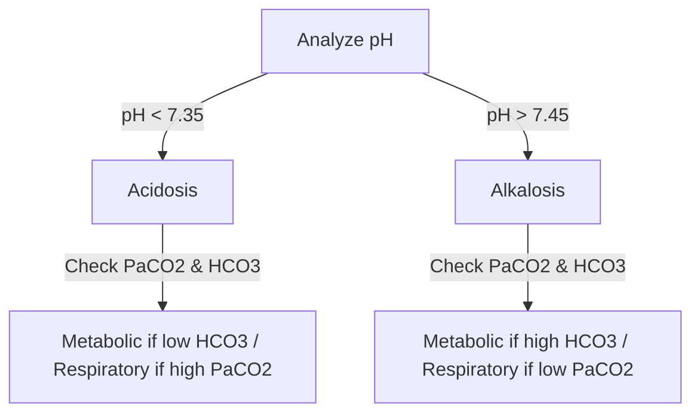

# Acid-Base Balance

### 1. Introduction
This chapter covers the physiological principles of acid-base balance, including buffer systems, respiratory and renal compensatory mechanisms, and the clinical approach to interpreting arterial blood gases (ABGs).

### 2. Daily Life Analogy
Imagine the body's acid-base balance as a swimming pool that needs a steady pH to prevent irritation. Carbon dioxide is the acidic leaf litter falling into the pool, and bicarbonate is the basic chemical buffer poured in to neutralize it. The pool filter (lungs) blowing away the leaves represents the respiratory system exhaling CO2. The pool drainage system (kidneys) slowly adding fresh bicarbonate or draining excess acid represents the renal system. If the filter fails or too much acid is dumped, the pool pH swings out of range, requiring chemical calculations to find the cause.

### 3. Basic Concept
The body maintains arterial pH within a narrow physiological range of $7.35 - 7.45$. This is governed by the Henderson-Hasselbalch equation:
$$ \text{pH} = 6.1 + \log \left( \frac{[\text{HCO}_3^-]}{0.03 \times \text{PaCO}_2} \right) $$
Where $[\text{HCO}_3^-]$ represents metabolic (renal) control, and $\text{PaCO}_2$ represents respiratory control.
- **Acidemia**: Blood pH $< 7.35$.
- **Alkalemia**: Blood pH $> 7.45$.

### 4. Anatomy Review
Acid-base homeostasis depends on three anatomical/physiological systems:
1. **Chemical Buffers**: Bicarbonate buffer system (extracellular), protein buffers (intracellular, e.g., hemoglobin), and phosphate buffers (renal tubules).
2. **Respiratory System**: Peripheral chemoreceptors (carotid/aortic bodies) and central chemoreceptors in the medulla adjust ventilation to regulate arterial $\text{PaCO}_2$.
3. **Renal Tubules**: Proximal tubule (reabsorbs $80-90\%$ of filtered bicarbonate); alpha-intercalated cells of collecting duct (excrete $\text{H}^+$ and generate new bicarbonate).

### 5. Physiology
#### Reference Ranges
- **pH**: $7.35 - 7.45$
- **$\text{PaCO}_2$**: $35 - 45\text{ mmHg}$
- **$[\text{HCO}_3^-]$**: $22 - 26\text{ mEq/L}$

#### Davenport Diagram Rules
The Davenport diagram plotted on axes of $[\text{HCO}_3^-]$ versus pH shows:
- **Isobar lines** for different $\text{PaCO}_2$ values.
- **Respiratory changes** move along the normal buffer line.
- **Metabolic changes** move along a single $\text{PaCO}_2$ isobar line.

### 6. Mechanism
The body responds to primary disturbances with compensatory mechanisms:
- **Metabolic Acidosis**: Compensated by hyperventilation (decreased $\text{PaCO}_2$).
- **Metabolic Alkalosis**: Compensated by hypoventilation (increased $\text{PaCO}_2$).
- **Respiratory Acidosis**: Compensated by renal bicarbonate retention.
- **Respiratory Alkalosis**: Compensated by renal bicarbonate excretion.

#### Compensatory Rules of Thumb
- *Acute Respiratory Acidosis*: $[\text{HCO}_3^-]$ rises by $1\text{ mEq/L}$ per $10\text{ mmHg}$ rise in $\text{PaCO}_2$.
- *Chronic Respiratory Acidosis*: $[\text{HCO}_3^-]$ rises by $3.5\text{ mEq/L}$ per $10\text{ mmHg}$ rise in $\text{PaCO}_2$.
- *Acute Respiratory Alkalosis*: $[\text{HCO}_3^-]$ drops by $2\text{ mEq/L}$ per $10\text{ mmHg}$ drop in $\text{PaCO}_2$.
- *Chronic Respiratory Alkalosis*: $[\text{HCO}_3^-]$ drops by $5\text{ mEq/L}$ per $10\text{ mmHg}$ drop in $\text{PaCO}_2$.

### 7. Animation Summary
An animation depicts carbonic anhydrase driving the conversion of $\text{CO}_2$ and water to carbonic acid, which dissociates to $\text{H}^+$ and bicarbonate.

### 8. 3D Model Guide
An interactive 3D model shows the medullary principal and intercalated cells with apical proton pumps ($\text{H}^+$-ATPase) and basolateral $\text{Cl}^-/\text{HCO}_3^-$ exchangers (AE1).

### 9. Flowchart

### 10. Clinical Correlation
- **The Anion Gap (AG)**: Used to classify metabolic acidosis:
  $$ \text{AG} = [\text{Na}^+] - ([\text{Cl}^-] + [\text{HCO}_3^-]) $$
  *Normal value is $8 - 12\text{ mEq/L}$.*
- **Winter's Formula**: Calculates expected $\text{PaCO}_2$ compensation in metabolic acidosis:
  $$ \text{Expected } \text{PaCO}_2 = (1.5 \times [\text{HCO}_3^-]) + 8 \pm 2 $$
- **Delta Ratio ($\Delta/\Delta$)**: Evaluates mixed metabolic disorders:
  $$ \text{Delta Ratio} = \frac{\text{Calculated AG} - 12}{24 - \text{Measured } [\text{HCO}_3^-]} $$

### 11. Disorders
- **High Anion Gap Metabolic Acidosis (HAGMA)**: Caused by accumulation of unmeasured organic acids (e.g. MUDPILES: Methanol, Uremia, Diabetic ketoacidosis, Propylene glycol, Iron/INH, Lactic acidosis, Ethylene glycol, Salicylates).
- **Normal Anion Gap Metabolic Acidosis (NAGMA)**: Due to bicarbonate loss (diarrhea, Renal Tubular Acidosis).
- **Metabolic Alkalosis**: Caused by volume depletion/vomiting or hyperaldosteronism.
- **Respiratory Acidosis**: Caused by hypoventilation (COPD, sedative overdose).
- **Respiratory Alkalosis**: Caused by hyperventilation (anxiety, high altitude).

### 12. Summary
- pH is maintained by bicarbonate and non-bicarbonate buffers.
- The lungs provide rapid compensation via CO2 adjustment; the kidneys provide slow compensation via bicarbonate transport.

### 13. Important Formulas
1. **Henderson-Hasselbalch**:
   $$ \text{pH} = 6.1 + \log \left( \frac{[\text{HCO}_3^-]}{0.03 \times \text{PaCO}_2} \right) $$
2. **Anion Gap**:
   $$ \text{AG} = [\text{Na}^+] - ([\text{Cl}^-] + [\text{HCO}_3^-]) $$
3. **Winter's Formula**:
   $$ \text{Expected } \text{PaCO}_2 = 1.5 \times [\text{HCO}_3^-] + 8 \pm 2 $$

### 14. Mnemonics
- **ROME**:
  - **R**espiratory **O**pposite (pH and $\text{PaCO}_2$ move in opposite directions).
  - **M**etabolic **E**qual (pH and $[\text{HCO}_3^-]$ move in the same direction).
- **MUDPILES**: Causes of HAGMA.

### 15. Viva Questions
1. **Why does hyperventilation occur in diabetic ketoacidosis?**
   *Answer:* The accumulation of ketoacids increases blood $\text{H}^+$ concentration, which stimulates peripheral chemoreceptors. This triggers the respiratory center in the medulla to increase ventilation (Kussmaul breathing) to blow off $\text{CO}_2$ and raise pH.
2. **What is the significance of the Delta Ratio?**
   *Answer:* It determines if a mixed metabolic acid-base disorder is present in a patient with HAGMA. A ratio $< 0.4$ indicates a mixed NAGMA and HAGMA; a ratio $> 2.0$ indicates a concurrent metabolic alkalosis.
3. **Explain the difference between acute and chronic respiratory acidosis compensation.**
   *Answer:* Acute compensation relies on fast cellular buffering (shifting ions). Chronic compensation takes 2-4 days, relying on the kidneys to upregulate enzymes that reabsorb and synthesize bicarbonate.

### 16. MCQs
1. A patient presents with the following ABG: pH 7.52, PaCO2 25 mmHg, HCO3- 20 mEq/L. Which of the following represents the correct interpretation?
   - A) Acute metabolic alkalosis
   - B) Acute respiratory alkalosis with partial renal compensation
   - C) Chronic respiratory acidosis
   - D) Mixed metabolic acidosis and metabolic alkalosis
   - *Answer:* B
2. What is the limit of hyperventilation compensation for metabolic acidosis, below which a patient's PaCO2 cannot physically fall?
   - A) 25 mmHg
   - B) 20 mmHg
   - C) 10 mmHg
   - D) 5 mmHg
   - *Answer:* C
3. Which of the following is a cause of normal anion gap metabolic acidosis (NAGMA)?
   - A) Diabetic ketoacidosis
   - B) Severe diarrhea
   - C) Lactic acidosis
   - D) Salicylate poisoning
   - *Answer:* B

### 17. Case-Based Learning
**Clinical Case:**
A 24-year-old female with Type 1 Diabetes Mellitus presents to the emergency room with deep, rapid Kussmaul respirations.
- **ABG:** $\text{pH} = 7.15$, $\text{PaCO}_2 = 18\text{ mmHg}$, $[\text{HCO}_3^-] = 6\text{ mEq/L}$.
- **Electrolytes:** $[\text{Na}^+] = 136\text{ mEq/L}$, $[\text{Cl}^-] = 100\text{ mEq/L}$.

**Physiological Analysis:**
1. **Primary Disturbance**: Low pH ($7.15$) and low $[\text{HCO}_3^-]$ ($6\text{ mEq/L}$) indicate primary metabolic acidosis.
2. **Anion Gap**: $\text{AG} = 136 - (100 + 6) = 30\text{ mEq/L}$ (HAGMA due to ketoacids).
3. **Winter's Formula**: Expected $\text{PaCO}_2 = (1.5 \times 6) + 8 \pm 2 = 17 \pm 2\text{ mmHg}$. The actual $\text{PaCO}_2$ of $18$ shows appropriate respiratory compensation.

### 18. Flashcards
- **Front**: What is the normal range for arterial blood pH?
  **Back**: $7.35 - 7.45$.
- **Front**: What formula is used to predict respiratory compensation in metabolic acidosis?
  **Back**: Winter's Formula: $\text{Expected } \text{PaCO}_2 = 1.5 \times [\text{HCO}_3^-] + 8 \pm 2$.

### 19. Revision Notes
- Primary metabolic disturbances are compensated by the respiratory system.
- Primary respiratory disturbances are compensated by the kidneys.

### 20. Practice Quiz
1. A patient has a pH of 7.20, PaCO2 of 60 mmHg, and HCO3- of 23 mEq/L. This represents:
   - A) Acute respiratory acidosis
   - B) Chronic respiratory acidosis
   - C) Metabolic acidosis
   - D) Respiratory alkalosis
   - *Answer:* A
2. An anion gap of 22 mEq/L is characteristic of:
   - A) Diarrhea
   - B) Lactic acidosis
   - C) Renal tubular acidosis
   - D) Vomiting
   - *Answer:* B
