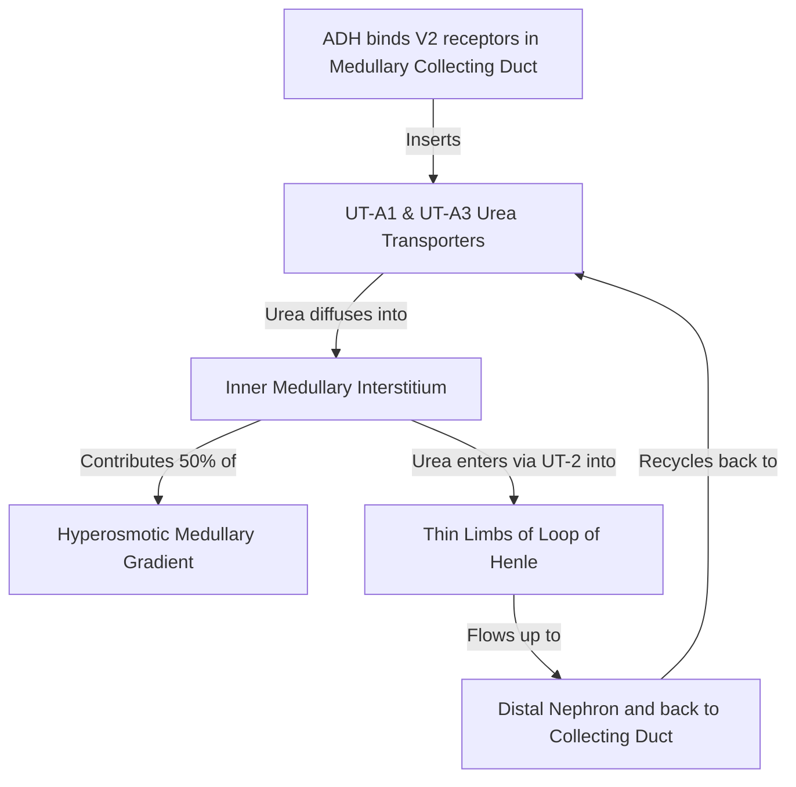
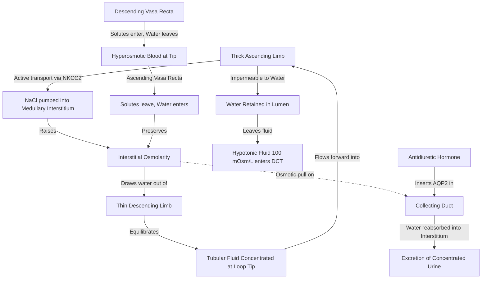

# Countercurrent Mechanism

### 1. Introduction
The countercurrent mechanism is the primary physiological process by which the kidneys maintain water balance, enabling the excretion of either highly concentrated or highly dilute urine. Operating within the loops of Henle, the vasa recta, and the collecting ducts, this system establishes and maintains a hyperosmotic medullary interstitial gradient. This gradient acts as an osmotic suction force, allowing the body to conserve water under the control of Antidiuretic Hormone (ADH) or to excrete excess water when necessary.

### 2. Daily Life Analogy
Imagine an industrial heat exchanger consisting of two adjacent pipes carrying fluid in opposite directions. If cold water enters one pipe and hot water enters the other, heat transfers from the hot pipe to the cold pipe. By the time the fluids exit, they have exchanged heat. 

The kidney uses this "countercurrent" flow pattern in two ways:
1. **The Countercurrent Multiplier (Loop of Henle)**: Works like a series of active heat-pump stages. By actively pumping salt out of the ascending tube into the space between the tubes, it creates a massive concentration gradient that multiplies from top (cortex) to bottom (deep medulla).
2. **The Countercurrent Exchanger (Vasa Recta)**: Works like a passive heat shield. It allows blood vessels to supply oxygen and nutrients to the deep tissues and remove reabsorbed water without washing away the carefully built salt gradient.

### 3. Basic Concept
The countercurrent mechanism consists of two distinct but complementary systems:
* **Countercurrent Multiplication**: An active, energy-consuming process occurring in the loops of Henle of juxtamedullary nephrons. It establishes a hyperosmotic gradient in the medullary interstitium, increasing from $300 \text{ mOsm/L}$ at the corticomedullary junction to a maximum of $1200 - 1400 \text{ mOsm/L}$ at the renal papilla.
* **Countercurrent Exchange**: A passive process occurring in the U-shaped vasa recta capillaries. It preserves the medullary hyperosmotic gradient by preventing the "washout" of solutes while delivering nutrients and removing water.
* **Medullary Collecting Duct Reabsorption**: The final site where urine is concentrated. Water is drawn out of the tubule lumen into the hyperosmotic interstitium via **Aquaporin-2** channels, which are inserted under the influence of **Antidiuretic Hormone (ADH)**.

```
       CORTEX                      300 mOsm/L
  ────────────────────────────────────────────────────────
                      Descending       Ascending
                         Limb            Limb
                          │                ▲
                          │  H2O    NaCl   │ (Active transport
                          ▼   │      ▲     │  via NKCC2)
                              ▼      │
       MEDULLA                       │     1200 mOsm/L
                               Loop Tip
```

### 4. Anatomy Review
* **Juxtamedullary Nephrons**: Represent $\approx 15\%$ of all human nephrons. They have glomeruli located in the deep renal cortex near the medulla and possess long loops of Henle that extend deep into the inner medulla. Only these nephrons contribute significantly to the countercurrent multiplier.
* **Vasa Recta**: Long, U-shaped capillary loops that branch from the efferent arterioles of juxtamedullary glomeruli. They run parallel to the loops of Henle in the medulla and drain into cortical veins.
* **Collecting Ducts**: Run vertically from the cortex through the hyperosmotic medullary interstitium to empty into the renal pelvis.

### 5. Physiology
#### A. Segmental Permeabilities and Transport Characteristics
The countercurrent multiplier depends on the distinct physiological properties of the different segments of the loop of Henle:

| Segment | Permeability to Water | Permeability to NaCl | Active Solute Transport |
|---|---|---|---|
| **Thin Descending Limb (tDLH)** | High (via Aquaporin-1) | Low (Passive) | None |
| **Thin Ascending Limb (tALH)** | Zero | High (Passive diffusion) | None |
| **Thick Ascending Limb (TAL)** | Zero | Zero | High (Active $\text{Na}^+/\text{K}^+/2\text{Cl}^-$ via NKCC2) |

#### B. The Thick Ascending Limb (TAL) and the NKCC2 Cotransporter
The TAL is the "engine" of the countercurrent multiplier.
* **Active Transport**: The basolateral $\text{Na}^+/\text{K}^+$-ATPase pump maintains a low intracellular sodium concentration. This drives the apical **NKCC2 cotransporter** ($\text{Na}^+/\text{K}^+/2\text{Cl}^-$ cotransporter) to move these ions from the lumen into the cell.
* **Potassium Recycling**: Intracellular potassium leaks back into the lumen through apical **ROMK channels** (Renal Outer Medullary Potassium channels). This recycling is crucial to keep the lumen supplied with $\text{K}^+$ for NKCC2 function and to generate a **lumen-positive transepithelial potential difference ($+10 \text{ to } +20 \text{ mV}$)**.
* **Paracellular Reabsorption**: This lumen-positive charge repels and drives the paracellular reabsorption of divalent cations ($\text{Ca}^{2+}$ and $\text{Mg}^{2+}$) through claudin channels.

#### C. Solute Composition of the Medullary Interstitium
At maximal concentration ($1200 \text{ mOsm/L}$), the medullary interstitial osmolarity is composed of:
1. **NaCl ($\approx 600 \text{ mOsm/L}$)**: Derived from the active transport out of the TAL and passive exit from the tALH.
2. **Urea ($\approx 600 \text{ mOsm/L}$)**: Recycled from the inner medullary collecting ducts.

### 6. Mechanism
#### A. Countercurrent Multiplication Steps (The "Single Effect")
1. **Initial State**: The loop of Henle and interstitium are filled with fluid at isotonicity ($300 \text{ mOsm/L}$).
2. **The Single Effect**: The active transporters in the thick ascending limb pump $\text{NaCl}$ out of the lumen into the interstitium. Because the TAL is impermeable to water, this solute accumulation raises the interstitial osmolarity and dilutes the tubular fluid. The maximum gradient that can be generated by this pump between the tubule lumen and the interstitium at any horizontal level is $\approx 200 \text{ mOsm/L}$ (e.g., $100 \text{ mOsm/L}$ in the lumen and $300 \text{ mOsm/L}$ in the interstitium).
3. **Osmotic Equilibration**: The thin descending limb is highly permeable to water but impermeable to solutes. Water is drawn out of the tDLH into the hyperosmotic interstitium by osmosis until the descending limb fluid osmolarity equilibrates with the interstitium.
4. **Fluid Flow**: New isotonic fluid ($300 \text{ mOsm/L}$) enters the loop from the proximal tubule, pushing the concentrated fluid from the descending limb forward into the ascending limb.
5. **Multiplication**: The active pump in the ascending limb again establishes a $200 \text{ mOsm/L}$ horizontal gradient, but now it acts on fluid that has already been concentrated. This process of pumping, equilibration, and flow repeats continuously, "multiplying" the osmotic gradient from $300 \text{ mOsm/L}$ at the cortex to $1200 \text{ mOsm/L}$ at the loop tip.

#### B. Countercurrent Exchange (Vasa Recta)
If normal capillaries ran through the medulla, their rapid blood flow would carry away the accumulated $\text{NaCl}$ and urea, destroying the gradient (washout). The vasa recta prevent this through passive countercurrent exchange:
* **Descending Limb of Vasa Recta**: As blood flows down into the hyperosmotic medulla, water diffuses out of the capillaries, and solutes ($\text{NaCl}$, urea) diffuse in.
* **Ascending Limb of Vasa Recta**: As blood flows back up toward the cortex, the process reverses. Solutes diffuse out of the capillaries back into the interstitium, and water diffuses in.
* **Net Effect**: Solutes are trapped in the medulla, and reabsorbed water is carried away. The slow, U-shaped blood flow ensures that the gradient is preserved.

#### C. Urea Recycling
Urea is filtered at the glomerulus, and $\approx 50\%$ is reabsorbed in the proximal tubule.
1. In the presence of ADH, water is reabsorbed in the cortical and outer medullary collecting ducts. This increases the concentration of urea in the remaining tubular fluid.
2. In the inner medullary collecting duct, ADH activates **UT-A1** and **UT-A3 urea transporters**, allowing urea to diffuse down its concentration gradient into the deep medullary interstitium.
3. This interstitial urea enters the thin limbs of the loop of Henle via **UT-A2** transporters and flows back up, recycling through the nephron. This recycling traps urea in the medulla, contributing $50\%$ of the hyperosmotic gradient.



### 7. Animation Summary
A step-by-step animation visualizes:
1. **Flow of tubular fluid**: Starting at $300 \text{ mOsm/L}$ in the Bowman's capsule, remaining isotonic in the proximal tubule.
2. **Descending the loop**: Concentrating progressively as water exits via Aquaporin-1, reaching $1200 \text{ mOsm/L}$ at the hairpin bend.
3. **Ascending the loop**: Diluting progressively as $\text{NaCl}$ is actively pumped out via NKCC2, leaving the fluid hypotonic ($100 \text{ mOsm/L}$) as it enters the distal convoluted tubule (the "diluting segment").
4. **Collecting Duct**:
   * *With ADH*: Aquaporin-2 channels insert. Water is drawn out into the medullary interstitium, concentrating the final urine to $1200 \text{ mOsm/L}$.
   * *Without ADH*: Aquaporin-2 channels are absent. The collecting duct remains impermeable to water, and the hypotonic fluid is excreted as dilute urine ($50 - 100 \text{ mOsm/L}$).

### 8. 3D Model Guide
An interactive 3D model allows exploration of the renal medulla:
* **Juxtamedullary Nephron Layer**: Clicking on the loop of Henle highlights the NKCC2 cotransporters in the TAL. Toggling the "Furosemide" filter visualizes the blockade of NKCC2, showing the immediate collapse of the surrounding interstitial gradient.
* **Vasa Recta Layer**: Highlights the movement of water and solutes in opposite directions in the descending and ascending limbs. Accelerating the blood flow rate demonstrates "solute washout," resulting in a drop in medullary osmolarity.
* **Collecting Duct Layer**: Toggling ADH "On" or "Off" shows the translocation of Aquaporin-2 containing vesicles to the apical membrane.

### 9. Flowchart



### 10. Clinical Correlation
#### A. Loop Diuretics (e.g., Furosemide, Torsemide, Bumetanide)
* **Mechanism**: Inhibit the NKCC2 cotransporter in the thick ascending limb of the loop of Henle.
* **Hemodynamic and Osmotic Effects**:
  1. Blockade of $\text{NaCl}$ transport directly reduces the osmolarity of the medullary interstitium.
  2. This destroys the medullary osmotic gradient, rendering the collecting duct unable to reabsorb water even if maximal ADH is present.
  3. Consequently, water reabsorption is severely impaired, leading to a profound diuresis.
  4. The inhibition of potassium recycling via ROMK reduces the lumen-positive potential, causing increased urinary excretion of calcium and magnesium.

#### B. Free Water Clearance ($C_{H2O}$)
Free water clearance is the volume of solute-free water excreted by the kidney per unit time. It assesses the kidney's ability to concentrate or dilute urine:
$$ C_{H2O} = V - C_{osm} $$
Where $V$ is urine flow rate, and $C_{osm}$ is osmolar clearance:
$$ C_{osm} = \frac{U_{osm} \times V}{P_{osm}} $$
* **Positive Free Water Clearance ($C_{H2O} > 0$)**: The kidney is excreting excess water (dilute urine, $U_{osm} < P_{osm}$). Occurs in the absence of ADH.
* **Negative Free Water Clearance ($C_{H2O} < 0$, often called $T^c_{H2O}$)**: The kidney is conserving water (concentrated urine, $U_{osm} > P_{osm}$). Occurs in high ADH states.

### 11. Disorders
1. **Central Diabetes Insipidus**:
   * Caused by head trauma, pituitary surgery, or idiopathic loss of hypothalamic secretory neurons. Characterized by a lack of ADH synthesis or release.
   * *Presentation*: Polyuria ($>3 \text{ L/day}$ of dilute urine), polydipsia, high serum sodium, and low urine osmolarity ($<150 \text{ mOsm/L}$). Corrected by desmopressin (dAVP) administration.
2. **Nephrogenic Diabetes Insipidus**:
   * Caused by renal resistance to ADH due to mutations in the $V_2$ receptor or Aquaporin-2 gene, or acquired due to chronic Lithium therapy, hypercalcemia, or hypokalemia.
   * *Presentation*: Similar to central DI, but urine osmolarity does not increase following desmopressin administration.
3. **Syndrome of Inappropriate ADH (SIADH)**:
   * Excess, unregulated ADH secretion (often ectopic from small cell lung cancer or due to CNS disorders).
   * *Presentation*: Excessive water retention, hyponatremia, high urine osmolarity ($>100 \text{ mOsm/L}$, often higher than plasma), and euvolemic status.
4. **Isosthenuria**:
   * In chronic kidney disease, the destruction of nephrons and loss of the medullary interstitial gradient prevents the kidneys from concentrating or diluting urine. The urine osmolarity becomes fixed at that of plasma ($\approx 300 \text{ mOsm/L}$, specific gravity $1.010$).

### 12. Summary
* The countercurrent mechanism consists of the countercurrent multiplier (loop of Henle) which establishes the medullary gradient, and the countercurrent exchanger (vasa recta) which maintains it.
* The thick ascending limb actively pumps $\text{NaCl}$ out via the NKCC2 cotransporter, creating a $200 \text{ mOsm/L}$ horizontal gradient that is multiplied down the loop.
* The vasa recta use a passive, U-shaped capillary flow to prevent solute washout while removing reabsorbed water.
* Urea recycling from the medullary collecting duct contributes up to $50\%$ of the hyperosmotic medullary gradient.
* Loop diuretics inhibit NKCC2, abolishing the medullary gradient and causing massive diuresis.
* Diabetes insipidus represents a failure of the water conservation system, leading to high free water clearance and polyuria.

### 13. Important Formulas
1. **Osmolar Clearance ($C_{osm}$)**:
   $$ C_{osm} = \frac{U_{osm} \times V}{P_{osm}} $$
2. **Free Water Clearance ($C_{H2O}$)**:
   $$ C_{H2O} = V - C_{osm} = V - \left(\frac{U_{osm} \times V}{P_{osm}}\right) $$
3. **Transepithelial Potential in TAL**:
   $$ \text{Potential} \approx +10 \text{ to } +20 \text{ mV (lumen positive)} $$

### 14. Mnemonics
* **D**escending **D**rips **D**own:
  * **D**escending loop allows water to drip out (permeable to water).
* **A**scending **A**ctively **A**bsorbs:
  * **A**scending loop actively pumps ions out, but is impermeable to water.
* **V**asa **V**essels **V**alidate:
  * **V**asa recta are passive blood vessels that **V**alidate (preserve) the gradient.
* **NKCC2** is **N**o **K**eep **C**alcium **C**o-transporter:
  * When blocked by loop diuretics, it also wastes Calcium and Magnesium.

### 15. Viva Questions
1. **Explain why a patient with severe protein malnutrition exhibits an impaired ability to concentrate urine.**
   * *Answer*: Urea is a major metabolic end-product of protein catabolism. In severe protein malnutrition, the production of urea is significantly decreased. Since urea recycling from the collecting ducts contributes approximately $40-50\%$ of the hyperosmotic medullary interstitial gradient, a lack of urea reduces the maximum medullary osmolarity. Consequently, the osmotic drive for water reabsorption in the collecting ducts is compromised, limiting the maximum concentrating capacity of the kidney.
2. **What is the significance of the ROMK channel in the thick ascending limb, and what happens to divalent cation reabsorption if it is blocked?**
   * *Answer*: The ROMK channel mediates the apical efflux (recycling) of potassium back into the tubule lumen. This recycling is critical because the concentration of potassium in the tubular fluid is low relative to the high capacity of the NKCC2 cotransporter. Without ROMK, NKCC2 would cease to function due to substrate depletion. Furthermore, this potassium recycling generates a lumen-positive transepithelial potential of $+10 \text{ to } +20 \text{ mV}$. This charge drives the paracellular reabsorption of divalent cations ($\text{Ca}^{2+}$ and $\text{Mg}^{2+}$). If ROMK is blocked (or NKCC2 is inhibited), this potential is abolished, leading to hypercalciuria and hypermagnesiuria.
3. **Contrast the flow rate of blood in the renal cortex versus the renal medulla, and explain why this difference is physiological.**
   * *Answer*: The renal cortex receives approximately $90-95\%$ of total renal blood flow, whereas the renal medulla receives only $5-10\%$ (with the inner medulla receiving $<1-2\%$). This low medullary blood flow is physiological and essential to preserve the hyperosmotic medullary gradient. Rapid blood flow through the medulla would wash away the accumulated sodium chloride and urea (solute washout). The slow flow through the U-shaped vasa recta provides sufficient time for passive countercurrent exchange, trapping solutes in the medulla while removing the reabsorbed water.

### 16. MCQs
1. A patient is treated with a loop diuretic for fluid overload. Which of the following transport proteins is the direct molecular target of this drug?
   * A) Apical NaCl cotransporter (NCC)
   * B) Basolateral Na+/K+ ATPase pump
   * C) Apical Na+/K+/2Cl- cotransporter (NKCC2)
   * D) Epithelial Sodium Channel (ENaC)
   * *Answer*: C
   * *Explanation*: Loop diuretics (e.g., Furosemide) directly inhibit the apical NKCC2 cotransporter in the thick ascending limb of the loop of Henle.
2. Under conditions of maximal antidiuresis, which of the following tubular fluid-to-plasma osmolarity ratios ($TF_{osm}/P_{osm}$) would be expected in the thick ascending limb of the loop of Henle?
   * A) $1.0$
   * B) $4.0$
   * C) $<1.0$
   * D) $>4.0$
   * *Answer*: C
   * *Explanation*: The thick ascending limb is impermeable to water but actively reabsorbs solutes via NKCC2. As a result, the tubular fluid is progressively diluted. By the end of the ascending limb, the fluid is hypotonic relative to plasma, meaning the $TF_{osm}/P_{osm}$ ratio is $<1.0$ (typically $\approx 0.33$, or $100 \text{ mOsm/L}$ compared to plasma's $300 \text{ mOsm/L}$).
3. A 29-year-old female presents with polyuria and polydipsia. Laboratory evaluation reveals: Plasma Osmolarity: $305 \text{ mOsm/L}$ (elevated), Urine Osmolarity: $90 \text{ mOsm/L}$ (decreased). She is administered desmopressin (dAVP) subcutaneously. Two hours later, her urine osmolarity remains at $95 \text{ mOsm/L}$. What is the most likely diagnosis?
   * A) Central Diabetes Insipidus
   * B) Syndrome of Inappropriate ADH (SIADH)
   * C) Nephrogenic Diabetes Insipidus
   * D) Primary Polydipsia
   * *Answer*: C
   * *Explanation*: The patient has hyperosmolar plasma and dilute urine, indicating Diabetes Insipidus. The failure of the urine to concentrate after administering desmopressin (an ADH analog) confirms renal resistance to ADH, which is diagnostic of Nephrogenic Diabetes Insipidus. Central DI would show a significant increase in urine osmolarity ($>50\%$), and primary polydipsia would present with hyponatremia/low plasma osmolarity.
4. Which of the following capillary features of the vasa recta is most critical for preventing the washout of the medullary hyperosmotic gradient?
   * A) High blood flow rate
   * B) Straight, non-looping configuration
   * C) U-shaped looping configuration and slow blood flow
   * D) Expressed active sodium pumps on endothelial cells
   * *Answer*: C
   * *Explanation*: The U-shaped configuration and slow blood flow of the vasa recta are essential. They allow the capillaries to act as passive countercurrent exchangers, letting water and solutes equilibrate across the limbs, which traps solutes in the medulla and removes reabsorbed water.
5. In the inner medullary collecting duct, which transporter is directly stimulated by ADH to facilitate urea exit into the interstitium?
   * A) UT-A2
   * B) UT-A1
   * C) NKCC2
   * D) Aquaporin-1
   * *Answer*: B
   * *Explanation*: ADH acts via cAMP to phosphorylate and activate the UT-A1 urea transporter on the apical membrane (and UT-A3 on the basolateral membrane) of the inner medullary collecting duct cells, promoting urea diffusion into the interstitium. UT-A2 is located in the thin limbs of the loop of Henle.

### 17. Case-Based Learning
**Clinical History**: 
A 42-year-old male presents to the clinic complaining of extreme thirst and constant urination. He states that he is drinking up to $10 \text{ L}$ of water per day and must wake up multiple times during the night to urinate. He has no prior medical history except for a mild head injury from a motor vehicle accident six months ago.
* **Laboratory Studies**:
  * Plasma Sodium: $146 \text{ mEq/L}$ (elevated; normal: $135 - 145$)
  * Plasma Osmolarity: $302 \text{ mOsm/L}$ (elevated; normal: $280 - 295$)
  * Urine Osmolarity: $85 \text{ mOsm/L}$ (severely dilute; normal: $500 - 800$ during water restriction)
  * Urine Specific Gravity: $1.002$ (normal: $1.015 - 1.025$)
  * Blood Glucose: $88 \text{ mg/dL}$ (normal)

**Diagnostic Water Deprivation Test**:
The patient undergoes a supervised water deprivation test. His body weight, urine volume, and plasma/urine osmolarities are monitored hourly. 

* **Hour 6 of Deprivation**: The patient has lost $2\%$ of his body weight. Plasma osmolarity has risen to $310 \text{ mOsm/L}$, but urine osmolarity remains low at $90 \text{ mOsm/L}$.
* **Intervention**: The patient is given $2 \ \mu\text{g}$ of desmopressin (dAVP) subcutaneously.
* **Hour 8 (2 hours post-dAVP)**: Urine osmolarity rises rapidly to $650 \text{ mOsm/L}$, and urine volume drops.

**Physiological Analysis & Questions**:
1. **Interpret the results of the water deprivation test and state the diagnosis.**
   * *Answer*: During water deprivation, the rising plasma osmolarity ($310 \text{ mOsm/L}$) represents a strong stimulus for ADH release. A normal individual would concentrate their urine ($>600 \text{ mOsm/L}$). The patient's failure to concentrate his urine ($90 \text{ mOsm/L}$) during deprivation indicates a deficit in the ADH pathway. The rapid increase in urine osmolarity to $650 \text{ mOsm/L}$ ($>500\%$ increase) following exogenous desmopressin administration confirms that the kidneys are responsive to ADH, but the body is not secreting it. The diagnosis is **Central Diabetes Insipidus**, likely secondary to hypothalamic-pituitary damage from his head injury.
2. **Calculate the patient's Free Water Clearance ($C_{H2O}$) at the start of the study, assuming a urine flow rate ($V$) of $6.0 \text{ mL/min}$, plasma osmolarity ($P_{osm}$) of $302 \text{ mOsm/L}$, and urine osmolarity ($U_{osm}$) of $85 \text{ mOsm/L}$.**
   * *Answer*:
     1. Calculate Osmolar Clearance:
        $$ C_{osm} = \frac{U_{osm} \times V}{P_{osm}} = \frac{85 \text{ mOsm/L} \times 6.0 \text{ mL/min}}{302 \text{ mOsm/L}} = \frac{510}{302} \approx 1.69 \text{ mL/min} $$
     2. Calculate Free Water Clearance:
        $$ C_{H2O} = V - C_{osm} = 6.0 - 1.69 = +4.31 \text{ mL/min} $$
     * *Interpretation*: The positive free water clearance ($+4.31 \text{ mL/min}$) indicates that the kidney is actively excreting solute-free water, leading to systemic dehydration and hyperosmolarity.
3. **How would the results of the water deprivation test differ if the patient had Nephrogenic Diabetes Insipidus or Primary Polydipsia?**
   * *Answer*:
     * *Nephrogenic DI*: The urine osmolarity would remain dilute ($<100-150 \text{ mOsm/L}$) even after desmopressin administration, as the kidney's $V_2$ receptors or aquaporin channels are unresponsive.
     * *Primary Polydipsia*: The baseline plasma sodium and osmolarity would be low or low-normal due to chronic over-drinking. During water deprivation, the patient would slowly but successfully concentrate their urine ($>500-600 \text{ mOsm/L}$) without needing desmopressin, as their endogenous ADH synthesis and release are intact but were chronically suppressed by water intake.

### 18. Flashcards
* **Front**: Which channel is responsible for potassium recycling in the TAL?
  **Back**: The ROMK channel.
* **Front**: What are the water channels inserted into the collecting duct under ADH stimulation?
  **Back**: Aquaporin-2 channels.
* **Front**: What is the normal osmolarity of the renal cortex?
  **Back**: Approximately $300 \text{ mOsm/L}$ (isotonic to plasma).
* **Front**: How does chronic Lithium therapy cause polyuria?
  **Back**: By inhibiting G-protein signaling downstream of the $V_2$ receptor, causing Nephrogenic Diabetes Insipidus.
* **Front**: What is the role of the $Na^+/K^+/2Cl^-$ cotransporter (NKCC2)?
  **Back**: To actively transport these three ions from the TAL lumen into the intracellular space, driving the countercurrent multiplier.

### 19. Revision Notes
* **Countercurrent Multiplier (Loop of Henle)**:
  * Creates the gradient. TAL pumps out $\text{NaCl}$ via NKCC2, creating the horizontal gradient ($200 \text{ mOsm/L}$). tDLH lets water exit, concentrating the fluid. Flow moves this concentrated fluid forward, multiplying the effect.
* **Countercurrent Exchanger (Vasa Recta)**:
  * Preserves the gradient. Passive exchange prevents solute washout. Slow, U-shaped capillary blood flow.
* **Urea Recycling**:
  * ADH stimulates UT-A1/UT-A3 in the inner medullary collecting duct, dumping urea into the interstitium. Urea recycles through the thin loop limbs, accounting for up to $50\%$ of medullary hyperosmolarity.
* **Diagnostics**:
  * Central DI corrects with desmopressin. Nephrogenic DI does not. Primary polydipsia concentrates during water deprivation without needing desmopressin.

### 20. Practice Quiz
1. A patient in renal failure has a fixed urine osmolarity of $295 \text{ mOsm/L}$ and a urine specific gravity of $1.010$ across multiple tests. What is the physiological term for this condition?
   * *Answer*: Isosthenuria (loss of the kidney's ability to concentrate or dilute urine due to destruction of the medullary interstitial gradient).
2. What is the expected horizontal osmolar gradient between the thick ascending limb lumen and the adjacent interstitium at any given level during active multiplication?
   * *Answer*: Approximately $200 \text{ mOsm/L}$.
3. In a patient with SIADH, would you expect the free water clearance ($C_{H2O}$) to be positive, negative, or zero?
   * *Answer*: Negative ($C_{H2O} < 0$), because excessive ADH causes maximal water reabsorption, resulting in concentrated urine.
4. A drug that blocks apical ROMK channels in the loop of Henle would have an effect similar to which class of diuretics?
   * *Answer*: Loop diuretics (like Furosemide), since blocking ROMK depletes the potassium required for NKCC2 cotransport, halting the active step of the countercurrent multiplier.
5. In the absence of ADH, where is the most dilute tubular fluid located in the nephron?
   * *Answer*: In the early distal convoluted tubule or late thick ascending limb, where solute has been removed but water cannot follow.
