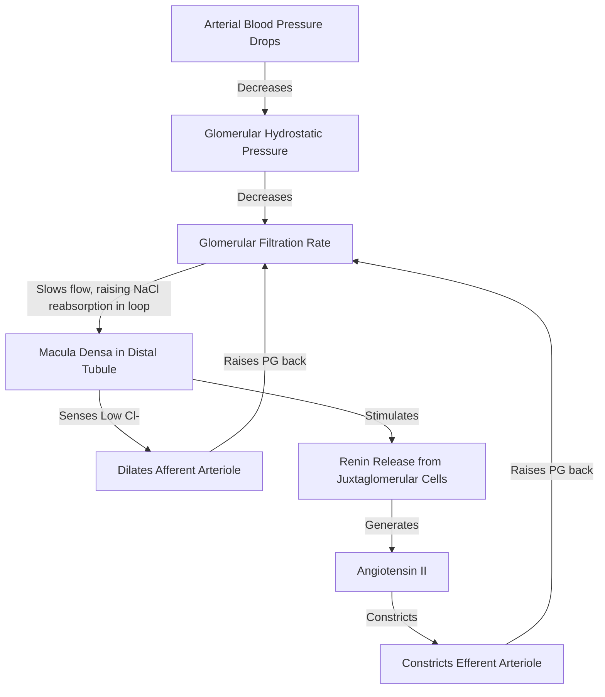
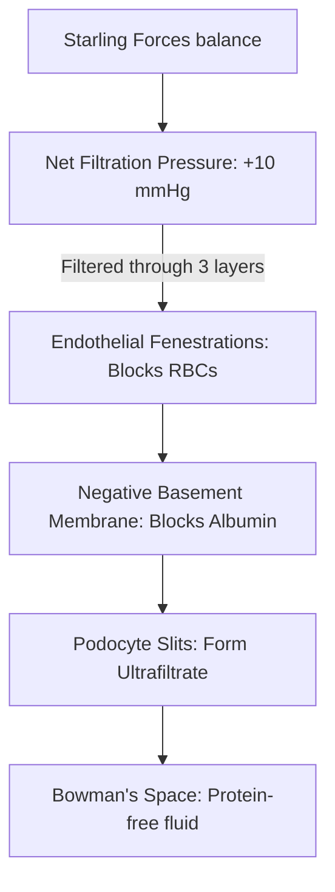

# Section 6: Renal Physiology

## Chapter 7: Glomerular Filtration & Renal Clearance

---

### 1. Introduction
The kidneys perform a critical homeostatic role by filtering waste products from the blood while conserving essential water, electrolytes, and nutrients. The first step in urine formation is **Glomerular Filtration**, a non-selective process that filters large volumes of plasma through the glomerular capillary membrane into Bowman's capsule.

### 2. Daily Life Analogy
Imagine a recycling facility sorting waste from a truck. The truck dumps its entire load onto a fast-moving mesh conveyer belt (Glomerular filtration). Smaller items like plastic bottles, cans, and paper fall through the mesh (filtration of water, glucose, ions, urea). Large items like heavy machinery or workers cannot fit through the mesh and remain on the truck (proteins and blood cells stay in the capillaries). Down the line, workers pick out the valuable bottles and cans to return them to the store (tubular reabsorption), while leaving the true trash to be thrown away (urinary excretion).

### 3. Basic Concept
- **Nephron**: The functional unit of the kidney. Each kidney contains ~1 million nephrons.
  * *Cortical Nephrons (85%)*: Have short loops of Henle wrapped by peritubular capillaries.
  * *Juxtamedullary Nephrons (15%)*: Have long loops of Henle extending deep into the medulla, wrapped by specialized straight capillaries called **Vasa Recta**, which are crucial for concentrating urine.
- **Glomerular Filtrate**: The fluid that enters Bowman's space. It is protein-free and contains no cellular elements; its composition is identical to plasma, except for the lack of proteins.
- **Glomerular Filtration Rate (GFR)**: The volume of filtrate formed per minute by all nephrons in both kidneys (normally **~125 mL/min** or 180 L/day).

```text
  AFFERENT ARTERIOLE -> Glomerular Capillaries -> EFFERENT ARTERIOLE
                             | (Filtration Barrier)
                       Bowman's Capsule Space -> Proximal Tubule
```

### 4. Anatomy Review
The Filtration Barrier consists of three layers:
1. **Capillary Endothelium**: Has thousands of small holes called fenestrations. Prevents filtration of blood cells.
2. **Basement Membrane**: A meshwork of collagen and proteoglycans. It has a strong **negative electrical charge** due to proteoglycans, repelling negatively charged plasma proteins (like albumin).
3. **Podocyte Epithelium**: Epithelial cells wrapping the capillaries. They have foot processes (pedicels) separated by filtration slits.

### 5. Physiology
Filtration is driven by the balance of **Starling Forces** across the capillary wall:
- **Glomerular Hydrostatic Pressure (\(P_G\))**: Forces fluid *out* of the capillary (normally **60 mmHg**, high compared to systemic capillaries).
- **Bowman's Space Hydrostatic Pressure (\(P_B\))**: Opposes filtration (normally **18 mmHg**).
- **Glomerular Capillary Oncotic Pressure (\(\pi_G\))**: Opposes filtration by pulling water back in due to plasma proteins (normally **32 mmHg**).
- **Bowman's Space Oncotic Pressure (\(\pi_B\))**: Favors filtration (normally **0 mmHg** because it is protein-free).
- **Net Filtration Pressure (NFP)**:
  \[NFP = P_G - P_B - \pi_G = 60 - 18 - 32 = +10\text{ mmHg}\]
- **GFR Equation**:
  \[GFR = K_f \times NFP\]
  *Where \(K_f\) is the filtration coefficient, representing capillary permeability and surface area.*

---

### 6. Mechanism

#### Tubuloglomerular Feedback (Autoregulation)
The kidneys maintain a stable GFR despite fluctuations in arterial blood pressure (between 75 and 160 mmHg) using autoregulation:



#### Renal Clearance (\(C\))
The volume of plasma completely cleared of a substance by the kidneys per unit time:
\[C = \frac{U \times V}{P}\]
*Where \(U\) is urine concentration of the substance, \(V\) is urine flow rate (mL/min), and \(P\) is plasma concentration of the substance.*
- **Inulin Clearance**: Inulin is freely filtered but neither reabsorbed nor secreted. Thus, **Inulin Clearance = GFR**.
- **Creatinine Clearance**: Used clinically to estimate GFR. It slightly overestimates GFR because a small amount of creatinine is secreted by the tubules.
- **Para-aminohippuric Acid (PAH) Clearance**: PAH is filtered and completely secreted. Thus, **PAH Clearance = Renal Plasma Flow (RPF)** (~625 mL/min).

---

### 7. Animation Summary
*Visualization focuses on:* The Starling pressures changing along the length of the glomerular capillary, showing filtration stopping as oncotic pressure rises toward the efferent end.

### 8. 3D Model Guide
*Interactive viewer targets:* The renal corpuscle. Exploding Bowman's capsule displays the afferent arteriole, podocyte wraps, and fenestrated endothelium layers.

### 9. Flowchart



### 10. Clinical Correlation
- **Glomerulonephritis**: Immune complex deposition damages the filtration barrier, destroying negative charges and expanding filtration slit size. This allows proteins and RBCs to leak into the urine, causing **Proteinuria** and **Hematuria**.
- **Urinary Tract Obstruction (e.g. Kidney Stones)**: Blocks urine flow, raising pressure throughout the tubule system. This increases Bowman's space hydrostatic pressure (\(P_B\)), reducing Net Filtration Pressure and GFR, leading to acute post-renal kidney injury.

### 11. Disorders
- **Nephrotic Syndrome**: Severe glomerular damage causing massive proteinuria (>3.5 g/day), hypoalbuminemia, generalized edema (loss of plasma oncotic pressure), and hyperlipidemia.
- **Acute Kidney Injury (AKI)**: Rapid decline in GFR, leading to retention of nitrogenous waste products (azotemia) and disruption of fluid/electrolyte balance.

### 12. Summary
- The nephron is the functional unit of the kidney; glomerular filtration is the first step in urine formation.
- GFR (~125 mL/min) is driven by Starling forces: GFR = Kf × (PG - PB - \(\pi_G\)).
- Autoregulation utilizes tubuloglomerular feedback at the macula densa to keep GFR stable.
- Renal clearance measures plasma volume cleared of a substance: C = (U × V) / P. Inulin clearance equals GFR; PAH clearance equals RPF.

### 13. Important Formulas
- **Renal Clearance**: \(C = \frac{U \times V}{P}\)
- **Filtration Fraction (FF)**: The fraction of renal plasma flow that is filtered:
  \[FF = \frac{GFR}{RPF}\] (Normal is ~20%).

### 14. Mnemonics
- **E-A-S-Y GFR**:
  * **E**ffect of pressures: **A**fferent dilation increases GFR, **S**ympathetic constriction of afferent decreases GFR, **Y**-angiotensin II (constricting efferent) increases GFR.

### 15. Viva Questions
1. **Why does albumin not pass through the filtration barrier in healthy kidneys?**
   * *Answer*: Albumin has a molecular weight of ~69,000 Da, which is near the physical filter threshold. Additionally, albumin is negatively charged, and the glomerular basement membrane carries a strong negative charge due to heparan sulfate proteoglycans. Like charges repel, preventing albumin from filtering.
2. **Define Filtration Fraction and state its normal value.**
   * *Answer*: Filtration Fraction (FF) is the ratio of GFR to Renal Plasma Flow (RPF). It represents the percentage of plasma entering the kidney that is filtered into the nephrons.
     \[FF = \frac{GFR}{RPF} = \frac{125\text{ mL/min}}{625\text{ mL/min}} = 0.20 \text{ or } 20\%\]

### 16. MCQs
1. If a drug has a clearance value of 250 mL/min (where GFR = 125 mL/min), what can you conclude about its renal handling?
   * A) It is filtered and partially reabsorbed
   * B) It is filtered and actively secreted
   * C) It is not filtered at all
   * D) It is handled exactly like inulin
   * *Answer*: B *(Clearance > GFR indicates that net secretion occurs in the tubules to clear additional plasma).*

2. Which of the following changes will decrease the Glomerular Filtration Rate?
   * A) Dilating the afferent arteriole
   * B) Constricting the efferent arteriole
   * C) An increase in Bowman's space hydrostatic pressure
   * D) A decrease in plasma protein concentration
   * *Answer*: C

### 17. Case-Based Learning
**Case**: A 45-year-old male with a history of kidney stones presents with severe right flank pain. An ultrasound shows a kidney stone obstructing the right ureter, and hydronephrosis. Creatinine is elevated at 1.8 mg/dL (High).
- **Question**: Describe the change in Starling forces inside the nephrons of the right kidney, and explain why GFR has decreased.
- **Analysis**: The ureteric stone blocks urine flow, causing backpressure in the renal pelvis, collecting ducts, and tubules. This increases Bowman's space hydrostatic pressure (\(P_B\)) from 18 mmHg to perhaps 35 mmHg. Applying the Starling force equation: Net Filtration Pressure drops, reducing GFR and leading to post-renal acute kidney injury.

### 18. Flashcards
- **Front**: What is the primary substance used to measure Renal Plasma Flow (RPF)?
  **Back**: Para-aminohippuric Acid (PAH), because it is filtered and fully secreted.
- **Front**: Which cells form the juxtaglomerular apparatus (JGA) and secrete renin?
  **Back**: Juxtaglomerular (granular) cells in the afferent arteriole wall.

### 19. Revision Notes
Downloadable tables comparing the clearance values of glucose (0), inulin (GFR), creatinine (>GFR), and PAH (RPF).

### 20. Practice Quiz
Timed 10-question quiz calculating clearance rates, filtration fractions, and renal blood flows from clinical laboratory panels.
