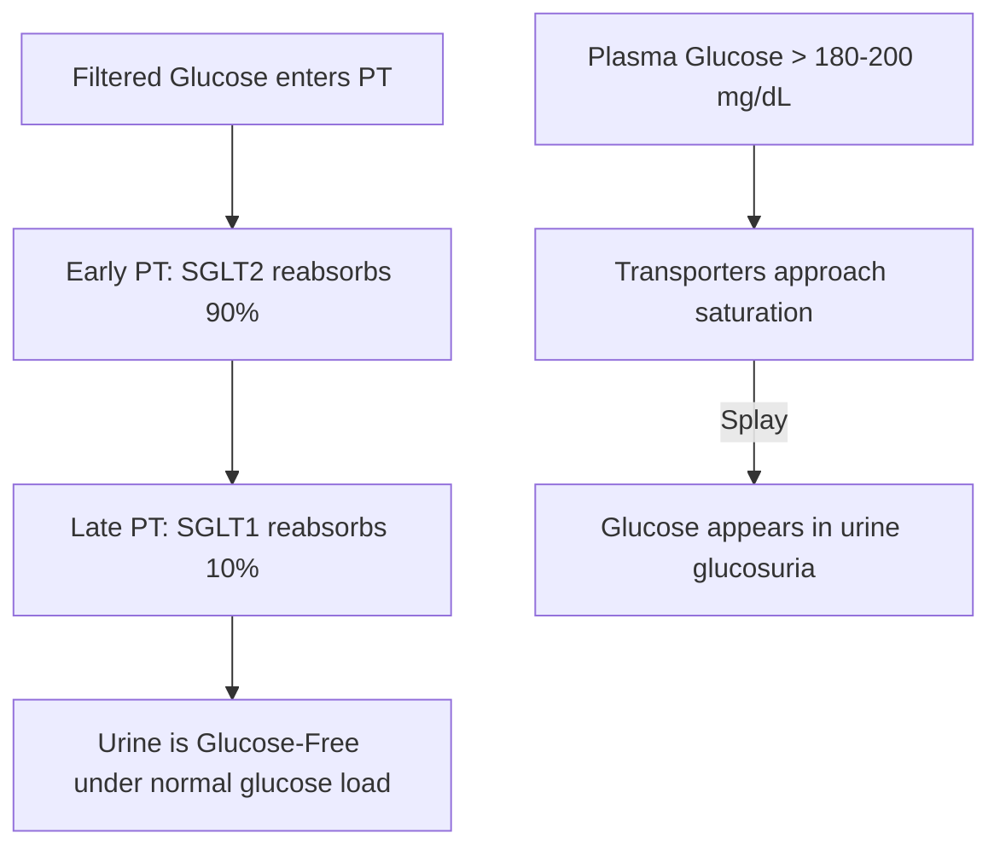

# Renal Tubular Reabsorption

### 1. Introduction
This chapter covers the physiological processes of renal tubular reabsorption, focusing on the transport kinetics of glucose (SGLT1 and SGLT2), the transport maximum ($T_m$), the concept of "splay," and the transport mechanisms in the thick ascending limb of the loop of Henle.

### 2. Daily Life Analogy
Imagine the kidney's nephron as a factory conveyor belt. The glomerulus is a sorting bin that dumps almost all parts (water, salts, glucose) onto the belt.
The proximal tubule cells are workers standing along the belt who must pick up valuable items (glucose) and return them to the warehouse (blood).
- **SGLT2** is a fast, high-capacity worker standing at the beginning of the belt who grabs $90\%$ of the glucose quickly but drops some.
- **SGLT1** is a high-affinity worker standing further down the belt who picks up the remaining $10\%$ of the glucose.
If the sorting bin dumps too much glucose (as in diabetes), the workers are overwhelmed (transporters saturate). Some glucose slips past and ends up in the waste bin (urine).

### 3. Basic Concept
Glomerular filtration is non-selective for small molecules. Therefore, the renal tubules must reabsorb essential solutes (glucose, amino acids, bicarbonate, water) to prevent their loss.
- **Reabsorption**: Transport of substances from the tubule lumen across the epithelial cells into the peritubular capillaries.
- **Secretions**: Transport from peritubular capillaries into the tubule lumen.
- **Transport Maximum ($T_m$)**: The maximum rate of solute transport by carrier proteins due to saturation.

### 4. Anatomy Review
- **Proximal Convoluted Tubule (S1/S2 segments)**: Location of SGLT2 (sodium-glucose cotransporter 2).
- **Proximal Straight Tubule (S3 segment)**: Location of SGLT1 (sodium-glucose cotransporter 1).
- **Thick Ascending Limb (TAL)**: Expresses the NKCC2 cotransporter and ROMK channels.
- **Peritubular Capillaries**: Low hydrostatic pressure and high oncotic pressure facilitate bulk flow of reabsorbed fluid.

### 5. Physiology
#### Glucose Reabsorption Kinetics
Glucose is completely reabsorbed in the proximal tubule via secondary active transport.
- **Apical Entry**: Driven by the sodium gradient created by the basolateral $\text{Na}^+/\text{K}^+$-ATPase.
  - *SGLT2*: Low affinity, high capacity. Reabsorbs $90\%$ of filtered glucose in early proximal tubule (S1/S2). Moves $1\text{ Na}^+$ with $1\text{ Glucose}$.
  - *SGLT1*: High affinity, low capacity. Reabsorbs $10\%$ of filtered glucose in late proximal tubule (S3). Moves $2\text{ Na}^+$ with $1\text{ Glucose}$.
- **Basolateral Exit**: Passive facilitated diffusion via **GLUT2** (early) and **GLUT1** (late) transporters into the blood.

### 6. Mechanism
#### A. Transport Maximum ($T_m$) and Splay
- The $T_m$ for glucose in a healthy adult is $\approx 375\text{ mg/min}$ (men) and $\approx 300\text{ mg/min}$ (women).
- **Threshold**: The plasma glucose concentration at which glucose first appears in the urine ($\approx 180 - 200\text{ mg/dL}$).
- **Splay**: The difference between the theoretical threshold (calculated from $T_m$) and the actual clinical threshold. It is caused by:
  1. *Nephron Heterogeneity*: Variations in size, GFR, and transporter numbers among individual nephrons.
  2. *Low Affinity*: Transporter binding kinetics mean some glucose escapes binding as saturation is approached.

#### B. Transport in the Thick Ascending Limb (TAL)
- **NKCC2**: Active cotransporter that moves $1\text{ Na}^+$, $1\text{ K}^+$, and $2\text{ Cl}^-$ into the cell.
- **ROMK**: Apical potassium channel that recycles potassium back into the lumen. This creates a **lumen-positive transepithelial potential ($+10 \text{ to } +20\text{ mV}$)**, driving the paracellular reabsorption of $\text{Ca}^{2+}$ and $\text{Mg}^{2+}$.

### 7. Animation Summary
An animation shows the secondary active transport of glucose in S1 cells, showing how the basolateral sodium-potassium pump drives the cotransport of sodium and glucose at the apical membrane.

### 8. 3D Model Guide
An interactive 3D model allows the user to click on the TAL cells, highlighting the NKCC2 cotransporter and ROMK channels, and trace the path of paracellular calcium movement.

### 9. Flowchart

### 10. Clinical Correlation
- **SGLT2 Inhibitors (e.g. Canagliflozin, Empagliflozin)**: Used in type 2 diabetes. By blocking SGLT2, they lower the threshold for glucose excretion, inducing glucosuria and reducing blood glucose levels.
- **Loop Diuretics (e.g. Furosemide)**: Block NKCC2, abolishing the medullary gradient and potassium recycling, leading to loss of calcium and magnesium.

### 11. Disorders
- **Renal Glucosuria**: A benign condition due to mutations in SGLT2, causing glucose excretion in urine despite normal blood glucose levels.
- **Bartter Syndrome**: Autosomal recessive mutation in NKCC2, ROMK, or basolateral chloride channels (ClC-Kb), mimicking chronic loop diuretic use (wasting of salt, calcium, potassium).

### 12. Summary
- All filtered glucose is reabsorbed in the proximal tubule via SGLT2 ($90\%$) and SGLT1 ($10\%$) transporters.
- When filtered load exceeds the transport maximum ($T_m$), glucose is excreted in the urine.
- The TAL uses NKCC2 to drive the countercurrent multiplier and ROMK to generate a lumen-positive potential.

### 13. Important Formulas
1. **Filtered Load ($FL$)**:
   $$ FL_g = \text{GFR} \times P_g $$
2. **Excretion Rate ($E$)**:
   $$ E_g = U_g \times V $$
3. **Reabsorption Rate ($R$)**:
   $$ R_g = FL_g - E_g $$
   *(At saturation, $R_g = T_m$)*

### 14. Mnemonics
- **SGLT2** is **2** early:
  - Reabsorbs glucose in the early segments of the proximal tubule.
- **SGLT1** is **1** late:
  - Reabsorbs the remaining glucose in the late proximal tubule.

### 15. Viva Questions
1. **What causes 'splay' in the renal glucose titration curve?**
   *Answer:* Splay is the rounding of the glucose excretion curve before reaching the transport maximum ($T_m$). It is caused by: (1) heterogeneity of individual nephrons (some have fewer transporters and saturate earlier), and (2) the low affinity of the transporters, which means some glucose fails to bind and escape reabsorption as saturation is approached.
2. **Why does blocking ROMK cause hypomagnesemia?**
   *Answer:* ROMK recycles potassium back into the TAL lumen, generating a lumen-positive charge of $+10$ to $+20\text{ mV}$. This charge repels and drives the paracellular reabsorption of magnesium and calcium. Blocking ROMK abolishes this charge, preventing magnesium reabsorption and causing hypomagnesemia.

### 16. MCQs
1. SGLT2 cotransporters are responsible for what percentage of glucose reabsorption in the healthy kidney?
   - A) 10%
   - B) 50%
   - C) 90%
   - D) 100%
   - *Answer:* C
2. In which nephron segment does paracellular calcium reabsorption depend directly on the lumen-positive potential generated by potassium recycling?
   - A) Proximal convoluted tubule
   - B) Thick ascending limb of the loop of Henle
   - C) Distal convoluted tubule
   - D) Cortical collecting duct
   - *Answer:* B
3. What is the transport maximum ($T_m$) of glucose in healthy men?
   - A) 180 mg/min
   - B) 375 mg/min
   - C) 100 mg/min
   - D) 500 mg/min
   - *Answer:* B

### 17. Case-Based Learning
**Clinical Case:**
A 55-year-old male with a history of poorly controlled Type 2 Diabetes Mellitus undergoes a renal clearance study. 
- **Inulin Clearance (GFR):** $120\text{ mL/min}$
- **Plasma Glucose ($P_g$):** $400\text{ mg/dL}$ ($4.0\text{ mg/mL}$)
- **Urine Flow Rate ($V$):** $2.0\text{ mL/min}$
- **Urine Glucose ($U_g$):** $52.5\text{ mg/mL}$

**Physiological Analysis:**
1. **Filtered Load**: $FL_g = 120 \times 4.0 = 480\text{ mg/min}$.
2. **Excretion Rate**: $E_g = 52.5 \times 2.0 = 105\text{ mg/min}$.
3. **Reabsorption Rate**: $R_g = 480 - 105 = 375\text{ mg/min}$.
4. **Interpretation**: Since plasma glucose ($400\text{ mg/dL}$) is well above the threshold, the transporters are saturated. The calculated reabsorption rate ($375\text{ mg/min}$) represents the patient's Transport Maximum ($T_m$).

### 18. Flashcards
- **Front**: Which glucose cotransporter operates at the early proximal tubule (S1/S2 segments)?
  **Back**: SGLT2.
- **Front**: What is the normal glucose renal threshold concentration?
  **Back**: $\approx 180 - 200\text{ mg/dL}$.

### 19. Revision Notes
- Glucose is completely reabsorbed in healthy adults; glucosuria indicates plasma levels above the renal threshold.
- Loop diuretics target the NKCC2 cotransporter.

### 20. Practice Quiz
1. Which transporter moves glucose from the intracellular space of proximal tubule cells across the basolateral membrane into the interstitial fluid?
   - A) SGLT2
   - B) SGLT1
   - C) GLUT2
   - D) Na+/K+ ATPase
   - *Answer:* C
2. What is the effect of an SGLT2 inhibitor on glucose reabsorption?
   - A) Increases GFR
   - B) Lowers the renal threshold for glucose, causing glucosuria
   - C) Completely stops all renal glucose transport
   - D) Promotes gluconeogenesis
   - *Answer:* B
