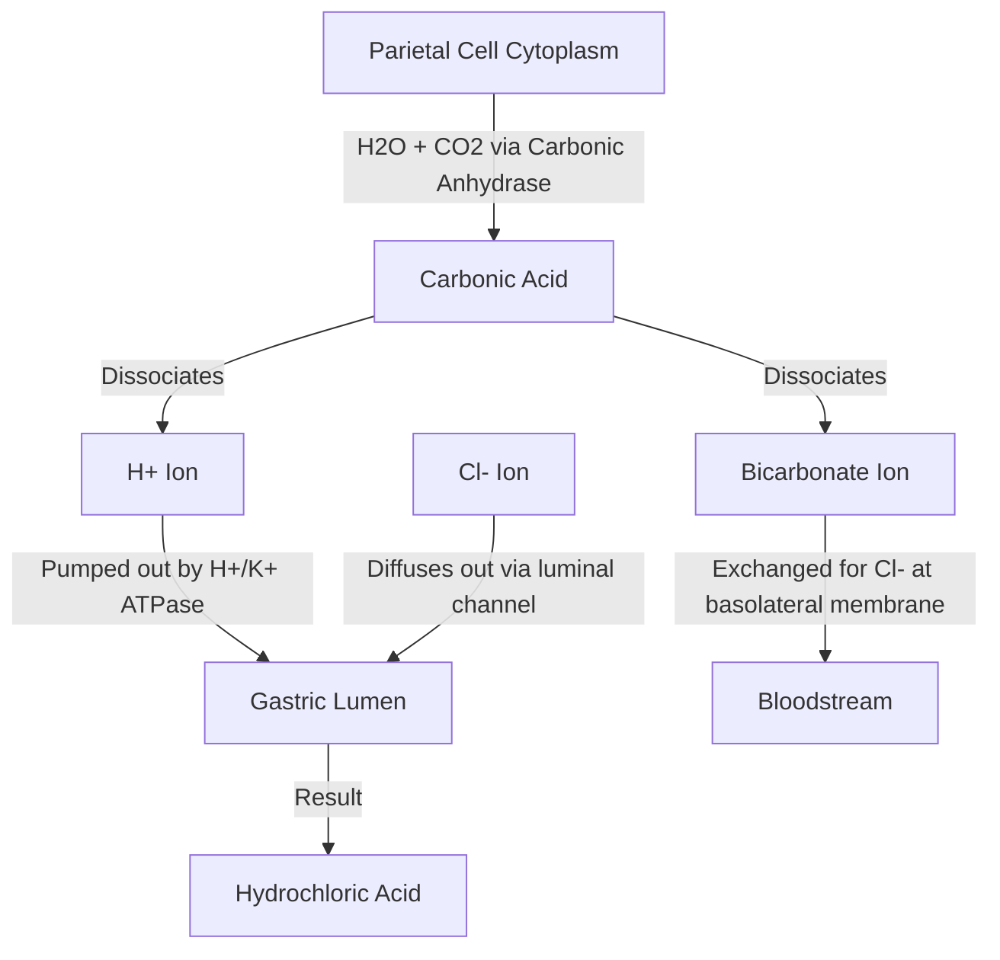
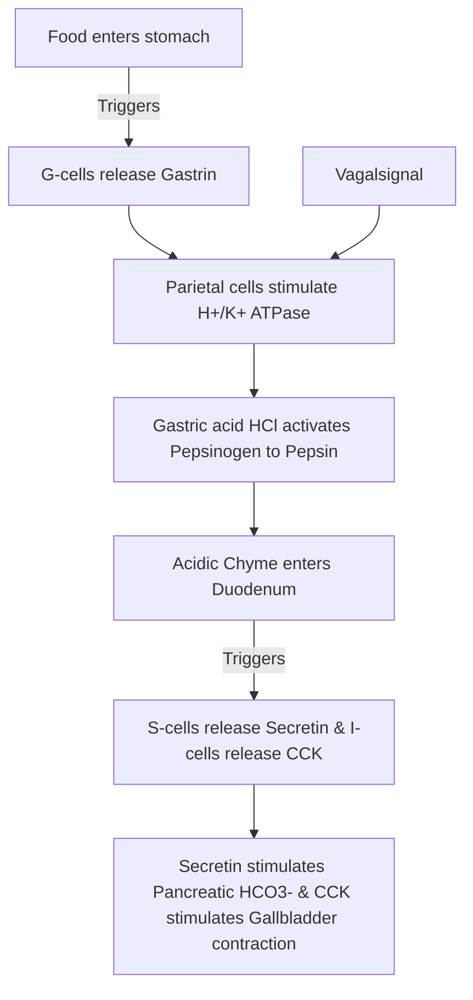

# Section 7: Gastrointestinal Physiology

## Chapter 8: GI Motility, Secretions, & Nutrient Absorption

---

### 1. Introduction
The gastrointestinal (GI) tract provides the body with a constant supply of water, electrolytes, and nutrients. To achieve this, food must be moved through the tract, mixed with digestive secretions to break it down, and absorbed into the bloodstream.

### 2. Daily Life Analogy
Imagine an automated recycling processing factory. Incoming raw waste (food) is placed on a crushing conveyor belt (chewing). It enters a large acid bath chamber that churns the waste and melts it into liquid slurry (stomach acid and peristalsis). The slurry is then passed down a narrow pipeline where specialized nozzles spray chemical disintegrators (pancreatic enzymes and bile) to dissolve plastics, papers, and metals. The pipe's walls have tiny suction pores that pull the dissolved molecules out into storage tanks (absorption in the small intestine villi). The remaining dry debris is compressed and boxed for disposal (large intestine compaction and defecation).

### 3. Basic Concept
- **Enteric Nervous System (ENS)**: The "second brain" of the body, located entirely within the gut wall. It operates independently of the CNS, though it is modulated by autonomic inputs.
  - *Myenteric (Auerbach's) Plexus*: Located between the circular and longitudinal muscle layers. Controls gastrointestinal **motility**.
  - *Submucosal (Meissner's) Plexus*: Located in the submucosa. Controls gut **secretion** and local blood flow.
- **Peristalsis**: An inherent property of syncytial smooth muscle. A contractile ring appears behind the bolus, while the muscle ahead relaxes, propelling the bolus forward.

```text
    Gut Wall Layer:
    Serosa -> Longitudinal Muscle -> [ Myenteric Plexus ] -> Circular Muscle -> [ Submucosal Plexus ] -> Submucosa -> Mucosa
```

### 4. Anatomy Review
- **Intestinal Villi**: Finger-like projections in the small intestine mucosa that increase surface area for absorption. Each villus contains a capillary network and a central lymphatic vessel called a **Lacteal** (which absorbs fats).
- **Microvilli (Brush Border)**: Sub-microscopic folds on enterocyte membranes containing digestive enzymes (peptidases, disaccharidases).

### 5. Physiology
- **Gastrointestinal Secretions**:
  * *Stomach*: **Parietal cells** secrete Hydrochloric Acid (HCl) and Intrinsic Factor (needed for Vitamin B12 absorption). **Chief cells** secrete Pepsinogen (inactive protease activated by acid).
  * *Pancreas*: Secretes bicarbonate to neutralize stomach acid, and major digestive enzymes (Amylase, Lipase, Trypsinogen).
- **Nutrient Absorption**:
  * *Carbohydrates*: Absorbed as monosaccharides. Glucose and galactose enter enterocytes via **SGLT1** (secondary active sodium co-transport); fructose enters via **GLUT5** (facilitated diffusion). All exit the basolateral membrane via **GLUT2**.
  * *Proteins*: Absorbed as amino acids and di/tripeptides via sodium- or hydrogen-coupled active transport.
  * *Fats*: Emulsified by bile salts into **Micelles**. Micelles diffuse into enterocytes, where fatty acids are re-esterified into triglycerides, packaged into **Chylomicroes**, and exported into lacteals.

---

### 6. Mechanism

#### Hydrochloric Acid (HCl) Secretion by Parietal Cells
Parietal cells secrete \(H^+\) ions into the gastric lumen against a 3-million-fold concentration gradient using primary active transport:



---

### 7. Animation Summary
*Visualization focuses on:* The secondary active co-transport of glucose (SGLT1) showing sodium and glucose entering the brush border membrane of an enterocyte together.

### 8. 3D Model Guide
*Interactive viewer targets:* Intestinal villi. Hovering over a villus exposes the microvilli brush border, blood capillaries, and central lymphatic lacteal.

### 9. Flowchart



### 10. Clinical Correlation
- **Peptic Ulcer Disease (PUD)**: Destruction of gastric or duodenal mucosa, commonly caused by *Helicobacter pylori* infection or NSAIDs (which inhibit prostaglandins needed to synthesize the protective mucosal bicarbonate barrier).
- **Celiac Disease (Gluten-sensitive Enteropathy)**: Immune-mediated destruction of small intestinal villi (villous atrophy) upon gluten ingestion, causing malabsorption, steatorrhea, and weight loss.

### 11. Disorders
- **Pernicious Anemia**: Autoimmune destruction of gastric parietal cells leads to loss of Intrinsic Factor. Vitamin B12 cannot be absorbed in the terminal ileum, causing macrocytic megaloblastic anemia.
- **Steatorrhea**: Excess fat in stools, indicating malabsorption due to pancreatic insufficiency (lack of lipase) or biliary obstruction (lack of bile salts to form micelles).

### 12. Summary
- The ENS consists of Auerbach's (motility) and Meissner's (secretion) plexuses.
- Parietal cells use the proton pump (H+/K+ ATPase) to secrete stomach acid.
- Monosaccharides and amino acids are absorbed via sodium-coupled secondary active transport. Fats require micelle emulsification and enter lymphatic lacteals as chylomicrons.

### 13. Important Formulas
- **Daily Fluid Balance in the GI Tract**:
  \[\text{Input (Diet } 2\text{L} + \text{Secretions } 7\text{L}) = \text{Total } 9\text{L}. \text{ Excreted in stool: only } 100\text{ mL } (99\% \text{ reabsorbed}).\]

### 14. Mnemonics
- **I-S-G Cells**:
  * **I**-cells secrete **C**CK (Gallbladder/Pancreas enzyme activator).
  * **S**-cells secrete **S**ecretin (Bicarbonate/Pancreas fluid activator).
  * **G**-cells secrete **G**astrin (Stomach acid trigger).

### 15. Viva Questions
1. **Explain the mechanism of Action of Proton Pump Inhibitors (like Omeprazole).**
   * *Answer*: Proton Pump Inhibitors (PPIs) bind covalently and irreversibly to the \(H^+\)-\(K^+\) ATPase pump (proton pump) on the apical membrane of parietal cells, blocking hydrogen secretion and reducing stomach acid.
2. **Where and how is Vitamin B12 absorbed?**
   * *Answer*: Vitamin B12 binds to Intrinsic Factor (secreted by gastric parietal cells) in the duodenum. The B12-Intrinsic Factor complex travels to the terminal ileum, where it binds to specific receptors on enterocytes and is absorbed by endocytosis.

### 16. MCQs
1. Which of the following enzymes is responsible for activating pancreatic trypsinogen in the duodenum?
   * A) Pepsin
   * B) Enteropeptidase (Enterokinase)
   * C) Amylase
   * D) Chymotrypsin
   * *Answer*: B

2. Which transporter is responsible for the absorption of fructose across the apical membrane of enterocytes?
   * A) SGLT1
   * B) GLUT2
   * C) GLUT4
   * D) GLUT5
   * *Answer*: D *(GLUT2 handles basolateral exit, while SGLT1 handles glucose/galactose apical entry).*

### 17. Case-Based Learning
**Case**: A 34-year-old female presents with chronic watery diarrhea, bloating, and foul-smelling stools that float (steatorrhea). Lab tests reveal an IgA anti-tissue transglutaminase (tTG) antibody. A duodenal biopsy shows blunting of intestinal villi and crypt hyperplasia.
- **Question**: What is the diagnosis, and how does this pathology affect the absorption of carbohydrates and fats?
- **Analysis**: The patient has Celiac Disease. Gluten ingestion causes immune-mediated destruction of intestinal villi. The loss of mucosal surface area and brush-border enzymes leads to malabsorption. Carbohydrates cannot be digested or co-transported via SGLT1, and fat emulsification/absorption fails due to enterocyte damage, resulting in osmotic diarrhea and steatorrhea.

### 18. Flashcards
- **Front**: Which plexus controls gastrointestinal motility?
  **Back**: The Myenteric (Auerbach's) Plexus.
- **Front**: What is the role of bile salts in digestion?
  **Back**: They emulsify large fat globules into tiny micelles, increasing the surface area for pancreatic lipase action.

### 19. Revision Notes
Downloadable tables comparing stomach acid secretion triggers (Acetylcholine, Gastrin, Histamine) and inhibitors (Somatostatin, Prostaglandins).

### 20. Practice Quiz
Timed 10-question set matching gut hormones to their target structures and identifying diagnostic features of GI absorption failures.
