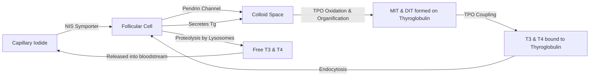
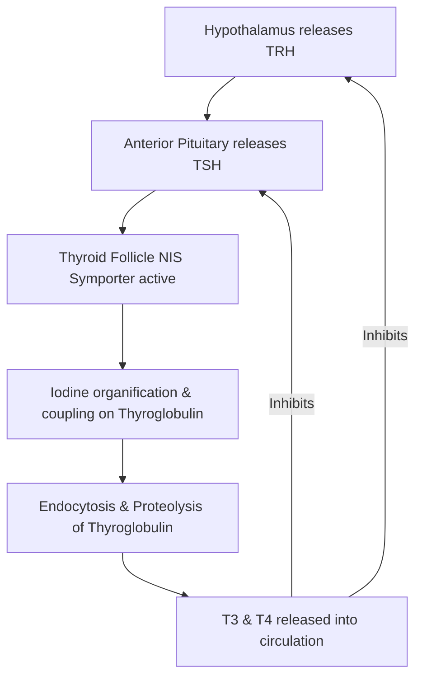

# Section 8: Endocrine Physiology

## Chapter 9: Endocrine Regulators & Thyroid Hormone Synthesis

---

### 1. Introduction
The endocrine system coordinates the body's metabolic functions, growth, and reproduction using chemical messengers called **Hormones**. Unlike neurotransmitters, hormones are released directly into the bloodstream to act on distant target cells containing specific receptors.

### 2. Daily Life Analogy
Imagine a massive global corporation. The CEO (Hypothalamus) monitors the company's metrics. To execute commands, the CEO sends emails to the General Manager (Pituitary gland). The General Manager then calls regional branch managers (target glands like the Thyroid or Adrenals) to instruct them to manufacture specific products (Thyroid hormones, Cortisol). Once the market is saturated with products, the CEO and General Manager detect this excess inventory and stop sending commands (Negative feedback loops).
The endocrine system works exactly like this corporate hierarchy.

### 3. Basic Concept
- **Hormone Classifications**:
  1. *Peptides & Proteins*: Hydrophilic, synthesized in rough ER, stored in vesicles, bind to cell-surface receptors (e.g., Insulin, Growth Hormone).
  2. *Steroids*: Lipophilic, derived from cholesterol, synthesized on demand, bind to intracellular receptors (e.g., Cortisol, Aldosterone, Estrogen).
  3. *Amine Derivatives*: Derived from tyrosine (e.g., Thyroid hormones, Epinephrine).
- **Hypothalamic-Pituitary Axis**: The master command center. The hypothalamus releases releasing hormones (e.g., TRH, CRH) that stimulate the anterior pituitary to secrete tropic hormones (e.g., TSH, ACTH), which stimulate target glands.

```text
Hypothalamic-Pituitary Axis:
Hypothalamus (TRH) -> Anterior Pituitary (TSH) -> Thyroid Gland (T3, T4)
      ^                                                |
      |________________ Negative Feedback ______________|
```

### 4. Anatomy Review
- **Thyroid Follicle**: The functional unit of the thyroid gland. A spherical structure lined by follicular epithelial cells, containing a central fluid called **Colloid** (rich in **Thyroglobulin**, a large glycoprotein precursor).
- **Parafollicular (C) Cells**: Located between follicles, secreting Calcitonin (lowers blood calcium).

### 5. Physiology
Thyroid Hormone Synthesis and Regulation:
- **Iodine Trapping**: Follicular cells actively pump iodide (\(I^-\)) from blood into cytoplasm using the **Sodium-Iodide Symporter (NIS)**.
- **Thyroglobulin (Tg) Synthesis**: Follicular cells synthesize Tg and secrete it into the colloid.
- **Organification**: Thyroid Peroxidase (TPO) oxidizes iodide to iodine (\(I^0\)) and attaches it to tyrosine residues on thyroglobulin, forming Monoiodotyrosine (MIT) and Diiodotyrosine (DIT).
- **Coupling**: TPO couples MIT and DIT:
  * \(DIT + DIT \rightarrow\) **Thyroxine ($T_4$)** (93% of thyroid secretion).
  * \(MIT + DIT \rightarrow\) **Triiodothyronine ($T_3$)** (7% of secretion, but 4 times more active than $T_4$).

---

### 6. Mechanism

#### Thyroid Hormone Synthesis Pathway
The synthesis and release of thyroid hormone is a multi-step sequence spanning the blood, cell, and colloid compartments:



---

### 7. Animation Summary
*Visualization focuses on:* The G-protein coupled receptor (GPCR) cascade. TSH binding to follicular cells activates adenylyl cyclase, raising cAMP to trigger thyroglobulin endocytosis and release of free T3/T4.

### 8. 3D Model Guide
*Interactive viewer targets:* The Thyroid Gland and single Thyroid Follicle. Exploding the follicle shows the NIS symporter on the basal membrane and the TPO enzyme on the apical microvilli membrane.

### 9. Flowchart



### 10. Clinical Correlation
- **Grave's Disease (Hyperthyroidism)**: Autoimmune disease where antibodies (Thyroid-Stimulating Immunoglobulins, TSI) mimic TSH and continuously activate follicular cells. This causes hyperthyroidism, goiter, and exophthalmos (protruding eyes), while lowering endogenous TSH due to negative feedback.
- **Hashimoto's Thyroiditis (Hypothyroidism)**: Autoimmune destruction of thyroid follicular cells or TPO enzymes. Leads to hypothyroidism, goiter, fatigue, weight gain, cold intolerance, and high TSH levels.

### 11. Disorders
- **Cushing's Syndrome**: Caused by excess cortisol (adrenal hypertrophy or pituitary tumor secreting ACTH), yielding a moon face, buffalo hump, hyperglycemia, and hypertension.
- **Addison's Disease**: Autoimmune destruction of the adrenal cortex, causing deficiency of aldosterone and cortisol, leading to hyponatremia, hyperkalemia, hypotension, and skin hyperpigmentation (due to elevated ACTH cross-reacting with melanocytes).

### 12. Summary
- Peptides bind cell-surface receptors; steroids and thyroid hormones bind intracellular receptors.
- Thyroid hormone synthesis requires active iodide trapping (NIS), organification, and coupling on thyroglobulin by Thyroid Peroxidase (TPO).
- \(T_3\) is the active hormone; \(T_4\) is secreted in larger quantities and converted to \(T_3\) in peripheral tissues.
- Endocrine control relies on negative feedback loops along the hypothalamic-pituitary axis.

### 13. Important Formulas
- **Free Hormone Concentration**:
  \[[\text{Free Hormone}] = \frac{[\text{Total Hormone}]}{[\text{Binding Proteins}]}\] (Only free hormones are biologically active and mediate feedback).

### 14. Mnemonics
- **TPO does it all**:
  * **T**hyroid **P**eroxidase mediates **O**xidation, **O**rganification, and **C**oupling.

### 15. Viva Questions
1. **Explain why thyroid hormone, an amine derivative, binds to intracellular nuclear receptors rather than cell-surface receptors.**
   * *Answer*: Although derived from tyrosine, thyroid hormones are highly lipophilic. They easily cross cell membranes via carrier-mediated transport and bind to nuclear receptors, altering gene transcription directly, similar to steroid hormones.
2. **What is the wolf-chaikoff effect?**
   * *Answer*: The Wolff-Chaikoff effect is a temporary reduction in thyroid hormone synthesis caused by the ingestion of a large amount of iodine. High iodide concentrations transiently inhibit Thyroid Peroxidase (TPO) activity to prevent hyperthyroidism.

### 16. MCQs
1. Which of the following enzymes is responsible for coupling Monoiodotyrosine (MIT) and Diiodotyrosine (DIT) during thyroid hormone synthesis?
   * A) Lysosomal protease
   * B) Thyroid Peroxidase
   * C) Deiodinase
   * D) Sodium-Iodide Symporter
   * *Answer*: B

2. A patient presents with anxiety, weight loss, heat intolerance, a goiter, and a TSH level of <0.01 uIU/mL. What is the most likely diagnosis?
   * A) Hashimoto's Thyroiditis
   * B) Secondary Hypothyroidism
   * C) Grave's Disease
   * D) Iodine Deficiency
   * *Answer*: C *(Low TSH combined with hyperthyroid symptoms indicates primary hyperthyroidism, commonly Grave's disease, where TSI antibodies stimulate the gland and suppress TSH release).*

### 17. Case-Based Learning
**Case**: A 42-year-old female presents with fatigue, 10-lb weight gain, dry skin, and muscle weakness. Laboratory results: Free T4: 0.5 ng/dL (Low), TSH: 24 uIU/mL (High). Antithyroid peroxidase (anti-TPO) antibodies are elevated.
- **Question**: Diagnose the condition and explain why the TSH is elevated.
- **Analysis**: The patient has Primary Hypothyroidism secondary to Hashimoto's Thyroiditis. Autoimmune destruction of TPO prevents iodine organification and coupling, dropping T3/T4 synthesis. The lack of circulating T3/T4 removes negative feedback on the hypothalamus and anterior pituitary, causing TRH and TSH secretion to rise significantly.

### 18. Flashcards
- **Front**: Which carrier protein transports the majority of thyroid hormones in the blood?
  **Back**: Thyroxine-Binding Globulin (TBG).
- **Front**: What does ACTH stimulate the adrenal cortex to produce?
  **Back**: Cortisol (from the zona fasciculata) and adrenal androgens (from the zona reticularis).

### 19. Revision Notes
Downloadable charts showing hormone class properties, receptor locations, and intracellular secondary messenger pathways (cAMP, IP3/DAG).

### 20. Practice Quiz
Timed 15-question test on feedback kinetics, adrenal hormone synthesis pathways, and endocrine emergency cases.
