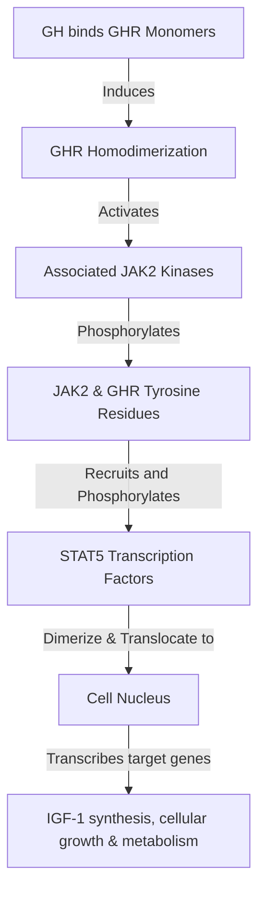
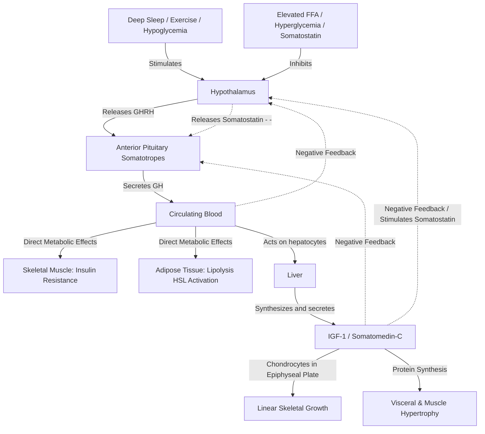

# Growth Hormone

### 1. Introduction
Growth Hormone ($GH$), also known as somatotropin, is a peptide hormone synthesized, stored, and secreted by the somatotrope cells within the anterior pituitary gland. It plays a dual role in human physiology: it is the primary driver of postnatal linear growth and skeletal development during childhood and adolescence, and it serves as a major regulator of protein, lipid, and carbohydrate metabolism throughout life. The effects of growth hormone are mediated both directly through its interaction with target tissue receptors and indirectly via the induction of **Insulin-like Growth Factor 1 (IGF-1)**, primarily synthesized in the liver.

### 2. Daily Life Analogy
Imagine Growth Hormone as the general contractor of a major body construction project. 
* To build the structure (bone and muscle growth), the contractor does not lay the bricks directly. Instead, he sends out sub-contractors and blueprints—**IGF-1**—to stimulate local site workers (chondrocytes in the growth plates) to multiply and lay down new bone matrix.
* To fund and power this massive construction project, the contractor reorganizes the building site's energy supply. He orders the site to burn alternative fuel (mobilizes fat/lipolysis) to spare valuable building materials (proteins/amino acids) and energy sources (spares glucose for the brain and glucose-dependent tissues).

### 3. Basic Concept
* **Somatotropin (GH)**: A $191$-amino-acid, single-chain polypeptide containing two internal disulfide bridges. It is secreted in a highly pulsatile manner by acidophilic somatotropes in the anterior pituitary.
* **Somatomedin-C (IGF-1)**: A peptide structurally homologous to proinsulin. It is secreted by hepatocytes in response to GH binding. While GH levels fluctuate wildly throughout the day, IGF-1 has a long half-life and remains stable, serving as the clinical surrogate for overall GH activity.
* **Dual Action Pathway**:
  * **Direct Effects**: Primarily metabolic. GH binds to receptors on adipocytes (promoting lipolysis) and hepatocytes (stimulating gluconeogenesis and glycogenolysis).
  * **Indirect Effects**: Primarily growth-promoting. Mediated by circulating or locally produced IGF-1 acting on skeletal tissue (chondrocytes) and skeletal muscle.

### 4. Anatomy Review
* **Anterior Pituitary Somatotropes**: Acidophilic cells constituting $\approx 50\%$ of the cells in the anterior pituitary (adenohypophysis).
* **Hypothalamic-Hypophyseal Portal System**: Hypothalamic regulatory hormones travel down the portal veins to act on somatotropes:
  * **GHRH (Growth Hormone-Releasing Hormone)**: A $44$-amino-acid peptide secreted by neurons of the arcuate nucleus. Stimulates GH synthesis and release.
  * **Somatostatin (GHIH - Growth Hormone-Inhibiting Hormone)**: A $14$-amino-acid peptide secreted by neurons of the periventricular nucleus. Inhibits GH secretion.
* **Epiphyseal Plate**: The site of longitudinal bone growth. Located at the metaphysis of long bones, it contains zones of resting, proliferating, hypertrophic, and calcifying chondrocytes.

### 5. Physiology
#### A. Regulation of Secretion
GH secretion is pulsatile, characterized by several peaks throughout a $24$-hour period, with the largest burst occurring during **slow-wave (deep) sleep** (NREM Stages 3 and 4).

```
                      ┌──────────────────────────┐
                      │       HYPOTHALAMUS       │
                      └────────┬───────────▲─────┘
                               │           │
                       GHRH (+)│           │(-) Somatostatin / IGF-1
                               ▼           │
                      ┌────────────────────┴─────┐
                      │    ANTERIOR PITUITARY    │
                      └────────┬─────────────────┘
                               │
                         GH (+)│
                               ▼
                      ┌────────┴─────────────────┐
                      │          LIVER           │
                      └────────┬─────────────────┘
                               │
                       IGF-1 (+)
                               ▼
                      ┌────────┴─────────────────┐
                      │    SKELETAL / TISSUES    │
                      └──────────────────────────┘
```

* **Stimulatory Factors**:
  1. **Sleep**: Slow-wave sleep onset.
  2. **Hypoglycemia / Fasting**: Triggers GH release to raise blood glucose (counter-regulatory hormone).
  3. **Exercise / Stress**: Neuroendocrine activation.
  4. **Amino Acids**: High circulating levels (especially arginine) stimulate GH release to promote protein synthesis.
  5. **Ghrelin**: "Hunger hormone" secreted by the stomach, binds to somatotropes to stimulate GH release.
* **Inhibitory Factors**:
  1. **Hyperglycemia**: High blood glucose suppresses GH release.
  2. **Elevated Free Fatty Acids**: High lipid levels signal energy abundance.
  3. **Somatostatin**: Hypothalamic inhibitor.
  4. **Negative Feedback**: Circulating GH and IGF-1 directly inhibit somatotropes and GHRH neurons, while stimulating somatostatin release.
  5. **Obesity / Senescence**: Age and excess adipose tissue blunt the GH secretory response.

#### B. Metabolic Actions
Growth hormone is an anabolic, diabetogenic, and lipolytic hormone:
* **Protein Metabolism (Anabolic)**: GH increases amino acid transport across cell membranes, stimulates ribosomal translation, and increases transcription of DNA to RNA. It decreases urea excretion, promoting a **positive nitrogen balance** and increasing muscle mass.
* **Lipid Metabolism (Lipolytic)**: GH stimulates **Hormone-Sensitive Lipase (HSL)** in adipose tissue, converting triglycerides into free fatty acids ($FFAs$) and glycerol. This shifts tissues toward using fat as their primary energy source.
* **Carbohydrate Metabolism (Diabetogenic / Anti-Insulin)**: 
  * Decreases glucose uptake and utilization in skeletal muscle and adipose tissue (insulin resistance).
  * Increases hepatic gluconeogenesis and glucose output.
  * *Net Effect*: Raises blood glucose. Chronic GH excess leads to compensatory hyperinsulinemia and can precipitate "pituitary diabetes."

### 6. Mechanism
#### A. The GH Receptor and the JAK2/STAT5 Pathway
The Growth Hormone Receptor ($GHR$) is a member of the class I cytokine/prolactin receptor family. It does not possess intrinsic tyrosine kinase activity but associates with cytoplasmic kinases.
1. **Ligand Binding**: One molecule of GH binds to two GHR monomers, causing **receptor homodimerization**.
2. **Kinase Activation**: Dimerization induces a conformational change that activates associated **Janus Kinase 2 (JAK2)**.
3. **Phosphorylation**: Activated JAK2 autophosphorylates and phosphorylates tyrosine residues on the cytoplasmic domain of the GHR.
4. **STAT Recruitment and Activation**: **STAT5** (Signal Transducer and Activator of Transcription 5) proteins bind to the phosphorylated tyrosine residues on the GHR. JAK2 then phosphorylates the STAT5 proteins.
5. **Nuclear Translocation**: Phosphorylated STAT5 molecules dissociate from the receptor, form homodimers, and translocate to the nucleus. They bind to specific promoter elements to activate the transcription of target genes, including **IGF-1**.



#### B. IGF-1 Receptor Signaling
IGF-1 binds to the **IGF-1 Receptor (IGF-1R)**, which is a transmembrane receptor tyrosine kinase structurally related to the insulin receptor.
* **Activation**: Binding causes autophosphorylation of the $\beta$-subunits.
* **Downstream Signaling**: Activates the **MAPK pathway** (stimulating cell proliferation and division) and the **PI3K/Akt pathway** (promoting cell survival, protein synthesis, and hypertrophy).

### 7. Animation Summary
An animation traces the hypothalamic-pituitary-somatic axis:
1. **Hypothalamus**: Arcuate nucleus neurons release GHRH in rhythmic bursts into the hypophyseal portal system.
2. **Pituitary**: GHRH binds to Gs-coupled receptors on somatotropes, increasing cAMP and calcium, which triggers the exocytosis of GH-containing vesicles.
3. **Liver**: Circulating GH binds to hepatocyte receptors, activating the JAK2/STAT5 pathway. The cell nucleus begins transcribing and releasing IGF-1.
4. **Epiphyseal Plate**: IGF-1 binds to chondrocytes in the proliferative zone of the growth plate, triggering cell division and extracellular matrix production, which elongates the bone.

### 8. 3D Model Guide
An interactive 3D model visualizes:
* **The Pituitary Adenoma**: An enlarged anterior pituitary containing a somatotrope tumor compressing the optic chiasm (explaining bitemporal hemianopsia).
* **The Epiphyseal Growth Plate**: Toggling between "Pre-puberty" and "Adult" modes shows how linear bone growth ceases once the growth plates fuse.
* **Acromegalic Bone Changes**: Highlights the periosteal overgrowth in adult bones, demonstrating how GH/IGF-1 excess causes bone thickening in the jaw (prognathism), brow ridge, hands, and feet after epiphyseal fusion.

### 9. Flowchart



### 10. Clinical Correlation
#### A. Diagnosis of GH Excess (Acromegaly / Gigantism)
1. **IGF-1 Screening**: Because GH secretion is highly pulsatile, a random GH measurement is clinically useless (a single low value does not rule out acromegaly, and a single high value does not confirm it). Instead, **serum IGF-1** is measured as it remains stable throughout the day.
2. **Oral Glucose Tolerance Test (OGTT) with GH Measurement**: The gold standard confirmatory test.
   * *Physiological Principle*: In normal individuals, a high glucose load ($75 \text{ g}$ oral glucose) suppresses GH secretion to $<1 \ \mu\text{g/L}$ due to hyperglycemia-mediated hypothalamic somatostatin release.
   * *Acromegaly*: In patients with a GH-secreting pituitary adenoma, the tumor cells escape normal feedback, and GH levels fail to suppress (often staying $>1 \ \mu\text{g/L}$ or even rising).
3. **Brain MRI**: Performed to visualize the pituitary adenoma.

#### B. Treatment Options
* **Somatostatin Analogs (e.g., Octreotide, Lanreotide)**: Long-acting agonists that bind to somatostatin receptors on the adenoma, suppressing GH secretion.
* **GH Receptor Antagonists (e.g., Pegvisomant)**: Structurally modified GH analogs that bind to the receptor but prevent dimerization and downstream JAK2 signaling, blocking IGF-1 production.
* **Dopamine Agonists (e.g., Cabergoline)**: Paradoxically suppress GH release in some acromegalic patients.

### 11. Disorders
1. **Gigantism**:
   * Excess GH and IGF-1 secretion occurring **before** the fusion of epiphyseal growth plates in children. Characterized by rapid, symmetrical longitudinal skeletal growth, resulting in tall stature.
2. **Acromegaly**:
   * Excess GH and IGF-1 secretion occurring **after** the fusion of epiphyseal growth plates in adults. Linear growth is impossible, so bone and soft tissue thicken.
   * *Features*: Enlarged hands and feet, coarsening of facial features, prognathism (protruding jaw), macroglossia (enlarged tongue), cardiomyopathy (congestive heart failure is a major cause of death), and insulin resistance/diabetes.
3. **Pituitary Dwarfism**:
   * Growth hormone deficiency in childhood. Results in short stature, delayed bone age, but normal body proportions (symmetrical dwarfism). Treated with recombinant human growth hormone ($rhGH$).
4. **Laron Dwarfism (Growth Hormone Insensitivity)**:
   * An autosomal recessive mutation in the growth hormone receptor ($GHR$).
   * *Profile*: High circulating levels of GH (due to loss of negative feedback) but extremely low levels of IGF-1. Characterized by severe short stature, saddle nose, and prominent forehead. Resistant to treatment with exogenous GH; managed with recombinant IGF-1 (Mecasermin).

### 12. Summary
* Growth Hormone is secreted by anterior pituitary somatotropes. It stimulates linear bone growth and regulates protein, lipid, and carbohydrate metabolism.
* GH acts directly on tissues to promote lipolysis and insulin resistance, and indirectly via hepatic IGF-1 to promote bone growth and cellular proliferation.
* The GH receptor signals through the JAK2/STAT5 pathway, while the IGF-1 receptor is a receptor tyrosine kinase acting via MAPK and PI3K/Akt.
* Diagnostic testing for GH excess relies on stable IGF-1 levels and the failure of GH to suppress during an Oral Glucose Tolerance Test (OGTT).
* Acromegaly represents post-epiphyseal GH excess, while Laron dwarfism represents receptor insensitivity.

### 13. Important Formulas
* **IGF-1 Stability**:
  $$ \text{Half-life of IGF-1} \approx 15 - 20\text{ hours} \gg \text{Half-life of GH} \approx 20\text{ minutes} $$
* **Feedback Relationship**:
  $$ \uparrow \text{IGF-1} \longrightarrow \uparrow \text{Somatostatin release} + \downarrow \text{GHRH release} \longrightarrow \downarrow \text{GH release} $$

### 14. Mnemonics
* **SOMATOSTATIN Stops**:
  * **S**tops Growth Hormone (Somatotropin)
  * **S**tops Thyroid Stimulating Hormone (TSH)
  * **S**tops Insulin
  * **S**tops Glucagon
* **JAK-STAT is GH's Track**:
  * **J**anus **K**inase and **S**ignal **T**ransducer and **A**ctivator of **T**ranscription are the molecular path for Somatotropin.
* **Laron has Low IGF-1**:
  * **L**aron dwarfism has **L**ow IGF-1 despite **L**arge amounts of GH in circulation due to **L**ost GHR function.

### 15. Viva Questions
1. **Why does a patient with poorly controlled type 1 diabetes mellitus sometimes present with growth failure and high GH levels?**
   * *Answer*: Insulin is required for normal GH receptor expression and function in hepatocytes. In the absence of insulin (T1DM), hepatic GH receptor expression is downregulated, leading to a state of GH resistance. Consequently, hepatic production of IGF-1 is severely reduced, which removes negative feedback on the hypothalamus and pituitary. This results in elevated GH secretion (high GH) but very low circulating IGF-1, leading to stunted linear growth.
2. **Describe the difference between pituitary dwarfism and Laron dwarfism in terms of hormone levels.**
   * *Answer*: Pituitary dwarfism is caused by a primary deficiency in GH synthesis or secretion from the anterior pituitary. Consequently, laboratory testing reveals low circulating levels of both GH and IGF-1. Laron dwarfism, however, is caused by a mutant, non-functional GH receptor. Because the receptors are insensitive, negative feedback by IGF-1 is lost, resulting in elevated circulating levels of GH but extremely low levels of IGF-1.
3. **Why is GH considered a "counter-regulatory" or "diabetogenic" hormone?**
   * *Answer*: GH acts antagonistically to insulin on carbohydrate and lipid metabolism. It inhibits glucose uptake and utilization in skeletal muscle and fat (inducing insulin resistance) and stimulates hepatic gluconeogenesis, which elevates blood glucose. Furthermore, it stimulates hormone-sensitive lipase in adipose cells, releasing free fatty acids. High fatty acids further impair tissue glucose uptake (via the Randle cycle). Because it raises blood glucose and counteracts insulin action, it is termed diabetogenic.

### 16. MCQs
1. A 34-year-old male is suspected of having acromegaly. Which of the following is the most appropriate initial screening test?
   * A) Random serum growth hormone measurement
   * B) Serum IGF-1 (Somatomedin-C) measurement
   * C) Oral glucose tolerance test with GH measurement
   * D) 24-hour urinary free GH clearance
   * *Answer*: B
   * *Explanation*: Random GH levels are highly variable due to pulsatile secretion. Serum IGF-1 has a long half-life and remains stable, making it the preferred initial screening test for acromegaly and gigantism.
2. The receptor for Growth Hormone belongs to which of the following receptor families?
   * A) G-protein coupled receptor (GPCR)
   * B) Receptor Tyrosine Kinase (RTK)
   * C) Cytokine receptor superfamily (associated with tyrosine kinases)
   * D) Ligand-gated ion channel
   * *Answer*: C
   * *Explanation*: The GH receptor is a class I cytokine receptor. It lacks intrinsic tyrosine kinase activity and instead associates with cytoplasmic Janus Kinase 2 (JAK2) to propagate signaling.
3. During an oral glucose tolerance test (OGTT) in a healthy individual, what change in Growth Hormone levels is expected?
   * A) Increase in GH levels
   * B) No change in GH levels
   * C) Suppression of GH levels to $<1 \ \mu\text{g/L}$
   * D) Initial decrease followed by a large spike
   * *Answer*: C
   * *Explanation*: Hyperglycemia stimulates the release of hypothalamic somatostatin, which suppresses GH release. In a healthy individual, a $75\text{ g}$ glucose load suppresses GH to $<1 \ \mu\text{g/L}$. Failure to suppress confirms GH hypersecretion (acromegaly).
4. Which of the following metabolic effects is directly stimulated by Growth Hormone?
   * A) Lipogenesis in adipose tissue
   * B) Glucose uptake in skeletal muscle
   * C) Hormone-sensitive lipase activation in adipocytes
   * D) Decreased hepatic gluconeogenesis
   * *Answer*: C
   * *Explanation*: GH is lipolytic; it stimulates hormone-sensitive lipase (HSL) to break down triglycerides into free fatty acids and glycerol. It decreases glucose uptake in muscle and increases gluconeogenesis in the liver.
5. A 7-year-old boy presents with severe short stature. Lab results show elevated serum GH and extremely low serum IGF-1. Administration of high-dose exogenous human growth hormone fails to increase serum IGF-1 levels. What is the most likely diagnosis?
   * A) Pituitary dwarfism
   * B) Laron dwarfism
   * C) Constitutional growth delay
   * D) Psychosocial dwarfism
   * *Answer*: B
   * *Explanation*: High GH combined with low IGF-1 and a lack of response to exogenous GH is diagnostic of Laron dwarfism, which is caused by a mutant, non-functional GH receptor.

### 17. Case-Based Learning
**Clinical Presentation**: 
A 47-year-old female presents to her primary care physician complaining of a gradual increase in her shoe and ring size over the past five years. She notes that her facial features have become coarser, her jaw protrudes forward, and she frequently experiences paresthesias (tingling) in both hands. She was diagnosed with Type 2 Diabetes Mellitus two years ago.
* **Physical Exam**: Coarse facial features, macroglossia, thick fingers, and prognathism. Tinel's and Phalen's signs are positive bilaterally, suggesting bilateral carpal tunnel syndrome.
* **Laboratory Investigations**:
  * Serum IGF-1: $890 \ \mu\text{g/L}$ (significantly elevated; age-adjusted normal: $90 - 240 \ \mu\text{g/L}$)
  * Random Growth Hormone: $12 \ \mu\text{g/L}$
  * Fasting Blood Glucose: $148 \text{ mg/dL}$
  * HbA1c: $7.2\%$

**Oral Glucose Tolerance Test (OGTT)**:
The patient is given a $75\text{ g}$ oral glucose load, and serum GH levels are measured:
* Baseline GH: $12 \ \mu\text{g/L}$
* 1 Hour post-glucose: $11.5 \ \mu\text{g/L}$
* 2 Hours post-glucose: $11.8 \ \mu\text{g/L}$

**Brain MRI**: Reveals a $1.4\text{ cm}$ mass (macroadenoma) in the anterior pituitary gland.

**Physiological Questions & Analysis**:
1. **Explain why the patient failed the Oral Glucose Tolerance Test (OGTT).**
   * *Answer*: In a healthy individual, the ingestion of glucose causes a transient hyperglycemia that stimulates hypothalamic somatostatin (GHIH) secretion, which suppresses pituitary GH release to $<1 \ \mu\text{g/L}$. In this patient, the pituitary macroadenoma consists of neoplastic somatotropic cells that function autonomously. They lack normal GHRH/Somatostatin receptor regulation and are unresponsive to blood glucose feedback loops, resulting in a failure of GH suppression (remaining elevated at $\approx 11.8 \ \mu\text{g/L}$).
2. **What is the physiological mechanism causing her carpal tunnel syndrome?**
   * *Answer*: GH and IGF-1 stimulate the overgrowth of connective tissue, cartilage, and bone. In the wrist, this leads to hypertrophy of the flexor retinaculum (transverse carpal ligament) and surrounding soft tissues. This growth narrows the carpal tunnel, compressing the median nerve as it travels to the hand, producing paresthesias, numbness, and positive Tinel's/Phalen's signs.
3. **How does her pituitary tumor relate to her diagnosis of diabetes mellitus?**
   * *Answer*: The tumor secretes high levels of GH, which acts as a powerful anti-insulin hormone. GH reduces insulin sensitivity in skeletal muscle and liver by impairing post-receptor insulin signaling (IRS-1 phosphorylation). This reduces GLUT4 translocation in muscle cells and increases hepatic glucose output (gluconeogenesis). The resulting chronic insulin resistance and hyperglycemia eventually overwhelm the beta-cell insulin secretory capacity, manifesting as diabetes mellitus.
4. **Why is her cardiomyopathy a major clinical concern, and how does it develop?**
   * *Answer*: Acromegalic cardiomyopathy is a primary cause of morbidity and mortality in these patients. Chronic GH/IGF-1 excess stimulates concentric myocardial hypertrophy (direct trophic effect on myocytes) and systemic hypertension (due to arterial stiffening). This leads to ventricular diastolic dysfunction, microvascular ischemia, and eventual systolic heart failure (congestive heart failure) and arrhythmias.

### 18. Flashcards
* **Front**: What hormone stimulator is secreted by the stomach and increases GH release?
  **Back**: Ghrelin.
* **Front**: How does growth hormone affect adipose tissue?
  **Back**: It stimulates Hormone-Sensitive Lipase (HSL) to promote lipolysis, releasing free fatty acids.
* **Front**: Which genetic syndrome features high GH and low IGF-1?
  **Back**: Laron Dwarfism (GH receptor mutation).
* **Front**: Why is random GH testing inadequate to diagnose acromegaly?
  **Back**: Because GH is secreted in pulsatile bursts; a single low value could just be a trough, and a single high value could be a normal physiological peak.
* **Front**: What is the primary intracellular pathway activated by the GH receptor?
  **Back**: The JAK2/STAT5 pathway.

### 19. Revision Notes
* **GH Regulation**: Stimulated by GHRH (arcuate nucleus) and ghrelin (stomach). Inhibited by somatostatin (periventricular nucleus), IGF-1 (negative feedback), and hyperglycemia. Peak secretion occurs during deep sleep (Stages 3 and 4 NREM).
* **Downstream Target**: Liver synthesizes IGF-1 (Somatomedin-C), which has a $15-20$ hour half-life (bound to IGFBP-3 and acid-labile subunit) and promotes skeletal growth.
* **Metabolic profile**: Anti-insulin (diabetogenic), protein anabolic (positive nitrogen balance), and lipolytic (HSL activation).
* **Diagnostics**: Elevate IGF-1 for screening; fail to suppress GH during OGTT ($75\text{ g}$ glucose) for confirmation.

### 20. Practice Quiz
1. What is the metabolic term for the state where nitrogen intake exceeds nitrogen excretion, as seen during active growth hormone therapy?
   * *Answer*: Positive nitrogen balance.
2. In which zone of the epiphyseal plate does IGF-1 primarily act to stimulate chondrocyte proliferation?
   * *Answer*: The proliferative zone.
3. If a patient with acromegaly is treated with Pegvisomant, what change in serum GH and serum IGF-1 levels is expected?
   * *Answer*: Serum GH levels will remain high or increase (due to loss of negative feedback from IGF-1), but serum IGF-1 levels will decrease (as the GH receptor is blocked).
4. Which hypothalamic peptide inhibits both GH and TSH secretion from the anterior pituitary?
   * *Answer*: Somatostatin (Growth Hormone-Inhibiting Hormone).
5. Explain why bitemporal hemianopsia can occur in a patient with a somatotrope macroadenoma.
   * *Answer*: The optic chiasm sits directly above the sella turcica (where the pituitary gland resides). A pituitary macroadenoma ($>1\text{ cm}$) expanding upward compresses the crossing nasal fibers of the optic chiasm, which carry visual information from the temporal fields of both eyes, resulting in bitemporal hemianopsia (loss of peripheral vision).
