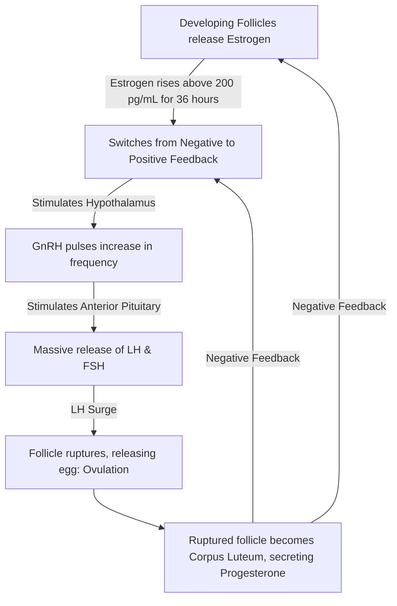
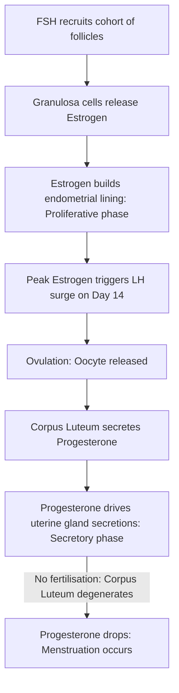

# Section 9: Reproductive Physiology

## Chapter 10: Menstrual Cycle & Reproductive Regulators

---

### 1. Introduction
Reproductive physiology describes the complex hormonal and structural changes that enable human reproduction. In females, these events are cyclic, preparing the ovaries for ovulation and the uterus for potential pregnancy every month. This rhythm is called the **Menstrual Cycle**.

### 2. Daily Life Analogy
Imagine a garden preparation cycle. During the first phase, gardeners build a greenhouse and plant seeds (Follicular phase in the ovary). To feed the soil, they add rich fertilizer to grow a thick carpet of grass (Proliferative phase in the uterus, driven by Estrogen). On the 14th day, a single flower bursts open to release seeds (Ovulation, triggered by LH). In the second phase, the empty seed pot turns into a heat lamp, releasing warmth to keep the grass thick, fluffy, and wet with nutrients (Luteal phase in the ovary, Secretory phase in the uterus, driven by Progesterone). If no seeds take root, the greenhouse heater turns off, and the grass carpet is swept away to reset the garden (Menstruation).

### 3. Basic Concept
- **Menstrual Cycle Duration**: Typically **28 days** (normal range: 21–35 days).
- **Ovarian Cycle**:
  1. *Follicular Phase (Days 1–14)*: Growth of ovarian follicles.
  2. *Ovulation (Day 14)*: Release of the oocyte.
  3. *Luteal Phase (Days 15–28)*: Conversion of the ruptured follicle into the **Corpus Luteum**.
- **Endometrial (Uterine) Cycle**:
  1. *Menstruation (Days 1–5)*: Shedding of the endometrial functional layer.
  2. *Proliferative Phase (Days 6–14)*: Estrogen-driven regrowth of the endometrium.
  3. *Secretory Phase (Days 15–28)*: Progesterone-driven development of uterine glands for implantation.

```text
    Hormonal Menstrual Cycle Coordination:
    Days: 1      5               14                       28
    Ovary: [ Follicular Phase ]  (*) Ovulation  [ Luteal Phase ]
    Uterus: [ Menses ] [ Proliferative ]     [ Secretory Phase ]
    Hormone:   Estrogen rises  ->  LH Surge  ->  Progesterone rises
```

### 4. Anatomy Review
- **Ovarian Follicle**: Consists of an oocyte surrounded by two cell layers:
  - *Theca Cells*: Outer layer. Respond to LH by producing androgens (androstenedione).
  - *Granulosa Cells*: Inner layer. Respond to FSH by expressing **Aromatase**, which converts theca-derived androgens into **Estrogen** (Estradiol).
- **Corpus Luteum**: Formed from granulosa and theca cells remaining after ovulation. It acts as a temporary endocrine gland, secreting high levels of **Progesterone** and Estrogen.

### 5. Physiology
Hormone dynamics across the menstrual cycle:
- **Estrogen**: Stimulates proliferative growth of the endometrium, thins cervical mucus (to aid sperm passage), and increases uterine contractility.
- **Progesterone**: Prepares the uterus for pregnancy by inducing secretory changes in the endometrium, thickens cervical mucus, and raises body temperature (~0.5°F).
- **Follicle-Stimulating Hormone (FSH)**: Recruits and stimulates growth of primary follicles.
- **Luteinizing Hormone (LH)**: Triggers ovulation and maintains the corpus luteum.

---

### 6. Mechanism

#### The Mid-Cycle LH Surge Feedback Loop
Unlike the normal negative feedback loops in the body, estrogen switches to **positive feedback** at mid-cycle to trigger ovulation:



---

### 7. Animation Summary
*Visualization focuses on:* The ovarian and endometrial cycles running in parallel, showing the LH surge triggering follicle rupture (ovulation) on day 14, followed by endometrial thickening.

### 8. 3D Model Guide
*Interactive viewer targets:* Female reproductive organs. Slicing the ovary displays follicles at varying developmental stages (primordial, primary, vesicular, Graafian, corpus luteum).

### 9. Flowchart



### 10. Clinical Correlation
- **Oral Contraceptive Pills (OCPs)**: Combine synthetic estrogen and progesterone. They maintain constant blood levels of these hormones, providing negative feedback that suppresses GnRH, FSH, and LH release. This prevents the mid-cycle LH surge and blocks ovulation.
- **Pregnancy Tests (hCG)**: If fertilization occurs, the blastocyst secretes **human Chorionic Gonadotropin (hCG)**. hCG mimics LH, preventing corpus luteum degeneration and maintaining progesterone production until the placenta takes over at 8–12 weeks.

### 11. Disorders
- **Polycystic Ovary Syndrome (PCOS)**: Caused by elevated LH/FSH ratios and insulin resistance, leading to androgen excess, anovulation, amenorrhea, hirsutism, and multiple small ovarian cysts.
- **Endometriosis**: The presence of functional endometrial tissue outside the uterine cavity (e.g. ovaries, peritoneum). This ectopic tissue undergoes cyclic bleeding, causing chronic pelvic pain, dysmenorrhea, and infertility.

### 12. Summary
- The menstrual cycle is divided into ovarian (follicular, luteal) and uterine (menstrual, proliferative, secretory) phases.
- Theca cells produce androgens under LH control; granulosa cells convert these to estrogen using aromatase under FSH control.
- Ovulation is triggered on day 14 by a positive feedback LH surge.
- If pregnancy does not occur, the corpus luteum degenerates, progesterone levels drop, and the endometrium is shed (menstruation).

### 13. Important Formulas
- **Hormone Levels in Pregnancy**:
  \[\text{hCG peak} \approx \text{Week 10 } (100,000 \text{ mIU/mL}). \text{ Placental progesterone output} \approx \text{Term } (250\text{ mg/day}).\]

### 14. Mnemonics
- **FOLkS have Men-Pro-Secs**:
  * Ovarian Phases: **F**ollicular, **O**vulation, **L**uteal
  * Endometrial Phases: **Men**strual, **Pro**liferative, **Sec**retory

### 15. Viva Questions
1. **Explain the two-cell, two-gonadotropin theory of ovarian steroidogenesis.**
   * *Answer*: LH stimulates *Theca cells* to synthesize cholesterol into androgens (androstenedione). These androgens diffuse across the basement membrane into *Granulosa cells*, where FSH stimulates the enzyme *aromatase* to convert the androgens into estrogen (estradiol).
2. **Why does body temperature rise after ovulation?**
   * *Answer*: After ovulation, the corpus luteum secretes progesterone. Progesterone acts on the preoptic area of the hypothalamus, shifting the thermoregulatory setpoint upward and raising basal body temperature by ~0.5°F.

### 16. MCQs
1. Which hormone surge is directly responsible for triggering ovulation on day 14 of the menstrual cycle?
   * A) Estrogen surge
   * B) Progesterone surge
   * C) LH surge
   * D) FSH surge
   * *Answer*: C

2. What is the source of progesterone production during the first 8 weeks of pregnancy?
   * A) Placenta
   * B) Corpus luteum
   * C) Adrenal cortex
   * D) Anterior pituitary
   * *Answer*: B *(The placenta takes over progesterone synthesis between weeks 8 and 12).*

### 17. Case-Based Learning
**Case**: A 26-year-old female presents with irregular periods, facial hair (hirsutism), and difficulty conceiving. Lab results reveal: LH: 18 mIU/mL (High), FSH: 5 mIU/mL (Low/Normal), Total Testosterone: 85 ng/dL (High). An ultrasound shows enlarged ovaries with multiple subcapsular follicles ("string of pearls").
- **Question**: What is the diagnosis, and what is the endocrine mechanism causing the elevated testosterone levels?
- **Analysis**: The patient has Polycystic Ovary Syndrome (PCOS). High LH levels stimulate the ovarian *theca cells* to produce excess androgens (testosterone). The low/normal FSH levels limit aromatase conversion in the *granulosa cells*, leaving free testosterone elevated in the blood. This prevents normal follicle maturation and ovulation, leading to amenorrhea and infertility.

### 18. Flashcards
- **Front**: What prevents the degeneration of the corpus luteum if fertilization occurs?
  **Back**: human Chorionic Gonadotropin (hCG) secreted by the syncytiotrophoblast.
- **Front**: Which cell layer surrounding the oocyte responds to LH?
  **Back**: Theca cells.

### 19. Revision Notes
Downloadable charts detailing endometrial layer changes, uterine gland structures, and estrogen/progesterone levels across the 28-day cycle.

### 20. Practice Quiz
Timed 15-question test on fertilization steps, placental hormone changes, and common menstrual disorders.
