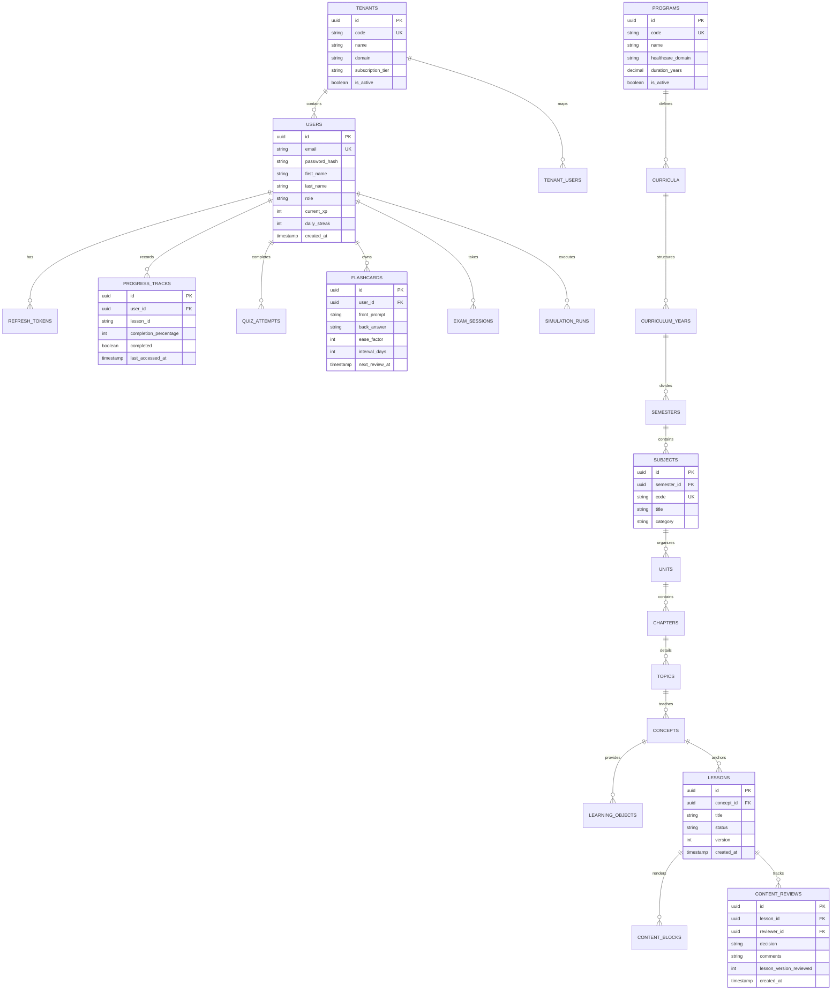

# Mediverse Database Schema Architecture & ERD
*PostgreSQL 16 Relational Schema with pgvector Embeddings & Flyway Migrations*

---

## 1. High-Level Entity Relationship Diagram (ERD)

---

## 2. Table Catalog & Partitioning Strategy

| Table Name | Description | Retention / Partitioning Plan |
|---|---|---|
| `users` | User identity, credentials, XP, and streaks | Unpartitioned |
| `tenants` | Multi-tenant medical colleges & institutions | Unpartitioned |
| `programs` / `curricula` | 9 healthcare domains & 16 degree structures | Reference data (cached in Redis) |
| `subjects` → `concepts` | 9-level hierarchical curriculum taxonomy | Reference data (cached in Redis, indexed in Elasticsearch) |
| `lessons` & `content_blocks` | CMS learning content & 3D models | Versioned via `content_reviews` |
| `progress_tracks` | Student topic completion history | High-volume: range partitioned by `created_at` yearly |
| `quiz_attempts` & `exam_sessions` | Assessment scoring logs | High-volume: range partitioned by `created_at` quarterly |
| `simulation_runs` | Clinical solver parameters & telemetry | High-volume: partitioned by `user_id` hash or quarterly date |
| `refresh_tokens` | Active JWT refresh token registry | Auto-purged via background cron on `expires_at` |
