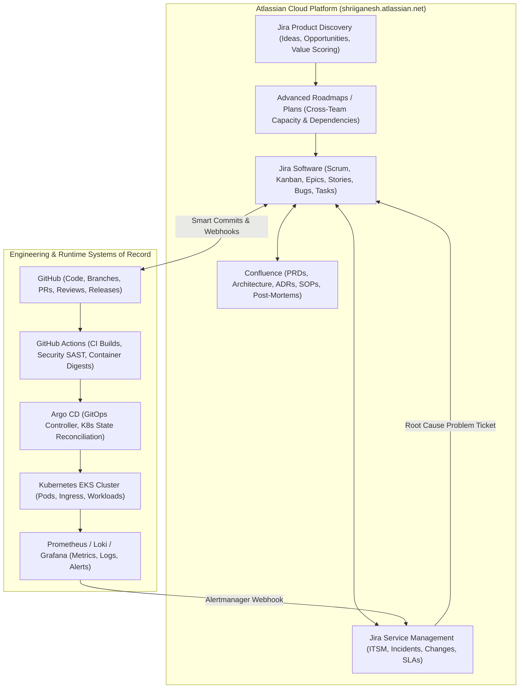
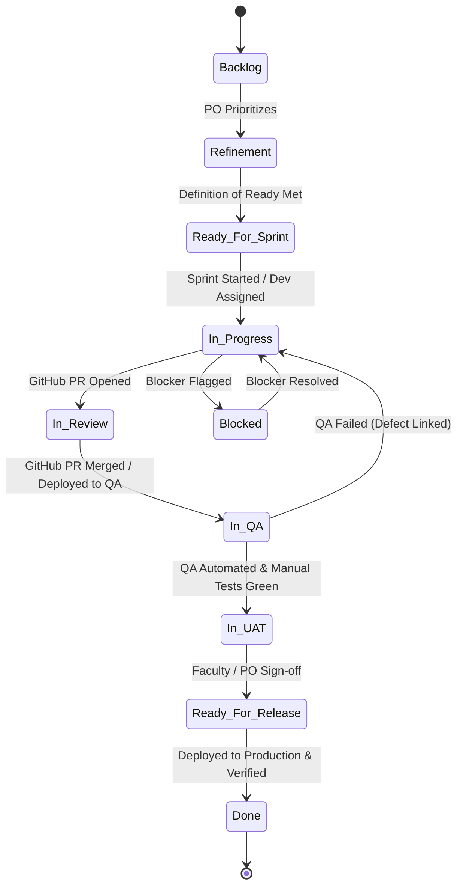
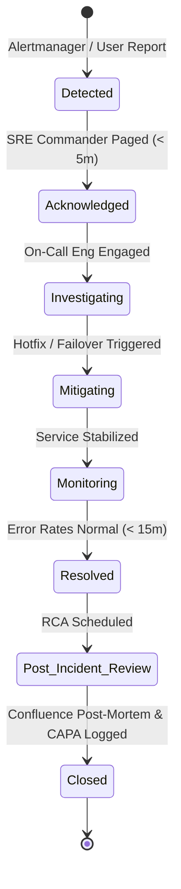
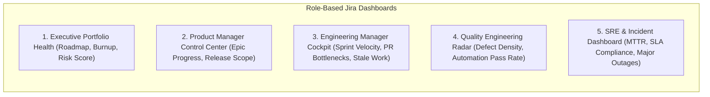

# Mediverse Enterprise Jira Operating Model & Delivery Control Plane

```text
Document ID:       MED-JIRA-2026-v1.0
Classification:    Enterprise Standard
Status:            APPROVED & PRODUCTION-READY
Target Instance:   shriiganesh.atlassian.net (Project: KAN / MED)
Repository:        https://github.com/shriganeshchoudhari/Mediverse-app
Authors:           Enterprise Jira Architect, DevSecOps Lead, Agile Delivery Lead
```

---

## 1. Executive Summary

This specification establishes the **Enterprise Jira Operating Model and Delivery Control Plane** for the **Mediverse** platform. Jira is not operated as an isolated ticketing tool; it functions as the **central work-management, delivery-control, and governance backbone** of the organization.

The architecture enforces a strict, bi-directional 18-step delivery chain:
$$\text{Business Strategy} \rightarrow \text{Portfolio} \rightarrow \text{Initiative} \rightarrow \text{Epic} \rightarrow \text{Story} \rightarrow \text{Task/Sub-task} \rightarrow \text{Git Branch} \rightarrow \text{Commit} \rightarrow \text{PR} \rightarrow \text{CI Build} \rightarrow \text{K8s Deploy} \rightarrow \text{QA Test} \rightarrow \text{Release} \rightarrow \text{Production} \rightarrow \text{Monitoring} \rightarrow \text{Incident} \rightarrow \text{Problem} \rightarrow \text{RCA / Improvement}$$

---

## 2. Target Jira Ecosystem & System of Record Ownership



### Authoritative System of Record (SoR) Matrix

| Domain / Artifact | Authoritative System of Record | Jira Integration Mechanism | Secondary Consumers |
|---|---|---|---|
| **Product Strategy & Ideas** | Jira Product Discovery | Native Jira Software Idea Linking | Leadership, Product Managers |
| **Work Units, Tasks & Sprints**| Jira Software | Native Boards & Backlogs | Developers, QA, Scrum Masters |
| **Living Documentation & ADRs**| Confluence | Jira Issue Macro, Page Links | Medical Faculty, Auditors, Devs |
| **Source Code & Code Review** | GitHub | Jira GitHub App (Smart Commits) | CI/CD, Security Scanners |
| **Builds & Image Digests** | GitHub Actions | Jira Deployments / Builds API | Release Managers, QA |
| **Declared Infrastructure State**| Argo CD | GitOps Manifest Tracking | DevOps, SRE |
| **ITSM Incidents & Changes** | Jira Service Management | Native Jira Software Issue Linking | Support, Incident Commanders |
| **Operational Metrics & Logs** | Prometheus / Grafana Loki | Alertmanager Webhook to JSM | SRE On-Call Engineers |

---

## 3. Project Structure & Naming Standard

Mediverse establishes **Company-Managed Projects** partitioned strictly around business capabilities and operational boundaries:

| Project Key | Project Name | Project Type | Primary Owner | DB / Domain Scope |
|---|---|---|---|---|
| **`MED`** | Mediverse Core Platform | Jira Software (Scrum) | Principal Architect / VP Eng | Multi-Domain Syllabi, Core APIs, 3D Engine |
| **`MED-AI`** | Mediverse AI & Simulations | Jira Software (Kanban) | AI / ML Lead | Socratic RAG, Voice AI, Prompt Safety |
| **`MED-QA`** | Quality Engineering | Jira Software (Kanban) | SDET Lead | Playwright E2E, k6 Load, Compliance Testing |
| **`MED-SEC`** | Security & Compliance | Jira Software (Kanban) | CISO / Security Lead | Vulnerability Remediation, SOC 2, HIPAA |
| **`MED-OPS`** | Cloud Platform & SRE | Jira Software (Kanban) | SRE Lead | Kubernetes EKS, Kafka, Multi-Region DR |
| **`MED-ITSM`**| Healthcare Operations & Support| Jira Service Management | Operations Director | Production Incidents, RFC Changes, Support |

---

## 4. Issue Type Architecture & Hierarchy

$$\text{Initiative (Parent Level 2)} \rightarrow \text{Epic (Parent Level 1)} \rightarrow \text{Standard Issues (Level 0)} \rightarrow \text{Sub-tasks (Level -1)}$$

| Issue Type | Level | Purpose | Required Fields | Workflow |
|---|:---:|---|---|---|
| **Initiative** | +2 | Multi-quarter strategic themes | Summary, Target Quarter, Business Value, Executive Sponsor | Strategic Review $\rightarrow$ Active $\rightarrow$ Delivered |
| **Epic** | +1 | Large deliverable spanning sprints | Summary, Description, Product Owner, Target Release, Acceptance Criteria | Backlog $\rightarrow$ In Progress $\rightarrow$ Closed |
| **Story** | 0 | User-centric feature deliverable | Summary, Description, Acceptance Criteria, Story Points, Component, FixVersion | Standard Delivery Workflow |
| **Task** | 0 | Technical or architectural chore | Summary, Description, Technical Owner, Component, Story Points | Standard Delivery Workflow |
| **Bug** | 0 | Functional regression or defect | Summary, Steps to Reproduce, Expected vs Actual, Severity, Environment, AffectsVersion | Defect Remediation Workflow |
| **Security Finding**| 0 | Vulnerability or CVE scan issue | Summary, CVSS Score, Asset/Service, Remediation SLA, Security Classification | Security Remediation Workflow |
| **Change Request**| 0 | Production RFC change | Summary, Risk Tier, Rollback Plan, Implementation Window, Approver | Change Management Workflow |
| **Incident** | 0 | Production service disruption | Summary, Affected Service, Severity (S1-S4), Detection Time, Incident Commander | Incident Response Workflow |
| **Sub-task** | -1 | Granular engineering work breakdown | Summary, Assignee, Original Estimate | Simple Task Workflow |

---

## 5. Workflow Architecture & Transition Rules

### 5.1 Standard Story / Task Delivery Workflow



- **Definition of Ready (DoR) Gate:** Story cannot transition to `Ready For Sprint` without Acceptance Criteria, Story Points estimate, and Security Classification.
- **Definition of Done (DoD) Gate:** Story cannot transition to `Done` without linked PR merged, unit test coverage $\ge 80\%$, QA sign-off, and production deployment tag.

### 5.2 Production Incident Workflow (JSM)



---

## 6. Automation Architecture Catalog

| Rule ID | Rule Name | Trigger | Condition | Action | Error Handling |
|---|---|---|---|---|---|
| **AUTO-01** | **Auto-Branch & In Progress** | GitHub branch created | Issue key in branch name (`feature/MED-123-...`) | Transition issue from `Backlog` to `In Progress` | Log to Audit |
| **AUTO-02** | **PR Opened $\rightarrow$ In Review** | GitHub PR opened | Issue in `In Progress` | Transition to `Code Review` & assign reviewer | Notify Dev Lead |
| **AUTO-03** | **PR Merged $\rightarrow$ In QA** | GitHub PR merged to `develop` | Build passed in GitHub Actions | Transition to `In QA` & link container digest | Alert in Slack `#qa-alerts` |
| **AUTO-04** | **Critical Defect Escalation**| Bug created with Priority `Highest` | Affects `Production` or `UAT` | Page On-Call via Opsgenie + send Slack alert | Escalate to VP Eng |
| **AUTO-05** | **SLA Breach Warning** | Incident Unresolved | 75% of Resolution SLA elapsed | Escalate priority + notify Incident Commander | SMS to On-Call |
| **AUTO-06** | **Release Auto-Close** | Jira Version released | All child issues in `Ready For Release` | Transition all issues to `Done` + trigger Confluence Release Notes | Notify PM |

---

## 7. Production JQL Catalog

```jql
-- 1. Active Sprint Blockers
project in (MED, MED-AI, MED-QA) AND Sprint in openSprints() AND (flagged is not EMPTY OR status = Blocked)

-- 2. Stale Work (No updates in > 5 days in active sprint)
project = MED AND Sprint in openSprints() AND status in ("In Progress", "In Review") AND updated < -5d

-- 3. High-Priority Escaped Defects
project = MED AND issuetype = Bug AND priority in (Highest, High) AND "Detection Phase" = Production

-- 4. Overdue Security Vulnerabilities breaching SLA
project = MED-SEC AND issuetype = "Security Finding" AND duedate < now() AND status != Closed

-- 5. Scope Creep (Issues added after sprint start)
project = MED AND Sprint in openSprints() AND issueFunction in addedAfterSprintStart()
```

---

## 8. Role-Based Dashboard Catalog



### Dashboard Configurations
1. **Executive Dashboard:** Portfolio Roadmap Gantt, High-Risk Items Table, Budget/Capacity burnup, Production Incident volume.
2. **PM Dashboard:** Epic progress meters, Release burndown, Feature velocity, Acceptance criteria readiness.
3. **Engineering Dashboard:** Sprint Burndown, Pull Request review queue, Cycle time distribution, Blocked issues widget.
4. **QA Dashboard:** Active bugs by severity, Defect reopen rate, Test execution progress, Flaky test registry.
5. **SRE Dashboard:** Active JSM incident stream, MTTR & MTTD gauge, Change Advisory Board (CAB) upcoming schedule.

---

## 9. Security & Access Control Model

| Project Role | Browse / Read | Create / Edit | Transition Issues | Approve Changes | Administer Project |
|---|:---:|:---:|:---:|:---:|:---:|
| **Executive / Stakeholder** | ✅ | ❌ | ❌ | ❌ | ❌ |
| **Product Owner / PM** | ✅ | ✅ | ✅ (To UAT/Release) | ✅ (Scope) | ❌ |
| **Software Engineer** | ✅ | ✅ | ✅ (To In Review) | ❌ | ❌ |
| **QA / SDET Engineer** | ✅ | ✅ (Bugs/Tests) | ✅ (To In QA/UAT) | ❌ | ❌ |
| **Change Advisory Board** | ✅ | ✅ | ✅ | ✅ (Production RFC) | ❌ |
| **Project Administrator** | ✅ | ✅ | ✅ | ✅ | ✅ (Project Level Only) |

---

## 10. Implementation Roadmap (Phases 1–10)

```text
Phase 1: Foundation (Weeks 1-2)       -> Projects, Issue Types, Standard Fields, Core Schemes
Phase 2: Agile Delivery (Weeks 3-4)   -> Scrum/Kanban Boards, Sprint Governance, Backlog Hygiene
Phase 3: Confluence Sync (Weeks 5)    -> Space Linking, PRD/ADR Blueprints, Page Properties
Phase 4: GitHub Integration (Weeks 6) -> Smart Commits, PR Webhooks, Branch Automation
Phase 5: QA Management (Weeks 7)      -> Defect Workflows, Playwright CI Test Reporting
Phase 6: DevOps & JSM (Weeks 8-9)     -> Incident & Change Management, Alertmanager Webhooks
Phase 7: Security Integration (Week 10)-> Vulnerability SLA Tracking, CVSS Custom Fields
Phase 8: Advanced Roadmaps (Week 11)  -> Cross-Team Dependencies, Capacity Forecasting
Phase 9: Jira Automation (Week 12)    -> 25 Auto-Transition Rules, Data Quality Audits
Phase 10: Governance & KPI (Ongoing)  -> Executive Dashboards, DORA Metrics, Continuous Review
```
