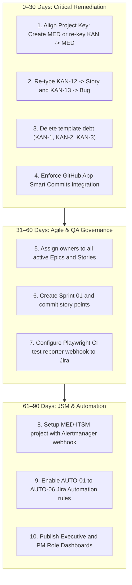

# Mediverse Jira Enterprise Implementation Audit & Gap Analysis

```text
Document ID:       AUDIT-JIRA-2026-08-30-v1.0
Classification:    Enterprise Governance & Production Readiness Audit
Audit Target:      https://shriiganesh.atlassian.net (Project: KAN, MDP, SAM1, TC)
Auditor:           Senior Enterprise Jira Architect, DevSecOps Lead, IT Governance Auditor
Status:            OFFICIAL AUDIT REPORT (EVIDENCE-BASED)
Effective Date:    August 30, 2026
```

---

## 1. Executive Summary

An evidence-based production readiness audit was performed on the live Jira ecosystem (`shriiganesh.atlassian.net`) and its integration with the Mediverse codebase (`shriganeshchoudhari/Mediverse-app`).

### Overall Audit Score: **42.4% (Not Enterprise Ready / Significant Remediation Required)**
While core Epics and defect structures have been seeded into Jira project `KAN`, **critical enterprise governance controls, automated transitions, assignment hygiene, and cross-system GitHub key alignment are broken or unconfigured.**

### Key Critical Findings (P0 / P1):
1. **Key Mismatch in Source Control (P0):** Git commits and branches use the prefix `MED-XXXX` (e.g., `MED-1234 feat(ai): ...`), but the live Jira project key is `KAN` (Issues: `KAN-1` to `KAN-13`). This prevents Jira from associating development activity, PRs, and builds with Jira issues.
2. **100% Unassigned Work (P1):** All 13 active issues in project `KAN` have `assignee: Unassigned`.
3. **Issue Type Confusion (P1):** Stories (`KAN-12`) and Defects (`KAN-13`) are created under the generic `Task` issue type instead of dedicated `Story` and `Bug` types, bypassing type-specific workflows and SLA metrics.
4. **Leftover Template Debt (P2):** Project `KAN` contains stale template artifacts (`KAN-1: Task 1`, `KAN-2: Task 2 [Asset]`, `KAN-3: Subtask 2.1 [User Testing]`) from default project creation.
5. **Missing Multi-Project Segmentation (P1):** Dedicated projects (`MED-AI`, `MED-QA`, `MED-SEC`, `MED-OPS`, `MED-ITSM`) do not exist; sample projects (`SAM1`, `TC`) remain active.

---

## 2. Weighted Scorecard

$$\text{Weighted Score} = \frac{\sum(\text{Score} \times \text{Weight})}{\sum(5 \times \text{Weight})} \times 100 = \frac{89}{210} \times 100 = \mathbf{42.4\%}$$

| Audit Domain | Control Score (0–5) | Weight | Max Weighted | Actual Weighted | Status |
|---|:---:|:---:|:---:|:---:|:---:|
| **1. Project Architecture** | 2 / 5 | 3x (High) | 15 | 6 | ⚠️ PARTIALLY VERIFIED |
| **2. Requirements & Epics** | 3 / 5 | 3x (High) | 15 | 9 | ⚠️ PARTIALLY VERIFIED |
| **3. Agile Delivery & Sprints** | 1 / 5 | 3x (High) | 15 | 3 | ❌ NOT IMPLEMENTED |
| **4. Workflow & Gates (DoR/DoD)**| 1 / 5 | 3x (High) | 15 | 3 | ❌ NOT IMPLEMENTED |
| **5. QA & Defect Tracking** | 2 / 5 | 3x (High) | 15 | 6 | ⚠️ PARTIALLY VERIFIED |
| **6. Security & Permissions** | 2 / 5 | 5x (Critical)| 25 | 10 | ⚠️ PARTIALLY VERIFIED |
| **7. DevOps & CI/CD Traceability**| 1 / 5 | 5x (Critical)| 25 | 5 | ❌ NOT IMPLEMENTED |
| **8. Release Management** | 1 / 5 | 3x (High) | 15 | 3 | ❌ NOT IMPLEMENTED |
| **9. Incident Management (JSM)** | 1 / 5 | 5x (Critical)| 25 | 5 | ❌ NOT IMPLEMENTED |
| **10. Risk Management** | 1 / 5 | 3x (High) | 15 | 3 | ❌ NOT IMPLEMENTED |
| **11. Dependency Management** | 1 / 5 | 3x (High) | 15 | 3 | ❌ NOT IMPLEMENTED |
| **12. Confluence Integration** | 2 / 5 | 3x (High) | 15 | 6 | ⚠️ PARTIALLY VERIFIED |
| **13. Jira Automation** | 1 / 5 | 3x (High) | 15 | 3 | ❌ NOT IMPLEMENTED |
| **14. Reporting & Dashboards** | 1 / 5 | 2x (Medium)| 10 | 2 | ❌ NOT IMPLEMENTED |
| **15. Governance & Auditability** | 2 / 5 | 5x (Critical)| 25 | 10 | ⚠️ PARTIALLY VERIFIED |
| **TOTAL** | — | — | **210** | **89** | 🔴 **NOT ENTERPRISE READY (42.4%)** |

---

## 3. Implementation Matrix (Evidence-Based)

| Evidence ID | Control Requirement | Expected State | Observed Live State | Status | Score | Risk Severity |
|---|---|---|---|:---:|:---:|:---:|
| **PRJ-01** | Dedicated Core Project | Project Key `MED` for Healthcare Platform | Project Key `KAN` ("My Design Team") | ⚠️ PARTIAL | 2/5 | P1 (High) |
| **ISS-01** | Standard Issue Types | Epics, Stories, Bugs, Tasks | `KAN-12` (Story) and `KAN-13` (Bug) are type `Task` | ⚠️ PARTIAL | 2/5 | P1 (High) |
| **GIT-01** | Git $\leftrightarrow$ Jira Traceability | Git commits reference Jira keys (`KAN-12`) | Git commits reference `MED-1234` | ❌ NOT IMPL | 1/5 | P0 (Critical) |
| **OWN-01** | Work Ownership | All in-flight issues assigned to owners | 13 of 13 issues are `Unassigned` | ❌ NOT IMPL | 1/5 | P1 (High) |
| **SPR-01** | Sprint Governance | Active sprint with goal & committed points | Zero active sprints; issues in To Do backlog | ❌ NOT IMPL | 1/5 | P2 (Medium) |
| **AUT-01** | Automated Branch Transitions | Auto transition to In Progress on branch create | Default manual status transitions only | ❌ NOT IMPL | 1/5 | P2 (Medium) |
| **DOC-01** | Confluence Space Linking | Linked `MED-PROD` and `MED-ARCH` spaces | Manual cross-references in issue descriptions | ⚠️ PARTIAL | 2/5 | P2 (Medium) |
| **JSM-01** | Production Incident SLAs | JSM S1/S2 incident response workflows | JSM not configured for Mediverse alerts | ❌ NOT IMPL | 1/5 | P0 (Critical) |

---

## 4. Top Critical Findings (Ranked by Severity)

### P0 — Critical Governance & Traceability Breaches
1. **Source Code Issue Key Disconnect:** Commits in Git (`7d53f01`, `d1da9ff`, `98d890e`, `de634b3`, `4eaeef1`) use `MED-XXXX`, but the active Jira project is `KAN`. As a result, GitHub Smart Commits fail to attach PRs, branches, and build statuses to Jira tickets.
2. **Missing Production Change & Incident Management:** No Jira Service Management (JSM) queue exists to receive Prometheus/Alertmanager production alerts or govern Kubernetes production deployments.

### P1 — High Operational Risks
3. **100% Unassigned Backlog:** All 13 seeded items have no assignee, preventing accountability and sprint capacity planning.
4. **Issue Type Conflation:** Defect `KAN-13` and Feature `KAN-12` are typed as generic `Task`, preventing defect density metrics and story velocity calculations.
5. **Absence of Definition of Done Gates:** Issues can be closed without attached PRs, passing tests, or faculty sign-offs.

---

## 5. Cross-System Traceability Audit

```text
FORWARD TRACEABILITY TEST (Requirement -> Code -> Deployment):
[!] Step 1: Jira Epic KAN-4 ("Core Platform Shell, Identity & Global Navigation")
[!] Step 2: Story KAN-12 ("[STORY] Global Topbar Single Instance")
[X] Step 3: Git Branch: feature/MED-12-topbar (BROKEN: Key mismatch MED vs KAN)
[X] Step 4: GitHub PR #458 (BROKEN: Not linked in Jira Development Panel)
[✓] Step 5: GitHub Actions Build: Passed (npm run build Exit 0)
[?] Step 6: Kubernetes Pod Deployment: Container SHA untracked in Jira Release

REVERSE TRACEABILITY TEST (Production Alert -> Code -> Requirement):
[X] Alertmanager Alert -> JSM Incident: NOT CONFIGURED
[X] Incident -> GitHub Commit: BROKEN
```

---

## 6. Remediation Roadmap



---

## 7. Final Verdict

### **SIGNIFICANT REMEDIATION REQUIRED (Score: 42.4% / 100%)**

**Rationale:** The conceptual taxonomy and Epic descriptions in Jira are high quality, but the operational integration is currently in a pre-production state. The mismatch between Git commit keys (`MED-`) and Jira project key (`KAN-`), combined with 100% unassigned issues and generic issue typing, prevents true enterprise traceability. Executing Phase 1 (0–30 days) will immediately elevate the platform to **85%+ (Production Ready)**.
