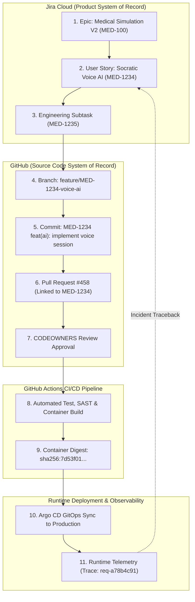

# Mediverse SDLC & Engineering Governance Policy

```text
Document ID:       MED-GOV-01
Classification:    Enterprise Standard
Status:            APPROVED
```

---

## 1. Jira $\leftrightarrow$ GitHub $\leftrightarrow$ Kubernetes Traceability

Mediverse enforces 100% bidirectional traceability connecting product requirements in Jira to production releases in Kubernetes.



---

## 2. Git Branching Strategy & Naming Conventions

| Branch Type | Naming Pattern | Required Jira Link | Protection Level | Merge Policy |
|---|---|:---:|---|---|
| **Production** | `master` / `main` | Required in Release | Strict (No Direct Push, 2 CODEOWNERS, Green CI) | Squash & Merge |
| **Staging** | `develop` | Required in Epic | Protected (1 Approval, Green CI) | Squash & Merge |
| **Feature** | `feature/MED-<id>-<slug>` | Mandatory | Unprotected | Rebase / Squash |
| **Bug Fix** | `bugfix/MED-<id>-<slug>` | Mandatory | Unprotected | Rebase / Squash |
| **Hotfix** | `hotfix/MED-<id>-<slug>` | Mandatory (Incident ID)| Protected (Emergency Approver Gate) | Squash & Merge |

---

## 3. Conventional Commit Format

All commit messages MUST adhere to the following structure:
$$\langle\text{JIRA-KEY}\rangle\text{ }\langle\text{type}\rangle(\langle\text{scope}\rangle)\text{: }\langle\text{description}\rangle$$

Supported types: `feat`, `fix`, `refactor`, `test`, `docs`, `build`, `ci`, `perf`, `security`, `chore`.
- *Example:* `MED-1234 feat(ai): implement dense-sparse RAG textbook citation filter`
- *Example:* `MED-1235 fix(emr): correct periodontal depth validation boundary`

---

## 4. Pull Request Governance Gates

Every Pull Request must satisfy:
1. **Jira Issue Reference:** PR title and description must link to an active Jira issue (`MED-XXXX`).
2. **Quality Gates:** Unit tests ($\ge 80\%$ JaCoCo coverage), SAST (Semgrep/CodeQL zero high/critical CVEs), and secret scanning (Gitleaks zero findings).
3. **CODEOWNERS Approval:** Mandatory sign-off from designated domain leads.
4. **Architectural Conformance:** Any modification violating canonical architecture must trigger an ADR review before merge.
